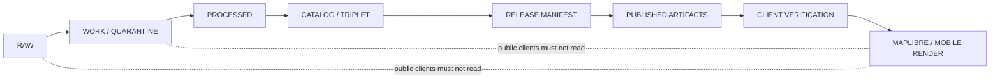
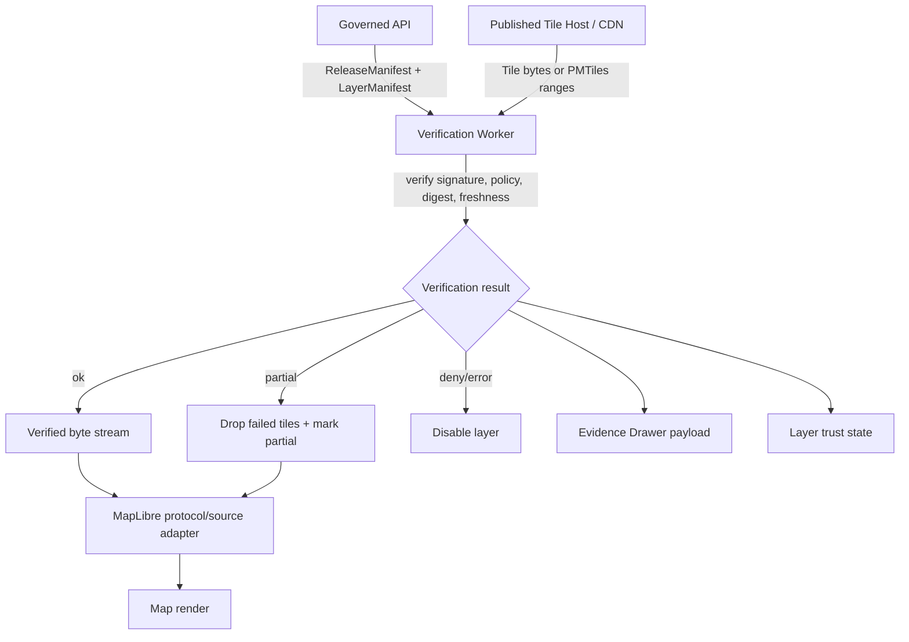
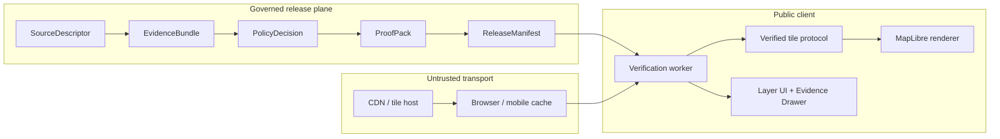
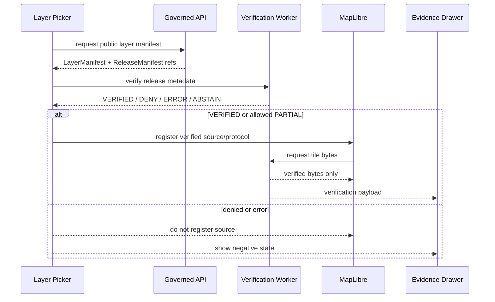
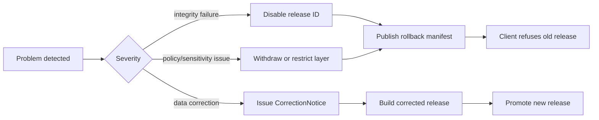

<!-- [KFM_META_BLOCK_V2]
doc_id: kfm://doc/TODO-verifiable-tile-rendering-mobile
title: Verifiable Tile Rendering (Mobile)
type: standard
version: v1
status: draft
owners: TODO: verify owner
created: TODO: verify created date
updated: 2026-04-30
policy_label: public
related: [docs/architecture/VERIFIABLE_TILE_RENDERING.md, apps/web/src/tiles, data/catalog, TODO: verify actual repo paths]
tags: [kfm, maplibre, mobile, tiles, verification, release-manifest, evidence-bundle, fail-closed]
notes: [GENERATED_THIS_RUN: expanded Markdown working edition, PROPOSED standard, NEEDS_VERIFICATION: owners dates repo paths DTOs schemas tests workflows key policy]
[/KFM_META_BLOCK_V2] -->

# Verifiable Tile Rendering (Mobile)

<p align="center">
  <strong>Fail-closed, evidence-bound tile rendering for KFM public clients.</strong>
</p>

<p align="center">
  
  
  
  
  
</p>

<p align="center">
  <a href="#purpose">Purpose</a> ·
  <a href="#status-and-evidence-basis">Status</a> ·
  <a href="#operating-law">Operating law</a> ·
  <a href="#architecture">Architecture</a> ·
  <a href="#contract-sketches">Contracts</a> ·
  <a href="#validation-plan">Validation</a> ·
  <a href="#definition-of-done">Done</a>
</p>

> [!IMPORTANT]
> This document is evidence-bounded. It is a **draft standard** and implementation plan, not proof that the target repository already contains these paths, contracts, tests, workflows, DTOs, keys, or runtime behavior. Treat every file path, interface, schema, worker, and workflow below as `PROPOSED` until verified from current repository evidence.

---

## Purpose

Define a mobile-friendly, governed tile-rendering pattern that lets KFM public clients display map tiles only after the relevant release artifact, digest index, or tile payload has passed integrity and authenticity checks.

The standard protects one simple rule:

> [!TIP]
> **The tile is not the truth.** The tile is a released rendering artifact downstream of source descriptors, evidence bundles, policy decisions, review state, catalog records, proof objects, and release manifests.

This document bridges:

| Surface | What this standard controls | What it does **not** control |
|---|---|---|
| MapLibre / mobile rendering | Whether released tile bytes may be rendered | Canonical truth, source authority, publication approval |
| PMTiles / MVT / delta artifacts | Integrity checks, digest references, release linkage | Raw data intake, evidence interpretation, review decisions |
| Evidence Drawer | User-visible verification status and limitations | Final source adjudication or policy override |
| Governed API | Safe delivery of release and verification metadata | Direct RAW / WORK / QUARANTINE access |
| Focus Mode / AI | May explain released evidence posture after resolution | Direct model output as proof |

---

## Status and evidence basis

| Field | Value |
|---|---|
| Document status | `draft` |
| Implementation status | `PROPOSED` |
| Evidence mode | `CORPUS_ONLY / NO_LOCAL_REPO_EVIDENCE` for implementation behavior |
| Repo fit | `PROPOSED`; verify actual paths before commit |
| Public posture | Public-safe metadata only; no RAW / WORK / QUARANTINE access |
| Primary audience | KFM web/mobile engineers, map-surface maintainers, release engineers, policy reviewers |
| Acceptance posture | Valid only after repository-path, schema-home, key-management, and test evidence are verified |

### Truth-label summary

| Label | Meaning here |
|---|---|
| `CONFIRMED` | Verified from the uploaded Markdown, project guidance, or current workspace command evidence. |
| `PROPOSED` | A design, contract, file path, workflow, or implementation sketch not verified as present in the repo. |
| `INFERRED` | Bounded alignment with KFM doctrine where direct implementation evidence is absent. |
| `UNKNOWN` | Not resolvable from this session without the mounted repo, tests, workflows, logs, or runtime traces. |
| `NEEDS_VERIFICATION` | Checkable before implementation, release, or publication. |

### Current evidence boundary

`CONFIRMED`: this Markdown is an expanded working edition of the uploaded draft. The local `/mnt/data` workspace is not a mounted Git repository, so no current branch, package manager, file presence, route behavior, workflow run, deployment posture, or runtime behavior is claimed here.

`PROPOSED`: the design below is written so it can become a repo-ready standard after maintainers verify the actual KFM repo conventions.

---

## Scope

This standard covers tile-rendering trust for public and semi-public KFM clients.

### Included

- Verification of signed release metadata before layer registration.
- Verification of released tile bytes, digest indexes, or packaged artifacts before rendering.
- Mobile-aware worker boundaries for expensive crypto and hashing work.
- Trust-state propagation into the layer panel, map status, Evidence Drawer, and Focus Mode payloads.
- Failure, rollback, correction, and stale-release behavior for tile layers.
- Negative-path tests for missing, mismatched, stale, unsigned, or policy-blocked artifacts.

### Excluded

- RAW, WORK, QUARANTINE, or unpublished candidate data access.
- Source intake, source-rights adjudication, or policy approval before release.
- Canonical storage design.
- Direct model-runtime access from the client.
- Emergency alerting, life-safety claims, or authoritative regulatory decisions.
- Exact sensitive-location release decisions for archaeology, rare species, private land, critical infrastructure, or cultural resources.

---

## Operating law

The renderer is downstream of trust. It must never become the source of truth.



### Non-negotiable rules

| Rule | Requirement |
|---|---|
| Renderer boundary | The renderer displays verified released artifacts only; it does not assert truth. |
| Evidence boundary | Layer claims resolve through `EvidenceRef -> EvidenceBundle` where claim significance requires it. |
| Publication boundary | Tiles originate from released or published artifacts, not candidate data. |
| Fail-closed behavior | Failed verification disables or drops the tile; no unverified fallback is allowed. |
| Public-safe access | Public clients must not read RAW, WORK, QUARANTINE, canonical/internal stores, or direct model output. |
| Distinct objects | Receipts, proof packs, catalog records, release manifests, review records, corrections, and rollback references remain distinct. |
| Negative states | `ABSTAIN`, `DENY`, and `ERROR` are valid outcomes and must be visible where relevant. |

---

## Design decision

**Recommended pattern:** verify release metadata before registering a layer, then verify either the packaged artifact or each loose tile before rendering.

| Mode | Best use | Verification unit | Mobile posture |
|---|---|---|---|
| `release-artifact` | PMTiles or immutable bundle | Whole artifact digest + signed `ReleaseManifest` | Preferred when artifact size and cache policy are acceptable. |
| `per-tile` | Loose MVT/PNG/JPEG/terrain tile endpoints | Each tile digest against a signed `TileDigestIndex` | Use bounded concurrency; more CPU/network overhead. |
| `delta` | Recent updates layered over immutable base | Signed delta manifest + per-delta digest | Use only after delta pipeline is verified. |

> [!NOTE]
> A client-side verification layer is **defense in depth**, not a substitute for backend promotion, release signing, policy checks, review state, and catalog closure.

---

## Architecture

### High-level flow



### Trust boundary diagram



### Component map

| Component | Role | Trust posture |
|---|---|---|
| `LayerManifest` | Public-safe layer metadata, style/source linkage, policy label, release ID | `PROPOSED`; must be released by governed API. |
| `ReleaseManifest` | Signed release assembly record and digest root | `PROPOSED`; required before rendering. |
| `TileDigestIndex` | Digest map for loose tiles or chunks | `PROPOSED`; required for per-tile mode. |
| `VerificationWorker` | Off-main-thread signature, digest, freshness, and policy-result checks | `PROPOSED`; returns finite outcomes only. |
| `VerifiedTileProtocol` | MapLibre protocol/source adapter that returns only verified bytes | `PROPOSED`; never performs publication approval. |
| `VerificationStateStore` | Layer-level verified / partial / disabled / stale / error state | `PROPOSED`; feeds UI and telemetry. |
| `EvidenceDrawerPayload` | Human-readable trust, evidence, release, and limitation summary | `PROPOSED`; must not expose sensitive internals. |
| `ValidationReport` | Build/test evidence for manifest and client verification paths | `PROPOSED`; needed before release. |
| `RollbackPlan` | How to disable or revert a bad release artifact | `PROPOSED`; required for promoted release. |

---

## Verification model

### Layer admission sequence

1. Request a public-safe `LayerManifest` from the governed API.
2. Reject the layer if policy label, release state, or review state is missing or unsafe.
3. Fetch the referenced `ReleaseManifest` and signed envelope.
4. Verify signature using an approved key identifier and algorithm.
5. Verify manifest freshness, expiration, release ID, and expected artifact references.
6. Verify artifact digest or per-tile digest index.
7. Register the MapLibre source/protocol only after the verification gate returns `ok`.
8. Emit a public-safe verification state for UI and Evidence Drawer.

### Finite outcomes

| Outcome | Meaning | Render behavior | UI behavior |
|---|---|---|---|
| `VERIFIED` | Release metadata and requested tile/artifact passed checks | Render | Show verified state and release link. |
| `PARTIAL` | Some tiles verified and some failed or were unavailable | Render verified subset only, where safe | Show partial state and dropped-tile count. |
| `STALE` | Release is valid but outside freshness policy | Default deny unless layer policy allows stale contextual display | Show stale warning and limitations. |
| `DENY` | Policy, sensitivity, rights, review, or release state blocks rendering | Do not render | Show disabled state and reason category. |
| `ERROR` | Technical failure prevents reliable verification | Do not render unless existing cached verified bytes remain valid | Show error state; no fallback to unverified bytes. |
| `ABSTAIN` | Evidence or manifest linkage is insufficient | Do not render consequential layer | Show unresolved evidence state. |

### Failure modes

| Scenario | Required behavior | Notes |
|---|---|---|
| Invalid signature | Disable layer | Do not attempt unsigned fallback. |
| Unknown `key_id` | Disable layer | Key registry must be verified before deployment. |
| Digest mismatch | Drop tile or disable artifact | Treat as corruption or tampering. |
| Missing manifest entry | Drop tile | Missing is not equivalent to verified. |
| Expired release | Disable or mark stale per policy | Never silently refresh from ungoverned source. |
| Network failure | Bounded retry, then `ERROR` | No unverified fallback. |
| Policy label missing | `DENY` | Fail closed. |
| Evidence reference unresolved | `ABSTAIN` or `DENY` | Depends on layer significance. |
| Cached tile without matching release | Do not render | Cache must be keyed to release/spec digest. |
| Direct model-generated tile | `DENY` | Model output is not proof. |

---

## Contract sketches

> [!CAUTION]
> These contracts are illustrative and `PROPOSED`. Verify schema home, naming, field requirements, and versioning against the actual KFM repository before creating files.

### `VerifiableTileReleaseManifest` sketch

```json
{
  "manifest_version": "kfm.tile.release.v1",
  "release_id": "TODO: release id",
  "layer_id": "TODO: layer id",
  "issued_at": "2026-04-30T00:00:00Z",
  "expires_at": "TODO: optional freshness horizon",
  "policy_label": "public",
  "review_state": "reviewed",
  "artifact_mode": "release-artifact",
  "artifacts": [
    {
      "artifact_id": "TODO: artifact id",
      "uri": "TODO: governed public artifact URI",
      "media_type": "application/vnd.pmtiles",
      "digest": "sha256:TODO",
      "byte_size": 0,
      "spec_hash": "sha256:TODO"
    }
  ],
  "evidence": {
    "evidence_bundle_refs": ["kfm://evidence-bundle/TODO"],
    "catalog_record_refs": ["kfm://catalog/TODO"],
    "proof_pack_ref": "kfm://proof-pack/TODO"
  },
  "correction": {
    "correction_lineage_ref": null,
    "rollback_plan_ref": "kfm://rollback/TODO"
  },
  "attestation": {
    "envelope_type": "TODO: DSSE or repository-approved envelope",
    "key_id": "TODO: key id",
    "signature_ref": "TODO: signature or bundle URI"
  }
}
```

### `TileDigestIndex` sketch

```json
{
  "index_version": "kfm.tile.digest_index.v1",
  "release_id": "TODO: release id",
  "layer_id": "TODO: layer id",
  "tile_scheme": "zxy",
  "digest_algorithm": "sha256",
  "tiles": {
    "10/312/421": {
      "url": "TODO: immutable or versioned tile URL",
      "digest": "sha256:TODO",
      "byte_size": 0,
      "media_type": "application/vnd.mapbox-vector-tile"
    }
  }
}
```

### `EvidenceDrawerTileVerificationPayload` sketch

```json
{
  "payload_version": "kfm.evidence_drawer.tile_verification.v1",
  "layer_id": "TODO: layer id",
  "release_id": "TODO: release id",
  "verification_state": "VERIFIED",
  "verified_at": "2026-04-30T00:00:00Z",
  "policy_label": "public",
  "source_descriptors": ["kfm://source/TODO"],
  "evidence_bundle_refs": ["kfm://evidence-bundle/TODO"],
  "catalog_record_refs": ["kfm://catalog/TODO"],
  "proof_pack_ref": "kfm://proof-pack/TODO",
  "digest_summary": {
    "mode": "release-artifact",
    "algorithm": "sha256",
    "artifact_digest": "sha256:TODO",
    "tile_failures": 0
  },
  "limitations": [
    "TODO: public-safe limitation text"
  ],
  "negative_state_reason": null
}
```

### `VerificationEvent` sketch

```json
{
  "event_version": "kfm.tile.verification_event.v1",
  "event_type": "tile_verified",
  "layer_id": "TODO: layer id",
  "release_id": "TODO: release id",
  "tile_id": "10/312/421",
  "outcome": "VERIFIED",
  "reason": null,
  "checked_at": "2026-04-30T00:00:00Z",
  "manifest_digest": "sha256:TODO",
  "artifact_or_tile_digest": "sha256:TODO"
}
```

---

## Implementation sketch

> [!WARNING]
> The code below is illustrative TypeScript-style pseudocode. It is not a drop-in worker and does not prove current repository behavior. Production code must use the repository-approved signing envelope, canonicalization method, schema validator, key registry, logging policy, and MapLibre adapter conventions.

### Digest normalization

```ts
type Digest = `sha256:${string}`;

function normalizeSha256Digest(hexOrPrefixed: string): Digest {
  const value = hexOrPrefixed.startsWith("sha256:")
    ? hexOrPrefixed.slice("sha256:".length)
    : hexOrPrefixed;

  if (!/^[a-f0-9]{64}$/i.test(value)) {
    throw new Error("invalid_sha256_digest_format");
  }

  return `sha256:${value.toLowerCase()}`;
}

async function sha256Digest(buffer: ArrayBuffer): Promise<Digest> {
  const digest = await crypto.subtle.digest("SHA-256", buffer);
  const hex = [...new Uint8Array(digest)]
    .map((byte) => byte.toString(16).padStart(2, "0"))
    .join("");

  return `sha256:${hex}`;
}
```

### Safer signed-payload posture

```ts
/**
 * PROPOSED rule:
 * Verify the exact signed bytes from an envelope, not a re-serialized JS object.
 * JSON.stringify() is not a canonical signing strategy unless the project explicitly
 * defines that exact serialization as the signed payload.
 */
type SignedEnvelope = {
  envelopeType: "TODO_DSSE_OR_APPROVED_ENVELOPE";
  payloadBase64: string;
  signatureBase64: string;
  keyId: string;
  algorithm: "ECDSA_P256_SHA256" | "TODO_APPROVED_ALG";
};
```

### Worker message model

```ts
type VerifyTilesRequest = {
  type: "verify_tiles";
  layerId: string;
  releaseId: string;
  manifestUrl: string;
  signedEnvelopeUrl: string;
  requestedTiles: Array<{
    tileId: `${number}/${number}/${number}`;
    url: string;
    expectedDigest: Digest;
    mediaType: string;
  }>;
};

type VerifiedTileResult =
  | {
      tileId: string;
      outcome: "VERIFIED";
      buffer: ArrayBuffer;
      digest: Digest;
    }
  | {
      tileId: string;
      outcome: "DENY" | "ERROR" | "ABSTAIN";
      reason: string;
    };

type VerifyTilesResponse = {
  type: "verified_tiles";
  layerId: string;
  releaseId: string;
  outcome: "VERIFIED" | "PARTIAL" | "DENY" | "ERROR" | "ABSTAIN";
  results: VerifiedTileResult[];
};
```

### Worker flow

```ts
async function verifyTileBytes(tile: {
  tileId: string;
  url: string;
  expectedDigest: Digest;
}): Promise<VerifiedTileResult> {
  try {
    const response = await fetch(tile.url, {
      cache: "force-cache",
      credentials: "omit"
    });

    if (!response.ok) {
      return { tileId: tile.tileId, outcome: "ERROR", reason: "tile_fetch_failed" };
    }

    const buffer = await response.arrayBuffer();
    const actualDigest = await sha256Digest(buffer);

    if (actualDigest !== normalizeSha256Digest(tile.expectedDigest)) {
      return { tileId: tile.tileId, outcome: "DENY", reason: "tile_digest_mismatch" };
    }

    return {
      tileId: tile.tileId,
      outcome: "VERIFIED",
      buffer,
      digest: actualDigest
    };
  } catch {
    return { tileId: tile.tileId, outcome: "ERROR", reason: "tile_verification_error" };
  }
}
```

---

## MapLibre integration

### Proposed runtime boundary



### Proposed adapter rules

| Rule | Rationale |
|---|---|
| Register the MapLibre source only after release-level verification succeeds. | Prevents initial paint from unverified artifacts. |
| Return tile bytes to MapLibre only after digest validation. | Prevents corrupt or substituted tiles from rendering. |
| Cache by `release_id + spec_hash + digest`, not by URL alone. | Prevents stale/replayed tiles from appearing valid. |
| Do not expose private keys or signing secrets in the client. | Client verifies with public keys only. |
| Keep layer trust state outside the renderer. | Renderer state is presentation state, not governance state. |
| Surface dropped-tile count and reason category. | Users and reviewers can see partial trust states. |

### Trust indicators

| Indicator | State | Meaning |
|---|---|---|
| ✅ Verified | `VERIFIED` | Release and requested artifact/tile bytes passed checks. |
| ◐ Partial | `PARTIAL` | Some tiles were dropped; verified subset may render if policy allows. |
| ⚠️ Stale | `STALE` | Release is valid but outside freshness policy or nearing expiry. |
| ⛔ Disabled | `DENY` | Policy, rights, sensitivity, review, release, or integrity blocks rendering. |
| ⓘ Unresolved | `ABSTAIN` | Evidence or release linkage is insufficient. |
| ❌ Error | `ERROR` | Technical failure prevents reliable verification. |

---

## Evidence Drawer behavior

The Evidence Drawer should explain why a layer is visible, partial, stale, or disabled without leaking internal-only evidence or sensitive details.

### Minimum drawer content

| Field | Required? | Notes |
|---|---:|---|
| Layer name / ID | Yes | Public-safe display label and stable ID. |
| Release ID | Yes | Link or reference to released manifest where allowed. |
| Verification state | Yes | Finite outcome, not free text only. |
| Policy label | Yes | Public, restricted, contextual, or TODO-confirmed label. |
| Source descriptors | Yes | Public-safe names or references. |
| EvidenceBundle refs | Conditional | Required for consequential claims; summarize if details are restricted. |
| Digest / signature summary | Yes | Digest algorithm, manifest digest, key ID if public-safe. |
| Limitations | Yes | Include stale, partial, generalized, or derived-layer caveats. |
| Correction / rollback link | Conditional | Required when a release has been corrected or withdrawn. |

### Negative-state copy pattern

```md
> This layer is disabled because KFM could not verify the signed release manifest.
> No unverified fallback tile was rendered. Check the release manifest, key registry,
> digest index, and rollback plan before re-enabling this layer.
```

---

## Mobile constraints

| Constraint | Target | Notes |
|---|---:|---|
| Workers | 1–2 | Keep crypto/hashing off the main thread. |
| Concurrent fetches | 4–8 | Tune by device class and network conditions. |
| Tile cache | Bounded | Key by release/spec/digest; evict aggressively on release change. |
| Main-thread work | Minimal | Main thread handles state/UI, not trust decisions. |
| Startup latency | Measured | Prefer artifact-level verification where it reduces per-tile overhead. |
| Offline behavior | Conservative | Render only cached bytes whose release and digest remain valid. |

> [!NOTE]
> Mobile clients may not be able to hash large artifacts repeatedly. Prefer a release-level manifest check plus cache discipline for immutable bundles, and reserve per-tile checks for loose tile endpoints or sensitive delta flows.

---

## Security and key-management notes

| Topic | Draft requirement | Status |
|---|---|---|
| Signing envelope | Use a repository-approved signed envelope; verify exact signed bytes. | `NEEDS_VERIFICATION` |
| Public keys | Store only public verification keys in client-accessible config. | `PROPOSED` |
| Private keys | Never place private signing keys in client code, repo docs, fixtures, or logs. | `REQUIRED` |
| Key rotation | Support `key_id`, validity windows, revocation, and old-release verification policy. | `NEEDS_VERIFICATION` |
| Replay resistance | Verify release ID, issued time, expiration/freshness, and manifest digest. | `PROPOSED` |
| CORS / hosting | Tile host must support required fetch/range behavior without credentials leakage. | `NEEDS_VERIFICATION` |
| Telemetry | Emit public-safe reason categories only; do not log sensitive source internals. | `PROPOSED` |
| Compromised client | Client verification cannot protect against a malicious client runtime. | `KNOWN LIMITATION` |

---

## Policy, rights, and sensitivity

Tile verification proves integrity and authenticity of released artifacts. It does **not** prove that the release was safe, legal, sensitive-location-safe, or policy-approved. Those gates must happen before publication.

| Risk | Fail-closed rule |
|---|---|
| Unknown rights or license | Do not publish or render public layer. |
| Unknown source role | Do not use layer for authoritative claims. |
| Sensitive exact geometry | Deny public exact rendering; require redaction/generalization receipt. |
| Missing review state | Do not publish or render consequential layer. |
| Missing release state | Do not register layer. |
| Unresolved correction lineage | Show warning or disable until corrected release is resolved. |
| Direct model-generated geometry | Deny as proof; require evidence-bound release path. |

---

## Proposed file placement

> [!CAUTION]
> These paths are proposed because the current repo tree was not mounted. Verify actual KFM conventions before creating or moving files.

```text
docs/architecture/
  VERIFIABLE_TILE_RENDERING.md

schemas/contracts/v1/tiles/
  verifiable_tile_release_manifest.schema.json
  tile_digest_index.schema.json
  tile_verification_event.schema.json
  evidence_drawer_tile_verification_payload.schema.json

apps/web/src/tiles/
  verifiedTileProtocol.ts
  tileVerificationWorker.ts
  digest.ts
  manifestVerification.ts
  verificationState.ts

apps/web/src/components/evidence/
  TileVerificationDrawerPanel.tsx

tests/fixtures/tiles/
  valid_release_manifest.json
  invalid_signature_release_manifest.json
  digest_mismatch_tile_index.json
  stale_release_manifest.json
  policy_denied_layer_manifest.json

tests/tiles/
  verifyTileReleaseManifest.test.ts
  verifyTileDigestIndex.test.ts
  verifiedTileProtocol.negative.test.ts

policy/tiles/
  tile_release_public.rego
  tile_release_public_test.rego
```

---

## Validation plan

### Validator targets

| Validator | Required checks | Negative fixtures |
|---|---|---|
| `validate_layer_manifest` | policy label, release ref, style/source refs, public-safe fields | missing release, missing policy, private path |
| `validate_release_manifest` | schema, release ID, artifact digest, source/evidence refs, rollback ref | missing EvidenceBundle, missing rollback, bad digest format |
| `verify_release_signature` | envelope, key ID, signature, canonical payload | invalid signature, unknown key, reserialized payload mismatch |
| `verify_tile_digest_index` | z/x/y keys, digest format, URL immutability/versioning | missing tile, bad digest, unversioned URL |
| `verify_client_fail_closed` | no fallback render on failure | invalid signature renders, network error renders |
| `validate_evidence_drawer_payload` | finite state, release ID, limitation text | free-text-only state, hidden denial reason |

### Test matrix

| Test | Expected result |
|---|---|
| Valid manifest + valid signature + matching digest | `VERIFIED`; layer can register. |
| Valid manifest + digest mismatch | `DENY`; tile/artifact does not render. |
| Invalid signature | `DENY`; layer disabled. |
| Unknown key ID | `DENY`; layer disabled. |
| Missing digest entry | `ABSTAIN` or `DENY`; tile does not render. |
| Expired manifest | `STALE` or `DENY` according to policy; no silent render. |
| Network failure | bounded retry then `ERROR`; no unverified fallback. |
| Missing EvidenceBundle ref for consequential layer | `ABSTAIN`; drawer explains unresolved evidence. |
| Public layer references RAW/WORK/QUARANTINE path | `DENY`; validation fails. |
| Direct model output as tile source | `DENY`; validation fails. |

### Manual review checklist

- [ ] Metadata block placeholders are still visible and reviewable.
- [ ] No fake owner, route, workflow, test, CI, release, or deployment claim is present.
- [ ] Layer claims are separated from rendering artifacts.
- [ ] Failure states are visible in UI and drawer payloads.
- [ ] Sensitive and rights-uncertain layers fail closed.
- [ ] Rollback and correction references exist before promotion.
- [ ] All examples are clearly labeled as illustrative or proposed.

---

## Rollback and correction path

A bad tile release should be reversible without rewriting history or silently replacing truth.



| Trigger | Required action |
|---|---|
| Signature/key compromise | Revoke key, disable affected releases, publish rollback notice. |
| Digest mismatch after release | Disable release artifact, investigate build/transport, emit correction/rollback record. |
| Sensitive geometry exposure | Withdraw layer, replace with generalized/redacted artifact, record redaction receipt. |
| Source rights correction | Restrict or withdraw affected artifact until rights are resolved. |
| Evidence correction | Publish `CorrectionNotice`, rebuild downstream artifacts, update release manifest. |

---

## Definition of done

A first implementation slice is done only when the repository can show current evidence for the following:

- [ ] Actual doc path is verified and this standard is committed in the repo’s documentation convention.
- [ ] Schema home is resolved and contract sketches are converted to validated schemas.
- [ ] Worker or protocol adapter exists and is covered by positive and negative tests.
- [ ] Signed release manifest verification is implemented with an approved canonical payload strategy.
- [ ] Digest validation is enforced for the chosen artifact mode.
- [ ] No invalid, stale, unsigned, missing, or mismatched tile renders through fallback behavior.
- [ ] Public clients cannot access RAW / WORK / QUARANTINE / unpublished candidate paths.
- [ ] Evidence Drawer shows verification state, release ID, source/evidence refs, limitations, and negative states.
- [ ] Policy-denied and evidence-unresolved states are visible as `DENY` or `ABSTAIN`.
- [ ] Rollback/correction behavior is tested with at least one fixture.
- [ ] Mobile performance is measured on representative devices or emulators.
- [ ] Key rotation and revocation behavior is documented or explicitly blocked as a pre-release gap.

---

## Open questions

| Question | Status | Why it matters |
|---|---|---|
| What is the canonical schema home for tile verification objects? | `NEEDS_VERIFICATION` | Prevents contracts/schemas drift. |
| Which signing envelope is approved for KFM release manifests? | `NEEDS_VERIFICATION` | Determines verification implementation. |
| Is client-side signature verification required, or is backend verification plus client digest enough for first slice? | `OPEN` | Affects mobile cost and security model. |
| How are key rotation, revocation, and expired manifests represented? | `NEEDS_VERIFICATION` | Prevents stale/replayed release trust. |
| How does the MapLibre source/protocol adapter integrate with existing app code? | `UNKNOWN` | Repo not mounted. |
| Are PMTiles artifacts verified as whole bundles, chunk ranges, or derived tile bytes? | `OPEN` | Different performance and integrity tradeoffs. |
| What telemetry is allowed for failed tile checks? | `NEEDS_VERIFICATION` | Avoids leaking sensitive context. |
| Which layers require EvidenceBundle resolution before rendering vs before claims/popups? | `OPEN` | Some basemap-like layers may have different burden than claim-bearing overlays. |

---

## Change log for this working edition

| Area | Original draft | Expanded edition |
|---|---|---|
| Metadata | Draft meta block with TODOs | Preserved meta block and made placeholders explicit. |
| Status | Basic PROPOSED / INFERRED table | Added evidence mode, repo boundary, and truth-label split. |
| Architecture | Single worker diagram | Added lifecycle, trust-boundary, and sequence diagrams. |
| Verification | Signature + digest concept | Added artifact modes, finite outcomes, stale/deny/error states. |
| Contracts | Minimal manifest/index examples | Added release manifest, digest index, drawer payload, event sketches. |
| Implementation | Simple JS worker | Reframed as pseudocode with canonical-payload caution and digest normalization. |
| UI | Evidence Drawer inferred | Added required fields, trust indicators, and negative-state copy. |
| Security | Basic identity/integrity table | Added key rotation, replay, cache, CORS, and compromised-client limits. |
| Validation | Short DoD list | Added validator targets, test matrix, rollback, and release gates. |

---

<details>
<summary>Appendix A — Example layer denial payload</summary>

```json
{
  "payload_version": "kfm.evidence_drawer.tile_verification.v1",
  "layer_id": "kfm.layer.example",
  "release_id": "kfm.release.example",
  "verification_state": "DENY",
  "negative_state_reason": "invalid_release_signature",
  "public_message": "This layer is disabled because the signed release manifest could not be verified.",
  "render_allowed": false,
  "fallback_allowed": false,
  "next_actions": [
    "Verify release manifest signature and key_id.",
    "Check rollback plan for the affected release.",
    "Do not render unverified tiles."
  ]
}
```

</details>

<details>
<summary>Appendix B — Review questions for maintainers</summary>

- Which repo path should own this standard?
- Does KFM already have a `LayerManifest`, `ReleaseManifest`, `ProofPack`, or `EvidenceDrawerPayload` schema that should be extended instead of creating new tile-specific objects?
- Which renderer integration pattern is already used: custom protocol, PMTiles protocol, standard tile source URL, or backend proxy?
- Which signing system is approved for releases?
- Which layers are safe for artifact-level verification only, and which require per-tile verification?
- What cache invalidation policy is required when a `CorrectionNotice` or rollback is published?
- Which public-safe telemetry fields may be emitted from mobile clients?

</details>

---

[↑ Back to top](#verifiable-tile-rendering-mobile)
