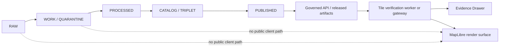
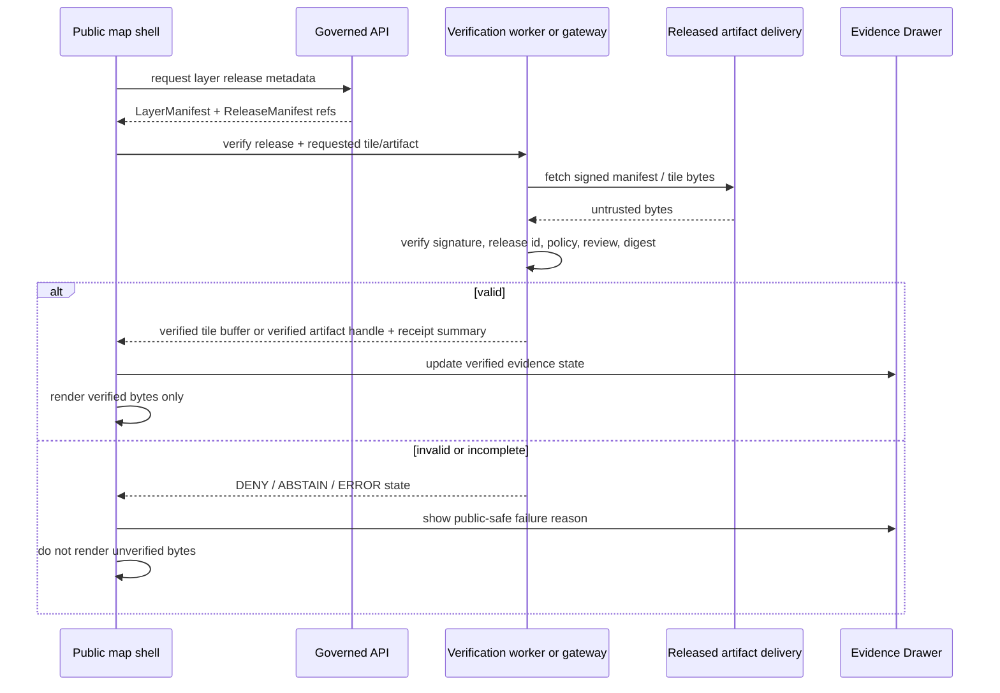

<!-- [KFM_META_BLOCK_V2]
doc_id: kfm://doc/TODO-verifiable-tile-rendering-mobile
title: Verifiable Tile Rendering (Mobile)
type: standard
version: v1
status: draft
owners: OWNER_TBD
created: 2026-04-30
updated: 2026-05-02
policy_label: public
related: [docs/architecture/VERIFIABLE_TILE_RENDERING_MOBILE.md, docs/adr/ADR-tile-verification-schema-home.md, PATH_TBD_AFTER_REPO_INSPECTION]
tags: [kfm, maplibre, mobile, tiles, verification, release-manifest, evidence-bundle, evidence-drawer, fail-closed]
notes: [NEEDS_VERIFICATION: owner, final repo path, schema home, app path, release-manifest path, signing stack, key rotation, MapLibre adapter hook, PMTiles range-proof strategy, CI target]
[/KFM_META_BLOCK_V2] -->

# Verifiable Tile Rendering (Mobile)

<p align="center">
  <strong>Fail-closed, evidence-bound tile rendering for KFM public map clients.</strong><br>
  Renderer pixels are downstream of release, evidence, policy, review, and correction state.
</p>

<p align="center">
  
  
  
  
  
  
</p>

<p align="center">
  <a href="#scope">Scope</a> ·
  <a href="#repo-fit">Repo fit</a> ·
  <a href="#operating-law">Operating law</a> ·
  <a href="#architecture">Architecture</a> ·
  <a href="#contracts">Contracts</a> ·
  <a href="#mobile-runtime">Mobile runtime</a> ·
  <a href="#validation">Validation</a> ·
  <a href="#rollback-and-correction">Rollback</a>
</p>

---

> [!IMPORTANT]
> **Document posture:** `CONFIRMED` KFM doctrine / `PROPOSED` implementation design / `UNKNOWN` current mounted-repo implementation depth.  
> Paths, schemas, worker modules, adapter hooks, tests, workflows, signing commands, release objects, and runtime behavior remain `PROPOSED` or `NEEDS_VERIFICATION` until verified from a mounted KFM repository and pinned toolchain.

## At a glance

| Field | Value |
|---|---|
| Status | `draft` |
| Document type | Standard architecture / implementation guidance |
| Evidence mode | `CORPUS_ONLY / NO_LOCAL_REPO_EVIDENCE` for current implementation depth |
| Target path | `PROPOSED: docs/architecture/VERIFIABLE_TILE_RENDERING_MOBILE.md` |
| Public posture | Render only released, public-safe artifacts; fail closed on missing evidence, policy, review, release, digest, or signature state |
| Renderer posture | MapLibre-first 2D rendering; Cesium/3D is conditional and downstream |
| Accepted inputs | `ReleaseManifest`, `LayerManifest`, `TileDigestManifest`, signed attestation, released tile artifact, `EvidenceBundle` references, `PolicyDecision`, review state |
| Exclusions | `RAW`, `WORK`, `QUARANTINE`, unpublished candidates, direct model output, private endpoints, unreviewed sensitive exact geometry |
| First safe slice | No-network fixture slice with signed test manifest, digest-verified tile fixture, worker/gateway contract, UI trust-state fixture, and negative-path tests |

| This document does | This document does not do |
|---|---|
| Defines a governed tile-verification pattern for mobile/public clients. | Prove the repo already contains these files, routes, schemas, tests, workflows, or runtime behavior. |
| Gives proposed contracts, worker/gateway boundaries, UI states, tests, and rollback rules. | Authorize public release of any tile layer. |
| Preserves the KFM rule that tiles are downstream carriers, not truth. | Replace `EvidenceBundle` resolution, policy gates, review state, or release manifests. |
| Makes verification failures visible. | Allow silent fallback to unverified map data. |

---

## Scope

This standard defines a mobile-friendly verification pattern for KFM public map clients that consume public-safe tile artifacts such as vector tiles, PMTiles-backed bundles, and other released tile distributions.

It covers:

- signed release, layer, and digest manifests;
- digest verification for tile bytes, immutable artifacts, or reviewed bundle strategies;
- worker-based or backend-gateway verification boundaries;
- fail-closed renderer behavior;
- UI trust indicators and Evidence Drawer payload expectations;
- cache, stale-release, correction, and rollback behavior;
- no-network fixtures, negative tests, and release-gate validation.

It does **not** define:

- canonical source ingestion;
- promotion authority;
- signing-key custody;
- live source connectors;
- emergency alerting behavior;
- direct access to canonical/internal stores;
- exact sensitive-location publication rules beyond the fail-closed default;
- native mobile runtime support beyond browser/mobile-web constraints.

<p align="right"><a href="#verifiable-tile-rendering-mobile">Back to top ↑</a></p>

## Repo fit

`PROPOSED` target location:

```text
docs/architecture/VERIFIABLE_TILE_RENDERING_MOBILE.md
```

`PROPOSED` adjacent implementation families, pending repo verification:

| Family | Proposed role | Status |
|---|---|---|
| `docs/adr/ADR-tile-verification-schema-home.md` | Resolve schema-home and contract authority before machine files land | `PROPOSED` |
| `schemas/contracts/v1/tile_verification/` | Manifest, attestation, request/result, and Evidence Drawer payload schemas | `PROPOSED / NEEDS_VERIFICATION: schema home` |
| `apps/web/src/tiles/verified/` | Verification worker, verifier, cache, and renderer adapter boundary | `PROPOSED / NEEDS_VERIFICATION: app path` |
| `tests/fixtures/tile_verification/` | Valid and invalid no-network manifests, signatures, and tile fixtures | `PROPOSED` |
| `tools/validators/tile_release/` | Offline manifest, digest, policy, and release-candidate validator | `PROPOSED / NEEDS_VERIFICATION: validator language` |
| `data/catalog/PATH_TBD_AFTER_REPO_INSPECTION` | Catalog and release-manifest linkage | `NEEDS_VERIFICATION` |
| `data/proofs/PATH_TBD_AFTER_REPO_INSPECTION` | Proof pack or release proof objects | `NEEDS_VERIFICATION` |
| `data/receipts/PATH_TBD_AFTER_REPO_INSPECTION` | Verification, correction, and rollback receipts | `NEEDS_VERIFICATION` |

> [!NOTE]
> If the mounted repo proves `contracts/` rather than `schemas/contracts/v1/` is the machine-contract home, create or update an ADR before landing duplicate schema definitions.

### Repo-neighbor links to verify

| Link target | Current handling |
|---|---|
| MapLibre operating architecture doc | `NEEDS_VERIFICATION: exact repo path` |
| Pipeline / lifecycle manual | `NEEDS_VERIFICATION: exact repo path` |
| Release manifest schema | `PROPOSED: schemas/contracts/v1/tile_verification/release_manifest.schema.json` |
| Evidence Drawer payload schema | `PROPOSED: schemas/contracts/v1/tile_verification/evidence_drawer_tile_payload.schema.json` |
| UI layer registry | `NEEDS_VERIFICATION: exact repo path` |
| Policy gate | `NEEDS_VERIFICATION: exact repo path and policy engine` |

<p align="right"><a href="#verifiable-tile-rendering-mobile">Back to top ↑</a></p>

## Evidence boundary

| Source | Status | Supports | Limits |
|---|---|---|---|
| Original `Verifiable Tile Rendering (Mobile)` draft | `CONFIRMED source draft` | Core design: signed index, digest manifest, worker verification, fail-closed rendering, Evidence Drawer integration | Does not prove repo implementation |
| KFM project guidance | `CONFIRMED doctrine` | Truth labels, no-overclaim rule, public-client constraints, fail-closed posture, Markdown expectations | Does not prove files, routes, or tests |
| KFM MapLibre operating doctrine | `CORPUS-CONFIRMED doctrine / UNKNOWN implementation` | MapLibre as downstream renderer, governed shell, Evidence Drawer, Focus Mode, release-first public map posture | Does not prove a specific adapter hook or package pin |
| KFM artifactization doctrine | `CORPUS-CONFIRMED doctrine / PROPOSED implementation` | `ReleaseManifest`, `EvidenceBundle`, receipts, proof packs, catalog closure, correction, rollback, `spec_hash` patterns | Does not prove object schemas exist |
| Current mounted repository evidence | `UNKNOWN` | No mounted repo was verified during this revision | Cannot confirm paths, CI, runtime, owners, branch, or dashboards |

### Truth split used in this file

| Label | Meaning here |
|---|---|
| `CONFIRMED` | Verified from the source draft, supplied doctrine, or current-session workspace evidence. |
| `PROPOSED` | Recommended file, contract, process, test, or implementation pattern not verified as current repo behavior. |
| `UNKNOWN` | Not verifiable because mounted repo, tests, workflows, dashboards, logs, or emitted artifacts were not available. |
| `NEEDS_VERIFICATION` | A concrete check is required before treating the item as implemented, safe, version-current, or publishable. |
| `DENY` | Rendering or publication must not proceed under current policy/evidence conditions. |
| `ABSTAIN` | A claim or layer cannot be shown as authoritative because support is insufficient. |

<p align="right"><a href="#verifiable-tile-rendering-mobile">Back to top ↑</a></p>

## Operating law

### One-sentence rule

The renderer is downstream of trust, never upstream of it.

### KFM lifecycle boundary



### Non-negotiables

- Tiles are **released artifacts**, not canonical truth.
- A visible tile layer must resolve to a release, source role, policy posture, review state, and evidence lineage appropriate to its significance.
- A missing or invalid attestation, digest, manifest entry, policy decision, review state, release state, or EvidenceBundle linkage disables the affected layer or tile path.
- No renderer fallback may silently draw unverified data.
- Gaps caused by dropped tiles must be presented as verification failure, stale release, policy denial, or degraded verified coverage, not as absence of the underlying phenomenon.
- Public clients must not read `RAW`, `WORK`, `QUARANTINE`, unpublished candidate data, direct model output, or private source-system side effects.
- AI/Focus Mode may explain verified public-safe evidence and trust states; it must not treat rendered pixels or generated language as evidence.

<p align="right"><a href="#verifiable-tile-rendering-mobile">Back to top ↑</a></p>

## Architecture

### Governed verification flow



### Trust boundary map

| Boundary | Allowed | Blocked |
|---|---|---|
| Public client → governed API | Released layer metadata, public-safe DTOs, EvidenceRef resolution, policy-safe envelopes | RAW/WORK/QUARANTINE, unpublished candidates, direct model runtime, internal canonical stores |
| Worker/gateway → delivery endpoint | Immutable/versioned tile artifacts, signed manifests, bounded public-safe fetches | Private endpoints, unsigned manifests, mutable unversioned tiles, direct source-system side effects |
| Worker/gateway → main thread | Verified buffers, verified artifact handles, finite trust states, receipt summaries | Unverified bytes, private keys, secrets, raw evidence payloads beyond public-safe DTOs |
| Main thread → renderer | Verified buffers or disabled/degraded layer state | Trust decisions, digest bypass, silent fallback |
| Renderer → user | Visual context, verified layer state, public-safe feature selection | Consequential uncited claims, hidden source uncertainty, exact sensitive geometry without policy clearance |

### Recommended integration patterns

| Pattern | When to use | Status |
|---|---|---|
| Backend-verified tile gateway | First implementation slice, simpler policy enforcement, easier observability | `PROPOSED / recommended first` |
| Client worker verification | Mobile/offline-friendly verification of immutable public artifacts | `PROPOSED / requires adapter proof` |
| MapLibre custom protocol / adapter hook | Needed if renderer must receive verified bytes through a protocol boundary | `NEEDS_VERIFICATION against pinned MapLibre wrapper` |
| Pre-verified PMTiles release bundle | Stable public-safe bundles with manifest-level integrity | `PROPOSED` |
| Per-tile digest manifest | Direct tile endpoint verification where each tile has a stable key and digest | `PROPOSED` |
| Range/chunk proof for bundled artifacts | PMTiles or range-based delivery where whole-archive verification is insufficient for runtime fetches | `PROPOSED / NEEDS_VERIFICATION` |
| Cesium/3D verification adapter | Only where 3D carries evidence burden and the same controls survive | `CONDITIONAL` |

> [!WARNING]
> Do not start with broad tile generation or public layer rollout. Start with a no-network fixture slice: one signed manifest, one valid tile fixture, one invalid digest fixture, one stale-release fixture, one missing-evidence fixture, and one disabled-layer UI state.

<p align="right"><a href="#verifiable-tile-rendering-mobile">Back to top ↑</a></p>

## Contracts

All contracts in this section are `PROPOSED` and should become JSON Schemas or equivalent repo-native contracts only after schema-home verification.

### Object families

| Object | Purpose | Minimum gate |
|---|---|---|
| `ReleaseManifest` | Identifies the promoted release and immutable artifacts. | Required before public rendering. |
| `LayerManifest` | Connects a map layer to release, style, source role, policy, review, and evidence references. | Required before layer registration. |
| `TileDigestManifest` | Maps tile keys, artifact digests, or range/chunk proofs to expected integrity values. | Required for tile-byte or artifact verification. |
| `TileVerificationAttestation` | Signature over canonical release/layer/digest payload. | Required unless backend gateway supplies equivalent proof. |
| `EvidenceRef` / `EvidenceBundle` | Connects visible layer claims to admissible evidence. | Required for consequential claims and Evidence Drawer. |
| `PolicyDecision` | Records allowed/denied/redacted/degraded public posture. | Required before public display. |
| `TileVerificationReceipt` | Records verification outcome and failure reason without leaking private data. | Required for review and rollback. |
| `CorrectionNotice` | Describes withdrawn, corrected, redacted, or superseded releases/layers. | Required when release trust changes. |
| `RollbackPlan` | Defines cache invalidation, layer disablement, and replacement release path. | Required before publication maturity. |

### Release manifest sketch

```json
{
  "manifest_version": "kfm.tile_release.v1",
  "release_id": "TODO(release): stable release id",
  "release_state": "published",
  "policy_label": "public",
  "issued_at": "TODO(date): ISO-8601 release timestamp",
  "expires_at": "TODO(date): optional expiry or rotation policy",
  "spec_hash": "sha256:TODO",
  "content_hash": "sha256:TODO",
  "layers": [
    {
      "layer_id": "TODO(layer): stable layer id",
      "layer_manifest_uri": "TODO(uri): immutable layer manifest URI",
      "layer_manifest_digest": "sha256:TODO"
    }
  ],
  "attestation": {
    "scheme": "TODO(signing): dsse|sigstore|jws|repo-native",
    "key_id": "TODO(signing): public key id",
    "payload_canonicalization": "TODO(canonicalization): JCS or repo-native",
    "signature": "TODO(signing): base64 signature or bundle reference"
  }
}
```

### Layer manifest sketch

```json
{
  "manifest_version": "kfm.layer_manifest.v1",
  "layer_id": "TODO(layer): stable layer id",
  "display_name": "TODO(layer): public-safe display name",
  "release_id": "TODO(release): matching release id",
  "source_role": "released_public_derivative",
  "renderer": "maplibre",
  "tile_format": "mvt",
  "artifact_uri": "TODO(uri): immutable tile URL, PMTiles URI, or artifact handle",
  "artifact_digest": "sha256:TODO",
  "digest_manifest_uri": "TODO(uri): immutable digest manifest URI",
  "digest_manifest_digest": "sha256:TODO",
  "evidence_refs": ["TODO(evidence): kfm://evidence/..."],
  "policy_decision_ref": "TODO(policy): kfm://policy-decision/...",
  "review_state": "TODO(review): reviewed|approved|draft",
  "limitations": ["TODO(limitation): public-safe limitation text"]
}
```

### Tile digest manifest sketch

```json
{
  "manifest_version": "kfm.tile_digest_manifest.v1",
  "release_id": "TODO(release): stable release id",
  "layer_id": "TODO(layer): stable layer id",
  "digest_algorithm": "sha256",
  "strategy": "per_tile",
  "tiles": {
    "z/x/y": {
      "url": "TODO(uri): immutable tile URL",
      "digest": "sha256:TODO",
      "byte_size": 0,
      "media_type": "application/vnd.mapbox-vector-tile"
    }
  }
}
```

### Bundle digest strategy sketch

```json
{
  "manifest_version": "kfm.tile_digest_manifest.v1",
  "release_id": "TODO(release): stable release id",
  "layer_id": "TODO(layer): stable layer id",
  "digest_algorithm": "sha256",
  "strategy": "bundle",
  "artifact": {
    "uri": "TODO(uri): immutable PMTiles or bundle URI",
    "digest": "sha256:TODO",
    "byte_size": 0,
    "media_type": "application/vnd.pmtiles"
  },
  "range_proofs": "NEEDS_VERIFICATION: define only if repo/toolchain requires runtime range verification"
}
```

### Worker request / result sketch

```ts
export type TileVerificationOutcome =
  | "VERIFIED"
  | "DEGRADED"
  | "DENY"
  | "ABSTAIN"
  | "ERROR";

export interface TileVerificationRequest {
  requestId: string;
  releaseId: string;
  layerId: string;
  tileKey: string;
  tileUrl: string;
  expectedDigest: `sha256:${string}`;
  abortAfterMs?: number;
}

export interface VerifiedTileResult {
  requestId: string;
  releaseId: string;
  layerId: string;
  tileKey: string;
  outcome: TileVerificationOutcome;
  reason?: string;
  digest?: `sha256:${string}`;
  byteLength?: number;
  /**
   * Present only when outcome is VERIFIED.
   * Transfer the ArrayBuffer; do not clone it unnecessarily.
   */
  buffer?: ArrayBuffer;
}
```

### Evidence Drawer tile payload sketch

```json
{
  "payload_version": "kfm.evidence_drawer.tile.v1",
  "layer_id": "TODO(layer): stable layer id",
  "release_id": "TODO(release): stable release id",
  "verification_outcome": "VERIFIED",
  "source_role": "released_public_derivative",
  "policy_label": "public",
  "policy_decision_summary": "TODO(policy): public-safe summary",
  "review_state": "approved",
  "evidence_refs": ["TODO(evidence): kfm://evidence/..."],
  "digest_summary": {
    "algorithm": "sha256",
    "manifest_digest": "sha256:TODO",
    "tile_or_artifact_digest": "sha256:TODO"
  },
  "limitations": ["TODO(limitation): public-safe limitation text"],
  "correction_notice_ref": null
}
```

> [!CAUTION]
> Signatures must cover exactly the canonical bytes that were signed. Do not verify a reserialized JavaScript object with `JSON.stringify(...)` unless the canonicalization method is specified, tested, and used identically by the signer and verifier.

<p align="right"><a href="#verifiable-tile-rendering-mobile">Back to top ↑</a></p>

## Mobile runtime

### Worker or gateway responsibilities

The verification boundary should:

- fetch only immutable/versioned public-safe manifests and tile artifacts;
- verify release and layer attestation before tile verification;
- verify policy, review, and release state before renderer admission;
- compute SHA-256 or repo-approved digest for tile bytes or artifacts;
- compare against the digest manifest or approved bundle proof;
- return buffers or artifact handles only for `VERIFIED` outputs;
- emit finite negative states for invalid, stale, missing, denied, or failed verification;
- preserve bounded receipt metadata for review without leaking sensitive internals.

The main thread should:

- request verification;
- render verified buffers or verified artifact handles only;
- display disabled/degraded layer states;
- update Evidence Drawer payloads;
- never make trust decisions itself.

### Mobile constraints

| Constraint | Target | Notes |
|---|---|---|
| Workers | 1–2 verification workers | Tune after profiling; avoid starving rendering and gestures. |
| Concurrent fetches | 4–8 bounded requests | Final value needs device profiling. |
| Memory | Bounded cache keyed by `release_id + layer_id + tile_key + digest` | Never reuse cache entries across releases without digest match. |
| CPU | Hashing off main thread | Main thread remains for UI, gestures, and renderer interaction. |
| Network | Retry with backoff and abort | Avoid infinite retries and battery drain. |
| Offline | Previously verified cache may be used only when release validity and digest still match | Stale or expired releases degrade or disable. |
| Accessibility | Verification failure must be visible in non-map UI as well as visual layer state | Required for Evidence Drawer and nonvisual review. |

### Cache rules

- Cache keys include release id, layer id, tile key, expected digest, and byte length when available.
- A digest mismatch invalidates the cache entry immediately.
- A newer release must not reuse old tile bytes unless digest, release policy, and rollback state permit reuse.
- A cache hit is still a verified tile only if the stored digest matches the current manifest and release state is valid.
- A withdrawn release must invalidate or quarantine matching cache entries.

### Illustrative worker skeleton

```ts
// PROPOSED / illustrative only.
// Adapt to the repo-native worker framework, pinned renderer adapter, and accepted signing stack.

async function sha256Hex(buffer: ArrayBuffer): Promise<`sha256:${string}`> {
  const digest = await crypto.subtle.digest("SHA-256", buffer);
  const hex = [...new Uint8Array(digest)]
    .map((byte) => byte.toString(16).padStart(2, "0"))
    .join("");

  return `sha256:${hex}`;
}

function normalizeDigest(value: string): `sha256:${string}` {
  if (!value.startsWith("sha256:")) {
    throw new Error("unsupported_digest_format");
  }

  return value.toLowerCase() as `sha256:${string}`;
}

async function verifyTile(request: TileVerificationRequest): Promise<VerifiedTileResult> {
  try {
    const response = await fetch(request.tileUrl, {
      cache: "no-store",
      credentials: "omit"
    });

    if (!response.ok) {
      return { ...request, outcome: "ERROR", reason: `network_${response.status}` };
    }

    const buffer = await response.arrayBuffer();
    const actualDigest = await sha256Hex(buffer);
    const expectedDigest = normalizeDigest(request.expectedDigest);

    if (actualDigest !== expectedDigest) {
      return {
        ...request,
        outcome: "DENY",
        reason: "digest_mismatch",
        digest: actualDigest,
        byteLength: buffer.byteLength
      };
    }

    return {
      ...request,
      outcome: "VERIFIED",
      digest: actualDigest,
      byteLength: buffer.byteLength,
      buffer
    };
  } catch (error) {
    return {
      ...request,
      outcome: "ERROR",
      reason: error instanceof Error ? error.message : "unknown_error"
    };
  }
}
```

<p align="right"><a href="#verifiable-tile-rendering-mobile">Back to top ↑</a></p>

## Security model

### Threats and controls

| Threat | Control | Failure posture |
|---|---|---|
| CDN tampering | Digest manifest + signed release/layer manifest | Drop tile or disable layer. |
| Manifest tampering | Signature over canonical manifest payload | Abort layer. |
| Stale/replayed release | `release_id`, issued/expiry policy, allowed key id, release-state check | Disable layer or show stale/degraded state. |
| Mixed-release tile cache | Cache keyed by release id and digest | Reject cache hit. |
| Worker bypass | Renderer adapter accepts only worker-verified buffers or backend-verified gateway responses | Disable layer. |
| Key compromise | Key registry, rotation policy, revocation/withdrawal, release invalidation | Withdraw release and clear cache. |
| Sensitive exact geometry exposure | Policy decision, review state, generalized/redacted artifacts only | Deny public rendering. |
| Resource exhaustion | Bounded workers, fetch concurrency, tile size limits, retry caps | `ERROR` or degraded state. |
| Private endpoint leakage | Public-safe URL allowlist; no credentials in client requests | Deny request. |
| UI misinterpretation | Evidence Drawer, trust badges, disabled/degraded copy, no silent fallback | Abstain or deny claim. |

### Key handling

`PROPOSED` key rules:

- Client verification uses public keys only.
- Private signing keys never enter client code, fixtures, screenshots, documentation examples, or worker payloads.
- `key_id` must resolve through an approved public key registry or pinned release metadata.
- Key rotation and revocation are `NEEDS_VERIFICATION` before production use.
- A release signed by an unknown, revoked, expired, or wrong-purpose key fails closed.
- Test keys must be visibly labeled and blocked from production release candidates.

<p align="right"><a href="#verifiable-tile-rendering-mobile">Back to top ↑</a></p>

## UI and Evidence Drawer

### Trust states

| State | Meaning | UI behavior |
|---|---|---|
| `VERIFIED` | Manifest, policy, release, review, evidence, and tile/artifact digest checks passed. | Render tile; show verified release/evidence state. |
| `DEGRADED` | Only a verified subset is available, or noncritical metadata is incomplete. | Render verified subset only; show visible degraded banner or layer note. |
| `ABSTAIN` | Evidence, review, or release linkage is insufficient for a consequential claim. | Do not make claim; show why support is insufficient. |
| `DENY` | Policy, sensitivity, review, source role, signature, or digest rule blocks rendering. | Disable tile/layer; show public-safe denial reason. |
| `ERROR` | Technical failure prevents reliable verification. | Disable or retry boundedly; show error state without fallback rendering. |

### Evidence Drawer should show

- layer id and display name;
- release id and release state;
- verification outcome;
- source role;
- policy label and policy decision summary;
- EvidenceBundle reference or reason for abstention;
- digest and signature reference summary;
- limitations and known caveats;
- stale, correction, withdrawal, or rollback notice when active.

### Evidence Drawer should not show

- private keys or secret material;
- private source endpoints;
- RAW/WORK/QUARANTINE details;
- exact sensitive coordinates when public-safe geometry is generalized;
- internal reviewer notes not cleared for public view;
- raw model output or generated language as evidence.

<p align="right"><a href="#verifiable-tile-rendering-mobile">Back to top ↑</a></p>

## Focus Mode and AI boundary

Focus Mode may explain why a layer is verified, degraded, denied, or withdrawn only after the Evidence Drawer payload or governed API envelope supplies public-safe evidence and policy state.

Focus Mode must not:

- infer truth from map pixels alone;
- treat a tile archive, screenshot, vector index, graph projection, or generated summary as root evidence;
- answer a consequential claim without `EvidenceRef -> EvidenceBundle` resolution;
- reveal hidden sensitive details because a layer failed closed;
- override a `DENY`, `ABSTAIN`, stale, or withdrawn state with fluent language.

Recommended finite outcomes:

| Outcome | Focus behavior |
|---|---|
| `ANSWER` | Allowed only when public-safe evidence, policy, review, and release support the answer. |
| `ABSTAIN` | Use when support is incomplete or evidence cannot be resolved. |
| `DENY` | Use when policy blocks the claim, location, or detail. |
| `ERROR` | Use when verification failed technically and cannot be distinguished from evidence insufficiency. |

<p align="right"><a href="#verifiable-tile-rendering-mobile">Back to top ↑</a></p>

## Failure modes

| Scenario | Required behavior | Outcome |
|---|---|---|
| Attestation invalid | Abort affected layer before tile rendering. | `DENY` |
| Attestation missing | Abort affected layer unless backend gateway supplies equivalent verified proof. | `ABSTAIN` or `DENY` |
| Digest mismatch | Drop tile; invalidate cache; record receipt summary. | `DENY` |
| Missing digest manifest entry | Do not fetch/render tile. | `ABSTAIN` |
| Network failure | Retry boundedly with backoff; never render unverified fallback. | `ERROR` |
| Expired release | Disable layer or require updated manifest. | `DENY` |
| Withdrawn release | Disable layer, invalidate cache, surface correction/withdrawal notice. | `DENY` |
| Unknown source role | Disable layer until source role is resolved. | `ABSTAIN` |
| Missing review state | Disable layer for public clients. | `ABSTAIN` |
| Sensitive exact geometry unresolved | Deny public exact layer; require redaction/generalization receipt. | `DENY` |
| Worker unavailable | Disable verified rendering or route through backend-verified gateway. | `ERROR` |
| Evidence Drawer unavailable | Render only if independent policy allows; hide consequential claims; show trust-state warning. | `DEGRADED` or `ABSTAIN` |

<p align="right"><a href="#verifiable-tile-rendering-mobile">Back to top ↑</a></p>

## Validation

### Minimum test matrix

| Test | Fixture | Expected result |
|---|---|---|
| Valid release + valid tile digest | Signed manifest + matching tile bytes | `VERIFIED`, buffer or verified handle returned |
| Bad attestation | Signature mismatch | `DENY`, no buffer |
| Missing manifest entry | Tile key absent | `ABSTAIN`, no fetch or no render |
| Digest mismatch | Manifest digest differs from bytes | `DENY`, no buffer, cache invalidated |
| Unknown key id | Signed with unapproved key | `DENY` |
| Expired release | Past expiry or invalid release window | `DENY` |
| Withdrawn release | Release state withdrawn | `DENY`, cache invalidated |
| Unclear sensitivity | Missing policy decision for sensitive layer | `DENY` |
| Missing EvidenceBundle ref | Layer has consequential claim with no evidence ref | `ABSTAIN` |
| Network timeout | Aborted fetch | `ERROR`, bounded retry only |
| Cache collision attempt | Same tile key, different release/digest | Reject old cache entry |
| Main-thread bypass | Attempt to render unverified bytes | Test fails; adapter blocks |
| Evidence Drawer failure | Drawer payload missing public-safe trust state | `DEGRADED` or `ABSTAIN`, no consequential claim |
| Focus Mode bypass | AI answer requested with no EvidenceBundle | `ABSTAIN` or `DENY` |

### Proposed validation commands

```bash
# Illustrative only — NEEDS_VERIFICATION against mounted repo conventions.
python tools/validators/tile_release/validate_manifest.py \
  tests/fixtures/tile_verification/valid/release_manifest.json
```

```bash
# Illustrative only — NEEDS_VERIFICATION against mounted repo conventions.
pnpm test -- tile-verification
```

### Definition of Done

- [ ] Repo path and schema home are verified or recorded in an ADR.
- [ ] `ReleaseManifest`, `LayerManifest`, and `TileDigestManifest` schemas exist in the accepted schema home.
- [ ] Valid and invalid no-network fixtures cover signature, digest, stale release, withdrawn release, missing evidence, missing review, and policy denial.
- [ ] Worker or backend gateway verifies manifest authenticity before tile bytes are eligible for rendering.
- [ ] Tile or artifact digest validation is enforced before any renderer path receives bytes.
- [ ] Main-thread renderer adapter cannot render unverified bytes.
- [ ] Evidence Drawer shows release, verification, policy, evidence, review, correction, and limitation state.
- [ ] Degraded/disabled layer states are visible and not confused with real-world absence.
- [ ] Public client has no RAW/WORK/QUARANTINE or direct model-output path.
- [ ] Rollback/withdrawal clears or invalidates affected tile caches.
- [ ] CI gate or equivalent validator blocks public-release candidates that fail verification.
- [ ] Focus Mode cannot answer consequential tile/layer claims without EvidenceBundle resolution.
- [ ] Sensitive exact geometry is denied or generalized/redacted with a meaningful transform receipt.

<p align="right"><a href="#verifiable-tile-rendering-mobile">Back to top ↑</a></p>

## Rollback and correction

A tile release must be withdrawable without relying on users to understand internal release mechanics.

| Trigger | Required action |
|---|---|
| Bad digest manifest | Withdraw affected release; publish correction notice; block cache reuse by release id. |
| Compromised signing key | Revoke key id; invalidate releases signed by key according to policy; rotate key; publish rollback plan. |
| Sensitive geometry leak | Deny layer; purge public cache where possible; issue redaction receipt; publish generalized replacement only after review. |
| Incorrect evidence linkage | Disable Evidence Drawer claim; publish correction notice; rebuild layer only after EvidenceBundle closure. |
| Policy regression | Block release candidate; revert policy or layer manifest change; retain validation report. |
| Renderer adapter bypass | Disable adapter; force backend-verified gateway or no-render state until fixed. |
| Stale/offline ambiguity | Disable or mark stale; do not render as current verified truth. |
| Evidence Drawer regression | Disable consequential layer claims until drawer payloads and governed envelopes are restored. |

Correction artifacts should preserve:

- affected release id;
- affected layer ids;
- reason for withdrawal or correction;
- replacement release id if any;
- public-safe notice text;
- cache invalidation rule;
- reviewer and approval state where required;
- rollback target;
- verification report or receipt summary.

<p align="right"><a href="#verifiable-tile-rendering-mobile">Back to top ↑</a></p>

## Implementation sequence

### Phase 0 — verify repo reality

- [ ] Confirm branch, dirty state, package manager, app path, schema home, tests, workflows, release artifact paths, MapLibre wrapper, and existing layer registry.
- [ ] Identify whether public tile delivery is currently backend-mediated, CDN/PMTiles-based, direct tile-service-based, or mixed.
- [ ] Identify existing object families: `ReleaseManifest`, `LayerManifest`, `EvidenceBundle`, `PolicyDecision`, receipts, proof packs, correction notices, rollback plans.
- [ ] Verify whether prior public-repo reports remain current.
- [ ] Confirm owners and policy label.

### Phase 1 — schema + fixture slice

- [ ] Add schema-home ADR if needed.
- [ ] Add manifest and worker/gateway DTO schemas.
- [ ] Add valid and invalid no-network fixtures.
- [ ] Add offline validator and negative-path tests.
- [ ] Add documentation links from MapLibre/UI architecture docs.
- [ ] Keep live sources and public publication disabled.

### Phase 2 — verification boundary

- [ ] Implement manifest attestation verification.
- [ ] Implement tile, artifact, or bundle digest verification.
- [ ] Add bounded cache, retry, and abort behavior.
- [ ] Block main-thread/rendering bypass.
- [ ] Emit `TileVerificationReceipt` summaries.

### Phase 3 — UI trust surface

- [ ] Add layer trust states.
- [ ] Add Evidence Drawer payload mapping.
- [ ] Add degraded/disabled layer affordances.
- [ ] Add public-safe error and abstention copy.
- [ ] Add Focus Mode guardrails for tile/layer claims.

### Phase 4 — release and rollback rehearsal

- [ ] Run release dry-run.
- [ ] Simulate bad digest withdrawal.
- [ ] Simulate key rotation or revoked key.
- [ ] Verify cache invalidation and correction notice behavior.
- [ ] Verify offline stale-release behavior.
- [ ] Record rollback receipt.

<p align="right"><a href="#verifiable-tile-rendering-mobile">Back to top ↑</a></p>

## Open questions

| Question | Status | Why it matters |
|---|---|---|
| Which schema home is authoritative? | `NEEDS_VERIFICATION` | Prevents duplicate contract definitions. |
| Which signing stack is accepted? | `NEEDS_VERIFICATION` | Determines attestation format and CI gate. |
| Is client-side verification required, or is backend gateway verification enough for the first slice? | `PROPOSED decision` | Controls complexity and mobile battery cost. |
| What MapLibre adapter hook is pinned in repo? | `NEEDS_VERIFICATION` | Determines how verified bytes enter renderer. |
| What is the key rotation and revocation process? | `NEEDS_VERIFICATION` | Required before production trust claims. |
| How are PMTiles/range requests represented in manifests? | `NEEDS_VERIFICATION` | Needed for whole-artifact versus per-tile digest strategy. |
| How does Evidence Drawer resolve tile-level versus layer-level evidence? | `PROPOSED` | Prevents overclaiming tile pixels as evidence. |
| How are stale or withdrawn releases communicated to offline users? | `NEEDS_VERIFICATION` | Required for mobile/offline trust. |
| Which current repo paths should link to this doc? | `NEEDS_VERIFICATION` | Keeps documentation discoverable without fake links. |
| What public-safe copy is approved for denial, abstention, and degraded states? | `NEEDS_VERIFICATION` | Prevents confusing verification failures with real-world absence. |

## Anti-patterns

Do not:

- render unsigned or digest-mismatched tiles;
- fall back to an unverified source when verification fails;
- treat a tile, PMTiles archive, scene, graph edge, vector index, dashboard, screenshot, or generated answer as sovereign truth;
- let a map popup make a consequential claim without EvidenceBundle resolution;
- expose RAW/WORK/QUARANTINE or unpublished candidates to public clients;
- put private signing keys, credentials, or private endpoints in client code or fixtures;
- use green CI/security/release badges until current repo evidence verifies the target;
- publish exact sensitive geometries without policy, review, and redaction/generalization receipts;
- let Focus Mode answer from rendered pixels when evidence resolution fails.

<details>
<summary>Appendix — Proposed file inventory</summary>

| Proposed path | Purpose | Status |
|---|---|---|
| `docs/architecture/VERIFIABLE_TILE_RENDERING_MOBILE.md` | This standard | `PROPOSED` |
| `docs/adr/ADR-tile-verification-schema-home.md` | Resolve schema-home ambiguity | `PROPOSED` |
| `schemas/contracts/v1/tile_verification/release_manifest.schema.json` | Release manifest schema | `PROPOSED` |
| `schemas/contracts/v1/tile_verification/layer_manifest.schema.json` | Layer manifest schema | `PROPOSED` |
| `schemas/contracts/v1/tile_verification/tile_digest_manifest.schema.json` | Digest manifest schema | `PROPOSED` |
| `schemas/contracts/v1/tile_verification/tile_verification_result.schema.json` | Worker/gateway result schema | `PROPOSED` |
| `schemas/contracts/v1/tile_verification/evidence_drawer_tile_payload.schema.json` | Evidence Drawer payload schema | `PROPOSED` |
| `schemas/contracts/v1/tile_verification/tile_verification_receipt.schema.json` | Verification receipt schema | `PROPOSED` |
| `apps/web/src/tiles/verified/worker.ts` | Verification worker | `PROPOSED / NEEDS_VERIFICATION: app path` |
| `apps/web/src/tiles/verified/verifier.ts` | Manifest and digest verification helpers | `PROPOSED / NEEDS_VERIFICATION: app path` |
| `apps/web/src/tiles/verified/cache.ts` | Bounded verified tile cache | `PROPOSED / NEEDS_VERIFICATION: app path` |
| `apps/web/src/tiles/verified/maplibreAdapter.ts` | Renderer adapter boundary | `PROPOSED / NEEDS_VERIFICATION: MapLibre hook` |
| `tests/fixtures/tile_verification/valid/` | Valid no-network fixtures | `PROPOSED` |
| `tests/fixtures/tile_verification/invalid/` | Negative-path fixtures | `PROPOSED` |
| `tools/validators/tile_release/validate_manifest.py` | Offline validation | `PROPOSED / language NEEDS_VERIFICATION` |

</details>

<details>
<summary>Appendix — Review checklist</summary>

- [ ] Metadata block owner and related paths verified.
- [ ] Schema-home decision recorded.
- [ ] Source role for every tile layer is explicit.
- [ ] Release state is explicit and public-safe.
- [ ] Policy decision exists and blocks unclear sensitivity.
- [ ] Review state exists and blocks unreviewed public release.
- [ ] Evidence references resolve or layer abstains.
- [ ] Signature verification cannot be bypassed.
- [ ] Digest verification cannot be bypassed.
- [ ] Worker/gateway never returns unverified buffers or handles.
- [ ] Renderer never receives unverified buffers or handles.
- [ ] Evidence Drawer shows verification state and limitations.
- [ ] Focus Mode cannot answer without governed evidence.
- [ ] Rollback invalidates caches.
- [ ] Public docs do not contain secrets, private endpoints, or fabricated badge claims.

</details>

---

## Final rule

Render verified released artifacts, surface uncertainty honestly, and fail closed before a tile becomes a false claim.

<p align="right"><a href="#verifiable-tile-rendering-mobile">Back to top ↑</a></p>
