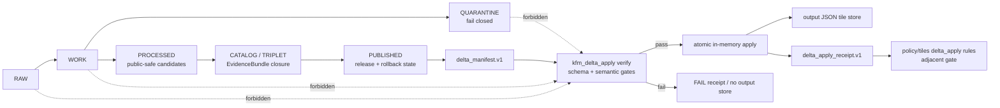
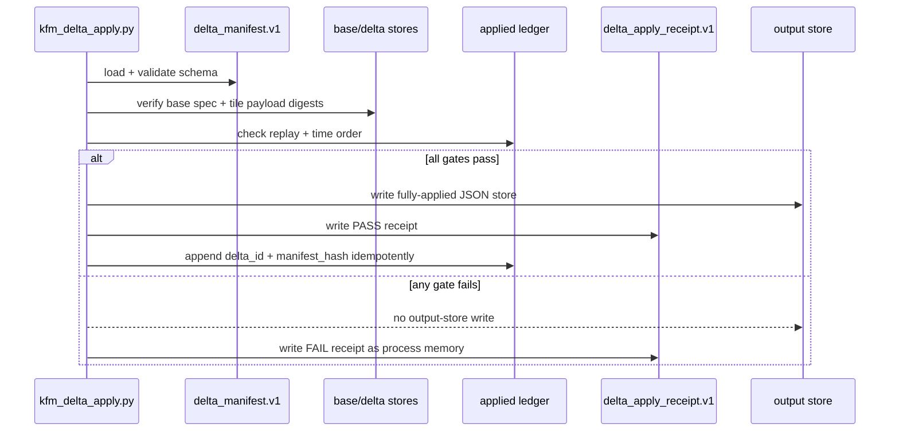

<!-- [KFM_META_BLOCK_V2]
doc_id: kfm://doc/NEEDS-VERIFICATION
title: PMTiles Delta Apply Engine
type: standard
version: v1
status: draft
owners: OWNER_TBD
created: NEEDS VERIFICATION: confirm repository creation date
updated: 2026-05-06
policy_label: NEEDS VERIFICATION: tile release and sensitivity label not confirmed
related: [./README.md, ../../domains/ui_maplibre/architecture/PMTILES_DELTA_CLIENT_VERIFIER.md, ../../domains/ui_maplibre/architecture/PMTILES_DELTA_MANIFEST.md, ../../../contracts/KFM/delta_manifest.v1.json, ../../../contracts/KFM/delta_apply_receipt.v1.json, ../../../tools/tiles/kfm_delta_apply.py, ../../../tools/validators/tiles/validate_delta_manifest.py, ../../../tests/test_kfm_delta_apply.py, ../../../policy/tiles/delta_apply.rego, ../../../policy/tiles/delta_apply_test.rego]
tags: [kfm, tiles, pmtiles, delta, verifier, receipts, policy, rollback]
notes: [GitHub-visible repo evidence inspected for the target file, related contract files, apply tool, validator, tests, fixtures, and policy. Local workspace was not a mounted Git checkout. Owners, created date, policy label, CI pass status, branch protection, real PMTiles bridge, production receipts, and deployed runtime behavior remain open verification items.]
[/KFM_META_BLOCK_V2] -->

<a id="top"></a>

# PMTiles Delta Apply Engine

Fail-closed fixture-mode verification and atomic JSON tile-store apply behavior for KFM `delta_manifest.v1` objects.


> [!IMPORTANT]
> **Status:** `draft`  
> **Owner:** `OWNER_TBD`  
> **Path:** `docs/architecture/tiles/delta_apply.md`  
> **Object family:** `delta_apply.v1`  
> **Truth posture:** `CONFIRMED` GitHub-visible target path, schema, receipt contract, apply tool, validator, tests, fixture family, and policy files / `NEEDS VERIFICATION` local test execution, CI pass status, branch protection, production receipts, deployed runtime behavior, and real PMTiles binary bridge.

> [!NOTE]
> This document describes a governed tile-delta **verification and fixture-apply surface**. It does not make PMTiles, delta manifests, JSON tile stores, receipts, rendered pixels, or MapLibre feature properties into canonical truth.

## Quick navigation

- [Scope](#scope)
- [Repo fit](#repo-fit)
- [Evidence boundary](#evidence-boundary)
- [Operating law](#operating-law)
- [Accepted inputs](#accepted-inputs)
- [Exclusions](#exclusions)
- [Fixture store model](#fixture-store-model)
- [Digest and canonicalization rules](#digest-and-canonicalization-rules)
- [Verification gates](#verification-gates)
- [Apply behavior](#apply-behavior)
- [Receipt contract](#receipt-contract)
- [Policy checks](#policy-checks)
- [Replay, idempotency, and rollback](#replay-idempotency-and-rollback)
- [Validation commands](#validation-commands)
- [Change gates](#change-gates)
- [Open verification backlog](#open-verification-backlog)

---

## Scope

`delta_apply.v1` is the KFM tile-delta apply surface for PMTiles delta candidates represented as deterministic JSON fixtures.

It exists to answer a narrow operational question:

> Can this delta manifest and its fixture stores be verified, applied, receipted, replay-checked, and rolled back without weakening KFM’s evidence, policy, release, or lifecycle boundaries?

This document covers:

- `delta_manifest.v1` verification before mutation;
- JSON fixture stores with base64 tile payloads;
- digest checks for added, modified, and removed tiles;
- forbidden lifecycle-reference rejection;
- count parity, unique tile keys, masking thresholds, replay checks, and time-order checks;
- attempted-apply receipts shaped by `delta_apply_receipt.v1`;
- idempotent ledger behavior for the same `delta_id + manifest_hash`;
- failure behavior that prevents output-store writes;
- rollback and correction expectations.

It does **not** cover production PMTiles binary mutation, public release approval, EvidenceBundle resolution, MapLibre source installation, or Focus Mode explanation by itself.

[Back to top](#top)

---

## Repo fit

This file belongs under `docs/architecture/tiles/` because it is human-facing cross-cutting tile architecture. It describes how a trust-bearing tile-delta apply mechanism should behave; executable code, schemas, policy, tests, fixtures, receipts, and release objects stay in their responsibility roots.

| Surface | Path | Status | Role |
|---|---|---:|---|
| This document | `docs/architecture/tiles/delta_apply.md` | `CONFIRMED target path` / revised here | Architecture and maintainer guide for the delta apply surface. |
| Tile architecture parent | [`./README.md`](./README.md) | `CONFIRMED` | Tile delivery architecture, derived-artifact posture, promotion gates, and rollback expectations. |
| PMTiles client verifier | [`../../domains/ui_maplibre/architecture/PMTILES_DELTA_CLIENT_VERIFIER.md`](../../domains/ui_maplibre/architecture/PMTILES_DELTA_CLIENT_VERIFIER.md) | `CONFIRMED` | Related runtime/client-verifier architecture. |
| PMTiles delta manifest guide | [`../../domains/ui_maplibre/architecture/PMTILES_DELTA_MANIFEST.md`](../../domains/ui_maplibre/architecture/PMTILES_DELTA_MANIFEST.md) | `CONFIRMED` | Human-readable guide for delta-manifest publication-control posture. |
| Manifest contract | [`../../../contracts/KFM/delta_manifest.v1.json`](../../../contracts/KFM/delta_manifest.v1.json) | `CONFIRMED` | JSON Schema 2020-12 contract for `delta_manifest.v1`. |
| Apply receipt contract | [`../../../contracts/KFM/delta_apply_receipt.v1.json`](../../../contracts/KFM/delta_apply_receipt.v1.json) | `CONFIRMED` | JSON Schema 2020-12 contract for apply receipts. |
| Fixture apply CLI | [`../../../tools/tiles/kfm_delta_apply.py`](../../../tools/tiles/kfm_delta_apply.py) | `CONFIRMED` | Repo-visible `verify`, `apply`, and `hash` commands. |
| Manifest validator | [`../../../tools/validators/tiles/validate_delta_manifest.py`](../../../tools/validators/tiles/validate_delta_manifest.py) | `CONFIRMED` | Schema and semantic validation helper for delta manifests. |
| Apply tests | [`../../../tests/test_kfm_delta_apply.py`](../../../tests/test_kfm_delta_apply.py) | `CONFIRMED` | Pytest coverage for verify/apply behavior and negative paths. |
| Valid apply fixture | [`../../../tests/fixtures/tiles/delta_apply/valid/delta_manifest.json`](../../../tests/fixtures/tiles/delta_apply/valid/delta_manifest.json) | `CONFIRMED` | Public-safe synthetic fixture for added, modified, and removed tile changes. |
| Apply policy | [`../../../policy/tiles/delta_apply.rego`](../../../policy/tiles/delta_apply.rego) | `CONFIRMED` | Receipt-shaped policy denial rules. |
| Apply policy tests | [`../../../policy/tiles/delta_apply_test.rego`](../../../policy/tiles/delta_apply_test.rego) | `CONFIRMED` | Minimal Rego tests for apply policy. |
| Tile CI workflow | `.github/workflows/tiles-ci.yml` | `UNKNOWN / NOT CONFIRMED` | Related docs mention tile CI, but this exact file was not confirmed during this revision pass. |

> [!WARNING]
> **Known path-case seam:** the repo-visible contract path is `contracts/KFM/delta_manifest.v1.json`, while current Python defaults reference `contracts/kfm/delta_manifest.v1.json`. On case-sensitive filesystems, that can fail. Use explicit `--schema` arguments or reconcile path casing before treating local validation as reliable.

[Back to top](#top)

---

## Evidence boundary

| Claim | Label | Evidence / limit |
|---|---:|---|
| Target Markdown file exists | `CONFIRMED` | GitHub-visible file inspected. |
| `delta_manifest.v1` schema exists | `CONFIRMED` | `contracts/KFM/delta_manifest.v1.json` inspected. |
| `delta_apply_receipt.v1` schema exists | `CONFIRMED` | `contracts/KFM/delta_apply_receipt.v1.json` inspected. |
| Fixture apply CLI exists | `CONFIRMED` | `tools/tiles/kfm_delta_apply.py` inspected. |
| Standalone manifest validator exists | `CONFIRMED` | `tools/validators/tiles/validate_delta_manifest.py` inspected. |
| Pytest tests exist | `CONFIRMED` | `tests/test_kfm_delta_apply.py` inspected. |
| Apply Rego policy exists | `CONFIRMED` | `policy/tiles/delta_apply.rego` inspected. |
| Apply Rego tests exist | `CONFIRMED` | `policy/tiles/delta_apply_test.rego` inspected. |
| Tests pass in the current working tree | `UNKNOWN` | Local workspace was not a mounted repo; tests were not executed here. |
| Tile CI workflow exists and passes | `UNKNOWN` | Referenced by docs, but exact workflow file was not confirmed. |
| Branch protection requires tile checks | `UNKNOWN` | Not inspected. |
| Policy is invoked by the Python CLI | `UNKNOWN` | Policy files exist, but current CLI evidence does not prove OPA execution inside `kfm_delta_apply.py`. |
| Production PMTiles binary bridge exists | `DEFERRED / UNKNOWN` | Current confirmed apply model is JSON fixture-store based. |
| Public tile release behavior | `UNKNOWN` | No deployed app, release manifest, dashboard, or production receipt was inspected. |

---

## Operating law

KFM’s tile delta apply engine remains downstream of the governed lifecycle:

```text
RAW -> WORK / QUARANTINE -> PROCESSED -> CATALOG / TRIPLET -> PUBLISHED
```

Tiles, PMTiles archives, JSON fixture stores, manifests, receipts, and rendered map sources are derived delivery and process-memory surfaces. They must not become canonical evidence, policy authority, review authority, release authority, citation authority, or AI authority.



> [!IMPORTANT]
> A successful delta apply is not a public release. It is a verified fixture transition plus process memory. Public use still requires evidence closure, policy, review, release manifest, correction path, and rollback target.

[Back to top](#top)

---

## Accepted inputs

The current confirmed implementation is fixture-mode only.

| Input | Required posture |
|---|---|
| `delta_manifest.v1` | Schema-valid, semantically valid, base-spec-bound, count-consistent, replay-checkable, and lifecycle-safe. |
| Base JSON tile store | JSON object with deterministic `z/x/y` keys, base64 payloads, digests, and metadata including `kfm:spec_hash`. |
| Delta JSON tile store | JSON object with base64 payloads for added and modified tiles. |
| Applied ledger | Prior applied-delta context used for replay and time-order checks. |
| Receipt output path | Destination for attempted apply receipt. A `FAIL` receipt is process memory, not success. |
| Output store path | Destination for applied JSON tile store; written only after verification succeeds. |

### Manifest fields currently required by the schema

The current manifest schema requires:

- `manifest_version`
- `delta_id`
- `base_pmtiles`
- `time_start`
- `time_end`
- `expected_tile_count`
- `produced_tile_count`
- `tiles`
- `qc`

Each tile entry currently requires:

- `tile_id`
- `z`
- `x`
- `y`
- `quadkey`
- `digest`
- `prior_digest`
- `change_type`
- `masked_pct`
- `coverage_pct`
- `run_receipt_url`

`change_type` is currently one of:

```text
added | modified | removed
```

---

## Exclusions

| Excluded behavior | Why |
|---|---|
| RAW, WORK, or QUARANTINE references in public apply inputs | Bypasses lifecycle and review boundaries. |
| Real PMTiles binary mutation | Not implemented in the confirmed thin slice. |
| Live CDN publication | Release and hosting behavior require separate proof. |
| Treating PMTiles bytes as EvidenceBundle | Tiles are derived carriers, not evidence authority. |
| Treating `PASS` receipt as publication approval | Apply receipts are process memory, not release decisions. |
| Client-only hiding of restricted features | Policy-sensitive leakage must be prevented before browser delivery. |
| AI-generated verification | Generated language is not digest, policy, or receipt evidence. |
| Silent rollback by deletion | Rollback must preserve audit and correction history. |

[Back to top](#top)

---

## Fixture store model

The fixture model keeps verifier behavior small and deterministic.

Illustrative base or delta store shape:

```json
{
  "metadata": {
    "kfm:spec_hash": "sha256:1111111111111111111111111111111111111111111111111111111111111111"
  },
  "tiles": {
    "12/1203/1532": {
      "tile_id": "1001",
      "digest": "sha256:76c3eba4bf9431e788e9ef808f002ea4b3b218cb4b14242d903a9c2aea6b2e11",
      "content_b64": "BASE64_PAYLOAD"
    }
  },
  "applied_deltas": []
}
```

Tile keys use:

```text
{z}/{x}/{y}
```

The fixture model is intentionally not a PMTiles binary abstraction. It exists to prove:

- schema and semantic validation;
- payload digest verification;
- removed-tile tombstone hashing;
- replay and time ordering;
- output-store mutation;
- receipt emission;
- ledger idempotency.

---

## Digest and canonicalization rules

### Payload digest

Added and modified tiles use SHA-256 over decoded base64 payload bytes:

```text
digest = "sha256:" + sha256(base64_decode(content_b64)).hexdigest()
```

### Removed-tile tombstone digest

Removed tiles use SHA-256 over deterministic compact JSON.

Current repo-visible tool behavior constructs this tombstone object:

```json
{
  "change_type": "removed",
  "tile_id": 1003,
  "x": 1205,
  "y": 1534,
  "z": 12
}
```

The canonicalized byte input is compact sorted-key JSON:

```text
json.dumps(obj, sort_keys=True, separators=(",", ":"), ensure_ascii=False)
```

> [!CAUTION]
> This is deterministic repo-local canonical JSON behavior. It should not be described as full RFC 8785 / JCS compliance unless a future ADR and implementation prove that standard.

### Manifest hash

Current repo-visible helper behavior hashes the compact sorted-key JSON representation of the manifest:

```text
manifest_hash = "sha256:" + sha256(canonical_manifest_json).hexdigest()
```

Do not change canonicalization rules casually. Manifest hashes, replay checks, receipts, and rollback lineage depend on byte-stable behavior.

[Back to top](#top)

---

## Verification gates

Verification fails closed. A failed gate prevents output-store writes and prevents a successful apply state.

| Gate | Current behavior / required posture | Failure outcome |
|---|---|---|
| Manifest schema | Validate manifest against `delta_manifest.v1`. | `FAIL` |
| Manifest hash | Compute deterministic `sha256:<hex>` manifest hash. | `FAIL` if malformed or unavailable. |
| Base spec hash present | Require `base_pmtiles.spec_hash`. | `FAIL` |
| Forbidden refs | Reject `/RAW/`, `/WORK/`, `/QUARANTINE/`, `raw://`, `work://`, `quarantine://`. | `FAIL` |
| Produced count parity | Require `produced_tile_count == len(tiles)`. | `FAIL` |
| Unique tile keys | Require unique `z/x/y` entries. | `FAIL` |
| Tile fields | Require tile identity, coordinates, quadkey, and `run_receipt_url`. | `FAIL` |
| Masked percentage | Require every tile `masked_pct` to stay within review threshold for this fixture gate. | `FAIL` |
| Base spec hash match | Require base store metadata `kfm:spec_hash` to equal manifest base spec hash. | `FAIL` |
| Replay mismatch | Same `delta_id` with different manifest hash fails. | `FAIL` |
| Time order | Older `time_end` than latest applied ledger entry fails by default. | `FAIL` |
| Added tile | `prior_digest` is null, tile absent from base, tile present in delta, payload digest matches. | `FAIL` |
| Modified tile | `prior_digest` exists, prior digest matches base, replacement payload digest matches. | `FAIL` |
| Removed tile | `prior_digest` exists, prior digest matches base, tombstone digest matches. | `FAIL` |
| Receipt policy | PASS receipts must not have rejected checks or failed checks. | `DENY` in Rego gate. |

---

## Apply behavior

The current apply flow should be reviewed as two distinct behaviors: verification and attempted apply.

### `verify`

`verify` loads manifest, base store, delta store, and ledger. It runs the verification gates and exits:

| Result | Expected behavior |
|---|---|
| Pass | Prints success and exits `0`. |
| Fail | Prints failure and exits non-zero. |
| Writes output store? | No. |
| Writes receipt? | No. |

### `apply`

`apply` runs the same verification gates, then emits process memory.

| Result | Current expected behavior |
|---|---|
| Pass | Writes output store, writes `PASS` receipt, and records applied delta idempotently. |
| Fail | Writes `FAIL` receipt and aborts before output-store write. |
| Output store on failure | Must not be written. |
| Ledger on failure | Must not advance as successful applied state. |

> [!IMPORTANT]
> A `FAIL` receipt is useful audit/process memory. It is not a success receipt, release approval, or rollback target by itself.



[Back to top](#top)

---

## Receipt contract

The apply receipt contract currently requires:

| Field family | Required fields |
|---|---|
| Identity | `receipt_version`, `result`, `delta_id`, `manifest_hash`, `base_spec_hash` |
| Time | `time_start`, `time_end`, `applied_at` |
| Counts | `changed_tile_count`, `added_count`, `modified_count`, `removed_count` |
| References | `input_refs`, `output_refs` |
| Verification | `checks`, `rejected_checks` |
| Tool metadata | `tool.name`, `tool.version` |

`result` is currently:

```text
PASS | FAIL
```

A receipt is audit evidence for an attempted apply. It does not replace:

- `EvidenceBundle`
- `PolicyDecision`
- `PromotionDecision`
- `ReleaseManifest`
- `ProofPack`
- `CorrectionNotice`
- `RollbackCard`

---

## Policy checks

The repo-visible Rego policy evaluates receipt-shaped input and denies:

- missing `manifest_hash`;
- missing `base_spec_hash`;
- missing `receipt_version`;
- forbidden input references;
- forbidden output references;
- `PASS` receipt with rejected checks;
- `PASS` receipt with failed checks.

> [!WARNING]
> The policy file exists, but this revision did not prove that `kfm_delta_apply.py` invokes OPA/Rego internally. Treat policy evaluation as an adjacent validation/release gate until CI or tool integration is verified.

Recommended policy posture:

```text
schema + semantic verification
  -> apply receipt
  -> Rego policy gate over receipt-shaped input
  -> promotion/release dry run
```

---

## Replay, idempotency, and rollback

### Replay protection

The apply engine must fail closed when:

- a prior ledger entry has the same `delta_id` but a different `manifest_hash`;
- `time_end` is older than the latest applied ledger entry;
- a modified or removed tile’s `prior_digest` does not match the base store;
- a removed tile’s tombstone digest does not match the manifest;
- the base store `kfm:spec_hash` differs from `base_pmtiles.spec_hash`.

### Idempotency

The same `delta_id + manifest_hash` may be treated idempotently. A duplicate `delta_id` with different manifest content is not idempotent; it is a replay/conflict risk and must fail.

### Rollback

Rollback of a successful apply must be represented as a governed correction or rollback transition. It must not be silent deletion of stores, receipts, or ledger entries.

Rollback records should preserve:

- `delta_id`
- `manifest_hash`
- prior base-store hash
- output-store hash
- receipt reference
- failure or rollback reason
- reviewer or policy decision reference
- affected release candidate, if any

[Back to top](#top)

---

## Validation commands

Run these from a real checkout. Do not report them as passing unless they actually run against the current branch.

### Verify the valid fixture

```bash
python tools/tiles/kfm_delta_apply.py verify \
  --manifest tests/fixtures/tiles/delta_apply/valid/delta_manifest.json \
  --base-store tests/fixtures/tiles/delta_apply/valid/base_tile_store.json \
  --delta-store tests/fixtures/tiles/delta_apply/valid/delta_tile_store.json \
  --ledger tests/fixtures/tiles/delta_apply/valid/applied_ledger.json
```

### Apply the valid fixture to a temporary output

```bash
tmpdir="$(mktemp -d)"
python tools/tiles/kfm_delta_apply.py apply \
  --manifest tests/fixtures/tiles/delta_apply/valid/delta_manifest.json \
  --base-store tests/fixtures/tiles/delta_apply/valid/base_tile_store.json \
  --delta-store tests/fixtures/tiles/delta_apply/valid/delta_tile_store.json \
  --ledger tests/fixtures/tiles/delta_apply/valid/applied_ledger.json \
  --out-store "$tmpdir/out_store.json" \
  --receipt "$tmpdir/delta_apply_receipt.json"
```

### Run apply tests

```bash
pytest -q tests/test_kfm_delta_apply.py
```

### Validate a manifest with explicit schema path

Use the explicit schema path until the `contracts/KFM` versus `contracts/kfm` path-case seam is resolved.

```bash
python tools/validators/tiles/validate_delta_manifest.py \
  --schema contracts/KFM/delta_manifest.v1.json \
  tests/fixtures/tiles/delta_apply/valid/delta_manifest.json
```

### Run policy tests, if OPA is installed

```bash
opa test policy/tiles -v
```

> [!CAUTION]
> OPA availability, Python dependency installation, CI configuration, and branch protection were not verified in this revision pass.

---

## Change gates

A change to this surface is ready for review only when the applicable gates are satisfied.

- [ ] Target document path remains under `docs/architecture/tiles/` or an ADR explains the move.
- [ ] Related contract files are updated when field meaning changes.
- [ ] Tool and validator path-case behavior is reconciled or documented.
- [ ] Valid and invalid fixtures cover the changed behavior.
- [ ] `tests/test_kfm_delta_apply.py` passes in the active checkout.
- [ ] Policy tests pass or policy integration is explicitly deferred.
- [ ] Failed verification does not write a successful output store.
- [ ] PASS receipts contain no failed or rejected checks.
- [ ] Forbidden RAW/WORK/QUARANTINE refs fail closed.
- [ ] Replay and time-order protections remain active.
- [ ] Removed-tile tombstone canonicalization is stable.
- [ ] Any public release path still requires promotion, release manifest, correction path, and rollback target.
- [ ] Documentation, schema, validator, policy, and tests remain synchronized.

---

## Open verification backlog

| Item | Label | Required check |
|---|---:|---|
| Owner / steward | `NEEDS VERIFICATION` | Confirm CODEOWNERS, document registry, or maintainer assignment. |
| Created date | `NEEDS VERIFICATION` | Confirm from git history or document registry. |
| Policy label | `NEEDS VERIFICATION` | Confirm public/restricted/governed label. |
| Path-case mismatch | `NEEDS VERIFICATION` | Reconcile `contracts/KFM` repo path with `contracts/kfm` tool defaults. |
| Local test execution | `NEEDS VERIFICATION` | Run pytest in a mounted checkout. |
| Python dependencies | `NEEDS VERIFICATION` | Confirm `jsonschema` and Python version in repo-native environment. |
| OPA availability | `UNKNOWN` | Confirm whether OPA/Rego policy tests run locally and in CI. |
| Tile CI workflow | `UNKNOWN` | Confirm whether a workflow exists and whether it is merge-blocking. |
| Branch protection | `UNKNOWN` | Confirm required checks before merge. |
| Real PMTiles bridge | `DEFERRED` | Define byte-level extraction/apply/rebuild bridge after fixture verifier stabilizes. |
| Production receipts | `UNKNOWN` | Inspect emitted receipts or release artifacts. |
| Release manifest linkage | `UNKNOWN` | Confirm how applied deltas flow into release candidates. |
| Public client behavior | `UNKNOWN` | Confirm whether UI/runtime consumes only released, governed outputs. |
| Cryptographic signature behavior | `NEEDS VERIFICATION` | Confirm whether signatures are references, verified bundles, or release obligations. |
| Canonicalization standard | `NEEDS VERIFICATION` | Decide whether repo-local compact JSON remains sufficient or an RFC 8785/JCS implementation is required. |
| Rollback record schema | `PROPOSED / NEEDS VERIFICATION` | Confirm or create rollback/correction object family for applied deltas. |

[Back to top](#top)

---

<details>
<summary>Appendix A — Negative tests to preserve</summary>

| Negative case | Expected result |
|---|---|
| Manifest schema violation | Fail before output-store write. |
| Added tile digest mismatch | Fail before output-store write. |
| Modified tile prior digest mismatch | Fail before output-store write. |
| Removed tile tombstone digest mismatch | Fail before output-store write. |
| Duplicate `z/x/y` key | Fail before output-store write. |
| RAW reference in manifest or refs | Fail closed. |
| WORK reference in manifest or refs | Fail closed. |
| QUARANTINE reference in manifest or refs | Fail closed. |
| Produced count mismatch | Fail before output-store write. |
| Masked percentage above review threshold | Fail in fixture gate unless a reviewed policy flow is implemented. |
| Replay hash / duplicate delta mismatch | Fail closed. |
| Older `time_end` | Fail by default. |
| Same `delta_id`, same `manifest_hash` | Idempotent handling. |
| Same `delta_id`, different `manifest_hash` | Fail closed. |
| PASS receipt with failed checks | Denied by policy. |
| PASS receipt with rejected checks | Denied by policy. |

</details>

<details>
<summary>Appendix B — Glossary</summary>

| Term | KFM meaning in this document |
|---|---|
| `delta_manifest.v1` | Contracted manifest describing a PMTiles delta candidate and changed tile entries. |
| `delta_apply.v1` | Apply-engine object family for verifying and applying delta manifests to fixture stores. |
| `delta_apply_receipt.v1` | Process-memory receipt for attempted apply outcome. |
| Base store | Fixture JSON store representing the prior tile state. |
| Delta store | Fixture JSON store containing payloads for added and modified tiles. |
| Applied ledger | Replay and idempotency context for prior applied deltas. |
| `spec_hash` | Deterministic base artifact or spec identity used to bind the delta to a base state. |
| Manifest hash | Deterministic hash of the canonicalized manifest object. |
| Tombstone digest | Digest for a removed tile based on deterministic tombstone JSON. |
| Forbidden lifecycle refs | RAW, WORK, or QUARANTINE references that must not reach public apply/render paths. |
| Derived artifact | Rebuildable carrier such as PMTiles, vector tiles, JSON tile stores, style JSON, graph projection, or search index. |

</details>

<details>
<summary>Appendix C — Maintainer review card</summary>

```markdown
## Delta apply review card

Target path:
- [ ] docs/architecture/tiles/delta_apply.md
- [ ] other:

Changed surfaces:
- [ ] docs
- [ ] contracts/KFM/delta_manifest.v1.json
- [ ] contracts/KFM/delta_apply_receipt.v1.json
- [ ] tools/tiles/kfm_delta_apply.py
- [ ] tools/validators/tiles/validate_delta_manifest.py
- [ ] tests/test_kfm_delta_apply.py
- [ ] tests/fixtures/tiles/delta_apply/
- [ ] policy/tiles/delta_apply.rego
- [ ] release / receipts / proof objects

Truth labels:
- CONFIRMED:
- PROPOSED:
- UNKNOWN:
- NEEDS VERIFICATION:

Validation run:
- [ ] pytest -q tests/test_kfm_delta_apply.py
- [ ] python tools/tiles/kfm_delta_apply.py verify ...
- [ ] python tools/validators/tiles/validate_delta_manifest.py ...
- [ ] opa test policy/tiles -v

Failure behavior checked:
- [ ] no output store on failed verification
- [ ] FAIL receipt is process memory only
- [ ] no forbidden lifecycle refs
- [ ] replay mismatch fails
- [ ] older time_end fails
- [ ] PASS receipt has no failed/rejected checks

Rollback impact:

Open verification:
```

</details>

[Back to top](#top)
