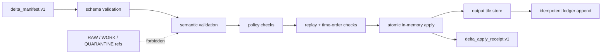

<!-- [KFM_META_BLOCK_V2]
doc_id: kfm://doc/NEEDS-VERIFICATION
title: PMTiles Delta Apply Engine
type: standard
version: v1
status: draft
owners: OWNER_TBD
created: NEEDS VERIFICATION: confirm repository creation date
updated: 2026-05-01
policy_label: NEEDS VERIFICATION: tile release and sensitivity label not confirmed
related: [tools/tiles/kfm_delta_apply.py, tests/test_kfm_delta_apply.py, policy/tiles/delta_apply*.rego, kfm://schema/delta_manifest.v1]
tags: [kfm, tiles, pmtiles, delta, verifier, receipts, policy]
notes: [Grounded in the supplied delta_apply.v1 meta block. File paths, schema fields, policy entrypoints, CLI behavior, and test status remain NEEDS VERIFICATION until the repository and emitted artifacts are inspected.]
[/KFM_META_BLOCK_V2] -->

# PMTiles Delta Apply Engine

Fail-closed verification and atomic fixture-store apply behavior for `delta_manifest.v1`.

> [!IMPORTANT]
> **Status:** draft / `NEEDS VERIFICATION`  
> **Owner:** `OWNER_TBD`  
> **Proposed path:** `docs/tiles/delta_apply.md`  
> **Object family:** `delta_apply.v1`  
> **Truth posture:** CONFIRMED user-supplied design source / PROPOSED documentation placement / UNKNOWN repo implementation depth

## Quick navigation

- [Purpose](#purpose)
- [Evidence boundary](#evidence-boundary)
- [Operating law](#operating-law)
- [Accepted inputs](#accepted-inputs)
- [Digest rules](#digest-rules)
- [Verification gates](#verification-gates)
- [Apply behavior](#apply-behavior)
- [Governed apply receipt](#governed-apply-receipt)
- [Replay and rollback protections](#replay-and-rollback-protections)
- [Expected repo surfaces](#expected-repo-surfaces)
- [Validation checklist](#validation-checklist)
- [Rollback](#rollback)
- [Open verification backlog](#open-verification-backlog)

## Purpose

`delta_apply.v1` defines a fail-closed client verification and apply engine for PMTiles delta manifests.

The engine verifies a `delta_manifest.v1` manifest before any output tile store, ledger entry, or governed apply receipt is written. Its current thin-slice fixture model uses JSON tile stores with base64 payloads rather than real PMTiles binary mutation.

The goal is not to make a tile patcher look successful. The goal is to make every accepted tile delta inspectable, replay-resistant, digest-bound, policy-checkable, and reversible.

## Evidence boundary

This document is a repo-useful draft. It does not prove that the referenced files currently exist or pass tests.

| Claim area | Status | Handling |
| --- | --- | --- |
| `delta_apply.v1` purpose and behavior | CONFIRMED from supplied meta block | Preserved as the controlling design source. |
| `delta_manifest.v1` schema fields | NEEDS VERIFICATION | Do not hard-code field names beyond the supplied semantics until schema is inspected. |
| `tools/tiles/kfm_delta_apply.py` | NEEDS VERIFICATION | Treat as expected target path, not proven implementation. |
| `tests/test_kfm_delta_apply.py` | NEEDS VERIFICATION | Treat as expected test path, not proven passing test evidence. |
| `policy/tiles/delta_apply*.rego` | NEEDS VERIFICATION | Treat as expected policy family, not proven OPA behavior. |
| Real PMTiles binary extraction bridge | DEFERRED | Current fixture model intentionally uses JSON tile stores only. |

> [!NOTE]
> Current behavior is not proven until the mounted repo, schema registry, policy files, tests, CLI output, receipts, and ledger artifacts are inspected.

## Operating law

The apply engine sits downstream of KFM lifecycle governance.

```text
RAW -> WORK / QUARANTINE -> PROCESSED -> CATALOG / TRIPLET -> PUBLISHED
```

Normal public clients and public-facing UI surfaces must not use RAW, WORK, or QUARANTINE references as ordinary inputs. A delta manifest that points at forbidden lifecycle states must fail verification before mutation.



Diagram status: PROPOSED flow, grounded in the supplied delta-apply semantics. Exact file homes, field names, and policy entrypoints remain NEEDS VERIFICATION.

## Accepted inputs

The engine accepts only fixture-mode inputs until the PMTiles bridge is implemented.

| Input | Required posture |
| --- | --- |
| `delta_manifest.v1` manifest | Schema-valid, spec-hash-bound, lifecycle-safe, replay-checkable. |
| `base_tile_store.json` | JSON tile store with base64 payloads and deterministic z/x/y keys. |
| `delta_tile_store.json` | JSON tile store with base64 payloads for added or modified tiles. |
| Prior ledger state | Needed for replay, duplicate delta, and stale `time_end` checks. |
| Policy decision input | Needed before output store or success receipt is written. |

## Exclusions

The current thin slice does not accept or claim support for:

- raw PMTiles binary mutation
- live CDN publication
- direct public use of RAW, WORK, or QUARANTINE references
- unreviewed policy override
- stale replay state
- missing or ambiguous prior digest checks
- generated language as verification evidence

## Fixture model

Fixture stores are JSON objects keyed by tile coordinate.

Illustrative shape only:

```json
{
  "12/345/678": {
    "z": 12,
    "x": 345,
    "y": 678,
    "payload_b64": "BASE64_PAYLOAD_NEEDS_FIXTURE",
    "digest": "sha256:NEEDS_VERIFICATION"
  }
}
```

Fixture schema details are NEEDS VERIFICATION. The fixture format should stay deliberately small so verifier behavior can be tested without depending on PMTiles binary tooling.

## Digest rules

Added and modified tiles use payload-byte hashing.

```text
digest = SHA-256(decoded base64 payload bytes)
```

Removed tiles use tombstone hashing.

```text
digest = SHA-256(canonical tombstone JSON)
```

Canonical tombstone JSON must use sorted keys and compact separators. The exact tombstone object must be fixed by `delta_manifest.v1`.

Illustrative tombstone only:

```json
{"removed":true,"x":345,"y":678,"z":12}
```

> [!WARNING]
> Do not treat the illustrative tombstone above as the contract. The real tombstone fields and canonicalization rule must be verified against `delta_manifest.v1` and covered by tests.

## Verification gates

Verification is fail-closed. A failed gate prevents output store writes, success receipt writes, and successful ledger append.

| Gate | Reject when | Expected evidence |
| --- | --- | --- |
| Schema | Manifest fails `delta_manifest.v1`. | Schema validation report. |
| Spec hash | Manifest is not bound to expected spec hash. | `spec_hash` comparison result. |
| Lifecycle refs | Manifest references RAW, WORK, or QUARANTINE. | Lifecycle reference scan. |
| Produced count parity | Declared and computed counts diverge. | Count parity report. |
| Unique tile keys | Duplicate `z/x/y` key appears. | Deduplicated key index. |
| Masked percentage | Masked percent exceeds threshold. | Threshold decision record. |
| Added tile | Missing payload or payload digest mismatch. | Payload digest check. |
| Modified tile | Missing/incorrect prior digest or replacement digest mismatch. | Prior and new digest checks. |
| Removed tile | Missing/incorrect prior digest or tombstone digest mismatch. | Prior digest and tombstone digest checks. |
| Replay | Replay hash mismatches prior ledger context. | Replay validation result. |
| Time order | `time_end` is older than current applied state. | Time-order check. |
| Policy | Policy denies or cannot evaluate safely. | Policy decision record. |

## Apply behavior

Apply is atomic in memory.

The engine should:

1. Load manifest and fixture stores.
2. Validate schema.
3. Run semantic checks.
4. Run policy checks.
5. Check replay and time ordering.
6. Compute the complete output store in memory.
7. Write the output store only after verification succeeds.
8. Write the governed apply receipt only after verification succeeds.
9. Append to the ledger idempotently for the same `delta_id + manifest_hash`.

The engine must not write partial output, partial success receipts, or ambiguous ledger records.

## Governed apply receipt

A successful apply emits a governed receipt. This receipt is audit evidence for the transition; it is not publication authority by itself.

Minimum proposed receipt shape:

```yaml
receipt_type: delta_apply_receipt.v1
delta_id: DELTA_ID_NEEDS_VERIFICATION
manifest_hash: sha256:MANIFEST_HASH_NEEDS_VERIFICATION
spec_hash: sha256:SPEC_HASH_NEEDS_VERIFICATION
base_store_hash_before: sha256:BASE_STORE_HASH_NEEDS_VERIFICATION
delta_store_hash: sha256:DELTA_STORE_HASH_NEEDS_VERIFICATION
output_store_hash_after: sha256:OUTPUT_STORE_HASH_NEEDS_VERIFICATION
tile_counts:
  added: 0
  modified: 0
  removed: 0
  unchanged: 0
verification:
  schema_valid: true
  semantic_valid: true
  lifecycle_refs_valid: true
  count_parity_valid: true
  masked_pct_valid: true
  replay_valid: true
  time_order_valid: true
policy:
  decision: ALLOW
  policy_bundle_ref: POLICY_BUNDLE_REF_NEEDS_VERIFICATION
applied_at: DATE_NEEDS_VERIFICATION
tool:
  name: kfm_delta_apply
  version: VERSION_NEEDS_VERIFICATION
```

Required receipt fields remain PROPOSED until the actual receipt schema is inspected or created.

## Replay and rollback protections

Replay protection depends on manifest hash, prior digest checks, replay hash checks, and time ordering.

The engine fails when:

- `prior_digest` does not match the base tile payload
- replay hash does not match the expected prior context
- the same `delta_id` appears with a different manifest hash
- `time_end` is older than the current applied state, unless a future reviewed override workflow exists

Rollback of a successful apply must be a governed correction or rollback transition. It must not be silent deletion of stores, receipts, or ledger entries.

## Expected repo surfaces

These paths are user-supplied target paths and remain NEEDS VERIFICATION until the repo is inspected.

| Surface | Path | Status |
| --- | --- | --- |
| Apply engine | `tools/tiles/kfm_delta_apply.py` | NEEDS VERIFICATION |
| Tests | `tests/test_kfm_delta_apply.py` | NEEDS VERIFICATION |
| Policy | `policy/tiles/delta_apply*.rego` | NEEDS VERIFICATION |
| Manifest schema | `kfm://schema/delta_manifest.v1` | NEEDS VERIFICATION |
| Base fixture | `tests/fixtures/tiles/base_tile_store.json` | PROPOSED |
| Delta fixture | `tests/fixtures/tiles/delta_tile_store.json` | PROPOSED |
| Receipt fixture | `tests/fixtures/tiles/delta_apply_receipt.v1.json` | PROPOSED |
| Ledger fixture | `tests/fixtures/tiles/delta_apply_ledger.jsonl` | PROPOSED |

## Validation checklist

- [ ] Confirm target path for this document.
- [ ] Confirm owner or steward.
- [ ] Inspect `delta_manifest.v1` schema.
- [ ] Confirm tombstone canonical JSON fields.
- [ ] Confirm digest prefix convention: raw hex vs `sha256:<hex>`.
- [ ] Confirm masked percentage threshold.
- [ ] Confirm forbidden lifecycle reference fields.
- [ ] Confirm replay hash algorithm and replay context fields.
- [ ] Confirm stale `time_end` comparison semantics.
- [ ] Confirm output store hash canonicalization.
- [ ] Confirm ledger idempotency behavior for same `delta_id + manifest_hash`.
- [ ] Confirm duplicate `delta_id` with different manifest hash fails.
- [ ] Confirm OPA/Rego policy entrypoints.
- [ ] Confirm test runner and CI path.
- [ ] Confirm no output store or success receipt is written on failed verification.
- [ ] Confirm rollback/correction receipt behavior.

## Suggested negative tests

| Test | Expected outcome |
| --- | --- |
| Manifest schema violation | DENY / ERROR before apply. |
| Added tile payload digest mismatch | Fail before output write. |
| Modified tile prior digest mismatch | Fail before output write. |
| Removed tile tombstone digest mismatch | Fail before output write. |
| Duplicate z/x/y key | Fail before output write. |
| RAW reference in manifest | Fail before output write. |
| WORK reference in manifest | Fail before output write. |
| QUARANTINE reference in manifest | Fail before output write. |
| Produced count mismatch | Fail before output write. |
| Masked percentage above threshold | Fail before output write. |
| Replay hash mismatch | Fail before output write. |
| Older `time_end` | Fail by default. |
| Same delta ID, same manifest hash | Idempotent ledger handling. |
| Same delta ID, different manifest hash | Fail closed. |

## Implementation sequence

1. Confirm schema home and document path.
2. Add or verify `delta_manifest.v1`.
3. Add fixture tile stores.
4. Implement digest helpers.
5. Implement tombstone canonicalization.
6. Implement schema and semantic verifier.
7. Implement replay and time-order checks.
8. Implement policy input adapter.
9. Implement atomic in-memory apply.
10. Implement receipt emission.
11. Implement ledger idempotency.
12. Add negative tests before positive publication-style tests.
13. Add CI gates only after local tests are deterministic.

## Rollback

Rollback is required when a change weakens digest verification, allows forbidden lifecycle references, bypasses policy checks, writes partial output after failed verification, or creates ledger ambiguity.

Rollback target: `ROLLBACK_TARGET_NEEDS_VERIFICATION`

Fixture-level rollback is simple: failed verification must leave no output store and no success receipt. Successful apply rollback must be represented as a governed correction or rollback transition keyed by:

- `delta_id`
- `manifest_hash`
- prior store hash
- output store hash
- receipt ID
- rollback reason
- reviewer or policy decision reference

## Open verification backlog

| Item | Status | Required check |
| --- | --- | --- |
| Real PMTiles extraction bridge | DEFERRED | Define bridge contract after fixture verifier is stable. |
| Binary PMTiles mutation | DEFERRED | Do not implement before digest and receipt semantics pass. |
| Source rights and sensitivity | UNKNOWN | Confirm release class before public publication. |
| Policy bundle reference | NEEDS VERIFICATION | Confirm policy packaging and version hash. |
| Receipt schema | PROPOSED | Create or inspect `delta_apply_receipt.v1`. |
| Ledger schema | PROPOSED | Create or inspect ledger object family. |
| CLI flags | UNKNOWN | Inspect `tools/tiles/kfm_delta_apply.py --help` when available. |
| CI command | UNKNOWN | Confirm repo-native test and policy commands. |
| Public client behavior | UNKNOWN | Confirm governed API and UI consumption path if this reaches release. |
