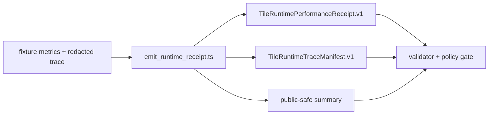

# Tile Runtime Performance Governance (KFM)

> KFM Meta Block V2
> - Status: PROPOSED
> - Owners: NEEDS_VERIFICATION
> - Policy label: `kfm.tile_runtime.v1`

## Purpose
Govern runtime verify/decode/render harness outputs without treating renderer output as canonical truth.

## Flow

## Fail-closed budgets
| Metric | Budget key | Deny condition |
|---|---|---|
| Mean verify+decode | `max_mean_verify_decode_ms` | actual > budget |
| p95 verify+decode | `max_p95_verify_decode_ms` | actual > budget |
| Renderer memory proxy | `max_peak_renderer_memory_mb` | actual > budget |
| Tile verification failures | `failed_tile_count` | > 0 |
| Fetch concurrency | `max_parallel_fetches` | actual > budget |
| Verifier workers | `max_verifier_workers` | actual > budget |

## Public-safe rules
- redact tile URLs
- block internal paths
- block sensitive geometry in public summaries
- deny on uncertainty or missing references

## CI gate behavior
Run no-network checks: emitter, pytest (`tests/tile_runtime`), validator, and optional `opa test` (NEEDS_VERIFICATION in runner).

## What this is / is not
- Is: deterministic governance receipts around runtime checks.
- Is not: publication approval or truth proof.
