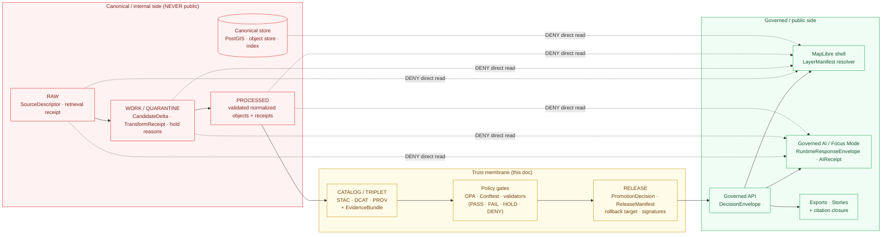
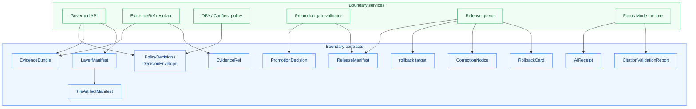

<!--
================================================================================
KFM Meta Block v2
--------------------------------------------------------------------------------
doc_id:             kfm://doc/arch-trust-membrane
title:              Trust Membrane — Architecture
class:              architecture / cross-cutting enforcement
status:             draft
truth_posture:      cite-or-abstain
governance_layer:   trust boundary (data plane <-> public plane)
proposed_path:      docs/architecture/trust-membrane.md   (PROPOSED)
directory_rule:     §6 docs/architecture/<topic>.md — cross-cutting doctrine
                    has an architecture-perspective companion. The principle
                    lives at docs/doctrine/trust-membrane.md; this file is
                    the architectural wiring view. See §1.2 for the split.
sibling_docs:       docs/architecture/system-context.md
                    docs/architecture/deployment-topology.md
                    docs/architecture/governed-api.md
                    docs/architecture/map-shell.md
                    docs/architecture/maplibre-3d.md
                    docs/architecture/spatial-foundation.md
                    docs/architecture/contract-schema-policy-split.md
doctrinal_anchor:   docs/doctrine/trust-membrane.md  (CONFIRMED authority per
                    directory-rules.md v1.3; this architecture doc must not
                    contradict it — see §1.2).
related_doctrine:   docs/doctrine/authority-ladder.md
                    docs/doctrine/lifecycle-law.md
                    docs/doctrine/truth-posture.md
                    docs/doctrine/directory-rules.md (v1.3)
related_atlas:      KFM_Domains_v1_1 §20 (Master API/Validator/Test);
                    Pass 23/32 Atlas §24.3 (decision outcomes), §24.7
                    (separation of duties), §24.9.2 (trust-membrane
                    anti-patterns), §24.9.3 (governance-process anti-patterns).
related_adrs:       ADR-0001 (schema home) — CONFIRMED authored.
                    ADR-0006 (policy engine / default-deny) — PROPOSED in
                    Build Manual Appendix B.
                    ADR-0014 (release / correction / withdrawal / rollback
                    model) — PROPOSED in Build Manual Appendix B.
                    ADR-S-06 (AI surface boundary) — PROPOSED in Atlas
                    open-ADR backlog.
                    ADR-S-09 (reviewer role separation) — PROPOSED.
spec_hash:          NEEDS VERIFICATION (generated at release time).
owners:             <PLACEHOLDER — trust-membrane steward; do not invent>
created:            <YYYY-MM-DD — set on PR>
updated:            <YYYY-MM-DD — set on PR>
policy_label:       public
tags:               [kfm, architecture, trust-membrane, governance,
                    governed-api, lifecycle, finite-outcomes, separation-of-duties]
notes:              Authored docs-only; no mounted repo, ADR set, CI run,
                    runtime log, or release artifact inspected. Every
                    implementation-layer path, route, schema, or test claim
                    is PROPOSED until mounted-repo verification.
================================================================================
-->

<a id="top"></a>

# Trust Membrane — Architecture


<!-- CI badge URL is a placeholder; no mounted workflow was verified this session.

-->

> **One-line purpose.** Describe how KFM's **trust membrane** — the architectural boundary that prevents raw, unreviewed, restricted, or generated state from becoming public truth — is **wired** in the system: where its enforcement points live, what crossings it permits, what finite outcomes mark its edge, how promotion gates A–G operate at the boundary, what anti-patterns route to which DENY surfaces, and how the membrane is validated, rolled back, and corrected.

> [!IMPORTANT]
> The **principle** of the trust membrane is doctrine. It lives at [`docs/doctrine/trust-membrane.md`](../doctrine/trust-membrane.md). This document is the **architecture-perspective companion**: it describes *how the membrane is realized in code, contracts, policies, and infrastructure*. Where the two documents touch the same concept, the **doctrinal version is authoritative** and this file must not silently amend it; any amendment is ADR-class per *directory-rules.md* §2.4. See [§1.2](#1.2) for the split.

---

## Mini Table of Contents

- [1. Architectural role and posture](#1)
- [2. The two sides of the membrane](#2)
- [3. Enforcement points (where the membrane lives in the code)](#3)
- [4. Crossings — the only legitimate paths into public state](#4)
- [5. Finite outcomes at the edge — ANSWER · ABSTAIN · DENY · ERROR · HOLD](#5)
- [6. Promotion gates A–G as boundary controls](#6)
- [7. Trust-membrane anti-patterns and their DENY surfaces](#7)
- [8. Separation of duties at the membrane](#8)
- [9. Stale state, correction, rollback at the membrane](#9)
- [10. Failure modes — what happens when the membrane breaks](#10)
- [11. Repository placement (PROPOSED)](#11)
- [12. Validation tests](#12)
- [13. Open questions and verification backlog](#13)
- [14. Glossary tie-in](#14)
- [Related docs · Footer](#related)

---

<a id="1"></a>

## 1. Architectural role and posture

### 1.1 What the trust membrane is, architecturally

> **CONFIRMED doctrine.** *KFM Atlas v1.1 Appendix A* defines the trust membrane as **"the boundary that prevents raw, unreviewed, restricted, or generated state from becoming public truth."** *[DIRRULES] [GAI]*

Architecturally, that boundary is not a single component; it is a **distributed enforcement surface** realized through a small, well-known set of contracts, services, schemas, policies, and tests. The membrane is "alive" wherever:

- An artifact transitions across the lifecycle (`RAW → WORK / QUARANTINE → PROCESSED → CATALOG / TRIPLET → PUBLISHED`).
- A public client requests a layer, feature, evidence projection, or AI answer.
- A reviewer signs a `PromotionDecision`, `ReleaseManifest`, `CorrectionNotice`, or `RollbackCard`.
- A validator or policy gate returns a finite outcome (`ANSWER · ABSTAIN · DENY · ERROR · HOLD`).

Said negatively: **anywhere none of those things happens but public exposure does, the membrane has been bypassed.**

<a id="1.2"></a>

### 1.2 Doctrine vs. architecture — the split this document maintains

> [!NOTE]
> The trust membrane is doctrinal **and** architectural. The corpus distinguishes the two responsibilities cleanly. This file respects that split.

| Concern | Lives in | Owns |
|---|---|---|
| **Principle** — what the membrane is, why it exists, the cite-or-abstain posture, the "raw → public truth" invariant. | [`docs/doctrine/trust-membrane.md`](../doctrine/trust-membrane.md) *(CONFIRMED home per directory-rules.md §6.1)*. | The **rule**. |
| **Architecture** — where the rule is enforced; the components, contracts, schemas, and tests that realize it; the DENY surfaces and finite-outcome envelopes; the diagrams. | **This file** (`docs/architecture/trust-membrane.md`). | The **wiring**. |
| **Placement law** — root folders, schema home, policy home, lifecycle roots, ADR triggers. | [`docs/doctrine/directory-rules.md`](../doctrine/directory-rules.md). | The **map**. |

> [!WARNING]
> A trust-membrane claim that appears here but not in the doctrinal file is **PROPOSED architecture commentary**, not new doctrine. If this file looks like it adds a new invariant, that change is **ADR-class** per *directory-rules.md* §2.4 and must be filed before adoption.

### 1.3 Invariants this document preserves

| # | Invariant | Source |
|---|---|---|
| I-TM-1 | **CONFIRMED** — Public clients and normal UI surfaces use **governed APIs and released artifacts**, never canonical or internal stores. | [ENCY] [GAI] KFM-P1-FEAT-0038. |
| I-TM-2 | **CONFIRMED** — The MapLibre shell consumes released layers through a `LayerManifest` resolver; it does not reach back past the API. | [MAP-MASTER] [GAI] |
| I-TM-3 | **CONFIRMED** — Governed AI / Focus Mode answers from resolved `EvidenceBundle`s, not from `RAW / WORK / QUARANTINE`. | [GAI] |
| I-TM-4 | **CONFIRMED** — Every governed surface returns a **finite outcome** from `{ANSWER, ABSTAIN, DENY, ERROR, HOLD}` (and `{PASS, FAIL}` for validator-class). | [GAI] [ENCY] Atlas §24.3.1. |
| I-TM-5 | **CONFIRMED** — Default-deny: absence of evidence, policy, review, or release state **blocks** public exposure. | [ENCY] C5-02. |
| I-TM-6 | **CONFIRMED** — Promotion is a **governed state transition**, not a file move. Gates A–G apply. | [DIRRULES] [ENCY] C5-01. |
| I-TM-7 | **CONFIRMED** — Source role is **fixed at admission**; promotion never upgrades it. | [ENCY] Pass-23 §3. |
| I-TM-8 | **CONFIRMED** — Sensitive content is transformed, generalized, or denied **before** the renderer or AI surface. Style filters are not protection. | [MAP-MASTER] ML-Q-082. |
| I-TM-9 | **CONFIRMED** — Release without `ReleaseManifest` and rollback target is forbidden. | [ENCY] [DIRRULES] |
| I-TM-10 | **CONFIRMED** — Admin shortcuts must be justified, constrained, audited, and **kept out of the normal public path**. | [GAI] [DIRRULES] |

[↑ Back to top](#top)

---

<a id="2"></a>

## 2. The two sides of the membrane

> **CONFIRMED doctrine.** *Atlas §24.9.2* names the two sides as "canonical/internal" and "governed/public." The membrane exists to keep them separate.



> [!TIP]
> Read the diagram as a one-way valve. **Every arrow into the public side passes through `PolicyDecision → PromotionDecision → ReleaseManifest`.** Dashed lines are DENY edges — they are not just unwired; they are actively blocked by the validators, policies, and contracts listed in [§3](#3).

### 2.1 Concrete examples of each side

| Side | Examples (illustrative) |
|---|---|
| **Canonical / internal** | `data/raw/`, `data/work/`, `data/quarantine/`, `data/processed/`, PostGIS canonical schemas, internal object store, raw STAC drafts, candidate `LayerManifest`s not yet signed, model checkpoints, AI prompts and intermediate generation. |
| **Trust membrane (boundary)** | `data/catalog/{stac,dcat,prov}/`, `data/triplets/`, `data/receipts/`, `data/proofs/`, `release/manifests/`, `release/promotion_decisions/`, `release/rollback_cards/`, `policy/**`, `tools/validators/`, `tools/promotion_gate/`. |
| **Governed / public** | `apps/governed-api/`, `apps/explorer-web/` (MapLibre shell), Focus Mode endpoints, exports / story snapshots, governed Evidence Drawer payloads. |

> **PROPOSED placement.** Paths above follow *Build Manual* §5 and *directory-rules.md* v1.3; mounted-repo presence is **UNKNOWN** this session.

[↑ Back to top](#top)

---

<a id="3"></a>

## 3. Enforcement points (where the membrane lives in the code)

> **PROPOSED architectural realization.** The corpus names the enforcement surfaces; mapping them to specific repository homes is **PROPOSED** until verified. None is claimed to exist in a mounted repo from this session.

| Enforcement point | What it enforces | Outcome verbs | Proposed home |
|---|---|---|---|
| **Governed API** (`apps/governed-api/`) | I-TM-1, I-TM-4 — every public surface returns a `DecisionEnvelope`; canonical reads are denied. | `ANSWER · ABSTAIN · DENY · ERROR` | `apps/governed-api/` |
| **LayerManifest resolver** | I-TM-2 — public layer fetch must go through resolver; only released manifests answer. | `ANSWER · DENY · ERROR` | `apps/governed-api/` route + `packages/maplibre-runtime/` |
| **EvidenceRef → EvidenceBundle resolver** | I-TM-3 — composed claims render only when all required `EvidenceRef`s resolve; otherwise abstain. | `ANSWER · ABSTAIN · DENY · ERROR` | `packages/evidence/` |
| **Focus Mode runtime** | I-TM-3, I-TM-4 — AI answers cite released bundles; ABSTAIN otherwise; DENY on policy / sensitivity. | `ANSWER · ABSTAIN · DENY · ERROR` | `packages/ai/` + `apps/governed-api/` |
| **Promotion gate validator** | I-TM-5, I-TM-6 — Gates A–G ([§6](#6)); fail-closed on any missing receipt, signature, DQ check, sensitivity sign-off. | `PASS · FAIL · HOLD` | `tools/promotion_gate/` |
| **OPA / Conftest policy bundle** | I-TM-4, I-TM-5, I-TM-8 — emits `PolicyDecision` (`DecisionEnvelope`) for access, render, capability, consent, sensitivity, promotion. | `ALLOW · DENY · ABSTAIN · ERROR` | `policy/` (Build Manual §5; directory-rules v1.3) |
| **Release queue / `ReleaseManifest`** | I-TM-9 — public exposure denied until manifest signed, rollback target present, derivative invalidation listed. | `PASS · FAIL · HOLD` | `release/manifests/`, `release/promotion_decisions/`, `release/rollback_cards/` |
| **Citation validation** | I-TM-3 — Focus Mode and exports fail closed on uncited or unresolvable claims. | `PASS · FAIL` | `packages/evidence/` + `tools/validators/` |
| **Renderer-boundary tests** | I-TM-2 — CI denies a public client that bypasses the resolver. | `PASS · FAIL` | `tests/contract/` + `tests/policy/` |
| **Cross-renderer test absence** | I-TM-2 *(v1.3 sole-renderer doctrine)* — directory is doctrinally empty; presence is drift. | n/a | `tests/integration/cross-renderer/` — **must not exist** (see [`maplibre-3d.md`](./maplibre-3d.md), *directory-rules.md* §13.5). |
| **Source-role anti-collapse validator** | I-TM-7 — promotion that "upgrades" modeled → observed → authority is rejected. | `PASS · FAIL` | `tools/validators/source_role/` |
| **`AIReceipt` evaluator** | I-TM-3 — every AI surface answer records inputs, evidence ids, citation report id, policy ids, outcome. | n/a (audit) | `packages/ai/` |
| **Admin-shortcut audit** | I-TM-10 — admin / break-glass paths are not normal-path public routes; audit log + steward review. | n/a (audit) | `tools/audit/` + `docs/security/` |

### 3.1 Components and contracts at a glance



[↑ Back to top](#top)

---

<a id="4"></a>

## 4. Crossings — the only legitimate paths into public state

> **CONFIRMED doctrine.** Atlas §20.3 (Master API Surface Table) enumerates the surfaces; *Build Manual* §29 shows the no-network proof slice. Every legitimate crossing is enumerated below.

| Crossing | Carrier | Required pre-conditions | Finite outcomes |
|---|---|---|---|
| **Source summary** | `SourceDescriptor` projection | `SourceDescriptor` exists; rights resolved. | `ANSWER · ABSTAIN · DENY · ERROR` |
| **Domain feature / detail lookup** | `DomainFeatureEnvelope` + `DecisionEnvelope` | `EvidenceRef` resolves; policy permits; release applies. | `ANSWER · ABSTAIN · DENY · ERROR` |
| **Layer manifest fetch** | `LayerManifest` (+ `TileArtifactManifest`) | `ReleaseManifest` applies; rollback target valid. | `ANSWER · DENY · ERROR` |
| **Evidence resolution** | `EvidenceBundle` | `EvidenceRef` resolves to a released bundle. | `ANSWER · ABSTAIN · DENY · ERROR` |
| **Focus Mode runtime answer** | `RuntimeResponseEnvelope` + `AIReceipt` | All required `EvidenceRef`s resolve; `CitationValidationReport` passes; policy permits. | `ANSWER · ABSTAIN · DENY · ERROR` |
| **Review queue surface** | `ReviewRecord` + `PolicyDecision` | Steward / rights-holder review present. | `ALLOW · RESTRICT · DENY · ERROR` |
| **Correction / rollback** | `CorrectionNotice` + `RollbackCard` | Derivative invalidation listed; prior release referenced. | `ACCEPTED · HOLD · DENY · ERROR` |

> [!NOTE]
> Every row above lists **what the public sees**. None of them returns raw bytes, internal store identifiers, unreleased candidates, or uncited AI language. Returning any of those is the failure-mode register from [§10](#10).

### 4.1 The minimal proof slice (no-network)

> **CONFIRMED scaffold — *Build Manual* §29 Appendix A.** Reproduced for orientation; this is the architectural trace of one valid crossing from end to end.

```text
SourceDescriptor (public-safe synthetic fixture)
  → RAW fixture metadata only
  → PROCESSED HUC12 fixture
  → EvidenceBundle
  → LayerManifest
  → StyleManifest
  → TileArtifactManifest or GeoJSON fixture
  → CatalogMatrix dry run
  → PromotionReceipt dry run
  → MapReleaseManifest dry run
  → MapLibre click fixture
  → EvidenceDrawerPayload
  → FocusModeRequest
  → MockAdapter response
  → CitationValidationReport
  → RuntimeResponseEnvelope
  → AIReceipt + RunReceipt
  → rollback target
```

Expected outcomes on this slice (Build Manual §29):

- `ANSWER` on valid public-safe fixture.
- `ABSTAIN` on missing `EvidenceBundle`.
- `DENY` on sensitive exact geometry.
- `DENY` on unknown rights.
- `ERROR` on policy engine unavailable.
- `DENY` release on missing rollback.
- `DENY` UI direct model call.
- `DENY` public raw path.

[↑ Back to top](#top)

---

<a id="5"></a>

## 5. Finite outcomes at the edge — ANSWER · ABSTAIN · DENY · ERROR · HOLD

> **CONFIRMED doctrine.** *Atlas §24.3.1* names the finite outcome set and the public-surface effect of each. **Operational states** (`NORMAL · DEGRADED · ESCALATE · QUARANTINE`) are deliberately **separate** from finite decision outcomes. *(ML-065-008.)*

| Outcome | When | Required artifacts | Public-surface effect |
|---|---|---|---|
| **`ANSWER`** | Evidence sufficient; policy permits; release state allows; review (if required) recorded. | Resolved `EvidenceBundle`; `PolicyDecision = ALLOW`; `ReleaseManifest` applies. | Substantive answer with Evidence Drawer and citation. |
| **`ABSTAIN`** | Evidence insufficient; cannot cite; or evidence stale and no released alternative. | `AIReceipt` with reason; **no claim emitted**. | Non-substantive note with reason; **never invents**. |
| **`DENY`** | Policy, rights, sensitivity, or release state forbids. **Sensitive lanes default here.** | `PolicyDecision = DENY` + reason code; `AIReceipt` records denial. | Denial reason; offers alternative non-restricted surface where possible. |
| **`ERROR`** | Governed API cannot evaluate — missing schema, malformed query, contract violation, infra failure. | Error envelope with diagnostic code; no claim leakage. | Finite, actionable error; **never falls through silently**. |
| **`HOLD`** | Promotion / release / correction paused pending steward, rights-holder, or policy review. | `ReviewRecord` pending; `PolicyDecision = HOLD`; no public claim while held. | Surface remains in prior state; no silent rollback. |

> [!CAUTION]
> A "soft" outcome — `WARN`, `MAYBE`, `PARTIAL`, `KIND_OF_OK`, `FYI`, free-form status string — is **forbidden at the boundary**. Every public-side response either commits to one of the five outcomes above or is rejected as `ERROR`. The validator that enforces this lives in `tests/contract/` (PROPOSED).

### 5.1 `DecisionEnvelope` shape (PROPOSED, mirrored from Pass-23 KFM-P5-PROG-0001)

```text
{
  "decision_id":   "<uuid>",
  "outcome":       "ANSWER | ABSTAIN | DENY | ERROR | HOLD",
  "policy_family": "promotion | access | render | capability | consent | sensitivity",
  "reasons":       ["missing_spec_hash", "blocking_obligations_1", ...],
  "obligations":   [{ "type": "redact", "op": "generalize_geometry", "level": "coarse" }],
  "evaluated_at":  "<ISO-8601>"
}
```

**Proposed schema home (per *directory-rules.md* §7.4 and ADR-0001):** `schemas/contracts/v1/runtime/decision_envelope.schema.json`.

> [!NOTE]
> The `obligations[]` form converges on the structured shape (`{type, op, level?}`); the corpus also shows older string forms. Converging is a **PROPOSED** ADR item (Atlas KFM-P5-PROG-0001 dependencies).

[↑ Back to top](#top)

---

<a id="6"></a>

## 6. Promotion gates A–G as boundary controls

> **CONFIRMED — *KFM Pass-10 dossier* C5-01.** Promotion gates A–G are the canonical seven-gate matrix between authoring and PUBLISHED. The same OPA bundle (pinned by digest) is expected to run in CI (Conftest) and at runtime (PDP). *(C5-03 policy parity.)*

| Gate | Intent | Machine check | Required evidence at the boundary |
|---|---|---|---|
| **A — Structure & Metadata** | Meta block present; zone correct; placement valid. | `check_structure`; placement linter. | KFM Meta Block v2; directory-rules conformance. |
| **B — Schemas & Contracts** | Shape valid; contract honored. | JSON Schema validation; OpenAPI validation. | `schemas/contracts/v1/...` PASS; `contracts/` reference resolves. |
| **C — Policy Parity** | CI policy decision matches runtime. | Conftest / OPA decision; parity test. | Pinned OPA bundle digest matches runtime. |
| **D — Security & Sensitivity** | Sensitivity tier honored; license allowed; rights resolved. | Sensitivity scan; SPDX allowlist; rights probe. | `RedactionReceipt` (where needed); `ReviewRecord` (sensitive lanes). |
| **E — Data Quality** | DQ thresholds met; assertions PASS. | DQ profiler; assertion runner. | `ValidationReport` PASS. |
| **F — Provenance & Lineage** | Receipts cosign-signed; lineage closed. | Cosign verify; OpenLineage event present; PROV closure. | `RunReceipt`, `EvidenceBundle`, PROV record. |
| **G — Reviewability (two-key)** | Human approval + policy approval; CODEOWNERS-enforced. | Required-checks branch protection; reviewer attestation. | `PromotionDecision` signed; reviewer distinct from author on sensitive lanes. |

> [!IMPORTANT]
> **Default-deny is structural.** *(C5-02.)* Promotion is denied unless: `spec_hash` matches recomputation, the run receipt is cosign-signed and verifiable, SPDX rights are in the allowlist, at least one attestation bundle is published, and every DQ check status is PASS. **The absence of evidence blocks promotion.**

### 6.1 What the membrane refuses to do

- Auto-merge until **all seven** gates pass.
- Promote a candidate whose `spec_hash` does not match recomputation.
- Accept a `ReleaseManifest` lacking a rollback target.
- Allow the author to also sign release on a sensitive lane (separation of duties — [§8](#8)).
- Upgrade a source role through promotion (e.g., modeled → observed). *(Atlas Pass-23 §3.)*

[↑ Back to top](#top)

---

<a id="7"></a>

## 7. Trust-membrane anti-patterns and their DENY surfaces

> **CONFIRMED doctrine — *Atlas §24.9.2* and *Doctrine Synthesis* §29.2.** Reproduced here so that any architectural change is evaluated against the same list a reviewer will use.

| Anti-pattern | What goes wrong | DENY surface (where the membrane catches it) |
|---|---|---|
| Public client reads `RAW / WORK / QUARANTINE`. | Trust membrane bypassed; promotion gates skipped. | Governed API; `LayerManifest` resolver. |
| Map shell consumes canonical / internal store directly. | Renderer becomes the public surface and inherits no governance. | MapLibre shell wiring; layer registry; renderer-boundary tests. |
| AI returns uncited language. | Generated text substitutes for evidence; cite-or-abstain broken. | Focus Mode; AI surface steward; `CitationValidationReport`. |
| AI answers from `RAW / WORK` rather than `EvidenceBundle`. | AI becomes its own truth source. | Governed AI runtime; `AIReceipt` evaluator. |
| Sensitive content released without redaction. | `RedactionReceipt` missing; rights / sovereignty violation. | Release queue; sensitivity reviewer; Gate D. |
| Aggregate cited as per-place observation. | Source-role collapse; matrix-cell semantics violated. | Validator; Focus Mode citation evaluator. |
| Synthetic surface presented without **Reality Boundary Note**. | Reconstruction read as observation. | Scene admission gate; representation receipt validator. |
| KFM used as alert / instruction authority. | Out-of-scope use of governed evidence as life-safety guidance. | Hazards / Air / Hydrology surfaces; AI surface scope policy. |
| Release without `ReleaseManifest` or rollback target. | Public surface cannot be rolled back; release not auditable. | Release queue; release authority; Gate G. |
| AI generation routed through an admin shortcut. | Admin bypass becomes a normal-path public route. | Trust-membrane audit; infra; admin-shortcut audit (I-TM-10). |
| Style filter "hides" sensitive geometry. | Geometry still ships to the client. | Sensitivity tests; renderer-boundary tests; `policy/maplibre/` deny rule. |
| Quiet promotion via CI shortcut. | Gates A–G bypassed. | Branch protection; required-checks parity tests. |
| Documenting a change instead of validating it. | Docs become a substitute for tests. | "Docs are part of the working system, never a substitute" rule *(Atlas §24.9.3)*. |
| Two parallel schema homes. | Reviewers no longer know which schema is authoritative. | ADR-0001 (schema home); placement linter. |

> [!WARNING]
> If a PR or change appears to ship one of these patterns "temporarily," the membrane treats *temporary* as **permanent until rolled back**. The architectural answer is to add the missing receipt / signature / review and re-enter the gate, not to ship and patch.

[↑ Back to top](#top)

---

<a id="8"></a>

## 8. Separation of duties at the membrane

> **CONFIRMED doctrine — *Atlas §24.7* and *Doctrine Synthesis* §31.** At release maturity, policy-significant duties are separated by role.

### 8.1 Roles that meet at the boundary

| Role | Owns at the membrane | Cannot also own at the membrane |
|---|---|---|
| **Author / contributor** | Drafts schemas, content, fixtures, candidate deltas. | Self-release on sensitive lanes. |
| **Docs steward** | Doctrine, ADR index, drift register, per-root READMEs. | Admissibility decisions; policy authoring. |
| **Schema steward** | Schema home; validator registry. | Policy authoring; release approval. |
| **Policy steward** | `policy/` content; sensitivity tiers; deny / allow rules. | Source admission; release approval. |
| **Source steward** | `SourceDescriptor`; rights; activation; cadence. | Release approval on sensitive lanes for the same source. |
| **Release authority** | `PromotionDecision`; `ReleaseManifest`; rollback target; correction notice. | Schema / policy authoring on the same release. |
| **Review steward (domain / sensitivity / rights-holder)** | `ReviewRecord`; sensitive-lane sign-off. | Authoring the content being reviewed. |
| **Governed-AI steward** | AI adapter; `AIReceipt`; structured-output validation; replay. | Release approval for content the AI produced. |
| **Correction reviewer** | `CorrectionNotice`; `RollbackCard` sign-off. | Authoring the correction subject. |

### 8.2 Two-person rule

> [!IMPORTANT]
> **For T3 / T4 material, at least one reviewer outside the author's role chain must sign the `PromotionDecision`.** *(PROPOSED; finalized by ADR-S-09.)* The two-person rule applies to sensitive-lane releases, AI surface changes (template / policy binding), correction / rollback when steward-significant, and atlas / supplement publication.

### 8.3 Maturity note

> [!NOTE]
> *Directory Rules* §2 treats separation of duties as **maturity-dependent**. Early-stage doctrine work can be authored and approved by the same actor when materiality is low. As maturity rises and the public trust surface expands, separation must be **enforced through tooling**, not custom. The membrane does not claim that enforcement exists today; it claims that the **architecture is shaped so enforcement can be added without re-plumbing.**

[↑ Back to top](#top)

---

<a id="9"></a>

## 9. Stale state, correction, rollback at the membrane

> **CONFIRMED doctrine.** A `PUBLISHED` claim may become **stale** long before it is corrected. *Atlas §24.8* separates "stale" from "wrong."

### 9.1 Stale markers (visible at the public edge)

| Marker | Triggered by | UI signal | Required action |
|---|---|---|---|
| Source freshness expired | Cadence in `SourceDescriptor` passed without a new admission. | Stale source badge in Evidence Drawer. | Refresh or annotate. |
| Upstream evidence superseded | A required `EvidenceRef` was superseded but not re-resolved here. | Stale evidence badge; `ABSTAIN` for derivatives. | Re-resolve or withdraw. |
| Sensitivity policy moved | Tier scheme updated; current release no longer satisfies. | Restricted / pending badge. | Hold; re-review. |
| Pending correction | `CorrectionNotice` recorded but not yet propagated to derivatives. | Correction-pending badge. | Propagate; rollback if needed. |

### 9.2 Correction lifecycle

```mermaid
sequenceDiagram
    autonumber
    participant DET as Detector (validator / reviewer)
    participant CR  as Correction reviewer
    participant RA  as Release authority
    participant API as Governed API
    participant ML  as MapLibre / Focus Mode

    DET->>CR: file CorrectionNotice (lists invalidated derivatives)
    CR->>RA: sign CorrectionNotice
    RA->>RA: prepare RollbackCard (rollback target = prior release)
    RA->>API: emit new ReleaseManifest OR repoint to rollback target
    API-->>ML: layers / answers reflect corrected or rolled-back state
    Note over ML: Stale badges clear; correction-pending<br/>badges resolve; AI surface re-resolves<br/>EvidenceRefs and may now ABSTAIN<br/>on still-pending derivatives.
```

> [!IMPORTANT]
> **A correction that does not list invalidated derivatives is rejected.** *(Atlas §24.9.3; *Doctrine Synthesis* §29.3.)* The membrane's correction path is not "fix the one record"; it is "fix the one record **and** propagate or withdraw everything that referenced it."

### 9.3 Rollback target

Every `ReleaseManifest` MUST carry a rollback target (Atlas; Build Manual §10). The rollback target is not a backup — it is a **named, signed previous release state** that public clients can be redirected to without rewriting history. The `RollbackCard` is exercised periodically through drills.

[↑ Back to top](#top)

---

<a id="10"></a>

## 10. Failure modes — what happens when the membrane breaks

> **PROPOSED architectural failure register**, derived from *Atlas §24.10*, *Doctrine Synthesis* §30, and *Master MapLibre v2.1* anti-pattern entries. Pairs each failure with a counter-control already named in this document.

| Failure | What it looks like | Counter-control | Section |
|---|---|---|---|
| Public route bypasses the resolver. | Direct fetch of canonical store URL. | Renderer-boundary test; layer-manifest resolver as sole layer source. | [§3](#3), [§7](#7) |
| AI emits uncited language. | A Focus Mode answer without `CitationValidationReport`. | Cite-or-abstain rule; `AIReceipt` evaluator. | [§5](#5), [§7](#7) |
| Promotion without rollback target. | `ReleaseManifest` signed but `rollback_target` absent. | Gate G; release-queue admission. | [§6](#6) |
| Style filter used for sensitivity. | Sensitive geometry in the tile, "hidden" by paint rule. | Sensitivity tests; `policy/maplibre/` deny rule. | [§7](#7) |
| Source-role upgrade. | Modeled artifact relabeled "observed" at promotion. | Source-role anti-collapse validator. | [§3](#3), [I-TM-7](#1.3) |
| Quiet promotion via CI shortcut. | Branch protection bypassed; required-checks not all green. | Required-checks branch protection; parity test (C5-03). | [§6](#6) |
| Admin shortcut on the public path. | Break-glass route renders public answers without gates. | Admin-shortcut audit (I-TM-10); infra review. | [§3](#3) |
| Replay drift after dependency bump. | Same input, different output, no announcement. | Replay golden hashes; pinned environment. | [§12](#12) |
| Documentation drift vs. implementation. | Docs say "the system does X"; the system does not. | Drift register; docs-update rule. | [§14](#14) |
| Cross-lane source-role mixing on joins. | Aggregate row joined to a per-place row; UI implies per-place truth. | Most-restrictive-applicable-row default; join policy. | [§7](#7) |

[↑ Back to top](#top)

---

<a id="11"></a>

## 11. Repository placement (PROPOSED)

> [!IMPORTANT]
> All paths below are **PROPOSED** until verified against a mounted repository. They follow *directory-rules.md* v1.3 §6 (`docs/architecture/`), §7.1 (`apps/`), §7.2 (`packages/`), §7.4 (`schemas/contracts/v1/`), §10.4 (cross-domain doctrine), and §11 (release homes).

```text
docs/
├── architecture/
│   ├── trust-membrane.md          # this file (PROPOSED)
│   ├── system-context.md          # PROPOSED sibling
│   ├── deployment-topology.md     # PROPOSED sibling
│   ├── governed-api.md            # PROPOSED sibling — close cousin of this doc
│   ├── map-shell.md               # PROPOSED sibling
│   ├── maplibre-3d.md             # CONFIRMED authored (prior session)
│   ├── spatial-foundation.md      # CONFIRMED authored (prior session)
│   └── contract-schema-policy-split.md
└── doctrine/
    └── trust-membrane.md          # CONFIRMED doctrinal home — see §1.2

apps/
├── governed-api/                  # PROPOSED — Governed API service
└── explorer-web/                  # CONFIRMED canonical map-first shell
                                    # (per directory-rules.md v1.2/v1.3)

packages/
├── evidence/                      # PROPOSED — EvidenceRef resolver, CitationValidationReport
├── policy/                        # PROPOSED — policy harness, DecisionEnvelope
├── ai/                            # PROPOSED — AIReceipt, FocusModeRequest/Response
└── maplibre-runtime/              # CONFIRMED v1.3 segment

schemas/
└── contracts/v1/
    ├── evidence/                  # evidence_bundle.schema.json, evidence_ref.schema.json
    ├── policy/                    # policy_decision.schema.json
    ├── runtime/                   # decision_envelope.schema.json
    ├── release/                   # promotion_decision.schema.json,
    │                              # rollback_target.schema.json
    ├── ai/                        # ai_receipt.schema.json,
    │                              # focus_mode_request.schema.json,
    │                              # focus_mode_response.schema.json
    └── maplibre/                  # layer_manifest.schema.json,
                                   # tile_artifact_manifest.schema.json

policy/
├── core/                          # default-deny base rules
├── sensitivity/                   # tier rules (T0-T4)
├── release/                       # promotion / release / consent
├── ai/                            # AI surface boundary
└── maplibre/                      # render gate; sensitive-geometry deny

release/
├── manifests/                     # ReleaseManifest set
├── promotion_decisions/           # PromotionDecision set
├── rollback_cards/                # RollbackCard set
├── correction_notices/            # CorrectionNotice set
├── withdrawal_notices/            # WithdrawalNotice set
└── signatures/                    # cosign signatures, DSSE envelopes

tools/
├── promotion_gate/                # Gates A-G runner; default-deny on missing evidence
├── validators/                    # source-role anti-collapse, citation, etc.
└── audit/                         # admin-shortcut audit; trust-membrane audit

tests/
├── contract/                      # DecisionEnvelope round-trip; finite-outcome enum
├── policy/                        # OPA / Conftest parity (C5-03)
├── integration/                   # end-to-end crossing tests
└── e2e/                           # full membrane drill (Build Manual §29 slice)
```

### 11.1 Placement rules cheat-sheet

| Artifact | Home | Why |
|---|---|---|
| This doc | `docs/architecture/trust-membrane.md` | Architecture-perspective companion to the doctrinal file. *(directory-rules §6, §10.4.)* |
| Doctrinal trust-membrane principle | `docs/doctrine/trust-membrane.md` | The rule is doctrine, not architecture. *(directory-rules §6.1.)* |
| `DecisionEnvelope` schema | `schemas/contracts/v1/runtime/decision_envelope.schema.json` | Default schema home; runtime family. *(ADR-0001.)* |
| `EvidenceBundle` / `EvidenceRef` schemas | `schemas/contracts/v1/evidence/` | Evidence family. |
| `PromotionDecision` / `ReleaseManifest` / `rollback_target` schemas | `schemas/contracts/v1/release/` | Release family. |
| OPA / Rego policy bundles | `policy/<family>/` | Policy owns admissibility. *(directory-rules §6.5.)* |
| Promotion gate runner | `tools/promotion_gate/` | Long-lived trust-bearing tooling. *(directory-rules §7.5.)* |
| Renderer-boundary tests | `tests/contract/` + `tests/policy/` | Contract and policy parity. |
| `cross-renderer/` test dir | **must not exist** | Doctrinally empty per v1.3 sole-renderer architecture. |

> [!NOTE]
> **No parallel schema, policy, source, registry, release, or proof home** is created for trust-membrane wiring. The membrane's contracts live in the same families every domain uses. Any apparent need for a parallel home is ADR-class. *(directory-rules §2.4.)*

[↑ Back to top](#top)

---

<a id="12"></a>

## 12. Validation tests

> **PROPOSED test categories.** None claimed to exist in a mounted repository this session.

<details>
<summary><strong>Lifecycle-boundary tests (PROPOSED)</strong></summary>

- Public surface request that references `RAW`, `WORK`, `QUARANTINE`, or canonical internal store → **DENY** / **ERROR**.
- Public surface request that targets `PROCESSED` directly (without `ReleaseManifest`) → **DENY**.
- Public surface request that targets a `CATALOG` candidate (without `PromotionDecision`) → **DENY**.

</details>

<details>
<summary><strong>Finite-outcome contract tests (PROPOSED)</strong></summary>

- Every governed surface route returns `outcome ∈ {ANSWER, ABSTAIN, DENY, ERROR, HOLD}`.
- Operational status strings (`NORMAL`, `DEGRADED`, etc.) **must not** appear in the `outcome` field. *(ML-065-008.)*
- `DecisionEnvelope` round-trip: valid envelope passes schema; invalid (missing `decision_id`, free-form `outcome`, unstructured `obligations`) **fails closed**.

</details>

<details>
<summary><strong>Policy parity tests (PROPOSED — C5-03)</strong></summary>

- CI Conftest decision **equals** runtime PDP decision for the same input and same pinned bundle digest.
- Bundle digest drift between CI and runtime → **FAIL**.

</details>

<details>
<summary><strong>Promotion-gate tests (PROPOSED — C5-01 / C5-02)</strong></summary>

- Missing `spec_hash` → **FAIL** (Gate B).
- Unsigned `RunReceipt` → **FAIL** (Gate F).
- License not on SPDX allowlist → **FAIL** (Gate D).
- No attestation bundle → **FAIL** (Gate F).
- Any DQ check status != `PASS` → **FAIL** (Gate E).
- Author == release approver on sensitive lane → **FAIL** (Gate G).
- `ReleaseManifest` without rollback target → **FAIL** (Gate G).

</details>

<details>
<summary><strong>Evidence and citation tests (PROPOSED)</strong></summary>

- Composed claim with any unresolved `EvidenceRef` → **ABSTAIN** (not silent `ANSWER`).
- Focus Mode answer with `CitationValidationReport.verdict != PASS` → **ABSTAIN**.
- `AIReceipt` missing required fields (`context_hash`, `evidence_ids`, `citation_report_id`, `policy_ids`, `outcome`) → **ERROR**.

</details>

<details>
<summary><strong>Renderer-boundary tests (PROPOSED)</strong></summary>

- MapLibre boot path that fetches a canonical store URL → **FAIL**.
- Layer with `geometry_label` mismatching `requested_mode` → **DENY**. *(See [`maplibre-3d.md`](./maplibre-3d.md).)*
- Sensitive geometry "hidden" by MapLibre `filter` only → **DENY** (sensitivity test must shoot the wire, not the paint). *(ML-Q-082.)*
- `cross-renderer/` test directory present → **drift; FAIL**. *(directory-rules v1.3.)*

</details>

<details>
<summary><strong>Correction / rollback tests (PROPOSED)</strong></summary>

- `CorrectionNotice` without invalidated-derivative list → **FAIL**.
- Rollback drill: repoint `release_state` to prior `ReleaseManifest`; downstream layers/answers reflect rolled-back state.
- Withdrawn release continues to return **DENY** with the withdrawal reason; **never** silently re-emerges.

</details>

<details>
<summary><strong>Source-role anti-collapse tests (PROPOSED)</strong></summary>

- Promotion that relabels a modeled artifact as observed → **FAIL**.
- Aggregate cited as per-place observation → **FAIL** (validator and Focus Mode citation evaluator both refuse).

</details>

[↑ Back to top](#top)

---

<a id="13"></a>

## 13. Open questions and verification backlog

| ID | Question | Resolution path |
|---|---|---|
| **OPEN-TM-01** | Does a mounted `docs/doctrine/trust-membrane.md` exist, and if so, are there claims here that contradict it? | Mount repo; diff against this file; record any contradiction in `docs/registers/DRIFT_REGISTER.md` and route through ADR. |
| **OPEN-TM-02** | Are the §3 enforcement-point paths (apps, packages, tools, policy, release) present, partially present, or absent in the mounted repo? | Mount repo; inventory; record findings in drift register. |
| **OPEN-TM-03** | Is the `decision_envelope.schema.json` (or equivalent) already authored? Does it follow the structured `obligations` shape? | Search `schemas/contracts/v1/runtime/`; verify against §5.1. |
| **OPEN-TM-04** | Is the OPA bundle pinned by digest across CI and runtime (C5-03 policy parity)? | Inspect CI workflows and runtime config; record digests. |
| **OPEN-TM-05** | Is the `cross-renderer/` test directory absent from the mounted repo (v1.3 sole-renderer doctrine)? | Inspect `tests/integration/`; if present, file drift. |
| **OPEN-TM-06** | Is the two-person rule (§8.2) currently enforced by tooling or by custom? | Inspect CODEOWNERS, branch protection, release queue. |
| **OPEN-TM-07** | Is the renderer-boundary test family fully wired (renderer cannot fetch canonical store, style filter cannot hide sensitive geometry)? | Inspect `tests/contract/`, `tests/policy/`, `packages/maplibre-runtime/`. |
| **OPEN-TM-08** | What is the SPDX allowlist for Gate D? | Settle ADR per Pass-10 C5-02 Open Questions. |
| **OPEN-TM-09** | Which ADR numbers (currently PROPOSED in Build Manual Appendix B and Atlas Open-ADR backlog) are actually filed and at what status? | Inspect `docs/adr/`; reconcile with the known ADR-0003 numbering conflict. |
| **OPEN-TM-10** | Which steward holds **trust-membrane authority** across stewards? *(Atlas §24.7 lists individual roles but no consolidated owner.)* | Surface in `docs/governance/` once the steward set is verified. |

[↑ Back to top](#top)

---

<a id="14"></a>

## 14. Glossary tie-in

> **CONFIRMED — KFM Atlas v1.1 Appendix A** and the Build Manual §28. Reproduced only for the terms most relevant to the trust membrane; the canonical glossary is the Atlas / Build Manual.

| Term | Short definition |
|---|---|
| **Trust membrane** | The boundary preventing raw, unreviewed, restricted, or generated state from becoming public truth. |
| **Governed API** | The interface enforcing evidence, policy, release, finite outcomes, and audit at the public side of the membrane. |
| **`DecisionEnvelope`** | Normalized finite-outcome envelope: `decision_id`, `outcome`, `policy_family`, `reasons[]`, `obligations[]`, `evaluated_at`. |
| **`EvidenceBundle`** | Resolved evidence package for a claim; canonical artifact behind every `ANSWER`. |
| **`EvidenceRef`** | Reference that must resolve to `EvidenceBundle` before public claim authority. |
| **`PolicyDecision`** | Policy verdict at the membrane; shape mirrors `DecisionEnvelope`. |
| **`PromotionDecision`** | Governed state transition into release; signed by release authority. |
| **`ReleaseManifest`** | Release-state bundle of artifacts with rollback target and signatures. |
| **`RollbackCard`** | Defines a reversible target release; repoints `release_state` without rewriting history. |
| **`CorrectionNotice`** | Lists invalidated derivatives when a `PUBLISHED` claim is corrected. |
| **`AIReceipt`** | Audit trail for AI surface execution; binds `evidence_ids`, `citation_report_id`, `policy_ids`, `outcome`. |
| **`CitationValidationReport`** | Pass / fail citation closure for Focus Mode, popups, exports. |
| **Promotion gates A–G** | Structure · Schemas/Contracts · Policy Parity · Security/Sensitivity · Data Quality · Provenance/Lineage · Reviewability. |
| **Default-deny** | Absence of evidence, policy, review, or release state blocks public exposure. |
| **Cite-or-abstain** | Public claim is either fully cited or replaced with `ABSTAIN` + reason. |

---

<a id="related"></a>

## Related docs

- [`docs/doctrine/trust-membrane.md`](../doctrine/trust-membrane.md) — **doctrinal home**; this file is the architecture-perspective companion. *(CONFIRMED authority per directory-rules v1.3; mounted-repo presence NEEDS VERIFICATION.)*
- [`docs/doctrine/authority-ladder.md`](../doctrine/authority-ladder.md) — what overrides what when sources conflict.
- [`docs/doctrine/lifecycle-law.md`](../doctrine/lifecycle-law.md) — `RAW → PUBLISHED` invariant.
- [`docs/doctrine/truth-posture.md`](../doctrine/truth-posture.md) — cite-or-abstain.
- [`docs/doctrine/directory-rules.md`](../doctrine/directory-rules.md) — placement law (v1.3).
- [`docs/architecture/governed-api.md`](./governed-api.md) — the boundary's primary public surface. *(PROPOSED sibling.)*
- [`docs/architecture/map-shell.md`](./map-shell.md) — how the MapLibre shell stays downstream of the boundary. *(PROPOSED sibling.)*
- [`docs/architecture/system-context.md`](./system-context.md) — overall system context. *(PROPOSED sibling.)*
- [`docs/architecture/spatial-foundation.md`](./spatial-foundation.md) — the foundational spatial-grammar lane that flows through this boundary. *(CONFIRMED authored prior session.)*
- [`docs/architecture/maplibre-3d.md`](./maplibre-3d.md) — 3D surface downstream of the membrane. *(CONFIRMED authored prior session.)*
- [`docs/architecture/contract-schema-policy-split.md`](./contract-schema-policy-split.md) — meaning / shape / admissibility split the membrane relies on. *(PROPOSED sibling.)*
- *KFM Domains v1.1* §20 (Master API / Validator / Test) and §24.3 (decision outcomes).
- *Pass 23/32 Consolidated Atlas* §24.7 (separation of duties), §24.9.2 (trust-membrane anti-patterns), §24.10 (risk register).
- *KFM Unified Doctrine Synthesis* §29 (anti-pattern register), §31 (separation of duties).
- *KFM Unified Implementation Architecture Build Manual* §10 (domain-lane packet), §29 (no-network proof slice), Appendix B (ADR queue).
- *KFM Components Pass-10 Idea Index* C5-01 (gate matrix A–G), C5-02 (default-deny), C5-03 (policy parity).

---

**Last updated:** `<YYYY-MM-DD — set on PR>`
**Doc version:** `v1 (draft)`
**Spec hash:** *NEEDS VERIFICATION (generated at release time).*

[↑ Back to top](#top)
