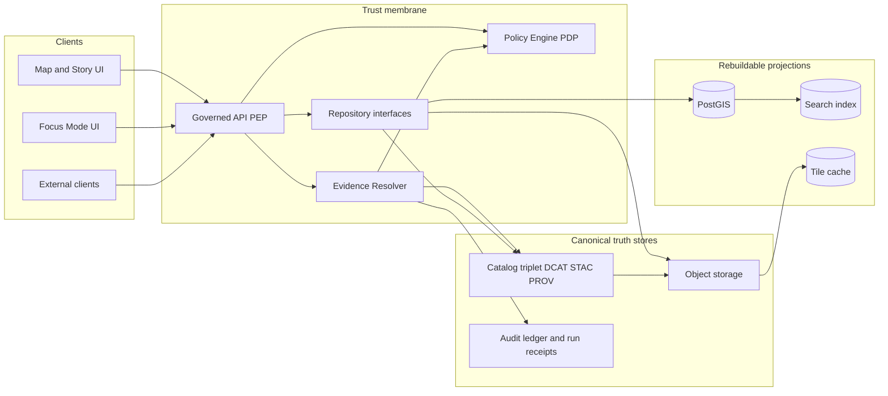

<!-- [KFM_META_BLOCK_V2]
doc_id: kfm://doc/8a1d3d4e-4b85-4d08-9a4d-7f92b0f36e3a
title: Trust Membrane
type: standard
version: v1
status: draft
owners: KFM Architecture; KFM Governance
created: 2026-03-01
updated: 2026-03-01
policy_label: public
related: []
tags: [kfm, architecture, governance, trust-membrane]
notes:
  - Defines the trust membrane boundary and the minimum CI + runtime controls required to enforce it.
  - This doc is normative for “no-bypass” rules (MUST/SHOULD language).
[/KFM_META_BLOCK_V2] -->

# Trust Membrane
**One-line purpose:** Prevent policy bypass and provenance breakage by forcing *all* access through governed interfaces.

> **TODO (repo wiring):** Replace badges with repo-specific CI status badges once workflow names/paths are confirmed.

---

## Quick nav
- [Why this exists](#why-this-exists)
- [Definition and invariants](#definition-and-invariants)
- [System boundary](#system-boundary)
- [Reference architecture](#reference-architecture)
- [Enforcement layers](#enforcement-layers)
- [Verification and tests](#verification-and-tests)
- [Definition of done](#definition-of-done)
- [Appendix](#appendix-threat-model-checklist)

---

## Why this exists

KFM’s credibility depends on governance rules being **enforced**, not merely documented. The trust membrane is the “no-bypass” boundary that makes that enforcement possible.

**If the membrane is broken:**
- policy decisions become optional,
- redaction/generalization can be bypassed,
- logging becomes inconsistent,
- and downstream provenance/evidence can’t be trusted.

---

## Definition and invariants

### Trust membrane definition
The trust membrane is the **security + governance boundary** that constrains how systems and users can access data and metadata.

### Non-negotiable invariants
These are **CONFIRMED** requirements (treat as MUST-level rules):

1) **Clients never access storage directly**
- Frontend clients and external consumers MUST NOT talk directly to databases or object storage.

2) **Backend core logic never bypasses repository interfaces**
- Core backend/domain logic MUST NOT directly call storage systems; it MUST go through repository interfaces (or equivalent adapters) that enforce policy, logging, and invariants.

3) **All access is mediated by governed APIs**
- All reads and writes MUST flow through governed APIs (policy enforcement points) that apply policy decisions, redactions/generalizations, and logging consistently.

> **WARNING:** Any “direct path” (UI → storage, or domain logic → storage) is a *policy bypass* path by definition.

---

## System boundary

The trust membrane boundary is both:
- an **architecture rule** (where calls are allowed to go), and
- an **enforcement rule** (how CI/runtime prevents forbidden paths).

### Outside the membrane
- Browser UI (Map Explorer / Story / Focus Mode UI)
- External API consumers (partners, analysts, automated clients)
- Batch jobs that are not part of the governed pipeline/runtime (unless explicitly treated as PEPs)

### Inside the membrane
- Governed API layer (Policy Enforcement Point / PEP)
- Evidence resolver (policy-aware evidence bundling)
- Policy engine (Policy Decision Point / PDP, e.g., OPA/Rego)
- Repository/adapters that mediate access to:
  - canonical stores (catalogs + provenance + object storage)
  - rebuildable projections (DB/search/tiles)

> **NOTE:** “Inside” does **not** mean “trusted.” It means “subject to policy + audit + tests.”

---

## Reference architecture

### Conceptual flow

### Design intent
- **Clients talk to the PEP only.**  
- **PEP and Evidence Resolver are policy-aware.**  
- **Catalogs + provenance are treated as contract surfaces** (inputs to policy + evidence + UX).  
- **Projections are rebuildable** (DB/index/tiles can be recreated from promoted artifacts + catalogs).

---

## Policy-as-code placement

### Key principle
Policy semantics MUST match across:
- **CI (merge-blocking tests)** and
- **Runtime (request-time enforcement)**

Otherwise, CI “guarantees” are meaningless.

### Roles
- **PDP (Policy Decision Point):** evaluates allow/deny + obligations.  
- **PEPs (Policy Enforcement Points):**
  - CI gates (policy fixtures + contract tests)
  - Runtime governed API (request-time checks before data leaves the system)
  - Evidence resolver (checks before evidence bundles are produced)
- **UI:** shows policy badges and notices, but **does not decide policy**.

---

## Enforcement layers

This section distinguishes **CONFIRMED requirements** from **PROPOSED mechanisms** and **UNKNOWN repo-specific details**.

### 1) CI enforcement (merge-blocking)
**CONFIRMED requirements**
- Policy tests MUST run in CI with fixtures that include allow/deny outcomes and obligations.
- Contract/schema validation MUST fail-closed (broken schemas/links block promotion and merge).
- Changes that could affect policy enforcement MUST be covered by tests.

**PROPOSED mechanisms (typical)**
- Static dependency rules:
  - UI packages cannot import DB/storage clients.
  - Domain/core packages cannot import storage clients; only repository/adapters can.
- Grep/lint gates:
  - block known storage connection strings from UI repos
  - block direct DB drivers in forbidden layers
- “No bypass” tests:
  - unit tests that assert repositories are used
  - integration tests that assert storage endpoints aren’t reachable from UI pods/build targets

### 2) Runtime enforcement (deployment-level)
**CONFIRMED requirements**
- All request-time data access MUST be policy-evaluated at the PEP.
- Evidence resolution MUST be policy-checked and fail closed if unauthorized/unresolvable.
- Restricted metadata MUST NOT leak through error behaviors (e.g., 403/404 side channels).

**PROPOSED mechanisms (implementation options)**
- Network isolation:
  - DB and object storage accessible only from PEP/Evidence services (or their internal network)
- AuthZ and obligations:
  - policy labels drive allow/deny + redaction/generalization steps
- Audit:
  - every governed interaction produces an auditable record (including Focus Mode runs)

### 3) UX trust surfacing (user-visible enforcement)
**CONFIRMED concept**
- Trust must be visible: dataset version, license/rights, policy label, provenance, digests.
- Evidence views (drawer/panel) are the *primary trust surface*, not a “details tab”.

**PROPOSED mechanism**
- Evidence drawer available from:
  - map feature inspect
  - story citations
  - focus mode citations

---

## Common failure modes and how we fail closed

| Failure mode | What can go wrong | Required behavior |
|---|---|---|
| Direct storage access path exists | Bypass policy/redaction/logging | Block by network rules + CI checks + code review. |
| Policy evaluated only in UI | UI becomes an untrusted PDP | Disallowed. UI may *display* policy, never decide it. |
| EvidenceRef doesn’t resolve | “Citations” become unverifiable URLs | Fail closed: abstain / narrow scope / block publish. |
| Restricted leakage via errors | Users infer existence via 403/404 differences | Normalize error behavior; avoid metadata leakage. |
| CI policy semantics differ from runtime | CI gates become theater | Same policy bundle + same fixtures/outcomes. |

---

## Verification and tests

### Test matrix
| Invariant | CI proof (merge-blocking) | Runtime proof | Evidence artifact |
|---|---|---|---|
| Clients cannot access storage | dependency/lint checks; e2e tests | network policies; firewall rules | test logs + infra manifests |
| Backend uses repository interfaces | unit tests; architectural lint | code review + runtime logs | “no bypass” test suite output |
| PEP evaluates policy for every request | contract tests; golden fixtures | request logs contain policy decision IDs | audit logs + policy decision refs |
| Evidence resolver fail-closed | integration tests for unauthorized refs | 4xx without leakage; obligations applied | evidence bundle samples + receipts |
| CI semantics == runtime semantics | shared fixtures and expected outcomes | same policy bundle deployed | policy bundle digest + fixture results |

### Minimum verification steps (to convert UNKNOWN → CONFIRMED in *this* repo)
> Run these checks and attach outputs to the PR that introduces (or modifies) the trust membrane controls.

- [ ] Confirm which services are the **runtime PEP** and **evidence resolver** (names/routes).  
- [ ] Confirm policy engine integration (PDP placement, bundle loading, decision logging).  
- [ ] Confirm that UI code has **no** direct DB/object storage connectivity code paths.  
- [ ] Confirm network rules prevent UI/external access to DB/object storage.  
- [ ] Confirm “policy-safe error behavior” (no restricted existence inference).  
- [ ] Confirm Focus Mode has a hard citation verifier and produces an audit receipt per query.  

---

## Definition of done

This document (and its related implementation work) is “done” only when:

### Architecture invariants are enforced
- [ ] There is **no direct** client → DB/object storage path.
- [ ] There is **no direct** domain/core → storage path (repository boundary enforced).
- [ ] Governed API and evidence resolver enforce policy and obligations consistently.

### CI gates are merge-blocking
- [ ] Policy tests with fixtures run in CI and block regressions.
- [ ] Contract/schema/link checks block broken catalogs/evidence refs.
- [ ] Architectural dependency checks prevent “bypass imports.”

### Runtime guarantees exist and are auditable
- [ ] Every governed response can be traced to:
  - dataset version
  - policy decision
  - evidence bundle
  - audit receipt/run receipt (where applicable)

---

## Appendix: Threat model checklist

Use this checklist during PR review for any new endpoint, UI feature, export, or pipeline capability:

- **TM-001:** Does any frontend code fetch directly from databases or object storage?
- **TM-002:** Can a public user infer restricted dataset existence from error behavior?
- **TM-003:** Are downloads/exports checked against both policy labels *and* rights metadata?
- **TM-004:** Can Focus Mode be manipulated by retrieved content (prompt injection / tool abuse)?
- **TM-005:** Are audit logs redacted and access-controlled?
- **TM-006:** Are pipeline credentials least-privilege and rotated?
- **TM-007:** Are processed artifacts immutable by digest?
- **TM-008:** Are policy rules tested in CI with fixtures?

> **TIP:** Treat “export” and “download” as high-risk surfaces. They are where licensing and sensitive-location leaks most often occur.
