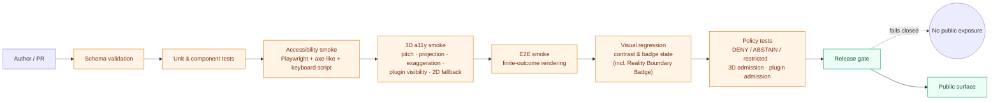

<!-- [KFM_META_BLOCK_V2]
doc_id: kfm://doc/architecture/ui/accessibility
title: KFM UI — Accessibility Architecture
type: standard
version: v0.2
status: draft
owners: Docs steward + UI subsystem owner + Accessibility reviewer
created: 2026-05-14
updated: 2026-05-24
policy_label: public
related:
  - docs/architecture/ui/README.md
  - docs/architecture/ui/STATE_OWNERSHIP.md
  - docs/architecture/ui/BOUNDARIES.md
  - docs/architecture/ui/ROUTE_MAP.md
  - docs/architecture/ui/CONTINUITY_NOTES.md
  - docs/architecture/governed-ai/README.md
  - docs/architecture/map-shell.md
  - docs/architecture/maplibre-3d.md
  - docs/architecture/story/README.md
  - docs/doctrine/truth-posture.md
  - docs/doctrine/trust-membrane.md
  - schemas/contracts/v1/ui/EvidenceDrawerPayload.schema.json
  - schemas/contracts/v1/runtime/RuntimeResponseEnvelope.schema.json
  - schemas/contracts/v1/maplibre/view_state.schema.json
  - schemas/contracts/v1/maplibre/camera_path.schema.json
  - schemas/contracts/v1/maplibre/representation_receipt.schema.json
  - schemas/contracts/v1/3d/reality_boundary_note.schema.json
  - schemas/contracts/v1/policy/3d_admission_decision.schema.json
  - schemas/contracts/v1/policy/plugin_admission.schema.json
tags: [kfm, ui, accessibility, a11y, trust-visible, governed-ai, 3d, reality-boundary]
notes:
  - All repo paths PROPOSED until verified against mounted-repo evidence (Directory Rules §0).
  - Section 20.1 of the Whole-UI + Governed AI Expansion Report is the doctrinal anchor for smoke criteria; v0.2 adds the 3D-specific accessibility doctrine from docs/architecture/maplibre-3d.md §10.
  - v0.2 aligns this doc with the retire-Cesium renderer revision (one renderer, plugin-governed 3D, admission-not-handoff). All v0.1 anchors preserved.
[/KFM_META_BLOCK_V2] -->

# KFM UI — Accessibility Architecture

> How the Kansas Frontier Matrix UI shell makes governed truth — finite outcomes, evidence resolution, policy decisions, freshness state, **and now per-layer 3D / plugin admission and reality-boundary status** — perceivable, operable, understandable, and robust for every user, on every supported surface.

**Status:** draft (v0.2) · **Owners:** Docs steward + UI subsystem owner + Accessibility reviewer · **Last updated:** 2026-05-24

> [!IMPORTANT]
> This document is **doctrine-grade design**. All paths, route names, component names, validators, and CI hooks named here are **PROPOSED** until verified against mounted-repo evidence per Directory Rules §0 and §17. Where this doc says "the shell does X," read "the shell **must** do X to satisfy the trust-visible-states contract." Implementation maturity is **UNKNOWN** in this session.

> [!TIP]
> **What changed in v0.2.** Accessibility doctrine for the **post-retire-Cesium** architecture is folded in. Specifically: (a) new keyboard-reachable controls for 3D (pitch, projection toggle, terrain exaggeration, plugin-hosted layer visibility) per [`docs/architecture/maplibre-3d.md`](../maplibre-3d.md) §10; (b) new state axes — `geometry_label` (2D/2.5D/3D), `3DAdmissionDecision`, `PluginAdmission`, `RealityBoundaryNote` (captured/interpretive/synthetic); (c) reduced-motion contract expanded to cover globe projection toggle, terrain exaggeration animation, and `CameraPath` playback; (d) 2D-fallback-always-offered rule; (e) alt-text obligations for 3D screenshots (ML-059-052). All v0.1 anchors preserved; new content threads inside existing sections (4, 5, 6, 7, 9, 11, 12, 13, 14, 15, 16, 17).

---

## Quick jump

- [1. Purpose & scope](#1-purpose--scope)
- [2. Why accessibility is governance, not finish](#2-why-accessibility-is-governance-not-finish)
- [3. Doctrinal anchors](#3-doctrinal-anchors)
- [4. The trust-visible state model](#4-the-trust-visible-state-model)
- [5. Keyboard, focus, and dialog discipline](#5-keyboard-focus-and-dialog-discipline)
- [6. Map alternatives (the non-map path)](#6-map-alternatives-the-non-map-path)
- [7. Motion, animation, and Story Node behavior](#7-motion-animation-and-story-node-behavior)
- [8. Perception, contrast, and zoom legibility](#8-perception-contrast-and-zoom-legibility)
- [9. Alt text, popups, and the Evidence Drawer](#9-alt-text-popups-and-the-evidence-drawer)
- [10. Touch and narrow-viewport behavior](#10-touch-and-narrow-viewport-behavior)
- [11. Accessibility smoke criteria (canonical)](#11-accessibility-smoke-criteria-canonical)
- [12. Validation surfaces and CI hooks](#12-validation-surfaces-and-ci-hooks)
- [13. Negative, abstain, deny, and stale states](#13-negative-abstain-deny-and-stale-states)
- [14. Export and screenshot continuity](#14-export-and-screenshot-continuity)
- [15. Anti-patterns](#15-anti-patterns)
- [16. Open questions and NEEDS VERIFICATION](#16-open-questions-and-needs-verification)
- [17. Related docs](#17-related-docs)

---

## 1. Purpose & scope

This document specifies the **accessibility architecture** for the Kansas Frontier Matrix (KFM) UI shell — the governed, map-first, time-aware interface where Evidence Drawer, Focus Mode, Story Node, Review/steward, layer catalog, **3D admission**, **plugin admission**, and diagnostics surfaces meet the public.

**In scope.**

- Trust-visible state semantics (how `ANSWER`, `ABSTAIN`, `DENY`, `ERROR`, `stale`, `restricted`, `cancelled`, `loading`, **`3d-admission-denied`**, **`plugin-admission-denied`**, **`reality-boundary-required`**, **`2d-fallback-active`** reach users with assistive technology).
- Keyboard, focus, and dialog behavior for the map shell, drawer, dialogs, layer catalog, time control, Focus Mode, **and 3D controls (pitch, projection toggle, terrain exaggeration, per-mode layer visibility)**.
- Non-map alternatives for every map-driven interaction, **including a 2D alternative for every 3D mode**.
- Motion, animation, and Story Node reduced-motion behavior — covering Story Node camera, drawer transitions, **globe projection toggle, terrain exaggeration animation, and `CameraPath` playback**.
- Contrast, color-not-alone, alt text, and zoom legibility for trust artifacts, **including the `RealityBoundaryBadge`**.
- Smoke criteria, validation surfaces, and CI hooks the UI subsystem must satisfy before public release.

**Out of scope.**

- Visual design tokens, palette choices, and component implementation (lives in `packages/ui/` per Directory Rules §11; **PROPOSED**).
- Schema field definitions for `EvidenceDrawerPayload`, `RuntimeResponseEnvelope`, `RepresentationReceipt`, `RealityBoundaryNote`, `3DAdmissionDecision`, `PluginAdmission`, etc. (live under `schemas/contracts/v1/` per ADR-0001; **PROPOSED**).
- Map renderer internals and 3D primitive doctrine (covered by [`docs/architecture/maplibre-3d.md`](../maplibre-3d.md); **PROPOSED**).
- Document-level accessibility (PDF/UA) for generated reports, which is covered separately by C13-03 in the Idea Index and is **out of scope** here.

[Back to top](#kfm-ui--accessibility-architecture)

---

## 2. Why accessibility is governance, not finish

In KFM, the UI is the public face of a governed truth membrane. Cite-or-abstain is the default truth posture, and outcomes are **finite and visible** — `ANSWER`, `ABSTAIN`, `DENY`, `ERROR`. (CONFIRMED doctrine; Whole-UI + Governed AI Expansion Report §19.)

If those outcomes are not perceivable, operable, understandable, and robust, then a screen-reader user reads a blank map; a keyboard-only steward cannot reach the drawer; a low-vision user cannot tell `stale` from `released`; a reduced-motion user is forced through a cinematic Story Node camera or a globe-projection sweep; a touch user loses the freshness chip behind a collapsed panel; **or a user cannot tell a photoreal glTF reconstruction from a directly captured 3D Tile**. In every one of those cases the governance contract collapses silently — the failure is **not** that the UI is impolite, it is that **the trust membrane stops being visible**.

> [!NOTE]
> Accessibility in KFM is not a final coat of paint. It is part of the same contract that says **a popup is not the Evidence Drawer**, **a screenshot is not proof**, **fluent text is not evidence**, **and a photoreal 3D rendering is not a direct observation**. A state that cannot be announced, traversed, contrasted, and labeled is a state the public cannot trust.

[Back to top](#kfm-ui--accessibility-architecture)

---

## 3. Doctrinal anchors

These are the source documents and invariants this architecture inherits from.

| Anchor | Source | Truth label |
|---|---|---|
| Cite-or-abstain truth posture | KFM core invariants; `docs/doctrine/truth-posture.md` | **CONFIRMED doctrine** |
| Finite outcomes — `ANSWER` / `ABSTAIN` / `DENY` / `ERROR` | Whole-UI + Governed AI Expansion Report §19; KFM Encyclopedia §8C | **CONFIRMED doctrine** |
| Trust membrane (no public RAW/WORK/QUARANTINE; no popup-as-proof) | `docs/doctrine/trust-membrane.md`; Encyclopedia §8A–B | **CONFIRMED doctrine** |
| Accessibility smoke criteria | Whole-UI + Governed AI Expansion Report §20.1 | **CONFIRMED doctrine** |
| MapLibre is the renderer, not the truth store | Encyclopedia §8A; Directory Rules §11 | **CONFIRMED doctrine** |
| **MapLibre is the sole browser-side renderer; Cesium retired** *(new in v0.2)* | [`docs/architecture/maplibre-3d.md`](../maplibre-3d.md) §0; Appendix B retire-Cesium ADR (PROPOSED upstream) | **PROPOSED architectural decision** |
| **3D-as-carrier invariants I-3D-1…I-3D-7** *(new in v0.2)* | [`docs/architecture/maplibre-3d.md`](../maplibre-3d.md) §1 | **CONFIRMED doctrine** (I-3D-1, I-3D-2, I-3D-3 from corpus; I-3D-4, I-3D-5, I-3D-6, I-3D-7 PROPOSED) |
| **3D controls keyboard-reachable; 2D fallback offered; alt text on terrain-screenshot exports** *(new in v0.2)* | [`docs/architecture/maplibre-3d.md`](../maplibre-3d.md) §10 Accessibility; ML-059-052; ML-059-087 | **CONFIRMED doctrine** |
| **Reality Boundary Note distinguishes captured from interpretive 3D** *(new in v0.2)* | KFM Atlas §18; KFM-P9-FEAT-0014; ML-059-050; ML-059-052; ML-059-055 | **CONFIRMED doctrine** |
| Trust badges do not rely on color alone | Expansion Report §20.1; ML-S-020; ML-061-140 | **CONFIRMED doctrine** |
| Reduced-motion mode disables/shortens Story Node camera | Expansion Report §20.1; ML-059-087 | **CONFIRMED doctrine** |
| Map interactions have non-map alternatives | Expansion Report §20.1 | **CONFIRMED doctrine** |
| WCAG 2.2 AA as the **target conformance level** | Industry standard reference | **PROPOSED** for KFM (target; no measurement) |
| PDF/UA preflight for generated PDFs | Idea Index C13-03 | **PROPOSED**, out of scope here |
| ARIA Authoring Practices for dialog, listbox, tab, slider patterns | External standard reference | **PROPOSED** as pattern source |

> [!NOTE]
> WCAG 2.2 AA is the **target** conformance level for the public surfaces. It is **not** a claim that any rendered build has been measured. Conformance measurement is an open verification item — see §16.

[Back to top](#kfm-ui--accessibility-architecture)

---

## 4. The trust-visible state model

Every governed UI surface — Evidence Drawer, Focus Mode response, layer chip, time chip, drawer header, Story Node node, review row, **3D mode toggle, plugin status indicator, Reality Boundary Badge** — must surface enough of the governance state for an assistive technology user to know **what kind of answer they are looking at** before they read its content.

### 4.1 Required state axes

Every consequential rendered claim must expose, in text and not by color alone, these axes:

| Axis | Vocabulary (illustrative) | Required for |
|---|---|---|
| Outcome | `ANSWER`, `ABSTAIN`, `DENY`, `ERROR` | Focus Mode response, drawer header |
| Source role | `observed`, `regulatory`, `modeled`, `aggregate`, `administrative`, `candidate`, `synthetic` | drawer evidence rows |
| Rights | `public`, `restricted`, `unknown` | drawer header, layer chip |
| Sensitivity | `none`, `geoprivacy`, `CARE`, `sovereignty`, `archaeology`, … | drawer header, Story Node node |
| Review state | `unreviewed`, `in-review`, `approved`, `corrected`, `superseded` | drawer header, review console |
| Freshness | `fresh`, `stale`, `unknown` | layer chip, drawer header, time chip |
| Release state | `published`, `unreleased`, `withdrawn` | layer chip, drawer header |
| Correction state | `none`, `correction-applied`, `correction-pending` | drawer header |
| **Geometry label** *(new in v0.2, per I-3D-4)* | `2D`, `2.5D`, `3D` | layer chip, drawer header, 3D mode toggle |
| **3D admission** *(new in v0.2, per I-3D-6)* | `admissible-2d-only`, `terrain-allowed`, `globe-allowed`, `extrusion-allowed`, `tiles3d-allowed`, `gltf-allowed`, `pointcloud-allowed`, `denied:<reason>` | layer chip, mode toggle, drawer |
| **Plugin admission** *(new in v0.2, per I-3D-7)* | `pinned`, `drifted`, `unpinned`, `unattested` | layer chip (when 3D mode is requested), diagnostics |
| **Reality boundary** *(new in v0.2, per KFM-P9-FEAT-0014)* | `captured`, `interpretive`, `synthetic`, `reconstructed`, `unspecified` | drawer header, Reality Boundary Badge, exports |

Vocabulary above is **illustrative**; canonical enumerations live in the appropriate `schemas/contracts/v1/` schemas (**PROPOSED**, ADR-0001). For the four new axes, the schema homes are `schemas/contracts/v1/maplibre/`, `schemas/contracts/v1/3d/`, and `schemas/contracts/v1/policy/` per [`docs/architecture/maplibre-3d.md`](../maplibre-3d.md) §4.

### 4.2 No color-alone rule

> [!WARNING]
> Color is **never** sufficient to communicate trust state. Every state token must carry a **text label**, an **accessible name**, and an **icon shape or letterform** distinguishable in monochrome. A red border is not a `DENY`; the literal word and reason code make it a `DENY`. (ML-S-020; ML-061-140; Expansion Report §20.1.) **This applies to the Reality Boundary Badge with full force:** an amber halo is not "interpretive" — the text label "Interpretive reconstruction" plus an icon shape make it so.

### 4.3 Distinct treatment for unknown / stale / failed verification

`unknown`, `stale`, and `failed-verification` MUST each have a **visually and textually distinct** treatment. Folding them together — for example, painting all three grey with the same label — collapses a meaningful distinction that the trust contract relies on. (ML-061-140; Expansion Report §20.1.) The same rule extends in v0.2 to the new axes: **`3d-admission-denied`**, **`plugin-admission-denied`**, **`reality-boundary-required-but-missing`**, and **`2d-fallback-active`** must each be distinct from each other and from `stale`, `unknown`, and `failed-verification`.

### 4.4 Live-region announcement

When a finite outcome changes — drawer opens with `ANSWER`, Focus Mode returns `ABSTAIN`, a layer chip flips to `stale`, a request is cancelled, **a 3D mode is denied, a plugin is denied, a layer falls back to 2D, or a reality-boundary badge appears** — the change MUST be announced through an ARIA live region of appropriate politeness:

- `assertive` — `DENY`, `ERROR`, restricted-geometry redaction event, **`plugin-admission-denied`**, **`3d-admission-denied:policy`**, **`reality-boundary-required-but-missing`**.
- `polite` — `ANSWER`, `ABSTAIN`, freshness change, correction applied, **`2d-fallback-active`** (when fallback is the licensed outcome), **reality-boundary badge surfacing** on first encounter per node/layer.
- not announced — purely visual hover preview without semantic change.

Exact ARIA wiring is a **PROPOSED** implementation detail; the requirement is that no consequential state change is silent.

[Back to top](#kfm-ui--accessibility-architecture)

---

## 5. Keyboard, focus, and dialog discipline

The map shell, drawer, dialogs, layer catalog, time control, Focus Mode, **and the 3D control surface** form a **keyboard-complete** surface: every action available with a pointer is available with the keyboard, and every action's effect is announced to assistive technology.

### 5.1 Keyboard contract

| Surface | Required keyboard behavior |
|---|---|
| App shell | Stable landmark roles (banner, navigation, main, complementary, contentinfo); skip-to-main link as the first focusable item. |
| Route navigation | Reachable and operable by keyboard alone; current route announced. |
| Map canvas | Receives focus; arrow keys pan; `+`/`-` zoom; `Enter` activates focused feature; `Esc` returns focus to map controls. |
| **3D control surface** *(new in v0.2, per `maplibre-3d.md` §10)* | **All 3D controls reachable by keyboard alone**: pitch slider, projection toggle (2D ↔ globe), terrain exaggeration slider, and per-plugin layer visibility toggles (terrain, hillshade, fill-extrusion, 3D Tiles, glTF, point cloud, deck.gl interleaved). Each control's current value and admission status announced. |
| **3D mode toggle (per layer)** *(new in v0.2)* | Toggle is focusable; activation requests the mode through `packages/maplibre-runtime/`; ALLOW renders the mode and announces `RepresentationReceipt`-derived state; DENY/ABSTAIN announces reason and offers the **2D fallback** as the next focusable action. |
| Layer catalog | Tab into list; arrow keys move within; `Space` toggles; toggling announces new layer state, source role, rights, freshness, release state, **geometry label, and admissible 3D modes**. |
| Time control | Keyboard-operable slider with discrete steps; current valid time, source time, and version-lock state announced. |
| Drawer | Opens with focus moved to the drawer's first heading; `Esc` closes and returns focus to the invoking element. **When the drawer surfaces a `RealityBoundaryNote`, the badge is focusable and the note text is reachable inside the drawer body.** |
| Dialog | Modal focus trap; `Tab` cycles within; `Esc` closes; background inert. |
| Focus Mode | Question control reachable by keyboard; response region is a live region; citations are focusable links. |
| Story Node | Arrow keys move through the version strip (predecessor/current/successor/latest), as in ML-059-019. **Any per-layer 3D mode requested by the node is announced on entry as admissible or denied, with a focusable "view in 2D" affordance.** |
| Verification badge | Focusable; activation opens proof details — **not** a replacement for the Evidence Drawer (ML-061-139). |
| **Reality Boundary Badge** *(new in v0.2)* | Focusable; activation opens the `RealityBoundaryNote` in the drawer, never a popup. Announced on first encounter per layer/node. |

### 5.2 Focus order and visibility

- Focus order MUST match the visible reading order; tab traps exist only inside true modals.
- The focus indicator MUST be visible on every interactive element at every theme — light, dark, high-contrast.
- Focus must not be lost when a panel opens, closes, or rerenders; on close, focus returns to the invoking control.
- **When a 3D mode request resolves (ALLOW/DENY/ABSTAIN), focus remains on the requesting control or moves to the next licensed action (e.g., the 2D fallback button) — never into unrelated map space.**

### 5.3 Drawer / dialog focus management

> [!IMPORTANT]
> The Evidence Drawer is **the trust object**, not a popup. Its focus behavior is part of the contract. On open: focus moves to the drawer; on close: focus returns to the trigger; on internal navigation (citation, lineage break, badge activation, **Reality Boundary Note activation**): focus remains predictable and never lands in unrelated map space. (ML-S-019.)

[Back to top](#kfm-ui--accessibility-architecture)

---

## 6. Map alternatives (the non-map path)

A map alone is not an accessible interface. Every consequential map interaction MUST have a **non-map alternative** — a keyboard-reachable list or table that exposes the same state, in the same vocabulary, with the same outcomes. (Expansion Report §20.1.) **In v0.2, this rule extends to every 3D mode: every layer that may render in `terrain`, `globe`, `extrusion`, `tiles3d`, `gltf`, `pointcloud`, or `deck.gl interleaved` mode MUST have a 2D alternative.**

### 6.1 Required alternatives

| Map interaction | Non-map alternative |
|---|---|
| Click a feature → drawer | A keyboard-reachable list of currently selected features, each opening the drawer for that feature. |
| Pan to a region | A search/select input that scopes the result list to that region. |
| Toggle layers visually | The layer catalog panel, with the same toggles, badges, and freshness chips. |
| Read time state | A time-state panel showing valid time, source time, release time, and version-lock status. |
| See "what's here" | A results list/table showing the same features, each with source role, rights, sensitivity, freshness, **geometry label, admissible 3D modes**, and release state. |
| Focus Mode camera | A summary panel that produces the same `ANSWER`/`ABSTAIN`/`DENY`/`ERROR` outcome without animation. |
| **3D mode request** *(new in v0.2)* | **The 2D mercator view is always offered as the alternative**, with the same `LayerManifest`, the same `EvidenceBundle`, and the same drawer content. Per `maplibre-3d.md` §10: "2D fallback offered when any 3D admission fails." |
| **Terrain / globe context view** *(new in v0.2)* | A non-projected mercator view that preserves all evidence; the globe is a context view that does not lower the bar (`maplibre-3d.md` §8.4). |
| **Reality Boundary Note** *(new in v0.2)* | The note text is rendered in the drawer body in addition to the badge; users who cannot perceive the badge still receive the captured-vs-interpretive distinction. |

### 6.2 Non-map alternatives are first-class, not fallback

The list/table view MUST be discoverable by sighted keyboard users and screen-reader users **on the same page** as the map — not behind a separate "accessible view" toggle that hides it from the default experience. The principle is **equivalent access in the default experience**, not a parallel impoverished view. **The same principle governs the 2D-fallback-for-3D rule: the 2D alternative is always offered, not buried behind a settings page.**

[Back to top](#kfm-ui--accessibility-architecture)

---

## 7. Motion, animation, and Story Node behavior

Motion is a governance signal in KFM (it carries Story Node sequence, time-slice scrubbing, drawer transitions, Focus Mode cinematics, **globe projection toggling, terrain exaggeration changes, and `CameraPath` playback**). It is also an accessibility hazard for users with vestibular disorders, photosensitive conditions, and cognitive-load constraints.

### 7.1 Reduced-motion contract

When the user-agent indicates reduced motion (e.g. `prefers-reduced-motion: reduce`), the shell MUST:

- Disable or substantially shorten Story Node camera animation and drawer transitions (Expansion Report §20.1; ML-059-087).
- Replace any time-slice scrubbing animation with discrete state changes.
- Render Focus Mode answers without cinematic camera moves; outcomes still display in full.
- Prefer cross-fades or instant cuts over translations, rotations, and zooms.
- Never make a finite outcome conditional on motion completing — outcomes are textual and present in DOM order on render.
- **Disable or substantially shorten the globe projection transition** (`setProjection({type:'globe'})` cross-fade is replaced with an instant cut). *(new in v0.2)*
- **Disable terrain exaggeration animation** when the user adjusts the slider — exaggeration changes as discrete steps. *(new in v0.2)*
- **Disable `CameraPath` playback animation** in Story Node, time-slider, and Focus Mode contexts; the path's `ViewState`s render as discrete snapshots that the user steps through with keyboard navigation. *(new in v0.2, per ML-059-082 + ML-059-087)*
- **Suppress hillshade and `sky` cross-fades** triggered by terrain admission changes; the result state is announced via live region without an interpolation. *(new in v0.2)*

### 7.2 Motion alternatives are not optional

> [!CAUTION]
> If a Story Node, Focus Mode camera path, or 3D scene cannot preserve evidence/release/drawer continuity in a reduced-motion or 2D-fallback mode, the node MUST fall back to 2D or `ABSTAIN` rather than render an inaccessible cinematic. **In v0.2, 3D is no longer a separate-renderer handoff but a per-layer admission inside the same MapLibre runtime; the doctrine still holds — admission failures and reduced-motion mode both route to the same 2D fallback.** (Encyclopedia §8C; Expansion Report §19.3; [`docs/architecture/maplibre-3d.md`](../maplibre-3d.md) §10.)

[Back to top](#kfm-ui--accessibility-architecture)

---

## 8. Perception, contrast, and zoom legibility

### 8.1 Contrast

| Surface | Minimum contrast (target) |
|---|---|
| Body text against background | 4.5 : 1 |
| Large text (≥ 18 pt / 14 pt bold) | 3 : 1 |
| Interactive controls and focus indicators | 3 : 1 against adjacent colors |
| Non-text trust artifacts (chips, badge shapes, freshness pips) | 3 : 1 against adjacent colors |
| **Reality Boundary Badge** *(new in v0.2)* | 3 : 1 against adjacent colors; icon shape distinguishable in monochrome; text label `Captured` / `Interpretive` / `Synthetic` / `Reconstructed` always present. |
| **3D mode-toggle controls and per-plugin visibility toggles** *(new in v0.2)* | 3 : 1 against adjacent colors at every state (ALLOW/DENY/ABSTAIN/2D-fallback). |

These targets align with WCAG 2.2 AA conventions. Actual measurement of any rendered theme is **NEEDS VERIFICATION**.

### 8.2 Colorbars and trust-visible color use

Flood depth/velocity/risk colorbars and trust chips MUST carry WCAG-compatible contrast, explicit text labels, and provenance metadata (ML-059-071). Colorblind-safe palettes are preferred; pattern, shape, or icon redundancy is required where color carries semantic load. **The Reality Boundary Badge is subject to the same rule: an amber-on-tan badge that distinguishes "interpretive" purely by hue is non-conforming.**

### 8.3 Zoom and reflow

Trust-visible information must remain legible at **200% zoom** without loss of state, and panels must reflow without horizontal scrolling at 320 CSS px width (ML-059-047; common WCAG 2.2 reflow target). Sidecar metadata and provenance text are **not** allowed to be truncated out of the visible state. **The 3D control surface (pitch, projection toggle, terrain exaggeration, per-plugin visibility) must also remain usable at 200% zoom and reflow at 320 CSS px width**; if not, the surface collapses to a single accessible expandable menu rather than disappearing.

[Back to top](#kfm-ui--accessibility-architecture)

---

## 9. Alt text, popups, and the Evidence Drawer

### 9.1 Alt text on map media

Field media, photographs, and figures bound to map features MUST have meaningful alt text. Where evidence comes from STAC items, accessibility metadata belongs **in the field STAC assets** themselves so that Evidence Drawer rows can render an accessible description without re-derivation (ML-064-059; ML-064-091).

### 9.1.a Alt text on 3D screenshots and exports *(new in v0.2)*

Every 3D screenshot, export, or report-embedded view MUST carry alt text that describes (at minimum):

- The scene's `LayerManifest`-named layers actually rendered.
- The active **geometry label** (`2D` / `2.5D` / `3D`).
- The active **reality boundary** (`Captured` / `Interpretive` / `Synthetic` / `Reconstructed`) — if any layer is interpretive or synthetic, the alt text says so.
- The `ViewState` summary (center, zoom, projection — globe vs mercator; pitch in coarse terms such as "tilted view" or "top-down").
- The freshness state of the dominant layer(s).

Per ML-059-052 ("3D previews and captures require alt text") and ML-059-050 ("3D assets require generalization, alt text, checksums, STAC extensions and temporal anchors"). The alt-text generator is wired to `RepresentationReceipt` metadata so the description is **derived, not authored ad hoc**.

### 9.2 Popup is not the drawer

> [!IMPORTANT]
> A map popup is a **cue**, not a citation surface. It must not substitute for the Evidence Drawer for consequential claims (ML-059-061; ML-061-139). Popups MAY summarize, but consequential claims resolve through the Evidence Drawer with focus management, ARIA semantics, and announced state changes. **A Reality Boundary Badge popup is also a cue — the full `RealityBoundaryNote` text lives in the drawer.**

### 9.3 Accessible Evidence Drawer fields

The Evidence Drawer SHOULD expose these accessible elements:

- Drawer heading naming the layer, feature, and outcome (`ANSWER`/`ABSTAIN`/`DENY`/`ERROR`).
- Trust strip with source role, rights, sensitivity, review, freshness, release, correction, **geometry label, 3D admission status, plugin admission status, reality boundary** — each as labeled text.
- Evidence list, each row focusable and exposing its `EvidenceRef`-derived label.
- Citation links, each with a descriptive accessible name (not "click here").
- Reason codes for `ABSTAIN` and `DENY` (including `3d-admission-denied:*`, `plugin-admission-denied:*`), in plain language.
- Lineage break notices rendered as readable text, never as silent breaks (ML-061-089).
- **`RealityBoundaryNote` text** when the active layer is interpretive, synthetic, or reconstructed — rendered as readable prose, with the badge as the focusable jump target. *(new in v0.2)*
- **`RepresentationReceipt` reference** when 3D content is active — so a steward can audit which plugin versions, ViewState, and time slice were used. *(new in v0.2)*

[Back to top](#kfm-ui--accessibility-architecture)

---

## 10. Touch and narrow-viewport behavior

Touch and narrow-viewport layouts MUST keep map, time context, drawer, **3D control surface, Reality Boundary Badge**, and focus states usable without hiding critical trust information (Expansion Report §20.1).

Concretely:

- Hit targets for trust chips, drawer toggles, time controls, **3D mode toggles, and the Reality Boundary Badge** are at least 24 × 24 CSS px (WCAG 2.2 target-size minimum-target). 44 × 44 CSS px is preferred for primary controls.
- The freshness chip, rights chip, outcome label, **geometry-label chip, and Reality Boundary Badge** MUST remain visible at narrow widths; they may relocate but may not be collapsed into an undisclosed overflow.
- Drawer behavior on narrow widths preserves focus trap and `Esc`-to-close semantics.
- The non-map list/table alternative — and the **2D fallback affordance** for any 3D mode — remains reachable from narrow viewports.

[Back to top](#kfm-ui--accessibility-architecture)

---

## 11. Accessibility smoke criteria (canonical)

These are the canonical pre-release smoke criteria for the KFM UI shell, adapted from Whole-UI + Governed AI Expansion Report §20.1 (CONFIRMED doctrine) and extended in v0.2 with the 3D accessibility doctrine from [`docs/architecture/maplibre-3d.md`](../maplibre-3d.md) §10. Each is a release gate; missing criteria block public exposure of the affected surface.

| # | Criterion | Source |
|---|---|---|
| A1 | Keyboard-only route navigation and panel open/close is possible; focus order is stable; drawer and dialogs trap and release focus correctly. | Expansion Report §20.1 |
| A2 | Map interactions have non-map alternatives: selected features and results appear in a keyboard-accessible list/table. | Expansion Report §20.1 |
| A3 | Trust badges do not rely on color alone; text labels are available for source role, rights, sensitivity, review, freshness, release, correction state, **geometry label, 3D admission, plugin admission, and reality boundary**. | Expansion Report §20.1; ML-S-020; v0.2 extension |
| A4 | Reduced-motion mode disables or shortens Story Node camera animation and drawer transitions. | Expansion Report §20.1; ML-059-087 |
| A5 | Touch and narrow-viewport layouts keep map, time context, drawer, **3D control surface**, and focus states usable without hiding critical trust information. | Expansion Report §20.1; v0.2 extension |
| A6 | Loading, cancelled, denied, abstained, error, stale, restricted, **`3d-admission-denied`, `plugin-admission-denied`, `reality-boundary-required-but-missing`, and `2d-fallback-active`** states are announced and visibly differentiated. | Expansion Report §20.1; ML-061-140; v0.2 extension |
| A7 | Verification badge state is keyboard-reachable, contrast-compliant, and screen-reader-described; activation opens proof detail, not a drawer replacement. | ML-061-138; ML-061-139 |
| A8 | CARE labels and sovereignty notice chips are rendered as text in the UI for sensitive material. | ML-061-160; ML-061-164 |
| A9 | Map media and field photographs carry alt text sourced from STAC asset metadata. | ML-064-059; ML-064-091 |
| A10 | Trust-visible information remains legible at 200% zoom and reflows at 320 CSS px width. | ML-059-047 |
| **A11** *(new in v0.2)* | **All 3D controls (pitch, projection toggle, terrain exaggeration, per-plugin layer visibility) are keyboard-reachable; current values and admission status announced.** | `maplibre-3d.md` §10 |
| **A12** *(new in v0.2)* | **A 2D fallback is offered whenever any 3D admission fails; the fallback is focusable, announced, and renders the same `EvidenceBundle`.** | `maplibre-3d.md` §10; ML-W-057 |
| **A13** *(new in v0.2)* | **3D screenshots, exports, and report-embedded views carry alt text derived from `RepresentationReceipt`, naming the layers, geometry label, reality-boundary status, and `ViewState`.** | `maplibre-3d.md` §10; ML-059-050; ML-059-052 |
| **A14** *(new in v0.2)* | **Reality Boundary Badge has text + icon (never color-only), is keyboard-reachable, opens the `RealityBoundaryNote` in the drawer, and is announced on first encounter per layer/node.** | KFM-P9-FEAT-0014; ML-S-020 |
| **A15** *(new in v0.2)* | **Reduced-motion mode disables/shortens globe projection toggle, terrain exaggeration animation, and `CameraPath` playback in addition to Story Node camera and drawer transitions.** | `maplibre-3d.md` §10; ML-059-087 extension |

> [!NOTE]
> A1–A6 are **CONFIRMED doctrine** under Expansion Report §20.1 (A3, A5, A6 expanded in v0.2). A7–A10 are **CONFIRMED doctrine** from the MapLibre Master atlas Category S evidence. A11–A15 are **CONFIRMED doctrine** under [`docs/architecture/maplibre-3d.md`](../maplibre-3d.md) §10 / KFM-P9-FEAT-0014. All require fixture coverage before they can be claimed as enforced — see [§12](#12-validation-surfaces-and-ci-hooks).

[Back to top](#kfm-ui--accessibility-architecture)

---

## 12. Validation surfaces and CI hooks

The architecture above is enforced through a layered validation surface. **All paths and validator names are PROPOSED until verified against mounted-repo evidence.**

### 12.1 Diagram — accessibility validation surfaces

> [!NOTE]
> Diagram reflects the validation **responsibility surface**, not a verified workflow. PR workflow YAML, runner targets, and gate ordering are **PROPOSED** until the repo is mounted. The 3D-a11y smoke node is new in v0.2.

### 12.2 Proposed validation matrix

| Check | Command family (PROPOSED) | Expected result |
|---|---|---|
| Schema validation | `ajv` / `jsonschema` over `schemas/contracts/v1` (incl. `maplibre/`, `3d/`, `policy/` subtrees) and UI fixtures | Valid fixtures pass; invalid fail |
| Unit / component tests | `npm`/`pnpm`/`yarn test` | Shell, drawer, focus, layers, **Reality Boundary Badge** pass |
| Accessibility smoke | Playwright + axe-like checks + keyboard script | No critical violations; map actions have non-map alternatives |
| **3D accessibility smoke** *(new in v0.2)* | Playwright `e2e/focus-mode-3d-toggle.spec.ts` + keyboard script | 3D controls (pitch, projection, exaggeration, plugin visibility) keyboard-reachable; 2D fallback offered on every admission failure; live-region announcements verified |
| **Plugin admission accessibility check** *(new in v0.2)* | Component test against `PluginAdmission` DENY fixtures | Layer chip renders the deny reason as text; chip is focusable; activation does not crash |
| **Reality Boundary Badge tests** *(new in v0.2)* | Component test + axe contrast check | Text + icon present at every theme; contrast ≥ 3:1; activation opens drawer not popup; announced on first encounter |
| E2E smoke | Playwright route/load/focus/map-click | Finite outcomes display correctly |
| Visual regression | Storybook / Loki / Playwright screenshots | Contrast and badge-state snapshots stable (incl. captured vs interpretive vs synthetic Reality Boundary Badge variants) |
| Policy tests | `conftest` or repo policy runner | DENY invalid, unreleased, uncited, restricted flows; **3D admission DENY and Plugin Admission DENY paths fire correctly** |
| **Reduced-motion smoke (expanded)** *(new in v0.2)* | `prefers-reduced-motion: reduce` Playwright override | Story Node camera, drawer transitions, **globe projection toggle, terrain exaggeration animation, and `CameraPath` playback** all degrade gracefully |

Adapted from Whole-UI + Governed AI Expansion Report §20 validation checklist and [`docs/architecture/maplibre-3d.md`](../maplibre-3d.md) §10. Status of each check in the current session is **PROPOSED** — no workflow YAML or runner has been verified.

### 12.3 Proposed test files

| File (PROPOSED path) | Purpose |
|---|---|
| `tests/accessibility/ui_shell_axe.spec.ts` | Accessibility smoke with keyboard and axe-like checks |
| `tests/accessibility/3d_controls_keyboard.spec.ts` *(new in v0.2)* | Keyboard reachability of pitch / projection toggle / terrain exaggeration / per-plugin visibility |
| `tests/accessibility/reality_boundary_badge.spec.tsx` *(new in v0.2)* | Reality Boundary Badge contrast, text+icon, activation behavior, announcement |
| `tests/accessibility/reduced_motion_3d.spec.ts` *(new in v0.2)* | Reduced-motion behavior for globe toggle, exaggeration, CameraPath playback |
| `tests/ui/FocusOutcomeRenderer.test.ts` | Finite outcome rendering tests (ANSWER/ABSTAIN/DENY/ERROR, incl. 3D admission / plugin admission DENY reasons) |
| `tests/ui/LayerCatalogPanel.test.tsx` | Layer catalog/toggle/legend tests (incl. geometry-label and admissible-modes display) |
| `tests/e2e/ui_shell_smoke.spec.ts` | Shell load / navigation smoke |
| `tests/e2e/focus_negative_states.spec.ts` | ABSTAIN / DENY / ERROR e2e behavior |
| `tests/e2e/focus-mode-3d-toggle.spec.ts` *(new in v0.2, mirrored from `maplibre-3d.md`)* | 3D mode toggle ALLOW/DENY/ABSTAIN with 2D fallback announcement |

Paths from Whole-UI + Governed AI Expansion Report §29 and `maplibre-3d.md` §6.2; **PROPOSED** until verified.

[Back to top](#kfm-ui--accessibility-architecture)

---

## 13. Negative, abstain, deny, and stale states

> [!IMPORTANT]
> Negative states are not error UX — they are **first-class governance outcomes**. A user with assistive technology must be able to tell `ABSTAIN` from `DENY` from `ERROR` from `stale` from **`3d-admission-denied`** from **`plugin-admission-denied`** from **`reality-boundary-required-but-missing`** from **`2d-fallback-active`** without reading the surrounding paragraph. (ML-S-063; Expansion Report §19; v0.2 extension.)

<strong>Required announced behaviors per state</strong> (click to expand)

| State | Visible treatment (required) | Announcement (required) | Reason exposure |
|---|---|---|---|
| `loading` | Text + non-color indicator; not silent | Polite — "Loading <surface>" | n/a |
| `cancelled` | Distinct from loading and error | Polite — "Cancelled" | Optional cause |
| `ANSWER` | Outcome label + citation list | Polite — "Answer with N citations" | n/a |
| `ABSTAIN` | Outcome label + reason codes | Polite — "Abstained: <reason>" | Required reason code in plain language |
| `DENY` | Outcome label + policy reason | Assertive — "Denied: <reason>" | Required reason code; no sensitive leak |
| `ERROR` | Outcome label + safe diagnostic | Assertive — "Error: <safe message>" | Generic; no RAW/QUARANTINE/credential leak |
| `stale` | Distinct chip + age text | Polite — "Stale source as of <date>" | Optional source-head note |
| `restricted` | Redaction or generalization chip | Assertive on first encounter | Required obligation in plain language |
| `failed-verification` | Distinct from stale and from unknown | Assertive | Required reason code |
| `unknown` | Distinct from stale and from failed | Polite | Optional explanation |
| **`3d-admission-denied`** *(new in v0.2)* | Distinct chip on layer + mode toggle | Assertive — "3D mode <mode> denied: <reason>" | Required reason code (`care-generalization-required`, `geometry-label-mismatch`, `living-person-data`, `release-state-unpublished`, etc.) |
| **`plugin-admission-denied`** *(new in v0.2)* | Distinct chip on layer when 3D mode is requested | Assertive — "Plugin <name> denied: <reason>" | Required reason code (`unpinned`, `drifted`, `unattested`) |
| **`reality-boundary-required-but-missing`** *(new in v0.2)* | Distinct chip on layer + drawer header | Assertive — "Reality Boundary Note required for interpretive content; not found" | Required obligation: surface the gap, do not silently render |
| **`2d-fallback-active`** *(new in v0.2)* | Distinct chip on layer + map status strip | Polite — "Showing 2D view; 3D mode <mode> <reason>" | Required reason code paired with offered "Try 3D again" affordance when admissible |
| **`reality-boundary:interpretive`** *(new in v0.2)* | Reality Boundary Badge surfaced; drawer expanded | Polite on first encounter — "Interpretive reconstruction" | Note text rendered in drawer body |
| **`reality-boundary:synthetic`** *(new in v0.2)* | Reality Boundary Badge surfaced; drawer expanded | Polite on first encounter — "Synthetic surface" | Note text rendered in drawer body |

Diagnostics MUST NOT leak `RAW`/`WORK`/`QUARANTINE` data, restricted coordinates, credentials, prompts, internal store handles, **or unredacted plugin paths/lockfile contents** *(new in v0.2)*, even in error messages. (Expansion Report §19.4.)

[Back to top](#kfm-ui--accessibility-architecture)

---

## 14. Export and screenshot continuity

When the user exports a map view, snapshot, or report, the accessible state SHOULD travel with it:

- Verification badge state and manifest ID preserved in exports (ML-061-141).
- Alt text for exported imagery carried from STAC asset metadata.
- CARE labels, sovereignty notices, generalization logs, and freshness state preserved in any printed or PDF artifact.
- **`RepresentationReceipt` reference attached to every export of a view where any 3D mode was active** — so the layer set, projection, ViewState, time slice, plugin versions, and `geometry_label` are auditable from the export alone. *(new in v0.2, per `maplibre-3d.md` §9)*
- **`RealityBoundaryNote` text and badge state preserved** in every export of a view that included interpretive, synthetic, or reconstructed content. The captured-vs-interpretive distinction must survive a screenshot. *(new in v0.2)*
- **3D-screenshot alt text** derived from `RepresentationReceipt` (per §9.1.a), naming the layers, geometry label, reality-boundary status, and `ViewState`. *(new in v0.2)*
- For generated PDFs, the document-level PDF/UA preflight applies (Idea Index C13-03; **PROPOSED**, out of scope for this doc but linked).

[Back to top](#kfm-ui--accessibility-architecture)

---

## 15. Anti-patterns

> [!WARNING]
> The patterns below collapse the trust-visible-state contract. They are not stylistic preferences; they are forbidden in public surfaces.

- **Color-only trust signaling.** Red border without label, grey chip without state name, traffic-light dots without text. (ML-S-020.)
- **Folding `unknown`, `stale`, and `failed-verification` into one grey blob.** Each must be distinguishable. (ML-061-140.)
- **Popup as proof.** A popup that displays evidence but lacks Evidence Drawer focus, ARIA semantics, and citation surface. (ML-059-061; ML-061-139.)
- **Badge as proof.** A verification badge that does not link to its receipts/attestations. (ML-061-138; ML-061-139.)
- **Parallel "accessible view" toggle.** A separate impoverished page that hides accessibility from the default experience.
- **Cinematic-only Focus Mode.** A Focus Mode answer that depends on motion completing or 3D rendering to surface its outcome.
- **Silent state changes.** A drawer outcome that changes from `ANSWER` to `ABSTAIN` without announcement.
- **Diagnostic leak.** An error message that exposes RAW/WORK/QUARANTINE handles, prompts, credentials, restricted coordinates, **or plugin lockfile contents**.
- **Sensitive geometry by style filter.** Hiding restricted features with a style filter rather than denying publication. (Master atlas; sensitive-geometry deny tests; `maplibre-3d.md` I-3D-5 requires ≥5 km generalization on CARE-masked archaeology *before* tile generation.)
- **Color-only Reality Boundary Badge.** *(new in v0.2)* An amber halo on a 3D model without the text label "Interpretive" — visually persuasive 3D mistaken for direct evidence (KFM-P9-FEAT-0014).
- **2.5D as true-3D evidence.** *(new in v0.2)* Rendering a `geometry_label: '2.5D'` layer (e.g., fill-extrusion) and labeling it `3D` in the UI — collapses I-3D-4 (`maplibre-3d.md` §1).
- **3D mode without 2D fallback.** *(new in v0.2)* A node, layer, or route that activates a 3D mode and offers no keyboard-reachable, screen-reader-announced 2D alternative.
- **Cinematic-only Reality Boundary Badge.** *(new in v0.2)* A badge that surfaces only via a CameraPath animation or hover transition that reduced-motion users cannot perceive.
- **Plugin admission as silent failure.** *(new in v0.2)* Failing to load a plugin-hosted 3D layer (because of `unpinned` / `drifted` plugin version) and degrading to 2D without an announcement.
- **3D screenshot without alt text.** *(new in v0.2)* Exporting a 3D scene or terrain view as PNG/PDF without a `RepresentationReceipt`-derived alt text (ML-059-050; ML-059-052).

[Back to top](#kfm-ui--accessibility-architecture)

---

## 16. Open questions and NEEDS VERIFICATION

These items are checkable but not yet checked strongly enough to act as fact in this session.

| # | Item | Status |
|---|---|---|
| OQ-1 | Which WCAG version (2.1 vs 2.2) is the formal target conformance level for KFM public surfaces? This doc currently writes **WCAG 2.2 AA** as a working target. | NEEDS VERIFICATION |
| OQ-2 | Which axe-like engine (axe-core, Pa11y, custom) is the chosen smoke runner? | NEEDS VERIFICATION |
| OQ-3 | Does any rendered build of the shell exist that can be measured against §11 criteria today? | UNKNOWN |
| OQ-4 | Where does the canonical enumeration of trust state vocabulary live in `schemas/contracts/v1/`? *(For the v0.2 axes: `maplibre/`, `3d/`, `policy/` subtrees per `maplibre-3d.md` §4.)* | PROPOSED (ADR-0001 implies; not verified) |
| OQ-5 | Are ARIA live-region announcements localized? If KFM gains non-English locales, freshness/outcome/admission messages need locale-aware text. | UNKNOWN |
| OQ-6 | What is the minimum target-size policy — WCAG 2.2 minimum (24 px) or KFM-preferred (44 px) for primary controls? | NEEDS VERIFICATION |
| OQ-7 | Does the Story Node version strip ARIA pattern follow combobox, listbox, or tab semantics? ML-059-019 names keyboard arrow behavior but not the role. | NEEDS VERIFICATION |
| OQ-8 | Is there a documented "no-data" / "blank map" empty state for routes that load with zero features? (ML-S-063.) | UNKNOWN |
| OQ-9 | How does the export pipeline (§14) carry accessible state into static PDF/PNG artifacts? Does this overlap with C13-03 PDF/UA preflight? Does it always attach `RepresentationReceipt` when 3D was active, or only on interpretive layers? | NEEDS VERIFICATION |
| OQ-10 | Are review console keyboard flows separately gated by role, or do reviewers inherit the public shell's keyboard contract? | UNKNOWN |
| **OQ-11** *(new in v0.2)* | What is the canonical ARIA role for the **3D mode toggle** per layer — `switch`, `radiogroup` of modes, `listbox` of admissible modes, or a custom widget with `aria-haspopup="menu"`? `maplibre-3d.md` §10 names "keyboard-reachable" but not the role. | NEEDS VERIFICATION |
| **OQ-12** *(new in v0.2)* | Should the **Reality Boundary Badge** use a single label (e.g., "Interpretive reconstruction") or a two-line label naming the method (e.g., "Photogrammetric reconstruction · interpretive")? The corpus requires "distinguish reality-based capture from interpretive reconstruction" (KFM-P9-FEAT-0014) but does not specify wording. | PROPOSED |
| **OQ-13** *(new in v0.2)* | Should the **2D-fallback-active** state include a one-click "Try 3D again" affordance, or require the user to re-toggle the mode from the layer catalog? UX preference; both are conformant. | PROPOSED |
| **OQ-14** *(new in v0.2)* | Are **`CameraPath`** previews in Story Node played as discrete keyboard-stepped snapshots in reduced-motion mode, or paused-with-controls? `maplibre-3d.md` §10 + ML-059-087 support either; pick one to make tests deterministic. | PROPOSED |
| **OQ-15** *(new in v0.2)* | Does **`prefers-color-scheme`** affect the **Reality Boundary Badge** contrast targets, or is the badge held to dark/light/high-contrast 3:1 regardless? | NEEDS VERIFICATION |
| **OQ-16** *(new in v0.2)* | When a plugin is denied (`unpinned` / `drifted`), how much detail can the announced reason carry without leaking lockfile contents? Need a redaction rule for plugin-admission failure messages. | NEEDS VERIFICATION |
| **OQ-17** *(new in v0.2)* | Should the **3D control surface** (pitch / projection / exaggeration / per-plugin visibility) be a single ARIA `toolbar` or a `complementary` landmark with grouped controls? | PROPOSED |

Track resolution in `docs/registers/VERIFICATION_BACKLOG.md` (**PROPOSED** path per Whole-UI + Governed AI Expansion Report §29).

[Back to top](#kfm-ui--accessibility-architecture)

---

## 17. Related docs

- [`docs/architecture/ui/README.md`](./README.md) — UI subsystem overview and trust-visible shell purpose (**PROPOSED**)
- [`docs/architecture/maplibre-3d.md`](../maplibre-3d.md) — **Renderer / 3D doctrine and I-3D-1…I-3D-7 invariants — upstream for v0.2's 3D accessibility additions** (**PROPOSED**) *(new in v0.2)*
- [`docs/architecture/story/README.md`](../story/README.md) — Story Node player, per-layer 3D admission, Reality Boundary Badge consumption (**PROPOSED**) *(new in v0.2)*
- [`docs/architecture/ui/STATE_OWNERSHIP.md`](./STATE_OWNERSHIP.md) — Ownership of map, time, layer, drawer, focus, story, review, export, settings, diagnostics state (**PROPOSED**)
- [`docs/architecture/ui/BOUNDARIES.md`](./BOUNDARIES.md) — Browser allowed/forbidden operations; MapLibre adapter; 3D admission and plugin admission gates (**PROPOSED**)
- [`docs/architecture/ui/ROUTE_MAP.md`](./ROUTE_MAP.md) — Route families and shell continuity rules (**PROPOSED**)
- [`docs/architecture/ui/CONTINUITY_NOTES.md`](./CONTINUITY_NOTES.md) — How prior UI doctrine and PDF lineage are preserved, including the Cesium-handoff → 3D-admission supersession (**PROPOSED**)
- [`docs/architecture/governed-ai/README.md`](../governed-ai/README.md) — Governed AI subsystem and Focus Mode finite-outcome contract (**PROPOSED**)
- [`docs/architecture/map-shell.md`](../map-shell.md) — MapLibre shell, layer registry, evidence resolution (**PROPOSED**)
- [`docs/doctrine/truth-posture.md`](../../doctrine/truth-posture.md) — Cite-or-abstain default (**PROPOSED**)
- [`docs/doctrine/trust-membrane.md`](../../doctrine/trust-membrane.md) — Public/canonical separation (**PROPOSED**)
- [`docs/doctrine/directory-rules.md`](../../doctrine/directory-rules.md) — Path and responsibility-root law (**CONFIRMED in attached doctrine**; repo placement **PROPOSED**)

---

> **Last reviewed:** 2026-05-24 · **Authority:** PROPOSED (architecture doctrine; implementation maturity UNKNOWN) · **Version:** v0.2 (revision; supersedes v0.1) · [Back to top](#kfm-ui--accessibility-architecture)
