<!-- [KFM_META_BLOCK_V2]
doc_id: kfm://doc/architecture-ui-boundaries
title: UI Boundaries — Trust-Membrane Contract for the KFM UI Plane
type: standard
version: v1
status: draft
owners: <docs-steward> + <ui-team> + <trust-membrane-reviewer>
created: 2026-05-24
updated: 2026-05-24
policy_label: public
related:
  - kfm://doc/doctrine-trust-membrane
  - kfm://doc/architecture-governed-api
  - kfm://doc/architecture-map-shell
  - kfm://doc/directory-rules
  - kfm://doc/standards/PROV
tags: [kfm, architecture, ui, trust-membrane, boundaries]
notes:
  - "All repo-path claims are PROPOSED unless explicitly marked CONFIRMED with commit pin."
  - "Subfolder divergence: docs/architecture/ui/ vs. flat docs/architecture/ — see §10 verification posture."
[/KFM_META_BLOCK_V2] -->

# UI Boundaries — Trust-Membrane Contract for the KFM UI Plane

> The doctrinal contract for what the KFM user-interface plane may render, what it
> must withhold, and which boundaries it must never cross.

<!-- Badge row: targets are reviewable placeholders until the repo is mounted -->

**Status:** `draft` · **Owners:** `<docs-steward>` + `<ui-team>` + `<trust-membrane-reviewer>` · **Last updated:** 2026-05-24

> [!IMPORTANT]
> This document is **boundary doctrine**, not implementation specification. It tells
> any UI surface — current `apps/explorer-web/`, future shells, native clients,
> embedded viewers, exports, stories, review consoles — what it is allowed to be a
> face for and what it must refuse to render. Component-level wiring lives in
> [`map-shell.md`](./map-shell.md) *(PROPOSED neighbor — NEEDS VERIFICATION)*;
> the runtime envelope lives in
> [`../governed-api.md`](../governed-api.md) *(PROPOSED neighbor — NEEDS VERIFICATION)*.

---

## Contents

- [1. Purpose & scope](#1-purpose--scope)
- [2. The five UI boundaries](#2-the-five-ui-boundaries)
- [3. UI surfaces and their trust requirements](#3-ui-surfaces-and-their-trust-requirements)
- [4. Boundary flow](#4-boundary-flow)
- [5. What the UI plane owns — and must not own](#5-what-the-ui-plane-owns--and-must-not-own)
- [6. Negative states are first-class](#6-negative-states-are-first-class)
- [7. Canonical UI homes (Directory Rules basis)](#7-canonical-ui-homes-directory-rules-basis)
- [8. Anti-patterns and DENY surfaces](#8-anti-patterns-and-deny-surfaces)
- [9. Required objects at the boundary](#9-required-objects-at-the-boundary)
- [10. Verification posture](#10-verification-posture)
- [Related docs](#related-docs)

---

## 1. Purpose & scope

**Purpose.** Make the UI plane's boundaries inspectable. A KFM UI surface is not a
window onto canonical data; it is a face for *released* artifacts that have already
passed validation, policy, and promotion gates. This document fixes the rules that
let reviewers, contributors, and auditors verify a UI change without rereading the
whole architecture corpus. *(CONFIRMED doctrine — KFM_Unified_Implementation_Architecture_Build_Manual.md §14; connected-dots-architecture-brief.md §8; kfm_unified_doctrine_synthesis.md §18.)*

**In scope.**
- The contract every UI surface (current or future) must satisfy.
- The five boundaries the UI plane may not cross.
- The trust requirements attached to each named UI surface.
- The negative states the UI must render as first-class outcomes.
- The placement law for UI code, components, schemas, fixtures, and tests.

**Out of scope.**
- Component-level MapLibre/Cesium wiring details *(belongs in
  [`map-shell.md`](./map-shell.md))*.
- API resource shapes, route names, and envelope schemas *(belongs in
  [`../governed-api.md`](../governed-api.md))*.
- AI provider selection, prompt construction, or model lifecycle
  *(belongs under `policy/ai/` and `apps/governed-api/` — both PROPOSED).*

> [!NOTE]
> Where this doc and an implementation file disagree, **doctrine wins by default**
> and the implementation file is treated as **drift** until reconciled by an ADR.
> See [`directory-rules.md`](../../doctrine/directory-rules.md) §13 on drift posture.

[↑ Back to top](#top)

---

## 2. The five UI boundaries

The UI plane is constrained by **five boundaries**. Each is a *doctrine*-level
boundary: violating it is not a code smell, it is a trust-membrane breach.
*(CONFIRMED doctrine — KFM_Unified_Implementation_Architecture_Build_Manual.md trust-membrane table; kfm_unified_doctrine_synthesis.md Part IV; ai-build-operating-contract.md §9.3.)*

| # | Boundary | What it forbids | Fail-closed posture |
|---|---|---|---|
| **B-1** | **Renderer boundary** | MapLibre, Cesium, or any other renderer being treated as a truth store, policy engine, citation authority, or publication authority. | `DENY` renderer-as-truth; popup text remains non-authoritative. |
| **B-2** | **API boundary** | Public clients reading `RAW`, `WORK`, `QUARANTINE`, `PROCESSED`, `CATALOG`, or `TRIPLET` stores directly. | `DENY` raw/work bypass; only governed APIs, `ReleaseManifest`-bound layers, and resolved `EvidenceBundle`s are visible. |
| **B-3** | **AI boundary** | AI returning raw generated language without citation, or AI reading anything other than admitted `EvidenceBundle`s. | Finite outcomes only (`ANSWER` / `ABSTAIN` / `DENY` / `ERROR`); never a raw-model fallback. |
| **B-4** | **Watcher boundary** | Background workers, ingest probes, or watch-runners publishing directly to public surfaces. | Watchers emit *receipts and candidates only*; promotion remains a governed state transition. |
| **B-5** | **Reversibility boundary** | A material UI release shipping without a `RollbackCard`, cache-invalidation path, or `CorrectionNotice` path. | Hold the release until a rollback target exists. |

> [!CAUTION]
> Boundary **B-2** is the single most common silent failure surface: a UI that
> "works" against an internal store during development quietly inherits **no**
> governance. The trust membrane is broken before the first public click.
> *(CONFIRMED doctrine — Atlas v1.0 §19; KFM_Unified_Implementation_Architecture_Build_Manual.md threat-modeling table.)*

[↑ Back to top](#top)

---

## 3. UI surfaces and their trust requirements

Every UI surface in KFM is named and trust-typed. New surfaces inherit a trust
requirement from this table — they do not invent one.

| Surface | Primary role | Trust requirement |
|---|---|---|
| **Explore** | Navigation, filtering, layer visibility, feature selection, trust cues. | Selection opens governed resolution; popup text is **lightweight and non-authoritative**. |
| **Evidence Drawer** | User-facing trust inspection for the selected object or claim. | Renders `EvidenceBundle`, source roles, citations, policy badges, time scope, transforms, and correction state. |
| **Dossier** | Durable object/claim view. | Evidence and time continuity are visible; lineage links are not optional. |
| **Story** | Map-anchored narrative. | Cannot detach from evidence, citation, or correction lineage; release IDs travel with the story. |
| **Compare** | Side-by-side releases / times / sources. | Each side carries its own `release_id`, `EvidenceBundle`, and policy badges. |
| **Focus Mode** | Evidence-bounded AI inside the map context. | Finite outcomes (`ANSWER` / `ABSTAIN` / `DENY` / `ERROR`); receives released context only — never raw feature or canonical data. |
| **Review** | Role-gated steward / reviewer workflow. | Review-state changes are explicit, logged, and separate from public shell behavior. |
| **Export / Story output** | Outward artifact or narrative file. | Trust metadata, citations, `release_id`, and correction state **travel with the artifact**. |
| **Diagnostics** | Authorized manifest / runtime inspection. | Never becomes a public raw / canonical / model-runtime backdoor; auth-gated only. |

*(CONFIRMED doctrine — KFM_Unified_Implementation_Architecture_Build_Manual.md §14.2; connected-dots-architecture-brief.md §8.2; kfm_unified_doctrine_synthesis.md §18.)*

[↑ Back to top](#top)

---

## 4. Boundary flow

The diagram below shows what crosses each boundary. The dashed arrow is the only
admissible path from canonical / internal state into anything a UI surface may see;
the trust-membrane band represents the governed API plane.

```mermaid
flowchart LR
  subgraph CANON["Canonical / internal — UI MUST NOT reach"]
    direction TB
    RAW["RAW"]
    WQ["WORK / QUARANTINE"]
    PROC["PROCESSED"]
    CAT["CATALOG / TRIPLET"]
  end

  subgraph REL["Release plane"]
    direction TB
    RM["ReleaseManifest<br/>+ RollbackCard"]
    EB["EvidenceBundle"]
    LM["LayerManifest /<br/>StyleManifest"]
    TA["Tile / vector / raster<br/>artifacts (PMTiles, COG, …)"]
  end

  subgraph API["Trust membrane — Governed API"]
    direction TB
    CTX["/api/map/resolve-feature<br/>MapContextEnvelope"]
    EVR["Evidence resolver"]
    FMS["Focus Mode service<br/>finite outcomes"]
  end

  subgraph UI["UI plane — apps/explorer-web/ + packages/{ui,maplibre,cesium}/"]
    direction TB
    EX["Explore"]
    DR["Evidence Drawer"]
    FC["Focus Mode"]
    EXP["Export / Story"]
    RV["Review console"]
    DG["Diagnostics<br/>(auth-gated)"]
  end

  CANON -. "governed promotion<br/>(not a file move)" .-> REL
  REL --> API
  API --> UI

  classDef forbidden fill:#ffecec,stroke:#c33,stroke-width:2px
  classDef membrane fill:#eef6ff,stroke:#36c,stroke-width:2px
  classDef released fill:#eefaee,stroke:#393,stroke-width:1px
  classDef ui fill:#f5f0ff,stroke:#639,stroke-width:1px
  class CANON forbidden
  class API membrane
  class REL released
  class UI ui
```

> [!NOTE]
> The diagram is **doctrinal**, not a wiring diagram. Concrete route names
> (`/api/map/resolve-feature`, `/api/focus/query`, …) are PROPOSED until verified
> against a mounted repo. See
> [`../governed-api.md`](../governed-api.md) for resource families.

[↑ Back to top](#top)

---

## 5. What the UI plane owns — and must not own

The UI plane is one of nine responsibility planes named in the unified architecture.
The following ownership boundary is **non-negotiable** without an ADR. *(CONFIRMED
doctrine — KFM_Unified_Implementation_Architecture_Build_Manual.md §4.1; kfm_unified_doctrine_synthesis.md trust-membrane table.)*

| The UI / AI plane **owns** | The UI / AI plane **must NOT own** |
|---|---|
| Trust-visible exploration of released layers. | Truth authority. |
| Evidence Drawer rendering of resolved `EvidenceBundle`s. | Source admission, EvidenceRef resolution authority. |
| Focus Mode interaction within evidence-bounded scope. | Policy decisions, sensitivity classification. |
| Review console behavior and state display. | Promotion gates, `PromotionDecision` authorship. |
| Export and story artifact production. | Canonical storage of raw, work, processed, catalog, or triplet state. |
| Finite-outcome envelopes for downstream display. | Cache or CDN trust authority. |
| Trust badges, negative-state rendering, accessibility cues. | Style "meaning change" without `StyleManifest` re-release. |

> [!WARNING]
> If a UI feature *appears* to require ownership of any cell in the right column,
> the design is wrong. The feature belongs on the **other side** of the trust
> membrane — in `policy/`, `release/`, `apps/governed-api/`, `tools/validators/`,
> or `data/registry/`. Document the redirection rather than weakening the boundary.

[↑ Back to top](#top)

---

## 6. Negative states are first-class

The UI must render negative outcomes as **named, visible** states — not as silent
omissions, generic errors, or empty popups. A missing answer is itself information,
and the trust membrane depends on the user being able to *see* refusal.
*(CONFIRMED doctrine — KFM_Unified_Implementation_Architecture_Build_Manual.md §14.3; connected-dots-architecture-brief.md §8.3; kfm_unified_doctrine_synthesis.md §19.)*

| Negative state | When the UI renders it |
|---|---|
| `MISSING_EVIDENCE` | EvidenceRef did not resolve to an EvidenceBundle. |
| `SOURCE_STALE` | Source admission window has elapsed past the policy threshold. |
| `DENIED_BY_POLICY` | `PolicyDecision` returned deny for the requested scope. |
| `GENERALIZED_GEOMETRY` | Public-safe transform applied; precise geometry withheld. |
| `RESTRICTED_ACCESS` | Caller role is below the access class required by the layer / claim. |
| `CONFLICTED_SUPPORT` | Multiple sources conflict and no single role resolves the conflict. |
| `CITATION_FAILED` | `CitationValidationReport` did not close; Focus Mode must abstain. |
| `RELEASE_WITHDRAWN` | The bound `ReleaseManifest` has been withdrawn or rolled back. |
| `RUNTIME_ERROR` | Upstream governed-API failure not attributable to a policy decision. |
| `RIGHTS_UNKNOWN` | Source rights have not yet been resolved; deny-by-default applies. |
| `SENSITIVE_LOCATION_BLOCKED` | Coordinate-level exposure rule blocks rendering at this zoom or detail. |

> [!TIP]
> A useful audit check: for every layer in `LayerManifest`, every state above must
> have a fixture and a visual regression test in `tests/` and `fixtures/`. If a
> state is unreachable for a given layer, the manifest should say so explicitly.
> *(PROPOSED validation pattern — NEEDS VERIFICATION against repo fixture inventory.)*

[↑ Back to top](#top)

---

## 7. Canonical UI homes (Directory Rules basis)

UI code, components, schemas, fixtures, and tests live in named responsibility roots.
A UI feature is **never** placed in a topic-named root folder; UI roots are
governance-bearing, not convenience buckets. *(Directory Rules v1.2 §6.7, §7.1,
§13.3; kfm_repository_structure_guiding_document.md `apps/` table.)*

| Concern | Canonical home | Status |
|---|---|---|
| Deployable public/semi-public shell | `apps/explorer-web/` | **CONFIRMED at live commit `b6a27916bbb9e07cbf3752870c867476e1e094e7`** *(per directory-rules.md §20 and the KFM Repository Structure Guiding Document v0.1; mounted-repo verification still NEEDS VERIFICATION in this session).* |
| Shared UI components | `packages/ui/` | **PROPOSED** (Directory Rules §13.3). |
| MapLibre 2D renderer adapter | `packages/maplibre/` | **PROPOSED** (Directory Rules §13.3). |
| Cesium 3D renderer adapter (optional) | `packages/cesium/` | **PROPOSED** (Directory Rules §13.3). |
| Review console (deployable) | `apps/review-console/` | **PROPOSED**. |
| Governed-API service backing the UI | `apps/governed-api/` | **PROPOSED**. |
| Focus Mode area sub-lane | `apps/explorer-web/src/focus-modes/<area>/` | **PROPOSED** (Directory Rules v1.2 §6.7.2). |
| Focus Mode payload schemas | `schemas/contracts/v1/focus_mode/` | **PROPOSED**. |
| Focus Mode semantic contracts | `contracts/focus_mode/` | **PROPOSED**. |
| Focus Mode fixtures | `fixtures/focus_modes/<area>/` | **PROPOSED**. |
| MapLibre style defaults | `configs/` (non-secret) or `packages/ui/` | **PROPOSED** (Directory Rules §10.3). |
| `ui/`, `web/`, `styles/`, `viewer_templates/` | **Compatibility roots** — must declare class in per-root README; must never harden into authority without an ADR. | **PROPOSED** (Directory Rules §8, §13.3). |

> [!IMPORTANT]
> **Parallel UI homes silently create competing authorities.** A `<MapShell>`
> component duplicated under `web/`, `ui/`, and `apps/explorer-web/` is not three
> implementations — it is three *trust postures*. Pick one canonical home per
> Directory Rules §13.3, alias the others, and open a `DRIFT_REGISTER.md` entry.

<strong>Drift to prevent (Directory Rules §13)</strong>

- **§13.3** — `ui/`, `web/`, `apps/explorer-web/`, and `packages/ui/` becoming
  competing shell homes.
- **§13.5 / drift 9** — *Focus-mode app-shell divergence* (`apps/web/` instead of
  canonical `apps/explorer-web/`; OPEN-DR-06).
- **§13.5 / drift 8** — *Focus-mode as root* (`focus_modes/` or `focus-modes/` at
  repo root — §6.7 violation).
- **§13.5 / drift 10** — *Focus-mode schema in `contracts/`* (`.schema.json` files
  under `contracts/focus_mode/` instead of `schemas/contracts/v1/focus_mode/`).

Each drift item above is **CONFIRMED in doctrine**; concrete repo presence remains
**NEEDS VERIFICATION** in this session.

[↑ Back to top](#top)

---

## 8. Anti-patterns and DENY surfaces

The trust-membrane anti-pattern register names the failure modes that the UI plane
is structurally responsible for refusing. These are not coding-style issues; each
has a named DENY surface that should *enforce* the refusal.
*(CONFIRMED doctrine — KFM_Domains_v1_1_plus_Pass23_Pass32_Consolidated_Atlas §24.9.2; KFM_Unified_Implementation_Architecture_Build_Manual.md §16.2.)*

| Anti-pattern | What goes wrong | DENY surface |
|---|---|---|
| Public client reads `RAW` / `WORK` / `QUARANTINE`. | Trust membrane bypassed; promotion gates skipped. | Governed API; layer-manifest resolver. |
| Map shell consumes canonical / internal store directly. | Renderer becomes the public surface and inherits **no** governance. | MapLibre shell wiring; layer registry. |
| AI returns uncited language. | Generated text substitutes for evidence; cite-or-abstain rule broken. | Focus Mode; AI surface steward. |
| AI answers from `RAW` / `WORK` rather than `EvidenceBundle`. | AI becomes its own truth source. | Governed-AI runtime; `AIReceipt` evaluator. |
| Sensitive content released without redaction. | `RedactionReceipt` missing; rights / sovereignty violation. | Release queue; sensitivity reviewer. |
| Popup text treated as authoritative claim. | Source-role collapse; cite-or-abstain rule broken. | Evidence Drawer contract; review console. |
| Style "meaning change" without a new `StyleManifest`. | Visual meaning drifts without release authority. | Style validator; release queue. |
| Diagnostics route exposed on the public path. | Admin shortcut becomes a normal-path public route. | Trust-membrane audit; `infra/`. |
| Watcher publishes directly to a public surface. | Watcher-as-non-publisher invariant collapsed. | Promotion gate; release authority. |
| Release without `ReleaseManifest` or rollback target. | Public surface cannot be rolled back; release not auditable. | Release queue; release authority. |

> [!CAUTION]
> "It works in development" is not a DENY-surface argument. Each row above must
> have a corresponding **fail-closed test** in `tests/` (PROPOSED) plus a fixture
> in `fixtures/` (PROPOSED) that exercises the DENY path. Tests are the membrane.

[↑ Back to top](#top)

---

## 9. Required objects at the boundary

Every cross-boundary interaction names a small set of governed objects. The UI plane
**consumes** these; it does not author them. *(CONFIRMED object families —
KFM_Unified_Implementation_Architecture_Build_Manual.md §13–§14; ai-build-operating-contract.md §9.2.)*

| Object | What the UI uses it for |
|---|---|
| `MapContextEnvelope` | Outbound request scope: feature_id, viewport, time, release ref, user role. |
| `EvidenceBundle` | Resolved evidence package — the canonical click-to-truth payload. |
| `EvidenceDrawerPayload` | Drawer-shaped projection of the bundle, with outcome, citations, badges, transforms, and correction state. |
| `LayerManifest` | Governs what a map layer may show and what it MUST withhold. |
| `StyleManifest` | Governs style identity, hashes, accessibility cues, and meaning-change discipline. |
| `TileArtifactManifest` | Binds artifact digests to a `release_id` for cache and rollback. |
| `MapReleaseManifest` | Links layers, styles, tiles, evidence, policy, release, and rollback targets. |
| `PolicyDecision` | Allow / deny / abstain / error verdict for a scoped request. |
| `FocusModeRequest` / `FocusModeResponse` | The bounded AI interaction envelope inside the map context. |
| `AIReceipt` | Process memory for Focus Mode invocations — never retroactively superseded. |
| `RuntimeResponseEnvelope` | The finite outcome shape downstream UI renders directly. |
| `CitationValidationReport` | Proof that citations were checked before display. |
| `CorrectionNotice` | Makes corrections public and traceable; surfaces in Evidence Drawer. |
| `RollbackCard` | Defines how to restore or withdraw a release the UI is currently rendering. |

> [!NOTE]
> Concrete JSON shapes for these objects are PROPOSED in
> `schemas/contracts/v1/...`. Until the schema home is verified in a mounted repo
> at a specific commit, treat the field-level details in
> [`../governed-api.md`](../governed-api.md) §13 as PROPOSED.

[↑ Back to top](#top)

---

## 10. Verification posture

This document is doctrine-grounded. Implementation maturity is **not** asserted.

| Claim class | Posture |
|---|---|
| Boundary doctrine (B-1 through B-5). | **CONFIRMED** in attached corpus. |
| Surface trust requirements (§3). | **CONFIRMED** in attached corpus. |
| Negative-state catalog (§6). | **CONFIRMED** doctrine; per-layer coverage **NEEDS VERIFICATION**. |
| Canonical UI home `apps/explorer-web/`. | **CONFIRMED at commit `b6a27916…`** per Directory Rules v1.2 §20 and the KFM Repository Structure Guiding Document v0.1; **NEEDS VERIFICATION** in this session (no repo mounted). |
| All other repo paths (§7). | **PROPOSED** until mounted-repo inspection. |
| Route names in the boundary diagram (§4). | **PROPOSED**. |
| Object schemas (§9). | **PROPOSED** field-level; **CONFIRMED** object-family doctrine. |
| Anti-pattern test coverage (§8). | **NEEDS VERIFICATION** against `tests/` and `fixtures/`. |
| Subfolder divergence: `docs/architecture/ui/` vs. flat `docs/architecture/ui-boundaries.md`. | **PROPOSED** — Directory Rules §6.1 skeleton shows a flat `docs/architecture/` tree; subfolder is a small extension that should be confirmed by ADR or by an adjacent doc precedent. |

<strong>Open verification items</strong>

1. Mounted-repo confirmation of `apps/explorer-web/`, `packages/ui/`,
   `packages/maplibre/`, `packages/cesium/`, and the absence of `apps/web/`.
2. Mounted-repo confirmation of route names referenced in §4 against
   `apps/governed-api/` (or its actual location).
3. Existence of negative-state fixtures and visual-regression tests for each row
   in §6.
4. Existence of fail-closed tests for each row in §8.
5. ADR resolution for the `docs/architecture/ui/` subfolder convention vs. the
   flat skeleton in `directory-rules.md` §6.1.
6. ADR resolution for `PROV.md` vs. `PROVENANCE.md` naming (referenced by
   `Related docs`).

[↑ Back to top](#top)

---

## Related docs

> Some neighbors below are PROPOSED — they reflect the canonical `docs/architecture/`
> skeleton in [`directory-rules.md`](../../doctrine/directory-rules.md) §6.1.
> Existence in a mounted repo NEEDS VERIFICATION.

- [`../README.md`](../README.md) — `docs/architecture/` landing page *(PROPOSED neighbor)*.
- [`../system-context.md`](../system-context.md) — KFM system context *(PROPOSED neighbor)*.
- [`../governed-api.md`](../governed-api.md) — Trust-membrane API contract *(PROPOSED neighbor)*.
- [`./map-shell.md`](./map-shell.md) — MapLibre / Cesium wiring inside the shell *(PROPOSED — note subfolder convention question §10)*.
- [`../../doctrine/trust-membrane.md`](../../doctrine/trust-membrane.md) — Trust-membrane doctrine *(PROPOSED neighbor)*.
- [`../../doctrine/directory-rules.md`](../../doctrine/directory-rules.md) — Directory Rules v1.2 *(CONFIRMED authored — this corpus)*.
- [`../../standards/PROV.md`](../../standards/PROV.md) — PROV-O / PAV profile *(CONFIRMED authored; naming variance vs `PROVENANCE.md` — see Directory Rules §18 OPEN-DR-01)*.
- [`../../runbooks/`](../../runbooks/) — Operational runbooks *(CONFIRMED root authored; subfolder convention NEEDS VERIFICATION)*.

---

Last updated: 2026-05-24 · Document version: v1 (draft) · Owners: `<docs-steward>` + `<ui-team>` + `<trust-membrane-reviewer>`

[↑ Back to top](#top)
