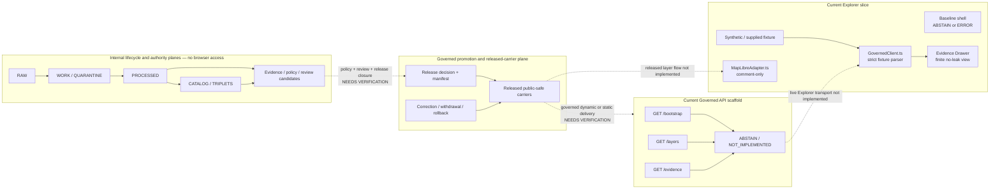

<!-- [KFM_META_BLOCK_V2]
doc_id: kfm://doc/architecture-ui-boundaries
title: UI Boundaries — Current Architecture and Enforcement Map
type: architecture-reference
version: v2.0-draft
status: draft; repository-grounded; bounded-executable; mixed-maturity; non-authoritative
owners:
  - "@bartytime4life — verified CODEOWNERS review route"
  - "NEEDS VERIFICATION — independent UI, accessibility, security, policy, evidence, release, and runtime stewardship"
created: 2026-05-24
updated: 2026-08-18
policy_label: public; architecture; ui; trust-membrane; no-release; no-publication
owning_root: docs/
responsibility: Explain the current UI trust boundaries, repository-present enforcement surfaces, proposed seams, and unresolved production obligations without becoming doctrine, contract, schema, policy, release, or runtime authority.
truth_posture: cite-or-abstain; current-state claims are pinned to repository evidence; proposed decisions and unverified runtime behavior remain visibly bounded
current_path: docs/architecture/ui/BOUNDARIES.md
evidence_snapshot:
  repository: bartytime4life/Kansas-Frontier-Matrix
  base_ref: main
  base_commit: 34d509c690649b284a7c0be739e3a5c8c85926ee
  target_prior_blob: 1e46011ee0c77ec4e23f56bb45e21a40750a6a67
  directory_rules_blob: fd49a0b83e55cef52c1124281f093e263526898d
  directory_rules_decision: ADR-0029 accepted
  explorer_package_blob: ddd201b74a06001d84a14bf54ac62a6cc3607a29
  explorer_main_blob: 9c95ae67333b7cbf6bc88051fa5c76e4cd97efa4
  explorer_shell_blob: 64c78c78820af33fb7a622094e4c0944ad9412f8
  explorer_governed_client_blob: 21f6e4d1225ab0427ecb689d6782f4b56fc25ea2
  explorer_evidence_drawer_blob: 7746843c259594568fe75e975155a67eb8372e8f
  explorer_maplibre_adapter_blob: 663ba0f7a05498948f67d644387c73ab19d5c16c
  governed_api_registry_blob: 3418168d0b267160d6ad6dd87f289e880ef4a024
  governed_api_stub_blob: 371e60d9f96c78e31c8a1e6109d19dee5da4213b
  map_context_contract_blob: c6367306f14f9da56b3e3cbe7fad9d5545a0cdbf
  evidence_drawer_contract_blob: 412a0a86c85c98748ac08e263a94c7eaac760c04
  explorer_boundary_test_blob: 97d44069b0a5ab4a82b1e1fc48665e905c08a287
related:
  - ./README.md
  - ../TRUST_MEMBRANE.md
  - ../governed-api.md
  - ../evidence-drawer.md
  - ./MAP_RUNTIME_BOUNDARY.md
  - ./EVIDENCE_DRAWER.md
  - ./map-context-evidence-drawer-admission.md
  - ../../doctrine/directory-rules.md
  - ../../doctrine/trust-membrane.md
  - ../../adr/ADR-0004-apps-governed-api-is-the-trust-membrane.md
  - ../../adr/ADR-0005-apps-explorer-web-is-the-canonical-map-first-shell.md
  - ../../adr/ADR-0006-maplibre-boundary--only-maplibreadapter-imports-maplibre.md
  - ../../adr/ADR-0019-ai-adapter-contract-and-finite-envelopes.md
  - ../../adr/ADR-0020-abstain-is-a-first-class-decision.md
  - ../../adr/ADR-0025-public-client-never-reads-canonical-internal-stores.md
  - ../../adr/ADR-0029-adopt-directory-governance-standard-v2.md
  - ../../../apps/explorer-web/README.md
  - ../../../apps/governed-api/README.md
  - ../../../contracts/ui/map_context_envelope.md
  - ../../../contracts/ui/evidence_drawer_payload.md
  - ../../../tests/policy/test_explorer_web_adapter_boundary.py
tags: [kfm, architecture, ui, explorer-web, governed-api, evidence-drawer, map-runtime, trust-membrane, finite-outcomes, fail-closed, correction, rollback]
notes:
  - "v2.0-draft is a same-path documentation-only reconciliation against current repository evidence."
  - "ADR-0029 is accepted and confirms the existing docs/architecture/ui/ lane as placement-safe; UI shell, governed-API, MapLibre, finite-outcome, abstention, and public-client ADRs remain proposed unless separately accepted."
  - "The current Explorer entrypoint is a bounded fail-closed shell with a fixture-driven Evidence Drawer. It is not a functional map product, live governed-API client, released-layer flow, deployment, or publication surface."
  - "The current Governed API exposes exactly three GET scaffold routes and returns ABSTAIN / NOT_IMPLEMENTED; no evidence-backed ANSWER path is established."
  - "packages/ui/ and packages/maplibre/ are repository-present placeholders; MapLibreAdapter.ts is comment-only and no browser renderer dependency is admitted by current evidence."
[/KFM_META_BLOCK_V2] -->

# UI Boundaries — Current Architecture and Enforcement Map

> **Operating rule.** KFM user interfaces may render governed finite outcomes and already released public-safe carriers. They do not create truth, admit sources, resolve evidence authority, decide policy, approve release, or publish by rendering something.

| Field | Current result |
|---|---|
| **Document role** | Human-readable architecture reference under `docs/`; not doctrine, an accepted ADR, semantic contract, machine schema, policy, release record, or runtime proof. |
| **Evidence snapshot** | `main@34d509c690649b284a7c0be739e3a5c8c85926ee`. |
| **Placement authority** | **CONFIRMED:** accepted [ADR-0029](../../adr/ADR-0029-adopt-directory-governance-standard-v2.md) adopts [Directory Rules v2](../../doctrine/directory-rules.md); the existing `docs/architecture/ui/` lane is placement-safe. |
| **Explorer implementation** | **CONFIRMED / BOUNDED:** Vite/TypeScript/Vitest/Playwright app scaffold; the default shell returns `ABSTAIN / NO_GOVERNED_RESPONSE`, supplied baseline input returns `ERROR / UNSUPPORTED_BASELINE_INPUT`, and the entrypoint mounts a fixture-driven Evidence Drawer. |
| **Evidence Drawer** | **CONFIRMED / BOUNDED:** strict fixture-only public-safe projection parser, finite view-state resolver, fixed no-leak negative copy, bounded history, and keyboard-operable rendering. No live transport or authoritative evidence resolution is established. |
| **Governed API** | **CONFIRMED / BOUNDED:** exactly `/bootstrap`, `/layers`, and `/evidence` are registered; each returns `ABSTAIN / NOT_IMPLEMENTED`. Unknown or unsupported requests fail safely. |
| **Map runtime** | **HOLD:** `packages/maplibre/` is a private `0.0.0` placeholder, `MapLibreAdapter.ts` contains only the import-boundary comment, and Explorer declares no renderer dependency. |
| **Decision status** | **MIXED:** ADR-0029 is accepted; the relevant shell, governed-API, renderer, finite-envelope, abstention, and public-client ADRs remain proposed or draft. |
| **Deployment and public operation** | **UNKNOWN / not established:** authentication, authorization, CSP, CORS, network isolation, production telemetry, released-layer delivery, correction propagation, cache invalidation, and publication were not proved. |
| **Release/publication effect of this page** | None. A document, commit, workflow, or pull request is not a governed release or publication transition. |

> [!IMPORTANT]
> **Repository presence is not boundary closure.** KFM currently has useful pieces of the UI trust membrane: a fail-closed shell, a strict fixture projection, selected source-level guards, proposed contracts and schemas, and a negative Governed API scaffold. It does not yet have a proved end-to-end public claim path.

> [!CAUTION]
> **Projection is not evidence closure.** The browser may display an `EvidenceDrawerPayload`; that does not prove an `EvidenceRef` resolved to an authoritative `EvidenceBundle`, policy allowed exposure, review occurred, or a release is public.

---

## Contents

- [1. Purpose & scope](#1-purpose--scope)
- [2. The five UI boundaries](#2-the-five-ui-boundaries)
- [3. UI surfaces and their trust requirements](#3-ui-surfaces-and-their-trust-requirements)
- [4. Boundary flow](#4-boundary-flow)
- [5. What the UI plane owns — and must not own](#5-what-the-ui-plane-owns--and-must-not-own)
- [6. Negative states are first-class](#6-negative-states-are-first-class)
- [7. Canonical UI homes (Directory Rules basis)](#7-canonical-ui-homes-directory-rules-basis)
- [8. Anti-patterns and DENY surfaces](#8-anti-patterns-and-deny-surfaces)
- [9. Required objects at the boundary](#9-required-objects-at-the-boundary)
- [10. Verification posture](#10-verification-posture)
- [Related docs](#related-docs)

---

## 1. Purpose & scope

### 1.1 Purpose

This page makes the UI plane's trust boundaries inspectable against current repository evidence. It explains what the browser may consume, what it may request, what it may render, where current enforcement exists, and where the system must still abstain from stronger implementation claims.

A KFM UI is not a transparent window into canonical storage. It is a downstream consumer of governed finite envelopes and released public-safe carriers. A rendered tile, feature property, badge, popup, story, export, model answer, test result, or fixture never becomes sovereign truth by appearing in the browser.

### 1.2 Authority by question

| Question | Controlling evidence |
|---|---|
| Where does this page belong? | Accepted ADR-0029, adopted Directory Rules v2, the existing `docs/architecture/ui/` lane, and the local UI architecture README. |
| What exists now? | Pinned repository bytes, manifests, tests, workflows, and emitted artifacts tied to the evidence snapshot. |
| What does a UI object mean? | Its semantic contract, paired machine schema, applicable policy, and accepted decision records. |
| May a field or geometry be shown? | Evidence, rights, sensitivity, purpose, audience, policy, review, release, correction, and rollback state. |
| Is a client path safe in production? | Deployed configuration, authentication, authorization, network policy, runtime tests, logs, and security evidence—not source structure alone. |
| Is something released or published? | A governed release decision and released artifact state—not this page, a schema-valid fixture, a build, or a pull request. |

### 1.3 In scope

- Browser and UI responsibility boundaries.
- Current Explorer, Evidence Drawer, Governed API, map-runtime, contract, policy, and test evidence relevant to those boundaries.
- The five cross-cutting boundary rules every current or future UI surface must preserve.
- Finite negative states and no-leak behavior.
- Responsibility-root placement for UI documentation, deployables, shared packages, contracts, schemas, policy, fixtures, tests, and release dependencies.
- Graduation evidence required before stronger runtime or public-operation claims.

### 1.4 Out of scope

- Accepting ADR-0004, ADR-0005, ADR-0006, ADR-0007, ADR-0019, ADR-0020, or ADR-0025.
- Selecting or installing a renderer, plugin, model provider, authentication system, or deployment platform.
- Defining field-level contracts or schema constraints in architecture prose.
- Activating a source, EvidenceBundle registry, policy evaluator, release pipeline, model runtime, network route, or public endpoint.
- Moving, renaming, consolidating, or retiring sibling UI documents.
- Claiming a production `ANSWER`, released map layer, public deployment, or KFM publication.

### 1.5 Non-effects

This page does not resolve evidence, execute policy, authenticate review, approve release, mutate lifecycle state, authorize sensitive detail, emit a correction, perform rollback, or make a carrier public. If this page conflicts with current executable evidence or an accepted decision, record the conflict and narrow the page; do not turn the page into parallel authority.

[Back to top](#top)

---

## 2. The five UI boundaries

The five boundaries below are the UI-specific reading of KFM's trust membrane. The rule column states the architecture requirement. The evidence column states only what is currently proved at the pinned snapshot.

| ID | Boundary | Architecture rule | Current repository evidence | Not yet established |
|---|---|---|---|---|
| **B-1** | **Public-client / internal-store boundary** | Ordinary clients must not read RAW, WORK, QUARANTINE, PROCESSED, catalog/triplet internals, proof stores, release internals, canonical stores, graph/vector indexes, or model runtimes directly. | A source-level test scans Explorer source for selected forbidden lifecycle path literals; `GovernedClient.ts` explicitly performs no network or lifecycle-store access. | Deployed network isolation, credentials, indirect dependency closure, object-store/CDN policy, database permissions, and production egress controls. |
| **B-2** | **Governed delivery and finite-envelope boundary** | Trust-bearing dynamic responses pass through a governed interface; already released immutable carriers may use a governed static edge. Browser state must remain one of `ANSWER`, `ABSTAIN`, `DENY`, or `ERROR`, with safe reason codes. | Governed API registers three negative scaffold routes. Explorer has a strict fixture parser and finite Evidence Drawer resolver. | A live Explorer-to-API transport, authenticated callers, authoritative evidence lookup, accepted policy execution, release binding, or a substantive `ANSWER`. |
| **B-3** | **Renderer and selection boundary** | A renderer draws admitted public-safe carriers and emits selection candidates. Rendered pixels, feature properties, popups, style state, and map clicks are never claims or evidence authority. | An adapter-boundary test confines literal MapLibre/Cesium imports to `adapters/`; `MapLibreAdapter.ts` is comment-only. `MapContextEnvelope` has a proposed renderer-neutral, no-network contract/fixture lane. | An admitted renderer dependency, implemented `MapRuntimePort`, released layers, map-click transport, selection-to-claim resolution, performance evidence, or renderer decision acceptance. |
| **B-4** | **AI and candidate-producer boundary** | Focus Mode, watchers, map interactions, search, diagnostics, and generated text may request or propose work; they cannot admit evidence, decide policy, approve review, promote lifecycle state, release, or publish. | Finite runtime and UI contract families, mock/fixture surfaces, and no-leak browser projections exist. No direct model call is composed into Explorer. | Live Focus transport, model/provider execution, citation service, AIReceipt persistence, policy/citation closure, or production audit evidence. |
| **B-5** | **Release, correction, and rollback boundary** | A consequential UI surface must reflect the active release, freshness, correction, withdrawal, and rollback posture. A style toggle, cache hit, screenshot, export, or browser route cannot create publication. | Evidence Drawer trust labels and bounded correction/negative history are implemented for fixtures. Release/correction/rollback object families and repository lanes exist separately. | End-to-end release-manifest binding, authenticated correction propagation, withdrawal behavior across clients, cache invalidation, rollback execution, and public parity. |

> [!WARNING]
> **B-1 is only partly enforced.** A source-literal test is useful, but it cannot prove network or deployment isolation. Treat it as a bounded regression guard, not as security certification.

> [!NOTE]
> **B-3 is on HOLD rather than implemented.** The repository has a package name, an adapter filename, tests, validators, and proposed ADRs. It does not currently have an admitted browser renderer runtime.

[Back to top](#top)

---

## 3. UI surfaces and their trust requirements

Every UI surface inherits the same trust membrane, but current maturity differs. A document name or feature folder does not establish a live route or production behavior.

| Surface | Required trust posture | Current repository result |
|---|---|---|
| **Explorer baseline shell** | Render only finite governed state; never infer a claim from absence or browser input. | **CONFIRMED / BOUNDED:** default `ABSTAIN / NO_GOVERNED_RESPONSE`; supplied input returns `ERROR / UNSUPPORTED_BASELINE_INPUT`; zero evidence refs. This is a safe baseline, not a functional map shell. |
| **Explore / map runtime** | Load only released public-safe carriers; emit selection candidates; route consequential selection through governed resolution. | **HOLD:** no renderer dependency, no map object, no released layer flow, and comment-only adapter. |
| **Layer catalog** | Show only released or role-appropriate descriptors with release, freshness, policy, and correction context. | **CONFIRMED NEGATIVE SCAFFOLD:** Governed API `/layers` returns `ABSTAIN / NOT_IMPLEMENTED`; no live catalog is established. |
| **Evidence Drawer** | Render a closed public-safe projection with finite outcome, citations, trust state, limitations, and bounded non-current history. | **CONFIRMED / BOUNDED:** strict fixture-only parser and keyboard-operable renderer; malformed, denied, and errored input fails closed. Live API and authoritative upstream checks are unverified. |
| **Focus Mode** | Receive bounded released context only; use finite outcomes; require evidence/citation/policy closure for `ANSWER`; never call a provider directly from the browser. | **PROPOSED / NEEDS VERIFICATION:** contracts, schemas, mock and documentation surfaces exist; no live Explorer composition or provider path is established by this update. |
| **Story** | Preserve per-node release, evidence, time, policy, and correction continuity; never detach narrative from its support. | **PROPOSED / NEEDS VERIFICATION:** architecture documentation exists; live playback and governed node resolution were not established here. |
| **Compare / Export** | Keep each side or artifact bound to its own release, evidence, citation, transform, correction, and rollback context. | **PROPOSED / NEEDS VERIFICATION:** architecture documentation exists; no live export or released artifact flow was proved. |
| **Review** | Keep role-gated review state separate from public-client behavior; changes must be explicit, authenticated, and auditable. | **UNKNOWN / NEEDS VERIFICATION:** repository surfaces may exist, but this update does not prove a current authenticated review workflow or decision authority. |
| **Diagnostics and telemetry** | Never become a public raw-store, prompt, model-output, restricted-coordinate, stack-trace, or admin bypass. | **PARTIAL / HOLD:** UI policy stubs and workflow checks record limitations; accepted policy evaluation and deployed enforcement are not established. |

### 3.1 Surface graduation rule

A surface graduates from architecture target to current behavior only when its claim is supported by the relevant code, contracts, schemas, fixtures, tests, policy, workflow/run evidence, and—where public exposure matters—release and deployment evidence. A passing build alone is insufficient.

[Back to top](#top)

---

## 4. Boundary flow

The diagram separates the intended architecture from the currently executable slice. Solid arrows are repository-present local behavior. Dashed arrows are required future composition and remain on HOLD or NEEDS VERIFICATION.

```mermaid
flowchart LR
  subgraph INTERNAL["Internal lifecycle and authority planes — no browser access"]
    RAW["RAW"]
    WQ["WORK / QUARANTINE"]
    PROC["PROCESSED"]
    CAT["CATALOG / TRIPLETS"]
    EVID["Evidence / policy / review candidates"]
    RAW --> WQ --> PROC --> CAT
    PROC --> EVID
    CAT --> EVID
  end

  subgraph RELEASE["Governed promotion and released-carrier plane"]
    REL["Release decision + manifest"]
    CORR["Correction / withdrawal / rollback"]
    PUB["Released public-safe carriers"]
    REL --> PUB
    CORR --> PUB
  end

  subgraph API["Current Governed API scaffold"]
    BOOT["GET /bootstrap"]
    LAYERS["GET /layers"]
    EVAPI["GET /evidence"]
    NEG["ABSTAIN / NOT_IMPLEMENTED"]
    BOOT --> NEG
    LAYERS --> NEG
    EVAPI --> NEG
  end

  subgraph UI["Current Explorer slice"]
    BASE["Baseline shell\nABSTAIN or ERROR"]
    FIX["Synthetic / supplied fixture"]
    CLIENT["GovernedClient.ts\nstrict fixture parser"]
    DRAWER["Evidence Drawer\nfinite no-leak view"]
    ADAPTER["MapLibreAdapter.ts\ncomment-only"]
    FIX --> CLIENT --> DRAWER
  end

  EVID -. "policy + review + release closure\nNEEDS VERIFICATION" .-> REL
  PUB -. "governed dynamic or static delivery\nNEEDS VERIFICATION" .-> API
  NEG -. "live Explorer transport not implemented" .-> CLIENT
  PUB -. "released layer flow not implemented" .-> ADAPTER
```

### 4.1 What the diagram proves

- The current Governed API route registry and negative response behavior are concrete.
- The current Explorer baseline and fixture-driven Evidence Drawer path are concrete.
- There is no solid arrow from the Governed API to Explorer because current `GovernedClient.ts` performs no network access.
- There is no solid arrow from released carriers to a map because the map adapter is not implemented and no renderer dependency is admitted.
- Internal-to-release and release-to-public transitions remain architecture obligations whose production closure is not proved here.

[Back to top](#top)

---

## 5. What the UI plane owns — and must not own

The UI plane owns presentation and interaction over bounded governed inputs. It does not own the authority that made those inputs admissible.

| UI responsibility | Current or expected home | The UI must not turn it into |
|---|---|---|
| Deployable browser composition | `apps/explorer-web/` | Source admission, policy, release, evidence, model, or canonical-store authority. |
| Reusable UI presentation code | `packages/ui/` | A second deployable shell or parallel contract home. |
| Renderer anti-corruption adapter | `packages/maplibre/` and the Explorer adapter seam, subject to accepted decisions | Truth store, policy evaluator, citation resolver, sensitive-data filter, or publication authority. |
| Strict public-safe payload parsing | Explorer adapters and feature view models | Upstream authenticity, evidence closure, or release proof. |
| Evidence Drawer rendering and accessibility | `apps/explorer-web/src/features/evidence_drawer/` | EvidenceBundle construction, policy recomputation, or correction authority. |
| Finite negative-state presentation | Explorer feature code | Silent retry-to-answer, partial answer, or reflection of restricted input. |
| User interaction context | Proposed `MapContextEnvelope` and related UI contracts | Raw renderer objects, arbitrary feature blobs, canonical data, or proof-store contents. |
| Trust labels and correction/history display | UI projections | A substitute for the underlying decision, release, correction, or rollback record. |

### 5.1 Upstream responsibilities remain separate

| Responsibility | Owning surface | UI relationship |
|---|---|---|
| Semantic meaning | `contracts/` | UI consumes reviewed semantics; it does not redefine them in components. |
| Machine shape | `schemas/` | UI validates the profile it consumes; schema validity is not truth. |
| Admissibility and obligations | `policy/` | UI renders policy outcomes; it does not author or override them. |
| Evidence support | Evidence contracts, resolver, stores, proofs, and governed services | UI receives a public-safe projection; it does not resolve authority. |
| Lifecycle records | `data/` responsibility planes | Browser access is denied except through governed released projections or carriers. |
| Release, correction, withdrawal, rollback | `release/` and linked records | UI reflects active state; it cannot promote or publish. |
| Dynamic trust-bearing delivery | `apps/governed-api/` if the proposed decision is accepted and implementation graduates | Explorer consumes finite envelopes; current transport is not implemented. |
| Executable proof | `tests/`, `fixtures/`, validators, workflows, and observed runtime evidence | Tests bound claims; they do not approve release or publication. |

> [!WARNING]
> A UI requirement that appears to need direct ownership of policy, evidence resolution, lifecycle storage, model execution, or release is a boundary-design error. Move the authoritative work upstream and keep only the bounded projection in the browser.

[Back to top](#top)

---

## 6. Negative states are first-class

KFM must make refusal and uncertainty visible. The current Explorer slice already implements a narrower, concrete negative-state vocabulary. Do not document broader states as implemented until the profile, parser, fixtures, tests, and upstream producer all support them.

### 6.1 Current baseline-shell states

| Outcome | Reason code | Current behavior |
|---|---|---|
| `ABSTAIN` | `NO_GOVERNED_RESPONSE` | Default shell state; no evidence refs. |
| `ERROR` | `UNSUPPORTED_BASELINE_INPUT` | Any supplied baseline input is rejected; no evidence refs. |

### 6.2 Current Evidence Drawer profile

| Finite result | Current reason-code family | Browser posture |
|---|---|---|
| `ANSWER` | `SUPPORTED` | Render governed title, summary, evidence refs, HTTPS citations, limitations, trust labels, and bounded safe history only when the closed profile is internally consistent. |
| `ABSTAIN` | `MISSING_EVIDENCE`, `STALE_EVIDENCE`, `CITATION_UNRESOLVED`, `HELD_EVIDENCE`, `SUPERSEDED_EVIDENCE`, `WITHDRAWN_EVIDENCE`, `REVOKED_EVIDENCE` | Render fixed public-safe reason copy. Bounded identifiers or history are visible only where the profile permits them and never as current support. |
| `DENY` | `POLICY_DENIED`, `RIGHTS_UNRESOLVED`, `SENSITIVE_DETAIL_RESTRICTED` | Render fixed no-leak copy; suppress evidence refs, citations, limitations-as-claim-text, and history identifiers. |
| `ERROR` | `UPSTREAM_ERROR` | Render fixed error copy and no partial answer. |
| App-local `ERROR` | `INVALID_PAYLOAD` | Malformed or contradictory supplied projection is replaced by fixed safe copy; no input values are reflected. |

### 6.3 Current trust and history labels

The fixture profile exposes bounded labels for:

- source role;
- policy state;
- review state;
- release state;
- freshness;
- correction state;
- held, denied, superseded, revoked, and withdrawn evidence as non-current history; and
- acyclic correction lineage from prior to active evidence references.

Those labels describe a supplied projection. They do not authenticate the underlying records.

### 6.4 Target states that are not current profile facts

Broader architecture concepts such as generalized geometry, restricted zoom, embargo, delayed release, audience-specific redaction, stale layer artifacts, cache withdrawal, or unavailable correction stores may be necessary. They require explicit contract/schema/policy reason codes and fixtures before this page can call them executable UI states.

[Back to top](#top)

---

## 7. Canonical UI homes (Directory Rules basis)

Accepted Directory Rules place artifacts by responsibility. The table below distinguishes repository presence from accepted architecture decisions and implementation maturity.

| Concern | Current home | Current evidence and boundary |
|---|---|---|
| UI architecture explanation | `docs/architecture/ui/` | **CONFIRMED repository-present lane.** This page remains at its existing path. Documentation does not create runtime or decision authority. |
| Deployable browser shell | `apps/explorer-web/` | **CONFIRMED repository-present / proposed canonical decision.** Build/test scripts and bounded shell exist; ADR-0005 remains proposed. |
| Dynamic governed interface | `apps/governed-api/` | **CONFIRMED repository-present / proposed trust-membrane decision.** Three negative routes exist; ADR-0004 remains proposed and production closure is absent. |
| Reusable UI package | `packages/ui/` | **CONFIRMED placeholder:** private `@kfm/ui` `0.0.0` with placeholder export. |
| MapLibre package | `packages/maplibre/` | **CONFIRMED placeholder:** private `@kfm/maplibre` `0.0.0`; no runtime dependency or functioning adapter. |
| Browser renderer adapter | `apps/explorer-web/src/adapters/MapLibreAdapter.ts` | **CONFIRMED comment-only boundary marker.** Import-boundary test exists; no renderer admission is implied. |
| UI semantic contracts | `contracts/ui/` | **CONFIRMED repository-present family.** `MapContextEnvelope` is proposed/inactive/no-network; `EvidenceDrawerPayload` is a bounded draft profile with an unresolved UI/evidence home seam. |
| UI machine shapes | `schemas/contracts/v1/ui/` | **CONFIRMED repository-present family.** Shape validation does not establish evidence, policy, release, or runtime authenticity. |
| Reusable synthetic examples | `fixtures/ui/` | **CONFIRMED repository-present family.** Fixtures are declaration and regression evidence, not production data. |
| UI validators | `tools/validators/ui/` | **CONFIRMED repository-present family.** Validators check bounded profiles; they do not execute policy or publish. |
| Executable assertions | Explorer tests and repository `tests/` | **CONFIRMED selected source-level and fixture tests.** Full deployment/security closure remains unproved. |
| UI policy source | `policy/ui/` | **CONFIRMED partial/HOLD:** current lane contains proposed telemetry-related Rego stubs that do not yet deny inputs; accepted evaluator/bundle/consumer is absent. |
| Release and rollback decisions | `release/` and linked governed records | **Separate authority.** Browser components may reference active state but never author it. |

### 7.1 Renderer decision boundary

No current evidence supports a `packages/cesium/` implementation, and no renderer-selection ADR is accepted at the snapshot. ADR-0006 and ADR-0007 remain proposed. This page therefore records the existing MapLibre placeholder and HOLD without declaring MapLibre installed, Cesium retired, or a sole-renderer decision effective.

### 7.2 Compatibility and parallel-home rule

`ui/`, `web/`, `styles/`, `viewer_templates/`, or any future compatibility surface must not become a second authoritative shell, package, schema, policy, or release home. A migration or alias requires the adopted Directory Rules process, reference closure, tests, and rollback. Current same-path modernization creates no new home.

[Back to top](#top)

---

## 8. Anti-patterns and DENY surfaces

| Anti-pattern | Required refusal | Current enforcement evidence | Remaining gap |
|---|---|---|---|
| Explorer source contains direct lifecycle or release path literals. | Deny direct internal-store coupling. | `test_explorer_web_has_no_internal_data_store_path_literals` scans selected path markers. | Indirect imports, generated code, URLs, deployment routing, credentials, and network access are not proved safe by this test. |
| Renderer imports appear outside the adapter lane. | Deny renderer-runtime acquisition outside the bounded adapter. | `test_maplibre_and_cesium_imports_stay_in_adapters_only` scans source imports. | No renderer is installed; dynamic imports, plugins, transitive dependencies, and production bundle analysis need separate proof. |
| A map click or popup becomes a claim. | Treat selection as a candidate and require governed resolution. | Proposed renderer-neutral `MapContextEnvelope` contract/fixtures exist. | No live map, click handler, transport, or claim-resolution path exists. |
| Malformed governed payload is partially rendered. | Return safe app-local `ERROR / INVALID_PAYLOAD`; render no partial claim. | Strict parser and Evidence Drawer resolver implement this path. | Upstream authenticity and production fuzz/security evidence remain unverified. |
| `DENY` or `ERROR` reflects restricted input. | Use fixed public-safe copy; suppress evidence, citations, history, and arbitrary limitations. | Evidence Drawer implementation and bounded fixtures/tests cover no-leak behavior. | Production localization, logging, telemetry, server error bodies, and end-to-end leakage remain unverified. |
| Browser or map client calls a model/provider directly. | Deny direct provider path; route any future Focus request through a governed server boundary. | Explorer entrypoint contains no provider composition; current UI is fixture-only. | Full dependency graph, CSP/connect-src, deployment network policy, and live Focus integration remain unverified. |
| Sensitive geometry is hidden only by style. | Deny or generalize upstream before carrier delivery. | Architecture and policy doctrine require upstream treatment. | No released map artifact flow exists to prove byte-level non-disclosure. |
| UI policy-shaped stubs are treated as protection. | Remain on HOLD until fail-closed rules, tests, bundle selection, evaluator, and consumer are bound. | `policy/ui/` documents two non-denying stubs and workflow HOLD. | Accepted operational policy enforcement is absent. |
| A diagnostics or telemetry surface exposes internal details. | Keep diagnostics role-gated and telemetry content-minimized; no raw evidence, prompts, restricted coordinates, or stack traces. | Documentation and candidate policy lanes identify the risk. | Authentication, authorization, sink behavior, redaction, retention, and production tests remain unknown. |
| Watcher, browser, test, or workflow publishes directly. | Candidate/receipt only; promotion remains a governed state transition. | Cross-system architecture and separate release roots preserve the responsibility split. | End-to-end operational release controls and repository settings were not proved by this page. |
| UI ships a consequential state without correction or rollback. | Hold release until active release, correction, withdrawal, and rollback behavior is inspectable. | Drawer fixture profile can display bounded correction/history labels. | Real release binding, cache invalidation, multi-client propagation, and rollback drills remain unverified. |

> [!CAUTION]
> **A green source-level guard is not a security boundary by itself.** Keep the guard, but require deployment, runtime, policy, and negative-test evidence in proportion to the exposure risk.

[Back to top](#top)

---

## 9. Required objects at the boundary

This page names object families only to explain the UI crossing. Their contracts, schemas, policy, code, and release records remain authoritative for their own responsibilities.

| Object or family | Current evidence | UI boundary |
|---|---|---|
| `RuntimeResponseEnvelope` | Semantic contract, closed schema, deterministic builder/fixtures, and current negative Governed API subset are repository-present; governing ADRs remain proposed. | UI renders exactly one finite outcome. A current API `ABSTAIN` is not an `ANSWER`. |
| `EvidenceDrawerPayload` | Closed UI profile, synthetic fixtures, validator, strict Explorer parser, view resolver, and tests are repository-present; UI/evidence semantic-home seam remains unresolved. | Public-safe projection only; does not close or authenticate evidence. |
| `MapContextEnvelope` | Proposed/inactive renderer-neutral contract, schema, fixtures, validator, and tests are repository-present. | Carries bounded request context only; no raw renderer objects, policy, evidence resolution, or release authority. No live app integration is established. |
| `EvidenceRef` / `EvidenceBundle` | Repository contracts/schemas and an internal non-authoritative candidate resolver exist; current public runtime integration remains held. | A consequential `ANSWER` needs governed evidence support. Browser projection never substitutes for the bundle. |
| `PolicyDecision` | Contract/schema/policy families exist in the repository; accepted runtime evaluation for the UI path is not established. | UI displays a bounded decision result and obligations; it never recomputes or overrides policy. |
| `LayerManifest`, style and tile-artifact manifests | Object families and architecture surfaces exist, but this update does not establish a released Explorer layer flow. | Renderer inputs must be released, integrity-bound, public-safe, and correction-aware before loading. |
| `ReleaseManifest`, correction, withdrawal, and rollback records | Separate release/governance lanes exist; production binding and public propagation remain unverified. | UI reflects the active release lineage. It does not author or promote it. |
| Focus request/response and `AIReceipt` families | Proposed contracts/schemas, adapters, fixtures, and proof surfaces exist in bounded form; no live Explorer/provider path is proved. | Focus may interpret released evidence through finite outcomes; generated language never outranks evidence or policy. |
| Citation validation family | Contracts/validators are represented in the repository and Evidence Drawer profile carries HTTPS citations. | UI must not promote unresolved citation support into `ANSWER`; profile validity is not source authenticity. |

### 9.1 Minimum substantive `ANSWER` burden

A future claim-bearing UI `ANSWER` must be able to demonstrate, for its declared scope:

1. request and response shape validity;
2. caller and audience authorization where applicable;
3. authoritative evidence resolution;
4. citation closure;
5. rights, sensitivity, purpose, and precision evaluation;
6. review and release state;
7. freshness and temporal fit;
8. correction, withdrawal, and rollback context;
9. safe public projection; and
10. observed runtime behavior tied to a known release.

The current Explorer/Governed API composition does not meet that burden and correctly remains negative or fixture-only.

[Back to top](#top)

---

## 10. Verification posture

### 10.1 Confirmed in this update

- The complete existing `BOUNDARIES.md` was read at blob `1e46011ee0c77ec4e23f56bb45e21a40750a6a67`.
- The file remains at the same existing path under the `docs/` responsibility root.
- ADR-0029 is accepted and adopts the exact Directory Rules v2 bytes at `docs/doctrine/directory-rules.md`.
- `docs/architecture/ui/` is a repository-present architecture lane with a repository-grounded README and focused sibling documents.
- Explorer's package scripts, entrypoint, baseline shell, fixture-only governed client, Evidence Drawer, and comment-only MapLibre adapter were inspected.
- Governed API's route registry, three route handlers, and negative stub envelope were inspected.
- The selected Explorer adapter/internal-store source guard was inspected.
- `packages/ui/` and `packages/maplibre/` are private `0.0.0` placeholders with placeholder exports.
- `MapContextEnvelope` and the bounded UI `EvidenceDrawerPayload` contracts were inspected with their explicit non-effects.
- `policy/ui/` currently contains proposed non-denying telemetry stubs and records workflow HOLD rather than operational enforcement.

### 10.2 Proposed or unverified

| Claim | Status |
|---|---|
| `apps/explorer-web/` is the accepted canonical shell. | **PROPOSED:** repository-present and named by ADR-0005, but ADR-0005 remains proposed. |
| `apps/governed-api/` is an accepted complete trust membrane. | **PROPOSED / PARTIAL:** app exists and fails closed; ADR-0004 remains proposed and required integrations are absent. |
| MapLibre is installed, admitted, or the accepted sole renderer. | **FALSE AS CURRENT IMPLEMENTATION / PROPOSED AS DECISION:** current package and adapter are placeholders; ADR-0006/0007 remain proposed. |
| Explorer has a live governed-API client. | **NOT ESTABLISHED:** current adapter is fixture-only and no-network. |
| Explorer renders released map layers. | **NOT ESTABLISHED:** no renderer dependency or live layer path is present. |
| Policy, evidence, review, release, correction, and rollback are enforced end to end. | **UNKNOWN / NEEDS VERIFICATION.** |
| Authentication, authorization, production network isolation, CSP/CORS, telemetry safety, and deployment hardening are complete. | **UNKNOWN / NEEDS VERIFICATION.** |
| A production `ANSWER` or KFM public release exists. | **NOT CLAIMED.** |

### 10.3 Open verification backlog

1. Wire no live transport until the authoritative EvidenceRef-to-EvidenceBundle lookup, policy, review, release, citation, correction, and rollback dependencies are explicitly owned and testable.
2. Decide ADR-0004/0005/0006/0007/0019/0020/0025 independently; do not infer acceptance from repository naming or documentation repetition.
3. Resolve the UI/evidence semantic-home seam for `EvidenceDrawerPayload` without creating a third authority.
4. Prove browser and API deployment isolation with authentication, authorization, CSP, CORS, secret handling, network policy, negative tests, logs, and observed runtime evidence.
5. Admit a renderer only after package/version/supply-chain review, adapter contract closure, browser probes, accessibility/performance budgets, rollback, and decision evidence.
6. Implement and verify released-layer, selection-to-resolution, correction, withdrawal, cache-invalidation, and rollback flows before claiming a public map product.
7. Replace or retire non-enforcing UI policy stubs only through their policy-root review, test, bundle, evaluator, consumer, and rollback path.
8. Verify Focus, Story, Compare/Export, Review, Diagnostics, and Telemetry as separate bounded slices rather than treating architecture documents as implementation.
9. Preserve no-leak finite outcomes across localization, logs, telemetry, server errors, and downstream exports.
10. Re-run focused documentation and repository-native checks at the exact feature head and classify introduced, inherited, and external failures separately.

### 10.4 Validation expectations for changes to this page

A documentation-only update should, at minimum:

- change only the intended path unless a direct documentation dependency is proved;
- preserve the major section anchors retained in this version;
- keep Markdown fences, tables, callouts, and Mermaid syntax balanced;
- resolve every relative link used as repository evidence;
- avoid claiming local code-test execution when only hosted or source inspection evidence exists;
- keep decision status separate from repository presence and implementation maturity;
- classify hosted failures against the pinned base before attributing them to this page; and
- stop at a reviewable branch or draft pull request unless a separate current instruction raises the terminal boundary.

### 10.5 Rollback

Before merge, close the draft pull request and abandon or delete its feature branch. After an authorized merge, revert the single documentation commit through the normal reviewed path. No runtime, source, policy, data, release, deployment, or publication rollback is required because this page changes documentation only.

[Back to top](#top)

---

## Related docs

### Current architecture and doctrine

- [`README.md`](./README.md) — repository-grounded UI architecture landing page.
- [`TRUST_MEMBRANE.md`](../TRUST_MEMBRANE.md) — current cross-root trust-membrane architecture and enforcement map.
- [`governed-api.md`](../governed-api.md) — current Governed API architecture and negative scaffold state.
- [`evidence-drawer.md`](../evidence-drawer.md) — current Evidence Drawer architecture and bounded executable projection.
- [`MAP_RUNTIME_BOUNDARY.md`](./MAP_RUNTIME_BOUNDARY.md) — map-runtime seam; older proposed details must be read against current placeholder evidence and proposed ADR status.
- [`EVIDENCE_DRAWER.md`](./EVIDENCE_DRAWER.md) — UI-lane Evidence Drawer architecture; relationship to the flat architecture page remains a documented consolidation question.
- [`map-context-evidence-drawer-admission.md`](./map-context-evidence-drawer-admission.md) — bounded admission seam for map context and drawer projection.
- [`directory-rules.md`](../../doctrine/directory-rules.md) — adopted Directory Rules v2 bytes.
- [`trust-membrane.md`](../../doctrine/trust-membrane.md) — trust-membrane doctrine.

### Decision records

- [`ADR-0029`](../../adr/ADR-0029-adopt-directory-governance-standard-v2.md) — **accepted** Directory Rules decision.
- [`ADR-0004`](../../adr/ADR-0004-apps-governed-api-is-the-trust-membrane.md) — proposed Governed API trust-membrane decision.
- [`ADR-0005`](../../adr/ADR-0005-apps-explorer-web-is-the-canonical-map-first-shell.md) — proposed Explorer shell decision.
- [`ADR-0006`](../../adr/ADR-0006-maplibre-boundary--only-maplibreadapter-imports-maplibre.md) — proposed MapLibre import-boundary decision.
- [`ADR-0019`](../../adr/ADR-0019-ai-adapter-contract-and-finite-envelopes.md) — proposed AI adapter and finite-envelope decision.
- [`ADR-0020`](../../adr/ADR-0020-abstain-is-a-first-class-decision.md) — proposed first-class abstention decision.
- [`ADR-0025`](../../adr/ADR-0025-public-client-never-reads-canonical-internal-stores.md) — proposed public-client anti-bypass decision.

### Current implementation and contracts

- [`apps/explorer-web/README.md`](../../../apps/explorer-web/README.md) — Explorer boundary and current implementation notes.
- [`apps/governed-api/README.md`](../../../apps/governed-api/README.md) — Governed API app boundary.
- [`contracts/ui/map_context_envelope.md`](../../../contracts/ui/map_context_envelope.md) — proposed renderer-neutral context contract.
- [`contracts/ui/evidence_drawer_payload.md`](../../../contracts/ui/evidence_drawer_payload.md) — bounded UI projection contract.
- [`tests/policy/test_explorer_web_adapter_boundary.py`](../../../tests/policy/test_explorer_web_adapter_boundary.py) — selected source-level adapter and internal-store guards.
- [`.github/workflows/ui-build.yml`](../../../.github/workflows/ui-build.yml) — repository-native Explorer build/test workflow; a workflow file is not publication proof.

---

Last updated: 2026-08-18 · Document version: v2.0-draft · Evidence snapshot: `main@34d509c690649b284a7c0be739e3a5c8c85926ee` · Verified review route: `@bartytime4life` · Independent stewardship: NEEDS VERIFICATION

[Back to top](#top)
