<!-- [KFM_META_BLOCK_V2]
doc_id: kfm://doc/docs-architecture-ui-compare-and-export
title: Compare and Export — UI Subsystem Architecture
type: standard
version: v1
status: draft
owners: <UI subsystem owner> + <docs steward>  # placeholder — replace after CODEOWNERS verification
created: 2026-05-14
updated: 2026-05-14
policy_label: public
related:
  - docs/architecture/ui/README.md
  - docs/architecture/ui/STATE_OWNERSHIP.md
  - docs/architecture/ui/ROUTE_MAP.md
  - docs/architecture/ui/BOUNDARIES.md
  - docs/architecture/ui/CONTINUITY_NOTES.md
  - docs/architecture/ui/TELEMETRY.md
  - docs/architecture/governed-ai/README.md
  - docs/doctrine/trust-membrane.md
  - docs/doctrine/lifecycle-law.md
  - docs/doctrine/directory-rules.md
  - policy/export/README.md
  - policy/telemetry/README.md
tags: [kfm, ui, compare, export, governance, trust-membrane]
notes:
  - All paths PROPOSED until verified against a mounted KFM repository.
  - No external research consulted; project knowledge is authoritative for all KFM-specific claims.
[/KFM_META_BLOCK_V2] -->

# Compare and Export — UI Subsystem Architecture

> The two governed surfaces by which KFM users *see differences* and *take evidence away*. Both panels are public-safe carriers, not authorities: they consume released artifacts, preserve citations, and surface finite outcomes.

<!-- Badges are TODO placeholders — Shields.io targets to be set after CODEOWNERS, CI workflow, and release register are verified in the mounted repo. -->


**Status:** `draft` · **Owners:** UI subsystem owner + docs steward *(placeholder — confirm via CODEOWNERS)* · **Last updated:** 2026-05-14

---

## Quick jump

- [1. Scope and non-goals](#1-scope-and-non-goals)
- [2. Repo fit](#2-repo-fit)
- [3. Status snapshot](#3-status-snapshot)
- [4. Subsystem diagram](#4-subsystem-diagram)
- [5. Compare panel](#5-compare-panel)
- [6. Export panel](#6-export-panel)
- [7. State ownership](#7-state-ownership)
- [8. Finite outcomes by surface](#8-finite-outcomes-by-surface)
- [9. Trust-membrane rules](#9-trust-membrane-rules)
- [10. Receipts and proof objects](#10-receipts-and-proof-objects)
- [11. Routes, DTOs, and schemas](#11-routes-dtos-and-schemas)
- [12. Policy hooks](#12-policy-hooks)
- [13. Telemetry posture](#13-telemetry-posture)
- [14. Validators and tests](#14-validators-and-tests)
- [15. Rollback path](#15-rollback-path)
- [16. Continuity and prior doctrine](#16-continuity-and-prior-doctrine)
- [17. Open questions and verification backlog](#17-open-questions-and-verification-backlog)
- [18. Related docs](#18-related-docs)
- [Appendix A. Compare vs Export at a glance](#appendix-a-compare-vs-export-at-a-glance)

---

## 1. Scope and non-goals

**In scope.** Architecture, state ownership, trust boundaries, finite-outcome grammar, policy hooks, receipts, validators, and rollback for the **Compare** and **Export** panels of the Kansas Frontier Matrix Explorer UI.

**Out of scope.**

- Visual design and component styling. Those belong in `packages/ui/` and `docs/brand/`.
- Source admission, redaction rules, and rights tiering. Those belong in `policy/sensitivity/` and per-domain dossiers.
- Map renderer mechanics. See [BOUNDARIES.md](./BOUNDARIES.md) and [LAYERING.md](./LAYERING.md).
- Focus Mode and governed AI generation. See [`docs/architecture/governed-ai/`](../governed-ai/).

> [!NOTE]
> Compare and Export are **derivative carriers**. They display and package what has already been admitted, validated, released, and reviewed elsewhere. They never originate evidence, never bypass policy, and never publish on their own authority.

---

## 2. Repo fit

This doc is a sibling of the other `docs/architecture/ui/*.md` subsystem docs and inherits their authority posture.

```text
docs/architecture/ui/
├── README.md
├── STATE_OWNERSHIP.md
├── ROUTE_MAP.md
├── BOUNDARIES.md
├── CONTINUITY_NOTES.md
├── LAYERING.md
├── TELEMETRY.md
└── COMPARE_AND_EXPORT.md   ← this file
```

> [!IMPORTANT]
> All paths in this document are **PROPOSED** per [Directory Rules](../../doctrine/directory-rules.md) §0 until verified against a mounted KFM repository. The doctrine in this doc is CONFIRMED from project sources; the *placement* of files this doc references is not.

**Upstream dependencies.**

- `docs/doctrine/lifecycle-law.md` — `RAW → WORK / QUARANTINE → PROCESSED → CATALOG / TRIPLET → PUBLISHED`.
- `docs/doctrine/trust-membrane.md` — public clients consume governed APIs only.
- `docs/architecture/ui/STATE_OWNERSHIP.md` — which state machine owns `ViewState`, `TimeState`, and panel state.
- `docs/architecture/ui/BOUNDARIES.md` — browser allowed/forbidden operations.
- `schemas/contracts/v1/` — DTO and receipt shapes (PROPOSED home per ADR-0001).

**Downstream effects.**

- `policy/export/README.md` — export policy bundle (rights, sensitivity, proof references).
- `policy/telemetry/README.md` — safe UI telemetry constraints.
- `data/receipts/` — emitted `ExportReceipt` and `CitationValidationReport` instances.
- `release/` — `ReleaseManifest` instances that Compare reads and Export pins.

---

## 3. Status snapshot

| Aspect | Status | Notes |
|---|---|---|
| Doctrine | **CONFIRMED** | Encyclopedia, Whole-UI Expansion Report, Domains Atlas, MapLibre Master all describe Compare/Export with consistent intent. |
| Component implementation | **PROPOSED / NEEDS VERIFICATION** | `ComparePanel.tsx` and `ExportPanel.tsx` listed as `CREATE OR ADAPT` in the Whole-UI plan; no mounted-repo verification this session. |
| Schema homes | **PROPOSED** | `schemas/contracts/v1/runtime/`, `schemas/contracts/v1/ui/`, `schemas/contracts/v1/receipts/` per ADR-0001 default. |
| Policy homes | **PROPOSED** | `policy/export/`, `policy/telemetry/`. |
| Test homes | **PROPOSED** | `tests/ui/`, `tests/e2e/`, `tests/fixtures/` per Whole-UI report. |
| Negative-state coverage | **PROPOSED** | ANSWER / ABSTAIN / DENY / ERROR fixtures planned; no live tests verified this session. |

---

## 4. Subsystem diagram

```mermaid
flowchart LR
  classDef public  fill:#e8f5e9,stroke:#2e7d32,color:#1b5e20
  classDef gov     fill:#e3f2fd,stroke:#1565c0,color:#0d47a1
  classDef proof   fill:#fff3e0,stroke:#ef6c00,color:#bf360c
  classDef forbid  fill:#ffebee,stroke:#c62828,color:#b71c1c,stroke-dasharray:4 3

  subgraph BROWSER["Browser (public-safe carriers)"]
    direction TB
    LCP[LayerCatalogPanel]:::public
    CMP[ComparePanel]:::public
    EXP[ExportPanel]:::public
    ED[EvidenceDrawer]:::public
    TL[TimeState / ViewState]:::public
  end

  subgraph GAPI["Governed API (apps/governed-api/)"]
    direction TB
    R1[GET layers/&#123;id&#125;/manifest]:::gov
    R2[GET evidence/&#123;ref&#125;]:::gov
    R3[POST exports]:::gov
    R4[POST telemetry/ui]:::gov
  end

  subgraph TRUTH["Canonical + Released stores"]
    direction TB
    RM[ReleaseManifest]:::proof
    LM[LayerManifest]:::proof
    EB[EvidenceBundle]:::proof
    CR[Catalog records]:::proof
  end

  RAW[RAW / WORK / QUARANTINE / canonical]:::forbid

  LCP --> R1
  CMP --> R1
  CMP --> R2
  ED  --> R2
  EXP --> R3
  EXP --> R2
  TL  -.bound by.-> CMP
  TL  -.bound by.-> EXP

  R1 --> LM
  R2 --> EB
  R3 --> RM
  R1 --> RM
  R3 -.emits.-> ER[ExportReceipt]:::proof
  R3 -.emits.-> CVR[CitationValidationReport]:::proof

  CMP -. forbidden .-> RAW
  EXP -. forbidden .-> RAW

  click CMP "#5-compare-panel"
  click EXP "#6-export-panel"
```



> [!NOTE]
> **PROPOSED diagram.** The flow above reflects doctrine from project knowledge. Exact route names, file paths, and emit-time semantics are PROPOSED until the mounted repo is inspected.

---

## 5. Compare panel

The Compare panel lets users juxtapose two **governed views** of the same map area, time window, or layer set, and inspect the **proof deltas** between them.

### 5.1 What Compare compares

| Comparison axis | Inputs | Why it matters |
|---|---|---|
| **Release versions** | two `ReleaseManifest` instances of the same layer family | A user can see what changed between published releases — content, digests, rollback target. |
| **Time slices** | two `ViewState`/`TimeState` snapshots of the same layer | Temporal change is core to KFM ("time-aware spatial knowledge system"). |
| **Layer overlays** | two `LayerDescriptor`/`LayerManifest` references | Side-by-side context across domain lanes. |
| **Proof deltas** | `EvidenceBundle` diffs, signature/digest changes, `CorrectionNotice` presence | Surfaces whether *what counts as support* has changed, not just what is rendered. |

### 5.2 What Compare must not do

> [!WARNING]
> Compare **MUST NOT** open a comparison against `RAW`, `WORK`, `QUARANTINE`, unreleased candidates, internal stores, or canonical-only views. Both sides of any compare MUST be **released or release-equivalent** artifacts with a resolvable `ReleaseManifest` reference. Comparing a released layer against an unreleased one is a trust-membrane violation.

- No "preview unreleased vs current" mode on the public path. Steward-only previews live in the read-only `ReviewConsole`, never in the public Compare panel.
- No silent merge of the two sides into a third synthetic surface. If a derived comparison artifact is needed, it goes through the standard publication path (validate → promote → release) with its own `ReleaseManifest` and `RealityBoundaryNote`.
- No popup substitution. Per the Trust-Membrane rule, popups can summarize but cannot replace the `EvidenceDrawer`. Compare opens the drawer on demand; it does not inline drawer content as authority.

### 5.3 Compare flow

1. User opens Compare; selects axis (release | time | layer | proof).
2. Compare requests the relevant `LayerManifest` / `EvidenceBundle` projections through the **governed client** (`apps/explorer-web/src/api/governedClient.ts`, PROPOSED path).
3. `MapRuntimeBoundary` synchronizes camera/time across both panes via `MapRuntimePort`; only validated `LayerDescriptor`s are applied.
4. Proof-delta computation is **server-side**: the panel does not diff `EvidenceBundle` payloads in the browser. The browser receives a pre-computed delta projection with `evidence_refs[]`, citation list, and outcome class.
5. Outcomes render through the shared `OutcomeRenderer` (`ANSWER` / `ABSTAIN` / `DENY` / `ERROR`).

> [!TIP]
> When in doubt about whether something belongs in Compare or in the `EvidenceDrawer`: **Compare shows *that* something changed; the Drawer shows *why* a claim is supported.** Compare summarizes deltas; the Drawer carries `EvidenceBundle` resolution.

[↑ Back to top](#compare-and-export--ui-subsystem-architecture)

---

## 6. Export panel

The Export panel produces public-safe, citation-preserving packages of what the user is looking at. Every export is a **governed request** that returns a finite outcome and, on `ANSWER`, emits an `ExportReceipt`.

### 6.1 Doctrinal anchor

From the Encyclopedia: *"Temporal UI and public-safe export/reporting. **Export must preserve evidence and policy.**"* The `StorySnapshot / ExportReceipt` family records the **evidence, redactions, and release state at the moment of a story / export / atlas snapshot** and pins a rollback target.

### 6.2 What Export must include

Every successful export carries:

- A snapshot identity (`snapshot_id`).
- `evidence_refs[]` pointing into `EvidenceBundle` material that supports any claims rendered in the export.
- `redactions[]` for any policy-driven transforms (geoprivacy, generalization, rights restrictions).
- `release_refs[]` to the `ReleaseManifest`(s) of every layer present.
- A `rollback_target` linking to the prior release the export was pinned against.
- A `CitationValidationReport` confirming that every citable claim resolved.

### 6.3 What Export must refuse

| Refusal class | Trigger | Outcome |
|---|---|---|
| Uncited claim | Any rendered text, badge, or annotation cannot resolve a citation | `ABSTAIN` |
| Rights / sensitivity | Source rights unknown, locality restricted, CARE-flagged, living-person fields exposed | `DENY` |
| Unreleased content | A layer in view lacks a `ReleaseManifest` | `DENY` |
| Stale evidence | Source freshness expired and no released alternative | `ABSTAIN` |
| Malformed request | Contract violation, infrastructure failure | `ERROR` |
| Pending steward review | `ReviewRecord` in HOLD state for sensitive lane | `HOLD` (no export emitted; surface remains in prior state) |

> [!CAUTION]
> **A screenshot is not proof.** Screenshots produced outside the governed Export path carry no `ExportReceipt`, no citation validation, and no rollback target. They MUST NOT be treated as KFM artifacts. The trust-membrane rule "no uncited export" applies to *all* outbound carriers — PDF, PNG, GeoJSON, PMTiles slice, Story Node embed, atlas page.

### 6.4 Export-time policy chain

1. **Pre-resolution policy check** — does the user have entitlement for the requested format and scope?
2. **Citation validation** — every claim renderable in the export must resolve; failures route to `ABSTAIN`.
3. **Rights / sensitivity gate** — `PolicyDecision` against `policy/export/`; restricted/unknown rights default to `DENY`.
4. **Release-state check** — every layer must have a current `ReleaseManifest`; correction lineage must be visible.
5. **Receipt emission** — on `ANSWER`, persist `ExportReceipt` + `CitationValidationReport` and link them to the user's snapshot.

[↑ Back to top](#compare-and-export--ui-subsystem-architecture)

---

## 7. State ownership

State ownership is governed by [STATE_OWNERSHIP.md](./STATE_OWNERSHIP.md); this section restates only the slices Compare and Export depend on.

| State slice | Owner | Read by Compare | Read by Export | Notes |
|---|---|---|---|---|
| `TimeState` | shell `timeState.ts` (PROPOSED) | yes — both panes | yes — pinned at submit | Valid-time, observed-time, freshness; debounced for slider changes. |
| `ViewState` | shell `shellState.ts` (PROPOSED) | yes | yes | Camera, bounds, layer visibility set. Anchors `StorySnapshot`/`ExportReceipt`. |
| `LayerCatalogItem` set | `LayerCatalogPanel` | yes | yes | Carries release/policy/sensitivity badges needed at point of use. |
| `EvidenceDrawerPayload` | `EvidenceDrawer` | on demand | on demand (for cited claims) | Compare and Export do not cache drawer payloads; they re-resolve. |
| `ComparePanel` local state | `ComparePanel` itself | n/a | no — Export does not depend on Compare being open | Axis selection, paired references, delta projection. |
| `ExportPanel` local state | `ExportPanel` itself | no | n/a | Format selection, scope, pending receipt. |

> [!NOTE]
> Neither panel owns any portion of the **trust-bearing** state. Trust state — what's released, what's cited, what's redacted — lives behind the governed API. Panels hold only display preferences and pending-request scaffolding.

---

## 8. Finite outcomes by surface

Every governed surface in KFM returns one of a small, well-known set of outcomes. The shared `OutcomeRenderer` (PROPOSED) renders each consistently across panels.

| Surface | Returns | Forbidden outcome / behavior |
|---|---|---|
| Compare delta request | `ANSWER` / `ABSTAIN` / `DENY` / `ERROR` | Returning a delta computed against an unreleased candidate; comparing across release lines without surfacing `CorrectionNotice` lineage. |
| Export request | `ANSWER` / `ABSTAIN` / `DENY` / `ERROR` / `HOLD` | Emitting an export without `ExportReceipt`; treating a screenshot as an export; merging citations across release lines without explicit `release_refs[]` per claim. |
| Layer-manifest resolver (used by both) | `ANSWER` / `DENY` / `ERROR` | Returning a layer that lacks a `ReleaseManifest`. |
| Evidence resolver (used by both) | `ANSWER` / `ABSTAIN` / `DENY` / `ERROR` | Returning raw `EvidenceBundle` bytes to the browser; returning `WORK`/`QUARANTINE` material. |
| Telemetry sink (UI events) | `ANSWER` / `DENY` / `ERROR` | Accepting raw query payload; accepting export contents. |

**Outcome semantics** (per Domains Atlas §24.3.1):

- **`ANSWER`** — evidence sufficient, policy permits, release state allows, review state recorded.
- **`ABSTAIN`** — evidence insufficient, cannot cite, or stale with no released alternative.
- **`DENY`** — policy, rights, sensitivity, or release state forbids the result.
- **`ERROR`** — schema violation, malformed request, contract or infrastructure failure.
- **`HOLD`** — release / correction paused pending steward, rights-holder, or policy review.

---

## 9. Trust-membrane rules

These rules are CONFIRMED doctrine (Encyclopedia + MapLibre Master + Whole-UI Expansion Report) and apply to Compare and Export the same way they apply to every other public-facing surface.

| # | Rule | Reason |
|---|---|---|
| 1 | No browser access to `RAW`, `WORK`, `QUARANTINE`, canonical/internal, unpublished candidate stores, graph stores, object stores, vector indexes, or model runtimes. | The public path is governed APIs and released artifacts only. |
| 2 | No direct model client from the browser. | AI is interpretive and evidence-subordinate; Focus Mode lives behind the governed API. |
| 3 | No unreleased tile load — `addSource` / `addLayer` is blocked unless `LayerManifest` + release state allow it. | Layer toggle is not publication. |
| 4 | No sensitive geometry hidden only by style filters. | Geoprivacy requires `RedactionReceipt`, generalization, or denial — not styling. |
| 5 | No popup as `EvidenceDrawer` substitute. | Popup may summarize; only the drawer resolves `EvidenceBundle`. |
| 6 | No uncited export or screenshot. | Exports must carry citations, evidence IDs, version locks, and release-manifest references. |
| 7 | No comparison or export across release lines without explicit `release_refs[]` + correction lineage. | Otherwise corrections silently disappear from outbound carriers. |
| 8 | No raw export payload in telemetry. | Telemetry is for UI behavior, never trust content. |

> [!IMPORTANT]
> Rule 7 is the Compare-specific extension of Rule 6. A screenshot of a comparison view that crosses a correction boundary, without surfacing the `CorrectionNotice`, would publish a misleading delta. Compare-driven exports MUST carry both sides' `release_refs[]` and any `CorrectionNotice` that intervened.

---

## 10. Receipts and proof objects

> [!NOTE]
> Receipt definitions and field shapes are CONFIRMED doctrine from the Domains Atlas §24.2 and the Encyclopedia. Exact schema *file* placement is PROPOSED under `schemas/contracts/v1/receipts/` (per ADR-0001 default) until verified.

| Object | Role in Compare / Export | Required shape (PROPOSED) | Lifecycle phase |
|---|---|---|---|
| `ExportReceipt` (= `StorySnapshot`) | Emitted on every `ANSWER` export | `snapshot_id`, `evidence_refs[]`, `redactions[]`, `release_refs[]`, `rollback_target`, `time` | `CATALOG / TRIPLET` → `PUBLISHED` |
| `CitationValidationReport` | Emitted alongside every export and surfaced in Compare deltas | `claim_ids`, `citation_ids`, pass/fail, missing evidence, stale evidence | `CATALOG / TRIPLET` |
| `PolicyDecision` | Records the rights / sensitivity / release evaluation | `policy_id`, `target_object`, `decision`, `reason_code`, `time`, `evidence_refs[]` | All phases |
| `ReleaseManifest` | Both sides of a Compare must reference one; Export pins one per layer | `release_id`, `contents[]`, `digests`, `evidence_refs[]`, `rollback_target`, `time` | `PUBLISHED` |
| `RollbackCard` | Targeted when an export's pinned release is later rolled back | `release_id`, `rollback_to`, `reason`, `invalidates[]`, `review_ref`, `time` | `PUBLISHED` |
| `CorrectionNotice` | Surfaced inside Compare when present between sides | `claim_ref`, `prior_release_ref`, `change_summary`, `invalidates[]`, `review_ref`, `time` | `PUBLISHED` |
| `RedactionReceipt` | Listed in `redactions[]` for any export touching sensitive lanes | `policy_ref`, `redaction_method`, `kept_fields`, `removed_fields`, `geometry_transform`, `reviewer` | `WORK` → `PUBLISHED` |

### 10.1 Receipt → phase mapping (relevant rows)

| Receipt | RAW | WORK / QUARANTINE | PROCESSED | CATALOG / TRIPLET | PUBLISHED |
|---|---|---|---|---|---|
| `PolicyDecision` | • | • | • | • | • |
| `RedactionReceipt` |   | • | • | • | • |
| `ValidationReport` |   | • | • | • |   |
| `ReleaseManifest` |   |   |   | • | • |
| `CorrectionNotice` |   |   |   |   | • |
| `RollbackCard` |   |   |   |   | • |
| `StorySnapshot` / `ExportReceipt` |   |   |   | • | • |

Reading note: a dot means the receipt is normally emitted, amended, or referenced at that phase. Receipts created earlier remain referenced (not duplicated) at later phases via `EvidenceRef`.

[↑ Back to top](#compare-and-export--ui-subsystem-architecture)

---

## 11. Routes, DTOs, and schemas

All routes and DTOs below are **PROPOSED** per the Whole-UI Expansion Report §17.1–17.2. Names and exact paths must be reconciled against the mounted repo before treatment as fact.

### 11.1 Routes (PROPOSED)

| Surface | Method + path | Purpose | Negative states |
|---|---|---|---|
| Compare | (reuses layer-manifest + evidence resolvers; no dedicated Compare route in current doctrine) | Delta projections computed server-side from existing governed resolvers. | `DENY` unreleased / `ABSTAIN` insufficient evidence / `ERROR` invalid scope. |
| Export | `POST /api/v1/exports` | Create governed export request with proof references. | `DENY` rights/sensitivity; `ABSTAIN` incomplete evidence; `ERROR` malformed; `HOLD` pending review. |
| Telemetry (used by both panels) | `POST /api/v1/telemetry/ui` | Safe UI telemetry only. | `DENY` raw payload; `ERROR` invalid event. |

> [!NOTE]
> No dedicated `POST /api/v1/compare` route appears in current project doctrine. Compare is doctrinally a **composition** over the layer-manifest resolver, evidence resolver, and release manifest resolver. A dedicated Compare route would require an ADR per Directory Rules §2.4(5) (parallel home) before adoption.

### 11.2 DTOs / schemas (PROPOSED homes)

```text
schemas/contracts/v1/
├── runtime/
│   ├── decision_envelope.schema.json
│   └── runtime_response_envelope.schema.json
├── ui/
│   ├── evidence_drawer_payload.schema.json
│   └── compare_delta_projection.schema.json        # PROPOSED — new
├── layers/
│   ├── layer_catalog_item.schema.json
│   ├── layer_descriptor.schema.json
│   └── layer_manifest.schema.json
├── evidence/
│   └── evidence_bundle.schema.json
├── receipts/
│   ├── export_receipt.schema.json                  # PROPOSED — collected under §24.2 plan
│   ├── citation_validation_report.schema.json
│   ├── policy_decision.schema.json
│   ├── release_manifest.schema.json
│   ├── correction_notice.schema.json
│   └── rollback_card.schema.json
└── telemetry/
    └── ui_event.schema.json
```

### 11.3 UI components (PROPOSED)

```text
apps/explorer-web/src/                              # path PROPOSED; adapt to actual app path
├── features/
│   ├── compare/ComparePanel.tsx
│   ├── export/ExportPanel.tsx
│   └── outcome/OutcomeRenderer.tsx
├── api/
│   ├── governedClient.ts
│   └── responseValidators.ts
└── state/
    ├── timeState.ts
    └── shellState.ts
```

> [!IMPORTANT]
> If the mounted repository uses a different app path than `apps/explorer-web/`, **all paths in §11.3 must be adapted** and recorded in `docs/registers/DRIFT_REGISTER.md`. Do not create `apps/explorer-web/` as a parallel surface to an existing app.

---

## 12. Policy hooks

| Policy bundle | Triggered by | Default posture | Path (PROPOSED) |
|---|---|---|---|
| `policy/export/` | Every `POST /api/v1/exports` | Fail-closed on unknown rights, restricted sensitivity, missing `evidence_refs[]`, missing `rollback_target`, unsupported format. | `policy/export/README.md` + Rego rules. |
| `policy/telemetry/` | Every `POST /api/v1/telemetry/ui` | Fail-closed on raw payload, prompt content, export bytes, query strings carrying claim text. | `policy/telemetry/README.md`. |
| `policy/sensitivity/` | Implicit on every Compare/Export against sensitive lanes | Default redaction/generalization; `DENY` on archaeology, rare-species, living-person, infrastructure precise-location exposure. | `policy/sensitivity/`. |
| `policy/release/` | Implicit — both panels require released `ReleaseManifest` on every side | `DENY` if `ReleaseManifest` missing; `HOLD` if `ReviewRecord` pending. | `policy/release/`. |

> [!WARNING]
> Export policy and telemetry policy are **separate bundles**. Conflating them is an anti-pattern: telemetry must never carry export payload, and export must never bypass telemetry's denial of raw content. The two bundles share a fail-closed posture but evaluate different inputs.

---

## 13. Telemetry posture

Compare and Export emit only **safe UI telemetry**: which panel was opened, which axis was selected, which outcome class was rendered, request/response latency. They never emit:

- Query strings carrying claim text.
- Export bytes, partial renders, or screenshot data.
- `EvidenceBundle` contents.
- Personally identifiable session state.
- Map layer payloads, source-system URLs, or auth tokens.

Telemetry events validate against `schemas/contracts/v1/telemetry/ui_event.schema.json` (PROPOSED) at the client boundary and are re-validated server-side. Failures `DENY` or `ERROR`; they do not silently drop.

See [TELEMETRY.md](./TELEMETRY.md) for the shared posture.

---

## 14. Validators and tests

| Test family | Required negative case | Expected outcome | Home (PROPOSED) |
|---|---|---|---|
| Compare against unreleased layer | One side is `WORK`/`QUARANTINE` candidate | `DENY` | `tests/ui/ComparePanel.test.tsx` |
| Compare across correction boundary | `CorrectionNotice` exists between the two sides | `ANSWER` with `CorrectionNotice` surfaced; never silent | `tests/ui/ComparePanel.test.tsx` |
| Export with uncited annotation | Rendered label cannot resolve a citation | `ABSTAIN` | `tests/ui/ExportPanel.test.tsx` |
| Export of sensitive-lane layer | Archaeology / rare-species / living-person field present | `DENY` or `redactions[]` emitted | `tests/policy/export_sensitive_deny.test.ts` |
| Export with rolled-back release | Pinned release has `RollbackCard` | `DENY` until re-pin to current release | `tests/policy/export_rolled_back.test.ts` |
| Export schema fixture | Valid + invalid `ExportReceipt` fixtures | Valid passes; invalid fails closed | `tools/validators/export/validate_export_receipt.py` |
| Citation validation fixture | Missing evidence; stale evidence; conflicting source roles | Each yields a distinct `ABSTAIN`/`DENY` reason code | `tools/validators/focus/validate_citation_report.py` (reused) |
| Telemetry deny | Event carries raw payload | `DENY` with `reason_code` | `tests/policy/telemetry_raw_payload_deny.test.ts` |
| E2E negative states | All four outcome classes render with citations/reasons/obligations | Smoke pass | `tests/e2e/compare_export_negative_states.spec.ts` |
| Accessibility smoke | Keyboard navigation, focus management, screen-reader labels on both panels | Pass | `tests/accessibility/compare_export_axe.spec.ts` |

> [!NOTE]
> Validator commands and CI workflow names are PROPOSED. Reconcile with `.github/workflows/ui-governed.yml` and `.github/workflows/contracts-ui-ai.yml` (both PROPOSED in the Whole-UI plan) once the mounted repo is inspected.

---

## 15. Rollback path

<details>
<summary>Click to expand: per-change rollback matrix</summary>

| Change type | Rollback action | Owner | Notes |
|---|---|---|---|
| New `ComparePanel.tsx` PR | Feature flag off; revert UI PR | UI subsystem owner | No published effect; mock fixtures only in PR 5 increment. |
| New `ExportPanel.tsx` PR | Feature flag off; revert UI PR | UI subsystem owner | Export route stays disabled until policy bundle is live. |
| `export_receipt.schema.json` change | Revert schema PR; re-validate any fixtures | Schemas steward | Schema is contract; breaking changes need ADR + deprecation note. |
| `policy/export/` rule change | Revert policy bundle; fail-closed until fixed | Policy steward | Default fail-closed posture is already the safe state. |
| Telemetry policy change | Revert policy bundle | Policy steward | Telemetry stops accepting events until reconciled; preferable to leaking payload. |
| `POST /api/v1/exports` route change | Feature flag off; revert route PR | API owner | Route is the trust-boundary surface; revert before propagation. |
| Documented behavior change | Update `docs/architecture/ui/CONTINUITY_NOTES.md` + `DRIFT_REGISTER.md` | Docs steward | Docs are part of the working system; explain why, not just what. |

</details>

> [!TIP]
> A failed export does **not** trigger rollback. `ABSTAIN`/`DENY`/`ERROR` are designed outcomes; they are the system working correctly. Rollback applies when a *released* artifact is determined to be wrong and must be replaced or withdrawn — at which point any `ExportReceipt` pinned to it gains a stale-state marker and the user is offered a re-issue against the current release.

---

## 16. Continuity and prior doctrine

This section preserves lineage from prior reports so design intent is not silently dropped.

| Source | Continuity point |
|---|---|
| KFM Encyclopedia (Capability table) | "Time slider / compare / export — Temporal UI and public-safe export/reporting. `ViewState`, `ExportReceipt`. Export must preserve evidence and policy." Status: PROPOSED. |
| Whole-UI Expansion Report §17.1–17.2 | `ComparePanel`, `ExportPanel` defined as PROPOSED UI component families; `POST /api/v1/exports` defined as PROPOSED route with `DENY` rights/sensitivity, `ABSTAIN` incomplete evidence. |
| Whole-UI Expansion Report Appendix B | `apps/explorer-web/src/features/compare/ComparePanel.tsx` and `apps/explorer-web/src/features/export/ExportPanel.tsx` marked `CREATE OR ADAPT` / `PROPOSED / NEEDS VERIFICATION`. |
| MapLibre Master §10 (Trust-Membrane Chapter) | "No uncited export. Screenshots, reports, Story Nodes, and Focus answers retain citations and manifest/version references." |
| MapLibre Master V. (Exports, Screenshots, Reports, and Citation Preservation) | Exports preserve citations and release; STAC/DCAT/PROV preservation; uncited screenshots remain unsupported; split-view conflict screenshots are first-class; timeline exports preserve evidence; promotion summaries support export reports. |
| Domains Atlas §24.2 (Master Receipt Catalog) | `StorySnapshot` / `ExportReceipt` defined with `snapshot_id`, `evidence_refs[]`, `redactions[]`, `release_refs[]`, `rollback_target`, `time`. |
| Domains Atlas §24.3 (Master Decision Outcome Envelope) | Outcomes `ANSWER` / `ABSTAIN` / `DENY` / `ERROR` (+ `HOLD`, `PASS`, `FAIL`) consolidated. |

See [CONTINUITY_NOTES.md](./CONTINUITY_NOTES.md) for the broader UI continuity record.

---

## 17. Open questions and verification backlog

Track these in `docs/registers/VERIFICATION_BACKLOG.md`:

- **NEEDS VERIFICATION** — exact app path: `apps/explorer-web/` is PROPOSED. The Whole-UI report flags this for every component file.
- **NEEDS VERIFICATION** — schema home: `schemas/contracts/v1/receipts/` is the default per Directory Rules §7.4 / ADR-0001; confirm by inspection.
- **NEEDS VERIFICATION** — whether a dedicated `compare_delta_projection` schema is warranted, or whether Compare composes purely over `LayerManifest` + `EvidenceBundle` projections.
- **NEEDS VERIFICATION** — whether `policy/export/` and `policy/telemetry/` are separate bundles in the mounted repo, or live under a shared `policy/ui/` lane. Default per Whole-UI plan: separate.
- **OPEN** — supported export formats. Doctrine references PMTiles slices, STAC/DCAT/PROV-linked packages, PDF reports, Story Node embeds; the canonical list belongs in `policy/export/README.md`, not here.
- **OPEN** — whether Compare deltas should emit their own receipt class (`CompareDeltaReceipt`?) or always go through the user-initiated export path. Current doctrine: no separate receipt; Compare is a viewing surface, Export is the artifact-producing surface.
- **OPEN** — 3D Compare. 3D is conditional per the MapLibre Master; Compare's behavior under a 3D scene is deferred until 2D Compare + Export pass.

---

## 18. Related docs

- [`docs/architecture/ui/README.md`](./README.md) — UI subsystem overview *(PROPOSED)*
- [`docs/architecture/ui/STATE_OWNERSHIP.md`](./STATE_OWNERSHIP.md) — state ownership matrix *(PROPOSED)*
- [`docs/architecture/ui/ROUTE_MAP.md`](./ROUTE_MAP.md) — route families and shell continuity *(PROPOSED)*
- [`docs/architecture/ui/BOUNDARIES.md`](./BOUNDARIES.md) — browser allowed/forbidden operations *(PROPOSED)*
- [`docs/architecture/ui/CONTINUITY_NOTES.md`](./CONTINUITY_NOTES.md) — UI doctrine lineage *(PROPOSED)*
- [`docs/architecture/ui/TELEMETRY.md`](./TELEMETRY.md) — telemetry posture *(PROPOSED)*
- [`docs/architecture/governed-ai/README.md`](../governed-ai/README.md) — Focus Mode and adapter-first runtime *(PROPOSED)*
- [`docs/doctrine/directory-rules.md`](../../doctrine/directory-rules.md) — placement authority
- [`docs/doctrine/trust-membrane.md`](../../doctrine/trust-membrane.md) — public-path discipline *(PROPOSED)*
- [`docs/doctrine/lifecycle-law.md`](../../doctrine/lifecycle-law.md) — `RAW → … → PUBLISHED` *(PROPOSED)*
- [`policy/export/README.md`](../../../policy/export/README.md) — export policy bundle *(PROPOSED)*
- [`policy/telemetry/README.md`](../../../policy/telemetry/README.md) — telemetry policy bundle *(PROPOSED)*

---

## Appendix A. Compare vs Export at a glance

<details>
<summary>Click to expand: side-by-side comparison</summary>

| Aspect | Compare panel | Export panel |
|---|---|---|
| Purpose | See *that* something changed | Take evidence away in a citation-preserving package |
| Inputs | Two governed views (release / time / layer / proof) | One governed view + scope + format |
| Outputs | A rendered delta projection in the browser | An `ExportReceipt` + `CitationValidationReport` + downloadable artifact |
| Authoritative artifacts read | `LayerManifest`, `ReleaseManifest`, `EvidenceBundle`, `CorrectionNotice` | Same + `RedactionReceipt`, `PolicyDecision` |
| Receipts emitted | None (viewing surface) | `ExportReceipt` (= `StorySnapshot`), `CitationValidationReport` |
| Route (PROPOSED) | Reuses governed resolvers; no dedicated route | `POST /api/v1/exports` |
| Outcome classes | `ANSWER` / `ABSTAIN` / `DENY` / `ERROR` | `ANSWER` / `ABSTAIN` / `DENY` / `ERROR` / `HOLD` |
| Policy bundle | `policy/sensitivity/`, `policy/release/` *(PROPOSED)* | `policy/export/` *(PROPOSED)* |
| Failure-mode default | Surface the missing side, refuse the delta | Refuse the export, surface the reason |
| Telemetry | Panel-open, axis selection, outcome class | Panel-open, format selection, outcome class |
| Most common anti-pattern | Comparing against an unreleased candidate | Treating a screenshot as proof |
| Trust-membrane rule that bites first | Rule 7 (no compare across release lines without lineage) | Rule 6 (no uncited export) |

</details>

---

<sub>Authority: this document is doctrine-faithful per the project knowledge sources cited in §16. Path-specific claims are **PROPOSED** per Directory Rules §0 until verified in a mounted KFM repository. CONFIRMED doctrinal claims are sourced from the KFM Encyclopedia, the Whole-UI + Governed AI Expansion Report, the MapLibre Master, the Domains Atlas v1.1, and Directory Rules.</sub>

---

**Related:** [UI README](./README.md) · [State Ownership](./STATE_OWNERSHIP.md) · [Boundaries](./BOUNDARIES.md) · [Directory Rules](../../doctrine/directory-rules.md)
**Last updated:** 2026-05-14
[↑ Back to top](#compare-and-export--ui-subsystem-architecture)
