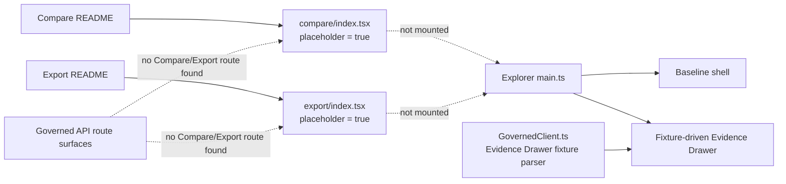
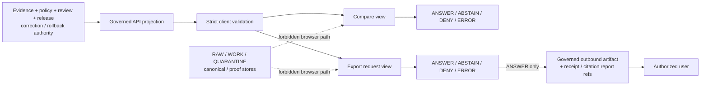

<!-- [KFM_META_BLOCK_V2]
doc_id: kfm://doc/docs-architecture-ui-compare-and-export
title: Compare and Export — Current Architecture and Implementation Boundary
type: architecture
version: v2.0.0
status: draft; repository-grounded; placeholder-only; live-transport-unverified; export-policy-absent
owners:
  - "@bartytime4life"
created: 2026-05-14
updated: 2026-08-18
policy_label: public
owning_root: "docs/"
responsibility: Explain the Compare and Export trust surfaces, the currently implemented repository slice, and the boundaries that keep comparison and outbound artifacts subordinate to evidence, policy, review, release, correction, and rollback authority.
base_commit: 34d509c690649b284a7c0be739e3a5c8c85926ee
prior_blob: 12d63f1dc12c5dca774fb42b123153d0e09c401a
directory_governance: ADR-0029 adopts docs/doctrine/directory-rules.md as the sole writable human Directory Rules authority; this same-path architecture page remains under the docs responsibility root.
truth_posture: CONFIRMED current repository evidence; PROPOSED production composition; UNKNOWN live runtime, policy enforcement, deployment, and release behavior unless explicitly identified
related:
  - docs/doctrine/directory-rules.md
  - docs/adr/ADR-0029-adopt-directory-governance-standard-v2.md
  - .github/CODEOWNERS
  - docs/architecture/ui/README.md
  - docs/architecture/ui/ACCESSIBILITY.md
  - docs/architecture/ui/BOUNDARIES.md
  - docs/architecture/ui/CONTINUITY_NOTES.md
  - docs/architecture/ui/EVIDENCE_DRAWER.md
  - docs/architecture/ui/LAYERING.md
  - docs/architecture/evidence-drawer.md
  - apps/explorer-web/src/main.ts
  - apps/explorer-web/src/adapters/GovernedClient.ts
  - apps/explorer-web/src/features/compare/README.md
  - apps/explorer-web/src/features/compare/index.tsx
  - apps/explorer-web/src/features/export/README.md
  - apps/explorer-web/src/features/export/index.tsx
  - apps/governed-api/routes/README.md
  - apps/governed-api/src/routes/README.md
  - contracts/ui/citation_validation_report.md
  - schemas/contracts/v1/ui/citation_validation_report.schema.json
  - schemas/contracts/v1/receipts/README.md
  - policy/telemetry/README.md
  - policy/telemetry/no_restricted_coords.rego
tags: [kfm, architecture, ui, compare, export, evidence, trust-membrane, finite-outcomes, policy, correction, rollback, no-leak]
notes:
  - "The current Compare and Export source entries are greenfield placeholders. Their README contracts exist, but components, route wiring, adapters, fixtures, tests, receipt emission, and runtime behavior are not established by the inspected slice."
  - "The Explorer entrypoint mounts the baseline shell and fixture-driven Evidence Drawer only. Compare and Export are not launch-wired there."
  - "No Compare or Export route is present in the inspected governed-api route directories, and the current GovernedClient is a fixture-only Evidence Drawer adapter with no network or lifecycle-store access."
  - "policy/export/ is absent at the pinned snapshot. policy/telemetry/ exists, but its only inspected Rego rule identifies itself as a greenfield stub and defaults deny to false; it is not enforcement evidence."
  - "CitationValidationReport has a semantic contract and a permissive UI schema stub. No Compare projection schema or ExportReceipt schema was verified in the inspected homes."
[/KFM_META_BLOCK_V2] -->

<a id="top"></a>
<a id="compare-and-export--ui-subsystem-architecture"></a>

# Compare and Export — Current Architecture and Implementation Boundary

> **Operating rule.** Compare may show governed differences, and Export may eventually package governed public-safe material. Neither surface may create truth, evidence, policy, review, release, correction, rollback, or publication authority.


| Field | Current bounded result |
|---|---|
| **Evidence snapshot** | `main@34d509c690649b284a7c0be739e3a5c8c85926ee` |
| **Directory authority** | **CONFIRMED / ACCEPTED:** [ADR-0029](../../adr/ADR-0029-adopt-directory-governance-standard-v2.md) adopts [Directory Rules v2](../../doctrine/directory-rules.md) |
| **Architecture page** | **CONFIRMED** at this existing path; same-path modernization only |
| **Review route** | `@bartytime4life` through [`CODEOWNERS`](../../../.github/CODEOWNERS); independent stewardship remains **NEEDS VERIFICATION** |
| **Compare source** | **CONFIRMED path / placeholder only:** [`features/compare/index.tsx`](../../../apps/explorer-web/src/features/compare/index.tsx) exports `placeholder = true` |
| **Export source** | **CONFIRMED path / placeholder only:** [`features/export/index.tsx`](../../../apps/explorer-web/src/features/export/index.tsx) exports `placeholder = true` |
| **Explorer launch wiring** | **CONFIRMED bounded:** [`main.ts`](../../../apps/explorer-web/src/main.ts) mounts the baseline shell and fixture-driven Evidence Drawer, not Compare or Export |
| **Browser transport** | **CONFIRMED bounded:** [`GovernedClient.ts`](../../../apps/explorer-web/src/adapters/GovernedClient.ts) is an Evidence Drawer fixture adapter with no network or lifecycle-store access; no Compare/Export client is established |
| **Governed API routes** | **CONFIRMED absent from inspected route surfaces:** no Compare or Export implementation appears under the two current route directories |
| **Compare / Export schemas** | **NOT VERIFIED:** no Compare projection schema or `ExportReceipt` schema was found in the inspected UI and receipt schema homes |
| **Citation validation** | **CONFIRMED semantic contract + permissive stub only:** the UI schema requires only `id` and allows additional properties |
| **Export policy** | **CONFIRMED absent:** `policy/export/` is not present at the pinned snapshot |
| **Telemetry policy** | **CONFIRMED present / not enforcement proof:** the inspected Rego file is a greenfield stub with `default deny := false` |
| **Runtime, deployment, release, and publication** | **UNKNOWN / no effect from this page** |

> [!IMPORTANT]
> **Current implementation is not a Compare or Export product.** The repository has app-local feature directories and detailed README contracts, but both executable entries are placeholders. No route, request envelope, artifact builder, receipt emitter, policy gate, launch wiring, or production transport is proven by the inspected slice.

> [!CAUTION]
> **An outbound file is not governed merely because the browser can download it.** A screenshot, copied canvas, ad hoc GeoJSON, debug dump, generated report, or model-produced narrative is not a KFM export unless a future governed flow proves the required evidence, policy, release, correction, and receipt closure.

> [!WARNING]
> **Negative states are no-leak states.** `DENY`, `ERROR`, malformed responses, absent policy, unresolved rights, and unavailable evidence must not reflect protected fields, internal identifiers, raw diagnostics, exact sensitive locations, or unsupported claim text into either surface.

**Quick navigation:** [Status](#0-status-and-authority) · [Scope](#1-scope-and-non-goals) · [Placement](#2-repo-fit) · [Snapshot](#3-status-snapshot) · [Architecture](#4-subsystem-diagram) · [Compare](#5-compare-panel) · [Export](#6-export-panel) · [State](#7-state-ownership) · [Outcomes](#8-finite-outcomes-by-surface) · [Trust membrane](#9-trust-membrane-rules) · [Receipts](#10-receipts-and-proof-objects) · [Contracts](#11-routes-dtos-and-schemas) · [Policy](#12-policy-hooks) · [Telemetry](#13-telemetry-posture) · [Validation](#14-validators-and-tests) · [Rollback](#15-rollback-path) · [Continuity](#16-continuity-and-prior-doctrine) · [Open items](#17-open-questions-and-verification-backlog) · [Related docs](#18-related-docs) · [At a glance](#appendix-a-compare-vs-export-at-a-glance)

---

## 0. Status and authority

### 0.1 Authority order for this page

| Question | Governing evidence |
|---|---|
| Where does this page belong? | Accepted Directory Rules v2, accepted ADRs, then current repository evidence |
| What do Compare and Export mean? | Applicable semantic contracts and accepted architecture decisions; this page explains but does not create them |
| What is implemented now? | Pinned source, route inventories, schemas, policy, fixtures, tests, workflows, and emitted artifacts |
| What may a public surface read? | Governed API envelopes and released public-safe carriers; never direct lifecycle or canonical stores |
| What supports a claim or difference? | Resolved evidence, source role, time, policy, review, and release state |
| What may leave KFM as an export? | A governed decision and artifact chain appropriate to format, audience, rights, sensitivity, correction, and rollback |
| Who reviews repository changes? | Verified `CODEOWNERS` routing; role assignments and independent approval remain separate records |

This page is architecture documentation. It does not amend contracts, schemas, policy, review authority, route inventory, release state, or runtime behavior.

### 0.2 Current repository evidence

| Surface | Confirmed state | Safe interpretation |
|---|---|---|
| [`docs/architecture/ui/README.md`](./README.md) | Repository-grounded UI architecture landing page | Explorer Web is a bounded fixture-first shell, not a complete live map product |
| [`apps/explorer-web/src/features/compare/README.md`](../../../apps/explorer-web/src/features/compare/README.md) | Detailed draft feature contract exists | Contract prose does not prove components, route wiring, tests, or runtime |
| [`apps/explorer-web/src/features/compare/index.tsx`](../../../apps/explorer-web/src/features/compare/index.tsx) | Two-line greenfield placeholder | Compare is not implemented by this entry |
| [`apps/explorer-web/src/features/export/README.md`](../../../apps/explorer-web/src/features/export/README.md) | Detailed draft feature contract exists and records missing export policy | Contract prose does not prove governed export behavior |
| [`apps/explorer-web/src/features/export/index.tsx`](../../../apps/explorer-web/src/features/export/index.tsx) | Two-line greenfield placeholder | Export is not implemented by this entry |
| [`apps/explorer-web/src/main.ts`](../../../apps/explorer-web/src/main.ts) | Mounts baseline shell and Evidence Drawer | Compare and Export are not launch-wired in the inspected entrypoint |
| [`apps/explorer-web/src/adapters/GovernedClient.ts`](../../../apps/explorer-web/src/adapters/GovernedClient.ts) | Strict, no-network Evidence Drawer projection parser | It is not a live generalized governed client and has no Compare/Export contract |
| [`apps/governed-api/routes/`](../../../apps/governed-api/routes/README.md) | README plus domain subdirectory in the inspected lane | No Compare or Export route is established there |
| [`apps/governed-api/src/routes/`](../../../apps/governed-api/src/routes/README.md) | README plus agriculture subdirectory in the inspected lane | No Compare or Export route is established there |
| [`schemas/contracts/v1/ui/citation_validation_report.schema.json`](../../../schemas/contracts/v1/ui/citation_validation_report.schema.json) | Draft stub; only `id` required; additional properties allowed | It cannot prove claim coverage, export safety, or citation closure |
| [`contracts/ui/citation_validation_report.md`](../../../contracts/ui/citation_validation_report.md) | Draft UI projection semantics | Explicitly not evidence closure, policy, release approval, or proof storage |
| [`schemas/contracts/v1/receipts/`](../../../schemas/contracts/v1/receipts/README.md) | Receipt family exists; no `ExportReceipt` schema verified in the inspected listing | Export receipt shape and enforcement remain open |
| [`policy/telemetry/`](../../../policy/telemetry/README.md) | Documentation plus one greenfield Rego stub | Presence is not fail-closed telemetry enforcement |
| `policy/export/` | Not present | No executable export-policy lane is established at the inspected snapshot |

### 0.3 Truth labels

- **CONFIRMED** — verified from the pinned repository state or an accepted decision.
- **PROPOSED** — architecture or future behavior not established as current implementation.
- **UNKNOWN** — evidence is insufficient to state a current result.
- **NEEDS VERIFICATION** — a concrete repository, runtime, policy, rights, review, release, accessibility, or deployment check remains.

### 0.4 Non-effects

This page does not:

- implement or launch a Compare or Export component;
- add a browser or governed-API route;
- define a new DTO, schema, receipt, or policy bundle;
- authorize comparison with unreleased or restricted material;
- authorize any download format or redistribution right;
- resolve `EvidenceRef` to `EvidenceBundle`;
- approve citation coverage, redaction, review, release, correction, or rollback;
- make a screenshot, report, archive, tile slice, or copied browser payload a KFM artifact;
- publish, promote, release, deploy, or expose lifecycle stores.

[Back to top](#top)

---

## 1. Scope and non-goals

**In scope.** The architectural purpose, repository evidence, state boundaries, finite outcomes, trust requirements, validation expectations, and open implementation seams for the Explorer Web Compare and Export feature families.

**Out of scope.**

- Visual styling or reusable component design.
- Implementing feature modules, adapters, routes, storage, workers, artifact builders, or downloads.
- Choosing export formats or redistribution terms.
- Defining field-level schemas, policy rules, receipt identity, or persistence.
- Admitting sources, resolving rights, approving sensitive transforms, or releasing data.
- Treating the feature READMEs or this page as runtime proof.

Compare and Export are **derivative carriers**:

- Compare is intended to show that two governed states differ.
- Export is intended to carry an already governed state beyond the interactive shell.
- Neither surface may originate the truth or authority it displays.

[Back to top](#top)

---

## 2. Repo fit

### 2.1 Directory Rules basis

This is a same-path modernization of an existing tracked architecture document. Its primary responsibility is to explain UI architecture to humans, so the owning root remains `docs/`. The change does not create a root, move a file, establish a schema or policy home, or turn the page into executable authority.

| Responsibility | Confirmed or intended home | Current posture |
|---|---|---|
| Architecture explanation | `docs/architecture/ui/COMPARE_AND_EXPORT.md` | **CONFIRMED existing path** |
| App-local Compare feature | `apps/explorer-web/src/features/compare/` | **CONFIRMED directory; placeholder executable entry** |
| App-local Export feature | `apps/explorer-web/src/features/export/` | **CONFIRMED directory; placeholder executable entry** |
| Public client shell | `apps/explorer-web/` | **CONFIRMED responsibility lane** |
| Trust-membrane service | `apps/governed-api/` | **CONFIRMED root/lane; Compare/Export routes not established** |
| Semantic meaning | `contracts/` | Existing contracts may be referenced; Compare/Export-specific authority remains unresolved |
| Machine shape | `schemas/` | Existing stubs are not implementation proof |
| Admissibility | `policy/` | Export policy lane absent; telemetry lane incomplete |
| Receipts and proof instances | governed data/release families | No current Compare/Export emission is proven |
| Tests and fixtures | owning app and shared test/fixture roots | No exact Compare/Export executable suite verified |
| Release/correction/rollback | `release/` and governed accountability families | Must remain separate from UI state |

### 2.2 Dependency direction

The intended dependency direction is one-way:

```text
evidence / policy / review / release / correction authority
  -> governed API projection
  -> validated Explorer adapter
  -> Compare or Export view state
  -> user-visible finite outcome
```

The browser must not reverse that direction by:

- reading lifecycle or canonical stores;
- constructing evidence closure;
- deciding policy or release state;
- writing receipt, proof, correction, or release authority directly;
- treating renderer state or downloadable bytes as public truth.

[Back to top](#top)

---

## 3. Status snapshot

| Capability | Current evidence | Status |
|---|---|---|
| Compare feature directory | README plus placeholder `index.tsx` | **CONFIRMED placeholder** |
| Export feature directory | README plus placeholder `index.tsx` | **CONFIRMED placeholder** |
| Explorer entrypoint integration | Baseline shell + Evidence Drawer only | **CONFIRMED not launch-wired** |
| Compare adapter or parser | No exact implementation found in the inspected adapter surface | **NOT VERIFIED** |
| Export adapter or request builder | No exact implementation found in the inspected adapter surface | **NOT VERIFIED** |
| Live governed transport | Current `GovernedClient.ts` is fixture-only Evidence Drawer code | **UNKNOWN for Compare/Export** |
| Compare API resource | No route present in inspected governed-api route directories | **NOT IMPLEMENTED in inspected surface** |
| Export API resource | No route present in inspected governed-api route directories | **NOT IMPLEMENTED in inspected surface** |
| Compare machine contract | No dedicated schema verified | **UNKNOWN / NEEDS VERIFICATION** |
| Export machine contract | No request/response or receipt schema verified | **UNKNOWN / NEEDS VERIFICATION** |
| Citation validation report | Semantic contract + permissive UI schema stub | **PROPOSED / not closure** |
| Export policy | `policy/export/` absent | **BLOCKED for governed export** |
| Telemetry policy | README + fail-open greenfield stub | **PRESENT / not enforcement** |
| Compare/Export tests | No exact app tests found in bounded search | **NOT VERIFIED** |
| Accessibility behavior | No feature implementation to test | **UNKNOWN** |
| Downloadable artifact | No builder or governed flow established | **ABSENT from inspected slice** |
| Runtime/deployment | No runtime or deployment evidence inspected | **UNKNOWN** |

The strongest current result is architectural documentation plus app-local placeholders. That is useful repository structure, but it is not a user-facing feature.

[Back to top](#top)

---

## 4. Subsystem diagram

### 4.1 Current confirmed slice


```mermaid
flowchart LR
    MAIN["Explorer main.ts"] --> SHELL["Baseline shell"]
    MAIN --> DRAWER["Fixture-driven Evidence Drawer"]

    COMPARE_DOC["Compare README"] --> COMPARE_PLACEHOLDER["compare/index.tsx<br/>placeholder = true"]
    EXPORT_DOC["Export README"] --> EXPORT_PLACEHOLDER["export/index.tsx<br/>placeholder = true"]

    GC["GovernedClient.ts<br/>Evidence Drawer fixture parser"] --> DRAWER

    COMPARE_PLACEHOLDER -. "not mounted" .-> MAIN
    EXPORT_PLACEHOLDER -. "not mounted" .-> MAIN
    API["Governed API route surfaces"] -. "no Compare/Export route found" .-> COMPARE_PLACEHOLDER
    API -. "no Compare/Export route found" .-> EXPORT_PLACEHOLDER
```

### 4.2 Proposed production composition


```mermaid
flowchart LR
    AUTH["Evidence + policy + review + release<br/>correction / rollback authority"] --> API["Governed API projection"]
    API --> VALIDATE["Strict client validation"]
    VALIDATE --> CMP["Compare view"]
    VALIDATE --> EXP["Export request view"]

    CMP --> OC["ANSWER / ABSTAIN / DENY / ERROR"]
    EXP --> OE["ANSWER / ABSTAIN / DENY / ERROR"]

    OE -->|ANSWER only| ART["Governed outbound artifact<br/>+ receipt / citation report refs"]
    ART --> USER["Authorized user"]

    INTERNAL["RAW / WORK / QUARANTINE<br/>canonical / proof stores"] -. "forbidden browser path" .-> CMP
    INTERNAL -. "forbidden browser path" .-> EXP
```

The second diagram is **PROPOSED**. It defines the trust direction a future implementation must preserve; it does not claim the routes, objects, or artifact builder exist.

[Back to top](#top)

---

## 5. Compare panel

### 5.1 Intended role

Compare is a viewing surface for differences between two governed, explicitly identified states. A mature implementation may support:

| Candidate axis | Minimum trust requirement | Status |
|---|---|---|
| Release-to-release | Both releases independently identified; correction and supersession state visible | **PROPOSED** |
| Time-to-time | Time semantics labeled; same object or layer identity preserved | **PROPOSED** |
| Layer-to-layer | Each side carries its own source role, release state, evidence affordance, and policy posture | **PROPOSED** |
| Proof-summary delta | Server-produced, public-safe summary; browser does not recompute canonical evidence | **PROPOSED** |
| Rollback preview | Current release and rollback target identified; review-only unless separately released | **PROPOSED** |
| Candidate-to-release | Role-gated review surface only; not the ordinary public path | **PROPOSED / policy-significant** |

### 5.2 Public-path boundary

The ordinary public Compare path must not:

- load `RAW`, `WORK`, `QUARANTINE`, unpublished candidates, or canonical-only records;
- infer a material difference from pixels alone;
- merge two sides into a third authoritative surface;
- hide correction, withdrawal, supersession, stale state, or unequal source roles;
- resolve or diff canonical `EvidenceBundle` content in the browser;
- treat a popup, badge, renderer property, or local cache as evidence;
- expose a role-gated candidate comparison through the public shell.

A steward review tool may eventually compare candidate and released states, but that is a separate authorization and audit boundary. It is not established by the current Compare placeholder.

### 5.3 Minimum future request context

A future Compare request needs, at minimum:

- stable left and right references;
- explicit comparison axis;
- spatial and temporal scope;
- source-role and release posture for each side;
- public-safe evidence affordances;
- policy and audience context;
- correction, supersession, withdrawal, and rollback context where material;
- a finite outward outcome and public-safe reason code.

The exact field names, route shape, and persistence model remain **PROPOSED** until accepted contracts, schemas, fixtures, validators, and tests exist.

### 5.4 Compare and the Evidence Drawer

Compare should show **what changed** and which trust dimensions differ. The [Evidence Drawer](../evidence-drawer.md) explains why a claim is supported or why support is unavailable. Compare must not duplicate evidence authority or turn a compact delta summary into EvidenceBundle closure.

[Back to top](#top)

---

## 6. Export panel

### 6.1 Current boundary

Export is not implemented by the inspected feature entry, and no export-policy lane, governed route, request/response schema, artifact builder, or `ExportReceipt` schema was verified. Therefore the repository does not currently support a claim that Explorer produces governed KFM exports.

### 6.2 Intended role

A future Export surface may collect bounded user intent and submit it to a governed service. It must not build a trust-bearing artifact solely from browser state.

A successful governed export would need closure appropriate to its format and audience, including:

- a stable export/request identity;
- bounded spatial, temporal, layer, feature, and audience scope;
- released source and layer references;
- evidence or citation coverage for claim-bearing content;
- rights, sensitivity, sovereignty, consent, and redistribution evaluation;
- redaction, generalization, aggregation, suppression, or geoprivacy transforms;
- correction, withdrawal, stale-state, and rollback context;
- artifact identity and digest;
- an export/accountability receipt and citation-validation result;
- a finite decision that permits artifact delivery.

These are **PROPOSED obligations**, not a verified field list.

### 6.3 Refusal posture

| Condition | Safe outward result | Required behavior |
|---|---|---|
| Evidence or citations unresolved | `ABSTAIN` | Do not create a claim-bearing artifact |
| Rights, sensitivity, or redistribution not permitted | `DENY` | Do not create or expose the artifact |
| Unreleased or withdrawn input on the public path | `DENY` | Keep lifecycle/internal content out of the browser and export |
| Stale support with no released alternative | `ABSTAIN` | Explain the bounded reason without inventing freshness |
| Invalid request or service failure | `ERROR` | Emit fixed no-leak error copy; no partial artifact |
| Review or release state pending | `ABSTAIN` or `DENY`, according to the accepted runtime contract | Do not invent a fifth public response state merely because an upstream object is on hold |

`HOLD` may remain a review or release state upstream. It is not a confirmed fifth outward Compare/Export runtime outcome in the current executable UI profile.

### 6.4 Screenshot boundary

A screenshot may be useful as ordinary user content, but it is not proof of:

- evidence closure;
- policy clearance;
- released data;
- correction currency;
- artifact integrity;
- KFM publication.

A future governed PNG or PDF export must travel through the same evidence, policy, release, citation, and receipt checks as any other outbound format.

[Back to top](#top)

---

## 7. State ownership

The browser may own interaction state. It must not own trust-bearing state.

| State family | Browser responsibility | Upstream authority | Current evidence |
|---|---|---|---|
| Panel open/closed state | Own | None | **PROPOSED; no component exists** |
| Compare axis and selected references | Own pending validated request | Governed identity and admissibility | **PROPOSED** |
| Export scope and format choice | Own pending validated request | Governed policy and format admission | **PROPOSED** |
| Viewport, selected feature, visible layer choices | Own as interaction context | Released layer/feature identity | Existing shell is bounded; Compare/Export handoff not verified |
| Finite outcome view model | Render only | Governed API/runtime envelope | Four outcomes confirmed only in the current Evidence Drawer slice |
| Evidence, source role, policy, review, release, correction | Display public-safe projection only | Evidence, policy, review, and release authorities | Compare/Export projection not implemented |
| Receipt, proof, artifact digest, rollback target | Display references only | Accountability/release families | No Compare/Export emission verified |
| Downloadable artifact | Deliver only after authorized response | Governed export service | No builder or route verified |

Browser-local caches must not become alternate truth or receipt stores. Re-resolution and invalidation behavior remain a required future design seam.

[Back to top](#top)

---

## 8. Finite outcomes by surface

The only repository-grounded executable UI profile inspected here uses four outward outcomes:

| Outcome | Meaning at the UI boundary | No-leak requirement |
|---|---|---|
| `ANSWER` | The governed response permits the bounded result | Render only fields in the accepted public-safe projection |
| `ABSTAIN` | Support, freshness, scope, or review closure is insufficient | Do not echo unsupported claim text as a partial answer |
| `DENY` | Policy, rights, sensitivity, release, or audience posture forbids the result | Do not expose protected reasons or fields |
| `ERROR` | Payload, contract, adapter, service, or infrastructure failed | Use fixed safe copy; do not reflect raw diagnostics |

For Compare and Export, this table is **PROPOSED architecture aligned to the current finite UI profile**. The feature placeholders do not currently return any runtime outcome.

`HOLD`, `PASS`, `FAIL`, review states, lifecycle states, and release states may exist upstream. They must not be silently collapsed into `ANSWER`, and they do not become additional public response outcomes without an accepted runtime contract and compatibility tests.

[Back to top](#top)

---

## 9. Trust-membrane rules

These rules govern any future implementation:

1. **No direct lifecycle-store access.** Public Compare and Export consume governed projections and released public-safe carriers only.
2. **No renderer-as-truth.** Pixels, styles, feature properties, local diffs, and screenshots are interaction outputs, not evidence.
3. **No browser evidence closure.** Evidence resolution, canonical proof comparison, policy, and release checks remain upstream.
4. **No hidden-sensitive-by-style pattern.** Sensitive geometry and fields must be transformed or denied before they reach the browser.
5. **No uncited claim-bearing export.** Missing evidence or citation coverage returns a finite negative outcome.
6. **No silent correction crossing.** Compare and Export must surface correction, withdrawal, supersession, and stale-state context where material.
7. **No candidate leak through Compare.** Role-gated review material cannot become an ordinary public compare side.
8. **No raw export content in telemetry.** Telemetry must not carry artifact bytes, claim text, evidence payloads, protected coordinates, or credentials.
9. **No receipt-as-publication shortcut.** A receipt records an action; it does not make an artifact true, reviewed, released, or public.
10. **No UI-created release authority.** A panel, route success, test, workflow, commit, or pull request cannot promote lifecycle state.

[Back to top](#top)

---

## 10. Receipts and proof objects

### 10.1 Current evidence

| Object or family | Current repository evidence | Boundary |
|---|---|---|
| `CitationValidationReport` | UI semantic contract plus permissive schema stub | Not EvidenceBundle closure, policy, release approval, or proof storage |
| Receipt schema family | Repository-present receipt lane | No `ExportReceipt` schema verified in the inspected listing |
| `RedactionReceipt` and other receipt schemas | Some receipt schemas are present | Presence does not prove Export consumes or emits them |
| Compare receipt | No dedicated receipt contract or schema verified | Compare is currently a placeholder viewing family |
| Export artifact receipt | Doctrine and README lineage describe the need | Machine shape, identity, persistence, emission, and validation remain open |

### 10.2 Required separation

A future implementation must keep these concerns separate:

```text
user request
  != PolicyDecision
  != citation-validation result
  != artifact bytes
  != action receipt
  != proof
  != ReleaseManifest
  != publication
```

Compare should not emit a new trust object merely because a view was rendered. Export may eventually emit an action/accountability receipt after an authorized artifact is built, but that receipt cannot substitute for the evidence, policy, review, release, correction, or rollback objects it references.

### 10.3 Schema caution

The current UI `CitationValidationReport` schema requires only `id` and allows additional properties. Architecture prose must not present proposed fields such as claim counts, evidence references, findings, or release references as schema-enforced current behavior.

[Back to top](#top)

---

## 11. Routes, DTOs, and schemas

### 11.1 Current route inventory

No Compare or Export route is present in the inspected governed-api route directories. The former example route names in this page were planning language, not implementation evidence, and are intentionally removed.

### 11.2 Current browser adapter inventory

The current `GovernedClient.ts` implements one closed Evidence Drawer projection profile and explicitly performs no network or lifecycle-store access. It does not establish:

- a general HTTP client;
- Compare request or response handling;
- Export submission or artifact retrieval;
- receipt or citation-report transport;
- policy or release enforcement.

### 11.3 Current schema inventory

| Surface | Verified machine shape |
|---|---|
| Compare request/response | None verified |
| Compare delta projection | None verified |
| Export request/response | None verified |
| Export artifact metadata | None verified |
| Export receipt | None verified |
| UI citation validation report | Permissive draft stub only |
| Evidence Drawer payload | A separate, closed fixture-only profile exists; it does not automatically govern Compare or Export |

### 11.4 Closure required before implementation claims

A production claim requires a dependency-closed slice that identifies:

1. semantic contract owner;
2. machine schema and version;
3. finite outcome envelope;
4. public-safe fixtures, including negative and no-leak cases;
5. validator and focused tests;
6. governed API resource and repository abstraction;
7. strict browser parser;
8. accessibility behavior;
9. policy and release checks;
10. correction, withdrawal, rollback, and cache invalidation behavior;
11. no-network unit-test proof and separately governed live transport;
12. documentation synchronized with the implemented boundary.

[Back to top](#top)

---

## 12. Policy hooks

### 12.1 Current policy evidence

| Policy surface | Current state | Safe claim |
|---|---|---|
| `policy/export/` | Absent | Export admissibility is not implemented in that proposed lane |
| `policy/telemetry/README.md` | Present | Documents intended posture |
| `policy/telemetry/no_restricted_coords.rego` | Greenfield stub; `default deny := false`; no real rules | Must not be represented as fail-closed enforcement |
| General access, sensitivity, decision, and release policy | Repository contains policy lanes, but Compare/Export wiring was not verified | Current integration remains UNKNOWN |

### 12.2 Future export-policy obligations

A future policy decision should evaluate, as applicable:

- actor, role, audience, purpose, destination, and redistribution;
- source terms, rights, license, attribution, and expiry;
- sensitivity, sovereignty, consent, living-person, DNA, rare-species, archaeology, infrastructure, and private-property constraints;
- spatial and temporal scope;
- released, corrected, withdrawn, stale, or superseded state;
- requested format and whether it preserves required metadata;
- transform obligations and whether their receipts resolve;
- evidence and citation coverage;
- rollback and correction path.

Unknown or unsupported policy state must fail closed. This page does not choose the policy package, rule language, or reason-code registry.

[Back to top](#top)

---

## 13. Telemetry posture

No Compare- or Export-specific telemetry implementation was verified.

A future telemetry profile may record bounded operational events such as:

- panel opened;
- comparison axis selected;
- export format selected;
- request submitted;
- finite outcome class rendered;
- latency and coarse failure class;
- receipt view opened.

It must not record:

- export bytes or screenshots;
- claim text, prompts, citation excerpts, or evidence payloads;
- exact restricted coordinates or sensitive feature identifiers;
- source credentials, authorization tokens, signed URLs, or private endpoints;
- raw API responses or internal reason details;
- personally identifying session material beyond an accepted, minimized telemetry contract.

Client validation and server validation are both required. A telemetry failure must not weaken Export or Compare policy, and an export must not depend on telemetry acceptance.

[Back to top](#top)

---

## 14. Validators and tests

### 14.1 Current evidence

- Compare and Export executable entries are placeholders.
- No exact Compare or Export app test was found in the bounded feature/test search.
- No dedicated Compare or Export workflow was verified.
- The CitationValidationReport machine schema is a permissive stub.
- The export-policy lane is absent.
- Therefore no end-to-end or dependency-closed Compare/Export behavior is proven.

### 14.2 Required future validation

| Test family | Required case | Expected posture |
|---|---|---|
| Contract/schema polarity | Valid and malformed request/response fixtures | Deterministic accept/reject |
| Four finite outcomes | `ANSWER`, `ABSTAIN`, `DENY`, `ERROR` | Stable view state and no unsafe fallback |
| No-leak negatives | Protected fields and diagnostics in denied/error inputs | Never reflected into browser output |
| Trust membrane | Attempts to read lifecycle/canonical stores or bypass governed API | Rejected |
| Compare identity | Left/right identity, time, release, and correction mismatch | Negative outcome or explicit bounded disclosure |
| Candidate exposure | Candidate compare attempted on public path | `DENY` |
| Export evidence coverage | Unresolved claim or citation | `ABSTAIN` |
| Export rights/sensitivity | Unknown or prohibited posture | `DENY` |
| Export partial failure | Builder or persistence fails after request | `ERROR`; no partial artifact exposed |
| Receipt binding | Artifact identity/digest, policy, citations, releases, transforms, rollback | Exact binding or no `ANSWER` |
| Correction propagation | Pinned release later corrected, withdrawn, or rolled back | Export marked stale/invalidated; reissue path tested |
| Accessibility | Keyboard flow, focus return, headings, labels, live regions, non-color trust cues | Pass |
| No-network unit tests | Network and model calls denied in fixture suite | Pass |
| Telemetry minimization | Protected content submitted to telemetry | Rejected |

Repository-native command names and workflow names must be taken from the implementation that owns the future slice. This page does not invent them.

[Back to top](#top)

---

## 15. Rollback path

### 15.1 This documentation change

Rollback this modernization by restoring prior blob:

```text
12d63f1dc12c5dca774fb42b123153d0e09c401a
```

No contract, schema, policy, fixture, validator, test, workflow, app source, route, receipt, release object, data instance, deployment, or publication state changes with this page.

### 15.2 Future feature rollback

A future implementation should define reversible boundaries independently:

| Change family | Minimum rollback posture |
|---|---|
| Browser feature | Disable launch wiring and revert app-local code without exposing stale cached state |
| Governed API resource | Disable resource, preserve audit records, and return fixed safe negative outcomes |
| Schema/contract | Retain compatibility fixtures and a documented predecessor path |
| Policy | Revert to the last reviewed fail-closed bundle; never fall through to allow |
| Artifact builder | Stop delivery, preserve failed-run receipts, and remove partial outputs from public reach |
| Released artifact | Issue correction or withdrawal, invalidate caches, identify affected receipts, and point to rollback target |
| Telemetry | Stop collection on validation failure; do not block the safer core outcome |

[Back to top](#top)

---

## 16. Continuity and prior doctrine

The modernization retains these durable ideas from the prior page and its lineage:

- Compare is for seeing governed differences, not creating a new truth layer.
- Export is for carrying governed material outward, not bypassing publication controls.
- Public clients use governed interfaces and released public-safe carriers.
- Each comparison side retains its own identity, time, source role, evidence affordance, release state, and correction lineage.
- Claim-bearing exports preserve evidence and citation support appropriate to the format.
- Screenshots and browser downloads are not proof.
- Sensitive fields and geometry must be transformed or denied before browser delivery.
- Corrections, withdrawals, supersessions, and rollback remain visible.
- Compare is a viewing family; Export is the artifact-producing family.
- Telemetry is operational metadata, not an alternate export channel.

Material corrections in this edition:

| Prior posture | Repository-grounded correction |
|---|---|
| All paths were treated as proposed because no repo was mounted | Current paths and blobs are pinned and classified |
| `ComparePanel.tsx` and `ExportPanel.tsx` were described as planned components | Current executable entries are only placeholders |
| Example API routes were presented as proposed architecture | No Compare/Export route exists in the inspected route surfaces; example names are removed |
| A Compare delta schema and ExportReceipt schema were listed | Neither was verified in the inspected schema homes |
| `CitationValidationReport` fields were described as required | Current UI schema requires only `id` and remains permissive |
| `policy/export/` was treated as a downstream dependency | The lane is absent |
| Telemetry policy was presented as fail-closed | The inspected Rego rule is a fail-open greenfield stub and not enforcement |
| `HOLD` appeared as an additional Export runtime outcome | Current executable UI evidence supports four outward outcomes; hold remains an upstream state unless a future accepted contract says otherwise |
| Proposed test and workflow names were listed | No exact Compare/Export suite or workflow was verified; invented names are removed |

[Back to top](#top)

---

## 17. Open questions and verification backlog

### P0 — required before governed outbound artifacts

- Define accountable semantic ownership for Export request, response, artifact metadata, citation report, and receipt.
- Establish a machine schema family with closed positive and negative fixtures.
- Create and review export policy with deny-by-default rights, sensitivity, purpose, audience, format, and redistribution checks.
- Decide deterministic artifact and receipt identity/digest binding.
- Prove no partial artifact is reachable after any negative outcome or failure.
- Define correction, withdrawal, stale-state, affected-receipt, cache invalidation, reissue, and rollback behavior.
- Establish an authenticated, least-privilege storage and delivery path without browser access to internal stores.

### P1 — required before a credible Compare or Export pilot

- Decide whether Compare has a dedicated API projection or composes over existing governed resources.
- Define public Compare modes separately from role-gated review comparisons.
- Implement strict browser adapters and four finite outcomes.
- Add public-safe synthetic fixtures for release, time, correction, withdrawal, denial, error, and stale cases.
- Add keyboard, focus, screen-reader, live-region, reduced-motion, and non-color trust-state tests.
- Wire launch surfaces only after contracts, policy, validators, and negative cases exist.
- Define bounded export formats and the rights/metadata obligations of each.
- Decide whether `CitationValidationReport` remains a UI projection, references the evidence-family report, or is replaced by a redacted shared profile.

### P2 — operational maturity

- Define rate limits, cancellation, idempotency, retry, artifact expiry, and orphan cleanup.
- Prove telemetry minimization and fail-safe behavior.
- Measure browser memory, large-layer compare cost, export duration, artifact size, and accessibility under load.
- Establish signed delivery, integrity verification, SBOM/dependency review, incident response, and audit retention where significance requires them.
- Verify deployment, authorization, independent review, required checks, and operational dashboards.

### Unresolved governance seams

- Compare and Export responsibility roles are described in READMEs, but only `@bartytime4life` is a verified GitHub review identity.
- The UI/evidence split for CitationValidationReport remains unresolved.
- The public response-envelope authority for `HOLD` versus four finite outcomes remains unresolved for these features.
- The exact homes for materialized export receipts, citation reports, and artifacts must follow accepted object-family authority rather than convenience.
- A future implementation must reconcile with the ongoing `docs/architecture/` consolidation effort rather than creating a duplicate architecture page.

[Back to top](#top)

---

## 18. Related docs

### Confirmed repository surfaces

- [UI subsystem README](./README.md) — repository-grounded UI architecture landing page
- [UI boundaries](./BOUNDARIES.md) — trust-membrane doctrine; implementation claims require separate verification
- [UI accessibility](./ACCESSIBILITY.md) — accessibility architecture and obligations
- [UI continuity notes](./CONTINUITY_NOTES.md) — lineage and drift context
- [UI Evidence Drawer](./EVIDENCE_DRAWER.md) — overlapping UI-oriented Evidence Drawer architecture
- [UI layering](./LAYERING.md) — layer responsibility guidance
- [Current Evidence Drawer architecture](../evidence-drawer.md) — repository-grounded bounded executable slice
- [Compare feature README](../../../apps/explorer-web/src/features/compare/README.md) — app-local draft feature contract
- [Export feature README](../../../apps/explorer-web/src/features/export/README.md) — app-local draft feature contract
- [Explorer Web source entrypoint](../../../apps/explorer-web/src/main.ts) — current bounded launch wiring
- [Directory Rules v2](../../doctrine/directory-rules.md) — accepted placement authority through ADR-0029
- [ADR-0029](../../adr/ADR-0029-adopt-directory-governance-standard-v2.md) — adoption decision
- [Telemetry policy README](../../../policy/telemetry/README.md) — intended telemetry posture; executable enforcement remains incomplete

### Relationship rule

This page owns the cross-feature architecture explanation. The app-local READMEs own proposed feature boundaries. Contracts own meaning, schemas own shape, policy owns admissibility, tests and validators own enforceability, release objects own release/correction/rollback, and runtime evidence owns operational claims. Repetition in one surface does not promote it over the others.

[Back to top](#top)

---

## Appendix A. Compare vs Export at a glance

| Aspect | Compare | Export |
|---|---|---|
| Primary intent | See governed differences | Carry governed material outward |
| Current executable state | Placeholder | Placeholder |
| Launch-wired | No | No |
| Confirmed client adapter | None | None |
| Confirmed governed route | None | None |
| Confirmed machine contract | None | None |
| Confirmed policy integration | None | None; proposed export policy lane absent |
| Confirmed receipt emission | None | None |
| Future inputs | Two governed references + scope | One governed selection + scope + format + audience |
| Future outward states | `ANSWER` / `ABSTAIN` / `DENY` / `ERROR` | `ANSWER` / `ABSTAIN` / `DENY` / `ERROR` |
| Trust-bearing state owner | Upstream evidence/policy/release authorities | Upstream evidence/policy/release authorities |
| Browser responsibility | Render validated delta projection | Submit bounded request and deliver authorized result |
| Most important negative boundary | No candidate/internal side on public path | No artifact without complete governed closure |
| Most common anti-pattern | Treating pixel difference as claim difference | Treating screenshot/download as KFM export |
| Receipt posture | No receipt merely for viewing | Future receipt required for an authorized artifact; exact shape unresolved |
| Publication effect | None | None until separately reviewed and released |

---

<sub>Authority boundary: this document is a repository-grounded architecture explanation. It does not implement Compare or Export, activate policy, approve rights or sensitivity, resolve evidence, emit a receipt, release an artifact, or publish KFM content.</sub>

**Related:** [UI README](./README.md) · [Compare feature](../../../apps/explorer-web/src/features/compare/README.md) · [Export feature](../../../apps/explorer-web/src/features/export/README.md) · [Evidence Drawer](../evidence-drawer.md) · [Directory Rules](../../doctrine/directory-rules.md)

[Back to top](#top)
