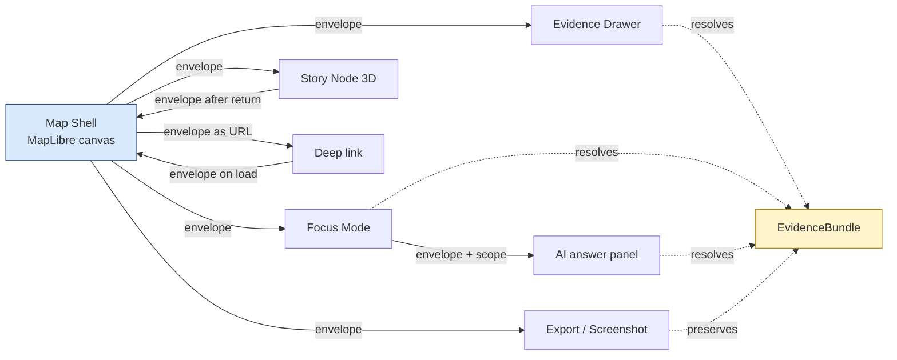
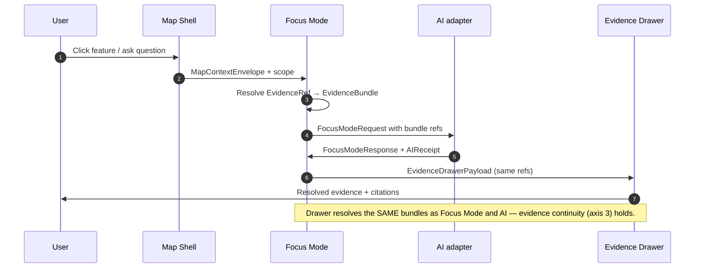

<!-- [KFM_META_BLOCK_V2]
doc_id: kfm://doc/architecture/ui/continuity-notes
title: UI Continuity Notes — How KFM Preserves State, Narrative, Evidence, and Trust Across Surfaces
type: standard
version: v1
status: draft
owners: <TBD: docs steward + map/UI lead + governance lead>
created: 2026-05-24
updated: 2026-05-24
policy_label: public
related: [
  docs/architecture/system-context.md,
  docs/architecture/governed-api.md,
  docs/architecture/map-shell.md,
  docs/architecture/maplibre-3d.md,
  docs/architecture/contract-schema-policy-split.md,
  docs/standards/MAP_TRUST_STATES.md,
  docs/standards/EVIDENCE_BUNDLE.md,
  docs/standards/RELEASE_MANIFEST.md,
  docs/standards/PROV/README.md,
  docs/standards/DUO_PROFILE.md,
  docs/doctrine/trust-membrane.md,
  contracts/v1/runtime/,
  schemas/contracts/v1/runtime/,
  packages/maplibre-runtime/,
  packages/ui/
]
tags: [kfm, architecture, ui, continuity, map-shell, focus-mode, story-node, evidence-drawer, governance]
notes: [
  "Architecture explainer for cross-surface UI continuity in KFM; complements (does not replace) per-component architecture docs.",
  "Located under a PROPOSED docs/architecture/ui/ subfolder — see §2 and Appendix B for placement rationale; Directory Rules §6.1 currently shows docs/architecture/ as flat-file.",
  "Does not redefine object meaning (contracts/), shape (schemas/), or rules (policy/); see §2."
]
[/KFM_META_BLOCK_V2] -->

# UI Continuity Notes

> How KFM preserves **state, narrative, evidence, citation, trust labels, time-slice, and session identity** as users move between the map shell, Story Nodes, Focus Mode, the Evidence Drawer, AI answers, exports, and across release boundaries.

| Status | Owners | Last reviewed |
|---|---|---|
| **draft** | _TBD — docs steward + map/UI lead + governance lead_ | 2026-05-24 |

---

> [!NOTE]
> These are **architecture notes**, not a contract. They describe how continuity *should* hold across KFM's UI surfaces and which objects carry the relevant state. Object meaning, machine shape, admissibility, and renderer implementation live in their canonical homes (`contracts/`, `schemas/`, `policy/`, `packages/`). The §2 Scope section names the boundaries.

---

## Quick jump

- [1. Purpose — what continuity means in KFM UI](#1-purpose--what-continuity-means-in-kfm-ui)
- [2. Scope and repo fit](#2-scope-and-repo-fit)
- [3. The seven axes of continuity](#3-the-seven-axes-of-continuity)
- [4. MapContextEnvelope — the bounded-context primitive](#4-mapcontextenvelope--the-bounded-context-primitive)
- [5. 2D ↔ 3D transitions — MapLibre and Story Nodes](#5-2d--3d-transitions--maplibre-and-story-nodes)
- [6. Map ↔ Focus Mode ↔ AI continuity](#6-map--focus-mode--ai-continuity)
- [7. Session, deep-link, and URL-state continuity](#7-session-deep-link-and-url-state-continuity)
- [8. Export, screenshot, and report continuity](#8-export-screenshot-and-report-continuity)
- [9. Release-boundary continuity — rollback, correction, withdrawal](#9-release-boundary-continuity--rollback-correction-withdrawal)
- [10. Anti-patterns — where continuity quietly breaks](#10-anti-patterns--where-continuity-quietly-breaks)
- [11. Tensions and known limits](#11-tensions-and-known-limits)
- [12. Open questions](#12-open-questions)
- [13. Related docs](#13-related-docs)
- [Appendix A — Continuity matrix](#appendix-a--continuity-matrix)
- [Appendix B — Placement rationale (new subfolder)](#appendix-b--placement-rationale-new-subfolder)

---

## 1. Purpose — what continuity means in KFM UI

KFM is a map-first, time-aware, evidence-first system. A typical user session crosses many surfaces in minutes: a 2D map view, a popup, an Evidence Drawer, a Focus Mode question, an AI answer, a 3D Story Node, an export, a deep link shared with a colleague, a return visit the next day after a release has shipped. The user expects what they did, where they were, what they were looking at, and what they could trust to **survive every one of those transitions**.

**Continuity** is the name for that survival. It is not one property — it is seven (§3) — and each is grounded in specific KFM doctrine, not in generic UX intuition:

- CONFIRMED — *"Switching between 2D and 3D preserves the active layer set, the active filter set, and the active focus mode"* (KFM-P2-FEAT-0012).
- CONFIRMED — *"The story flow returns from Cesium Scene back to MapLibre, preserving narrative continuity"* (ML-057-003).
- CONFIRMED — *"Deep links round-trip to exact time slice"* (ML-S-017).
- CONFIRMED — *"Exports and screenshots should preserve verification badge state and manifest ID"* (ML-061-141).
- CONFIRMED — *"Evidence Drawer required on layers, popovers, and AI answers"* (KFM-P1-FEAT-0065).
- CONFIRMED — *"`MapContextEnvelope` … camera, layers, feature IDs, temporal snapshot, release refs, evidence refs"* (Master MapLibre Object-Index).

These notes collect the doctrine into one cross-cutting view, naming where each kind of continuity is carried (`MapContextEnvelope`, `LayerManifest`, deep-link URL, `EvidenceRef`, `ReleaseManifest`), where it is most likely to break, and which sibling documents own the contract for each surface.

> [!IMPORTANT]
> Continuity is not the same as **state synchronization**. State sync says "two views show the same camera"; continuity says "what you trusted in view A you can still trust in view B, and what you cited there you can still cite here, and what is denied there is denied here, and what was withdrawn there is withdrawn here." Continuity is governance-aware; state sync is not.

[Back to top](#quick-jump)

---

## 2. Scope and repo fit

### 2.1 What this document is

| Aspect | Value | Label |
|---|---|---|
| Document class | KFM architecture explainer (cross-cutting UI) | CONFIRMED per Directory Rules §6.1 (`docs/architecture/`) |
| Proposed path | `docs/architecture/ui/CONTINUITY_NOTES.md` | **PROPOSED** — see §2.3 and Appendix B; `docs/architecture/ui/` is a new subfolder not yet in Directory Rules §6.1 |
| Sibling architecture docs | `system-context.md`, `governed-api.md`, `map-shell.md`, `maplibre-3d.md`, `contract-schema-policy-split.md` | CONFIRMED per Directory Rules §6.1 (paths PROPOSED until mounted-repo verified) |
| Sibling standards docs | `MAP_TRUST_STATES.md`, `EVIDENCE_BUNDLE.md`, `RELEASE_MANIFEST.md`, `PROV/`, `DUO_PROFILE.md` | CONFIRMED authored (prior session); mounted-repo presence NEEDS VERIFICATION |
| Authority NOT held | Object meaning, machine shape, admissibility, renderer implementation, design tokens, tests | CONFIRMED (Directory Rules §6.1) |

### 2.2 What this document is NOT

| If the content is about… | …it lives at | …not here |
|---|---|---|
| What `MapContextEnvelope` **means** as an object | `contracts/v1/runtime/map_context_envelope.md` (PROPOSED home) | this doc |
| The JSON Schema for `MapContextEnvelope` | `schemas/contracts/v1/runtime/map_context_envelope.schema.json` (PROPOSED home) | this doc |
| The OPA rules that gate cross-surface transitions | `policy/render/` (PROPOSED home) | this doc |
| MapLibre layer-style implementation | `packages/maplibre-runtime/` (PROPOSED home) | this doc |
| React components for the shell, Drawer, Focus Mode | `packages/ui/` (PROPOSED home) | this doc |
| Design tokens, colors, motion durations | `packages/ui/src/design-tokens/` or `docs/brand/` | this doc |
| The Story Node contract | `contracts/v1/story_node/` (PROPOSED home) — see ML-059 series | this doc |
| Trust-state vocabulary | `docs/standards/MAP_TRUST_STATES.md` | this doc |
| Evidence-bundle external conformance | `docs/standards/EVIDENCE_BUNDLE.md` | this doc |
| Release-manifest external conformance | `docs/standards/RELEASE_MANIFEST.md` | this doc |

### 2.3 Placement note — new subfolder

Directory Rules §6.1 shows `docs/architecture/` as a flat-file folder (`system-context.md`, `governed-api.md`, `map-shell.md`, `maplibre-3d.md`, …). This document proposes a `docs/architecture/ui/` subfolder for UI-architecture cross-cutting notes. The rationale, alternative paths considered, and the resolution path live in **Appendix B**. The placement is PROPOSED until a Directory Rules update or ADR confirms it.

> [!NOTE]
> Surfacing this as a divergence — rather than silently adopting it — is consistent with Directory Rules §13.5 (anti-patterns) and the discipline that "where a file lives encodes who owns it, what governance it answers to, and what lifecycle it belongs to." If the subfolder is rejected, the file flattens to `docs/architecture/UI_CONTINUITY_NOTES.md` with one redirect; no content is lost.

[Back to top](#quick-jump)

---

## 3. The seven axes of continuity

Each axis names a thing that must survive a surface transition. The axes are orthogonal; a single transition (e.g., 2D map → 3D Story Node) crosses several at once. Section numbers below indicate where each axis is unpacked.

| # | Axis | What must survive | Carrier object(s) | Section |
|---|---|---|---|---|
| 1 | **State continuity** | Active layer set, active filter set, active Focus Mode, camera state, time-slice. | `MapContextEnvelope`, `LayerManifest` refs | §4, §5 |
| 2 | **Narrative continuity** | The Story Node's story flow — entry → 3D scene → return → next chapter — without losing the user's place. | Story Node refs in `MapContextEnvelope`; Story Node manifest | §5 |
| 3 | **Evidence continuity** | `EvidenceRef` resolution is identical across surfaces; the Drawer resolves the same bundle from the map, the popup, the Focus Mode answer, and the AI panel. | `EvidenceRef` → `EvidenceBundle` | §6 |
| 4 | **Citation continuity** | Every public claim carries citations across surfaces; exports preserve them. | `CitationValidationReport`, `EvidenceDrawerPayload` | §6, §8 |
| 5 | **Trust-state continuity** | The `TrustVisibleState` label on a layer is identical in the map badge, popup, Drawer, export, API DTO, release manifest, and AI panel. | `TrustVisibleState` (see `MAP_TRUST_STATES.md`) | §6, §8, §9 |
| 6 | **Time-slice continuity** | The active temporal snapshot persists across surface transitions and round-trips through deep links. | `MapContextEnvelope.time`, timeline state, deep-link URL params | §5, §7 |
| 7 | **Session and release continuity** | A user returning hours, days, or releases later finds the same bound surface — or a clearly-visible delta (correction, withdrawal, rollback). | URL state, `ReleaseManifest.release_id`, `correction_lineage` | §7, §9 |

> [!TIP]
> If you're proposing a new UI surface, work through each of these seven before merging. A surface that satisfies six of seven is still a continuity bug.

[Back to top](#quick-jump)

---

## 4. MapContextEnvelope — the bounded-context primitive

CONFIRMED — Master MapLibre Object-Index: *"`MapContextEnvelope`: Bounded context carrying map camera, layer IDs, feature IDs, temporal snapshot, release refs and selected evidence refs."*

`MapContextEnvelope` is the **single carrier** for axes 1, 2, 3, 6, and parts of 5 and 7. It is the bounded-context payload that travels between the map shell and every other UI surface; it is also the input to the governed API for Focus Mode, AI answers, and exports.

### 4.1 What it carries

PROPOSED — implementation NEEDS VERIFICATION against `contracts/v1/runtime/map_context_envelope.md` (PROPOSED home).

| Slot | Continuity axis | Notes |
|---|---|---|
| `camera` | State | Zoom, center, bearing, pitch — for 2D and 3D parity. |
| `layers[]` | State | Active layer set with `LayerManifest` refs. |
| `filters[]` | State | Active filter set per layer. |
| `feature_ids[]` | State, evidence | Selected features; resolve to per-feature `EvidenceRef`s. |
| `time` | Time-slice | ISO-8601 instant or interval; the temporal snapshot of the view. |
| `time_window` | Time-slice | The wider time window the timeline is showing. |
| `release_refs[]` | Session | The `ReleaseManifest` `release_id`(s) the layers are bound to. |
| `evidence_refs[]` | Evidence | Selected `EvidenceRef`s for Focus Mode / Drawer. |
| `focus_mode` | State, narrative | Whether a Focus Mode session is active and what its scope is. |
| `story_node_ref` | Narrative | The current Story Node, if any (see §5). |
| `policy_label` | Trust state | Aggregate policy posture for the bounded context. |
| `trust_state_summary` | Trust state | Map of layer ID → `TrustVisibleState` (vocabulary from `MAP_TRUST_STATES.md` §4). |

### 4.2 Where it travels

PROPOSED — diagram reflects the envelope-as-bounded-context pattern from Master MapLibre Object-Index. Tooling and route names NEED VERIFICATION.

### 4.3 Identity rule

PROPOSED. The envelope's identity for continuity purposes is the **JCS canonicalization** of its content, hashed with SHA-256 — the same `spec_hash` rule used by `EvidenceBundle` and `ReleaseManifest` (see `docs/standards/EVIDENCE_BUNDLE.md` §5 and `docs/standards/RELEASE_MANIFEST.md` §5). Two envelopes that produce the same `spec_hash` describe the same bounded context; deep links and Story Nodes use this identity to round-trip without drift.

[Back to top](#quick-jump)

---

## 5. 2D ↔ 3D transitions — MapLibre and Story Nodes

CONFIRMED — KFM-P2-FEAT-0012:

> *"Switching between 2D and 3D preserves the active layer set, the active filter set, and the active focus mode."*

CONFIRMED — ML-057-003 / KFM-P27-FEAT-0002:

> *"The story flow returns from Cesium Scene back to MapLibre, preserving narrative continuity."*
> *"A 3D Story Node should transition from MapLibre 2D to Cesium 3D terrain and back while preserving narrative continuity and evidence constraints."*

The 2D↔3D transition is the most demanding continuity surface in KFM because it crosses renderers (MapLibre ↔ Cesium per `docs/architecture/maplibre-3d.md`), composes axes 1, 2, 3, 5, and 6 simultaneously, and is where evidence-loss is most likely to slip past review.

### 5.1 The handoff contract

PROPOSED. The 2D → 3D handoff MUST:

1. Serialize the active `MapContextEnvelope` (§4) and pass it to the 3D mode.
2. Open the 3D mode with **the same** `time`, `time_window`, `layers[]` (mapped to 3D-capable equivalents), `filters[]`, `focus_mode`, and `story_node_ref`.
3. Render a **`RealityBoundaryNote`** chip if the 3D scene includes synthetic terrain, reconstructed surfaces, or AI-drafted geometry (Atlas object-family `RealityBoundaryNote`).
4. Preserve every layer's `TrustVisibleState` — a layer that is `stale` in 2D MUST be `stale` in 3D; a layer that is `denied` MUST be `denied`.
5. Carry the `evidence_refs[]` forward so the 3D scene's Evidence Drawer resolves to the same bundles as the 2D view.

The 3D → 2D return MUST:

1. Re-serialize the (possibly updated) envelope.
2. Restore the 2D shell at the time-slice and camera the user **exited from**, not the one they entered with — unless the user explicitly requests "return to start" (PROPOSED affordance).
3. Carry forward any user actions taken in 3D (layer toggles, time changes) so they are reflected in the 2D shell.
4. Preserve the Story Node's "you have read N of M chapters" position if the transition was part of a Story Node flow.

> [!WARNING]
> A 3D scene that renders with a `verified` chip while its 2D counterpart is `stale` is a continuity violation. The trust-state aggregation rule from `MAP_TRUST_STATES.md` §6.2 (most-restrictive wins) applies across renderers.

### 5.2 Story Node manifest as the narrative carrier

CONFIRMED — ML-059-013, ML-059-014: Story Nodes are "explainable links between datasets, scenes, maps, timeline frames and AI-generated insights, with spatial footprints, temporal coverage, provenance, citations and CARE flags." Story Node structures include `map_2d`, `scene_3d`, and `timeline_frame` asset links.

The Story Node manifest is the narrative-axis carrier (axis 2). When the user is "inside a story," the envelope's `story_node_ref` tracks which node and which chapter; cross-renderer transitions check the Story Node manifest for chapter ordering and resume points.

### 5.3 What 3D MUST NOT do

CONFIRMED — ML-057-001 anti-pattern: *"Do not let 3D scene become canonical truth or bypass evidence drawer."* ML-057-004: *"Admit 3D Tiles only after release manifests and evidence context survive in 3D mode."*

The 3D surface is a **carrier**, not a source. A 3D scene MUST NOT:

- Be cited as evidence (it has none of its own; it shows others').
- Bypass the Evidence Drawer (clicks resolve through the same Drawer pattern as 2D).
- Render layers whose `TrustVisibleState` does not license 3D rendering (e.g., a `quarantined` layer MUST NOT cross into 3D even if a Cesium adapter could technically render it).

[Back to top](#quick-jump)

---

## 6. Map ↔ Focus Mode ↔ AI continuity

CONFIRMED — KFM-P1-FEAT-0065:

> *"Evidence Drawer or equivalent trust-visible payloads should be available wherever users encounter public claims, map features, layer states, or AI summaries."*

CONFIRMED — `kfm_unified_doctrine_synthesis.md` §20:

> *"AI may … summarize resolved evidence in plain language with citations. AI must not … invent support from map pixels, feature properties, vector search, or model memory."*

Focus Mode and AI answer panels do not invent context — they **receive** a `MapContextEnvelope` and a `FocusModeRequest` and respond inside finite outcomes (`ANSWER` / `ABSTAIN` / `DENY` / `ERROR`).

### 6.1 The three-step flow

PROPOSED — sequence diagram reflects KFM-P1-FEAT-0065, ML-059-013, ML-063-026, the kfm_unified_doctrine_synthesis.md §20 AI rules.

### 6.2 Continuity properties this flow guarantees

| Property | Guarantee | Source |
|---|---|---|
| Same envelope across map / Focus Mode / AI | All three see the same `MapContextEnvelope` | §4 |
| Same `EvidenceRef` set across surfaces | All three resolve through the bundle resolver | C8-04, `EVIDENCE_BUNDLE.md` §7 |
| Same `TrustVisibleState` per cited layer | AI response qualifies on non-`verified` cites | `MAP_TRUST_STATES.md` §10 |
| No silent AI escape hatch | Finite outcome envelope; ABSTAIN if any cite fails | `unified-doctrine §20`, `AIReceipt` |
| Drawer payload is canonical | Badges click through to the Drawer; the Drawer is the citation surface, not the badge | `MAP_TRUST_STATES.md` §10 anti-patterns; ML-061-139 |

> [!CAUTION]
> An AI panel that produces an answer **before** the Focus Mode resolves the relevant `EvidenceBundle` is a continuity violation — and worse, it is the trust-membrane bypass `unified-doctrine §20` names: *"emit unclassified prose-only answers to public UI."* The order in §6.1 is non-negotiable: envelope → resolve → request → respond → drawer.

[Back to top](#quick-jump)

---

## 7. Session, deep-link, and URL-state continuity

CONFIRMED — ML-S-017: *"Deep links round-trip to exact time slice."*

A KFM URL is the **portable form** of a `MapContextEnvelope`. A user who copies a URL, pastes it into a colleague's chat, and asks "do you see what I see?" expects the answer to be yes — even if the release has since advanced, the colleague sees either the same release (CONFIRMED — release-binding rule from `RELEASE_MANIFEST.md` §1) or an unambiguous indication that the release has advanced (§9).

### 7.1 What the URL carries

PROPOSED URL parameter contract — implementation NEEDS VERIFICATION against `packages/ui/src/router/`:

| URL param family | Maps to envelope slot | Notes |
|---|---|---|
| `c=` (camera) | `camera` | Zoom / lat / lng / bearing / pitch, compactly encoded. |
| `l=` (layers) | `layers[]` | Active layer set. |
| `f=` (filters) | `filters[]` | Active filter set per layer. |
| `t=` (time) | `time` | ISO-8601 instant or interval; encodes the timeline state. |
| `tw=` (time window) | `time_window` | The wider window the timeline is showing. |
| `r=` (release) | `release_refs[]` | The `release_id` the URL is bound to. |
| `fm=` (focus mode) | `focus_mode` | Focus Mode session ID, if any. |
| `sn=` (story node) | `story_node_ref` | Story Node + chapter, if any. |
| `feat=` (selected features) | `feature_ids[]` | Selected features. |
| `ev=` (evidence selection) | `evidence_refs[]` | Currently-viewed `EvidenceRef`s. |

### 7.2 The round-trip rule

A URL **MUST** round-trip:

1. Open URL → render → serialize `MapContextEnvelope` → compute `spec_hash`.
2. The `spec_hash` of the envelope produced from a URL MUST equal the `spec_hash` of the envelope that produced the URL.

If the two `spec_hash` values differ, the URL is **lossy**, which is itself a continuity bug, not a design choice.

### 7.3 Session restoration

A user returning after a closed-tab session MUST find the URL alone sufficient to restore their bounded context. KFM does not require server-side session state to recover a view — that's what the URL is for. Local session state (e.g., `sessionStorage` cache of resolved bundles) is permitted as an optimization but **MUST NOT** be required for correctness.

[Back to top](#quick-jump)

---

## 8. Export, screenshot, and report continuity

CONFIRMED — ML-061-141:

> *"Exports and screenshots should preserve verification badge state and manifest ID."*

CONFIRMED — `MAP_TRUST_STATES.md` §7.4: *"A screenshot that drops trust state and ships a clean-looking map is an evidence-laundering operation. The export pipeline MUST refuse to produce one."*

Exports are where continuity is most often quietly broken. A PNG looks clean; a colleague pastes it into a deck; nobody remembers that the layer was `stale` or that the `EvidenceBundle` is locked to release v3 which has since been superseded. KFM's posture is to **forbid** clean-looking exports.

### 8.1 Required export contents

PROPOSED. Every export — PNG, PDF, JSON, GeoJSON, CSV with embedded geometry — MUST carry:

| Element | Required? | Where it lives in the export |
|---|---|---|
| Visible trust-state badge per layer | **Yes** | In the rendered image; not removable. |
| Reason codes for non-verified states | **Yes** | Adjacent to or in tooltip near each badge. |
| `ReleaseManifest.release_id` | **Yes** | Footer overlay; embedded in PDF metadata; in JSON header. |
| Manifest `spec_hash` (truncated) | **Yes** | Footer overlay; readable but unobtrusive. |
| `EvidenceBundle` pointers (URIs, not bytes) | **Yes** | Caption / footer / JSON. |
| Timestamp of the snapshot (export instant) | **Yes** | Footer; ISO-8601. |
| The user's URL at export time | SHOULD | Footer; lets the recipient open the same view. |
| `RealityBoundaryNote` content, if any | **Yes** | Visible chip in the rendered image. |
| `CitationValidationReport` summary | **Yes for atlas-class exports** | Adjacent panel or appendix in PDF; embedded in JSON. |

### 8.2 The `StorySnapshot` / `ExportReceipt` family

CONFIRMED — Atlas object-family table:

> *"`StorySnapshot / ExportReceipt`: Records the evidence, redactions, and release state at the moment of a story / export / atlas snapshot. Required content: `snapshot_id, evidence_refs[], redactions[], release_refs[], rollback_target, time`."*

An export is not a stateless rendering — it produces a `StorySnapshot` / `ExportReceipt` that records the bound state. This is what lets a colleague resolve the export's evidence months later, even after rollbacks, corrections, or withdrawals. Continuity here is **deferred-resolvable**: the bytes are static; the resolution is governed.

[Back to top](#quick-jump)

---

## 9. Release-boundary continuity — rollback, correction, withdrawal

CONFIRMED — `docs/standards/RELEASE_MANIFEST.md` §10: release transitions issue cache invalidations, tombstones (for withdrawal), and correction-lineage links (for supersession). The UI MUST surface these transitions, not paper over them.

### 9.1 What the UI does on a release transition

| Transition | UI behavior |
|---|---|
| `current → superseded` | Existing deep links continue to resolve to the older release with a chip *"Release v(N−1) — newer release available"*. Map continues to render the old data with the badge, never silently fast-forwards. |
| `current → withdrawn` | Layer fails to `withdrawn` per `MAP_TRUST_STATES.md` §4. No tile is rendered; a withdrawal chip and `CorrectionNotice` link surface in the Drawer. |
| `current → (rollback)` | Map renders the rollback target release; users on a deep link to the failed release see a redirect chip and a "what changed" note. |
| `withdrawn → (re-publish)` | Treated as a new release; the old withdrawn URL does NOT silently reanimate. Users following the old URL see the withdrawal chip and a link to the new release. |

> [!IMPORTANT]
> Release continuity is **not** the property that a user always sees the latest release. It is the property that what a user is shown is **honest about which release it is**. A user looking at a stale or withdrawn view is fine — as long as the view says so.

### 9.2 Correction lineage is part of the Drawer

CONFIRMED — `RELEASE_MANIFEST.md` §8 (`correction_lineage` slot); Atlas `CorrectionNotice` object.

When a user opens the Evidence Drawer on a layer whose release has a non-empty `correction_lineage`, the Drawer surfaces:

1. *"This view is from release vN."*
2. *"Release vN corrects vN−1; see CorrectionNotice."*
3. A link to the prior release, if it is still resolvable (it is, by content-addressing rule).
4. The summary of what changed (from the `CorrectionNotice.change_summary` field).

This is the visible analogue of the cite-or-abstain doctrine at release granularity: the user can always see *why* this view differs from what they saw last week.

[Back to top](#quick-jump)

---

## 10. Anti-patterns — where continuity quietly breaks

CONFIRMED — assembled from ML-061-141, ML-057-001 anti-pattern, ML-058-034, KFM-P2-FEAT-0012, `MAP_TRUST_STATES.md` §10, `kfm_unified_doctrine_synthesis.md` §19/§20.

| Anti-pattern | Axis broken | Counter-rule |
|---|---|---|
| **3D scene renders a layer's `verified` chip while 2D shows `stale`.** | Trust state | Most-restrictive precedence wins across renderers (`MAP_TRUST_STATES.md` §6.2). |
| **Deep link drops the time-slice param.** | Time, session | Round-trip rule (§7.2): URL → envelope → URL must be hash-stable. |
| **Export ships without badge / manifest ID.** | Trust state, citation, session | Export pipeline refuses to produce a clean-looking export (§8). |
| **Focus Mode answer arrives before `EvidenceBundle` resolves.** | Evidence | Order is non-negotiable: envelope → resolve → request → respond → drawer (§6.1). |
| **AI panel cites a layer in a state it does not license.** | Evidence, trust state | AI MUST inspect `TrustVisibleState` and ABSTAIN or qualify (`MAP_TRUST_STATES.md` §10). |
| **Story Node returns to a default 2D view instead of the user's exit point.** | Narrative, state | 3D → 2D return restores exit camera and exit time (§5.1). |
| **Layer toggles in 3D do not propagate back to 2D on return.** | State, narrative | Envelope is updated on every action; return reads the updated envelope (§5.1). |
| **Drawer in 3D shows different `EvidenceBundle` than 2D for the same feature.** | Evidence | The Drawer is a thin projection of the bundle; it does NOT have its own state. |
| **Session-restoration depends on `localStorage` / cookies.** | Session | URL alone is sufficient; session storage is optimization only (§7.3). |
| **`withdrawn` layer continues to render because tiles were cached.** | Trust state, release | Cache invalidation is REQUIRED on withdrawal (`RELEASE_MANIFEST.md` §10.2). |
| **`current → superseded` is presented as a silent upgrade.** | Release, session | The chip "newer release available" is mandatory; users see the transition, not its absence (§9.1). |
| **Two surfaces use different vocabularies for the same trust state ("stale" vs "out_of_date").** | Trust state | `MAP_TRUST_STATES.md` §4 vocabulary is shared across all surfaces. |
| **AI summarizes pixels rather than `EvidenceBundle`.** | Evidence | `unified-doctrine §20`: AI summarizes resolved evidence, not rendered output. |
| **Drawer collapses when the user opens Focus Mode, losing the user's place.** | Narrative, state | Focus Mode and Drawer are co-resident surfaces; both reflect the same envelope. |
| **`RealityBoundaryNote` chip is shown in 2D but not in 3D for a synthetic-surface layer.** | Trust state, narrative | Reality boundaries propagate to every surface that renders the synthesizing carrier. |

[Back to top](#quick-jump)

---

## 11. Tensions and known limits

| Tension | Source | KFM posture |
|---|---|---|
| URL length grows with envelope complexity. | §7 | A long URL is permitted; if it exceeds practical limits, the UI may store the envelope server-side under a content-addressed key and use a short URL — but the round-trip rule still applies. |
| 2D ↔ 3D layer parity is incomplete (some 2D layers do not map 1:1 to 3D). | KFM-P2-FEAT-0012 | The 2D → 3D handoff lists "unsupported in 3D" for any layer that has no 3D equivalent; those layers degrade rather than vanish, with an explicit chip. |
| Story Node chapter ordering vs free navigation. | §5.2 | A Story Node SHOULD allow free navigation but SHOULD remember the user's chapter for "resume." |
| Cesium rasterized fallback (ML-058-021) loses interactive evidence resolution. | ML-058-021 | When the path falls back to server-rasterized PMTiles, the Drawer still resolves on click, but feature-level interaction degrades; this is itself a continuity disclosure that needs a visible chip. |
| Exports of consent-bearing content. | `DUO_PROFILE.md` §3.1 | Exports of layers with `ConsentSidecar`s pass through an additional consent check; certain DUO modifiers (e.g., `DUO:0000028` institution-specific) may forbid export entirely. |
| URL-encoded envelope vs. server-stored short link. | §7, §11 | KFM remains transport-neutral; both are permitted as long as the round-trip rule holds. |
| Cache invalidation across CDN regions has measurable propagation time. | C6-08 | Until invalidation completes, the trust state for affected layers should be `unknown` (per `MAP_TRUST_STATES.md` §4), not `verified`. |
| AI responses can outlive the envelope they were grounded in. | §6 | `AIReceipt` records the envelope `spec_hash` at the time of answering; if a user opens an old AI response in a different envelope, the response is presented with a "computed against earlier context" chip. |

[Back to top](#quick-jump)

---

## 12. Open questions

UNKNOWN / NEEDS VERIFICATION items, tracked here until resolved by ADR, README rule, or mounted-repo evidence.

1. **`docs/architecture/ui/` subfolder** — confirm via Directory Rules update or accept as a flat-file path `docs/architecture/UI_CONTINUITY_NOTES.md`. See §2.3 and Appendix B.
2. **URL parameter encoding canonical form** — the §7.1 short-letter scheme is PROPOSED. A longer-key scheme (`camera=`, `time=`) is human-readable; the short-letter form is URL-length-efficient. NEEDS DECISION.
3. **Server-side short-link encoding** — whether KFM publishes a short-link service backed by content-addressed envelope storage. NEEDS DECISION.
4. **2D ↔ 3D layer parity matrix** — which 2D layers do and do not have 3D equivalents. NEEDS PER-DOMAIN INVENTORY.
5. **Story Node "resume" durability** — server-side vs. URL-only. NEEDS DECISION.
6. **AI receipt freshness window** — for how long does an `AIReceipt` remain "current" before it should be re-grounded? NEEDS DECISION; affects §6 and §11.
7. **Cache-invalidation visibility window** — what `TrustVisibleState` to show during CDN propagation. PROPOSED `unknown` per §11; NEEDS VERIFICATION against `MAP_TRUST_STATES.md`.
8. **Export receipts as canonical artifacts** — whether every export emits a `StorySnapshot` / `ExportReceipt` automatically. PROPOSED yes per §8.2; NEEDS DECISION.
9. **Cross-tab session continuity** — should two tabs in the same browser share envelope state, or stay independent? PROPOSED independent; NEEDS DECISION.
10. **Render-time consent verification latency budget** — affects per-frame revocation checks (ML-058-034). NEEDS DECISION.
11. **`RealityBoundaryNote` propagation rule across renderers** — confirm the §10 anti-pattern entry as the canonical rule.
12. **Trust-state vocabulary alignment with API DTOs** — affirm that `TrustVisibleState` in the API DTO matches the URL parameter set; cross-reference `MAP_TRUST_STATES.md` §8.

[Back to top](#quick-jump)

---

## 13. Related docs

PROPOSED links — verify all paths against mounted repo before publishing.

- [`docs/architecture/system-context.md`](../system-context.md) — _PROPOSED placement._ KFM system context.
- [`docs/architecture/governed-api.md`](../governed-api.md) — _PROPOSED placement._ The DTO contract that carries `MapContextEnvelope`.
- [`docs/architecture/map-shell.md`](../map-shell.md) — _PROPOSED placement._ The shell that originates the envelope.
- [`docs/architecture/maplibre-3d.md`](../maplibre-3d.md) — CONFIRMED authored (prior session); the renderer-decision doctrine these notes assume.
- [`docs/architecture/contract-schema-policy-split.md`](../contract-schema-policy-split.md) — the rule that keeps these notes out of `contracts/`, `schemas/`, and `policy/`.
- [`docs/standards/MAP_TRUST_STATES.md`](../../standards/MAP_TRUST_STATES.md) — the trust-state vocabulary that travels with the envelope.
- [`docs/standards/EVIDENCE_BUNDLE.md`](../../standards/EVIDENCE_BUNDLE.md) — the bundle the Drawer resolves to; identity rule mirrored in §4.3.
- [`docs/standards/RELEASE_MANIFEST.md`](../../standards/RELEASE_MANIFEST.md) — release-boundary continuity anchor.
- [`docs/standards/PROV/README.md`](../../standards/PROV/README.md) — provenance the Drawer surfaces.
- [`docs/standards/DUO_PROFILE.md`](../../standards/DUO_PROFILE.md) — consent gates on Focus Mode and exports.
- [`docs/doctrine/trust-membrane.md`](../../doctrine/trust-membrane.md) — _PROPOSED placement._ The membrane the envelope crosses without leaking.
- `contracts/v1/runtime/map_context_envelope.md` — _PROPOSED contract home._ Object meaning.
- `schemas/contracts/v1/runtime/map_context_envelope.schema.json` — _PROPOSED schema home._ Machine shape.
- `contracts/v1/story_node/` — _PROPOSED contract home._ Story Node object family (ML-059 series).
- `packages/ui/src/router/` — _PROPOSED implementation home._ URL ↔ envelope serialization.
- `packages/maplibre-runtime/` — _PROPOSED renderer home._
- `packages/ui/` — _PROPOSED UI component home._

[Back to top](#quick-jump)

---

<strong>Appendix A — Continuity matrix</strong>

A single table mapping each surface transition to the seven axes (§3). ✅ = the axis is preserved by the transition; ⚠️ = the axis requires explicit handling; ⛔ = the axis is lost without a documented mitigation.

| Transition | 1 State | 2 Narrative | 3 Evidence | 4 Citation | 5 Trust | 6 Time | 7 Session |
|---|:-:|:-:|:-:|:-:|:-:|:-:|:-:|
| Map ↔ Drawer | ✅ | ✅ | ✅ | ✅ | ✅ | ✅ | ✅ |
| Map → Focus Mode | ✅ | ✅ | ✅ | ✅ | ✅ | ✅ | ✅ |
| Focus Mode → AI answer | ✅ | ✅ | ✅ | ✅ | ✅ | ✅ | ✅ |
| Map 2D → 3D Story Node | ⚠️ (layer parity) | ✅ | ✅ | ✅ | ✅ | ✅ | ✅ |
| 3D Story Node → Map 2D | ✅ | ✅ | ✅ | ✅ | ✅ | ✅ | ✅ |
| Map → Export / Screenshot | ⛔ → ✅ via `StorySnapshot` | ⛔ → ✅ via `StorySnapshot` | ⛔ → ✅ via URIs in footer | ⛔ → ✅ required | ⛔ → ✅ required | ✅ | ✅ |
| Map → Deep link → Map (new session) | ✅ | ✅ | ✅ | ✅ | ⚠️ (recompute) | ✅ | ⚠️ (release may differ; §9) |
| Map at release vN → Map at release vN+1 (superseded) | ⚠️ (chip) | ⚠️ (chip) | ✅ | ✅ | ⚠️ (chip) | ✅ | ⚠️ (chip) |
| Map → withdrawn release URL | ⛔ → withdrawn chip | ⛔ → withdrawn chip | ⛔ → withdrawn chip | ⛔ → CorrectionNotice link | ⛔ → withdrawn | ⛔ → withdrawn | ⚠️ (URL → redirect chip) |
| Two tabs, same browser | open | open | ⚠️ (per-tab) | ⚠️ (per-tab) | ⚠️ (per-tab) | ⚠️ (per-tab) | ⚠️ (open question §12.9) |

PROPOSED. The matrix is the working summary; each cell defers to the section that defines the rule.

<strong>Appendix B — Placement rationale (new subfolder)</strong>

This document is placed at `docs/architecture/ui/CONTINUITY_NOTES.md`. Directory Rules §6.1 shows `docs/architecture/` as a flat-file folder with no `ui/` subfolder enumerated. The subfolder is therefore a **PROPOSED extension** of the existing `docs/architecture/` convention.

**Why a subfolder is reasonable here.** UI-architecture is a substantial cross-cutting concern in KFM — `map-shell.md`, `maplibre-3d.md`, and future docs on Evidence Drawer, Focus Mode, Story Nodes, AI panel architecture, export pipelines, accessibility architecture, and routing all share enough surface area that grouping them under `docs/architecture/ui/` would aid discoverability. The pattern parallels:

- `docs/standards/PROV/` — subsidiary folder for a topic with multiple subordinate documents.
- `docs/runbooks/fauna/` — domain-segment subfolder under a flat parent.

**Alternatives considered:**

| Alternative | Verdict |
|---|---|
| Flatten to `docs/architecture/UI_CONTINUITY_NOTES.md` | Acceptable fallback. No content lost; one redirect on rename. |
| Place under `docs/standards/` as a topical standards document | Wrong — these are architecture notes, not a conformance dossier. They describe how surfaces compose, not how external standards bind. |
| Place under `docs/doctrine/` | Wrong — doctrine docs (`trust-membrane.md`, `lifecycle-law.md`) are invariants, not cross-cutting architecture explainers. |
| Embed into `docs/architecture/map-shell.md` | Wrong — continuity is broader than the shell; it crosses renderers, AI, exports, and releases. |
| Embed into `docs/architecture/maplibre-3d.md` | Wrong — 3D is one of many surfaces this doc traverses. |
| Embed sections into each of the affected docs (shell, 3D, governed-api) | Wrong — the cross-cutting view is the document's whole purpose. |

**Recommended resolution path.** Two options, in order of preference:

1. **Update Directory Rules §6.1** to add `docs/architecture/ui/` as a permitted subfolder for UI-architecture cross-cutting docs. This is a §2.4-class question per Directory Rules (the v1.1 note language calls this kind of additive subfolder a candidate for incremental rule updates, not a hard ADR).
2. **Flatten** to `docs/architecture/UI_CONTINUITY_NOTES.md` if the subfolder is rejected. A single rename and one inbound-link update is the entire migration cost.

The current placement (subfolder) is chosen because it scales better: the architecture lane is likely to accumulate UI-cross-cutting documents over time, and flat-naming six or eight such docs in `docs/architecture/` mixes them with non-UI architecture (deployment, system-context, contract-schema-policy-split). Surfacing the placement as a question — rather than silently adopting it — is itself the Directory Rules discipline.

---

### Footer

> **Document class:** Architecture explainer (cross-cutting UI) · **Scope:** How KFM preserves state, narrative, evidence, citation, trust labels, time-slice, and session identity across UI surfaces · **Authority NOT held:** object meaning, machine shape, admissibility, renderer implementation, design tokens, tests.

| | |
|---|---|
| **Canonical homes** | Meaning → [`contracts/v1/runtime/`](../../../contracts/v1/runtime/) · Shape → [`schemas/contracts/v1/runtime/`](../../../schemas/contracts/v1/runtime/) · Renderer → [`packages/maplibre-runtime/`](../../../packages/maplibre-runtime/) · UI → [`packages/ui/`](../../../packages/ui/) |
| **Sibling architecture** | [system-context.md](../system-context.md) · [governed-api.md](../governed-api.md) · [map-shell.md](../map-shell.md) · [maplibre-3d.md](../maplibre-3d.md) |
| **Vocabulary anchor** | [MAP_TRUST_STATES.md](../../standards/MAP_TRUST_STATES.md) |
| **Companion standards** | [EVIDENCE_BUNDLE.md](../../standards/EVIDENCE_BUNDLE.md) · [RELEASE_MANIFEST.md](../../standards/RELEASE_MANIFEST.md) · [PROV/](../../standards/PROV/README.md) · [DUO_PROFILE.md](../../standards/DUO_PROFILE.md) |
| **Last updated** | 2026-05-24 |
| **Doc owner** | _TBD_ |

[Back to top](#quick-jump)
