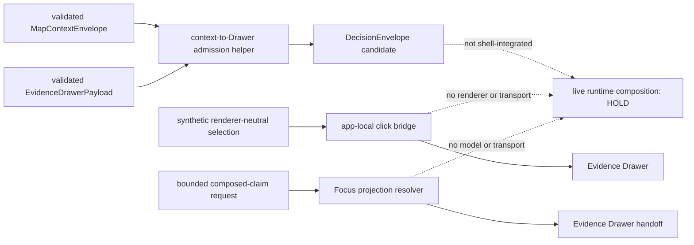

<!-- [KFM_META_BLOCK_V2]
doc_id: kfm://doc/architecture/ui/continuity-notes
title: UI Continuity Notes — Current Architecture, Bounded Proof, and Graduation Gates
type: architecture-reference
version: v2.0.0-draft
status: draft; repository-grounded; implementation-partial; no-live-continuity-runtime
owners:
  - "@bartytime4life — verified CODEOWNERS review route"
  - "UI, runtime, evidence, policy, release, accessibility, security, and independent-review stewardship NEEDS VERIFICATION"
created: 2026-05-24
updated: 2026-08-18
policy_label: public
owning_root: docs/
responsibility: Explain how KFM should preserve truthful UI context across map, evidence, Focus, story, export, permalink, and release transitions while distinguishing current bounded proof from target architecture.
truth_posture: cite-or-abstain
current_path: docs/architecture/ui/CONTINUITY_NOTES.md
evidence_snapshot:
  repository: bartytime4life/Kansas-Frontier-Matrix
  base_ref: main
  base_commit: 34d509c690649b284a7c0be739e3a5c8c85926ee
  target_prior_blob: 375e3e7e902cee054badb68294a7fe43d5ccbaa6
  adr_0029_blob: a4de0d7a96b78da59cfc499d1025e1508afd8dd9
  map_context_contract_blob: c6367306f14f9da56b3e3cbe7fad9d5545a0cdbf
  map_context_schema_blob: 6972d16341339c266499eca17dc2717b67778bed
  map_context_validator_blob: 9ead8aed6fb0df2355cb1af573a069339b567b74
  map_context_test_blob: 809cccdc31a428ab23097f956b6561c61dad9916
  context_drawer_architecture_blob: 32a9d4da2d778014e88033ab205ba08491c43ca0
  context_drawer_adapter_blob: fa2cc1781e7b21a63b3ee6bc6ce23f7e9c2c6350
  context_drawer_test_blob: da17c6c63e21b7a095d4080cb9eb57480b4064ee
  explorer_package_blob: ddd201b74a06001d84a14bf54ac62a6cc3607a29
  explorer_main_blob: 9c95ae67333b7cbf6bc88051fa5c76e4cd97efa4
  explorer_shell_blob: 64c78c78820af33fb7a622094e4c0944ad9412f8
  map_click_bridge_doc_blob: de7219fcb58d257d81a6e50c3d060c932c9c35f2
  map_runtime_bridge_blob: 18d61ea0ef2fbe2fc2f3cc9d42291c101003037f
  focus_composed_claim_fixture_doc_blob: e3ee9af088a86ba5ef02787672e7badf8bd9e727
  focus_composed_claim_resolver_blob: 45aa4e7479a8c95138f98cc48c846f39a16aec2d
  evidence_drawer_blob: 7746843c259594568fe75e975155a67eb8372e8f
  story_current_implementation_blob: 7566f69f0a7ff87b461b54098fb00f0c41deed63
  export_entry_blob: c1380189b0b7c48ee85bb4f9159c6a5c1e441b1b
  maplibre_adapter_blob: 663ba0f7a05498948f67d644387c73ab19d5c16c
  maplibre_package_entry_blob: 91664eb00583f9e3d0405eb7954fefa9a48f4ee9
  ui_package_entry_blob: 2c9ea341d61bf4d1733b9982fda8a9b869a3a720
related:
  - ./README.md
  - ./BOUNDARIES.md
  - ./EVIDENCE_DRAWER.md
  - ./FOCUS_FLOW.md
  - ./STORY_PLAYER.md
  - ./COMPARE_AND_EXPORT.md
  - ./MAP_RUNTIME_BOUNDARY.md
  - ./map-context-evidence-drawer-admission.md
  - ../map-shell.md
  - ../governed-api/README.md
  - ../../adr/ADR-0029-adopt-directory-governance-standard-v2.md
  - ../../doctrine/directory-rules.md
  - ../../../contracts/ui/map_context_envelope.md
  - ../../../schemas/contracts/v1/ui/map_context_envelope.schema.json
  - ../../../tools/validators/ui/validate_map_context_envelope.py
  - ../../../tests/validators/test_validate_map_context_envelope.py
  - ../../../packages/envelopes/src/envelopes/map_context_evidence_drawer.py
  - ../../../tests/packages/envelopes/test_map_context_evidence_drawer_admission.py
  - ../../../apps/explorer-web/src/features/map_runtime/CLICK_EVIDENCE_BRIDGE.md
  - ../../../apps/explorer-web/src/features/focus_panel/COMPOSED_CLAIM_FIXTURE.md
tags: [kfm, architecture, ui, continuity, map-context, evidence-drawer, focus-mode, story-player, export, correction, trust-membrane]
notes:
  - "Same-path documentation modernization only. No contract, schema, policy, fixture, validator, app, package, workflow, source, evidence, release, deployment, or publication behavior changes."
  - "The existing docs/architecture/ui/ lane is placement-safe under accepted ADR-0029 and adopted Directory Rules v2; the former proposed-subfolder warning is retired."
  - "MapContextEnvelope is a short-lived, renderer-neutral released request-context projection. It is not a universal client-session object and intentionally excludes renderer-specific camera and feature payload state."
  - "Current executable proof is bounded to fixture-first validation, one local context-to-Drawer admission helper, a renderer-neutral synthetic click bridge, a composed-claim Focus projection, the fail-closed Explorer shell, the Evidence Drawer projection, and a 2D-only Story Player consumer. These slices are not composed into one live public runtime."
[/KFM_META_BLOCK_V2] -->

<a id="top"></a>

# UI Continuity Notes — Current Architecture, Bounded Proof, and Graduation Gates

> **Operating rule.** KFM UI continuity means that every transition preserves the truth-bearing bindings appropriate to that transition—released identity, evidence scope, finite outcome, time and area scope, limitations, correction state, and safe negative behavior—without turning browser state, a map renderer, a URL, an export, or generated language into authority.


| Field | Current bounded result |
|---|---|
| **Evidence snapshot** | `main@34d509c690649b284a7c0be739e3a5c8c85926ee` |
| **Document role** | Cross-cutting UI architecture explanation; not contract, schema, policy, evidence, review, release, runtime, or publication authority |
| **Placement** | Existing `docs/architecture/ui/` lane; confirmed by accepted ADR-0029 and the current UI architecture README |
| **Current request-context object** | Proposed/inactive `MapContextEnvelope` contract plus closed schema, deterministic validator, fixtures, and focused tests |
| **Current UI surface** | Fixed fail-closed Explorer shell plus fixture-driven, keyboard-operable Evidence Drawer; additional renderer-neutral click and composed-claim Focus slices exist but are not mounted by the inspected entrypoint |
| **Current cross-object seam** | Deterministic no-network `MapContextEnvelope` → `EvidenceDrawerPayload` admission helper producing a non-authoritative `DecisionEnvelope` candidate |
| **Current Story surface** | Bounded, public-safe, 2D-only Story Player consumer; no route, map, Evidence Drawer, Focus, or 3D integration proved |
| **Current Export surface** | Placeholder entrypoint only |
| **Map/renderer state** | A renderer-neutral synthetic click bridge exists, but the MapLibre adapter and package are placeholders and Explorer declares no renderer dependency |
| **Live continuity** | No admitted renderer, live map producer, live governed transport, route composition, permalink codec, model execution, export pipeline, correction listener, deployment, or public operation is established |

> [!IMPORTANT]
> A passing fixture, validator, helper, build, or UI projection proves only its declared boundary. It does not prove that the Explorer invokes the helper, that evidence resolves, that policy ran, that release state is current, that a public route exists, or that KFM has published anything.

---

## Quick jump

- [0. Current repository checkpoint](#0-current-repository-checkpoint)
- [1. Purpose — what continuity means in KFM UI](#1-purpose--what-continuity-means-in-kfm-ui)
- [2. Scope and repo fit](#2-scope-and-repo-fit)
- [3. The seven continuity dimensions](#3-the-seven-axes-of-continuity)
- [4. MapContextEnvelope — the current bounded-context primitive](#4-mapcontextenvelope--the-bounded-context-primitive)
- [5. Map and renderer transitions](#5-2d--3d-transitions--maplibre-and-story-nodes)
- [6. Map, Evidence Drawer, Focus Mode, and AI](#6-map--focus-mode--ai-continuity)
- [7. Session, permalink, and URL-state continuity](#7-session-deep-link-and-url-state-continuity)
- [8. Export, screenshot, and report continuity](#8-export-screenshot-and-report-continuity)
- [9. Release-boundary continuity](#9-release-boundary-continuity--rollback-correction-withdrawal)
- [10. Anti-patterns](#10-anti-patterns--where-continuity-quietly-breaks)
- [11. Validation, proof limits, and graduation gates](#11-tensions-and-known-limits)
- [12. Open questions](#12-open-questions)
- [13. Related docs](#13-related-docs)
- [Appendix A — Continuity matrix](#appendix-a--continuity-matrix)
- [Appendix B — Placement resolution](#appendix-b--placement-rationale-new-subfolder)
- [Appendix C — No-loss modernization ledger](#appendix-c--no-loss-modernization-ledger)

---

<a id="0-current-repository-checkpoint"></a>

## 0. Current repository checkpoint

The original edition described a broad desired continuity model but was written before the current repository surfaces existed. The current tree now supports a narrower, more useful conclusion.

### 0.1 Confirmed repository-present surfaces

| Surface | What current bytes prove | What they do **not** prove |
|---|---|---|
| [`contracts/ui/map_context_envelope.md`](../../../contracts/ui/map_context_envelope.md) | A proposed semantic contract for immutable, renderer-neutral, released request context | A live producer, accepted public DTO, session store, evidence resolution, policy, release verification, or route |
| [`map_context_envelope.schema.json`](../../../schemas/contracts/v1/ui/map_context_envelope.schema.json) | Closed JSON Schema profile with exact fields, finite filters, release/evidence references, and all-false governance declarations | That declared release or evidence references resolve or remain current |
| [`validate_map_context_envelope.py`](../../../tools/validators/ui/validate_map_context_envelope.py) | Deterministic local validation, canonical unions, TTL and time ordering, bounded geography, internal-reference denial, and identity reproduction | Public runtime invocation or authoritative policy/evidence/release checks |
| [`test_validate_map_context_envelope.py`](../../../tests/validators/test_validate_map_context_envelope.py) | Repository-present positive, schema-negative, semantic-negative, identity, no-network, duplicate-key, non-finite-number, and CLI test source over 16 declared cases | Current hosted execution for this documentation change until exact-head checks finish |
| [`map-context-evidence-drawer-admission.md`](./map-context-evidence-drawer-admission.md) and its [helper](../../../packages/envelopes/src/envelopes/map_context_evidence_drawer.py) | A bounded anticorruption adapter that aligns one validated selected-feature context with one validated public-safe drawer projection and emits a `DecisionEnvelope` candidate | Evidence resolution, policy evaluation, authentic review/release state, public-use authorization, or Explorer/governed-API wiring |
| [Admission helper tests](../../../tests/packages/envelopes/test_map_context_evidence_drawer_admission.py) | Eight finite fixture outcomes, current `DecisionEnvelope` conformance, determinism, input immutability, no content leakage, safe ambiguity handling, and no-network replay are encoded in tests | A deployed runtime path |
| [Explorer `main.ts`](../../../apps/explorer-web/src/main.ts) and [baseline shell](../../../apps/explorer-web/src/features/shell/index.tsx) | The current entrypoint mounts a fixed `ABSTAIN / NO_GOVERNED_RESPONSE` shell and the Evidence Drawer; supplied baseline input returns a fixed error | A map, route tree, API transport, released-layer flow, Focus request, story integration, export, or deployment |
| [Map feature click bridge](../../../apps/explorer-web/src/features/map_runtime/CLICK_EVIDENCE_BRIDGE.md) and [implementation](../../../apps/explorer-web/src/features/map_runtime/index.tsx) | Strict renderer-neutral selection parsing, injected governed resolution, evidence-subset enforcement, finite local failures, and an accessible synthetic click fixture | A MapLibre dependency, live map event, browser transport, EvidenceBundle resolution, policy evaluation, or shell integration |
| [Focus composed-claim fixture](../../../apps/explorer-web/src/features/focus_panel/COMPOSED_CLAIM_FIXTURE.md) and [resolver](../../../apps/explorer-web/src/features/focus_panel/resolver.ts) | Strict app-local request/projection parsing, injected resolution, request/claim identity binding, evidence-subset enforcement, finite composed-claim outcomes, Evidence Drawer handoff, and no-network/no-model posture | A governed API route, model adapter, live evidence resolution, policy execution, release authorization, or shell integration |
| [Evidence Drawer](../../../apps/explorer-web/src/features/evidence_drawer/index.tsx) | Strict finite projection, safe no-leak negative copy, evidence/citation/history display, keyboard open/close, Escape handling, and focus return | Live transport, EvidenceBundle resolution, policy execution, canonical payload adoption, or public operation |
| [Story Player current implementation](../../../apps/explorer-web/src/features/story_player/current-implementation.md) | One defensive, public-safe, 2D-only StoryManifest consumer with focused tests | Fetching, routes, map/time continuity, Evidence Drawer integration, 3D handoff, authoring, release, or publication |
| [Export entrypoint](../../../apps/explorer-web/src/features/export/index.tsx) | A placeholder export only | Any export request, artifact, receipt, citation gate, download, or screenshot governance |
| [MapLibre adapter](../../../apps/explorer-web/src/adapters/MapLibreAdapter.ts) and [package entry](../../../packages/maplibre/src/index.ts) | A boundary comment and a placeholder package | An admitted renderer dependency, functional adapter, map canvas, plugin set, or browser runtime |
| [UI package entry](../../../packages/ui/src/index.ts) | A placeholder package | A reusable component contract or continuity state store |

### 0.2 Current maturity statement

**CONFIRMED:** the repository contains useful fixture-first continuity building blocks.

**CONFIRMED:** those blocks are deliberately non-authoritative. Some app-local slices compose synthetic selection, Focus, and Evidence Drawer behavior, but the inspected Explorer entrypoint does not compose them into a live map/Focus runtime.

**UNKNOWN:** whether any external or deployed system supplies equivalent behavior outside the inspected repository surfaces.

**PROPOSED:** the target architecture in later sections describes how the bounded pieces could become a governed end-to-end continuity flow. It is not a statement that the flow exists.

[Back to top](#top)

---

<a id="1-purpose--what-continuity-means-in-kfm-ui"></a>

## 1. Purpose — what continuity means in KFM UI

Continuity is the survival of **truthful context** across a change of surface.

A user may move from an Explorer view to an Evidence Drawer, Focus request, story, comparison, export, shared link, or later release. KFM continuity is satisfied only when the next surface remains honest about:

- which released layer or artifact is in scope;
- which feature, geography, and time window are in scope;
- which evidence references support the displayed projection;
- which finite outcome applies;
- which limitations, rights, sensitivity, freshness, review, release, and correction declarations apply;
- what cannot be shown or answered;
- which parts are browser-local interaction state rather than governed truth.

Continuity is therefore broader than state synchronization.

| Concept | Question answered |
|---|---|
| **State synchronization** | Did two client views keep the same camera, panel, toggle, or cursor? |
| **Request-context continuity** | Did the governed request retain the same released layer, selection, time, area, evidence, and release references? |
| **Evidence continuity** | Did the downstream surface use the same admitted evidence scope and finite outcome, without inventing support? |
| **Release continuity** | Is the surface honest about the release, correction, supersession, withdrawal, or rollback state it represents? |
| **Narrative continuity** | Did a story or explanation preserve its position and support boundaries without turning narrative order into truth? |

> [!CAUTION]
> Browser-local state can improve usability, but it cannot establish evidence, policy, review, release, or publication state. A camera position and a rendered feature are not evidence. A restored tab is not a release record. A permalink is not a policy decision.

[Back to top](#top)

---

<a id="2-scope-and-repo-fit"></a>

## 2. Scope and repo fit

### 2.1 Document authority

This file is an architecture reference under the existing UI documentation lane. It explains responsibilities and graduation requirements. It does not define machine behavior.

| Question | Controlling surface |
|---|---|
| Where this file belongs | Accepted [`ADR-0029`](../../adr/ADR-0029-adopt-directory-governance-standard-v2.md), adopted [`directory-rules.md`](../../doctrine/directory-rules.md), and the current [`docs/architecture/ui/README.md`](./README.md) |
| What `MapContextEnvelope` means | [`contracts/ui/map_context_envelope.md`](../../../contracts/ui/map_context_envelope.md) |
| What fields it accepts | [`schemas/contracts/v1/ui/map_context_envelope.schema.json`](../../../schemas/contracts/v1/ui/map_context_envelope.schema.json) |
| Whether a context is locally valid | The current validator and its fixtures/tests |
| Whether evidence resolves | Evidence authority and governed resolver, not this file or the context validator |
| Whether a claim may be shown | Applicable policy, review, release, correction, and runtime decision surfaces |
| How Explorer behaves now | Pinned app code and tests |
| Whether KFM is published | A governed release state and released artifact, never this document or a pull request |

### 2.2 Correct current homes

| Responsibility | Current home or boundary | Status |
|---|---|---|
| UI architecture explanation | `docs/architecture/ui/` | Confirmed existing lane |
| Deployable shell | `apps/explorer-web/` | Confirmed bounded app |
| UI request semantics | `contracts/ui/` | Confirmed semantic-contract lane |
| Machine shape | `schemas/contracts/v1/ui/` | Confirmed schema lane |
| Shared envelope adapter | `packages/envelopes/` | Confirmed bounded helper |
| Renderer package | `packages/maplibre/` | Confirmed placeholder; decision/runtime incomplete |
| Shared UI package | `packages/ui/` | Confirmed placeholder |
| Policy | `policy/` | Separate authority; no continuity rule is created here |
| Evidence | Evidence contracts, resolver, bundles, and governed runtime | Separate authority |
| Release/correction/rollback | `release/` and distinct lifecycle records | Separate authority |
| Executable proof | `fixtures/`, `tests/`, and validators | Bounded proof only |

> [!IMPORTANT]
> Older planning references to `contracts/v1/runtime/`, `packages/maplibre-runtime/`, or a proposed flat-file fallback are not current placement authority. Do not create a parallel package, contract, schema, policy, evidence, or release home from this document.

### 2.3 Non-effects

This documentation-only update does not:

- change `MapContextEnvelope` meaning or shape;
- extend the envelope with camera, URL, story, Focus, or panel state;
- accept a renderer ADR or add a renderer dependency;
- wire the admission helper into Explorer or the governed API;
- create an EvidenceBundle resolver, policy evaluator, Focus route, permalink service, export pipeline, correction listener, or cache invalidation path;
- activate a source, promote lifecycle state, release, deploy, or publish.

[Back to top](#top)

---

<a id="3-the-seven-axes-of-continuity"></a>

## 3. The seven continuity dimensions

The previous edition treated one proposed `MapContextEnvelope` as a universal carrier. Current repository evidence requires a stricter split. The seven dimensions remain useful, but each has a different owner and maturity.

| # | Dimension | What must survive | Current carrier or evidence | Current status |
|---|---|---|---|---|
| 1 | **View-state continuity** | Camera, viewport interaction, open panels, local toggles, keyboard focus, and other renderer/client state | No accepted durable view-state contract; some component-local behavior exists | **PARTIAL / target contract needed** |
| 2 | **Request-context continuity** | Released layers, selected features, bounded filters, time window, area scope, evidence refs, release refs, caller role, and expiry | `MapContextEnvelope` | **BOUNDED fixture-first proof** |
| 3 | **Evidence and citation continuity** | Downstream projection remains within the selected feature's admitted evidence set and shows only permitted citations | Evidence Drawer projection, context-admission helper, synthetic click bridge, and Focus composed-claim resolver | **BOUNDED app-local proof; no live resolver or route** |
| 4 | **Finite-outcome and trust continuity** | `ANSWER`, `ABSTAIN`, `DENY`, or `ERROR` remains compatible with declared policy/review/release/freshness/correction posture | Evidence Drawer, `DecisionEnvelope` candidate helper, synthetic click bridge, and Focus composed-claim projection | **BOUNDED projection proof** |
| 5 | **Temporal and spatial continuity** | Ordered request time window and bounded viewport/geography survive a governed request transition | `MapContextEnvelope.time_window` and `area_scope` | **BOUNDED request-context proof** |
| 6 | **Narrative continuity** | Story position, public-safe evidence/citation refs, limitations, and non-authoritative status remain visible | StoryManifest consumer slice | **2D-only bounded consumer; no map/route integration** |
| 7 | **Session, export, and release continuity** | A durable link or outward artifact remains honest about release, correction, withdrawal, and rollback state | No live permalink/export/release listener; Drawer can render declared history fixtures | **TARGET / not established end to end** |

These dimensions must not be collapsed merely because one UI action touches several of them. In particular:

- `MapContextEnvelope` owns short-lived governed **request context**, not all browser state.
- the Evidence Drawer owns a public-safe **projection**, not evidence authority;
- the synthetic click bridge owns app-local selection scoping, not a map renderer or EvidenceBundle resolver;
- the Focus composed-claim resolver owns request/projection subset checks, not model execution or claim authority;
- the admission helper owns local cross-object consistency, not policy or release;
- Story Player owns defensive playback projection, not source or narrative publication;
- a future permalink or export object must have its own reviewed contract instead of silently expanding `MapContextEnvelope`.

[Back to top](#top)

---

<a id="4-mapcontextenvelope--the-bounded-context-primitive"></a>

## 4. `MapContextEnvelope` — the current bounded-context primitive

The current semantic contract defines `MapContextEnvelope` as an immutable, renderer-neutral request-context projection. It carries stable KFM identifiers across the trust membrane without copying renderer objects, raw feature properties, or internal store references.

### 4.1 Exact current field surface

The closed schema requires these top-level fields:

| Field | Current meaning |
|---|---|
| `object_type` | Constant `MapContextEnvelope` |
| `schema_version` | Constant `1.0.0` |
| `profile` | Constant `kfm.ui.map-context-envelope.v1` |
| `envelope_id` | Deterministic ID derived from the identity digest |
| `request_id` | Bounded request/audit reference |
| `caller_role` | Finite caller role |
| `assembled_at` | Canonical UTC assembly time |
| `expires_at` | Canonical UTC expiry; maximum lifetime is 15 minutes |
| `time_window` | Ordered UTC start and end |
| `area_scope` | Ordered geographic viewport bounds or one geography reference |
| `layers[]` | Canonical list of declared `PUBLISHED` layers with release refs, layer spec hashes, and evidence refs |
| `selections[]` | Canonical selected feature/layer pairs with evidence refs |
| `filters[]` | Renderer-neutral `EQ`, `IN`, or `BETWEEN` declarations with finite arity |
| `evidence_refs[]` | Exact canonical union of layer and selection evidence refs |
| `release_refs[]` | Exact canonical union of layer release refs |
| `governance` | Closed set of declarations that all remain `false` |
| `spec_hash` | RFC 8785 JCS + SHA-256 identity over the envelope excluding `envelope_id` and `spec_hash` |

The envelope ID is the prefix `map-context-envelope:` plus the first 24 hexadecimal characters of the computed digest.

### 4.2 Explicit exclusions

The current schema deliberately does **not** admit:

- MapLibre or other renderer objects;
- `sourceLayer`, `queryRenderedFeatures`, `paint`, `layout`, style expressions, or feature-state;
- raw feature-property payloads;
- camera center, zoom, bearing, or pitch;
- open panel state, keyboard focus, tab state, or local preferences;
- Story Node or chapter state;
- Focus session identity or question text;
- URL parameter encoding;
- resolved EvidenceBundle bytes;
- a PolicyDecision, ReviewRecord, ReleaseManifest, CorrectionNotice, or RollbackCard;
- proof-store, RAW, WORK, QUARANTINE, canonical, internal, or direct-model references.

Those exclusions are a trust feature. They prevent a map/runtime implementation model from leaking into the published request language.

### 4.3 What local validation proves

The validator and tests establish a bounded local claim:

```text
fixture JSON
  -> closed schema validation
  -> canonical ordering and union checks
  -> bounded time / area / filter checks
  -> internal-reference denial
  -> deterministic JCS + SHA-256 identity
  -> PASS or finite findings
```

They do not verify that a declared release is current, that an EvidenceRef resolves, or that the caller is authenticated. Downstream services must re-check current evidence, policy, review, release, correction, and rollback state.

### 4.4 Consequence for UI continuity

`MapContextEnvelope` can safely anchor a **short-lived governed request**. It cannot by itself be:

- a durable browser session;
- a deep-link/permalink format;
- a renderer-state snapshot;
- an export receipt;
- an evidence bundle;
- an authorization token;
- a public release record.

A durable continuity design therefore needs composition, not uncontrolled field growth.

[Back to top](#top)

---

<a id="5-2d--3d-transitions--maplibre-and-story-nodes"></a>

## 5. Map and renderer transitions

### 5.1 Current state

The inspected Explorer package declares no MapLibre runtime dependency. `MapLibreAdapter.ts` contains only its import-boundary comment, `packages/maplibre/src/index.ts` exports a placeholder, and ADR-0007 remains proposed. The Story Player slice is explicitly 2D-only and not wired into the shell.

A renderer-neutral synthetic click bridge does exist under `features/map_runtime/`. It models a rendered-feature selection with ordinary buttons, calls an injected resolver, enforces EvidenceRef subset boundaries, and opens the existing Evidence Drawer. Its own documentation and tests explicitly deny any MapLibre, network, source, policy, evidence-store, lifecycle-store, or model-runtime behavior.

Therefore:

- a fixture-first **selection-to-Drawer** bridge is established;
- no functional renderer-backed 2D map transition is established;
- no 2D-to-3D or 3D-to-2D handoff is established;
- no renderer-specific continuity object is accepted;
- no Cesium handoff is current repository behavior;
- no map/time/story integration is proved by the Story Player consumer.

### 5.2 Target transition obligations

Any future renderer transition must preserve the governed parts of context while keeping renderer state in its own admitted boundary.

| Transition concern | Required target behavior | Owning decision or contract |
|---|---|---|
| Released layer identity | Preserve or explicitly map every admitted layer; unsupported layers remain visible as unsupported rather than silently disappearing | Layer/runtime contract |
| Evidence scope | Preserve selected-feature evidence refs and re-resolve them through governed evidence handling | Evidence authority and admission boundary |
| Time and area | Preserve ordered request scope or disclose any intentional narrowing | `MapContextEnvelope` plus runtime response |
| Finite outcome | A denied, stale, withdrawn, or errored projection cannot become an apparent answer in another renderer | Runtime envelope and UI projection |
| Camera/view state | Preserve only through a separately reviewed renderer-neutral view-state contract | **PROPOSED; not part of current `MapContextEnvelope`** |
| Story position | Preserve through the accepted StoryManifest/StoryNode model and route integration | Story contracts and app feature |
| Synthetic or reconstructed representation | Surface a reviewed reality/representation boundary where applicable | Representation policy/contract |
| Additional renderer or plugin | Require accepted dependency, boundary, security, license, performance, accessibility, and rollback treatment | ADR and package/runtime governance |

> [!WARNING]
> “Same visual result” is not enough. A renderer transition fails continuity when it changes evidence scope, hides a negative outcome, silently changes release, or exposes a detail that policy withheld—even when the pixels look correct.

### 5.3 Story Player boundary

The current Story Player consumer proves defensive handling of one public-safe StoryManifest projection. It does not prove:

- a route;
- a map;
- StoryNode dereferencing;
- Evidence Drawer handoff;
- time or camera synchronization;
- 3D rendering;
- story authoring or publication.

Those remain graduation work, not current behavior.

[Back to top](#top)

---

<a id="6-map--focus-mode--ai-continuity"></a>

## 6. Map, Evidence Drawer, Focus Mode, and AI continuity

### 6.1 Current bounded seams

The repository contains three related but distinct app/runtime-facing continuity slices. None is mounted as a live map/Focus route by the inspected Explorer entrypoint.

1. A local `MapContextEnvelope` → `EvidenceDrawerPayload` admission helper emits a non-authoritative `DecisionEnvelope` candidate.
2. A renderer-neutral synthetic map-click bridge scopes an injected resolution request and opens the Evidence Drawer.
3. A fixture-first Focus composed-claim feature validates an allowlisted request/projection pair and hands support to the Evidence Drawer.


```mermaid
flowchart LR
    MC["validated MapContextEnvelope"] --> AD["context-to-Drawer admission helper"]
    DP["validated EvidenceDrawerPayload"] --> AD
    AD --> DE["DecisionEnvelope candidate"]

    SEL["synthetic renderer-neutral selection"] --> MB["app-local click bridge"]
    MB --> DR["Evidence Drawer"]

    FREQ["bounded composed-claim request"] --> FP["Focus projection resolver"]
    FP --> FDR["Evidence Drawer handoff"]

    DE -. "not shell-integrated" .-> HOLD["live runtime composition: HOLD"]
    MB -. "no renderer or transport" .-> HOLD
    FP -. "no model or transport" .-> HOLD
```

The context-to-Drawer helper checks:

- expected object profiles;
- context assembly/expiry ordering;
- all-false context governance declarations;
- caller-role boundaries, including explicit fixture-only `SYSTEM_TEST` opt-in;
- exactly one selected feature;
- selected layer identity, declared `PUBLISHED` state, and release binding;
- selected evidence membership in context evidence;
- drawer evidence scope for `ANSWER` and `ABSTAIN`;
- finite outcome/reason/trust-state compatibility;
- no evidence, citations, history, title, summary, limitations, or source-text leakage into `DENY` or `ERROR` candidates.

It emits an existing `DecisionEnvelope` candidate with `policy_family = "render"`. The candidate is not a PolicyDecision and creates no authority.

### 6.2 Synthetic map-click bridge

The app-local bridge uses profile `kfm.explorer.map-feature-selection.v1`. It accepts only selection, layer, feature, and allowlisted evidence identity plus an injected resolver. It:

- treats rendered feature properties as request scope, never evidence;
- returns `ABSTAIN` when no governed evidence reference exists;
- returns fixed safe `ERROR` states for malformed selection, resolver failure, or evidence outside selection scope;
- preserves governed `DENY` behavior without reflecting restricted support;
- mounts an accessible synthetic click fixture and opens the Evidence Drawer;
- imports no renderer and performs no transport itself.

This is genuine continuity proof between a synthetic selection and the Drawer. It is not a `MapContextEnvelope` producer and does not prove a live map click.

### 6.3 Evidence Drawer current behavior

The fixture-driven Evidence Drawer:

- accepts one strict browser projection profile;
- resolves the projection into `ANSWER`, `ABSTAIN`, `DENY`, or `ERROR`;
- uses fixed safe copy for negative states;
- shows evidence references and citations only when allowed by its local projection rules;
- shows declared source-role, policy, review, release, freshness, correction, negative-history, and correction-history labels;
- opens and closes by keyboard, closes on Escape, and returns focus;
- performs no network request, policy evaluation, source access, or lifecycle-store access.

This is useful UI proof, not an authoritative resolver.

### 6.4 Focus and AI current state

`contracts/ui/focus_request.md` remains proposed, and its paired schema is described as a permissive stub.

Separately, the app contains a fixture-first composed-claim Focus feature. Its injected resolver path:

- validates a bounded question, request identity, claim identity, and allowlisted EvidenceRefs;
- requires response request/claim identity to match;
- rejects Focus or Drawer evidence outside request scope;
- maps dependency closure `SUPPORTED` and `QUALIFIED` to `ANSWER`, while preserving `ABSTAIN`, `DENY`, and `ERROR`;
- requires answer support/citations and a safe AIReceipt reference in its public-safe projection;
- sanitizes negative Drawer inputs and exposes no hidden reasoning, provider trace, or raw prompt bundle;
- performs no network, model, vector-store, graph-store, renderer, policy, source, or lifecycle-store access.

No live Focus route, model adapter, governed transport, authoritative EvidenceBundle resolution, policy execution, or shell composition is established by the inspected entrypoint.

### 6.5 Target governed order

A future live flow must preserve this order:

```text
client-local view state
  -> validated short-lived MapContextEnvelope
  -> current release / correction / caller checks
  -> EvidenceRef resolution to admissible EvidenceBundle
  -> policy, sensitivity, rights, review, and citation checks
  -> finite RuntimeResponseEnvelope
  -> public-safe Evidence Drawer / Focus / AI projection
  -> optional AIReceipt when model execution occurs
```

The local admission helper and app-local projection slices may participate after their source objects are validated, but they cannot replace the governing checks.

| Outcome | UI continuity obligation |
|---|---|
| `ANSWER` | Show only bounded, current, released, reviewed, policy-allowed support and citations |
| `ABSTAIN` | Preserve safe support references only where the governing profile permits; show why no answer is available |
| `DENY` | Show a safe denial without restricted evidence, source text, coordinates, or internal reason detail |
| `ERROR` | Show a safe operational failure; never downgrade to an answer or raw model fallback |

[Back to top](#top)

---

<a id="7-session-deep-link-and-url-state-continuity"></a>

## 7. Session, permalink, and URL-state continuity

### 7.1 Current state

No current router, URL codec, permalink contract, short-link service, or round-trip test was verified for the Explorer entrypoint. The previous short-letter URL parameter proposal was design speculation and is not retained as repository fact.

The current `MapContextEnvelope` also cannot serve as a durable permalink by itself because:

- it expires within 15 minutes;
- it excludes camera and client-session state;
- it only declares release/evidence references and does not prove they resolve;
- it is a request-context object, not a released permalink object;
- its governance declarations explicitly create no public-use or release authority.

### 7.2 Target split

A sound permalink design should separate at least two objects:

1. **Ephemeral governed request context** — current `MapContextEnvelope`, short-lived and revalidated.
2. **Durable view/permalink state** — a separately reviewed object that records only public-safe client state and pins the released context required for replay.

A durable permalink object remains **PROPOSED**. Before it is created, Directory Rules, object-family ownership, contract/schema placement, sensitivity, identity, expiry, correction, and migration behavior must be decided.

### 7.3 Required properties for a future permalink

- deterministic serialization and replay tests;
- explicit versioning and migration;
- release reference pinning or an explicit “follow latest” mode that cannot be mistaken for a pinned view;
- visible treatment of superseded, withdrawn, corrected, or rolled-back releases;
- no RAW, WORK, QUARANTINE, canonical, proof-store, direct-model, secret, token, or restricted coordinate content;
- no EvidenceBundle bytes or sensitive source payloads in the URL;
- safe maximum size and denial behavior;
- URL-only restoration for correctness, with local storage used only as an optimization;
- accessibility state where material, without leaking private preferences;
- a new short-lived `MapContextEnvelope` assembled and validated when the durable link is opened.

### 7.4 Minimum negative tests

| Case | Required result |
|---|---|
| Unknown permalink version | `ERROR` or safe migration hold |
| Withdrawn pinned release | Safe withdrawal projection; no silent reanimation |
| Restricted evidence or geometry embedded in link | `DENY` |
| Missing release binding in pinned mode | `ABSTAIN` or `ERROR` |
| Lossy encode/decode round trip | Test failure |
| Expired derived `MapContextEnvelope` | Reassemble from authorized released state or `ABSTAIN`; never reuse silently |
| Local storage missing | View still restores from the durable link or fails safely |

[Back to top](#top)

---

<a id="8-export-screenshot-and-report-continuity"></a>

## 8. Export, screenshot, and report continuity

### 8.1 Current state

The current Explorer Export feature entry is a placeholder. No export request, governed API route, renderer capture, artifact builder, `ExportReceipt`, citation report, download, or release-bound output is proved.

The presence of export architecture documentation does not change that conclusion.

### 8.2 Target export posture

An outward artifact is a new trust surface. A screenshot, copied canvas, browser debug dump, ad hoc GeoJSON, generated report, or model narrative must not be represented as a governed KFM export merely because it originated in the UI.

A future governed export should carry or resolve, as appropriate:

| Required concern | Target obligation |
|---|---|
| Scope | Exact released layers, selected features, time, area, filters, and output mode |
| Evidence | Evidence references for each claim-bearing item |
| Citations | Validated citation set or explicit abstention |
| Trust posture | Rights, sensitivity, review, release, freshness, correction, and transformation state |
| Release identity | Release references for every included released carrier |
| Redaction/generalization | Preserve all public-safe transformations; never reverse them client-side |
| Correction/withdrawal | Record the state at export time and provide a resolution path for later correction |
| Receipt | Emit the accepted receipt family once defined and implemented |
| Rollback/correction | Point to the applicable release/correction lineage rather than inventing browser authority |
| Accessibility | Non-color trust cues, readable metadata, keyboard path, and accessible document structure where applicable |

These are target obligations, not proof of current runtime behavior.

### 8.3 Finite export outcomes

| Outcome | Artifact behavior |
|---|---|
| `ANSWER` | Emit only after all governing evidence, citation, rights, sensitivity, review, release, correction, and receipt requirements close |
| `ABSTAIN` | Do not emit a claim-bearing artifact; explain the missing or stale support safely |
| `DENY` | Do not emit restricted content or leak the denial basis |
| `ERROR` | Do not emit partial output and do not fall back to direct canvas capture |
| `HOLD`, where an accepted export contract uses it | Queue for steward review; do not download as a governed artifact |

### 8.4 Snapshot identity

The prior edition named `StorySnapshot / ExportReceipt` as though its runtime role were settled. Current repository evidence supports only a design need: a durable outward artifact requires a separate, accepted identity and receipt model. The exact object family, fields, home, retention, public visibility, and correction behavior remain **NEEDS VERIFICATION**.

[Back to top](#top)

---

<a id="9-release-boundary-continuity--rollback-correction-withdrawal"></a>

## 9. Release-boundary continuity — correction, withdrawal, and rollback

### 9.1 Current bounded proof

The Evidence Drawer projection can display **declared** negative history and correction links from a validated fixture profile. The local adapter can reject trust-state combinations that do not match the finite outcome.

That does not prove:

- current release lookup;
- authenticated correction or withdrawal records;
- cache/CDN invalidation;
- map-layer removal;
- deep-link redirect behavior;
- search/index propagation;
- export correction;
- AI-response invalidation;
- public rollback.

### 9.2 Target release behavior

A live surface must independently resolve current release and correction state when a request or durable link is opened. It must not trust an old browser declaration merely because it was valid when assembled.

| Transition | Target UI behavior |
|---|---|
| Current → superseded | Preserve the pinned older view only when policy permits, label it clearly, and offer the newer release without silently changing identity |
| Current → corrected | Show the active correction lineage and bounded change summary from governed records |
| Current → withdrawn or revoked | Stop current-claim rendering, show safe withdrawal/revocation state, and avoid leaking restricted reason detail |
| Current → rollback target | Render only the release selected by governed rollback state; disclose the transition |
| Withdrawn → later republished | Treat the later object as a new release; never silently reactivate the old identity |
| Cache invalidation pending | Show a conservative unknown/stale state or withhold rendering according to policy |

### 9.3 Continuity invariant

Release continuity does not mean “always show latest.” It means:

- the represented release is identifiable;
- any transition is visible;
- evidence and citation scope remain bound to that release;
- corrected or withdrawn support is not silently treated as current;
- the user can inspect the correction or rollback path at the level policy permits.

[Back to top](#top)

---

<a id="10-anti-patterns--where-continuity-quietly-breaks"></a>

## 10. Anti-patterns — where continuity quietly breaks

| Anti-pattern | Why it fails | Required correction |
|---|---|---|
| Treating `MapContextEnvelope` as camera/session/URL state | Contradicts the closed current contract and renderer-neutral boundary | Keep client view state separate; propose a new reviewed object only when required |
| Adding camera, Story, or Focus fields in this document | Documentation would become a parallel schema authority | Change contract/schema/fixtures/validator/tests through their owning roots |
| Trusting `release_state: PUBLISHED` as current release proof | The envelope records a declaration, not release authentication | Re-resolve current release/correction state downstream |
| Treating the admission helper's `ANSWER` candidate as policy approval | The helper checks local relationships only | Run authoritative evidence, policy, review, release, and citation checks |
| Treating the synthetic click bridge as a live map | It deliberately uses ordinary buttons and imports no renderer | Admit the renderer and translate real events through the same bounded profile |
| Treating the composed-claim projection as live AI | It uses an injected resolver and performs no model or transport work | Prove governed route, evidence closure, policy, citation, model adapter, and AIReceipt behavior |
| Claiming live continuity because fixture tests exist | Tests are bounded to synthetic inputs and local helpers | Prove the connected runtime path and exact-head behavior |
| Claiming map continuity from a comment-only adapter | No renderer dependency or functional map exists | Admit dependency and implement/test the governed adapter seam first |
| Treating proposed ADR-0007 as accepted | Proposed text is not decision authority | Keep renderer claims proposed until an accepted decision and implementation evidence exist |
| Claiming 3D handoff from the Story Player slice | The consumer is explicitly 2D-only and route-free | Add reviewed map/story/renderer integration with negative tests |
| Claiming export governance from a placeholder entrypoint | No request, policy, artifact, or receipt path exists | Implement a governed export slice before stronger claims |
| Putting EvidenceBundle bytes, tokens, or restricted coordinates in a URL | Creates leakage and bypasses access/revocation checks | Store only admitted public-safe identity and re-resolve through governed interfaces |
| Depending on local storage for correctness | A cleared browser would lose the truthful context | Make durable link/state sufficient or fail safely |
| Silently advancing a pinned link to latest release | Changes the claim without user-visible lineage | Preserve identity or explicitly label follow-latest semantics |
| Showing different finite outcomes on two projections of the same request | Converts a boundary mismatch into persuasive UI | Fail closed and surface the mismatch |
| Letting `DENY` or `ERROR` echo evidence or source content | Leaks protected or attacker-controlled material | Use fixed safe copy and empty support arrays |
| Exporting a clean screenshot without governed metadata | Launders trust state through presentation | Deny or mark it as an ungoverned capture; use the governed export path |
| Treating a green CI badge as deployed/public continuity | CI does not establish route, runtime, release, or publication state | Keep operational claims tied to deployment and release evidence |

[Back to top](#top)

---

<a id="11-tensions-and-known-limits"></a>

## 11. Validation, proof limits, and graduation gates

### 11.1 Repository-present validation inventory

| Boundary | Repository-present evidence | Bounded conclusion |
|---|---|---|
| `MapContextEnvelope` shape and semantics | Closed schema, validator, fixtures, 16-case tests | Strong local fixture proof; no live producer/consumer |
| Context → Drawer admission | Helper, eight-case fixture manifest, schema-conformance tests, no-network and no-leak tests | Strong local relationship proof; no authoritative decision or live wiring |
| Explorer baseline shell | TypeScript source and app scripts | Safe fixed default; not a functional product |
| Synthetic map-click bridge | Renderer-neutral selection parser/resolver, accessible fixture, unit/browser tests, and no-renderer/no-network boundary doc | Bounded selection-to-Drawer continuity; no live map or transport |
| Focus composed-claim projection | Strict parsers/resolver/panel, fixtures, unit/browser proof surfaces, and Evidence Drawer handoff | Bounded app-local Focus continuity; no model, API route, or authoritative resolution |
| Evidence Drawer | Strict projection parser/view model plus repository-present unit and browser test surfaces | Bounded fixture consumer with accessibility behavior |
| Story Player | Current implementation note and focused test source | Bounded 2D public-safe consumer; no connected story flow |
| Export | Placeholder entrypoint | No runtime proof |
| MapLibre | Placeholder adapter/package and proposed ADR | No renderer runtime proof |
| Accepted Focus request contract | Proposed contract and permissive schema stub | No accepted live request DTO or route proof |
| Permalink/session | No verified codec or route | Not established |
| Release propagation | Declared history display only | Not established end to end |

### 11.2 Required negative cases for any live continuity slice

A live slice is incomplete unless tests cover at least:

- expired context;
- missing or multiple selections;
- selection outside admitted layer;
- evidence outside selected feature;
- internal-store reference;
- unpublished or unresolved release;
- stale, superseded, corrected, withdrawn, and revoked support;
- rights unresolved;
- sensitive detail denied;
- citation unresolved;
- malformed finite outcome/trust combination;
- `DENY`/`ERROR` leakage canary;
- URL or durable-state version mismatch where applicable;
- export attempted before closure where applicable;
- no-network unit path;
- deterministic replay and input immutability;
- accessibility behavior for negative outcomes.

### 11.3 Graduation gates

The documentation may claim stronger continuity only after equivalent evidence closes each applicable gate.

| Gate | Required evidence | Missing-gate posture |
|---|---|---|
| **G1 — Authority and object split** | Reviewed ownership for request context, client view state, permalink, Focus request, story, export, and release transitions | Keep target language proposed |
| **G2 — Live context producer** | Explorer or an admitted client produces schema-valid `MapContextEnvelope` without renderer/internal leakage | No live map-context claim |
| **G3 — Governed transport** | Authenticated/authorized route accepts the context and returns a validated finite envelope | No API continuity claim |
| **G4 — Evidence closure** | EvidenceRefs resolve to admissible current EvidenceBundles for the selected feature | `ABSTAIN` |
| **G5 — Policy/review/release closure** | Current rights, sensitivity, policy, review, release, correction, and rollback checks | `DENY`, `ABSTAIN`, or `ERROR` |
| **G6 — UI composition** | Shell, synthetic click bridge, Drawer, Focus/story/export projections share one bounded request identity without parallel state authority | Existing isolated slices remain bounded; no live cross-surface claim |
| **G7 — Durable-state replay** | Versioned permalink/view-state contract, deterministic round-trip, release transition behavior, and sensitivity tests | No permalink/session claim |
| **G8 — Story/map continuity** | Route and map integration, time/selection/evidence preservation, accessibility, and negative cases | Keep Story continuity bounded to consumer proof |
| **G9 — Export closure** | Governed request, artifact builder, citations, transformations, receipt, correction/rollback binding, and no-partial-output tests | Export remains placeholder |
| **G10 — Renderer admission** | Accepted decision, pinned dependency, functional adapter, browser tests, performance/accessibility/security evidence, and rollback | No map/3D continuity claim |
| **G11 — Correction propagation** | Release/correction events update API, UI, cache, search, permalink, export, story, and AI surfaces | No end-to-end release continuity claim |
| **G12 — Operational proof** | Exact release/deployment evidence, telemetry, incident/correction runbook, rollback drill, and public-surface verification | Deployment/public operation remains unknown |

### 11.4 Rollback for this document

Before merge, close or abandon the draft pull request. After an authorized merge, revert the single documentation commit to restore prior blob `375e3e7e902cee054badb68294a7fe43d5ccbaa6`.

No source deactivation, data migration, schema rollback, runtime restart, cache invalidation, release withdrawal, or public correction is required because this change edits documentation only.

[Back to top](#top)

---

<a id="12-open-questions"></a>

## 12. Open questions

1. **Durable view-state object:** Should camera, pitch, open panels, story position, and other public-safe client state live in one `ViewState`, `PermalinkState`, or another existing family?
2. **MapContext stability:** Should the current short-lived request-only contract remain unchanged while durable state is modeled separately? The current evidence favors separation.
3. **Live producer:** Which app module owns construction of validated `MapContextEnvelope` records, and how is it prevented from importing renderer-specific payloads?
4. **Transport:** Which governed route accepts the envelope, and which contract owns the response?
5. **Evidence resolver:** Which current repository authority resolves EvidenceRef to EvidenceBundle for UI requests?
6. **Focus request:** When will the permissive FocusRequest schema be replaced by a closed request profile with fixtures, validator, and policy tests, and how will it relate to the current app-local composed-claim request profile?
7. **Story integration:** Which accepted contract binds StoryManifest/StoryNode position to map context without extending `MapContextEnvelope` improperly?
8. **Renderer decision:** What evidence is required to accept or revise ADR-0007 and admit the first functioning renderer dependency?
9. **3D posture:** Is a separate 3D/representation object family required, and which sensitive-domain policies gate it?
10. **Permalink release mode:** Must a link always pin a release, or may it explicitly opt into follow-latest behavior?
11. **Export identity:** Which accepted object family owns export identity, receipt, citation report, transformation references, retention, and later correction?
12. **Correction propagation:** Which runtime event or manifest transition invalidates contexts, links, caches, exports, stories, and AI responses?
13. **Trust-state vocabulary:** Which contract, rather than an architecture note, owns the exact UI trust-state terms?
14. **Accessibility continuity:** Which cross-surface focus, announcement, reduced-motion, and non-color requirements become executable acceptance tests?
15. **Privacy and telemetry:** Which session/permalink/export fields are permitted to enter logs or telemetry?
16. **Ownership:** Which named, accountable UI/runtime/evidence/policy/release/accessibility/security reviewers own these decisions? Do not infer people from role labels.

[Back to top](#top)

---

<a id="13-related-docs"></a>

## 13. Related docs

### UI architecture

- [UI architecture README](./README.md)
- [UI boundaries](./BOUNDARIES.md)
- [Evidence Drawer](./EVIDENCE_DRAWER.md)
- [Focus flow](./FOCUS_FLOW.md)
- [Story Player](./STORY_PLAYER.md)
- [Compare and Export](./COMPARE_AND_EXPORT.md)
- [Map runtime boundary](./MAP_RUNTIME_BOUNDARY.md)
- [Map context to Evidence Drawer admission](./map-context-evidence-drawer-admission.md)
- [Map shell](../map-shell.md)
- [Governed API](../governed-api/README.md)

### Governing placement

- [ADR-0029 — adopted Directory Rules v2](../../adr/ADR-0029-adopt-directory-governance-standard-v2.md)
- [Directory Rules](../../doctrine/directory-rules.md)

### Current contracts and proof

- [`MapContextEnvelope` semantic contract](../../../contracts/ui/map_context_envelope.md)
- [`MapContextEnvelope` schema](../../../schemas/contracts/v1/ui/map_context_envelope.schema.json)
- [`MapContextEnvelope` validator](../../../tools/validators/ui/validate_map_context_envelope.py)
- [`MapContextEnvelope` focused tests](../../../tests/validators/test_validate_map_context_envelope.py)
- [Context-to-Drawer adapter](../../../packages/envelopes/src/envelopes/map_context_evidence_drawer.py)
- [Context-to-Drawer tests](../../../tests/packages/envelopes/test_map_context_evidence_drawer_admission.py)
- [UI FocusRequest contract](../../../contracts/ui/focus_request.md)

### Current app/package surfaces

- [Explorer entrypoint](../../../apps/explorer-web/src/main.ts)
- [Explorer baseline shell](../../../apps/explorer-web/src/features/shell/index.tsx)
- [Map feature click bridge](../../../apps/explorer-web/src/features/map_runtime/CLICK_EVIDENCE_BRIDGE.md)
- [Map feature click implementation](../../../apps/explorer-web/src/features/map_runtime/index.tsx)
- [Focus composed-claim fixture](../../../apps/explorer-web/src/features/focus_panel/COMPOSED_CLAIM_FIXTURE.md)
- [Focus composed-claim resolver](../../../apps/explorer-web/src/features/focus_panel/resolver.ts)
- [Evidence Drawer implementation](../../../apps/explorer-web/src/features/evidence_drawer/index.tsx)
- [Story Player current implementation](../../../apps/explorer-web/src/features/story_player/current-implementation.md)
- [Export placeholder](../../../apps/explorer-web/src/features/export/index.tsx)
- [MapLibre adapter placeholder](../../../apps/explorer-web/src/adapters/MapLibreAdapter.ts)
- [MapLibre package placeholder](../../../packages/maplibre/src/index.ts)
- [UI package placeholder](../../../packages/ui/src/index.ts)

[Back to top](#top)

---

<a id="appendix-a--continuity-matrix"></a>

## Appendix A — Continuity matrix

| Transition | Current proof | Missing closure | Safe current claim |
|---|---|---|---|
| Baseline shell → Evidence Drawer | Both are mounted by Explorer `main.ts`; Drawer handles fixture/no-response states | No map selection, live transport, resolver, policy, or release lookup | Bounded fixture-driven composition |
| Validated context + validated Drawer payload → decision candidate | Deterministic eight-case helper and tests | No authoritative checks or runtime invocation | Bounded anticorruption adapter |
| Synthetic selection → Evidence Drawer | Renderer-neutral click bridge and app tests | No MapLibre event, live transport, or EvidenceBundle resolver | Bounded app-local proof |
| Map selection → `MapContextEnvelope` | Contract/schema/validator/tests exist | No live map or producer | Target only |
| App-local composed claim → Focus projection/Drawer | Fixture-first resolver, finite projection, support subset checks, browser handoff | No live route, model, policy, or authoritative evidence resolution | Bounded app-local proof |
| Map → accepted Focus request → runtime response | Proposed request semantics | Closed schema, route, evidence/policy/release integration, shell composition | Not established |
| Focus response → AI projection | General finite-outcome doctrine and app-local projection patterns | Live AI adapter, evidence closure, citation validation, AIReceipt, route | Not established |
| Story Player → map/Drawer/Focus | Defensive 2D StoryManifest consumer | Routes, StoryNode resolution, map/time state, Evidence Drawer, Focus, 3D | Consumer only |
| Map/view → durable permalink | None verified | Durable state contract, codec, replay tests, release/correction semantics | Not established |
| Map/view → export | Placeholder entrypoint | Governed request, policy, artifact, receipt, citations, correction/rollback | Not established |
| Release correction → Drawer | Drawer can display declared correction history | Authentic current release/correction resolution and propagation | Fixture projection only |
| Release withdrawal → map/cache/link/export/story/AI | No connected proof | Event propagation, invalidation, safe UI states, operational drill | Not established |
| Renderer transition | Placeholder adapter/package | Accepted decision, dependency, adapter, browser tests, state contract | Not established |

[Back to top](#top)

---

<a id="appendix-b--placement-rationale-new-subfolder"></a>

## Appendix B — Placement resolution

The prior edition treated `docs/architecture/ui/` as a proposed new subfolder and suggested flattening this file to `docs/architecture/UI_CONTINUITY_NOTES.md` if the lane were rejected.

That question is now resolved for this file:

- `docs/architecture/ui/` exists and contains the UI architecture README plus focused sibling documents;
- accepted ADR-0029 adopts Directory Rules v2;
- the current UI architecture README identifies this folder as the existing UI architecture lane;
- this change edits the tracked file in place and creates no root, subfolder, alias, or parallel authority.

**Current placement outcome:** `PLACE` at the existing path `docs/architecture/ui/CONTINUITY_NOTES.md`.

The old flattening fallback is retained only as historical context and is not a current recommendation. Moving or renaming this file would require a separate, evidence-backed navigation/compatibility review.

[Back to top](#top)

---

<a id="appendix-c--no-loss-modernization-ledger"></a>

## Appendix C — No-loss modernization ledger

| Prior subject | Current disposition |
|---|---|
| Continuity definition | Retained and narrowed to truthful cross-surface binding |
| Seven axes | Retained as seven dimensions with explicit ownership and maturity |
| `MapContextEnvelope` | Retained, corrected to the current contract/schema fields and exclusions |
| 2D/3D transition | Retained as target obligations; stale MapLibre↔Cesium implementation claims removed |
| Focus/AI flow | Retained as target governed order; current composed-claim projection, synthetic click bridge, context helper, and no-live-route boundary added |
| Deep-link URL proposal | Retained as design need; invented parameter grammar removed |
| Export requirements | Retained as target obligations; placeholder current state made explicit |
| Release/correction behavior | Retained as target behavior; declared-history fixture proof separated from live propagation |
| Anti-patterns | Expanded with current repository-specific failure modes |
| Continuity matrix | Replaced with current-proof/missing-closure/safe-claim matrix |
| Proposed-subfolder appendix | Converted to a resolved same-path placement record |
| Placeholder owners and CI claims | Replaced by verified review route and bounded validation posture |
| Rollback | Replaced with exact prior blob and one-file revert path |

---

### Footer

> **Document class:** UI architecture reference · **Authority not held:** object meaning, machine shape, evidence, policy, review, release, correction, rollback, runtime, deployment, or publication.

| Field | Value |
|---|---|
| **Path** | `docs/architecture/ui/CONTINUITY_NOTES.md` |
| **Owning root** | `docs/` |
| **Evidence snapshot** | `main@34d509c690649b284a7c0be739e3a5c8c85926ee` |
| **Prior blob / rollback target** | `375e3e7e902cee054badb68294a7fe43d5ccbaa6` |
| **Review route** | `@bartytime4life`; specialist and independent stewardship remains `NEEDS VERIFICATION` |
| **Publication effect** | None |

[Back to top](#top)
