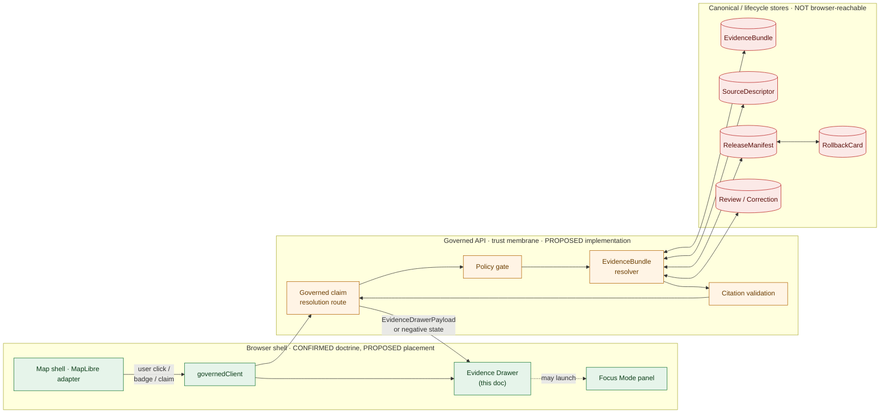
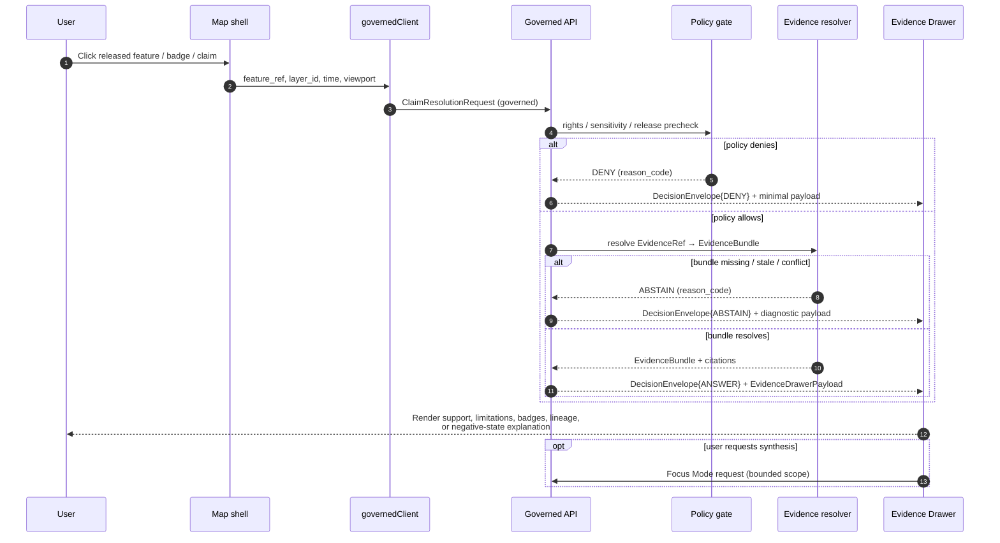

<!-- [KFM_META_BLOCK_V2]
doc_id: kfm://doc/architecture/ui/evidence-drawer
title: Evidence Drawer — UI Trust Panel Architecture
type: standard
version: v1
status: draft
owners: [UI subsystem owner, Docs steward, Governance steward]   <!-- placeholder; verify in CODEOWNERS -->
created: 2026-05-14
updated: 2026-05-14
policy_label: public
related:
  - docs/architecture/README.md
  - docs/architecture/ui/README.md
  - docs/architecture/ui/BOUNDARIES.md
  - docs/architecture/ui/STATE_OWNERSHIP.md
  - docs/architecture/ui/LAYERING.md
  - docs/architecture/governed-ai/FOCUS_FLOW.md
  - docs/doctrine/trust-membrane.md
  - docs/doctrine/truth-posture.md
  - schemas/contracts/v1/ui/evidence_drawer_payload.schema.json
  - schemas/contracts/v1/runtime/decision_envelope.schema.json
  - schemas/contracts/v1/evidence/evidence_bundle.schema.json
  - contracts/OBJECT_MAP.md
tags: [kfm, ui, evidence, governed-api, trust-membrane, finite-outcomes]
notes:
  - All repo paths in this document are PROPOSED until verified against mounted-repo evidence.
  - Doctrine is CONFIRMED from attached KFM project knowledge; implementation maturity is UNKNOWN.
[/KFM_META_BLOCK_V2] -->

# Evidence Drawer

> The UI trust panel that resolves a clicked feature, layer assertion, or consequential map claim into governed evidence — never a substitute for it.

[](#status)
[](#1-purpose-and-doctrinal-position)
[](#10-status--verification-backlog)
[](#5-contract--evidencedrawerpayload)
[](#7-policy-finite-outcomes-and-negative-states)
[](#9-accessibility-requirements)
<!-- Shields targets are placeholders pending repo-mounted verification. -->

**Status:** draft &nbsp;·&nbsp; **Owners:** UI subsystem owner · Docs steward · Governance steward _(placeholders; verify CODEOWNERS)_ &nbsp;·&nbsp; **Last reviewed:** 2026-05-14

---

## Quick jump

- [1. Purpose and doctrinal position](#1-purpose-and-doctrinal-position)
- [2. Where the Evidence Drawer sits](#2-where-the-evidence-drawer-sits)
- [3. Click-to-resolution flow](#3-click-to-resolution-flow)
- [4. The drawer is a projection, not a source](#4-the-drawer-is-a-projection-not-a-source)
- [5. Contract — `EvidenceDrawerPayload`](#5-contract--evidencedrawerpayload)
- [6. Trust-membrane boundaries](#6-trust-membrane-boundaries)
- [7. Policy, finite outcomes, and negative states](#7-policy-finite-outcomes-and-negative-states)
- [8. Lifecycle and release-state visibility](#8-lifecycle-and-release-state-visibility)
- [9. Accessibility requirements](#9-accessibility-requirements)
- [10. Validation, tests, fixtures](#10-validation-tests-fixtures)
- [11. Anti-patterns](#11-anti-patterns)
- [12. Related artifacts and proposed file homes](#12-related-artifacts-and-proposed-file-homes)
- [13. Open questions and verification backlog](#13-open-questions-and-verification-backlog)
- [Appendix A — Representative payload shapes](#appendix-a--representative-payload-shapes)
- [Appendix B — Glossary cross-references](#appendix-b--glossary-cross-references)
- [Related docs](#related-docs)

> [!IMPORTANT]
> This document records **CONFIRMED doctrine** for the Evidence Drawer drawn from attached KFM project knowledge. It does **not** assert that the drawer, its schema, its tests, or its routes already exist in the repository. Every repo-shaped claim (paths, schema homes, fixture trees, route names, validator commands) is **PROPOSED** until verified against a mounted repo and any governing ADR. See [§13](#13-open-questions-and-verification-backlog).

---

## 1. Purpose and doctrinal position

The **Evidence Drawer** is the mandatory UI trust panel that opens when a user clicks a released feature, an on-map badge, or any consequential map claim. Its single job is to **resolve that selection into governed evidence** — `EvidenceBundle` references, source descriptors, citations, policy state, release state, review state, and correction lineage — and to show **support and limitations**, including denial, abstention, and stale-state explanations, at the point of use.

The drawer exists because two KFM invariants must be visible at the moment a claim is made:

1. **Cite-or-abstain** is the default truth posture: a claim with no resolvable `EvidenceBundle` does not get rendered as a fact.
2. **Promotion is a governed state transition, not a file move**: what reaches the drawer must be released, and its release state, freshness, and rollback target must be inspectable.

> [!NOTE]
> The drawer's one-sentence rule: **the renderer is downstream of trust, never upstream of it.** Tiles, popups, badges, screenshots, Story Nodes, graph projections, and AI text are downstream carriers; none of them substitutes for the Evidence Drawer.

| Property | Statement | Label |
|---|---|---|
| Role | Mandatory inspection surface for clicked features and consequential map claims | **CONFIRMED** doctrine |
| Authority | Consumes `EvidenceBundle`; does not create truth | **CONFIRMED** doctrine |
| Projection | `EvidenceDrawerPayload` is a governed projection of canonical evidence for UI use | **CONFIRMED** doctrine |
| Implementation | Not verified in any mounted repo this session | **UNKNOWN** |
| Schema home | `schemas/contracts/v1/ui/evidence_drawer_payload.schema.json` | **PROPOSED** |
| Doc home | `docs/architecture/ui/EVIDENCE_DRAWER.md` (this file) | **PROPOSED** |

[⤴ back to top](#evidence-drawer)

---

## 2. Where the Evidence Drawer sits

The drawer is the **only sanctioned exit** from a map interaction into a claim. It sits between the MapLibre adapter (which renders released layers and synchronizes camera and time state) and the governed API (which holds the trust boundary). It is **not** the canonical evidence store, not the source registry, not the policy engine, not the citation authority, and not the publication authority.



> [!CAUTION]
> Greenshaded nodes reflect **CONFIRMED** UI doctrine. Amber nodes are **PROPOSED** implementation boundaries. Red-shaded nodes are canonical stores that **MUST NOT** be reached directly from the browser — the drawer never reads them; it consumes the governed projection.

[⤴ back to top](#evidence-drawer)

---

## 3. Click-to-resolution flow

A click never resolves to a claim by reading feature properties. It produces a **governed claim-resolution request**, and the response is either an `EvidenceDrawerPayload` carrying a `DecisionEnvelope` with `outcome: ANSWER`, or one of the finite negative states described in [§7](#7-policy-finite-outcomes-and-negative-states).



> [!TIP]
> The drawer is also the launch point for **Focus Mode**. Focus runs only over evidence the drawer has already resolved or that is otherwise admissible under the same policy precheck — it never re-opens a back channel around the trust membrane.

[⤴ back to top](#evidence-drawer)

---

## 4. The drawer is a projection, not a source

`EvidenceDrawerPayload` is a **governed projection** of `EvidenceBundle` shaped for UI consumption. Three rules govern that projection:

1. **EvidenceBundle stays canonical.** UI may evolve the drawer schema without renegotiating canonical evidence shape, but the projection MUST NOT drop citation, policy, review, release, or correction state.
2. **One generic drawer schema, domain-specialized via fixtures.** Per-domain bespoke drawer schemas scale linearly and fragment trust; the generic schema is specialized by example, not by parallel contract.
3. **The drawer does not re-rank evidence or create new claims in the browser.** It displays support and limitations. Re-ranking, citation validation, and synthesis happen behind the trust membrane.

| Rule | Source idea | Status |
|---|---|---|
| Drawer projection separates UI from canonical evidence | `ML-056-015` | **CONFIRMED** doctrine |
| Generic drawer schema specialized by domain fixtures | `ML-056-014` | **CONFIRMED** doctrine |
| Projection MUST preserve citation/policy/review/release state | `ML-056-015` validation note | **CONFIRMED** doctrine |
| No browser-side evidence re-ranking | Whole-UI §19.1 | **CONFIRMED** doctrine |

[⤴ back to top](#evidence-drawer)

---

## 5. Contract — `EvidenceDrawerPayload`

The drawer payload binds a UI surface event to governed evidence semantics. Two complementary projections appear in attached doctrine: a **minimal field set** suitable for a v1 schema, and an **extended trust set** required for stewardship surfaces and lineage inspection. Both are CONFIRMED in the source material; both should be reflected in `schemas/contracts/v1/ui/evidence_drawer_payload.schema.json` (PROPOSED home).

### 5.1 Minimal field set

| Field | Purpose | Notes |
|---|---|---|
| `feature_id` | Stable identity of the clicked feature | Deterministic where practical |
| `layer_id` | Layer the feature came from | Resolves to `LayerManifest` |
| `evidence_bundle_refs` | One or more `EvidenceRef` pointers | Must resolve to `EvidenceBundle` |
| `source_summary` | Source role, authority, knowledge character | Sourced from `SourceDescriptor` |
| `citations` | Per-claim citations | Validated against `CitationValidationReport` |
| `policy_state` | Outcome and obligations | Sourced from `PolicyDecision` |
| `release_state` | Released / stale / degraded / withdrawn | Sourced from `ReleaseManifest` |
| `limitations` | Limits, caveats, generalizations | Required when present in bundle |

### 5.2 Extended trust set (stewardship + lineage)

| Field | Purpose | Notes |
|---|---|---|
| `drawer_id` | Stable identity of this drawer instance | For audit and telemetry |
| `opened_from` | Surface + layer_id + feature_ref + (optional) badge_id | Records the launch context |
| `claim` | Label, valid_time, release_state | The thing being inspected |
| `decision` | `DecisionEnvelope` outcome + audit_ref | Carries ANSWER/ABSTAIN/DENY/ERROR |
| `evidence_refs[]` | Per-ref `source_role`, `knowledge_character` | Multi-evidence claims show role groups |
| `bundle_ref` | Pointer to the resolved `EvidenceBundle` | Canonical, not inlined |
| `trust` | `rights`, `sensitivity`, `review_state`, `freshness` | Color-independent labels required |
| `provenance` | `release_manifest_ref`, `correction_state`, `transforms` | Lineage breaks surfaced, not hidden |
| `related_manifests` | Tile / style / geo manifest refs | Tiles link to source, license, receipt |

> [!NOTE]
> Field sets above are **CONFIRMED** at the field-name level from attached architecture material. The authoritative shape, JSON schema, and required/optional split live in `schemas/contracts/v1/ui/evidence_drawer_payload.schema.json` (PROPOSED) and `contracts/OBJECT_MAP.md` (PROPOSED). When the live repo schema disagrees with this table, the **schema wins** and this doc MUST be reconciled via `docs/registers/DRIFT_REGISTER.md`.

A representative shape — **illustrative only, not authoritative** — is in [Appendix A](#appendix-a--representative-payload-shapes).

[⤴ back to top](#evidence-drawer)

---

## 6. Trust-membrane boundaries

The drawer lives on the browser side of the trust membrane. The membrane is enforced in the governed API. Crossing it from the browser is prohibited, regardless of how convenient a direct call would be.

| Boundary | The drawer MAY | The drawer MUST NOT |
|---|---|---|
| RAW / WORK / QUARANTINE stores | — | Read directly or via popup payload |
| Canonical stores (graph, object, vector, DB) | — | Call from the browser |
| Released `EvidenceBundle` | Display via projection | Fetch raw or unsigned |
| Model runtimes (Ollama, OpenAI, local) | — | Invoke directly |
| Citation validation | Display the validation result | Recompute or override it in UI |
| Policy meaning | Display the obligation / reason | Recompute policy meaning in UI |
| Sensitive geometry | Display generalized geometry the API returned | Re-derive exact coordinates client-side |
| Style filters | Render style as released | Use style filters as a sensitivity gate |

> [!WARNING]
> **Popups are not drawers.** A map popup may serve as a launch point for the Evidence Drawer, but it MUST NOT substitute for the drawer for any consequential claim. A badge click MUST open proof details inside the drawer, not replace it. Tiles, screenshots, graph projections, and AI answers are downstream carriers and never substitute for the drawer.

[⤴ back to top](#evidence-drawer)

---

## 7. Policy, finite outcomes, and negative states

Every drawer interaction terminates in a **finite outcome** carried by the `DecisionEnvelope` it received from the governed API. Negative states are first-class: they are designed, tested, and rendered explicitly — not hidden by silently dropping the drawer.

### 7.1 Finite outcomes (`DecisionEnvelope.outcome`)

| Outcome | When it appears in the drawer | UI obligation |
|---|---|---|
| `ANSWER` | Bundle resolved, citations valid, policy allows | Render support + limitations + lineage |
| `ABSTAIN` | Bundle missing, citations unresolved, source roles conflict, scope too thin | Show abstention reason; offer correction submission |
| `DENY` | Rights, sensitivity, release state, or sovereignty/CARE label blocks exposure | Show denial reason and the obligation that produced it |
| `ERROR` | Invalid payload, schema mismatch, internal failure | Show error class and rollback / retry guidance; never silently degrade to ANSWER |

### 7.2 Drawer-specific negative states

These are **CONFIRMED** as first-class drawer states; each MUST be representable in the payload and rendered with an explanatory surface:

| `reason_code` | Meaning | Typical envelope outcome |
|---|---|---|
| `evidence_missing` | No resolvable `EvidenceBundle` for the claim | `ABSTAIN` |
| `restricted` | Rights / sovereignty / sensitivity label blocks exposure | `DENY` |
| `stale` | Released, but freshness exceeds permitted bound | `ABSTAIN` (with stale badge) |
| `conflict` | Source roles or bundles disagree beyond reconciliation | `ABSTAIN` |
| `invalid_payload` | Payload fails `EvidenceDrawerPayload` schema | `ERROR` |
| `policy_denied` | Policy gate denied the request | `DENY` |

> [!IMPORTANT]
> The drawer **MUST NOT** hide abstention from review or stewardship surfaces. Abstention is data: it tells stewards where evidence is missing and where corrections are needed. Hiding it converts a governance signal into silence.

### 7.3 Trust badges must be color-independent

Rights, sensitivity, review, freshness, release, correction, and source-role states all surface in the drawer as **labelled** badges. Color is reinforcement, never the only carrier — this is both an accessibility obligation and a policy obligation (see [§9](#9-accessibility-requirements)).

[⤴ back to top](#evidence-drawer)

---

## 8. Lifecycle and release-state visibility

The drawer only displays artifacts that have completed the governed lifecycle:

```
RAW  →  WORK / QUARANTINE  →  PROCESSED  →  CATALOG / TRIPLET  →  PUBLISHED
                                                                       ▲
                                              (the drawer reads here, never earlier)
```

| Lifecycle state | Drawer visibility | Why |
|---|---|---|
| `RAW` | Forbidden | Not validated; no evidence closure |
| `WORK` / `QUARANTINE` | Forbidden | Failures held; not public-safe |
| `PROCESSED` | Forbidden by default | No catalog closure or release manifest yet |
| `CATALOG` / `TRIPLET` | Forbidden by default | Release manifest required for public claims |
| `PUBLISHED` | Permitted | Has `ReleaseManifest`, `RollbackCard`, review state |

Release-state surfaces inside the payload include `release_manifest_ref`, `freshness`, `review_state`, `correction_state`, and a link to the relevant `RollbackCard` where applicable. The drawer **never** displays release-candidate or pre-promotion content as if it were released.

[⤴ back to top](#evidence-drawer)

---

## 9. Accessibility requirements

Accessibility is a governance obligation, not a polish item. Trust signals must be reachable without sight, color, mouse, or full motion.

| Requirement | What it means for the drawer |
|---|---|
| Keyboard-only navigation | Drawer opens, navigates, and closes via keyboard; focus order is stable; focus is trapped while open and released on close |
| Non-map alternative | Selected features and drawer state appear in a keyboard-accessible list / table outside the map canvas |
| Color-independence | Every trust badge (rights, sensitivity, review, freshness, release, correction, source role) has a **text label**; color is reinforcement only |
| Reduced motion | Drawer transitions and any Story Node camera handoff respect the user's reduced-motion preference |
| Narrow viewport | Map, time context, drawer, and focus state remain usable without hiding critical trust information |
| Announce state changes | Loading, cancelled, denied, abstained, error, stale, and restricted states are announced and visibly differentiated |
| ARIA on badges | Trust badges expose ARIA labels; badge interactions are testable in keyboard + screen-reader paths |
| WCAG contrast on legends and colorbars | Inline legends, colorbars, and depth/risk indicators meet contrast thresholds |

> [!TIP]
> A drawer that renders trust signals only through color is a drawer that fails both accessibility and governance. Treat the text label as the source of truth for the badge; the color is the affordance.

[⤴ back to top](#evidence-drawer)

---

## 10. Validation, tests, fixtures

The drawer is validated end-to-end: schema, projection integrity, finite outcomes, negative states, accessibility, and rollback. **All paths below are PROPOSED**; they MUST be reconciled against any mounted-repo layout before merge.

| Layer | Proposed home | What it checks | Truth label |
|---|---|---|---|
| Schema | `schemas/contracts/v1/ui/evidence_drawer_payload.schema.json` | Field shape, required fields, enum closure | **PROPOSED** |
| Validator | `tools/validators/ui/validate_drawer_payload.py` | Fixture admissibility, projection completeness | **PROPOSED** |
| Positive fixture | `tests/fixtures/ui/evidence_drawer/answer.valid.json` | Resolved bundle → `ANSWER` projection | **PROPOSED** |
| Negative fixtures | `tests/fixtures/ui/evidence_drawer/abstain_missing_evidence.valid.json`, `deny_restricted.valid.json`, `error_invalid_payload.invalid.json` | Each negative state is exercised | **PROPOSED** |
| Component test | `tests/ui/EvidenceDrawer.test.tsx` _(name PROPOSED)_ | Renders ANSWER, ABSTAIN, DENY, ERROR; preserves projection state | **PROPOSED** |
| E2E test | `tests/e2e/drawer_click_resolution.spec.ts` _(name PROPOSED)_ | Click → governed API → drawer; negative states | **PROPOSED** |
| Accessibility | `tests/accessibility/ui_shell_axe.spec.ts` _(name PROPOSED)_ | Keyboard, focus trap, ARIA, color-independence, reduced motion | **PROPOSED** |
| Workflow | `.github/workflows/contracts-ui-ai.yml`, `.github/workflows/ui-governed.yml` _(names PROPOSED)_ | PR-safe schema + fixture + a11y gates | **PROPOSED** |

### 10.1 Required test families (CONFIRMED doctrine)

- **Click-to-`EvidenceBundle` positive and negative tests** — every released layer that supports click resolves to a bundle or a labelled negative state.
- **Projection-completeness tests** — the projection MUST NOT drop citation, policy, review, or release state.
- **Citation validation tests** — every cited `EvidenceRef` resolves and is admissible in current scope (`CitationValidationReport`).
- **No-public-RAW route tests** — no browser path reaches RAW / WORK / QUARANTINE.
- **No-unreleased-tile load tests** — only released `LayerManifest` / `TileArtifactManifest` artifacts load.
- **Visual regression** — drawer surfaces (badges, legends, denial/abstention panels) are visually stable across releases.
- **Tile load budget** — drawer rendering does not violate per-route load budgets.
- **Rollback restoration** — withdrawing a release surfaces a drawer denial / withdrawal note on subsequent inspection.

[⤴ back to top](#evidence-drawer)

---

## 11. Anti-patterns

The patterns below are **forbidden** and should be caught at review or by CI gate, not after release.

| # | Anti-pattern | Why it is forbidden | CONFIRMED basis |
|---:|---|---|---|
| 1 | Popups used as evidence substitute | Popups are launch points only; drawer is the inspection surface | Doctrine (ML-064-080) |
| 2 | Badges used as drawer substitute | Badge click MUST open proof details inside the drawer, not replace it | Doctrine (ML-061-139) |
| 3 | Hiding abstention from review surfaces | Abstention is data; hiding it destroys a governance signal | Whole-UI §19.1 (ML-N-069) |
| 4 | Rendering unresolved evidence as fact | Cite-or-abstain default; unresolved evidence requires `ABSTAIN` | Doctrine (ML-N-070) |
| 5 | Browser-side citation re-validation | Citation validity is decided behind the trust membrane | Whole-UI §19.1 |
| 6 | Browser direct fetch of raw stores or model runtimes | Trust-membrane violation; forbidden by deny-by-default posture | Doctrine, Whole-UI §25 |
| 7 | Style filters used as sensitivity gate | Sensitivity is a policy decision, not a render trick | Master MapLibre §N |
| 8 | Per-domain parallel drawer schemas without ADR | Fragments trust contracts; violates §2.4 of Directory Rules | Doctrine (ML-056-014) |
| 9 | Treating PDFs / source extractions as proof of implementation | PDF mention is design evidence, not repo state | Repository-state rule |
| 10 | Color-only trust badges | Fails accessibility and governance simultaneously | A11y obligation |

[⤴ back to top](#evidence-drawer)

---

## 12. Related artifacts and proposed file homes

This table records the **PROPOSED canonical home decisions** for Evidence Drawer artifacts drawn from attached architecture material. Each row is subject to Directory Rules §15 (README contract), §2.4 (ADR-required changes), and verification against any mounted repo.

| Object family | Semantic home (docs) | Executable schema home | Fixture / test home | Policy home | Emitted-instance home | Status |
|---|---|---|---|---|---|---|
| Evidence Drawer payload (this doc) | `docs/architecture/ui/EVIDENCE_DRAWER.md` | `schemas/contracts/v1/ui/evidence_drawer_payload.schema.json` | `tests/fixtures/ui/evidence_drawer/` | `policy/evidence/` | `data/proofs/` (references only) | **PROPOSED** |
| Decision envelope (carrier of finite outcomes) | `docs/architecture/governed-ai/` | `schemas/contracts/v1/runtime/decision_envelope.schema.json` | `tests/fixtures/runtime/` | `policy/runtime/` | `data/receipts/runtime/` | **PROPOSED** |
| Evidence bundle (canonical) | `docs/doctrine/truth-posture.md` _(adjacent)_ | `schemas/contracts/v1/evidence/evidence_bundle.schema.json` | `tests/fixtures/evidence/` | `policy/evidence/` | `data/proofs/` | **PROPOSED** |
| Layer manifest (drawer-linkable) | `docs/architecture/ui/LAYERING.md` | `schemas/contracts/v1/layers/layer_manifest.schema.json` | `tests/fixtures/layers/` | `policy/layers/` | `data/manifests/layers/` | **PROPOSED** |
| Source descriptor | `docs/sources/SOURCE_DESCRIPTOR_STANDARD.md` | `schemas/contracts/v1/source/source_descriptor.schema.json` | `tests/fixtures/sources/` | `policy/sources/` | `data/registry/` | **PROPOSED** |
| Citation validation report | `docs/architecture/governed-ai/FOCUS_FLOW.md` _(adjacent)_ | `schemas/contracts/v1/focus/citation_validation_report.schema.json` | `tests/fixtures/focus/` | `policy/focus/` | `data/receipts/ai/` | **PROPOSED** |
| Telemetry events from the drawer | `docs/architecture/ui/TELEMETRY.md` | `schemas/contracts/v1/telemetry/ui_event.schema.json` | `tests/fixtures/telemetry/` | `policy/telemetry/` | `data/receipts/telemetry/` | **PROPOSED** |

> [!NOTE]
> Telemetry from the drawer **MUST NOT** carry raw evidence, prompts, secrets, or exact restricted geometry — see `docs/architecture/ui/TELEMETRY.md` (PROPOSED) and `policy/telemetry/` (PROPOSED).

### 12.1 Update-propagation when this contract changes

A material change to `EvidenceDrawerPayload` is a **trust-membrane change**; it must propagate to:

| Surface | Action |
|---|---|
| `docs/architecture/ui/EVIDENCE_DRAWER.md` | Update fields, outcomes, negative-state tables |
| `docs/architecture/ui/README.md` | Update subsystem map and cross-references |
| `contracts/OBJECT_MAP.md` | Update crosswalk for `EvidenceDrawerPayload` |
| `tests/fixtures/ui/evidence_drawer/` | Add positive + negative fixtures for new fields |
| `tools/validators/ui/validate_drawer_payload.py` | Extend validator |
| `docs/runbooks/ui_VALIDATION.md` | Update validation command family |
| `docs/runbooks/ui_ROLLBACK.md` | Document deprecation path |
| `docs/architecture/ui/CONTINUITY_NOTES.md` | Record lineage and rationale |
| `docs/registers/VERIFICATION_BACKLOG.md` | Open an item if any consumer is not yet wired |

[⤴ back to top](#evidence-drawer)

---

## 13. Open questions and verification backlog

The following items are **UNKNOWN** or **NEEDS VERIFICATION** in this session. None of them weakens the doctrine above; each blocks promoting a corresponding implementation claim to **CONFIRMED**.

- [ ] **Repo mount.** Is the repository mounted? If yes, do the PROPOSED paths above match repo convention? If not, raise via `docs/registers/DRIFT_REGISTER.md`.
- [ ] **Schema home.** Does `schemas/contracts/v1/ui/evidence_drawer_payload.schema.json` exist? Is ADR-0001 (schema home) accepted?
- [ ] **Component path.** Is the app home `apps/explorer-web/...`, or a different mounted-repo convention? Update once verified.
- [ ] **Validator.** Does `tools/validators/ui/validate_drawer_payload.py` exist? Does it cover the projection-completeness rule?
- [ ] **Fixture set.** Are positive + all six negative-state fixtures present and CI-gated?
- [ ] **Workflow.** Are `.github/workflows/contracts-ui-ai.yml` and `.github/workflows/ui-governed.yml` (PROPOSED names) gating PRs?
- [ ] **A11y smoke.** Is the keyboard + axe + reduced-motion smoke wired for the drawer surface?
- [ ] **Rollback drill.** Has a withdrawal drill been run that surfaces a denial / withdrawal note in the drawer?
- [ ] **Domain specialization fixtures.** Do per-domain fixtures (hydrology, fauna, atmosphere, archaeology, people-DNA-land, …) exist for the **generic** drawer schema, rather than parallel per-domain schemas?

[⤴ back to top](#evidence-drawer)

---

## Appendix A — Representative payload shapes

<details>
<summary><strong>Click to expand — illustrative only, not authoritative</strong></summary>

The shapes below are reproduced from attached doctrine as illustrative examples. The authoritative shape is the JSON Schema at `schemas/contracts/v1/ui/evidence_drawer_payload.schema.json` (PROPOSED). When the schema disagrees with this appendix, **the schema wins**.

### A.1 `DecisionEnvelope` (illustrative)

```json
{
  "outcome": "ANSWER | ABSTAIN | DENY | ERROR",
  "reason_codes": ["evidence_missing", "policy_denied", "citation_invalid"],
  "obligations": ["generalize_geometry", "show_freshness_warning"],
  "audit_ref": "kfm://audit/...",
  "evidence_bundle_refs": ["kfm://evidence/..."],
  "freshness": { "status": "fresh | stale | unknown", "checked_at": "ISO-8601" }
}
```

### A.2 `EvidenceDrawerPayload` (illustrative, ANSWER case)

```json
{
  "drawer_id": "kfm://drawer/...",
  "opened_from": { "surface": "map", "layer_id": "...", "feature_ref": "..." },
  "decision": { "outcome": "ANSWER", "audit_ref": "..." },
  "claim": { "label": "...", "valid_time": "...", "release_state": "published" },
  "evidence_refs": [
    { "evidence_ref": "kfm://evidence/ref/...", "source_role": "observed" }
  ],
  "bundle_ref": "kfm://evidence/bundle/...",
  "trust": {
    "rights": "...",
    "sensitivity": "...",
    "review_state": "...",
    "freshness": "..."
  },
  "provenance": {
    "release_manifest_ref": "...",
    "correction_state": "none"
  }
}
```

### A.3 Negative-state payload sketches (illustrative)

```json
// evidence_missing → ABSTAIN
{
  "drawer_id": "kfm://drawer/...",
  "opened_from": { "surface": "map", "layer_id": "...", "feature_ref": "..." },
  "decision": {
    "outcome": "ABSTAIN",
    "reason_codes": ["evidence_missing"],
    "audit_ref": "kfm://audit/..."
  },
  "trust": { "review_state": "unresolved", "freshness": "unknown" }
}
```

```json
// restricted → DENY
{
  "drawer_id": "kfm://drawer/...",
  "opened_from": { "surface": "map", "layer_id": "...", "feature_ref": "..." },
  "decision": {
    "outcome": "DENY",
    "reason_codes": ["restricted"],
    "obligations": ["generalize_geometry"],
    "audit_ref": "kfm://audit/..."
  },
  "trust": { "rights": "restricted", "sensitivity": "high" }
}
```

</details>

[⤴ back to top](#evidence-drawer)

---

## Appendix B — Glossary cross-references

<details>
<summary><strong>Click to expand — KFM terms used in this document</strong></summary>

| Term | Short definition |
|---|---|
| **EvidenceBundle** | Resolved evidence package: source descriptors, supporting records, policy / review / release state, citations. **Canonical**. |
| **EvidenceRef** | Stable reference from a claim or object to the evidence supporting it. MUST resolve to `EvidenceBundle` before public claim authority. |
| **EvidenceDrawerPayload** | Governed **projection** of an `EvidenceBundle` shaped for UI display. Not canonical. |
| **DecisionEnvelope** | Finite decision record carrying outcome `ANSWER` / `ABSTAIN` / `DENY` / `ERROR`, reason codes, obligations, audit ref, freshness. |
| **Focus Mode** | Governed AI question-answering mode bounded by released or authorized `EvidenceBundle`s. Launchable from the drawer. |
| **SourceDescriptor** | Machine + human source record: authority role, rights, sensitivity, cadence, access facts. |
| **LayerManifest** | Public-safe layer descriptor binding tiles / data, fields, style, evidence hooks, source, and release state. |
| **PolicyDecision** | Verdict + obligations from a policy gate. |
| **PromotionDecision** | Governed transition into release (not a file move). |
| **ReleaseManifest** | Bound release object: artifacts, checksums, validation, policy, review, rollback target. |
| **RollbackCard** | Auditable instructions and target for reverting or withdrawing a release. |
| **CitationValidationReport** | Proof that every cited `EvidenceRef` resolves and is admissible in the current scope. |
| **AIReceipt** | Audit trail for model execution. Receipt, not evidence. |
| **RunReceipt** | Process-memory receipt for a governed run. Receipt, not evidence. |
| **Inspectable claim** | A public or semi-public statement whose evidence, source role, scope, policy posture, review state, release state, and correction lineage are inspectable. |

Sources: KFM Domain & Capability Encyclopedia (Appendix A); KFM Domains Culmination Atlas (Appendix A); Master MapLibre Components-Functions-Features.

</details>

[⤴ back to top](#evidence-drawer)

---

## Related docs

- [`docs/architecture/README.md`](../README.md) — Architecture index and subsystem map _(PROPOSED)_
- [`docs/architecture/ui/README.md`](./README.md) — UI subsystem overview _(PROPOSED)_
- [`docs/architecture/ui/BOUNDARIES.md`](./BOUNDARIES.md) — Browser allowed / forbidden operations _(PROPOSED)_
- [`docs/architecture/ui/STATE_OWNERSHIP.md`](./STATE_OWNERSHIP.md) — Map, time, layer, drawer, focus, story state ownership _(PROPOSED)_
- [`docs/architecture/ui/LAYERING.md`](./LAYERING.md) — Layer descriptors, manifests, catalog _(PROPOSED)_
- [`docs/architecture/ui/TELEMETRY.md`](./TELEMETRY.md) — Drawer / shell telemetry without raw evidence leakage _(PROPOSED)_
- [`docs/architecture/ui/CONTINUITY_NOTES.md`](./CONTINUITY_NOTES.md) — Prior UI doctrine and lineage _(PROPOSED)_
- [`docs/architecture/governed-ai/FOCUS_FLOW.md`](../governed-ai/FOCUS_FLOW.md) — Focus Mode evidence-bounded flow _(PROPOSED)_
- [`docs/doctrine/trust-membrane.md`](../../doctrine/trust-membrane.md) — Trust-membrane invariants _(PROPOSED)_
- [`docs/doctrine/truth-posture.md`](../../doctrine/truth-posture.md) — Cite-or-abstain posture _(PROPOSED)_
- [`docs/doctrine/lifecycle-law.md`](../../doctrine/lifecycle-law.md) — `RAW → WORK / QUARANTINE → PROCESSED → CATALOG / TRIPLET → PUBLISHED` _(PROPOSED)_
- [`docs/doctrine/directory-rules.md`](../../doctrine/directory-rules.md) — Placement authority
- [`contracts/OBJECT_MAP.md`](../../../contracts/OBJECT_MAP.md) — Object-family crosswalk _(PROPOSED)_
- [`schemas/contracts/v1/ui/evidence_drawer_payload.schema.json`](../../../schemas/contracts/v1/ui/evidence_drawer_payload.schema.json) — Authoritative shape _(PROPOSED)_
- [`docs/registers/DRIFT_REGISTER.md`](../../registers/DRIFT_REGISTER.md) — Drift entries when this doc and the repo disagree _(PROPOSED)_
- [`docs/registers/VERIFICATION_BACKLOG.md`](../../registers/VERIFICATION_BACKLOG.md) — Open verification items _(PROPOSED)_

---

**Last reviewed:** 2026-05-14 &nbsp;·&nbsp; **Authority:** CONFIRMED doctrine, PROPOSED implementation &nbsp;·&nbsp; [⤴ Back to top](#evidence-drawer)
