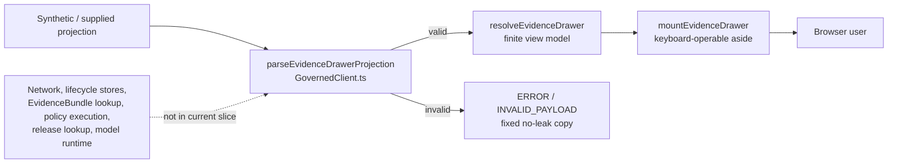
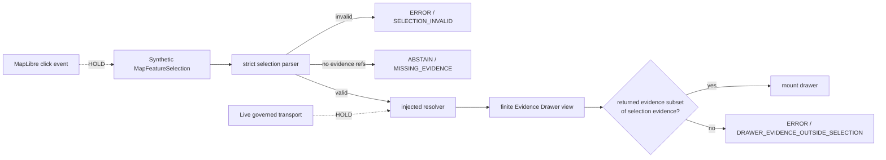

<!-- [KFM_META_BLOCK_V2]
doc_id: kfm://doc/architecture/ui/evidence-drawer
title: Evidence Drawer — UI Projection and Trust-Panel Boundary
type: architecture-reference
version: v2.0-draft
status: draft; repository-grounded; bounded-executable; fixture-first; live-transport-hold; non-authoritative; non-publication
owners:
  - "@bartytime4life — verified CODEOWNERS review route"
  - "NEEDS VERIFICATION — independent UI, accessibility, evidence, policy, review, release, correction, rollback, map-runtime, and security stewardship"
created: 2026-05-14
updated: 2026-08-19
policy_label: public; architecture; ui; evidence-drawer; finite-outcomes; fail-closed; no-release; no-publication
owning_root: docs/
current_path: docs/architecture/ui/EVIDENCE_DRAWER.md
responsibility: "Explain the current Explorer Evidence Drawer projection, parser, finite view model, keyboard-operable panel, no-leak behavior, renderer-neutral selection bridge, and production HOLDs without becoming contract, schema, evidence, policy, review, release, correction, rollback, runtime, deployment, or publication authority."
truth_posture: "CONFIRMED current repository evidence / PROPOSED production composition / UNKNOWN deployed behavior and public use / NEEDS VERIFICATION independent stewardship, live transport, authoritative evidence resolution, policy and release authenticity, integrated map runtime, and production accessibility; cite-or-abstain"
evidence_commit: 1fbb35ccf3f4d9166c815ded78bfd851e3825ece
target_prior_blob: 9b4c43b245cea3979efa7006e2a0e87b4e92db52
directory_rules_blob: fd49a0b83e55cef52c1124281f093e263526898d
adr_0029_blob: a4de0d7a96b78da59cfc499d1025e1508afd8dd9
ui_contract_blob: 412a0a86c85c98748ac08e263a94c7eaac760c04
ui_schema_blob: 4eefa03cffd7d5b97a24df0daf250bc31f7137ca
governed_client_blob: 21f6e4d1225ab0427ecb689d6782f4b56fc25ea2
drawer_implementation_blob: 7746843c259594568fe75e975155a67eb8372e8f
drawer_unit_test_blob: 24b3b4a028d31c37bd6467138ca97a54f3e21d22
drawer_browser_test_blob: 236416b2ccb39820e426a6e774e3962480631833
map_selection_bridge_blob: 18d61ea0ef2fbe2fc2f3cc9d42291c101003037f
map_selection_unit_test_blob: 953bf536f1d3062c194a09855ed3dde4bc9fa311
drawer_validator_blob: 01cb750202924d0893a442a01e66b3a0d18ff6aa
drawer_workflow_blob: b51b20965c8b49c415c0f4138d6056b08dec134c
related:
  - docs/architecture/ui/README.md
  - docs/architecture/ui/BOUNDARIES.md
  - docs/architecture/ui/ACCESSIBILITY.md
  - docs/architecture/ui/map-context-evidence-drawer-admission.md
  - docs/architecture/evidence-drawer.md
  - docs/architecture/map-master/EVIDENCE_DRAWER.md
  - docs/doctrine/directory-rules.md
  - docs/adr/ADR-0029-adopt-directory-governance-standard-v2.md
  - contracts/ui/evidence_drawer_payload.md
  - contracts/evidence/evidence_drawer_payload.md
  - schemas/contracts/v1/ui/evidence_drawer_payload.schema.json
  - fixtures/ui/evidence_drawer_payload/README.md
  - tools/validators/ui/validate_evidence_drawer_payload.py
  - apps/explorer-web/src/adapters/GovernedClient.ts
  - apps/explorer-web/src/features/evidence_drawer/index.tsx
  - apps/explorer-web/src/features/map_runtime/index.tsx
  - apps/explorer-web/tests/evidence-drawer.test.ts
  - apps/explorer-web/tests/map-evidence-drawer.test.ts
  - apps/explorer-web/tests/browser/evidence-drawer.spec.ts
  - .github/workflows/evidence-drawer-payload.yml
tags:
  - kfm
  - architecture
  - ui
  - evidence-drawer
  - EvidenceDrawerPayload
  - EvidenceRef
  - EvidenceBundle
  - finite-outcomes
  - correction-history
  - accessibility
  - no-leak
  - renderer-neutral
notes:
  - "v2.0-draft is a same-path repository-grounded modernization; placement outcome PLACE."
  - "The current executable slice is a deterministic fixture-first public-safe projection parser, finite view-model resolver, keyboard-operable complementary panel, and renderer-neutral synthetic map-selection bridge."
  - "The current slice performs no live network transport, lifecycle-store access, EvidenceRef dereference, policy execution, release lookup, MapLibre source creation, model call, deployment, or publication."
  - "The UI-facing contract is a closed proposed profile; the adjacent evidence-family semantic home remains PATH-NEEDS-REVIEW."
  - "The document path, doc_id, H1, thirteen numbered section families, two appendix families, and related-docs section are retained."
  - "No contract, schema, policy, fixture, validator, test, workflow, app, package, dependency, source, registry, data, release, deployment, publication, or repository setting changes are made by this documentation slice."
[/KFM_META_BLOCK_V2] -->

<a id="top"></a>
<a id="evidence-drawer"></a>

# Evidence Drawer

> **Operating rule.** The Evidence Drawer is Explorer Web's trust-visible projection panel. It may validate and render a bounded public-safe `EvidenceDrawerPayload`; it cannot make the payload true, resolve evidence authority, execute policy, authenticate review, establish release state, issue a correction, perform rollback, or publish a claim.

[](#0-current-repository-evidence)
[](#5-contract--evidencedrawerpayload)
[](#7-policy-finite-outcomes-and-negative-states)
[](#3-click-to-resolution-flow)
[](#3-click-to-resolution-flow)
[](#8-lifecycle-and-release-state-visibility)

| Field | Current repository-grounded result |
|---|---|
| **Evidence snapshot** | `main@1fbb35ccf3f4d9166c815ded78bfd851e3825ece` |
| **Document role** | Human-readable UI architecture reference; not a semantic contract, machine schema, evidence record, policy rule, review record, release record, correction record, rollback record, or runtime gate |
| **Placement** | **CONFIRMED / PLACE:** accepted [ADR-0029](../../adr/ADR-0029-adopt-directory-governance-standard-v2.md) adopts [Directory Rules v2](../../doctrine/directory-rules.md); this existing `docs/architecture/ui/` path remains in the `docs/` explanation root |
| **Current payload profile** | **CONFIRMED present / PROPOSED semantics:** closed profile `kfm.explorer.evidence-drawer.public-safe.v1` |
| **Current browser slice** | **CONFIRMED / BOUNDED:** strict fixture parser, finite view-model resolver, fixed no-leak negative copy, bounded correction/negative history, and keyboard-operable `<aside>` |
| **Current selection bridge** | **CONFIRMED / BOUNDED:** renderer-neutral `MapFeatureSelection`, injected resolver, returned-evidence subset check, finite local failures, and deterministic synthetic controls |
| **Current transport** | **HOLD:** inspected browser code performs no network access; the selection bridge accepts an injected resolver and the repository demonstration supplies deterministic local fixtures |
| **Current evidence resolution** | **NOT ESTABLISHED:** the browser does not dereference `EvidenceRef`, authenticate `EvidenceBundle`, execute policy, authenticate review, or apply a release record |
| **Current map renderer** | **HOLD:** the bounded bridge does not import MapLibre and does not establish a functioning renderer click path |
| **Current accessibility** | Native buttons, labelled complementary landmark, keyboard open/close, Escape handling, focus entry/return, text outcomes, citations, trust/history/limitation lists; broader conformance remains open |
| **Release/publication effect** | None; a payload, parser, fixture, test, workflow, document, pull request, or merge does not create a public claim |
| **Review route** | `@bartytime4life` through current CODEOWNERS; independent specialist review remains **NEEDS VERIFICATION** |

> [!IMPORTANT]
> **Projection is not closure.** The current UI profile can carry finite outcome, reason code, citations, trust labels, and bounded history. It cannot prove that an evidence reference resolved, that evidence is authentic, that policy allowed disclosure, that review occurred, or that a release is public.

> [!CAUTION]
> **The former live click-to-resolution sequence was an architectural target, not current behavior.** Current repository evidence supports a narrower no-network fixture parser and renderer-neutral selection laboratory. This edition preserves the production obligations while marking live transport, authoritative evidence resolution, policy execution, release lookup, and MapLibre composition as HOLD or **NEEDS VERIFICATION**.

> [!WARNING]
> **Negative states are no-leak states.** `DENY`, `ERROR`, malformed payloads, resolver failures, and evidence-scope mismatches must not reflect restricted values, private diagnostics, unsupported summaries, citations, limitations, or historical identifiers into the browser.

## Quick jump

- [0. Current repository evidence](#0-current-repository-evidence)
- [1. Purpose and doctrinal position](#1-purpose-and-doctrinal-position)
- [2. Where the Evidence Drawer sits](#2-where-the-evidence-drawer-sits)
- [3. Click-to-resolution flow](#3-click-to-resolution-flow)
- [4. The drawer is a projection, not a source](#4-the-drawer-is-a-projection-not-a-source)
- [5. Contract — `EvidenceDrawerPayload`](#5-contract--evidencedrawerpayload)
- [6. Trust-membrane boundaries](#6-trust-membrane-boundaries)
- [7. Policy, finite outcomes, and negative states](#7-policy-finite-outcomes-and-negative-states)
- [8. Lifecycle and release-state visibility](#8-lifecycle-and-release-state-visibility)
- [9. Accessibility requirements](#9-accessibility-requirements)
- [10. Validation, tests, fixtures](#10-validation-tests-fixtures)
- [11. Anti-patterns](#11-anti-patterns)
- [12. Related artifacts and proposed file homes](#12-related-artifacts-and-proposed-file-homes)
- [13. Open questions and verification backlog](#13-open-questions-and-verification-backlog)
- [Appendix A — Representative payload shapes](#appendix-a--representative-payload-shapes)
- [Appendix B — Glossary cross-references](#appendix-b--glossary-cross-references)
- [Related docs](#related-docs)

---

## 0. Current repository evidence

### 0.1 What changed since the prior edition

The prior page captured durable KFM doctrine: the drawer is downstream of evidence, public clients must not read canonical stores, negative states are first-class, and accessibility is part of the trust membrane. Its repository claims did not age with the implementation.

| Prior posture or statement | Current repository-grounded disposition |
|---|---|
| Implementation maturity was wholly `UNKNOWN` | **STALE.** A bounded executable fixture-first parser, view model, panel, validator, fixtures, unit tests, browser tests, and selection bridge now exist. |
| Every referenced path was only `PROPOSED` | **STALE.** The target, contract, schema, fixtures, validator, app code, tests, and workflow are repository-present at the pinned snapshot. Their semantics and production admission remain proposed or bounded. |
| A click invokes a live governed claim-resolution route | **NOT ESTABLISHED.** Current browser code has no transport; the map bridge accepts an injected resolver. |
| MapLibre supplies the active click path | **HOLD.** The bridge is renderer-neutral and fixture-driven; no renderer import is present in the inspected bridge. |
| The payload carries `feature_id`, `layer_id`, `bundle_ref`, nested `decision`, release-manifest references, rollback references, typed conflicts, and typed caveats | **STALE shape.** Those fields are not members of the current closed UI schema. |
| Focus trap, reduced motion, non-map parity, axe coverage, and full screen-reader behavior are current requirements already implemented | **TARGET ONLY.** Current proof is narrower: native controls, labelled complementary landmark, Escape dismissal, focus entry/return, and fixed finite text states. |
| `PUBLISHED` state can be inferred from a payload release string | **DENY.** The profile carries a release declaration; it does not authenticate a `ReleaseManifest` or public release. |

### 0.2 Current evidence matrix

| Surface | CONFIRMED repository evidence | Safe conclusion |
|---|---|---|
| [`contracts/ui/evidence_drawer_payload.md`](../../../contracts/ui/evidence_drawer_payload.md) | Draft v0.3 UI projection semantics, exact finite profile, correction rules, validation commands, and explicit non-effects | Strongest current UI-facing semantic description; still `PROPOSED` and not evidence closure |
| [`schemas/contracts/v1/ui/evidence_drawer_payload.schema.json`](../../../schemas/contracts/v1/ui/evidence_drawer_payload.schema.json) | Closed Draft 2020-12 shape with exact profile, four outcomes, bounded trust state, HTTPS citations, and optional bounded history | Machine-declared fixture profile exists; upstream authenticity and release are not proved |
| [`GovernedClient.ts`](../../../apps/explorer-web/src/adapters/GovernedClient.ts) | Strict parser for `kfm.explorer.evidence-drawer.public-safe.v1`; no transport or lifecycle-store access | App adapter fails closed over supplied objects |
| [`evidence_drawer/index.tsx`](../../../apps/explorer-web/src/features/evidence_drawer/index.tsx) | Finite resolver and keyboard-operable complementary panel with fixed no-leak copy | Bounded app-local projection exists; it is not a complete production drawer |
| [`map_runtime/index.tsx`](../../../apps/explorer-web/src/features/map_runtime/index.tsx) | Strict renderer-neutral selection parser, injected resolver, evidence-subset check, finite local failures, and synthetic controls | Bounded selection-to-drawer laboratory exists without renderer or live service |
| [`evidence-drawer.test.ts`](../../../apps/explorer-web/tests/evidence-drawer.test.ts) | Source tests cover corrected answer, stale abstention, superseded history, deny/error no-leak, malformed payloads, contradictory profiles, size bounds, and forbidden access patterns | Intended bounded behavior is inspectable; this documentation change does not itself execute the suite |
| [`map-evidence-drawer.test.ts`](../../../apps/explorer-web/tests/map-evidence-drawer.test.ts) | Source tests cover strict selection, missing refs, denial, out-of-scope evidence, resolver failure, and renderer/network/store exclusions | Selection scoping and fail-closed behavior are fixture-backed |
| Browser test source | Keyboard open/close, focus entry/return, citations, correction history, and denial/error no-leak behavior are represented | Browser expectations exist; app-wide accessibility and production assistive-technology parity remain open |
| [`validate_evidence_drawer_payload.py`](../../../tools/validators/ui/validate_evidence_drawer_payload.py) | No-network closed-schema and cross-field validator with correction-chain and no-leak checks | Declaration consistency can be checked without resolving evidence |
| [Focused workflow](../../../.github/workflows/evidence-drawer-payload.yml) | Read-only path-scoped orchestration for schema, fixtures, tests, and authoring-receipt integrity | Workflow presence or success is not release approval, public-use permission, or publication proof |

### 0.3 Documentation responsibility split

Three current pages discuss the Evidence Drawer. Their responsibilities should remain explicit until a separately reviewed convergence decision changes them.

| Page | Primary responsibility | Current disposition |
|---|---|---|
| This page | Explorer UI projection, view model, panel behavior, accessibility slice, and no-leak browser boundary | Same-path repository-grounded modernization |
| [`../evidence-drawer.md`](../evidence-drawer.md) | Cross-cutting Evidence Drawer architecture and current whole-feature boundary | Repository-grounded companion |
| [`../map-master/EVIDENCE_DRAWER.md`](../map-master/EVIDENCE_DRAWER.md) | Renderer-neutral map-selection-to-drawer seam and map-master obligations | Repository-grounded companion |

This update does not silently consolidate, supersede, move, rename, or delete either companion. Duplication and long-term canonical division remain a documented follow-up rather than an authority change hidden inside one page.

### 0.4 Truth labels and non-effects

- **CONFIRMED** — verified from the pinned repository state or accepted placement decision.
- **PROPOSED** — architecture, profile meaning, production composition, or future work not established as accepted runtime authority.
- **UNKNOWN** — insufficient evidence to state current deployed, public, or operational behavior.
- **NEEDS VERIFICATION** — a concrete repository, runtime, policy, rights, review, release, accessibility, security, or deployment check remains.

This page does not resolve evidence, execute policy, authenticate review, approve release, mutate lifecycle state, authorize sensitive detail, emit a correction, perform rollback, create a route, admit a renderer, deploy a service, or publish anything.

[Back to top](#top)

---

## 1. Purpose and doctrinal position

The Evidence Drawer is the browser-side inspection surface for one governed, public-safe `EvidenceDrawerPayload`. Its current executable responsibility is intentionally narrow:

1. parse one closed projection profile without accepting unknown fields;
2. convert it into one finite view model;
3. render a labelled complementary panel using safe text, references, citations, trust labels, limitations, and bounded history permitted by the outcome;
4. suppress untrusted detail for denied, errored, malformed, or contradictory inputs; and
5. preserve keyboard open/close and focus return for the bounded fixture surface.

The target production responsibility is broader: a released map feature, badge, table row, Focus citation, or other consequential surface may scope a governed request whose result opens the same drawer. That composition remains **PROPOSED** until live transport, evidence resolution, policy, review, release, correction, accessibility, and security evidence close.

| Property | Current result | Authority limit |
|---|---|---|
| Projection | Closed public-safe UI profile | Does not create or authenticate evidence |
| Outcome | `ANSWER`, `ABSTAIN`, `DENY`, or `ERROR` | Finite UI state, not publication state |
| Evidence support | Bounded safe identifiers and HTTPS citation links when permitted | No browser dereference or authenticity check |
| Trust visibility | Source role, policy, review, release, freshness, and correction labels | Declarations only; not underlying records |
| History | Bounded negative outcomes and correction edges | Audit projection only; not correction authority |
| Accessibility | Native buttons, complementary landmark, accessible naming, live announcement, Escape close, focus entry/return | Not full focus trapping, WCAG conformance, or app-wide parity |
| Current integration | Local deterministic fixture composition and renderer-neutral selection laboratory | No authenticated live service, renderer, or public operation |

Two KFM invariants remain controlling:

- **Cite or abstain.** A consequential answer requires admissible evidence and citations; absent or stale support remains visible as a finite non-answer.
- **The renderer is downstream of trust.** A pixel, feature property, popup, badge, selection, screenshot, graph edge, generated summary, or model response is request context or a carrier—not evidence authority.

[Back to top](#top)

---

## 2. Where the Evidence Drawer sits

### 2.1 Current bounded composition

The current repository-proved path is local and fixture-first:


```mermaid
flowchart LR
    F["Synthetic / supplied projection"] --> P["parseEvidenceDrawerProjection<br/>GovernedClient.ts"]
    P -->|valid| V["resolveEvidenceDrawer<br/>finite view model"]
    P -->|invalid| X["ERROR / INVALID_PAYLOAD<br/>fixed no-leak copy"]
    V --> M["mountEvidenceDrawer<br/>keyboard-operable aside"]
    M --> U["Browser user"]

    N["Network, lifecycle stores,<br/>EvidenceBundle lookup, policy execution,<br/>release lookup, model runtime"] -. "not in current slice" .-> P
```

The dashed path is intentionally absent from the current browser slice.

### 2.2 Current renderer-neutral selection laboratory

The map-runtime feature contains a second bounded path:


```mermaid
flowchart LR
    S["Synthetic MapFeatureSelection"] --> Q["strict selection parser"]
    Q -->|invalid| I["ERROR / SELECTION_INVALID"]
    Q -->|no evidence refs| A["ABSTAIN / MISSING_EVIDENCE"]
    Q -->|valid| R["injected resolver"]
    R --> D["finite Evidence Drawer view"]
    D --> C{"returned evidence subset<br/>of selection evidence?"}
    C -->|yes| U["mount drawer"]
    C -->|no| O["ERROR / DRAWER_EVIDENCE_OUTSIDE_SELECTION"]

    ML["MapLibre click event"] -. "HOLD" .-> S
    API["Live governed transport"] -. "HOLD" .-> R
```

The selection laboratory proves scope validation and fail-closed browser behavior before a renderer or transport is admitted. It does not establish that a real MapLibre click, public feature, authenticated caller, governed API route, or authoritative resolver exists.

### 2.3 Target production composition

A future production path may be:

```text
released public-safe carrier
  -> renderer-neutral selection candidate
  -> authenticated governed request
  -> EvidenceRef resolution and evidence authenticity checks
  -> rights / sensitivity / policy / review / release / correction checks
  -> public-safe EvidenceDrawerPayload
  -> strict browser parser
  -> finite drawer view
```

Every arrow before the public-safe projection is upstream of the browser and remains separately governed. The target sequence is a graduation plan, not current runtime evidence.

[Back to top](#top)

---

## 3. Click-to-resolution flow

### 3.1 The current selection contract

`MapFeatureSelection` is renderer-neutral and deliberately small. Its wire form contains exactly:

| Field | Meaning | Current rule |
|---|---|---|
| `profile` | Exact selection profile | Must equal `kfm.explorer.map-feature-selection.v1` |
| `selection_id` | Stable bounded selection identity | Safe identifier; no spaces or raw content |
| `layer_id` | Layer declaration associated with the selection | Context only; not a release proof |
| `feature_id` | Feature declaration associated with the selection | Context only; not evidence |
| `evidence_refs` | Bounded evidence identifiers permitted for this selection | Unique, maximum 16; may be empty and cause abstention |

Raw renderer properties, geometry, source payloads, popup text, policy decisions, release records, prompts, and model output do not cross this browser selection boundary.

### 3.2 Current finite behavior

| Condition | Current bridge result | Drawer posture |
|---|---|---|
| Selection malformed | `SELECTION_INVALID` | Fixed local `ERROR / UPSTREAM_ERROR` projection |
| Selection has no governed evidence ref | `MISSING_EVIDENCE` | `ABSTAIN` without calling the resolver |
| Injected resolver returns supported in-scope evidence | `SUPPORTED` | Render bounded `ANSWER` projection |
| Injected resolver returns policy denial | Drawer reason, such as `SENSITIVE_DETAIL_RESTRICTED` | Preserve `DENY` with fixed no-leak copy |
| Resolver throws | `GOVERNED_RESOLVER_ERROR` | Fixed local `ERROR / UPSTREAM_ERROR` projection; private exception text suppressed |
| Returned drawer evidence exceeds selected evidence scope | `DRAWER_EVIDENCE_OUTSIDE_SELECTION` | Fixed local `ERROR / UPSTREAM_ERROR` projection |

Bridge codes such as `SELECTION_INVALID`, `GOVERNED_RESOLVER_ERROR`, and `DRAWER_EVIDENCE_OUTSIDE_SELECTION` are app-local resolution codes. They are not members of the current `EvidenceDrawerPayload.reason_code` enum.

### 3.3 What is not established

- a live `/claims/resolve` route or any equivalent active route;
- authenticated transport from Explorer to Governed API;
- a functioning MapLibre click translation;
- authoritative EvidenceRef-to-EvidenceBundle resolution;
- source-rights, sensitivity, policy, reviewer, or release authentication;
- production caching, cancellation, concurrency, retry, telemetry, or incident behavior;
- Focus Mode launch or correction-submission handoff;
- a deployed public claim path.

The browser must not fill these gaps with feature properties, direct store reads, local policy inference, or model calls.

[Back to top](#top)

---

## 4. The drawer is a projection, not a source

`EvidenceDrawerPayload` is a public-safe UI projection. The canonical evidence family remains upstream and separate.

| Responsibility | Owning surface | Current boundary |
|---|---|---|
| UI projection meaning | [`contracts/ui/evidence_drawer_payload.md`](../../../contracts/ui/evidence_drawer_payload.md) | Current bounded profile; still draft / proposed |
| Evidence-family sibling meaning | [`contracts/evidence/evidence_drawer_payload.md`](../../../contracts/evidence/evidence_drawer_payload.md) | Repository-present `PATH-NEEDS-REVIEW`; final semantic split unresolved |
| Machine shape | [`schemas/contracts/v1/ui/evidence_drawer_payload.schema.json`](../../../schemas/contracts/v1/ui/evidence_drawer_payload.schema.json) | Closed machine profile for the UI projection |
| Evidence closure | EvidenceBundle / EvidenceRef contracts and governed resolver surfaces | Not performed by the drawer |
| Policy and disclosure | `policy/` and governed runtime | Not recomputed in the browser |
| Review, release, correction, rollback | Their distinct contracts, records, and runtime checks | Projected labels do not authenticate the underlying records |
| Browser presentation | [`apps/explorer-web/src/features/evidence_drawer/`](../../../apps/explorer-web/src/features/evidence_drawer/) | Current finite view-model and panel implementation |

### Projection rules

1. Unknown fields fail closed; the browser does not retain an open-ended provider or server payload.
2. The profile may carry public-safe evidence identifiers and citations; the browser does not dereference them as canonical evidence.
3. The browser never upgrades `ABSTAIN`, `DENY`, `ERROR`, held, stale, superseded, revoked, or withdrawn state into an answer.
4. Current evidence and historical negative/correction records remain separate identities.
5. `DENY`, `ERROR`, malformed payloads, scope mismatches, and resolver failures use fixed copy and suppress untrusted detail.
6. Trust labels describe declared source role, policy, review, release, freshness, and correction state without acting as those authorities.
7. Schema validity is necessary for the bounded profile and insufficient for truth, public release, or publication.

### Contract-home HOLD

The repository contains both a UI-facing semantic contract and an evidence-family sibling. This page follows the current closed UI profile for exact behavior while preserving the authority seam as **HOLD / NEEDS VERIFICATION**. It does not create a third contract, silently supersede either existing contract, or resolve the final home by repetition.

[Back to top](#top)

---

<a id="5-contract--evidencedrawerpayload"></a>

## 5. Contract — `EvidenceDrawerPayload`

### 5.1 Exact current wire profile

The current schema is closed with `additionalProperties: false`. Required top-level fields are:

| Field | Machine constraint | Current UI meaning |
|---|---|---|
| `profile` | Exact constant | `kfm.explorer.evidence-drawer.public-safe.v1` |
| `id` | Bounded safe identifier | Projection identity; not an EvidenceBundle identity |
| `outcome` | Closed enum | `ANSWER`, `ABSTAIN`, `DENY`, or `ERROR` |
| `reason_code` | Closed enum | Public-safe reason governing the finite view |
| `title` | 1–160 characters | Governed display title; suppressed by fixed copy for negative/no-leak states |
| `summary` | 1–500 characters | Governed display summary; suppressed by fixed copy where required |
| `evidence_refs` | Unique array, maximum 16 | Public-safe identifiers permitted by the outcome |
| `citations` | Array, maximum 16; HTTPS only | Public-safe labelled links permitted by the outcome |
| `limitations` | Array, maximum 16; bounded text | Public-safe caveats; negative browser states use fixed limitation copy |
| `trust_state` | Closed object | Source-role, policy, review, release, freshness, and correction declarations |

Optional `history` is a closed object containing `negative_outcomes` and `corrections`.

### 5.2 Trust-state enums

| Field | Allowed values |
|---|---|
| `source_role` | `authoritative`, `official`, `derived`, `context` |
| `policy` | `ALLOW`, `ABSTAIN`, `DENY`, `ERROR` |
| `review` | `REVIEWED`, `PENDING`, `NOT_APPLICABLE` |
| `release` | `RELEASED`, `UNRELEASED`, `WITHDRAWN` |
| `freshness` | `CURRENT`, `STALE`, `UNKNOWN` |
| `correction` | `NONE`, `CURRENT`, `CORRECTED`, `SUPERSEDED` |

These values are declarations in a UI projection. `release = RELEASED` is not a release-manifest lookup; `review = REVIEWED` is not reviewer authentication; `policy = ALLOW` is not evidence that a policy engine ran.

### 5.3 Reason-code enum

```text
SUPPORTED
MISSING_EVIDENCE
STALE_EVIDENCE
CITATION_UNRESOLVED
POLICY_DENIED
RIGHTS_UNRESOLVED
SENSITIVE_DETAIL_RESTRICTED
UPSTREAM_ERROR
HELD_EVIDENCE
SUPERSEDED_EVIDENCE
WITHDRAWN_EVIDENCE
REVOKED_EVIDENCE
```

### 5.4 Optional bounded history

A negative-history entry contains exactly:

```text
evidence_ref
state = HELD | DENIED | SUPERSEDED | REVOKED | WITHDRAWN
reason_code
recorded_at = canonical UTC second
visible_in_runtime = true
resolvable_as_current = false
```

A correction entry contains exactly:

```text
prior_evidence_ref
active_evidence_ref
status = ACTIVE_CORRECTION
recorded_at = canonical UTC second
```

Current validator and parser rules require negative-history identities to remain distinct from current support, correction edges to be acyclic and non-self-referential, prior correction targets to be represented as superseded history, and terminal correction targets to bind current evidence for a corrected answer.

### 5.5 Outcome consistency

| Outcome | Current required declaration | Browser posture |
|---|---|---|
| `ANSWER` | `SUPPORTED`; nonempty evidence and citations; `policy=ALLOW`; `review=REVIEWED`; `release=RELEASED`; `freshness=CURRENT`; correction rules satisfied | Render governed title, summary, evidence refs, citations, limitations, trust labels, and safe history |
| `ABSTAIN` | Non-supported reason and `policy=ABSTAIN` | Render fixed reason copy; may retain safe refs/history where the profile allows |
| `DENY` | Non-supported reason and `policy=DENY`; no evidence refs, citations, or history | Render fixed no-leak copy only |
| `ERROR` | `UPSTREAM_ERROR` and `policy=ERROR`; no evidence refs, citations, or history | Render fixed no-leak error copy; never fall back to an answer |

Malformed or internally contradictory input becomes app-local `ERROR / INVALID_PAYLOAD`; absent input becomes app-local `ABSTAIN / NO_GOVERNED_RESPONSE`. Neither local code is a member of the wire `reason_code` enum.

### 5.6 Fields from the prior page that are not current profile members

| Prior field or object | Current disposition |
|---|---|
| `feature_id`, `layer_id`, `opened_from` | Selection/context belongs outside the current drawer payload; renderer-neutral selection is represented separately by `MapFeatureSelection` |
| nested `decision` / `DecisionEnvelope` | Current drawer profile carries top-level `outcome` and `reason_code`; no nested decision object is present |
| `bundle_ref`, `source_summary`, `evidence_bundle_refs` | Not in the current closed profile; evidence closure remains upstream |
| `release_manifest_ref`, `rollback_card_ref`, `review_ref`, `policy_decision_ref` | Not in the current profile; may require a future versioned contract/schema change |
| `conflicts[]`, `caveats[]`, `transforms[]`, `related_manifests[]` | Not typed members of the current profile; public-safe limitations exist as bounded text |
| `audit_ref`, `drawer_id` with `kfm://` URI requirement | Current field is bounded `id`; no audit reference is defined |

A future profile may add trust-object references only through coordinated contract, schema, fixtures, validator, parser, tests, compatibility, and review work. Architecture prose must not pre-admit fields the closed schema rejects.

[Back to top](#top)

---

## 6. Trust-membrane boundaries

The current source tree contains useful bounded anti-bypass checks, but source structure is not deployment security certification.

| Boundary | Current drawer MAY | Current drawer MUST NOT |
|---|---|---|
| Supplied public-safe projection | Strictly parse and render a finite view | Accept unknown fields or silently coerce contradictions |
| Evidence identifiers | Display safe identifiers when the outcome permits | Dereference canonical evidence or infer truth from identifiers |
| HTTPS citations | Render supplied labelled links for an answer | Validate citation authority in the browser or expose links in denied/error states |
| Trust state | Render text labels | Recompute policy, review, release, freshness, or correction meaning |
| Negative history | Show bounded safe history when permitted | Treat held, denied, superseded, revoked, or withdrawn evidence as current support |
| Sensitive detail | Render only the already filtered projection | Reconstruct exact geometry or reflect denial detail |
| Map selection | Validate a renderer-neutral bounded candidate | Treat raw feature properties, pixels, style state, or popup text as evidence |
| Model runtime | — | Call Ollama, OpenAI, or another model directly |
| Lifecycle and canonical stores | — | Read RAW, WORK, QUARANTINE, PROCESSED, catalog/triplet internals, proof stores, release internals, or canonical databases directly |

### Current enforcement and its limits

- Browser code explicitly performs no network or lifecycle-store access in the bounded feature slice.
- Tests scan the inspected feature sources for selected forbidden `fetch`, lifecycle-path, renderer-import, and model-runtime patterns.
- Closed parsing rejects unknown fields, unsafe identifiers, oversized arrays, invalid citations, control characters, noncanonical timestamps, duplicate history, and correction cycles.
- Returned drawer evidence must stay inside the evidence set declared by the renderer-neutral selection.
- Fixed negative copy suppresses untrusted title, summary, limitation, citation, history, and exception detail for denied/error/local-failure paths.

These checks do not prove network isolation, authentication, authorization, CSP, CORS, dependency closure, database permissions, object-store policy, cache safety, or production egress controls. Those remain operational and security evidence outside this page.

[Back to top](#top)

---

## 7. Policy, finite outcomes, and negative states

### 7.1 Finite outcome matrix

| Outcome | Typical current reason codes | Trust-state posture | Browser behavior |
|---|---|---|---|
| `ANSWER` | `SUPPORTED` | Allow + reviewed + released + current | Render supplied public-safe claim projection |
| `ABSTAIN` | `MISSING_EVIDENCE`, `STALE_EVIDENCE`, `CITATION_UNRESOLVED`, `HELD_EVIDENCE`, `SUPERSEDED_EVIDENCE`, `WITHDRAWN_EVIDENCE`, `REVOKED_EVIDENCE` | `policy=ABSTAIN` | Render fixed explanation; preserve only profile-permitted refs/history |
| `DENY` | `POLICY_DENIED`, `RIGHTS_UNRESOLVED`, `SENSITIVE_DETAIL_RESTRICTED` | `policy=DENY` | Fixed no-leak copy; no refs, citations, or history |
| `ERROR` | `UPSTREAM_ERROR` | `policy=ERROR` | Fixed no-leak copy; no refs, citations, or history |

`HOLD`, `RESTRICTED`, `STALE`, `EMPTY`, and similar words may describe domain or UI conditions elsewhere, but they are not additional top-level outcomes in the current drawer profile. Held, stale, superseded, withdrawn, and revoked conditions are represented through the four finite outcomes, reason code, trust state, and bounded history.

### 7.2 Fixed no-leak browser copy

The current view model maps negative reason codes to bounded fixed messages. It does not render the supplied title or summary for a non-answer path. This protects against reflected sensitive or diagnostic content.

| Reason | Fixed public-safe meaning |
|---|---|
| `MISSING_EVIDENCE` | Required evidence is not available. |
| `STALE_EVIDENCE` | Available evidence is stale for this request. |
| `CITATION_UNRESOLVED` | One or more required citations could not be resolved. |
| `POLICY_DENIED` | Policy does not permit this evidence detail to be shown. |
| `RIGHTS_UNRESOLVED` | Source rights are not resolved for this evidence detail. |
| `SENSITIVE_DETAIL_RESTRICTED` | Sensitive detail is restricted. |
| `UPSTREAM_ERROR` | The governed evidence service could not complete the request. |
| `HELD_EVIDENCE` | Evidence is held for review and is not current claim support. |
| `SUPERSEDED_EVIDENCE` | The available evidence is superseded and is shown only as history. |
| `WITHDRAWN_EVIDENCE` | The available evidence was withdrawn and is not current claim support. |
| `REVOKED_EVIDENCE` | The available evidence was revoked and is not current claim support. |

### 7.3 History is not current support

Every negative-history entry declares `resolvable_as_current=false`. A current evidence ref may not also be a negative-history ref. For a corrected answer, only the terminal target of an acyclic correction chain may be current support; prior and intermediate identities remain superseded history.

This is local declaration validation. The current browser does not resolve a correction registry, authenticate a `CorrectionNotice`, prove timestamps, invalidate caches, or establish public propagation.

### 7.4 Policy display is not policy execution

The drawer displays one declared policy label. It does not determine rights, sovereignty, sensitivity, access role, audience, purpose, release eligibility, or geometry precision. A future production caller must complete those checks before constructing the projection.

[Back to top](#top)

---

## 8. Lifecycle and release-state visibility

The KFM lifecycle remains upstream of the browser:

```text
RAW -> WORK / QUARANTINE -> PROCESSED -> CATALOG / TRIPLET
    -> governed release
    -> governed API or released public-safe carrier
    -> EvidenceDrawerPayload
    -> Explorer parser and drawer
```

The current payload carries `trust_state.release` with `RELEASED`, `UNRELEASED`, or `WITHDRAWN`. That field is a bounded declaration used for profile consistency. It is not a release object, digest binding, signature, active-release lookup, correction lookup, or rollback target.

| Declared state | Current finite use | What remains unproved |
|---|---|---|
| `RELEASED` | Required by a current `ANSWER` fixture | Existence, authenticity, audience, public status, active version, digest, policy, review, correction, and rollback of the release |
| `UNRELEASED` | Used by non-answer/local failure fixtures | Whether an upstream candidate exists or is eligible for review |
| `WITHDRAWN` | May support a non-answer and historical visibility | Authenticated withdrawal, cache invalidation, client propagation, and rollback execution |

### Current correction visibility

The profile can display bounded negative outcomes and correction edges. It cannot issue a correction, authenticate a notice, choose an active release, or mutate history. Corrections remain append-only lineage in their owning system; the drawer is only a public-safe projection surface.

### Graduation burden for release-bound trust links

Adding explicit `ReleaseManifest`, review, policy-decision, correction-notice, or rollback-card references to a later profile requires:

1. accepted or reviewable semantic ownership;
2. closed machine shapes and compatibility rules;
3. resolvable identities and digest/canonicalization rules;
4. positive and negative fixtures;
5. validator and browser-parser parity;
6. policy, rights, sensitivity, audience, and no-leak review;
7. correction/withdrawal/cache propagation tests; and
8. a rollback target for the profile change.

Until those gates close, this page must not imply that such references are current fields.

[Back to top](#top)

---

## 9. Accessibility requirements

Accessibility is part of the trust membrane because users must be able to perceive and operate finite outcome, evidence, citation, limitation, trust, and correction state. Current proof is bounded and must not be inflated into a conformance claim.

### 9.1 Confirmed bounded behavior

| Current behavior | Evidence-backed result |
|---|---|
| Native controls | Separate open and close `<button>` elements |
| Landmark | Drawer is an `<aside role="complementary">` with accessible labelling |
| Focus entry | Opening moves focus to the close button |
| Keyboard dismissal | Escape closes the drawer |
| Focus restoration | Closing returns focus to the prior connected element or trigger |
| State announcement | `aria-live` is polite for normal/abstain/deny states and assertive for errors |
| Structured lists | Trust state, evidence refs, citations, history, and limitations have labelled lists |
| Link purpose | Citation labels become visible link text |
| Finite text | Outcome and reason code are rendered as text; trust state is not color-only |
| Browser tests | Keyboard open, focus entry, Escape close, focus return, answer content, citations, history, and deny/error no-leak are represented |

### 9.2 Not established

| Target or claim | Current status |
|---|---|
| Modal dialog semantics or focus trap | **NOT IMPLEMENTED:** current surface is a non-modal complementary panel |
| Whole-shell keyboard completion | **UNKNOWN** |
| Non-map feature-selection alternative | **PROPOSED / NEEDS VERIFICATION** |
| Reduced-motion behavior | **PROPOSED / NEEDS VERIFICATION** |
| Automated axe/rule-engine pass | **HOLD:** accessibility workflow is explicitly non-enforcing |
| Screen-reader, magnification, high-contrast, voice-control, and cognitive-accessibility parity | **UNKNOWN** |
| Responsive narrow-viewport, zoom, and reflow behavior | **UNKNOWN** |
| WCAG 2.2 AA conformance | **UNKNOWN / not claimed** |
| Independent assistive-technology review | **NEEDS VERIFICATION** |

### 9.3 Accessibility failure posture

A trust-bearing state must not depend on color, motion, pointer input, map-only selection, or reflected diagnostic text. Where the supported accessibility path is absent or unverified, release-significant claims remain on HOLD rather than being declared conformant from one fixture test.

[Back to top](#top)

---

## 10. Validation, tests, fixtures

### 10.1 Confirmed repository surfaces

| Layer | Current path | Bounded responsibility |
|---|---|---|
| Semantic contract | `contracts/ui/evidence_drawer_payload.md` | UI projection meaning and non-effects |
| Machine schema | `schemas/contracts/v1/ui/evidence_drawer_payload.schema.json` | Closed Draft 2020-12 shape |
| Reusable fixtures | `fixtures/ui/evidence_drawer_payload/` | Synthetic valid/invalid candidates and expected finding codes |
| Validator | `tools/validators/ui/validate_evidence_drawer_payload.py` | No-network schema and cross-field checks |
| Validator tests | `tests/validators/test_validate_evidence_drawer_payload.py` | Fixture polarity, deterministic and semantic validation expectations |
| App parser | `apps/explorer-web/src/adapters/GovernedClient.ts` | Exact profile parsing and normalization |
| Drawer feature | `apps/explorer-web/src/features/evidence_drawer/index.tsx` | Finite view model and keyboard-operable panel |
| Selection bridge | `apps/explorer-web/src/features/map_runtime/index.tsx` | Renderer-neutral selection and evidence-scope guard |
| Drawer unit tests | `apps/explorer-web/tests/evidence-drawer.test.ts` | Finite states, history, no-leak, and forbidden access patterns |
| Selection unit tests | `apps/explorer-web/tests/map-evidence-drawer.test.ts` | Selection strictness, scope, resolver failures, and renderer/network exclusion |
| Drawer browser tests | `apps/explorer-web/tests/browser/evidence-drawer.spec.ts` | Bounded keyboard/focus/content/no-leak behavior |
| Workflow | `.github/workflows/evidence-drawer-payload.yml` | Read-only fixture/profile validation and authoring-receipt integrity |

### 10.2 Repository-native commands

```bash
python tools/validators/ui/validate_evidence_drawer_payload.py --fixtures
python -m unittest -q tests.validators.test_validate_evidence_drawer_payload
pnpm --filter explorer-web build
pnpm --filter explorer-web test
```

These commands validate the bounded profile and Explorer implementation when run in a complete checkout with declared dependencies. A documentation-only authoring environment must report them as not run rather than infer success from file presence.

### 10.3 What the current tests are designed to prove

- strict closed-profile parsing and safe normalization;
- all four finite outcomes and current reason-code combinations;
- corrected answer, stale abstention, superseded history, restricted denial, and upstream error fixtures;
- negative-history/current-support separation;
- correction-chain acyclicity and terminal-target binding;
- denial/error/malformed/resolver-failure no-leak behavior;
- bounded arrays, safe identifiers, HTTPS citations, canonical timestamps, duplicate-key and non-finite-number denial;
- renderer-neutral selection parsing and returned-evidence subset checks;
- no direct network, lifecycle-store, renderer, or model-runtime imports in the bounded browser paths;
- native keyboard open/close, focus entry/return, citations, and bounded history rendering.

### 10.4 What a pass does not prove

A passing validator, unit test, browser test, build, workflow, generated receipt, pull request, or merge does not:

- resolve or authenticate an `EvidenceRef` or `EvidenceBundle`;
- execute or authenticate policy;
- establish accountable review;
- authenticate a release, correction, withdrawal, or rollback record;
- prove deployed isolation, transport, authentication, or authorization;
- admit a renderer or model provider;
- establish accessibility conformance;
- release, deploy, publish, or authorize public use.

### 10.5 Documentation validation for this page

This same-path documentation change should be checked for:

- valid `KFM_META_BLOCK_V2` structure;
- retained `doc_id`, H1, section families, and local fragments;
- local link and case resolution;
- balanced code fences and parseable JSON examples;
- structurally consistent Markdown tables;
- no tabs, trailing whitespace, or missing final newline;
- generated authoring-receipt path/hash closure; and
- hosted exact-head documentation and aggregate checks, reported separately from human review.

[Back to top](#top)

---

## 11. Anti-patterns

| # | Anti-pattern | Why it is forbidden |
|---:|---|---|
| 1 | Describing the fixture parser as a live governed client | It performs no transport or authoritative evidence resolution |
| 2 | Describing the renderer-neutral selection bridge as a functioning MapLibre click path | The bridge imports no renderer and uses deterministic synthetic controls |
| 3 | Treating feature properties, pixels, popups, badges, or selection context as evidence | They scope a request; they do not support a claim |
| 4 | Adding architecture-only fields to examples that the closed schema rejects | Prose must follow the contract/schema boundary rather than create a shadow profile |
| 5 | Treating `release=RELEASED`, `review=REVIEWED`, or `policy=ALLOW` as authenticated authority | They are projection declarations until their owning records are resolved |
| 6 | Rendering supplied negative-state title, summary, limitations, citations, history, or exception text | Denied/error/local-failure states require fixed no-leak copy |
| 7 | Exposing denied/error evidence refs, citations, or history identifiers | Current profile explicitly forbids those leaks |
| 8 | Letting negative history resolve as current support | Every negative record declares `resolvable_as_current=false` |
| 9 | Browser-side EvidenceRef dereference, policy evaluation, review inference, release lookup, or model invocation | Violates the trust membrane |
| 10 | Calling the current complementary panel a modal dialog with a focus trap | Current implementation is non-modal and does not implement a trap |
| 11 | Claiming WCAG conformance from one bounded Playwright fixture | Whole-application and manual assistive-technology evidence remain open |
| 12 | Using style filters, color, or hidden DOM as a sensitivity gate | Disclosure is an upstream policy decision, not a render trick |
| 13 | Hiding abstention, stale, held, superseded, withdrawn, or revoked state | Negative state is an inspectable governance signal |
| 14 | Treating a passing workflow or authoring receipt as review, release, or publication | Object-family and state-transition boundaries remain separate |
| 15 | Silently consolidating this page with cross-cutting or map-master companions | Documentation convergence requires an explicit scope and compatibility decision |

[Back to top](#top)

---

## 12. Related artifacts and proposed file homes

The heading is retained for fragment compatibility. The table below now distinguishes **CONFIRMED repository homes** from unresolved authority or integration questions rather than presenting every path as merely proposed.

| Responsibility | Current repository home | Status and boundary |
|---|---|---|
| UI architecture page | `docs/architecture/ui/EVIDENCE_DRAWER.md` | **CONFIRMED / PLACE:** this page; UI-local projection and panel boundary |
| Cross-cutting architecture | `docs/architecture/evidence-drawer.md` | **CONFIRMED companion:** whole-feature architecture and implementation boundary |
| Map-selection architecture | `docs/architecture/map-master/EVIDENCE_DRAWER.md` | **CONFIRMED companion:** renderer-neutral selection-to-drawer seam |
| UI projection semantics | `contracts/ui/evidence_drawer_payload.md` | **CONFIRMED present / PROPOSED semantics:** current closed profile |
| Evidence-family sibling semantics | `contracts/evidence/evidence_drawer_payload.md` | **CONFIRMED present / PATH-NEEDS-REVIEW:** final split unresolved |
| Machine profile | `schemas/contracts/v1/ui/evidence_drawer_payload.schema.json` | **CONFIRMED present / PROPOSED profile:** closed machine shape |
| Synthetic declarations | `fixtures/ui/evidence_drawer_payload/` | **CONFIRMED present:** reusable valid/invalid fixtures only |
| Deterministic validator | `tools/validators/ui/validate_evidence_drawer_payload.py` | **CONFIRMED present:** no-network declaration validation |
| Browser parser and view | `apps/explorer-web/src/adapters/GovernedClient.ts`; `apps/explorer-web/src/features/evidence_drawer/` | **CONFIRMED bounded executable:** no live transport or evidence closure |
| Selection laboratory | `apps/explorer-web/src/features/map_runtime/` | **CONFIRMED bounded executable:** renderer-neutral, injected resolver, synthetic UI |
| Tests | `tests/validators/`; `apps/explorer-web/tests/` | **CONFIRMED source presence:** exact-head execution remains separate evidence |
| Focused workflow | `.github/workflows/evidence-drawer-payload.yml` | **CONFIRMED present:** read-only profile checks; not release/publication authority |
| Policy, evidence, review, release, correction, rollback | Their owning contract, policy, data, and release lanes | **HOLD for production composition:** not authenticated by the browser profile |

### 12.1 Change propagation

A material change to the current public-safe profile is dependency-bearing. At minimum, reviewers should reconcile:

| Surface | Required action |
|---|---|
| UI semantic contract | Change meaning, compatibility, and non-effects deliberately |
| Closed schema | Version the machine profile and preserve fail-closed behavior |
| Fixtures | Add positive and negative coverage for every new field/state |
| Validator | Add deterministic cross-field and no-leak checks |
| Explorer parser | Maintain exact field/enumeration parity and input isolation |
| View model and DOM | Preserve finite outcomes, fixed negative copy, and accessibility labels |
| Selection bridge | Recheck evidence-scope subset rules if evidence identity changes |
| Unit/browser tests | Cover old/new compatibility, no-leak, keyboard, and correction behavior |
| Workflow and receipts | Update path scope and current artifact bindings without rewriting historical receipts |
| Architecture companions | Reconcile cross-cutting and map-master descriptions without creating parallel authority |
| Correction and rollback plan | Identify the prior profile, consumer fallback, and revert target |

### 12.2 Documentation convergence HOLD

The three Evidence Drawer architecture pages overlap but carry distinguishable responsibilities today. Consolidation, redirect, or retirement would require a separate evidence-backed migration scope with inbound-link inventory, anchor compatibility, supersession language, rollback, and independent review appropriate to the authority change. This page performs none of those transitions.

[Back to top](#top)

---

## 13. Open questions and verification backlog

### Current HOLDs and checks

- [ ] **Live transport.** Which authenticated governed route, request contract, response envelope, timeout, cancellation, retry, and error profile will deliver the projection?
- [ ] **Evidence authenticity.** Which repository-owned resolver binds every public evidence ref to an authoritative `EvidenceBundle`, digest, and active correction state?
- [ ] **Policy authenticity.** Which policy decision and obligations authorize public fields, geometry precision, citations, history, and audience?
- [ ] **Review and release authenticity.** Which review, release, correction, withdrawal, and rollback objects are resolved before an `ANSWER` is constructed?
- [ ] **Contract-home seam.** Should UI-facing projection semantics remain under `contracts/ui/`, move to `contracts/evidence/`, or preserve an explicitly documented split?
- [ ] **Profile evolution.** Should a later version add explicit bundle, policy, review, release, correction, and rollback references, and what compatibility guarantees apply?
- [ ] **Renderer integration.** Which admitted renderer adapter converts a real click into the strict renderer-neutral selection without retaining raw properties or protected geometry?
- [ ] **Map-context admission helper.** When, where, and under what policy does the existing no-network helper become an application dependency rather than a fixture-only candidate builder?
- [ ] **Focus Mode and correction handoffs.** What exact governed request shapes allow a drawer citation to launch Focus Mode or a correction report without bypassing the trust membrane?
- [ ] **Production accessibility.** What browser, viewport, zoom, contrast, keyboard, screen-reader, voice-control, reduced-motion, and non-map-parity matrix is required before release?
- [ ] **Operational security.** Which authentication, authorization, CSP, CORS, dependency, network-isolation, cache, telemetry, retention, and incident controls close the deployed public path?
- [ ] **Correction propagation.** Which service invalidates caches and updates maps, search, exports, stories, AI context, and saved links after correction, withdrawal, or rollback?
- [ ] **Independent review.** Which named, accountable reviewer provides UI/accessibility/evidence/policy/security review distinct from the author where required?
- [ ] **Documentation convergence.** Should this UI page, the cross-cutting page, and the map-master page remain separate, or migrate through a reviewed division-of-responsibility plan?

### ADR or governance triggers

A separately reviewed decision is required when work would:

- change the canonical UI/evidence semantic authority split;
- add a parallel contract or schema home;
- change the finite outcome or public reason-code grammar;
- admit a renderer, direct model path, or public transport profile;
- change which lifecycle or trust-object references cross the browser boundary;
- weaken deny/error no-leak behavior or cite-or-abstain;
- consolidate, redirect, or retire one of the three architecture pages; or
- change release, correction, rollback, or public-client authority.

### Rollback

Before merge, close the draft pull request and delete only its feature branch. After an authorized merge, revert the documentation commit through a reviewed pull request. Reversion restores the prior proposal-era page; it changes no contract, schema, fixture, validator, test, workflow, runtime, lifecycle data, release, deployment, or public artifact.

[Back to top](#top)

---

<a id="appendix-a--representative-payload-shapes"></a>

## Appendix A — Representative payload shapes

<details>
<summary><strong>Current synthetic profile examples — declaration only</strong></summary>

The examples below match the current closed UI profile. They are synthetic and public-safe. They do not represent a live source, authenticated review, active release, public claim, or publication decision.

### A.1 Corrected `ANSWER`

```json
{
  "profile": "kfm.explorer.evidence-drawer.public-safe.v1",
  "id": "kfm:ui:evidence-drawer:answer-001",
  "outcome": "ANSWER",
  "reason_code": "SUPPORTED",
  "title": "Synthetic streamflow observation",
  "summary": "A synthetic, generalized flow observation is supported by the cited fixture evidence.",
  "evidence_refs": [
    "kfm:evidence:synthetic:flow-001"
  ],
  "citations": [
    {
      "label": "Synthetic fixture evidence",
      "href": "https://example.invalid/kfm/evidence/flow-001"
    }
  ],
  "limitations": [
    "Fixture-only demonstration; not a live observation or life-safety instruction."
  ],
  "trust_state": {
    "source_role": "official",
    "policy": "ALLOW",
    "review": "REVIEWED",
    "release": "RELEASED",
    "freshness": "CURRENT",
    "correction": "CORRECTED"
  },
  "history": {
    "negative_outcomes": [
      {
        "evidence_ref": "kfm:evidence:synthetic:flow-000",
        "state": "SUPERSEDED",
        "reason_code": "SUPERSEDED_EVIDENCE",
        "recorded_at": "2026-08-01T00:00:00Z",
        "visible_in_runtime": true,
        "resolvable_as_current": false
      }
    ],
    "corrections": [
      {
        "prior_evidence_ref": "kfm:evidence:synthetic:flow-000",
        "active_evidence_ref": "kfm:evidence:synthetic:flow-001",
        "status": "ACTIVE_CORRECTION",
        "recorded_at": "2026-08-01T00:00:00Z"
      }
    ]
  }
}
```

### A.2 Restricted `DENY`

```json
{
  "profile": "kfm.explorer.evidence-drawer.public-safe.v1",
  "id": "kfm:ui:evidence-drawer:deny-001",
  "outcome": "DENY",
  "reason_code": "SENSITIVE_DETAIL_RESTRICTED",
  "title": "Restricted synthetic detail",
  "summary": "This supplied text is not rendered by the browser denial view.",
  "evidence_refs": [],
  "citations": [],
  "limitations": [],
  "trust_state": {
    "source_role": "context",
    "policy": "DENY",
    "review": "NOT_APPLICABLE",
    "release": "UNRELEASED",
    "freshness": "UNKNOWN",
    "correction": "NONE"
  },
  "history": {
    "negative_outcomes": [],
    "corrections": []
  }
}
```

The browser resolves the second object to fixed `Evidence restricted` / `Sensitive detail is restricted.` copy and suppresses its supplied title and summary.

### A.3 Wire-to-view normalization

| Wire field | App view-model field or behavior |
|---|---|
| `reason_code` | `reasonCode`, then finite public `code` |
| `evidence_refs` | `evidenceRefs` |
| `trust_state.source_role` | `trustState.sourceRole`, rendered as `Source role: ...` |
| `trust_state.*` | Six visible text trust labels |
| `history.negative_outcomes` | Safe history labels; never current support |
| `history.corrections` | Human-readable correction lineage labels |
| non-answer `title`, `summary`, `citations`, `limitations` | Replaced or suppressed according to fixed no-leak view rules |
| parse failure | Local `ERROR / INVALID_PAYLOAD`; no input values reflected |
| absent input | Local `ABSTAIN / NO_GOVERNED_RESPONSE` |

</details>

[Back to top](#top)

---

<a id="appendix-b--glossary-cross-references"></a>

## Appendix B — Glossary cross-references

<details>
<summary><strong>KFM terms used in this page</strong></summary>

| Term | Meaning in this boundary |
|---|---|
| **EvidenceDrawerPayload** | Closed, public-safe UI projection consumed by Explorer. It is not evidence closure. |
| **EvidenceRef** | Governed evidence identifier. The current browser displays safe identifiers but does not dereference them. |
| **EvidenceBundle** | Upstream evidence authority that must be resolved and authenticated before a consequential answer; not created by the drawer. |
| **Finite outcome** | One of `ANSWER`, `ABSTAIN`, `DENY`, or `ERROR`. |
| **Reason code** | Closed public-safe discriminator used with a finite outcome. |
| **Trust state** | Projection declarations for source role, policy, review, release, freshness, and correction. |
| **Negative history** | Bounded held, denied, superseded, revoked, or withdrawn evidence identity with `resolvable_as_current=false`. |
| **Correction edge** | Bounded prior-to-active evidence relation; declaration only, not correction authority. |
| **MapFeatureSelection** | Renderer-neutral bounded context carrying selection, layer, feature, and allowed evidence identities. It is not a claim. |
| **No-leak copy** | Fixed browser text that suppresses supplied sensitive or diagnostic content for denied, errored, malformed, and local-failure states. |
| **Governed API** | Intended trust membrane for dynamic client responses. No live Evidence Drawer transport is established by the current browser slice. |
| **ReleaseManifest** | Separate release object whose existence and active state are not authenticated by `trust_state.release`. |
| **CorrectionNotice** | Separate correction authority not issued or authenticated by the UI projection. |
| **RollbackCard** | Separate rollback record not present in the current drawer profile. |
| **Inspectable claim** | A claim whose evidence, scope, policy, review, release, and correction lineage can be inspected. The current fixture demonstrates projection shape, not a public claim. |

</details>

[Back to top](#top)

---

## Related docs

- [`docs/architecture/ui/README.md`](./README.md) — repository-grounded UI architecture landing page
- [`docs/architecture/ui/BOUNDARIES.md`](./BOUNDARIES.md) — current UI trust-boundary and enforcement map
- [`docs/architecture/ui/ACCESSIBILITY.md`](./ACCESSIBILITY.md) — bounded current accessibility evidence and graduation burden
- [`docs/architecture/ui/map-context-evidence-drawer-admission.md`](./map-context-evidence-drawer-admission.md) — no-network cross-object admission candidate and integration HOLD
- [`docs/architecture/evidence-drawer.md`](../evidence-drawer.md) — cross-cutting Evidence Drawer architecture and current implementation boundary
- [`docs/architecture/map-master/EVIDENCE_DRAWER.md`](../map-master/EVIDENCE_DRAWER.md) — renderer-neutral map-selection-to-drawer seam
- [`contracts/ui/evidence_drawer_payload.md`](../../../contracts/ui/evidence_drawer_payload.md) — current UI projection semantics
- [`contracts/evidence/evidence_drawer_payload.md`](../../../contracts/evidence/evidence_drawer_payload.md) — adjacent evidence-family contract with unresolved path authority
- [`schemas/contracts/v1/ui/evidence_drawer_payload.schema.json`](../../../schemas/contracts/v1/ui/evidence_drawer_payload.schema.json) — current closed machine profile
- [`fixtures/ui/evidence_drawer_payload/README.md`](../../../fixtures/ui/evidence_drawer_payload/README.md) — synthetic fixture boundary
- [`tools/validators/ui/validate_evidence_drawer_payload.py`](../../../tools/validators/ui/validate_evidence_drawer_payload.py) — deterministic no-network validator
- [`apps/explorer-web/src/adapters/GovernedClient.ts`](../../../apps/explorer-web/src/adapters/GovernedClient.ts) — strict fixture parser
- [`apps/explorer-web/src/features/evidence_drawer/index.tsx`](../../../apps/explorer-web/src/features/evidence_drawer/index.tsx) — finite view model and complementary panel
- [`apps/explorer-web/src/features/map_runtime/index.tsx`](../../../apps/explorer-web/src/features/map_runtime/index.tsx) — renderer-neutral selection laboratory
- [`apps/explorer-web/tests/evidence-drawer.test.ts`](../../../apps/explorer-web/tests/evidence-drawer.test.ts) — bounded unit expectations
- [`apps/explorer-web/tests/map-evidence-drawer.test.ts`](../../../apps/explorer-web/tests/map-evidence-drawer.test.ts) — selection-scope expectations
- [`apps/explorer-web/tests/browser/evidence-drawer.spec.ts`](../../../apps/explorer-web/tests/browser/evidence-drawer.spec.ts) — bounded keyboard/focus/no-leak browser expectations
- [`.github/workflows/evidence-drawer-payload.yml`](../../../.github/workflows/evidence-drawer-payload.yml) — read-only fixture/profile workflow
- [`docs/doctrine/directory-rules.md`](../../doctrine/directory-rules.md) — adopted placement bytes through ADR-0029
- [`docs/adr/ADR-0029-adopt-directory-governance-standard-v2.md`](../../adr/ADR-0029-adopt-directory-governance-standard-v2.md) — accepted Directory Rules decision

---

**Evidence snapshot:** `main@1fbb35ccf3f4d9166c815ded78bfd851e3825ece`

**Authority:** repository-grounded architecture guidance; no contract, policy, release, or publication effect

**Review:** CODEOWNERS routing confirmed; human and independent review pending

[Back to top](#top)
