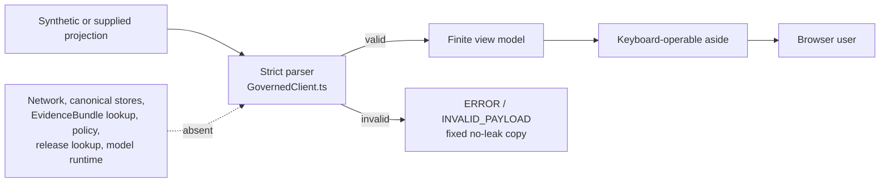
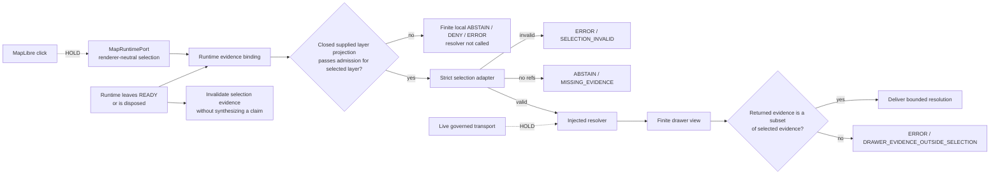

<!-- [KFM_META_BLOCK_V2]
doc_id: kfm://doc/architecture/ui/evidence-drawer
title: Evidence Drawer — UI Projection and Trust-Panel Boundary
type: architecture-reference
version: v2.1-draft
status: draft; repository-grounded; bounded-executable; fixture-first; live-transport-hold; non-authoritative
owners:
  - "@bartytime4life — verified CODEOWNERS review route"
  - "NEEDS VERIFICATION — independent UI, accessibility, evidence, policy, security, review, release, correction, and rollback stewardship"
created: 2026-05-14
updated: 2026-08-24
policy_label: public; architecture; ui; evidence-drawer; finite-outcomes; fail-closed; no-release; no-publication
owning_root: docs/
responsibility: "Explain the current Explorer Evidence Drawer projection, parser, finite view model, keyboard-operable panel, renderer-neutral selection bridge, and production HOLDs without becoming contract, schema, evidence, policy, review, release, correction, rollback, runtime, deployment, or publication authority."
truth_posture: "CONFIRMED current repository evidence / PROPOSED production composition / UNKNOWN deployed public behavior / NEEDS VERIFICATION live transport, authoritative evidence resolution, policy and release authenticity, MapLibre composition, security, and production accessibility; cite-or-abstain"
related:
  - docs/architecture/ui/README.md
  - docs/architecture/ui/BOUNDARIES.md
  - docs/architecture/ui/ACCESSIBILITY.md
  - docs/architecture/ui/map-context-evidence-drawer-admission.md
  - docs/architecture/evidence-drawer.md
  - docs/architecture/map-master/EVIDENCE_DRAWER.md
  - docs/doctrine/directory-rules.md
  - docs/adr/ADR-0029-adopt-directory-governance-standard-v2.md
  - contracts/ui/evidence_drawer_payload.md
  - contracts/evidence/evidence_drawer_payload.md
  - schemas/contracts/v1/ui/evidence_drawer_payload.schema.json
  - fixtures/ui/evidence_drawer_payload/README.md
  - tools/validators/ui/validate_evidence_drawer_payload.py
  - apps/explorer-web/src/adapters/GovernedClient.ts
  - apps/explorer-web/src/features/evidence_drawer/index.tsx
  - apps/explorer-web/src/features/map_runtime/index.tsx
  - apps/explorer-web/src/features/map_runtime/layer_manifest_admission.ts
  - apps/explorer-web/src/features/map_runtime/runtime-evidence-binding.ts
  - apps/explorer-web/src/features/map_runtime/runtime-trust-status.ts
  - apps/explorer-web/tests/evidence-drawer.test.ts
  - apps/explorer-web/tests/evidence-drawer-drift-integrity.test.ts
  - apps/explorer-web/tests/map-evidence-drawer.test.ts
  - apps/explorer-web/tests/map-runtime-evidence-binding.test.ts
  - apps/explorer-web/tests/map-runtime-trust-status.test.ts
  - apps/explorer-web/tests/browser/evidence-drawer.spec.ts
  - apps/explorer-web/tests/browser/trust-surface.spec.ts
  - .github/workflows/evidence-drawer-payload.yml
tags:
  - kfm
  - architecture
  - ui
  - evidence-drawer
  - EvidenceDrawerPayload
  - EvidenceRef
  - EvidenceBundle
  - finite-outcomes
  - correction-history
  - accessibility
  - no-leak
  - renderer-neutral
notes:
  - "Same-path repository-grounded modernization; placement outcome PLACE."
  - "v2.1 reconciles the page with the package-owned renderer-neutral selection type, closed synthetic layer-admission projection, runtime evidence binding and invalidation, finite runtime trust presenter, unique composed Drawer identities, and current drift/integrity tests."
  - "The executable slice is deterministic, fixture-first, and no-network; production transport, authoritative evidence closure, and concrete MapLibre composition remain on HOLD."
  - "This documentation change does not modify contracts, schemas, policy, fixtures, validators, tests, workflows, runtime, release, deployment, publication, or repository settings."
[/KFM_META_BLOCK_V2] -->

<a id="top"></a>
<a id="evidence-drawer"></a>

# Evidence Drawer

> **Operating rule.** The Evidence Drawer is Explorer Web's trust-visible projection panel. It may parse and render a bounded, public-safe `EvidenceDrawerPayload`; it cannot make the payload true, resolve evidence authority, execute policy, authenticate review, establish release state, issue a correction, perform rollback, or publish a claim.

> [!IMPORTANT]
> **Projection is not closure.** A finite outcome, citation, trust label, or release declaration in a UI payload is not the underlying `EvidenceBundle`, `PolicyDecision`, `ReviewRecord`, `ReleaseManifest`, `CorrectionNotice`, or rollback authority.

> [!CAUTION]
> **Current behavior is narrower than the former architecture target.** Repository evidence supports a deterministic fixture parser, finite view model, keyboard-operable complementary panel, package-owned renderer-neutral selection port, closed synthetic layer-admission projection, and no-network runtime-to-evidence binding. Live governed transport, authoritative evidence resolution, policy execution, authenticated release lookup, and a functioning MapLibre click path remain **HOLD**.

> [!WARNING]
> **Negative states are no-leak states.** `DENY`, `ERROR`, malformed input, resolver failure, and evidence-scope mismatch must not reflect restricted values, private diagnostics, unsupported summaries, citations, limitations, history, or exception text into the browser.

## Quick navigation

[0. Evidence](#0-current-repository-evidence) ·
[1. Purpose](#1-purpose-and-doctrinal-position) ·
[2. Placement](#2-where-the-evidence-drawer-sits) ·
[3. Flow](#3-click-to-resolution-flow) ·
[4. Projection](#4-the-drawer-is-a-projection-not-a-source) ·
[5. Contract](#5-contract--evidencedrawerpayload) ·
[6. Boundaries](#6-trust-membrane-boundaries) ·
[7. Outcomes](#7-policy-finite-outcomes-and-negative-states) ·
[8. Lifecycle](#8-lifecycle-and-release-state-visibility) ·
[9. Accessibility](#9-accessibility-requirements) ·
[10. Validation](#10-validation-tests-fixtures) ·
[11. Anti-patterns](#11-anti-patterns) ·
[12. Artifacts](#12-related-artifacts-and-proposed-file-homes) ·
[13. Backlog](#13-open-questions-and-verification-backlog) ·
[Appendix A](#appendix-a--representative-payload-shapes) ·
[Appendix B](#appendix-b--glossary-cross-references) ·
[Related docs](#related-docs)

---

<a id="0-current-repository-evidence"></a>

## 0. Current repository evidence

**Evidence snapshot:** `main@366cfa9185b0d10ca27f128a8a041ca8c5312896`.

Accepted ADR-0029 makes `docs/doctrine/directory-rules.md` the writable Directory Rules authority. This existing path remains a human architecture document under the `docs/` responsibility root. It does not compete with contracts, schemas, policy, runtime, evidence, review, release, correction, or rollback authorities.

### 0.1 Current maturity matrix

| Surface | CONFIRMED repository state | Safe conclusion |
|---|---|---|
| `contracts/ui/evidence_drawer_payload.md` | Draft UI projection semantics and non-effects | Strongest current UI-facing meaning; still proposed |
| `schemas/contracts/v1/ui/evidence_drawer_payload.schema.json` | Closed Draft 2020-12 profile with four outcomes, bounded trust state, HTTPS citations, and optional history | Machine shape exists; authenticity is not proved |
| `apps/explorer-web/src/adapters/GovernedClient.ts` | Strict parser for `kfm.explorer.evidence-drawer.public-safe.v1`; no transport or lifecycle-store access | App adapter fails closed over supplied objects |
| `apps/explorer-web/src/features/evidence_drawer/index.tsx` | Finite view resolver and keyboard-operable complementary panel with fixed negative copy, unique composed DOM identities, and suppressed release/correction labels for `ERROR` | Bounded app-local projection exists |
| `apps/explorer-web/src/features/map_runtime/index.tsx` | Strict renderer-neutral selection adaptation, injected resolver, evidence-subset check, and finite local failures | Selection bridge exists without renderer or live service |
| Runtime admission and binding helpers | Closed synthetic layer-manifest admission, package-owned `MapRuntimePort` selection subscription, newest-request wins, and evidence invalidation when runtime state leaves `READY` | Fail-closed no-network composition exists; declarations are not authenticated lifecycle or release authority |
| Runtime trust presenter | Exact KFM runtime snapshots become fixed text-first finite status; only `READY` is selection-eligible | UI status does not infer evidence, policy, review, release, correction, rollback, or publication authority |
| Unit and browser test sources | Finite states, correction history, drift/integrity failures, no-leak behavior, selection scope, runtime invalidation, unique composed IDs, keyboard open/close, and focus return are represented | Intended bounded behavior is inspectable; execution remains separate evidence |
| `tools/validators/ui/validate_evidence_drawer_payload.py` | No-network closed-schema and cross-field validator | Declaration consistency can be checked without resolving evidence |
| `.github/workflows/evidence-drawer-payload.yml` | Read-only, path-scoped orchestration | Workflow presence or success is not review, release, or publication |

### 0.2 What changed from the prior page

| Prior statement | Current disposition |
|---|---|
| Implementation maturity was entirely `UNKNOWN` | **STALE.** A bounded executable fixture-first slice now exists. |
| Every named path was merely `PROPOSED` | **STALE.** The target, contract, schema, fixtures, validator, app code, tests, and workflow are repository-present. |
| A feature click invokes a live governed resolution route | **NOT ESTABLISHED.** Current browser code has no live transport. |
| MapLibre provides the active click path | **HOLD.** The inspected bridge is renderer-neutral and fixture-driven. |
| The payload includes feature, bundle, review, release-manifest, rollback, conflict, transform, and audit objects | **STALE SHAPE.** Those are not members of the current closed UI schema. |
| The drawer is a modal with focus trapping and established WCAG conformance | **UNSUPPORTED.** The current surface is a non-modal complementary panel with bounded keyboard proof. |
| `release=RELEASED` proves publication | **DENY.** It is a projection declaration, not an authenticated release lookup. |

### 0.3 Changes after the v2.0 evidence snapshot

| Current addition | Bounded effect | Preserved HOLD |
|---|---|---|
| Package-owned `MapFeatureSelection` | Explorer consumes the renderer-neutral type exported by `@kfm/maplibre` and adapts it into the strict public-safe bridge profile | No concrete renderer or MapLibre event source |
| Layer-manifest selection admission | A closed supplied projection must pass finite admission and name the selected layer before the injected resolver runs | No registry read/write, loader, lifecycle mutation, or authenticated release decision |
| Runtime evidence binding | Newer selections supersede unresolved work; a non-`READY` transition or disposal invalidates pending or delivered selection evidence without synthesizing a Drawer claim | No transport, evidence store, policy engine, cache invalidation service, correction service, or publication effect |
| Runtime trust status | Fixed text and ARIA state expose every finite runtime transition and block selection outside `READY` | Renderer state is not evidence or lifecycle authority |
| Composed Drawer hardening | Multiple drawers receive unique linked IDs; `ERROR` views suppress conflicting release and correction labels | Bounded DOM proof is not app-wide accessibility conformance |

### 0.4 Documentation responsibility split

| Page | Responsibility |
|---|---|
| This page | Explorer UI projection, view model, panel behavior, accessibility slice, and browser no-leak boundary |
| `docs/architecture/evidence-drawer.md` | Cross-cutting Evidence Drawer architecture and whole-feature boundary |
| `docs/architecture/map-master/EVIDENCE_DRAWER.md` | Renderer-neutral selection-to-drawer seam and map-master obligations |

This update does not consolidate, supersede, move, redirect, or delete either companion. Long-term convergence remains a separate migration decision.

[Back to top](#top)

---

<a id="1-purpose-and-doctrinal-position"></a>

## 1. Purpose and doctrinal position

The current executable responsibility is deliberately narrow:

1. parse one closed public-safe projection profile;
2. convert it into one finite view model;
3. render outcome, reason, safe title/summary, evidence identifiers, citations, limitations, trust labels, and bounded history permitted by the outcome;
4. suppress untrusted detail for denied, errored, malformed, contradictory, or locally failed inputs; and
5. preserve keyboard open/close, Escape dismissal, focus entry, focus return, and unique linked DOM identities for composed bounded surfaces.

| Property | Current result | Authority limit |
|---|---|---|
| Projection | Closed public-safe UI profile | Does not create or authenticate evidence |
| Outcome | `ANSWER`, `ABSTAIN`, `DENY`, or `ERROR` | Finite UI state, not publication state |
| Evidence support | Safe identifiers and HTTPS citation links when permitted | No browser dereference or authenticity check |
| Trust visibility | Source role, policy, review, release, freshness, correction | Declarations only |
| History | Bounded negative outcomes and correction edges | Audit projection only |
| Accessibility | Native controls, complementary landmark, live announcement, Escape, focus entry/return | Not complete conformance |
| Integration | Deterministic fixtures, package-owned renderer-neutral port, closed synthetic layer admission, and runtime evidence binding | No authenticated service, concrete renderer, or public operation |

Two invariants control every extension:

- **Cite or abstain.** Consequential answers require admissible, resolved support.
- **The renderer is downstream of trust.** Pixels, feature properties, popups, badges, selections, screenshots, graph edges, and generated text are request context or carriers, not evidence authority.

[Back to top](#top)

---

<a id="2-where-the-evidence-drawer-sits"></a>

## 2. Where the Evidence Drawer sits

### 2.1 Current bounded composition


```mermaid
flowchart LR
    F["Synthetic or supplied projection"] --> P["Strict parser<br/>GovernedClient.ts"]
    P -->|valid| V["Finite view model"]
    P -->|invalid| X["ERROR / INVALID_PAYLOAD<br/>fixed no-leak copy"]
    V --> M["Keyboard-operable aside"]
    M --> U["Browser user"]

    N["Network, canonical stores,<br/>EvidenceBundle lookup, policy,<br/>release lookup, model runtime"] -. "absent" .-> P
```

### 2.2 Renderer-neutral runtime-to-evidence slice


```mermaid
flowchart LR
    P["MapRuntimePort<br/>renderer-neutral selection"] --> B["Runtime evidence binding"]
    B --> L{"Closed supplied layer projection<br/>passes admission for selected layer?"}
    L -->|no| N["Finite local ABSTAIN / DENY / ERROR<br/>resolver not called"]
    L -->|yes| Q["Strict selection adapter"]
    Q -->|invalid| I["ERROR / SELECTION_INVALID"]
    Q -->|no refs| A["ABSTAIN / MISSING_EVIDENCE"]
    Q -->|valid| R["Injected resolver"]
    R --> D["Finite drawer view"]
    D --> C{"Returned evidence is a subset<br/>of selected evidence?"}
    C -->|yes| U["Deliver bounded resolution"]
    C -->|no| O["ERROR / DRAWER_EVIDENCE_OUTSIDE_SELECTION"]
    T["Runtime leaves READY<br/>or is disposed"] --> X["Invalidate selection evidence<br/>without synthesizing a claim"]
    T --> B

    ML["MapLibre click"] -. "HOLD" .-> P
    API["Live governed transport"] -. "HOLD" .-> R
```

The current binding consumes `MapRuntimePort`, but the repository implementation used by Explorer is still the deterministic `NullMapRuntime`. The layer projection and resolver are injected collaborators. Neither is a loader, registry, authenticated release service, evidence authority, or publication path.

### 2.3 Target production composition

```text
released public-safe carrier
  -> renderer-neutral selection candidate
  -> authenticated governed request
  -> EvidenceRef resolution and authenticity checks
  -> rights / sensitivity / policy / review / release / correction checks
  -> public-safe EvidenceDrawerPayload
  -> strict browser parser
  -> finite drawer view
```

The target sequence is a graduation plan, not current runtime evidence.

[Back to top](#top)

---

<a id="3-click-to-resolution-flow"></a>

## 3. Click-to-resolution flow

### 3.1 Current selection object

The package-owned `MapFeatureSelection` contains exactly:

| Field | Current rule |
|---|---|
| `profile` | Must equal `kfm.explorer.map-feature-selection.v1` |
| `selectionId` | Bounded safe identifier |
| `layerId` | Selection context only; not release proof |
| `featureId` | Selection context only; not evidence |
| `evidenceRefs` | Unique bounded identifiers, maximum 16 |

Raw renderer properties, geometry, source payloads, popup text, policy records, release records, prompts, and model output do not cross this browser boundary.

Explorer freezes the KFM-owned value and adapts those camel-case members to the strict bridge object's `selection_id`, `layer_id`, `feature_id`, and `evidence_refs`. The Evidence Drawer payload remains independent of MapLibre-native `queryRenderedFeatures` output and style JSON.

### 3.2 Current finite bridge behavior

| Condition | Result |
|---|---|
| Selection malformed | `SELECTION_INVALID` and fixed local error view |
| No evidence refs | `MISSING_EVIDENCE`; resolver is not called |
| Supplied layer projection is invalid, held, denied, stale, withdrawn, superseded, mismatched, or otherwise non-admissible | Resolver is not called; the finite admission result is mapped to a bounded local `ABSTAIN`, `DENY`, or `ERROR` view |
| Resolver returns in-scope support | `SUPPORTED` and bounded answer view |
| Resolver returns denial | Preserve `DENY` with fixed no-leak copy |
| Resolver throws | `GOVERNED_RESOLVER_ERROR`; exception text is suppressed |
| Returned evidence exceeds selection scope | `DRAWER_EVIDENCE_OUTSIDE_SELECTION`; fixed local error view |
| A newer selection arrives before an older resolver completes | Older result is suppressed |
| Runtime leaves `READY` or is disposed | Active selection evidence is invalidated using only selection ID and finite runtime state/reason; no Drawer claim is synthesized |

Bridge codes are app-local. They are not members of the wire `EvidenceDrawerPayload.reason_code` enum.

### 3.3 Not established

- live claim-resolution route or equivalent active API behind the injected resolver;
- authenticated Explorer transport;
- functioning MapLibre click translation;
- authoritative `EvidenceRef -> EvidenceBundle` resolution;
- authenticated layer-manifest, active-release, correction, withdrawal, or rollback lookup;
- source-rights, sensitivity, policy, reviewer, or release authentication;
- production cancellation, retry, caching, telemetry, retention, or incident behavior;
- Focus Mode or correction-submission handoff;
- deployed public claim operation.

The browser must not fill these gaps with raw feature properties, direct store reads, local policy inference, or model calls.

[Back to top](#top)

---

<a id="4-the-drawer-is-a-projection-not-a-source"></a>

## 4. The drawer is a projection, not a source

| Responsibility | Owning surface | Current boundary |
|---|---|---|
| UI projection meaning | `contracts/ui/evidence_drawer_payload.md` | Current bounded profile; proposed semantics |
| Evidence-family sibling meaning | `contracts/evidence/evidence_drawer_payload.md` | Repository-present; path authority remains under review |
| Machine shape | `schemas/contracts/v1/ui/evidence_drawer_payload.schema.json` | Closed UI profile |
| Evidence closure | Evidence contracts and governed resolver | Not performed by the drawer |
| Policy/disclosure | `policy/` and governed runtime | Not recomputed in the browser |
| Review/release/correction/rollback | Their distinct records and runtime checks | Projected labels do not authenticate them |
| Browser presentation | Explorer Evidence Drawer feature | Current finite view and panel |

Projection rules:

1. unknown fields fail closed;
2. the browser does not dereference evidence identifiers as canonical evidence;
3. non-answer and historical states are never upgraded into current support;
4. current evidence and negative/correction history remain distinct;
5. denied, errored, malformed, scope-mismatched, and resolver-failed paths use fixed copy;
6. trust labels remain declarations;
7. schema validity is necessary and insufficient for truth, release, or publication.

The repository contains both a UI-facing semantic contract and an evidence-family sibling. This page follows the current UI schema while preserving that contract-home seam as **HOLD / NEEDS VERIFICATION**.

[Back to top](#top)

---

<a id="5-contract--evidencedrawerpayload"></a>

## 5. Contract — `EvidenceDrawerPayload`

### 5.1 Exact current profile

The schema is closed with `additionalProperties: false`.

| Required field | Current meaning |
|---|---|
| `profile` | Exact constant `kfm.explorer.evidence-drawer.public-safe.v1` |
| `id` | Projection identity; not an `EvidenceBundle` identity |
| `outcome` | `ANSWER`, `ABSTAIN`, `DENY`, or `ERROR` |
| `reason_code` | Closed public-safe discriminator |
| `title` | Governed display title; replaced for negative/no-leak views |
| `summary` | Governed display summary; replaced for negative/no-leak views |
| `evidence_refs` | Unique safe identifiers, maximum 16 |
| `citations` | Labelled HTTPS links, maximum 16 |
| `limitations` | Bounded public-safe caveats, maximum 16 |
| `trust_state` | Closed declaration of source role, policy, review, release, freshness, correction |

Optional `history` contains closed `negative_outcomes` and `corrections` arrays.

### 5.2 Trust-state vocabulary

| Field | Allowed values |
|---|---|
| `source_role` | `authoritative`, `official`, `derived`, `context` |
| `policy` | `ALLOW`, `ABSTAIN`, `DENY`, `ERROR` |
| `review` | `REVIEWED`, `PENDING`, `NOT_APPLICABLE` |
| `release` | `RELEASED`, `UNRELEASED`, `WITHDRAWN` |
| `freshness` | `CURRENT`, `STALE`, `UNKNOWN` |
| `correction` | `NONE`, `CURRENT`, `CORRECTED`, `SUPERSEDED` |

### 5.3 Reason-code vocabulary

```text
SUPPORTED
MISSING_EVIDENCE
STALE_EVIDENCE
CITATION_UNRESOLVED
POLICY_DENIED
RIGHTS_UNRESOLVED
SENSITIVE_DETAIL_RESTRICTED
UPSTREAM_ERROR
HELD_EVIDENCE
SUPERSEDED_EVIDENCE
WITHDRAWN_EVIDENCE
REVOKED_EVIDENCE
```

### 5.4 History rules

Negative history records identify held, denied, superseded, revoked, or withdrawn evidence and declare `resolvable_as_current=false`. Correction edges are acyclic, non-self-referential, and connect prior evidence to an active evidence ref. Current support may not also appear as negative history.

These are local declaration checks. The browser does not authenticate a correction registry or notice.

### 5.5 Outcome consistency

| Outcome | Required wire posture | Browser posture |
|---|---|---|
| `ANSWER` | `SUPPORTED`; nonempty evidence/citations; `ALLOW`; `REVIEWED`; `RELEASED`; `CURRENT`; correction rules satisfied | Render supplied public-safe answer projection |
| `ABSTAIN` | Non-supported reason and `policy=ABSTAIN` | Fixed reason copy; retain only profile-permitted safe context |
| `DENY` | Non-supported reason and `policy=DENY`; no evidence, citations, or history | Fixed no-leak copy |
| `ERROR` | `UPSTREAM_ERROR`, `policy=ERROR`; no evidence, citations, or history | Fixed no-leak copy; never answer |

Malformed or contradictory input becomes app-local `ERROR / INVALID_PAYLOAD`; absent input becomes app-local `ABSTAIN / NO_GOVERNED_RESPONSE`.

### 5.6 Former architecture fields not in the current profile

The current closed profile does **not** contain:

- `feature_id`, `layer_id`, or `opened_from`;
- nested `decision` or `DecisionEnvelope`;
- `bundle_ref`, `source_summary`, or `evidence_bundle_refs`;
- review, policy-decision, release-manifest, correction-notice, or rollback-card refs;
- typed conflicts, caveats, transforms, related manifests, or audit refs.

A later version must coordinate contract, schema, fixtures, validator, parser, tests, compatibility, correction, and rollback. Prose must not pre-admit fields rejected by the current schema.

[Back to top](#top)

---

<a id="6-trust-membrane-boundaries"></a>

## 6. Trust-membrane boundaries

| Boundary | Drawer may | Drawer must not |
|---|---|---|
| Supplied projection | Strictly parse and render a finite view | Accept unknown fields or coerce contradictions |
| Evidence identifiers | Display safe identifiers when permitted | Dereference canonical evidence or infer truth |
| Citations | Render supplied HTTPS links for an answer | Validate authority in the browser or expose links in deny/error |
| Trust state | Render text labels | Recompute policy, review, release, freshness, correction |
| History | Show bounded safe history when permitted | Treat negative or superseded evidence as current |
| Sensitive detail | Render only the filtered projection | Reconstruct geometry or reflect denial detail |
| Map selection | Validate bounded renderer-neutral context | Treat properties, pixels, styles, or popup text as evidence |
| Layer admission | Consume a closed supplied no-network projection and fail closed before the resolver | Load a registry, authenticate release state, register a source, or create a renderer source |
| Runtime transitions | Block selection outside `READY` and invalidate selection evidence on finite trust-state change | Infer policy, correction, rollback, release, or publication from renderer state |
| Model runtime | Nothing | Call a model directly |
| Lifecycle stores | Nothing | Read RAW, WORK, QUARANTINE, PROCESSED, catalog/triplet, proof, release, or canonical stores |

Current code and tests provide bounded anti-bypass checks, but source structure is not deployment certification. Authentication, authorization, CSP, CORS, dependency closure, network isolation, database permissions, object-store policy, cache safety, and production egress remain operational evidence outside this page.

[Back to top](#top)

---

<a id="7-policy-finite-outcomes-and-negative-states"></a>

## 7. Policy, finite outcomes, and negative states

| Outcome | Typical reason codes | Browser behavior |
|---|---|---|
| `ANSWER` | `SUPPORTED` | Render supplied public-safe claim projection |
| `ABSTAIN` | Missing, stale, unresolved, held, superseded, withdrawn, revoked evidence | Render fixed explanation and only permitted safe context |
| `DENY` | Policy, rights, or sensitive-detail restriction | Fixed no-leak copy; no evidence, citations, or history |
| `ERROR` | `UPSTREAM_ERROR` | Fixed no-leak copy; never fall back to an answer |

The view model uses fixed public-safe negative messages rather than supplied negative-state title or summary. An `ERROR` view also suppresses supplied release and correction labels because an upstream or adapter failure cannot establish a reliable interpretation of either field. Policy display is not policy execution. `HOLD`, `STALE`, `WITHDRAWN`, and similar conditions are represented through the four finite outcomes, reason code, trust state, and history; they are not extra top-level outcomes in this profile.

[Back to top](#top)

---

<a id="8-lifecycle-and-release-state-visibility"></a>

## 8. Lifecycle and release-state visibility

```text
RAW -> WORK / QUARANTINE -> PROCESSED -> CATALOG / TRIPLET
    -> governed release
    -> governed API or released public-safe carrier
    -> EvidenceDrawerPayload
    -> strict Explorer parser and drawer
```

`trust_state.release` is a declaration used for profile consistency. It is not a release object, digest binding, signature, active-release lookup, correction lookup, or rollback target.

| Declared state | Current finite use | Unproved |
|---|---|---|
| `RELEASED` | Required by a current answer fixture | Authentic release, audience, active version, digest, review, correction, rollback |
| `UNRELEASED` | Used by non-answer/local failure fixtures | Upstream candidate existence or eligibility |
| `WITHDRAWN` | Supports non-answer/historical visibility | Authenticated withdrawal and propagation |

The drawer may project bounded correction history. It cannot issue a correction, choose an active release, invalidate caches, or mutate history.

The current runtime binding invalidates one selection's pending or delivered UI evidence when the renderer-neutral runtime leaves `READY` or is disposed. That local suppression is not an authenticated correction, withdrawal, rollback, cache purge, or lifecycle transition. The layer-admission helper likewise checks only a closed supplied declaration and reports `authority: NONE`, `registryMutated: false`, and `maplibreSourceCreated: false`.

[Back to top](#top)

---

<a id="9-accessibility-requirements"></a>

## 9. Accessibility requirements

Accessibility is part of the trust membrane because outcome, evidence, citation, limitation, trust, and correction state must be perceivable and operable.

### 9.1 Confirmed bounded behavior

- native open and close buttons;
- labelled `<aside role="complementary">`;
- unique panel, label, and title IDs when multiple drawers are composed, with each trigger linked to exactly one panel;
- focus moves to the close button on open;
- Escape closes;
- close returns focus to the prior connected element or trigger;
- polite live announcement for normal/non-error states and assertive announcement for errors;
- labelled lists for trust state, evidence, citations, history, and limitations;
- visible citation link text;
- textual outcome and reason code, not color-only state.

### 9.2 Not established

- modal semantics or focus trap;
- complete shell keyboard operation;
- non-map selection parity;
- reduced-motion behavior;
- enforcing axe/rule-engine gate;
- screen-reader, magnification, high-contrast, voice-control, cognitive-accessibility, responsive reflow, or zoom parity;
- WCAG 2.2 AA conformance;
- independent assistive-technology review.

A bounded browser fixture must not be inflated into a conformance claim.

[Back to top](#top)

---

<a id="10-validation-tests-fixtures"></a>

## 10. Validation, tests, fixtures

| Layer | Current path | Bounded responsibility |
|---|---|---|
| Semantic contract | `contracts/ui/evidence_drawer_payload.md` | UI projection meaning |
| Schema | `schemas/contracts/v1/ui/evidence_drawer_payload.schema.json` | Closed machine profile |
| Fixtures | `fixtures/ui/evidence_drawer_payload/` | Synthetic valid/invalid candidates |
| Validator | `tools/validators/ui/validate_evidence_drawer_payload.py` | No-network shape and cross-field checks |
| Validator tests | `tests/validators/test_validate_evidence_drawer_payload.py` | Fixture and semantic expectations |
| Parser | `apps/explorer-web/src/adapters/GovernedClient.ts` | Exact profile parsing |
| Drawer | `apps/explorer-web/src/features/evidence_drawer/index.tsx` | Finite view and panel |
| Selection bridge | `apps/explorer-web/src/features/map_runtime/index.tsx` | Renderer-neutral selection adaptation and evidence scope |
| Layer admission | `apps/explorer-web/src/features/map_runtime/layer_manifest_admission.ts` | Closed no-network supplied-projection gate; no registration side effect |
| Runtime evidence binding | `apps/explorer-web/src/features/map_runtime/runtime-evidence-binding.ts` | `MapRuntimePort` subscription, latest-result ordering, and non-`READY` invalidation |
| Runtime trust presenter | `apps/explorer-web/src/features/map_runtime/runtime-trust-status.ts` | Fixed text-first finite state and selection eligibility |
| App tests | `apps/explorer-web/tests/` | Finite states, drift/integrity, no-leak, keyboard/focus, unique DOM identity, selection, admission, runtime ordering, and invalidation |
| Workflow | `.github/workflows/evidence-drawer-payload.yml` | Read-only focused orchestration |

Repository-native commands:

```bash
python tools/validators/ui/validate_evidence_drawer_payload.py --fixtures
python -m unittest -q tests.validators.test_validate_evidence_drawer_payload
pnpm --filter explorer-web build
pnpm --filter explorer-web test
```

A pass does not resolve evidence, execute policy, authenticate review/release/correction/rollback, prove deployment isolation, establish accessibility conformance, admit a renderer or provider, or publish anything.

[Back to top](#top)

---

<a id="11-anti-patterns"></a>

## 11. Anti-patterns

| Anti-pattern | Why forbidden |
|---|---|
| Calling the fixture parser a live governed client | It performs no transport or authoritative resolution |
| Calling the current port/binding a functioning MapLibre click path | Explorer consumes `NullMapRuntime`; no concrete renderer or live event source is established |
| Treating pixels, properties, popups, badges, or selection as evidence | They scope a request only |
| Adding prose-only fields rejected by the closed schema | Creates a shadow contract |
| Treating `ALLOW`, `REVIEWED`, or `RELEASED` labels as authenticated authority | They are declarations |
| Rendering supplied deny/error title, summary, citation, limitation, history, or exception detail | Violates no-leak behavior |
| Letting negative history resolve as current support | Violates correction lineage |
| Browser-side evidence dereference, policy evaluation, release lookup, or model call | Bypasses the trust membrane |
| Calling the panel a modal with a focus trap | Current implementation is non-modal |
| Claiming WCAG conformance from one fixture | Broader evidence is absent |
| Using style or hidden DOM as a sensitivity gate | Disclosure belongs upstream |
| Treating workflow/receipt success as review, release, or publication | Collapses distinct authorities |
| Silently consolidating companion architecture pages | Requires explicit migration and compatibility review |

[Back to top](#top)

---

<a id="12-related-artifacts-and-proposed-file-homes"></a>

## 12. Related artifacts and proposed file homes

The heading is retained for fragment compatibility. Current paths are distinguished from unresolved authority.

| Responsibility | Current home | Status |
|---|---|---|
| UI architecture | `docs/architecture/ui/EVIDENCE_DRAWER.md` | **CONFIRMED / PLACE** |
| Cross-cutting architecture | `docs/architecture/evidence-drawer.md` | Confirmed companion |
| Map-selection architecture | `docs/architecture/map-master/EVIDENCE_DRAWER.md` | Confirmed companion |
| UI projection semantics | `contracts/ui/evidence_drawer_payload.md` | Present; proposed semantics |
| Evidence-family sibling | `contracts/evidence/evidence_drawer_payload.md` | Present; path authority needs review |
| Machine profile | `schemas/contracts/v1/ui/evidence_drawer_payload.schema.json` | Present; proposed profile |
| Fixtures/validator | `fixtures/ui/evidence_drawer_payload/`; `tools/validators/ui/` | Present; no-network declaration checks |
| Browser parser/view | Explorer adapter and feature paths | Present; bounded executable |
| Selection laboratory | Explorer map-runtime feature | Present; renderer-neutral synthetic slice |
| Runtime selection binding | Explorer map-runtime feature | Present; no-network `MapRuntimePort` composition with synthetic layer admission and injected resolver |
| Runtime trust projection | Explorer map-runtime feature | Present; text-first finite state, no evidence or lifecycle authority |
| Policy/evidence/review/release/correction/rollback | Owning roots and records | **HOLD** for production composition |

A material profile change must reconcile contract, schema, fixtures, validator, parser, DOM, selection bridge, tests, workflow, receipts, companion docs, compatibility, correction, and rollback.

The three architecture pages overlap but have distinguishable responsibilities. Consolidation or retirement requires inbound-link inventory, anchor compatibility, supersession language, rollback, and independent review.

[Back to top](#top)

---

<a id="13-open-questions-and-verification-backlog"></a>

## 13. Open questions and verification backlog

- [ ] Which authenticated route, request contract, response envelope, timeout, cancellation, retry, and error profile will deliver the projection?
- [ ] Which resolver binds every public evidence ref to an authoritative `EvidenceBundle`, digest, and active correction state?
- [ ] Which policy decision authorizes public fields, precision, citations, history, audience, and obligations?
- [ ] Which review, release, correction, withdrawal, and rollback records are resolved before an `ANSWER`?
- [ ] Should UI projection semantics remain in `contracts/ui/`, move to `contracts/evidence/`, or preserve an explicit split?
- [ ] Should a later version add bundle, policy, review, release, correction, and rollback references?
- [ ] Which admitted renderer converts a real click into the strict selection without retaining raw properties or protected geometry?
- [ ] When may the no-network map-context admission helper become an application dependency?
- [ ] What governed shapes launch Focus Mode or correction reporting from the drawer?
- [ ] What browser, viewport, zoom, contrast, keyboard, assistive-technology, reduced-motion, and non-map matrix is required before release?
- [ ] Which authentication, authorization, CSP, CORS, dependency, cache, telemetry, retention, and incident controls close the deployed path?
- [ ] Which service propagates correction, withdrawal, and rollback to maps, search, exports, stories, AI context, and saved links?
- [ ] Which named independent reviewers cover UI, accessibility, evidence, policy, and security?
- [ ] Should the three architecture pages remain separate or migrate through a reviewed division of responsibility?

### Rollback

The same-path documentation rollback target is prior blob `d32539bf56705abe0c76683254bfaaa6ad31a099`. Before merge, close the draft pull request and delete only its feature branch. After an authorized merge, revert the documentation commit through a reviewed pull request. No contract, schema, fixture, validator, test, workflow, runtime, lifecycle data, release, deployment, or public artifact requires migration.

[Back to top](#top)

---

<a id="appendix-a--representative-payload-shapes"></a>

## Appendix A — Representative payload shapes

The examples are synthetic declarations. They do not represent a live source, authenticated review, active release, public claim, or publication decision.

### A.1 Corrected answer

```json
{
  "profile": "kfm.explorer.evidence-drawer.public-safe.v1",
  "id": "kfm:ui:evidence-drawer:answer-001",
  "outcome": "ANSWER",
  "reason_code": "SUPPORTED",
  "title": "Synthetic streamflow observation",
  "summary": "A generalized fixture observation is supported by cited fixture evidence.",
  "evidence_refs": ["kfm:evidence:synthetic:flow-001"],
  "citations": [
    {
      "label": "Synthetic fixture evidence",
      "href": "https://example.invalid/kfm/evidence/flow-001"
    }
  ],
  "limitations": ["Fixture-only demonstration; not a live observation or life-safety instruction."],
  "trust_state": {
    "source_role": "official",
    "policy": "ALLOW",
    "review": "REVIEWED",
    "release": "RELEASED",
    "freshness": "CURRENT",
    "correction": "CORRECTED"
  },
  "history": {
    "negative_outcomes": [
      {
        "evidence_ref": "kfm:evidence:synthetic:flow-000",
        "state": "SUPERSEDED",
        "reason_code": "SUPERSEDED_EVIDENCE",
        "recorded_at": "2026-08-01T00:00:00Z",
        "visible_in_runtime": true,
        "resolvable_as_current": false
      }
    ],
    "corrections": [
      {
        "prior_evidence_ref": "kfm:evidence:synthetic:flow-000",
        "active_evidence_ref": "kfm:evidence:synthetic:flow-001",
        "status": "ACTIVE_CORRECTION",
        "recorded_at": "2026-08-01T00:00:00Z"
      }
    ]
  }
}
```

### A.2 Restricted denial

```json
{
  "profile": "kfm.explorer.evidence-drawer.public-safe.v1",
  "id": "kfm:ui:evidence-drawer:deny-001",
  "outcome": "DENY",
  "reason_code": "SENSITIVE_DETAIL_RESTRICTED",
  "title": "Restricted synthetic detail",
  "summary": "This supplied text is not rendered by the browser denial view.",
  "evidence_refs": [],
  "citations": [],
  "limitations": [],
  "trust_state": {
    "source_role": "context",
    "policy": "DENY",
    "review": "NOT_APPLICABLE",
    "release": "UNRELEASED",
    "freshness": "UNKNOWN",
    "correction": "NONE"
  },
  "history": {
    "negative_outcomes": [],
    "corrections": []
  }
}
```

The denial view uses fixed public-safe copy and suppresses the supplied title and summary.

[Back to top](#top)

---

<a id="appendix-b--glossary-cross-references"></a>

## Appendix B — Glossary cross-references

| Term | Meaning here |
|---|---|
| `EvidenceDrawerPayload` | Closed public-safe UI projection consumed by Explorer |
| `EvidenceRef` | Governed identifier displayed safely but not dereferenced by the browser |
| `EvidenceBundle` | Upstream evidence authority required before a consequential answer |
| Finite outcome | `ANSWER`, `ABSTAIN`, `DENY`, or `ERROR` |
| Trust state | Projection declarations, not authenticated trust objects |
| Negative history | Held/denied/superseded/revoked/withdrawn evidence that is never current |
| Correction edge | Prior-to-active evidence relation; declaration only |
| `MapFeatureSelection` | Renderer-neutral bounded selection context; not a claim |
| No-leak copy | Fixed browser text that suppresses untrusted negative-state detail |
| Governed API | Intended dynamic trust membrane; no live drawer transport is established |
| Inspectable claim | Claim whose evidence, scope, policy, review, release, and correction lineage can be inspected |

[Back to top](#top)

---

<a id="related-docs"></a>

## Related docs

- [`README.md`](./README.md) — UI architecture landing page
- [`BOUNDARIES.md`](./BOUNDARIES.md) — UI trust-boundary map
- [`ACCESSIBILITY.md`](./ACCESSIBILITY.md) — accessibility evidence and graduation burden
- [`map-context-evidence-drawer-admission.md`](./map-context-evidence-drawer-admission.md) — no-network admission helper and integration HOLD
- [`../evidence-drawer.md`](../evidence-drawer.md) — cross-cutting Evidence Drawer architecture
- [`../map-master/EVIDENCE_DRAWER.md`](../map-master/EVIDENCE_DRAWER.md) — map-selection seam
- [`../../../contracts/ui/evidence_drawer_payload.md`](../../../contracts/ui/evidence_drawer_payload.md) — UI projection semantics
- [`../../../contracts/evidence/evidence_drawer_payload.md`](../../../contracts/evidence/evidence_drawer_payload.md) — adjacent evidence-family semantics
- [`../../../schemas/contracts/v1/ui/evidence_drawer_payload.schema.json`](../../../schemas/contracts/v1/ui/evidence_drawer_payload.schema.json) — closed machine profile
- [`../../../fixtures/ui/evidence_drawer_payload/README.md`](../../../fixtures/ui/evidence_drawer_payload/README.md) — fixture boundary
- [`../../../tools/validators/ui/validate_evidence_drawer_payload.py`](../../../tools/validators/ui/validate_evidence_drawer_payload.py) — no-network validator
- [`../../../apps/explorer-web/src/adapters/GovernedClient.ts`](../../../apps/explorer-web/src/adapters/GovernedClient.ts) — strict parser
- [`../../../apps/explorer-web/src/features/evidence_drawer/index.tsx`](../../../apps/explorer-web/src/features/evidence_drawer/index.tsx) — finite view and panel
- [`../../../apps/explorer-web/src/features/map_runtime/index.tsx`](../../../apps/explorer-web/src/features/map_runtime/index.tsx) — strict selection adapter and bridge
- [`../../../apps/explorer-web/src/features/map_runtime/layer_manifest_admission.ts`](../../../apps/explorer-web/src/features/map_runtime/layer_manifest_admission.ts) — closed supplied-projection admission
- [`../../../apps/explorer-web/src/features/map_runtime/runtime-evidence-binding.ts`](../../../apps/explorer-web/src/features/map_runtime/runtime-evidence-binding.ts) — renderer-neutral subscription and invalidation
- [`../../../apps/explorer-web/src/features/map_runtime/runtime-trust-status.ts`](../../../apps/explorer-web/src/features/map_runtime/runtime-trust-status.ts) — text-first finite runtime status
- [`../../../apps/explorer-web/tests/evidence-drawer.test.ts`](../../../apps/explorer-web/tests/evidence-drawer.test.ts) — unit expectations
- [`../../../apps/explorer-web/tests/map-evidence-drawer.test.ts`](../../../apps/explorer-web/tests/map-evidence-drawer.test.ts) — selection expectations
- [`../../../apps/explorer-web/tests/browser/evidence-drawer.spec.ts`](../../../apps/explorer-web/tests/browser/evidence-drawer.spec.ts) — browser expectations
- [`../../../.github/workflows/evidence-drawer-payload.yml`](../../../.github/workflows/evidence-drawer-payload.yml) — focused read-only workflow
- [`../../doctrine/directory-rules.md`](../../doctrine/directory-rules.md) — adopted placement bytes
- [`../../adr/ADR-0029-adopt-directory-governance-standard-v2.md`](../../adr/ADR-0029-adopt-directory-governance-standard-v2.md) — adoption decision

---

**Evidence snapshot:** `main@7293f40cc4f2bc7cc48f1956218fd6c15536f787`

**Authority:** repository-grounded architecture guidance; no contract, policy, release, or publication effect

**Review:** CODEOWNERS routing confirmed; human and independent review pending

[Back to top](#top)
