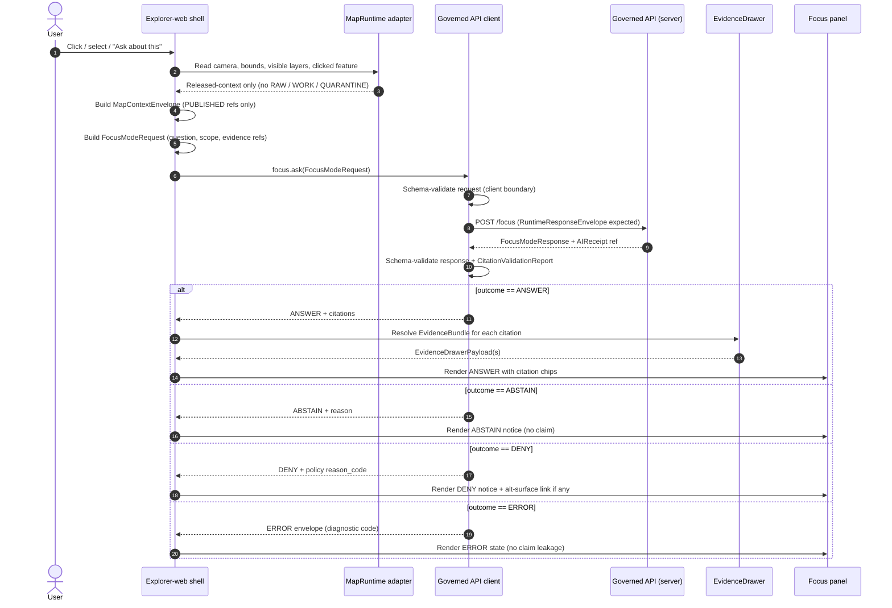
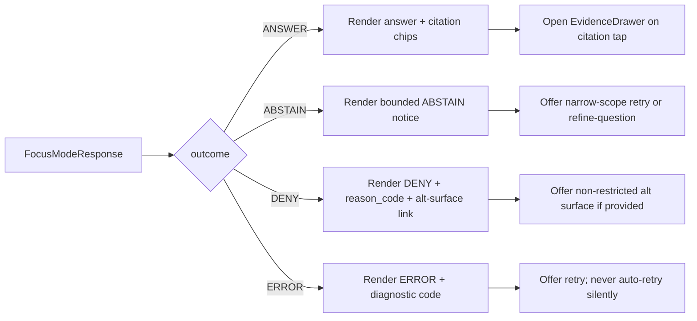
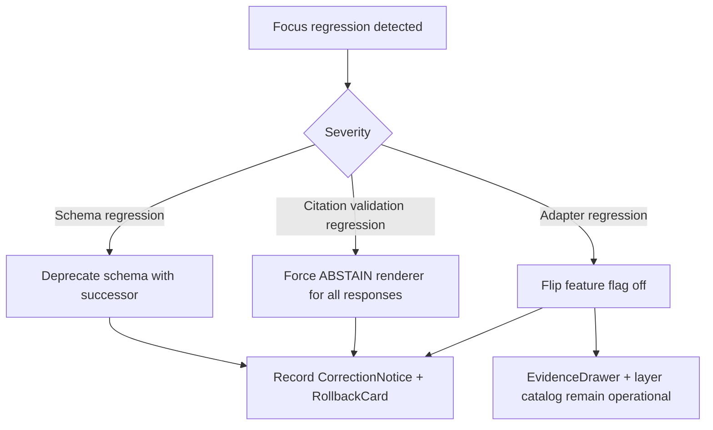

<!-- [KFM_META_BLOCK_V2]
doc_id: kfm://doc/architecture/ui/focus-flow
title: UI Focus Flow — Client-side Sequence for Focus Mode
type: standard
version: v1
status: draft
owners: Docs steward + UI subsystem owner + Governed-AI subsystem owner (PLACEHOLDER — confirm at review)
created: 2026-05-14
updated: 2026-05-14
policy_label: public
related:
  - docs/architecture/ui/README.md                # PROPOSED
  - docs/architecture/ui/STATE_OWNERSHIP.md       # PROPOSED
  - docs/architecture/ui/BOUNDARIES.md            # PROPOSED
  - docs/architecture/ui/TELEMETRY.md             # PROPOSED
  - docs/architecture/governed-ai/FOCUS_FLOW.md   # PROPOSED — server-side counterpart
  - docs/doctrine/trust-membrane.md               # PROPOSED
  - docs/doctrine/truth-posture.md                # PROPOSED
  - schemas/contracts/v1/focus/                   # PROPOSED schema home
tags: [kfm, ui, focus-mode, governed-ai, trust-membrane, finite-outcomes]
notes:
  - Path PROPOSED per Directory Rules §0 — repository not mounted in this session.
  - Sibling-path conflict surfaced: Whole-UI Expansion Report proposes governed-ai/FOCUS_FLOW.md.
  - This document covers the client-side (explorer-web) view of the flow only.
[/KFM_META_BLOCK_V2] -->

# UI Focus Flow — Client-side Sequence for Focus Mode

> The client-side sequence for the **Focus Mode** flow: what the explorer-web shell builds, what it sends through the governed API, what it renders back, and what it must **never** do directly.


|              |                                                                            |
| ------------ | -------------------------------------------------------------------------- |
| **Status**   | draft · PROPOSED until mounted-repo verification                           |
| **Owners**   | Docs steward + UI subsystem owner + Governed-AI subsystem owner (PLACEHOLDER) |
| **Updated**  | 2026-05-14                                                                 |
| **Reviewers required for change** | Subsystem owners + Policy steward (for any rule labelled MUST / MUST NOT) |

---

## Quick jump

- [1. Purpose & scope](#1-purpose--scope)
- [2. Status & authority](#2-status--authority)
- [3. Doctrinal invariants the UI must preserve](#3-doctrinal-invariants-the-ui-must-preserve)
- [4. End-to-end client sequence](#4-end-to-end-client-sequence)
- [5. Inputs the shell builds and sends](#5-inputs-the-shell-builds-and-sends)
- [6. Outputs the shell receives and renders](#6-outputs-the-shell-receives-and-renders)
- [7. Finite-outcome rendering rules](#7-finite-outcome-rendering-rules)
- [8. Citation, EvidenceDrawer, and trust-visible state](#8-citation-evidencedrawer-and-trust-visible-state)
- [9. Accessibility, keyboard, and reduced motion](#9-accessibility-keyboard-and-reduced-motion)
- [10. Telemetry constraints](#10-telemetry-constraints)
- [11. Forbidden client operations (MUST NOT)](#11-forbidden-client-operations-must-not)
- [12. Tests, fixtures, and CI gates](#12-tests-fixtures-and-ci-gates)
- [13. Feature flag and rollback path](#13-feature-flag-and-rollback-path)
- [14. Related docs](#14-related-docs)
- [15. Open questions and NEEDS VERIFICATION](#15-open-questions-and-needs-verification)
- [Appendix A — Outcome semantics reference](#appendix-a--outcome-semantics-reference)
- [Appendix B — Proposed schema and policy homes](#appendix-b--proposed-schema-and-policy-homes)

---

## 1. Purpose & scope

This document describes the **UI side** of the Focus Mode flow: the client-side behaviour of the explorer-web shell when a user invokes Focus over a `MapContextEnvelope`. It defines what the shell builds, sends, receives, validates, renders, refuses to render, and rolls back.

Out of scope:

- **Server-side** Focus Mode behaviour — evidence retrieval, policy precheck/postcheck, adapter configuration, model runtime configuration, AIReceipt emission. Those belong to the server-side counterpart, [`docs/architecture/governed-ai/FOCUS_FLOW.md`](../governed-ai/FOCUS_FLOW.md) (PROPOSED).
- **Schema definitions** for `FocusModeRequest`, `FocusModeResponse`, `MapContextEnvelope`, `EvidenceBundle`, `EvidenceDrawerPayload`, `AIReceipt`, `CitationValidationReport`, `PolicyDecision`, `RuntimeResponseEnvelope`. Those live under `schemas/contracts/v1/` (PROPOSED homes — see [Appendix B](#appendix-b--proposed-schema-and-policy-homes)).
- **Policy bundles** that gate Focus requests and responses. Those live under `policy/focus/` (PROPOSED).

This document **must not** be read as proof of implementation. The flow described here is doctrinally CONFIRMED across the KFM Whole-UI Expansion Report, the Master MapLibre Components report, and the KFM Encyclopedia; the **paths, route names, file names, and runtime behaviour are PROPOSED until verified against a mounted repository.**

[⬑ Back to top](#quick-jump)

---

## 2. Status & authority

| Field | Value |
| --- | --- |
| **Document type** | Standard architecture doc (UI subsystem) |
| **Authority of this doc** | PROPOSED until mounted-repo verification |
| **Authority of the doctrine it describes** | CONFIRMED — Focus Mode finite-outcome contract, trust-membrane invariants, cite-or-abstain posture |
| **Authority of paths quoted here** | PROPOSED until verified against mounted-repo evidence or accepted ADR |
| **Supersedes** | Nothing — this is a new client-side doc that complements the proposed server-side `docs/architecture/governed-ai/FOCUS_FLOW.md` |
| **Sibling-path notice** | The Whole-UI Expansion Report's PROPOSED tree puts a single `FOCUS_FLOW.md` under `docs/architecture/governed-ai/`. This document deliberately splits client-side and server-side concerns across two flow files. The split is **PROPOSED** and should be confirmed by ADR before publication. |
| **Reviewers required for change** | UI subsystem owner + Governed-AI subsystem owner + Policy steward (for any MUST / MUST NOT rule change) |

> [!NOTE]
> **Sibling-path conflict to resolve.** The PROPOSED tree in §29 of the Whole-UI Governed AI Expansion Report enumerates `docs/architecture/governed-ai/{...,FOCUS_FLOW}.md` and `docs/architecture/ui/{README, STATE_OWNERSHIP, ROUTE_MAP, BOUNDARIES, CONTINUITY_NOTES, LAYERING, TELEMETRY}.md`, but does **not** enumerate `docs/architecture/ui/FOCUS_FLOW.md`. Per Directory Rules §2.4, splitting a flow doc across two responsibility roots should be recorded in an ADR before this file becomes authority.

[⬑ Back to top](#quick-jump)

---

## 3. Doctrinal invariants the UI must preserve

The shell MUST preserve every invariant in this section. They are CONFIRMED from KFM doctrine across the Encyclopedia, the Master MapLibre report, and the Whole-UI Expansion Report.

| # | Invariant | Source posture |
| - | --- | --- |
| I-1 | **No direct model client.** The browser MUST NOT call a model runtime, embedding service, vector index, graph store, object store, canonical store, or any RAW / WORK / QUARANTINE surface. All Focus requests go through the governed API. | CONFIRMED |
| I-2 | **No answer from rendered features alone.** Rendered features are *candidates* for evidence resolution, never proof. The shell MUST NOT synthesise, summarise, or label features in a way that simulates a Focus answer. | CONFIRMED |
| I-3 | **No uncited Focus output.** Any rendered ANSWER MUST be accompanied by `citations`, an `EvidenceBundle` reference, and a passing `CitationValidationReport`. | CONFIRMED |
| I-4 | **No popup as Evidence Drawer substitute.** Popups MAY summarise and link; material claims resolve only through the EvidenceDrawer. | CONFIRMED |
| I-5 | **Finite outcomes only.** Every Focus response renders into exactly one of: `ANSWER`, `ABSTAIN`, `DENY`, `ERROR`. The shell MUST NOT collapse, silently degrade, or rephrase an outcome. | CONFIRMED |
| I-6 | **Trust-visible state.** Source role, rights, sensitivity, review state, freshness, release state, and correction state MUST be visible — not encoded in colour alone. | CONFIRMED |
| I-7 | **No sensitive coordinate leakage.** A Focus response over a sensitive area MUST NOT be rendered with exact coordinates, regardless of model output. The server is expected to redact / generalise / deny upstream; the client treats redacted geometry as authoritative. | CONFIRMED |
| I-8 | **PUBLISHED-only inputs.** The `MapContextEnvelope` built by the shell MUST only reference released layers, released time snapshots, and feature IDs resolvable through the governed catalog. | CONFIRMED |

> [!IMPORTANT]
> If any invariant in this section cannot be met by the shell in a given build, Focus Mode MUST be hidden behind its feature flag rather than degraded into a weaker variant. See [§13](#13-feature-flag-and-rollback-path).

[⬑ Back to top](#quick-jump)

---

## 4. End-to-end client sequence

The shell participates in a five-stage sequence: **gesture → context build → governed request → validated response → rendered finite outcome**. The diagram below shows the canonical happy-path flow plus the negative branches.



> [!NOTE]
> The diagram represents the **client-visible** stages only. Server-side stages — evidence retrieval, policy precheck, adapter call, citation validation, AIReceipt emission, policy postcheck — happen inside the `Governed API` swimlane and are documented in the server-side counterpart.

[⬑ Back to top](#quick-jump)

---

## 5. Inputs the shell builds and sends

### 5.1 `MapContextEnvelope`

The shell builds a `MapContextEnvelope` from current UI state. It carries the bounded scope the server can reason over.

| Field (CONFIRMED intent) | Source in the shell | Constraint |
| --- | --- | --- |
| Camera / viewport | MapRuntime adapter | PUBLISHED layers only |
| Bounds | MapRuntime adapter | Must match released tile/COG bounds |
| Time context (valid-time, observed-time) | Time state owner | Released snapshot only |
| Visible layers | Layer catalog state | Each layer must carry a `LayerManifest` ref |
| Selected feature(s) | Map click / keyboard alternative | Feature ID resolvable through governed catalog |
| Released layer refs | `MapReleaseManifest` ref(s) | Required |
| Policy state | Catalog response | Reflects per-layer `policy_label`, `sensitivity` |
| Evidence refs | Click-resolution result | `EvidenceRef` only; never inlined `EvidenceBundle` |

> [!CAUTION]
> The shell MUST NOT add any field that smuggles RAW / WORK / QUARANTINE identifiers, raw geometry beyond what the released layer already exposes, internal store handles, or user-typed free-text claims into the `MapContextEnvelope`. Free-text intent goes into `FocusModeRequest.question`, not into the context.

### 5.2 `FocusModeRequest`

The request wraps the context with the user's question and the requested transform.

```json
{
  "$schema": "schemas/contracts/v1/focus/focus_request.schema.json",
  "object_type": "FocusModeRequest",
  "schema_version": "v1",
  "question": "<bounded user question — illustrative>",
  "scope": "feature | layer | bbox",
  "map_context": { "$ref": "MapContextEnvelope#" },
  "evidence_refs": ["evidence://..."],
  "user_role": "public | reviewer | steward",
  "requested_transform": "summarize | compare | explain | abstain-aware",
  "client_trace_id": "<opaque non-PII trace token>"
}
```

> [!NOTE]
> The example above is **illustrative**. Authoritative field shape lives in `schemas/contracts/v1/focus/focus_request.schema.json` (PROPOSED). The shell MUST validate against the schema before send.

### 5.3 Client-side request validation

Before `focus.ask` returns, the governed API client MUST:

1. Schema-validate the `FocusModeRequest` against `focus_request.schema.json`.
2. Reject any request whose `map_context.released_layer_refs` is empty.
3. Reject any request whose `evidence_refs` contains a non-`EvidenceRef` string.
4. Strip and reject any field not declared in the schema (no smuggled extras).
5. Record a `client_trace_id` that contains no PII, no raw prompt text, and no exact restricted geometry.

[⬑ Back to top](#quick-jump)

---

## 6. Outputs the shell receives and renders

### 6.1 `FocusModeResponse`

The response is a finite-outcome envelope. Every field below is required for `ANSWER`; for non-`ANSWER` outcomes the shell renders the corresponding negative-state UI.

| Field (CONFIRMED intent) | Required for | Notes |
| --- | --- | --- |
| `outcome` | all | One of `ANSWER`, `ABSTAIN`, `DENY`, `ERROR` |
| `answer_text` | `ANSWER` | MUST be empty / null for non-answer outcomes |
| `citations[]` | `ANSWER` | Each citation MUST resolve through the EvidenceDrawer |
| `citation_validation_report_ref` | `ANSWER`, optionally `ABSTAIN` | Pass required for `ANSWER` |
| `policy_decision_ref` | `DENY`, optionally `ABSTAIN` | Carries `reason_code` |
| `abstain_reason` | `ABSTAIN` | Bounded reason; no fluent guess |
| `error_code` | `ERROR` | Diagnostic; no claim leakage |
| `ai_receipt_ref` | `ANSWER`, `ABSTAIN`, `DENY` | Server-emitted; never authored by client |
| `confidence` | `ANSWER` (optional) | Bounded by citation strength; never a sole basis |
| `limitations[]` | `ANSWER` (optional) | Plain-language scope qualifiers |

### 6.2 Client-side response validation

Before the shell renders, the governed API client MUST:

1. Schema-validate the response against `focus_response.schema.json` (PROPOSED).
2. Confirm `outcome` is one of the four finite values; **otherwise treat as `ERROR`**.
3. For `ANSWER`, dereference and check the `CitationValidationReport`. **A failing or missing report flips the render to `ABSTAIN`.**
4. For `DENY`, render the policy `reason_code` without exposing internal policy IDs.
5. Reject any response that includes raw evidence bytes, full prompts, model internals, restricted geometry, or canonical store handles.

> [!WARNING]
> A response with `outcome = ANSWER` but no passing `CitationValidationReport` is a **CitationValidationFailure**. The shell MUST surface this as `ABSTAIN — citation validation failed`, never as an answer. This is a regression-fixture-worthy case.

[⬑ Back to top](#quick-jump)

---

## 7. Finite-outcome rendering rules

Every Focus response renders through a single `FocusOutcomeRenderer`. The renderer routes by `outcome`. No outcome may be silently degraded into another.



| Outcome | What the shell renders | What the shell MUST NOT do |
| --- | --- | --- |
| **ANSWER** | Answer text, citation chips, trust-visible badges, links to EvidenceDrawer | Render without citations · invent confidence · suppress limitations |
| **ABSTAIN** | Bounded reason, "no claim emitted" indicator, refine-question affordance | Fabricate an answer · imply success · hide the abstain reason |
| **DENY** | Denial reason, policy `reason_code` (plain language), optional alt surface | Reveal internal policy IDs · hide the denial · reroute to a different lane |
| **ERROR** | Finite error envelope, diagnostic code, retry affordance | Auto-retry silently · fall through to a different outcome · leak diagnostics that reveal restricted state |

> [!TIP]
> The four-state renderer is the easiest way to keep the cite-or-abstain posture visible. Add an explicit fixture per outcome — `tests/fixtures/focus/answer.valid.json`, `abstain_missing_evidence.valid.json`, `deny_*.valid.json`, `error_*.valid.json` (PROPOSED) — and exercise each path in `tests/ui/FocusOutcomeRenderer.test.tsx` (PROPOSED).

[⬑ Back to top](#quick-jump)

---

## 8. Citation, EvidenceDrawer, and trust-visible state

The Focus panel and the EvidenceDrawer are **paired surfaces**. They share `EvidenceRef` → `EvidenceBundle` resolution but render different projections.

| Surface | Renders | Authority |
| --- | --- | --- |
| Focus panel | Finite outcome + citation chips + bounded answer text or reason | Generated language, evidence-bounded |
| EvidenceDrawer | `EvidenceDrawerPayload` — source role, rights, sensitivity, review state, freshness, release, correction lineage | Released, governed projection of `EvidenceBundle` |

Rules the client MUST follow:

1. **Every citation chip opens the EvidenceDrawer.** Tapping a chip resolves the `EvidenceRef` through the governed API and opens an `EvidenceDrawerPayload`. The chip itself is never the proof.
2. **The drawer is the only place material claims close.** Popovers, tooltips, status bubbles, and overlay labels may *preview* but MUST NOT carry citation authority.
3. **Trust badges in the drawer.** Source role, rights, sensitivity, review state, freshness, release state, and correction state each render as text-and-icon, never colour alone.
4. **Stale and degraded states are visible.** If the underlying `LayerManifest` is stale or the source is degraded, the Focus answer area MUST display a "stale" indicator alongside the citation, and the server is expected to have already abstained or down-weighted confidence.

[⬑ Back to top](#quick-jump)

---

## 9. Accessibility, keyboard, and reduced motion

Focus Mode is keyboard-first by design. The Whole-UI Expansion Report's accessibility smoke criteria apply directly:

- **Keyboard-only invocation.** Focus can be invoked, dismissed, refined, and re-asked using keyboard alone. Tab order is stable across the shell → Focus panel → citation chips → EvidenceDrawer cycle.
- **Focus trap and release.** Modal Focus dialogs trap focus on open and release it to the previously focused element on close.
- **Non-map alternatives.** Map clicks have a keyboard-accessible equivalent: selected features and Focus results appear in a list/table that mirrors the map selection. The Focus flow MUST work without a pointer-driven map click.
- **Trust badges.** Each badge (source role, rights, sensitivity, review state, freshness, release state, correction state) carries a text label, ARIA label, and icon. Colour alone is never the signal.
- **Reduced motion.** Drawer transitions, Story Node camera pans tied to Focus, and outcome reveals respect `prefers-reduced-motion`. The renderer MUST shorten or disable motion in that mode without changing semantics.
- **Outcome announcements.** Loading, cancelled, abstained, denied, error, stale, and restricted states are announced through ARIA live regions and visually differentiated.
- **Narrow viewport / touch.** Map, time context, drawer, and Focus states remain usable without hiding critical trust information.

> [!IMPORTANT]
> Accessibility is a release gate, not a polish item. `tests/accessibility/ui_shell_axe.spec.ts` and `tests/e2e/focus_negative_states.spec.ts` (PROPOSED) cover keyboard-only flow and negative-state announcement respectively. Both are CI gates.

[⬑ Back to top](#quick-jump)

---

## 10. Telemetry constraints

Telemetry from the Focus flow is **safe-by-construction**. Detailed rules live in [`docs/architecture/ui/TELEMETRY.md`](./TELEMETRY.md) (PROPOSED); the constraints that bind this flow are:

- No raw evidence bytes, prompt text, model outputs, restricted geometry, or credentials in any telemetry event.
- No full `EvidenceBundle` copies — `EvidenceRef` only.
- No PII fields. `client_trace_id` is opaque and non-correlatable.
- Diagnostics MAY include schema validation status, policy outcome category, citation pass/fail, latency buckets, and outcome class — but MUST NOT reveal restricted state.
- Telemetry events validate against `schemas/contracts/v1/telemetry/ui_event.schema.json` (PROPOSED).

[⬑ Back to top](#quick-jump)

---

## 11. Forbidden client operations (MUST NOT)

The list below restates the trust-membrane boundary as it applies to the Focus flow. Each item maps to a CI test family in [§12](#12-tests-fixtures-and-ci-gates).

| Forbidden | Why |
| --- | --- |
| Direct call to a model runtime (Ollama, hosted inference, embedding endpoint) | Bypasses policy precheck, evidence resolution, citation validation, and AIReceipt emission |
| Direct fetch from RAW, WORK, QUARANTINE, canonical stores, graph stores, object stores, vector indexes, unpublished candidates | Breaks the no-public-RAW-path invariant |
| Synthesis from rendered features alone | Rendered features are candidates, not evidence; no `EvidenceBundle` closure |
| Citation-less ANSWER render | Violates cite-or-abstain |
| Popup-as-drawer claim closure | Drawer is the only material-claim surface |
| Style-only redaction of sensitive geometry | Data still reaches the browser; redaction must happen pre-tile |
| Auto-retry on ERROR | Hides upstream failure and may leak retry-based oracle behaviour |
| Outcome rephrasing or collapsing | Finite outcomes MUST render exactly as returned |
| Telemetry containing prompts, raw evidence, restricted geometry, secrets | Breaks safe-by-construction telemetry |
| User-typed claim smuggled into `MapContextEnvelope` | Context is bounded scope, not freeform input |

[⬑ Back to top](#quick-jump)

---

## 12. Tests, fixtures, and CI gates

The Whole-UI Expansion Report enumerates the test homes; they are all PROPOSED until the repository is mounted.

| Family | Path (PROPOSED) | What it proves |
| --- | --- | --- |
| Renderer unit | `tests/ui/FocusOutcomeRenderer.test.tsx` | Each finite outcome renders correctly and is not collapsible |
| Drawer unit | `tests/ui/EvidenceDrawer.test.tsx` | Citation tap opens drawer; no claim closes outside the drawer |
| Request schema | `tests/fixtures/focus/request.valid.json` + invalid siblings | Request shape and client-side validation reject smuggled fields |
| Response schema | `tests/fixtures/focus/answer.valid.json`, `abstain_missing_evidence.valid.json`, `deny_*.valid.json`, `error_*.valid.json` | Each outcome has a contract-valid example and at least one invalid sibling |
| Citation validation | Fixture + assertion in renderer test | Failing report flips ANSWER to ABSTAIN |
| Focus validator (tooling) | `tools/validators/focus/validate_focus_response.py` | Validates response + citation report shape |
| Drawer validator (tooling) | `tools/validators/ui/validate_drawer_payload.py` | Validates `EvidenceDrawerPayload` fixtures |
| E2E happy path | `tests/e2e/ui_shell_smoke.spec.ts` | Shell loads, navigates, ASK works on fixture |
| E2E negative states | `tests/e2e/focus_negative_states.spec.ts` | `ABSTAIN` / `DENY` / `ERROR` render correctly under keyboard |
| Accessibility | `tests/accessibility/ui_shell_axe.spec.ts` | Keyboard-only path, ARIA live, contrast, focus trap |
| CI workflow | `.github/workflows/ui-governed.yml`, `.github/workflows/contracts-ui-ai.yml` | PR-safe schema + component + e2e + a11y |

> [!NOTE]
> Negative-state fixtures (`ABSTAIN` / `DENY` / `ERROR`) are not optional. The renderer being able to render an answer is uninteresting; the renderer correctly refusing to render an answer is the test.

[⬑ Back to top](#quick-jump)

---

## 13. Feature flag and rollback path

CONFIRMED rollback discipline from the Whole-UI Expansion Report §26:

- **Feature flag.** The Focus route MUST sit behind a feature flag. With the flag off, Focus is hidden and the rest of the shell — layer catalog, EvidenceDrawer, time controls — continues to function.
- **Mock adapter survives rollback.** The mock fixture adapter remains in tests even when the live Focus route is disabled.
- **No payload contract change on rollback.** Disabling Focus MUST NOT change the response contract for any other governed API surface.
- **Schema deprecation, not deletion.** If a Focus schema has been released, deprecate with versioned successor rather than deleting silently.
- **Rollback drill.** A documented drill in `docs/runbooks/governed_ai_ROLLBACK.md` (PROPOSED) covers feature-flag flip, MockAdapter retention, fixture regression, and EvidenceDrawer independence.



[⬑ Back to top](#quick-jump)

---

## 14. Related docs

All links are PROPOSED until the repository is mounted.

- [`docs/architecture/ui/README.md`](./README.md) — UI subsystem overview
- [`docs/architecture/ui/STATE_OWNERSHIP.md`](./STATE_OWNERSHIP.md) — Map, time, layer, drawer, Focus, story, review state ownership
- [`docs/architecture/ui/BOUNDARIES.md`](./BOUNDARIES.md) — Browser allowed/forbidden operations, MapLibre adapter boundary
- [`docs/architecture/ui/TELEMETRY.md`](./TELEMETRY.md) — Safe UI event envelope and forbidden telemetry payloads
- [`docs/architecture/governed-ai/FOCUS_FLOW.md`](../governed-ai/FOCUS_FLOW.md) — Server-side counterpart (evidence retrieval, adapter, policy pre/post, AIReceipt)
- [`docs/architecture/governed-ai/STATE_OWNERSHIP.md`](../governed-ai/STATE_OWNERSHIP.md) — Server-side state ownership for Focus
- [`docs/doctrine/trust-membrane.md`](../../doctrine/trust-membrane.md) — Trust membrane invariants
- [`docs/doctrine/truth-posture.md`](../../doctrine/truth-posture.md) — Cite-or-abstain posture
- [`docs/doctrine/lifecycle-law.md`](../../doctrine/lifecycle-law.md) — `RAW → WORK / QUARANTINE → PROCESSED → CATALOG / TRIPLET → PUBLISHED`
- [`docs/doctrine/directory-rules.md`](../../doctrine/directory-rules.md) — Placement authority
- [`schemas/contracts/v1/focus/`](../../../schemas/contracts/v1/focus/) — `focus_request`, `focus_response`, `citation_validation_report`
- [`schemas/contracts/v1/ui/evidence_drawer_payload.schema.json`](../../../schemas/contracts/v1/ui/evidence_drawer_payload.schema.json)
- [`schemas/contracts/v1/runtime/runtime_response_envelope.schema.json`](../../../schemas/contracts/v1/runtime/runtime_response_envelope.schema.json)
- [`policy/focus/`](../../../policy/focus/) — Focus policy precheck / postcheck (server-side)

[⬑ Back to top](#quick-jump)

---

## 15. Open questions and NEEDS VERIFICATION

| # | Item | Status | Resolution path |
| - | --- | --- | --- |
| OQ-1 | Whether `FOCUS_FLOW.md` should be split across `ui/` and `governed-ai/` or live as a single doc under `governed-ai/` per the Whole-UI Expansion Report's PROPOSED tree | NEEDS VERIFICATION | ADR + repo inspection |
| OQ-2 | Whether the explorer-web app path is `apps/explorer-web/` or another location | UNKNOWN | Mount repo; adapt paths |
| OQ-3 | Final field set and validation rules for `FocusModeRequest.requested_transform` | PROPOSED | Schema review when `focus_request.schema.json` lands |
| OQ-4 | Whether `client_trace_id` and `ai_receipt_ref` correlation is permitted, and under what telemetry policy | NEEDS VERIFICATION | `docs/architecture/ui/TELEMETRY.md` + policy steward review |
| OQ-5 | Interaction-to-drawer latency SLO and Focus-answer latency SLO | NEEDS VERIFICATION | Measurement run on mounted repo |
| OQ-6 | Whether `HOLD` (per Atlas §24.3) ever surfaces in a `FocusModeResponse`, or remains a promotion-only outcome | NEEDS VERIFICATION | Cross-check with governed-ai owner |
| OQ-7 | Exact path home for the server-side `FOCUS_FLOW.md` counterpart and ADR number | PROPOSED | Whole-UI Expansion Report cites `docs/architecture/governed-ai/FOCUS_FLOW.md`; confirm by ADR |

[⬑ Back to top](#quick-jump)

---

<details>
<summary><strong>Appendix A — Outcome semantics reference</strong></summary>

CONFIRMED from KFM Encyclopedia §I "AI and Focus Mode possibilities" and KFM Domains Culmination Atlas §24.3 "Master Decision Outcome Envelope Reference".

| Outcome | When (CONFIRMED doctrine) | Required artifacts | Public-surface effect |
| --- | --- | --- | --- |
| **ANSWER** | Evidence sufficient, policy permits, release allows, review (if required) recorded | `EvidenceBundle` resolved; `PolicyDecision = allow`; `ReleaseManifest` applies; `CitationValidationReport` pass | Substantive answer with EvidenceDrawer access and citation chips |
| **ABSTAIN** | Evidence insufficient / incomplete; cannot cite; stale with no released alternative | `AIReceipt` with reason; no claim emitted | Non-substantive bounded note with reason; never invents |
| **DENY** | Policy, rights, sensitivity, or release state forbids the answer. Sensitive lanes default here. | `PolicyDecision = deny` + `reason_code`; `AIReceipt` records denial | Denial reason; alternative non-restricted surface offered where possible |
| **ERROR** | The governed API cannot evaluate — missing schema, malformed query, contract violation, infrastructure failure | Error envelope with diagnostic code, no claim leakage | Finite, actionable error; never silent fall-through |

Outcomes not used by Focus Mode but observed elsewhere in KFM (`HOLD`, `PASS`, `FAIL`) belong to validator and promotion lanes; see Atlas §24.3.

</details>

<details>
<summary><strong>Appendix B — Proposed schema and policy homes</strong></summary>

All paths PROPOSED until mounted-repo verification (Directory Rules §0). Schema home convention is `schemas/contracts/v1/<…>` per ADR-0001.

| Object family | Schema home (PROPOSED) | Policy home (PROPOSED) | Fixture home (PROPOSED) |
| --- | --- | --- | --- |
| `FocusModeRequest` | `schemas/contracts/v1/focus/focus_request.schema.json` | `policy/focus/focus_request.rego` | `tests/fixtures/focus/request.*.json` |
| `FocusModeResponse` | `schemas/contracts/v1/focus/focus_response.schema.json` | `policy/focus/focus_response.rego` | `tests/fixtures/focus/{answer,abstain,deny,error}*.json` |
| `MapContextEnvelope` | `schemas/contracts/v1/ui/map_context_envelope.schema.json` | (covered by `policy/ui/`) | `tests/fixtures/ui/map_context_envelope/*.json` |
| `EvidenceBundle` | `schemas/contracts/v1/evidence/evidence_bundle.schema.json` | `policy/evidence/` | `tests/fixtures/evidence/*.json` |
| `EvidenceDrawerPayload` | `schemas/contracts/v1/ui/evidence_drawer_payload.schema.json` | `policy/evidence/drawer_payload.rego` | `tests/fixtures/ui/evidence_drawer/*.json` |
| `CitationValidationReport` | `schemas/contracts/v1/focus/citation_validation_report.schema.json` | covered by `policy/focus/` | `tests/fixtures/focus/citation_*.json` |
| `AIReceipt` | `schemas/contracts/v1/runtime/ai_receipt.schema.json` | covered by `policy/focus/` | `tests/fixtures/runtime/ai_receipt/*.json` |
| `PolicyDecision` | `schemas/contracts/v1/runtime/policy_decision.schema.json` | n/a (object family) | `tests/fixtures/runtime/policy_decision/*.json` |
| `RuntimeResponseEnvelope` | `schemas/contracts/v1/runtime/runtime_response_envelope.schema.json` | n/a | `tests/fixtures/runtime/response_envelope/*.json` |
| UI telemetry event | `schemas/contracts/v1/telemetry/ui_event.schema.json` | `policy/telemetry/` | `tests/fixtures/telemetry/*.json` |

</details>

---

**Related docs:**
[ui/README](./README.md) ·
[ui/STATE_OWNERSHIP](./STATE_OWNERSHIP.md) ·
[ui/BOUNDARIES](./BOUNDARIES.md) ·
[ui/TELEMETRY](./TELEMETRY.md) ·
[governed-ai/FOCUS_FLOW](../governed-ai/FOCUS_FLOW.md) ·
[doctrine/trust-membrane](../../doctrine/trust-membrane.md) ·
[doctrine/truth-posture](../../doctrine/truth-posture.md)

**Last updated:** 2026-05-14 · **Status:** draft · PROPOSED until mounted-repo verification · [⬑ Back to top](#quick-jump)
