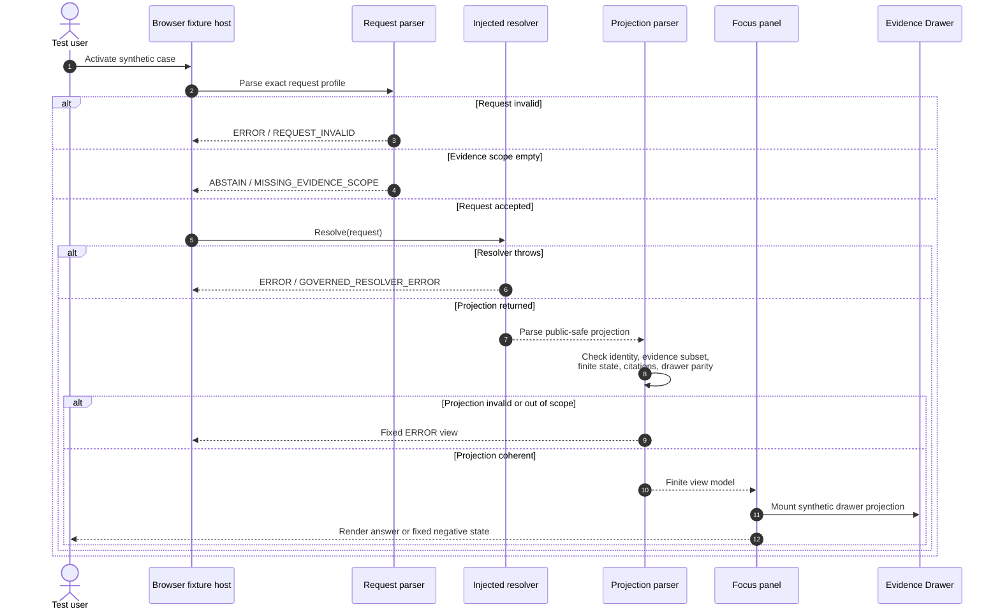
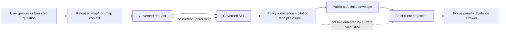

<a id="top"></a>

<!-- [KFM_META_BLOCK_V2]
doc_id: kfm://doc/architecture/ui/focus-flow
title: UI Focus Flow — Current Client Boundary and Fixture-First Projection
type: architecture-reference
version: v2.0-draft
status: "draft; repository-grounded; fixture-first; bounded-executable; no-live-focus-route; no-release; no-publication"
owners:
  - "@bartytime4life — verified CODEOWNERS review route"
  - "NEEDS VERIFICATION — independent UI, accessibility, governed-AI, governed-API, evidence, policy, security, and release stewardship"
created: 2026-05-14
updated: 2026-08-19
policy_label: "public; architecture; ui; focus-mode; trust-membrane; fail-closed; no-release; no-publication"
owning_root: docs/
current_path: docs/architecture/ui/FOCUS_FLOW.md
responsibility: >-
  Explain the client-side Focus interaction boundary, the current fixture-first
  composed-claim projection, the finite rendering and Evidence Drawer handoff,
  and the remaining governed runtime obligations without becoming doctrine,
  semantic contract, machine schema, policy, evidence, release, runtime, or
  publication authority.
truth_posture: >-
  CONFIRMED same-path placement, accepted Directory Rules decision,
  repository-present fixture-first Focus modules, strict parsers, injected
  resolver, finite view model, Evidence Drawer parity, unit and browser tests,
  synthetic fixtures, and generated authoring receipt / PROPOSED generic
  FocusModeRequest and FocusModeResponse contract convergence, live governed
  transport, policy execution, evidence resolution, model-adapter execution,
  citation service, site integration, feature flag, telemetry, release binding,
  and public use / UNKNOWN deployed behavior and operational effectiveness.
evidence_snapshot:
  repository: bartytime4life/Kansas-Frontier-Matrix
  base_ref: main
  base_commit: 68603b748d859884f5e140467285b5ae71d093a9
  target_prior_blob: 8fe05c4de128a371fab7c2111ec3d9145f1089b3
  directory_rules_blob: fd49a0b83e55cef52c1124281f093e263526898d
  directory_rules_decision: ADR-0029 accepted
  codeowners_blob: dd2a84aa514d8ecd9208bc347f90f9a2ed37dd61
  convergence_plan_blob: 099dedf747342db4f4b08ec29267292e47456aa9
  ui_readme_blob: 36d975710d906a6c4146c550d40929b1822b667e
  ui_boundaries_blob: 65573b7ed78ded3a345739413b7b51bfe86b3dbe
  governed_ai_focus_flow_blob: 2dc6213d667e7d2f130427355c5af6b7d59813e2
  explorer_package_blob: ddd201b74a06001d84a14bf54ac62a6cc3607a29
  explorer_main_blob: 86c16e43e03601e65eb01b0b4949f7850089e877
  explorer_site_blob: aa60d41dffdf14f44d1c5eb2817c379623a0c855
  focus_feature_readme_blob: 2c0445537f682ca1c84cc3713b62b108e84ae1f0
  focus_types_blob: 919ba17b92405d0998689ca8579fa42e74f4df60
  focus_parsers_blob: 35f068145735430ad05d7bd7e4db6c4fe017a19b
  focus_resolver_blob: 45aa4e7479a8c95138f98cc48c846f39a16aec2d
  focus_panel_blob: 47fb994c88ccb4dec6872d1b42d560787492dfe9
  focus_unit_test_blob: c32dbb2ccfa73b0b195aff3c231c19c5e8a19333
  focus_browser_test_blob: 108decf21622b27a960cd31bfaa8a0ea8df512e3
  focus_fixture_readme_blob: b38b88b4e4e62817e8a4429f2da1a15a9656fcb0
  composed_claim_contract_blob: eaa4ab9cc3d9400a9255b227795480485fa73f1b
  focus_schema_readme_blob: 5debcb6f96e5eaa2e5bd91effa8e9c16c50c2e8d
  focus_request_schema_blob: a2f298f014fa299bdec03afbf14ba9937aa95ef8
  governed_api_registry_blob: 3418168d0b267160d6ad6dd87f289e880ef4a024
  focus_authoring_receipt_blob: 72f876febfc6587f4bfe08f589952baa26684461
related:
  - ./README.md
  - ./BOUNDARIES.md
  - ./ACCESSIBILITY.md
  - ./EVIDENCE_DRAWER.md
  - ./TELEMETRY.md
  - ../governed-ai/FOCUS_FLOW.md
  - ../governed-api.md
  - ../document-convergence-plan.md
  - ../../doctrine/directory-rules.md
  - ../../doctrine/trust-membrane.md
  - ../../adr/ADR-0029-adopt-directory-governance-standard-v2.md
  - ../../../apps/explorer-web/src/features/focus_panel/README.md
  - ../../../apps/explorer-web/src/features/focus_panel/COMPOSED_CLAIM_FIXTURE.md
  - ../../../contracts/evidence/composed_claim_dependency_closure.md
  - ../../../schemas/contracts/v1/focus/README.md
  - ../../../policy/focus/README.md
tags: [kfm, architecture, ui, focus-mode, composed-claim, evidence-drawer, finite-outcomes, fixture-first, fail-closed]
notes:
  - "Same-path documentation-only reconciliation; no runtime, contract, schema, policy, fixture, test, route, data, release, deployment, or publication mutation."
  - "The architecture convergence plan assigns SPLIT: this page owns client interaction and projection; governed-ai/FOCUS_FLOW.md owns the proposed evidence/model decision flow."
  - "The current executable Focus slice is a synthetic composed-claim projection used by focused unit and browser fixtures; it is not mounted in the normal Explorer site and has no governed API Focus route."
  - "Legacy numbered headings and Appendix A/B titles are retained for inbound fragment compatibility."
[/KFM_META_BLOCK_V2] -->

<a id="ui-focus-flow--client-side-sequence-for-focus-mode"></a>

# UI Focus Flow — Current Client Boundary and Fixture-First Projection

> **Operating rule.** The browser may compose a bounded request, validate a public-safe projection, and render one finite outcome. It does not resolve truth, execute policy, call a model, approve review, release evidence, or publish a claim.


> [!IMPORTANT]
> **Current bounded result.** KFM now has a strict, no-network Explorer Focus projection for synthetic composed claims, with finite `ANSWER`, `ABSTAIN`, `DENY`, and `ERROR` views, EvidenceRef-scope checks, Evidence Drawer parity, fixed no-leak negative copy, and focused unit/browser tests. It is not mounted in the normal Explorer site and is not backed by a governed API Focus route.

> [!CAUTION]
> **The generic Focus architecture is not implementation proof.** `schemas/contracts/v1/focus/focus_request.schema.json`, `focus_response.schema.json`, and `citation_validation_report.schema.json` remain permissive scaffolds. `policy/focus/` remains draft/scaffolded. The current app-local profile is enforced by strict TypeScript parsers and synthetic fixtures; it does not establish canonical Focus request/response schema authority.

> [!WARNING]
> **No browser-to-model or browser-to-store path is authorized.** A rendered answer is permitted only inside the bounded synthetic profile when its projection is policy-allowed, reviewed, released, current, citation-closed, Evidence Drawer-consistent, and bound to an AIReceipt reference. Those declarations are fixture assertions, not authentication of real policy, review, release, or evidence.

## Current bounded result

| Field | Current result |
|---|---|
| **Evidence snapshot** | `main@68603b748d859884f5e140467285b5ae71d093a9` |
| **Directory result** | `SPLIT` at the existing paths: this page owns client interaction/projection; [`governed-ai/FOCUS_FLOW.md`](../governed-ai/FOCUS_FLOW.md) owns the proposed server evidence/model decision flow. No file move occurs here. |
| **Current client profile** | `kfm.explorer.focus-composed-claim-request.v1` → `kfm.explorer.focus-composed-claim.public-safe.v1` |
| **Executable scope** | Exact-field request/projection parsing, injected-resolver orchestration, request/claim identity binding, EvidenceRef allowlist enforcement, finite view-model derivation, DOM rendering, synthetic Evidence Drawer handoff, keyboard close/focus return |
| **Current fixture closure** | `SUPPORTED` and `QUALIFIED` map to `ANSWER`; unresolved closure maps to `ABSTAIN`; policy denial maps to `DENY`; malformed/upstream/scope failures map to `ERROR` |
| **Normal Explorer integration** | **Not established.** `main.ts` mounts `mountExplorerSite`; the normal site composes the baseline shell and synthetic map-evidence bridge, not the Focus composed-claim fixture |
| **Governed API integration** | **Not established.** The route registry contains only `/bootstrap`, `/layers`, and `/evidence`; there is no `/focus` route |
| **Schema/policy maturity** | **PROPOSED scaffolds.** Generic Focus JSON Schemas are permissive; Focus Rego files do not establish a complete executable policy |
| **Model/evidence execution** | None. The resolver is injected; the feature performs no transport, model, policy, evidence-store, graph/vector-store, renderer, or lifecycle-store access |
| **Release/public effect** | None. The code, fixtures, tests, receipt, this document, and any pull request are not release or publication authority |

## Quick jump

- [0. Evidence basis and responsibility split](#0-evidence-basis-and-responsibility-split)
- [1. Purpose & scope](#1-purpose--scope)
- [2. Status & authority](#2-status--authority)
- [3. Doctrinal invariants the UI must preserve](#3-doctrinal-invariants-the-ui-must-preserve)
- [4. End-to-end client sequence](#4-end-to-end-client-sequence)
- [5. Inputs the shell builds and sends](#5-inputs-the-shell-builds-and-sends)
- [6. Outputs the shell receives and renders](#6-outputs-the-shell-receives-and-renders)
- [7. Finite-outcome rendering rules](#7-finite-outcome-rendering-rules)
- [8. Citation, EvidenceDrawer, and trust-visible state](#8-citation-evidencedrawer-and-trust-visible-state)
- [9. Accessibility, keyboard, and reduced motion](#9-accessibility-keyboard-and-reduced-motion)
- [10. Telemetry constraints](#10-telemetry-constraints)
- [11. Forbidden client operations (MUST NOT)](#11-forbidden-client-operations-must-not)
- [12. Tests, fixtures, and CI gates](#12-tests-fixtures-and-ci-gates)
- [13. Feature flag and rollback path](#13-feature-flag-and-rollback-path)
- [14. Related docs](#14-related-docs)
- [15. Open questions and NEEDS VERIFICATION](#15-open-questions-and-needs-verification)
- [Appendix A — Outcome semantics reference](#appendix-a--outcome-semantics-reference)
- [Appendix B — Current authority and compatibility map](#appendix-b--current-authority-and-compatibility-map)

---

## 0. Evidence basis and responsibility split

### 0.1 Placement

Accepted [`ADR-0029`](../../adr/ADR-0029-adopt-directory-governance-standard-v2.md) adopts [`directory-rules.md`](../../doctrine/directory-rules.md). This existing page explains UI architecture to humans and remains under `docs/architecture/ui/`. The architecture convergence plan records a provisional `SPLIT`, not a move:

- **this page** — client request/projection boundary, finite rendering, Evidence Drawer handoff, accessibility, and browser negative authority;
- **[`docs/architecture/governed-ai/FOCUS_FLOW.md`](../governed-ai/FOCUS_FLOW.md)** — proposed server-side scope, policy, evidence, adapter, citation, postcheck, and response-envelope flow.

The split prevents the browser interaction model from absorbing evidence, policy, model, or release authority. It also prevents the server-flow page from becoming the source of UI behavior.

### 0.2 Evidence used for current-state claims

| Evidence surface | What it proves | What it does not prove |
|---|---|---|
| [`types.ts`](../../../apps/explorer-web/src/features/focus_panel/types.ts) | Current app-local profiles, closed outcome vocabularies, request/projection/view-model fields | Canonical contract or schema authority |
| [`parsers.ts`](../../../apps/explorer-web/src/features/focus_panel/parsers.ts) | Exact-field parsing, bounded strings/arrays, HTTPS citations, answer/negative-state coherence, Evidence Drawer parity | Live evidence, policy, review, release, or citation service execution |
| [`resolver.ts`](../../../apps/explorer-web/src/features/focus_panel/resolver.ts) | Injected resolver, empty-scope abstention, identity binding, EvidenceRef subset enforcement, fixed local failures | Network transport or governed API integration |
| [`panel.ts`](../../../apps/explorer-web/src/features/focus_panel/panel.ts) | DOM projection, finite labels, embedded drawer, ARIA live behavior, Escape close, focus return | Normal site mounting, modal focus trap, route integration, or public deployment |
| Unit and browser tests | Source-level assertions and executable test definitions for supported, qualified, abstained, denied, and error paths | That every current-main or deployed environment has executed and passed them |
| Synthetic fixtures | Deterministic public-safe examples | Real EvidenceRef resolution, real policy, real human review, real release, or public use |
| Generated authoring receipt | Authored artifact inventory, hashes, and recorded authoring validation posture | Independent human review, release proof, or runtime effectiveness |
| Governed API registry | Current registered route set | A Focus route, authentication, authorization, or production service |

### 0.3 Current-vs-target boundary

| Concern | CONFIRMED current bounded slice | PROPOSED target |
|---|---|---|
| Request | `FocusComposedClaimRequest` with claim ID, question, and allowed EvidenceRefs | General `FocusModeRequest` with map/non-map context, audience, purpose, transform, and governed identity |
| Resolver | Injected function supplied by fixture/test host | Authenticated Governed API transport |
| Evidence | Allowlisted opaque refs and fixture-declared closure | `EvidenceRef` resolution to authenticated `EvidenceBundle` |
| Policy | Projection-declared finite state checked for internal consistency | Executed precheck/postcheck with auditable `PolicyDecision` |
| Generation | No model call | Governed adapter over admissible evidence only |
| Citations | HTTPS citation/evidence/drawer parity inside projection | Independent `CitationValidationReport` service |
| Receipt | Opaque AIReceipt reference shown as process memory | Persisted, digest-bound runtime receipt linked to effective adapter/prompt/policy |
| UI | Browser test fixture panel and drawer | Normal Explorer route/feature integration behind a governed kill switch |
| Publication | None | Released public-safe output only after release/correction/rollback closure |

[Back to top](#top)

---

## 1. Purpose & scope

This page explains the **client-side Focus flow** as it exists now and the boundary a future live flow must preserve.

### In scope

- the current app-local composed-claim request and public-safe projection profiles;
- strict browser parsing and scope binding;
- finite outcome mapping and view-model behavior;
- synthetic Evidence Drawer parity and handoff;
- fixed no-leak negative states;
- accessibility mechanics proved by source and browser-test definitions;
- current non-integration with the normal Explorer site and Governed API;
- graduation evidence required before a live Focus route or public user path.

### Out of scope

- server evidence retrieval, `EvidenceRef` resolution, policy execution, model adapters, prompt assembly, citation-service execution, AIReceipt persistence, or response-envelope emission;
- redefining [`ComposedClaimDependencyClosureCandidate`](../../../contracts/evidence/composed_claim_dependency_closure.md);
- defining field-level JSON Schema or Rego in architecture prose;
- accepting proposed ADRs or choosing among overlapping contract/schema homes;
- activating a model, source, API route, feature flag, release, deployment, or publication;
- treating a synthetic fixture's `REVIEWED`, `RELEASED`, `CURRENT`, or `ALLOW` declaration as authenticated real-world state.

> [!NOTE]
> The current implementation is narrower than the old document described. It does not build a full `MapContextEnvelope`, does not call `POST /focus`, and does not validate against the permissive generic Focus JSON Schema scaffolds. It parses a closed app-local request and a closed public-safe projection.

[Back to top](#top)

---

## 2. Status & authority

### 2.1 Authority by question

| Question | Controlling evidence |
|---|---|
| Where does this page belong? | Accepted ADR-0029, adopted Directory Rules, existing `docs/architecture/ui/` lane, and the convergence plan's `SPLIT` disposition |
| What currently executes in the browser feature? | Pinned `types.ts`, `parsers.ts`, `resolver.ts`, `panel.ts`, fixtures, unit tests, and browser tests |
| What does composed-claim closure mean? | [`contracts/evidence/composed_claim_dependency_closure.md`](../../../contracts/evidence/composed_claim_dependency_closure.md) and its paired schema/validator/tests |
| What should generic Focus requests/responses mean? | Applicable semantic contracts after overlap resolution; not this page |
| What machine shape is canonical? | An accepted schema family after current `focus/` versus `ui/` overlap is resolved |
| Is exposure allowed? | Executed policy, evidence, rights, sensitivity, review, release, correction, and rollback state |
| Is a live Focus answer public? | Governed release and deployed public-safe runtime evidence, not UI rendering or a schema-valid fixture |

### 2.2 Decision posture

| Decision | Current state |
|---|---|
| UI/governed-AI documentation split | **PROVISIONAL / repository-present.** The convergence plan recommends subsystem responsibility separation; no accepted ADR is claimed here |
| Finite UI outcomes | **CONFIRMED current code vocabulary:** `ANSWER`, `ABSTAIN`, `DENY`, `ERROR` |
| Composed-claim closure mapping | **CONFIRMED current fixture profile:** `SUPPORTED`/`QUALIFIED` → `ANSWER`; negative closure remains negative |
| Generic Focus request/response schema authority | **HOLD.** Focus schemas are permissive scaffolds and overlap UI contract references |
| Live Focus route | **ABSENT from the inspected route registry** |
| Normal Explorer Focus user path | **Not established** |
| Model/provider integration | **Not established** |
| Policy/evidence/citation/release integration | **Not established** |

> [!IMPORTANT]
> Repository presence proves bytes and bounded source behavior. It does not prove a production trust chain, public availability, policy effectiveness, or publication.

[Back to top](#top)

---

## 3. Doctrinal invariants the UI must preserve

The invariants below combine KFM doctrine with the current app-local enforcement surface. “Current guard” means a bounded source/test mechanism exists; it is not production certification.

| ID | Invariant | Current guard |
|---|---|---|
| **I-1** | **No direct model client.** Browser Focus code must not call OpenAI, Ollama, Anthropic, Google model APIs, embeddings, or another provider. | Focus source test rejects provider imports and the implementation injects a resolver |
| **I-2** | **No direct lifecycle or canonical-store client.** RAW, WORK, QUARANTINE, PROCESSED, catalog/triplet internals, graph/vector stores, and unpublished candidates remain outside the browser path. | Source test rejects lifecycle-store imports; no transport exists in the feature |
| **I-3** | **Rendered context is scope, not evidence.** A map selection or visible property may seed a request but cannot become an answer by itself. | Current request requires an explicit claim ID, bounded question, and allowed EvidenceRefs |
| **I-4** | **Request scope is closed.** Unknown fields, duplicate refs, unsafe IDs, padded/control-character text, and oversized arrays fail closed. | Exact-field request parser |
| **I-5** | **Response identity and evidence stay inside request scope.** Request ID, claim ID, Focus EvidenceRefs, and drawer EvidenceRefs must match the submitted request. | Resolver identity checks and EvidenceRef subset enforcement |
| **I-6** | **Finite outcomes do not collapse.** Unknown or incoherent combinations become `ERROR`; the UI does not invent or silently upgrade an answer. | Closed enums and projection-combination validator |
| **I-7** | **An answer requires visible closure.** `ANSWER` requires evidence, citations, resolved roles, `ALLOW`, `REVIEWED`, `RELEASED`, `CURRENT`, an AIReceipt ref, and an `ANSWER` drawer. | Projection parser |
| **I-8** | **Qualified support remains qualified.** Missing optional roles and limitations stay visible. | `QUALIFIED` view labels unavailable optional roles and renders limitations |
| **I-9** | **Negative states disclose no protected diagnostics.** `ABSTAIN`, `DENY`, and local `ERROR` use fixed copy and sanitized drawer projections. | Resolver/parser sanitization and canary tests |
| **I-10** | **Citation and drawer support agree.** Every answer citation and EvidenceRef must match the Evidence Drawer projection. | Citation/EvidenceRef/drawer parity checks |
| **I-11** | **AIReceipt is process memory, not release proof.** The client may display an opaque receipt ref only with that limitation. | View-model label adds “not release proof” |
| **I-12** | **Fixture success is not public authority.** No current fixture, test, receipt, document, or branch can release or publish a Focus answer. | Explicit non-effects; no live route or site integration |

If a future integration cannot preserve these invariants, it must remain off the normal Explorer path and return a finite negative state rather than weakening the contract.

[Back to top](#top)

---

## 4. End-to-end client sequence

Two flows must remain distinct: the **CONFIRMED current synthetic client flow** and the **PROPOSED live governed flow**.

### 4.1 Current fixture-first flow


```mermaid
sequenceDiagram
    autonumber
    actor U as Test user
    participant H as Browser fixture host
    participant P as Request parser
    participant R as Injected resolver
    participant V as Projection parser
    participant F as Focus panel
    participant D as Evidence Drawer

    U->>H: Activate synthetic case
    H->>P: Parse exact request profile
    alt Request invalid
        P-->>H: ERROR / REQUEST_INVALID
    else Evidence scope empty
        P-->>H: ABSTAIN / MISSING_EVIDENCE_SCOPE
    else Request accepted
        H->>R: Resolve(request)
        alt Resolver throws
            R-->>H: ERROR / GOVERNED_RESOLVER_ERROR
        else Projection returned
            R-->>V: Parse public-safe projection
            V->>V: Check identity, evidence subset,<br/>finite state, citations, drawer parity
            alt Projection invalid or out of scope
                V-->>H: Fixed ERROR view
            else Projection coherent
                V-->>F: Finite view model
                F->>D: Mount synthetic drawer projection
                F-->>U: Render answer or fixed negative state
            end
        end
    end
```

### 4.2 Current mounting boundary

The reusable Focus modules are exported from `focus_panel/index.tsx`, but the inspected normal Explorer entrypoint mounts `mountExplorerSite`, and the site composes the baseline shell plus a synthetic **map-selection-to-Evidence-Drawer** lab. Repository search found `mountFocusComposedClaimFixture` only in the Focus module and browser-test fixture.

Therefore:

- the Focus composed-claim panel is **CONFIRMED executable in focused fixture/test surfaces**;
- a normal Explorer navigation route, map gesture, production panel mount, or public user path is **not established**;
- absence from the normal site is not an implemented feature flag or kill switch.

### 4.3 Proposed live governed flow


```mermaid
flowchart LR
    U[User gesture or bounded question]
    C[Released map/non-map context]
    Q[Governed request]
    API[Governed API]
    PE[Policy + evidence + citation + receipt closure]
    E[Public-safe finite envelope]
    CP[Strict client projection]
    UI[Focus panel + Evidence Drawer]

    U --> C --> Q --> API --> PE --> E --> CP --> UI
    Q -. "no current Focus route" .-> API
    PE -. "not implemented by current client slice" .-> CP
```

The target flow may use different DTO names after contract/schema convergence. This page does not make `POST /focus`, `FocusModeRequest`, `FocusModeResponse`, or any route authoritative.

[Back to top](#top)

---

## 5. Inputs the shell builds and sends

### 5.1 Current app-local request

The current parser accepts exactly five serialized fields:

```json
{
  "profile": "kfm.explorer.focus-composed-claim-request.v1",
  "request_id": "request:focus:synthetic-001",
  "claim_id": "claim:synthetic:001",
  "question": "What does the released synthetic evidence support?",
  "allowed_evidence_refs": [
    "kfm:evidence:synthetic:source-001"
  ]
}
```

The normalized in-memory type exposes:

| Field | Current constraint |
|---|---|
| `profile` | Exact app-local profile constant |
| `request_id` | Bounded safe ID |
| `claim_id` | Bounded safe ID |
| `question` | Non-empty, trimmed, no control characters, maximum 320 characters |
| `allowed_evidence_refs` | Unique bounded IDs, maximum 16; an empty set yields local `ABSTAIN` without calling the resolver |

Unknown fields are rejected rather than stripped. The current request does not carry camera, bounds, visible layers, time, user role, requested transform, telemetry trace, raw prompt bundle, inline evidence, or policy payload.

### 5.2 Proposed broader request context

A future generic request may need:

- a released `MapContextEnvelope` or bounded non-map context;
- selected feature/layer/time/version identities;
- caller/audience and declared purpose;
- requested transform;
- policy-relevant context supplied by a governed boundary;
- deterministic correlation and receipt binding.

Those fields remain **PROPOSED** until semantic contract ownership, schema family, policy inputs, privacy posture, and live transport are closed. They must not be added ad hoc to the app-local profile.

### 5.3 Generic schema warning

[`schemas/contracts/v1/focus/focus_request.schema.json`](../../../schemas/contracts/v1/focus/focus_request.schema.json) currently has empty `properties` and `additionalProperties: true`. It does not describe or validate the current exact app-local request. The Focus schema family README records overlap with UI request/response contract paths.

A future integration must either:

1. adopt a closed canonical schema and generate/adapt the client boundary from it; or
2. explicitly register the app-local profile as a bounded compatibility projection.

It must not present both as independent authorities.

[Back to top](#top)

---

## 6. Outputs the shell receives and renders

### 6.1 Current public-safe projection

The current parser accepts a closed projection containing:

| Group | Fields |
|---|---|
| Identity | `profile`, `request_id`, `claim_id`, `closure_id` |
| Finite state | `outcome`, `reason_code`, `closure_outcome` |
| Claim projection | `answer`, `limitations` |
| Evidence | `evidence_refs`, `citations`, `evidence_drawer` |
| Dependency visibility | `resolved_roles`, `unavailable_roles` |
| Trust declarations | `policy`, `review`, `release`, `freshness` |
| Process memory | `ai_receipt_ref` |

Citations must use bounded labels and HTTPS URLs without embedded credentials. Arrays are bounded and duplicate-free. Unknown fields are rejected.

### 6.2 Answer acceptance matrix

| Requirement | `SUPPORTED` answer | `QUALIFIED` answer |
|---|---:|---:|
| `outcome = ANSWER` | required | required |
| Non-null bounded answer | required | required |
| EvidenceRefs and citations | non-empty and equal in scope | non-empty and equal in scope |
| Evidence Drawer parity | exact | exact |
| Resolved roles | non-empty | non-empty |
| Unavailable roles | empty | one or more optional roles |
| Limitations | allowed | required |
| Policy | `ALLOW` | `ALLOW` |
| Review | `REVIEWED` | `REVIEWED` |
| Release | `RELEASED` | `RELEASED` |
| Freshness | `CURRENT` | `CURRENT` |
| AIReceipt ref | required | required |

These checks prove internal projection coherence only. They do not authenticate the declared review, release, freshness, policy, evidence, or receipt.

### 6.3 Negative projection rules

| Outcome | Current required coherence | Browser-retained claim material |
|---|---|---|
| `ABSTAIN` | unresolved dependency reason, `policy = ABSTAIN`, not released, unavailable role visible, drawer abstains | no answer; no citations; bounded dependency/limitation state |
| `DENY` | `POLICY_DENIED`, `policy = DENY`, not released, no evidence or dependency detail, drawer denies | fixed no-leak denial copy only |
| `ERROR` | `UPSTREAM_ERROR`, `policy = ERROR`, review not applicable, unreleased, freshness unknown, no evidence/dependency detail, drawer errors | fixed no-leak operational copy only |
| Local parse/scope/resolver failures | stable local reason code | fixed negative drawer and no unsupported claim |

### 6.4 Generic response warning

The current app-local projection is not the permissive [`focus_response.schema.json`](../../../schemas/contracts/v1/focus/focus_response.schema.json), not the Focus-local runtime compatibility alias, and not proof that a `CitationValidationReport` service ran. Its citation closure is enforced through internal projection/drawer parity.

[Back to top](#top)

---

## 7. Finite-outcome rendering rules

### 7.1 Closure-to-UI mapping

| Dependency closure | Focus outcome | Current rendering posture |
|---|---|---|
| `SUPPORTED` | `ANSWER` | Cited answer, all required/optional roles resolved |
| `QUALIFIED` | `ANSWER` | Cited answer with unavailable optional roles and limitations visible |
| `ABSTAIN` | `ABSTAIN` | Fixed no-leak copy; unresolved role remains visible where safe |
| `DENY` | `DENY` | Fixed no-leak policy copy; protected detail is removed |
| `ERROR` | `ERROR` | Fixed no-leak operational copy |

`SUPPORTED` and `QUALIFIED` originate in the fixture-first composed-claim dependency-closure family. They are not additional public runtime envelope outcomes.

### 7.2 Current local resolution codes

| Code | Outcome | Meaning |
|---|---|---|
| `REQUEST_INVALID` | `ERROR` | Request fails closed parsing |
| `MISSING_EVIDENCE_SCOPE` | `ABSTAIN` | No allowlisted EvidenceRef; resolver is not invoked |
| `PROJECTION_INVALID` | `ERROR` | Resolver result fails closed parsing/coherence |
| `RESPONSE_SCOPE_MISMATCH` | `ERROR` | Request or claim identity differs |
| `EVIDENCE_OUTSIDE_REQUEST` | `ERROR` | Focus or drawer evidence escapes request scope |
| `GOVERNED_RESOLVER_ERROR` | `ERROR` | Injected resolver throws; exception text is not retained |

### 7.3 Current panel behavior

The DOM renderer:

- labels the exact outcome and reason code;
- renders claim/closure identity when available;
- makes resolved and unavailable dependency roles visible;
- exposes EvidenceRefs and HTTPS citation links for accepted answers only;
- renders limitations;
- labels an AIReceipt reference as process memory, not release proof;
- mounts the bounded Evidence Drawer projection;
- gives the panel a finite ARIA label and live-region politeness;
- focuses the close button on mount;
- closes on button activation or `Escape`;
- returns focus to the invoking control when that control remains connected.

The current citation links do **not** themselves open the Evidence Drawer. The drawer is a separately mounted, governed projection with its own open/close control. A future citation-to-drawer interaction requires explicit implementation and tests rather than documentation inference.

[Back to top](#top)

---

## 8. Citation, EvidenceDrawer, and trust-visible state

### 8.1 Current closure

For `ANSWER`, the parser requires:

1. the citation EvidenceRefs and projection EvidenceRefs to form the same set;
2. drawer EvidenceRefs to form that same set;
3. citation labels and HTTPS URLs to match drawer citations in order;
4. drawer outcome to be `ANSWER`;
5. every projected EvidenceRef to be inside the request allowlist.

Negative drawer inputs are replaced with fixed, sanitized projections before browser state is retained.

### 8.2 Current trust projection

The Focus projection declares:

- policy: `ALLOW | ABSTAIN | DENY | ERROR`;
- review: `REVIEWED | PENDING | NOT_APPLICABLE`;
- release: `RELEASED | UNRELEASED | WITHDRAWN`;
- freshness: `CURRENT | STALE | UNKNOWN`;
- closure outcome and reason code;
- visible limitations and dependency roles;
- optional AIReceipt reference.

The Evidence Drawer adds its own source-role, correction, history, citation, and limitation projection. Neither surface creates the underlying state.

### 8.3 Not yet established

- live `EvidenceRef` → `EvidenceBundle` resolution;
- independent citation-validation service/report;
- signed or authenticated review/release/policy assertions;
- correction/withdrawal propagation from a release authority into Focus;
- citation activation that opens the exact corresponding drawer record;
- safe offline/export behavior for a Focus answer;
- stale-state behavior against a live released alternative.

[Back to top](#top)

---

## 9. Accessibility, keyboard, and reduced motion

### 9.1 CONFIRMED current mechanics

| Mechanic | Current evidence |
|---|---|
| Keyboard activation | Fixture cases use native buttons; browser test activates by `Enter` |
| Outcome announcement | Fixture status uses `role="status"` and `aria-live="polite"`; panel uses outcome-specific live politeness |
| Panel landmark | `role="region"` with finite accessibility label |
| Initial focus | Close button receives focus on mount |
| Escape close | Panel key handler closes on `Escape` |
| Focus return | Closing returns focus to the invoking control when connected |
| Evidence Drawer cycle | Browser test opens/closes drawer, checks focus movement, and returns focus to the drawer trigger |
| Non-color semantics | Outcome/code and dependency labels are textual |
| Restricted/error copy | Browser tests verify fixed no-leak text and absence of canary diagnostics |

### 9.2 NEEDS VERIFICATION before normal-site integration

- full shell tab order from map/list selection through question entry, panel, citations, drawer, and return;
- an equivalent non-map selection path in the normal Explorer site;
- focus management under route changes and concurrent requests;
- cancellation and stale-response announcement;
- modal semantics or a deliberate non-modal pattern; the current panel is a region, not a proved modal focus trap;
- reduced-motion behavior; no Focus animation was verified;
- zoom/reflow, touch target, high-contrast, screen-reader, and narrow-viewport testing in the integrated shell;
- accessibility review of any question form, loading state, copy/export action, or generated text structure.

Accessibility remains a release gate for a future public path. Current browser fixtures prove only the bounded mechanics they exercise.

[Back to top](#top)

---

## 10. Telemetry constraints

### 10.1 Current state

No Focus telemetry emitter, schema binding, retention behavior, analytics destination, or production diagnostic path was verified in the app-local Focus modules. The current request has no trace field, and the current panel emits no telemetry.

### 10.2 Required target posture

Any later telemetry must:

- omit raw questions unless an accepted policy explicitly permits a bounded/redacted form;
- omit answer text, raw evidence, EvidenceBundle copies, private diagnostics, provider traces, prompt bundles, credentials, and restricted geometry;
- use opaque, purpose-bounded identifiers;
- distinguish request validation, finite outcome class, citation closure, latency bucket, cancellation, and UI accessibility events without turning telemetry into evidence;
- preserve retention, access, correction, deletion, and audit policy;
- avoid correlating AIReceipt, person, location, and browser identity beyond an accepted purpose;
- fail closed rather than weakening the Focus response when telemetry is unavailable.

[`TELEMETRY.md`](./TELEMETRY.md) remains the UI architecture companion. Executable telemetry policy and schema authority remain elsewhere.

[Back to top](#top)

---

## 11. Forbidden client operations (MUST NOT)

| Forbidden client behavior | Current bounded guard | Remaining production proof |
|---|---|---|
| Direct model/provider call | Source test rejects provider imports; resolver is injected | Dependency graph, network policy, CSP/egress, deployed bundle inspection |
| Direct RAW/WORK/QUARANTINE/lifecycle-store access | Source test rejects lifecycle imports | Authenticated deployment/network/storage controls |
| Direct graph/vector/object-store lookup | No implementation path in current feature | Dependency/network/authorization proof |
| Synthesis from rendered map properties alone | Request requires claim identity and EvidenceRef scope | Integrated map-to-request contract |
| Evidence outside request scope | Resolver subset check | Authenticated server-side scope enforcement |
| Unknown request/projection fields | Exact-field parsers | Canonical schema convergence and generated compatibility |
| Citation/evidence/drawer drift | Parser parity checks | Live citation resolver and correction propagation |
| `ANSWER` without declared allow/review/release/current state and AIReceipt ref | Projection coherence check | Authentication of those referenced objects |
| Rendering private denial/error diagnostics | Fixed copy, negative sanitization, canary tests | Server response minimization and operational logging controls |
| Exposing chain-of-thought, private reasoning, or provider trace | Unknown fields rejected; source test forbids named private-reasoning surface | Adapter/runtime redaction and response-envelope validation |
| Treating AIReceipt as release proof | Fixed UI label | Receipt/release object separation through runtime and review |
| Treating fixture or test success as publication | No live route/site mount; explicit non-effects | Governed release and deployed public-state evidence |

[Back to top](#top)

---

## 12. Tests, fixtures, and CI gates

### 12.1 Repository-present focused proof

| Surface | Path | Current proof purpose |
|---|---|---|
| Unit suite | [`apps/explorer-web/tests/focus-composed-claim.test.ts`](../../../apps/explorer-web/tests/focus-composed-claim.test.ts) | Request immutability, strict parsing, closure mapping, scope binding, sanitization, resolver errors, no-network/import guard |
| Browser suite | [`apps/explorer-web/tests/browser/focus-composed-claim.spec.ts`](../../../apps/explorer-web/tests/browser/focus-composed-claim.spec.ts) | Supported/qualified/abstain/deny/error UI, citation/drawer handoff, keyboard entry, Escape close, focus return, no canary leakage |
| Browser host | [`focus-composed-claim.html`](../../../apps/explorer-web/tests/browser/focus-composed-claim.html) and fixture module | Synthetic interactive harness only |
| Fixture family | [`fixtures/ui/focus_composed_claim_projection/`](../../../fixtures/ui/focus_composed_claim_projection/) | Supported, qualified, unresolved, and denied public-safe projections |
| App-local rationale | [`COMPOSED_CLAIM_FIXTURE.md`](../../../apps/explorer-web/src/features/focus_panel/COMPOSED_CLAIM_FIXTURE.md) | Scope, dependency basis, no-network boundary, proof limits, rollback |
| Authoring receipt | [`genrec-focus-composed-claim-projection-20260808.json`](../../../data/receipts/generated/genrec-focus-composed-claim-projection-20260808.json) | Artifact/hash inventory and recorded authoring validation; not independent review or release proof |

`ERROR` behavior is exercised through malformed/mismatched projections and resolver failures rather than a committed valid error-projection fixture.

### 12.2 Package commands

The Explorer package declares:

```bash
pnpm --dir apps/explorer-web run build
pnpm --dir apps/explorer-web run test:unit
pnpm --dir apps/explorer-web run test:browser
```

The package uses TypeScript, Vite, Vitest, and Playwright. It declares no MapLibre or model-provider dependency.

### 12.3 Validation interpretation

| Result | What it may support | What it cannot support |
|---|---|---|
| TypeScript/build pass | Source composes under the pinned toolchain | Live route, evidence, policy, release, or deployment |
| Unit pass | Parser/resolver invariants hold for tested cases | Browser accessibility or network isolation |
| Browser pass | Tested DOM/focus/negative-state behavior works in the hosted browser environment | Public operation, full assistive-tech coverage, live service closure |
| No-network source guard | Selected direct imports/calls are absent | Complete dependency/egress/security certification |
| Receipt hash closure | Authored files match recorded hashes at that receipt checkpoint | Human approval, current freshness, or release |
| Documentation checks | This page parses and links | Runtime correctness or publication |

Hosted exact-head CI for a documentation update remains separate evidence and must be reported from the final pull-request head.

[Back to top](#top)

---

## 13. Feature flag and rollback path

### 13.1 Current state

A normal-site Focus feature flag or kill switch was not verified. The composed-claim fixture is not mounted in `mountExplorerSite`, so it is absent from the normal user path by non-integration, not by an operational feature flag.

### 13.2 Graduation requirement

Before normal-site integration, establish and test:

- one explicit configuration owner and default-off posture for any live Focus transport;
- a kill switch that disables Focus without disabling the map, catalog, Evidence Drawer, or other governed negative surfaces;
- cancellation and stale-response suppression;
- no cache or service-worker path that preserves a withdrawn answer;
- correction/withdrawal/rollback behavior for active answers;
- mock/synthetic fixture retention for deterministic regression tests;
- rollback drill and auditable operator action.

### 13.3 This documentation change

Before merge, close the draft pull request and delete the feature branch. After an authorized merge, revert the documentation commit or restore prior blob:

```text
8fe05c4de128a371fab7c2111ec3d9145f1089b3
```

No source shutdown, model rollback, data migration, cache purge, route removal, release withdrawal, deployment change, or public correction is required because this change edits one architecture document only.

[Back to top](#top)

---

## 14. Related docs

### Architecture and doctrine

- [`ui/README.md`](./README.md) — UI architecture landing page
- [`ui/BOUNDARIES.md`](./BOUNDARIES.md) — public-client, finite-envelope, renderer, AI, and release boundaries
- [`ui/ACCESSIBILITY.md`](./ACCESSIBILITY.md) — accessibility architecture and measured-evidence boundary
- [`ui/EVIDENCE_DRAWER.md`](./EVIDENCE_DRAWER.md) — client Evidence Drawer behavior
- [`ui/TELEMETRY.md`](./TELEMETRY.md) — UI telemetry architecture
- [`governed-ai/FOCUS_FLOW.md`](../governed-ai/FOCUS_FLOW.md) — proposed server-side decision flow
- [`governed-api.md`](../governed-api.md) — governed API architecture
- [`document-convergence-plan.md`](../document-convergence-plan.md) — `SPLIT` disposition for the two Focus Flow pages
- [`directory-rules.md`](../../doctrine/directory-rules.md) — accepted placement law
- [`trust-membrane.md`](../../doctrine/trust-membrane.md) — trust boundary doctrine
- [`ADR-0029`](../../adr/ADR-0029-adopt-directory-governance-standard-v2.md) — accepted Directory Rules adoption

### Current implementation and proof surfaces

- [`focus_panel/README.md`](../../../apps/explorer-web/src/features/focus_panel/README.md)
- [`focus_panel/COMPOSED_CLAIM_FIXTURE.md`](../../../apps/explorer-web/src/features/focus_panel/COMPOSED_CLAIM_FIXTURE.md)
- [`focus_panel/types.ts`](../../../apps/explorer-web/src/features/focus_panel/types.ts)
- [`focus_panel/parsers.ts`](../../../apps/explorer-web/src/features/focus_panel/parsers.ts)
- [`focus_panel/resolver.ts`](../../../apps/explorer-web/src/features/focus_panel/resolver.ts)
- [`focus_panel/panel.ts`](../../../apps/explorer-web/src/features/focus_panel/panel.ts)
- [`apps/explorer-web/src/main.ts`](../../../apps/explorer-web/src/main.ts)
- [`apps/explorer-web/src/site/mountExplorerSite.ts`](../../../apps/explorer-web/src/site/mountExplorerSite.ts)
- [`apps/governed-api/.../routes/registry.py`](../../../apps/governed-api/src/governed_api/routes/registry.py)
- [`ComposedClaimDependencyClosureCandidate`](../../../contracts/evidence/composed_claim_dependency_closure.md)
- [`Focus schema family`](../../../schemas/contracts/v1/focus/README.md)
- [`Focus policy lane`](../../../policy/focus/README.md)
- [`Focus projection fixtures`](../../../fixtures/ui/focus_composed_claim_projection/)
- [`Focus authoring receipt`](../../../data/receipts/generated/genrec-focus-composed-claim-projection-20260808.json)

[Back to top](#top)

---

## 15. Open questions and NEEDS VERIFICATION

### P0 — required before a live Focus route or normal public path

| ID | Question or gap | Required closure |
|---|---|---|
| **F-P0-01** | Which semantic contract is canonical for generic Focus request/response meaning? | Contract steward decision; reconcile `contracts/ui/`, `contracts/ai/focus_mode_request/`, and `contracts/focus_mode/` without parallel authority |
| **F-P0-02** | Which machine schema family is canonical? | Close `schemas/contracts/v1/focus/` versus UI/runtime/evidence overlap; replace permissive scaffolds with closed shapes or compatibility aliases |
| **F-P0-03** | What route and governed transport carry Focus? | Implement authenticated route, method, DTO, rate/size limits, timeout/cancellation, finite error semantics, and tests |
| **F-P0-04** | How are policy precheck/postcheck decisions executed and authenticated? | Replace scaffolds with reviewed rules, decision records, negative fixtures, and runtime enforcement |
| **F-P0-05** | How does `EvidenceRef` resolve to authenticated `EvidenceBundle` support? | Repository-owned resolver, digest binding, rights/sensitivity/review/release checks, no-network fixtures, and audit trail |
| **F-P0-06** | How are citations independently validated? | Accepted citation report contract/schema, service/validator, evidence-span binding, fail-closed outcome mapping |
| **F-P0-07** | What makes an AIReceipt safe and sufficient process memory? | Canonical receipt shape, adapter/prompt/policy/context digests, redaction, storage/retention, and non-release boundary |
| **F-P0-08** | How does the client prevent direct or indirect internal-store/model access in deployment? | Dependency review, CSP/egress/network/storage policy, authentication/authorization, built-bundle inspection, security tests |
| **F-P0-09** | How are correction, withdrawal, and rollback propagated to active/cached answers? | Release/correction binding, invalidation behavior, client history, rollback drill |
| **F-P0-10** | Who may approve public Focus use? | Verified stewardship, independent review where required, release authority, operational owner, incident/correction owner |

### P1 — required before integrated pilot completion

| ID | Question or gap | Required closure |
|---|---|---|
| **F-P1-01** | How does a real `MapContextEnvelope` bind released map/time/selection state? | Renderer-neutral contract, deterministic identity, released-layer binding, selection list alternative, tests |
| **F-P1-02** | How is Focus mounted in the normal Explorer site? | Navigation/state ownership, default-off flag, cancellation, stale-response suppression, Evidence Drawer integration, browser tests |
| **F-P1-03** | What accessibility pattern governs the integrated panel? | Non-modal/modal decision, complete keyboard route, assistive-tech review, zoom/reflow/touch/reduced-motion tests |
| **F-P1-04** | What telemetry is permitted? | Purpose, schema, redaction, retention, correlation limits, policy review, testable no-leak rules |
| **F-P1-05** | How do citations activate exact drawer support? | Stable EvidenceRef/citation identity, drawer selection state, focus movement, deep-link and correction behavior |
| **F-P1-06** | How are qualified answers explained without overstating support? | Ubiquitous language, limitation ordering, source-role visibility, plain-language and domain review |

### P2 — scale and broader coverage

| ID | Question or gap | Required closure |
|---|---|---|
| **F-P2-01** | Latency, cancellation, and concurrency budgets | Measured integrated/browser/service tests and observable SLOs |
| **F-P2-02** | County/domain Focus composition | One proof-bearing public-safe pilot; source-role and sensitivity reviews; no speculative bulk rollout |
| **F-P2-03** | Compare/export/story reuse | Contract-bound exports with evidence, release ID, correction state, and sensitivity controls |
| **F-P2-04** | Offline/reconnect behavior | No stale or withdrawn answer resurrection; deterministic cache invalidation and user-visible state |

### Documentation follow-up

The server-side [`governed-ai/FOCUS_FLOW.md`](../governed-ai/FOCUS_FLOW.md) remains proposal-era and should be reconciled separately against current contracts, schemas, policy, API routes, resolver ownership, tests, and runtime evidence. This update does not rewrite it or resolve its authority by implication.

[Back to top](#top)

---

<a id="appendix-a--outcome-semantics-reference"></a>

<details>
<summary><strong>Appendix A — Outcome semantics reference</strong></summary>

| UI outcome | Current app-local meaning | Claim-bearing? | Required visible posture |
|---|---|---:|---|
| `ANSWER` | Internally coherent `SUPPORTED` or `QUALIFIED` public-safe projection | yes, fixture-bounded | citations, EvidenceRefs, dependency state, limitations, drawer, process-receipt limitation |
| `ABSTAIN` | Missing evidence scope or unresolved required/alternative support | no | bounded reason, unresolved role where safe, no citations or answer |
| `DENY` | Projection declares policy denial | no | fixed no-leak denial copy, no protected evidence/detail |
| `ERROR` | Request/projection/identity/scope/resolver failure | no | stable diagnostic code and fixed no-leak operational copy |

Related closure values `SUPPORTED` and `QUALIFIED` belong to the composed-claim dependency-closure profile. They do not expand the public Focus outcome enum.

`HOLD`, `PASS`, `FAIL`, promotion states, policy decisions, release states, and validation results remain separate vocabularies. The UI must not collapse them into Focus outcomes without an explicit adapter contract.

</details>

<a id="appendix-b--proposed-schema-and-policy-homes"></a>
<a id="appendix-b--current-authority-and-compatibility-map"></a>

<details>
<summary><strong>Appendix B — Current authority and compatibility map</strong></summary>

| Responsibility | Current surface | Posture |
|---|---|---|
| UI interaction/projection architecture | `docs/architecture/ui/FOCUS_FLOW.md` | this page; explanatory only |
| Proposed server evidence/model flow | `docs/architecture/governed-ai/FOCUS_FLOW.md` | repository-present, proposal-era; separate modernization needed |
| Current app-local Focus profile | `apps/explorer-web/src/features/focus_panel/` | bounded executable fixture-first projection |
| Dependency-closure meaning | `contracts/evidence/composed_claim_dependency_closure.md` | proposed, fixture-only semantic contract |
| Dependency-closure shape | `schemas/contracts/v1/evidence/composed_claim_dependency_closure.schema.json` | proposed, fixture-first machine shape |
| Generic Focus request/response meaning | `contracts/ui/`, `contracts/ai/focus_mode_request/`, `contracts/focus_mode/` | overlap; NEEDS VERIFICATION |
| Generic Focus machine shape | `schemas/contracts/v1/focus/` plus referenced UI/runtime families | permissive scaffolds/compatibility alias; HOLD |
| Focus policy | `policy/focus/` | draft/scaffolded; no complete runtime policy proved |
| Governed API transport | `apps/governed-api/` | no Focus route in inspected registry |
| Normal Explorer site | `apps/explorer-web/src/site/` | does not mount current Focus fixture |
| Synthetic proof | `fixtures/ui/focus_composed_claim_projection/`, Explorer unit/browser tests | bounded test evidence only |
| Authoring accountability | generated receipt under `data/receipts/generated/` | process/accountability artifact, not review/release proof |
| Release/publication | `release/` and released public-safe state | no Focus release established |

No new path or authority is created by this document. Any contract/schema/policy consolidation requires a separately reviewed migration or accepted decision.

</details>

---

**Last updated:** 2026-08-19 · **Status:** draft / repository-grounded / fixture-first · **Release/publication effect:** none · [Back to top](#top)
