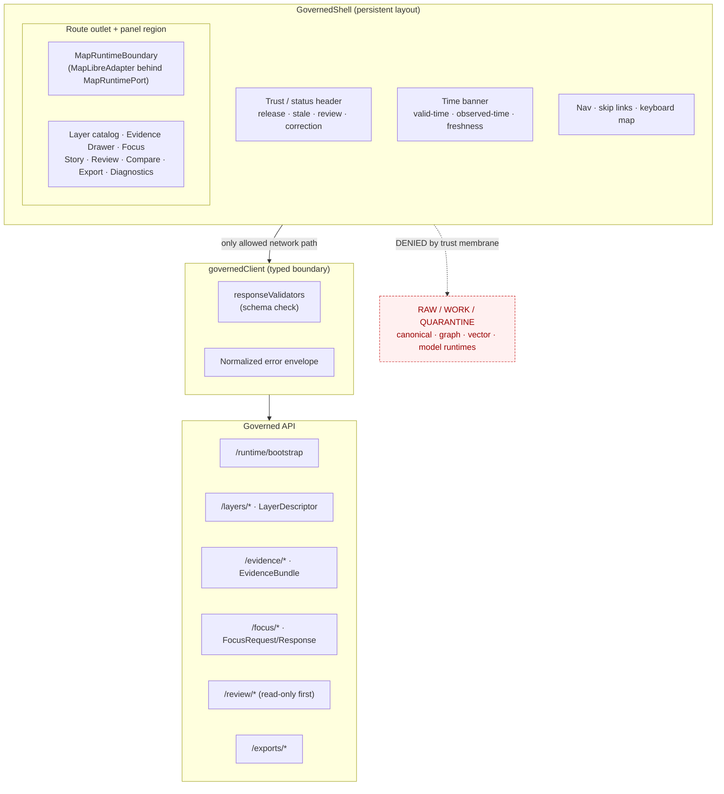

<!-- [KFM_META_BLOCK_V2]
doc_id: kfm://doc/<uuid-TBD>
title: GovernedShell — UI Architecture
type: standard
version: v0.1
status: draft
owners: <UI architecture owner — TBD>, <docs steward — TBD>
created: 2026-05-14
updated: 2026-05-14
policy_label: public
related:
  - docs/architecture/ui/README.md
  - docs/architecture/ui/STATE_OWNERSHIP.md
  - docs/architecture/ui/ROUTE_MAP.md
  - docs/architecture/ui/BOUNDARIES.md
  - docs/architecture/ui/CONTINUITY_NOTES.md
  - docs/architecture/governed-ai/README.md
  - docs/adr/ADR-maplibre-adapter-boundary.md
tags: [kfm, ui, architecture, governed-shell, maplibre, trust-membrane]
notes:
  - "Filename GOVERNED_SHELL.md is PROPOSED — not directly enumerated in KFM_Whole_UI_Governed_AI_Expansion_Report Appendix B."
  - "Component family GovernedShell is CONFIRMED in doctrine; implementation status is PROPOSED."
[/KFM_META_BLOCK_V2] -->

# GovernedShell — UI Architecture

> The persistent, map-first, time-aware, trust-visible UI surface that houses every public KFM client surface — and never becomes the source of truth itself.

<!-- Top-of-file badge row -->


<!-- TODO: replace placeholder shields with verified Shields.io endpoints once the
     UI subsystem CI, version, and ADR badges are wired. -->

| Field | Value |
|---|---|
| **Status** | `PROPOSED` (doctrine CONFIRMED; implementation UNKNOWN) |
| **Authority level** | implementation-bearing (architecture doc) |
| **Owners** | UI architecture owner *(TBD)* · docs steward *(TBD)* |
| **Last reviewed** | 2026-05-14 *(initial draft)* |
| **Sibling docs** | [README](./README.md) · [STATE_OWNERSHIP](./STATE_OWNERSHIP.md) · [ROUTE_MAP](./ROUTE_MAP.md) · [BOUNDARIES](./BOUNDARIES.md) · [CONTINUITY_NOTES](./CONTINUITY_NOTES.md) |
| **Governing ADRs** | `ADR-maplibre-adapter-boundary` *(PROPOSED)* · `ADR-ui-schema-home` *(PROPOSED)* |

---

## Contents

1. [Purpose](#1-purpose)
2. [Doctrinal basis](#2-doctrinal-basis)
3. [Composition diagram](#3-composition-diagram)
4. [What the GovernedShell owns](#4-what-the-governedshell-owns)
5. [What the GovernedShell does NOT own](#5-what-the-governedshell-does-not-own)
6. [Component slot map](#6-component-slot-map)
7. [Trust membrane rules](#7-trust-membrane-rules)
8. [Finite outcomes the shell renders](#8-finite-outcomes-the-shell-renders)
9. [Required objects and contracts](#9-required-objects-and-contracts)
10. [Bootstrap and lifecycle](#10-bootstrap-and-lifecycle)
11. [Proposed file homes](#11-proposed-file-homes)
12. [Validation and CI](#12-validation-and-ci)
13. [Open verification items](#13-open-verification-items)
14. [Related docs](#14-related-docs)
15. [Appendix — anti-patterns](#15-appendix--anti-patterns)

---

## 1. Purpose

**CONFIRMED doctrine.** The `GovernedShell` is the persistent UI layout that hosts every governed KFM client surface. It owns the map-first frame, the time banner, the trust/status header, the route outlet, the panel region, and the keyboard skip links. It composes — but does not become — the MapLibre renderer, the Evidence Drawer, the Focus panel, the layer catalog, the Story Node player, the read-only review console, and the Compare / Export / Settings / Diagnostics routes.

**The one-sentence rule.** *The renderer is downstream of trust, never upstream of it.* The shell exists to make that rule visible at the point of use — every route, every layer, every claim, every Focus answer is rendered alongside its release state, freshness, policy posture, review state, citation state, and correction lineage.

> [!IMPORTANT]
> **PROPOSED** implementation status. The component family `GovernedShell` is named in KFM doctrine, but no shell file, route tree, or framework version has been verified in this session. Every path quoted here is **PROPOSED** until a mounted repo, an accepted ADR, and the path-validation checklist confirm it.

[Back to top](#contents)

---

## 2. Doctrinal basis

The shell carries forward five doctrinal commitments. They are CONFIRMED at the doctrine layer; their executable form (schemas, validators, components, tests) is PROPOSED until verified in repo.

| # | Commitment | Source | Status |
|---|---|---|---|
| 1 | **Map-first, time-aware persistence.** Every route keeps the map and time banner alive; navigation does not destroy interaction state. | Whole-UI report §17, Master MapLibre report | CONFIRMED doctrine |
| 2 | **Trust-visible header.** Release state, stale/degraded state, policy posture, review state, and correction lineage appear in the shell chrome, not buried in detail views. | Whole-UI report §17.2; Master MapLibre report (trust-visible states) | CONFIRMED doctrine |
| 3 | **Renderer behind an adapter.** Only `MapLibreAdapter` may import MapLibre runtime APIs; all other component code speaks to `MapRuntimePort`. | Whole-UI report §18; KFM MapLibre Operating Architecture | CONFIRMED doctrine |
| 4 | **Governed API only.** The browser's only allowed network path for trust payloads is the typed `governedClient`, validated at the boundary. | Whole-UI report §§8, 25 | CONFIRMED doctrine |
| 5 | **Finite outcomes everywhere.** Every consequential payload resolves to `ANSWER` / `ABSTAIN` / `DENY` / `ERROR` (with `HOLD` / `PASS` / `FAIL` reserved for review and validator surfaces). | Domains Atlas §24.3; Governed AI doctrine | CONFIRMED doctrine |

> [!NOTE]
> KFM terminology is fixed vocabulary. `GovernedShell`, `MapRuntimePort`, `MapLibreAdapter`, `EvidenceBundle`, `EvidenceRef`, `DecisionEnvelope`, `RuntimeResponseEnvelope`, `EvidenceDrawerPayload`, `LayerDescriptor`, `FocusRequest` / `FocusResponse`, `AIReceipt`, `ReleaseManifest`, `RollbackCard`, and the lifecycle band `RAW → WORK/QUARANTINE → PROCESSED → CATALOG/TRIPLET → PUBLISHED` are preserved exactly.

[Back to top](#contents)

---

## 3. Composition diagram



> [!NOTE]
> This diagram reflects the **proposed** architecture from the Whole-UI + Governed AI Expansion Report. Component slot names, route prefixes, and adapter names are doctrinal; their executable equivalents are **NEEDS VERIFICATION** until the app path, framework, and router are confirmed.

[Back to top](#contents)

---

## 4. What the GovernedShell owns

The shell owns layout, persistence, and the visible chrome of trust. Specifically:

- **Persistent map region.** A single `MapRuntimeBoundary` mounts once and survives route transitions. The shell does not unmount the map on navigation.
- **Time banner.** Surfaces viewport time, valid-time, observed-time, and freshness. Owned by `TimeState`; rendered in the shell chrome.
- **Trust / status header.** Renders release state, stale-source badges, review state, correction lineage links, and policy posture for the active layer set and the active route.
- **Route outlet.** A single mount point for route-specific panels (Explore, Dossier, Story, Focus, Review, Compare, Export, Settings, Diagnostics). Routes attach **into** the shell, not around it.
- **Panel region.** Hosts the layer catalog, Evidence Drawer, Focus panel, story panels, review console, compare view, export dialog, settings, diagnostics. Panels are slots, not children of arbitrary components.
- **Accessibility scaffolding.** Skip links, focus-visible defaults, keyboard map-control alternatives, reduced-motion handling, contrast tokens, and screen-reader landmarks.
- **Bootstrap envelope consumption.** The shell consumes a `runtime/bootstrap` payload that carries feature flags, available routes, allowed layer descriptors, and policy posture. It does not compute these.

[Back to top](#contents)

---

## 5. What the GovernedShell does NOT own

The shell composes these things; it does not become them. Treating any of them as shell-owned is an anti-pattern (see [Appendix](#15-appendix--anti-patterns)).

- **Rendering.** The shell does not call MapLibre APIs. Only `MapLibreAdapter` does. The shell speaks to `MapRuntimePort`.
- **Evidence resolution.** The shell does not assemble `EvidenceBundle` payloads or compute citation validation. It receives `EvidenceDrawerPayload` from the governed API.
- **Policy decisions.** The shell does not decide allow / deny / restrict / abstain. It renders `PolicyDecision` and `DecisionEnvelope` outcomes returned by the governed API.
- **Model calls.** The shell never speaks to a model runtime. Focus requests go through the governed API; the model provider sits behind a server-side adapter.
- **Telemetry payloads.** The shell does not emit raw prompt content, free-text user input that could contain sensitive data, or unredacted feature properties. Only safe `telemetry/ui` events.
- **Source admission.** The shell does not fetch RAW, WORK, QUARANTINE, canonical stores, graph stores, object stores, vector indexes, or unpublished candidate data.
- **Release decisions.** The shell does not promote layers, sign manifests, or modify release state. Read-only review console first; release actions remain server-side and gated.

[Back to top](#contents)

---

## 6. Component slot map

| Slot | Component family | Responsibility (CONFIRMED doctrine) | Direct dependencies | Status |
|---|---|---|---|---|
| **Frame** | `GovernedShell` | Persistent map-first layout, time banner, trust/status header, route outlet, panel region, keyboard skip links. | Bootstrap envelope, shell state. | PROPOSED |
| **Renderer boundary** | `MapRuntimeBoundary` + `MapLibreAdapter` | Hides renderer; applies validated sources/layers; synchronizes camera/time; converts clicks to claim resolution. | `LayerDescriptor`, `TimeState`, `governedClient`. | PROPOSED |
| **Layer surface** | `LayerCatalogPanel` | Layer toggles, legends, filters, time filters, compare/export hooks, verified status, manifest/proof visibility. | `LayerCatalogItem`, `LayerDescriptor`. | PROPOSED |
| **Evidence surface** | `EvidenceDrawer` | Displays `EvidenceBundle`-derived payload, source roles, freshness, review, sensitivity, rights, valid time, correction, provenance. | `EvidenceDrawerPayload`. | PROPOSED |
| **AI surface** | `FocusPanel` | Governed query surface, bounded scope, finite outcomes, cancellation/loading, citation validation, no direct model calls. | `FocusRequest` / `FocusResponse`, `DecisionEnvelope`. | PROPOSED |
| **Narrative surface** | `StoryNodePlayer` | 2D-first narrative steps with map/time/layer/evidence continuity; optional 3D only under gate. | `StoryManifest`, `StoryNode`. | PROPOSED (3D DEFERRED) |
| **Steward surface** | `ReviewConsole` | Read-only steward view of proof / review / correction states; no release action in first slice. | `ReviewRecord`, `ReleaseManifest`, policy. | PROPOSED |
| **Utility surfaces** | `Compare` · `Export` · `Settings` · `Diagnostics` | Compare releases / time slices, governed export requests, accessibility/settings, diagnostics without leakage. | Layer manifests, export policy, telemetry policy. | PROPOSED |

[Back to top](#contents)

---

## 7. Trust membrane rules

The shell is the **public** surface. Trust membrane discipline is non-negotiable.

> [!WARNING]
> **Deny by default.** Public UI and normal clients use governed APIs and released payloads only. No browser direct access to RAW, WORK, QUARANTINE, canonical stores, graph stores, object stores, vector indexes, model runtimes, unpublished candidates, credentials, or internal service handles.

| Rule | Allowed | Forbidden |
|---|---|---|
| **Network** | `governedClient` calls to typed routes returning `DecisionEnvelope` / `RuntimeResponseEnvelope`. | Direct `fetch` to canonical stores, model runtimes, vector indexes, or third-party signing services. |
| **Layer attach** | Layers from `LayerDescriptor` carrying release state, valid-time, sensitivity, rights, and `EvidenceRef`. | `addSource` / `addLayer` on unverified PMTiles, raw COG URLs, or unsigned tilesets. |
| **Click → claim** | Feature click creates a governed claim-resolution request; UI shows nothing consequential before the `EvidenceDrawerPayload` arrives. | Exposing raw feature properties as claims; rendering popups straight from `queryRenderedFeatures` without governance. |
| **AI** | Focus requests through the governed API; rendered outcomes only (`ANSWER` / `ABSTAIN` / `DENY` / `ERROR`). | Browser calling a model provider directly; rendering uncited generated text; exposing chain-of-thought. |
| **Telemetry** | Safe UI telemetry events under `/api/v1/telemetry/ui`. | Raw payloads, prompts, or feature geometries in telemetry. |
| **Sensitive lanes** | Released, redacted, or generalized representations. | Precise rare-species, archaeology, infrastructure, DNA/genomic, or living-person coordinates. |
| **Admin paths** | Justified, constrained, audited, kept out of the normal public path. | Admin shortcuts as the normal public path. |

[Back to top](#contents)

---

## 8. Finite outcomes the shell renders

**CONFIRMED doctrine.** Every consequential payload resolves to a finite outcome. The shell renders the outcome, the reason, and the obligations — it does not silently fall through to a different lane.

| Outcome | When | What the shell shows | Forbidden behavior |
|---|---|---|---|
| **ANSWER** | Evidence sufficient, policy permits, release state allows, review state recorded. | Substantive payload with Evidence Drawer link, citation badge, freshness, source role. | Showing the answer without the evidence hop. |
| **ABSTAIN** | Evidence insufficient, stale, or uncitable. | Non-substantive note with reason; no claim emitted. | Inventing a claim; downgrading to ANSWER silently. |
| **DENY** | Policy, rights, sensitivity, or release state forbids the answer. | Denial reason; alternative non-restricted surface where possible. | Hiding the denial; rendering a degraded version of the restricted payload. |
| **ERROR** | Governed API cannot evaluate — missing schema, malformed query, infrastructure failure. | Finite, actionable error envelope; diagnostic code; no claim leakage. | Silently retrying into a different lane; surfacing internal store identifiers. |
| **HOLD** *(review-only)* | Promotion / correction paused pending steward review. | Prior state preserved; no new public claim. | Silent rollback or replacement. |

> [!TIP]
> **OutcomeRenderer.** A single shared component should render the four primary outcomes consistently across `EvidenceDrawer`, `FocusPanel`, layer toggles, and Story Node steps. Consistency here is what makes the trust posture legible.

[Back to top](#contents)

---

## 9. Required objects and contracts

The shell consumes typed payloads only. The following object families MUST be schema-valid at the client boundary before rendering. Schema homes are PROPOSED per Directory Rules §7.4 (default `schemas/contracts/v1/<…>`) and remain so until verified.

| Object family | Role at the shell boundary | Schema home (PROPOSED) | Status |
|---|---|---|---|
| `BootstrapEnvelope` *(name PROPOSED)* | Feature flags, available routes, allowed layers, policy posture. | `schemas/contracts/v1/ui/bootstrap-envelope.schema.json` | PROPOSED |
| `LayerDescriptor` | Layer identity, release state, valid-time, sensitivity, rights, source-role badges, `EvidenceRef`. | `schemas/contracts/v1/ui/layer-descriptor.schema.json` | PROPOSED |
| `EvidenceDrawerPayload` | Governed UI projection of `EvidenceBundle`, citations, policy/review/release state, stale state, correction links. | `schemas/contracts/v1/ui/evidence-drawer-payload.schema.json` | PROPOSED |
| `DecisionEnvelope` | Finite decision wrapper used by APIs, runtime surfaces, and UI/AI payloads. | `schemas/contracts/v1/governance/decision-envelope.schema.json` | PROPOSED |
| `RuntimeResponseEnvelope` | Governed AI/API response wrapper carrying outcome, evidence context, citations, policy state, validation result. | `schemas/contracts/v1/governance/runtime-response-envelope.schema.json` | PROPOSED |
| `FocusRequest` / `FocusResponse` | Evidence-bounded request/response with finite outcomes. | `schemas/contracts/v1/governed-ai/focus-*.schema.json` | PROPOSED |
| `AIReceipt` | Runtime accountability record for Focus Mode answers. | `schemas/contracts/v1/governed-ai/ai-receipt.schema.json` | PROPOSED |
| `MapContextEnvelope` | Bounded context carrying camera, layer IDs, feature IDs, temporal snapshot, release refs, selected evidence refs. | `schemas/contracts/v1/ui/map-context-envelope.schema.json` | PROPOSED |
| `ReviewRecord`, `ReleaseManifest`, `RollbackCard`, `CorrectionNotice` | Read-only references surfaced by the review console and the trust header. | `schemas/contracts/v1/governance/*.schema.json` | PROPOSED |

> [!NOTE]
> Schema-home authority is **CONFLICTED / NEEDS VERIFICATION**: prior lineage shows ambiguity between `contracts/` and `schemas/`. The default `schemas/contracts/v1/<…>` is doctrinal; the exact home is fixed only by an accepted `ADR-ui-schema-home`.

[Back to top](#contents)

---

## 10. Bootstrap and lifecycle

The shell follows a deterministic bootstrap so the trust posture is established **before** any consequential render.

```text
1. Mount GovernedShell with empty trust state.
2. Call governedClient.runtimeBootstrap() → BootstrapEnvelope.
3. responseValidators check schema; on invalid, render ERROR; do not proceed.
4. Hydrate ShellState: routes, feature flags, allowed layers, policy posture.
5. Mount MapRuntimeBoundary; MapLibreAdapter receives validated LayerDescriptors only.
6. Mount route outlet; route panels attach into the shell.
7. Trust header renders release / stale / review / correction state.
8. User interactions → governedClient calls → finite outcomes render.
```

> [!CAUTION]
> Steps 2–3 are blocking. The shell MUST NOT proceed to step 4 with an invalid or partial bootstrap envelope. Doing so risks rendering unreleased or unpoliced state before the trust posture is established.

[Back to top](#contents)

---

## 11. Proposed file homes

These paths are **PROPOSED / NEEDS VERIFICATION** until the actual app path, framework, and router are confirmed. They follow the responsibility-root logic of Directory Rules §4 and the file/folder reference plan in the Whole-UI + Governed AI Expansion Report (Appendix B).

```text
docs/architecture/ui/
├── README.md                  # UI subsystem overview            (PROPOSED)
├── GOVERNED_SHELL.md          # ← this document                  (PROPOSED)
├── STATE_OWNERSHIP.md         # state ownership map              (PROPOSED)
├── ROUTE_MAP.md               # route families + shell continuity (PROPOSED)
├── BOUNDARIES.md              # browser allowed/forbidden ops    (PROPOSED)
└── CONTINUITY_NOTES.md        # prior UI doctrine + lineage      (PROPOSED)

apps/explorer-web/             # PROPOSED app home — adapt to actual repo path
├── README.md
└── src/
    ├── app/
    │   ├── GovernedShell.tsx          # the shell component       (PROPOSED)
    │   └── routes.tsx                 # route map                 (PROPOSED)
    ├── state/
    │   ├── shellState.ts              # shell state machine       (PROPOSED)
    │   └── timeState.ts               # time state owner          (PROPOSED)
    ├── api/
    │   ├── governedClient.ts          # typed governed client     (PROPOSED)
    │   └── responseValidators.ts      # boundary schema validation (PROPOSED)
    └── map/
        ├── MapRuntimePort.ts          # adapter interface         (PROPOSED)
        └── MapLibreAdapter.tsx        # only MapLibre importer    (PROPOSED)

schemas/contracts/v1/
├── ui/                                 # UI DTOs                  (PROPOSED)
├── governance/                         # decision/runtime envelopes (PROPOSED)
└── governed-ai/                        # focus + AIReceipt        (PROPOSED)
```

> [!IMPORTANT]
> Per **Directory Rules §15** (Required README Contract) and §4 (Placement Protocol): every owning root must carry a README that meets the required-section order, and every path-bearing PR must cite the rule that justifies its placement. The exact app path (`apps/explorer-web` vs an alternative) is **UNKNOWN** until the repo is mounted; record any divergence as an ADR per §2.4.

[Back to top](#contents)

---

## 12. Validation and CI

The PR-safe smoke suite below is **PROPOSED**. It runs without secrets, fails closed on invalid fixtures, and proves the trust boundary before broader UI work.

| Check | Asserts | Status |
|---|---|---|
| Schema validation | `BootstrapEnvelope`, `LayerDescriptor`, `EvidenceDrawerPayload`, `DecisionEnvelope`, `RuntimeResponseEnvelope`, `FocusRequest` / `FocusResponse` validate against fixtures. | PROPOSED |
| Boundary test | The shell makes no `fetch` calls outside `governedClient`. Static analysis + runtime spy. | PROPOSED |
| Click → claim test | A map click never exposes feature properties as a claim; it resolves through a governed claim endpoint into `EvidenceDrawerPayload`. | PROPOSED |
| Negative-state tests | `ANSWER` / `ABSTAIN` / `DENY` / `ERROR` render with citations / reasons / obligations; invalid fixtures fail closed. | PROPOSED |
| Mock-marker test | Fixture-backed payloads carry an obvious `mock_only` marker that prevents accidental release. | PROPOSED |
| Accessibility smoke | Keyboard navigation, focus order, screen-reader landmarks, contrast tokens, reduced-motion, map-control alternative-list. | PROPOSED |
| E2E smoke | Persistent map across route changes; time banner survives navigation; trust header reflects active layer state. | PROPOSED |

[Back to top](#contents)

---

## 13. Open verification items

| Item | Status | Why it matters |
|---|---|---|
| Mounted KFM repository | UNKNOWN | Cannot verify current files, routes, framework, or implementation maturity. |
| Frontend framework + app path | UNKNOWN | Determines exact component paths and tests. |
| Router conventions | UNKNOWN | Determines route outlet semantics and lazy-hydration boundaries. |
| Schema home authority | CONFLICTED / NEEDS VERIFICATION | `contracts/` vs `schemas/` priority requires `ADR-ui-schema-home`. |
| MapLibre dependency / version | NEEDS VERIFICATION | Runtime APIs and plugin status are version-sensitive. |
| Existing `EvidenceDrawer` / `Focus` implementation | UNKNOWN | May require refactor instead of create. |
| Accessibility baseline | NEEDS VERIFICATION | Project may have its own standard or test tooling. |
| Backend governed API framework + route names | UNKNOWN | Determines `governedClient` endpoints and adapters. |

> [!NOTE]
> Items here SHOULD be filed into `docs/registers/VERIFICATION_BACKLOG.md` and tracked until resolved. Per Directory Rules §2.5, unresolved conflicts between this doc and a mounted repo go to `docs/registers/DRIFT_REGISTER.md` rather than silently becoming new authority.

[Back to top](#contents)

---

## 14. Related docs

- [`docs/architecture/ui/README.md`](./README.md) — UI subsystem overview *(PROPOSED)*
- [`docs/architecture/ui/STATE_OWNERSHIP.md`](./STATE_OWNERSHIP.md) — map, time, layer, drawer, focus, story, review, export, settings, diagnostics state *(PROPOSED)*
- [`docs/architecture/ui/ROUTE_MAP.md`](./ROUTE_MAP.md) — route families and shell continuity rules *(PROPOSED)*
- [`docs/architecture/ui/BOUNDARIES.md`](./BOUNDARIES.md) — browser allowed/forbidden operations and MapLibre adapter boundary *(PROPOSED)*
- [`docs/architecture/ui/CONTINUITY_NOTES.md`](./CONTINUITY_NOTES.md) — how prior UI doctrine and PDF lineage are preserved *(PROPOSED)*
- [`docs/architecture/governed-ai/README.md`](../governed-ai/README.md) — governed AI subsystem overview *(PROPOSED)*
- [`docs/adr/ADR-maplibre-adapter-boundary.md`](../../adr/ADR-maplibre-adapter-boundary.md) — adapter-boundary decision *(PROPOSED)*
- [`docs/adr/ADR-ui-schema-home.md`](../../adr/ADR-ui-schema-home.md) — schema-home decision *(PROPOSED)*
- [`docs/registers/VERIFICATION_BACKLOG.md`](../../registers/VERIFICATION_BACKLOG.md) — unresolved verification items *(PROPOSED)*
- [`docs/registers/DRIFT_REGISTER.md`](../../registers/DRIFT_REGISTER.md) — repo-vs-doctrine conflicts *(PROPOSED)*

[Back to top](#contents)

---

## 15. Appendix — anti-patterns

<details>
<summary><strong>Click to expand: shell-level anti-patterns and required negative tests</strong></summary>

<br/>

These patterns collapse the trust membrane and must fail closed.

| Anti-pattern | Why it fails | Required negative test |
|---|---|---|
| Importing MapLibre APIs outside `MapLibreAdapter` | Renderer leaks into business components; adapter boundary is destroyed. | Static analysis: no `maplibre-gl` import outside the adapter file. |
| Direct `addSource` / `addLayer` on unverified PMTiles or raw COG URLs | Bypasses release manifests and verify receipts. | No-unreleased-tile test; no-public-raw-path test. |
| Rendering feature properties as claims after a map click | Treats renderer state as truth; skips Evidence Drawer. | Click → governed claim resolution test; assertion that nothing consequential renders before `EvidenceDrawerPayload` arrives. |
| Browser calling a model provider directly | Bypasses governed AI adapter, policy precheck, citation validation, `AIReceipt`. | Boundary test: no provider URL is reachable from the bundle. |
| Rendering generated text without a citation | Violates cite-or-abstain; treats fluent generation as evidence. | Citation validation test on every Focus answer; ABSTAIN when citations are absent. |
| Telemetry payload containing raw prompts or feature geometries | Sensitive content can leak through the safest-looking pipe. | Telemetry policy fixture; redaction test on every event shape. |
| Admin route exposed on the normal public path | Trust membrane bypass. | Route policy test; deny-by-default infra test. |
| Treating `docs/` as the canonical decision authority | Per Directory Rules §13, documentation explains; it does not decide alone. | ADR-or-register requirement for policy-bearing changes. |
| Promoting a layer from `WORK` directly to `PUBLISHED` | Lifecycle skip — promotion is a governed state transition, not a file move. | Promotion gate test; lifecycle phase test. |
| Renaming `GovernedShell` → `AppShell` or `MainLayout` | KFM terminology drift; obscures trust posture. | Terminology lint over docs and source. |

</details>

[Back to top](#contents)

---

<!-- Footer -->
---

**Related:** [UI README](./README.md) · [STATE_OWNERSHIP](./STATE_OWNERSHIP.md) · [ROUTE_MAP](./ROUTE_MAP.md) · [BOUNDARIES](./BOUNDARIES.md) · [CONTINUITY_NOTES](./CONTINUITY_NOTES.md) · [Governed AI](../governed-ai/README.md)

**Last updated:** 2026-05-14 *(initial draft — review pending)*

[⬆ Back to top](#contents)
