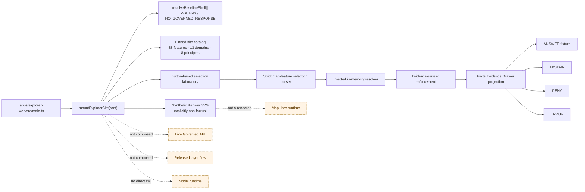
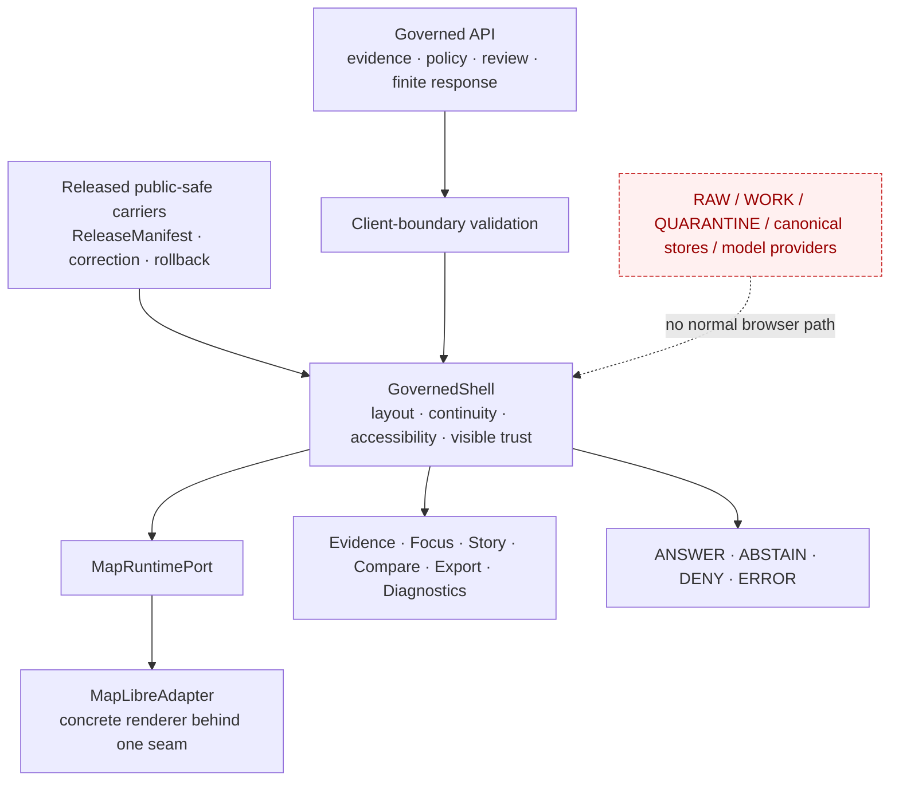

<a id="top"></a>
<a id="governedshell--ui-architecture"></a>

<!-- [KFM_META_BLOCK_V2]
doc_id: kfm://doc/architecture/ui/governed-shell
title: GovernedShell — UI Architecture
type: architecture-reference
version: v2.0
status: draft; repository-grounded; bounded-executable; mixed-maturity; renderer-hold; non-publisher
owners:
  - "@bartytime4life — verified CODEOWNERS review route"
  - "NEEDS VERIFICATION — independent UI, accessibility, security, evidence, policy, release, and runtime stewardship"
created: 2026-05-14
updated: 2026-08-19
policy_label: public; architecture; ui; governed-shell; trust-membrane; no-release; no-publication
owning_root: docs/
responsibility: Explain the current GovernedShell composition, trust boundaries, bounded executable proof, proposed graduation seams, validation burden, correction posture, and rollback boundary without becoming contract, schema, policy, evidence, release, runtime, or publication authority.
truth_posture: cite-or-abstain; current-state claims are pinned to repository evidence; proposed decisions, production behavior, deployment, and public-operation claims remain visibly bounded
current_path: docs/architecture/ui/GOVERNED_SHELL.md
evidence_snapshot:
  repository: bartytime4life/Kansas-Frontier-Matrix
  base_ref: main
  base_commit: 68603b748d859884f5e140467285b5ae71d093a9
  target_prior_blob: 9d0df5514754c9ad3d3ee261d9ac5365f6139ba6
  explorer_composition_merge: c90c32dde6c28eaae5d2904ab16c5780b274fae4
  explorer_main_blob: 86c16e43e03601e65eb01b0b4949f7850089e877
  explorer_site_readme_blob: 3f2821cf221bb3b44e8e1236fe409edb34174787
  explorer_site_mount_blob: aa60d41dffdf14f44d1c5eb2817c379623a0c855
  explorer_site_catalog_blob: 31824767e618e43308916534a57de76b9b1c212e
  explorer_baseline_shell_blob: 64c78c78820af33fb7a622094e4c0944ad9412f8
  explorer_map_bridge_blob: 18d61ea0ef2fbe2fc2f3cc9d42291c101003037f
  explorer_evidence_drawer_blob: 7746843c259594568fe75e975155a67eb8372e8f
  explorer_maplibre_adapter_blob: 663ba0f7a05498948f67d644387c73ab19d5c16c
  explorer_package_blob: ddd201b74a06001d84a14bf54ac62a6cc3607a29
  explorer_catalog_test_blob: b00f4796f7d1a34ef36758c9df995f703350e740
  maplibre_package_manifest_blob: b0582955feeb51016327113692fa5c98ecad8816
  maplibre_package_entry_blob: 91664eb00583f9e3d0405eb7954fefa9a48f4ee9
  ui_build_workflow_blob: 52382d796a8dd5ecafc39a801515aff0a8b013f8
  codeowners_blob: dd2a84aa514d8ecd9208bc347f90f9a2ed37dd61
  directory_rules_blob: fd49a0b83e55cef52c1124281f093e263526898d
  directory_rules_decision: ADR-0029 accepted
related:
  - ./README.md
  - ../map-shell.md
  - ./BOUNDARIES.md
  - ./CONTINUITY_NOTES.md
  - ./EVIDENCE_DRAWER.md
  - ./MAP_RUNTIME_BOUNDARY.md
  - ./ACCESSIBILITY.md
  - ./TELEMETRY.md
  - ./TRUST_BADGES.md
  - ./FOCUS_FLOW.md
  - ./STORY_PLAYER.md
  - ./COMPARE_AND_EXPORT.md
  - ../../doctrine/directory-rules.md
  - ../../adr/ADR-0005-apps-explorer-web-is-the-canonical-map-first-shell.md
  - ../../adr/ADR-0006-maplibre-boundary--only-maplibreadapter-imports-maplibre.md
  - "docs/adr/ADR-0007 — MapLibre GL JS Is the Sole Browser-Side Renderer.md"
  - ../../adr/ADR-0029-adopt-directory-governance-standard-v2.md
  - ../../../apps/explorer-web/src/main.ts
  - ../../../apps/explorer-web/src/site/README.md
  - ../../../apps/explorer-web/src/site/mountExplorerSite.ts
  - ../../../apps/explorer-web/src/site/catalog.ts
  - ../../../apps/explorer-web/src/features/shell/index.tsx
  - ../../../apps/explorer-web/src/features/map_runtime/index.tsx
  - ../../../apps/explorer-web/src/features/evidence_drawer/index.tsx
  - ../../../apps/explorer-web/src/adapters/MapLibreAdapter.ts
  - ../../../packages/maplibre/
  - ../../../contracts/ui/map_context_envelope.md
  - ../../../contracts/ui/evidence_drawer_payload.md
  - ../../../apps/explorer-web/tests/explorer-site-catalog.test.ts
  - ../../../data/receipts/generated/genrec-explorer-site-composition-20260819.json
tags:
  - kfm
  - architecture
  - ui
  - governed-shell
  - explorer-web
  - map-first
  - trust-visible
  - evidence-drawer
  - finite-outcomes
  - accessibility
  - maplibre-hold
  - correction
  - rollback
notes:
  - "v2.0 replaces proposal-era no-repository language with a current repository-grounded architecture and composition boundary."
  - "Merged PR #3070 composes a repository-grounded Explorer site with a synthetic renderer-neutral map stage, 38 feature families, 13 knowledge domains, 8 trust principles, and a deterministic map-selection-to-Evidence-Drawer laboratory."
  - "The current visual composition lives under apps/explorer-web/src/site/, while apps/explorer-web/src/features/shell/index.tsx remains the small finite baseline-state resolver."
  - "The catalog classifies Governed shell and Trust Header as VERIFIED_SLICE, Time Banner as FIXTURE_FIRST, and the concrete MapLibre browser runtime as HOLD; these are bounded repository catalog labels, not release or publication states."
  - "No live governed transport, functional MapLibre adapter, released-layer flow, route tree, model call, deployment, or public operation is established."
  - "This page changes architecture documentation only and has no source, policy, evidence, lifecycle, release, deployment, or publication effect."
[/KFM_META_BLOCK_V2] -->

# GovernedShell — UI Architecture

> **Operating rule.** `GovernedShell` is KFM's downstream, trust-visible browser composition boundary. It may render bounded finite outcomes, repository-grounded orientation, and already released public-safe carriers; it does not create truth, resolve evidence authority, decide policy, approve review or release, or publish by displaying something.


| Field | Current bounded result |
|---|---|
| **Evidence snapshot** | `main@68603b748d859884f5e140467285b5ae71d093a9` |
| **Document role** | Human-readable UI architecture reference at the existing path; no semantic, schema, policy, evidence, runtime, release, or publication authority |
| **Placement authority** | **CONFIRMED:** accepted [ADR-0029](../../adr/ADR-0029-adopt-directory-governance-standard-v2.md) adopts [Directory Rules v2](../../doctrine/directory-rules.md); the same-path `docs/architecture/ui/` update is `PLACE` |
| **Current Explorer entrypoint** | **CONFIRMED:** [`src/main.ts`](../../../apps/explorer-web/src/main.ts) mounts [`mountExplorerSite`](../../../apps/explorer-web/src/site/mountExplorerSite.ts) |
| **Current visual shell** | **CONFIRMED / BOUNDED:** map-first landing composition with header, skip link, section navigation, trust posture, synthetic map stage, deterministic evidence lab, 13-domain matrix, 38-feature catalog, 8 trust principles, and public-safety disclaimer |
| **Current baseline state** | **CONFIRMED:** [`resolveBaselineShell`](../../../apps/explorer-web/src/features/shell/index.tsx) returns `ABSTAIN / NO_GOVERNED_RESPONSE` without input and `ERROR / UNSUPPORTED_BASELINE_INPUT` with supplied input; both carry zero evidence references |
| **Current evidence interaction** | **CONFIRMED / FIXTURE-ONLY:** strict renderer-neutral selection parsing, injected in-memory resolution, evidence-subset enforcement, and finite Evidence Drawer projection |
| **Current map renderer** | **HOLD:** no `maplibre-gl` dependency in Explorer; [`MapLibreAdapter.ts`](../../../apps/explorer-web/src/adapters/MapLibreAdapter.ts) is one boundary comment; `@kfm/maplibre` is a private `0.0.0` placeholder |
| **Current transport** | **NOT ESTABLISHED:** the composed site uses local deterministic fixtures; no live Explorer-to-Governed-API claim path is mounted |
| **Decision state** | **MIXED:** ADR-0029 is accepted; shell, governed-API, MapLibre-boundary, sole-renderer, finite-envelope, abstention, and public-client ADRs remain proposed unless separately accepted |
| **Deployment / public operation** | **UNKNOWN / not established:** this page does not prove hosting, authentication, authorization, CSP, CORS, production telemetry, released data, or publication |
| **Review route** | `@bartytime4life` through CODEOWNERS; independent specialist review remains **NEEDS VERIFICATION** |

> [!IMPORTANT]
> **Repository-grounded does not mean production.** The current shell is real code and a real build surface. Its map remains an explicitly synthetic illustration, its positive evidence case is fixture-only, its catalog is a pinned descriptive snapshot, and its renderer remains held. No displayed `ANSWER` in the interaction lab is a live Kansas claim.

> [!CAUTION]
> **A shell is not a trust authority.** The browser may make evidence, time, policy, review, release, correction, and rollback state legible. It may not manufacture any of those states, infer them from pixels or feature properties, or substitute a badge, route, test, receipt, or generated sentence for governed closure.

> [!WARNING]
> **MapLibre remains unadmitted.** A package home, readiness candidate, proposed adapter seam, and catalog entry exist. A functioning adapter, dependency closure, released-layer flow, browser probes, accepted renderer decisions, and operational evidence do not.

## Quick jump

- [0. Current evidence snapshot](#0-current-evidence-snapshot)
- [1. Purpose and scope](#1-purpose-and-scope)
- [2. Authority and repository placement](#2-authority-and-repository-placement)
- [3. GovernedShell operating law](#3-governedshell-operating-law)
- [4. Current composition and flow](#4-current-composition-and-flow)
- [5. Current shell anatomy](#5-current-shell-anatomy)
- [6. Ownership and authority boundaries](#6-ownership-and-authority-boundaries)
- [7. State, time, and continuity](#7-state-time-and-continuity)
- [8. Finite outcomes and negative states](#8-finite-outcomes-and-negative-states)
- [9. Object and projection boundary](#9-object-and-projection-boundary)
- [10. Renderer boundary and MapLibre HOLD](#10-renderer-boundary-and-maplibre-hold)
- [11. Governed transport, Focus, and AI](#11-governed-transport-focus-and-ai)
- [12. Accessibility and trust legibility](#12-accessibility-and-trust-legibility)
- [13. Security, sensitivity, telemetry, and no-leak posture](#13-security-sensitivity-telemetry-and-no-leak-posture)
- [14. Validation and proof limits](#14-validation-and-proof-limits)
- [15. Graduation gates](#15-graduation-gates)
- [16. Open verification backlog](#16-open-verification-backlog)
- [17. Related documentation](#17-related-documentation)
- [Appendix A. Anti-patterns](#appendix-a-anti-patterns)
- [Appendix B. No-loss modernization ledger](#appendix-b-no-loss-modernization-ledger)
- [Appendix C. Correction and rollback](#appendix-c-correction-and-rollback)

---

## 0. Current evidence snapshot

### 0.1 What changed since the prior edition

The prior edition was written as a proposal against an unmounted repository. It used placeholder identity and ownership, treated the filename and app home as proposed, named two nonexistent sibling pages, referenced obsolete unnumbered ADR filenames, and described every component as unverified.

Current repository evidence supports a materially stronger—but still bounded—statement:

1. Merged PR [`#3070`](https://github.com/bartytime4life/Kansas-Frontier-Matrix/pull/3070) replaced the inert default page with a repository-grounded Explorer composition.
2. [`main.ts`](../../../apps/explorer-web/src/main.ts) mounts [`mountExplorerSite`](../../../apps/explorer-web/src/site/mountExplorerSite.ts).
3. The current visual composition lives under [`src/site/`](../../../apps/explorer-web/src/site/), not in a proposed `src/app/GovernedShell.tsx`.
4. [`features/shell/index.tsx`](../../../apps/explorer-web/src/features/shell/index.tsx) remains a small immutable finite-state baseline resolver.
5. [`catalog.ts`](../../../apps/explorer-web/src/site/catalog.ts) inventories **38** feature families, **13** knowledge domains, and **8** trust principles with conservative maturity labels.
6. The catalog labels `Governed shell` and `Trust Header` as `VERIFIED_SLICE`, `Time Banner` as `FIXTURE_FIRST`, and the concrete MapLibre runtime as `HOLD`.
7. The map area is a decorative Kansas SVG plus ordinary keyboard-operable controls, not a geographic renderer.
8. The selection laboratory reuses the strict [`map_runtime`](../../../apps/explorer-web/src/features/map_runtime/index.tsx) bridge and bounded [`Evidence Drawer`](../../../apps/explorer-web/src/features/evidence_drawer/index.tsx).
9. The site performs no live source ingestion, model call, policy decision, review transition, release transition, or publication action.
10. The exact current implementation is therefore **bounded executable composition**, not a production governed map application.

### 0.2 Current composed surfaces

| Surface | Current implementation | Authority limit |
|---|---|---|
| Header and navigation | Brand, `Map`, `Knowledge`, `Features`, and `Trust` anchor navigation; visible shell and renderer chips | Anchor navigation is not a route registry, feature-flag authority, or release state |
| Skip path | “Skip to Explorer content” link targets the main landmark | One accessibility mechanism, not complete conformance |
| Hero / posture | Map-first purpose, finite baseline posture, explicit no-live-data disclaimer | Descriptive orientation; no dynamic trust-bearing response |
| Map workspace | Synthetic Kansas artwork, renderer HOLD card, readiness-candidate context | No coordinates, tiles, basemap, camera runtime, MapLibre boot, or released layer |
| Selection laboratory | Five deterministic cases: supported, missing evidence, policy restricted, evidence mismatch, and resolver error | Fixture-only local proof; injected resolver is not live transport |
| Evidence Drawer | Supported and negative finite projections with citations, limitations, trust labels, correction history, keyboard open/close, Escape handling, and focus return | UI projection; no authoritative EvidenceBundle resolution or policy execution |
| Knowledge matrix | Thirteen domain summaries with public-safety safeguards | Navigation and explanation, not live domain data |
| Feature catalog | Search/filter over 38 repository feature families and four maturity labels | Pinned repository snapshot, not runtime availability or release authority |
| Trust section | Eight KFM principles and exact-snapshot link | Human orientation, not executable policy |
| Footer | Explicit non-emergency, non-legal-title, non-regulatory, and non-life-safety disclaimer | Safety language, not certification |

### 0.3 Current implementation split

The term `GovernedShell` currently spans two repository-present surfaces with different responsibilities:

| Surface | Current responsibility | Maturity |
|---|---|---|
| [`apps/explorer-web/src/features/shell/index.tsx`](../../../apps/explorer-web/src/features/shell/index.tsx) | Immutable finite baseline state: `ABSTAIN` without input and `ERROR` for unsupported input | **CONFIRMED / BOUNDED** |
| [`apps/explorer-web/src/site/mountExplorerSite.ts`](../../../apps/explorer-web/src/site/mountExplorerSite.ts) | The current visual composition root and section orchestration | **CONFIRMED / BOUNDED** |
| [`apps/explorer-web/src/site/catalog.ts`](../../../apps/explorer-web/src/site/catalog.ts) | Descriptive repository inventory and maturity labels | **CONFIRMED snapshot / non-authoritative** |
| [`apps/explorer-web/src/features/shell/README.md`](../../../apps/explorer-web/src/features/shell/README.md) | Earlier feature-boundary design and graduation guidance | **LINEAGE / partly stale current-state prose** |

This split is not silently declared a defect. Consolidating, renaming, or moving code would be a separate implementation change requiring consumer, test, ownership, and rollback analysis. This page records the split so architecture prose does not pretend that a proposed React route shell exists where the current implementation is vanilla TypeScript DOM composition.

### 0.4 Current drift and conflicts

| Surface | Drift | Disposition here |
|---|---|---|
| Prior `GOVERNED_SHELL.md` | Says repository and implementation are unknown; links nonexistent `STATE_OWNERSHIP.md` and `ROUTE_MAP.md`; uses placeholder ADR names | Replaced with current paths, numbered ADRs, bounded evidence, and explicit absent-target removal |
| UI README and some sibling pages | Several evidence snapshots predate merged PR #3070 | Retain boundary doctrine; prefer current executable bytes and repository-grounded [`map-shell.md`](../map-shell.md) for composition claims |
| Feature shell README | Describes broad proposed feature modules and says implementation files are unverified | Treat as feature-boundary guidance, not current visual composition evidence |
| Site catalog | Pins commit `67cf9bcd…` and MapLibre readiness candidate `6.4.0` | Treat as intentionally frozen descriptive input; it does not establish current package/version authority |
| ADR corpus | ADR-0029 accepted; relevant UI and renderer decisions remain proposed | Do not write proposed decisions as accepted architecture |
| `DecisionEnvelope` naming | Multiple repository paths use similar capitalization and folder forms | This page references the family conceptually and does not choose a canonical semantic or schema authority |
| `BootstrapEnvelope` | Named in proposal-era docs but not established as a current repository object | Retained only as a **PROPOSED target concept**, not a current contract |

[Back to top](#top)

---

## 1. Purpose and scope

### 1.1 Purpose

`GovernedShell` names the browser-side composition boundary where KFM makes its trust posture usable and inspectable. The shell should keep map context, time, evidence access, finite outcomes, accessibility, limitations, and correction posture visible without becoming the authority behind any of them.

The current implementation proves a smaller statement: Explorer Web now has a repository-grounded, trust-visible site composition and a deterministic synthetic map-to-evidence laboratory. That slice is useful because it makes the boundary executable before a renderer, live transport, or released data path is admitted.

### 1.2 In scope

- Current Explorer Web entrypoint and site composition.
- The baseline shell state and its finite no-input behavior.
- The current synthetic map/evidence interaction slice.
- Header, navigation, posture, domain, catalog, trust, accessibility, and disclaimer surfaces.
- Browser composition versus evidence, policy, review, release, correction, rollback, and model authority.
- Current renderer HOLD and proposed `MapRuntimePort` / `MapLibreAdapter` seam.
- Current object/projection maturity and absent bootstrap/live-transport surfaces.
- Validation evidence, proof limits, graduation gates, correction, and rollback.
- Current documentation drift that materially changes interpretation of the shell.

### 1.3 Out of scope

This page does not:

- accept ADR-0004, ADR-0005, ADR-0006, ADR-0007, ADR-0019, ADR-0020, or ADR-0025;
- create a new contract, schema, policy rule, source registry, route registry, state store, runtime API, or release object;
- install, pin, or admit MapLibre or any plugin/protocol;
- turn the synthetic SVG into a real map;
- activate a live Governed API, EvidenceBundle resolver, policy evaluator, model runtime, source, tile service, CDN, or object store;
- create authentication, authorization, CSP, CORS, production telemetry, or deployment;
- approve review, promotion, release, correction, withdrawal, rollback, or publication;
- convert the fixture `ANSWER` into a current Kansas claim;
- move, rename, consolidate, or retire any implementation or sibling document.

### 1.4 Authority by question

| Question | Controlling evidence |
|---|---|
| Where does this document belong? | Accepted ADR-0029, adopted Directory Rules v2, and the existing `docs/architecture/ui/` lane |
| What does the current shell do? | Pinned Explorer code, manifests, tests, workflow, generated receipt, and merged implementation history |
| What should a future shell do? | Proposed architecture, reviewed contracts/schemas/policy, accepted ADRs, and implementation tests |
| What does a payload mean? | Its semantic contract and paired machine schema, not this page |
| May content be shown? | Resolved evidence, rights, sensitivity, purpose, audience, policy, review, release, correction, and rollback state |
| Is a browser path secure? | Deployed configuration, network controls, authentication/authorization, runtime tests, logs, and security evidence |
| Is something published? | A governed release decision and released artifact state—not a page, commit, PR, test, badge, or deployment |

[Back to top](#top)

---

## 2. Authority and repository placement

### 2.1 Directory Rules result

**CONFIRMED — `PLACE`.**

This is a same-path update to an existing cross-cutting human architecture document under `docs/architecture/ui/`.

The responsibility signature is:

| Axis | Result |
|---|---|
| `artifact_kind` | Human architecture reference |
| `authority_owner` | UI architecture explanation |
| `lifecycle_stage` | Not applicable; explains downstream lifecycle boundaries |
| `execution_role` | None |
| `scope_kind` | Cross-cutting UI subsystem |
| `scope_id` | `governed-shell` |
| `exposure` | Public |
| `mutability` | Versioned replacement |
| `retention` | Durable documentation with Git rollback |
| `physical_storage` | Git |

The document does not create a second authority for semantic meaning, machine shape, policy, evidence, runtime, release, or publication.

### 2.2 Responsibility-root map

| Responsibility | Current or expected owning root | Shell relationship |
|---|---|---|
| Human architecture | `docs/architecture/ui/` | This page explains the shell boundary |
| Deployable Explorer composition | [`apps/explorer-web/`](../../../apps/explorer-web/) | Current app and composition surface |
| Shared UI implementation | [`packages/ui/`](../../../packages/ui/) | Reusable code when a reviewed shared API exists; current maturity must be verified |
| Renderer helper/wrapper | [`packages/maplibre/`](../../../packages/maplibre/) | Current private placeholder; no admitted runtime |
| Semantic meaning | [`contracts/`](../../../contracts/) | Object meaning; shell documentation may reference but not redefine |
| Machine shape | [`schemas/`](../../../schemas/) | Validation shape; shell documentation may reference but not redefine |
| Admissibility and obligations | [`policy/`](../../../policy/) | Allow, deny, restrict, abstain, and obligations |
| Executable proof | [`tests/`](../../../tests/) and [`fixtures/`](../../../fixtures/) | Positive, negative, boundary, and accessibility evidence |
| Dynamic trust membrane | [`apps/governed-api/`](../../../apps/governed-api/) | Proposed normal dynamic response path; current composition does not use a live transport |
| Lifecycle evidence | [`data/`](../../../data/) | Registries, receipts, proofs, catalogs, and published carriers; not direct browser stores |
| Release/correction/rollback | [`release/`](../../../release/) and lifecycle records | Outside shell authority |

### 2.3 Review route

[CODEOWNERS](../../../.github/CODEOWNERS) routes the repository and `apps/explorer-web/` to `@bartytime4life`. That is a verified GitHub review route, not proof of independent architecture, accessibility, security, policy, evidence, or release review.

[Back to top](#top)

---

## 3. GovernedShell operating law

The shell inherits KFM's trust invariants. Current executable coverage is narrower than the target rule, so each row separates architecture obligation from current proof.

| ID | Architecture obligation | Current repository evidence | Remaining gap |
|---|---|---|---|
| **GS-1** | **Downstream of trust.** Public UI consumes governed finite responses or already released public-safe carriers. | Current site uses local safe fixtures and never reads lifecycle stores. | Live governed transport, released carrier binding, auth, network policy |
| **GS-2** | **Map-first, not map-sovereign.** Map interaction scopes a request; pixels and feature properties are not evidence. | Synthetic map artwork is labeled non-factual; selection bridge validates scope and evidence subset. | Real renderer, released layers, live selection transport |
| **GS-3** | **Time-aware.** Material time kinds remain distinct and visible. | Catalog marks Time Banner `FIXTURE_FIRST`; some feature slices preserve time semantics. | Integrated shell time banner and cross-surface continuity |
| **GS-4** | **Trust-visible.** Negative state, renderer HOLD, limitations, correction, and release posture remain legible. | Header/posture chips, Evidence Drawer trust labels, limitations, correction history, footer disclaimer. | Dynamic active-layer/release aggregation and live correction propagation |
| **GS-5** | **Finite outcomes.** Consequential views do not silently convert absence, restriction, or failure into a claim. | Baseline `ABSTAIN`/`ERROR`; map lab and drawer render `ANSWER`/`ABSTAIN`/`DENY`/`ERROR`. | Accepted cross-root envelope authority and live transport |
| **GS-6** | **Renderer isolation.** Concrete renderer code remains behind a KFM-owned seam. | Import boundary comment, policy test family, no current renderer dependency. | Accepted ADRs, functioning adapter, dependency admission, browser proof |
| **GS-7** | **AI subordinate to evidence.** No direct browser model call or uncited generated claim. | Current site contains no model/provider call. | Live Focus transport, citation/policy closure, AIReceipt persistence |
| **GS-8** | **Accessible trust.** Trust is expressed through text, landmarks, keyboard paths, focus, and non-map alternatives—not color alone. | Skip link, semantic regions, button-based map lab, keyboard drawer behavior, reduced-motion CSS. | Full accessibility audit, route/panel focus strategy, real-map alternative |
| **GS-9** | **Correctable and reversible.** Active correction and negative history remain visible; prior state is not silently overwritten. | Fixture drawer displays correction and negative history. | Authenticated release/correction/withdrawal/rollback propagation |
| **GS-10** | **Non-publisher.** Rendering, testing, building, routing, or deploying never creates publication. | Current site and workflow declare no release/publication effect. | End-to-end release binding and operational proof |

> [!NOTE]
> The one-sentence rule remains: **the renderer is downstream of trust, never upstream of it.** The repository currently proves this most strongly by not admitting a renderer and by exercising map-like interaction through a strict synthetic bridge.

[Back to top](#top)

---

## 4. Current composition and flow

### 4.1 Current executable flow


```mermaid
flowchart LR
  ENTRY["apps/explorer-web/src/main.ts"] --> SITE["mountExplorerSite(root)"]

  SITE --> BASE["resolveBaselineShell()<br/>ABSTAIN / NO_GOVERNED_RESPONSE"]
  SITE --> CATALOG["Pinned site catalog<br/>38 features · 13 domains · 8 principles"]
  SITE --> ART["Synthetic Kansas SVG<br/>explicitly non-factual"]
  SITE --> LAB["Button-based selection laboratory"]

  LAB --> PARSE["Strict map-feature selection parser"]
  PARSE --> RESOLVER["Injected in-memory resolver"]
  RESOLVER --> SUBSET["Evidence-subset enforcement"]
  SUBSET --> DRAWER["Finite Evidence Drawer projection"]

  DRAWER --> ANSWER["ANSWER fixture"]
  DRAWER --> ABSTAIN["ABSTAIN"]
  DRAWER --> DENY["DENY"]
  DRAWER --> ERROR["ERROR"]

  API["Live Governed API"]:::held
  RENDERER["MapLibre runtime"]:::held
  RELEASED["Released layer flow"]:::held
  MODEL["Model runtime"]:::held

  SITE -. "not composed" .-> API
  ART -. "not a renderer" .-> RENDERER
  SITE -. "not composed" .-> RELEASED
  SITE -. "no direct call" .-> MODEL

  classDef held fill:#fff4e5,stroke:#9a6700,color:#633c01,stroke-dasharray: 4 2;
```

The current shell is deterministic and fixture-bound. There is no claim-bearing network request in this flow.

### 4.2 Target governed flow

The following is **PROPOSED architecture**, not current behavior:


```mermaid
flowchart TB
  RELEASE["Released public-safe carriers<br/>ReleaseManifest · correction · rollback"]
  API["Governed API<br/>evidence · policy · review · finite response"]
  VALIDATE["Client-boundary validation"]
  SHELL["GovernedShell<br/>layout · continuity · accessibility · visible trust"]
  MAPPORT["MapRuntimePort"]
  ADAPTER["MapLibreAdapter<br/>concrete renderer behind one seam"]
  PANELS["Evidence · Focus · Story · Compare · Export · Diagnostics"]
  NEG["ANSWER · ABSTAIN · DENY · ERROR"]

  RELEASE --> SHELL
  API --> VALIDATE --> SHELL
  SHELL --> MAPPORT --> ADAPTER
  SHELL --> PANELS
  SHELL --> NEG

  INTERNAL["RAW / WORK / QUARANTINE / canonical stores / model providers"]:::forbidden
  INTERNAL -. "no normal browser path" .-> SHELL

  classDef forbidden fill:#fff0f0,stroke:#c33,color:#900,stroke-dasharray: 4 2;
```

Target flow graduation requires the contracts, schemas, policy, resolver, release, correction, rollback, network, accessibility, and renderer evidence listed in [§15](#15-graduation-gates).

### 4.3 Why the current synthetic map matters

The synthetic map is not a placeholder to be mistaken for a basemap. It is a deliberate boundary proof:

- interaction can be tested before renderer admission;
- keyboard users can exercise every finite path;
- rendered properties remain request scope rather than claims;
- no third-party tile, source, protocol, worker, or CDN enters the trust path;
- resolver injection makes transport ownership explicit;
- evidence-subset enforcement prevents a returned projection from widening clicked scope;
- the Evidence Drawer can prove safe negative copy and correction visibility independently.

[Back to top](#top)

---

## 5. Current shell anatomy

### 5.1 Composition map

| Region | Current code | Current function | Target evolution |
|---|---|---|---|
| Document root | `main.ts` | Finds `#root`, fails if absent, mounts site | Preserve one deployable composition root |
| Skip link | `mountExplorerSite.ts` | Jumps to `#explorer-main` | Add route/panel skip strategy as composition grows |
| Site header | `mountExplorerSite.ts` | Brand, section anchors, baseline and renderer state chips | Aggregate validated route/layer trust without computing it |
| Hero | `mountExplorerSite.ts` | Purpose, current finite posture, explicit non-live disclaimer | Bind to validated shell bootstrap/release context |
| Map region | `mountExplorerSite.ts` | Synthetic SVG, visible renderer HOLD, issue link | Replace only through admitted `MapRuntimePort`/adapter slice |
| Selection laboratory | `map_runtime/index.tsx` | Strict candidate parsing and finite drawer outcomes | Reuse the same shape for real renderer events |
| Knowledge matrix | `catalog.ts` + site mount | Thirteen domain summaries and safeguards | Keep domain navigation separate from live domain-data authority |
| Feature catalog | `catalog.ts` + site mount | Repository-oriented search/filter and maturity labels | Separate repository capability inventory from runtime route availability |
| Trust section | `catalog.ts` + site mount | Eight principles and pinned repository link | Preserve visible truth posture at point of use |
| Evidence Drawer | `evidence_drawer/index.tsx` | Finite no-leak projection, citations, limitations, trust, history | Bind to authoritative resolver/transport only after closure |
| Footer | `mountExplorerSite.ts` | Non-emergency/legal/regulatory/life-safety disclaimer | Keep domain-specific disclaimers close to relevant surfaces |

### 5.2 Current component-slot maturity

| Slot or family | Repository catalog label | What is actually proved |
|---|---|---|
| `Governed shell` | `VERIFIED_SLICE` | Finite baseline state plus repository-grounded site composition |
| `Trust Header` | `VERIFIED_SLICE` | Visible static/current-composition status chips and trust orientation |
| `Time Banner` | `FIXTURE_FIRST` | Time-aware feature work exists, but no integrated shell time banner is proved |
| `Map evidence bridge` | `VERIFIED_SLICE` | Renderer-neutral synthetic selection and drawer resolution |
| `Evidence Drawer` | `VERIFIED_SLICE` | Strict parser/view model, negative states, keyboard behavior, correction history |
| `Focus panel` | `FIXTURE_FIRST` | Separate app-local fixture work; not mounted by the current site |
| `Story Player` | `FIXTURE_FIRST` | Bounded public-safe consumer; not mounted in current shell |
| `Review Console` | `DOCUMENTED` | Architecture/feature boundary, not a composed live route |
| `Compare` / `Export` / `Settings` / `Diagnostics` | `DOCUMENTED` or separate bounded slices | Not a current integrated route tree |
| `MapLibre browser runtime` | `HOLD` | No admitted dependency or functioning adapter |

A catalog label is a descriptive maturity signal inside the site snapshot. It is not a `PolicyDecision`, `ReviewRecord`, `PromotionDecision`, `ReleaseManifest`, or publication state.

[Back to top](#top)

---

## 6. Ownership and authority boundaries

### 6.1 What the shell owns

The shell owns browser composition and interaction scaffolding:

- one application mount boundary;
- page landmarks and skip navigation;
- visible section or route composition;
- panel and region placement;
- browser-local presentation state;
- focus movement and restoration;
- loading, empty, negative, and error presentation;
- visibility of supplied trust, time, limitation, correction, and release context;
- orchestration of renderer-neutral selection requests;
- handoff among map context, Evidence Drawer, Focus, story, compare, export, settings, and diagnostics;
- safe teardown of listeners and mounted fixture/controllers;
- responsive and reduced-motion presentation.

### 6.2 What the shell does not own

The shell must not become:

- a source registry or source-admission authority;
- an `EvidenceBundle` resolver or evidence store;
- a citation authority;
- a policy, sensitivity, rights, consent, or sovereignty evaluator;
- a review or release decision engine;
- a receipt, proof, manifest, catalog, correction, withdrawal, or rollback authority;
- a canonical spatial, graph, vector, object, or model store;
- a renderer implementation outside the admitted adapter seam;
- a model provider client;
- a telemetry-policy authority;
- an authentication or authorization source of truth;
- an emergency, regulatory, legal-title, or life-safety decision system.

### 6.3 Authority matrix

| Concern | Shell may | Shell must not |
|---|---|---|
| Evidence | Render a validated public-safe projection and provide an inspection hop | Resolve, authenticate, rank, or silently widen evidence |
| Policy | Render finite outcome, reason, obligations, and safe alternatives | Recompute allow/deny/restrict from browser state |
| Review | Display supplied review state and history | Approve, self-review, dismiss, or imply independent review |
| Release | Display active release/correction/rollback context | Promote, sign, publish, or treat deployment as release |
| Map | Draw admitted carriers and send renderer-neutral selection candidates | Treat pixels, style, feature properties, or camera state as claims |
| AI | Submit bounded requests through a governed interface and render finite output | Call a provider directly, expose chain-of-thought, or show uncited generated claims |
| Telemetry | Emit minimal structured UI events after policy | Include raw prompts, evidence payloads, precise protected geometry, secrets, or unrestricted identifiers |
| State | Own browser-local composition state | Turn local state into canonical evidence, policy, release, or correction state |
| Accessibility | Preserve perceivable, operable trust information | Hide consequential state behind color, hover, map-only interaction, or motion |

[Back to top](#top)

---

## 7. State, time, and continuity

### 7.1 Current state owners

| State | Current owner | Current proof |
|---|---|---|
| Baseline finite posture | `features/shell/index.tsx` | Immutable `ABSTAIN` or `ERROR`, zero evidence refs |
| Site composition state | `mountExplorerSite.ts` | Local DOM nodes, event listeners, domain selection, filters, fixture controller |
| Repository catalog state | `site/catalog.ts` | Frozen arrays and pinned descriptive snapshot |
| Map-selection candidate | `features/map_runtime/index.tsx` | Strict parsed value with layer, feature, and evidence-ref scope |
| Evidence Drawer projection | `features/evidence_drawer/index.tsx` | Finite view model and controller |
| Renderer state | None | MapLibre runtime held; synthetic artwork has no camera/source state |
| Live release/policy/evidence state | None in current site | No live transport composed |
| Route state | Anchor navigation only | No router or deep-link state codec |
| Integrated time-banner state | Not established | Catalog labels feature `FIXTURE_FIRST` |

### 7.2 Target continuity dimensions

A future shell should preserve these dimensions across map, drawer, Focus, story, compare, export, and permalink transitions:

1. **Released identity** — active released carrier and release reference.
2. **Spatial scope** — bounded geography and selected feature/request scope.
3. **Temporal scope** — valid, observed, source, retrieval, release, correction, and freshness time where material.
4. **Evidence scope** — references must not expand silently across transitions.
5. **Finite outcome** — `ABSTAIN`, `DENY`, and `ERROR` must survive handoff without becoming `ANSWER`.
6. **Limitations and obligations** — rights, sensitivity, purpose, audience, and redaction duties.
7. **Correction and rollback** — active correction, supersession, withdrawal, and prior state.
8. **Browser-local distinction** — camera, open panel, filter, and focus state are interaction context, not governed truth.

### 7.3 `MapContextEnvelope`

The repository contains a proposed/inactive [`MapContextEnvelope` semantic contract](../../../contracts/ui/map_context_envelope.md), paired schema and deterministic fixture/validator lane. It is a renderer-neutral, short-lived request-context projection, not a universal client session, canonical map state, or proof that referenced evidence/release objects resolve.

The current site does not compose that object. Any future adoption must preserve the distinction between:

- browser camera/UI state;
- a validated bounded request context;
- resolved evidence and policy state;
- active release/correction state.

### 7.4 Route and deep-link posture

Current navigation uses document anchors. The repository evidence inspected for this page does not establish:

- a route registry;
- lazy route loading;
- authenticated route classes;
- URL-state encoding;
- deep-link restoration;
- route-level release or policy gates;
- panel-slot ownership across routes.

Those are **PROPOSED** graduation work, not missing facts to be filled by prose.

[Back to top](#top)

---

## 8. Finite outcomes and negative states

### 8.1 Current outcome surfaces

The current site has two nested finite-state layers:

| Layer | Current outcomes | Meaning |
|---|---|---|
| Baseline shell | `ABSTAIN`, `ERROR` | The site has no live governed response and does not accept arbitrary input |
| Synthetic map/evidence laboratory | `ANSWER`, `ABSTAIN`, `DENY`, `ERROR` | Fixture projections exercise supported, missing, restricted, mismatch, and resolver-failure behavior |

The shell-level `ABSTAIN` remains visible even when a user runs a positive fixture. The positive drawer result demonstrates component behavior; it does not upgrade the site's overall runtime posture.

### 8.2 Required rendering behavior

| Outcome | Required user-visible behavior | Current bounded proof | Forbidden fallback |
|---|---|---|---|
| `ANSWER` | Show substantive projection, evidence hop, citations, limitations, trust labels, and correction state | Synthetic supported case | Show without evidence/citation context |
| `ABSTAIN` | Explain that evidence is absent, stale, held, or uncitable; emit no unsupported claim | Baseline, missing-evidence and drawer paths | Guess, infer from pixels, or silently downgrade scope |
| `DENY` | Use safe fixed copy, expose no protected detail, provide a safe alternative when available | Restricted fixture and drawer no-leak behavior | Reveal the protected reason, geometry, or payload |
| `ERROR` | Show finite actionable failure without leaking internal identifiers or partial claims | Invalid selection/payload and resolver error | Reuse stale success, switch lanes silently, or render partial data |
| `HOLD` | Preserve prior public state and show review pending where a review surface applies | Architecture target / separate review lanes | Treat hold as release or silently replace current state |

### 8.3 Outcome consistency

A shared conceptual `OutcomeRenderer` remains a useful **PROPOSED** pattern, but no single repository component by that name is established here. Current outcome logic is distributed across the baseline shell, map bridge, Evidence Drawer, and other fixture-first feature slices.

Before consolidation:

- inventory every consumer and reason-code set;
- distinguish runtime, policy, review, validator, and lifecycle outcomes;
- avoid collapsing `HOLD`, `PASS`, or `FAIL` into public runtime states;
- preserve no-leak copy;
- prove deterministic mapping and backwards compatibility;
- record rollback.

[Back to top](#top)

---

## 9. Object and projection boundary

### 9.1 Current repository-present objects or profiles

| Object/profile | Current home | Current role | Maturity |
|---|---|---|---|
| `BaselineShellState` | `apps/explorer-web/src/features/shell/index.tsx` | App-local immutable finite baseline state | **CONFIRMED / active in current site** |
| Map feature selection profile | `apps/explorer-web/src/features/map_runtime/index.tsx` | App-local renderer-neutral selection candidate | **CONFIRMED / fixture-first** |
| Evidence Drawer public-safe projection | Explorer governed-client adapter and drawer feature | Strict app-local UI projection with finite outcomes | **CONFIRMED / fixture-first** |
| `EvidenceDrawerPayload` semantic contract | `contracts/ui/evidence_drawer_payload.md` | Proposed semantic meaning for a public-safe drawer projection | **PROPOSED / separate authority** |
| `MapContextEnvelope` | `contracts/ui/map_context_envelope.md` + schema/validator/fixtures | Bounded renderer-neutral request context | **PROPOSED / inactive in current site** |
| `DecisionEnvelope` family | Runtime contract/schema/implementation lanes | Cross-surface finite decision concept | **Repository-present but path/name authority requires separate reconciliation** |
| Site catalog snapshot | `apps/explorer-web/src/site/catalog.ts` | Descriptive feature/domain/principle inventory | **CONFIRMED snapshot / non-authoritative** |
| Explorer composition authoring receipt | `data/receipts/generated/genrec-explorer-site-composition-20260819.json` | Generated record of the implementation change | **Repository-present; not review, release, or publication authority** |

### 9.2 Proposed or absent concepts

| Concept | Status | Boundary |
|---|---|---|
| `BootstrapEnvelope` | **PROPOSED / not established as a current repository object** | Do not claim current bootstrap semantics or schema home |
| Live `LayerDescriptor` feed | **UNKNOWN / not composed** | Current catalog entries are descriptive repository records, not released layer descriptors |
| Live `RuntimeResponseEnvelope` transport | **NOT ESTABLISHED in current site** | Do not infer from fixture projection types |
| Active `FocusRequest` / `FocusResponse` transport | **NOT ESTABLISHED in current site** | Separate fixture-first Focus work does not prove mounted route or model execution |
| `AIReceipt` persistence from browser flow | **NOT ESTABLISHED** | No direct or indirect model runtime is composed |
| Active `ReleaseManifest` / `CorrectionNotice` binding | **NOT ESTABLISHED in current shell** | Fixture trust labels/history are not authoritative release lookup |

### 9.3 Schema and contract law

This architecture page does not choose a schema home, canonical filename, casing, version, or field set. The accepted Directory Rules separate:

- semantic meaning under `contracts/`;
- machine shape under `schemas/`;
- admissibility under `policy/`;
- instances under their owning data/release roots;
- executable proof under validators, fixtures, tests, and workflows.

Where duplicate or case-variant contract paths exist, record and reconcile them through the appropriate authority process rather than selecting one in UI prose.

[Back to top](#top)

---

## 10. Renderer boundary and MapLibre HOLD

### 10.1 Current state

| Evidence | Current result |
|---|---|
| Explorer package manifest | Vite, TypeScript, Vitest, and Playwright tooling; no runtime renderer dependency |
| `MapLibreAdapter.ts` | One comment marking the intended import boundary; no implementation |
| `@kfm/maplibre` package | Private version `0.0.0` |
| Package entrypoint | `placeholder = true` |
| Current map artwork | Inline SVG explicitly labeled illustrative/non-factual |
| Site catalog | MapLibre family and readiness candidate visible; admission `HOLD`; dependency and runtime flags false |
| ADR state | ADR-0006 and ADR-0007 remain proposed |
| Live browser proof | Not established |

### 10.2 Required invariant

A future renderer may:

- draw admitted released public-safe carriers;
- expose camera and interaction state;
- emit renderer-neutral selection candidates;
- support accessibility alternatives;
- report safe diagnostics and performance data.

It may not:

- resolve evidence;
- decide policy, review, release, correction, or rollback;
- infer a claim from feature properties or style expressions;
- fetch internal lifecycle stores;
- call a model provider;
- attach arbitrary source URLs outside manifest/release controls;
- become a second client trust membrane.

### 10.3 Graduation requirements for a concrete adapter

Before replacing the synthetic stage with a MapLibre runtime, require:

1. accepted or explicitly reviewed disposition of the renderer/package/seam decisions;
2. dependency, license, vulnerability, integrity, lockfile, and acquisition review;
3. one KFM-owned adapter seam and import enforcement;
4. renderer-neutral `MapRuntimePort` contract with lifecycle and error semantics;
5. released-layer descriptor and artifact binding;
6. worker/protocol/plugin admission where applicable;
7. safe selection-to-governed-resolution flow;
8. no-public-raw-path and no-direct-store proof;
9. keyboard and non-map alternatives;
10. browser/device performance and recovery tests;
11. correction, cache invalidation, withdrawal, and rollback behavior;
12. exact-head hosted checks and human review.

Until those gates close, the current `HOLD` is the correct fail-closed state.

[Back to top](#top)

---

## 11. Governed transport, Focus, and AI

### 11.1 Current transport boundary

The current site does not call a live Governed API. The map lab receives an injected asynchronous resolver defined in the same composition module. That resolver returns frozen synthetic projections or throws a synthetic error.

This proves:

- transport ownership can be injected;
- selection validation occurs before resolution;
- missing evidence abstains locally;
- resolver failure becomes a finite error;
- returned evidence cannot exceed selected evidence scope;
- the browser can render safe outcomes without direct store access.

It does not prove:

- authentication or authorization;
- network routing;
- accepted response contracts;
- EvidenceRef-to-EvidenceBundle resolution;
- policy execution;
- current release lookup;
- correction propagation;
- source or model isolation;
- deployed behavior.

### 11.2 Target governed-client law

A future claim-bearing browser request should:

```text
user interaction
  -> bounded request context
  -> governed client
  -> response validation
  -> evidence / policy / review / release-aware finite response
  -> shell projection
```

Failure at any boundary must remain `ABSTAIN`, `DENY`, or `ERROR`; the client must not fall back to feature properties, cached generated prose, or an unvalidated response.

### 11.3 Focus and AI

Current Explorer composition does not call a model provider. Separate Focus fixture-first modules may prove request/claim binding and finite projection behavior, but they are not mounted by this site and do not establish a live model path.

A future Focus surface must:

- begin with bounded map/time/domain/request context;
- resolve EvidenceRef to admissible EvidenceBundle support where claims depend on evidence;
- apply rights, sensitivity, purpose, audience, policy, review, and release checks;
- validate citations before showing an `ANSWER`;
- render `ABSTAIN`, `DENY`, or `ERROR` honestly;
- keep model/provider calls server-side behind a governed adapter;
- avoid chain-of-thought exposure;
- emit only the accountable receipt family authorized by accepted contracts;
- preserve correction and rollback context.

The shell may orchestrate that flow. It may not authorize it.

[Back to top](#top)

---

## 12. Accessibility and trust legibility

### 12.1 Current bounded proof

Current code establishes several concrete accessibility features:

- a skip link to the main Explorer landmark;
- semantic `header`, `nav`, `main`, `section`, `aside`, `figure`, and `footer` elements;
- text labels for shell and renderer posture;
- button-based synthetic map selections;
- domain buttons with `aria-pressed` state;
- focus transfer to selected domain headings;
- live result status for feature filtering;
- Evidence Drawer open/close controls;
- Escape-to-close and focus return;
- `aria-live` differences for polite versus assertive outcomes;
- descriptive SVG title and description;
- reduced-motion CSS;
- responsive single-column behavior at narrower widths.

### 12.2 Trust-visible accessibility obligations

Consequential state must remain:

- available in text, not color alone;
- reachable by keyboard;
- associated with the content it qualifies;
- announced when it changes;
- represented outside the map;
- stable under zoom/reflow;
- honest when loading, empty, stale, denied, held, or failed;
- clear about synthetic versus live content;
- free from inaccessible hover-only evidence or denial reasons.

### 12.3 Remaining proof burden

The current evidence does not establish:

- full WCAG conformance;
- production screen-reader coverage;
- high-contrast or forced-colors behavior;
- localization and text expansion;
- a real-map keyboard alternative;
- route/panel focus management;
- focus trapping for more complex modal surfaces;
- cognitive-load review;
- browser/device support;
- accessibility of dynamic live trust/correction updates.

Those require measured tests and human review, not architecture claims.

[Back to top](#top)

---

## 13. Security, sensitivity, telemetry, and no-leak posture

### 13.1 Deny-by-default browser boundary

Normal public and semi-public clients must not directly access:

- `RAW`, `WORK`, `QUARANTINE`, unpublished `PROCESSED`, or internal catalog/triplet stores;
- canonical databases, graph stores, vector indexes, object stores, proof stores, or release-internal stores;
- credentials, service handles, signing keys, policy internals, or protected reason detail;
- model-provider or local-model endpoints;
- private precise rare-species, archaeology, infrastructure, living-person, DNA/genomic, land/title, or culturally restricted detail.

The current site avoids those paths by using static repository catalog data and synthetic fixtures. Source-level absence is useful evidence, but it is not deployed network-isolation proof.

### 13.2 Sensitive-domain presentation

The knowledge matrix includes explicit safeguards for sensitive and identity-adjacent domains. These safeguards are public orientation, not executable policy.

A shell may display:

- generalized or redacted released representations;
- safe fixed-copy denial reasons;
- public limitations;
- purpose/audience obligations;
- a route to request authorized review where applicable.

It must not:

- reveal withheld geometry or hidden identifiers;
- let filters, exports, URLs, tooltips, telemetry, or error messages reconstruct protected detail;
- expose why a protected location is sensitive when that reason itself creates risk;
- downgrade a `DENY` to a lower-detail `ANSWER` without a governed transformation and release.

### 13.3 Telemetry

The current site does not establish a production telemetry path. A future telemetry surface must be separately policy-governed and should record only the minimum safe event fields needed for reliability and accessibility.

Never send:

- raw prompts or generated responses;
- full EvidenceBundle or drawer payloads;
- precise selected geometry;
- feature properties from sensitive layers;
- credentials, internal URLs, stack traces, or service handles;
- living-person, DNA/genomic, land/title, archaeological, rare-species, or infrastructure detail;
- denial payloads that reveal protected reasoning.

### 13.4 Security claims that remain unknown

This page does not prove:

- CSP or Trusted Types;
- CORS;
- authentication or session security;
- authorization;
- dependency supply-chain posture beyond current manifests/workflow;
- production egress restrictions;
- CDN/object-store policy;
- secret handling;
- rate limiting;
- logging/redaction;
- deployment hardening;
- incident response.

[Back to top](#top)

---

## 14. Validation and proof limits

### 14.1 Current repository-native validation surfaces

| Surface | What it checks | Authority limit |
|---|---|---|
| [`apps/explorer-web/package.json`](../../../apps/explorer-web/package.json) | TypeScript/Vite build, Vitest unit tests, Playwright browser tests | Tooling and tests; not release, deployment, or public operation |
| [`ui-build.yml`](../../../.github/workflows/ui-build.yml) | Locked Explorer build/test readiness, frozen install, build, unit and browser suites | CI signal only; dependency install may use package registry |
| [`explorer-site-catalog.test.ts`](../../../apps/explorer-web/tests/explorer-site-catalog.test.ts) | Unique feature/domain IDs and paths, 13-domain inventory, MapLibre HOLD, filters, sensitive-domain safeguard | Catalog invariants, not runtime availability |
| Map-runtime tests | Strict selection shape, finite local failures, resolver injection, evidence-subset enforcement | Synthetic bridge, not real renderer/network/evidence resolution |
| Evidence Drawer tests | Projection parsing, finite states, no-leak negative copy, keyboard behavior, history | UI projection, not authoritative evidence/policy/release |
| Browser suites | Feature-specific keyboard and rendering behavior | Browser fixture behavior, not deployed product proof |
| Static boundary tests | Selected renderer import and forbidden path/literal guards | Source scan, not complete information-flow or network proof |
| Explorer composition receipt | Binds authoring artifacts for merged composition change | Receipt, not proof, review, release, or publication |

### 14.2 Documentation-change validation

For this page, minimum authoring validation should confirm:

- one closed `KFM_META_BLOCK_V2`;
- stable path and H1 identity;
- valid GitHub Flavored Markdown;
- balanced fenced blocks;
- unique section headings and explicit compatibility anchor;
- relative link targets exist at the pinned repository tree;
- no unresolved placeholder owner, UUID, TODO badge, or nonexistent sibling document;
- current implementation claims are pinned and bounded;
- proposed architecture remains visibly proposed;
- rollback target is exact.

Hosted exact-head checks, when triggered, prove only the checks they actually run at that exact head.

### 14.3 Proof limits

This documentation-only update does not execute or change:

- Explorer build, unit, or browser behavior;
- map-runtime or Evidence Drawer tests;
- network isolation;
- renderer acquisition;
- policy;
- evidence resolution;
- release/correction/rollback;
- deployment or public operation.

A green docs check cannot convert any of those into `CONFIRMED`.

[Back to top](#top)

---

## 15. Graduation gates

### P0 — Truth and boundary closure

- Keep the current site explicitly synthetic and fixture-only.
- Preserve MapLibre `HOLD`.
- Preserve zero direct browser path to internal stores and model providers.
- Reconcile current shell documentation after PR #3070 without accepting proposed ADRs.
- Fix or explicitly register any duplicate/case-variant envelope authority before making the shell depend on it.
- Define the exact contract/schema/policy authority for live shell bootstrap and finite responses.
- Prove no-leak `ABSTAIN`, `DENY`, and `ERROR` behavior for every new claim-bearing surface.
- Keep current correction/history fixtures non-authoritative.

### P1 — One dependency-closed governed shell slice

Prove one small no-network or locally injected slice that closes:

1. one accepted or reviewed shell request contract;
2. one schema-valid finite response;
3. one released synthetic layer or carrier identity;
4. one `EvidenceRef` resolution into an admissible synthetic `EvidenceBundle`;
5. policy/review/release checks;
6. shell trust and time projection;
7. renderer-neutral selection;
8. Evidence Drawer handoff;
9. `ANSWER`, `ABSTAIN`, `DENY`, and `ERROR`;
10. accessibility and no-leak tests;
11. correction and rollback replay;
12. deterministic identity and no model/network calls unless explicitly in scope.

This slice must not activate a live source or renderer merely to make the shell appear complete.

### P2 — Renderer and live-transport graduation

After P1:

- settle the renderer/package/seam decision;
- admit dependencies and protocols;
- implement `MapRuntimePort` and `MapLibreAdapter`;
- bind released layers and artifact integrity;
- implement authenticated Governed API transport;
- prove deployed network and store isolation;
- integrate time, trust, route, panel, and permalink continuity;
- integrate Focus, story, compare/export, settings, diagnostics, and review surfaces in bounded increments;
- prove correction, withdrawal, cache invalidation, and rollback across clients;
- run accessibility, performance, security, observability, and browser/device review;
- preserve one normal public trust path.

### P3 — Operational maturity

- production SLOs and incident runbooks;
- independent security/accessibility/policy review;
- release separation of duties where maturity requires it;
- monitored correction and withdrawal propagation;
- drift detection for catalog snapshots and documentation;
- evidence-backed deprecation of temporary composition seams;
- public-use documentation tied to actual release state.

[Back to top](#top)

---

## 16. Open verification backlog

| Item | Status | Resolution evidence needed |
|---|---|---|
| ADR-0005 shell decision | `PROPOSED` | Reviewed status transition in ADR and index |
| ADR-0006 adapter boundary | `PROPOSED` | Decision plus functioning seam and import enforcement |
| ADR-0007 sole-renderer decision | `PROPOSED` | Reviewed decision, dependency/admission evidence, rollback |
| `src/site/` versus `features/shell/` long-term ownership | `NEEDS VERIFICATION` | Implementation ownership decision, consumer map, tests, migration/rollback if changed |
| Live bootstrap object | `UNKNOWN / PROPOSED` | Semantic contract, schema, policy, fixtures, validator, tests, owner |
| Live Explorer-to-Governed-API transport | `NOT ESTABLISHED` | Client implementation, accepted response contract, auth/network tests |
| EvidenceRef-to-EvidenceBundle resolution in shell path | `NOT ESTABLISHED` | Resolver, repository abstraction, digest/identity, policy/review/release closure |
| Active released layer flow | `NOT ESTABLISHED` | Layer/carrier manifest, release, evidence, policy, browser binding |
| Integrated time banner | `FIXTURE_FIRST` | Composition wiring and time-kind continuity tests |
| Route tree and deep-link continuity | `UNKNOWN` | Router decision, route registry, URL codec, negative and accessibility tests |
| Focus/model path | `NOT ESTABLISHED` | Governed server adapter, evidence/citation/policy closure, receipt and no-direct-browser proof |
| MapLibre runtime | `HOLD` | Decision, dependency admission, adapter, released layer, browser and rollback proof |
| Contract/envelope duplicate naming | `NEEDS VERIFICATION` | Authority inventory and governed convergence plan |
| Authentication/authorization/CSP/CORS | `UNKNOWN` | Deployed config and security tests |
| Production telemetry and redaction | `UNKNOWN` | Contract, schema, policy, implementation, tests, runtime evidence |
| Accessibility conformance | `NEEDS VERIFICATION` | Automated and human audit across target browsers/assistive technology |
| Correction/withdrawal/cache propagation | `NOT ESTABLISHED` | End-to-end replay and rollback drill |
| Deployment/public operation | `UNKNOWN` | Release record, deployment evidence, monitoring, public-use decision |
| Independent reviewers | `NEEDS VERIFICATION` | Verified accountable identities and review records |

[Back to top](#top)

---

## 17. Related documentation

### Current high-signal architecture

- [UI subsystem README](./README.md) — UI authority map and broader feature inventory.
- [Map Shell](../map-shell.md) — current cross-cutting map-shell and implementation boundary.
- [UI Boundaries](./BOUNDARIES.md) — browser, delivery, renderer, AI, and release boundaries.
- [UI Continuity Notes](./CONTINUITY_NOTES.md) — truthful context across map, evidence, Focus, story, export, and release transitions.
- [Evidence Drawer](./EVIDENCE_DRAWER.md) — evidence projection and no-leak finite states.
- [Map Runtime Boundary](./MAP_RUNTIME_BOUNDARY.md) — renderer seam lineage and graduation burden.
- [Accessibility](./ACCESSIBILITY.md) — trust-visible accessibility architecture.
- [Telemetry](./TELEMETRY.md) — safe UI telemetry posture.
- [Trust Badges](./TRUST_BADGES.md) — visual trust indicators and their non-authority boundary.
- [Focus Flow](./FOCUS_FLOW.md) — bounded Focus interaction architecture.
- [Story Player](./STORY_PLAYER.md) — public-safe story consumer boundary.
- [Compare and Export](./COMPARE_AND_EXPORT.md) — comparison and export trust obligations.

### Decisions and doctrine

- [ADR-0005](../../adr/ADR-0005-apps-explorer-web-is-the-canonical-map-first-shell.md) — proposed canonical shell decision.
- [ADR-0006](../../adr/ADR-0006-maplibre-boundary--only-maplibreadapter-imports-maplibre.md) — proposed adapter-import boundary.
- [ADR-0007](<../../adr/ADR-0007 — MapLibre GL JS Is the Sole Browser-Side Renderer.md>) — proposed sole-renderer decision.
- [ADR-0029](../../adr/ADR-0029-adopt-directory-governance-standard-v2.md) — accepted Directory Rules adoption.
- [Directory Rules](../../doctrine/directory-rules.md) — adopted placement authority through ADR-0029.

### Current executable evidence

- [Explorer entrypoint](../../../apps/explorer-web/src/main.ts)
- [Site composition README](../../../apps/explorer-web/src/site/README.md)
- [Site composition](../../../apps/explorer-web/src/site/mountExplorerSite.ts)
- [Site catalog](../../../apps/explorer-web/src/site/catalog.ts)
- [Baseline shell state](../../../apps/explorer-web/src/features/shell/index.tsx)
- [Map evidence bridge](../../../apps/explorer-web/src/features/map_runtime/index.tsx)
- [Evidence Drawer](../../../apps/explorer-web/src/features/evidence_drawer/index.tsx)
- [MapLibre adapter placeholder](../../../apps/explorer-web/src/adapters/MapLibreAdapter.ts)
- [Explorer package manifest](../../../apps/explorer-web/package.json)
- [MapLibre package placeholder](../../../packages/maplibre/)
- [Explorer catalog test](../../../apps/explorer-web/tests/explorer-site-catalog.test.ts)
- [UI build workflow](../../../.github/workflows/ui-build.yml)
- [Composition authoring receipt](../../../data/receipts/generated/genrec-explorer-site-composition-20260819.json)

[Back to top](#top)

---

## Appendix A. Anti-patterns

| Anti-pattern | Why it fails | Required negative evidence |
|---|---|---|
| Treating the site catalog as live runtime or release authority | It is a pinned descriptive repository snapshot | Test labels/maturity remain descriptive and version-bound |
| Treating `VERIFIED_SLICE` as publication | Catalog maturity is not review, policy, release, or public-use state | Documentation and UI copy never imply release |
| Treating the synthetic SVG as a map | It has no geographic data, CRS, source, or renderer semantics | Explicit synthetic label and no geographic claim |
| Reading rendered feature properties as evidence | Renderer state scopes a request only | Selection-to-governed-resolution test; nothing consequential before drawer projection |
| Returning evidence outside selected scope | Widens request without authority | Evidence-subset enforcement |
| Calling a model provider from the browser | Bypasses evidence, policy, citations, receipts, and trust membrane | Bundle/network boundary test |
| Direct browser access to lifecycle/internal stores | Exposes unreviewed or sensitive authority | Source and deployed network isolation tests |
| Importing MapLibre outside the admitted adapter seam | Fragments renderer authority and acquisition | Static import guard plus build/runtime proof |
| Attaching arbitrary PMTiles/COG/source URLs | Bypasses release and artifact integrity | Manifest/release binding and denial tests |
| Letting invalid bootstrap or response state partially render | Exposes unvalidated trust-bearing content | Fail-closed validation before consequence |
| Converting `ABSTAIN`, `DENY`, or `ERROR` into stale success | Hides uncertainty or restriction | State-transition and stale-cache tests |
| Displaying protected denial detail | Denial reason can itself leak sensitive context | Fixed-copy and canary no-leak tests |
| Sending raw prompts, evidence, geometry, or protected fields in telemetry | Creates a side-channel around the public boundary | Telemetry schema/policy/redaction tests |
| Letting route/URL state become canonical truth | Browser-local state is not evidence or release | Context-continuity tests with explicit authority split |
| Letting a deploy, badge, test, PR, or receipt imply publication | Collapses implementation and governed release | Non-effect language and release-state checks |
| Recreating nonexistent `STATE_OWNERSHIP.md`, `ROUTE_MAP.md`, or obsolete ADR names as facts | Creates speculative documentation and parallel authority | Link/path verification before authoring |
| Moving current `src/site/` composition into a preferred tree without closure | Risks consumer breakage and hides actual ownership | Separate migration decision, tests, history, and rollback |

[Back to top](#top)

---

## Appendix B. No-loss modernization ledger

| Prior section or concept | v2.0 disposition |
|---|---|
| Purpose | Preserved and grounded in current implementation |
| Doctrinal basis | Preserved as operating law; proposed ADR status made explicit |
| Composition diagram | Replaced with separate current executable and proposed target flows |
| What GovernedShell owns | Preserved in §6.1 and narrowed to browser composition |
| What GovernedShell does not own | Preserved and expanded in §6.2–§6.3 |
| Component slot map | Preserved as current anatomy and maturity tables in §5 |
| Trust membrane rules | Preserved in §§3, 6, 10, 11, and 13 |
| Finite outcomes | Preserved with current baseline-versus-lab distinction in §8 |
| Required objects and contracts | Replaced with repository-present/proposed/absent maturity map in §9 |
| Bootstrap and lifecycle | Current no-network composition recorded; live bootstrap retained as proposed in §§4, 9, and 11 |
| Proposed file homes | Replaced with actual current homes and responsibility-root map in §2 |
| Validation and CI | Preserved and grounded in current package scripts, tests, workflow, and proof limits in §14 |
| Open verification items | Expanded and prioritized in §§15–16 |
| Related docs | Rebuilt against repository-present current paths in §17 |
| Anti-patterns | Preserved and expanded in Appendix A |
| Placeholder UUID | Replaced with stable document ID `kfm://doc/architecture/ui/governed-shell` |
| Placeholder owners | Replaced with verified CODEOWNERS route plus explicit independent-review gap |
| Nonexistent `STATE_OWNERSHIP.md` / `ROUTE_MAP.md` | Removed; continuity/state concerns point to repository-present pages and code |
| Obsolete unnumbered ADR filenames | Replaced with repository-present ADR-0005, ADR-0006, ADR-0007, and ADR-0029 |
| “Filename proposed” warning | Retired; existing tracked same-path file and accepted placement authority are confirmed |
| “No shell file verified” claim | Superseded by current baseline resolver and merged site composition evidence |
| Proposed React file tree | Retired as current-state claim; actual vanilla TypeScript composition recorded |
| “Implementation-bearing” authority badge | Retired; architecture explains implementation but does not own runtime authority |

[Back to top](#top)

---

## Appendix C. Correction and rollback

### C.1 Documentation correction rule

If current repository evidence later conflicts with this page:

1. prefer accepted decisions for authority and current executable evidence for behavior;
2. mark the affected statement stale or conflicted;
3. update only the smallest connected documentation closure;
4. preserve prior identity and useful lineage;
5. do not use documentation to backfill missing implementation;
6. record any authority or path conflict in the appropriate drift/verification surface.

### C.2 Rollback

Restore prior target blob:

```text
9d0df5514754c9ad3d3ee261d9ac5365f6139ba6
```

or revert the single documentation commit that replaces it.

Because this page changes one human-readable architecture file only, rollback requires no:

- application migration;
- dependency removal;
- renderer deactivation;
- source deactivation;
- data correction;
- evidence withdrawal;
- policy rollback;
- cache invalidation;
- release rollback;
- deployment rollback;
- public notice.

Rollback to the prior page would intentionally restore proposal-era and stale current-state prose, so a later rollback decision should record why that regression is preferable.

[Back to top](#top)

---

**Current posture:** bounded executable shell composition · synthetic map/evidence proof · MapLibre runtime `HOLD` · live governed transport not established · no release, deployment, or publication effect.

[⬆ Back to top](#top)
