<!-- [KFM_META_BLOCK_V2]
doc_id: kfm://doc/architecture/ui/layering
title: Layer Architecture — KFM Map Shell Layering
type: standard
version: v1
status: draft
owners: <Docs steward + UI subsystem owner — TODO confirm CODEOWNERS>
created: 2026-05-14
updated: 2026-05-14
policy_label: public
related: [docs/architecture/ui/README.md, docs/architecture/ui/BOUNDARIES.md, docs/architecture/map-shell.md, docs/doctrine/directory-rules.md, contracts/OBJECT_MAP.md]
tags: [kfm, ui, maplibre, layers, layer-manifest, trust-membrane]
notes: [PROPOSED canonical home; expansion of docs/architecture/ beyond §11 of Directory Rules — see §11 of this file]
[/KFM_META_BLOCK_V2] -->

# 🗺️ Layer Architecture — KFM Map Shell Layering

Canonical doctrine for what a **layer** is in the KFM map shell — how it is described, released, rendered, and unreleased — and where its meaning, shape, fixtures, policy, and emitted records live.

> **Status:** draft · **Owners:** Docs steward + UI subsystem owner (TODO confirm) · **Updated:** 2026-05-14

> [!IMPORTANT]
> **The renderer is downstream of trust, never upstream of it.**
> A layer is a *derived surface*. It carries proof, release, freshness, rights, and sensitivity references at the point of use. It is **not** the source of truth, the policy engine, the citation authority, or the AI authority.

---

## 📑 Contents

1. [Scope](#1-scope)
2. [Repo fit and canonical homes](#2-repo-fit-and-canonical-homes)
3. [The layer doctrine](#3-the-layer-doctrine)
4. [Object families](#4-object-families)
5. [Lifecycle of a layer](#5-lifecycle-of-a-layer)
6. [MapLibre adapter boundary](#6-maplibre-adapter-boundary)
7. [Finite outcomes and negative states](#7-finite-outcomes-and-negative-states)
8. [Sensitive geometry, rights, and CARE](#8-sensitive-geometry-rights-and-care)
9. [Validation](#9-validation)
10. [Anti-patterns](#10-anti-patterns)
11. [Inputs and exclusions](#11-inputs-and-exclusions)
12. [Open questions and verification backlog](#12-open-questions-and-verification-backlog)
13. [Related docs and ADRs](#13-related-docs-and-adrs)

---

## 1. Scope

This document is the **canonical semantic home** for everything about layers in the KFM map shell:

- What a `LayerCatalogItem`, `LayerDescriptor`, `LayerManifest`, `KFMGeoManifest`, and `LegendDescriptor` *mean*.
- How layer payloads are bound to `EvidenceBundle`, `SourceDescriptor`, `ReleaseManifest`, `PromotionDecision`, and a `RollbackCard`.
- How a layer's release, freshness, rights, sensitivity, and review state surface at the point of use.
- Where the *shape*, *policy*, *fixtures*, *validators*, and *emitted instances* live, separately from this semantic doc.

> [!NOTE]
> Meaning lives in `contracts/` (object families) and here in `docs/architecture/`; shape lives in `schemas/`; admissibility lives in `policy/`; proof lives in `data/proofs/`; release decisions live in `release/`. These four authority surfaces MUST NOT collapse into one another. (Directory Rules §6.1, CONFIRMED doctrine.)

This file does **not** declare runtime behavior of any specific app, framework, or package. Implementation maturity, route names, DTO field lists, branch state, and test results remain bounded until repository evidence verifies them.

---

## 2. Repo fit and canonical homes

`docs/architecture/ui/LAYERING.md` is the *semantic* home for the layering object family. Each related authority surface has a separate home:

| Authority surface | Path | Status | Source |
|---|---|---|---|
| Semantic doctrine (this file) | `docs/architecture/ui/LAYERING.md` | **PROPOSED** | Whole-UI Expansion Report §14, §24 |
| Subsystem index | `docs/architecture/ui/README.md` | **PROPOSED** | Whole-UI Expansion Report §11 |
| MapLibre adapter boundary | `docs/architecture/ui/BOUNDARIES.md` | **PROPOSED** | Whole-UI Expansion Report §24 |
| Object meaning | `contracts/OBJECT_MAP.md` (layering entries) | **PROPOSED** | Whole-UI Expansion Report §16 |
| `LayerCatalogItem` schema | `schemas/contracts/v1/layers/layer_catalog_item.schema.json` | **PROPOSED** | Whole-UI Expansion Report §16 |
| `LayerDescriptor` schema | `schemas/contracts/v1/layers/layer_descriptor.schema.json` | **PROPOSED** | Whole-UI Expansion Report §16 |
| `LayerManifest` schema | `schemas/contracts/v1/layers/layer_manifest.schema.json` | **PROPOSED** | Whole-UI Expansion Report §16 |
| `KFMGeoManifest` schema (PMTiles/COG) | `schemas/contracts/v1/evidence/kfm_geo_manifest.schema.json` | **PROPOSED** | Whole-UI Expansion Report §16 |
| Layer-admissibility policy | `policy/layers/` | **PROPOSED** | Whole-UI Expansion Report §14 |
| Fixtures (positive + negative) | `tests/fixtures/layers/` | **PROPOSED** | Whole-UI Expansion Report Appendix A |
| Validators | `tools/validators/layers/`, `tools/validators/geo_manifest/` | **PROPOSED** | Whole-UI Expansion Report Appendix B |
| Layer registry (append-only) | `data/registry/layers/`, `data/registry/datasets/` | **CONFIRMED** doctrine | Directory Rules §9.1 |
| Published layer artifacts | `data/published/layers/`, `data/published/pmtiles/`, `data/published/geoparquet/` | **CONFIRMED** doctrine | Directory Rules §9.1 |
| Release decisions and manifests | `release/manifests/`, `release/promotion_decisions/`, `release/rollback_cards/`, `release/correction_notices/` | **CONFIRMED** doctrine | Directory Rules §9.2 |
| Receipts | `data/receipts/release/`, `data/receipts/pipeline/`, `data/receipts/validation/` | **CONFIRMED** doctrine | Directory Rules §9.1 |
| Proof objects | `data/proofs/evidence_bundle/`, `data/proofs/proof_pack/`, `data/proofs/validation_report/` | **CONFIRMED** doctrine | Directory Rules §9.1 |

> [!CAUTION]
> **Path conflict to resolve via ADR.** Directory Rules §11 (CONFIRMED doctrine) names `docs/architecture/map-shell.md` as the architecture doc for the map shell and does **not** currently list a `docs/architecture/ui/` subtree. The placement of this file at `docs/architecture/ui/LAYERING.md` follows the Whole-UI Expansion Report's PROPOSED expansion (Appendix A). Until an ADR (e.g., `ADR-ui-schema-home`, `ADR-maplibre-adapter-boundary`) reconciles the two, treat the *path* of this doc as **PROPOSED** while its *content* (the doctrine) stands.

---

## 3. The layer doctrine

A KFM map layer is a **derived surface**. It is one carrier through which evidence reaches a viewer, alongside Evidence Drawer payloads, Focus Mode answers, Story Nodes, exports, screenshots, and graph projections. None of these carriers replace `EvidenceBundle`, source authority, policy decision, review state, release state, or citation validation.

The core interaction slice is:

> **released layer → selected feature candidate → governed API → `EvidenceBundle` → Evidence Drawer → bounded Focus Mode `ANSWER` / `ABSTAIN` / `DENY` / `ERROR`**

This slice is **CONFIRMED doctrine** in the Whole-UI Expansion Report and the Master MapLibre Components dossier. The renderer participates by *displaying* released artifacts and *forwarding* clicks; it does not resolve evidence, fetch from canonical/internal stores, call model runtimes, or filter by sensitivity itself.

> [!NOTE]
> **Two trust properties every layer must carry.**
> - **Visibility of state at the point of use** — release state, stale/degraded state, freshness, rights, sensitivity, source roles, review state, correction lineage, and policy state are all readable from the layer payload without a second round trip.
> - **Resolvability** — every `EvidenceRef` on the layer resolves to an `EvidenceBundle` through the governed API; references that do not resolve, or that fail policy, surface as `ABSTAIN` or `DENY`, not as silent omission.

---

## 4. Object families

The layering family in `contracts/OBJECT_MAP.md` covers five objects. Their *meaning* is summarized here; their *shape* is defined by the JSON Schemas under `schemas/contracts/v1/layers/` and `schemas/contracts/v1/evidence/`.

| Object | Purpose | Schema home (PROPOSED) | Bound to |
|---|---|---|---|
| **`LayerCatalogItem`** | List-level layer metadata and trust-badge inputs for catalog panels, comparison views, and filters. | `schemas/contracts/v1/layers/layer_catalog_item.schema.json` | `LayerManifest`, `ReleaseManifest`, `PolicyDecision` |
| **`LayerDescriptor`** | Renderer-facing source/layer descriptor with release/proof/manifest refs and policy labels. The adapter consumes this; component code does not. | `schemas/contracts/v1/layers/layer_descriptor.schema.json` | `LayerManifest`, `StyleManifest`, `TileArtifactManifest` |
| **`LayerManifest`** | Versioned layer payload with valid time, freshness, provenance, release state, integrity references, and source roles. The governed contract for "a layer was released." | `schemas/contracts/v1/layers/layer_manifest.schema.json` | `SourceDescriptor`, `EvidenceBundle`, `PromotionDecision`, `RollbackCard`, `spec_hash` |
| **`KFMGeoManifest`** | PMTiles/COG/GeoParquet release-candidate manifest for asset digest and signature validation. | `schemas/contracts/v1/evidence/kfm_geo_manifest.schema.json` | `TileArtifactManifest`, `MapReleaseManifest`, `RunReceipt` |
| **`LegendDescriptor`** | Evidence-aware legend payload: classes, ramps, colorbars, units, scale dependencies, and trust state. | (PROPOSED — co-located with style) | `StyleManifest`, `LayerManifest` |

Adjacent families this layering doctrine depends on (defined elsewhere):

| Family | Role | Home |
|---|---|---|
| `SourceDescriptor` | Source identity, role, rights, cadence, license | `schemas/contracts/v1/source/`, doctrine in `docs/sources/` |
| `EvidenceBundle` / `EvidenceRef` | Resolvable evidence backing a claim | `schemas/contracts/v1/evidence/` |
| `StyleManifest` | Style, sprites, glyphs, legends, sensitive-styling constraints | `schemas/contracts/v1/layers/` (or adjacent) — PROPOSED |
| `TileArtifactManifest` | Tile/raster/array artifact contract (PMTiles, COG, MVT, MLT, 3D Tiles, Zarr) | PROPOSED |
| `MapReleaseManifest` | Binds layer/style/tile manifests, evidence, policy, promotion, rollback | `release/manifests/` (CONFIRMED home) |
| `PolicyDecision` | `ALLOW` / `ABSTAIN` / `DENY` with reasons, obligations, CARE labels | `policy/` |
| `PromotionDecision`, `RunReceipt`, `RollbackCard`, `CorrectionNotice` | Governed state transition records | `release/`, `data/receipts/`, `release/rollback_cards/`, `release/correction_notices/` |

> [!TIP]
> Treat the schema names as **stable vocabulary** even before the schemas land. Renaming `LayerManifest` to a generic equivalent (`map_layer.json`, `tile_set.yaml`) collapses the trust signal that makes manifests *governed*.

---

## 5. Lifecycle of a layer

A layer's life follows the **KFM lifecycle invariant** (CONFIRMED doctrine, Directory Rules §9.1):

> **RAW → WORK / QUARANTINE → PROCESSED → CATALOG / TRIPLET → PUBLISHED**

Promotion is a **governed state transition, not a file move**. Validators, policy gates, evidence resolution, catalog closure, and a release decision must all clear before a layer becomes loadable by the renderer.

```mermaid
flowchart LR
  classDef raw fill:#fdecea,stroke:#c0392b,color:#000
  classDef work fill:#fff5e1,stroke:#d39e00,color:#000
  classDef proc fill:#e8f4fd,stroke:#1f6feb,color:#000
  classDef cat fill:#e7f8ee,stroke:#1a7f37,color:#000
  classDef pub fill:#e0f2f1,stroke:#0a7d6d,color:#000
  classDef gate fill:#f0e7fa,stroke:#6f42c1,color:#000

  S[SourceDescriptor]:::raw --> R[data/raw/&lt;domain&gt;/]:::raw
  R --> W[data/work/&lt;domain&gt;/]:::work
  R -. failed checks .-> Q[data/quarantine/]:::work
  W --> P[data/processed/&lt;dataset&gt;/&lt;version&gt;/]:::proc
  P --> C[data/catalog/ &amp; data/registry/layers/]:::cat

  C --> G{Gates: validation,<br/>policy, evidence<br/>resolution, catalog<br/>closure, signing}:::gate
  G -- ALLOW --> RM[release/manifests/<br/>+ ReleaseManifest + PromotionDecision]:::gate
  G -- DENY / ABSTAIN --> H[HOLD — fail closed,<br/>no public surface change]:::gate
  RM --> PUB[data/published/layers/<br/>data/published/pmtiles/<br/>data/published/geoparquet/]:::pub
  PUB --> LM[LayerManifest + LayerDescriptor]:::pub
  LM --> RENDER[(MapLibre adapter<br/>renders the released layer)]:::pub
  RENDER -. correction / rollback .-> RB[release/rollback_cards/<br/>release/correction_notices/]:::gate
```

### Phase-by-phase posture

| Phase | Allowed for layers | MUST NOT |
|---|---|---|
| `raw/` | Source-edge captures, immutable, with retrieval metadata and checksums | Public clients, AI context, UI layers, normalized records |
| `work/` | Normalized intermediates, candidate descriptors | Public API/UI, release aliases |
| `quarantine/` | Failed validation, unresolved rights/sensitivity, schema drift, over-precise geometry | Promotion candidates without remediation |
| `processed/` | Validated canonical records that *may* underwrite a layer | Assumption of public/release status |
| `catalog/` + `data/registry/layers/` | STAC/DCAT/PROV records, layer registry entries | Uncited claims, unclosed identifiers |
| `data/published/layers/` (and `pmtiles/`, `geoparquet/`) | Released, public-safe layer artifacts | Raw, work, quarantine, exact restricted geometry |
| `release/manifests/` | `MapReleaseManifest` bundles binding layer/style/tile manifests, evidence, policy, promotion, rollback | File-copy logs, render hints, public artifacts |

CONFIRMED doctrine source: Directory Rules §9.1, §9.2.

### Catalog closure as a release gate

A release candidate **must not** reach `PUBLISHED` until the following all agree:

1. `LayerManifest` validates against schema, with a `spec_hash` excluded from itself.
2. Every `EvidenceRef` resolves to an admissible `EvidenceBundle` under current policy.
3. `SourceDescriptor` references are admissible (rights, license, sensitivity, role).
4. STAC / DCAT / PROV catalog records are present and link to artifact digests.
5. `KFMGeoManifest` digests match the actual `TileArtifactManifest` payloads (PMTiles / COG / GeoParquet / 3D Tiles).
6. `PolicyDecision` is recorded with a non-failing outcome for the intended exposure tier.
7. `PromotionDecision` and a `RollbackCard` exist and point at a viable prior release.
8. `MapReleaseManifest` is signed; mutable tags are not accepted as release references.

Missing any item: **fail closed, preserve prior state, do not advance to `PUBLISHED`**. (Whole-UI Expansion Report §14, §25; Unified Implementation Architecture §28; Master MapLibre v1.8 §10.)

---

## 6. MapLibre adapter boundary

The MapLibre runtime is the disciplined 2D renderer and interaction surface. It MUST NOT be the source of truth, the policy engine, or the AI authority. (Directory Rules §11, CONFIRMED.)

> [!IMPORTANT]
> **`MapLibreAdapter` is the only module permitted to import MapLibre runtime APIs.** Component code talks to a renderer-agnostic `MapRuntimePort`, not to MapLibre directly. This boundary is enforced architecturally so that Cesium / 3D, where introduced, consumes the **same `EvidenceBundle` and `DecisionEnvelope`** as 2D — an alternate renderer, not an alternate truth path.

### `MapRuntimePort` (PROPOSED interface)

| Method | Purpose | Notes |
|---|---|---|
| `setCamera` | Apply camera/viewport state | No filtering of unpublished data |
| `setTimeContext` | Apply `TimeState` | Synchronizes timeline with valid-time semantics |
| `loadValidatedLayer` | Accept a validated `LayerDescriptor` and prepared asset URLs | Inputs must already carry release/proof refs |
| `removeLayer` | Tear down a layer | Cache invalidation receipt expected on release/rollback |
| `setLayerVisibility` | Toggle visibility | MUST NOT be used to hide sensitive geometry — see §8 |
| `queryRenderedFeatureAtPoint` | Convert a click to a candidate | Returns candidate identity only; resolution is governed |
| `destroy` | Tear down the runtime | Clean handle release |

(Method names from Whole-UI Expansion Report §18 — **PROPOSED** until landed.)

### What the adapter does — and does not

| Does | Does not |
|---|---|
| Consume validated `LayerDescriptor` payloads | Read RAW / WORK / QUARANTINE / canonical / internal stores |
| Synchronize camera and time state | Resolve `EvidenceBundle` from feature properties |
| Forward feature clicks as governed claim-resolution requests | Call model runtimes, vector indexes, or graph stores |
| Render released artifacts and prepared asset URLs | Filter unpublished data, hide sensitive geometry, or substitute for `PolicyDecision` |
| Expose stale / degraded / denied / abstained state in trust-visible UI | Treat popups as Evidence Drawer substitutes |

A click on a layer produces a **governed claim-resolution request** that returns either:

- a `DecisionEnvelope` with an `EvidenceDrawerPayload` (`ANSWER`), or
- a `DecisionEnvelope` with `ABSTAIN`, `DENY`, or `ERROR` and a reason code.

The Evidence Drawer payload is built by the governed API from `EvidenceBundle` resolution, **not** by the renderer from raw feature properties. (Whole-UI Expansion Report §18; Master MapLibre v1.6 §10.)

---

## 7. Finite outcomes and negative states

Every interaction that may produce a claim — a layer load, a click, a Focus query, an export — has a finite outcome grammar. For layers specifically:

| State | Where it fires | UI obligation | Backing object |
|---|---|---|---|
| **Released** | `LayerManifest` validates, `EvidenceBundle` resolves, policy `ALLOW`, catalog closed | Render with trust badges (source role, freshness, review, rights, sensitivity, release) | `MapReleaseManifest` + `LayerManifest` |
| **Stale** | Source freshness exceeds threshold but evidence still admissible | Show stale badge; allow read with caveat; pair with `ABSTAIN` for claims that require currency | `LayerManifest.freshness` + `PolicyDecision` |
| **Degraded** | Graph health, source health, or tile-service health below SLO; cached fallback in use | Show degraded badge; permit cached read where allowed; route material claims through Focus `ABSTAIN` | `RunReceipt` + cache invalidation record |
| **Denied** | Rights, sensitivity, CARE/sovereignty tag, or sensitive-geometry rule blocks exposure | Show deny reason; do **not** hide via style alone; surface deny in trust panel | `PolicyDecision` with reason code |
| **Abstain** | Required evidence missing, unresolved `EvidenceRef`, missing review state, or invalid catalog closure | Show abstain reason; do not fabricate or fall back silently | `DecisionEnvelope` + `CitationValidationReport` |
| **Error** | Invalid payload, schema mismatch, contract drift, manifest digest mismatch | Show typed error; fail closed; emit safe diagnostic | `ErrorEnvelope` |
| **Withdrawn / Rolled back** | Post-publication failure, correction with no replacement | Remove from public surfaces; emit withdrawal notice; preserve lineage | `RollbackCard` + `CorrectionNotice` |

(Outcome families from the Whole-UI Expansion Report §17–§18, the Unified Implementation Architecture §24, and Master MapLibre v1.6/v1.8 §10.)

> [!NOTE]
> No-data, unverifiable, stale, deny, abstain, and error are **UI requirements**, not edge cases. Silent blank maps are a governance failure. (`ML-S-063`, Master MapLibre v1.3.)

---

## 8. Sensitive geometry, rights, and CARE

> [!CAUTION]
> **Sensitivity MUST NOT be implemented by style filters alone.** Exact coordinates for archaeological sites, cultural-heritage features, rare-species locations, living-person data, DNA/genomic data, infrastructure exposure, or sovereign-sensitive content must be transformed, generalized, delayed, redacted, or denied **before public tile generation**. Style-level hiding leaks via map state, network requests, source data, query APIs, and downstream caches.

A `LayerManifest` carries the trust signals that make this enforceable:

- **Source role** (authority / observation / context / model)
- **Rights** and license state, including CARE-bound metadata (consent, authority, locality restrictions, review expiry)
- **Sensitivity tier** (public / generalized / restricted) with a transform record
- **Review state** and reviewer notes (`ReviewRecord` references)
- **Valid time** and **freshness** (source, observed, valid, retrieval, release, correction times stay distinct where material)
- **Release state** and a viable rollback target

Sensitive layers fail closed at the gate when:

- License or use terms are absent or unverifiable.
- A geometry transform appropriate to the sensitivity tier is missing.
- Review state is `REVIEW_NEEDED`, `REVIEW_INSUFFICIENT`, or `REVIEW_REJECTED`.
- CARE / sovereignty tags are unresolved.

(Failure-mode catalog: Unified Implementation Architecture §24.6.3; Master MapLibre v1.5/v1.8 §Q.)

---

## 9. Validation

Layers are validated at **schema**, **fixture**, **catalog**, **policy**, **runtime**, and **release** levels. Each level has a different home and a different failure mode.

| Level | Validates | Home | Fails when |
|---|---|---|---|
| Schema | Shape of `LayerCatalogItem`, `LayerDescriptor`, `LayerManifest`, `KFMGeoManifest`, `LegendDescriptor` | `schemas/contracts/v1/layers/`, `schemas/contracts/v1/evidence/` | `SCHEMA_MISMATCH`, `CONTRACT_DRIFT` |
| Fixture | Positive (`*.valid.json`) and negative (`*.invalid.json`) instances match the contract | `tests/fixtures/layers/` | Missing negative coverage; positive fixture rejected; negative fixture accepted |
| Catalog closure | STAC / DCAT / PROV records resolve; artifact digests match | `tools/validators/geo_manifest/`, catalog tests | `MISSING_RECEIPT`, `MISSING_EVIDENCE` |
| Policy | Rights, sensitivity, CARE, source role, review state, release state | `policy/layers/` | `RIGHTS_UNKNOWN`, `SENSITIVITY_UNRESOLVED`, `ROLE_COLLAPSE`, `REVIEW_INSUFFICIENT` |
| Adapter / runtime | Renderer receives only released artifacts; clicks emit governed requests; trust state is visible | `tools/validators/layers/`, `tests/ui/`, `tests/e2e/` | Unreleased tile load, popup-as-drawer, sensitive-style hiding, no-citation export |
| Release | `MapReleaseManifest` is signed; `PromotionDecision` records gate results; `RollbackCard` is viable | `release/`, `release/manifests/`, `release/promotion_decisions/`, `release/rollback_cards/` | `RELEASE_MANIFEST_INVALID`, `ROLLBACK_TARGET_MISSING`, mutable-tag references |

> [!TIP]
> **Every surface needs both positive and negative fixtures.** The Whole-UI Expansion Report Appendix C names representative fixture types: `answer.valid.json`, `deny_restricted.valid.json`, `abstain_missing_evidence.valid.json`, `error_invalid_payload.invalid.json`. Layers should mirror this pattern: `layer_released.valid.json`, `layer_stale.valid.json`, `layer_denied_sensitive.valid.json`, `layer_manifest_missing_evidence.invalid.json`, `layer_manifest_mutable_tag.invalid.json`.

---

## 10. Anti-patterns

| Anti-pattern | Why it fails | What to do instead |
|---|---|---|
| Treating a tile, PMTiles, COG, screenshot, or graph projection as sovereign truth | Downstream carriers do not carry release authority, policy state, or `EvidenceBundle` resolution | Tie every layer to `LayerManifest` + `MapReleaseManifest` + `EvidenceBundle` |
| Hiding sensitive geometry with a style filter | Leaks via source data, network requests, query APIs, and downstream caches | Transform / generalize / delay / deny **before** tile generation |
| Using a popup as the Evidence Drawer | Popups can preview; they cannot carry resolved `EvidenceRef` and citation validation | Route material claims through `EvidenceDrawerPayload` and `EvidenceBundle` resolution |
| Importing MapLibre APIs from component code | Couples components to a renderer and bypasses the trust membrane | Speak to `MapRuntimePort`; only `MapLibreAdapter` imports MapLibre |
| Loading unreleased tiles or candidate data in the browser | Bypasses validation, policy, and release gates | Renderer accepts only validated `LayerDescriptor` and released asset URLs |
| Releasing a layer with mutable OCI tags or symbolic refs instead of digests | Release references become non-reproducible; rollback breaks | Reference immutable digests; deny mutable-tag manifests |
| Treating uploaded PDFs, prior reports, or workspace scans as proof of current repo state | Confuses lineage with implementation; flattens uncertainty | Mark unverified items **PROPOSED** / **UNKNOWN** / **NEEDS VERIFICATION** |
| Splitting layer authority across `ui/`, `web/`, `packages/ui/`, and a topic root | Creates competing shell homes and parallel authority | Use the migration target tree (Directory Rules §11) and one authority per surface |
| Mixing `data/published/` (artifacts) with `release/` (decisions) | Confuses what consumers read with what was decided | `data/published/` = artifacts; `release/` = decisions, manifests, rollback, signatures |

CONFIRMED doctrine sources: Directory Rules §11, §13; Master MapLibre v1.8 §X; Whole-UI Expansion Report §25.

---

## 11. Inputs and exclusions

### Inputs to layer release

- Validated `SourceDescriptor` entries from `data/registry/sources/` (CONFIRMED home).
- Normalized records from `data/processed/<domain>/<dataset>/<version>/`.
- Catalog records from `data/catalog/stac/`, `data/catalog/dcat/`, `data/catalog/prov/`, `data/catalog/domain/`.
- `EvidenceBundle` objects from `data/proofs/evidence_bundle/`.
- `RunReceipt` from `data/receipts/pipeline/` and `data/receipts/validation/`.
- Tile / raster / array artifacts from a governed publication pipeline (PMTiles, COG, GeoParquet, MVT; MLT pilot; 3D Tiles where evidence-bearing).
- `PromotionDecision` and signed `MapReleaseManifest` from `release/`.

### Out of scope for this document

- **What a layer is** in a non-KFM sense (a generic web-map cartography overview). Out of scope: see external standards docs and `docs/standards/`.
- **Style design** beyond release implications. Style tokens, cartographic theory, and design rationale live in style-doc neighbors (e.g., a future `STYLES.md`).
- **Story Node 3D handoff details.** 3D scene continuity has its own doctrine under `docs/architecture/story/` (PROPOSED).
- **Focus Mode answer composition.** Focus has its own doctrine under `docs/architecture/governed-ai/` (PROPOSED).
- **Per-package implementation choices** (framework, bundler, package manager). These are settled in `docs/architecture/system-context.md` and per-app READMEs, not here.

---

## 12. Open questions and verification backlog

<strong>Verification items (click to expand)</strong>

| Item | Truth label | Where to verify |
|---|---|---|
| Path of this doc reconciled with Directory Rules §11 (currently names `docs/architecture/map-shell.md` only) | **NEEDS VERIFICATION** | New or amending ADR |
| Whole-UI Expansion Report proposes `data/manifests/layers/` as an emitted-instance home; Directory Rules §9.2 places release manifests at `release/manifests/` and §9.1 places layer registry at `data/registry/layers/` | **CONFLICT** | Resolve via ADR; default to Directory Rules until ADR overrides |
| Existence and adoption of `schemas/contracts/v1/layers/*.schema.json` and `schemas/contracts/v1/evidence/kfm_geo_manifest.schema.json` | **PROPOSED** | Mount repo; verify file presence and `spec_hash` |
| Existence and policy rules in `policy/layers/` | **PROPOSED** | Mount repo; verify policy bundle + negative fixtures |
| Existence of `tools/validators/layers/` and `tools/validators/geo_manifest/` | **PROPOSED** | Mount repo; verify validator binaries and test coverage |
| App home for `MapLibreAdapter` and `MapRuntimePort` (`apps/explorer-web/src/map/`?) | **PROPOSED / NEEDS VERIFICATION** | Mount repo; confirm framework, app path, and import allowlist |
| MapLibre package version, plugin status, MLT readiness, PMTiles tooling, hosting headers, browser/device performance, mobile/native parity | **NEEDS VERIFICATION** | Version-sensitive; environment- and release-specific |
| CARE / sovereignty label vocabulary and its policy bundle | **PROPOSED** | `policy/evidence/`, `docs/sources/SOURCE_DESCRIPTOR_STANDARD.md` |
| `LegendDescriptor` schema home (co-located with style or in `layers/`?) | **OPEN** | ADR or schema-home decision |
| `TileArtifactManifest` and `StyleManifest` schema homes | **PROPOSED** | Whole-UI Expansion Report and Master MapLibre dossiers — confirm placement |
| Tag-mutation deny test, unsigned-artifact deny test, mutable OCI tag deny test | **PROPOSED** | `tests/fixtures/layers/`, `tools/validators/geo_manifest/` |

---

## 13. Related docs and ADRs

| Surface | Path | Status |
|---|---|---|
| UI subsystem index | `docs/architecture/ui/README.md` | PROPOSED |
| MapLibre adapter boundary | `docs/architecture/ui/BOUNDARIES.md` | PROPOSED |
| UI state ownership | `docs/architecture/ui/STATE_OWNERSHIP.md` | PROPOSED |
| UI continuity notes | `docs/architecture/ui/CONTINUITY_NOTES.md` | PROPOSED |
| Map shell architecture (per Directory Rules §11) | `docs/architecture/map-shell.md` | CONFIRMED doctrine path |
| Contract / schema / policy split | `docs/architecture/contract-schema-policy-split.md` | CONFIRMED doctrine path |
| Object map crosswalk | `contracts/OBJECT_MAP.md` | PROPOSED |
| Directory Rules | `docs/doctrine/directory-rules.md` | CONFIRMED (mounted) |
| Trust membrane doctrine | `docs/doctrine/trust-membrane.md` | CONFIRMED doctrine path |
| Lifecycle law | `docs/doctrine/lifecycle-law.md` | CONFIRMED doctrine path |
| Source descriptor standard | `docs/sources/SOURCE_DESCRIPTOR_STANDARD.md` | PROPOSED |
| UI runbooks | `docs/runbooks/ui_LOCAL_DEV.md`, `docs/runbooks/ui_VALIDATION.md`, `docs/runbooks/ui_ROLLBACK.md` | PROPOSED |
| ADR: schema home | `docs/adr/ADR-0001-schema-home.md` (CONFIRMED) and `docs/adr/ADR-ui-schema-home.md` (PROPOSED) | mixed |
| ADR: MapLibre adapter boundary | `docs/adr/ADR-maplibre-adapter-boundary.md` | PROPOSED |
| ADR: Story Node 3D boundary | `docs/adr/ADR-story-node-3d-boundary.md` | PROPOSED |

---

> _Last reviewed:_ 2026-05-14 · _Doc id:_ `kfm://doc/architecture/ui/layering` · _Authority:_ semantic (doctrine) · _Shape lives in:_ `schemas/contracts/v1/layers/`, `schemas/contracts/v1/evidence/`

[⬆ Back to top](#-layer-architecture--kfm-map-shell-layering)
