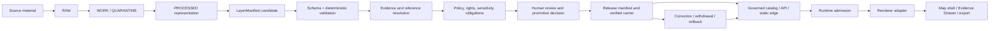

<!-- [KFM_META_BLOCK_V2]
doc_id: kfm://doc/architecture/ui/layering
title: Layer Architecture — KFM Map Shell Layering
type: architecture-reference
version: v2.0-draft
status: draft; repository-grounded; mixed-maturity; renderer-hold; non-publisher
owners:
  - "@bartytime4life — verified CODEOWNERS review route"
  - "NEEDS VERIFICATION — independent layer, data, UI, map-runtime, evidence, policy, release, accessibility, and security stewardship"
created: 2026-05-14
updated: 2026-08-19
policy_label: public; architecture; ui; layers; map-shell; trust-membrane; no-release; no-publication
owning_root: docs/
responsibility: Explain current KFM layer object roles, lifecycle boundaries, validation and runtime-admission evidence, map-shell consumption rules, repository drift, and graduation requirements without becoming semantic-contract, machine-schema, policy, release, or runtime authority.
truth_posture: cite-or-abstain; current-state claims are pinned to repository evidence; proposals, decisions, release, deployment, and public-operation claims remain visibly bounded
current_path: docs/architecture/ui/LAYERING.md
evidence_snapshot:
  repository: bartytime4life/Kansas-Frontier-Matrix
  base_ref: main
  base_commit: 68603b748d859884f5e140467285b5ae71d093a9
  target_prior_blob: cb9f83cb9a4ae03e397deb03510fa2ab4e87191c
  directory_rules_blob: fd49a0b83e55cef52c1124281f093e263526898d
  directory_rules_decision: ADR-0029 accepted
  layer_manifest_contract_blob: 234dca70e768ee744f7d78109afc6e0dc745af1b
  layer_descriptor_contract: current draft at pinned base
  layer_catalog_item_contract: current draft at pinned base
  data_layer_manifest_schema_blob: abca306cb271ed75127a83dd05b73830ba20773b
  layers_layer_manifest_schema_blob: 81b6872fa7f9c843adb8432f28aa306ab8d272f6
  layer_manifest_validator_blob: 577d31795caaf6712132e73189af18d318ac0e8a
  layer_manifest_runtime_admission_blob: 895100728c9eb676b9e2aef84680073142694b27
  maplibre_adapter_blob: 663ba0f7a05498948f67d644387c73ab19d5c16c
  explorer_package_blob: ddd201b74a06001d84a14bf54ac62a6cc3607a29
  maplibre_package_manifest_blob: b0582955feeb51016327113692fa5c98ecad8816
  governed_layers_route_blob: eaddcc9bfe066aea29178f3973275bd7e0932284
related:
  - ./README.md
  - ./BOUNDARIES.md
  - ./MAP_RUNTIME_BOUNDARY.md
  - ./EVIDENCE_DRAWER.md
  - ../map-shell.md
  - ../contract-schema-policy-split.md
  - ../../doctrine/directory-rules.md
  - ../../adr/ADR-0001-schema-home--schemas-contracts-v1-is-canonical.md
  - ../../adr/ADR-0005-apps-explorer-web-is-the-canonical-map-first-shell.md
  - ../../adr/ADR-0006-maplibre-boundary--only-maplibreadapter-imports-maplibre.md
  - "../../adr/ADR-0007 — MapLibre GL JS Is the Sole Browser-Side Renderer.md"
  - ../../adr/ADR-0029-adopt-directory-governance-standard-v2.md
  - ../../../contracts/data/layer_manifest.md
  - ../../../contracts/data/layer_descriptor.md
  - ../../../contracts/data/layer_catalog_item.md
  - ../../../contracts/runtime/layer_manifest_admission.md
  - ../../../contracts/layers/README.md
  - ../../../schemas/contracts/v1/data/layer_manifest.schema.json
  - ../../../schemas/contracts/v1/layers/layer_manifest.schema.json
  - ../../../policy/layers/README.md
  - ../../../fixtures/data/layer_manifest/README.md
  - ../../../tools/validators/data/validate_layer_manifest.py
  - ../../../apps/explorer-web/src/features/map_runtime/layer_manifest_admission.ts
  - ../../../apps/explorer-web/src/adapters/MapLibreAdapter.ts
  - ../../../apps/governed-api/src/governed_api/routes/layers.py
tags: [kfm, architecture, ui, layers, layer-manifest, layer-descriptor, layer-catalog-item, map-runtime, maplibre, evidence, policy, release, rollback]
notes:
  - "v2.0-draft replaces proposal-era and unmounted-repository claims with a same-path current-state reconciliation."
  - "ADR-0029 is accepted and makes this existing docs/architecture/ui/ lane placement-safe; ADR-0001 and the UI/renderer ADRs remain proposed or draft."
  - "Current semantic contracts live under contracts/data/; contracts/layers/ is a compatibility/orientation lane, not a second writable contract authority."
  - "The data LayerManifest pair has a real dual-profile schema, deterministic validator, fixtures, and a fixture-only runtime-admission projection. The parallel schemas/contracts/v1/layers/ files remain open proposal scaffolds."
  - "No live layer registry, reference resolver, operative layer-policy evaluator, released-layer loader, MapLibre runtime, public layer flow, release, deployment, or publication is established."
[/KFM_META_BLOCK_V2] -->

<a id="top"></a>
<a id="-layer-architecture--kfm-map-shell-layering"></a>

# 🗺️ Layer Architecture — KFM Map Shell Layering

> **Operating rule.** A KFM layer is a versioned, derived representation carried to a map or other public surface only after the appropriate evidence, policy, review, release, integrity, correction, and rollback state has been resolved. A layer, tile, style, legend, feature property, catalog entry, screenshot, or rendered pixel is never sovereign truth.


| Field | Current bounded result |
|---|---|
| **Evidence snapshot** | `main@68603b748d859884f5e140467285b5ae71d093a9` |
| **Document role** | Human-readable UI/layer architecture reference; not a semantic contract, schema, policy rule, release record, registry, runtime implementation, or publication authority |
| **Placement authority** | **CONFIRMED:** accepted [`ADR-0029`](../../adr/ADR-0029-adopt-directory-governance-standard-v2.md) adopts [`Directory Rules v2`](../../doctrine/directory-rules.md); the existing `docs/architecture/ui/` lane is placement-safe |
| **Current semantic contracts** | **CONFIRMED / DRAFT:** [`LayerManifest`](../../../contracts/data/layer_manifest.md), [`LayerDescriptor`](../../../contracts/data/layer_descriptor.md), and [`LayerCatalogItem`](../../../contracts/data/layer_catalog_item.md) live under `contracts/data/` |
| **Compatibility lane** | **CONFIRMED:** [`contracts/layers/README.md`](../../../contracts/layers/README.md) is an orientation/compatibility boundary and explicitly does not resolve contract or schema authority |
| **Machine-shape state** | **MIXED / CONFLICTED:** `schemas/contracts/v1/data/` contains the paired schemas; the `LayerManifest` data schema has a closed inactive fixture profile, while descriptor/catalog schemas remain permissive placeholders. Parallel `schemas/contracts/v1/layers/` files are open proposal scaffolds |
| **Candidate validation** | **CONFIRMED / BOUNDED:** a no-network `LayerManifest` validator, positive and negative fixtures, deterministic identity checks, and finite `PASS` / `FAIL` / `ERROR` outcomes exist |
| **Runtime-admission projection** | **CONFIRMED / BOUNDED:** a fixture-only evaluator returns `PASS`, `HOLD`, `DENY`, or `ERROR`; it always creates no authority, registry mutation, or MapLibre source |
| **Layer policy** | **INACTIVE:** `policy/layers/` contains a no-op proposed Rego stub with no evaluator, bundle, operative decision output, or governed consumer |
| **Governed `/layers` route** | **CONFIRMED / NEGATIVE SCAFFOLD:** the current route delegates to an `ABSTAIN` envelope; it does not resolve or serve released layers |
| **Map shell** | **CONFIRMED / BOUNDED:** the Explorer composition includes a synthetic map-evidence laboratory and renderer-neutral selection bridge, not a real layer loader |
| **Concrete renderer** | **HOLD:** Explorer has no `maplibre-gl` dependency, `packages/maplibre/` is a private `0.0.0` scaffold, and `MapLibreAdapter.ts` is one comment |
| **Release/publication effect** | None |

> [!IMPORTANT]
> **Validation is not release.** The strict `LayerManifest` profile is `PROPOSED_INACTIVE` and `FIXTURE_ONLY`. A validator `PASS` proves only declared local shape and deterministic invariants. It does not resolve references, execute policy, authenticate review, verify artifact bytes or signatures, approve release, register a layer, create a renderer source, or authorize public use.

> [!CAUTION]
> **The layer home question remains open.** Current object-level contracts and their paired schemas use `contracts/data/` and `schemas/contracts/v1/data/`. Parallel `contracts/layers/` and `schemas/contracts/v1/layers/` surfaces exist as compatibility or proposal scaffolds. This page records that drift; it does not select a winner, move files, or create another authority.

> [!WARNING]
> **Style is not access control.** A filter, opacity setting, hidden popup, zoom threshold, or invisible layer does not protect sensitive geometry or fields already delivered to the browser. Redaction, generalization, aggregation, withholding, or denial must happen before public artifact or response delivery.

---

## Contents

1. [Scope](#1-scope)
2. [Repo fit and canonical homes](#2-repo-fit-and-canonical-homes)
3. [The layer doctrine](#3-the-layer-doctrine)
4. [Object families](#4-object-families)
5. [Lifecycle of a layer](#5-lifecycle-of-a-layer)
6. [MapLibre adapter boundary](#6-maplibre-adapter-boundary)
7. [Finite outcomes and negative states](#7-finite-outcomes-and-negative-states)
8. [Sensitive geometry, rights, and CARE](#8-sensitive-geometry-rights-and-care)
9. [Validation](#9-validation)
10. [Anti-patterns](#10-anti-patterns)
11. [Inputs and exclusions](#11-inputs-and-exclusions)
12. [Open questions and verification backlog](#12-open-questions-and-verification-backlog)
13. [Related docs and ADRs](#13-related-docs-and-adrs)

---

## 1. Scope

This page explains how KFM's layer-related artifacts and decisions relate at the UI/map boundary. It covers:

- what a layer is and is not;
- the current repository homes and their unresolved conflicts;
- the distinction among catalog metadata, renderer-facing descriptors, manifests, artifacts, policy decisions, release decisions, and runtime admission;
- the current no-network validation and fixture-only admission evidence;
- the rule that public clients consume governed responses or released public-safe carriers;
- finite negative states, sensitive-geometry treatment, correction, withdrawal, and rollback;
- what must be proved before KFM can claim a live released-layer path.

This page does **not** define field-level object meaning or machine shape. Those authorities remain with `contracts/` and `schemas/`. It does not activate policy, choose a canonical schema lane, accept a renderer ADR, install a dependency, register a layer, serve an artifact, approve release, or publish.

### 1.1 Authority by question

| Question | Controlling evidence |
|---|---|
| Where does this page belong? | Accepted ADR-0029, adopted Directory Rules v2, and the existing UI architecture lane |
| What does a layer object mean? | The relevant semantic contract under `contracts/` |
| What shape is accepted? | The exact paired schema plus any registered validator profile |
| May an operation occur? | Applicable policy decision, caller, purpose, audience, rights, sensitivity, review, release, correction, and rollback state |
| What exists now? | Pinned repository files, tests, workflows, manifests, logs, and emitted artifacts |
| Is a layer released or published? | A governed release decision and active released artifact state—not a schema, fixture, validator, route, README, commit, pull request, or render |
| May the browser show it? | Governed response or already released public-safe carrier, with obligations the browser can enforce |
| Does a click establish a claim? | No. A click produces a candidate context for governed claim/evidence resolution |

### 1.2 Current-state versus target-state language

- **CONFIRMED** means the file, code, fixture, test, or accepted decision was inspected at the pinned snapshot.
- **PROPOSED** describes a future architecture or decision that is not current behavior.
- **NEEDS VERIFICATION** names a concrete check still required.
- **UNKNOWN** means current evidence is insufficient.

A repository path can be confirmed while the behavior described by its filename remains inactive. A green workflow can confirm a bounded check while release, deployment, and public operation remain unproved.

[Back to top](#top)

---

## 2. Repo fit and canonical homes

The path of this page is no longer a proposal. Accepted ADR-0029 makes `docs/doctrine/directory-rules.md` the single writable Directory Rules authority and confirms `docs/` as the human-facing explanation root. The current `docs/architecture/ui/` lane is an existing architecture home.

The **layer object-family placement**, however, is not fully converged.

| Responsibility | Current repository surface | Current posture |
|---|---|---|
| Human layer architecture | `docs/architecture/ui/LAYERING.md` | **CONFIRMED** existing path; this page |
| Object-level semantic contracts | `contracts/data/layer_manifest.md`, `layer_descriptor.md`, `layer_catalog_item.md` | **CONFIRMED / DRAFT** current contracts |
| Layer contract orientation | `contracts/layers/README.md` | **CONFIRMED / COMPATIBILITY**; not a second contract authority |
| Paired machine schemas | `schemas/contracts/v1/data/` | **CONFIRMED / MIXED:** active repository pair; `LayerManifest` strict fixture profile is implemented; descriptor/catalog shapes remain placeholders |
| Parallel layer schemas | `schemas/contracts/v1/layers/` | **CONFIRMED / PROPOSED SCAFFOLDS:** open shapes, no contract binding for inspected files |
| Candidate examples | `fixtures/data/layer_manifest/` | **CONFIRMED:** synthetic valid/invalid fixture profile |
| Candidate validator | `tools/validators/data/validate_layer_manifest.py` | **CONFIRMED:** no-network shape and deterministic semantic checks |
| Runtime admission meaning | `contracts/runtime/layer_manifest_admission.md` | **CONFIRMED / PROPOSED-INACTIVE:** fixture-only eligibility semantics |
| Runtime admission implementation | `apps/explorer-web/src/features/map_runtime/layer_manifest_admission.ts` | **CONFIRMED / BOUNDED:** finite evaluator; no side effects |
| Layer-policy source | `policy/layers/` | **CONFIRMED / INACTIVE:** boundary README plus no-op Rego stub |
| Governed route | `apps/governed-api/.../routes/layers.py` | **CONFIRMED / ABSTAIN-ONLY:** no released-layer resolver |
| Renderer adapter | `apps/explorer-web/src/adapters/MapLibreAdapter.ts` | **CONFIRMED / PLACEHOLDER:** comment-only |
| Renderer package | `packages/maplibre/` | **CONFIRMED / PLACEHOLDER:** private `0.0.0`, no runtime dependency |
| Browser shell | `apps/explorer-web/` | **CONFIRMED / BOUNDED:** executable synthetic map-evidence laboratory; no real layer loading |
| Release records | `release/` layer-manifest lanes | **CONFIRMED path family / DRAFT guidance:** no active layer release is established here |
| Published carriers | governed `data/published/` lanes | **NEEDS VERIFICATION per layer:** path presence does not prove an active released carrier |

### 2.1 Directory Rules result

For this documentation-only change, the placement outcome is `PLACE` at the existing path:

- `artifact_kind`: human architecture document;
- `authority_owner`: `docs/`;
- `scope_kind`: cross-cutting UI/layer boundary;
- `exposure`: public documentation;
- `mutability`: versioned replacement;
- `retention`: durable.

The same decision does **not** resolve the data-versus-layers contract/schema seam. That seam remains `CONFLICTED` / `NEEDS VERIFICATION` and may require an accepted ADR, explicit migration record, compatibility plan, link repair, validator/fixture updates, and rollback.

### 2.2 Dependency direction

The intended dependency direction is:

```text
domain/source evidence
  -> processed representation candidate
  -> semantic contract + machine schema
  -> deterministic validation
  -> evidence/source/reference resolution
  -> policy + rights + sensitivity
  -> review + promotion + release
  -> released public-safe carrier / governed response
  -> runtime admission
  -> renderer adapter
  -> map shell / Evidence Drawer / export / Focus request
```

The browser must not reverse this flow by treating rendered properties, style state, catalog metadata, or a client-side badge as upstream authority.

[Back to top](#top)

---

## 3. The layer doctrine

A **layer** is a named, versioned, spatial representation intended for governed discovery, rendering, interaction, comparison, export, or interpretation.

A layer is downstream of:

- one or more sources and source roles;
- a processed representation or artifact build;
- evidence support;
- machine validation;
- rights and sensitivity assessment;
- policy and review state;
- release, correction, withdrawal, and rollback state.

A layer is not:

- RAW, WORK, QUARANTINE, or canonical source data;
- an `EvidenceBundle`;
- a `SourceDescriptor`;
- a `PolicyDecision`;
- a review approval;
- a `ReleaseManifest` or `PromotionDecision`;
- a renderer implementation;
- a map click, popup, style, legend, screenshot, or AI answer;
- proof that an underlying claim is current, complete, accurate, or safe for the requested purpose.

### 3.1 Core invariants

1. **Renderer downstream of trust.** The renderer receives only a governed response or already released public-safe carrier.
2. **One role per object.** Catalog, source, evidence, policy, review, promotion, release, artifact, correction, and rollback references remain distinct.
3. **No direct internal path.** Ordinary clients do not read RAW, WORK, QUARANTINE, candidate, canonical, proof, registry, graph/vector-index, or model-runtime stores directly.
4. **Validation is bounded.** Shape and deterministic checks do not authorize exposure.
5. **Policy is operation-specific.** Permission to inspect metadata does not imply permission to render, identify, query, export, cache, use in AI, promote, or publish.
6. **Temporal states remain explicit.** Valid time, source-update time, evaluation time, release time, freshness, correction time, and withdrawal time stay distinct where material.
7. **Sensitive transformation precedes delivery.** Style-only hiding is denied as a privacy or sensitivity control.
8. **Correction is visible.** Superseded, withdrawn, stale, degraded, corrected, and rolled-back states propagate to clients.
9. **A client unable to enforce obligations must not proceed.** Attribution, citation, no-cache, audience, field allowlist, geometry generalization, and retention obligations are part of the decision.
10. **No document creates publication.** This page can explain the layer path; it cannot make a layer active.

### 3.2 Representation and claim separation

A layer may carry or imply claims, but the claim remains inspectable only through its evidence and release chain.

| Carrier | What it may do | What it must not do |
|---|---|---|
| Layer catalog item | List a layer and expose bounded trust metadata | Act as renderer config or release approval |
| Layer descriptor | Provide renderer-safe source and interaction references | Resolve evidence, decide policy, or publish |
| Layer manifest | Bind one versioned representation to role-specific references | Collapse evidence, policy, review, release, and artifact authority |
| PMTiles / MVT / COG / GeoParquet / GeoJSON fixture | Deliver spatial bytes | Become the semantic or release authority |
| Style / legend | Explain visual encoding | Hide delivered sensitive data or establish truth |
| Map selection | Scope a governed request | Become evidence or an authoritative claim |
| Evidence Drawer | Project public-safe evidence and negative states | Authenticate evidence merely by displaying it |
| Focus Mode | Interpret released evidence | Create source truth, policy, review, or release authority |

[Back to top](#top)

---

## 4. Object families

### 4.1 Current layer object family

| Object | Current semantic home | Current machine-shape state | Primary responsibility | Current maturity |
|---|---|---|---|---|
| `LayerManifest` | `contracts/data/layer_manifest.md` | Paired data schema has legacy compatibility plus a closed strict fixture profile | Bind a specific layer representation to separate catalog, source, evidence, policy, review, release, artifact, exposure, runtime, provenance, correction, and rollback references | **BOUNDED / FIXTURE-ONLY** |
| `LayerDescriptor` | `contracts/data/layer_descriptor.md` | Paired data schema is an `id`-required permissive placeholder | Renderer-facing descriptor and safe interaction handoff | **DRAFT / SHAPE INCOMPLETE** |
| `LayerCatalogItem` | `contracts/data/layer_catalog_item.md` | Paired data schema is an `id`-required permissive placeholder | List/discovery metadata and trust-state summary | **DRAFT / SHAPE INCOMPLETE** |
| Runtime admission projection | `contracts/runtime/layer_manifest_admission.md` | App-local exact input parser and finite evaluator | Decide only whether a closed synthetic runtime projection is eligible for a future loader | **PROPOSED-INACTIVE / FIXTURE-ONLY** |

### 4.2 Current strict `LayerManifest` profile

The strict fixture profile keeps these concerns visible without claiming their authorities:

- deterministic `id` and `spec_hash`;
- stable layer identity and explicit version;
- catalog, release-manifest, promotion-decision, style, source, evidence, policy, review, artifact, run-receipt, correction, and rollback references;
- renderer/protocol/source-layer/zoom/bounds/attribution representation data;
- valid-time and evaluation/source-update times;
- audience, rights, sensitivity, field allowlist, geometry transformation, and transform receipts;
- stale behavior, Evidence Drawer/Focus flags, and candidate performance budgets;
- explicit false-valued governance non-effects.

Its enforced state remains:

```text
profile_status = PROPOSED_INACTIVE
execution_mode = FIXTURE_ONLY
lifecycle_state = CANDIDATE
authority created = false
```

### 4.3 Proposed or unresolved companions

The following remain **PROPOSED**, **CONFLICTED**, or **NEEDS VERIFICATION** unless a current contract and shape prove otherwise:

| Object or seam | Needed role | Current result |
|---|---|---|
| `LegendDescriptor` | Units, classes, scales, uncertainty, sensitivity-safe legend disclosure | Proposed |
| `StyleManifest` | Immutable style/sprite/glyph references and presentation constraints | Proposed or distributed across compatibility surfaces |
| `TileArtifactManifest` | Exact carrier bytes, digests, range support, format metadata, and attestation refs | Contract surfaces exist; active canonical/runtime binding needs verification |
| `KFMGeoManifest` | Proposal-era PMTiles/COG/GeoParquet release-candidate manifest vocabulary | **PROPOSED / NEEDS VERIFICATION:** determine whether it remains distinct, aliases `TileArtifactManifest`, or is superseded |
| `MapReleaseManifest` | Release-level closure across layer, style, artifacts, policy, proof, correction, and rollback | Release family exists; active layer release not established |
| Reference resolver | Authenticate role-specific refs carried by a manifest | Not implemented in the inspected layer path |
| Layer registry writer | Append governed active-layer registration after release | Not implemented |
| Released-layer loader | Load a validated, admitted, active released layer into the renderer | Not implemented |
| Operative policy evaluator | Emit normalized layer `PolicyDecision` with obligations | Not bound |
| Signature/attestation verifier | Verify artifact and manifest integrity | Not bound |
| Performance probe | Measure real browser/device budgets | Not established |

### 4.4 Anti-collapse rule

No object in this family may stand in for another authority merely because it carries a reference to it.

```text
LayerManifest != EvidenceBundle
LayerManifest != PolicyDecision
LayerManifest != ReleaseManifest
LayerManifest != artifact bytes
runtime admission PASS != registry mutation
registry presence != public release
rendered layer != authoritative claim
```

[Back to top](#top)

---

## 5. Lifecycle of a layer

KFM's canonical lifecycle remains:

```text
RAW -> WORK / QUARANTINE -> PROCESSED -> CATALOG / TRIPLET -> PUBLISHED
```

A layer-specific flow crosses that lifecycle but does not replace it:


```mermaid
flowchart LR
  S[Source material] --> R[RAW]
  R --> W[WORK / QUARANTINE]
  W --> P[PROCESSED representation]
  P --> C[LayerManifest candidate]
  C --> V[Schema + deterministic validation]
  V --> E[Evidence and reference resolution]
  E --> O[Policy, rights, sensitivity, obligations]
  O --> H[Human review and promotion decision]
  H --> M[Release manifest and verified carrier]
  M --> G[Governed catalog / API / static edge]
  G --> A[Runtime admission]
  A --> X[Renderer adapter]
  X --> U[Map shell / Evidence Drawer / export]
  M --> L[Correction / withdrawal / rollback]
  L --> G
```

> **Diagram status:** architecture flow. Only the candidate-validation and fixture-only runtime-admission slices are proved by the inspected layer implementation. Reference resolution, operative policy, release closure, registration, concrete rendering, and public delivery remain unestablished.

### 5.1 Separate state axes

Do not compress these axes into one field or one “ready” badge.

| Axis | Current vocabulary or example | Owner |
|---|---|---|
| KFM lifecycle | RAW, WORK, QUARANTINE, PROCESSED, CATALOG/TRIPLET, PUBLISHED | Data lifecycle and governed promotion |
| Strict manifest profile | `PROPOSED_INACTIVE`, `FIXTURE_ONLY`, `CANDIDATE` | LayerManifest contract/schema |
| Manifest trust metadata | `CANDIDATE`, `DEGRADED`, `STALE`, `HELD` | Manifest candidate semantics |
| Validator result | `PASS`, `FAIL`, `ERROR` | Validator |
| Runtime admission | `PASS`, `HOLD`, `DENY`, `ERROR` | Admission projection |
| Policy result | Allow/restrict/hold/deny/abstain plus obligations | Policy evaluator |
| Release state | Candidate, approved, published, superseded, withdrawn, corrected, rolled back—as defined by release authority | Release system |
| Public response | `ANSWER`, `ABSTAIN`, `DENY`, `ERROR` | Governed response envelope |
| UI view state | loading, ready, stale, denied, abstained, withdrawn, corrected, error | UI projection |

### 5.2 Current runtime-admission proof

The current evaluator is intentionally side-effect free:

- it parses an exact fixture profile;
- it rejects authority-overclaiming inputs;
- it denies non-governed source URL classes;
- it holds legacy, inactive, non-published, stale, superseded, or unresolved inputs;
- it denies withdrawn, policy-denied, subject-mismatched, or internal-source inputs;
- it returns `PASS` only when the supplied synthetic release projection reports all required release/evidence/review/promotion/artifact/signature/rollback conditions.

Every result still declares:

```text
authority = NONE
registryMutated = false
maplibreSourceCreated = false
holds = [RUNTIME_REGISTRATION_NOT_EXECUTED]
```

A future active loader must re-evaluate current support rather than treating an old fixture `PASS` as durable authority.

### 5.3 Correction, withdrawal, and rollback

A mature layer path must:

1. preserve prior manifest and artifact identity;
2. link correction, supersession, withdrawal, and rollback records;
3. invalidate cached admission and public catalog state when support changes;
4. remove or replace affected renderer sources without hiding the correction;
5. propagate the active state to API, map, Evidence Drawer, exports, search, stories, and AI;
6. preserve a public-safe notice where policy permits;
7. retain enough evidence to reproduce why the prior state changed.

This page does not prove that end-to-end propagation exists.

[Back to top](#top)

---

## 6. MapLibre adapter boundary

Current repository evidence supports a **boundary**, not a functioning MapLibre runtime.

| Surface | Current evidence | Safe conclusion |
|---|---|---|
| `apps/explorer-web/package.json` | Vite/TypeScript/Vitest/Playwright only; no `maplibre-gl` dependency | Explorer does not currently boot MapLibre |
| `packages/maplibre/package.json` | Private package, version `0.0.0`, no dependencies | Package home exists as a scaffold |
| `MapLibreAdapter.ts` | One boundary comment | No adapter implementation exists |
| LayerManifest strict schema | `renderer: MAPLIBRE_GL_JS` in inactive fixture profile | The fixture shape names a target renderer; it does not accept a renderer ADR or activate a runtime |
| Explorer site | Synthetic SVG map stage and fixture-driven selection laboratory | Real source/layer registration is absent |
| Runtime admission evaluator | `maplibreSourceCreated: false` in every result | Admission proof intentionally stops before renderer mutation |

ADR-0005, ADR-0006, and ADR-0007 remain proposed or draft. This page may explain their intended seams but must not write them as accepted architecture.

### 6.1 Intended seam

The intended architecture remains:

```text
Governed shell and feature modules
  -> renderer-neutral MapRuntimePort
  -> one admitted MapLibre adapter
  -> MapLibre runtime
```

Outside the admitted adapter, UI code should not import MapLibre APIs or construct source access from ad hoc URLs and feature properties.

### 6.2 Loader preconditions

Before a future adapter may create a source or layer, the loader must prove at least:

- exact active manifest identity and digest;
- active release binding to the same manifest subject;
- resolved evidence and source roles;
- operative policy decision and enforceable obligations;
- approved rights and public-safe sensitivity posture;
- verified carrier bytes and required signature/attestation;
- current review, promotion, release, correction, and rollback state;
- governed or approved static source class;
- allowed fields and pre-delivery geometry transformation;
- renderer/plugin/protocol admission;
- current freshness and stale behavior;
- accessibility-safe controls and non-map alternatives;
- performance-budget measurements appropriate to the target environment.

A validator or runtime-admission `PASS` can be one input to this decision. It is never the whole decision.

### 6.3 Feature selection

A rendered feature remains a **candidate**. The adapter may forward a bounded context such as layer identity, feature identity, geometry reference, screen point, and time context to a governed resolver. It must not:

- use arbitrary tile properties as an authoritative claim;
- resolve `EvidenceBundle` from internal stores in the browser;
- expose hidden restricted fields through click payloads;
- call a model runtime directly;
- infer release or policy from visual presence;
- silently fall back from a failed governed response to feature properties.

[Back to top](#top)

---

## 7. Finite outcomes and negative states

KFM uses different finite outcomes at different layers. They must remain distinguishable.

### 7.1 Validator outcomes

| Outcome | Meaning | Authority limit |
|---|---|---|
| `PASS` | Shape and applicable local deterministic checks succeeded | No evidence, policy, review, release, signature, registry, rendering, or public-use authority |
| `FAIL` | Readable input violated schema or semantic invariants | Candidate must not progress as conformant |
| `ERROR` | Input, parser, schema, hashing dependency, or safe evaluation failed | Fail closed; do not coerce to pass |

### 7.2 Runtime-admission outcomes

| Outcome | Example meaning | Required posture |
|---|---|---|
| `PASS` | Synthetic projection is eligible for a future governed loader | Still no mutation; re-check at execution |
| `HOLD` | Inactive, candidate, stale, superseded, unresolved, or incomplete support | Do not register or render |
| `DENY` | Withdrawn, policy denied, internal source, binding mismatch, or authority overclaim | Refuse the operation |
| `ERROR` | Input carrier is invalid or cannot be evaluated safely | Refuse and surface a bounded diagnostic |

### 7.3 Public response outcomes

| Outcome | Layer/UI behavior |
|---|---|
| `ANSWER` | Render or explain only released, policy-safe, evidence-supported content with citations and visible trust state |
| `ABSTAIN` | Show that support is missing, stale, unresolved, conflicted, or out of scope; do not invent |
| `DENY` | Withhold or generalize according to policy; do not leak protected reasoning or precision |
| `ERROR` | Show a finite diagnostic and no claim-bearing fallback |

### 7.4 Required visible layer states

Where material and public-safe, the UI should distinguish:

- active/released;
- stale or degraded;
- candidate/held;
- denied or restricted;
- abstained/unresolved;
- superseded;
- withdrawn;
- corrected or rolled back;
- runtime error.

Absence from the map is ambiguous and must not be the only signal for denial, withdrawal, stale state, or unavailable evidence.

[Back to top](#top)

---

## 8. Sensitive geometry, rights, and CARE

Sensitive handling—including CARE, sovereignty, consent, cultural authority, source terms, and harmful precision—is an upstream artifact and policy concern, not a styling trick.

### 8.1 Pre-delivery rule

Before bytes reach an ordinary client, the governed path must decide whether to:

- allow exact geometry;
- generalize or aggregate;
- redact fields;
- replace geometry with a coarse public-safe representation;
- delay release;
- restrict by audience or purpose;
- suppress interaction or export;
- quarantine;
- deny.

The transform should be attributable to a reviewed rule and, where required, a transform or redaction receipt.

### 8.2 Current strict-profile checks

The inactive strict `LayerManifest` fixture profile currently proves only bounded candidate rules, including:

- a public audience requires `rights_status: APPROVED`;
- a public audience requires `PUBLIC_SAFE` or `TRANSFORM_REQUIRED` sensitivity;
- public candidates require a non-empty field allowlist;
- `TRANSFORM_REQUIRED` requires generalized geometry and at least one transform-receipt reference;
- references must not use floating `latest` locators;
- governance-authority flags must remain false.

These checks do not establish real rights, CARE/sovereignty obligations, consent, source terms, steward authority, public-safe geometry, or receipt authenticity.

### 8.3 Fail-closed domains and contexts

Extra review is required where a layer could expose:

- precise rare-species or habitat locations;
- archaeology, burial, sacred, cultural, or tribal information;
- critical infrastructure or vulnerability details;
- living-person, genealogy, land/title, private-property, or genomic information;
- private wells or other sensitive environmental points;
- security-sensitive facilities;
- source-restricted, licensed, embargoed, or non-redistributable material.

When the applicable authority or rights are unclear, the correct layer outcome is hold, quarantine, generalize, restrict, abstain, or deny—not a visually hidden public layer.

[Back to top](#top)

---

## 9. Validation

This documentation update changes no contract, schema, policy rule, fixture, validator, test, workflow, route, dependency, artifact, or runtime behavior. The commands below describe current relevant proof surfaces and the checks expected for future layer work.

### 9.1 Current focused layer checks

The current `LayerManifest` contract documents these repository-native checks:

```bash
python -m unittest tests.validators.test_validate_layer_manifest --verbose
python tools/validators/data/validate_layer_manifest.py --fixtures
python tools/validate_all.py --validate-registry
python tools/validate_all.py --profile release-dry-run --validator layer-manifest
```

The runtime-admission lane has app-local fixture tests and a dedicated workflow. Those tests prove the finite, no-side-effect admission projection only.

### 9.2 What current validation proves

| Check family | Proves | Does not prove |
|---|---|---|
| JSON Schema | Carrier shape for the selected profile | Semantic truth, rights, policy, release |
| Deterministic validator | Hash/ID reproduction and named local invariants | Reference existence or authenticity |
| Valid/invalid fixture polarity | Reviewed expected cases remain stable | Production data or live-source quality |
| Runtime-admission tests | Finite fail-closed eligibility decisions and no side effects | Registry, renderer, API, or deployed behavior |
| Documentation checks | Source structure, links, anchors, and bounded claims | Implementation or publication |
| Hosted workflows | Exact configured jobs ran at a commit | Branch-protection requirement, release, deployment, or public operation unless separately proved |

### 9.3 Required graduation evidence

A real released-layer path must add or verify:

- canonical contract/schema authority and migration closure;
- resolved reference and identity bindings;
- operative layer policy with normalized decision and obligations;
- authenticated review and promotion records;
- verified carrier bytes, signatures/attestations, and immutable addressing;
- release manifest and rollback target;
- active registry semantics and correction propagation;
- implemented loader and adapter with import-boundary enforcement;
- no direct internal-store access;
- sensitive-field and geometry negative tests;
- stale, withdrawn, superseded, and rollback browser tests;
- accessibility and non-map alternatives;
- real performance probes;
- deployment/network/credential isolation;
- public-surface parity across map, drawer, export, search, story, and AI.

### 9.4 Documentation checks for this page

At minimum, a change to this page should verify:

- one H1;
- balanced fenced blocks and HTML comments;
- no heading-level skips;
- stable top and legacy anchors;
- no duplicate explicit anchors;
- repository-relative link closure;
- readable tables;
- no trailing whitespace or placeholder-owner invention;
- no secret or protected location;
- final newline;
- generated receipt and artifact hash for substantive AI authorship;
- exact changed-path set and base drift.

[Back to top](#top)

---

## 10. Anti-patterns

| Anti-pattern | Why it fails | Corrective posture |
|---|---|---|
| Calling this page the canonical semantic layer authority | `docs/` explains; `contracts/` owns meaning | Link to current contracts and keep this page architectural |
| Selecting `data/` or `layers/` schema home by prose | Creates or ratifies parallel shape authority without decision/migration | Preserve the conflict; resolve through accepted authority |
| Treating a validator `PASS` as release | Confuses bounded conformance with evidence, policy, review, and release | Keep state axes separate |
| Treating runtime-admission `PASS` as registration | Current evaluator explicitly performs no mutation | Require a separately governed loader |
| Treating `renderer: MAPLIBRE_GL_JS` in a fixture schema as accepted renderer policy | Inactive shape does not accept ADR-0007 or install a dependency | Keep renderer decision and runtime HOLD visible |
| Loading direct object-store, internal, candidate, or canonical URLs in the browser | Bypasses the trust membrane | Use governed API or approved released static edge |
| Using style filters as redaction | Sensitive bytes still reach the client | Transform or withhold before delivery |
| Treating feature properties as claims | Renderer data is a carrier, not evidence authority | Resolve through governed claim/evidence path |
| Combining catalog, evidence, policy, review, release, artifact, and rollback refs into one token | Destroys role-specific audit and correction | Preserve separate identities |
| Using floating `latest` artifact references | Breaks replay and rollback | Use immutable digest/version bindings |
| Hiding stale, denied, withdrawn, or corrected state by removing a layer silently | Makes absence ambiguous and correction invisible | Show a public-safe finite state and lineage |
| Caching old policy/admission success as permanent authority | Rights, sensitivity, correction, and release can change | Re-evaluate and invalidate dependent caches |
| Allowing AI to infer missing layer trust fields | Generated language cannot create evidence or policy state | Abstain, deny, or narrow |
| Treating uploaded reports or old workspace scans as current implementation proof | Confuses lineage with repository state | Pin current code/config/test evidence |
| Creating another `LayerManifest` home to “clean up” drift | Adds parallel authority | Use ADR/migration/compatibility discipline |
| Mixing published carrier bytes with release decisions | Blurs artifact versus authorization | Keep `data/published/` and `release/` responsibilities distinct |

[Back to top](#top)

---

## 11. Inputs and exclusions

### 11.1 Inputs to a mature layer-release and runtime path

A mature implementation may consume role-specific objects such as:

- `SourceDescriptor` and immutable source/version identity;
- processed spatial representation metadata;
- `LayerManifest`, `LayerDescriptor`, and `LayerCatalogItem`;
- EvidenceRef/EvidenceBundle support;
- validation reports and run receipts;
- policy decisions and enforceable obligations;
- rights, sensitivity, sovereignty, and transform records;
- review and promotion decisions;
- artifact manifests, digests, and attestations;
- release manifest and active release state;
- correction, supersession, withdrawal, and rollback records;
- current time/freshness context;
- renderer/plugin/protocol admission;
- accessibility and performance evidence.

Each input retains its own authority and failure behavior.

### 11.2 Outputs

A mature path may emit:

- released public-safe carrier references;
- governed layer catalog entries;
- finite runtime-admission decisions;
- renderer source/layer state;
- public-safe map selection context;
- Evidence Drawer payloads;
- export eligibility;
- correction or withdrawal UI state;
- validation, runtime, and audit receipts.

None of these outputs replaces the underlying evidence or release authority.

### 11.3 Out of scope for this page

- Field-by-field normative contract definitions.
- JSON Schema authoring.
- Rego policy implementation or activation.
- Source ingestion and live-source terms.
- Artifact build pipelines.
- Registry mutation.
- MapLibre dependency admission or adapter implementation.
- Route/API implementation.
- Authentication, authorization, CSP, CORS, hosting, CDN, or object-store configuration.
- Release approval, deployment, publication, source activation, correction execution, or rollback execution.
- Choosing the canonical contract/schema lane.
- Moving, renaming, deleting, or consolidating current layer homes.

[Back to top](#top)

---

## 12. Open questions and verification backlog

| Item | Current status | Closure evidence required |
|---|---|---|
| Canonical contract lane: `contracts/data/` versus `contracts/layers/` | **CONFLICTED / NEEDS VERIFICATION** | Accepted decision or verified existing authority plus migration/compatibility record |
| Canonical schema lane: `schemas/contracts/v1/data/` versus `schemas/contracts/v1/layers/` | **CONFLICTED / NEEDS VERIFICATION** | Accepted schema-home decision, consumer inventory, `$id` migration, fixture/validator/test updates, rollback |
| Descriptor and catalog-item shape completeness | **PROPOSED / INCOMPLETE** | Closed schemas, fixtures, validators, tests, compatibility plan |
| Shared vocabulary across manifest, descriptor, catalog item, release manifest, and admission | **NEEDS VERIFICATION** | Contract crosswalk and negative anti-collapse tests |
| Reference resolver for source/evidence/policy/review/release/artifact/correction roles | **UNKNOWN / NOT ESTABLISHED** | Repository implementation, no-network fixtures, deterministic outcomes, boundary tests |
| Operative layer policy evaluator | **INACTIVE** | Accepted scope, bundle, evaluator, `PolicyDecision` contract, obligations, tests, consumer binding |
| Release-manifest lane and active-layer release procedure | **CONFLICTED / DRAFT** | Canonical release home, manifest contract/schema, review/promotion binding, correction and rollback drill |
| Artifact signature and byte verification | **NOT ESTABLISHED in layer path** | Attestation profile, immutable refs, verifier, negative tests |
| Active registry writer and read model | **NOT IMPLEMENTED** | Governed state transition, receipts, idempotency, correction invalidation, rollback |
| Released-layer loader | **NOT IMPLEMENTED** | Exact input contract, policy/release checks, no-side-effect negatives, integration tests |
| `MapRuntimePort` and `MapLibreAdapter` | **PROPOSED / HOLD** | Accepted decision, actual implementation, import-boundary tests, browser probes |
| MapLibre dependency and version admission | **HOLD** | Accepted decision, pinned dependency/lock evidence, license/security review, renderer tests, rollback |
| Live `/layers` route | **ABSTAIN-ONLY** | Governed resolver, response contract, evidence/policy/release binding, negative tests |
| Domain-specific field allowlists and geometry transforms | **NEEDS VERIFICATION** | Domain steward policy, fixtures, transform receipts, byte-level leakage tests |
| Correction/withdrawal/rollback propagation | **UNKNOWN end to end** | Release drill across registry, API, cache, map, drawer, export, search, story, and AI |
| Real performance budgets | **UNMEASURED** | Device/browser matrix, representative released carriers, recorded probes |
| Accessibility parity | **NEEDS VERIFICATION for real map** | Keyboard controls, screen-reader path, alternative feature list, focus/reduced-motion tests |
| Deployment/network isolation | **UNKNOWN** | Runtime configuration, network policy, credentials, CSP/CORS, logs, security review |
| Independent stewardship and separation of duties | **NEEDS VERIFICATION** | Named accepted roles and review evidence |

The smallest dependency-closed next implementation is not a live MapLibre load. It is a maintainer decision on the contract/schema lane or a bounded resolver/policy/release dependency that closes one currently explicit HOLD without creating parallel authority.

[Back to top](#top)

---

## 13. Related docs and ADRs

### Architecture and doctrine

| Surface | Link | Current posture |
|---|---|---|
| UI subsystem index | [`ui/README.md`](./README.md) | Repository-grounded architecture landing page |
| UI trust boundaries | [`BOUNDARIES.md`](./BOUNDARIES.md) | Repository-grounded bounded boundary map |
| Map-runtime boundary | [`MAP_RUNTIME_BOUNDARY.md`](./MAP_RUNTIME_BOUNDARY.md) | Proposal-era lineage; current-state rows need separate reconciliation |
| Evidence Drawer | [`EVIDENCE_DRAWER.md`](./EVIDENCE_DRAWER.md) | Bounded UI projection architecture |
| Map shell | [`map-shell.md`](../map-shell.md) | Current executable synthetic composition and renderer HOLD |
| Contract/schema/policy split | [`contract-schema-policy-split.md`](../contract-schema-policy-split.md) | Responsibility split reference |
| Directory Rules | [`directory-rules.md`](../../doctrine/directory-rules.md) | Accepted exact bytes through ADR-0029 |

### Contracts, schemas, policy, fixtures, and implementation

| Surface | Link | Current posture |
|---|---|---|
| LayerManifest contract | [`contracts/data/layer_manifest.md`](../../../contracts/data/layer_manifest.md) | Draft, dual-profile, fixture-only strict profile |
| LayerDescriptor contract | [`contracts/data/layer_descriptor.md`](../../../contracts/data/layer_descriptor.md) | Draft; paired shape incomplete |
| LayerCatalogItem contract | [`contracts/data/layer_catalog_item.md`](../../../contracts/data/layer_catalog_item.md) | Draft; paired shape incomplete |
| Layer contracts compatibility lane | [`contracts/layers/README.md`](../../../contracts/layers/README.md) | Orientation only; authority conflict preserved |
| Runtime admission contract | [`contracts/runtime/layer_manifest_admission.md`](../../../contracts/runtime/layer_manifest_admission.md) | Proposed-inactive, fixture-only |
| Data LayerManifest schema | [`schemas/.../data/layer_manifest.schema.json`](../../../schemas/contracts/v1/data/layer_manifest.schema.json) | Closed strict fixture profile plus legacy compatibility |
| Parallel layers schema | [`schemas/.../layers/layer_manifest.schema.json`](../../../schemas/contracts/v1/layers/layer_manifest.schema.json) | Open proposal scaffold |
| Layer policy boundary | [`policy/layers/README.md`](../../../policy/layers/README.md) | Inactive no-op rule lane |
| LayerManifest fixtures | [`fixtures/data/layer_manifest/README.md`](../../../fixtures/data/layer_manifest/README.md) | Synthetic no-network profile |
| LayerManifest validator | [`validate_layer_manifest.py`](../../../tools/validators/data/validate_layer_manifest.py) | Bounded deterministic validator |
| Runtime admission evaluator | [`layer_manifest_admission.ts`](../../../apps/explorer-web/src/features/map_runtime/layer_manifest_admission.ts) | Side-effect-free fixture evaluator |
| MapLibre adapter | [`MapLibreAdapter.ts`](../../../apps/explorer-web/src/adapters/MapLibreAdapter.ts) | Comment-only placeholder |
| Governed layers route | [`layers.py`](../../../apps/governed-api/src/governed_api/routes/layers.py) | ABSTAIN scaffold |

### Decisions

| ADR | Link | Current status |
|---|---|---|
| Schema home | [`ADR-0001`](../../adr/ADR-0001-schema-home--schemas-contracts-v1-is-canonical.md) | Proposed |
| Explorer shell | [`ADR-0005`](../../adr/ADR-0005-apps-explorer-web-is-the-canonical-map-first-shell.md) | Proposed |
| MapLibre adapter seam | [`ADR-0006`](../../adr/ADR-0006-maplibre-boundary--only-maplibreadapter-imports-maplibre.md) | Draft / effectively proposed |
| Sole browser renderer | [`ADR-0007`](../../adr/ADR-0007%20%E2%80%94%20MapLibre%20GL%20JS%20Is%20the%20Sole%20Browser-Side%20Renderer.md) | Proposed |
| Directory Governance Standard v2 | [`ADR-0029`](../../adr/ADR-0029-adopt-directory-governance-standard-v2.md) | Accepted |

---

## Rollback

This is a same-path documentation-only revision.

- Before merge: close the draft pull request and delete the feature branch.
- After an authorized merge: revert the documentation commit and its generated authoring receipt, restoring prior blob `cb9f83cb9a4ae03e397deb03510fa2ab4e87191c`.
- Re-run the same documentation, link, metadata, and receipt checks.
- No source deactivation, data migration, registry change, renderer rollback, cache invalidation, release correction, withdrawal, or public rollback is required because this page changes no trust-bearing behavior or released artifact.

> **Non-effect:** Updating this page does not accept an ADR, resolve the layer-home conflict, activate a policy, register or load a layer, install MapLibre, release, deploy, promote, publish, correct, withdraw, or roll back any KFM data or public claim.

<p align="right"><a href="#top">Back to top</a></p>
