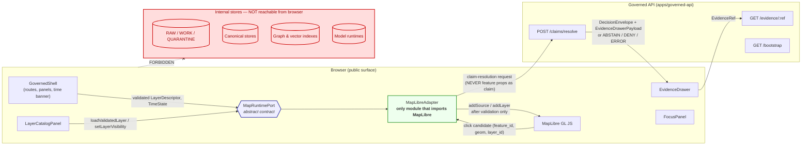
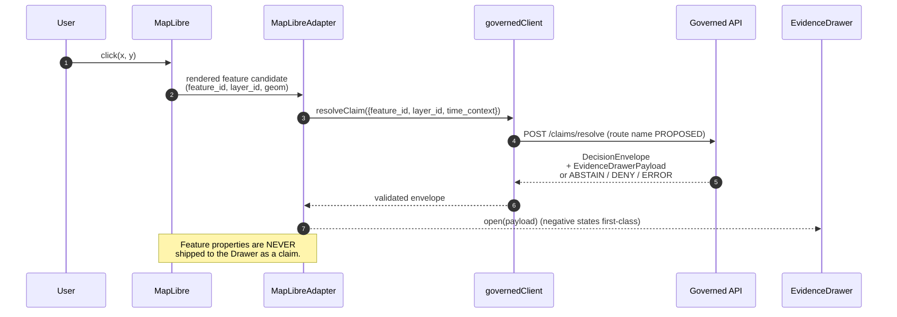

<!-- [KFM_META_BLOCK_V2]
doc_id: kfm://doc/architecture/ui/map-runtime-boundary
title: Map Runtime Boundary
type: standard
version: v0.1
status: draft
owners: <ui-subsystem-owner> + <docs-steward>
created: 2026-05-14
updated: 2026-05-14
policy_label: public
related:
  - docs/architecture/ui/README.md
  - docs/architecture/ui/BOUNDARIES.md
  - docs/architecture/ui/STATE_OWNERSHIP.md
  - docs/architecture/ui/LAYERING.md
  - docs/architecture/ui/ROUTE_MAP.md
  - docs/architecture/ui/CONTINUITY_NOTES.md
  - docs/architecture/governed-ai/BOUNDARIES.md
  - docs/adr/ADR-maplibre-adapter-boundary.md
  - directory-rules.md
tags: [kfm, ui, maplibre, adapter, trust-membrane, boundary]
notes:
  - Path PROPOSED until verified against mounted-repo state per Directory Rules §0.
  - Focused split of the broader BOUNDARIES.md surface; see Section 2 of the source PR.
[/KFM_META_BLOCK_V2] -->

# Map Runtime Boundary

> The map renderer is **downstream of trust, never upstream of it.** This file defines the contract that holds that line.


| Field | Value |
|---|---|
| **Status** | `draft` |
| **Owners** | UI subsystem owner · Docs steward *(placeholder — confirm in CODEOWNERS)* |
| **Authority of this doctrine** | **CONFIRMED** from `UIAI-MAP`, `UIAI-WHOLE §18`, `UIAI-MASTER`, and the Unified Implementation Architecture Build Manual §3.9 |
| **Authority of any specific path quoted here** | **PROPOSED** until verified against mounted-repo evidence (Directory Rules §0) |
| **Governing ADR** | `docs/adr/ADR-maplibre-adapter-boundary.md` *(PROPOSED — not yet accepted in this session)* |
| **Last reviewed** | `2026-05-14` |

---

## Quick jump

- [1. Purpose](#1-purpose)
- [2. The one-sentence rule](#2-the-one-sentence-rule)
- [3. Scope & non-scope](#3-scope--non-scope)
- [4. The boundary, at a glance](#4-the-boundary-at-a-glance)
- [5. `MapRuntimePort` — the contract the rest of the UI may import](#5-mapruntimeport--the-contract-the-rest-of-the-ui-may-import)
- [6. `MapLibreAdapter` — the only module that may import MapLibre](#6-maplibreadapter--the-only-module-that-may-import-maplibre)
- [7. Feature click → claim resolution](#7-feature-click--claim-resolution)
- [8. `LayerDescriptor` requirements](#8-layerdescriptor-requirements)
- [9. Camera & time synchronization](#9-camera--time-synchronization)
- [10. Forbidden browser operations](#10-forbidden-browser-operations)
- [11. Negative states (first-class)](#11-negative-states-first-class)
- [12. Validation & tests](#12-validation--tests)
- [13. Rollback path](#13-rollback-path)
- [14. Related docs](#14-related-docs)
- [15. Open questions & verification backlog](#15-open-questions--verification-backlog)
- [Appendix A — Method-signature sketch (illustrative)](#appendix-a--method-signature-sketch-illustrative)
- [Appendix B — Anti-patterns this boundary forbids](#appendix-b--anti-patterns-this-boundary-forbids)

---

## 1. Purpose

**CONFIRMED doctrine.** This document defines the trust boundary between the disciplined 2D map renderer (MapLibre) and the rest of the governed UI shell. It exists to keep the renderer subordinate to evidence, policy, review state, release state, and the governed API — and to make that subordination *enforceable in code*, not only described in prose.

It is the canonical home for two named seams:

1. **`MapRuntimePort`** — the abstract port the rest of the UI imports.
2. **`MapLibreAdapter`** — the only module permitted to import MapLibre runtime APIs.

> [!IMPORTANT]
> If this boundary is breached, every other UI trust property — citation, abstain, deny, freshness, rights, sensitivity, correction lineage, rollback — becomes negotiable. **The boundary is load-bearing.**

[↑ Back to top](#map-runtime-boundary)

---

## 2. The one-sentence rule

> **CONFIRMED.** *MapLibre is the disciplined 2D renderer and interaction runtime inside the governed KFM shell; it is not the canonical truth store, source registry, policy engine, citation authority, review authority, publication authority, or AI authority. The renderer is downstream of trust, never upstream of it.*
> — Unified Implementation Architecture Build Manual §3.9 (UIAI-MAP §§1, 4–5)

Everything below is the operational reading of that sentence.

---

## 3. Scope & non-scope

### 3.1 In scope

- The contract between the governed UI shell and the MapLibre runtime.
- The adapter that owns all MapLibre imports and lifecycle.
- How the adapter accepts `LayerDescriptor` and `TimeState` and surfaces feature-click candidates.
- The conversion of a click into a **governed claim-resolution request**.
- Forbidden browser operations enumerated against this seam.
- Negative states the adapter must surface as first-class.

### 3.2 Out of scope

| Topic | Lives in |
|---|---|
| Drawer payload shape | `docs/architecture/ui/STATE_OWNERSHIP.md` and `EvidenceDrawerPayload` schema **(PROPOSED)** |
| Layer catalog / legend behavior | `docs/architecture/ui/LAYERING.md` **(PROPOSED)** |
| Focus Mode flow & model adapter boundary | `docs/architecture/governed-ai/BOUNDARIES.md` **(PROPOSED)** |
| Story node conditional 3D handoff | `docs/architecture/story/README.md` **(PROPOSED)** |
| Browser allowed/forbidden operations *broadly* | `docs/architecture/ui/BOUNDARIES.md` **(PROPOSED — this file is the map-runtime slice of that doc)** |
| Object semantic meaning | `contracts/` |
| Object machine shape | `schemas/contracts/v1/...` (per ADR-0001) |
| Admissibility / deny / abstain | `policy/` |

[↑ Back to top](#map-runtime-boundary)

---

## 4. The boundary, at a glance



> [!NOTE]
> **Diagram status: PROPOSED.** The flow is faithful to UIAI-WHOLE §18 and UIAI-MAP doctrine. Concrete route names (`/claims/resolve`, `/evidence/:ref`, `/bootstrap`) are **NEEDS VERIFICATION** until the governed-API repo is inspected; treat them as placeholders for the routes the adapter calls.

[↑ Back to top](#map-runtime-boundary)

---

## 5. `MapRuntimePort` — the contract the rest of the UI may import

**PROPOSED contract.** `MapRuntimePort` is the abstract seam. Every component outside the adapter — `GovernedShell`, `LayerCatalogPanel`, `EvidenceDrawer`, `FocusPanel`, `StoryNodePlayer`, compare/export controls — imports `MapRuntimePort`, never MapLibre directly.

| Method | Inputs | Outputs / events | Doctrine basis |
|---|---|---|---|
| `setCamera` | bounds, center, zoom, pitch, bearing | next camera state | UIAI-WHOLE §18 |
| `setTimeContext` | `TimeState` (`valid_time`, `observed_time`, `freshness`, viewport time) | applies time-aware filters; emits `time_applied` | UIAI-WHOLE §18, MapLibre Master P-085…P-090 |
| `loadValidatedLayer` | validated `LayerDescriptor` (release_state = PUBLISHED) | source+layer added; `layer_loaded` event | UIAI-WHOLE §18, UIAI-MAP §10 |
| `removeLayer` | `layer_id` | source+layer removed | UIAI-WHOLE §18 |
| `setLayerVisibility` | `layer_id`, visible boolean | visibility applied | UIAI-WHOLE §18 |
| `queryRenderedFeatureAtPoint` | screen point | **candidate** event with `feature_id`, `layer_id`, geometry — **never a claim** | UIAI-WHOLE §18, UIAI-MASTER |
| `destroy` | — | tear down map, listeners, sources | UIAI-WHOLE §18 |

> [!TIP]
> The method list is **PROPOSED** as the minimum surface. Adding a method to `MapRuntimePort` is an architectural change that **MUST** be justified in `ADR-maplibre-adapter-boundary` and **MUST NOT** widen the seam to leak unvalidated state, raw features as claims, or direct store access.

See [Appendix A](#appendix-a--method-signature-sketch-illustrative) for an illustrative TypeScript-shaped signature sketch (clearly labeled illustrative, not normative).

[↑ Back to top](#map-runtime-boundary)

---

## 6. `MapLibreAdapter` — the only module that may import MapLibre

**PROPOSED implementation rule.** Exactly one module in the repo is permitted to import from the MapLibre runtime package (e.g., `maplibre-gl`). That module is `MapLibreAdapter`.

### 6.1 Responsibilities (what the adapter DOES)

- Implement `MapRuntimePort` in full.
- Translate `LayerDescriptor` → MapLibre `source` + `layer` **only after** the descriptor's `release_state`, `policy_label`, and integrity refs have been validated upstream.
- Synchronize camera and time state with the shell's state owners.
- Convert raw MapLibre click events into **candidate** events carrying `feature_id`, `layer_id`, and geometry — and hand those to the governed client for claim resolution.
- Surface negative states (`stale`, `denied`, `error`, `evidence_missing`) at the boundary, not silently.
- Tear down cleanly on `destroy`.

### 6.2 Non-responsibilities (what the adapter MUST NOT do)

| The adapter MUST NOT… | Because… | Source |
|---|---|---|
| Read RAW / WORK / QUARANTINE / canonical stores | Public clients use governed APIs only | UIAI-WHOLE §25 |
| Resolve `EvidenceBundle` from `EvidenceRef` | Resolution is a governed-API responsibility | UIAI-WHOLE §18 |
| Call a model runtime (Ollama, OpenAI, vector DB, graph store) | Browser never holds the model seam | UIAI-WHOLE §18, §25 |
| Filter unpublished or candidate layers into view | Only `PUBLISHED` artifacts reach the renderer | UIAI-MAP §10, Directory Rules lifecycle invariant |
| Treat MapLibre `popup` content as a claim | Popups launch the Evidence Drawer; they are not evidence | UIAI-MASTER ML-064-080 |
| Hide sensitive geometry by style alone | Style-only hiding is a known anti-pattern; sensitive geometry must be denied or generalized **before** reaching the adapter | UIAI-MASTER ML-064-075, ML-064-078 |
| Synthesize feature attributes not present in the validated layer | Attribute whitelist enforced upstream; no inference at the renderer | UIAI-MASTER (style expressions) |

> [!WARNING]
> **Style-only hiding is not access control.** A MapLibre style filter that omits sensitive features still ships the underlying tile bytes. Sensitivity is enforced by the **policy gate and the artifact**, not by the style. See `policy/sensitivity/` (PROPOSED) and `KFMGeoManifest` validation.

[↑ Back to top](#map-runtime-boundary)

---

## 7. Feature click → claim resolution

**CONFIRMED doctrine** (UIAI-WHOLE §18, kfm_encyclopedia §8.B): a click is a **request to resolve**, not a fact.



### Outcome envelope at the drawer

| Outcome | What the drawer shows | Public-surface behavior |
|---|---|---|
| **ANSWER** | claim, resolved `EvidenceBundle` ref, source roles, valid/observed/release time, freshness, rights, sensitivity, review, correction lineage | Substantive answer with citations |
| **ABSTAIN** | reason code (`evidence_missing`, `stale`, `unresolved_ref`) | Non-substantive note; never invents |
| **DENY** | policy reason code (rights, sensitivity, sovereignty) | Denial reason; offers non-restricted alternative if any |
| **ERROR** | finite, actionable diagnostic | No claim leakage; no silent fallthrough |

**Source:** kfm_encyclopedia §8.C; KFM_Domains_Culmination_Atlas §24.3.

[↑ Back to top](#map-runtime-boundary)

---

## 8. `LayerDescriptor` requirements

**PROPOSED.** Every descriptor accepted by `loadValidatedLayer` must already carry the fields needed for *interpretation at point of use*. The adapter does not enrich descriptors; it refuses descriptors that lack the required fields.

| Field group | Required content | Source of truth |
|---|---|---|
| Identity | `layer_id`, `version`, `spec_hash` | `LayerManifest` schema (PROPOSED) |
| Release state | `release_state` = `PUBLISHED`; `release_manifest_ref` | `ReleaseManifest`; UIAI-WHOLE §25 |
| Integrity | artifact digest, signature ref (where applicable) | `KFMGeoManifest`; UIAI-MASTER §§2, 9–14 |
| Source roles | `source_role` per layer (steward, observer, derived, model-output, etc.) | `SourceDescriptor` |
| Time | `valid_time`, `observed_time`, `source_time`, `retrieval_time`, `release_time`, freshness window | UIAI-MASTER P. (time-aware); ML-061-091, ML-061-092 |
| Rights | `rights_statement`, `license_spdx`, `obligations` | UIAI-MASTER ML-064-107 |
| Sensitivity | `policy_label` (public / generalized / restricted), CARE flags | UIAI-MASTER ML-064-019, ML-064-075 |
| Review | review state ref (where required) | `ReviewRecord` |
| Correction lineage | latest `CorrectionNotice` ref, if any | `CorrectionNotice` |
| Trust badges | enough metadata to render badges *without* re-deriving from raw data | UIAI-WHOLE §18 |

> [!NOTE]
> Field names are **PROPOSED** and align with `schemas/contracts/v1/layers/layer_descriptor.schema.json` (PROPOSED home per UIAI-WHOLE §16). The authoritative names land in that schema; this table follows it, not the other way around.

[↑ Back to top](#map-runtime-boundary)

---

## 9. Camera & time synchronization

**PROPOSED.** The adapter participates in two state flows it does **not own**:

- **Camera state** is owned by the shell's map-view state owner; the adapter applies it through `setCamera` and emits camera-changed events back to the shell.
- **Time state** (`TimeState`: viewport time, `valid_time`, `observed_time`, freshness, time filters) is owned by the shell's time state owner; the adapter applies it through `setTimeContext` and **must distinguish source time, valid time, observed time, retrieval time, and release time** (UIAI-MASTER ML-061-091, ML-061-092). Collapsing those is a known anti-pattern.

> [!CAUTION]
> The adapter **MUST NOT** decide that a layer is stale on its own. Staleness is computed upstream from the layer's freshness window and surfaced via the descriptor and the drawer payload. The adapter only *reflects* stale state in the UI (e.g., trust badge state) — it does not *declare* it.

[↑ Back to top](#map-runtime-boundary)

---

## 10. Forbidden browser operations

**CONFIRMED doctrine** (UIAI-WHOLE §25; kfm_encyclopedia §8.A; UIAI-MAP):

The browser, including the `MapLibreAdapter`, **MUST NOT**:

- Read RAW, WORK, QUARANTINE, canonical stores, graph stores, object stores, or vector indexes.
- Call model runtimes (Ollama, OpenAI, local models) directly.
- Access unpublished candidates, internal service handles, or credentials.
- Load tile URLs that lack `LayerManifest` / `ReleaseManifest` / `TileArtifactManifest` approval.
- Treat tiles, PMTiles, COGs, style JSON, screenshots, Story Nodes, 3D scenes, graph projections, catalog records, or AI answers as sovereign truth — **they are downstream carriers** (UIAI-MASTER §§2, 9–14).
- Ship raw prompt text, raw evidence, restricted geometry, or full `EvidenceBundle` copies via telemetry (UIAI-WHOLE §25).

The single allowed browser network path for trust payloads is the **typed governed API client**. All other network paths are tile/style/asset fetches against artifacts explicitly approved by the active `ReleaseManifest`.

[↑ Back to top](#map-runtime-boundary)

---

## 11. Negative states (first-class)

**PROPOSED.** Negative states are not error cases bolted onto an otherwise happy path — they are the shape of the surface. The adapter must surface all of them through `MapRuntimePort` events and the drawer payload, not hide them.

| State | When | Adapter behavior |
|---|---|---|
| `evidence_missing` | No `EvidenceBundle` resolves for a candidate | Open drawer in ABSTAIN; do not synthesize |
| `restricted` | Policy denies based on rights / sensitivity / sovereignty | Open drawer in DENY with reason; never style-only hide after the fact |
| `stale` | Layer freshness window has lapsed | Show stale badge; defer to upstream abstain rules |
| `conflict` | Multiple released sources disagree on the candidate | Open drawer surfacing both EvidenceRefs; do not pick |
| `invalid_payload` | Drawer payload fails runtime schema validation | ERROR outcome; no claim emitted |
| `policy_denied` | Postcheck rejects an otherwise-resolved answer | DENY outcome; reason surfaced |

**Source:** UIAI-WHOLE §19.1 (Evidence Drawer negative states); KFM_Domains_Culmination_Atlas §24.3.

[↑ Back to top](#map-runtime-boundary)

---

## 12. Validation & tests

**PROPOSED** test families that prove this boundary is enforceable, not only described:

- **`MapRuntimePort` contract tests** — every method's input/output validates against the relevant schema; no extra side effects.
- **Adapter isolation test** — a repo-wide import scan asserts that only `MapLibreAdapter` imports `maplibre-gl` (or equivalent). PROPOSED home: `tools/validators/ui/`.
- **No-unreleased-tile test** — adapter refuses any descriptor whose `release_state ≠ PUBLISHED` or whose manifest digest fails verification.
- **Click-to-drawer test** — a click never produces a drawer payload that bypassed `/claims/resolve` (route name PROPOSED).
- **Negative-state fixtures** — `evidence_missing`, `restricted`, `stale`, `conflict`, `invalid_payload`, `policy_denied` each have a fixture and assertions (UIAI-WHOLE PR1 step 5).
- **Sensitive-geometry deny fixture** — confirms style-only hiding is rejected; only generalized or denied outputs reach the adapter (UIAI-MASTER ML-064-075, ML-064-078).
- **Visual regression** — style/expression-driven layers render deterministically against the published artifact set (Master MapLibre §12, EXPANDED).
- **Accessibility smoke** — keyboard, focus, contrast, reduced motion, and map-control alternative-list checks (UIAI-WHOLE §27).
- **Tile-load budget** — bounded, observable, and surfaced via shell diagnostics rather than swallowed.

> [!NOTE]
> Concrete test file paths, runners, and CI workflow names are **NEEDS VERIFICATION** until the repo is mounted. The test *families* above are doctrinally required; the *names and homes* are not yet repo facts.

[↑ Back to top](#map-runtime-boundary)

---

## 13. Rollback path

**PROPOSED** (UIAI-WHOLE §26):

1. Retain `MapRuntimePort` as the stable seam.
2. Swap `MapLibreAdapter` to a **no-op / static mock** implementation if runtime integration fails.
3. Keep `LayerDescriptor` and drawer payload contracts intact so the shell, catalog, and drawer keep working with mock data.
4. Disable map-dependent routes behind a feature flag; preserve the Evidence Drawer and layer browsing where they do not require live rendering.
5. Record the rollback decision and prior `ReleaseManifest` digest via the standard `RollbackCard` flow under `release/rollback_cards/`.

The point of routing the rollback through the **port**, not the **adapter**, is that the seam itself never moves; only the implementation behind it does.

[↑ Back to top](#map-runtime-boundary)

---

## 14. Related docs

- `docs/architecture/ui/README.md` — UI subsystem overview *(PROPOSED)*
- `docs/architecture/ui/BOUNDARIES.md` — broader browser allowed/forbidden surface; this file is its map-runtime slice *(PROPOSED)*
- `docs/architecture/ui/STATE_OWNERSHIP.md` — map, time, layer, drawer, focus state ownership *(PROPOSED)*
- `docs/architecture/ui/LAYERING.md` — layer descriptor & manifest detail *(PROPOSED)*
- `docs/architecture/ui/ROUTE_MAP.md` — route families and shell continuity *(PROPOSED)*
- `docs/architecture/ui/CONTINUITY_NOTES.md` — UI doctrine continuity / PDF lineage *(PROPOSED)*
- `docs/architecture/governed-ai/BOUNDARIES.md` — model adapter and Focus seam *(PROPOSED)*
- `docs/adr/ADR-maplibre-adapter-boundary.md` — governing ADR *(PROPOSED, not yet accepted)*
- `directory-rules.md` — placement doctrine; **§0**, **§3**, **§15**, **§16** apply

[↑ Back to top](#map-runtime-boundary)

---

## 15. Open questions & verification backlog

Mirror these into `docs/registers/VERIFICATION_BACKLOG.md` until resolved.

- **NEEDS VERIFICATION:** Frontend framework and app path (`apps/explorer-web/` is PROPOSED; the actual app path drives every concrete file location). *(UIAI-WHOLE §27)*
- **NEEDS VERIFICATION:** MapLibre package version, plugin status, MLT readiness, PMTiles tooling versions. *(Master MapLibre v1.7 §8; UIAI-WHOLE §27)*
- **NEEDS VERIFICATION:** Governed-API route names (`/claims/resolve`, `/evidence/:ref`, `/bootstrap`); names in this doc are placeholders.
- **NEEDS VERIFICATION:** Existing `EvidenceDrawer` / `MapLibreAdapter` / `MapRuntimePort` code or precursor under `ui/`, `web/`, or `apps/explorer-web/`. Could turn this into a *refactor* doc rather than a *create* doc.
- **OPEN:** Whether `BOUNDARIES.md` and `MAP_RUNTIME_BOUNDARY.md` co-exist (broad + focused) or this file folds into `BOUNDARIES.md` once written. The proposed tree in UIAI-WHOLE §29 lists only `BOUNDARIES.md`; this split is a placement proposal to surface in the PR.
- **OPEN:** Whether MapLibre Native parity and offline behavior are in scope for this seam or for a sibling `MOBILE_RUNTIME_BOUNDARY.md`. *(Master MapLibre — RETAINED / NEEDS VERIFICATION)*
- **OPEN:** Whether MapLibre RS gets a deferred adapter slot or is excluded by ADR. *(Master MapLibre — RETAINED)*

[↑ Back to top](#map-runtime-boundary)

---

## Appendix A — Method-signature sketch (illustrative)

> [!NOTE]
> **Illustrative only.** Field names, return types, and event payloads land in `schemas/contracts/v1/...` and the `MapRuntimePort` source file. This sketch is for shape, not for cut-and-paste.

<details>
<summary>Show illustrative TypeScript-shaped sketch</summary>

```ts
// ILLUSTRATIVE — names and types PROPOSED.
// Authoritative shape lives in:
//   schemas/contracts/v1/layers/layer_descriptor.schema.json
//   schemas/contracts/v1/runtime/decision_envelope.schema.json
//   schemas/contracts/v1/ui/evidence_drawer_payload.schema.json

export interface MapRuntimePort {
  setCamera(camera: CameraState): void;
  setTimeContext(time: TimeState): void;
  loadValidatedLayer(descriptor: LayerDescriptor): Promise<void>; // throws if release_state !== "PUBLISHED"
  removeLayer(layerId: string): void;
  setLayerVisibility(layerId: string, visible: boolean): void;
  queryRenderedFeatureAtPoint(point: ScreenPoint): FeatureCandidate | null;
  destroy(): void;

  on(event: "camera_changed", cb: (c: CameraState) => void): Unsubscribe;
  on(event: "time_applied", cb: (t: TimeState) => void): Unsubscribe;
  on(event: "layer_loaded", cb: (id: string) => void): Unsubscribe;
  on(event: "feature_candidate", cb: (cand: FeatureCandidate) => void): Unsubscribe;
  on(event: "boundary_violation", cb: (v: BoundaryViolation) => void): Unsubscribe;
}

// FeatureCandidate is NEVER a claim. It is an input to a governed
// claim-resolution request that returns DecisionEnvelope.
export interface FeatureCandidate {
  feature_id: string;
  layer_id: string;
  geometry: GeoJSONGeometry;        // already public-safe per layer release
  source_role: SourceRole;          // copied from validated descriptor
  time_context: TimeState;
}
```

</details>

[↑ Back to top](#map-runtime-boundary)

---

## Appendix B — Anti-patterns this boundary forbids

<details>
<summary>Show the anti-pattern list</summary>

| Anti-pattern | Why it's forbidden | Replacement |
|---|---|---|
| A second module imports `maplibre-gl` for "convenience" | Splits the seam; the next breach is invisible | Add the method to `MapRuntimePort`; let `MapLibreAdapter` implement it |
| Popup HTML built from `feature.properties` shown as the answer | Treats raw feature props as a claim | Popup becomes a launch point to `EvidenceDrawer` (ML-064-080) |
| Style filter used to hide sensitive features | Bytes still ship; not access control | Deny or generalize **before** the descriptor reaches the adapter |
| Adapter calls a model endpoint to "enrich" a click | Browser does not hold the model seam | Route through governed API + Focus boundary |
| Adapter applies its own stale logic | Splits truth about freshness | Read `freshness` from the descriptor; reflect, don't decide |
| Time slider collapses source/valid/observed/retrieval/release into one axis | Loses provenance discipline | Honor all five time fields (ML-061-091, ML-061-092) |
| Tile URLs loaded without `TileArtifactManifest` verification | Bypasses release | Refuse the descriptor |
| A "debug" panel exposes raw tiles or raw features | Becomes the normal public path by accident | Gate behind explicit admin path with audit, never default visible |

</details>

[↑ Back to top](#map-runtime-boundary)

---

---

**Related:** [UI README](./README.md) · [BOUNDARIES](./BOUNDARIES.md) · [STATE_OWNERSHIP](./STATE_OWNERSHIP.md) · [LAYERING](./LAYERING.md) · [ADR-maplibre-adapter-boundary](../../adr/ADR-maplibre-adapter-boundary.md) · [Directory Rules](../../../directory-rules.md)

**Last updated:** `2026-05-14` · **Version:** `v0.1` · **Status:** `draft`

[↑ Back to top](#map-runtime-boundary)
