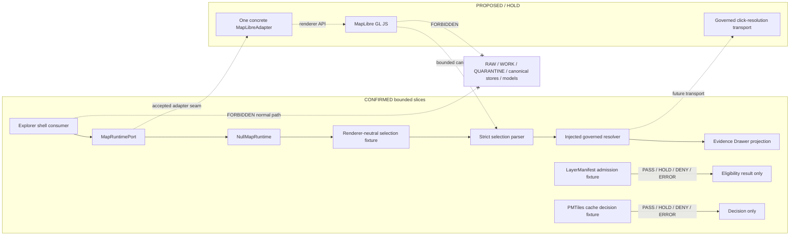

<!-- [KFM_META_BLOCK_V2]
doc_id: kfm://doc/architecture/ui/map-runtime-boundary
title: Map Runtime Boundary
type: architecture-reference
version: v2.1.1-draft
status: draft; repository-grounded; mixed-maturity; renderer-neutral-bounded-slices; concrete-runtime-hold; non-publication
owners:
  - "@bartytime4life — current CODEOWNERS review route"
  - "NEEDS VERIFICATION — independent UI, map-runtime, accessibility, security, policy, evidence, release, correction, and rollback stewardship"
created: 2026-05-14
updated: 2026-08-27
policy_label: public; architecture; ui; map-runtime; trust-membrane; fail-closed; non-publication
owning_root: docs/
current_path: docs/architecture/ui/MAP_RUNTIME_BOUNDARY.md
responsibility: >-
  Explain the current renderer-neutral map-interaction boundary, distinguish
  the implemented dependency-free port and null runtime from the held concrete
  adapter, and state the gates that must close before a browser renderer may
  enter the governed public path.
truth_posture: >-
  CONFIRMED current tracked path, accepted Directory Rules placement, accepted ADR-0006 package-owned seam and ADR-0007 renderer family, implemented
  renderer-neutral MapRuntimePort, deterministic NullMapRuntime,
  finite trust states, Explorer consumers, renderer-neutral feature-selection
  bridge, fixture-only LayerManifest admission, fixture-only PMTiles cache
  decisions, governed API abstain scaffolds, dependency-free MapLibre package,
  comment-only Explorer adapter, and current tests inspected for this revision /
  PARTIAL dependency-free consumer seam / HOLD concrete MapLibreAdapter,
  renderer dependency, transport, temporal contract, live layer loading, and authenticated browser proof / UNKNOWN deployed renderer and public layer serving,
  production policy and evidence resolution, operational cache invalidation,
  correction propagation, rollback execution, and public parity / NEEDS
  VERIFICATION independent review and hosted exact-head validation.
evidence_snapshot:
  repository: bartytime4life/Kansas-Frontier-Matrix
  base_ref: main
  base_commit: 362d6590b9516596ad1c34a64781c13bf85d52c8
  target_prior_blob: ff4cb66c0571bca7494f698bc585a4569bc95c5c
  codeowners_blob: dd2a84aa514d8ecd9208bc347f90f9a2ed37dd61
  directory_rules_blob: fd49a0b83e55cef52c1124281f093e263526898d
  directory_rules_adr_blob: a4de0d7a96b78da59cfc499d1025e1508afd8dd9
  adr_0006_blob: 4bf4292dc05a85fd4cd829c491808b13894bc223
  adr_0007_blob: 2482eea382fd97e68544bb04bc2e2ea1e1cedebe
  map_master_renderer_boundary_blob: 628872aa58f9f86e31337924025a8590405385b5
  map_selection_bridge_blob: 18d61ea0ef2fbe2fc2f3cc9d42291c101003037f
  click_bridge_readme_blob: de7219fcb58d257d81a6e50c3d060c932c9c35f2
  map_selection_test_blob: 953bf536f1d3062c194a09855ed3dde4bc9fa311
  layer_manifest_admission_blob: 895100728c9eb676b9e2aef84680073142694b27
  layer_manifest_admission_test_blob: 915bf6e6a8c69fcca91e3203aeb49d446f3ce384
  pmtiles_cache_blob: 9e52c7c186ce72d56e2728c8c1a35737fe5f1540
  pmtiles_cache_test_blob: 8fc54a7244e112aa352864888e283457afb5d4a6
  explorer_manifest_blob: ddd201b74a06001d84a14bf54ac62a6cc3607a29
  explorer_adapter_blob: 663ba0f7a05498948f67d644387c73ab19d5c16c
  maplibre_package_manifest_blob: c7e8e57445fcca8f8a7316b54043da0ea43968a6
  maplibre_package_entry_blob: 08a48ac008665317833a9476b21cd35b1679c595
  governed_api_registry_blob: b0802568879e262a2cd411d8fe3bc4861de15505
  governed_api_bootstrap_blob: 5d42426846069162eb3e68b93687d0bd587d87d0
  governed_api_layers_blob: eaddcc9bfe066aea29178f3973275bd7e0932284
  governed_api_evidence_blob: 866322965d5e6f3d123a3d06cc9ea0e8e82262e7
  governed_api_stub_blob: 371e60d9f96c78e31c8a1e6109d19dee5da4213b
inspection_boundary: >-
  Current-session repository and GitHub reads covered the complete prior target,
  accepted Directory Rules adoption, CODEOWNERS, accepted ADR-0006 and ADR-0007, the
  current map-master renderer boundary, Explorer package metadata, the
  renderer-neutral click bridge and unit test, fixture-only layer admission and
  PMTiles cache decisions and tests, the dependency-free MapLibre package,
  MapRuntimePort, NullMapRuntime, Explorer consumers and tests, the comment-only adapter,
  and governed API stubs. Local Python validation and guardrails ran against the pinned checkout.
  Explorer unit tests were not locally comparable because an offline
  dependency install could not be completed. No browser probe, deployed runtime, live source, release application, correction propagation, or production rollback was exercised.
related:
  - docs/architecture/ui/README.md
  - docs/architecture/ui/BOUNDARIES.md
  - docs/architecture/ui/LAYERING.md
  - docs/architecture/ui/EVIDENCE_DRAWER.md
  - docs/architecture/ui/ACCESSIBILITY.md
  - docs/architecture/ui/GOVERNED_SHELL.md
  - docs/architecture/ui/CONTINUITY_NOTES.md
  - docs/architecture/map-master/RENDERER_BOUNDARY.md
  - docs/architecture/map-master/LAYER_LIFECYCLE.md
  - docs/architecture/map-master/TILE_ARTIFACTS.md
  - docs/architecture/map-master/VIEWER_VERIFICATION.md
  - docs/architecture/map-shell.md
  - docs/architecture/maplibre-master.md
  - docs/architecture/governed-api/README.md
  - docs/adr/ADR-0006-maplibre-boundary--only-maplibreadapter-imports-maplibre.md
  - "docs/adr/ADR-0007 — MapLibre GL JS Is the Sole Browser-Side Renderer.md"
  - docs/adr/ADR-0029-adopt-directory-governance-standard-v2.md
  - docs/doctrine/directory-rules.md
  - apps/explorer-web/src/features/map_runtime/index.tsx
  - apps/explorer-web/src/features/map_runtime/layer_manifest_admission.ts
  - apps/explorer-web/src/features/map_runtime/pmtiles_release_cache.ts
  - apps/explorer-web/src/adapters/MapLibreAdapter.ts
  - packages/maplibre/package.json
  - packages/maplibre/src/index.ts
tags: [kfm, architecture, ui, map-runtime, maplibre, renderer-neutral, adapter, evidence-drawer, finite-outcomes, trust-membrane, renderer-hold, rollback]
notes:
  - "v2.1-draft reconciles accepted ADR-0006/0007 and merged MapRuntimePort/NullMapRuntime evidence without admitting a renderer."
  - "The current executable map-runtime slices are dependency-free, renderer-neutral, or fixture-only; no concrete MapLibre runtime is admitted."
  - "ADR-0006 and ADR-0007 are accepted architecture. Their acceptance does not admit a dependency, prove browser readiness, or authorize release or publication."
  - "The existing target receives PLACE as a same-path architecture update under accepted ADR-0029 and Directory Rules v2."
  - "This document changes no application code, package, dependency, contract, schema, policy, registry, lifecycle state, release, deployment, or publication."
[/KFM_META_BLOCK_V2] -->

<a id="top"></a>
<a id="map-runtime-boundary"></a>

# Map Runtime Boundary

> **Operating rule.** The browser renderer is downstream of evidence, policy, review, release, correction, and rollback. A map interaction may scope a governed request; it does not create a claim, resolve evidence, authorize exposure, or publish an artifact.

[](#status-and-authority)
[](#current-repository-evidence)
[](#proposed-maplibre-adapter)
[](#rollback-and-non-effects)

> [!IMPORTANT]
> **Repository-grounded does not mean renderer-ready.** Current code proves a dependency-free `MapRuntimePort`, deterministic `NullMapRuntime`, bounded request scoping, Evidence Drawer projection, fixture-only layer admission, and fixture-only cache decisions. It does not prove a concrete MapLibre adapter, an admitted renderer dependency, a live click-resolution route, released-layer rendering, deployment, or public operation.

> [!WARNING]
> **Rendering is not publication.** A visible feature, hit-test result, screenshot, browser test, or performance probe is downstream technical evidence only. It does not establish claim truth, rights clearance, sensitivity approval, review approval, release, or publication safety.

> [!CAUTION]
> **Accepted architecture is not runtime admission.** ADR-0006 and ADR-0007 are `accepted`; the concrete adapter, renderer dependency, browser evidence, release, deployment, and publication remain on HOLD or unestablished.

**Quick navigation:** [Status](#status-and-authority) · [Evidence](#current-repository-evidence) · [Purpose](#purpose-and-placement) · [Rule and scope](#core-rule-and-scope) · [Flow](#current-and-future-flow) · [Click bridge](#renderer-neutral-click-bridge) · [Admission and cache](#current-admission-and-cache-models) · [Port](#proposed-mapruntimeport) · [Adapter](#proposed-maplibre-adapter) · [Inputs](#renderer-input-contract) · [Camera and time](#camera-time-and-state) · [Forbidden operations](#forbidden-browser-operations) · [Finite states](#finite-and-negative-states) · [Validation](#validation-and-admission-evidence) · [Rollback](#rollback-and-non-effects) · [Related](#related-docs) · [Open work](#open-verification-and-adr-triggers)

---

<a id="status-and-authority"></a>

## Status and authority

| Field | Current bounded result |
|---|---|
| **Tracked path** | `docs/architecture/ui/MAP_RUNTIME_BOUNDARY.md` |
| **Document identity** | `kfm://doc/architecture/ui/map-runtime-boundary` |
| **Owning root** | `docs/` — human-readable architecture and boundary explanation |
| **Placement** | **CONFIRMED / PLACE** under accepted ADR-0029 and Directory Rules v2 |
| **Evidence snapshot** | `main@362d6590b9516596ad1c34a64781c13bf85d52c8` |
| **Prior target blob** | `ff4cb66c0571bca7494f698bc585a4569bc95c5c` |
| **Review route** | `@bartytime4life` through current CODEOWNERS |
| **Independent specialist review** | **NEEDS VERIFICATION** |
| **Current click bridge** | **CONFIRMED / renderer-neutral / fixture transport injected** |
| **Current layer admission** | **CONFIRMED / pure fixture evaluator / no registration or source creation** |
| **Current PMTiles cache logic** | **CONFIRMED / pure fixture decision / no fetch or cache mutation** |
| **`MapRuntimePort` / `NullMapRuntime`** | **CONFIRMED / IMPLEMENTED / dependency-free and renderer-neutral** |
| **Concrete `MapLibreAdapter`** | **HOLD / comment-only app placeholder; no functioning adapter** |
| **MapLibre dependency** | **HOLD / not declared in Explorer Web or `@kfm/maplibre`** |
| **ADR-0006 / ADR-0007** | **ACCEPTED architecture / dependency and runtime remain held** |
| **Live governed click transport** | **UNKNOWN / not established; current routes abstain** |
| **Deployed public behavior** | **UNKNOWN / not established here** |
| **Release, deployment, or publication effect** | None |

This file is explanatory architecture. Semantic meaning belongs to contracts; machine shape to schemas; admissibility to policy and accountable review; release decisions to `release/`; process memory to receipts; evidence and proof to their own families; public-safe carriers to governed publication lanes; and executable behavior to apps, packages, validators, tests, workflows, and runtime evidence.

### Truth labels used here

| Label | Meaning |
|---|---|
| **CONFIRMED** | Verified in this revision from current repository bytes, accepted decisions, tests, or generated artifacts |
| **PROPOSED** | A future seam, decision, field family, or implementation not accepted and verified as current behavior |
| **UNKNOWN** | Available repository or operational evidence does not establish the claim |
| **NEEDS VERIFICATION** | A concrete review, run, artifact, or platform check remains before relying on the claim |

`PASS`, `HOLD`, `DENY`, `ABSTAIN`, `ERROR`, `READY`, and `PUBLISHED` are bounded workflow or system states. They do not replace the four evidence labels.

[Back to top](#top)

---

<a id="current-repository-evidence"></a>

## 0. Current repository evidence

| Surface | Verified repository evidence | Bounded conclusion |
|---|---|---|
| [`apps/explorer-web/src/features/map_runtime/index.tsx`](../../../apps/explorer-web/src/features/map_runtime/index.tsx) | Strict `kfm.explorer.map-feature-selection.v1` parser, exact fields, bounded identifiers, at most 16 unique EvidenceRefs, injected resolver, evidence-subset check, fixed local failures, accessible fixture controls | A rendered-feature selection can scope a governed request without becoming evidence |
| [`apps/explorer-web/tests/map-evidence-drawer.test.ts`](../../../apps/explorer-web/tests/map-evidence-drawer.test.ts) | Covers supported, invalid, missing-evidence, denied, out-of-scope, resolver-error, no-network, no-renderer-import, no-lifecycle-path, and no-model-runtime behavior | The bounded bridge has deterministic unit evidence; this is not live renderer or API proof |
| [`CLICK_EVIDENCE_BRIDGE.md`](../../../apps/explorer-web/src/features/map_runtime/CLICK_EVIDENCE_BRIDGE.md) | Explicit renderer-neutral, fixture-first, no-network boundary and rollback statement | Real MapLibre and transport wiring remain future work |
| [`layer_manifest_admission.ts`](../../../apps/explorer-web/src/features/map_runtime/layer_manifest_admission.ts) | Exact fixture profile; finite `PASS`, `HOLD`, `DENY`, `ERROR`; checks public release, binding, evidence, policy, review, promotion, artifact, signature, rollback, source class, and authority overclaim | `PASS` means registration eligibility only; no registry is mutated and no MapLibre source is created |
| [`layer-manifest-admission.test.ts`](../../../apps/explorer-web/tests/layer-manifest-admission.test.ts) | Positive and exact-negative synthetic coverage for the fixture evaluator | Test evidence is bounded to decision behavior |
| [`pmtiles_release_cache.ts`](../../../apps/explorer-web/src/features/map_runtime/pmtiles_release_cache.ts) | Release-, artifact-, and policy-scoped key; finite cache outcomes; explicit `cacheMutated: false` and `networkRequested: false` | A future cache action can be planned without fetching, writing, or authorizing public use |
| [`pmtiles-release-cache.test.ts`](../../../apps/explorer-web/tests/pmtiles-release-cache.test.ts) | Positive and exact-negative synthetic coverage for cache hit, miss, mismatch, incomplete, withdrawal, authority, and invalid-input cases | No operational CacheStorage or Service Worker behavior is proved |
| [`apps/explorer-web/package.json`](../../../apps/explorer-web/package.json) | Build, unit-test, and browser-test scripts; no `maplibre-gl` dependency | Explorer Web does not currently admit a concrete MapLibre runtime |
| [`packages/maplibre/package.json`](../../../packages/maplibre/package.json) | Private package `@kfm/maplibre`, version `0.0.0`, no dependencies | Package identity exists; dependency admission and runtime behavior do not |
| [`packages/maplibre/src/index.ts`](../../../packages/maplibre/src/index.ts) | Exports the renderer-neutral port and deterministic null runtime | A dependency-free package facade exists; no concrete renderer follows |
| [`map-runtime-port.ts`](../../../packages/maplibre/src/map-runtime-port.ts) | KFM-owned serializable camera, selection, snapshot, finite-state, validation, listener, error, and disposal contract | The port consumes bounded state; it owns no evidence, policy, review, release, lifecycle, or publication decision |
| [`null-map-runtime.ts`](../../../packages/maplibre/src/null-map-runtime.ts) | Deterministic no-network implementation used for consumer migration and tests | It is not a renderer and does not satisfy browser readiness |
| Explorer port consumers and focused tests | Explorer imports the package facade; focused tests cover lifecycle, validation, trust states, selection, evidence binding, and disposal | Consumer proof remains dependency-free and does not boot MapLibre |
| [`apps/explorer-web/src/adapters/MapLibreAdapter.ts`](../../../apps/explorer-web/src/adapters/MapLibreAdapter.ts) | Comment-only placeholder | It is not a functioning adapter or accepted importer seam |
| Governed API route scaffolds | `/bootstrap`, `/layers`, and `/evidence` call the shared abstain stub with `outcome: ABSTAIN` and `reason_code: NOT_IMPLEMENTED` | No current click-specific claim-resolution transport may be inferred |
| [ADR-0006](../../adr/ADR-0006-maplibre-boundary--only-maplibreadapter-imports-maplibre.md) and [ADR-0007](<../../adr/ADR-0007 — MapLibre GL JS Is the Sole Browser-Side Renderer.md>) | Both are `accepted` | Package ownership, the adapter seam, and renderer-family selection are binding architecture; dependency and runtime admission remain separate |
| [Map Master renderer boundary](../map-master/RENDERER_BOUNDARY.md) | Reconciles the seven negative authorities with current executable evidence and keeps concrete MapLibre on HOLD | This UI page should remain consistent with that broader boundary |

### Maturity matrix

| Capability | Status | What exists | What remains |
|---|---|---|---|
| Map-feature selection profile | **CONFIRMED / bounded** | Strict renderer-neutral parser and immutable selection | Real renderer event translation |
| Selection-to-Evidence-Drawer bridge | **CONFIRMED / bounded** | Injected resolver, evidence-subset guard, finite outcomes | Live governed transport and deployed behavior |
| LayerManifest admission | **CONFIRMED / fixture-only** | Pure eligibility evaluator and tests | Registry lookup, authenticated validation, source creation, operational revocation |
| PMTiles cache posture | **CONFIRMED / fixture-only** | Pure release-scoped decision and tests | Service Worker, CacheStorage, fetch, invalidation receipts, correction propagation |
| `MapRuntimePort` / `NullMapRuntime` | **IMPLEMENTED / bounded** | Exported KFM-owned contract, deterministic null runtime, Explorer consumers, and focused tests | Concrete renderer, layer loading, temporal methods, DOM/WebGL, browser proof |
| Concrete MapLibre adapter | **HOLD** | Accepted package-owned seam; comment-only app placeholder | Dependency admission, implementation, sole-import scan, browser proof |
| Governed click-resolution API | **UNKNOWN / not established** | Generic abstain route scaffolds | Accepted route/envelope and evidence-bound implementation |
| Public map runtime | **UNKNOWN** | No current evidence in this revision | Deployment, release coupling, monitoring, correction, rollback, public review |

[Back to top](#top)

---

<a id="purpose-and-placement"></a>

## 1. Purpose and placement

This document defines the trust boundary between the governed Explorer Web shell and any present or future browser map renderer. It answers four questions:

1. What map-interaction behavior is implemented today?
2. Which renderer-neutral port behavior exists, and which concrete adapter work remains held?
3. Which evidence, policy, release, dependency, accessibility, and runtime gates must close before real rendering?
4. Which responsibilities may never move into the browser renderer?

### Directory Rules basis

Accepted [ADR-0029](../../adr/ADR-0029-adopt-directory-governance-standard-v2.md) adopts [Directory Rules v2](../../doctrine/directory-rules.md). The target already exists under `docs/architecture/ui/` and explains a human-readable UI authority boundary. This same-path modernization therefore receives **PLACE**.

The change creates no new root, child lane, contract, schema, policy, source registry, proof, release record, runtime package, or published artifact. Its generated authoring receipt is process memory only; it creates no map-runtime, policy, release, or publication authority.

### Responsibility split

| Responsibility | Owning surface | Role of this page |
|---|---|---|
| UI architecture explanation | `docs/architecture/ui/` | Explain and reconcile current evidence |
| Renderer-wide negative authorities | `docs/architecture/map-master/RENDERER_BOUNDARY.md` | Link and stay consistent |
| Renderer-family or importer decision | Accepted ADR | Record current status; never accept implicitly |
| Reusable renderer implementation | `packages/` after reviewed placement and admission | Report maturity and boundaries |
| Explorer composition | `apps/explorer-web/` | Report verified browser behavior |
| Governed transport | `apps/governed-api/` | Report only verified routes and finite envelopes |
| Object meaning | `contracts/` | Consume accepted semantics |
| Machine shape | `schemas/` | Link validated profiles |
| Admissibility and restriction | `policy/` plus accountable decisions | State obligations, not decide |
| Release, correction, withdrawal, rollback | `release/` and governed operators | Explain effects, not apply them |
| Process receipts | `data/receipts/` | Reference process memory when required |
| Evidence and proof | Evidence/proof families | Require resolution without fabricating support |

[Back to top](#top)

---

<a id="core-rule-and-scope"></a>

## 2. Core rule and scope

> **MapLibre, if admitted, is a disciplined 2D renderer and interaction runtime inside the governed KFM shell. It is not the canonical truth store, source registry, policy engine, citation authority, review authority, publication authority, correction authority, rollback authority, or AI authority.**

That rule is stable even while the concrete renderer remains on HOLD.

### In scope

- the boundary between Explorer Web and a browser map runtime;
- the current renderer-neutral feature-selection bridge;
- the current fixture-only layer-admission and PMTiles-cache decisions;
- the implemented `MapRuntimePort` and deterministic `NullMapRuntime` used by non-renderer UI components;
- the accepted but unimplemented single concrete `MapLibreAdapter` seam;
- camera, time, layer, click-candidate, lifecycle, and teardown obligations;
- finite negative states, accessibility, telemetry, validation, and rollback expectations;
- the gates required before a concrete renderer enters the normal public path.

### Out of scope

| Topic | Owning surface |
|---|---|
| Evidence Drawer projection and user-facing evidence state | [EVIDENCE_DRAWER.md](./EVIDENCE_DRAWER.md) and app implementation |
| Layer meaning, legend, release, and display posture | [LAYERING.md](./LAYERING.md) and map-master layer docs |
| Broad browser allow/deny boundary | [BOUNDARIES.md](./BOUNDARIES.md) |
| Shell composition and navigation | [GOVERNED_SHELL.md](./GOVERNED_SHELL.md) |
| Accessibility requirements | [ACCESSIBILITY.md](./ACCESSIBILITY.md) |
| Governed API architecture and envelopes | [governed API README](../governed-api/README.md) |
| Renderer-wide truth and authority boundary | [Map Master renderer boundary](../map-master/RENDERER_BOUNDARY.md) |
| Semantic contracts | `contracts/` |
| Machine-readable schemas | `schemas/` |
| Policy evaluation | `policy/` |
| Release, correction, withdrawal, rollback decisions | `release/` |
| Canonical evidence or source acquisition | Their governed evidence/source lanes |

[Back to top](#top)

---

<a id="current-and-future-flow"></a>

## 3. Current and future flow


```mermaid
flowchart LR
    subgraph Current["CONFIRMED bounded slices"]
        Shell["Explorer shell consumer"]
        Port["MapRuntimePort"]
        Null["NullMapRuntime"]
        Selection["Renderer-neutral selection fixture"]
        Parser["Strict selection parser"]
        Resolver["Injected governed resolver"]
        Drawer["Evidence Drawer projection"]
        Admission["LayerManifest admission fixture"]
        Cache["PMTiles cache decision fixture"]

        Shell --> Port
        Port --> Null
        Null --> Selection
        Selection --> Parser
        Parser --> Resolver
        Resolver --> Drawer
        Admission -->|"PASS / HOLD / DENY / ERROR"| AdmissionResult["Eligibility result only"]
        Cache -->|"PASS / HOLD / DENY / ERROR"| CacheResult["Decision only"]
    end

    subgraph Future["PROPOSED / HOLD"]
        Adapter["One concrete MapLibreAdapter"]
        Renderer["MapLibre GL JS"]
        LiveAPI["Governed click-resolution transport"]
    end

    Internal["RAW / WORK / QUARANTINE / canonical stores / models"]

    Port -. "accepted adapter seam" .-> Adapter
    Adapter -. "renderer API" .-> Renderer
    Renderer -. "bounded candidate" .-> Parser
    Resolver -. "future transport" .-> LiveAPI

    Renderer -. "FORBIDDEN" .-x Internal
    Shell -. "FORBIDDEN normal path" .-x Internal
```

Solid arrows describe current bounded behavior. Dashed arrows describe concrete renderer and transport integration that remains **PROPOSED** or on **HOLD**.

### Interpretation

- A renderer event may become a **candidate selection**.
- A candidate selection may scope an injected governed resolution request.
- A returned Evidence Drawer projection must remain within the selection's allowed EvidenceRefs.
- A fixture `PASS` does not register a source, fetch an artifact, mutate a cache, authorize public use, or publish a layer.
- No current repository evidence inspected here establishes that MapLibre boots in Explorer Web.

[Back to top](#top)

---

<a id="renderer-neutral-click-bridge"></a>

## 4. Current renderer-neutral click bridge

### 4.1 Selection profile

The current bridge accepts the exact profile `kfm.explorer.map-feature-selection.v1` with these fields:

| External field | Purpose | Boundary |
|---|---|---|
| `profile` | Exact profile discriminator | Unknown profiles fail closed |
| `selection_id` | Bounded request identity | Not evidence or release identity |
| `layer_id` | Layer context | Does not prove layer admission |
| `feature_id` | Feature context | Does not turn properties into a claim |
| `evidence_refs` | Zero to 16 unique governed EvidenceRefs | Scopes, but does not resolve, evidence |

The parser rejects unknown fields, duplicate EvidenceRefs, unsafe identifiers, arrays beyond the bound, and malformed objects. It returns an immutable internal representation.

### 4.2 Resolution invariants

The bridge:

- performs no network access;
- injects transport through a resolver supplied by its caller;
- performs no policy, release, source, evidence-store, graph, vector, object-store, or model-runtime access;
- never treats rendered properties, pixels, geometry, or renderer state as evidence;
- abstains without calling the resolver when the selection contains no EvidenceRef;
- accepts returned EvidenceRefs only when they are a subset of the clicked selection's allowed refs;
- replaces resolver diagnostics with fixed public-safe error copy;
- renders the result through the existing Evidence Drawer finite-state projection.

### 4.3 Current finite outcomes

| Condition | Bridge code | Drawer outcome | Effect |
|---|---|---|---|
| Valid selection and supported governed projection | `SUPPORTED` | `ANSWER` | Show only supported projection and allowed EvidenceRefs |
| Valid selection with no EvidenceRef | `MISSING_EVIDENCE` | `ABSTAIN` | Do not call resolver; do not synthesize |
| Governed policy denial | Governed reason code | `DENY` | Preserve fixed no-leak denial |
| Resolver failure | `GOVERNED_RESOLVER_ERROR` | `ERROR` | Hide private diagnostics |
| Returned evidence outside selection scope | `DRAWER_EVIDENCE_OUTSIDE_SELECTION` | `ERROR` | Reject expanded evidence scope |
| Malformed selection | `SELECTION_INVALID` | `ERROR` | Fail closed |

### 4.4 Transport status

The current governed API exposes `/bootstrap`, `/layers`, and `/evidence` scaffolds. Each returns an `ABSTAIN` envelope with `reason_code: NOT_IMPLEMENTED`. No click-specific claim-resolution route or production transport is established by current evidence.

The injected resolver is therefore a testable seam, not proof of a live governed path.

### 4.5 Accessibility status

The fixture uses ordinary buttons, a live status region, finite outcome text, and Evidence Drawer focus behavior. Those affordances provide bounded accessibility evidence for the fixture. They do not prove keyboard map navigation, non-map feature lists, screen-reader geography, reduced-motion renderer behavior, or production accessibility.

[Back to top](#top)

---

<a id="current-admission-and-cache-models"></a>

## 5. Current admission and cache models

### 5.1 LayerManifest admission fixture

`evaluateLayerManifestAdmission` is a pure, fixture-only eligibility evaluator using profile `kfm.layer-manifest-admission-fixture.v1`.

It fails closed unless the synthetic input establishes all material conditions, including:

- exact profile and field shape;
- an active profile in `RELEASED_RUNTIME` execution mode;
- `PUBLISHED` lifecycle and release state;
- matching manifest, spec-hash, release, and requested layer bindings;
- `GOVERNED_API` source URL classification;
- resolved evidence;
- allowed policy;
- approved review and promotion;
- verified artifact and signature;
- rollback readiness;
- a requested runtime action;
- no claimed registry, release, publication, or public-use authority.

| Outcome | Representative meaning | Non-effect |
|---|---|---|
| `PASS` | Synthetic projection is registration-eligible | No registration, source creation, release, or publication |
| `HOLD` | Legacy/inactive/unpublished/stale/superseded/unresolved/incomplete | No bypass or optimistic rendering |
| `DENY` | Withdrawn, policy-denied, binding mismatch, internal source class, or authority overclaim | No source creation or disclosure |
| `ERROR` | Input shape is invalid | No partial fallback |

Every result records `authority: NONE`, `registryMutated: false`, and `maplibreSourceCreated: false`.

### 5.2 PMTiles cache decision fixture

`evaluatePmtilesCache` is a pure, fixture-only decision model using profile `kfm.pmtiles-release-cache-fixture.v1`. The release-scoped key binds:

- `release_id`;
- `artifact_digest`;
- `policy_digest`.

It distinguishes verified cache hits, online fetch requirements, offline misses, partial entries, release mismatch, policy mismatch, artifact mismatch, missing glyph/PMTiles/sprite assets, withdrawn releases, denied source class, authority overclaim, key mismatch, and invalid input.

Every result records `authority: NONE`, `cacheMutated: false`, and `networkRequested: false`. A `PASS` may indicate that a complete, matching entry could render or that a future online fetch is required; it does not perform either action.

### 5.3 What these models do not prove

The fixture evaluators do not establish:

- a connected release registry;
- authenticated manifest retrieval;
- a MapLibre source, style, layer, or protocol registration;
- a Service Worker or CacheStorage implementation;
- operational invalidation after correction, withdrawal, or rollback;
- public layer serving;
- production policy or evidence resolution;
- release, deployment, or publication.

[Back to top](#top)

---

<a id="proposed-mapruntimeport"></a>

## 6. `MapRuntimePort` — implemented bounded UI contract

**Status: CONFIRMED / IMPLEMENTED / dependency-free.**

Explorer consumers can depend on a KFM-owned renderer-neutral port rather than on MapLibre types. The port is a stability and trust seam, not a second authority layer.

### 6.1 Current method family

| Method | Current input | Current effect | Must not do |
|---|---|---|---|
| `initialize` | optional bounded camera | Enter `INITIALIZING`, then `READY` | Fetch, render, admit, release, or publish data |
| `getSnapshot` | none | Return a frozen runtime snapshot | Expose renderer-native or canonical state |
| `setCamera` | bounded center, zoom, pitch, bearing | Update shell-owned presentation state | Persist canonical state or fetch data |
| `subscribeSnapshot` | snapshot listener | Observe finite runtime state | Grant lifecycle or policy authority |
| `subscribeSelection` | selection listener | Observe bounded feature candidates | Return a claim or EvidenceBundle |
| `dispose` | none | Remove listeners and enter `DISPOSED` | Mutate release or evidence state |

`NullMapRuntime` supplies deterministic `emitSelection` and `emitTrustState` control hooks for migration and tests. They are not methods on the public port and confer no renderer, policy, evidence, or publication authority.

### 6.2 Port invariants

The current port must continue to:

- expose KFM-owned types only;
- return bounded events, never renderer-native objects;
- keep feature candidates distinct from claims;
- remain free of layer loading until an accepted, governed input contract is admitted;
- preserve finite `ANSWER`, `ABSTAIN`, `DENY`, and `ERROR` paths;
- support deterministic teardown and a fake/null implementation;
- avoid network, policy, evidence resolution, release, and lifecycle authority;
- remain usable if the concrete renderer implementation is rolled back.

Adding a method is an architectural change when it widens authority, data exposure, transport, lifecycle, or compatibility. Such changes require the owning decision, direct tests, and migration review.

[Back to top](#top)

---

<a id="proposed-maplibre-adapter"></a>

## 7. `MapLibreAdapter` — held concrete importer

**Status: HOLD.** No functioning concrete adapter or MapLibre dependency was verified. ADR-0006 and ADR-0007 are accepted, but acceptance does not admit a dependency or establish browser readiness.

Exactly one reviewed package-owned module may import the MapLibre runtime and implement the KFM-owned port. The present comment-only Explorer file is not that implementation and must not become an accidental second importer.

### 7.1 Proposed responsibilities

A future adapter may:

- own MapLibre construction, lifecycle, event registration, and teardown;
- translate accepted KFM layer inputs into renderer sources, styles, and layers;
- apply shell-owned camera and time state;
- translate renderer hit-test output into the strict renderer-neutral selection profile;
- surface bounded loading, stale, denied, degraded, asset, and renderer errors;
- register only reviewed protocols and plugins;
- expose no MapLibre-native object outside the adapter seam.

### 7.2 Non-responsibilities

The adapter must not:

| Forbidden responsibility | Why |
|---|---|
| Read RAW, WORK, QUARANTINE, canonical, graph, vector, object, or model stores | Public clients use governed interfaces, not internal authority stores |
| Resolve EvidenceRef to EvidenceBundle | Resolution belongs behind the governed trust membrane |
| Evaluate rights, sensitivity, policy, review, or release | The renderer reflects finite decisions; it does not make them |
| Register an unpublished, withdrawn, denied, stale-held, or mismatched layer | Eligibility and release binding precede renderer creation |
| Treat `feature.properties` or popup HTML as an answer | A hit-test is request context, not evidence |
| Hide sensitive geometry by style alone | Style filters do not prevent restricted bytes from reaching the client |
| Call model runtimes or AI endpoints | AI remains subordinate to governed evidence and policy |
| Authorize release, publication, correction, withdrawal, or rollback | Rendering has no lifecycle authority |
| Write registry or cache state without a governed operational design | Fixture eligibility is not mutation authority |

### 7.3 Admission gates before implementation may be called current

1. The implementation remains within accepted ADR-0006 and ADR-0007, or an accepted replacement explicitly changes the boundary.
2. The exact package and sole importer module are fixed without creating a parallel runtime authority.
3. The renderer dependency and any protocol/plugin dependencies are pinned, reviewed, and lockfile-synchronized.
4. Any `MapRuntimePort` widening preserves compatibility, ownership, finite-state, and direct-test requirements.
5. Repository-wide import enforcement proves that no other normal-path module imports renderer APIs.
6. Layer admission is bound to governed release identity, artifact integrity, policy, evidence, review, correction, withdrawal, and rollback state.
7. A real click event is translated into the existing strict selection profile without leaking raw feature data.
8. Governed transport and finite response envelopes are implemented and fail closed.
9. Browser tests cover keyboard and non-map alternatives, focus, reduced motion, negative states, asset failure, teardown, and no-leak behavior.
10. Authenticated runtime, performance, accessibility, correction, invalidation, and rollback evidence is captured for the exact dependency and build.
11. Release, deployment, and publication remain separate governed transitions.

[Back to top](#top)

---

<a id="renderer-input-contract"></a>

## 8. Renderer input contract

### 8.1 Current verified minimum

The current fixture evaluator establishes a useful lower bound for any future runtime input. A layer is not renderer-eligible unless the upstream projection is exact, public-path classified, release-bound, evidence-resolved, policy-allowed, reviewed, promoted, artifact-verified, signature-verified, rollback-ready, and free of claimed publication authority.

That is current executable fixture behavior. It is not yet a canonical `LayerDescriptor` contract.

### 8.2 Proposed future descriptor families

A production renderer input will likely need these information families:

| Family | Examples | Authority |
|---|---|---|
| Identity | stable layer id, manifest id, version, spec hash | Accepted contract/schema |
| Release | release id/state, release-manifest ref, rollback target | Governed release authority |
| Integrity | artifact digest, style digest, signature state, protocol/plugin identity | Release and artifact verification |
| Source role | steward, observer, derived, model output, context | Accepted source semantics |
| Time | source, valid, observed, retrieval, release, correction times; freshness window | Accepted temporal contract and upstream evaluation |
| Rights | license, rights statement, obligations, attribution | Rights policy and review |
| Sensitivity | public/generalized/restricted posture and applied transform | Policy and accountable review |
| Evidence | resolvable EvidenceRefs and support state | Governed evidence resolution |
| Review | review state and required independent approvals | Review authority |
| Correction | correction, supersession, withdrawal, rollback state | Governed lifecycle |
| Assets | public-safe tile/style/glyph/sprite/protocol references | Governed artifact serving |

Exact field names, requiredness, enums, and compatibility do not become normative through this table. They belong in accepted contracts and schemas with validators, fixtures, migration guidance, and consumer tests.

### 8.3 Style-only hiding is not access control

A style filter can hide a feature from normal drawing while the underlying bytes remain available to the browser. Restricted precision must be denied, generalized, redacted, aggregated, delayed, or otherwise transformed before the renderer receives the artifact.

[Back to top](#top)

---

<a id="camera-time-and-state"></a>

## 9. Camera, time, and state

**Current status: PARTIAL.** The dependency-free port and null runtime implement bounded camera state. No temporal port, concrete renderer translation, or browser proof was verified.

### 9.1 State ownership

The future renderer should apply state owned by the governed shell and emit bounded changes back through the port. It should not become the canonical owner of:

- route state;
- selected layer identity;
- evidence or drawer state;
- policy or release state;
- story or focus state;
- correction or rollback state.

### 9.2 Time discipline

Where material, the system must distinguish:

- source time;
- valid time;
- observed time;
- retrieval time;
- release time;
- correction time.

The adapter must not collapse those into one ambiguous timestamp. It must not decide freshness independently. Upstream governed logic determines stale, current, withdrawn, superseded, or corrected posture; the renderer reflects that finite state.

### 9.3 2D/3D and cache scope

A future 2D/3D handoff must preserve identity, EvidenceRefs, time context, release state, and policy-visible limitations. See [2D/3D parity](../map-master/2D_3D_PARITY.md).

The current PMTiles fixture binds release, artifact, and policy digests. It does not bind camera or transient viewport state, and it does not establish an operational cache.

[Back to top](#top)

---

<a id="forbidden-browser-operations"></a>

## 10. Forbidden browser operations

The browser shell, port, adapter, renderer, worker, and plugin path must not:

- read RAW, WORK, QUARANTINE, canonical, internal graph/vector, object-store, or model-runtime paths;
- access unpublished candidates, credentials, signed internal URLs, private service handles, or administrator shortcuts;
- call Ollama, OpenAI, another model runtime, or an AI orchestration path directly;
- resolve EvidenceRefs from canonical stores;
- evaluate or override rights, sensitivity, sovereignty, review, release, correction, or rollback decisions;
- treat pixels, tiles, PMTiles, COGs, style JSON, feature properties, screenshots, scenes, catalog records, graph projections, or generated language as sovereign truth;
- load an artifact whose release binding, integrity, source class, policy, evidence, review, or rollback state is unresolved;
- use style-only hiding as sensitive-data access control;
- emit raw evidence, restricted geometry, full EvidenceBundles, prompts, credentials, private diagnostics, or internal paths through telemetry;
- register unreviewed renderer plugins or protocols;
- create a second direct renderer importer for convenience;
- silently turn a fixture `PASS` into registry mutation, source creation, cache write, release, or publication;
- degrade `ABSTAIN`, `DENY`, or `ERROR` into an unsupported answer.

The normal public path uses governed interfaces and public-safe released artifacts. Any administrative or diagnostic exception requires explicit authority, least privilege, auditability, clear separation from the public path, and its own review.

[Back to top](#top)

---

<a id="finite-and-negative-states"></a>

## 11. Finite and negative states

Negative states are first-class user-visible outcomes, not incidental errors hidden behind a happy path.

### 11.1 Current confirmed states

The renderer-neutral bridge currently proves:

- supported answer;
- missing-evidence abstention;
- governed denial;
- invalid selection;
- resolver error;
- evidence-scope violation.

The layer-admission and cache fixtures prove bounded `PASS`, `HOLD`, `DENY`, and `ERROR` classifications without performing the proposed action.

### 11.2 Current port states and held renderer states

The current port exports `IDLE`, `INITIALIZING`, `READY`, `STALE`, `ABSTAINED`, `DENIED`, `CONFLICT`, `DEGRADED`, `WITHDRAWN`, `ROLLED_BACK`, `ERROR`, and `DISPOSED`. Focused tests exercise lifecycle, trust-state transitions, selection, evidence binding, validation, and teardown. These states describe a renderer-neutral snapshot; they do not prove a concrete renderer or public UX.

A real renderer will still need explicit public behavior for:

| State | Required public behavior |
|---|---|
| Loading | Announce progress without presenting a claim |
| Ready | Show only admitted public-safe content |
| Stale | Display stale posture and follow upstream abstain/deny rules |
| Withdrawn | Remove or deny the affected representation and surface correction context |
| Superseded | Prefer the governed successor; preserve lineage |
| Policy denied | Show fixed public-safe reason; do not leak restricted detail |
| Evidence unresolved | Abstain; do not render an authoritative claim |
| Asset incomplete | Hold or degrade explicitly; do not present partial content as complete |
| Offline miss | Show finite hold/offline state |
| Renderer error | Show safe error and preserve non-map access where possible |
| Destroyed | Remove listeners, workers, protocols, and renderer resources deterministically |

The browser rendering, asset, offline, accessibility, and public-behavior mappings in this table remain **PROPOSED** until concrete implementation and tests exist.

[Back to top](#top)

---

<a id="validation-and-admission-evidence"></a>

## 12. Validation and admission evidence

### 12.1 Repository-native commands

Explorer Web declares these commands:

```bash
cd apps/explorer-web
pnpm run build
pnpm run test:unit
pnpm run test:browser
```

The current focused unit files include:

- `tests/map-runtime-port.test.ts`;
- `tests/map-runtime-evidence-binding.test.ts`;
- `tests/map-runtime-trust-status.test.ts`;
- `tests/map-evidence-drawer.test.ts`;
- `tests/layer-manifest-admission.test.ts`;
- `tests/pmtiles-release-cache.test.ts`.

The click-bridge documentation also identifies browser coverage for the Evidence Drawer fixture.

### 12.2 Current and future evidence matrix

| Check | Current status | What passing proves | What it does not prove |
|---|---|---|---|
| Port lifecycle, validation, trust-state, selection, and disposal tests | **CONFIRMED source/test presence** | Dependency-free contract and null-runtime behavior | Concrete renderer, browser readiness, or publication |
| Evidence-binding consumer tests | **CONFIRMED source/test presence** | Bounded consumer projection from runtime selection | Live evidence resolution or evidence truth |
| Strict selection parser tests | **CONFIRMED source/test presence** | Closed request shape and immutable parse behavior | Real renderer event integrity |
| Evidence-subset and no-leak tests | **CONFIRMED source/test presence** | Bounded projection behavior | Evidence truth or production policy |
| No-network/no-renderer-import unit guard | **CONFIRMED source/test presence** | The current bridge stays renderer-neutral | Repository-wide sole-import enforcement |
| Layer admission fixture tests | **CONFIRMED source/test presence** | Finite synthetic eligibility decisions | Registry, source creation, release, or public serving |
| PMTiles cache fixture tests | **CONFIRMED source/test presence** | Finite synthetic cache decisions | Service Worker, CacheStorage, fetch, or invalidation |
| Explorer build | **NEEDS VERIFICATION for this change head** | Type/build compatibility | Deployed runtime or publication |
| Browser fixture tests | **NEEDS VERIFICATION for this change head** | Fixture interaction and accessibility behavior | Real map keyboard/accessibility parity |
| Repository-wide sole-import scan | **PROPOSED / required before admission** | Only accepted adapter imports renderer APIs | Correct runtime behavior |
| Dependency and lockfile verification | **PROPOSED / required before admission** | Exact renderer supply-chain identity | Public safety or policy approval |
| Authenticated renderer probe packet | **PROPOSED / required before admission** | Exact build boots and exercises bounded features | Release or publication |
| Performance and resource budgets | **PROPOSED / required before admission** | Bounded runtime envelope | Evidence truth |
| Correction, withdrawal, cache invalidation, rollback exercise | **PROPOSED / required before admission** | Operational reversibility | Independent release approval |

### 12.3 What tests never confer

A passing build, unit test, browser test, import scan, or runtime probe does not by itself:

- accept an ADR;
- admit a dependency;
- resolve evidence;
- approve rights or sensitivity;
- approve review, promotion, release, deployment, or publication;
- prove a public endpoint is current;
- prove correction or rollback was exercised in production.

[Back to top](#top)

---

<a id="rollback-and-non-effects"></a>

## 13. Rollback and non-effects

### 13.1 This documentation change

Before merge, rollback is to close or abandon the draft pull request and leave its branch unmerged. After an authorized merge, revert the documentation commit and rerun the repository's documentation validation.

### 13.2 Future runtime rollback pattern

A concrete renderer slice should preserve a renderer-neutral fake/null port so the governed shell, Evidence Drawer, layer catalog, and non-map access can remain reviewable when the renderer is disabled.

A credible runtime rollback must include:

1. disable or remove the concrete adapter without changing the KFM-owned port;
2. remove or revert the renderer dependency and synchronized lockfile state;
3. stop renderer workers, listeners, protocols, and cache writes;
4. invalidate affected release-scoped caches through governed operations;
5. preserve the last safe released public representation or explicit unavailable state;
6. record correction, withdrawal, supersession, and rollback lineage where public reliance occurred;
7. rerun build, unit, browser, import-boundary, accessibility, and rollback checks.

### 13.3 Non-effects of this page

This update does not:

- modify application or package code;
- create or accept a contract, schema, policy, ADR, source, registry, proof, or release record; its generated authoring receipt remains process memory only;
- admit `maplibre-gl` or any plugin/protocol dependency;
- create a MapLibre source, style, layer, worker, or cache entry;
- alter governed API routes;
- resolve evidence or authorize public use;
- release, deploy, promote, publish, withdraw, correct, or roll back an artifact.

[Back to top](#top)

---

<a id="related-docs"></a>

## 14. Related docs

### UI architecture

- [UI architecture README](./README.md)
- [UI boundaries](./BOUNDARIES.md)
- [Layering](./LAYERING.md)
- [Evidence Drawer](./EVIDENCE_DRAWER.md)
- [Accessibility](./ACCESSIBILITY.md)
- [Governed shell](./GOVERNED_SHELL.md)
- [Continuity notes](./CONTINUITY_NOTES.md)

### Map and API architecture

- [Map Master renderer boundary](../map-master/RENDERER_BOUNDARY.md)
- [Map Master layer lifecycle](../map-master/LAYER_LIFECYCLE.md)
- [Map Master tile artifacts](../map-master/TILE_ARTIFACTS.md)
- [Map Master viewer verification](../map-master/VIEWER_VERIFICATION.md)
- [Map Master 2D/3D parity](../map-master/2D_3D_PARITY.md)
- [Map shell](../map-shell.md)
- [MapLibre architecture](../maplibre-master.md)
- [Governed API architecture](../governed-api/README.md)

### Decisions and doctrine

- [ADR-0006 — MapLibre boundary](../../adr/ADR-0006-maplibre-boundary--only-maplibreadapter-imports-maplibre.md)
- [ADR-0007 — MapLibre GL JS as sole browser renderer](<../../adr/ADR-0007 — MapLibre GL JS Is the Sole Browser-Side Renderer.md>)
- [ADR-0029 — Directory governance adoption](../../adr/ADR-0029-adopt-directory-governance-standard-v2.md)
- [Directory Rules v2](../../doctrine/directory-rules.md)

### Current executable surfaces

- [Renderer-neutral click bridge](../../../apps/explorer-web/src/features/map_runtime/index.tsx)
- [Click bridge notes](../../../apps/explorer-web/src/features/map_runtime/CLICK_EVIDENCE_BRIDGE.md)
- [LayerManifest admission fixture](../../../apps/explorer-web/src/features/map_runtime/layer_manifest_admission.ts)
- [PMTiles cache fixture](../../../apps/explorer-web/src/features/map_runtime/pmtiles_release_cache.ts)
- [Explorer MapLibre adapter placeholder](../../../apps/explorer-web/src/adapters/MapLibreAdapter.ts)
- [`@kfm/maplibre` package manifest](../../../packages/maplibre/package.json)
- [`@kfm/maplibre` port and null-runtime entry](../../../packages/maplibre/src/index.ts)

[Back to top](#top)

---

<a id="open-verification-and-adr-triggers"></a>

## 15. Open verification and ADR triggers

| Item | Status | Closure evidence |
|---|---|---|
| Preserve or explicitly replace ADR-0006 | **ACCEPTED / ongoing** | Import enforcement, ownership, compatibility, and rollback for any concrete adapter |
| Preserve or explicitly replace ADR-0007 | **ACCEPTED / ongoing** | Renderer-family compliance and governed exception handling |
| Fix the exact package and concrete adapter module | **NEEDS VERIFICATION** | Directory Rules review, source implementation, CODEOWNERS, import scan |
| Admit the renderer dependency | **HOLD** | Reviewed version, integrity, license, lockfile, vulnerability and provenance evidence |
| Widen `MapRuntimePort` beyond current bounded methods | **HOLD** | Accepted need, compatibility analysis, source, validators where needed, migration, and tests |
| Implement live governed click transport | **UNKNOWN / not established** | Accepted route and envelope, fail-closed resolver, integration tests, operational evidence |
| Bind real layer loading to release and correction state | **PROPOSED** | Governed registry lookup, artifact verification, denial/withdrawal/correction tests |
| Implement operational PMTiles caching | **PROPOSED** | Service Worker design, CacheStorage implementation, release-scoped invalidation, offline tests, receipts |
| Prove public accessibility | **NEEDS VERIFICATION** | Keyboard map controls, non-map alternatives, screen-reader testing, reduced motion, human review |
| Prove performance and resource limits | **NEEDS VERIFICATION** | Exact-head browser probes and accepted budgets |
| Prove correction and rollback | **NEEDS VERIFICATION** | Withdraw/supersede/invalidate/rollback exercise with audit evidence |
| Decide mobile/native parity | **OPEN** | Accepted scope and separate boundary or explicit exclusion |
| Obtain independent specialist review | **NEEDS VERIFICATION** | Review records covering UI, map runtime, security, policy, evidence, accessibility, release, correction, and rollback |

A proposal that introduces a peer renderer, a second direct importer, a new writable runtime package, renderer-owned policy/evidence resolution, direct internal-store access, or normal-path administrative bypass requires an accepted ADR or successor decision before dependent implementation.

[Back to top](#top)

---

<a id="appendix-a"></a>

## Appendix A — current TypeScript shape

> [!NOTE]
> This excerpt mirrors the exported interface at the evidence snapshot. The repository source remains executable authority.

```ts
export interface MapRuntimePort {
  readonly profile: typeof MAP_RUNTIME_PORT_PROFILE;
  initialize(initialCamera?: MapRuntimeCamera): Promise<MapRuntimeSnapshot>;
  getSnapshot(): MapRuntimeSnapshot;
  setCamera(camera: MapRuntimeCamera): MapRuntimeSnapshot;
  subscribeSnapshot(listener: MapRuntimeSnapshotListener): () => void;
  subscribeSelection(listener: MapRuntimeSelectionListener): () => void;
  dispose(): void;
}
```

Future layer, time, query, and renderer-specific expansion is outside this interface and requires accepted ownership, compatibility treatment, and implementation evidence.

[Back to top](#top)

---

<a id="appendix-b"></a>

## Appendix B — anti-patterns

| Anti-pattern | Why it is forbidden | Replacement |
|---|---|---|
| A second module imports `maplibre-gl` for convenience | Splits the seam and defeats enforceable ownership | Add a bounded KFM-owned port capability and keep one accepted importer |
| Popup HTML from `feature.properties` is shown as the answer | Treats renderer data as a claim | Open the Evidence Drawer through governed resolution |
| Style filters hide sensitive features after bytes reach the browser | Presentation is not access control | Deny or generalize before artifact delivery |
| Adapter calls a model endpoint to enrich a click | Browser does not own the AI seam | Route through governed evidence and policy |
| Adapter decides freshness | Splits temporal authority | Reflect upstream finite freshness state |
| One time slider collapses source, valid, observed, retrieval, release, and correction time | Destroys provenance meaning | Preserve distinct temporal fields where material |
| Fixture `PASS` triggers source registration or cache mutation | Eligibility is not mutation authority | Add an independently governed operational transition |
| Tile or style URLs load without release and integrity binding | Bypasses publication controls | Require admitted public-safe artifacts |
| Renderer-native objects escape into the rest of the UI | Couples consumers to an ungoverned vendor API | Expose KFM-owned immutable types |
| Debug UI exposes raw features, internal paths, or private diagnostics | Becomes an accidental normal public path | Use constrained, audited administrative tooling outside the public path |
| Test success is presented as release or publication | Confuses technical evidence with lifecycle authority | Preserve explicit promotion, release, and publication gates |

[Back to top](#top)

---

**Related:** [UI README](./README.md) · [UI boundaries](./BOUNDARIES.md) · [Layering](./LAYERING.md) · [Evidence Drawer](./EVIDENCE_DRAWER.md) · [Map Master renderer boundary](../map-master/RENDERER_BOUNDARY.md) · [Directory Rules](../../doctrine/directory-rules.md)

**Last updated:** `2026-08-27` · **Version:** `v2.1.1-draft` · **Status:** `repository-grounded draft / bounded port implemented / concrete renderer HOLD / non-publication`

[Back to top](#top)
