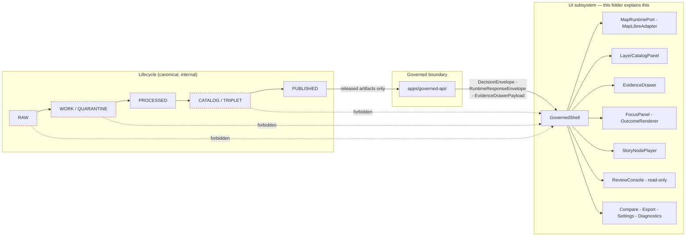
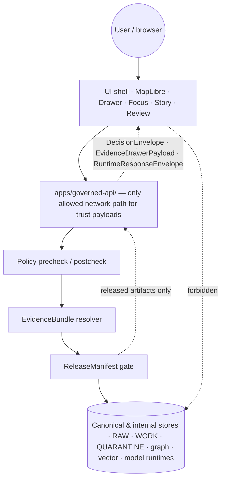

<!-- [KFM_META_BLOCK_V2]
doc_id: kfm://doc/architecture/ui/readme
title: UI Subsystem — Architecture README
type: standard
version: v1-draft
status: draft
owners: <Docs steward + UI subsystem owner>   # PLACEHOLDER — replace with CODEOWNERS handles
created: <YYYY-MM-DD>                          # PLACEHOLDER — set on first commit
updated: <YYYY-MM-DD>                          # PLACEHOLDER — bump on each material change
policy_label: public
related:
  - docs/architecture/README.md
  - docs/architecture/ui/STATE_OWNERSHIP.md
  - docs/architecture/ui/ROUTE_MAP.md
  - docs/architecture/ui/BOUNDARIES.md
  - docs/architecture/ui/LAYERING.md
  - docs/architecture/ui/TELEMETRY.md
  - docs/architecture/ui/CONTINUITY_NOTES.md
  - docs/architecture/governed-ai/README.md
  - docs/architecture/story/README.md
  - docs/architecture/review/README.md
  - docs/doctrine/directory-rules.md
  - docs/doctrine/trust-membrane.md
  - docs/doctrine/lifecycle-law.md
  - contracts/OBJECT_MAP.md
tags: [kfm, ui, architecture, maplibre, evidence-drawer, focus-mode, finite-outcomes]
notes:
  - Authority is doctrine; all path references are PROPOSED until verified in a mounted repo.
  - This file is the README-like landing page for the UI architecture lane.
[/KFM_META_BLOCK_V2] -->

# UI Subsystem — Architecture README

> The Kansas Frontier Matrix user interface is a **map-first, time-aware, evidence-bounded shell** that renders only released, policy-checked, citation-capable state — never a sovereign truth surface.

<!-- BADGES — Shields.io. Targets are PLACEHOLDERS; replace once CI, license, and registries are wired. -->


| Field | Value |
|---|---|
| **Status** | `draft` · PROPOSED until repo-mounted verification |
| **Authority level** | Canonical (under `docs/`, the human-facing control plane) |
| **Owners** | Docs steward · UI subsystem owner *(PLACEHOLDER — see CODEOWNERS)* |
| **Last reviewed** | `YYYY-MM-DD` *(PLACEHOLDER)* |
| **Supersedes** | UI commentary in prior Whole-UI + Governed AI Expansion Report (PDF) where this README is more specific |

---

## Quick jump

- [1 · Scope](#1--scope)
- [2 · Authority level](#2--authority-level)
- [3 · Status](#3--status)
- [4 · Repo fit](#4--repo-fit)
- [5 · What belongs here](#5--what-belongs-here)
- [6 · What does **not** belong here](#6--what-does-not-belong-here)
- [7 · Subsystem map](#7--subsystem-map)
- [8 · Proposed directory tree](#8--proposed-directory-tree)
- [9 · Sibling documents](#9--sibling-documents)
- [10 · UI component families](#10--ui-component-families)
- [11 · Routes](#11--routes)
- [12 · Finite outcomes](#12--finite-outcomes)
- [13 · Trust membrane](#13--trust-membrane)
- [14 · Layer trust badges](#14--layer-trust-badges)
- [15 · Accessibility expectations](#15--accessibility-expectations)
- [16 · Validation](#16--validation)
- [17 · Inputs](#17--inputs)
- [18 · Outputs](#18--outputs)
- [19 · Review burden](#19--review-burden)
- [20 · Related folders](#20--related-folders)
- [21 · ADRs that govern this folder](#21--adrs-that-govern-this-folder)
- [22 · FAQ](#22--faq)
- [23 · Open questions and verification backlog](#23--open-questions-and-verification-backlog)

---

## 1 · Scope

This README is the **landing page for the UI architecture lane** inside `docs/architecture/`. It explains what the KFM user interface is responsible for, where its design authority comes from, and how its surfaces fit the broader trust membrane. It is **doctrine**, not implementation: it specifies the contracts, boundaries, finite outcomes, and accessibility expectations the UI must meet, regardless of which framework, package, or app path eventually realizes them.

The UI subsystem covers, in scope:

- The **persistent map-first shell**, its **time-aware** state, its **route map**, and its **state ownership** boundaries.
- The **MapLibre / map runtime adapter boundary** (`MapRuntimePort`, `MapLibreAdapter`), through which a 2D renderer can be replaced without changing trust posture.
- The **Evidence Drawer** as the trust object that converts a map feature, layer, story step, or focus answer into an inspectable, cited claim.
- The **Focus Mode** governed query surface, bounded to released evidence with finite outcomes and no direct model client.
- The **Layer Catalog**, **legends**, **trust badges**, and the validated path from `LayerDescriptor` to `LayerManifest` / `KFMGeoManifest`.
- The **Story Node player** (2D-first; conditional 3D handoff under a separate gate).
- The **read-only Review console** for stewards.
- The **Compare**, **Export**, **Settings**, and **Diagnostics** surfaces.
- **Safe UI telemetry** — events that carry no raw evidence, prompts, secrets, or exact restricted geometry.

[Back to top](#ui-subsystem--architecture-readme)

---

## 2 · Authority level

**Canonical** (governance / human-facing explanation, under `docs/`). This file refines but does not contradict higher-authority doctrine.

```text
KFM core invariants & doctrine
       └─▶ Accepted ADRs that explicitly amend Directory Rules
              └─▶ docs/doctrine/directory-rules.md
                     └─▶ docs/architecture/README.md
                            └─▶ docs/architecture/ui/README.md   ◀── you are here
                                   └─▶ STATE_OWNERSHIP · ROUTE_MAP · BOUNDARIES
                                       LAYERING · TELEMETRY · CONTINUITY_NOTES
```

Per the Directory Rules authority order (§2.1), if this document conflicts with KFM core invariants, an accepted ADR, or `directory-rules.md`, **the higher authority wins** and this file is opened as a drift entry, not as new authority.

[Back to top](#ui-subsystem--architecture-readme)

---

## 3 · Status

**Truth label: PROPOSED.** No mounted KFM repository was available in the session that produced this README, and no UI app tree, framework, route file, schema registry, fixture tree, policy bundle, or CI workflow was directly inspected. Every concrete path, file name, schema home, route name, and component name in this document is therefore **PROPOSED / NEEDS VERIFICATION** until validated against the live repo.

> [!IMPORTANT]
> Treat sibling docs (`STATE_OWNERSHIP.md`, `ROUTE_MAP.md`, `BOUNDARIES.md`, `LAYERING.md`, `TELEMETRY.md`, `CONTINUITY_NOTES.md`) as the **detailed surfaces** of this README. This file points at them; it does not duplicate them. When a sibling and this README disagree, the sibling wins for its own surface, and the conflict is logged in `docs/registers/DRIFT_REGISTER.md`.

[Back to top](#ui-subsystem--architecture-readme)

---

## 4 · Repo fit

This folder sits inside the canonical `docs/` authority root (§5–§6.1, Directory Rules) and is a **lane** under `docs/architecture/`. It explains; it does not store machine schemas, policy bundles, fixtures, code, or emitted artifacts. Those have other homes.

| Layer | Path *(PROPOSED)* | Relation to this folder |
|---|---|---|
| Doctrine | `docs/doctrine/{trust-membrane,lifecycle-law,truth-posture,authority-ladder,directory-rules}.md` | **Upstream.** UI behavior is bounded by these. |
| Architecture index | `docs/architecture/README.md` | **Upstream.** Subsystem map. |
| **UI architecture lane** | **`docs/architecture/ui/`** | **This folder.** |
| Sibling subsystems | `docs/architecture/{governed-ai,story,review}/` | **Lateral.** Shared envelope and finite-outcome grammar. |
| Object meaning | `contracts/OBJECT_MAP.md` | **Downstream.** Object family crosswalk. |
| Object shape | `schemas/contracts/v1/{ui,runtime,layers,evidence,focus,story,review,telemetry}/…schema.json` | **Downstream.** Executable schemas. |
| Policy | `policy/{ui,evidence,focus,story,review,export,telemetry}/` | **Downstream.** Gate logic. |
| Fixtures | `tests/fixtures/{ui,focus,layers,story,review,runtime}/` | **Downstream.** Positive and negative state proofs. |
| Implementation | `apps/explorer-web/` · `packages/ui/` · `packages/maplibre/` · `packages/cesium/` | **Downstream.** Deployable shell + shared packages (Directory Rules §11). |
| Runbooks | `docs/runbooks/{ui_LOCAL_DEV,ui_VALIDATION,ui_ROLLBACK}.md` | **Lateral.** How to develop, validate, and roll back UI changes. |

All paths above are **PROPOSED**; the canonical app path may differ in the mounted repo and is to be confirmed by ADR (`ADR-ui-schema-home`, `ADR-maplibre-adapter-boundary`).

[Back to top](#ui-subsystem--architecture-readme)

---

## 5 · What belongs here

Explanation-class Markdown for the UI subsystem. Concretely:

- The README (this file).
- `STATE_OWNERSHIP.md` — ownership of map, time, layer, drawer, focus, story, review, export, settings, and diagnostics state.
- `ROUTE_MAP.md` — route families and shell continuity rules.
- `BOUNDARIES.md` — browser allowed/forbidden operations and the MapLibre adapter boundary.
- `LAYERING.md` — `LayerDescriptor` → `LayerManifest` / `KFMGeoManifest` flow, legends, badge inputs.
- `TELEMETRY.md` — safe UI event shape and what UI telemetry must never carry.
- `CONTINUITY_NOTES.md` — how prior UI doctrine and PDF lineage are preserved across redesigns.
- Optional: short architectural notes that are **explanatory and lane-scoped**, not normative across the repo (those promote to ADR).

[Back to top](#ui-subsystem--architecture-readme)

---

## 6 · What does **not** belong here

The "do not put X here" list is as important as the "do put Y here" list.

| Don't put here | Goes here instead *(PROPOSED)* |
|---|---|
| JSON Schemas, DTO shapes | `schemas/contracts/v1/{ui,runtime,layers,evidence,focus,story,review,telemetry}/` |
| Object-family semantic definitions | `contracts/` and `contracts/OBJECT_MAP.md` |
| Policy / OPA rules (`*.rego`) and policy READMEs | `policy/{ui,evidence,focus,story,review,export,telemetry}/` |
| TypeScript / React component code | `apps/explorer-web/` · `packages/ui/` · `packages/maplibre/` |
| Test fixtures, mocks | `tests/fixtures/<subsystem>/` |
| Validators | `tools/validators/<subsystem>/` |
| CI workflow YAML | `.github/workflows/` |
| Released map tiles, COGs, PMTiles | `data/published/layers/...` (governed publication only) |
| Evidence bundles, receipts, proof packs | `data/proofs/` · `data/receipts/` (Directory Rules §13.2) |
| Release decisions | `release/` |
| Per-domain UI specifics that already have a domain lane | `docs/domains/<domain>/...` (Domain Placement Law §12) |
| Branding, voice guides | `docs/brand/` or `packages/ui/` (see Directory Rules) |

> [!WARNING]
> Trust-bearing content — `EvidenceBundle`, `RunReceipt`, `ReleaseManifest`, `RollbackCard`, `PromotionDecision`, `CorrectionNotice` — **never** lives in this folder. This is doctrine *about* those objects, not a parallel home for them. Creating a parallel home requires an ADR (Directory Rules §2.4 ¶5).

[Back to top](#ui-subsystem--architecture-readme)

---

## 7 · Subsystem map

The UI is one node inside the KFM trust membrane. It consumes governed payloads, never sovereign internal state.



The dashed red edges are forbidden. Public UI clients **MUST NOT** reach RAW, WORK, QUARANTINE, canonical stores, graph stores, object stores, vector indexes, model runtimes, unpublished candidates, credentials, or internal service handles.

[Back to top](#ui-subsystem--architecture-readme)

---

## 8 · Proposed directory tree

> [!NOTE]
> **PROPOSED tree.** Exact paths must be confirmed against mounted-repo evidence. Drift is logged in `docs/registers/DRIFT_REGISTER.md`, not absorbed into this file silently.

```text
docs/architecture/ui/
├── README.md              # this file — lane overview
├── STATE_OWNERSHIP.md     # who owns map/time/layer/drawer/focus/story/review/... state
├── ROUTE_MAP.md           # route families and shell continuity rules
├── BOUNDARIES.md          # browser allowed/forbidden ops; MapLibre adapter boundary
├── LAYERING.md            # LayerDescriptor → LayerManifest / KFMGeoManifest flow
├── TELEMETRY.md           # safe UI event shape and forbidden payloads
└── CONTINUITY_NOTES.md    # how prior UI doctrine and PDF lineage are preserved
```

[Back to top](#ui-subsystem--architecture-readme)

---

## 9 · Sibling documents

| Sibling *(PROPOSED)* | Owns | Status |
|---|---|---|
| [`STATE_OWNERSHIP.md`](./STATE_OWNERSHIP.md) | Where each piece of UI state lives, who mutates it, and which transitions are finite. | PROPOSED |
| [`ROUTE_MAP.md`](./ROUTE_MAP.md) | Route families (Explore, Dossier, Story, Focus, Review, Compare, Export, Settings, Diagnostics) and persistent-shell continuity rules. | PROPOSED |
| [`BOUNDARIES.md`](./BOUNDARIES.md) | Allowed and forbidden browser operations; `MapRuntimePort` contract; "no forbidden client calls" static check. | PROPOSED |
| [`LAYERING.md`](./LAYERING.md) | `LayerCatalogItem` → `LayerDescriptor` → `LayerManifest` / `KFMGeoManifest` chain; trust-badge inputs; legend shape. | PROPOSED |
| [`TELEMETRY.md`](./TELEMETRY.md) | `UiTelemetryEvent` shape; forbidden payloads (raw evidence, prompts, secrets, exact restricted geometry). | PROPOSED |
| [`CONTINUITY_NOTES.md`](./CONTINUITY_NOTES.md) | Carry-forward of prior UI doctrine; what was kept, wrapped, deferred, or replaced. | PROPOSED |

[Back to top](#ui-subsystem--architecture-readme)

---

## 10 · UI component families

PROPOSED component families. Each MUST be backed by a schema in `schemas/contracts/v1/...`, by fixtures in `tests/fixtures/...`, and by policy in `policy/...` where consequential.

| Component family | Responsibilities | Depends on |
|---|---|---|
| **GovernedShell** | Persistent map-first layout; time banner; trust/status header; route outlet; panel region; keyboard skip links. | Bootstrap envelope · shell state |
| **MapRuntimeBoundary + MapLibreAdapter** | Hides the renderer; applies *validated* sources/layers; synchronizes camera and time; converts clicks to claim-resolution requests. | `LayerDescriptor` · `TimeState` · governed client |
| **LayerCatalogPanel** | Layer toggles, legends, filters, time filters, compare/export hooks, verified status, manifest/proof visibility. | `LayerCatalogItem` · `LayerDescriptor` |
| **EvidenceDrawer** | Displays `EvidenceBundle`-derived payload, source roles, freshness, review, sensitivity, rights, valid time, correction, provenance. | `EvidenceDrawerPayload` |
| **FocusPanel + OutcomeRenderer** | Governed query surface; bounded scope; finite outcomes; cancellation/loading; citation validation; **no direct model calls**. | `FocusRequest` · `FocusResponse` · `DecisionEnvelope` |
| **StoryNodePlayer** | 2D-first narrative steps with map/time/layer/evidence continuity; optional 3D handoff under a separate gate. | `StoryManifest` · `StoryNode` |
| **ReviewConsole** | Read-only steward view of proof / review / correction state; **no release action in the first slice**. | `ReviewRecord` · `ReleaseManifest` · policy |
| **Compare / Export / Settings / Diagnostics** | Compare releases / time slices; governed export requests; accessibility settings; diagnostics without leakage. | Layer manifests · export policy · telemetry policy |

> [!CAUTION]
> **The MapLibre adapter is the only module allowed to import MapLibre runtime APIs.** Component code speaks to `MapRuntimePort` and governed client events — not to the renderer directly. This boundary is testable with a static import-graph check.

[Back to top](#ui-subsystem--architecture-readme)

---

## 11 · Routes

PROPOSED route families. The map and time context **persist across routes**; routes mount and unmount panel content inside a shared shell.

| Route | Purpose | Persistent shell elements |
|---|---|---|
| **Explore** | Default surface: map + layer catalog + drawer on demand. | map · time · trust header · drawer |
| **Dossier** | Detail surface for a feature, place, or object family. | map · time · drawer |
| **Story** | 2D-first guided narrative; conditional 3D under a separate gate. | map · time · drawer (story-scoped) |
| **Focus** | Bounded, evidence-resolved query; finite outcomes. | map · time · drawer · focus panel |
| **Review** | Read-only steward view of proof, policy, correction state. | trust header · drawer (proof-scoped) |
| **Compare** | Release / time-slice / proof deltas. | map · time · compare panel |
| **Export** | Governed export request with rights, sensitivity, and proof reference gates. | trust header · export panel |
| **Settings** | Preferences, accessibility, diagnostics opt-in. | shell only |
| **Diagnostics** | Schema, policy, API status surface — without leakage. | shell only |

[Back to top](#ui-subsystem--architecture-readme)

---

## 12 · Finite outcomes

Every consequential governed surface returns a finite outcome from a small, well-known set. UI components MUST render every outcome explicitly; "loading," "empty," and "happy path" are not enough.

| Outcome | When | UI obligation |
|---|---|---|
| **ANSWER** | Evidence sufficient · policy permits · release state allows · review state recorded where required. | Render claim **with** drawer-ready `EvidenceRef` list and citations. |
| **ABSTAIN** | Evidence insufficient, unresolved, or stale with no released alternative. | Show non-substantive note with **reason**; never invent. |
| **DENY** | Policy, rights, sensitivity, or release state forbids the response. Sensitive lanes default here. | Show denial reason; offer a non-restricted surface where possible. |
| **ERROR** | Governed API cannot evaluate — missing schema, malformed query, contract violation, infra failure. | Render finite, actionable error; **no claim leakage**. |
| **HOLD** *(release / correction surfaces)* | Promotion / release / correction paused pending steward, rights-holder, or policy review. | Keep surface in prior state; do not silently roll back or replace. |
| **PASS / FAIL** *(validator-class)* | Validator or admission check completed. | Internal only; does not directly emit a public answer. |

> [!TIP]
> `OutcomeRenderer` is a UI primitive, not a special case. Map clicks, Focus answers, layer admissibility, export requests, and review responses **all** funnel through it, so users learn one trust grammar.

[Back to top](#ui-subsystem--architecture-readme)

---

## 13 · Trust membrane

The UI sits *outside* the trust membrane; the governed API sits *on* it; canonical stores sit *inside* it.



**Invariants the UI MUST preserve** (Directory Rules §3, lifecycle law, trust membrane):

1. **Deny by default.** Public UI uses governed APIs and released payloads only.
2. **No direct model client.** Focus Mode is an evidence-bounded adapter behind the governed API.
3. **No canonical / internal client fetch.** MapLibre consumes released artifacts and governed APIs, not source systems or internal data stores.
4. **No unreleased tile load.** PMTiles, MVT, MLT, COG, 3D Tiles, style JSON, sprites, and glyphs must be released and manifest-bound.
5. **No sensitive geometry hidden only by style.** Masking, generalization, restricted tier, or denial must occur **before** public tile generation.
6. **No popup as Evidence Drawer substitute.** Popups may preview; material claims need `EvidenceDrawerPayload` and `EvidenceBundle` resolution.
7. **No uncited export.** Screenshots, reports, Story Nodes, and Focus answers retain citations and manifest / version references.

[Back to top](#ui-subsystem--architecture-readme)

---

## 14 · Layer trust badges

`LayerDescriptor` MUST carry the metadata needed for **interpretation at point of use**. Badges are *visible* projections of that metadata — they are not authority.

| Badge | Drives from | UI behavior |
|---|---|---|
| **Source role** | `SourceDescriptor` (authority / observation / context / model / aggregate / admin) | Visible label + tooltip; affects drawer ordering. |
| **Rights** | `policy/sensitivity/` + source descriptor rights fields | DENY render until rights are resolved; abstain on uncertainty. |
| **Sensitivity / CARE** | `policy/sensitivity/` (locality, sovereignty, living-person, archaeology, rare species) | Generalize, restrict tier, or deny — *before* public tile generation. |
| **Review state** | `ReviewRecord` | Surface explicitly; do not collapse "unreviewed" into "ready." |
| **Freshness** | `valid_time` · `observed_time` · poll cadence · stale thresholds | Distinct **stale** vs **degraded** vs **denied** badges. |
| **Release state** | `ReleaseManifest` / `MapReleaseManifest` | Layer admissibility check; non-released layers do not render. |
| **Correction** | `CorrectionNotice` lineage | Surface as a non-blocking badge with link to the correction. |
| **Provenance / asset integrity** | `KFMGeoManifest` digests (PMTiles / COG sha256) | Verify on load; fail closed on digest mismatch. |

[Back to top](#ui-subsystem--architecture-readme)

---

## 15 · Accessibility expectations

PROPOSED accessibility smoke criteria (full enumeration in `tests/accessibility/ui_shell_axe.spec.ts`):

- **Keyboard-only navigation** of routes and panels; stable focus order; drawer and dialogs trap and release focus correctly.
- **Map alternatives.** Map interactions have non-map equivalents: selected features and results appear in a keyboard-accessible list or table.
- **No color-only trust signal.** Badges (source role, rights, sensitivity, review, freshness, release, correction) carry text labels.
- **Reduced-motion mode.** Story Node camera animation and drawer transitions are disabled or shortened.
- **Touch and narrow viewports.** Map, time context, drawer, and focus states remain usable; critical trust info is not hidden.
- **Announced states.** Loading, cancelled, denied, abstained, error, stale, and restricted states are announced and visibly differentiated.

[Back to top](#ui-subsystem--architecture-readme)

---

## 16 · Validation

How the UI lane is checked. **All check names are PROPOSED** until CI is verified.

| Check | Command family *(PROPOSED)* | Expected result |
|---|---|---|
| Schema validation | `jsonschema` / `ajv` over `schemas/contracts/v1/` and `tests/fixtures/` | Valid fixtures pass; invalid fixtures fail closed. |
| Typecheck | repo-standard typecheck | No type errors. |
| Component / unit tests | repo-standard test runner | Shell, drawer, focus, layers, story, review surfaces pass. |
| **No forbidden browser calls** | static import / grep boundary check | Browser code does **not** import model runtime clients, DB clients, object-store clients, vector DB clients, graph clients, or raw-store APIs. |
| E2E smoke | Playwright route / load / focus / map-click tests | Finite outcomes render correctly. |
| Accessibility smoke | Playwright + axe-like checks + keyboard script | No critical violations; map alternatives present. |
| Policy tests | `conftest` or repo policy runner | Deny invalid / unreleased / uncited / restricted flows. |
| Docs propagation | docs link check + object-map completeness | Every changed schema, API route, or policy file has docs / tests / runbook updates. |
| CI workflow | `.github/workflows/ui-governed.yml` · `.github/workflows/contracts-ui-ai.yml` | PR-safe; fail closed on invalid fixtures. |

[Back to top](#ui-subsystem--architecture-readme)

---

## 17 · Inputs

Where content in this folder comes from:

- **Upstream doctrine.** `docs/doctrine/{directory-rules,trust-membrane,lifecycle-law,truth-posture,authority-ladder}.md`.
- **Architecture index.** `docs/architecture/README.md`.
- **Object map.** `contracts/OBJECT_MAP.md` for object-family meaning.
- **ADRs** governing this folder (see [§21](#21--adrs-that-govern-this-folder)).
- **Prior lineage:** the Whole-UI + Governed AI Expansion Report and the Master MapLibre Components atlas — kept as **lineage / PROPOSED design pressure**, never as proof of mounted implementation.

[Back to top](#ui-subsystem--architecture-readme)

---

## 18 · Outputs

What this folder emits downstream:

- Normative pointers to **executable schemas** in `schemas/contracts/v1/{ui,runtime,layers,evidence,focus,story,review,telemetry}/`.
- Normative pointers to **policy bundles** in `policy/{ui,evidence,focus,story,review,export,telemetry}/`.
- **Fixture expectations** in `tests/fixtures/{ui,focus,layers,story,review,runtime}/`.
- **Validators** in `tools/validators/{ui,focus,layers,story,geo_manifest}/`.
- **App-level guidance** for `apps/explorer-web/` and shared `packages/{ui,maplibre,cesium}/`.
- **Runbook hooks**: `docs/runbooks/{ui_LOCAL_DEV,ui_VALIDATION,ui_ROLLBACK}.md`.

[Back to top](#ui-subsystem--architecture-readme)

---

## 19 · Review burden

| Change scope | Required reviewers |
|---|---|
| Editorial / typo / dead-link fix | Docs steward. |
| New normative paragraph; component family addition; new sibling document | Docs steward **+** UI subsystem owner. |
| Boundary changes (adapter contract, browser-allowed operations, telemetry shape) | Docs steward **+** UI subsystem owner **+** security / policy steward. |
| Change that touches the trust membrane, finite-outcome grammar, or `EvidenceBundle` semantics | Above **+** ADR (Directory Rules §2.4). |
| Path / home / canonical-root change | ADR **required**; cite Directory Rules §2.4. |

CODEOWNERS entries are *PLACEHOLDER* until the live `.github/CODEOWNERS` is inspected.

[Back to top](#ui-subsystem--architecture-readme)

---

## 20 · Related folders

| Related *(PROPOSED)* | Why it matters |
|---|---|
| `docs/architecture/governed-ai/` | Focus Mode flow, policy precheck / postcheck, citation validation, `RuntimeResponseEnvelope`. |
| `docs/architecture/story/` | Story Node manifest, 2D-first continuity, conditional 3D handoff. |
| `docs/architecture/review/` | Steward read / write boundaries, correction lineage. |
| `docs/doctrine/trust-membrane.md` | The membrane this subsystem sits outside. |
| `docs/doctrine/lifecycle-law.md` | RAW → WORK / QUARANTINE → PROCESSED → CATALOG / TRIPLET → PUBLISHED. |
| `contracts/OBJECT_MAP.md` | Object family crosswalk: meaning ↔ schema ↔ fixture ↔ policy ↔ emitted instance. |
| `data/{receipts,proofs,manifests,catalog}/README.md` | Where receipts, proofs, manifests, and catalog records actually live. |
| `release/` | Release **decisions** (distinct from `data/published/` *artifacts*). |

[Back to top](#ui-subsystem--architecture-readme)

---

## 21 · ADRs that govern this folder

| ADR *(PROPOSED)* | Decides |
|---|---|
| `docs/adr/ADR-ui-schema-home.md` | Where UI / runtime / layer / evidence / focus / story / review / telemetry **schemas** live. |
| `docs/adr/ADR-maplibre-adapter-boundary.md` | The `MapRuntimePort` contract and the rule that only `MapLibreAdapter` imports MapLibre runtime APIs. |
| `docs/adr/ADR-focus-model-adapter-boundary.md` | That Focus Mode is an evidence-bounded adapter behind the governed API; the browser does not call model runtimes. |
| `docs/adr/ADR-story-node-3d-boundary.md` | Conditional 3D handoff: 2D evidence continuity must be preserved; 3D cannot bypass 2D release gates. |
| `ADR-0001` (schema-home rule) | Default schema home is `schemas/contracts/v1/...`. |

[Back to top](#ui-subsystem--architecture-readme)

---

## 22 · FAQ

<details>
<summary><strong>Why is MapLibre "just a renderer" and not part of the truth path?</strong></summary>

Because rendering is not authority. A tile is a *prepared payload*; the claims it appears to make resolve through a governed API into an `EvidenceBundle`. Letting MapLibre carry truth would collapse the trust membrane — exactly the failure pattern Directory Rules §13.3 names.

</details>

<details>
<summary><strong>Why are there finite outcomes everywhere, not just on Focus?</strong></summary>

Because every governed surface — map click, layer admissibility, export, review, promotion — can ANSWER, ABSTAIN, DENY, or ERROR. Funneling all of them through one outcome grammar means users learn the trust posture once, and reviewers can test it in one place. Surface-specific shapes still exist (validator-class `PASS` / `FAIL`, release-class `HOLD`), but they slot into the same grammar.

</details>

<details>
<summary><strong>Where does conditional 3D fit?</strong></summary>

Behind a gate. 3D is added *after* `StoryManifest`, Evidence Drawer, and policy gates pass in 2D. 3D consumes the same `EvidenceBundle` and `DecisionEnvelope` as 2D — it is an **alternate renderer, not an alternate truth path** (Directory Rules §11).

</details>

<details>
<summary><strong>What if the mounted repo doesn't match the proposed paths?</strong></summary>

The Rules win. Per Directory Rules §2.5, do **not** silently conform: open a drift entry in `docs/registers/DRIFT_REGISTER.md`, propose either an ADR amending the Rules or a migration plan, and mark the affected paths `PROPOSED / CONFLICTED` until resolved.

</details>

[Back to top](#ui-subsystem--architecture-readme)

---

## 23 · Open questions and verification backlog

To be tracked in `docs/registers/VERIFICATION_BACKLOG.md`:

- **NEEDS VERIFICATION** — actual app path: `apps/explorer-web/` vs an existing path (e.g., `ui/`, `web/`, `apps/web/`, `frontend/`). Affects every concrete path in this README.
- **NEEDS VERIFICATION** — framework choice (React + Vite is *presumed* by prior lineage but **not** verified here).
- **NEEDS VERIFICATION** — current state of `schemas/contracts/v1/{ui,runtime,layers,evidence,focus,story,review,telemetry}/`.
- **NEEDS VERIFICATION** — whether `policy/` or `policies/` is canonical in the live repo (Directory Rules §18 open question).
- **NEEDS VERIFICATION** — whether `.github/workflows/{ui-governed.yml,contracts-ui-ai.yml}` exist or are PROPOSED.
- **OPEN** — exact home of `MapRuntimePort`: `packages/maplibre/` vs `apps/explorer-web/src/map/`. Resolve in `ADR-maplibre-adapter-boundary`.
- **OPEN** — anchor stability for siblings if they are renamed during repo inspection.

[Back to top](#ui-subsystem--architecture-readme)

---

<!-- FOOTER -->

**Related docs (quick links):**
[Architecture index](../README.md) · [State ownership](./STATE_OWNERSHIP.md) · [Route map](./ROUTE_MAP.md) · [Boundaries](./BOUNDARIES.md) · [Layering](./LAYERING.md) · [Telemetry](./TELEMETRY.md) · [Continuity notes](./CONTINUITY_NOTES.md) · [Governed AI](../governed-ai/README.md) · [Directory Rules](../../doctrine/directory-rules.md)

**Last reviewed:** `YYYY-MM-DD` *(PLACEHOLDER — update on each material change)*
**Truth label of this document:** PROPOSED (doctrine confirmed; concrete paths and implementation maturity unverified against a mounted repo)

[Back to top](#ui-subsystem--architecture-readme)
