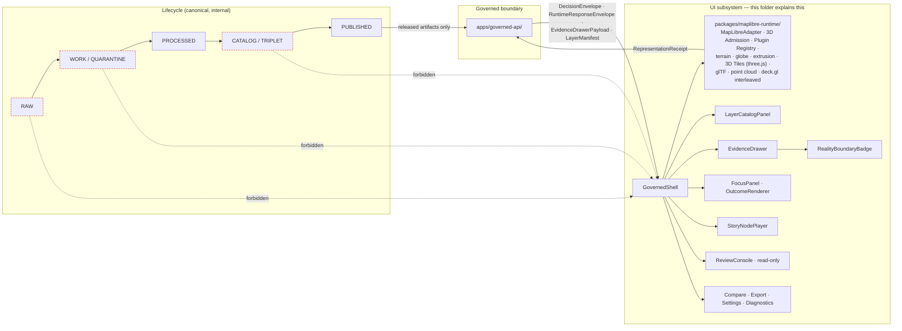
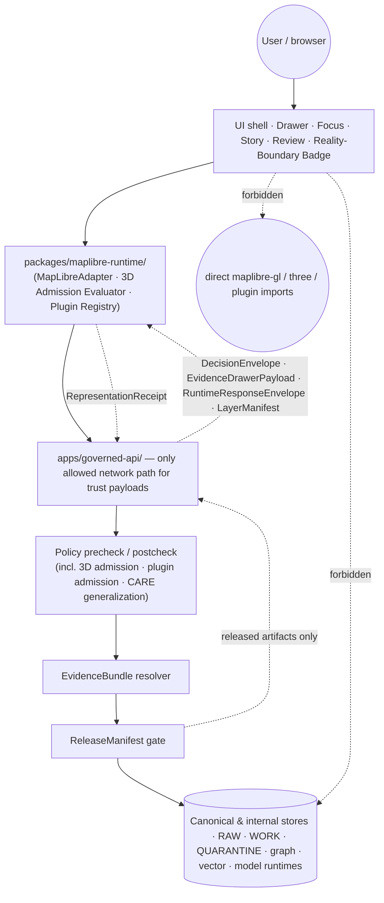

<!-- [KFM_META_BLOCK_V2]
doc_id: kfm://doc/architecture/ui/readme
title: UI Subsystem — Architecture README
type: standard
version: v2-draft
status: draft
owners: <Docs steward + UI subsystem owner>   # PLACEHOLDER — replace with CODEOWNERS handles
created: <YYYY-MM-DD>                          # PLACEHOLDER — set on first commit
updated: 2026-05-24                            # bumped for v2-draft revision
policy_label: public
related:
  - docs/architecture/README.md
  - docs/architecture/maplibre-3d.md
  - docs/architecture/ui/STATE_OWNERSHIP.md
  - docs/architecture/ui/ROUTE_MAP.md
  - docs/architecture/ui/BOUNDARIES.md
  - docs/architecture/ui/LAYERING.md
  - docs/architecture/ui/TELEMETRY.md
  - docs/architecture/ui/CONTINUITY_NOTES.md
  - docs/architecture/governed-ai/README.md
  - docs/architecture/story/README.md
  - docs/architecture/review/README.md
  - docs/doctrine/directory-rules.md
  - docs/doctrine/trust-membrane.md
  - docs/doctrine/lifecycle-law.md
  - contracts/OBJECT_MAP.md
  - docs/adr/ADR-NNNN-maplibre-sole-renderer-retire-cesium.md   # PROPOSED upstream
  - docs/adr/ADR-plugin-admission.md                            # PROPOSED (I-3D-7)
  - docs/adr/ADR-story-node-3d-admission.md                     # PROPOSED (supersedes ADR-story-node-3d-boundary)
tags: [kfm, ui, architecture, maplibre, 3d, evidence-drawer, focus-mode, finite-outcomes]
notes:
  - Authority is doctrine; all path references are PROPOSED until verified in a mounted repo.
  - v2-draft aligns this README with docs/architecture/maplibre-3d.md — MapLibre is sole renderer, plugins are governed dependencies, 3D is admission-not-handoff.
  - All v1-draft anchors preserved; additions fit inside existing sections.
[/KFM_META_BLOCK_V2] -->

# UI Subsystem — Architecture README

> The Kansas Frontier Matrix user interface is a **map-first, time-aware, evidence-bounded shell** that renders only released, policy-checked, citation-capable state — never a sovereign truth surface. **One renderer (MapLibre GL JS 5.x), governed plugins for 3D, and a single trust membrane.**

<!-- BADGES — Shields.io. Targets are PLACEHOLDERS; replace once CI, license, and registries are wired. -->


| Field | Value |
|---|---|
| **Status** | `draft` (v2-draft) · PROPOSED until repo-mounted verification |
| **Authority level** | Canonical (under `docs/`, the human-facing control plane) |
| **Owners** | Docs steward · UI subsystem owner *(PLACEHOLDER — see CODEOWNERS)* |
| **Last reviewed** | `2026-05-24` (v2-draft revision) |
| **Supersedes** | v1-draft of this file; UI commentary in prior Whole-UI + Governed AI Expansion Report (PDF) where this README is more specific |

> [!TIP]
> **What changed in v2-draft.** The UI subsystem now consumes **one browser-side renderer (MapLibre GL JS 5.x)** with a governed plugin ecosystem (`three.js`, `3d-tiles-renderer`, `maplibre-three-plugin`, `maplibre-gl-lidar`, `deck.gl` interleaved, `pmtiles`, `maplibre-cog-protocol`) hosted inside `packages/maplibre-runtime/`. Cesium is retired pending ADR. `MapRuntimePort` remains as a testability abstraction; **`MapLibreAdapter` is now the only production implementation**, and it hosts the **3D Admission Evaluator** and **Plugin Registry**. New object families (`SceneManifest`, `ViewState`, `CameraPath`, `RepresentationReceipt`, `RealityBoundaryNote`, `3DAdmissionDecision`, `PluginAdmission`) are surfaced in §10, §13, §14, §16, §21. See [`docs/architecture/maplibre-3d.md`](../maplibre-3d.md) for the renderer doctrine. All v1-draft anchors preserved.

---

## Quick jump

- [1 · Scope](#1--scope)
- [2 · Authority level](#2--authority-level)
- [3 · Status](#3--status)
- [4 · Repo fit](#4--repo-fit)
- [5 · What belongs here](#5--what-belongs-here)
- [6 · What does **not** belong here](#6--what-does-not-belong-here)
- [7 · Subsystem map](#7--subsystem-map)
- [8 · Proposed directory tree](#8--proposed-directory-tree)
- [9 · Sibling documents](#9--sibling-documents)
- [10 · UI component families](#10--ui-component-families)
- [11 · Routes](#11--routes)
- [12 · Finite outcomes](#12--finite-outcomes)
- [13 · Trust membrane](#13--trust-membrane)
- [14 · Layer trust badges](#14--layer-trust-badges)
- [15 · Accessibility expectations](#15--accessibility-expectations)
- [16 · Validation](#16--validation)
- [17 · Inputs](#17--inputs)
- [18 · Outputs](#18--outputs)
- [19 · Review burden](#19--review-burden)
- [20 · Related folders](#20--related-folders)
- [21 · ADRs that govern this folder](#21--adrs-that-govern-this-folder)
- [22 · FAQ](#22--faq)
- [23 · Open questions and verification backlog](#23--open-questions-and-verification-backlog)

---

## 1 · Scope

This README is the **landing page for the UI architecture lane** inside `docs/architecture/`. It explains what the KFM user interface is responsible for, where its design authority comes from, and how its surfaces fit the broader trust membrane. It is **doctrine**, not implementation: it specifies the contracts, boundaries, finite outcomes, and accessibility expectations the UI must meet, regardless of which framework, package, or app path eventually realizes them.

The UI subsystem covers, in scope:

- The **persistent map-first shell**, its **time-aware** state, its **route map**, and its **state ownership** boundaries.
- The **MapLibre runtime adapter boundary** (`MapRuntimePort`, `MapLibreAdapter` — the only production adapter), through which feature code never touches the renderer or any plugin directly. (Per I-3D-1, I-3D-7 in [`docs/architecture/maplibre-3d.md`](../maplibre-3d.md) §1.)
- The **3D Admission Evaluator** and **Plugin Registry** hosted inside `packages/maplibre-runtime/`, governing whether a layer may render in `terrain`, `globe`, `extrusion`, `tiles3d`, `gltf`, `pointcloud`, or `deck.gl interleaved` mode.
- The **Evidence Drawer** as the trust object that converts a map feature, layer, story step, or focus answer into an inspectable, cited claim.
- The **Reality Boundary Badge** UI affordance for interpretive vs. captured 3D content (KFM-P9-FEAT-0014).
- The **Focus Mode** governed query surface, bounded to released evidence with finite outcomes and no direct model client.
- The **Layer Catalog**, **legends**, **trust badges**, and the validated path from `LayerDescriptor` to `LayerManifest` / `KFMGeoManifest` (now carrying `geometry_label` and `plugin_dependencies` where 3D modes are requested).
- The **Story Node player** (2D-first; conditional 3D **admission per layer**, not renderer handoff).
- The **read-only Review console** for stewards.
- The **Compare**, **Export**, **Settings**, and **Diagnostics** surfaces.
- **Safe UI telemetry** — events that carry no raw evidence, prompts, secrets, exact restricted geometry, **or unredacted plugin paths**.

[Back to top](#ui-subsystem--architecture-readme)

---

## 2 · Authority level

**Canonical** (governance / human-facing explanation, under `docs/`). This file refines but does not contradict higher-authority doctrine.

```text
KFM core invariants & doctrine
       └─▶ Accepted ADRs that explicitly amend Directory Rules
              └─▶ docs/doctrine/directory-rules.md
                     └─▶ docs/architecture/README.md
                            ├─▶ docs/architecture/maplibre-3d.md     ← renderer / 3D / plugin admission doctrine
                            └─▶ docs/architecture/ui/README.md       ◀── you are here
                                   └─▶ STATE_OWNERSHIP · ROUTE_MAP · BOUNDARIES
                                       LAYERING · TELEMETRY · CONTINUITY_NOTES
```

Per the Directory Rules authority order (§2.1), if this document conflicts with KFM core invariants, an accepted ADR, or `directory-rules.md`, **the higher authority wins** and this file is opened as a drift entry, not as new authority. The same is true if it conflicts with [`docs/architecture/maplibre-3d.md`](../maplibre-3d.md) on renderer or 3D-admission specifics — `maplibre-3d.md` is the upstream for those.

[Back to top](#ui-subsystem--architecture-readme)

---

## 3 · Status

**Truth label: PROPOSED.** No mounted KFM repository was available in the session that produced this README, and no UI app tree, framework, route file, schema registry, fixture tree, policy bundle, or CI workflow was directly inspected. Every concrete path, file name, schema home, route name, and component name in this document is therefore **PROPOSED / NEEDS VERIFICATION** until validated against the live repo.

> [!IMPORTANT]
> Treat sibling docs (`STATE_OWNERSHIP.md`, `ROUTE_MAP.md`, `BOUNDARIES.md`, `LAYERING.md`, `TELEMETRY.md`, `CONTINUITY_NOTES.md`) as the **detailed surfaces** of this README. This file points at them; it does not duplicate them. When a sibling and this README disagree, the sibling wins for its own surface, and the conflict is logged in `docs/registers/DRIFT_REGISTER.md`. For **renderer, plugin, and 3D admission** specifics, [`docs/architecture/maplibre-3d.md`](../maplibre-3d.md) is the authoritative upstream — this README's coverage of those topics is a UI-side restatement, not a parallel home.

[Back to top](#ui-subsystem--architecture-readme)

---

## 4 · Repo fit

This folder sits inside the canonical `docs/` authority root (§5–§6.1, Directory Rules) and is a **lane** under `docs/architecture/`. It explains; it does not store machine schemas, policy bundles, fixtures, code, or emitted artifacts. Those have other homes.

| Layer | Path *(PROPOSED)* | Relation to this folder |
|---|---|---|
| Doctrine | `docs/doctrine/{trust-membrane,lifecycle-law,truth-posture,authority-ladder,directory-rules}.md` | **Upstream.** UI behavior is bounded by these. |
| Architecture index | `docs/architecture/README.md` | **Upstream.** Subsystem map. |
| Renderer / 3D doctrine | `docs/architecture/maplibre-3d.md` | **Upstream sibling.** The renderer choice, plugin ecosystem, I-3D-1…I-3D-7, and 3D admission rules this README consumes. |
| **UI architecture lane** | **`docs/architecture/ui/`** | **This folder.** |
| Sibling subsystems | `docs/architecture/{governed-ai,story,review}/` | **Lateral.** Shared envelope and finite-outcome grammar. |
| Object meaning | `contracts/OBJECT_MAP.md` | **Downstream.** Object family crosswalk. |
| Object shape | `schemas/contracts/v1/{ui,runtime,layers,evidence,focus,story,review,telemetry,maplibre,3d,policy}/…schema.json` | **Downstream.** Executable schemas (UI-owned + MapLibre/3D/policy consumed). |
| Policy | `policy/{ui,evidence,focus,story,review,export,telemetry,maplibre,sensitivity}/` | **Downstream.** Gate logic (incl. 3D admission, plugin admission, CARE-terrain generalization). |
| Fixtures | `tests/fixtures/{ui,focus,layers,story,review,runtime}/` · `fixtures/maplibre/{valid,invalid}/` | **Downstream.** Positive and negative state proofs. |
| **Runtime adapter** | `packages/maplibre-runtime/` | **Downstream.** The only module that imports `maplibre-gl`, `three`, `3d-tiles-renderer`, `deck.gl`, or `maplibre-gl-lidar`. |
| Implementation | `apps/explorer-web/` · `packages/ui/` · `packages/maplibre-runtime/` | **Downstream.** Deployable shell + runtime adapter (Directory Rules §11). |
| Runbooks | `docs/runbooks/{ui_LOCAL_DEV,ui_VALIDATION,ui_ROLLBACK,supply_chain}.md` | **Lateral.** How to develop, validate, roll back, and lockfile-verify UI + plugin changes. |

All paths above are **PROPOSED**; the canonical app path may differ in the mounted repo and is to be confirmed by ADR (`ADR-ui-schema-home`, `ADR-maplibre-adapter-boundary`).

> [!NOTE]
> **v1-draft listed `packages/cesium/` as a deployable.** v2-draft removes that row. Under the retire-Cesium ADR (PROPOSED upstream in [`docs/architecture/maplibre-3d.md`](../maplibre-3d.md) Appendix B), `packages/cesium-runtime/` is explicitly *not authored*. `packages/maplibre-runtime/` is the sole renderer adapter package.

[Back to top](#ui-subsystem--architecture-readme)

---

## 5 · What belongs here

Explanation-class Markdown for the UI subsystem. Concretely:

- The README (this file).
- `STATE_OWNERSHIP.md` — ownership of map, time, layer, drawer, focus, story, review, export, settings, and diagnostics state.
- `ROUTE_MAP.md` — route families and shell continuity rules.
- `BOUNDARIES.md` — browser allowed/forbidden operations and the MapLibre adapter boundary (incl. 3D admission and plugin admission gates).
- `LAYERING.md` — `LayerDescriptor` → `LayerManifest` / `KFMGeoManifest` flow, legends, badge inputs (incl. `geometry_label`, `plugin_dependencies`).
- `TELEMETRY.md` — safe UI event shape and what UI telemetry must never carry (incl. plugin paths, exact restricted geometry).
- `CONTINUITY_NOTES.md` — how prior UI doctrine and PDF lineage are preserved across redesigns, including the Cesium-handoff → 3D-admission transition.
- Optional: short architectural notes that are **explanatory and lane-scoped**, not normative across the repo (those promote to ADR).

[Back to top](#ui-subsystem--architecture-readme)

---

## 6 · What does **not** belong here

The "do not put X here" list is as important as the "do put Y here" list.

| Don't put here | Goes here instead *(PROPOSED)* |
|---|---|
| JSON Schemas, DTO shapes | `schemas/contracts/v1/{ui,runtime,layers,evidence,focus,story,review,telemetry,maplibre,3d,policy}/` |
| Object-family semantic definitions | `contracts/` and `contracts/OBJECT_MAP.md` |
| Policy / OPA rules (`*.rego`) and policy READMEs | `policy/{ui,evidence,focus,story,review,export,telemetry,maplibre,sensitivity}/` |
| TypeScript / React component code | `apps/explorer-web/` · `packages/ui/` |
| **Renderer or plugin imports** (`maplibre-gl`, `three`, `3d-tiles-renderer`, `deck.gl`, `maplibre-gl-lidar`, `pmtiles`, `maplibre-cog-protocol`) | `packages/maplibre-runtime/` **only**; feature code MUST NOT import these directly (I-3D-1, I-3D-7) |
| Plugin pinning / lockfile registry | `packages/maplibre-runtime/src/plugin-registry.ts` (per `maplibre-3d.md` Appendix A) |
| Test fixtures, mocks | `tests/fixtures/<subsystem>/` · `fixtures/maplibre/{valid,invalid}/` |
| Validators | `tools/validators/<subsystem>/` |
| CI workflow YAML | `.github/workflows/` |
| Released map tiles, COGs, PMTiles | `data/published/layers/...` (governed publication only) |
| Evidence bundles, receipts, proof packs | `data/proofs/` · `data/receipts/` (Directory Rules §13.2) |
| Release decisions | `release/` |
| Per-domain UI specifics that already have a domain lane | `docs/domains/<domain>/...` (Domain Placement Law §12) |
| Branding, voice guides | `docs/brand/` or `packages/ui/` (see Directory Rules) |

> [!WARNING]
> Trust-bearing content — `EvidenceBundle`, `RunReceipt`, `RepresentationReceipt`, `ReleaseManifest`, `RollbackCard`, `PromotionDecision`, `CorrectionNotice`, `3DAdmissionDecision`, `PluginAdmission`, `RealityBoundaryNote` — **never** lives in this folder. This is doctrine *about* those objects, not a parallel home for them. Creating a parallel home requires an ADR (Directory Rules §2.4 ¶5).

> [!CAUTION]
> **No naked renderer.** Any PR that adds `import maplibregl from 'maplibre-gl'`, `import * as THREE from 'three'`, `import { ... } from '3d-tiles-renderer'`, `import { Deck, MapboxOverlay } from '@deck.gl/...'`, or `import { ... } from 'maplibre-gl-lidar'` **outside `packages/maplibre-runtime/`** must fail the static boundary check in [§16 Validation](#16--validation). (Per I-3D-1, I-3D-7.)

[Back to top](#ui-subsystem--architecture-readme)

---

## 7 · Subsystem map

The UI is one node inside the KFM trust membrane. It consumes governed payloads, never sovereign internal state. **There is one renderer.** All 3D capabilities are plugin-hosted layers inside the same MapLibre runtime, gated by per-layer admission.



The dashed red edges are forbidden. Public UI clients **MUST NOT** reach RAW, WORK, QUARANTINE, canonical stores, graph stores, object stores, vector indexes, model runtimes, unpublished candidates, credentials, internal service handles, **or any plugin runtime directly** — the only path to MapLibre or any plugin is through `packages/maplibre-runtime/`.

[Back to top](#ui-subsystem--architecture-readme)

---

## 8 · Proposed directory tree

> [!NOTE]
> **PROPOSED tree.** Exact paths must be confirmed against mounted-repo evidence. Drift is logged in `docs/registers/DRIFT_REGISTER.md`, not absorbed into this file silently.

```text
docs/architecture/ui/
├── README.md              # this file — lane overview (v2-draft)
├── STATE_OWNERSHIP.md     # who owns map/time/layer/drawer/focus/story/review/... state
├── ROUTE_MAP.md           # route families and shell continuity rules
├── BOUNDARIES.md          # browser allowed/forbidden ops; MapLibre adapter; 3D + plugin admission gates
├── LAYERING.md            # LayerDescriptor → LayerManifest / KFMGeoManifest flow (+ geometry_label, plugin_dependencies)
├── TELEMETRY.md           # safe UI event shape and forbidden payloads
└── CONTINUITY_NOTES.md    # how prior UI doctrine and PDF lineage are preserved (incl. Cesium-handoff supersession)
```

[Back to top](#ui-subsystem--architecture-readme)

---

## 9 · Sibling documents

| Sibling *(PROPOSED)* | Owns | Status |
|---|---|---|
| [`STATE_OWNERSHIP.md`](./STATE_OWNERSHIP.md) | Where each piece of UI state lives, who mutates it, and which transitions are finite. | PROPOSED |
| [`ROUTE_MAP.md`](./ROUTE_MAP.md) | Route families (Explore, Dossier, Story, Focus, Review, Compare, Export, Settings, Diagnostics) and persistent-shell continuity rules. | PROPOSED |
| [`BOUNDARIES.md`](./BOUNDARIES.md) | Allowed and forbidden browser operations; `MapRuntimePort` contract; `packages/maplibre-runtime/` admission/plugin gates; "no forbidden client calls" static check. | PROPOSED — **expanded in v2-draft** with the 3D admission + plugin admission gate logic. |
| [`LAYERING.md`](./LAYERING.md) | `LayerCatalogItem` → `LayerDescriptor` → `LayerManifest` / `KFMGeoManifest` chain; trust-badge inputs; legend shape; **`geometry_label`** (`2D`/`2.5D`/`3D`) and **`plugin_dependencies`** fields. | PROPOSED — **expanded in v2-draft** for I-3D-4 (2.5D ≠ true-3D) and I-3D-7 (pinned plugins). |
| [`TELEMETRY.md`](./TELEMETRY.md) | `UiTelemetryEvent` shape; forbidden payloads (raw evidence, prompts, secrets, exact restricted geometry, unredacted plugin paths). | PROPOSED |
| [`CONTINUITY_NOTES.md`](./CONTINUITY_NOTES.md) | Carry-forward of prior UI doctrine; what was kept, wrapped, deferred, or replaced. Includes the Cesium-handoff → 3D-admission supersession. | PROPOSED |

[Back to top](#ui-subsystem--architecture-readme)

---

## 10 · UI component families

PROPOSED component families. Each MUST be backed by a schema in `schemas/contracts/v1/...`, by fixtures in `tests/fixtures/...`, and by policy in `policy/...` where consequential.

| Component family | Responsibilities | Depends on |
|---|---|---|
| **GovernedShell** | Persistent map-first layout; time banner; trust/status header; route outlet; panel region; keyboard skip links. | Bootstrap envelope · shell state |
| **MapRuntimeBoundary + MapLibreAdapter** *(sole production adapter)* | Hides the renderer **and the plugin set**; applies *validated* sources/layers; synchronizes camera, time, projection, and pitch; converts clicks to claim-resolution requests. | `LayerDescriptor` · `TimeState` · `ViewState` · governed client |
| **3D Admission Evaluator** *(inside `packages/maplibre-runtime/`)* | Evaluates `3DAdmissionDecision` before `setTerrain`, `setProjection({type:'globe'})`, fill-extrusion with a non-2D `geometry_label`, or any plugin-hosted layer construction. ALLOW / DENY / ABSTAIN. | `LayerManifest.geometry_label` · `policy/maplibre/3d-admission.rego` |
| **Plugin Registry** *(inside `packages/maplibre-runtime/`)* | Pins admitted plugin versions; verifies `plugin_dependencies` on every layer load; checks supply-chain attestations; emits `PluginAdmission` decisions. (Per I-3D-7.) | `LayerManifest.plugin_dependencies` · lockfile · supply-chain proofs |
| **LayerCatalogPanel** | Layer toggles, legends, filters, time filters, compare/export hooks, verified status, manifest/proof visibility; surfaces `geometry_label` and per-layer mode availability. | `LayerCatalogItem` · `LayerDescriptor` |
| **EvidenceDrawer** | Displays `EvidenceBundle`-derived payload, source roles, freshness, review, sensitivity, rights, valid time, correction, provenance; **surfaces `RealityBoundaryNote` when the active layer is interpretive/synthetic.** | `EvidenceDrawerPayload` · `RealityBoundaryNote` |
| **RealityBoundaryBadge** *(new in v2-draft)* | UI affordance making interpretive vs. captured 3D distinction visible at glance (KFM-P9-FEAT-0014). Surfaces on map, drawer, and exports. | `RealityBoundaryNote` |
| **FocusPanel + OutcomeRenderer** | Governed query surface; bounded scope; finite outcomes; cancellation/loading; citation validation; **no direct model calls**. | `FocusRequest` · `FocusResponse` · `DecisionEnvelope` |
| **StoryNodePlayer** | 2D-first narrative steps with map/time/layer/evidence continuity; **per-layer 3D admission requests** (not renderer handoff) under a separate gate. | `StoryManifest` · `StoryNode` · runtime admission |
| **ReviewConsole** | Read-only steward view of proof / review / correction state; **no release action in the first slice**. | `ReviewRecord` · `ReleaseManifest` · policy |
| **Compare / Export / Settings / Diagnostics** | Compare releases / time slices; governed export requests; accessibility settings; **PMTiles range / cache / ETag diagnostics surface** (KFM-P32-FEAT-0013) without leakage. | Layer manifests · export policy · telemetry policy |

> [!CAUTION]
> **`packages/maplibre-runtime/` is the only module allowed to import MapLibre runtime APIs or any plugin.** Component code speaks to `MapRuntimePort` and governed client events — not to `maplibre-gl`, `three`, `3d-tiles-renderer`, `deck.gl`, `maplibre-gl-lidar`, `pmtiles`, or `maplibre-cog-protocol` directly. This boundary is testable with a static import-graph check (see [§16 Validation](#16--validation)).

[Back to top](#ui-subsystem--architecture-readme)

---

## 11 · Routes

PROPOSED route families. The map and time context **persist across routes**; routes mount and unmount panel content inside a shared shell.

| Route | Purpose | Persistent shell elements |
|---|---|---|
| **Explore** | Default surface: map + layer catalog + drawer on demand. | map · time · trust header · drawer |
| **Dossier** | Detail surface for a feature, place, or object family. | map · time · drawer |
| **Story** | 2D-first guided narrative; **conditional 3D admission per layer** within the same renderer (not a handoff). | map · time · drawer (story-scoped) · reality-boundary badge |
| **Focus** | Bounded, evidence-resolved query; finite outcomes. | map · time · drawer · focus panel |
| **Review** | Read-only steward view of proof, policy, correction state. | trust header · drawer (proof-scoped) |
| **Compare** | Release / time-slice / proof deltas. | map · time · compare panel |
| **Export** | Governed export request with rights, sensitivity, proof reference, **and `RepresentationReceipt`** gates. | trust header · export panel |
| **Settings** | Preferences, accessibility, diagnostics opt-in. | shell only |
| **Diagnostics** | Schema, policy, API status surface — without leakage. Includes PMTiles range/cache/ETag diagnostics. | shell only |

[Back to top](#ui-subsystem--architecture-readme)

---

## 12 · Finite outcomes

Every consequential governed surface returns a finite outcome from a small, well-known set. UI components MUST render every outcome explicitly; "loading," "empty," and "happy path" are not enough.

| Outcome | When | UI obligation |
|---|---|---|
| **ANSWER** | Evidence sufficient · policy permits · release state allows · review state recorded where required. | Render claim **with** drawer-ready `EvidenceRef` list and citations. |
| **ABSTAIN** | Evidence insufficient, unresolved, or stale with no released alternative; **3D Admission ABSTAIN**; reality-boundary required-but-missing. | Show non-substantive note with **reason**; never invent. The runtime falls back to 2D where the layer is admissible in 2D. |
| **DENY** | Policy, rights, sensitivity, or release state forbids the response. Sensitive lanes default here. **3D Admission DENY** (e.g., CARE-masked archaeology without ≥5 km generalization; 2.5D layer claiming true-3D evidence). **Plugin Admission DENY** (unpinned/drifted plugin version). | Show denial reason; offer a non-restricted surface where possible. |
| **ERROR** | Governed API cannot evaluate — missing schema, malformed query, contract violation, infra failure. | Render finite, actionable error; **no claim leakage**. |
| **HOLD** *(release / correction surfaces)* | Promotion / release / correction paused pending steward, rights-holder, or policy review. | Keep surface in prior state; do not silently roll back or replace. |
| **PASS / FAIL** *(validator-class)* | Validator or admission check completed (incl. `3DAdmissionDecision`, `PluginAdmission`). | Internal only; does not directly emit a public answer, but feeds the rendered outcome above. |

> [!TIP]
> `OutcomeRenderer` is a UI primitive, not a special case. Map clicks, Focus answers, layer admissibility, **3D mode requests**, **plugin admission**, export requests, and review responses **all** funnel through it, so users learn one trust grammar.

[Back to top](#ui-subsystem--architecture-readme)

---

## 13 · Trust membrane

The UI sits *outside* the trust membrane; the governed API sits *on* it; canonical stores sit *inside* it. **One renderer. One adapter. One trust membrane.**



**Invariants the UI MUST preserve** (Directory Rules §3, lifecycle law, trust membrane, plus the 3D-specific I-3D-1…I-3D-7 from [`docs/architecture/maplibre-3d.md`](../maplibre-3d.md) §1):

1. **Deny by default.** Public UI uses governed APIs and released payloads only.
2. **No direct model client.** Focus Mode is an evidence-bounded adapter behind the governed API.
3. **No canonical / internal client fetch.** MapLibre consumes released artifacts and governed APIs, not source systems or internal data stores.
4. **No unreleased tile load.** PMTiles, MVT, MLT, COG, 3D Tiles, glTF, point clouds, style JSON, sprites, and glyphs must be released and manifest-bound.
5. **No sensitive geometry hidden only by style.** Masking, generalization, restricted tier, or denial must occur **before** public tile generation. CARE-masked archaeology requires **≥5 km generalization** on any terrain-linked layer (I-3D-5).
6. **No popup as Evidence Drawer substitute.** Popups may preview; material claims need `EvidenceDrawerPayload` and `EvidenceBundle` resolution.
7. **No uncited export.** Screenshots, reports, Story Nodes, and Focus answers retain citations and manifest / version references; exports of 3D content also carry the layer's `RepresentationReceipt` and any `RealityBoundaryNote`.
8. **No naked renderer or naked plugin (v2-draft, per I-3D-1, I-3D-7).** Feature code MUST NOT import `maplibre-gl`, `three`, `3d-tiles-renderer`, `deck.gl`, `maplibre-gl-lidar`, `pmtiles`, or `maplibre-cog-protocol` directly. Every plugin used at runtime MUST have a `PluginAdmission` decision in scope, and every layer that activates a 3D mode MUST have a `3DAdmissionDecision` in scope.
9. **No 2.5D-as-true-3D (per I-3D-4).** `fill-extrusion` and draped DEMs cannot stand in as evidence for true vertical geometry (caves, overhangs, strata, building interiors). The `LayerManifest.geometry_label` must say which it is, and the UI must surface the distinction.

[Back to top](#ui-subsystem--architecture-readme)

---

## 14 · Layer trust badges

`LayerDescriptor` MUST carry the metadata needed for **interpretation at point of use**. Badges are *visible* projections of that metadata — they are not authority.

| Badge | Drives from | UI behavior |
|---|---|---|
| **Source role** | `SourceDescriptor` (authority / observation / context / model / aggregate / admin) | Visible label + tooltip; affects drawer ordering. |
| **Rights** | `policy/sensitivity/` + source descriptor rights fields | DENY render until rights are resolved; abstain on uncertainty. |
| **Sensitivity / CARE** | `policy/sensitivity/` (locality, sovereignty, living-person, archaeology, rare species) | Generalize, restrict tier, or deny — *before* public tile generation. |
| **Review state** | `ReviewRecord` | Surface explicitly; do not collapse "unreviewed" into "ready." |
| **Freshness** | `valid_time` · `observed_time` · poll cadence · stale thresholds | Distinct **stale** vs **degraded** vs **denied** badges. |
| **Release state** | `ReleaseManifest` / `MapReleaseManifest` | Layer admissibility check; non-released layers do not render. |
| **Correction** | `CorrectionNotice` lineage | Surface as a non-blocking badge with link to the correction. |
| **Provenance / asset integrity** | `KFMGeoManifest` digests (PMTiles / COG / glTF / 3D Tiles `sha256` / `blake3`) | Verify on load; fail closed on digest mismatch. |
| **Geometry label** *(new in v2-draft, per I-3D-4)* | `LayerManifest.geometry_label` ∈ `{2D, 2.5D, 3D}` | Visible label in catalog and drawer; UI denies "true 3D" interpretation of a `2.5D` layer. |
| **3D admission state** *(new in v2-draft, per I-3D-6)* | `3DAdmissionDecision` per requested mode | Catalog shows which 3D modes (`terrain`/`globe`/`extrusion`/`tiles3d`/`gltf`/`pointcloud`/`deck.gl`) are admissible for this layer in this context. |
| **Plugin admission state** *(new in v2-draft, per I-3D-7)* | `PluginAdmission` for layer's `plugin_dependencies` | If a required plugin is unpinned or drifted, the layer's 3D mode is denied; badge surfaces the reason. |
| **Reality boundary** *(new in v2-draft, per KFM-P9-FEAT-0014)* | `RealityBoundaryNote` on layer or scene | Visible badge: **captured** vs **interpretive / synthetic / reconstructed**. Surfaced in drawer and on exports. |

[Back to top](#ui-subsystem--architecture-readme)

---

## 15 · Accessibility expectations

PROPOSED accessibility smoke criteria (full enumeration in `tests/accessibility/ui_shell_axe.spec.ts`):

- **Keyboard-only navigation** of routes and panels; stable focus order; drawer and dialogs trap and release focus correctly.
- **Map alternatives.** Map interactions have non-map equivalents: selected features and results appear in a keyboard-accessible list or table.
- **3D controls are keyboard-reachable.** Pitch, projection toggle (2D ↔ globe), terrain exaggeration slider, and plugin-hosted layer visibility toggles are all reachable without a mouse (per `maplibre-3d.md` §10 Accessibility).
- **2D fallback is always offered when any 3D admission fails or the user requests it.** A "view in 2D" affordance is present on every node/layer that supports a 3D mode.
- **Reality Boundary Badge has text + icon.** The captured/interpretive distinction is never color-only; reduced-motion users still receive the badge.
- **No color-only trust signal.** Badges (source role, rights, sensitivity, review, freshness, release, correction, **geometry label, 3D admission, plugin admission, reality boundary**) carry text labels.
- **Reduced-motion mode.** Story Node camera animation, terrain exaggeration animation, globe projection transition, and drawer transitions are disabled or shortened. `CameraPath` playback respects `prefers-reduced-motion`.
- **Touch and narrow viewports.** Map, time context, drawer, focus, and **reality-boundary** states remain usable; critical trust info is not hidden.
- **Announced states.** Loading, cancelled, denied, abstained, error, stale, restricted, **3D admission denied**, **plugin admission denied**, **reality-boundary surfaced** states are announced and visibly differentiated.
- **Alt text on terrain / 3D screenshots** (per ML-059-052). Exports of 3D content include alt text describing the scene, the geometry label, and the reality-boundary status.

[Back to top](#ui-subsystem--architecture-readme)

---

## 16 · Validation

How the UI lane is checked. **All check names are PROPOSED** until CI is verified.

| Check | Command family *(PROPOSED)* | Expected result |
|---|---|---|
| Schema validation | `jsonschema` / `ajv` over `schemas/contracts/v1/` (incl. `maplibre/`, `3d/`, `policy/` subtrees) and `tests/fixtures/` + `fixtures/maplibre/` | Valid fixtures pass; invalid fixtures fail closed. |
| Typecheck | repo-standard typecheck | No type errors. |
| Component / unit tests | repo-standard test runner | Shell, drawer, focus, layers, story, review, **reality-boundary badge** surfaces pass. |
| **No forbidden browser calls** | static import / grep boundary check | Browser code does **not** import model runtime clients, DB clients, object-store clients, vector DB clients, graph clients, raw-store APIs, **or any of `maplibre-gl`, `three`, `3d-tiles-renderer`, `deck.gl`, `maplibre-gl-lidar`, `pmtiles`, `maplibre-cog-protocol` outside `packages/maplibre-runtime/`** (per I-3D-1, I-3D-7). |
| **Plugin admission tests** *(new in v2-draft)* | `tests/policy/maplibre/plugin_admission.test.ts` | Unpinned / drifted / unattested plugin version → DENY. |
| **3D admission tests** *(new in v2-draft)* | `tests/policy/maplibre/3d_admission.test.ts` | `geometry_label: '2.5D'` + `requested_mode: 'true_3d_evidence'` → DENY. CARE archaeology without ≥5 km generalization → DENY. Globe projection inherits 2D admission. Living-person data → DENY. |
| **Contract tests for new objects** *(new in v2-draft)* | `tests/contract/maplibre/{scene_manifest,style_manifest,representation_receipt,plugin_admission}.test.ts` | Round-trip against schemas; invalid fixtures fail closed. |
| **3D integration smokes** *(new in v2-draft)* | `tests/integration/maplibre/{terrain_smoke,globe_projection,fill_extrusion_height_evidence,tiles3d_three_smoke,lidar_ept_streaming,deckgl_interleaved}.test.ts` | Each mode renders within performance budget (`maplibre-3d.md` §9) and emits a `RepresentationReceipt`. 2D fallback verified on admission failure. |
| **Supply-chain check** *(new in v2-draft, per I-3D-7)* | Lockfile + attestation check in CI | Every admitted plugin's checksum matches the pinned manifest; lockfile drift fails CI; a `plugin_admission` decision exists for each plugin used at runtime. |
| E2E smoke | Playwright route / load / focus / map-click / **3D-toggle** tests (`e2e/focus-mode-3d-toggle.spec.ts`) | Finite outcomes render correctly; 3D-toggle either ALLOWS with `RepresentationReceipt` or DENIES with reason. |
| Accessibility smoke | Playwright + axe-like checks + keyboard script | No critical violations; map alternatives present; **3D controls keyboard-reachable**; **2D fallback offered**. |
| Visual regression | Per `scene_manifest_id`, screenshots at fixed `ViewState`s compared against baseline | No drift outside threshold. |
| Cache / Range / CDN | PMTiles range, COG range, EPT streaming integrity probes | Range/Cache-Control/ETag respected; PMTiles digest matches; EPT survives intermittent CORS. |
| Policy tests | `conftest` or repo policy runner | Deny invalid / unreleased / uncited / restricted flows; 3D admission denies fire correctly. |
| Docs propagation | docs link check + object-map completeness | Every changed schema, API route, or policy file has docs / tests / runbook updates. |
| CI workflow | `.github/workflows/ui-governed.yml` · `.github/workflows/contracts-ui-ai.yml` · `.github/workflows/plugin-admission.yml` *(PROPOSED)* | PR-safe; fail closed on invalid fixtures, plugin drift, or unpinned dependencies. |

[Back to top](#ui-subsystem--architecture-readme)

---

## 17 · Inputs

Where content in this folder comes from:

- **Upstream doctrine.** `docs/doctrine/{directory-rules,trust-membrane,lifecycle-law,truth-posture,authority-ladder}.md`.
- **Architecture index.** `docs/architecture/README.md`.
- **Renderer / 3D doctrine.** [`docs/architecture/maplibre-3d.md`](../maplibre-3d.md) — primary upstream for renderer choice, plugin admission, 3D admission, and the I-3D-1…I-3D-7 invariants.
- **Object map.** `contracts/OBJECT_MAP.md` for object-family meaning.
- **ADRs** governing this folder (see [§21](#21--adrs-that-govern-this-folder)).
- **Prior lineage:** the Whole-UI + Governed AI Expansion Report and the Master MapLibre Components atlas — kept as **lineage / PROPOSED design pressure**, never as proof of mounted implementation. The dual-renderer disposition of `KFM-P2-FEAT-0012` is preserved as superseded by the retire-Cesium ADR.

[Back to top](#ui-subsystem--architecture-readme)

---

## 18 · Outputs

What this folder emits downstream:

- Normative pointers to **executable schemas** in `schemas/contracts/v1/{ui,runtime,layers,evidence,focus,story,review,telemetry,maplibre,3d,policy}/`.
- Normative pointers to **policy bundles** in `policy/{ui,evidence,focus,story,review,export,telemetry,maplibre,sensitivity}/`.
- **Fixture expectations** in `tests/fixtures/{ui,focus,layers,story,review,runtime}/` and `fixtures/maplibre/{valid,invalid}/`.
- **Validators** in `tools/validators/{ui,focus,layers,story,geo_manifest,scene_manifest,plugin_admission,3d_admission}/`.
- **App-level guidance** for `apps/explorer-web/`, shared `packages/{ui,maplibre-runtime}/`. *(Note: `packages/cesium/` is explicitly **not** an output under the retire-Cesium ADR.)*
- **Runbook hooks**: `docs/runbooks/{ui_LOCAL_DEV,ui_VALIDATION,ui_ROLLBACK,supply_chain}.md`.

[Back to top](#ui-subsystem--architecture-readme)

---

## 19 · Review burden

| Change scope | Required reviewers |
|---|---|
| Editorial / typo / dead-link fix | Docs steward. |
| New normative paragraph; component family addition; new sibling document | Docs steward **+** UI subsystem owner. |
| Boundary changes (adapter contract, browser-allowed operations, telemetry shape) | Docs steward **+** UI subsystem owner **+** security / policy steward. |
| **3D admission rule changes; plugin admission policy changes; pinned plugin set changes** *(new in v2-draft)* | Above **+** renderer/3D steward (owner of `docs/architecture/maplibre-3d.md`) **+** supply-chain reviewer. |
| Change that touches the trust membrane, finite-outcome grammar, or `EvidenceBundle` semantics | Above **+** ADR (Directory Rules §2.4). |
| Path / home / canonical-root change | ADR **required**; cite Directory Rules §2.4. |

CODEOWNERS entries are *PLACEHOLDER* until the live `.github/CODEOWNERS` is inspected.

[Back to top](#ui-subsystem--architecture-readme)

---

## 20 · Related folders

| Related *(PROPOSED)* | Why it matters |
|---|---|
| [`docs/architecture/maplibre-3d.md`](../maplibre-3d.md) | **Renderer doctrine and 3D primitives — the upstream this README consumes.** I-3D-1…I-3D-7 invariants, plugin ecosystem, retire-Cesium ADR draft. |
| `docs/architecture/governed-ai/` | Focus Mode flow, policy precheck / postcheck, citation validation, `RuntimeResponseEnvelope`. |
| `docs/architecture/story/` | Story Node manifest, 2D-first continuity, **per-layer 3D admission** (no renderer handoff). |
| `docs/architecture/review/` | Steward read / write boundaries, correction lineage. |
| `docs/doctrine/trust-membrane.md` | The membrane this subsystem sits outside. |
| `docs/doctrine/lifecycle-law.md` | RAW → WORK / QUARANTINE → PROCESSED → CATALOG / TRIPLET → PUBLISHED. |
| `contracts/OBJECT_MAP.md` | Object family crosswalk: meaning ↔ schema ↔ fixture ↔ policy ↔ emitted instance. |
| `data/{receipts,proofs,manifests,catalog}/README.md` | Where receipts (incl. `RepresentationReceipt`), proofs, manifests, and catalog records actually live. |
| `release/` | Release **decisions** (distinct from `data/published/` *artifacts*). |
| `packages/maplibre-runtime/` *(PROPOSED)* | The runtime adapter package this README's component families consume. |

[Back to top](#ui-subsystem--architecture-readme)

---

## 21 · ADRs that govern this folder

| ADR *(PROPOSED)* | Decides |
|---|---|
| `docs/adr/ADR-ui-schema-home.md` | Where UI / runtime / layer / evidence / focus / story / review / telemetry / **maplibre / 3d / policy** schemas live. |
| `docs/adr/ADR-maplibre-adapter-boundary.md` | The `MapRuntimePort` contract and the rule that only `packages/maplibre-runtime/` imports MapLibre or any plugin runtime APIs. |
| `docs/adr/ADR-NNNN-maplibre-sole-renderer-retire-cesium.md` *(new in v2-draft; upstream gating dependency)* | MapLibre as sole renderer; Cesium retired. Supersedes the dual-renderer disposition of `KFM-P2-FEAT-0012`. ADR number to be assigned against the live ADR set (corpus carries open numbering conflicts on `ADR-0003`). Draft text in `maplibre-3d.md` Appendix B. |
| `docs/adr/ADR-plugin-admission.md` *(new in v2-draft, per I-3D-7)* | Plugin admission policy DSL, attestation format, lockfile integration. Gates every plugin used at runtime. |
| `docs/adr/ADR-focus-model-adapter-boundary.md` | That Focus Mode is an evidence-bounded adapter behind the governed API; the browser does not call model runtimes. |
| `docs/adr/ADR-story-node-3d-admission.md` *(supersedes v1-draft's `ADR-story-node-3d-boundary.md`)* | Per-layer 3D Admission Decision criteria for Story Nodes; the prior name framed the question as a Cesium handoff, which is no longer the architecture. |
| `ADR-0001` (schema-home rule) | Default schema home is `schemas/contracts/v1/...`. |

> The UI subsystem MUST NOT enable any 3D layer mode before **both** `ADR-story-node-3d-admission` and the renderer-decision ADR are accepted, and before the plugin admission ADR provides a workable rule set.

[Back to top](#ui-subsystem--architecture-readme)

---

## 22 · FAQ

<details>
<summary><strong>Why is MapLibre "just a renderer" and not part of the truth path?</strong></summary>

Because rendering is not authority. A tile is a *prepared payload*; the claims it appears to make resolve through a governed API into an `EvidenceBundle`. Letting MapLibre carry truth would collapse the trust membrane — exactly the failure pattern Directory Rules §13.3 names.

</details>

<details>
<summary><strong>Why are there finite outcomes everywhere, not just on Focus?</strong></summary>

Because every governed surface — map click, layer admissibility, **3D admission**, **plugin admission**, export, review, promotion — can ANSWER, ABSTAIN, DENY, or ERROR. Funneling all of them through one outcome grammar means users learn the trust posture once, and reviewers can test it in one place. Surface-specific shapes still exist (validator-class `PASS` / `FAIL`, release-class `HOLD`), but they slot into the same grammar.

</details>

<details>
<summary><strong>Where does conditional 3D fit?</strong> <em>(reframed in v2-draft)</em></summary>

**As a per-layer admission decision inside the same renderer**, not a handoff to a separate renderer. Under the retire-Cesium ADR, MapLibre GL JS 5.x is the sole browser-side renderer; 3D capabilities (terrain, globe projection, fill-extrusion, OGC 3D Tiles via `3d-tiles-renderer` + three.js, glTF via `maplibre-three-plugin`, LAS/COPC/EPT point clouds via `maplibre-gl-lidar`, deck.gl interleaved) are plugin-hosted layers inside `packages/maplibre-runtime/`. A layer enters 3D only when its `3DAdmissionDecision` (per I-3D-6) and its `PluginAdmission` (per I-3D-7) both ALLOW. The runtime emits a `RepresentationReceipt` and surfaces a `RealityBoundaryNote` when the layer is interpretive or synthetic. Evidence parity with 2D is **upheld by construction** because there is one renderer and one client (per I-3D-3 under the new architecture).

</details>

<details>
<summary><strong>What if the mounted repo doesn't match the proposed paths?</strong></summary>

The Rules win. Per Directory Rules §2.5, do **not** silently conform: open a drift entry in `docs/registers/DRIFT_REGISTER.md`, propose either an ADR amending the Rules or a migration plan, and mark the affected paths `PROPOSED / CONFLICTED` until resolved.

</details>

<details>
<summary><strong>How is a plugin "governed"? Aren't plugins just npm packages?</strong> <em>(new in v2-draft)</em></summary>

A plugin **becomes governed** when it is (1) named on the admitted list in `packages/maplibre-runtime/src/plugin-registry.ts`, (2) pinned to a specific version, (3) supply-chain-attested in the lockfile, and (4) carried in the active layer's `LayerManifest.plugin_dependencies`. At runtime, the Plugin Registry verifies the pinned set against the live attestations and emits a `PluginAdmission` decision. Unpinned / drifted / unattested plugins → DENY. See `maplibre-3d.md` Appendix A for the current admitted set and licensing posture (`three.js` MIT, `3d-tiles-renderer` Apache 2.0, `deck.gl` MIT, others NEEDS VERIFICATION).

</details>

<details>
<summary><strong>What is a Reality Boundary Note, and why does the UI care?</strong> <em>(new in v2-draft)</em></summary>

A `RealityBoundaryNote` is a governed object that says "this carrier is reconstructed / interpolated / synthetic, not directly observed." It is required whenever an interpretive 3D model (e.g., a photogrammetric building, an archaeological reconstruction, a `Synthetic Surface`) is cited by a layer or scene (KFM-P9-FEAT-0014). The UI surfaces it in the Evidence Drawer **and** on a visible `RealityBoundaryBadge` so a photoreal 3D rendering cannot be mistaken for direct evidence.

</details>

[Back to top](#ui-subsystem--architecture-readme)

---

## 23 · Open questions and verification backlog

To be tracked in `docs/registers/VERIFICATION_BACKLOG.md`. Items marked **(carried)** were present in v1-draft and remain open; items marked **(new in v2-draft)** are introduced by the renderer revision.

- **NEEDS VERIFICATION (carried)** — actual app path: `apps/explorer-web/` vs an existing path (e.g., `ui/`, `web/`, `apps/web/`, `frontend/`). Affects every concrete path in this README.
- **NEEDS VERIFICATION (carried)** — framework choice (React + Vite is *presumed* by prior lineage but **not** verified here).
- **NEEDS VERIFICATION (carried)** — current state of `schemas/contracts/v1/{ui,runtime,layers,evidence,focus,story,review,telemetry}/`.
- **NEEDS VERIFICATION (carried)** — whether `policy/` or `policies/` is canonical in the live repo (Directory Rules §18 open question).
- **NEEDS VERIFICATION (carried)** — whether `.github/workflows/{ui-governed.yml,contracts-ui-ai.yml}` exist or are PROPOSED.
- **OPEN (carried)** — exact home of `MapRuntimePort`: `packages/maplibre-runtime/` vs `apps/explorer-web/src/map/`. Resolve in `ADR-maplibre-adapter-boundary`. *(v2-draft's working assumption is `packages/maplibre-runtime/`, mirroring `maplibre-3d.md` OQ-3D-03.)*
- **OPEN (carried)** — anchor stability for siblings if they are renamed during repo inspection.
- **RESOLVED upstream (was carried)** — ~~Cesium edition (CesiumJS open-source vs Cesium Ion) and token-rotation discipline~~ → **MOOT** under the retire-Cesium ADR.
- **NEW in v2-draft** — Does `packages/maplibre-runtime/` exist, or is runtime adapter logic living in `apps/explorer-web/`? *(Mirrors `maplibre-3d.md` OQ-3D-03.)* **NEEDS VERIFICATION.**
- **NEW in v2-draft** — Is `policy/maplibre/` the canonical home for 3D admission and plugin admission rules, or do they live under `policy/sensitivity/` and/or `policy/supply_chain/`? *(Mirrors `maplibre-3d.md` OQ-3D-04.)* **NEEDS VERIFICATION.**
- **NEW in v2-draft** — Should `LayerManifest.geometry_label` be an enum field on the existing schema or a separate `geometry_descriptor` object? *(Mirrors `maplibre-3d.md` OQ-3D-06.)* **PROPOSED — decide in `ADR-maplibre-adapter-boundary` or a follow-up ADR.**
- **NEW in v2-draft** — Should `LAYERING.md` enumerate the seven 3D modes (`terrain`/`globe`/`extrusion`/`tiles3d`/`gltf`/`pointcloud`/`deck.gl interleaved`) and their per-mode badge expectations, or should a new sibling `3D_MODES.md` be added? **PROPOSED — extend `LAYERING.md` first; promote to a new sibling only if it grows past one screen.**
- **NEW in v2-draft** — Should the Plugin Registry's pinned manifest live at `packages/maplibre-runtime/src/plugin-registry.ts` (CONFIRMED in `maplibre-3d.md` Appendix A) or be co-versioned with a separate `packages/maplibre-runtime/plugin-registry.json` data file for easier diffing? **PROPOSED — co-version a JSON sidecar for diff-friendliness; resolve in `ADR-plugin-admission`.**
- **NEW in v2-draft** — Does the export pipeline need to attach `RepresentationReceipt` references to every 3D screenshot/PDF/Story snapshot, or only when the active scene contains an interpretive layer? **PROPOSED — always attach when any 3D mode was active; minimal cost, maximum auditability.**
- **NEW in v2-draft** — Should `RealityBoundaryBadge` be color-coded (e.g., neutral for captured, amber for interpretive, red for synthetic), or icon-only? **PROPOSED — icon + text + role-prefixed label, never color-only (per §15 accessibility).**

[Back to top](#ui-subsystem--architecture-readme)

---

<!-- FOOTER -->

**Related docs (quick links):**
[Architecture index](../README.md) · [MapLibre 3D doctrine](../maplibre-3d.md) · [State ownership](./STATE_OWNERSHIP.md) · [Route map](./ROUTE_MAP.md) · [Boundaries](./BOUNDARIES.md) · [Layering](./LAYERING.md) · [Telemetry](./TELEMETRY.md) · [Continuity notes](./CONTINUITY_NOTES.md) · [Governed AI](../governed-ai/README.md) · [Story](../story/README.md) · [Review](../review/README.md) · [Directory Rules](../../doctrine/directory-rules.md)

**Last reviewed:** `2026-05-24` (v2-draft revision)
**Truth label of this document:** PROPOSED (doctrine confirmed; concrete paths, plugin pinning, and implementation maturity unverified against a mounted repo)

[Back to top](#ui-subsystem--architecture-readme)
