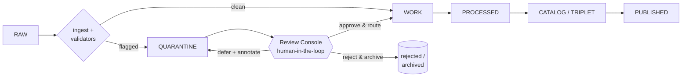
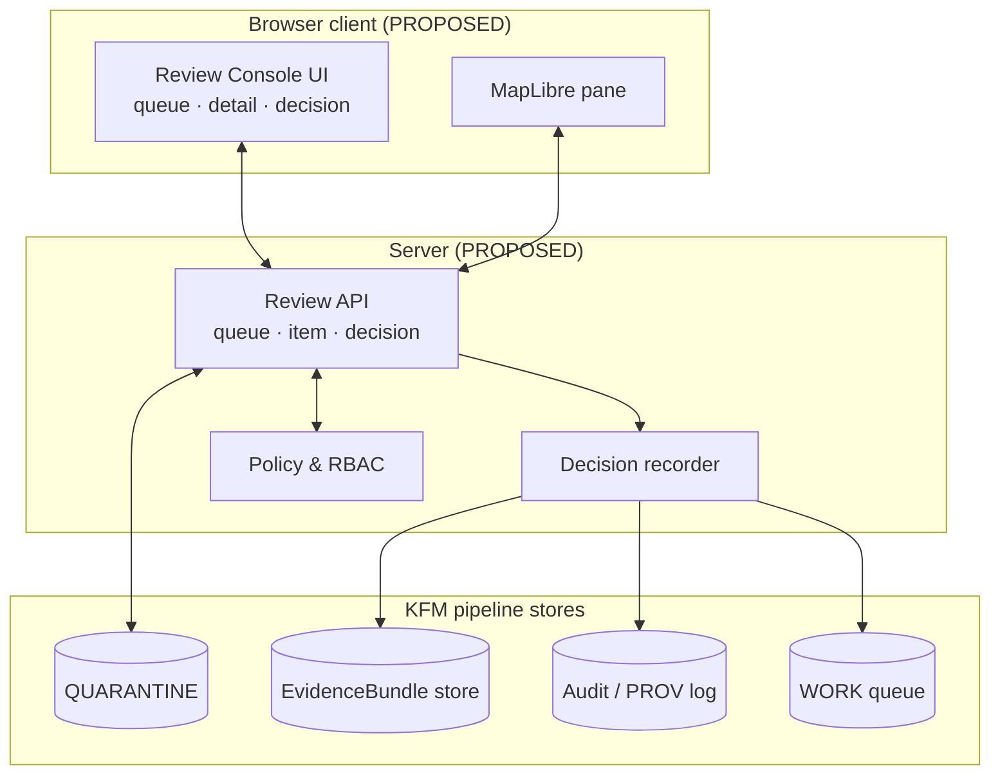

<!-- [KFM_META_BLOCK_V2]
doc_id: kfm://doc/architecture-ui-review-console
title: Review Console — Architecture
type: standard
version: v0.1
status: draft
owners: TBD (UI maintainers)
created: 2026-05-14
updated: 2026-05-14
policy_label: public
related: [docs/architecture/PIPELINE.md, docs/architecture/EVIDENCE.md, docs/architecture/ui/README.md]
tags: [kfm, ui, architecture, quarantine, review, evidence]
notes: [PROPOSED baseline; no live repository evidence was inspected at draft time. Treat component names, paths, routes, and schemas as PROPOSED until cross-checked.]
[/KFM_META_BLOCK_V2] -->

# Review Console — Architecture

> Human-in-the-loop UI for adjudicating items routed to `WORK/QUARANTINE` and promoting validated outputs back into the automated pipeline.


| Status | Owners | Last updated |
| --- | --- | --- |
| Draft · **PROPOSED** baseline | _TBD — UI maintainers (TODO)_ | 2026-05-14 |

> [!IMPORTANT]
> This document describes a **PROPOSED** architecture, not a description of existing code.
> Doctrine-level statements about KFM pipeline stages (`RAW → WORK/QUARANTINE → PROCESSED → CATALOG/TRIPLET → PUBLISHED`) and the `EvidenceBundle` / `EvidenceRef` concepts are preserved from project doctrine. Every component name, repository path, route, schema home, and test surface in this file is **PROPOSED** or **NEEDS VERIFICATION** until cross-checked against the live repository.

**Jump to:**
[1 Scope](#1-scope) ·
[2 Repo fit](#2-repo-fit) ·
[3 Pipeline role](#3-role-in-the-pipeline) ·
[4 UI surfaces](#4-ui-surfaces) ·
[5 Inputs](#5-inputs) ·
[6 Exclusions](#6-exclusions) ·
[7 Components](#7-component-architecture) ·
[8 Contracts](#8-data-contracts) ·
[9 Permissions](#9-permissions--policy) ·
[10 Provenance](#10-audit--provenance) ·
[11 Ops](#11-operational-concerns) ·
[12 Tests](#12-test-surface) ·
[13 Open questions](#13-open-questions--needs-verification) ·
[14 Related](#14-related-docs) ·
[15 Appendix](#15-appendix)

---

## 1. Scope

The **Review Console** is the human-in-the-loop UI surface that sits between the automated pipeline and the `WORK/QUARANTINE` stage. Its job is bounded and specific: surface items that automated validators could not confidently route, give a reviewer enough context to make a sound decision, capture that decision as durable provenance, and emit a routing signal back into the pipeline.

The console is **not** a general-purpose data editor, not an ingestion tool, and not a place to alter `PUBLISHED` artifacts. Its only mutating action is the **decision record** — every other state change happens elsewhere in the pipeline as a downstream consequence of that record.

> [!NOTE]
> Where this document uses the words "review," "reviewer," or "decision," it refers specifically to adjudication of `QUARANTINE` items. Other forms of review in KFM (peer review of source materials, editorial review of catalog entries, etc.) are out of scope and are governed by their own documents.

[⬆ Back to top](#review-console--architecture)

---

## 2. Repo fit

The path of this file (`docs/architecture/ui/REVIEW_CONSOLE.md`) is **PROPOSED**. Adjacent docs that should link to or be linked from this one are listed below.

| Direction | Doc / package | Relationship | Status |
| --- | --- | --- | --- |
| Upstream doctrine | `docs/architecture/PIPELINE.md` | Defines `RAW → WORK/QUARANTINE → PROCESSED → CATALOG/TRIPLET → PUBLISHED` and the placement of `QUARANTINE` | **NEEDS VERIFICATION** (path) |
| Upstream contracts | `docs/architecture/EVIDENCE.md` | Defines `EvidenceBundle` and `EvidenceRef` shapes consumed by this console | **NEEDS VERIFICATION** (path) |
| Sibling | `docs/architecture/ui/README.md` | UI-area landing page that should index this file | **NEEDS VERIFICATION** (path) |
| Downstream | _Decision recorder module (TODO path)_ | Persists reviewer decisions as `EvidenceRef` entries | **PROPOSED** |
| Downstream | _Routing module (TODO path)_ | Reads decision records and moves items into `WORK` or archives them | **PROPOSED** |
| Cross-link | `docs/architecture/PROV.md` (or equivalent) | W3C PROV alignment for decision provenance | **NEEDS VERIFICATION** |

[⬆ Back to top](#review-console--architecture)

---

## 3. Role in the pipeline

The Review Console is the only human adjudication surface inside the KFM pipeline. Items reach it because an automated validator (schema, geometry, policy, or confidence check) declined to route them straight into `WORK`. The console's outputs feed three downstream paths: promotion into `WORK`, archival as rejected, or deferral with annotation.



> [!WARNING]
> The diagram above is a **conceptual** representation of the pipeline's relationship to the Review Console. The specific name of the validator stage, the storage location of `QUARANTINE`, and the mechanism by which the routing module reads decision records are **PROPOSED** and **NEEDS VERIFICATION** against the live pipeline implementation.

[⬆ Back to top](#review-console--architecture)

---

## 4. UI surfaces

The console is decomposed into a small number of named surfaces. Each surface is a stable concept that other docs may reference by name; the underlying component file names are **PROPOSED**.

| Surface | Purpose | Primary actions |
| --- | --- | --- |
| **Queue** | Sortable, filterable list of `QUARANTINE` items pending decision | Filter by source / validator / age / policy_label, open item |
| **Item Detail** | Full context for a single item: payload preview, source lineage, validator report | Inspect, navigate to related `EvidenceBundle` |
| **Evidence Pane** | Surfaces the `EvidenceBundle` and its `EvidenceRef` entries relevant to the item | Inspect, copy `EvidenceRef` IDs |
| **Spatial Pane** | MapLibre-backed map view used when the item carries geometry | Pan / zoom / overlay reference layers |
| **Decision Pane** | The single mutating surface; captures the reviewer's outcome and rationale | Approve, reject, defer, annotate |
| **History** | Per-item and per-reviewer audit trail | Read-only |

> [!TIP]
> Treat the **Decision Pane** as the only place in the console that produces an `EvidenceRef`. Every other surface is read-only. This rule is what makes the console's provenance story clean and auditable.

[⬆ Back to top](#review-console--architecture)

---

## 5. Inputs

The console consumes a small, well-defined set of inputs. The exact storage shapes and route names are **PROPOSED**.

| Input | Origin | Used by surface |
| --- | --- | --- |
| Quarantined item record | `QUARANTINE` store (path TODO) | Queue, Item Detail |
| Validator report | Emitted by ingest validators | Item Detail |
| `EvidenceBundle` reference | Bundle store (path TODO) | Evidence Pane |
| `EvidenceRef` entries | Bundle store | Evidence Pane, History |
| Reference geometry layers | Map service (TODO) | Spatial Pane |
| Reviewer identity & role | Auth service (TODO) | All surfaces (RBAC) |
| Policy labels (`public`, `restricted`, ...) | Policy module (TODO) | Queue (filter), Decision Pane (gates) |

[⬆ Back to top](#review-console--architecture)

---

## 6. Exclusions

The console deliberately does not do the following. Items in this list belong in other surfaces or pipeline stages.

- **Free-form record editing.** The console captures decisions and annotations; it does not edit the underlying record's payload.
- **Source ingestion.** New sources enter via the ingest path, not through this UI.
- **`PUBLISHED` mutation.** Already-published artifacts are immutable from the console's perspective.
- **Bulk re-classification of historical items.** Out of scope; should be handled by a dedicated reclassification job.
- **Direct schema authoring.** Schema changes are governed elsewhere and are not a Review Console action.

> [!CAUTION]
> Any feature request that would let a reviewer edit the item payload (rather than only its routing decision) is a scope expansion and must be reviewed against this exclusions list before being added. Allowing in-console payload edits would break the provenance contract described in §10.

[⬆ Back to top](#review-console--architecture)

---

## 7. Component architecture

The proposed decomposition is small on purpose: a thin client, a focused review API, a decision recorder that owns all writes to the `EvidenceBundle` and audit stores, and a policy module that gates actions.



| Component | Responsibility | Status |
| --- | --- | --- |
| Review Console UI | Renders Queue / Detail / Decision / History surfaces | **PROPOSED** |
| MapLibre pane | Spatial context for items with geometry | **PROPOSED** (MapLibre is project-doctrine stack) |
| Review API | Read endpoints for queue and item; submit endpoint for decisions | **PROPOSED** |
| Decision recorder | Sole writer of decision-derived `EvidenceRef` entries and audit log lines | **PROPOSED** |
| Policy & RBAC | Resolves reviewer role and item `policy_label` into allowed actions | **PROPOSED** |

[⬆ Back to top](#review-console--architecture)

---

## 8. Data contracts

Contracts below are described at a shape level only. Concrete JSON Schemas, STAC alignment, and GeoJSON usage are governed by their own documents and are not redefined here.

| Direction | Contract | Aligns with | Source of truth | Status |
| --- | --- | --- | --- | --- |
| Inbound | Quarantined item record | KFM internal schema (TODO) | `docs/architecture/PIPELINE.md` | **NEEDS VERIFICATION** |
| Inbound | Validator report | KFM internal schema (TODO) | Pipeline doc | **NEEDS VERIFICATION** |
| Inbound | `EvidenceBundle` / `EvidenceRef` | KFM doctrine; PROV-aligned | `docs/architecture/EVIDENCE.md` | **NEEDS VERIFICATION** |
| Inbound | Reference geometry | GeoJSON / STAC items | External standards | EXTERNAL |
| Outbound | Decision record (new `EvidenceRef`) | KFM doctrine; PROV-aligned | `docs/architecture/EVIDENCE.md` | **PROPOSED** |
| Outbound | Routing signal | Pipeline-internal queue message (TODO) | Pipeline doc | **PROPOSED** |

<details>
<summary><b>Illustrative outbound decision payload</b> (not a normative schema)</summary>

```json
{
  "evidence_ref_id": "kfm://evidence-ref/<uuid>",
  "bundle_id": "kfm://evidence-bundle/<uuid>",
  "item_id": "kfm://quarantine-item/<uuid>",
  "reviewer": "kfm://user/<id>",
  "decision": "approve | reject | defer",
  "rationale": "short free-text",
  "annotations": ["..."],
  "policy_label": "public | restricted | ...",
  "prov": {
    "activity": "review.decision",
    "agent": "kfm://user/<id>",
    "used": ["kfm://quarantine-item/<uuid>"],
    "generated_at": "2026-05-14T00:00:00Z"
  }
}
```

This payload is **illustrative** only — it is not extracted from any KFM schema file and must not be treated as canonical. The real shape is governed by the evidence and pipeline documents.

</details>

[⬆ Back to top](#review-console--architecture)

---

## 9. Permissions & policy

The console enforces two orthogonal axes: reviewer role and item `policy_label`. The matrix below is **PROPOSED** and must be reconciled with the project's authoritative policy document before it is treated as normative.

| Role | `public` items | `restricted` items | Mutating actions allowed |
| --- | --- | --- | --- |
| Viewer | Read queue, item, history | Filtered out of queue | None |
| Reviewer | Read + decide | Read + decide if cleared | approve / reject / defer |
| Lead reviewer | All reviewer rights | Read + decide (no extra clearance) | + override prior decision (audited) |
| Admin | All | All | + retire item from queue (audited) |

> [!NOTE]
> Two policy invariants drive this matrix and should hold even if specific role names change:
> 1. A reviewer cannot act on an item whose `policy_label` exceeds their clearance.
> 2. Every mutating action — including overrides and retirements — produces an `EvidenceRef`.

[⬆ Back to top](#review-console--architecture)

---

## 10. Audit & provenance

The console's provenance story is intentionally narrow: **every reviewer decision is a new `EvidenceRef` written into the relevant `EvidenceBundle`, and every such write is mirrored to the audit / PROV log**. There is no other write path from the console.

This produces three properties the rest of the system can rely on:

1. **Replayability.** The full history of an item's adjudication can be reconstructed from its `EvidenceBundle`.
2. **PROV alignment.** Each decision maps to a W3C PROV activity (the review), an agent (the reviewer), one or more used entities (the quarantined item, related references), and a generated entity (the decision `EvidenceRef`). Exact PROV serialization is governed by the project's evidence/provenance doc and is **NEEDS VERIFICATION** here.
3. **Non-bypass.** Because the decision recorder is the sole writer, no console surface can mutate state without producing a corresponding provenance entry.

> [!IMPORTANT]
> If a future change introduces a second write path from the console (for example, an "edit annotation" feature that does not pass through the decision recorder), it breaks the non-bypass property and must be treated as a doctrinal change, not a UI tweak.

[⬆ Back to top](#review-console--architecture)

---

## 11. Operational concerns

The values below are **placeholders** and should be replaced with measured or target values from the project's operations doc.

| Concern | Target | Status |
| --- | --- | --- |
| Queue depth alert threshold | _TODO_ | **PROPOSED** |
| Item-load latency (p95) | _TODO_ | **PROPOSED** |
| Decision-submit latency (p95) | _TODO_ | **PROPOSED** |
| Map tile / layer load budget | _TODO_ | **PROPOSED** |
| Auth session lifetime | _TODO_ | **PROPOSED** |
| Backpressure behavior when audit log is unavailable | Reject mutating actions (fail-closed) | **PROPOSED** invariant |

> [!WARNING]
> The fail-closed rule on audit log unavailability is the only operational item in this section that should be treated as an invariant rather than a tunable. Mutating without a provenance write contradicts §10.

[⬆ Back to top](#review-console--architecture)

---

## 12. Test surface

The categories below describe what kinds of tests should exist; specific test paths, frameworks, and CI workflows are **NEEDS VERIFICATION**.

- **Unit:** decision recorder correctness — every decision produces exactly one `EvidenceRef`; no decision produces zero or two.
- **Unit:** policy gate — role × `policy_label` matrix enforced.
- **Contract:** inbound validator report shape; outbound decision payload shape.
- **Integration:** queue API returns items consistent with the underlying `QUARANTINE` store; submitting a decision results in a routing signal.
- **End-to-end:** reviewer flow — open queue, open item, submit decision, observe audit entry.
- **Negative:** audit log unavailable → mutating actions rejected; insufficient clearance → action rejected.

[⬆ Back to top](#review-console--architecture)

---

## 13. Open questions / NEEDS VERIFICATION

These are the items that most directly limit confidence in this document. Each should be resolved against the live repository or canonical project doc before this file moves from `draft` to `review`.

1. Confirm the canonical repository path for this document and for sibling UI architecture docs.
2. Confirm the canonical paths and names of: the pipeline doc, the evidence doc, and the provenance doc this file links to.
3. Confirm the storage location and shape of the `QUARANTINE` store.
4. Confirm the storage location and shape of the `EvidenceBundle` store.
5. Confirm the exact PROV serialization KFM uses, and reconcile §10 with it.
6. Confirm the project's authoritative role names and `policy_label` vocabulary, and reconcile §9 with them.
7. Confirm whether MapLibre is in fact the project's chosen map renderer for this surface, or only one option.
8. Confirm the routing module's contract for receiving decision-derived signals.
9. Confirm the audit log's identity (single store vs. duplicated entries in PROV log + service log).
10. Identify owners and populate the meta block and status table.

[⬆ Back to top](#review-console--architecture)

---

## 14. Related docs

The links below are **placeholders**. Replace each with a verified relative path once confirmed.

- [Pipeline architecture](../PIPELINE.md) — **NEEDS VERIFICATION**
- [Evidence model (`EvidenceBundle` / `EvidenceRef`)](../EVIDENCE.md) — **NEEDS VERIFICATION**
- [UI architecture index](./README.md) — **NEEDS VERIFICATION**
- [Provenance / PROV alignment](../PROV.md) — **NEEDS VERIFICATION**
- [Policy & access labels](../POLICY.md) — **NEEDS VERIFICATION**

[⬆ Back to top](#review-console--architecture)

---

## 15. Appendix

<details>
<summary><b>Heuristic categories of quarantined items</b> (illustrative)</summary>

These categories are sketched to give shape to queue filters; they are not extracted from any KFM source and must be reconciled with the project's validator taxonomy.

- **Schema failure** — payload did not validate against its declared schema.
- **Geometry failure** — geometry missing, invalid, or out of expected bounds.
- **Provenance gap** — required `EvidenceRef` entries missing.
- **Low-confidence link** — an automated linking step produced a candidate below the auto-accept threshold.
- **Policy ambiguity** — `policy_label` could not be auto-resolved.
- **Duplicate suspect** — candidate near-duplicate of an existing record.

</details>

<details>
<summary><b>Glossary</b> (project-doctrine terms used in this file)</summary>

| Term | Meaning in this document |
| --- | --- |
| `RAW`, `WORK`, `QUARANTINE`, `PROCESSED`, `CATALOG`, `TRIPLET`, `PUBLISHED` | KFM pipeline stages, used as written in project doctrine. |
| `EvidenceBundle` | Doctrine-level KFM concept; the container of `EvidenceRef` entries for an item. |
| `EvidenceRef` | Doctrine-level KFM concept; a single provenance entry inside an `EvidenceBundle`. The console's only write product. |
| `policy_label` | A label such as `public`, `restricted`, etc., attached to an item and used by the policy gate. |

</details>

<details>
<summary><b>What this document does not establish</b></summary>

- It does not establish any path, module name, route, schema file, or test as existing in the repository.
- It does not override the project's pipeline, evidence, provenance, or policy documents on any point of doctrine.
- It does not commit MapLibre, any specific auth provider, or any specific datastore as the implementation choice.

</details>

[⬆ Back to top](#review-console--architecture)

---

**Related:** [Pipeline](../PIPELINE.md) · [Evidence model](../EVIDENCE.md) · [UI index](./README.md)
**Last updated:** 2026-05-14
[⬆ Back to top](#review-console--architecture)
