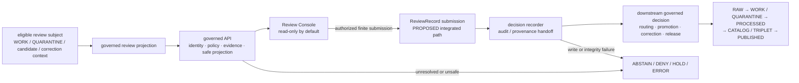
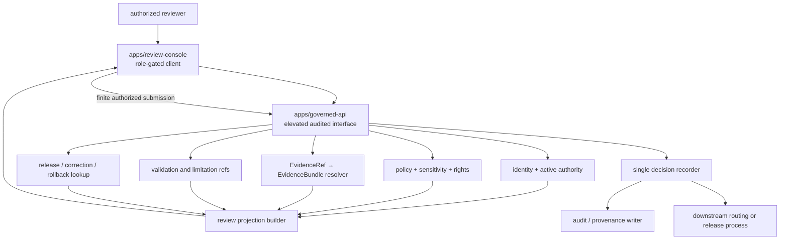

<!-- [KFM_META_BLOCK_V2]
doc_id: kfm://doc/architecture-ui-review-console
title: Review Console — Architecture
type: architecture-reference
version: v2.0
status: draft; repository-grounded; documentation-only; implementation-hold; non-publisher
owners:
  - "@bartytime4life — verified CODEOWNERS review route"
  - "NEEDS VERIFICATION — independent review, policy, sensitivity, evidence, audit, release, correction, rollback, security, accessibility, and domain stewardship"
created: 2026-05-14
updated: 2026-08-19
policy_label: public; architecture; restricted-review-surface; no-direct-public-path; no-release; no-publication
owning_root: docs/
responsibility: Explain the repository-confirmed Review Console boundary, current documentation and fixture proof, proposed governed review flow, authority separations, validation burden, graduation gates, and rollback without becoming application, contract, schema, policy, review, evidence, audit, lifecycle, release, correction, rollback, deployment, or publication authority.
truth_posture: cite-or-abstain; current-state claims are pinned to repository evidence; integrated review runtime, routes, DTOs, actor authority, policy enforcement, deployment, and public-operation claims remain bounded
current_path: docs/architecture/ui/REVIEW_CONSOLE.md
evidence_snapshot:
  repository: bartytime4life/Kansas-Frontier-Matrix
  base_ref: main
  base_commit: 75849a09b2d18113a9a9b6c78332b83d19eb5832
  target_prior_blob: 66d26b283633989418103a21d2d9dc78e767734e
  codeowners_blob: dd2a84aa514d8ecd9208bc347f90f9a2ed37dd61
  review_console_readme_blob: 02512b6b8d16a8f1dfcd4c564f8b6d68b61b49e3
  review_console_package_blob: 9c83b3dee793e2428a33c4aae072e668f1c2a4f8
  review_console_src_readme_blob: bb64035fbef9a4234e44d2bf5f261e3f1512d121
  review_console_src_tree: a04f0ea489839e3b8fd8742c22f3e08b7c661bf8
  explorer_readonly_entry_blob: 2b1ec636af1190bb1c7a357006f2c2ae616c60a6
  review_record_contract_blob: 9641345d1e5d939dc59687a900e60a563d92c4f0
  governance_review_schema_blob: fe2f2223af46481e7fb19b0baa94f62ce9c6c855
  review_scaffold_schema_blob: a053448d68e8379b92b12a16e6528275b975433c
  release_reviews_readme_blob: bf3058a5af8fc85aa04a25a36ed03541cd9eb657
related:
  - docs/architecture/ui/README.md
  - docs/doctrine/directory-rules.md
  - docs/adr/ADR-0029-adopt-directory-governance-standard-v2.md
  - docs/adr/ADR-0018-promotion-gate-sequence.md
  - docs/adr/ADR-0024-steward-separation-of-duties-for-release.md
  - docs/governance/REVIEW_DUTIES.md
  - apps/review-console/README.md
  - apps/review-console/src/README.md
  - apps/review-console/src/features/README.md
  - apps/explorer-web/src/features/review_console_readonly/README.md
  - apps/governed-api/README.md
  - apps/workers/src/quarantine_review_worker/README.md
  - contracts/governance/ReviewRecord.md
  - schemas/contracts/v1/governance/review_record.schema.json
  - schemas/contracts/v1/review/README.md
  - fixtures/contracts/v1/governance/review_record/README.md
  - tools/validators/validate_review_record.py
  - data/proofs/review/README.md
  - release/reviews/README.md
  - Makefile
tags: [kfm, ui, architecture, review-console, human-in-the-loop, quarantine, work, evidence, policy, sensitivity, review-record, audit, promotion, correction, rollback, finite-outcomes, fail-closed]
notes:
  - "v2.0 replaces the proposal-era no-repository posture with a pinned current-state architecture reference."
  - "The tracked Review Console application is a documentation scaffold: its package manifest has no scripts or dependencies, and its source tree contains README files rather than executable app source."
  - "The repository contains a bounded synthetic ReviewRecord validation slice for release-promotion fixtures; that slice is not an operational Review Console, actor registry, policy engine, review ledger, release approval, or publication path."
  - "The old claim that every reviewer decision is an EvidenceRef written into an EvidenceBundle is withdrawn. ReviewRecord, EvidenceRef, EvidenceBundle, PolicyDecision, PromotionDecision, release records, proofs, and audit references remain distinct object families."
[/KFM_META_BLOCK_V2] -->

<a id="top"></a>
<a id="review-console--architecture"></a>

# Review Console — Architecture

> **Current boundary.** Review Console is the proposed role-gated steward application for inspecting governed review projections and submitting bounded review records through an audited, policy-aware interface. The repository currently contains its architecture and feature documentation, a placeholder package, and separate synthetic ReviewRecord validation proof—not a working Review Console runtime.


| Field | Current repository-grounded value |
|---|---|
| **Placement authority** | Accepted [ADR-0029](../../adr/ADR-0029-adopt-directory-governance-standard-v2.md) and adopted [Directory Rules v2](../../doctrine/directory-rules.md) |
| **Review route** | `@bartytime4life` through CODEOWNERS; routing is not independent review, approval, release, or publication authority |
| **Deployable home** | [`apps/review-console/`](../../../apps/review-console/) |
| **Current app maturity** | Documentation scaffold and private `0.0.0` package manifest with no scripts or dependencies |
| **Current executable review proof** | Synthetic, no-network, fixture-only ReviewRecord validation used by a bounded release-promotion readiness profile |
| **Integrated queue, item, decision, audit, policy, identity, API, and deployment flow** | **NOT ESTABLISHED** |
| **Release/publication effect** | None |
| **Documentation rollback target** | Prior target blob `66d26b283633989418103a21d2d9dc78e767734e` |

> [!IMPORTANT]
> **Review is not release.** A `ReviewRecord` may support a policy, promotion, correction, rollback, or release process. It does not itself move an object between lifecycle states, approve publication, create evidence, alter an EvidenceBundle, issue a ReleaseManifest, or make an artifact public.

> [!CAUTION]
> **Review Console is restricted and fail-closed.** It must not become a normal public path, direct reader of canonical/internal stores, free-form payload editor, hidden administrative bypass, audit-ledger authority, or single-click publication surface.

**Jump to:**
[1 Scope](#1-scope) ·
[2 Repo fit](#2-repo-fit) ·
[3 Pipeline role](#3-role-in-the-pipeline) ·
[4 UI surfaces](#4-ui-surfaces) ·
[5 Inputs](#5-inputs) ·
[6 Exclusions](#6-exclusions) ·
[7 Components](#7-component-architecture) ·
[8 Contracts](#8-data-contracts) ·
[9 Permissions](#9-permissions--policy) ·
[10 Provenance](#10-audit--provenance) ·
[11 Ops](#11-operational-concerns) ·
[12 Tests](#12-test-surface) ·
[13 Open questions](#13-open-questions--needs-verification) ·
[14 Related](#14-related-docs) ·
[15 Appendix](#15-appendix)

---

## 1. Scope

Review Console is a **cross-lifecycle review-support surface**, not merely a screen for one physical quarantine folder.

Its intended scope is to let an authorized reviewer inspect a governed projection of an eligible review subject and, where a separately implemented policy and decision-recorder path permits it, submit a finite `ReviewRecord` or review recommendation. A review subject may be associated with:

- a `WORK` or `QUARANTINE` candidate;
- evidence, validation, citation, source-role, identity, rights, or sensitivity closure;
- promotion-readiness review for a processed or catalog candidate;
- correction, withdrawal, supersession, or rollback context;
- an AI, map, export, story, source, schema, policy, contract, or documentation change whose consequence requires accountable review.

The console's scope is bounded by five rules:

1. **Governed projection only.** The browser receives an audience- and role-appropriate projection through a governed interface; it does not browse lifecycle stores directly.
2. **Read-only by default.** Queue, detail, evidence, spatial, history, promotion, correction, rollback, and sensitivity surfaces remain read-only unless one explicit decision affordance is admitted.
3. **Single review-write boundary.** Any mutating review submission goes through one policy-gated, audited decision-recorder interface. The UI never writes lifecycle, evidence, proof, release, or canonical records directly.
4. **No authority collapse.** Review records, evidence, policy decisions, promotion decisions, release manifests, corrections, rollback records, receipts, proofs, and audit references retain distinct meanings and homes.
5. **No implied transition.** A review disposition may recommend, block, hold, or support a next step. A downstream governed process owns any actual lifecycle, promotion, correction, rollback, release, or publication transition.

> [!NOTE]
> The proposal-era statement that Review Console is “the only human adjudication surface” is withdrawn. KFM has review obligations across source admission, domain stewardship, sensitivity, policy, release, correction, AI, documentation, and other lanes. Review Console may compose some of those workflows; it does not own every review duty.

[Back to top](#top)

---

## 2. Repo fit

### 2.1 Directory Rules basis

This same-path document belongs under `docs/architecture/ui/` because it explains a cross-cutting UI/application boundary to humans. Accepted ADR-0029 adopts Directory Rules v2 and keeps the owning responsibilities separate:

| Responsibility | Owning root or lane | Review Console relationship |
|---|---|---|
| Human architecture explanation | `docs/architecture/ui/` | This document |
| Role-gated deployable | `apps/review-console/` | Candidate application home |
| Governed network boundary | `apps/governed-api/` | Required interface for dynamic review projections and submissions |
| Public/semi-public read-only UI | `apps/explorer-web/` | Separate consumer; never a mutating review path |
| Semantic meaning | `contracts/` | Defines `ReviewRecord` and adjacent object meaning |
| Machine shape | `schemas/` | Defines accepted payload constraints |
| Admissibility and obligations | `policy/` | Owns access, rights, sensitivity, review, and release policy |
| Lifecycle records, receipts, and proofs | `data/` | Remain outside the app |
| Release, correction, withdrawal, rollback | `release/` | Separate authority and state-transition records |
| Executable validation | `fixtures/`, `tests/`, `tools/validators/`, workflows | Proves bounded behavior only |

No new root, contract family, schema family, policy home, proof lane, release lane, or runtime authority is created by this update.

### 2.2 Confirmed current repository state

| Surface | Current evidence | Safe conclusion |
|---|---|---|
| [`docs/architecture/ui/REVIEW_CONSOLE.md`](./REVIEW_CONSOLE.md) | Tracked proposal-era v0.1 document | Same-path modernization is appropriate; old implementation claims require correction |
| [`apps/review-console/package.json`](../../../apps/review-console/package.json) | Private package, version `0.0.0`, no scripts, no dependencies | No buildable Review Console app is established |
| [`apps/review-console/src/`](../../../apps/review-console/src/) | Root README plus feature directories containing READMEs only | Architecture/feature documentation exists; executable app source is not present in the pinned tree |
| Feature lanes | `queue`, `record_view`, `audit_log`, `sensitivity_review`, `promotion`, `correction`, and `rollback` READMEs | Named feature boundaries are documented; components, routes, hooks, stores, and tests are not established |
| Explorer read-only review entry | One `index.tsx` exporting `placeholder = true` | Public/semi-public read-only review UI is a placeholder, not a functioning feature |
| Governed API | Minimal bootstrap, evidence, layer, and registry route code; no review route in the pinned source tree | No current queue, item, review-submission, or audit-projection API may be claimed |
| Quarantine review worker | One placeholder `main.py` plus README | No automated review-routing worker is established |
| [`contracts/governance/ReviewRecord.md`](../../../contracts/governance/ReviewRecord.md) | Draft semantic contract with rich proposed meaning and anti-collapse rules | `ReviewRecord` is the current semantic review concept, but not accepted runtime authority |
| Governance ReviewRecord schema | Closed, non-empty, status `PROPOSED` | A bounded machine shape exists; operational adoption and contract parity remain unresolved |
| Review-family ReviewRecord schema | Empty permissive scaffold with `contract_doc: null` | Parallel-profile drift exists; this scaffold must not be treated as authoritative review shape |
| Governance fixtures | Two valid JSON fixtures and three invalid JSON fixtures with expected errors | Schema-level fixture evidence exists |
| Dedicated ReviewRecord validator | Bounded synthetic promotion-fixture validator with finite outcomes, identity/authority/time/scope/hash checks, no network, and no writes | Stronger fixture proof exists; it does not authenticate actors, issue review records, or operate Review Console |
| [`release/reviews/`](../../../release/reviews/README.md) | Guidance-only release-review lane | No parent-level governed release ReviewRecord is established |
| [`data/proofs/review/`](../../../data/proofs/review/README.md) | README-only review-proof support lane | No operational review-proof payload or producer is established |

### 2.3 Evidence order

For this architecture:

1. Accepted ADRs and adopted Directory Rules control placement and decision status.
2. Current code, manifests, schemas, fixtures, validators, tests, workflows, and emitted records control implementation claims.
3. App and feature READMEs document intended boundaries and known gaps.
4. Older architecture prose is design lineage, not runtime proof.

When adjacent documentation conflicts with current code or a stronger artifact, this document records the conflict rather than silently choosing the most polished prose.

[Back to top](#top)

---

## 3. Role in the pipeline

Review Console does not sit *inside* one storage transition and does not move files. It is a governed human-review client that can support multiple decision points while the lifecycle remains owned by pipelines, policy, evidence, review records, and release controls.


```mermaid
flowchart LR
  CAND["eligible review subject\nWORK / QUARANTINE / candidate / correction context"]
  PROJ["governed review projection"]
  API["governed API\nidentity · policy · evidence · safe projection"]
  RC["Review Console\nread-only by default"]
  RR["ReviewRecord submission\nPROPOSED integrated path"]
  REC["decision recorder\naudit / provenance handoff"]
  NEXT["downstream governed decision\nrouting · promotion · correction · release"]
  LIFE["RAW → WORK / QUARANTINE → PROCESSED\n→ CATALOG / TRIPLET → PUBLISHED"]
  HOLD["ABSTAIN / DENY / HOLD / ERROR"]

  CAND --> PROJ --> API --> RC
  RC -->|"authorized finite submission"| RR --> REC --> NEXT --> LIFE
  API -->|"unresolved or unsafe"| HOLD
  REC -->|"write or integrity failure"| HOLD
```

Every arrow after the governed projection remains **PROPOSED as an integrated runtime flow**. Current repository evidence proves only documentation scaffolds and selected synthetic ReviewRecord validation behavior.

### 3.1 Review effects are recommendations or support

A review disposition may:

- support routing a candidate for further processing;
- request changes or additional evidence;
- hold or abstain because support is incomplete;
- deny a proposed action within the reviewer's policy scope;
- escalate to a different role or sensitivity lane;
- support release-readiness review without issuing release;
- support correction or rollback review without executing either action;
- provide informational context with no state-changing effect.

The downstream owner must independently verify that the required policy, evidence, review, integrity, lifecycle, and release gates are satisfied before acting.

### 3.2 No direct state mutation

The console must never directly:

- copy an item from `QUARANTINE` to `WORK`;
- promote a record to `PROCESSED` or `CATALOG / TRIPLET`;
- write to `PUBLISHED`;
- modify an EvidenceBundle;
- issue a PolicyDecision, PromotionDecision, ReleaseManifest, CorrectionNotice, WithdrawalNotice, or RollbackCard;
- edit, delete, reorder, backdate, or silently suppress prior review or audit records.

[Back to top](#top)

---

## 4. UI surfaces

The repository documents the feature families below. At the pinned snapshot, each Review Console feature lane contains a README rather than executable feature code.

| Surface | Intended purpose | Write posture | Current maturity |
|---|---|---|---|
| **Queue** | Role-gated list of eligible review subjects with bounded priority, age, assignment, policy, and validator summaries | Read-only | README only |
| **Record view** | Subject identity, normalized preview, lifecycle context, validation findings, limitations, and related references | Read-only | README only |
| **Evidence context** | Resolved EvidenceRef/EvidenceBundle references and public-safe limitations | Read-only; no bundle mutation | Described by parent docs; no feature module established |
| **Spatial context** | Governed map context when geometry materially helps review | Read-only; no restricted-coordinate leakage | Described conceptually; no Review Console map implementation established |
| **Decision surface** | One finite review submission with reason, obligations, scope, and basis references | Sole candidate write affordance; policy-gated | No implementation or route established |
| **Audit log** | Review history and audit/provenance projection | Read-only; never canonical ledger | README only |
| **Sensitivity review** | Rights, sovereignty, privacy, ecological, archaeological, infrastructure, living-person, and location-exposure support | Review recommendation only | README only |
| **Promotion review** | Inspect promotion-readiness support and outstanding gates | No promotion authority | README only |
| **Correction review** | Inspect proposed correction and affected released context | No correction execution | README only |
| **Rollback review** | Inspect rollback target, impact, and readiness | No rollback execution | README only |
| **Safe states** | Loading, empty, denied, restricted, abstained, held, stale, superseded, malformed, and error states | No hidden fallback to allow | Proposed across app docs |

### 4.1 Public read-only review is a separate surface

[`apps/explorer-web/src/features/review_console_readonly/`](../../../apps/explorer-web/src/features/review_console_readonly/) is a separate compatibility/read-only concept. Its current entrypoint exports only a placeholder boolean. It must not share Review Console's mutating decision path, reviewer credentials, restricted queue metadata, or internal reason details.

### 4.2 Accessibility and trust-visible behavior

A mature surface must provide:

- keyboard-complete queue, detail, map-context, decision, and history navigation;
- explicit focus management after modal, drawer, or map interactions;
- non-color status text for policy, evidence, stale, denial, and review states;
- accessible names and descriptions for every decision and obligation;
- confirmation that repeats the exact bounded action without exposing protected content;
- no auto-submit, gesture-only approval, hidden default approval, or time-limited decision trap;
- equivalent non-map inspection for every spatially supported decision;
- visible distinction between a review recommendation and downstream release or lifecycle state.

[Back to top](#top)

---

## 5. Inputs

All inputs are governed projections or references. Review Console must not receive unrestricted canonical records merely because a reviewer has an elevated role.

| Input family | Minimum purpose | Required posture |
|---|---|---|
| Review-subject identity | Stable subject reference, object family, version/digest, review scope | Deterministic where practical; no browser-invented identity |
| Queue eligibility | Why the subject is reviewable, assignment lane, priority, age, current lifecycle/release context | Server-derived; finite reason codes; no sensitive count leakage |
| Normalized preview | Bounded fields needed to understand the subject | Redacted, role-aware, purpose-limited |
| Validation state | Validator outcomes, safe finding summaries, limitations, fixture/profile identity where relevant | Referenced; a pass is not truth or approval |
| Evidence state | EvidenceRef list, EvidenceBundle resolution status, source refs, citations, limitations | Resolver-backed; no unresolved evidence presented as support |
| Policy state | Access, rights, sensitivity, purpose, audience, obligations, deny/hold posture | Policy-runtime derived; unknown fails closed |
| Reviewer context | Authenticated actor identity, active role, scope, clearance, assignment, separation-of-duty state | Server authoritative; no client-only role claims |
| Time context | Subject validity, observation/retrieval time, review time, expiry, stale/supersession state | Distinct clocks remain visible where material |
| Spatial context | Public-safe or reviewer-authorized geometry, scale, transform/generalization notes | No style-only protection; harmful precision excluded upstream |
| Release context | Candidate, manifest, promotion, correction, withdrawal, rollback, and public-state references | Required only when the review actually touches those concerns |
| Audit/provenance context | Prior ReviewRecord IDs, receipt/proof refs, sequence/supersession state | Read-only projection; append-only or correction-aware semantics |

### 5.1 Input admission order

Before displaying a subject or enabling a decision, the server-side path should establish:

```text
request identity and purpose
  → actor authentication and active authority
  → subject identity and eligibility
  → policy, rights, and sensitivity evaluation
  → evidence and validation reference resolution
  → release/correction/rollback context where applicable
  → public-safe or role-safe projection
  → finite UI state and permitted actions
```

The browser must not fill a missing stage with cached data, optimistic assumptions, or generated prose.

[Back to top](#top)

---

## 6. Exclusions

| Excluded behavior | Why it is excluded | Correct owner or action |
|---|---|---|
| Free-form source or normalized-payload editing | Breaks source identity and provenance | Governed pipeline correction or candidate-delta flow |
| Direct lifecycle-store queries | Bypasses the trust membrane and projection policy | Governed API or explicitly released safe carrier |
| Source activation, retrieval, or ingestion | Review UI is not a connector | `connectors/`, `pipelines/`, source admission |
| Contract, schema, or policy authoring inside the UI | Conflates description, shape, and admissibility | `contracts/`, `schemas/`, `policy/` with normal review |
| EvidenceBundle mutation | Review is an assessment of evidence, not evidence creation | Evidence-owning workflows and resolvers |
| Direct promotion, release, correction, withdrawal, or rollback | Review does not own state transitions | Governed downstream release/correction processes |
| Public browsing of restricted review data | Queue and denial metadata can itself be sensitive | Restricted Review Console projection only |
| Reviewer-role administration | Creates an unsafe self-grant path | Governed identity/authority administration outside normal review flow |
| Hidden “lead” or “admin” override | Unverified role names and bypass semantics | Accepted policy and separation-of-duty mechanism |
| Direct model/runtime calls | Generated language cannot authorize review | Governed AI path behind API, evidence, and policy |
| Canonical audit-log mutation | A display surface cannot rewrite history | Governed audit/provenance writer and correction semantics |
| Style-only hiding of sensitive coordinates | Protected bytes still reach the client | Upstream transform, exclusion, generalization, or denial |
| Bulk historical reclassification through one click | Consequence and review scope become opaque | Dedicated governed batch process with fixtures, receipts, review, and rollback |

Any proposal that adds one of these capabilities is an architecture and governance change, not a routine UI enhancement.

[Back to top](#top)

---

## 7. Component architecture

### 7.1 Target dependency direction


```mermaid
flowchart TB
  USER["authorized reviewer"]
  UI["apps/review-console\nrole-gated client"]
  API["apps/governed-api\nelevated audited interface"]
  ID["identity + active authority"]
  POL["policy + sensitivity + rights"]
  EVD["EvidenceRef → EvidenceBundle resolver"]
  VAL["validation and limitation refs"]
  REL["release / correction / rollback lookup"]
  READ["review projection builder"]
  WRITE["single decision recorder"]
  AUD["audit / provenance writer"]
  DOWN["downstream routing or release process"]

  USER --> UI --> API
  API --> ID
  API --> POL
  API --> EVD
  API --> VAL
  API --> REL
  ID --> READ
  POL --> READ
  EVD --> READ
  VAL --> READ
  REL --> READ
  READ --> UI
  UI -->|"finite authorized submission"| API --> WRITE
  WRITE --> AUD
  WRITE --> DOWN
```

### 7.2 Authority by component

| Component | May own | Must not own | Current state |
|---|---|---|---|
| Review Console client | Presentation, local transient UI state, validated request composition | Actor authority, policy, evidence truth, canonical state, release | Not implemented |
| Governed review projection | Bounded queue/item/detail/audit response DTO | Canonical payload or unrestricted internal records | No review route established |
| Identity/authority resolver | Current actor and assignment facts | Review outcome or release | Exact operational component not established |
| Policy runtime | Allow, deny, restrict, abstain, obligations, safe reason | Evidence truth or release by itself | Review Console integration not established |
| Evidence resolver | Resolve EvidenceRef to EvidenceBundle within policy | Human review or release | Repository package exists separately; console integration not established |
| Decision recorder | Validate and persist the accepted review-record profile and references | Lifecycle/release transition by implication | No integrated implementation established |
| Audit/provenance writer | Append or supersede governed event history | Review correctness or release approval | Operational writer and canonical ledger not established |
| Downstream orchestrator | Interpret admitted review effects within its own gates | Treat UI submission as automatic authority | No integrated review route established |

### 7.3 Failure boundary

A failure in identity, authority, policy, evidence resolution, review-shape validation, audit/provenance persistence, or downstream handoff must produce a finite negative state. The client must not retry a state-changing request blindly or display success before durable acceptance is confirmed.

[Back to top](#top)

---

## 8. Data contracts

This page does not define field-level schemas. It records the current object-family relationships and known drift that block an integrated Review Console contract.

### 8.1 Object-family separation

| Object family | Meaning | Review Console relationship | Not equivalent to |
|---|---|---|---|
| `ReviewRecord` | Who reviewed what, in which role and scope, against which basis, with what disposition and conditions | Candidate outbound review object | Evidence, policy, promotion, release, audit proof |
| `EvidenceRef` | Reference used to resolve supporting evidence | Inbound basis reference when material | A review decision |
| `EvidenceBundle` | Resolved evidence support and limitations | Read-only support context | ReviewRecord or release authority |
| `PolicyDecision` | Admissibility, restrictions, obligations, or denial | Server-derived input and gate | Human review record |
| `ValidationReport` | Deterministic validation result and limitations | Read-only input | Truth, policy, or approval |
| `ReviewAuthorityBinding` or equivalent | Actor-role-scope-currentness support | Required basis where authority matters | CODEOWNERS or a client role label |
| `PromotionDecision` | Governed decision about advancement readiness | Possible downstream relation | ReviewRecord or ReleaseManifest |
| `ReleaseManifest` | Record of a governed released set | Read-only context when applicable | Review recommendation |
| `CorrectionNotice` / withdrawal / rollback record | Post-release change and reversal semantics | Read-only review context or downstream relation | A UI edit |
| Review proof | Compact support binding review basis, closure, expiry, and references | Possible downstream proof/index | The review event itself |
| Audit/provenance event | Durable event history | Read-only history and recorder reference | Review correctness or evidence truth |

> [!IMPORTANT]
> The previous architecture claimed that every reviewer decision was an `EvidenceRef` written into an `EvidenceBundle`. That claim conflicts with the current `ReviewRecord` semantic contract and KFM object-family separation. It is removed in v2.0.

### 8.2 Current contract and vocabulary drift

| Surface | Current vocabulary or shape | Conflict |
|---|---|---|
| Draft semantic contract | `approve`, `approve_with_conditions`, `request_changes`, `abstain`, `deny`, `escalate`, `informational` | Richer than current closed schema |
| Governance ReviewRecord schema | `decision`: `approve`, `reject`, `request_changes`; role: `steward`, `reviewer`, `auditor` | Does not carry the full semantic roster or app candidate families |
| Review-family schema | Empty `properties`, `additionalProperties: true`, no contract binding | Parallel permissive scaffold |
| Review Console app README | `APPROVE_ROUTE`, `REJECT_ARCHIVE`, `DEFER_HOLD`, `ANNOTATE_ONLY`, `ESCALATE` | UI-oriented families not aligned to schema enum |
| Release-review README | `READY_FOR_DECISION`, `READY_FOR_MANIFEST`, hold/repair/superseded/no-action outcomes | Release-readiness review, not general ReviewRecord disposition |
| Governance schema metadata | Points to lowercase `contracts/governance/review_record.md` | Tracked semantic file is case-sensitive `ReviewRecord.md` |

**Integrated decision DTO status: HOLD.** The repository has useful components, but it does not yet expose one accepted, versioned Review Console request/response profile that reconciles semantic meaning, machine shape, policy, authority, audit, and downstream effects.

### 8.3 Required integrated profile

Before a real decision endpoint is admitted, the owning contract/schema/policy work should close at least:

- subject identity, version, digest, and bounded review scope;
- actor identity, active role, authority basis, and separation-of-duty state;
- evidence, validation, policy, sensitivity, rights, release, and rollback references as applicable;
- one finite disposition vocabulary and explicit downstream-effect vocabulary;
- reasons, obligations, conditions, expiry, stale state, and supersession;
- idempotency key, replay protection, expected prior state, and concurrency behavior;
- audit/provenance acceptance reference;
- public-safe error and denial reason profile;
- deterministic or stable review identity;
- correction and invalidation behavior for an erroneous review.

The architecture document may explain that profile after it is accepted. It must not create it by example payload.

[Back to top](#top)

---

## 9. Permissions & policy

### 9.1 Current authority facts

- CODEOWNERS routes repository review to `@bartytime4life`; it does not authenticate a Review Console actor or prove independent review.
- [`docs/governance/REVIEW_DUTIES.md`](../../governance/REVIEW_DUTIES.md) contains a draft role and separation-of-duties model; its role catalogue and matrix remain proposed.
- [ADR-0024](../../adr/ADR-0024-steward-separation-of-duties-for-release.md) remains proposed and explicitly records the absence of verified operational actor assignments and independent release authority.
- [ADR-0018](../../adr/ADR-0018-promotion-gate-sequence.md) remains proposed even though bounded A–G readiness validators and workflows exist.

The old Viewer / Reviewer / Lead reviewer / Admin matrix is therefore removed. Role names, scopes, clearance, override rules, and quorum must come from an accepted identity, authority, and policy surface—not this page.

### 9.2 Server-side authorization sequence

For every queue read, detail read, evidence resolution, history view, export, or review submission:

1. authenticate the actor and request context;
2. resolve an active authority assignment for the exact scope;
3. check author/reviewer separation where required;
4. evaluate purpose, audience, rights, sensitivity, policy, and subject state;
5. resolve only the references needed for the permitted projection;
6. return permitted actions as server-derived capabilities;
7. re-evaluate the complete state on submission;
8. reject stale, replayed, superseded, unauthorized, or policy-changed requests;
9. record a public-safe finite outcome without exposing protected reasons.

Client-side disabled buttons are usability hints, not authorization controls.

### 9.3 Mandatory denial or hold conditions

A review view or action must fail closed when any material condition is unresolved, including:

- actor identity, current role, authority scope, or separation of duties;
- subject identity, version, current lifecycle state, or expected prior state;
- rights, sovereignty, cultural permission, consent, privacy, or source terms;
- exact rare-species, archaeology, infrastructure, private-land, living-person, genomic, or other harmful precision;
- EvidenceRef resolution, EvidenceBundle limitations, validation state, or source-role conflict;
- required policy, release, correction, withdrawal, or rollback context;
- review schema/profile version, reason vocabulary, obligation handling, expiry, or audit target;
- safe projection, safe error, or transport integrity.

### 9.4 No sensitive-reason oracle

Negative responses must use bounded public-safe or reviewer-safe reason families. They must not reveal:

- whether a protected subject exists at a specific location;
- hidden field names, raw validator values, internal paths, query text, or object-store keys;
- another reviewer's private identity or clearance details;
- source credentials, unpublished rights terms, restricted evidence, or redaction thresholds;
- enough count, timing, cache, or pagination detail to reconstruct a protected queue.

[Back to top](#top)

---

## 10. Audit & provenance

### 10.1 The review record is the review event

A mature review submission should result in a governed `ReviewRecord` or accepted equivalent. That record should reference the evidence, validation, policy, authority, release, correction, rollback, and process artifacts that formed its basis. It must not copy those objects into itself or replace them.

### 10.2 Audit support remains separate

| Concern | Required separation |
|---|---|
| Review event | Semantic and machine `ReviewRecord` authority |
| Review basis | Evidence, validation, policy, authority, source, and release references |
| Review proof | Compact support for closure, expiry, identity, and bindings where an accepted profile requires it |
| Audit/provenance history | Durable event or ledger projection, append/correction semantics, sequence and supersession |
| Routing or release effect | Downstream governed decision and state transition |
| Process receipt | Evidence that a tool/process ran; not proof that review was correct |

The current [`data/proofs/review/`](../../../data/proofs/review/README.md) lane is README-only, and the current [`release/reviews/`](../../../release/reviews/README.md) parent is guidance-only. No operational review ledger, review-proof producer, or parent-level release ReviewRecord is established.

### 10.3 Single write path and durable acceptance

The proposed integrated path should provide:

- one server-side decision recorder;
- schema, policy, actor-authority, subject-state, and idempotency validation;
- an atomic or compensatable write of the review record and audit/provenance acceptance reference;
- no optimistic “success” until durable acceptance is confirmed;
- safe replay returning the already accepted result rather than duplicating review;
- explicit conflict when the subject or required policy context changed;
- append-only correction or supersession rather than mutation of prior history;
- downstream handoff that cannot reinterpret a failed or partial write as approval.

### 10.4 Audit failure behavior

If the required review record or audit/provenance acceptance cannot be durably written, the mutating request returns `ERROR` or an accepted fail-closed equivalent. The UI remains read-only and must not show the subject as approved, routed, released, corrected, or rolled back.

[Back to top](#top)

---

## 11. Operational concerns

No Review Console deployment, authentication integration, queue service, decision route, audit ledger, dashboard, service-level objective, or production telemetry was verified for this update. The table below is a **PROPOSED operational burden**, not current behavior.

| Concern | Required posture before operation |
|---|---|
| Authentication | Phishing-resistant or otherwise risk-appropriate authentication; session binding; reauthentication for consequential actions |
| Authorization | Server-side actor-role-scope checks on every request and submission |
| CSRF and request integrity | Same-site protections, anti-CSRF for browser state changes, origin checks, and signed/validated request context where appropriate |
| Replay and concurrency | Idempotency keys, expected-state/version checks, stale/superseded rejection, duplicate-submit resistance |
| Transport and browser security | TLS, restrictive CSP, frame-ancestor protection, secure cookies, no unsafe inline secrets, controlled CORS |
| Queue confidentiality | No public counts, searchable protected metadata, unrestricted exports, or cache-shared reviewer responses |
| Sensitive geometry | Upstream exclusion/generalization; no browser delivery of denied precision |
| Untrusted content | Escape/sanitize source text, filenames, markup, URLs, and annotations; no HTML trust by default |
| Audit integrity | Durable acceptance, sequence/supersession semantics, tamper-evident or integrity-checked storage when required |
| Availability | Read-only degradation may be possible; mutating review fails closed when authority, policy, evidence, or audit dependencies are unavailable |
| Backpressure | Queue age/priority can be visible to authorized users; automation must not silently auto-approve to reduce backlog |
| Telemetry | Minimum necessary; no raw subject payload, exact protected geometry, reviewer secrets, or sensitive denial detail |
| Retention | Policy-owned retention and legal/sovereignty review; UI cache and export retention shorter than canonical governed records |
| Recovery | Reconcile partial failures, replay safely, preserve prior records, and expose unresolved handoff state |
| Operational ownership | Named on-call, security, privacy, policy, evidence, release, correction, and incident roles remain NEEDS VERIFICATION |

### 11.1 Threats that require explicit negative tests

- insecure direct object reference between review subjects;
- role or scope escalation through client parameters;
- self-review where independence is required;
- cross-tenant or cross-lane queue leakage;
- stale approval after subject, evidence, policy, or rights change;
- duplicate or reordered decisions;
- audit write succeeds but review write fails, or the reverse;
- unsafe reason, field, path, query, or geometry leakage through errors and logs;
- stored or reflected script injection from source payloads and annotations;
- clickjacking or approval through obscured UI;
- copied deep links that bypass current authorization;
- export, print, screenshot, browser cache, or service-worker persistence of restricted content;
- map selection revealing a protected subject through absence/presence, zoom limits, or timing;
- AI-generated rationale inserted as evidence or used to approve automatically.

[Back to top](#top)

---

## 12. Test surface

### 12.1 Confirmed bounded validation

The repository currently provides:

- a closed proposed governance ReviewRecord schema;
- two valid and three invalid governance ReviewRecord JSON fixtures;
- generic schema/contract fixture discovery;
- `tools/validators/validate_review_record.py`, which validates synthetic promotion-fixture ReviewRecord projections;
- finite candidate outcomes and explicit no-authority behavior;
- `make publish-check`, which runs the ReviewRecord and promotion-gate fixture checks plus focused release tests.

A green result proves only the bounded synthetic profile. It does not prove a Review Console app, live actor authentication, policy runtime, evidence resolution, review ledger, release authority, deployment, or public operation.

### 12.2 Required integrated test matrix

| Test family | Minimum cases |
|---|---|
| Repository boundary | Review Console has no imports or network paths to canonical/internal stores; public Explorer cannot import mutating review code |
| Authentication/authorization | unauthenticated, inactive assignment, wrong scope, expired authority, clearance mismatch, author/reviewer conflict, allowed reviewer |
| Queue projection | empty, ready, restricted, denied, stale, superseded, malformed, pagination, count suppression, assignment changes |
| Subject detail | evidence resolved, evidence missing, policy hold, validation conflict, sensitive fields removed, geometry generalized, source-role conflict |
| Contract | accepted ReviewRecord version, unknown field, unknown disposition, missing basis, open obligations, invalid time, stale review, duplicate ID |
| Submission | approve-like, request-changes, abstain/hold, deny, escalate, informational where admitted; exact downstream effect remains explicit |
| Replay/concurrency | double click, retry after timeout, same idempotency key, changed subject version, competing reviewer, superseded review |
| Audit/provenance | atomic acceptance, audit unavailable, partial failure, supersession, correction, immutable history, safe history projection |
| Release separation | review cannot issue PromotionDecision, ReleaseManifest, correction, withdrawal, rollback, or PUBLISHED state |
| Sensitive lanes | rare species, archaeology, infrastructure, living person, genomic, cultural/sovereign, private land, harmful precision; default deny or staged access |
| Error security | no raw payload, hidden field, internal path, credential, exact geometry, authority detail, or validator value leakage |
| Accessibility | keyboard-only completion, focus order/return, screen-reader labels, non-color states, reduced motion, map alternative, confirmation clarity |
| Browser security | CSRF, CSP, clickjacking, XSS, deep-link authorization, cache isolation, export restrictions |
| Recovery | durable acceptance acknowledgement, downstream handoff failure, reconciliation, safe retry, operator-visible unresolved state |

### 12.3 Repository-native commands

Current bounded commands relevant to the implemented synthetic profile are:

```bash
KFM_NO_NETWORK=1 PYTHONHASHSEED=0 PYTHONDONTWRITEBYTECODE=1 \
  PYTHONUNBUFFERED=1 TZ=UTC \
  python tools/validators/validate_review_record.py --fixtures

KFM_NO_NETWORK=1 PYTHONHASHSEED=0 PYTHONDONTWRITEBYTECODE=1 \
  PYTHONUNBUFFERED=1 TZ=UTC \
  python -m unittest -q tests.release.test_review_record

make publish-check
```

These commands are not Review Console end-to-end tests. A future app implementation needs app-local unit, integration, browser, accessibility, policy, API-boundary, and no-leak tests before this document can claim runtime maturity.

[Back to top](#top)

---

## 13. Open questions / NEEDS VERIFICATION

### P0 — authority and trust closure

1. Which semantic contract and schema path are canonical for `ReviewRecord`, and how will the permissive review-family scaffold be retired or profiled without breaking consumers?
2. What is the accepted disposition vocabulary, downstream-effect vocabulary, reason registry, obligation model, expiry model, and correction/supersession behavior?
3. Which actor-identity and authority-assignment service is authoritative, and how are role, scope, clearance, purpose, and separation of duties evaluated?
4. Which policy bundles govern queue visibility, evidence resolution, sensitive fields, geometry, review actions, exports, and safe denial reasons?
5. What is the canonical decision-recorder and audit/provenance write contract, storage authority, atomicity model, idempotency rule, and rollback/correction path?
6. Which actions are recommendations, which may create a review record, and which downstream processes may interpret each review effect?
7. Which accountable human roles own review, policy, sensitivity, evidence, audit, security, release, correction, rollback, accessibility, and incident response?

### P1 — smallest dependency-closed implementation slice

The first executable slice should remain synthetic and no-network:

```text
one public-safe synthetic review subject
  → one governed queue projection
  → one authorized reviewer context
  → evidence / validation / policy references
  → one finite ReviewRecord submission
  → one durable synthetic audit acceptance
  → one non-publishing routing recommendation
```

Required negative fixtures should include unauthorized actor, self-review where prohibited, missing authority, missing evidence, policy deny, stale subject, stale review, unknown field, unknown disposition, open obligation, audit failure, replay, and protected-detail leakage.

The slice must not activate sources, expose internal stores, create a public review route, promote lifecycle state, release, deploy, or publish.

### P2 — operational graduation

- select and admit the app framework, package scripts, dependencies, build, and deployment home;
- implement the governed API projection and submission routes with stable versioning;
- establish audit storage, integrity, retention, export, correction, and incident runbooks;
- prove accessibility, browser/device support, security testing, performance, queue backpressure, telemetry minimization, backup, recovery, and reconciliation;
- prove correction, withdrawal, rollback, and cache/search/map/AI propagation for review-dependent public state;
- document production ownership, service levels, alerting, dashboards, and decommissioning.

### 13.1 Graduation states

| State | Minimum evidence |
|---|---|
| **Documentation scaffold** | Current state: architecture and feature READMEs plus placeholder package |
| **Fixture proof** | Current bounded ReviewRecord/promotion synthetic validation |
| **Integrated candidate** | Accepted DTO/profile; synthetic queue-to-review-to-audit flow; negative tests; no network; no lifecycle/release effect |
| **Review-ready application** | Buildable app; governed API; actor/policy/evidence/audit integration; browser/accessibility/security tests |
| **Operational restricted service** | Deployment, monitoring, recovery, retention, incident response, accountable roles, policy enforcement, measured performance |
| **Release-significant reviewer surface** | Independent review/SoD enforcement, correction/rollback drills, public-state propagation, and governed adoption evidence |

No state is achieved by documentation, a badge, a schema file, a green fixture test, a pull request, or a deployment alone.

[Back to top](#top)

---

## 14. Related docs

### Current architecture and governance

- [UI subsystem architecture index](./README.md)
- [Accepted Directory Rules decision](../../adr/ADR-0029-adopt-directory-governance-standard-v2.md)
- [Adopted Directory Rules v2](../../doctrine/directory-rules.md)
- [Review duties and separation-of-duties reference](../../governance/REVIEW_DUTIES.md)
- [Proposed promotion-gate sequence ADR](../../adr/ADR-0018-promotion-gate-sequence.md)
- [Proposed release separation-of-duties ADR](../../adr/ADR-0024-steward-separation-of-duties-for-release.md)

### Application and delivery boundaries

- [Review Console app boundary](../../../apps/review-console/README.md)
- [Review Console source boundary](../../../apps/review-console/src/README.md)
- [Review Console feature index](../../../apps/review-console/src/features/README.md)
- [Explorer read-only review placeholder](../../../apps/explorer-web/src/features/review_console_readonly/README.md)
- [Governed API boundary](../../../apps/governed-api/README.md)
- [Quarantine review worker boundary](../../../apps/workers/src/quarantine_review_worker/README.md)

### Contracts, schemas, fixtures, validation, proofs, and release

- [`ReviewRecord` semantic contract](../../../contracts/governance/ReviewRecord.md)
- [Governance ReviewRecord schema](../../../schemas/contracts/v1/governance/review_record.schema.json)
- [Review schema-family index and overlap notes](../../../schemas/contracts/v1/review/README.md)
- [ReviewRecord fixture family](../../../fixtures/contracts/v1/governance/review_record/README.md)
- [Fixture-only ReviewRecord validator](../../../tools/validators/validate_review_record.py)
- [Review-proof support lane](../../../data/proofs/review/README.md)
- [Release-review lane](../../../release/reviews/README.md)
- [Repository orchestration targets](../../../Makefile)

All links above point to current repository paths. Their presence does not imply acceptance, runtime integration, release, deployment, or publication.

[Back to top](#top)

---

## 15. Appendix

### A. No-loss modernization ledger

| Prior v0.1 concept | v2.0 disposition |
|---|---|
| Human-in-the-loop review | **Retained and broadened carefully:** review support can attach to multiple governed contexts, not only one quarantine folder |
| Read-only queue, detail, evidence, spatial, and history surfaces | **Retained as proposed feature families; current README-only maturity made explicit** |
| One bounded mutating decision surface | **Retained as target architecture; implementation remains absent** |
| Free-form payload editing excluded | **Retained and strengthened** |
| Published artifact mutation excluded | **Retained and expanded to promotion, correction, withdrawal, and rollback separation** |
| Map context for spatial review | **Retained conditionally; no renderer/runtime claim and no sensitive-geometry delivery** |
| Fail closed when durable provenance is unavailable | **Retained; reframed as durable ReviewRecord plus audit/provenance acceptance rather than EvidenceBundle mutation** |
| Review decision is an EvidenceRef | **Removed as incorrect object-family collapse** |
| Every decision is written into an EvidenceBundle | **Removed; evidence is review basis, not the review event store** |
| Direct Review Console write to WORK | **Removed; downstream governed process owns state transition** |
| Viewer / Reviewer / Lead / Admin matrix | **Removed as invented authority vocabulary** |
| Placeholder pipeline/evidence/PROV/policy links | **Replaced with verified repository-relative links** |
| Review Console is the only human adjudication surface | **Removed; review duties span multiple lanes** |
| Illustrative outbound JSON as de facto shape | **Removed; integrated profile remains on HOLD pending contract/schema/policy reconciliation** |

### B. Finite state axes

Do not collapse these independent axes into one badge:

| Axis | Example states |
|---|---|
| Request/runtime | loading, ready, malformed, error |
| Access/policy | allow, restricted, deny, abstain, obligations |
| Subject lifecycle | work, quarantine, processed, catalog, published, corrected, withdrawn |
| Evidence | resolved, incomplete, stale, conflicted, denied |
| Review | unreviewed, pending, approved-like, changes requested, held, denied, escalated, superseded, expired |
| Downstream effect | none, routing candidate, promotion candidate, correction candidate, release candidate |
| Audit | accepted, pending, failed, superseded, integrity warning |

A UI may render a composed state only after preserving the underlying axes and their authorities.

### C. Anti-pattern register

| Anti-pattern | Why it fails |
|---|---|
| “Approve” button writes directly to lifecycle storage | UI bypasses policy, review record, audit, and downstream gates |
| ReviewRecord stored as EvidenceRef | Review event and evidence reference lose distinct semantics |
| Green schema fixture presented as operational review | Synthetic shape proof becomes actor/policy/runtime authority |
| Client role controls access | User-modifiable state becomes authorization |
| Lead/Admin override without accepted policy | Convenience creates hidden authority |
| Queue count exposed publicly | Presence and workload can reveal protected subjects or operations |
| Sensitive fields hidden with CSS | Protected bytes still reach the browser |
| Audit timeline editable in place | History becomes non-replayable and non-correctable |
| Review submission automatically publishes | Review and release collapse |
| AI drafts rationale and submits it automatically | Generated language becomes review authority |
| Missing dependency falls back to cached allow | Stale state defeats fail-closed posture |
| Documentation calls a route “current” before code/test evidence | Prose outruns implementation |

### D. Documentation validation and rollback

This update changes one architecture document only. It does not modify application code, contracts, schemas, policy, fixtures, validators, workflows, data, proof, release, deployment, or publication state.

Validation for this document should confirm:

- exactly one closed `KFM_META_BLOCK_V2`;
- balanced Markdown fences and Mermaid fences;
- unique section headings and retained legacy H1 anchor;
- all repository-relative links resolve at the pinned base;
- no unresolved placeholder route, owner identity, badge, schema, or test claim is introduced;
- the diff is limited to this file.

Rollback is exact and reversible: restore blob `66d26b283633989418103a21d2d9dc78e767734e`. No data migration, source deactivation, cache purge, review-record correction, release rollback, deployment rollback, or public notice is required for the documentation revert.

### E. Proof limits

This page establishes **architecture documentation**, not implementation. In particular, it does not prove:

- a Review Console app, route, component, API, worker, actor registry, policy engine, evidence resolver integration, audit ledger, or deployment;
- an accepted ReviewRecord profile or disposition vocabulary;
- accountable reviewer assignment, independent approval, release authority, or separation-of-duty enforcement;
- rights, sensitivity, privacy, sovereignty, security, accessibility, retention, performance, or operational readiness;
- lifecycle transition, promotion, release, correction, rollback, publication, or public operation.

[Back to top](#top)
