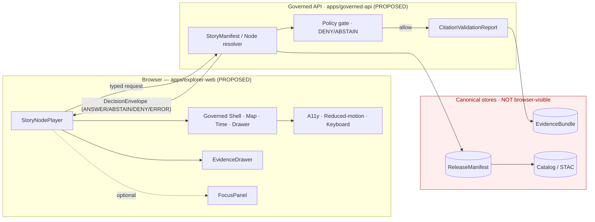
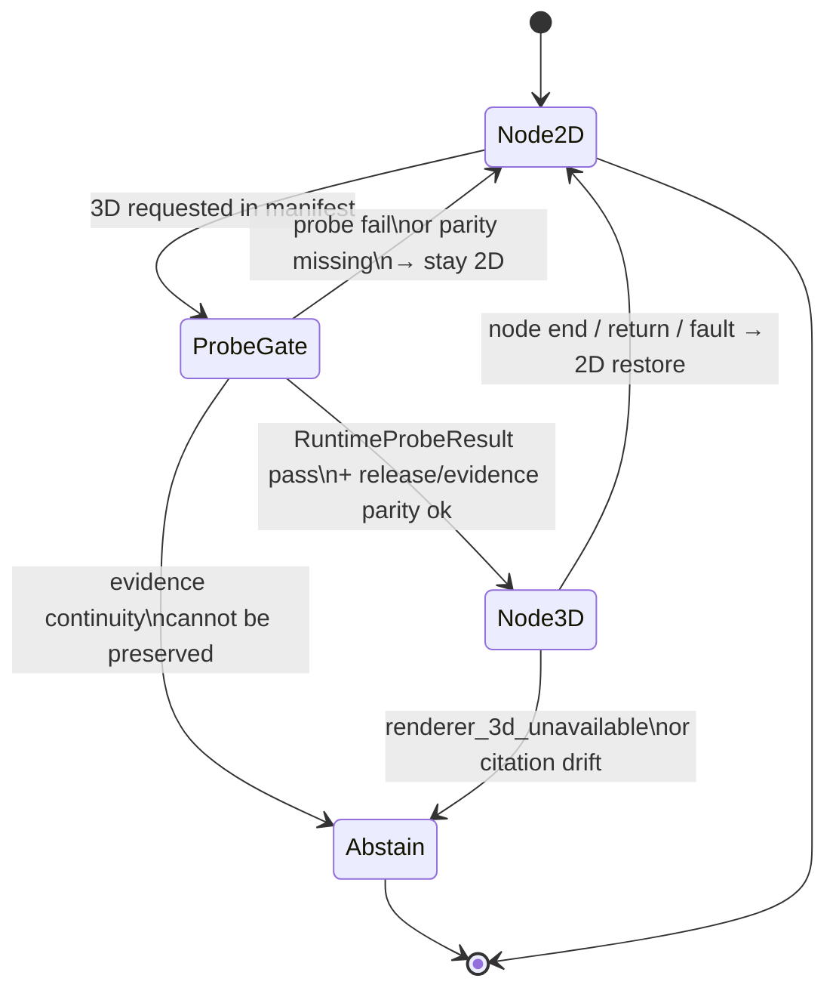

<!-- [KFM_META_BLOCK_V2]
doc_id: kfm://doc/docs-architecture-ui-story-player
title: Story Player — Architecture
type: standard
version: v1
status: draft
owners: [UI owner — PLACEHOLDER]; [Contract/schema steward — PLACEHOLDER]
created: 2026-05-14
updated: 2026-05-14
policy_label: public
related:
  - docs/architecture/ui/README.md
  - docs/architecture/story/README.md
  - docs/architecture/governed-ai/FOCUS_MODE.md
  - schemas/contracts/v1/story/story_manifest.schema.json
  - schemas/contracts/v1/story/story_node.schema.json
  - schemas/contracts/v1/runtime/decision_envelope.schema.json
tags: [kfm, ui, story-node, story-player, evidence, governed-ai]
notes:
  - PROPOSED placement under docs/architecture/ui/ per Directory Rules §4 (responsibility = explanation → docs/) and Whole-UI report §11 ("docs/architecture/ui/*", "docs/architecture/story/*").
  - All path claims PROPOSED until mounted-repo verification.
[/KFM_META_BLOCK_V2] -->

# Story Player — Architecture

> A 2D-first, evidence-bearing narrative surface that resolves every consequential story claim through the same governed envelopes and finite outcomes the rest of the Whole-UI uses. 3D is a burden-bearing handoff, not the default spectacle.

[](#status)
[](#1--scope)
[](#authority-and-evidence-basis)
[](#authority-and-evidence-basis)
[](#5--story-evidence-gate)
[](#6--2d-first-and-conditional-3d-handoff)

| Status | Owners | Last updated |
|---|---|---|
| `draft` | UI owner (PLACEHOLDER), Contract/schema steward (PLACEHOLDER) | 2026-05-14 |

> [!NOTE]
> No mounted repository was inspected in this session. Every file path, schema location, route name, and tool name in this document is **PROPOSED** per Directory Rules §0 and the repository preflight rule. Treat doctrine claims as authoritative; treat repo-state claims as design pressure until verified.

## Quick jump

- [1 · Scope](#1--scope)
- [2 · Repo fit](#2--repo-fit)
- [3 · Core invariants](#3--core-invariants)
- [4 · Runtime architecture](#4--runtime-architecture)
- [5 · Story evidence gate](#5--story-evidence-gate)
- [6 · 2D-first and conditional 3D handoff](#6--2d-first-and-conditional-3d-handoff)
- [7 · Object family](#7--object-family)
- [8 · Sensitivity, rights, and policy](#8--sensitivity-rights-and-policy)
- [9 · Accessibility obligations](#9--accessibility-obligations)
- [10 · Telemetry and receipts](#10--telemetry-and-receipts)
- [11 · Validation](#11--validation)
- [12 · Proposed file homes](#12--proposed-file-homes)
- [13 · Conflicts to resolve](#13--conflicts-to-resolve)
- [14 · Increment placement](#14--increment-placement)
- [15 · Open questions](#15--open-questions)
- [Appendix A · Illustrative fixtures](#appendix-a--illustrative-fixtures)
- [Related docs](#related-docs)

---

## 1 · Scope

This document specifies the **Story Player** subsystem of the Whole-UI: the runtime that plays sequenced `StoryNode` content over the persistent governed shell, preserving map, time, drawer, and evidence continuity at every step.

**In scope.**

- Story playback over the persistent map/time/drawer shell.
- The `StoryManifest` → `StoryNode` → `StoryTransition` → `StoryEvidenceGate` object family at the UI boundary.
- Finite outcomes (`ANSWER`, `ABSTAIN`, `DENY`, `ERROR`) at node-step granularity.
- 2D-first invariant and the conditional 3D handoff contract.
- Accessibility obligations specific to narrative animation.
- Validation, fixtures, telemetry, and rollback posture for the player.

**Out of scope.**

- Authoring tools for stories (separate doc, PROPOSED `docs/architecture/story/AUTHORING.md`).
- Cesium runtime internals (separate doc, PROPOSED `docs/architecture/ui/CESIUM_HANDOFF.md`).
- Focus Mode synthesis pipeline (see `docs/architecture/governed-ai/FOCUS_MODE.md`, PROPOSED).
- Release and promotion mechanics for story bundles (lives under `release/` doctrine).

[⬆ Back to top](#story-player--architecture)

---

## 2 · Repo fit

```text
docs/
└── architecture/
    └── ui/
        ├── README.md                       ← PROPOSED, lists this subsystem
        ├── SHELL.md                        ← PROPOSED, persistent shell
        ├── EVIDENCE_DRAWER.md              ← PROPOSED, drawer payload contract
        ├── STORY_PLAYER.md                 ← THIS FILE
        └── CESIUM_HANDOFF.md               ← PROPOSED, conditional 3D
```

> [!IMPORTANT]
> Per Directory Rules §4, a file's responsibility wins over its topic. The Story Player **doc** lives in `docs/architecture/ui/` because its responsibility is *explanation*. The Story Player **schemas** live in `schemas/contracts/v1/story/`. The **fixtures** live in `tests/fixtures/story/`. The **validator** lives in `tools/validators/story/`. The **UI component** lives in the deployable shell (`apps/explorer-web/...`, PROPOSED). These are five different roots; they MUST NOT collapse into a single `story/` root.

**Neighbors (upstream / downstream).**

| Direction | Subsystem | Why it matters |
|---|---|---|
| Upstream | Governed API (`apps/governed-api/`, PROPOSED) | Story content arrives only via governed envelopes; the player never reads RAW / WORK / QUARANTINE / canonical stores. |
| Upstream | `StoryManifest` schema (`schemas/contracts/v1/story/...`, PROPOSED) | Defines node sequence, scope, layer requirements, time windows, evidence and drawer refs, transition rules, return conditions, and optional 3D constraints. |
| Upstream | Evidence Drawer | The player opens drawer payloads; it never builds drawer state from rendered features. |
| Downstream | Review console | A played story's receipts are visible to stewards; release approval is deferred. |
| Downstream | Export panel | Story exports carry version lineage, citations, and finite-outcome state. |
| Sibling | Focus Mode | Story Nodes may use Focus outputs **only** with finite outcomes and validated citations; Focus output is never sovereign truth. |

[⬆ Back to top](#story-player--architecture)

---

## 3 · Core invariants

The following invariants govern every node step. They are derived from KFM doctrine, not from a mounted runtime; the runtime is **PROPOSED**.

> [!IMPORTANT]
> The story player is a **rendering and orchestration surface**, not a truth source. `EvidenceBundle` (resolved server-side from `EvidenceRef`) outranks any rendered feature, screenshot, narrative text, or 3D scene the player produces.

1. **Cite-or-abstain at every consequential claim.** Each node-level story claim that depends on evidence MUST resolve to a drawer payload backed by an `EvidenceBundle`. If resolution fails, the node renders `ABSTAIN` with a typed reason; it does not fabricate continuity.
2. **Finite outcomes are visible.** Every step emits one of `ANSWER`, `ABSTAIN`, `DENY`, `ERROR`. Cancellation, timeout, stale evidence, restricted material, and invalid citation states are typed reasons inside these outcomes — never hidden as generic failures.
3. **2D-first, 3D conditional.** The player MUST run 2D end-to-end. 3D is a burden-bearing companion mode that may only run when evidence/release/drawer continuity is preserved; otherwise the node falls back to 2D or `ABSTAIN`.
4. **Governed surface only.** The player consumes typed envelopes from the governed API. It MUST NOT read RAW, WORK, QUARANTINE, canonical processed stores, graph stores, object stores, vector indexes, or model runtimes directly. No raw prompts, secrets, or precise restricted coordinates may be embedded in the manifest.
5. **Context-only spatial disclosure for sensitive nodes.** Where rights, sovereignty, CARE status, archaeology, infrastructure, or living-person data apply, the node renders generalized context, not precise coordinates — or it denies.
6. **Reversible by feature flag.** The player ships behind a feature flag with fixture-only data and a kill switch on the 3D path; a revert PR fully removes the surface.

[⬆ Back to top](#story-player--architecture)

---

## 4 · Runtime architecture

The player runs over the persistent governed shell. Camera, layers, and time changes flow through the same `MapRuntimePort` adapter as the rest of the UI; nothing in the player creates an alternate path.



**Reading the diagram.** Solid arrows from the browser into the API go through typed envelopes. The dashed arrow to Focus indicates that Story Nodes MAY surface Focus output as narrative context, but only with finite outcomes and validated citations. The red region is **never** addressable from the browser; the trust membrane runs along the `Governed API` boundary.

> [!NOTE]
> Drawer-level fields, `EvidenceDrawerPayload` shape, and trust-badge inputs are specified in the Evidence Drawer architecture doc (PROPOSED `docs/architecture/ui/EVIDENCE_DRAWER.md`), not duplicated here.

[⬆ Back to top](#story-player--architecture)

---

## 5 · Story evidence gate

`StoryEvidenceGate` is the per-node closure check. It is logically separate from the runtime `DecisionEnvelope` because a single node may produce multiple consequential claims; the gate aggregates them into a node-level outcome and a list of typed reasons.

| Outcome | When the gate emits it | Player behavior |
|---|---|---|
| `ANSWER` | All consequential claims resolved to `EvidenceBundle`, citations validated, release state acceptable, freshness acceptable, policy allowed. | Render node. Drawer carries citations. Transitions enabled. |
| `ABSTAIN` | A claim has insufficient evidence, stale evidence, missing citation closure, or unverifiable lineage. | Render node skeleton with a typed `ABSTAIN` card; transitions to dependent nodes remain blocked. |
| `DENY` | Policy gate denied: rights unknown, sensitivity non-public, CARE restrictions, sensitive geometry, living-person constraints, or unsupported rollback. | Render typed `DENY` card with reason codes; no payload. Generalization or staged-access guidance may be shown. |
| `ERROR` | System fault: schema invalid, adapter failure, citation validator error, transport failure. | Render typed `ERROR` card; the manifest is **not** treated as bad data by default — surface the fault, log a `SafeDiagnosticEvent`. |

Representative reason codes the gate MAY emit (illustrative; the canonical list lives in the schema):

```text
evidence_missing            citation_invalid           release_unpublished
freshness_stale             policy_denied              rights_unknown
sensitivity_non_public      care_restricted            living_person_constraint
geometry_too_precise        renderer_3d_unavailable    timeout
cancelled
```

[⬆ Back to top](#story-player--architecture)

---

## 6 · 2D-first and conditional 3D handoff

3D is a Story Node mode, not a replacement for the 2D shell. The handoff is explicit: the node enters 3D only when a runtime probe and evidence-parity check pass; otherwise it stays in 2D or abstains. On return, the player restores the 2D shell with camera, time, and layer state preserved.



**Doctrinal anchors for the handoff.**

- Cesium / 3D, where present, consumes the **same** `EvidenceBundle` and `DecisionEnvelope` as 2D — it is an alternate renderer, not an alternate truth path (per Directory Rules §11 and the Whole-UI report §19.3).
- 3D assets (terrain tilesets, GLB/GLTF, CZML, camera paths) MUST carry SHA-256 checksums, STAC extensions, temporal anchors, and alt text — the same provenance discipline 2D layers carry.
- If the 3D renderer cannot preserve evidence/release/drawer continuity, the node falls back to 2D or `ABSTAIN`. The renderer never silently degrades to a lower-evidence mode.

> [!WARNING]
> 3D MUST NOT become canonical truth or bypass the Evidence Drawer. A picked feature in 3D resolves through the same schema-backed metadata path as a click in 2D.

[⬆ Back to top](#story-player--architecture)

---

## 7 · Object family

The Story object family is one of the schema waves listed in the Whole-UI expansion. All schema paths are **PROPOSED** until verified against repo evidence.

| Object | Proposed schema path | Purpose |
|---|---|---|
| `StoryManifest` | `schemas/contracts/v1/story/story_manifest.schema.json` | Story-level sequence, scope, required layers, time windows, drawer refs, transition rules, return conditions, and optional 3D constraints. |
| `StoryNode` | `schemas/contracts/v1/story/story_node.schema.json` | Node-level camera/time/layer/evidence continuity, claim list, drawer refs, and transition requirements. |
| `StoryTransition` | `schemas/contracts/v1/story/story_transition.schema.json` (PROPOSED) | Transition rule between nodes: trigger, easing budget, evidence-continuity assertion, fallback behavior. |
| `StoryEvidenceGate` | `schemas/contracts/v1/story/story_evidence_gate.schema.json` (PROPOSED) | Per-node aggregate gate object: outcome, reason codes, obligations, citation closure summary. |

### 7.1 StoryNode fields (illustrative)

The Master MapLibre dossier characterizes Story Nodes as atomic narrative units carrying spatial footprint, temporal extent, entities, provenance, citations, lineage, CARE status, and links to 2D map, 3D scene, and timeline frame assets. The illustrative shape below is **NOT** a schema; it is a design sketch to be replaced by the canonical schema on first commit.

```jsonc
// ILLUSTRATIVE — not a schema; field names PROPOSED.
{
  "node_id": "kfm://story/<story_id>/node/<node_id>",
  "version": "1.0.0",
  "lineage": {
    "predecessor": "kfm://story/.../node/...",
    "successor":   "kfm://story/.../node/...",
    "latest":      "kfm://story/.../node/..."
  },
  "scope": { "domain": "...", "audience": "public" },
  "spatial": {
    "bbox": [/* WGS84 */],
    "footprint_ref": "kfm://geometry/...",        // context-only when sensitive
    "crs": "EPSG:4326"
  },
  "temporal": {
    "valid_time":    { "start": "ISO-8601", "end": "ISO-8601" },
    "observed_time": { "start": "ISO-8601", "end": "ISO-8601" },
    "named_period":  "optional"
  },
  "entities": [ /* CIDOC/PROV-aligned refs */ ],
  "claims": [
    {
      "claim_id": "kfm://claim/...",
      "evidence_refs": ["kfm://evidence/ref/..."],
      "release_state": "published",
      "policy_label": "public"
    }
  ],
  "assets": {
    "map_2d":         "kfm://asset/.../map_2d",
    "scene_3d":       "kfm://asset/.../scene_3d",    // optional, gated
    "timeline_frame": "kfm://asset/.../tf",
    "thumbnail":      "kfm://asset/.../thumb"
  },
  "drawer_ref": "kfm://drawer/...",
  "transition": {
    "to_next": "kfm://story/.../node/...",
    "evidence_continuity_required": true,
    "fallback_on_3d_fail": "2d"
  },
  "version_stamp": {
    "stac_item_id": "...",
    "lineage_chain": ["..."],
    "diff_manifest_hash": "sha256:...",
    "timestamp": "ISO-8601",
    "session_fingerprint": "..."
  }
}
```

> [!NOTE]
> The illustrative shape above is **NEEDS VERIFICATION** at the field level. Schema authoring is governed by the contracts steward; this doc must defer to the schema when the two diverge.

[⬆ Back to top](#story-player--architecture)

---

## 8 · Sensitivity, rights, and policy

> [!WARNING]
> Story Nodes touch some of KFM's most rights-sensitive material: archaeology, sovereignty, living-person genealogy, rare-species locations, infrastructure exposure, and DNA/genomic context. The player **MUST** treat these as deny-by-default and resolve them through policy before rendering.

Doctrinal obligations the player enforces at render time:

- **Context-only spatial disclosure.** Sensitive nodes render a generalized footprint, not precise coordinates. Where generalization is insufficient, the gate emits `DENY` with `sensitivity_non_public` or `care_restricted`.
- **Rights and sensitivity badges.** Trust badges for rights, sensitivity, source role, review state, freshness, release state, and correction state are visible alongside the node. Badges do not rely on color alone.
- **No PII or sovereign identifiers in manifests.** Names, exact DOBs, GEDCOM IDs, family IDs, DNA markers, and exact burial coordinates are excluded from public manifests. Overlay pointers dereference server-side under policy.
- **Living-person rule.** Where a node references living-person data, the gate denies by default; staged or delayed access requires an `obligations` entry on the `DecisionEnvelope`.
- **Reidentification considerations.** Where uniqueness, small-community exposure, or precision risk is non-trivial, the gate MAY emit `ABSTAIN` with `geometry_too_precise` and request generalization upstream.

[⬆ Back to top](#story-player--architecture)

---

## 9 · Accessibility obligations

Narrative animation has higher accessibility risk than static layers. The player carries motion, focus changes, panel transitions, and 3D camera movement; each is a hazard surface for users with vestibular, cognitive, or screen-reader needs.

| Obligation | Player behavior |
|---|---|
| Reduced-motion mode | Disables or shortens camera animation and drawer transitions; reads `prefers-reduced-motion`. |
| Keyboard navigation | Forward, back, pause, skip-to-drawer, and exit-story are keyboard-operable; focus order is stable across node transitions. |
| Non-map alternative | Selected features and node results appear in a keyboard-accessible list/table parallel to the map. |
| Trust badges | Source role, rights, sensitivity, review, freshness, release, and correction state expose text labels — not color alone. |
| State announcements | Loading, cancelled, denied, abstained, error, stale, and restricted states are announced to assistive tech and visibly differentiated. |
| Motion alternatives | Animations have text/static alternatives; text overlays and colorbars meet WCAG contrast. |
| Touch / narrow viewport | Critical trust information (release state, citations, finite outcome) is not hidden in compressed layouts. |
| 3D fallback path | If a user's environment fails the 3D probe, the player stays in 2D; no node becomes inaccessible because 3D was assumed. |

[⬆ Back to top](#story-player--architecture)

---

## 10 · Telemetry and receipts

Story telemetry is **observability, not truth.** The player emits a `UiTelemetryEvent` / `SafeDiagnosticEvent` stream that supports performance, accessibility, and release-gate analysis without leaking restricted material.

**Telemetry MAY carry.**

- Node validated counts, render timing, frame budget metrics.
- Reduced-motion engagement, keyboard-only session counts (no identifiers).
- 3D probe outcomes, fallback frequency.
- Aggregate finite-outcome counts (`ANSWER` / `ABSTAIN` / `DENY` / `ERROR`).
- Energy/carbon envelope where the runtime supports it.

**Telemetry MUST NOT carry.**

- Raw evidence content, prompt text, or model intermediate output.
- Exact restricted coordinates, PII, sovereign identifiers, or DNA markers.
- Internal store handles, credentials, or RAW/WORK/QUARANTINE paths.

Per node, the export pathway version-stamps outputs with STAC Item ID, version string, lineage chain, diff manifest hash, timestamp, and session fingerprint — so that any later screenshot, story export, or PDF can be traced back to the exact node version that produced it.

[⬆ Back to top](#story-player--architecture)

---

## 11 · Validation

The player ships with both positive and negative fixtures, schema validation, component tests, accessibility smoke, and a story-specific validator. Path families are **PROPOSED** until the repo is mounted.

| Layer | Proposed artifact | Validates |
|---|---|---|
| Schema | `schemas/contracts/v1/story/story_manifest.schema.json` | Manifest shape, required layers, time windows, drawer refs, optional 3D constraints. |
| Schema | `schemas/contracts/v1/story/story_node.schema.json` | Node-level camera/time/layer/evidence continuity, transition requirements. |
| Fixture (valid) | `tests/fixtures/story/story_manifest.valid.json` | A schema-valid mock manifest, clearly marked `mock_only`, not releasable. |
| Fixture (negative) | `tests/fixtures/story/story_manifest.invalid_missing_citation.json` (PROPOSED) | Forces `ABSTAIN` with `citation_invalid`. |
| Fixture (negative) | `tests/fixtures/story/story_manifest.deny_restricted.json` (PROPOSED) | Forces `DENY` with `sensitivity_non_public`. |
| Validator | `tools/validators/story/validate_story_manifest.py` | Manifest schema + drawer continuity + citation closure. |
| Component test | `tests/ui/StoryNodePlayer.test.tsx` (PROPOSED, implied by sibling tests in Whole-UI report) | Finite outcomes, reduced-motion, keyboard nav, 3D fallback. |
| Accessibility smoke | Playwright + axe-equivalent | No critical violations; non-map alternatives present; transitions are reduced-motion-aware. |
| E2E smoke | Playwright route/load/story-step tests | `ANSWER` / `ABSTAIN` / `DENY` / `ERROR` render correctly across a 2D-only run and a probe-pass 3D handoff. |

> [!TIP]
> Fixtures must carry an obvious `mock_only` marker and MUST NOT be mistaken for released evidence. Fixtures are not publication artifacts. This is a doctrinal rule from the Whole-UI report's fixtures, tests, accessibility, and CI plan.

[⬆ Back to top](#story-player--architecture)

---

## 12 · Proposed file homes

Every Story Player artifact has a single responsibility root. The mapping below is a path-by-path projection of Directory Rules §4 onto the Story family; **PROPOSED** in all cells until repo-verified.

| Artifact | Proposed path | Owning root | Truth label |
|---|---|---|---|
| This architecture doc | `docs/architecture/ui/STORY_PLAYER.md` | `docs/` (explanation) | PROPOSED |
| Story authoring doc | `docs/architecture/story/AUTHORING.md` | `docs/` | PROPOSED |
| `StoryManifest` schema | `schemas/contracts/v1/story/story_manifest.schema.json` | `schemas/` (machine shape) | PROPOSED |
| `StoryNode` schema | `schemas/contracts/v1/story/story_node.schema.json` | `schemas/` | PROPOSED |
| `StoryTransition` schema | `schemas/contracts/v1/story/story_transition.schema.json` | `schemas/` | PROPOSED |
| `StoryEvidenceGate` schema | `schemas/contracts/v1/story/story_evidence_gate.schema.json` | `schemas/` | PROPOSED |
| Story object semantics | `contracts/story/STORY_OBJECTS.md` | `contracts/` (semantic Markdown) | PROPOSED |
| Story policy lane | `policy/story/*.rego` (PROPOSED) | `policy/` | PROPOSED |
| Valid manifest fixture | `tests/fixtures/story/story_manifest.valid.json` | `tests/fixtures/` | PROPOSED |
| Negative fixtures | `tests/fixtures/story/*.invalid.json`, `*.deny_restricted.json` | `tests/fixtures/` | PROPOSED |
| Player component | `apps/explorer-web/src/features/story/StoryNodePlayer.tsx` | `apps/` (deployable) | PROPOSED / NEEDS VERIFICATION |
| Component test | `tests/ui/StoryNodePlayer.test.tsx` | `tests/` | PROPOSED |
| Validator | `tools/validators/story/validate_story_manifest.py` | `tools/` (repo-wide validator) | PROPOSED |
| Story manifest emitted instances | `data/manifests/story/...` | `data/` (lifecycle) | PROPOSED |
| Story release decisions | `release/candidates/story/...` (when promotion engages) | `release/` | PROPOSED |
| Story receipts | `data/receipts/story/...` | `data/` | PROPOSED |

> [!NOTE]
> The Whole-UI expansion report flags a lineage conflict between `data/manifests/story` and `web/story_nodes` for 3D assets. That conflict is unresolved and is tracked in [§13 — Conflicts to resolve](#13--conflicts-to-resolve). Do **not** create a new `story/` root.

[⬆ Back to top](#story-player--architecture)

---

## 13 · Conflicts to resolve

| Conflict | Status | Proposed handling |
|---|---|---|
| `data/manifests/story` vs `web/story_nodes` for 3D assets | CONFLICTED lineage (per Whole-UI report) | Separate story **manifest** (under `data/manifests/story/`) from UI **code/assets** (under `apps/explorer-web/...`). 3D runtime integration requires an ADR. |
| `data/manifests/...` vs `release/manifests/...` | UNKNOWN | Preserve separation of receipts / proofs / manifests / catalog / release. Actual home must match repo convention; resolve by mounted-repo inspection or ADR. |
| Compatibility roots `web/` and `ui/` | Per Directory Rules §13.3, these are compatibility roots, not canonical homes. | Story Player components are canonical under `apps/explorer-web/` and `packages/ui/`; compatibility roots are migration territory only. |
| Schema mirror under `jsonschema/` | Compatibility root per Directory Rules §13.1 | `schemas/contracts/v1/...` is canonical; `jsonschema/` may mirror but must not diverge. |
| New `story/` root proposed by topic mass | DENY at review | Domain/topic does not justify a root folder. The Story family lives in lanes inside existing responsibility roots (Directory Rules §3, §12). |

[⬆ Back to top](#story-player--architecture)

---

## 14 · Increment placement

Per the Whole-UI expansion report's proposed increment sequence, the Story Player is part of **PR 5: Story + review + export diagnostics**, with these properties:

- Routes feature-flagged.
- E2E smoke and docs propagation required.
- Depends on the schema wave (PR 1), the mock governed API client (PR 2), the shell + MapLibre adapter (PR 3), and the Evidence Drawer + Focus surface (PR 4).
- The 3D handoff path SHOULD remain behind a separate kill switch within PR 5 so it can be disabled without disabling the 2D story player.

The increment is reversible by feature flag and revert PR; no published surface is exposed before authentication, policy, and evidence resolver are verified in PR 6.

[⬆ Back to top](#story-player--architecture)

---

## 15 · Open questions

> [!CAUTION]
> The following items are tracked under `docs/registers/VERIFICATION_BACKLOG.md` (PROPOSED). Do not treat them as decided. Each is a precondition for promoting any current section of this doc from PROPOSED to CONFIRMED.

- **App path.** Is the deployable shell `apps/explorer-web/`, or does the current repo use a different path? NEEDS VERIFICATION.
- **Schema home.** Has ADR-0001 (`schemas/contracts/v1/...` canonical) been ratified? NEEDS VERIFICATION.
- **Story manifest emitted home.** Is `data/manifests/story/` the right phase boundary, or does the repo use a different manifest layout under `release/` or `data/catalog/`? UNKNOWN.
- **3D runtime.** Will the 3D handoff use Cesium, deck.gl 3D, or another renderer? The handoff contract here is renderer-agnostic, but a final ADR is required before runtime integration.
- **Citation validator interface.** Does `CitationValidationReport` produce a per-claim or per-node closure object? The doc currently assumes per-claim aggregation into a node-level gate; NEEDS VERIFICATION against the schema.
- **Release manifest field surface.** Which `ReleaseManifest` artifact kinds bind to a Story Node (pmtiles, stac, geojson, parquet, model, manifest, receipt)? Doctrine lists the kinds; the per-node binding is PROPOSED.
- **Telemetry pipeline.** Where do `UiTelemetryEvent` / `SafeDiagnosticEvent` stream to, and under what retention? PROPOSED, separate doc required.
- **CARE / sovereignty review.** Which surfaces require a steward sign-off before any sensitive Story Node ships? Tracks under PROPOSED `docs/architecture/review/`.

[⬆ Back to top](#story-player--architecture)

---

## Appendix A · Illustrative fixtures

<details>
<summary>StoryEvidenceGate — illustrative <code>ANSWER</code> shape</summary>

> ILLUSTRATIVE only — not a schema. Field names are **PROPOSED**.

```jsonc
{
  "node_id": "kfm://story/example/node/01",
  "outcome": "ANSWER",
  "reason_codes": [],
  "obligations": [],
  "citation_closure": {
    "claims_total": 3,
    "claims_validated": 3,
    "report_ref": "kfm://citation-validation/..."
  },
  "freshness": { "status": "fresh", "checked_at": "2026-05-14T00:00:00Z" },
  "release_state": "published",
  "mock_only": true
}
```

</details>

<details>
<summary>StoryEvidenceGate — illustrative <code>ABSTAIN</code> (missing citation)</summary>

```jsonc
{
  "node_id": "kfm://story/example/node/04",
  "outcome": "ABSTAIN",
  "reason_codes": ["citation_invalid", "evidence_missing"],
  "obligations": ["request_evidence", "freeze_transition"],
  "citation_closure": {
    "claims_total": 2,
    "claims_validated": 1,
    "report_ref": "kfm://citation-validation/..."
  },
  "freshness": { "status": "unknown", "checked_at": "2026-05-14T00:00:00Z" },
  "release_state": "candidate",
  "mock_only": true
}
```

</details>

<details>
<summary>StoryEvidenceGate — illustrative <code>DENY</code> (sensitive geometry)</summary>

```jsonc
{
  "node_id": "kfm://story/example/node/07",
  "outcome": "DENY",
  "reason_codes": ["sensitivity_non_public", "geometry_too_precise"],
  "obligations": ["generalize_geometry", "stage_access"],
  "citation_closure": {
    "claims_total": 1,
    "claims_validated": 0,
    "report_ref": null
  },
  "freshness": { "status": "fresh", "checked_at": "2026-05-14T00:00:00Z" },
  "release_state": "withheld",
  "mock_only": true
}
```

</details>

<details>
<summary>StoryEvidenceGate — illustrative <code>ERROR</code> (renderer fault)</summary>

```jsonc
{
  "node_id": "kfm://story/example/node/09",
  "outcome": "ERROR",
  "reason_codes": ["renderer_3d_unavailable"],
  "obligations": ["fallback_to_2d", "log_safe_diagnostic"],
  "citation_closure": null,
  "freshness": { "status": "unknown", "checked_at": "2026-05-14T00:00:00Z" },
  "release_state": null,
  "mock_only": true
}
```

</details>

[⬆ Back to top](#story-player--architecture)

---

## Authority and evidence basis

- **Doctrinal anchors.** Whole-UI + Governed AI Expansion Report §§7, 8.1, 16, 19.3, 20, 20.1, Appendix C; Master MapLibre Components dossier categories O (Focus Mode), W (3D / Cesium / Deck.gl), P (Time-Aware), Q (Sensitive Geometry), S (Accessibility), and the v1.5–v1.9 `ML-057-*` / `ML-058-*` / `ML-059-*` / `ML-062-*` records that bear on Story Nodes; Unified Implementation Architecture Build Manual §9 on responsibility roots and Directory Rules precedence.
- **Placement basis.** Directory Rules §§3, 4, 11, 12, 13, 15 govern path selection. Each path in this doc maps to exactly one responsibility root. No new root is proposed.
- **Truth posture.** Doctrine, terminology (`EvidenceBundle`, `EvidenceRef`, `DecisionEnvelope`, `StoryManifest`, `StoryNode`, `StoryTransition`, `StoryEvidenceGate`, `RAW → WORK/QUARANTINE → PROCESSED → CATALOG/TRIPLET → PUBLISHED`), invariants, and finite-outcome grammar are **CONFIRMED** from attached project documents. Every implementation path, owner, schema location, and route name is **PROPOSED** or **NEEDS VERIFICATION** because no live KFM repository was mounted in this session.

---

## Related docs

- `docs/architecture/ui/README.md` *(PROPOSED — UI subsystem index)*
- `docs/architecture/ui/SHELL.md` *(PROPOSED — persistent governed shell)*
- `docs/architecture/ui/EVIDENCE_DRAWER.md` *(PROPOSED — drawer payload contract)*
- `docs/architecture/ui/CESIUM_HANDOFF.md` *(PROPOSED — conditional 3D handoff)*
- `docs/architecture/story/AUTHORING.md` *(PROPOSED — story authoring discipline)*
- `docs/architecture/governed-ai/FOCUS_MODE.md` *(PROPOSED — Focus Mode finite outcomes)*
- `docs/architecture/review/README.md` *(PROPOSED — read-only review console)*
- `docs/registers/AUTHORITY_LADDER.md` *(PROPOSED)*
- `docs/registers/DRIFT_REGISTER.md` *(PROPOSED — records the `data/manifests/story` vs `web/story_nodes` conflict)*
- `docs/registers/VERIFICATION_BACKLOG.md` *(PROPOSED — tracks the open questions in §15)*
- `contracts/OBJECT_MAP.md` *(PROPOSED — Story object family crosswalk)*

---

**Last updated:** 2026-05-14 · **Status:** `draft` · [⬆ Back to top](#story-player--architecture)
