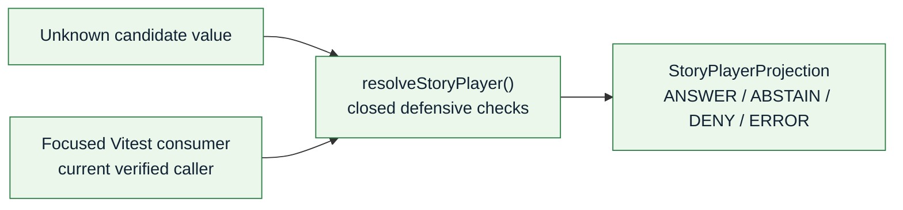
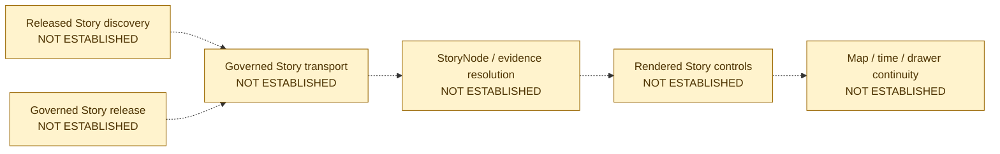

<!-- [KFM_META_BLOCK_V2]
doc_id: kfm://doc/docs-architecture-ui-story-player
title: Story Player — Architecture
type: architecture
version: v2.0.0
status: draft; repository-grounded; implementation-partial; projection-only; no-publisher
owners:
  - "@bartytime4life"
reviewers_required:
  - "Story and UI stewardship — assignment NEEDS VERIFICATION"
  - "Evidence and citation stewardship — assignment NEEDS VERIFICATION"
  - "Policy, sensitivity, and rights review — assignment NEEDS VERIFICATION"
  - "Release, correction, and rollback review — assignment NEEDS VERIFICATION"
  - "Accessibility review — assignment NEEDS VERIFICATION"
  - "Independent review — NEEDS VERIFICATION"
created: 2026-05-14
updated: 2026-08-19
policy_label: public
owning_root: docs/
responsibility: "Explain the current Story Player architecture boundary, the bounded executable StoryManifest projection consumer, its evidence and policy limits, the absent live-playback surfaces, and the gates required before wider UI, map, telemetry, 3D, release, or public use."
truth_posture: "CONFIRMED repository evidence / PROPOSED future playback architecture / UNKNOWN deployed behavior; cite-or-abstain"
evidence_snapshot:
  repository: bartytime4life/Kansas-Frontier-Matrix
  base_ref: main
  base_commit: 75849a09b2d18113a9a9b6c78332b83d19eb5832
  target_prior_blob: 922eee24bff70d4bd79a5c525a73d47348843022
  directory_rules_blob: fd49a0b83e55cef52c1124281f093e263526898d
  codeowners_blob: dd2a84aa514d8ecd9208bc347f90f9a2ed37dd61
  story_manifest_contract_blob: e0365d00a36f1aef57ed7dd1a051b4c70dec09b2
  story_manifest_schema_blob: 67fa2fae5534ffc7a277fae8adfcb9afb81e9fc0
  story_manifest_fixture_blob: 98e1ce24cacae42a19134c45ed3158a724282684
  story_manifest_validator_blob: 4122c5040d71d9098711717466cbb06f7fba2136
  story_manifest_test_blob: c8ccdb1fef0b277f759a340b993bf9c8684622e1
  story_manifest_workflow_blob: 6ef97ac0adb3207d92ed8e421a022e578825ce7d
  story_player_entry_blob: 6c3b3e63b28027e9f21f859beed791e2dd16879d
  story_player_test_blob: 54195d2676ca6f125b8c661c5c52c3adb4c2b16a
  story_player_current_implementation_blob: 7566f69f0a7ff87b461b54098fb00f0c41deed63
  story_player_receipt_blob: 3d5b6ee9cecdaee803a6bab731f2d7eab11579da
inspection_boundary: >
  Current-session GitHub reads against the exact base commit covering this file,
  accepted Directory Rules and ADR-0029, CODEOWNERS, UI StoryManifest contract,
  closed schema, synthetic fixture matrix, validator, focused validator tests,
  focused workflow, Explorer Story Player source and app tests, current implementation
  note, generated authoring receipt, Story policy boundary, Governed API route
  directory, UI architecture landing page, Story architecture lane, MapLibre decision
  records, and the non-canonical data/manifests/story compatibility lane. No local clone,
  browser playback, live Story API transport, StoryNode dereference, EvidenceBundle
  resolution, policy evaluation, renderer execution, accessibility session, telemetry
  stream, release, deployment, correction drill, or publication was exercised.
related:
  - docs/architecture/ui/README.md
  - docs/architecture/ui/GOVERNED_SHELL.md
  - docs/architecture/ui/EVIDENCE_DRAWER.md
  - docs/architecture/ui/MAP_RUNTIME_BOUNDARY.md
  - docs/architecture/ui/ACCESSIBILITY.md
  - docs/architecture/ui/TELEMETRY.md
  - docs/architecture/ui/FOCUS_FLOW.md
  - docs/architecture/story/README.md
  - docs/architecture/story/CONTINUITY.md
  - docs/adr/ADR-0006-maplibre-boundary--only-maplibreadapter-imports-maplibre.md
  - "docs/adr/ADR-0007 — MapLibre GL JS Is the Sole Browser-Side Renderer.md"
  - docs/adr/ADR-0029-adopt-directory-governance-standard-v2.md
  - docs/doctrine/directory-rules.md
  - contracts/ui/story_manifest.md
  - contracts/ui/story_node.md
  - schemas/contracts/v1/ui/story_manifest.schema.json
  - fixtures/ui/story_manifest/cases.json
  - tools/validators/ui/validate_story_manifest.py
  - tests/validators/test_validate_story_manifest.py
  - .github/workflows/story-manifest-trust-inheritance.yml
  - apps/explorer-web/src/features/story_player/README.md
  - apps/explorer-web/src/features/story_player/current-implementation.md
  - apps/explorer-web/src/features/story_player/index.tsx
  - apps/explorer-web/tests/story-player.test.ts
  - policy/story/README.md
  - data/manifests/story/README.md
  - data/receipts/generated/genrec-story-player-governed-projection-20260814.json
tags: [kfm, architecture, ui, story-player, story-manifest, public-safe-projection, finite-outcomes, evidence, policy, accessibility, correction, map-runtime]
notes:
  - "v2.0.0 is a same-path, documentation-only, repository-grounded replacement of the May 2026 proposal-era page."
  - "The current executable slice is a pure, 2D-only projection/view-model consumer of an already-governed StoryManifest; it is not live Story playback."
  - "The canonical executable UI projection currently lives under contracts/ui and schemas/contracts/v1/ui, not the formerly proposed story-specific schema lane."
  - "Story policy is non-enforcing, no Story route was found in the inspected Governed API route directory, and no Story Player call site exists outside its source and focused app test."
  - "ADR-0006 and ADR-0007 remain proposed; this page preserves the renderer and 3D HOLD."
  - "CODEOWNERS routes review to @bartytime4life; routing does not prove stewardship, independent approval, release, or publication."
[/KFM_META_BLOCK_V2] -->

<a id="top"></a>

# Story Player — Architecture

> **Current determination.** KFM now has a bounded, deterministic, **2D-only Story Player projection consumer** for one already-governed public-safe `StoryManifest`. It does **not** fetch a story, dereference a `StoryNode`, resolve evidence, execute policy, render a map, expose a live route, emit telemetry, release a story, or publish narrative truth.

> [!IMPORTANT]
> **Story sequence is not evidence order.** Narrative text, node order, animation, camera state, screenshots, maps, 3D scenes, generated summaries, and polished presentation remain downstream carriers. A consequential story claim is authoritative only through its governing evidence, policy, review, release, correction, and rollback chain.

> [!CAUTION]
> **The executable surface is narrower than the former architecture prose.** Repository code can turn a closed `kfm.ui.story-manifest.public-safe.v1` projection into a fail-closed view model. Live playback, node-body resolution, map/time continuity, Evidence Drawer integration, accessibility behavior, Story policy execution, telemetry, 3D, release, deployment, and public operation remain **NEEDS VERIFICATION** or **HOLD**.

| Field | Current repository-grounded value |
|---|---|
| **Tracked document** | `docs/architecture/ui/STORY_PLAYER.md` |
| **Owning root** | `docs/` — human architecture explanation |
| **Placement authority** | Accepted `ADR-0029` and the exact adopted Directory Rules v2 bytes |
| **Current app surface** | `apps/explorer-web/src/features/story_player/index.tsx` |
| **Current executable behavior** | Pure `resolveStoryPlayer()` projection/view-model function |
| **Current transport** | None; no fetch, XHR, WebSocket, or verified Story API route |
| **Current node resolution** | None; bounded constituent references only |
| **Current map/renderer behavior** | None; output mode is fixed to `"2D"` and renderer imports are prohibited by the focused test |
| **Current policy behavior** | Story policy lane is documented but non-enforcing |
| **Current release/publication state** | None |
| **Repository review route** | `@bartytime4life` through CODEOWNERS; independent stewardship and completed review remain unverified |
| **Effect of this page** | Documentation only |

## Quick navigation

- [1 · Scope and current result](#1--scope)
- [2 · Repository fit and evidence](#2--repo-fit)
- [3 · Core invariants](#3--core-invariants)
- [4 · Current runtime architecture](#4--runtime-architecture)
- [5 · Story evidence gate](#5--story-evidence-gate)
- [6 · 2D posture and renderer/3D HOLD](#6--2d-first-and-conditional-3d-handoff)
- [7 · Current object family](#7--object-family)
- [8 · Sensitivity, rights, and policy](#8--sensitivity-rights-and-policy)
- [9 · Accessibility obligations](#9--accessibility-obligations)
- [10 · Telemetry and receipts](#10--telemetry-and-receipts)
- [11 · Validation and proof limits](#11--validation)
- [12 · Current file homes](#12--proposed-file-homes)
- [13 · Conflicts and bounded drift](#13--conflicts-to-resolve)
- [14 · Dependency-ordered graduation](#14--increment-placement)
- [15 · Open verification register](#15--open-questions)
- [Appendix A · Exact fixture and app-test matrix](#appendix-a--illustrative-fixtures)
- [Appendix B · No-loss modernization ledger](#appendix-b--no-loss-modernization-ledger)
- [Authority and evidence basis](#authority-and-evidence-basis)
- [Related docs](#related-docs)

---

<a id="1--scope"></a>

## 1 · Scope and current result

This page explains the **Story Player UI boundary**: how Explorer Web may consume an already-governed Story projection without becoming story truth, evidence authority, policy authority, release authority, or a direct reader of canonical stores.

### Current bounded concern — executable projection consumption

The repository currently demonstrates a narrow, no-network step:

1. accept one unknown candidate value;
2. require the exact closed StoryManifest projection profile;
3. defensively validate the fields needed by the app-local consumer;
4. withhold playback unless the declared state and support are fully public-safe;
5. return a finite, non-authoritative `StoryPlayerProjection`;
6. expose ordered `nodeRef` values only for a fully eligible `READY / ANSWER` projection.

That step is **CONFIRMED as repository code and tests**. It is not equivalent to live playback.

### Future concern — governed Story playback

A later dependency-closed implementation may:

- retrieve a Story projection through the Governed API;
- authenticate and validate the response envelope;
- resolve permitted `StoryNode` bodies through governed interfaces;
- preserve map, time, Evidence Drawer, correction, and accessibility continuity;
- render finite outcomes in the Explorer shell;
- bind exports to release and correction lineage;
- add renderer behavior only after the map-runtime boundary is accepted and implemented.

Those capabilities remain **PROPOSED** and must not be inferred from the current function name or `canPlay` flag.

### Architecture, projection proof, playback, and publication are separate states

| State | Current status | What it proves | What it does not prove |
|---|---|---|---|
| Architecture documentation | **CONFIRMED present** | Intended Story Player boundary is documented. | Contract acceptance, runtime behavior, or publication. |
| StoryManifest projection profile | **CONFIRMED executable, status PROPOSED** | Closed synthetic shape, trust reduction, identity, and negative cases can be validated offline. | Evidence resolution, citation truth, policy execution, review, or release. |
| App-local projection consumer | **CONFIRMED implemented** | One already-governed projection can be converted into a fail-closed view model. | Transport, node bodies, UI composition, map rendering, or browser playback. |
| Live governed playback | **NOT ESTABLISHED** | — | No route, resolver, integration, or runtime behavior may be claimed. |
| Governed Story release/publication | **NONE ESTABLISHED** | — | A commit, merge, test, receipt, or view model is not release or publication authority. |

### In scope for this page

- the present `resolveStoryPlayer()` boundary;
- the current StoryManifest contract, schema, fixture, validator, and test relationship;
- finite Story Player outcomes and playback eligibility;
- no-network, no-internal-store, no-renderer, and no-mutation boundaries;
- correction and supersession display posture;
- renderer and 3D HOLD;
- future accessibility, telemetry, transport, and release gates;
- exact placement and rollback for this architecture document.

### Out of scope

- changing Story contracts, schemas, fixtures, validators, tests, workflows, or app code;
- selecting or accepting a renderer;
- defining a Story API route;
- implementing Story policy;
- admitting a source or Story dataset;
- resolving `EvidenceRef` to `EvidenceBundle`;
- creating a release lane or released Story artifact;
- deploying or publishing a Story surface.

[Back to top](#top)

---

<a id="2--repo-fit"></a>

## 2 · Repository fit and evidence

### Directory Rules result

**PLACE.** This is a same-path architecture update under `docs/architecture/ui/`. Accepted ADR-0029 keeps:

- human explanation under `docs/`;
- semantic meaning under `contracts/`;
- machine shape under `schemas/`;
- admissibility under `policy/`;
- deployable UI code under `apps/`;
- reusable implementation under `packages/`;
- fixtures and executable proof under `fixtures/` and `tests/`;
- validators under `tools/validators/`;
- lifecycle and accountability records under `data/`;
- release, correction, withdrawal, and rollback decisions under `release/` and their governed record families.

This page does not create a new root or a parallel Story, schema, contract, policy, evidence, source, manifest, release, proof, receipt, runtime, or publication authority.

### Current repository evidence matrix

| Surface | CONFIRMED state at the evidence snapshot | Safe conclusion |
|---|---|---|
| Accepted placement decision | `ADR-0029` is accepted and adopts the exact Directory Rules v2 bytes at `docs/doctrine/directory-rules.md`. | This document may remain in its existing explanatory UI lane. |
| CODEOWNERS | Repository review routes to `@bartytime4life`. | Routing is not specialist stewardship, independent review, policy approval, release, or publication. |
| StoryManifest contract | `contracts/ui/story_manifest.md` defines a proposed, fixture-only, public-safe composite projection. | The current machine profile is a bounded UI projection, not a production playback or release manifest. |
| StoryManifest schema | `schemas/contracts/v1/ui/story_manifest.schema.json` is a closed Draft 2020-12 schema. | Unknown fields such as raw narrative bodies are outside profile. |
| Fixture suite | `fixtures/ui/story_manifest/cases.json` contains 17 synthetic cases: 6 expected `PASS`, 11 expected `DENY`. | Deterministic finite trust inheritance is exercised without live sources. |
| Validator | `tools/validators/ui/validate_story_manifest.py` checks schema, composite semantics, deterministic identity, correction links, and replay constraints. | It performs no network or reference resolution and grants no authority. |
| Validator tests | `tests/validators/test_validate_story_manifest.py` contains 11 focused unit tests. | Test coverage is bounded to the proposed fixture profile. |
| Focused workflow | `story-manifest-trust-inheritance.yml` runs the validator test, fixture replay, and generated-receipt validation with read-only permissions and `KFM_NO_NETWORK=1`. | The workflow does not trigger for this architecture page alone and does not approve policy, review, release, or publication. |
| Story Player implementation | `apps/explorer-web/src/features/story_player/index.tsx` implements `resolveStoryPlayer()`. | A bounded 2D view-model consumer exists. |
| Story Player app tests | `apps/explorer-web/tests/story-player.test.ts` contains 10 focused test cases. | The consumer's finite outcomes and anti-bypass boundary are executable. |
| Call-site inventory | Exact repository search for `resolveStoryPlayer(` returned the implementation and its focused test only. | Route/site composition is not established. |
| Governed API route directory | The inspected direct route directory contains its README and an agriculture child, with no Story child. | No Story route is established at that inspected surface; other routing mechanisms remain possible and require a fresh implementation preflight. |
| Explorer package | Build, unit-test, and browser-test scripts exist; no runtime renderer dependency is declared. | Tooling exists, but Story playback and map rendering do not follow from it. |
| Story policy | `policy/story/` contains documentation and a non-enforcing Rego stub whose executable default denies nothing. | Never interpret that stub as `ALLOW`, `ANSWER`, or operational policy. |
| Story Player receipt | A generated authoring receipt records the initial implementation slice and its non-effects. | The receipt is process memory, not human review, proof, release, or publication. |
| Historical Story manifest lane | `data/manifests/story/README.md` marks the path non-canonical and compatibility-only. | Do not place new StoryManifest or ReleaseManifest authority there. |
| Renderer decisions | ADR-0006 and ADR-0007 remain proposed; MapLibre package and adapter surfaces remain scaffold-level/HOLD. | No renderer or 3D path is accepted or operational. |

### Connected-document drift kept outside this one-file change

Two adjacent documents still describe the Story Player as absent or unverified even though merged PR #2868 added the bounded projection consumer:

- `docs/architecture/story/README.md` still calls the entry a placeholder in its current text;
- `apps/explorer-web/src/features/story_player/README.md` still carries pre-implementation uncertainty in several status fields.

That is **bounded documentation drift**, not authority to widen this PR. Their next revisions should reconcile the merged consumer without upgrading it to live playback.

[Back to top](#top)

---

<a id="3--core-invariants"></a>

## 3 · Core invariants

These invariants apply to the current projection consumer and every proposed graduation step.

1. **Story order cannot upgrade trust.** A later node, smoother transition, stronger visual emphasis, or repeated claim cannot make evidence, rights, policy, review, release, freshness, or correction posture more permissive.
2. **Cite or abstain.** A consequential claim either resolves through governed evidence and citation support or remains `ABSTAIN`, `DENY`, or `ERROR`. The current client only carries references; it does not resolve them.
3. **Least-permissive composition.** The StoryManifest profile reduces constituent state and each trust dimension to the least-permissive declared posture.
4. **Closed public-safe projection.** Raw narrative bodies, claims, coordinates, geometry, and source payloads are outside the current schema profile.
5. **Governed interfaces only.** Browser code must not read RAW, WORK, QUARANTINE, PROCESSED, CATALOG, TRIPLETS, PUBLISHED, graph, vector, model, or object stores directly.
6. **Finite outcomes remain visible.** `ANSWER`, `ABSTAIN`, `DENY`, and `ERROR` are not converted into generic success or silent omission.
7. **Projection is non-authoritative.** `authoritative` is fixed to `false`; `projection_only` is fixed to `true`.
8. **READY is burden-bearing.** `READY / ANSWER` requires public-safe trust plus non-empty evidence, citation, policy, release, and review references.
9. **Correction and supersession remain visible.** Superseded or withdrawn projections cannot expose node playback; a public replacement reference may be carried.
10. **The app parser is defensive, not canonical.** It does not replace the semantic contract, JSON Schema, or validator.
11. **2D is the only current mode label.** It is not proof of a working 2D map. Renderer and 3D admission remain on HOLD.
12. **Accessibility cannot be inferred.** An `accessibility_summary` field is not a rendered accessible experience.
13. **Telemetry is non-authoritative.** No usage metric can become story truth, evidence, or release approval.
14. **Promotion remains separate.** A test, workflow, receipt, pull request, merge, or displayed `canPlay=true` value is not a governed Story release.

### Trust-membrane shorthand

```text
governed Story projection
  -> defensive app-local consumer
  -> finite non-authoritative view model
  -> future governed UI composition

NOT:

RAW / WORK / QUARANTINE / canonical stores
  -> browser
  -> story claim
```

[Back to top](#top)

---

<a id="4--runtime-architecture"></a>

## 4 · Current runtime architecture

### What exists now


```mermaid
flowchart LR
    Candidate["Unknown candidate value"]
    Parser["resolveStoryPlayer()<br/>closed defensive checks"]
    ViewModel["StoryPlayerProjection<br/>ANSWER / ABSTAIN / DENY / ERROR"]
    Tests["Focused Vitest consumer<br/>current verified caller"]

    Candidate --> Parser
    Parser --> ViewModel
    Tests --> Parser

    classDef current fill:#eaf7ea,stroke:#2d7d46,color:#123;
    class Candidate,Parser,ViewModel,Tests current;
```

The current function is pure and synchronous. It does not:

- call `fetch`, XHR, WebSocket, or a connector;
- open a Story route;
- dereference `StoryNode` bodies;
- resolve an `EvidenceRef` or `EvidenceBundle`;
- execute policy, review, promotion, release, correction, or rollback;
- import MapLibre, Cesium, Ollama, or another renderer/model client;
- render a component, map, animation, drawer, or route;
- mutate repository, external, release, deployment, or publication state.

### What does not exist yet


```mermaid
flowchart LR
    Discovery["Released Story discovery<br/>NOT ESTABLISHED"]
    API["Governed Story transport<br/>NOT ESTABLISHED"]
    Resolver["StoryNode / evidence resolution<br/>NOT ESTABLISHED"]
    Player["Rendered Story controls<br/>NOT ESTABLISHED"]
    Shell["Map / time / drawer continuity<br/>NOT ESTABLISHED"]
    Release["Governed Story release<br/>NOT ESTABLISHED"]

    Discovery -.-> API
    API -.-> Resolver
    Resolver -.-> Player
    Player -.-> Shell
    Release -.-> API

    classDef hold fill:#fff3cd,stroke:#9a6700,color:#4d3200;
    class Discovery,API,Resolver,Player,Shell,Release hold;
```

The dashed diagram is a **PROPOSED dependency map**, not current runtime behavior.

### Current exported surface

| Export | Current purpose | Boundary |
|---|---|---|
| `StoryOutcome` | `ANSWER`, `ABSTAIN`, `DENY`, `ERROR` vocabulary | Local type; not proof of one accepted repository-wide envelope. |
| `StoryState` | `READY`, `PARTIAL`, `ABSTAINED`, `SUPERSEDED`, `BLOCKED`, `ERROR` | Matches the bounded StoryManifest projection. |
| `StoryPlaybackNode` | Public-safe `nodeRef` plus `orderIndex` | Carries references only; no body or geometry. |
| `StoryPlayerProjection` | Finite view-model result | Fixed `mode: "2D"` and `authoritative: false`. |
| `resolveStoryPlayer()` | Defensive projection resolver | Does not fetch, validate canonical identity, execute policy, or render UI. |

### Current response codes

| Condition | Outcome | Code | Node playback |
|---|---|---|---|
| No candidate supplied | `ABSTAIN` | `NO_GOVERNED_RESPONSE` | withheld |
| Candidate fails the closed app parser | `ERROR` | `INVALID_PAYLOAD` | withheld |
| Fully eligible `READY / ANSWER` candidate | `ANSWER` | `STORY_READY` | ordered refs returned |
| Candidate is `DENY` or `BLOCKED` | `DENY` | `STORY_DENIED` | withheld |
| Candidate is `ERROR` | `ERROR` | `STORY_ERROR` | withheld |
| Any other valid but non-ready posture | `ABSTAIN` | `STORY_ABSTAINED` | withheld |

[Back to top](#top)

---

<a id="5--story-evidence-gate"></a>

## 5 · Story evidence gate

The prior page described a separate `StoryEvidenceGate` object as though it were the current runtime seam. Current repository evidence supports a narrower statement:

> The app-local consumer performs a defensive **playback eligibility check over one already-governed StoryManifest projection**. The canonical StoryManifest contract, schema, and validator own the bounded projection semantics. No separate implemented `StoryEvidenceGate` schema or policy evaluator was established in this inspection.

### Exact `canPlay=true` conditions

The consumer enables playback only when all of the following are declared:

| Dimension | Required value |
|---|---|
| Manifest profile | `kfm.ui.story-manifest.public-safe.v1` |
| Version | `1.0.0` |
| Boundary flags | `authoritative=false`, `projection_only=true` |
| Manifest state/outcome | `READY / ANSWER` |
| Rights | `CLEARED` |
| Sensitivity | `PUBLIC` |
| Policy | `ALLOW` |
| Review | `REVIEWED` |
| Release | `RELEASED` |
| Freshness | `CURRENT` |
| Correction | anything except `SUPERSEDED` |
| Evidence support | at least one `evidence_bundle_ref` |
| Citation support | at least one `citation_validation_ref` |
| Policy support | at least one `policy_decision_ref` |
| Release support | at least one `release_ref` |
| Review support | at least one `review_ref` |
| Constituents | non-empty, unique node refs, unique strictly increasing order indexes |

### What the check does not establish

Even when `canPlay=true`:

- the references have not been dereferenced by this function;
- evidence has not been inspected by this function;
- citation support has not been revalidated by this function;
- policy has not been executed by this function;
- review identity has not been authenticated by this function;
- release state has not been looked up by this function;
- correction or rollback has not been executed by this function;
- the story has not been rendered or published.

The current projection trusts a previously governed producer to supply the bounded profile and then fails closed against profile drift. A live transport must add authenticated response validation and governed resolution rather than treating this client check as the trust root.

### Contract-level least-permissive reduction

The offline StoryManifest validator independently checks that:

- each constituent's declared state is not more permissive than its trust snapshot;
- the manifest state/outcome matches the worst effective constituent;
- manifest trust equals the least-permissive value for every dimension;
- limiting node refs and reason codes identify the effective blockers;
- READY support references are present;
- corrected, withdrawn, or superseded states carry required correction and replacement linkage;
- identity is deterministic and content-addressed;
- validation uses no network and performs no reference resolution.

That is stronger than the app parser and remains the controlling executable profile for the synthetic fixture family.

[Back to top](#top)

---

<a id="6--2d-first-and-conditional-3d-handoff"></a>

## 6 · 2D posture and renderer/3D HOLD

### Confirmed current state

- `StoryPlayerProjection.mode` is fixed to `"2D"`.
- The app test rejects Story Player source that imports or names MapLibre, Cesium, or Ollama.
- The current function does not render a map.
- `packages/maplibre/` and the Explorer `MapLibreAdapter` remain scaffold-level.
- ADR-0006 and ADR-0007 remain proposed.
- No Story 3D route, adapter, plugin, scene contract, asset probe, browser test, correction path, or rollback proof was established.

> [!IMPORTANT]
> **“2D-only” currently describes the bounded view-model mode, not a functioning map player.** Do not convert the mode string into evidence that camera, layer, time, selection, or Evidence Drawer continuity exists.

### Current disposition

| Capability | Status | Reason |
|---|---|---|
| Projection ordering | **CONFIRMED bounded** | Ordered node refs are returned only for a fully eligible manifest. |
| 2D map playback | **HOLD** | No renderer, map adapter, layer binding, or UI composition is wired. |
| Map/time continuity | **HOLD** | No Story Player call site or shell integration is established. |
| Evidence Drawer handoff | **HOLD** | Evidence and citation refs are carried but not handed to a drawer. |
| Cesium handoff | **NOT CURRENT ARCHITECTURE** | No accepted dual-renderer decision or implementation exists. |
| MapLibre 3D/plugin path | **HOLD** | Renderer and plugin admission decisions remain proposed and unimplemented. |
| 3D Story playback | **HOLD** | No evidence-parity, asset-integrity, accessibility, performance, correction, or rollback proof. |

### Proposed graduation conditions for any future 3D mode

A future 3D Story mode must remain blocked until all of these are verified:

1. an accepted renderer and dependency-acquisition decision;
2. one KFM-owned runtime port and admitted adapter/plugin seam;
3. released, integrity-bound, public-safe scene assets;
4. identical evidence, policy, review, release, freshness, and correction visibility across 2D and 3D;
5. a non-map and reduced-motion alternative;
6. tested 2D fallback and deterministic return state;
7. browser compatibility and measured performance budgets;
8. safe telemetry and no protected detail leakage;
9. correction, cache invalidation, withdrawal, and rollback behavior;
10. independent human review appropriate to the affected domains.

This page does not choose a renderer or create an exception ADR.

[Back to top](#top)

---

<a id="7--object-family"></a>

## 7 · Current object family

### Implemented bounded profile

| Object/surface | Current authority and maturity |
|---|---|
| `StoryManifest` semantic contract | Proposed fixture-only public-safe composite meaning under `contracts/ui/story_manifest.md`. |
| `StoryManifest` JSON Schema | Closed machine profile under `schemas/contracts/v1/ui/story_manifest.schema.json`. |
| StoryManifest fixture suite | Synthetic cases under `fixtures/ui/story_manifest/cases.json`. |
| StoryManifest validator | Deterministic offline validator under `tools/validators/ui/validate_story_manifest.py`. |
| `StoryNode` adjacent profile | A separate bounded UI projection profile exists, but the Story Player does not dereference node bodies. |
| `StoryPlayerProjection` | App-local non-authoritative view model defined in Explorer source. |
| Story Player authoring receipt | Generated process-memory artifact for the first consumer slice. |

### StoryManifest public-safe field surface

| Field family | Purpose | Current limitation |
|---|---|---|
| `profile`, `id`, `version`, `spec_hash` | Closed profile and deterministic identity declaration | App parser checks patterns but does not recompute canonical identity. |
| `story_ref`, `title`, `accessibility_summary` | Public-safe display identity | No narrative body or full accessibility experience. |
| `state`, `outcome`, `reason_codes`, `limiting_node_refs` | Composite finite posture | Declared/validated projection state, not live policy execution. |
| `constituents` | Ordered bounded node trust snapshots | Node refs only; no body, geometry, or source payload. |
| `trust_state` | Least-permissive rights, sensitivity, policy, review, release, freshness, correction posture | Snapshot only; no live lookup. |
| `support` | Evidence, citation, policy, release, review, correction, and rollback refs | References are not resolved by the app. |
| `caveats` | Public-safe limitations | Not a substitute for evidence or policy. |
| `supersession` | Public replacement ref and note | App exposes the replacement ref but does not execute correction. |
| `authoritative`, `projection_only` | Hard boundary flags | Fixed to `false`, `true`. |

### State and trust vocabularies

```text
StoryState:
  READY | PARTIAL | ABSTAINED | SUPERSEDED | BLOCKED | ERROR

StoryOutcome:
  ANSWER | ABSTAIN | DENY | ERROR

Trust dimensions:
  rights      CLEARED | GENERALIZED | WITHHELD | UNRESOLVED
  sensitivity PUBLIC | GENERALIZED | RESTRICTED | UNKNOWN
  policy      ALLOW | ABSTAIN | DENY | ERROR
  review      REVIEWED | NOT_APPLICABLE | PENDING
  release     RELEASED | UNRELEASED | WITHDRAWN
  freshness   CURRENT | STALE | UNKNOWN
  correction  NONE | CURRENT | CORRECTED | SUPERSEDED
```

### Identity boundary

The offline validator computes repository canonical JCS SHA-256 over the document after removing `id` and `spec_hash`, then derives the StoryManifest ID from the first 24 digest hex characters. The app parser:

- requires the declared SHA-256 and ID formats;
- does **not** recompute them;
- must therefore receive a projection already validated by a governed producer.

A live route must not rely on format checks alone.

### Not established as current machine authority

The following names from the former page remain design lineage, not current implemented object families:

- a production playback manifest carrying camera, layers, time windows, transitions, node bodies, or 3D constraints;
- a current `StoryTransition` schema;
- a current separate `StoryEvidenceGate` schema;
- a Story-specific runtime response schema;
- a Story release binding or Story release-manifest sublane;
- a live Story resolver or node-body endpoint.

Creating or relocating any of these requires contract, schema, Directory Rules, compatibility, test, and rollback review.

[Back to top](#top)

---

<a id="8--sensitivity-rights-and-policy"></a>

## 8 · Sensitivity, rights, and policy

### Current public-safe protections

The bounded profile and tests reduce exposure by construction:

- the schema is closed;
- raw body, claim, coordinates, geometry, and source-payload fields are outside profile;
- unknown top-level fields are rejected;
- bounded display strings reject control characters and have length limits;
- duplicate and unsorted constituent drift is rejected;
- unresolved rights or restricted sensitivity can force `DENY`;
- stale or unreleased support can force `ABSTAIN`;
- superseded content cannot expose node playback;
- the app does not reflect an unrecognized raw body into its error result;
- the app carries refs and caveats, not canonical evidence payloads.

These are meaningful anti-leak controls for the **synthetic projection profile**. They do not replace policy or source review.

### Story policy is not operational

`policy/story/` currently contains:

- a repository-grounded README describing the intended boundary;
- one proposed Rego stub;
- an executable `default deny := false`;
- no operative Story rule;
- no accepted input/output contract;
- no Story-native Rego test;
- no accepted bundle selector or evaluator binding;
- no decision receipt or governed consumer.

Therefore:

> [!WARNING]
> Do not translate the current Rego stub into `ALLOW`, `ANSWER`, or evidence continuity. A future live Story path must fail closed when the policy evaluator, policy input, bundle identity, rights, sensitivity, review, release, freshness, or correction posture is missing or invalid.

### Sensitive-domain obligations for future playback

Before node content can be rendered, a live path must resolve applicable controls for:

- archaeology and protected places;
- tribal, cultural, sovereignty, and CARE obligations;
- rare-species or habitat precision;
- critical infrastructure;
- living-person information;
- DNA or genomic context;
- private land, wells, title, and household-level exposure;
- source-license and redistribution terms;
- reidentification risk from sequence, thumbnail, animation, camera, or timing context.

Allowed responses include generalization, redaction, staged access, delayed access, `ABSTAIN`, and `DENY`. The client must not reveal protected reasons or coordinates while explaining a denial.

[Back to top](#top)

---

<a id="9--accessibility-obligations"></a>

## 9 · Accessibility obligations

### Current evidence

The current StoryManifest requires an `accessibility_summary`, and the app-local projection returns it. That is the only Story Player accessibility behavior established by the inspected implementation.

The current code does **not** establish:

- a rendered Story Player component;
- keyboard forward/back/pause/exit controls;
- focus management;
- reduced-motion behavior;
- screen-reader announcements;
- a non-map equivalent;
- color/contrast treatment;
- touch or narrow-viewport behavior;
- accessible error/deny/abstain cards;
- 3D alternatives.

The focused Story Player app test is a projection and anti-bypass test, not an accessibility interaction test.

### Required future behavior

| Obligation | Graduation evidence required |
|---|---|
| Keyboard operation | Component/browser tests for start, back, forward, pause, open evidence, skip, and exit. |
| Stable focus | Browser proof that node transitions and drawer open/close return focus predictably. |
| Reduced motion | `prefers-reduced-motion` behavior plus user override and static transition alternative. |
| Non-map equivalent | Ordered text/list representation of nodes and finite outcomes. |
| State announcements | Accessible live-region or equivalent announcements for loading, READY, ABSTAIN, DENY, ERROR, stale, and superseded states. |
| Trust information | Text labels for evidence, rights, sensitivity, review, release, freshness, and correction; no color-only meaning. |
| Pause/cancel | Motion and automatic advancement are pausable and cancellable. |
| Narrow view | Citations, finite outcome, and correction state remain visible and operable. |
| 3D alternative | No node becomes inaccessible because 3D is unavailable or unsuitable. |
| Human review | Manual keyboard, screen-reader, zoom/reflow, motion, and cognitive-load review before public release. |

No architecture badge or passing unit test substitutes for measured and human accessibility review.

[Back to top](#top)

---

<a id="10--telemetry-and-receipts"></a>

## 10 · Telemetry and receipts

### Current state

- `resolveStoryPlayer()` emits no telemetry.
- No Story Player telemetry adapter, event contract, retention rule, or runtime sink was established.
- The app test prohibits transport and renderer/model-client seams in the feature source.
- A generated receipt exists for the first projection-consumer implementation.

The generated receipt records authored paths, hashes, evidence references, validation intentions, non-effects, pending hosted checks, and pending human review. It is **process memory only**.

> [!IMPORTANT]
> A generated receipt is not a `ReviewRecord`, `PolicyDecision`, proof pack, `PromotionDecision`, `ReleaseManifest`, correction notice, rollback execution, or publication record.

### Future safe telemetry boundary

Telemetry may eventually record bounded operational facts such as:

- projection outcome and public-safe reason code;
- render or transition duration;
- reduced-motion mode use;
- keyboard-control activation;
- node index and transition result using non-sensitive identifiers;
- 2D/3D probe result after renderer admission;
- fallback, cancellation, timeout, and safe-diagnostic counts.

Telemetry must not include:

- raw evidence or source payloads;
- StoryNode body text unless separately approved and minimized;
- prompts, model intermediate output, or hidden reasoning;
- exact restricted coordinates;
- living-person, genomic, sovereign, household, or protected-site identifiers;
- internal store handles, credentials, private URLs, or secrets;
- policy-sensitive denial details that enable inference;
- unreleased asset locations.

A telemetry event can support reliability analysis; it cannot prove that a story claim is true or released.

### Export and screenshot boundary

No Story export path is implemented. A future screenshot, PDF, share link, or narrative export must preserve, as appropriate:

- Story and node version;
- release identifier;
- citation and evidence references;
- spatial and temporal scope;
- finite outcome;
- caveats;
- correction/supersession state;
- public-safe rights and sensitivity posture;
- deterministic artifact digest;
- rollback/correction locator.

[Back to top](#top)

---

<a id="11--validation"></a>

## 11 · Validation and proof limits

### Existing executable proof

| Proof surface | Current scope |
|---|---|
| Closed JSON Schema | Rejects unknown fields and pins the public-safe projection profile. |
| 17-case StoryManifest fixture matrix | 6 valid finite states and 11 fail-closed negative cases. |
| 11 validator unit tests | Schema closure, exact matrix, state coverage, worst-node visibility, trust reduction, raw-field exclusion, deterministic identity, no-network behavior, bounded reader, CLI replay, non-authority output. |
| Deterministic validator CLI | Replays all fixtures and reports `suite_match`. |
| Focused StoryManifest workflow | Runs unit tests, fixture replay, and receipt validation with read-only permissions and no-network posture. |
| 10 Story Player Vitest cases | READY, stale/unreleased, rights/sensitivity denial, upstream error, supersession, malformed flags, unknown-field non-reflection, duplicate/order drift, missing response, and anti-bypass source checks. |
| Explorer build/test workflow | Runs full Explorer build and unit/browser scripts on pull requests. |
| Generated Story Player receipt | Binds the initial three implementation/documentation artifacts and records limits. |

### Repository-native commands

```bash
python -m unittest tests.validators.test_validate_story_manifest -v
python tools/validators/ui/validate_story_manifest.py --fixtures

pnpm --filter explorer-web test:unit
pnpm --filter explorer-web build

python tools/validators/validate_generated_receipt.py \
  data/receipts/generated/genrec-story-player-governed-projection-20260814.json \
  --repo-root .
```

### Trigger boundary

The focused `story-manifest-trust-inheritance` workflow does **not** list this architecture page in its path filter. A documentation-only update to `STORY_PLAYER.md` therefore does not by itself trigger that focused workflow.

The repository-wide `ui-build` workflow runs on every pull request. Documentation, link, metadata, topology, security, and aggregate workflows may also run according to their own triggers.

### What a green result proves

| Green result | Bounded proof |
|---|---|
| Markdown/link/metadata checks | The authored documentation satisfies the configured documentation checks. |
| StoryManifest focused workflow | The exact closed synthetic profile, validator, fixtures, and receipt satisfy that workflow. |
| Explorer unit tests | The current app-local source satisfies the configured Vitest tests. |
| Explorer build | The current workspace type-checks and bundles under the configured toolchain. |
| Explorer browser tests | The configured browser scenarios pass; Story playback is proved only if a Story-specific scenario is actually wired and exercised. |
| Generated-receipt validation | Recorded artifact-byte bindings satisfy the receipt validator. |

No green result alone proves live evidence resolution, policy execution, accessibility conformance, source rights, release approval, deployment, public availability, or publication.

### Validation required for this documentation change

Before delivery, this page should have:

- one metadata block;
- one H1;
- unique explicit anchors and headings;
- balanced fenced blocks;
- resolved internal links and repository-relative links;
- no tabs or trailing whitespace;
- a final newline;
- exact Git blob agreement between authored bytes and branch content;
- one-file base/head comparison.

Hosted exact-head results must be reported separately from authoring validation.

[Back to top](#top)

---

<a id="12--proposed-file-homes"></a>

## 12 · Current file homes

The former page proposed multiple paths that no longer match the executable repository profile. The table below records **current verified homes** without creating new authority.

| Responsibility | Current path | Current status |
|---|---|---|
| Story Player architecture explanation | `docs/architecture/ui/STORY_PLAYER.md` | This tracked page |
| Cross-root Story architecture | `docs/architecture/story/README.md` | Repository-grounded but carries bounded post-#2868 drift |
| Story continuity lineage | `docs/architecture/story/CONTINUITY.md` | Proposal-era lineage; not runtime proof |
| App-local projection consumer | `apps/explorer-web/src/features/story_player/index.tsx` | Bounded executable view-model slice |
| Current implementation boundary note | `apps/explorer-web/src/features/story_player/current-implementation.md` | Accurate bounded implementation note |
| App feature README | `apps/explorer-web/src/features/story_player/README.md` | Boundary documentation; some maturity fields need reconciliation |
| App-local Story Player tests | `apps/explorer-web/tests/story-player.test.ts` | Focused Vitest proof |
| StoryManifest semantics | `contracts/ui/story_manifest.md` | Proposed fixture-only semantic contract |
| StoryManifest machine shape | `schemas/contracts/v1/ui/story_manifest.schema.json` | Closed proposed profile |
| StoryManifest fixtures | `fixtures/ui/story_manifest/cases.json` | Synthetic fixture matrix |
| StoryManifest validator | `tools/validators/ui/validate_story_manifest.py` | Deterministic offline validator |
| StoryManifest validator tests | `tests/validators/test_validate_story_manifest.py` | Focused unit proof |
| StoryManifest focused CI | `.github/workflows/story-manifest-trust-inheritance.yml` | Read-only no-network workflow |
| Story policy source boundary | `policy/story/` | Documentation plus non-enforcing stub |
| Story Player authoring receipt | `data/receipts/generated/genrec-story-player-governed-projection-20260814.json` | Process memory, not approval |
| Historical manifest compatibility lane | `data/manifests/story/README.md` | Non-canonical routing/retirement boundary |
| Published Story payload lane | `data/published/stories/README.md` | Documentation boundary; no current Story release inferred |

### Stale path claims retired by this revision

Do not create or treat the following former proposals as current authority merely because the old page named them:

- `schemas/contracts/v1/story/story_manifest.schema.json`;
- `schemas/contracts/v1/story/story_node.schema.json`;
- `schemas/contracts/v1/story/story_transition.schema.json`;
- `schemas/contracts/v1/story/story_evidence_gate.schema.json`;
- `tests/fixtures/story/`;
- `tools/validators/story/`;
- `apps/explorer-web/src/features/story/StoryNodePlayer.tsx`;
- `docs/architecture/ui/CESIUM_HANDOFF.md`;
- `data/manifests/story/` as a canonical StoryManifest or ReleaseManifest store.

Any future convergence or migration must preserve identity, compatibility, consumers, generated artifacts, tests, correction lineage, and rollback through an accepted decision when authority changes.

[Back to top](#top)

---

<a id="13--conflicts-to-resolve"></a>

## 13 · Conflicts and bounded drift

| Conflict or gap | Current status | Safe handling |
|---|---|---|
| Architecture page says no repository was mounted | **STALE** | Replaced here with exact current repository evidence. |
| Architecture page proposed `schemas/contracts/v1/story/` | **STALE for current UI projection** | Current executable profile is under `schemas/contracts/v1/ui/`; do not create a parallel schema home. |
| `contracts/ui/` versus broader `contracts/story/` | **NEEDS VERIFICATION** | Preserve both tracked lanes; resolve semantic overlap before migration or authority claims. |
| Fixture-only StoryManifest versus future playback manifest | **UNRESOLVED** | Do not widen the closed profile silently. Version or create a reviewed successor only after requirements and consumers close. |
| App README and Story architecture README maturity | **DRIFT** | Reconcile in later same-path documentation updates; do not widen this PR. |
| Story policy source | **NON-ENFORCING** | Keep live Story transport and playback fail-closed until an accepted policy packet exists. |
| Governed API Story route | **NOT ESTABLISHED at inspected route surface** | Reinspect current API conventions before proposing an exact route or path. |
| Evidence/citation reference resolution | **NOT IMPLEMENTED in Story Player** | Reuse the governed resolver/interface; never create browser-side evidence authority. |
| Global runtime envelope vocabulary | **NEEDS VERIFICATION** | Keep Story-local codes bounded; do not claim one accepted global envelope from shared words alone. |
| Renderer and adapter decisions | **PROPOSED / HOLD** | Preserve renderer-neutral architecture and no renderer import in the current Story slice. |
| 3D handoff | **HOLD** | No Cesium or MapLibre-plugin path until renderer/admission, parity, accessibility, integrity, correction, and rollback close. |
| Story release-manifest sublane | **UNKNOWN** | Do not use `data/manifests/story/` as a substitute release authority. |
| Accountable stewardship and independent review | **NEEDS VERIFICATION** | CODEOWNERS routing remains the only verified GitHub identity route. |

[Back to top](#top)

---

<a id="14--increment-placement"></a>

## 14 · Dependency-ordered graduation

### Completed bounded increment

Merged PR #2868 replaced the two-line Story Player placeholder with:

- the current pure `resolveStoryPlayer()` consumer;
- focused app tests;
- a current-implementation boundary note;
- a generated authoring receipt.

That merge is repository implementation evidence. It is not Story release or publication.

### Smallest sound next increments

The next work should remain dependency-ordered and reversible.

#### P0 — Authority and transport closure

1. Reinspect current Governed API route and response-envelope conventions.
2. Decide the semantic relationship between the fixture-only UI StoryManifest and any transport/playback successor.
3. Define an authenticated, schema-valid, public-safe StoryManifest transport contract.
4. Reuse the authoritative EvidenceRef-to-EvidenceBundle resolver rather than creating a Story-local resolver.
5. Define Story policy input, finite native outcomes, reason codes, obligations, bundle identity, evaluator binding, and negative tests.
6. Bind review, release, freshness, correction, withdrawal, and rollback references without collapsing their object families.

**Stop condition:** no live Story transport while any of those authorities is absent or ambiguous.

#### P1 — First no-network governed playback slice

Use one synthetic, public-safe Story projection and:

- route it through the governed interface;
- authenticate the response profile;
- preserve current fail-closed outcomes;
- render a non-map ordered list first;
- open a fixture-backed Evidence Drawer handoff without resolving restricted payloads;
- add keyboard, focus, state-announcement, and reduced-motion tests;
- keep map and renderer work out of the first slice.

The exact route and file placement remain **NEEDS VERIFICATION** until current API/app conventions are inspected.

#### P2 — Map, time, export, and correction continuity

Only after P1:

- connect through an accepted map-runtime port;
- preserve camera/layer/time state without direct renderer imports;
- add correction, withdrawal, replacement, cache, and export behavior;
- add measured accessibility, performance, and telemetry proof;
- prove no internal-store or model-client bypass.

#### P3 — Conditional 3D

3D remains last. It requires the graduation conditions in Section 6 and a separately reviewable rollback path. Cinematic value is never an exception to evidence or accessibility parity.

### Definition of done for live Story playback

A live Story Player is not complete until:

- transport is governed and authenticated;
- every consequential node claim resolves to permitted evidence or returns a finite negative outcome;
- policy, rights, sensitivity, review, release, freshness, correction, and rollback states are enforced;
- no browser path reaches canonical/internal stores;
- keyboard, focus, reduced-motion, screen-reader, and non-map alternatives pass automated and human review;
- telemetry is public-safe and retention-bound;
- correction, withdrawal, replacement, cache invalidation, and rollback are rehearsed;
- a release decision names the exact artifact/service, audience, evidence, and rollback target.

[Back to top](#top)

---

<a id="15--open-questions"></a>

## 15 · Open verification register

| Priority | Question | Current label | Closure evidence |
|---:|---|---|---|
| P0 | Which current Governed API envelope and route convention should carry a StoryManifest projection? | **NEEDS VERIFICATION** | Pinned route inventory, contract/schema, tests, and accepted boundary decision. |
| P0 | Is the fixture-only UI StoryManifest extended, versioned, or kept separate from a live playback manifest? | **DECISION REQUIRED** | Contract compatibility analysis and reviewed migration/versioning record. |
| P0 | Which resolver authenticates Story evidence and citation refs? | **NEEDS VERIFICATION** | Existing resolver interface, fixture, no-network tests, policy/release checks. |
| P0 | What is the accepted Story policy input/output and evaluator binding? | **UNKNOWN** | Closed schema, Rego rules/tests, bundle identity, finite decision contract, consumer proof. |
| P0 | Which release object binds a Story projection or service, and where is its canonical Story sublane? | **UNKNOWN** | Release authority decision, manifest contract, fixture, validator, correction/rollback proof. |
| P1 | How are StoryNode bodies represented and resolved without widening the current public-safe projection? | **PROPOSED** | Versioned contract/schema and positive/negative fixtures. |
| P1 | Which Explorer component and route own actual playback controls? | **NEEDS VERIFICATION** | Current app architecture preflight, implementation, tests, and route composition. |
| P1 | How does Story playback open Evidence Drawer content while preserving citation and denial boundaries? | **PROPOSED** | Adapter contract, fixture, component/browser tests, no-leak negatives. |
| P1 | What map/time state can a Story request, and which owner restores it on exit/error? | **HOLD** | Accepted map-runtime boundary and deterministic integration tests. |
| P1 | What accessibility acceptance suite and human-review record are required? | **NEEDS VERIFICATION** | Automated interaction tests plus documented human review. |
| P2 | Which telemetry event family, sink, retention, and minimization policy applies? | **UNKNOWN** | Contract/schema/policy, test sink, retention decision, no-sensitive-data tests. |
| P2 | How do exports preserve release, evidence, caveat, and correction lineage? | **PROPOSED** | Export contract, manifest/receipt binding, deterministic fixture and rollback test. |
| P2 | How do withdrawal and correction propagate to cached Story views and share links? | **UNKNOWN** | Correction drill, cache invalidation receipt, replacement behavior, rollback proof. |
| P3 | Is a 3D Story mode admitted, and through which accepted renderer/plugin seam? | **HOLD** | Accepted ADR, dependency admission, integrity/performance/accessibility/evidence-parity proof. |
| Docs | When will the Story architecture README and app feature README reconcile merged PR #2868? | **NEEDS VERIFICATION** | Separate same-path documentation changes with current evidence. |
| Governance | Who are the accountable Story, UI, evidence, policy, release, accessibility, and independent reviewers? | **NEEDS VERIFICATION** | Verified stewardship assignments and review records. |

[Back to top](#top)

---

<a id="appendix-a--illustrative-fixtures"></a>

## Appendix A · Exact fixture and app-test matrix

The former page contained illustrative JSON shapes that could be mistaken for current schemas. This appendix instead summarizes the **tracked executable matrices** and defers field authority to the contract and schema.

### StoryManifest fixture matrix — 17 cases

**Expected PASS — 6**

- `valid-ready`
- `valid-partial-stale`
- `valid-abstained-missing`
- `valid-blocked-rights`
- `valid-error-policy`
- `valid-superseded`

**Expected DENY — 11**

- `deny-optimistic-state`
- `deny-trust-optimism`
- `deny-limiting-ref-drift`
- `deny-reason-drift`
- `deny-constituent-too-permissive`
- `deny-unsorted-constituents`
- `deny-duplicate-node-ref`
- `deny-ready-without-evidence`
- `deny-superseded-without-links`
- `deny-raw-body-property`
- `deny-spec-hash-drift`

The validator test asserts the exact distribution `{"PASS": 6, "DENY": 11}` and the CLI reports 17 cases.

### Story Player app-test matrix — 10 cases

1. allows 2D playback only for fully public-safe READY support;
2. abstains for stale or unreleased support;
3. denies unresolved rights or restricted sensitivity;
4. surfaces upstream error without node playback;
5. abstains on supersession and carries only the public replacement ref;
6. fails closed on optimistic READY trust and malformed projection flags;
7. rejects closed-profile drift without reflecting untrusted content;
8. rejects duplicate or unsorted constituents;
9. abstains when no governed projection exists;
10. enforces no transport, internal-store, mutation, or renderer seam in the feature source.

These tests prove the current app-local projection boundary only.

[Back to top](#top)

---

<a id="appendix-b--no-loss-modernization-ledger"></a>

## Appendix B · No-loss modernization ledger

| Prior material | Disposition in v2.0.0 | Reason |
|---|---|---|
| Existing tracked path and H1 | **PRESERVED** | Maintains document identity and inbound navigation. |
| Core “rendering surface, not truth source” rule | **PRESERVED AND STRENGTHENED** | Still central and now grounded in current code. |
| Cite-or-abstain and finite outcomes | **PRESERVED** | Current contract, schema, code, and tests use bounded finite states. |
| 2D-first principle | **NARROWED TO CURRENT FACT** | Current output is 2D-only, but no map playback exists. |
| Conditional 3D burden | **PRESERVED AS HOLD** | No renderer/3D implementation or accepted decision exists. |
| Accessibility and telemetry obligations | **PRESERVED AS FUTURE GATES** | Current implementation does not prove them. |
| Sensitivity and rights safeguards | **PRESERVED AND GROUNDED** | Closed schema and fail-closed app behavior support a bounded projection claim. |
| “No mounted repository” posture | **REMOVED AS STALE** | Current GitHub repository evidence was inspected. |
| Placeholder owners | **REPLACED** | `@bartytime4life` is the only verified CODEOWNERS route; specialist assignments remain unverified. |
| Proposed `schemas/contracts/v1/story/` paths | **CORRECTED** | Current executable UI projection is under `schemas/contracts/v1/ui/`. |
| Proposed `tests/fixtures/story/` and `tools/validators/story/` paths | **CORRECTED** | Current fixtures and validator live under `fixtures/ui/` and `tools/validators/ui/`. |
| Proposed `StoryNodePlayer.tsx` path | **REMOVED AS INVENTED CURRENT STATE** | Current executable entry is `story_player/index.tsx`. |
| Separate StoryEvidenceGate schema claim | **NARROWED** | Current app checks StoryManifest eligibility; no separate implemented gate schema was established. |
| Cesium handoff document/path | **REMOVED AS CURRENT DEPENDENCY** | No accepted or implemented Cesium path exists. |
| Illustrative StoryNode JSON | **REPLACED WITH EXACT TEST MATRIX** | Avoids competing with current contracts and schemas. |
| `data/manifests/story/` as an emitted home | **CORRECTED** | The lane is non-canonical compatibility/retirement documentation. |
| PR-wave claim from the old Whole-UI plan | **REPLACED WITH CURRENT DEPENDENCY ORDER** | Merged PR #2868 changed the implementation baseline. |
| Old section anchors | **PRESERVED EXPLICITLY** | Minimizes fragment-link breakage. |

### Rollback

Before merge, close the draft pull request and abandon the branch. After an authorized merge, revert the focused documentation commit or restore prior blob `922eee24bff70d4bd79a5c525a73d47348843022`.

No source, data, policy, evidence, cache, runtime, release, deployment, or public-state rollback is required for this documentation-only change.

[Back to top](#top)

---

<a id="authority-and-evidence-basis"></a>

## Authority and evidence basis

### Placement and governance

- accepted `ADR-0029`;
- exact adopted `docs/doctrine/directory-rules.md` bytes;
- current `.github/CODEOWNERS`;
- current `docs/architecture/ui/README.md`.

### Current Story implementation

- `contracts/ui/story_manifest.md`;
- `schemas/contracts/v1/ui/story_manifest.schema.json`;
- `fixtures/ui/story_manifest/cases.json`;
- `tools/validators/ui/validate_story_manifest.py`;
- `tests/validators/test_validate_story_manifest.py`;
- `.github/workflows/story-manifest-trust-inheritance.yml`;
- `apps/explorer-web/src/features/story_player/index.tsx`;
- `apps/explorer-web/tests/story-player.test.ts`;
- `apps/explorer-web/src/features/story_player/current-implementation.md`;
- `data/receipts/generated/genrec-story-player-governed-projection-20260814.json`;
- merged PR #2868.

### Boundary evidence

- `policy/story/README.md` and its documented non-enforcing stub;
- current Governed API direct route directory;
- `data/manifests/story/README.md` non-canonical boundary;
- proposed ADR-0006 and ADR-0007;
- current Explorer package and UI build workflow;
- exact search showing no `resolveStoryPlayer()` call site outside source and test.

### Evidence limits

This page is based on repository reads and document/code inspection. It does not claim a local test run, deployed runtime trace, browser session, live API response, policy evaluation, EvidenceBundle resolution, source-rights review, accessibility audit, telemetry event, release record, correction drill, rollback execution, or publication.

When documentation and implementation differ, current code/configuration/tests control current-behavior claims; accepted doctrine and ADRs control governing intent and placement.

[Back to top](#top)

---

<a id="related-docs"></a>

## Related docs

### Architecture and doctrine

- [`UI Subsystem — Architecture README`](./README.md)
- [`Governed Shell`](./GOVERNED_SHELL.md)
- [`Evidence Drawer`](./EVIDENCE_DRAWER.md)
- [`Map Runtime Boundary`](./MAP_RUNTIME_BOUNDARY.md)
- [`Accessibility`](./ACCESSIBILITY.md)
- [`Telemetry`](./TELEMETRY.md)
- [`Focus Flow`](./FOCUS_FLOW.md)
- [`Story Subsystem Architecture`](../story/README.md)
- [`Story Continuity Notes`](../story/CONTINUITY.md)
- [`Directory Rules v2`](../../doctrine/directory-rules.md)
- [`ADR-0029`](../../adr/ADR-0029-adopt-directory-governance-standard-v2.md)
- [`ADR-0006`](../../adr/ADR-0006-maplibre-boundary--only-maplibreadapter-imports-maplibre.md)
- [`ADR-0007`](<../../adr/ADR-0007 — MapLibre GL JS Is the Sole Browser-Side Renderer.md>)

### Contracts, schemas, fixtures, validators, and tests

- [`StoryManifest contract`](../../../contracts/ui/story_manifest.md)
- [`StoryNode contract`](../../../contracts/ui/story_node.md)
- [`StoryManifest schema`](../../../schemas/contracts/v1/ui/story_manifest.schema.json)
- [`StoryManifest fixtures`](../../../fixtures/ui/story_manifest/cases.json)
- [`StoryManifest validator`](../../../tools/validators/ui/validate_story_manifest.py)
- [`StoryManifest validator tests`](../../../tests/validators/test_validate_story_manifest.py)
- [`StoryManifest workflow`](../../../.github/workflows/story-manifest-trust-inheritance.yml)

### App, policy, data, and receipts

- [`Story Player feature README`](../../../apps/explorer-web/src/features/story_player/README.md)
- [`Story Player current implementation`](../../../apps/explorer-web/src/features/story_player/current-implementation.md)
- [`Story Player source`](../../../apps/explorer-web/src/features/story_player/index.tsx)
- [`Story Player tests`](../../../apps/explorer-web/tests/story-player.test.ts)
- [`Story policy boundary`](../../../policy/story/README.md)
- [`Historical Story manifest compatibility lane`](../../../data/manifests/story/README.md)
- [`Story Player authoring receipt`](../../../data/receipts/generated/genrec-story-player-governed-projection-20260814.json)

---

**Last updated:** 2026-08-19 · **Status:** repository-grounded draft / bounded projection consumer / no live playback / no release or publication

[Back to top](#top)
