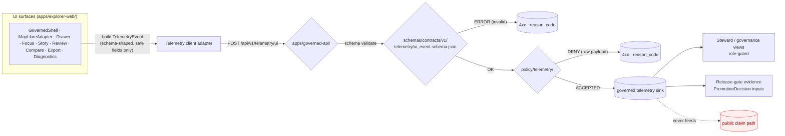

<!-- [KFM_META_BLOCK_V2]
doc_id: kfm://doc/architecture/ui/telemetry
title: UI Telemetry Architecture
type: standard
version: v0.1
status: draft
owners: <docs steward + UI subsystem owner — placeholder, pending CODEOWNERS verification>
created: 2026-05-14
updated: 2026-05-14
policy_label: public
related:
  - docs/architecture/ui/README.md
  - docs/architecture/ui/BOUNDARIES.md
  - docs/architecture/ui/STATE_OWNERSHIP.md
  - docs/architecture/governed-ai/README.md
  - policy/telemetry/README.md
  - schemas/contracts/v1/telemetry/ui_event.schema.json
tags: [kfm, ui, telemetry, observability, governance]
notes:
  - All repo-path claims in this doc are PROPOSED until mounted-repo inspection.
  - File appears in Whole-UI Expansion Report Appendix A as a PROPOSED architecture doc.
[/KFM_META_BLOCK_V2] -->

# UI Telemetry Architecture

> Safe, governed UI telemetry — what it is, what it never carries, and how it
> stays a downstream audit carrier rather than a side channel for truth.

[](#)
[](../README.md)
[](#11-open-verification-items)
[](#7-policy-gates)
[](#3-trust-posture)
[](#)

**Status:** draft · **Owners:** docs steward + UI subsystem owner _(placeholder, NEEDS VERIFICATION)_ · **Last updated:** 2026-05-14

---

## Quick Jump

1. [Purpose and scope](#1-purpose-and-scope)
2. [Definitions](#2-definitions)
3. [Trust posture](#3-trust-posture)
4. [Telemetry surfaces](#4-telemetry-surfaces)
5. [Event envelope contract](#5-event-envelope-contract)
6. [Allowed vs forbidden fields](#6-allowed-vs-forbidden-fields)
7. [Policy gates](#7-policy-gates)
8. [Failure telemetry categories](#8-failure-telemetry-categories)
9. [Sensitive content boundary](#9-sensitive-content-boundary)
10. [Flow diagram](#10-flow-diagram)
11. [Validators and tests](#11-validators-and-tests)
12. [Governance health indicators](#12-governance-health-indicators)
13. [Anti-patterns](#13-anti-patterns)
14. [Open verification items](#14-open-verification-items)
15. [Related docs](#15-related-docs)
16. [Appendix · Proposed field reference](#16-appendix--proposed-field-reference)

---

## 1. Purpose and scope

This document defines the **architectural rules** for telemetry emitted by KFM
UI surfaces — the explorer web shell, the MapLibre adapter boundary, the
Evidence Drawer, Focus Mode, Story Node player, Review Console, Compare,
Export, Settings, and Diagnostics views.

It answers four questions:

1. **What may UI telemetry carry?** Only safe, structured, anonymous,
   release-state-aware event signals.
2. **What must it never carry?** Raw evidence, prompts, secrets, exact
   restricted coordinates, model outputs, or anything that would let telemetry
   serve as a side channel around the trust membrane.
3. **What is telemetry's authority?** Telemetry is a **downstream audit
   carrier**, not a source of truth. It informs review, performance, and
   release decisions; it does not make them.
4. **How is it gated?** Through a published schema (`TelemetryEvent`), a
   governed route (`POST /api/v1/telemetry/ui`), policy denial of unsafe
   payloads, and validators that exercise the negative path.

> [!IMPORTANT]
> Telemetry is **observability**, not evidence. No claim, decision, release
> state, or AI answer may be supported by a telemetry record alone. If an
> assertion needs proof, it needs an `EvidenceBundle`, not a telemetry event.

[Back to top](#ui-telemetry-architecture)

---

## 2. Definitions

| Term | Meaning in KFM |
|---|---|
| **UI telemetry** | Structured, anonymous, governance-aware event records emitted by a UI surface to record what happened, how long it took, and whether a release gate or policy state was visible. |
| **`TelemetryEvent`** | The PROPOSED object family for UI telemetry envelopes. Schema home: `schemas/contracts/v1/telemetry/ui_event.schema.json`. |
| **Safe UI event** | A `TelemetryEvent` instance with no raw evidence, no prompts, no secrets, no model outputs, and no exact restricted coordinates. |
| **Governance telemetry** | Steward/governance-only views of telemetry that may include sensitive feature counts behind access control. Not part of public telemetry. |
| **Per-tile telemetry envelope** | Render-side runtime probe fields — `tile_id`, `zoom`, `fetch_ms`, `decode_ms`, `render_ms`, `tile_bytes` — used to support release-gate evidence, not to publish performance. |
| **Failure telemetry** | A constrained vocabulary of failure reasons: OOM, decode exception, throttling, backpressure, token failure, signature mismatch. |

> [!NOTE]
> All concept names above are CONFIRMED in attached project docs; specific
> field names, paths, and route paths are PROPOSED until mounted-repo
> inspection.

[Back to top](#ui-telemetry-architecture)

---

## 3. Trust posture

KFM telemetry follows the same posture as every other downstream artifact:
**cite-or-abstain**, **policy-aware**, **release-gated**, **never sovereign**.

> [!WARNING]
> Treating telemetry as a downstream **carrier** is doctrine. Promoting it to
> truth, evidence, or release gate **input** without an `EvidenceBundle` and
> proof/release state is an anti-pattern flagged repeatedly in source
> evidence (ML-058 series risk note: _"Treat as downstream carrier; do not
> promote without proof/release state."_).

The trust rules for UI telemetry are:

- **Telemetry is observability.** It does not authorize, prove, or publish.
- **The membrane holds.** Telemetry flows through `apps/governed-api/`
  (PROPOSED route `POST /api/v1/telemetry/ui`), never directly to canonical
  stores.
- **Schema is the gate.** Events that do not validate against
  `TelemetryEvent` are rejected with `ERROR` before they reach storage.
- **Policy is the second gate.** Events that validate structurally but
  attempt to carry raw payloads (evidence body, prompt text, exact restricted
  coordinates) `DENY` at the policy layer.
- **Sensitive counts are not public.** Counts of sensitive features (e.g.,
  rare-species occurrences, archaeology sites under H3 r7) may appear in
  governance views only, behind role-based access.
- **Receipts > telemetry.** `RunReceipt`, `AIReceipt`, `PromotionDecision`,
  and `EvidenceBundle` are the trust-bearing artifacts. Telemetry references
  them; it never replaces them.

[Back to top](#ui-telemetry-architecture)

---

## 4. Telemetry surfaces

The PROPOSED component families and the kinds of events each may emit. None
of the routes, components, or counts below is CONFIRMED implementation.

| Surface | What it may telemeter | What it must not |
|---|---|---|
| `GovernedShell` | Route family entered, time-banner shown, status header refresh count, keyboard skip-link use. | Route query strings containing identifiers, user-typed text. |
| `MapRuntimeBoundary` + `MapLibreAdapter` | Per-tile envelope (`tile_id`, `zoom`, `fetch_ms`, `decode_ms`, `render_ms`, `tile_bytes`); camera change rate; layer-load failure reason. | Exact center/zoom that resolves to restricted geometry; feature attributes. |
| `LayerCatalogPanel` | Layer toggle event, trust-badge state surfaced, freshness state surfaced. | Layer payloads, full descriptor contents. |
| `EvidenceDrawer` | Drawer opened, drawer payload **policy state** (`ANSWER`/`ABSTAIN`/`DENY`), drawer latency. | `EvidenceBundle` contents, source body text, citation snippets. |
| `FocusPanel` | Focus request submitted, finite outcome (`ANSWER`/`ABSTAIN`/`DENY`/`ERROR`), citation pass/fail count, cancellation. | Prompt text, model output, intermediate reasoning, `EvidenceRef` resolutions. |
| `StoryNodePlayer` | Node index advanced, 3D-handoff gate state. | Camera trace through sensitive geometry. |
| `ReviewConsole` | View opened, read-only view of release state. | Reviewer notes, correction body content. |
| `Compare` / `Export` / `Settings` / `Diagnostics` | Surface entered, export request created (proof refs only), settings category changed. | Export contents, full diagnostics dumps containing payloads. |

> [!TIP]
> A useful test for any field: **would including it let a reader reconstruct
> protected content?** If yes, the field belongs in `RunReceipt` or
> `AIReceipt` (governed) — not in UI telemetry.

[Back to top](#ui-telemetry-architecture)

---

## 5. Event envelope contract

PROPOSED contract surface:

- **Object family:** `TelemetryEvent`
- **Schema home:** `schemas/contracts/v1/telemetry/ui_event.schema.json`
- **Semantic doc:** `contracts/OBJECT_MAP.md` (entry for `TelemetryEvent`,
  PROPOSED)
- **Route:** `POST /api/v1/telemetry/ui`
- **Finite outcomes:** `ACCEPTED` · `DENY` (raw payload) · `ERROR` (invalid event)
- **Policy bundle:** `policy/telemetry/` (PROPOSED)

A `TelemetryEvent` carries identity-of-event, **not** identity-of-person. The
PROPOSED envelope shape, illustrative only until the schema lands, is shown
in the [Appendix](#16-appendix--proposed-field-reference).

> [!NOTE]
> **Illustrative example, not normative.** The schema in
> `schemas/contracts/v1/telemetry/ui_event.schema.json` is the source of truth
> once it exists; this prose summary is for human readers.

[Back to top](#ui-telemetry-architecture)

---

## 6. Allowed vs forbidden fields

| Field category | Allowed (safe) | Forbidden (raw / unsafe) |
|---|---|---|
| **Event identity** | `event_id` (UUID), `event_type` (enum), `ts` (ISO-8601), `session_id` (opaque, short-lived) | Stable user id, IP, fingerprint, email, name. |
| **Surface context** | `surface` (enum), `route_family`, `release_id`, `manifest_ref` (digest) | Full route URL with query, raw deep-link content. |
| **Map context** | `layer_id`, `zoom_band` (coarse bin), `tile_id` (for runtime probes only) | Exact center lng/lat, exact tile coords for restricted geometry, viewport bbox below the layer's generalization threshold. |
| **Time context** | `valid_time_band`, `freshness_state` (`fresh` / `stale` / `unknown`) | Raw observation timestamps from underlying sources. |
| **Outcome** | `outcome` (`ANSWER`/`ABSTAIN`/`DENY`/`ERROR`/`ACCEPTED`), `reason_code` (enum) | Outcome body text, raw model output, raw evidence text. |
| **Policy state** | `policy_label` (`public`/`controlled`/`restricted`), `decision_envelope_ref` (digest) | `PolicyDecision` body, reviewer identity, obligation contents. |
| **Performance** | `fetch_ms`, `decode_ms`, `render_ms`, `tile_bytes`, `interaction_to_drawer_ms` | Per-feature payload sizes that leak feature presence. |
| **Failure** | `failure_class` (enum, see [§8](#8-failure-telemetry-categories)) | Stack traces with payload contents, raw exception strings. |
| **Receipt refs** | `run_receipt_ref`, `ai_receipt_ref`, `evidence_bundle_ref` (digest only) | Inline receipt body, inline bundle body. |

> [!CAUTION]
> The "Forbidden" column is **not** a list of items that may sometimes leak
> through. It is the policy-denial surface. Any payload matching a forbidden
> category triggers `DENY` at the telemetry policy gate, and the negative
> fixture suite MUST cover each category.

[Back to top](#ui-telemetry-architecture)

---

## 7. Policy gates

PROPOSED policy module: `policy/telemetry/` with a README and at least one
Rego file enforcing the safe-event contract.

The PROPOSED telemetry policy decisions:

| Decision | Trigger | What the client sees |
|---|---|---|
| `ACCEPTED` | Event validates against `TelemetryEvent` schema **and** carries no forbidden fields **and** the surface/release pair is admitted. | 2xx, empty body. |
| `DENY` | Event carries any forbidden field (raw payload, exact restricted coordinate, prompt text, etc.). | 4xx, `reason_code` (no echo of the offending value). |
| `ERROR` | Event fails schema validation, malformed JSON, unknown `event_type`. | 4xx, `reason_code = invalid_event`. |

> [!IMPORTANT]
> The telemetry policy bundle is **fail-closed**. If the policy module is
> unavailable, the route MUST reject events rather than accept them
> ungated. _(Aligned with the Whole-UI report rollback note: "Revert
> policy bundle; fail closed until fixed.")_

[Back to top](#ui-telemetry-architecture)

---

## 8. Failure telemetry categories

Failure events use a **closed enum** of `failure_class` values. The PROPOSED
set, derived from runtime-probe evidence:

| `failure_class` | Meaning |
|---|---|
| `oom` | Out-of-memory signal in renderer or worker. |
| `decode_exception` | Tile, sprite, or asset decode failure. |
| `throttling` | Client-side throttle engaged (e.g., camera/time replay limits). |
| `backpressure` | Adapter/runtime backpressure event. |
| `token_failure` | Authentication/authorization token failed at a downstream gate. |
| `signature_mismatch` | Asset hash, tile hash, or signature did not match manifest. |
| `gate_unverified` | Runtime gate status missing or stale for a layer that requires it. |

> [!NOTE]
> Every `failure_class` MUST have at least one negative fixture in
> `tests/fixtures/runtime/` (PROPOSED) so the failure path is exercised, not
> assumed. _(Aligned with ML-058-007: "Negative fixtures for each failure
> reason.")_

[Back to top](#ui-telemetry-architecture)

---

## 9. Sensitive content boundary

This is the hardest-edged rule in the document.

> [!WARNING]
> Sensitive feature counts and sensitive coordinates **never** appear in
> public telemetry. They belong in steward/governance views only, behind
> access control, and only when access tier permits.

Concretely:

- **Exact coordinates** for any feature in the Deny-by-Default Register
  (archaeology, rare species, sacred/cultural sites, critical infrastructure,
  living persons, DNA/genomics, source-rights-limited records) MUST NOT
  appear in any UI telemetry field, including indirect fields like
  `route_url`, `viewport_bbox`, or `event_payload`.
- **Geometry below the layer's generalization threshold** is treated as
  exact. For sensitive archaeology layers, this includes anything below H3
  r7.
- **Sensitive feature counts** (e.g., "user revealed N rare-species
  occurrences in this session") are aggregation-thresholded and visible only
  in governance views. The aggregation threshold is set per source family in
  `policy/telemetry/` (PROPOSED).
- **CARE / sovereignty labels** travel with telemetry events that reference
  sensitive layers. A telemetry event referencing a sovereignty-restricted
  layer MUST carry the same policy label as the layer descriptor.
- **No side-channel leakage.** Tooltip text, popup body, screenshot
  metadata, and AI explanation text are not telemetry fields and MUST NOT be
  echoed into telemetry "for debugging."

[Back to top](#ui-telemetry-architecture)

---

## 10. Flow diagram

PROPOSED flow. Real adapter, route, and validator names are pending mounted
repo inspection.



> [!NOTE]
> The dotted "never feeds" edge is the explicit anti-edge. Telemetry MUST
> NOT serve as a public claim path. **NEEDS VERIFICATION:** confirm
> adapter/route/sink names against the mounted repo before promoting any
> path beyond PROPOSED.

[Back to top](#ui-telemetry-architecture)

---

## 11. Validators and tests

The PROPOSED validator and test surface. None of these are claimed to exist
in the current repo; all paths are subject to Directory Rules and ADR
discipline.

| Layer | PROPOSED path | What it proves |
|---|---|---|
| Schema validator | `tools/validators/ui/telemetry_event.py` | Every event conforms to `TelemetryEvent`. |
| Policy mirror test | `tests/policy/telemetry/` | Rego DENY/ACCEPT decisions match expected outcomes. |
| Negative fixtures | `tests/fixtures/runtime/telemetry/` | Each forbidden field category produces `DENY`. Each `failure_class` enum value has a fixture. |
| Negative coordinate fixture | `tests/fixtures/runtime/telemetry/sensitive_geometry_deny/` | Exact restricted coordinate in any field → `DENY`. |
| Contract fixture | `tests/fixtures/runtime/telemetry/valid/` | At least one valid event per `event_type`. |
| Adapter test | `apps/explorer-web/src/**/telemetry/__tests__/` (PROPOSED) | The client adapter cannot construct a forbidden field shape (compile-time / type-time enforcement where possible). |
| Workflow | `.github/workflows/contracts-ui-ai.yml` (PROPOSED) | CI runs schema, policy, and fixture validation on every PR touching telemetry. |

> [!TIP]
> The negative-state rule applies in full: every validator must exercise the
> `DENY`, `ABSTAIN`, and `ERROR` paths with at least one fixture each.

[Back to top](#ui-telemetry-architecture)

---

## 12. Governance health indicators

PROPOSED indicators that report whether UI telemetry is operating in keeping
with this doctrine. **Reported, not enforced** — enforcement is the policy
gate's job.

| Indicator | What it measures | Healthy posture (PROPOSED) |
|---|---|---|
| Safe-event compliance | % of accepted telemetry events that contain no forbidden fields. | 100%. Any miss is a defect to investigate. |
| Schema rejection rate | % of inbound events rejected at schema validation. | Visibly tracked; sustained spike is a regression signal. |
| Policy DENY rate by reason | Distribution of telemetry `DENY` reasons over time. | Stable; sudden change in a single reason class warrants review. |
| Sensitive-side-channel audit | Frequency of automated checks for restricted-coordinate, prompt, or evidence leakage in telemetry payloads. | Periodic, documented. |
| Failure-class coverage | % of enumerated `failure_class` values with at least one negative fixture and one runtime occurrence in the trailing window. | Coverage approaches 100% as the runtime matures. |
| Receipt-reference resolution | % of telemetry events with a `run_receipt_ref` / `evidence_bundle_ref` whose digest resolves. | > 99% over the trailing release window. |

[Back to top](#ui-telemetry-architecture)

---

## 13. Anti-patterns

> [!CAUTION]
> The items below have been called out across KFM source evidence. They are
> the failure modes most likely to erode the trust membrane via the
> telemetry surface.

| Anti-pattern | Symptom | Fix |
|---|---|---|
| **Telemetry as truth** | A decision cites a telemetry record as evidence. | Replace with `EvidenceBundle` reference; telemetry is an audit carrier only. |
| **Raw payload in event body** | An event includes prompt text, model output, or evidence body "for debugging." | `DENY` at policy gate; log only digests / refs. |
| **Stable user identity in events** | `user_id`, IP, email, or fingerprint embedded in events. | Use opaque, short-lived `session_id`; stable identity belongs only in authenticated steward views, never in public telemetry. |
| **Exact restricted coordinate leakage** | Center/zoom/viewport precise enough to localize a sensitive feature. | Coarsen to zoom band / H3 cell at or above the source family's generalization threshold; `DENY` below it. |
| **Sensitive feature counts in public view** | Public dashboards show "N rare-species occurrences viewed." | Move to governance view behind role-based access; apply aggregation threshold. |
| **Open-ended `event_type`** | `event_type: string` accepts any value. | Closed enum at schema level. |
| **Open-ended `failure_class`** | Free-text failure descriptions. | Closed enum (see [§8](#8-failure-telemetry-categories)); free text belongs in `RunReceipt`. |
| **Telemetry as release gate input** | A release is promoted because telemetry "looks fine." | Release gates consume `PromotionDecision` over `RunReceipt` and `EvidenceBundle`; telemetry is supporting context, not the gate. |
| **Public claim sourced from telemetry** | A public-facing claim cites telemetry as backing. | Cite-or-abstain: require resolving `EvidenceRef`; otherwise `ABSTAIN`. |
| **Fail-open policy bundle** | When `policy/telemetry/` is unavailable, events flow through anyway. | Fail-closed. Route rejects until policy is restored. |

[Back to top](#ui-telemetry-architecture)

---

## 14. Open verification items

These items are explicitly **not resolved** by this document and SHOULD be
tracked in `docs/registers/VERIFICATION_BACKLOG.md`.

- **NEEDS VERIFICATION:** Whether `schemas/contracts/v1/telemetry/ui_event.schema.json` exists in the current mounted repo.
- **NEEDS VERIFICATION:** Whether `policy/telemetry/` exists, and whether it contains the README plus Rego module assumed here.
- **NEEDS VERIFICATION:** The route path. The PROPOSED `POST /api/v1/telemetry/ui` is taken from the Whole-UI Expansion Report; the actual `apps/governed-api/` routing table is the authority once mounted.
- **NEEDS VERIFICATION:** Whether telemetry minimums are enforced as Rego (per Idea C5-06 _Observability as Code via OPA_), or only schema-enforced.
- **OPEN:** Whether `docs/standards/TELEMETRY_MINIMUMS.md` should exist as a separate doc to host the closed enums for `event_type`, `failure_class`, and `reason_code`, or whether those enums live only in the schema.
- **OPEN:** Whether the per-tile runtime envelope (ML-058-006) lives inside `TelemetryEvent` or as a sibling object family (`RuntimeProbeResult`). Source evidence describes both framings.
- **OPEN:** The aggregation threshold values for sensitive feature counts in governance views — these depend on per-source-family review and are not set here.
- **OPEN:** Whether telemetry events emitted by the renderer should carry a `style_id` and `style_digest` to support symbol-usage traceability (per ML-059-092).
- **NEEDS VERIFICATION:** CODEOWNERS for this doc. Listed owner pair is a placeholder.

[Back to top](#ui-telemetry-architecture)

---

## 15. Related docs

> [!NOTE]
> All paths below are PROPOSED. Link targets that do not yet exist are
> placeholders for the planned layout in the Whole-UI Expansion Report
> Appendix A.

- [`docs/architecture/ui/README.md`](./README.md) — UI subsystem overview.
- [`docs/architecture/ui/STATE_OWNERSHIP.md`](./STATE_OWNERSHIP.md) — what owns which UI state.
- [`docs/architecture/ui/BOUNDARIES.md`](./BOUNDARIES.md) — browser-allowed vs forbidden operations; MapLibre adapter boundary.
- [`docs/architecture/ui/ROUTE_MAP.md`](./ROUTE_MAP.md) — route families and shell continuity rules.
- [`docs/architecture/ui/LAYERING.md`](./LAYERING.md) — UI layer separation.
- [`docs/architecture/governed-ai/README.md`](../governed-ai/README.md) — governed AI runtime boundary, including AIReceipt.
- [`docs/architecture/governed-api.md`](../governed-api.md) — public trust path through `apps/governed-api/`.
- [`docs/doctrine/trust-membrane.md`](../../doctrine/trust-membrane.md) — the membrane this telemetry must not cross.
- [`docs/doctrine/truth-posture.md`](../../doctrine/truth-posture.md) — cite-or-abstain and what telemetry is **not**.
- [`docs/runbooks/ui_VALIDATION.md`](../../runbooks/ui_VALIDATION.md) — TODO · UI validation runbook (PROPOSED).
- [`docs/runbooks/ui_ROLLBACK.md`](../../runbooks/ui_ROLLBACK.md) — TODO · UI rollback runbook (PROPOSED).
- [`contracts/OBJECT_MAP.md`](../../../contracts/OBJECT_MAP.md) — semantic home of `TelemetryEvent`.
- [`schemas/contracts/v1/telemetry/ui_event.schema.json`](../../../schemas/contracts/v1/telemetry/ui_event.schema.json) — schema home.
- [`policy/telemetry/README.md`](../../../policy/telemetry/README.md) — policy module README.

[Back to top](#ui-telemetry-architecture)

---

## 16. Appendix · Proposed field reference

<details>
<summary><strong>Illustrative <code>TelemetryEvent</code> envelope (PROPOSED, non-normative)</strong></summary>

```json
{
  "event_id": "01HZ8V7K3RJ4N2C5Q9M1A6X0BF",
  "event_type": "drawer.opened",
  "ts": "2026-05-14T18:42:11.034Z",
  "session_id": "opq-7c2e-19af",
  "release_id": "rel-2026-05-13-002",
  "manifest_ref": "sha256:9a3f...e7b1",
  "surface": "EvidenceDrawer",
  "route_family": "explorer/layer/{id}",
  "layer_id": "hyd.gauge.usgs",
  "zoom_band": "z6",
  "valid_time_band": "2024-Q4",
  "freshness_state": "fresh",
  "policy_label": "public",
  "outcome": "ANSWER",
  "reason_code": "ok",
  "decision_envelope_ref": "sha256:b4cd...22a0",
  "evidence_bundle_ref": "sha256:f102...c39a",
  "performance": {
    "fetch_ms": 142,
    "decode_ms": 18,
    "render_ms": 24,
    "tile_bytes": 51842,
    "interaction_to_drawer_ms": 287
  }
}
```

</details>

<details>
<summary><strong>Illustrative DENY response (PROPOSED, non-normative)</strong></summary>

```json
{
  "outcome": "DENY",
  "reason_code": "raw_payload_forbidden",
  "field": "performance.note"
}
```

The offending value is **not** echoed.

</details>

<details>
<summary><strong>PROPOSED <code>event_type</code> enum (illustrative)</strong></summary>

```text
shell.route_entered
shell.status_refreshed
map.layer_loaded
map.layer_failed
map.camera_changed
map.tile_failed
drawer.opened
drawer.closed
drawer.decision_rendered
focus.requested
focus.completed
focus.cancelled
story.node_advanced
story.handoff_3d_gate
review.opened
compare.opened
export.requested
settings.changed
diag.opened
```

Closed enum. New values require schema version bump per ADR-0001 conventions.

</details>

<details>
<summary><strong>PROPOSED <code>reason_code</code> enum (illustrative)</strong></summary>

```text
ok
invalid_event
raw_payload_forbidden
restricted_coordinate_forbidden
prompt_text_forbidden
evidence_body_forbidden
secret_pattern_match
unknown_event_type
release_not_admitted
policy_label_mismatch
schema_validation_failed
```

</details>

> [!NOTE]
> All appendix content is illustrative. The schema in
> `schemas/contracts/v1/telemetry/ui_event.schema.json` is authoritative once
> it exists.

---

**Related:** [README](./README.md) · [BOUNDARIES](./BOUNDARIES.md) · [STATE_OWNERSHIP](./STATE_OWNERSHIP.md) · [governed-ai/README](../governed-ai/README.md) · [trust-membrane](../../doctrine/trust-membrane.md)
**Last updated:** 2026-05-14 · **Status:** draft · **Truth label:** PROPOSED unless otherwise marked.

[⬆ Back to top](#ui-telemetry-architecture)
