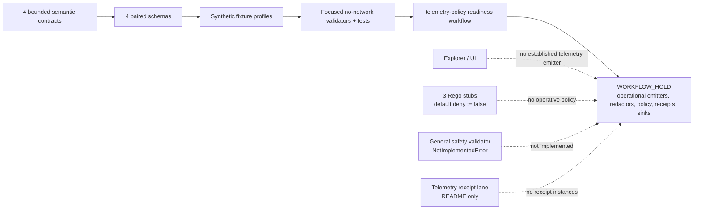
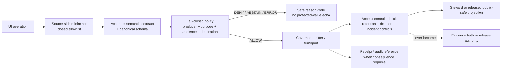

<!-- [KFM_META_BLOCK_V2]
doc_id: kfm://doc/architecture/ui/telemetry
title: UI Telemetry Architecture — Current Boundary and Graduation Map
type: architecture-reference
version: v1.0-draft
status: draft; repository-grounded; fixture-first; operational-telemetry-hold; non-authoritative
owners:
  - "@bartytime4life — verified CODEOWNERS review route"
  - "NEEDS VERIFICATION — independent UI, observability, security/privacy, policy, runtime, receipt, and release stewardship"
created: 2026-05-14
updated: 2026-08-19
policy_label: public; architecture; ui; telemetry; no-release; no-publication
owning_root: docs/
responsibility: "Explain the current UI telemetry boundary, repository-present profile evidence, explicit holds, and operational graduation requirements without becoming contract, schema, policy, runtime, receipt, release, or publication authority."
truth_posture: "CONFIRMED repository evidence / PROPOSED operational architecture / UNKNOWN deployed telemetry; cite-or-abstain"
current_path: docs/architecture/ui/TELEMETRY.md
evidence_snapshot:
  repository: bartytime4life/Kansas-Frontier-Matrix
  base_ref: main
  base_commit: 75849a09b2d18113a9a9b6c78332b83d19eb5832
  target_prior_blob: 9112e24030c8ac87ff94f3a3e365835403372eff
  directory_rules_blob: fd49a0b83e55cef52c1124281f093e263526898d
  telemetry_contract_readme_blob: 7523d7d638f598060661129ed70748b1bb2ad8be
  telemetry_schema_readme_blob: 582ee87f6d9a6a786730b1b47842d82ebb5a1e58
  telemetry_policy_readme_blob: bfa9eea887c5d071ab07ab93d7218b1a6246acf4
  telemetry_receipts_readme_blob: d98cf13b34d85838326b60a48f4b9c9c0a92bb03
  general_validator_blob: d0679edda558c33fcfa8feef4b99178b611028f3
  validator_lane_readme_blob: b0503f064995faf59dcf41183404efd999e2ec89
  no_raw_policy_blob: 9728577c061732b4b24069811397a0b6a135d5e9
  no_prompt_policy_blob: e8c7a77279c6fdee08592e1c6ad49e08c8e9305f
  no_restricted_coords_policy_blob: a240f2bc519fe461c8c9556874a747b1db013566
related:
  - docs/architecture/ui/README.md
  - docs/architecture/ui/BOUNDARIES.md
  - docs/architecture/ui/STATE_OWNERSHIP.md
  - docs/architecture/ui/MAP_RUNTIME_BOUNDARY.md
  - docs/architecture/governed-api.md
  - docs/architecture/governed-ai/README.md
  - docs/adr/ADR-0016-telemetry-redaction-posture.md
  - docs/adr/ADR-0029-adopt-directory-governance-standard-v2.md
  - docs/doctrine/directory-rules.md
  - docs/doctrine/trust-membrane.md
  - docs/standards/TELEMETRY_MINIMUMS.md
  - contracts/telemetry/README.md
  - contracts/telemetry/trace_receipt_link.md
  - contracts/telemetry/openlineage_run_event_projection.md
  - contracts/telemetry/remote_sensing_lineage_activity.md
  - contracts/telemetry/map_build_sustainability.md
  - schemas/contracts/v1/telemetry/README.md
  - policy/telemetry/README.md
  - policy/ui/README.md
  - tools/validators/validate_telemetry_safety.py
  - tools/validators/telemetry/README.md
  - data/receipts/telemetry/README.md
  - .github/workflows/telemetry-policy.yml
  - apps/explorer-web/README.md
  - apps/governed-api/README.md
tags: [kfm, architecture, ui, telemetry, observability, privacy, redaction, fixture-first, trust-membrane, fail-closed, no-release]
notes:
  - "v1.0-draft is a same-path documentation-only reconciliation against current repository evidence."
  - "ADR-0029 is accepted and confirms the existing docs/architecture/ui/ lane as placement-safe; ADR-0016 remains proposed."
  - "Four bounded telemetry profiles have paired semantic contracts, schemas, fixtures, validators, tests, and no-network workflow coverage; none is a general UI TelemetryEvent or operational emitter/sink contract."
  - "The general telemetry safety validator and three inspected Rego modules remain non-enforcing placeholders; operational telemetry remains on explicit hold."
[/KFM_META_BLOCK_V2] -->

# UI Telemetry Architecture — Current Boundary and Graduation Map

> **Operating rule.** UI telemetry may record bounded operational and governance signals. It must never become a side channel for raw evidence, prompts, identities, protected locations, policy internals, release authority, or public truth.

> [!IMPORTANT]
> **Current result: fixture-first evidence exists; operational UI telemetry does not.** At the pinned repository snapshot, KFM has four bounded telemetry profiles, paired machine shapes, focused local validators and tests, and a no-network readiness workflow. It does **not** have a general `TelemetryEvent` contract or schema, an implemented general telemetry-safety validator, operative fail-closed telemetry Rego, an established UI emitter, a governed ingestion route, a sink, a retention regime, or emitted telemetry receipt instances.

| Field | Current evidence-backed result |
|---|---|
| **Document role** | Human-readable architecture reference under `docs/`; not doctrine, a semantic contract, machine schema, policy rule, runtime, receipt, release record, or publication proof |
| **Placement outcome** | `PLACE` — same-path update inside the existing `docs/architecture/ui/` lane under accepted Directory Rules v2 |
| **Evidence snapshot** | `main@75849a09b2d18113a9a9b6c78332b83d19eb5832` |
| **Admitted telemetry profiles** | Four bounded, synthetic, fixture-first profiles; none is a general UI event envelope |
| **General UI event schema** | **ABSENT / HOLD** — `schemas/contracts/v1/telemetry/ui_event.schema.json` is not in the inspected schema inventory |
| **General telemetry policy** | **WORKFLOW_HOLD** — three inspected Rego modules are proposed stubs with `default deny := false` and no operative denial rule |
| **General telemetry validator** | **PLACEHOLDER** — `validate_telemetry_safety.py` raises `NotImplementedError` |
| **UI emitter / API route / sink** | **NOT ESTABLISHED** — no operational producer, governed route, collector, exporter, sink, or dashboard binding is proved |
| **Telemetry receipt instances** | **ZERO CONFIRMED** — `data/receipts/telemetry/` contains its boundary README only |
| **Release / publication effect** | None |

> [!CAUTION]
> **A green telemetry workflow is not a safe telemetry runtime.** The current workflow proves repository-local fixture polarity and keeps the missing operational controls visible. It does not prove deployed redaction, policy evaluation, transport security, sink safety, access control, retention, incident response, correction propagation, or publication readiness.

---

## Contents

- [1. Purpose and scope](#1-purpose-and-scope)
- [2. Definitions and authority split](#2-definitions)
- [3. Trust posture and non-effects](#3-trust-posture)
- [4. Current repository state](#4-telemetry-surfaces)
- [5. Current profile register](#5-event-envelope-contract)
- [6. Allowed and forbidden information classes](#6-allowed-vs-forbidden-fields)
- [7. Policy and finite-outcome boundary](#7-policy-gates)
- [8. Failure and degradation signals](#8-failure-telemetry-categories)
- [9. Sensitive-content and reconstruction boundary](#9-sensitive-content-boundary)
- [10. Current and target flows](#10-flow-diagram)
- [11. Validators, tests, and workflow evidence](#11-validators-and-tests)
- [12. Health indicators and operational graduation](#12-governance-health-indicators)
- [13. Anti-patterns](#13-anti-patterns)
- [14. Open verification register](#14-open-verification-items)
- [15. Related authorities and implementation surfaces](#15-related-docs)
- [16. Legacy proposal crosswalk](#16-appendix--proposed-field-reference)
- [17. Correction and rollback](#17-correction-and-rollback)

---

## 1. Purpose and scope

This page explains the architecture boundary for telemetry associated with KFM user-interface surfaces, including Explorer Web, the future map runtime, Evidence Drawer, Focus Mode, story playback, compare/export, diagnostics, and steward-facing review surfaces.

It serves four purposes:

1. **State current maturity accurately.** Separate the four implemented fixture-first profiles from the absent general UI telemetry runtime.
2. **Preserve the trust membrane.** Make clear which information classes must never cross a telemetry boundary.
3. **Keep authority separated.** Point to the contract, schema, policy, validator, receipt, runtime, and release homes that own behavior.
4. **Define graduation evidence.** Name the smallest proof set required before KFM may claim an operational UI telemetry path.

### In scope

- UI-originated operational and governance signals.
- Privacy, sensitivity, rights, and reconstruction-risk constraints on telemetry emission.
- Current telemetry profile, schema, policy-source, validator, workflow, and receipt evidence.
- The relationship between telemetry, receipts, evidence, policy, release, correction, and rollback.
- Finite outcomes and no-leak failure behavior.

### Out of scope

- Choosing a telemetry backend, collector, exporter, SDK, dashboard, alerting system, or vendor.
- Accepting ADR-0016 or the proposed Telemetry Minimums standard.
- Creating a general telemetry contract, schema, route, emitter, sink, policy bundle, or retention schedule.
- Activating live instrumentation, model calls, external services, source connectors, or public endpoints.
- Treating a trace, metric, log, profile, workflow result, or receipt as evidence truth or release authority.

### Non-effects

This document does not emit telemetry, validate a live event, execute policy, create a receipt, admit a source, resolve an `EvidenceRef`, alter lifecycle state, approve release, deploy a collector, expose a dashboard, or publish anything.

[Back to top](#top)

---

## 2. Definitions and authority split

| Term | Meaning in this architecture |
|---|---|
| **UI telemetry** | A proposed family of minimized, structured operational signals about UI behavior. No general UI event family is currently admitted. |
| **Telemetry profile** | A bounded semantic contract, machine schema, synthetic fixture set, validator, and test surface for one declared telemetry-related purpose. |
| **Operational telemetry** | Events, traces, metrics, or logs emitted by a running producer and transported to a collector or sink. This is not established for the current UI. |
| **Process memory** | A record of what a governed process did. Process memory may support audit and review, but it is not source truth, proof, or release authority. |
| **Governed emission** | Data crossing a process, transport, persistence, trust, or display boundary under minimization, sensitivity, rights, policy, and audit constraints. |
| **Reconstruction risk** | The possibility that individually harmless fields, identifiers, timing, counts, or joins can reveal a protected person, place, event, source, or fact. |
| **Graduation** | A reviewed transition from fixture-only proposal to operational capability after contract, schema, policy, implementation, tests, receipts, operations, and rollback evidence close. |

### Authority by responsibility

| Responsibility | Owning surface | Current posture |
|---|---|---|
| UI telemetry architecture | `docs/architecture/ui/TELEMETRY.md` | This explanatory page |
| Semantic meaning | [`contracts/telemetry/`](../../../contracts/telemetry/README.md) | Four bounded profiles; general telemetry-event semantics remain proposed |
| Machine shape | [`schemas/contracts/v1/telemetry/`](../../../schemas/contracts/v1/telemetry/README.md) | Four bounded schemas; no `ui_event.schema.json` |
| Admissibility and redaction | [`policy/telemetry/`](../../../policy/telemetry/README.md) and [`policy/ui/`](../../../policy/ui/README.md) | Source stubs and boundary documentation; no operative general policy |
| Deterministic validation | [`tools/validators/telemetry/`](../../../tools/validators/telemetry/README.md) and [`validate_telemetry_safety.py`](../../../tools/validators/validate_telemetry_safety.py) | Focused profile validators exist; general validator is a placeholder |
| Synthetic examples and tests | `fixtures/contracts/v1/telemetry/` and `tests/validators/telemetry/` | Bounded local profiles only |
| Telemetry receipt instances | [`data/receipts/telemetry/`](../../../data/receipts/telemetry/README.md) | Boundary README only; no instance proved |
| Producer, transport, collector, sink | `apps/`, `packages/`, `runtime/`, `infra/`, or another accepted implementation root | Not established for UI telemetry |
| Release, correction, rollback | `release/` and distinct governed lifecycle object families | No telemetry release or publication established |

> [!NOTE]
> A producer does not own the meaning, policy, receipt, or release state of what it emits. Responsibility roots stay separate even when one runtime operation references all of them.

[Back to top](#top)

---

## 3. Trust posture and non-effects

UI telemetry inherits KFM's cite-or-abstain and carrier-not-truth posture.

### Architecture invariants

- **Telemetry is process memory, not sovereign truth.** It may describe an operation; it cannot establish the truth of a domain claim.
- **Telemetry never substitutes for evidence.** A consequential claim still requires resolvable `EvidenceRef -> EvidenceBundle` support.
- **Telemetry never self-promotes.** A trace, metric, log, workflow pass, or receipt cannot approve release or publication.
- **Public clients do not read telemetry sinks directly.** Any outward-facing operational summary must be a separate, governed, public-safe projection.
- **Minimize before emission.** Source-side omission, classification, aggregation, or suppression is preferred over sink-only filtering.
- **Unknown context fails closed.** Unknown sensitivity, rights, audience, destination, reconstruction risk, policy version, or release state blocks operational emission.
- **Correction and rollback remain possible.** Retention, indexes, caches, dashboards, and derived summaries must support deletion, revocation, correction, or supersession when required.

### Telemetry egress versus publication

Telemetry crossing a process boundary is a governed egress event. It is **not automatically a `PUBLISHED` lifecycle transition**. Internal operational telemetry may remain restricted process memory. Public or semi-public telemetry summaries require their own release, access, correction, and rollback treatment.

### Trust-bearing references

A telemetry profile may carry safe references to a run, receipt, evidence bundle, policy decision, artifact, or release. The reference records context; it does not inherit the authority of the referenced object or replace resolution of that object at the governed boundary.

[Back to top](#top)

---

## 4. Current repository state

### Confirmed current evidence

| Surface | Verified state | Safe interpretation |
|---|---|---|
| Telemetry semantic lane | README plus four bounded profile contracts | Semantic coverage is partial and fixture-first |
| Telemetry schema lane | README plus four corresponding schemas | Shape proof for those profiles only |
| Fixture/validator lane | Focused validators and tests exist for the admitted profiles | Local deterministic conformance only; no live producer or sink |
| `telemetry-policy` workflow | Read-only, no-network repository checks over the admitted profiles and explicit operational holds | Workflow readiness evidence, not runtime enforcement |
| `policy/telemetry/no_restricted_coords.rego` | Proposed stub; `default deny := false`; no operative rule | Does not deny an input |
| `policy/ui/no_raw_in_telemetry.rego` | Proposed stub; `default deny := false`; no operative rule | Does not prevent raw-evidence emission |
| `policy/ui/no_prompt_in_telemetry.rego` | Proposed stub; `default deny := false`; no operative rule | Does not prevent prompt emission |
| General safety validator | Raises `NotImplementedError("Greenfield placeholder")` | General telemetry safety is not implemented |
| Telemetry receipt lane | Boundary README only | No emitted telemetry receipt instance is proved |
| Explorer Web | Bounded fixture-first shell; no production telemetry established by current UI evidence | No UI telemetry producer may be inferred |
| Governed API | Current architecture evidence establishes negative scaffold route families, not a telemetry ingestion route | `POST /api/v1/telemetry/ui` remains unverified and must not be documented as live |

### What is not established

The inspected repository evidence does not establish:

- a general `TelemetryEvent` semantic contract;
- a general UI telemetry schema or closed event vocabulary;
- source-side minimization or redaction code;
- an operational policy-input/output contract or fail-closed evaluator;
- an Explorer telemetry adapter, SDK, emitter, queue, collector, exporter, sink, or dashboard;
- authentication, authorization, encryption, CSP/CORS, network isolation, retention, deletion, backup, or incident behavior for telemetry;
- telemetry receipt instances, signatures, correction propagation, rollback execution, or released public summaries;
- production instrumentation, deployment, or public operation.

[Back to top](#top)

---

## 5. Current profile register

The current telemetry lane contains four explicitly bounded profiles. Their presence does not create a general event envelope.

| Profile | Bounded purpose | Current validator outcomes | Operational authority |
|---|---|---|---|
| [`TraceReceiptLink`](../../../contracts/telemetry/trace_receipt_link.md) | Assert deterministic linkage among one trace identity, run receipt, evidence-bundle digest, and attestation subjects | `PASS`, fail-closed findings, `ERROR` | None; no collector, backend, signature verification, promotion, or release |
| [`OpenLineageRunEventProjection`](../../../contracts/telemetry/openlineage_run_event_projection.md) | Produce and validate a deterministic fixture-only terminal OpenLineage-shaped projection from existing summaries | `PASS`, `DENY`, `ERROR` | None; inactive and no-network |
| [`RemoteSensingLineageActivity`](../../../contracts/telemetry/remote_sensing_lineage_activity.md) | Compose a fixture-only remote-sensing lineage and metrics projection | `PASS`, `DENY`, `ERROR` | None; inactive and no-network |
| [`MapBuildSustainability`](../../../contracts/telemetry/map_build_sustainability.md) | Evaluate a closed, internal-only fixture candidate for map-build energy/carbon review with explicit uncertainty and abstention | `PASS`, `ABSTAIN`, `DENY`, `ERROR` | None; review signal only |

### Explicit absence

The repository-present schema inventory does **not** include `ui_event.schema.json`. The semantic contract lane lists `telemetry_event.md` as a candidate object family rather than a current contract. Therefore:

- `TelemetryEvent` is a **PROPOSED name**, not an admitted object;
- any field table or JSON example for a UI event is illustrative design only;
- a future UI event slice must enter through the contract-schema-fixture-validator-test pattern rather than by copying prose from this page;
- adding an event profile requires a separately reviewable implementation slice with its own identity, policy, non-effects, and rollback.

[Back to top](#top)

---

## 6. Allowed and forbidden information classes

This section defines architecture constraints, not a normative machine field list. A future contract and schema must translate these classes into closed inputs and stable reason codes.

| Information class | Potentially admissible after contract and policy | Prohibited or held by default |
|---|---|---|
| Operation identity | Short-lived event/run correlation, stable service or release references, content digests | Stable user identity, IP address, email, device fingerprint, credential, token, private URL |
| UI surface | Closed surface or action category | Full route/query text, free-form user text, form content, prompt content |
| Map context | Coarse zoom band, public layer identifier, admitted generalized region | Exact center, viewport, tile/grid/site/parcel/route identifiers that reveal protected location, camera trace |
| Time | Coarse operational band or event timestamp when safe | Source observation detail, timing sequences that reveal protected activity or identity |
| Outcome | Closed finite outcome and public-safe reason code | Raw model output, raw evidence, reviewer notes, policy body, stack trace with payload values |
| Performance | Aggregated latency, byte, error, or saturation measurements with cardinality controls | Per-feature sizes or timings that reveal protected existence or small cohorts |
| References | Digests or opaque refs to receipts, evidence bundles, decisions, artifacts, or releases | Inline receipt, evidence, policy, source, correction, or release bodies |
| Counts | Aggregated, thresholded, purpose-bound totals | Sensitive feature counts, tiny cohorts, source-family counts that reveal protected presence |
| Diagnostics | Closed failure class and safe code | Raw exception string, locals, SQL, filesystem path, source payload, screenshot metadata |

### Required minimization order

1. Do not collect the field when the use case does not require it.
2. Prefer a classification, band, digest, or opaque reference over a protected value.
3. Apply source-side generalization, redaction, or suppression before serialization.
4. Enforce a closed schema with unknown fields denied.
5. Evaluate destination-, audience-, and purpose-specific policy.
6. Emit only after validation and policy both succeed.
7. Preserve an audit-safe decision reference without echoing the denied value.

[Back to top](#top)

---

## 7. Policy and finite-outcome boundary

### Current policy state

The inspected Rego files are source placeholders, not protection. Each uses `default deny := false` and contains no operative denial rule. The current workflow intentionally verifies that hold rather than pretending the source is enforced.

### Required future decision model

A future operational UI telemetry boundary should normalize validation and policy into a closed outward decision contract. Exact names remain **PROPOSED** until a semantic contract and schema are accepted.

| Outcome class | Required meaning |
|---|---|
| `PASS` or `ALLOW` | Event shape, producer, purpose, audience, destination, minimization, policy, and release context are all supported for the declared operation |
| `ABSTAIN` or `HOLD` | Required context, measurement, factor, source, profile, or support is unavailable without proving a policy violation |
| `DENY` | The event would expose forbidden, over-precise, unauthorized, rights-unclear, sensitivity-unsafe, or reconstruction-enabling information |
| `ERROR` | Parsing, schema validation, policy evaluation, redaction, transport preparation, or receipt generation failed safely |

> [!IMPORTANT]
> **No fail-open fallback.** An unavailable policy evaluator, unknown policy version, unresolved destination, or failed redactor must block emission. The current repository does not yet implement that operational rule.

### No-echo behavior

A denial or error response may identify a stable reason code and JSON path. It must not echo the protected value, prompt, evidence body, exact location, token, internal path, or raw exception text.

[Back to top](#top)

---

## 8. Failure and degradation signals

Failure telemetry is itself telemetry and must satisfy the same minimization boundary. The current general UI failure vocabulary is not admitted as a schema enum. The following categories remain architecture candidates derived from existing telemetry and map-runtime planning:

| Candidate class | Bounded meaning | Leakage guard |
|---|---|---|
| `oom` | Renderer, worker, or process memory exhaustion | No heap content or payload dump |
| `decode_exception` | Tile, sprite, image, or asset decode failed | No asset body or protected URL |
| `throttling` | A rate, replay, or interaction limit engaged | No user fingerprint or raw request text |
| `backpressure` | Queue, adapter, or runtime pressure prevented normal flow | No queue payload or internal topology detail |
| `token_failure` | Authentication or authorization material was rejected | No token, claims body, or stable identity echo |
| `signature_mismatch` | A digest or signature did not match its declared subject | Reference and safe code only; no protected carrier body |
| `gate_unverified` | Required release, policy, evidence, or runtime gate state was missing or stale | No hidden decision internals |

A future general event schema must either adopt a reviewed closed vocabulary or point to a separately accepted failure contract. This page does not reserve these identifiers as canonical.

[Back to top](#top)

---

## 9. Sensitive-content and reconstruction boundary

> [!WARNING]
> **Direct-field filtering is insufficient.** Exact coordinates are only one disclosure form. Protected location or identity may be reconstructed from tile IDs, geohashes, viewports, route segments, station IDs, timestamps, interaction sequences, counts, joins, or repeated queries.

### Fail-closed classes

Operational UI telemetry must default to deny, hold, generalize, suppress, or quarantine when it may expose:

- exact or reconstructable archaeology, rare-species, sacred/cultural, tribal/sovereignty, infrastructure, private-well, parcel, or protected-land locations;
- living-person identity, genealogy, DNA/genomics, protected health or employment information;
- source material restricted by license, terms, embargo, consent, or redistribution limits;
- prompts, model outputs, intermediate reasoning, evidence bodies, source payloads, screenshots, popup text, or tooltip content;
- credentials, tokens, private endpoints, internal object keys, filesystem paths, or stack locals;
- small cohorts, event counts, or timing sequences that reveal protected existence or behavior.

### Composition checks

A safe operational implementation must test both individual fields and combinations:

- location identifier + zoom or grid level;
- route family + timestamp + layer identifier;
- small count + geography + source family;
- repeated event sequence + short-lived session reference;
- style/layer state + camera movement;
- error code + internal service or artifact reference.

### Public and steward projections

Public, semi-public, internal, and steward telemetry are separate audience projections. A steward role does not make raw collection acceptable by default. Each projection still requires purpose limitation, least privilege, retention limits, auditability, correction, and incident handling.

[Back to top](#top)

---

## 10. Current and target flows

### 10.1 Current repository-proved flow

```mermaid
flowchart LR
    C["4 bounded semantic contracts"] --> S["4 paired schemas"]
    S --> F["Synthetic fixture profiles"]
    F --> V["Focused no-network validators + tests"]
    V --> W["telemetry-policy readiness workflow"]
    W --> H["WORKFLOW_HOLD\noperational emitters, redactors, policy, receipts, sinks"]

    UI["Explorer / UI"] -. "no established telemetry emitter" .-> H
    P["3 Rego stubs\ndefault deny := false"] -. "no operative policy" .-> H
    G["General safety validator\nNotImplementedError"] -. "not implemented" .-> H
    R["Telemetry receipt lane\nREADME only"] -. "no receipt instances" .-> H
```

This flow proves bounded local profile work and an explicit hold. It does not prove an operational pipeline.

### 10.2 Proposed graduation flow

```mermaid
flowchart LR
    U["UI operation"] --> M["Source-side minimizer\nclosed allowlist"]
    M --> C["Accepted semantic contract\n+ canonical schema"]
    C --> P["Fail-closed policy\nproducer + purpose + audience + destination"]
    P -->|DENY / ABSTAIN / ERROR| N["Safe reason code\nno protected-value echo"]
    P -->|ALLOW| E["Governed emitter / transport"]
    E --> K["Access-controlled sink\nretention + deletion + incident controls"]
    E --> R["Receipt / audit reference\nwhen consequence requires"]
    K --> D["Steward or released public-safe projection"]
    K -. "never becomes" .-> T["Evidence truth or release authority"]
```

Every box in the proposed flow remains **PROPOSED** until current code, contracts, schemas, policy, tests, receipts, operations evidence, and an accepted decision prove it.

[Back to top](#top)

---

## 11. Validators, tests, and workflow evidence

### Current bounded proof

| Surface | Current proof | Explicit limit |
|---|---|---|
| Focused profile validators | Deterministic local checks for shape, identity, binding, arithmetic, uncertainty, non-effects, and finite outcomes | Do not contact external systems or prove operational telemetry |
| Profile fixtures | Positive and negative synthetic cases under `fixtures/contracts/v1/telemetry/` | No production payloads, emitters, collectors, or sinks |
| `telemetry-policy` workflow | Read-only checkout, no-network posture, exact profile inventory, raw/prompt/coordinate key checks, explicit stub-state assertions | Does not run an operative general telemetry policy or deployed producer |
| General safety validator | File presence only | Raises `NotImplementedError`; no safety decision is produced |
| Rego source | File/package/default-state presence | No operative rules or native policy tests prove denial |

### Minimum negative test families for graduation

A future operational slice must include synthetic, public-safe fixtures that prove:

- raw evidence and source payload denial;
- prompt, model output, and reasoning-content denial;
- direct coordinate, geometry, bbox, WKT, and route-trace denial;
- indirect reconstruction through tile/grid/site/parcel identifiers;
- unknown-field and duplicate-key denial;
- stable identity, IP, fingerprint, credential, token, and private-URL denial;
- small-cohort and sensitive-count suppression or abstention;
- policy unavailable, schema unavailable, redactor failed, and sink unavailable fail closed;
- reason codes do not echo protected values;
- correction, revocation, retention expiry, deletion, and rollback behavior;
- no network or model calls in the fixture-first proof slice.

### Validation distinction

- **Schema pass:** machine shape only.
- **Policy pass:** admissibility for one declared input, purpose, audience, destination, and policy version.
- **Validator pass:** bounded deterministic checks implemented by that validator.
- **Workflow pass:** the exact jobs ran for the exact commit.
- **Operational proof:** deployed producer-to-sink behavior under current configuration, access, retention, incident, and rollback controls.
- **Release/publication:** a separate governed state transition.

[Back to top](#top)

---

## 12. Health indicators and operational graduation

### 12.1 Current architecture health indicators

| Indicator | Current result |
|---|---|
| General UI telemetry contract | `HOLD` — candidate only |
| General UI telemetry schema | `HOLD` — absent from current schema inventory |
| General policy enforcement | `WORKFLOW_HOLD` — source stubs are non-enforcing |
| General safety validator | `PLACEHOLDER` |
| Fixture-first profile coverage | `4` bounded profiles |
| Operational emitter / sink | `NOT ESTABLISHED` |
| Telemetry receipt instances | `0` confirmed |
| Production deployment evidence | `UNKNOWN` |

### 12.2 Graduation gates

An operational UI telemetry slice is ready for review only when all applicable gates close:

1. **Decision and ownership** — accepted posture or bounded ADR disposition; named accountable owners and required independent reviewers.
2. **Scope** — one observable use case, one producer boundary, one audience/destination, explicit non-goals, and a reversible rollback boundary.
3. **Semantic contract** — closed object meaning, finite outcomes, reason codes, non-effects, correction, retention, and deletion semantics.
4. **Machine schema** — closed fields, bounded cardinality, stable identity policy, unknown-field denial, and versioning rules.
5. **Source minimization** — implementation omits or transforms protected values before serialization.
6. **Policy** — fail-closed evaluator with accepted input/output contract, native tests, safe reasons, obligations, and policy-version binding.
7. **Validation** — implemented general safety validator plus focused positive, deny, abstain/hold, error, reconstruction, and no-echo fixtures.
8. **Transport and sink** — authenticated and authorized route/collector, encryption, least privilege, egress limits, safe buffering, backpressure, and no hidden fallback.
9. **Operations** — retention, deletion, backup, incident response, breach review, access audit, sampling, cardinality, and cost controls.
10. **Receipts and lineage** — auditable references when consequence requires, without turning telemetry into proof or release authority.
11. **Correction and rollback** — propagation across sinks, indexes, dashboards, caches, and public-safe projections, with a tested rollback target.
12. **Exact-head evidence** — repository-native focused tests, aggregate validation, hosted checks at the exact head, and deployment evidence before any production claim.

No one gate may be inferred from another. A schema does not prove policy; policy source does not prove evaluation; workflow success does not prove deployment; deployment does not prove publication.

[Back to top](#top)

---

## 13. Anti-patterns

| Anti-pattern | Why it fails | Required correction |
|---|---|---|
| Treating telemetry as evidence truth | Process memory cannot establish a domain claim | Resolve `EvidenceRef -> EvidenceBundle` or abstain |
| Documenting the proposed `POST /api/v1/telemetry/ui` route as live | No current route implementation is proved | Keep route `HOLD` until code, tests, policy, and deployment evidence close |
| Treating `default deny := false` stubs as redaction policy | The current modules do not deny anything | Implement and test fail-closed policy in a separate reviewed slice |
| Relying on key-name filtering alone | Protected detail can be reconstructed indirectly | Add semantic classification and composition tests |
| Logging raw prompts, model output, evidence, or stack locals for debugging | Creates a trust-membrane bypass | Emit safe refs and stable reason codes only |
| Stable user IDs, IPs, or fingerprints in UI telemetry | Creates tracking and re-identification risk | Use no identity unless purpose and policy require it; prefer short-lived opaque correlation |
| Exact map center, viewport, tile, route, or camera trace | Can reveal protected locations or behavior | Generalize, aggregate, suppress, or deny before emission |
| Sensitive counts in public dashboards | Counts can disclose protected existence | Use thresholded steward-only projections or abstain |
| Fail-open policy, redactor, or sink fallback | Turns control failure into disclosure | Reject or hold emission until controls recover |
| Telemetry as a release gate by itself | Operational signals do not authorize publication | Release decisions must consume the full governed evidence, policy, review, proof, correction, and rollback set |
| A green readiness workflow described as production readiness | Repository-local fixture proof is narrower than runtime proof | State the exact evidence boundary and preserve operational HOLD |
| Architecture prose copied into a schema without a contract slice | Creates accidental machine authority from illustrative text | Implement contract, schema, fixtures, validator, tests, and versioning together |

[Back to top](#top)

---

## 14. Open verification register

| ID | Question | Current status | Closure evidence |
|---|---|---|---|
| `UI-TEL-001` | Should KFM admit a general UI telemetry event family at all, or retain purpose-specific profiles only? | `OPEN / DECISION` | Accepted bounded decision with use cases, risks, and non-goals |
| `UI-TEL-002` | Which root owns the general telemetry policy input/output contract and bundle selection? | `NEEDS VERIFICATION` | Contract/schema/policy ownership decision and consumer map |
| `UI-TEL-003` | Should raw/prompt/restricted-location rules remain split between `policy/ui/` and `policy/telemetry/`? | `CONFLICTED / HOLD` | Authority and migration decision with no parallel writable policy |
| `UI-TEL-004` | What producer, route, collector, sink, and storage topology is intended? | `UNKNOWN` | Current implementation files, threat model, tests, and deployment evidence |
| `UI-TEL-005` | What audience, access, retention, deletion, backup, and incident rules apply? | `UNKNOWN` | Security/privacy/operations review and tested runbook |
| `UI-TEL-006` | Which location, identifier, count, and sequence profiles create reconstruction risk per source family? | `NEEDS VERIFICATION` | Sensitivity/right profiles and negative fixture matrix |
| `UI-TEL-007` | Which events require a receipt or signed lineage reference? | `OPEN / DECISION` | Receipt contract and separation-of-object-families review |
| `UI-TEL-008` | Is `TelemetryEvent` the correct general name, and what is its deterministic identity policy? | `OPEN / DECISION` | Accepted semantic contract and identity profile |
| `UI-TEL-009` | Are the proposed Telemetry Minimums and ADR-0016 accepted, revised, or held? | `PROPOSED` | Accepted ADR/status transition with synchronized indexes |
| `UI-TEL-010` | What exact current production telemetry, external SDK, vendor agent, or private infrastructure exists outside tracked code? | `UNKNOWN` | Deployment, package, config, network, account, and runtime inventory |
| `UI-TEL-011` | Who owns operational telemetry and independent security/privacy review? | `NEEDS VERIFICATION` | Named accountable roles and review requirements |
| `UI-TEL-012` | What public-safe telemetry summaries, if any, may appear in the Evidence Drawer or dashboards? | `HOLD` | Separate released projection contract, policy, evidence, correction, and rollback |

[Back to top](#top)

---

## 15. Related authorities and implementation surfaces

| Surface | Relationship |
|---|---|
| [`UI architecture README`](./README.md) | Parent UI architecture boundary and current implementation summary |
| [`UI Boundaries`](./BOUNDARIES.md) | Browser trust membrane, current Explorer/Governed API evidence, and negative states |
| [`State Ownership`](./STATE_OWNERSHIP.md) | UI state ownership and non-authority boundaries |
| [`Map Runtime Boundary`](./MAP_RUNTIME_BOUNDARY.md) | Renderer/runtime seam and map-selection limits |
| [`Governed API architecture`](../governed-api.md) | Dynamic trust-membrane architecture; route maturity must be verified separately |
| [`Governed AI README`](../governed-ai/README.md) | Focus/AI boundary, finite outcomes, and no prompt/model-output leakage |
| [`ADR-0016`](../../adr/ADR-0016-telemetry-redaction-posture.md) | Proposed telemetry minimization and redaction decision; not accepted |
| [`ADR-0029`](../../adr/ADR-0029-adopt-directory-governance-standard-v2.md) | Accepted placement authority for the responsibility-root split |
| [`Directory Rules`](../../doctrine/directory-rules.md) | Adopted human-readable path and authority law |
| [`Trust Membrane`](../../doctrine/trust-membrane.md) | Doctrine-level carrier, evidence, policy, release, and public-boundary posture |
| [`Telemetry Minimums`](../../standards/TELEMETRY_MINIMUMS.md) | Proposed operational standard; current thresholds and enforcement remain unratified |
| [`Telemetry contracts`](../../../contracts/telemetry/README.md) | Semantic meaning and candidate object families |
| [`Telemetry schemas`](../../../schemas/contracts/v1/telemetry/README.md) | Current four-profile machine-shape inventory |
| [`Telemetry policy`](../../../policy/telemetry/README.md) | Repository-grounded current policy-source boundary and explicit operational hold |
| [`UI policy`](../../../policy/ui/README.md) | Adjacent raw-evidence and prompt-content policy-source stubs |
| [`Telemetry validators`](../../../tools/validators/telemetry/README.md) | Bounded local validator behavior and commands |
| [`General telemetry validator`](../../../tools/validators/validate_telemetry_safety.py) | Current placeholder state |
| [`Telemetry receipts`](../../../data/receipts/telemetry/README.md) | Receipt-family boundary; no instance proved |
| [`telemetry-policy workflow`](../../../.github/workflows/telemetry-policy.yml) | No-network readiness checks and explicit workflow hold |
| [`Explorer Web README`](../../../apps/explorer-web/README.md) | Current UI deployable boundary; no production telemetry inferred |
| [`Governed API README`](../../../apps/governed-api/README.md) | Deployable trust-membrane boundary; candidate route families are not implementation proof |

[Back to top](#top)

---

## 16. Legacy proposal crosswalk

The prior edition contained useful safety intent but mixed future design with current-state language. This crosswalk preserves the intent without preserving unsupported implementation claims.

| Prior statement or surface | Current repository finding | v1.0 treatment |
|---|---|---|
| `TelemetryEvent` is the UI telemetry object family | Candidate name only; no general semantic contract exists | Retained as an open design option, not current authority |
| `schemas/contracts/v1/telemetry/ui_event.schema.json` is the schema home | File absent; current inventory contains four other schemas | Marked `ABSENT / HOLD` |
| `POST /api/v1/telemetry/ui` is the governed route | No current route implementation or deployment proof was established | Removed as current flow; may return only through a future implementation slice |
| `policy/telemetry/` fail-closes unsafe events | Current Rego source is non-enforcing and allow-by-default | Corrected to `WORKFLOW_HOLD` |
| Raw/prompt/restricted-coordinate policy is operational | Three source stubs exist; no operative rules, evaluator, or native policy tests proved | Corrected to source-presence only |
| General schema validator exists | General safety validator raises `NotImplementedError` | Corrected to `PLACEHOLDER` |
| Negative runtime fixture tree exists for all UI events | Four profile-specific fixture families exist; no general UI event fixtures | Replaced with exact current profile register and future graduation matrix |
| A governed telemetry sink feeds release-gate evidence | No producer, route, collector, sink, retention, or receipt instance proved | Removed from current-state diagram |
| Proposed JSON field and enum examples are normative | No accepted general schema exists | Removed; architecture classes remain non-normative |
| Sensitive counts may appear in governance views | No accepted aggregation threshold, access model, or operational view proved | Retained as a possible steward projection only after policy and release review |

### Preserved design intent

The following intent remains valid as architecture guidance:

- telemetry is a downstream carrier and process-memory surface;
- raw evidence, prompts, model output, secrets, stable identities, and protected detail must not leak;
- exact and reconstructable locations require fail-closed treatment;
- event and failure vocabularies should be closed and versioned;
- denial and error responses must not echo protected values;
- schema, policy, validation, receipts, operations, correction, and rollback must be separately inspectable;
- no telemetry object becomes evidence truth, release authority, or publication merely by existing.

[Back to top](#top)

---

## 17. Correction and rollback

### Documentation correction

When repository evidence changes materially, update this page in the same reviewed slice or explicitly record why the documentation must follow later. Refresh the evidence snapshot when any of these change:

- telemetry contract or schema inventory;
- policy package, rule behavior, or bundle selection;
- general or profile validator behavior;
- fixture profile inventory;
- workflow jobs, exact-head results, or hold semantics;
- Explorer/Governed API producer or route behavior;
- receipt-instance inventory;
- collector, sink, retention, incident, correction, or rollback implementation;
- ADR-0016 or Telemetry Minimums status.

### Rollback

Before merge, close the draft pull request and abandon its branch. After an authorized merge, revert this single documentation commit or apply a reviewed forward correction. The rollback must not restore unsupported claims that a general schema, route, fail-closed policy, emitter, sink, or receipt flow exists.

No telemetry event, receipt, source, lifecycle state, release, deployment, or publication requires operational rollback because this change edits architecture documentation only.

[Back to top](#top)
