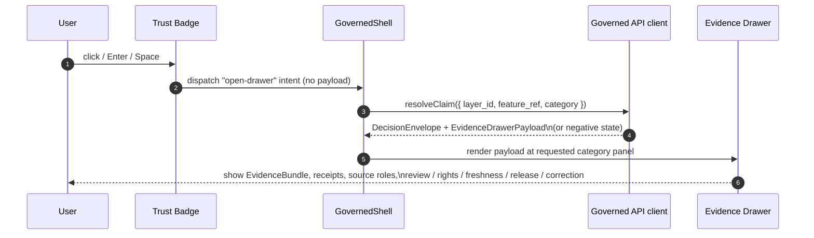

<!-- [KFM_META_BLOCK_V2]
doc_id: kfm://doc/architecture/ui/trust-badges
title: Trust-Visible Badges — UI Architecture
type: standard
version: v1
status: draft
owners: <UI subsystem owner> + <Docs steward>   # PLACEHOLDER — verify against CODEOWNERS
created: 2026-05-14
updated: 2026-05-14
policy_label: public
related:
  - docs/architecture/ui/README.md
  - docs/architecture/ui/BOUNDARIES.md
  - docs/architecture/ui/STATE_OWNERSHIP.md
  - docs/architecture/governed-ai/README.md
  - docs/doctrine/trust-membrane.md
  - docs/doctrine/truth-posture.md
  - schemas/contracts/v1/ui/evidence_drawer_payload.schema.json
  - schemas/contracts/v1/runtime/decision_envelope.schema.json
tags: [kfm, ui, trust, badges, evidence, accessibility]
notes:
  - All implementation paths are PROPOSED until verified against a mounted repo.
  - Doctrinal claims trace to SRC-061 (Master MapLibre, v1.7+), SRC-WHOLE-UI, and SRC-DIRRULES.
[/KFM_META_BLOCK_V2] -->

# Trust-Visible Badges — UI Architecture

> Badges expose **trust state**, not evidence. They route to proof; they never stand in for it.

<!-- Top badge row — replace placeholder targets after mounting CI and badge endpoints. -->


**Status:** draft &nbsp;·&nbsp; **Owners:** UI subsystem owner + Docs steward *(placeholder — verify)* &nbsp;·&nbsp; **Updated:** 2026-05-14

---

## Quick jump

- [1. Purpose & scope](#1-purpose--scope)
- [2. Truth posture (read this first)](#2-truth-posture-read-this-first)
- [3. Doctrinal foundations](#3-doctrinal-foundations)
- [4. Finite trust-visible states](#4-finite-trust-visible-states)
- [5. Badge category families](#5-badge-category-families)
- [6. State machine](#6-state-machine)
- [7. Click resolution: badge → Evidence Drawer](#7-click-resolution-badge--evidence-drawer)
- [8. Data model](#8-data-model)
- [9. MapLibre adapter binding](#9-maplibre-adapter-binding)
- [10. Stream / freshness behavior](#10-stream--freshness-behavior)
- [11. Security boundary](#11-security-boundary)
- [12. Accessibility requirements](#12-accessibility-requirements)
- [13. Exports & screenshots](#13-exports--screenshots)
- [14. Anti-patterns](#14-anti-patterns)
- [15. Validation tests](#15-validation-tests)
- [16. Open verification items](#16-open-verification-items)
- [17. Related docs](#17-related-docs)
- [Appendix A: terminology](#appendix-a-terminology)
- [Appendix B: evidence basis](#appendix-b-evidence-basis)

---

## 1. Purpose & scope

This document defines the **trust-visible badge system** rendered across KFM's UI surfaces — the MapLibre map, Layer Catalog, Evidence Drawer, Focus panel, Story Node player, and export/screenshot pipeline. It specifies what trust badges are, what they are not, the finite states they may take, how they bind to data, and the governance and accessibility obligations that follow from displaying them.

It does **not** specify visual design tokens (colors, spacing, typography). Those live with the design tokens / styles authority; see [§17 Related docs](#17-related-docs).

| Field | Value |
|---|---|
| Doctrine status | **CONFIRMED** — SRC-061 §S, SRC-WHOLE-UI §17, SRC-061 ML-061-138/139/140 |
| Implementation status | **PROPOSED** — no `apps/explorer-web/src/features/evidence/TrustBadges.tsx` verified in this session |
| Schema home (PROPOSED) | `schemas/contracts/v1/ui/` per ADR-0001 (schema home) |
| Trust-membrane class | **Public-facing UI surface** — must route to governed API; must not access RAW / WORK / QUARANTINE / canonical stores |
| Lifecycle invariant | Badges may **only** carry state derived from `PUBLISHED` artifacts and their attached receipts |

> [!IMPORTANT]
> A badge is a **pointer** to verification, not the verification itself. Removing or styling badges does not change rights, sensitivity, freshness, review state, or release state — those live in `SourceDescriptor`, `EvidenceBundle`, `PolicyDecision`, `ReviewRecord`, `ReleaseManifest`, and receipts.

---

## 2. Truth posture (read this first)

Three rules govern every line of this document.

1. **Badges expose trust state visibly without substituting UI badges for evidence.** (CONFIRMED doctrine — SRC-061 ML-061-138, ML-061-090.)
2. **Badge clicks open proof details rather than replacing the Evidence Drawer.** (CONFIRMED doctrine — SRC-061 ML-061-139.)
3. **Unknown, stale, or failed verification states need distinct visual treatment.** (CONFIRMED doctrine — SRC-061 ML-061-140.)

If a badge cannot satisfy all three, it MUST NOT ship. The compliant fallback is: **render the badge in `UNKNOWN` state and abstain from making a trust claim.**

---

## 3. Doctrinal foundations

CONFIRMED in attached project knowledge:

- **`TrustVisibleState`** is a required contract object for the Accessibility / UX / Trust-Visible States category (SRC-061 §S). It is paired with `EvidenceDrawerPayload`, `StaleSourceFixture`, and `VerifyReceipt`.
- **Public UI surfaces** must show released, policy-safe, versioned, and citation-capable state; **popups and badges cannot substitute for the Evidence Drawer.** (SRC-061 §S.)
- **Policy implication** for badge display: fail closed for rights uncertainty, unverified signatures, missing provenance, stale source state, sensitive geometry, and incomplete citation support.
- **CARE labels and sovereignty notice chips are required in UI** for culturally sensitive and sovereignty-bearing content (SRC-061 ML-061-160).
- **FAIR+CARE badges are not release authority.** A green CARE badge does not promote, publish, or supersede a `PolicyDecision` (SRC-MapLibre v1.6 ML-059-063).

PROPOSED in attached project knowledge:

- A `TrustBadges` component is enumerated in the Whole-UI Expansion Report at `apps/explorer-web/src/features/evidence/TrustBadges.tsx` covering **source role, rights, sensitivity, review, freshness, release, and correction** badges. *Path PROPOSED; component status PROPOSED.*
- An `AutomationBadgePayload` projection — distinct from `EvidenceBundle` — is described for attestation/SBOM/manifest/log references on automation badges (SRC-MapLibre v1.5 ML-057-014).

---

## 4. Finite trust-visible states

Every badge MUST resolve to exactly one of four finite states. Color alone MUST NOT distinguish them; each state has a required text label and a required non-color indicator (icon shape, hatching, or border treatment).

| State | Meaning | Required indicators | Click target | Default policy posture |
|---|---|---|---|---|
| **VERIFIED** | The category check passed: receipts resolve, signatures validate, freshness is within tolerance, review is current, release is `PUBLISHED`. | Text label + filled icon + accessible name | Opens Evidence Drawer; **does not** replace it. | Allow display |
| **STALE** | The artifact is released but a freshness, schema, geography, model, review, rights, or policy tolerance has aged past its declared limit. | Text label + outlined icon + non-color marker (e.g., dashed border) | Opens Evidence Drawer with stale-source detail and superseded-by link (if any). | Show with caveat; Focus Mode **abstains** on consequential claims |
| **UNKNOWN** | A required check could not be performed in the current session (receipt unresolved, signature unfetched, drawer payload incomplete). This is the **default fallback** state. | Text label + question-mark icon + non-color marker | Opens Evidence Drawer to the "evidence unresolved" panel. | Show as caveat; gated routes **abstain** |
| **FAILED** | A required check ran and **failed** (digest mismatch, signature invalid, citation invalid, rights revoked, sensitive-geometry deny). | Text label + alert icon + non-color marker | Opens Evidence Drawer to the failure reason with `PolicyDecision` reference. | **DENY** public display where the layer's release tier requires verification |

> [!CAUTION]
> `UNKNOWN` is not "OK by default." It is "**we have not verified this**." UI surfaces MUST treat `UNKNOWN` as a caveat, not a pass. Focus Mode MUST `ABSTAIN` when a consequential evidence chain resolves to `UNKNOWN`.

Evidence basis: SRC-061 ML-061-138, ML-061-140; SRC-MapLibre v1.5 ML-057-016 (stream degradation surfaces `STALE`).

---

## 5. Badge category families

CONFIRMED categories from KFM doctrine. PROPOSED component-level grouping mirrors the Whole-UI Expansion Report's `TrustBadges.tsx` enumeration.

| # | Family | What it surfaces | Source object | Doctrine basis |
|---|---|---|---|---|
| 1 | **Source role** | Whether the layer's evidence is `observed`, `derived`, `modeled`, `regulatory`, `historical`, etc. — never collapses roles. | `SourceDescriptor`, `EvidenceRef.source_role` | SRC-061 §S; SRC-WHOLE-UI §18 |
| 2 | **Rights** | Open / controlled / restricted / unknown. Drives DENY on `unknown`. | `SourceDescriptor.rights_status` | SRC-061 §Q; ADR-0001-style schema home |
| 3 | **Sensitivity** | Public / generalized / restricted / review_required. Drives generalization for archaeology, fauna, people-land. | `ReleaseManifest.sensitivity`, `SensitiveGeometryTransform` | SRC-061 §Q; ML-061-158/159 |
| 4 | **Review** | Reviewed / aged-out / under-review / not-required. | `ReviewRecord` | Domains Atlas §24.8.1 |
| 5 | **Freshness** | Fresh / stale / unknown vs declared cadence in `SourceDescriptor`. | `SourceDescriptor.cadence` + `RunReceipt.retrieved_at` | SRC-061 ML-061-094; ML-061-118 |
| 6 | **Release** | DRAFT / REVIEW / PUBLISHED / REVOKED / SUPERSEDED. | `ReleaseManifest.release_state` | New Ideas 5-8-26 (ReleaseManifest schema) |
| 7 | **Correction** | None / corrected / superseded — links to `CorrectionNotice`. | `CorrectionNotice` | Domains Atlas §24.8.2 |
| 8 | **CARE / sovereignty chip** | CARE label + sovereignty notice for culturally sensitive content. **MANDATORY** where the source descriptor declares CARE applicability. | `SourceDescriptor.care_label`, sovereignty register | SRC-061 ML-061-160; Pass 10 §6.15 |
| 9 | **Attestation / automation badge** (optional) | Build/SBOM/attestation link with finite status enum. **Distinct projection from `EvidenceBundle`.** | `AutomationBadgePayload` | SRC-MapLibre v1.5 ML-057-013/014/017 |

> [!NOTE]
> Categories 1–7 form the **default badge set** for every released layer. Category 8 is **mandatory when applicable** and MUST be visually prominent — not buried in a tooltip. Category 9 is optional and **only ever a pointer**; it never carries the citation surface.

---

## 6. State machine

The badge state machine is intentionally narrow. Every transition is driven by a governed event, not by client-side inference.

```mermaid
stateDiagram-v2
    [*] --> UNKNOWN: badge mounted, payload not yet resolved
    UNKNOWN --> VERIFIED: all category checks resolve;\nreceipts present; release PUBLISHED;\nfreshness within tolerance
    UNKNOWN --> STALE: receipts resolve but freshness /\nschema / geography / model / review /\nrights / policy tolerance exceeded
    UNKNOWN --> FAILED: digest mismatch, invalid signature,\ncitation invalid, rights revoked,\nsensitive-geometry DENY
    VERIFIED --> STALE: tolerance crossed at runtime
    VERIFIED --> FAILED: revocation / correction supersedes release
    STALE --> VERIFIED: re-admission / supersession publishes\nwith fresh receipts
    STALE --> FAILED: receipt invalidation or rights revocation
    FAILED --> UNKNOWN: payload re-requested\n(transitional, brief)
    note right of UNKNOWN
      Default fallback.
      Gated routes ABSTAIN.
    end note
    note right of FAILED
      Public-tier layers in this state
      MUST be hidden or denied.
    end note
```



> [!NOTE]
> The diagram is **structural** (CONFIRMED doctrine), not a runtime spec. Concrete transition wiring (event names, debounce windows, retry semantics) is **PROPOSED** until a mounted repo is verified. See [§16 Open verification items](#16-open-verification-items).

---

## 7. Click resolution: badge → Evidence Drawer

A click on **any** badge follows the same governed path. Badges never carry the citation surface themselves.



Rules (CONFIRMED doctrine):

- A badge **MUST NOT** display feature properties as claims; the click creates a **governed claim-resolution request** that returns `DecisionEnvelope` and `EvidenceDrawerPayload` or a negative state (SRC-WHOLE-UI §18).
- Negative drawer states — `evidence_missing`, `restricted`, `stale`, `conflict`, `invalid_payload`, `policy_denied` — are **first-class** display targets, not error pages (SRC-WHOLE-UI §19.1).
- If a popup precedes the drawer, the popup MUST be a launch point, **not** the evidence substitute (SRC-064 ML-064-080; SRC-MapLibre v1.6 ML-059-061).

---

## 8. Data model

### 8.1 `TrustVisibleState` (PROPOSED schema home: `schemas/contracts/v1/ui/trust_visible_state.schema.json`)

Conceptually, `TrustVisibleState` is the projection that drives a single badge instance. Field set below is **PROPOSED** — derived from CONFIRMED doctrine for each badge family. Final shape requires ADR + schema work.

```jsonc
// PROPOSED — illustrative only. Do not treat as the canonical schema.
{
  "object_type": "TrustVisibleState",
  "schema_version": "v1",
  "layer_id": "kfm://layer/...",
  "feature_ref": "kfm://feature/...",            // optional; layer-level if absent
  "category": "freshness",                        // one of: source_role | rights | sensitivity |
                                                  //         review | freshness | release |
                                                  //         correction | care | automation
  "state": "STALE",                               // VERIFIED | STALE | UNKNOWN | FAILED
  "label_text": "Stale (cadence exceeded)",       // required, non-color
  "reason_codes": ["source_cadence_exceeded"],
  "drawer_target": {
    "drawer_panel": "freshness",
    "evidence_drawer_payload_ref": "kfm://drawer/..."
  },
  "evidence_refs": ["kfm://evidence/ref/..."],    // never inlined claims
  "release_manifest_ref": "kfm://release/...",
  "checked_at": "2026-05-14T00:00:00Z",
  "tolerance": { "expected_cadence": "P7D", "last_seen": "2026-04-20T00:00:00Z" }
}
```

### 8.2 Relationship to surrounding objects

| Object | Relationship | Authority |
|---|---|---|
| `EvidenceBundle` | `TrustVisibleState.evidence_refs` resolve into bundles via the governed API. Never inlined. | CONFIRMED doctrine |
| `EvidenceDrawerPayload` | The click target. `TrustVisibleState.drawer_target.evidence_drawer_payload_ref` points to it; the drawer carries the citation surface. | CONFIRMED doctrine (SRC-WHOLE-UI §19.1) |
| `DecisionEnvelope` | Wraps the badge-click response (`ANSWER` / `ABSTAIN` / `DENY` / `ERROR`). A `DENY` produces a `FAILED` badge state for the affected category. | CONFIRMED doctrine |
| `ReleaseManifest` | Supplies `release_state`, `policy_label`, `rights_status`, `sensitivity`. | CONFIRMED (New Ideas 5-8-26 ReleaseManifest schema) |
| `VerifyReceipt` | Required artifact backing the `VERIFIED` state for category 9 (attestation). | CONFIRMED (SRC-061 §S required objects) |
| `AutomationBadgePayload` | Projection for category 9 only; **MUST NOT** be conflated with `EvidenceBundle`. | CONFIRMED (SRC-MapLibre v1.5 ML-057-014) |

> [!IMPORTANT]
> `TrustVisibleState` is **read-only at the client**. Browsers MUST NOT mutate it, derive new trust states locally, or merge multiple states into a "summary" badge that hides reasons.

---

## 9. MapLibre adapter binding

CONFIRMED doctrine: MapLibre is a disciplined 2D renderer; only the `MapLibreAdapter` may import MapLibre runtime APIs (SRC-WHOLE-UI §18).

- Badges that overlay map features bind to a MapLibre GeoJSON source via **`sourceId` + `featureIdProp`**, using `promoteId` / deterministic feature IDs where practical (SRC-MapLibre v1.5 ML-057-015).
- Badge joins **MUST NOT drift** from layer feature IDs. CI MUST include a join-drift test.
- The MapLibre adapter MAY pin overlay badges on Cesium scenes when 3D is conditionally enabled, but the adapter does **not** become the source of truth for badge state (SRC-MapLibre v1.5 ML-057-013).

```text
Feature click
  → MapLibreAdapter.queryRenderedFeatureAtPoint()
  → governed claim-resolution request (NOT direct feature property display)
  → DecisionEnvelope + EvidenceDrawerPayload (or negative state)
  → Trust Badge updates from VERIFIED|STALE|UNKNOWN|FAILED via TrustVisibleState
```

---

## 10. Stream / freshness behavior

CONFIRMED doctrine (SRC-MapLibre v1.5 ML-057-016):

- Badge / automation streams MAY use SSE or WebSocket with **fallback polling every ~15s** and redraw debouncing.
- When the stream fails over to polling — or polling itself ages out — the UI MUST visibly surface the **degraded** state. In trust-badge terms, the affected categories transition to `STALE`.
- Stream outage **MUST NOT** be silent. Tests MUST cover both happy-path and outage-with-polling-fallback latency.

> [!TIP]
> Treat the freshness badge as the canonical surface for "the data behind this layer just got older while you were looking at it." Don't hide it in a tooltip.

---

## 11. Security boundary

CONFIRMED doctrine (SRC-MapLibre v1.5 ML-057-017):

- The browser **MUST NOT fetch untrusted attestations directly.** Remote attestations are **proxied through the governed API**, which verifies signatures and strips secrets before returning a sanitized projection.
- CORS allowlists and content types MUST be enforced at the proxy.
- Badge components MUST NOT import a signature-verification crypto stack into the browser bundle for the purpose of replacing this proxy.

| Boundary rule | Status |
|---|---|
| Browser fetches `https://attestation.example.com/...` directly | **PROHIBITED** |
| Browser fetches `/<governed-api>/attestations/<id>` | **REQUIRED PATH** |
| Browser displays `AutomationBadgePayload` with stripped, validated links | **ALLOWED** |
| Browser persists or caches raw attestation blobs | **PROHIBITED** |

> [!WARNING]
> The badge UI is a high-trust surface. A "useful" shortcut that calls a third-party attestation host from the browser collapses the trust membrane and turns the badge into a credentialed export channel. Do not add it.

---

## 12. Accessibility requirements

CONFIRMED doctrine: **Keyboard, contrast, badge-state, and screen-reader checks** are the required validation set for all trust-visible states (SRC-061 §S). The Whole-UI Expansion Report adds non-color-only and reduced-motion obligations.

Minimums:

1. **No color-only signal.** Every state has a text label and a non-color indicator (icon shape, hatching, border).
2. **Keyboard reachable.** Every badge is in tab order; `Enter` and `Space` both invoke the drawer click handler.
3. **ARIA labeling.** Each badge exposes `role`, accessible name (state + category + layer), and `aria-describedby` pointing to the rendered reason text.
4. **Focus management.** Drawer open from a badge moves focus into the drawer's first interactive element and traps it until close; close returns focus to the badge.
5. **Reduced motion.** Stream transitions (e.g., `VERIFIED → STALE`) MUST NOT animate in `prefers-reduced-motion: reduce`.
6. **Map-alternative listing.** Badges associated with on-map features MUST also be reachable from a keyboard-accessible list/table (SRC-WHOLE-UI §20.1).
7. **Visual regression.** Playwright + axe-like snapshot coverage for each `(category × state)` cell (SRC-MapLibre v1.5 ML-057-018).
8. **Contrast.** All state indicators meet WCAG AA contrast at the rendered size on both light and dark themes.

---

## 13. Exports & screenshots

CONFIRMED doctrine (SRC-061 ML-061-141; SRC-MapLibre v1.6 ML-059-064):

- Exports and screenshots that include trust badges **MUST preserve verification badge state and the linked manifest / proof ID.**
- Static maps and screenshots remain **downstream carriers**, not citation surfaces. Required preservation: checksums, provenance, alt text, citation references.
- A badge captured in an export is a **snapshot at export time**. The export pipeline MUST stamp `exported_at` and the `release_manifest_ref` into the export receipt so a viewer can detect drift between the snapshot and current state.

| Export type | Badge preservation requirement |
|---|---|
| PNG / static map | Burn-in badge + sidecar JSON with `TrustVisibleState` snapshot, `release_manifest_ref`, `exported_at` |
| PDF report | Embedded badge image + machine-readable trust block in document metadata |
| GeoJSON / vector tile export | Properties MUST NOT inline trust state as a "verified" flag without a `release_manifest_ref` and `exported_at` |
| Focus Mode answer export | Citations + badge snapshot + `AIReceipt` reference; uncited or trust-stripped exports MUST be denied |

---

## 14. Anti-patterns

> [!CAUTION]
> These patterns have been **explicitly named** as failure modes in attached project knowledge. Each one collapses the trust membrane.

| Anti-pattern | Doctrine reference | Why it fails |
|---|---|---|
| Badge as proof substitute | SRC-061 §S anti-patterns; ML-061-090 | Visual trust theater. A badge without resolvable receipts is decoration. |
| Badge replacing the Evidence Drawer | SRC-061 ML-061-139 | The drawer is the citation surface. The badge is the pointer. |
| Color-only state distinction | SRC-WHOLE-UI §20.1; SRC-061 §S validation | Inaccessible. Fails WCAG. Fails non-color screen capture. |
| Summary badge that hides multi-category reasons | This document §8.2 | Hides governance signals; reviewers can't see why something is stale. |
| Direct browser fetch of remote attestations | SRC-MapLibre v1.5 ML-057-017 | Collapses trust membrane; loses signature verification and secret stripping. |
| Treating FAIR+CARE badges as release authority | SRC-MapLibre v1.6 ML-059-063 | Badges describe state; release authority lives in `PolicyDecision` + `PromotionDecision`. |
| Inlining trust state on features without a `release_manifest_ref` | SRC-061 ML-061-141 | Exports lose audit chain; viewers can't detect drift. |
| Style-filter "redaction" for sensitive geometry | SRC-061 §Q anti-patterns | Style filters are reversible client-side; redaction requires server-side generalization with a `SensitiveGeometryTransform`. |
| Promoting `UNKNOWN` to `VERIFIED` by client retry alone | This document §4 | Verification is a governed event; client retries surface the same state until the server resolves it. |

---

## 15. Validation tests

CONFIRMED required test families (from SRC-061 §S, SRC-MapLibre v1.5 ML-057-018, SRC-WHOLE-UI §20). Concrete test paths are **PROPOSED** until a mounted repo is verified.

<details>
<summary><strong>Schema & contract tests</strong></summary>

- `TrustVisibleState` schema validates against positive fixtures for each `(category × state)` cell.
- Invalid fixtures (missing `release_manifest_ref` for `VERIFIED`; missing `reason_codes` for `FAILED`; stale `checked_at` for `VERIFIED`) **MUST** fail closed.
- `AutomationBadgePayload` validates separately from `EvidenceBundle`; cross-contamination fixtures fail.

</details>

<details>
<summary><strong>Click-resolution tests</strong></summary>

- Badge click produces a governed `claim-resolution` request and returns `DecisionEnvelope` + `EvidenceDrawerPayload` **or** a negative state.
- Negative-state fixtures (`evidence_missing`, `restricted`, `stale`, `conflict`, `invalid_payload`, `policy_denied`) each render their own drawer panel.
- A badge click MUST NOT mutate `TrustVisibleState` client-side.

</details>

<details>
<summary><strong>Stale-source & stream fixtures</strong></summary>

- `StaleSourceFixture` exercises `STALE` for cadence-exceeded, schema-drift, geography-drift, time-out-of-support, model-superseded, review-aged-out, rights-changed, and policy-version-changed cases.
- Stream outage fixture: SSE/WebSocket drop triggers polling fallback within budget; affected categories surface `STALE` within debounce window.

</details>

<details>
<summary><strong>Security & boundary tests</strong></summary>

- Browser bundle MUST NOT import a model runtime, vector DB client, object store SDK, or third-party attestation fetcher.
- Static import-boundary test fails the build if `TrustBadges` directly imports a remote-fetch library targeting an external attestation host.
- CORS allowlist enforcement at the governed API proxy (positive + negative fixtures).

</details>

<details>
<summary><strong>Accessibility & visual regression</strong></summary>

- Keyboard-only walkthrough of every `(category × state)` cell.
- Axe-like rule set: no critical violations on shell + badges + drawer.
- Playwright snapshots per state cell, both light and dark themes.
- Reduced-motion snapshot proves transitions are disabled.
- Map-alternative list/table contains the same trust state as the on-map badge.

</details>

<details>
<summary><strong>Export-preservation tests</strong></summary>

- PNG / PDF export carries a sidecar with `TrustVisibleState`, `release_manifest_ref`, and `exported_at`.
- Vector export MUST NOT inline a `verified: true` property without the required references.
- Drift detection: viewer rendering an old export warns when `release_manifest_ref` no longer matches current release.

</details>

---

## 16. Open verification items

| # | Item | Status | Resolves when |
|---|---|---|---|
| 1 | `apps/explorer-web/src/features/evidence/TrustBadges.tsx` exists | **UNKNOWN** | Repo mounted; file present; imports respect MapLibre adapter boundary |
| 2 | `schemas/contracts/v1/ui/trust_visible_state.schema.json` exists | **PROPOSED** | ADR accepted; schema added; fixtures present |
| 3 | Concrete event names + debounce windows for §6 state transitions | **PROPOSED** | UI subsystem owner ratifies in `STATE_OWNERSHIP.md` |
| 4 | Final visual treatment per state (icon shape, border, hatching) | **NEEDS VERIFICATION** | Design tokens authority (in `packages/ui/` or styles authority) confirms non-color indicators |
| 5 | Stream protocol selection (SSE vs WebSocket vs both) | **NEEDS VERIFICATION** | Governed API spec finalizes |
| 6 | Attestation proxy route under governed API | **PROPOSED** | `apps/governed-api/` route present; security review passed |
| 7 | CARE / sovereignty chip catalog (which sources require it) | **NEEDS VERIFICATION** | `data/registry/` sovereignty register lists CARE-applicable sources |
| 8 | Export pipeline preservation contract | **PROPOSED** | Export route + receipt schema landed |
| 9 | CODEOWNERS for `docs/architecture/ui/` and `apps/explorer-web/src/features/evidence/` | **UNKNOWN** | Repo mounted; CODEOWNERS file inspected |

---

## 17. Related docs

- [`docs/architecture/ui/README.md`](./README.md) — UI subsystem index *(PROPOSED)*
- [`docs/architecture/ui/STATE_OWNERSHIP.md`](./STATE_OWNERSHIP.md) — map/time/layer/drawer/focus state ownership *(PROPOSED)*
- [`docs/architecture/ui/BOUNDARIES.md`](./BOUNDARIES.md) — browser allowed/forbidden operations and MapLibre adapter boundary *(PROPOSED)*
- [`docs/architecture/ui/ROUTE_MAP.md`](./ROUTE_MAP.md) — shell route families and continuity rules *(PROPOSED)*
- [`docs/architecture/governed-ai/README.md`](../governed-ai/README.md) — Focus Mode and adapter-first runtime boundary *(PROPOSED)*
- [`docs/architecture/contract-schema-policy-split.md`](../contract-schema-policy-split.md) — how meaning, shape, and policy split across roots
- [`docs/doctrine/trust-membrane.md`](../../doctrine/trust-membrane.md) — public path discipline
- [`docs/doctrine/truth-posture.md`](../../doctrine/truth-posture.md) — cite-or-abstain
- [`docs/doctrine/lifecycle-law.md`](../../doctrine/lifecycle-law.md) — RAW → WORK / QUARANTINE → PROCESSED → CATALOG / TRIPLET → PUBLISHED
- [`docs/doctrine/directory-rules.md`](../../doctrine/directory-rules.md) — placement, README contract, anti-patterns

[Back to top](#trust-visible-badges--ui-architecture)

---

## Appendix A: terminology

<details>
<summary>Click to expand</summary>

| Term | Meaning |
|---|---|
| **TrustVisibleState** | Required contract object that projects a single badge's category, state, reason codes, and drawer target. (CONFIRMED — SRC-061 §S required objects/contracts.) |
| **EvidenceBundle** | Resolved bundle of evidence references that supports a claim. Never inlined into a badge. |
| **EvidenceRef** | Pointer that resolves into an `EvidenceBundle` via the governed API. |
| **EvidenceDrawerPayload** | Payload that drives the Evidence Drawer; the citation surface for clicked claims. |
| **DecisionEnvelope** | Finite-outcome wrapper around a governed response (`ANSWER` / `ABSTAIN` / `DENY` / `ERROR`). |
| **ReleaseManifest** | Versioned release decision with `release_state`, `policy_label`, `rights_status`, `sensitivity`, `artifacts`, `evidence_refs`, `rollback`. (CONFIRMED schema in New Ideas 5-8-26 packet.) |
| **VerifyReceipt** | Receipt produced by a device or server verifying an artifact (e.g., BLAKE3-verified PMTiles chunk + DSSE signature). |
| **AutomationBadgePayload** | Projection for build / SBOM / attestation badges. Distinct from `EvidenceBundle`. |
| **CARE label** | Indicator that a source falls under CARE principles; pairs with sovereignty notice chips. |
| **TrustVisibleState category** | One of source_role, rights, sensitivity, review, freshness, release, correction, care, automation. |
| **State** | One of `VERIFIED`, `STALE`, `UNKNOWN`, `FAILED`. |

</details>

[Back to top](#trust-visible-badges--ui-architecture)

---

## Appendix B: evidence basis

<details>
<summary>Click to expand — sources consulted</summary>

**Primary (KFM project knowledge):**

- `Master_MapLibre_Components-Functions-Features_compressed.pdf` (SRC-061 §S "Accessibility, UX, and Trust-Visible States"; ML-061-138, ML-061-139, ML-061-140, ML-061-141, ML-061-090, ML-061-094, ML-061-118, ML-061-160) — CONFIRMED doctrine for trust badge purpose, finite states, click resolution, export preservation, and CARE/sovereignty requirements.
- `Master_MapLibre_Components-Functions-Features_compressed.pdf` (SRC-MapLibre v1.5 ML-057-013, ML-057-014, ML-057-015, ML-057-016, ML-057-017, ML-057-018) — CONFIRMED doctrine for `AutomationBadgePayload`, MapLibre adapter binding, stream/polling degradation, security boundary, and a11y/snapshot test requirements.
- `Master_MapLibre_Components-Functions-Features_compressed.pdf` (SRC-MapLibre v1.6 ML-059-061, ML-059-063, ML-059-064) — CONFIRMED that popups are launch points (not evidence substitutes); FAIR+CARE badges are not release authority; static exports are downstream carriers.
- `KFM_Whole_UI_Governed_AI_Expansion_Report.pdf` (§§17.2, 18, 19, 20) — CONFIRMED component family of `TrustBadges` (categories: source role, rights, sensitivity, review, freshness, release, correction); MapLibre adapter boundary rules; Evidence Drawer payload fields; accessibility smoke criteria.
- `KFM_Whole_UI_Governed_AI_Expansion_Report.pdf` (Appendix B path tables) — PROPOSED path `apps/explorer-web/src/features/evidence/TrustBadges.tsx` and PROPOSED docs path `docs/architecture/ui/*`.
- `KFM_Domains_Culmination_Atlas_v1_1.pdf` (§24.8 Stale-State and Supersession Reference) — CONFIRMED markers and triggers for the `STALE` state.
- `New_Ideas_5-8-26.pdf` — CONFIRMED `ReleaseManifest` schema enums (`release_state`, `policy_label`, `rights_status`, `sensitivity`).
- `KFM_Components_Pass_10_Idea_Index_Category_Atlas_and_Expansion_Dossier.pdf` (§6.15 FAIR + CARE Reconciliation) — CONFIRMED FAIR + CARE pairing; supports CARE chip mandate.
- `directory-rules.md` (§§5, 6, 8, 15) — CONFIRMED placement convention for `docs/architecture/ui/*`; CONFIRMED README contract and ADR triggers; CONFIRMED `schemas/contracts/v1/...` as schema home per ADR-0001.

**No external research was performed.** No external-research trigger applied: every claim in this document is grounded in attached project knowledge or in clearly labeled PROPOSED implementation extensions of that doctrine.

</details>

[Back to top](#trust-visible-badges--ui-architecture)

---

**Last updated:** 2026-05-14 &nbsp;·&nbsp; **Doctrine:** CONFIRMED &nbsp;·&nbsp; **Implementation:** PROPOSED &nbsp;·&nbsp; [Back to top](#trust-visible-badges--ui-architecture)
