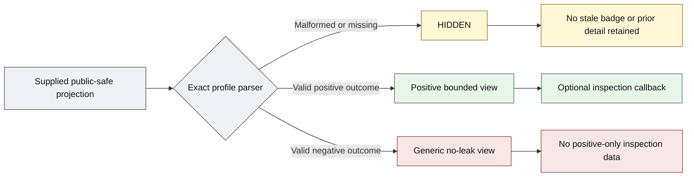

<!-- [KFM_META_BLOCK_V2]
doc_id: kfm://doc/architecture/ui/trust-badges
title: Trust-Visible Badges — UI Architecture
type: architecture-reference
version: v2.0-draft
status: draft; repository-grounded; non-authoritative; same-path-convergence
owners:
  - "@bartytime4life — CODEOWNERS review route only"
  - "NEEDS VERIFICATION — accountable Explorer UI, evidence, policy, rights, sensitivity, accessibility, review, release, correction, and operations stewardship"
created: 2026-05-14
updated: 2026-08-19
policy_label: public
owning_root: docs/
current_path: docs/architecture/ui/TRUST_BADGES.md
responsibility: Explain how compact Explorer trust projections relate to governed evidence, policy, review, release, freshness, correction, attestation, accessibility, and inspection without becoming a semantic contract, machine schema, policy source, EvidenceBundle, receipt, proof, review record, release decision, or runtime authority.
truth_posture: CONFIRMED current repository files and bounded fixture/test surfaces at the pinned snapshot / PROPOSED cross-surface integration target / CONFLICTED proposal-era universal badge vocabulary and implementation claims / HOLD on a canonical cross-surface TrustBadgeState profile, live transport, MapLibre binding, export binding, and policy-significant stewardship
evidence_base: bartytime4life/Kansas-Frontier-Matrix main@452835c2cf8258ed920c69c917ce5a8814c9a9b0; prior target blob 96f65d1cde10b058fd3ae55f20071cd037dbbc63; accepted ADR-0029
related:
  - ./README.md
  - ./BOUNDARIES.md
  - ./GOVERNED_SHELL.md
  - ../../standards/MAP_TRUST_STATES.md
  - ../evidence-drawer.md
  - ../document-convergence-plan.md
  - ../sovereignty-care.md
  - ../../doctrine/directory-rules.md
  - ../../adr/ADR-0029-adopt-directory-governance-standard-v2.md
  - ../../../contracts/ui/trust_badge_state.md
  - ../../../schemas/contracts/v1/ui/trust_badge_state.schema.json
  - ../../../schemas/contracts/v1/ui/evidence_drawer_payload.schema.json
  - ../../../apps/explorer-web/src/features/trust_header/index.tsx
  - ../../../apps/explorer-web/src/features/attestation_badge/README.md
tags:
  - kfm
  - ui
  - trust
  - badge
  - evidence
  - finite-outcomes
  - accessibility
  - public-safe
  - repository-grounded
notes:
  - "This document coordinates existing authorities; it does not define a new badge contract, schema, policy, or release rule."
  - "A compact visual signal is never proof. Current component and fixture evidence is bounded to the repository snapshot named above."
  - "All former major section headings and fragments are retained for compatibility."
[/KFM_META_BLOCK_V2] -->

<a id="top"></a>
<a id="trust-visible-badges--ui-architecture"></a>

# Trust-Visible Badges — UI Architecture

> **Operating rule:** a badge may project a bounded, validated, public-safe state. It never creates evidence, verification, rights, consent, review, release, correction, or authority.

> [!IMPORTANT]
> **Current determination.** KFM does not currently have one implemented, canonical, universal “trust badge system.” The repository contains several deliberately bounded projection surfaces with different vocabularies and proof burdens:
>
> 1. a `Trust Header` component over the closed Evidence Drawer public-safe projection;
> 2. a fixture-first attestation badge with its own strict app-local parser;
> 3. a draft semantic `TrustBadgeState` contract paired with a permissive schema stub; and
> 4. a repository-grounded map-trust standard that explicitly rejects one universal trust enum.
>
> These surfaces are related, but they are not interchangeable and must not be silently collapsed.

| Field | Repository-grounded status |
|---|---|
| Document role | Human-readable UI architecture map; non-authoritative |
| Placement | **CONFIRMED** same-path `PLACE` disposition under `docs/architecture/ui/` |
| Directory authority | **CONFIRMED** accepted ADR-0029 and `docs/doctrine/directory-rules.md` |
| Current review route | **CONFIRMED** `@bartytime4life` through CODEOWNERS; routing is not substantive approval |
| Universal `TrustVisibleState` implementation | **NOT FOUND** at the pinned snapshot |
| Universal `TrustBadges.tsx` implementation | **NOT FOUND** at the pinned snapshot |
| Draft semantic contract | **CONFIRMED** `contracts/ui/trust_badge_state.md`; status `PROPOSED` |
| Paired machine schema | **CONFIRMED** permissive stub; only `id` required and `additionalProperties: true` |
| Trust Header | **CONFIRMED** bounded component and deterministic tests |
| Attestation badge | **CONFIRMED** fixture-first component, strict app-local projection, unit/browser evidence |
| Default Explorer composition | **CONFIRMED** repository-grounded synthetic shell; dedicated Trust Header and attestation badge are not proven composed into the default entrypoint |
| MapLibre runtime | **HOLD**; no admitted dependency or runtime integration is established by this document |
| Live badge transport | **UNKNOWN / NOT PROVED** |
| Export preservation | **PROPOSED / NOT PROVED** |
| Public release or deployment | **UNKNOWN**; this documentation change creates neither |

## Quick jump

- [1. Purpose & scope](#1-purpose--scope)
- [2. Truth posture (read this first)](#2-truth-posture-read-this-first)
- [3. Doctrinal foundations](#3-doctrinal-foundations)
- [4. Finite trust-visible states](#4-finite-trust-visible-states)
- [5. Badge category families](#5-badge-category-families)
- [6. State machine](#6-state-machine)
- [7. Click resolution: badge → Evidence Drawer](#7-click-resolution-badge--evidence-drawer)
- [8. Data model](#8-data-model)
- [9. MapLibre adapter binding](#9-maplibre-adapter-binding)
- [10. Stream / freshness behavior](#10-stream--freshness-behavior)
- [11. Security boundary](#11-security-boundary)
- [12. Accessibility requirements](#12-accessibility-requirements)
- [13. Exports & screenshots](#13-exports--screenshots)
- [14. Anti-patterns](#14-anti-patterns)
- [15. Validation tests](#15-validation-tests)
- [16. Open verification items](#16-open-verification-items)
- [17. Related docs](#17-related-docs)
- [Appendix A: terminology](#appendix-a-terminology)
- [Appendix B: evidence basis](#appendix-b-evidence-basis)
- [Appendix C: disposition of proposal-era claims](#appendix-c-disposition-of-proposal-era-claims)

---

## 1. Purpose & scope

This document explains the **UI projection boundary** for compact trust-visible signals in Explorer Web. Its purpose is to help maintainers, reviewers, and UI implementers answer five questions without inventing authority:

1. Which upstream object or validated projection supplies the displayed state?
2. Which vocabulary applies to this particular component?
3. What may be shown for positive and negative outcomes?
4. Which inspection action is allowed?
5. Which evidence, policy, review, release, correction, and runtime claims remain outside the badge?

The durable public unit remains the inspectable claim. Badges, headers, chips, labels, icons, colors, screenshots, and status boards are downstream projections. They are useful only when their inputs and limits are explicit.

### 1.1 In scope

- the current Trust Header and attestation-badge boundaries;
- the draft `TrustBadgeState` contract and its schema gap;
- the relationship between badge vocabularies and the Evidence Drawer public-safe projection;
- safe positive, negative, malformed, and unavailable behavior;
- inspection callbacks and drawer-launch boundaries;
- accessibility and non-color requirements;
- map, freshness, export, and live-transport holds;
- verification and graduation evidence for future cross-surface convergence.

### 1.2 Out of scope

This page does not:

- define contract semantics;
- define or amend JSON Schema;
- decide policy, rights, consent, sovereignty, sensitivity, review, or release;
- verify signatures, digests, receipts, attestations, or EvidenceBundles;
- name or authenticate a steward or authority;
- activate a source, API route, stream, renderer, or model;
- establish visual token values;
- create an export or publication profile;
- prove deployment, production composition, or public operation.

### 1.3 Owning root and placement basis

The file explains cross-file UI architecture to humans, so `docs/` owns it. The existing same-path home under `docs/architecture/ui/` is supported by accepted ADR-0029, the current Directory Rules authority, the UI documentation index, and the convergence plan’s `PLACE` disposition.

No new root, sibling “v2,” parallel badge standard, contract, schema, or policy home is created.

### 1.4 Current evidence limit

The claims marked `CONFIRMED` below are bounded to repository files, tests, and generated artifacts visible at:

```text
bartytime4life/Kansas-Frontier-Matrix
main@452835c2cf8258ed920c69c917ce5a8814c9a9b0
```

A source file proves that code or documentation exists at that commit. It does not by itself prove deployment, production traffic, policy approval, release, or publication.

[Back to top](#top)

---

## 2. Truth posture (read this first)

Four rules govern every trust-visible surface.

1. **Projection is not authority.** A badge reports a validated projection supplied by an upstream authority-bearing flow. It does not create or upgrade that state.
2. **Profiles remain bounded.** `ANSWER`, `SUPPORTED`, `VERIFIED`, `STALE`, `UNKNOWN`, and `FAILED` belong to different profiles unless an accepted adapter contract explicitly relates them.
3. **Negative states fail safely.** A denied, abstained, failed, malformed, or unavailable payload must not leak references, protected reasons, internal paths, free-form diagnostics, or stale positive content.
4. **Inspection outranks decoration.** A positive compact signal may offer a path to inspect supporting references or the Evidence Drawer. The visual signal never substitutes for that inspection surface.

> [!CAUTION]
> `UNKNOWN`, hidden, unavailable, `ABSTAIN`, `DENY`, `FAILED`, and `ERROR` are not synonyms. Do not “simplify” them into one generic success/failure boolean. Each profile owns its finite vocabulary and no translation is authoritative unless it is explicit, validated, and tested.

### 2.1 Truth labels used here

| Label | Meaning in this page |
|---|---|
| **CONFIRMED** | Verified at the pinned repository snapshot from a file, schema, test, or generated artifact |
| **PROPOSED** | A target design or future integration not proved as current |
| **UNKNOWN** | Evidence is insufficient to establish the claim |
| **NEEDS VERIFICATION** | A concrete check remains before the claim can be relied on |
| **CONFLICTED** | Current repository evidence and proposal-era wording do not agree |
| **HOLD** | Do not graduate or converge the surface until named evidence closes |

### 2.2 Badge non-effects

Rendering, hiding, clicking, restyling, or exporting a badge does not mutate:

- `EvidenceRef` or `EvidenceBundle`;
- source role or source authority;
- rights, consent, sovereignty, or sensitivity;
- `PolicyDecision`;
- review state;
- release or publication state;
- correction, supersession, withdrawal, or rollback state;
- receipt, proof, signature, digest, or attestation validity.

[Back to top](#top)

---

## 3. Doctrinal foundations

The repository’s current trust model is distributed across distinct authority roots. This page coordinates those roots; it does not absorb them.

### 3.1 Authority split

| Responsibility | Current owning surface | This page’s relationship |
|---|---|---|
| Cross-map trust vocabulary and anti-collapse rules | [`docs/standards/MAP_TRUST_STATES.md`](../../standards/MAP_TRUST_STATES.md) | References; does not redefine |
| Candidate badge semantics | [`contracts/ui/trust_badge_state.md`](../../../contracts/ui/trust_badge_state.md) | Reports draft status and open naming question |
| Machine-checkable badge shape | [`schemas/contracts/v1/ui/trust_badge_state.schema.json`](../../../schemas/contracts/v1/ui/trust_badge_state.schema.json) | Reports current permissive shape; does not strengthen it in prose |
| Evidence Drawer public-safe projection | [`schemas/contracts/v1/ui/evidence_drawer_payload.schema.json`](../../../schemas/contracts/v1/ui/evidence_drawer_payload.schema.json) | Supplies the current closed projection consumed by the Trust Header |
| Policy and admissibility | `policy/` and policy decision objects | Upstream; never inferred by a badge |
| Evidence, receipts, proofs, releases, corrections | Their governing contract/schema/data/release roots | Upstream; badges only point or project |
| UI rendering and strict app-local adapters | `apps/explorer-web/` | Current implementation evidence |
| Visual tokens and microcopy | Brand/design-system surfaces where accepted | Separate; current visual document remains draft |
| This document | `docs/architecture/ui/TRUST_BADGES.md` | Human architecture map only |

### 3.2 Stable doctrine retained

The following principles remain supported:

- badges are compact, trust-visible projections rather than evidence;
- the browser must not invent authoritative trust state;
- public clients use governed, public-safe projections rather than internal lifecycle stores;
- malformed or negative input must fail closed;
- evidence-dependent claims require resolvable support or abstention;
- sensitive detail is denied or transformed upstream, not hidden through styling alone;
- status must remain understandable without color;
- inspection, correction, and release context should remain visible where the profile supports them.

### 3.3 Proposal-era doctrine demoted

The earlier edition treated these as current or universal when repository evidence does not support that conclusion:

- one required `TrustVisibleState` object for every badge;
- one universal `VERIFIED | STALE | UNKNOWN | FAILED` state machine;
- nine mandatory badge families on every released layer;
- a universal `TrustBadges.tsx` component;
- a mandatory `ui.badge_click` event;
- an admitted MapLibre feature-join implementation;
- a live SSE/WebSocket stream with a fixed polling fallback;
- a concrete governed attestation proxy route;
- an implemented export sidecar and PDF metadata profile;
- a universal CARE or sovereignty chip assignment.

Those ideas remain proposal lineage where useful. They are not current-system facts.

[Back to top](#top)

---

## 4. Finite trust-visible states

### 4.1 There is no universal trust enum

The current map-trust standard explicitly treats trust as a **multi-axis projection**, not one badge and not one universal enum. Current repository vocabularies include:

| Profile or surface | Finite vocabulary | Current status |
|---|---|---|
| Evidence Drawer response | `ANSWER | ABSTAIN | DENY | ERROR` | Closed schema and bounded implementation surface |
| Trust Header view | `SUPPORTED | ABSTAIN | DENY | ERROR` plus `VISIBLE | HIDDEN` | Implemented component and deterministic tests |
| Trust Header positive dimensions | outcome, policy, review, release, freshness, correction | Implemented only for a valid supported projection |
| Attestation projection outcome | `ANSWER | ABSTAIN | DENY | ERROR` | Strict app-local parser and fixture family |
| Attestation badge view | `VERIFIED | INCOMPLETE | FAILED | ERROR` plus `VISIBLE | HIDDEN` | Fixture-first component and browser test |
| Draft `TrustBadgeState` semantics | `VERIFIED | STALE | UNKNOWN | FAILED` | Proposal only |
| Draft `TrustBadgeState` schema | no state enum | Permissive stub; does not enforce the semantic vocabulary |
| Policy dimension | `ALLOW | ABSTAIN | DENY | ERROR` | Upstream projection dimension |
| Review dimension | `REVIEWED | PENDING | NOT_APPLICABLE` | Upstream projection dimension |
| Release dimension | `RELEASED | UNRELEASED | WITHDRAWN` | Upstream projection dimension |
| Freshness dimension | `CURRENT | STALE | UNKNOWN` | Upstream projection dimension |
| Correction dimension | `NONE | CURRENT | CORRECTED | SUPERSEDED` | Upstream projection dimension |
| Historical evidence disposition | `HELD | DENIED | SUPERSEDED | REVOKED | WITHDRAWN` | Historical context, not current response outcome |

### 4.2 Translation rule

A component may translate an upstream projection into a local view vocabulary only when all of the following are true:

1. the source profile is exact and versioned;
2. the parser rejects unknown or contradictory shape;
3. the mapping is explicit in code;
4. positive and negative branches are tested;
5. negative branches cannot carry positive-only references;
6. the resulting label is described as a **view state**, not upstream authority;
7. malformed input does not default to success.

The current attestation adapter satisfies this pattern for its bounded fixture profile. That does not make the mapping globally reusable.

### 4.3 Positive-state burden

A positive compact signal is allowed only when its own profile’s required support is present.

For the current surfaces:

- a Trust Header `SUPPORTED` view requires a valid `ANSWER` Evidence Drawer projection;
- the positive Trust Header renders six dimensions from that projection;
- an attestation `VERIFIED` view requires `ANSWER / CHECKS_VERIFIED` and all profile-required reference handles;
- the badge text still states that rendering is not proof or release authority.

### 4.4 Negative-state burden

Negative states must be **less revealing**, not more diagnostic.

Current safe patterns are:

- one generic outcome signal rather than six misleading dimension badges;
- fixed public-safe copy;
- no evidence, attestation, receipt, release, or internal-reference handles on negative attestation projections;
- no internal canaries, lifecycle paths, or protected reason details;
- no “last known good” badge left visible after malformed replacement input;
- hidden component state when the profile cannot be parsed safely.

> [!NOTE]
> A future profile may choose an explicit visible `ERROR` instead of hiding malformed input, but that behavior must be part of the accepted contract and tested. Current components must not be rewritten by this document.

[Back to top](#top)

---

## 5. Badge category families

“Badge family” is a presentation concept. It does not establish a new object family or one mandatory row across all KFM surfaces.

### 5.1 Current bounded families

| Surface | Displayed signals | What is not claimed |
|---|---|---|
| **Trust Header — supported** | `Outcome`, `Policy`, `Review`, `Release`, `Freshness`, `Correction` | Source authority, rights clearance, consent, sovereignty, receipt validity, or publication |
| **Trust Header — negative** | One generic `Outcome` signal with fixed no-leak copy | The six positive dimensions; evidence details |
| **Attestation badge — positive** | `VERIFIED` plus an inspection affordance | Signature verification by the browser, evidence closure, review, release approval, or publication |
| **Attestation badge — negative** | `INCOMPLETE`, `FAILED`, or `ERROR` with fixed copy | Reference handles or internal diagnostics |
| **Evidence Drawer** | Source role, policy, review, release, freshness, correction, evidence references, citations, limitations, and bounded history where allowed | A universal badge object |

### 5.2 Candidate future families

The following may be useful, but remain `PROPOSED` until their owning authority, shape, and policy are accepted:

- rights status;
- sensitivity or generalization status;
- consent or permission status;
- CARE applicability or community-governance notice;
- source role beyond the current Drawer projection;
- correction or withdrawal at additional surfaces;
- automated-check or supply-chain status outside the bounded attestation component;
- layer-level freshness;
- reviewer-only restricted-detail state.

### 5.3 Rights, consent, CARE, and sovereignty

A UI indicator must never infer authority from geography, place name, source custody, metadata, institutional prestige, a model classification, or another badge.

Any rights, consent, CARE, sovereignty, or culturally sensitive indicator requires:

- an accepted upstream authority model;
- a verified assignment or applicable policy decision;
- public-safe wording and scope;
- qualified review appropriate to the affected community or rightsholder;
- correction and withdrawal behavior;
- proof that hiding or generalizing detail does not get misrepresented as consent or clearance.

The current repository does not establish one universal CARE badge catalog or a general authority-resolution protocol. This remains `HOLD`.

### 5.4 No default badge row

The earlier “categories 1–7 form the default badge set for every released layer” rule is withdrawn as a current claim. A surface displays only the dimensions defined by its accepted projection profile and appropriate to its audience.

Too many badges can hide uncertainty as effectively as too few. Compactness must never collapse distinct meanings, and density must never simulate assurance.

[Back to top](#top)

---

## 6. State machine

### 6.1 Current parser-to-view behavior

There is no repository-proved universal badge state machine. The current common pattern is narrower:


```mermaid
flowchart LR
    A[Supplied public-safe projection] --> B{Exact profile parser}
    B -->|Malformed or missing| C[HIDDEN]
    B -->|Valid positive outcome| D[Positive bounded view]
    B -->|Valid negative outcome| E[Generic no-leak view]
    D --> F[Optional inspection callback]
    E --> G[No positive-only inspection data]
    C --> H[No stale badge or prior detail retained]

    classDef neutral fill:#eef2f7,stroke:#445,color:#111
    classDef hold fill:#fff7d6,stroke:#8a6d1d,color:#111
    classDef safe fill:#e8f5e9,stroke:#2f6f44,color:#111
    classDef deny fill:#f8e7e7,stroke:#8b2f2f,color:#111
    class A,B neutral
    class C,H hold
    class D,F safe
    class E,G deny
```

The diagram describes observed component structure. It does not create an application-wide contract.

### 6.2 Trust Header mapping

```text
missing or malformed projection
  -> HIDDEN

valid ANSWER projection
  -> VISIBLE / SUPPORTED
  -> six text-first dimensions
  -> supporting-evidence callback allowed

valid ABSTAIN | DENY | ERROR projection
  -> VISIBLE / corresponding negative view
  -> one generic Outcome signal
  -> no positive-dimension disclosure
```

### 6.3 Attestation badge mapping

```text
missing or malformed projection
  -> HIDDEN

ANSWER / CHECKS_VERIFIED with all required refs
  -> VISIBLE / VERIFIED
  -> inspection callback allowed

ABSTAIN / CHECKS_INCOMPLETE
  -> VISIBLE / INCOMPLETE
  -> no refs

DENY / CHECKS_FAILED
  -> VISIBLE / FAILED
  -> no refs

ERROR / UPSTREAM_ERROR
  -> VISIBLE / ERROR
  -> no refs
```

### 6.4 Client-side transition limits

Current browser components do not have authority to:

- turn `CURRENT` into `STALE` using a locally invented timer;
- promote `UNKNOWN`, `INCOMPLETE`, or `ABSTAIN` to success;
- reclassify policy or release state;
- recover reference handles from negative copy;
- keep a positive signal after replacement input fails parsing;
- merge several dimensions into one “green” trust score;
- persist authoritative state in browser storage.

A future live transition profile requires an accepted contract, explicit time semantics, deterministic fixtures, no-leak negative tests, and correction/rollback handling.

[Back to top](#top)

---

## 7. Click resolution: badge → Evidence Drawer

### 7.1 Current Trust Header action

For a valid supported Evidence Drawer projection, the Trust Header may invoke a caller-supplied drawer callback using the already parsed projection.

The component does not:

- fetch evidence;
- resolve `EvidenceRef`;
- call an external model;
- read lifecycle stores;
- decide policy;
- alter review or release state;
- create a receipt or proof.

Negative Trust Header outcomes do not expose the positive inspection path.

### 7.2 Current attestation action

For a valid positive attestation projection, the badge offers **Inspect supporting references** and delegates the parsed projection to a caller-supplied callback.

The callback is an intent boundary. The badge itself does not verify the referenced attestation, receipt, EvidenceBundle, or release manifest.

Negative and malformed attestation inputs expose no reference handles.

### 7.3 Event vocabulary status

No `ui.badge_click` event implementation or accepted event contract was found at the pinned snapshot. This document therefore does not require that event name.

A future cross-surface event may be introduced only after:

- the owning event contract is verified;
- payload minimization and no-leak rules are defined;
- component and shell ownership are clear;
- telemetry does not capture evidence or protected detail;
- tests prove that the event cannot mutate trust or release state.

### 7.4 Target governed flow

The intended higher-level flow remains useful as a **PROPOSED** target:

```text
validated compact projection
  -> user requests inspection
  -> shell invokes a governed, profile-specific resolver or drawer action
  -> public-safe finite response
  -> Evidence Drawer or bounded reference inspector
```

Do not substitute this architecture diagram for proof that a governed API route or live resolver is deployed.

[Back to top](#top)

---

## 8. Data model

### 8.1 No new `TrustVisibleState` is defined here

The proposal-era illustrative JSON block has been removed because it looked like a current machine contract while no corresponding tracked schema or implementation was found.

The current candidate semantic object is named `TrustBadgeState`, and even that name remains open in its draft contract.

### 8.2 Current draft semantic contract

[`contracts/ui/trust_badge_state.md`](../../../contracts/ui/trust_badge_state.md) currently describes a compact UI projection and proposes four semantic states:

```text
VERIFIED | STALE | UNKNOWN | FAILED
```

It also states that a badge is not evidence, policy, review, release, or proof. The contract records an unresolved naming choice between `TrustBadgeState` and `TrustVisibleState`.

This is proposal evidence, not an accepted cross-surface contract.

### 8.3 Current paired schema

[`schemas/contracts/v1/ui/trust_badge_state.schema.json`](../../../schemas/contracts/v1/ui/trust_badge_state.schema.json) currently:

- requires only `id`;
- permits `spec_hash`, `id`, and `version`;
- permits additional properties;
- defines no `state` enum;
- defines no category enum;
- defines no positive-reference closure;
- defines no negative no-leak constraints.

Therefore, “valid against the current schema” does **not** prove conformance with the proposed semantic states.

> [!WARNING]
> Do not build a general-purpose UI consumer against the current permissive schema and then claim the four-state contract is enforced. Close the semantic, schema, fixture, validator, and compatibility packet first.

### 8.4 Current closed public-safe projection

The Evidence Drawer payload schema is materially stronger. It closes the top-level shape, defines finite outcomes and reason codes, provides six trust dimensions, and binds positive, negative, historical, citation, and correction behavior.

The current Trust Header correctly consumes that bounded projection rather than the permissive general badge stub.

### 8.5 Current attestation projection

The attestation badge uses a strict **app-local** profile:

```text
kfm.explorer.attestation-badge.public-safe.v1
```

Its parser:

- rejects unknown fields;
- requires exact outcome/reason-code pairings;
- requires all supporting references only for the verified positive case;
- requires null reference fields for negative cases;
- validates canonical timestamps and reference patterns;
- performs no external fetch or cryptographic verification.

This is a bounded implementation seam, not a canonical repository-wide badge schema.

### 8.6 Convergence options

The future architecture has three legitimate options:

| Option | Description | Tradeoff |
|---|---|---|
| **A — Keep profiles separate** | Trust Header, attestation, consent, denial, and other compact views retain exact local/public-safe profiles | Lowest authority-collision risk; more adapters |
| **B — Adopt a small shared base** | A closed common envelope defines only identity, visibility, finite outcome, public copy, and inspection capability; profile extensions remain separate | Moderate convergence; requires compatibility design |
| **C — Adopt one broad badge schema** | One schema owns every category and state | Highest coupling and greatest risk of semantic collapse |

**Recommended disposition:** `HOLD` option C. Prefer A until a concrete repeated shape justifies B through an accepted contract/schema change.

[Back to top](#top)

---

## 9. MapLibre adapter binding

### 9.1 Current state

Neither the Trust Header nor the attestation badge imports MapLibre. Their current behavior is renderer-independent.

The default Explorer site mounts a repository-grounded synthetic shell and a renderer-neutral map-selection-to-Evidence-Drawer fixture. The site catalog records the MapLibre runtime as `HOLD`, with dependency admission and runtime implementation false.

No current evidence establishes:

- a trust-badge overlay joined to rendered features;
- `promoteId` badge joins;
- badge-derived map filtering;
- a live MapLibre source carrying trust state;
- a Cesium synchronization path;
- browser renderer proof for trust badges.

### 9.2 Target rule

A future map-attached compact signal should:

1. receive a public-safe projection from a governed boundary;
2. use stable released feature identity only as a lookup key;
3. avoid treating rendered properties as evidence;
4. remain renderer-neutral above the admitted adapter seam;
5. expose a non-map alternative;
6. preserve negative no-leak behavior;
7. prove join parity, correction propagation, and rollback behavior.

### 9.3 Prohibited shortcuts

- deriving “verified” from a feature property;
- loading internal receipt or policy data into vector-tile attributes;
- using client-side filters as redaction;
- exposing exact sensitive reasons through hover state;
- admitting MapLibre merely to obtain badge placement;
- calling a map screenshot or pixel state proof of release.

MapLibre admission remains a separate governed decision. This page neither advances nor relaxes that hold.

[Back to top](#top)

---

## 10. Stream / freshness behavior

### 10.1 Current state

No SSE, WebSocket, polling, fixed 15-second fallback, or badge-specific live transport is established by the current Trust Header or attestation badge code.

The current Trust Header renders the `freshness` value supplied by a valid Evidence Drawer projection. It does not calculate freshness from the browser clock.

The attestation badge renders the supplied evaluated state. It does not poll, fetch, or re-verify.

### 10.2 Time authority

Freshness must remain upstream and profile-specific. A future implementation must distinguish, where material:

- observed time;
- valid time;
- source publication time;
- retrieval time;
- evaluation time;
- release time;
- correction time;
- client receipt time.

A browser clock may support display formatting. It must not become source or release authority.

### 10.3 Future transport requirements

A live update mechanism remains `PROPOSED` and must define:

- the exact governed source of state;
- reconnection and replay semantics;
- sequence or version identity;
- stale thresholds owned by the source/profile, not the component;
- fixed negative and outage behavior;
- no stale-positive retention after malformed input;
- telemetry minimization;
- accessibility of state changes;
- deterministic no-network fixtures;
- correction and rollback propagation.

No transport protocol or polling interval is selected by this document.

[Back to top](#top)

---

## 11. Security boundary

### 11.1 Current no-network posture

The current bounded components provide strong negative evidence:

- Trust Header tests assert that its source contains no `fetch`, `localStorage`, `sessionStorage`, internal lifecycle paths, or model-runtime access.
- The attestation component README states that the browser performs no network access, cryptography, evidence resolution, lifecycle-store reads, persistence, promotion, release, or publication.
- The attestation parser rejects unknown fields and prevents reference handles from appearing in negative projections.
- Browser tests prove malformed attestation detail renders no badge and does not reflect an internal canary.
- Negative Trust Header tests prove generic copy does not expose evidence, sensitive, or internal canaries.

### 11.2 Required no-leak behavior

A compact trust surface must not expose:

- raw attestations or signatures;
- tokens, credentials, headers, or storage identifiers;
- internal lifecycle paths;
- unpublished evidence references;
- protected denial reasons;
- exact sensitive geometry;
- free-form upstream errors;
- model prompts or generated reasoning;
- reviewer-private notes;
- stale positive content after parser failure.

### 11.3 Future governed transport

If a future component obtains remote state, the normal public path must use a governed, public-safe interface. The exact route, authentication model, cache behavior, CORS policy, and attestation-verification service remain `UNKNOWN`.

The previous edition’s sample route was not verified and is no longer presented as a required current path.

### 11.4 Browser cryptography

The current attestation badge deliberately does not verify signatures in the browser. A future client-verification feature would require a separate threat model, accepted trust root, algorithm and key policy, failure semantics, supply-chain review, performance tests, and no-confusion UI. It must not be smuggled into a badge component.

[Back to top](#top)

---

## 12. Accessibility requirements

### 12.1 Current proven behavior

The current Trust Header:

- renders text-first badges as a definition list;
- uses a status region and live-region semantics;
- exposes visible labels for each supported dimension;
- reduces negative outcomes to one generic text signal;
- offers the drawer action only for the supported positive state;
- hides malformed or missing projections.

The attestation browser test verifies:

- a status region with an accessible name;
- visible text status;
- an explicit inspection button;
- no raw `kfm://` references in rendered badge text;
- no component or button for malformed input.

### 12.2 Required target behavior

Any graduated compact trust surface must provide:

1. **Text, not color alone.** The state is readable in plain text.
2. **Programmatic name.** Category and view state are available to assistive technology.
3. **Keyboard-equivalent inspection.** Any inspection action is a real control reachable without a pointer.
4. **Stable focus.** Opening and closing an inspector or drawer follows the owning surface’s focus contract.
5. **No motion dependency.** State meaning survives reduced motion and static capture.
6. **Non-map alternative.** Map-associated status is available through an equivalent list, table, drawer, or detail view.
7. **Zoom and reflow safety.** Labels do not truncate into ambiguous initials.
8. **No hidden positive state.** A tooltip-only success or stale signal is insufficient.
9. **Negative-state clarity.** `ABSTAIN`, `DENY`, and `ERROR` remain distinguishable in text.
10. **Localization tolerance.** Layout does not assume English label length.

### 12.3 Visual-token authority

The existing trust-state visual guide is draft and contains proposal-era universal vocabulary. Its token names, colors, glyphs, and metrics are not accepted by this page.

Before visual graduation, verify:

- the current design-system owner and token home;
- contrast in actual themes;
- high-contrast and print behavior;
- icon licensing and semantics;
- screenshots in grayscale;
- reduced-motion behavior;
- human accessibility review.

A green badge is not a stronger truth claim than a text badge.

[Back to top](#top)

---

## 13. Exports & screenshots

### 13.1 Current state

No current repository evidence inspected for this page proves that PNG, PDF, GeoJSON, vector-tile, story, or Focus Mode exports preserve trust-badge projections through an accepted export contract.

The proposal-era sidecar JSON, PDF metadata block, and `TrustVisibleState` snapshot requirements are therefore not described as implemented.

### 13.2 Target export rule

A governed export that carries a consequential claim should preserve the authority-bearing context appropriate to that export, such as:

- release identity;
- evidence or citation references;
- temporal and spatial scope;
- rights and sensitivity posture;
- correction or withdrawal state;
- generation time;
- profile and version;
- rollback or current-status locator where appropriate.

A rendered badge may be included for human readability, but the pixel is not the machine or evidentiary record.

### 13.3 Screenshot limits

A screenshot:

- freezes a view at one time;
- may omit interaction and correction state;
- may be separated from its source;
- can preserve stale or withdrawn appearance;
- cannot prove the underlying projection was valid;
- cannot substitute for an export receipt or release manifest.

Do not burn protected reasons or exact sensitive detail into a screenshot merely because the live component would have hidden them.

### 13.4 Graduation evidence

Export preservation remains `HOLD` until a bounded profile proves:

- exact exported fields;
- public-safe transformation;
- positive and negative fixtures;
- deterministic identity;
- current/withdrawn interpretation;
- correction propagation;
- accessible alternative text;
- no secret or protected-detail leakage;
- rollback behavior.

[Back to top](#top)

---

## 14. Anti-patterns

| Anti-pattern | Why it fails | Safe disposition |
|---|---|---|
| **Badge as proof** | Visual output cannot verify evidence, signature, policy, review, or release | Offer bounded inspection; keep upstream authority visible |
| **One green trust score** | Collapses independent policy, review, release, freshness, and correction axes | Show only profile-defined dimensions |
| **Universal enum by prose** | Documentation cannot make a permissive schema enforce a state machine | Close contract, schema, fixtures, validator, and compatibility packet |
| **Negative reference leakage** | Exposes protected or internal handles precisely when access is denied or failed | Fixed copy; null/absent positive-only refs |
| **Malformed input defaults to prior success** | Preserves stale assurance after validation failure | Hide or render contract-defined error; clear prior detail |
| **Client-derived trust** | Browser feature properties, timers, or retries do not create authority | Consume a governed public-safe projection |
| **Direct attestation fetch** | Expands network, credential, CORS, parsing, and trust-root exposure | Governed service with a separately reviewed contract |
| **Browser signature verification hidden in UI code** | Makes a badge an undeclared security verifier | Separate threat model, package, contract, and tests |
| **Badge-only redaction** | CSS and client filters are reversible and do not transform data | Redact/generalize upstream and record the transform |
| **CARE/sovereignty inference from geography** | Geographic relevance is not authority, consultation, permission, or consent | Qualified authority resolution and policy review |
| **Mandatory badge density** | More labels can simulate certainty and obscure the actual negative outcome | Audience- and profile-specific compact projection |
| **Tooltip-only stale state** | Inaccessible and easy to miss | Text-visible status in an equivalent non-map surface |
| **Screenshot as release evidence** | Pixels lose profile, correction, and authority chain | Governed export metadata and current-status locator |
| **Documentation badge as CI proof** | A static shield can be stale or unrelated | Cite exact checks and exact head in the pull request |
| **Map renderer as trust source** | Rendering is downstream of evidence and policy | Keep renderer behind the governed projection seam |

[Back to top](#top)

---

## 15. Validation tests

### 15.1 Current repository evidence

| Surface | Evidence present at the pinned snapshot | What it proves |
|---|---|---|
| Trust Header | component source and unit tests | Positive six-dimension rendering, generic negative states, hidden malformed/missing input, bounded drawer action, source-boundary assertions |
| Evidence Drawer projection | closed schema, fixtures, validator, adapter, UI resolver, tests | One bounded public-safe profile and finite outcome behavior |
| Attestation badge | strict adapter, component, valid/invalid fixtures, unit/browser tests, component README | Exact projection mapping, positive-only refs, negative no-leak behavior, hidden malformed input, inspection callback |
| Explorer site | repository-grounded catalog and synthetic composition | Fixture-first shell and renderer-neutral evidence bridge; not live map or release proof |
| Draft general badge state | semantic contract and permissive schema | Proposal lineage and current schema gap; not enforceable universal behavior |

### 15.2 Repository-native focused commands

The Explorer package currently declares:

```bash
pnpm --filter explorer-web run test:unit
pnpm --filter explorer-web run test:browser
pnpm --filter explorer-web run build
```

The component README notes that local browser execution may require Chromium. Report browser tests as `NOT RUN` rather than passed when the browser is unavailable.

### 15.3 Documentation validation for this page

A change to this page should verify:

- one H1;
- valid metadata YAML;
- balanced fences and HTML tags;
- preserved former major section headings and fragments;
- repository-relative links at the exact head;
- no proposed route or path presented as current;
- no secret, protected location, or sensitive detail;
- no universal schema invented in prose;
- generated-work receipt with pending human review;
- exact base/head diff and rollback target.

### 15.4 Future cross-surface acceptance matrix

A new or graduated badge profile should include at least:

| Test family | Required cases |
|---|---|
| Shape | valid positive, every finite negative, missing field, extra field, wrong profile/version |
| Semantics | positive support closure; contradictory outcome/reason; stale/current distinction |
| No leak | protected reason, evidence ref, internal path, free-form error, canary |
| Accessibility | text label, accessible name, keyboard action, focus return, zoom/reflow, reduced motion |
| Browser boundary | no direct internal store, model runtime, external attestation fetch, or persistence |
| Inspection | positive callback exactly once; negative and malformed cases cannot expose positive data |
| Correction | corrected, superseded, withdrawn, and stale replacement behavior |
| Map | stable identity, no property-as-proof, equivalent non-map access, renderer adapter isolation |
| Export | profile/version, release/citation context, no badge-pixel-as-proof |
| Replay | deterministic result for the same validated projection |

### 15.5 Proof limits

A passing component test does not prove:

- upstream evidence is true;
- policy is accepted;
- signatures are valid;
- release occurred;
- the component is composed in production;
- deployment is healthy;
- public users can access the surface;
- a screenshot is current.

[Back to top](#top)

---

## 16. Open verification items

### P0 — authority and safe semantics

| Item | Current status | Closure evidence |
|---|---|---|
| Canonical object name: `TrustBadgeState` vs `TrustVisibleState` | **HOLD** | Accepted semantic contract decision |
| General badge schema closure | **HOLD** | Closed schema, enums, profile/version, positive/negative invariants, fixtures, validator, compatibility note |
| Rights, consent, CARE, sovereignty, and sensitivity indicator authority | **HOLD** | Qualified stewardship and policy decision; no geography inference |
| Cross-profile translation law | **HOLD** | Accepted adapter contract or explicit decision to keep profiles separate |
| Negative no-leak baseline | **PARTIALLY CONFIRMED** | Extend deterministic canary tests to every new profile |
| Review and release responsibility | **NEEDS VERIFICATION** | Accountable human assignments; CODEOWNERS alone is insufficient |

### P1 — usable Explorer integration

| Item | Current status | Closure evidence |
|---|---|---|
| Default-shell composition of Trust Header | **NEEDS VERIFICATION** | Explicit import/composition, browser test, failure behavior |
| Default-shell composition of attestation badge | **NEEDS VERIFICATION** | Explicit use case, composition, browser test, audience decision |
| Evidence Drawer action wiring | **PARTIALLY CONFIRMED** | Prove current composed route and all negative outcomes at exact head |
| Accepted visual tokens | **HOLD** | Design-system home, contrast, grayscale, high-contrast, print, reduced-motion review |
| Stable event/telemetry vocabulary | **PROPOSED** | Contract, minimization policy, no protected payload, tests |
| Governed export profile | **HOLD** | Contract/schema/fixtures/receipt/correction tests |
| Documentation crosswalk | **OPEN** | Reconcile this page, `MAP_TRUST_STATES.md`, brand visuals, and component READMEs without parallel authority |

### P2 — live, map, and operational maturity

| Item | Current status | Closure evidence |
|---|---|---|
| MapLibre badge binding | **HOLD** | Renderer admission, one adapter seam, stable join tests, non-map parity |
| Live freshness transport | **HOLD** | Source-owned thresholds, sequence/replay, outage tests, telemetry minimization |
| Remote attestation service | **UNKNOWN** | Accepted API/security contract, threat model, deployment and health evidence |
| Client-side verification | **HOLD** | Separate ADR/security design; not hidden inside UI |
| Correction propagation through caches and exports | **UNKNOWN** | Deterministic drill with withdrawal and rollback |
| Operations and observability | **UNKNOWN** | Public-safe metrics, alerts, runbooks, incident/correction responsibilities |

### Stop conditions

Do not graduate a profile when any of these remain unresolved:

- positive state can be produced without profile-required support;
- negative input can leak positive-only references or protected reasons;
- malformed input retains a prior positive signal;
- the browser derives policy, review, release, or rights state;
- an exact sensitive location or internal path reaches public copy;
- schema and semantic contract disagree materially;
- the profile has no correction or withdrawal behavior where public consequence is material;
- human review or authority is implied by CODEOWNERS or a badge.

[Back to top](#top)

---

## 17. Related docs

### Governing and coordination documents

- [`docs/doctrine/directory-rules.md`](../../doctrine/directory-rules.md) — current writable Directory Rules authority
- [`ADR-0029`](../../adr/ADR-0029-adopt-directory-governance-standard-v2.md) — accepted adoption decision
- [`docs/architecture/document-convergence-plan.md`](../document-convergence-plan.md) — same-path `PLACE` disposition
- [`docs/architecture/ui/README.md`](./README.md) — UI documentation index and current bounded posture
- [`docs/standards/MAP_TRUST_STATES.md`](../../standards/MAP_TRUST_STATES.md) — current cross-map trust-state profile and anti-collapse rules
- [`docs/architecture/sovereignty-care.md`](../sovereignty-care.md) — authority, CARE, geography, consent, and safe-exposure limits

### Contracts and schemas

- [`contracts/ui/trust_badge_state.md`](../../../contracts/ui/trust_badge_state.md) — draft semantic candidate
- [`schemas/contracts/v1/ui/trust_badge_state.schema.json`](../../../schemas/contracts/v1/ui/trust_badge_state.schema.json) — current permissive stub
- [`schemas/contracts/v1/ui/evidence_drawer_payload.schema.json`](../../../schemas/contracts/v1/ui/evidence_drawer_payload.schema.json) — closed bounded public-safe projection
- [`docs/architecture/contract-schema-policy-split.md`](../contract-schema-policy-split.md) — meaning, shape, admissibility, and proof separation

### Current Explorer implementation evidence

- [`apps/explorer-web/src/features/trust_header/index.tsx`](../../../apps/explorer-web/src/features/trust_header/index.tsx)
- [`apps/explorer-web/tests/trust-header.test.ts`](../../../apps/explorer-web/tests/trust-header.test.ts)
- [`apps/explorer-web/src/adapters/AttestationBadgeProjection.ts`](../../../apps/explorer-web/src/adapters/AttestationBadgeProjection.ts)
- [`apps/explorer-web/src/features/attestation_badge/README.md`](../../../apps/explorer-web/src/features/attestation_badge/README.md)
- [`apps/explorer-web/tests/browser/attestation-badge.spec.ts`](../../../apps/explorer-web/tests/browser/attestation-badge.spec.ts)
- [`apps/explorer-web/src/site/catalog.ts`](../../../apps/explorer-web/src/site/catalog.ts)
- [`apps/explorer-web/src/site/mount-explorer-site.ts`](../../../apps/explorer-web/src/site/mount-explorer-site.ts)

### UI boundaries

- [`docs/architecture/ui/BOUNDARIES.md`](./BOUNDARIES.md)
- [`docs/architecture/ui/GOVERNED_SHELL.md`](./GOVERNED_SHELL.md)
- [`docs/architecture/evidence-drawer.md`](../evidence-drawer.md)
- [`docs/architecture/ui/ACCESSIBILITY.md`](./ACCESSIBILITY.md)

[Back to top](#top)

---

## Appendix A: terminology

| Term | Bounded meaning |
|---|---|
| **Badge** | Compact text-visible UI projection; never evidence or authority |
| **Trust Header** | Current component that projects six dimensions for a valid supported Evidence Drawer projection and one generic signal for negative outcomes |
| **Attestation badge** | Current fixture-first component that projects a strict app-local automated-check status |
| **View state** | Component-local rendering state derived from a validated profile |
| **Response outcome** | Finite result such as `ANSWER`, `ABSTAIN`, `DENY`, or `ERROR`; not the same as a visual badge state |
| **Trust dimension** | Independent projected axis such as policy, review, release, freshness, or correction |
| **`TrustBadgeState`** | Draft semantic candidate; not accepted as universal |
| **`TrustVisibleState`** | Proposal-era alternate name; no tracked implementation or schema found at the snapshot |
| **Evidence Drawer projection** | Closed public-safe payload profile carrying finite outcome, trust dimensions, citations, limitations, and bounded history |
| **Inspection callback** | Component-owned delegation point; not evidence resolution or verification by itself |
| **No-leak negative state** | Fixed public-safe negative rendering that excludes positive-only refs and protected details |
| **Hidden** | Component renders nothing because input is missing or malformed; not a policy outcome |
| **Verified view** | Local attestation-badge state for one exact positive profile; not global verification |
| **Stale** | Profile-specific freshness state supplied by an upstream time authority; not inferred from browser time |
| **CARE indicator** | Potential public notice only after qualified authority and policy establish applicability; never inferred from geography |
| **Release** | Upstream governed state transition; never caused by rendering a badge |

[Back to top](#top)

---

## Appendix B: evidence basis

### B.1 Repository evidence inspected

| Path | Evidence used |
|---|---|
| `docs/architecture/ui/TRUST_BADGES.md` | Prior document identity, anchors, proposal-era claims, prior blob |
| `docs/architecture/ui/README.md` | Bounded UI posture and map/runtime hold |
| `docs/architecture/document-convergence-plan.md` | `PLACE` disposition for this page |
| `docs/standards/MAP_TRUST_STATES.md` | Multi-axis model; current vocabulary crosswalk; readiness limits |
| `contracts/ui/trust_badge_state.md` | Draft semantics, four proposed states, naming question |
| `schemas/contracts/v1/ui/trust_badge_state.schema.json` | Only `id` required; additional properties allowed; no state enum |
| `schemas/contracts/v1/ui/evidence_drawer_payload.schema.json` | Closed public-safe finite-outcome and six-dimension projection |
| `apps/explorer-web/src/features/trust_header/index.tsx` | Current component mapping, generic negative states, hidden malformed input |
| `apps/explorer-web/tests/trust-header.test.ts` | Positive, negative, malformed, no-leak, and browser-boundary tests |
| `apps/explorer-web/src/adapters/AttestationBadgeProjection.ts` | Exact app-local parser and positive/negative reference rules |
| `apps/explorer-web/src/features/attestation_badge/index.ts` | Local view vocabulary and inspection boundary |
| `apps/explorer-web/src/features/attestation_badge/README.md` | Fixture-first non-effects and validation commands |
| `apps/explorer-web/tests/browser/attestation-badge.spec.ts` | Accessible status, inspection delegation, malformed no-leak behavior |
| `apps/explorer-web/src/site/catalog.ts` | Descriptive feature maturity and MapLibre HOLD metadata |
| `apps/explorer-web/src/main.ts` and `src/site/mount-explorer-site.ts` | Current default site composition boundary |
| `apps/explorer-web/package.json` | Exact build and test scripts |
| `.github/CODEOWNERS` | Current review routing and explicit non-authority warning |
| `CONTRIBUTING.md` | Documentation, AI receipt, validation, PR, and rollback requirements |
| `docs/adr/ADR-0029-adopt-directory-governance-standard-v2.md` | Accepted Directory Rules adoption |
| `docs/doctrine/directory-rules.md` | Placement authority |
| `docs/architecture/sovereignty-care.md` | CARE, authority, geography, consent, and exposure limits |

### B.2 Evidence ranking

1. accepted decisions and current repository files;
2. current schemas, tests, fixtures, and generated artifacts;
3. repository documentation describing bounded behavior;
4. attached KFM doctrine and planning lineage;
5. this document’s proposed integration targets.

Planning reports that explicitly label their paths and implementation as proposed remain useful lineage. They do not override current repository evidence.

### B.3 What was not proved

This inspection did not prove:

- a deployed Explorer instance;
- public traffic;
- a live governed API badge route;
- source activation;
- runtime MapLibre use;
- live freshness updates;
- production signature verification;
- accepted rights/CARE/sovereignty assignments;
- export preservation;
- release or publication;
- branch-protection enforcement;
- independent human review.

[Back to top](#top)

---

## Appendix C: disposition of proposal-era claims

| Prior claim | Current disposition | Reason |
|---|---|---|
| `TrustVisibleState` is a required implemented object | **CONFLICTED / demoted to proposal lineage** | Current candidate is draft `TrustBadgeState`; no general implementation found |
| One four-state enum governs every badge | **WITHDRAWN as current claim** | Current profiles use independent finite vocabularies |
| Nine categories form the default row for every released layer | **WITHDRAWN** | No accepted universal profile; current Trust Header has six positive dimensions |
| CARE/sovereignty chip is universally mandatory | **HOLD** | Applicability and authority cannot be inferred; qualified review required |
| Universal `TrustBadges.tsx` exists or is the implementation target | **NOT FOUND / no path created** | Avoid parallel or speculative implementation |
| Every badge click dispatches `ui.badge_click` | **NOT FOUND / PROPOSED** | No accepted event implementation located |
| Click always calls a governed API | **PARTIAL target only** | Current components delegate callbacks; live route not proved |
| MapLibre `promoteId` joins drive badges | **NOT PROVED / HOLD** | Current components are renderer-independent; MapLibre runtime remains held |
| SSE/WebSocket with ~15-second polling is current doctrine | **WITHDRAWN as current claim** | No transport selected or implemented by current badge surfaces |
| Browser route `/<governed-api>/attestations/<id>` is required | **WITHDRAWN as concrete path** | Future governed transport is required in principle; route is unknown |
| PNG/PDF sidecar profile is implemented | **NOT PROVED / HOLD** | No accepted export contract inspected |
| Browser may verify attestation state through the badge | **DENIED for current component** | Current implementation explicitly performs no cryptography |
| Badge pixels preserve proof in screenshots | **DENIED** | Screenshots are downstream, staleable carriers |
| Badge removal changes trust state | **DENIED** | Upstream authority-bearing objects own state |
| A positive badge proves release | **DENIED** | Badge is non-authoritative and may only point to support |

[Back to top](#top)

---

## Rollback

The prior document remains recoverable at Git blob:

```text
96f65d1cde10b058fd3ae55f20071cd037dbbc63
```

Rollback is a normal reviewed revert of the documentation commit, followed by the same metadata, link, and structure checks. Reverting this page must not mutate contracts, schemas, policy, evidence, receipts, proofs, review, release, runtime, correction, or publication state.

---

**Document state:** repository-grounded draft · **Current-system claims:** bounded to the pinned snapshot · **Cross-surface convergence:** HOLD pending accepted semantic and machine authority · [Back to top](#top)
