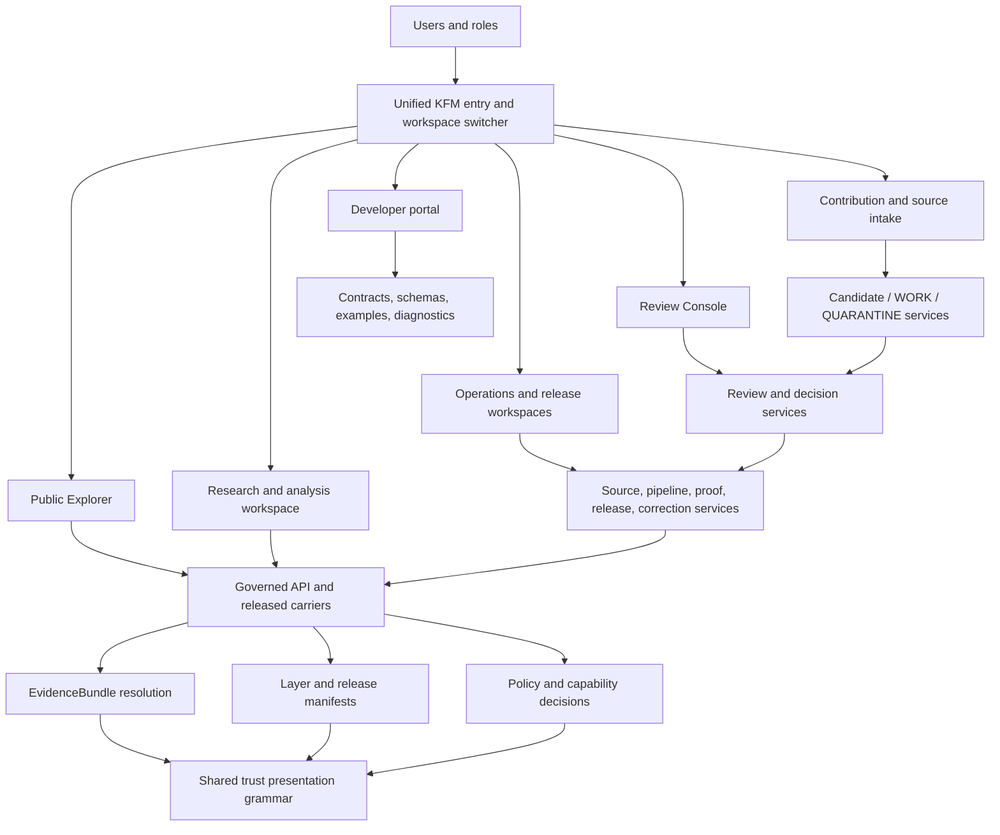
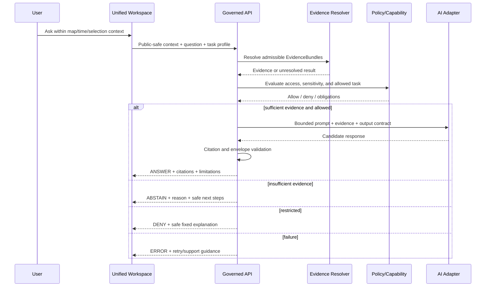

<a id="top"></a>

<!-- [KFM_META_BLOCK_V2]
doc_id: kfm://doc/architecture/ui/unified-workspace
title: KFM Unified Workspace — Complete User Interface Architecture
type: architecture-synthesis
version: v0.1.0
status: draft; repository-grounded; source-reconciled; implementation-proposed; non-authoritative; non-publisher
owners:
  - "@bartytime4life — verified repository owner and current CODEOWNERS review route"
  - "NEEDS VERIFICATION — independent UI, accessibility, evidence, policy, security, domain, release, and operations reviewers"
created: 2026-08-23
updated: 2026-08-23
policy_label: public; architecture; ui; product; map-first; evidence-first; no-release; no-publication
owning_root: docs/
responsibility: Describe one coherent KFM interaction architecture that makes the system's public, research, contribution, stewardship, review, release, operations, and developer capabilities understandable and composable while preserving separate authority, application, policy, evidence, lifecycle, security, and publication boundaries.
truth_posture: cite-or-abstain; repository facts are pinned to the evidence snapshot; source-corpus ideas and future implementation remain PROPOSED; operational behavior remains UNKNOWN without runtime evidence
current_path: docs/architecture/ui/UNIFIED_WORKSPACE.md
placement_outcome: PLACE
directory_rules_basis:
  adopted_decision: ADR-0029
  owning_root_reason: docs/architecture/ui owns cross-cutting human-readable UI architecture; this document does not define contracts, schemas, policy, executable code, evidence, release decisions, or published state
  adjacent_contract: docs/architecture/ui/README.md and existing sibling architecture pages establish this lane
  parallel_authority_check: this page integrates and navigates existing UI responsibilities; sibling pages remain authoritative for their narrower architecture topics
evidence_snapshot:
  repository: bartytime4life/Kansas-Frontier-Matrix
  base_ref: main
  base_commit: d590c569ed22383572e0376eaf346489ae36b0a4
  inspected_repository_surfaces:
    - docs/doctrine/directory-rules.md
    - docs/adr/ADR-0029-adopt-directory-governance-standard-v2.md
    - docs/architecture/ui/README.md
    - docs/architecture/ui/GOVERNED_SHELL.md
    - docs/architecture/ui/BOUNDARIES.md
    - docs/architecture/ui/LAYERING.md
    - docs/architecture/ui/ACCESSIBILITY.md
    - docs/architecture/ui/EVIDENCE_DRAWER.md
    - docs/architecture/ui/FOCUS_FLOW.md
    - docs/architecture/ui/STORY_PLAYER.md
    - docs/architecture/ui/REVIEW_CONSOLE.md
    - docs/architecture/ui/COMPARE_AND_EXPORT.md
    - apps/explorer-web/package.json
    - apps/explorer-web/src/site/catalog.ts
    - apps/explorer-web/src/site/mount-explorer-site.ts
    - packages/maplibre/src/map-runtime-port.ts
    - packages/maplibre/src/null-map-runtime.ts
    - apps/governed-api/
    - apps/review-console/
  drive_lineage_sources:
    - title: KFM_Whole_UI_Governed_AI_Expansion_Report_Extended_Pro.pdf
      drive_id: 11pLQf17nOYkqX3n9jojBcvI5nUn236FP
      role: whole-UI and governed-AI proposal lineage
    - title: KFM_Greenfield_Commissioning_Plan_v2_FULL.pdf
      drive_id: 161zjrR23nrv2b9ejne7iRDasVNnvCFwc
      role: current commissioning, smallest-complete-circle, and non-effect doctrine
    - title: KFM_Authoritative_Whole_System_Reference_PROPOSED_2026-08-15.docx
      drive_id: 1tDpCPS8Vto3FkQ69gSUIFbah2qdarw-R
      role: whole-system architecture and domain-lane synthesis; proposed, not adopted authority
non_effects:
  source_activation: none
  evidence_authority: none
  policy_change: none
  review_decision: none
  release: none
  deployment: none
  promotion: none
  publication: none
related:
  - ./README.md
  - ./GOVERNED_SHELL.md
  - ./BOUNDARIES.md
  - ./LAYERING.md
  - ./ACCESSIBILITY.md
  - ./EVIDENCE_DRAWER.md
  - ./FOCUS_FLOW.md
  - ./STORY_PLAYER.md
  - ./REVIEW_CONSOLE.md
  - ./COMPARE_AND_EXPORT.md
  - ./MAP_RUNTIME_BOUNDARY.md
  - ./TRUST_BADGES.md
  - ./TELEMETRY.md
  - ../../doctrine/directory-rules.md
  - ../../adr/ADR-0029-adopt-directory-governance-standard-v2.md
  - ../../../apps/explorer-web/
  - ../../../apps/governed-api/
  - ../../../apps/review-console/
  - ../../../packages/maplibre/
tags:
  - kfm
  - ui
  - ux
  - unified-workspace
  - governed-shell
  - map-first
  - time-aware
  - evidence-first
  - focus-mode
  - review
  - accessibility
  - offline
  - domain-workspaces
notes:
  - "This page answers 'a UI for all things' with one shared interaction grammar and many role-bounded workspaces, not one omnipotent browser bundle."
  - "Current code is materially richer than proposal-era source documents, but remains mixed maturity and fixture-first in important paths."
  - "All proposed routes, interfaces, component names, performance budgets, and implementation paths require repository-native design review before implementation."
[/KFM_META_BLOCK_V2] -->

# KFM Unified Workspace — Complete User Interface Architecture

> **One-line operating law.** Build one recognizable KFM experience with many governed workspaces: everything relevant can be found and understood, but no user, screen, renderer, model, or client-side control receives authority it does not own.


## Executive determination

**CONFIRMED.** KFM already has a real browser application under [`apps/explorer-web/`](../../../apps/explorer-web/), a governed-API application root, a separate review-console application root, a renderer-neutral map runtime port, a deterministic null runtime, a repository-grounded Explorer composition, a feature catalog, thirteen domain lanes, and bounded fixture-first trust interactions. The current Explorer package uses Vite, TypeScript, Vitest, and Playwright. Its current site composition exposes a synthetic map stage, deterministic map-selection-to-Evidence-Drawer cases, a domain matrix, and a descriptive feature catalog. These facts establish a meaningful implementation base; they do not establish live data, a concrete MapLibre adapter, production authorization, deployment, release, or public operation.

**PROPOSED.** KFM should evolve into a **Unified Workspace**: a shared interaction architecture that joins map exploration, search, time, evidence, analysis, stories, governed AI, contribution, review, source/pipeline observability, release/correction, operations, and developer support without collapsing their bounded contexts. The public Explorer, Review Console, steward surfaces, and operational surfaces may share design language and context links while remaining separately deployed and separately authorized.

**UNKNOWN.** Current production routing, identity provider, authorization enforcement, deployment topology, service-level objectives, public hosting, live governed transport, source activation, full component ownership, and operational telemetry were not proven in this review.

**NEEDS VERIFICATION.** Any implementation must recheck the exact base commit, open pull requests, route conventions, current component maturity, accepted ADR set, package and dependency admission, policy enforcement, authenticated role model, and accessibility/performance baselines.

> [!IMPORTANT]
> **“All things” means complete capability coverage, not unrestricted access.** A visitor may discover that a review, correction, source, or release process exists without receiving the ability to mutate it. A reviewer may inspect restricted material without receiving release authority. A release steward may decide a release without gaining source-truth authority. The UI must make those distinctions visible.

> [!CAUTION]
> **This document is an architecture synthesis, not an implementation claim.** It proposes a complete product model and implementation sequence. It does not activate a source, admit a renderer dependency, create a route contract, modify policy, authorize a reviewer, release an artifact, deploy an application, or publish a claim.

## Quick navigation

1. [Goal and interpretation of “all things”](#1-goal-and-interpretation-of-all-things)
2. [Evidence basis and present implementation](#2-evidence-basis-and-present-implementation)
3. [Product principles](#3-product-principles)
4. [Federated product architecture](#4-federated-product-architecture)
5. [People, roles, and capabilities](#5-people-roles-and-capabilities)
6. [Information architecture](#6-information-architecture)
7. [Workspace atlas](#7-workspace-atlas)
8. [Desktop composition](#8-desktop-composition)
9. [Mobile, tablet, low-bandwidth, and offline composition](#9-mobile-tablet-low-bandwidth-and-offline-composition)
10. [Shared context and state](#10-shared-context-and-state)
11. [Map and spatial interaction model](#11-map-and-spatial-interaction-model)
12. [Time architecture](#12-time-architecture)
13. [Layer catalog, legend, and view registry](#13-layer-catalog-legend-and-view-registry)
14. [Evidence Drawer and dossier](#14-evidence-drawer-and-dossier)
15. [Search and discovery](#15-search-and-discovery)
16. [Compare, analysis, and scenario work](#16-compare-analysis-and-scenario-work)
17. [Stories, teaching, and guided interpretation](#17-stories-teaching-and-guided-interpretation)
18. [Focus Mode and governed AI](#18-focus-mode-and-governed-ai)
19. [Contribution, source intake, upload, and field capture](#19-contribution-source-intake-upload-and-field-capture)
20. [Review, release, correction, withdrawal, and rollback](#20-review-release-correction-withdrawal-and-rollback)
21. [Sources, pipelines, operations, and developer experience](#21-sources-pipelines-operations-and-developer-experience)
22. [Domain experience matrix](#22-domain-experience-matrix)
23. [Cross-domain lenses and missions](#23-cross-domain-lenses-and-missions)
24. [Data carriers and viewing modes](#24-data-carriers-and-viewing-modes)
25. [Component and design-system architecture](#25-component-and-design-system-architecture)
26. [Trust states and negative outcomes](#26-trust-states-and-negative-outcomes)
27. [Governed API and resource model](#27-governed-api-and-resource-model)
28. [Security, rights, sensitivity, sovereignty, and privacy](#28-security-rights-sensitivity-sovereignty-and-privacy)
29. [Accessibility and inclusive interaction](#29-accessibility-and-inclusive-interaction)
30. [Performance, resilience, observability, and cost](#30-performance-resilience-observability-and-cost)
31. [Testing and validation](#31-testing-and-validation)
32. [Repository mapping and placement](#32-repository-mapping-and-placement)
33. [Implementation sequence](#33-implementation-sequence)
34. [Acceptance criteria](#34-acceptance-criteria)
35. [Risks, correction, and rollback](#35-risks-correction-and-rollback)
36. [Open verification register](#36-open-verification-register)
37. [Appendices](#37-appendices)

---

## 1. Goal and interpretation of “all things”

### 1.1 Goal

Design a user interface capable of supporting the full KFM mission:

- discover Kansas-centered spatial knowledge;
- explore it by place, time, domain, source role, and release;
- inspect evidence and limitations;
- compare observations, interpretations, models, and releases without collapsing them;
- perform bounded analysis and create candidate derivatives;
- read and author governed stories;
- ask evidence-bounded questions through Focus Mode;
- contribute sources, files, field observations, corrections, and research leads;
- review evidence, policy, sensitivity, quality, and release candidates;
- observe source health, pipelines, artifacts, proofs, releases, and corrections;
- develop against stable contracts and inspect capability state;
- work accessibly on desktop, mobile, low-bandwidth, and offline-capable paths.

### 1.2 What the unified workspace is

The Unified Workspace is a **product architecture and interaction grammar**. It defines how KFM surfaces relate, how context moves safely between them, how trust state remains visible, and how users understand what they can do next.

It is not necessarily one deployable application. The safest realization is federated:

- the public map-first experience remains in `apps/explorer-web/`;
- review activity remains in `apps/review-console/` or another verified review application boundary;
- privileged administration remains outside the normal public bundle;
- source and pipeline operations use authenticated operational surfaces;
- shared components and contracts may be reused only through KFM-owned compatibility seams.

### 1.3 What the unified workspace is not

It is not:

- a universal admin console exposed to the public;
- a direct browser connection to RAW, WORK, QUARANTINE, canonical, restricted, graph, vector, model, or database stores;
- a dashboard that treats green badges as truth;
- a map that treats rendered feature properties as evidence;
- a chat interface that replaces the map, evidence, policy, review, or release systems;
- a visual workflow that makes approval and execution the same action;
- a single giant frontend bundle that must contain every privileged feature;
- a replacement for contracts, schemas, policy, receipts, proofs, manifests, ADRs, or runtime evidence.

### 1.4 Product thesis

> **One shell, many governed workspaces; one context spine, many bounded contexts; one visible trust grammar, many independent authorities.**

The result should feel like one coherent KFM product even when different workspaces are backed by different applications, APIs, access levels, or deployment zones.

---

## 2. Evidence basis and present implementation

### 2.1 Current repository facts

The following are **CONFIRMED at the evidence snapshot**:

| Surface | Bounded current evidence | What it does not prove |
|---|---|---|
| `apps/explorer-web/` | TypeScript/Vite application with Vitest and Playwright scripts | Live data, production hosting, authentication, release, or publication |
| `src/site/mount-explorer-site.ts` | Composes the current Explorer landing experience, synthetic map stage, domain matrix, feature catalog, and deterministic evidence lab | A route tree, concrete MapLibre renderer, live API, or production interaction |
| `src/site/catalog.ts` | Descriptive catalog of 38 feature families, thirteen domains, eight trust principles, and conservative maturity labels | Runtime availability, authority, release state, or current operational health |
| `features/map_runtime/` | Strict renderer-neutral feature-selection and Evidence Drawer bridge | A concrete renderer or authoritative evidence resolver |
| `features/evidence_drawer/` | Bounded finite projection with citations, limitations, trust state, corrections, keyboard behavior, and negative paths | Canonical EvidenceBundle authority or backend policy execution |
| `features/focus_panel/` | Fixture-first bounded synthesis and citation-oriented logic | A direct browser model call or production AI service |
| `features/story_player/` | Fixture-first playback of already-governed story projections | Story publication or unrestricted authoring |
| `features/time_banner/` | Fixture-first material-time presentation | Complete temporal data model adoption across all services |
| `packages/maplibre/src/map-runtime-port.ts` | Accepted, KFM-owned, serializable renderer-neutral port with finite runtime states and validated camera/selection shapes | `maplibre-gl` dependency admission or a working concrete adapter |
| `packages/maplibre/src/null-map-runtime.ts` | Deterministic no-network implementation for bounded proof and safe degradation | Geographic rendering |
| `apps/governed-api/` | Dedicated governed API application root with routes, source, tests, and documentation | Production transport, complete route behavior, or live consumers |
| `apps/review-console/` | Separate review-console application root | Complete reviewer workflow or authority assignment |

### 2.2 Current Explorer feature inventory

The code-owned catalog currently groups capabilities into six areas. Its maturity terms are descriptive implementation labels, not release or publication states.

| Area | Current catalog entries |
|---|---|
| Shell | Governed shell; Trust Header; Time Banner |
| Map and layers | Map evidence bridge; domain explorer; Layer Catalog; layer lineage timeline; HUC crosswalk; PMTiles diagnostics; STAC inspector; view-registry inspector; MapLibre browser runtime HOLD |
| Evidence and trust | Evidence Drawer; evidence tooltip; citation pill; provenance citations; attestation badge; consent card; denial-reason explorer; redaction preview; reveal session |
| Environmental insight | Air-quality trigger; environmental cadence; county NDVI change; anomaly scorecard; soil yearly change; streamflow quality; source availability |
| Governance and operations | Promotion-gate status; OCI artifact browser; watcher registry; read-only Review Console |
| User workflows | Focus panel; Story Player; Compare; governed export; settings; safe diagnostics |

### 2.3 Current constraints that shape the design

1. The current visual shell is an executable composition, but the map is synthetic.
2. The current browser package does not admit a concrete MapLibre dependency.
3. The current map port intentionally contains no evidence, policy, review, release, source, lifecycle, correction, deployment, or publication authority.
4. The present application style is lightweight TypeScript and DOM composition. This design does not require a framework rewrite.
5. Existing feature modules range from verified slice to fixture-first, documented, and HOLD.
6. Current source documents include valuable whole-UI proposals that predate the real repository. They are lineage and design pressure, not implementation truth.
7. The safest implementation path is additive and reversible: compose existing bounded slices before creating broad new machinery.

### 2.4 Source-corpus contributions retained

The Drive corpus contributes several durable ideas:

- persistent map-first shell;
- visible time as coequal context;
- Evidence Drawer as a required trust surface;
- finite Focus Mode outcomes with no direct model authority;
- StoryManifest and governed playback;
- read-only review before mutation;
- renderer adapter boundary;
- source-ledger and source-role visibility;
- fixture-first testing;
- smallest-complete-circle commissioning;
- public-safe defaults and correction/rollback visibility.

This document reconciles those ideas with current code instead of repeating old proposed paths as current facts.

---

## 3. Product principles

| Principle | Interface consequence | Failure posture |
|---|---|---|
| Inspectable claim | Consequential statements expose evidence, scope, source role, time, policy, review, release, and correction state | ABSTAIN, DENY, or ERROR when closure is missing |
| Map first | Place is the primary exploration surface; map selection scopes a request | Never treat pixels or feature properties as proof |
| Time aware | Valid, observed, source, retrieval, publication, release, correction, and freshness time remain distinct | Mark stale or abstain rather than implying “current” |
| Evidence first | EvidenceBundle-derived support outranks generated language and visual prominence | Cite or abstain |
| Policy visible | Rights, sensitivity, terms, access role, review, and release state are legible at the point of use | Deny or hold on uncertainty |
| Public-safe by default | Public clients receive only governed responses and released public-safe carriers | Never hide restricted bytes only with CSS or map filters |
| Finite outcomes | Claim-bearing experiences resolve to ANSWER, ABSTAIN, DENY, or ERROR | No ambiguous “success-looking” fallback |
| Correctable and reversible | Supersession, correction, withdrawal, rollback, and recompile lineage remain reachable | Do not silently replace public state |
| AI is interpretive | Focus Mode summarizes or analyzes already governed evidence | No direct client-to-model truth path |
| Renderer downstream of trust | Map runtime renders admitted released carriers and emits bounded selections | No renderer-side policy or truth assembly |
| Accessibility is correctness | Trust, map, time, evidence, and action state work by keyboard, screen reader, text, touch, and non-map alternatives | Hold graduation when essential access paths fail |
| Progressive disclosure | Complexity appears as the user asks for it; core trust never disappears | Do not bury material limitations behind expert mode |
| Safe exploration | Users can inspect, compare, preview, cancel, and undo candidate work | No irreversible action from exploratory controls |
| Role-bounded capability | Backend capability determines available actions; the UI explains unavailable actions safely | No client-only authorization |
| Operational humility | Fixture, documentation, and tests prove only their bounded claim | Keep deployment and production maturity UNKNOWN without evidence |

---

## 4. Federated product architecture

### 4.1 Architectural shape



### 4.2 One experience does not require one deployment

The product should share:

- design tokens and interaction conventions;
- workspace descriptors;
- finite outcome presentation;
- context-link format;
- evidence and citation affordances;
- trust badges and negative-state language;
- accessibility primitives;
- correction and rollback links;
- capability discovery semantics.

It should not automatically share:

- authentication boundary;
- privileged code bundle;
- data access token;
- backend service account;
- restricted cache;
- review authority;
- release authority;
- operational telemetry detail.

### 4.3 Bounded contexts and anti-corruption boundaries

Use a ubiquitous UI language inside the experience—place, layer, time scope, selection, evidence, claim, source role, limitation, policy, review, release, correction, rollback, workspace, capability—while keeping each backend bounded context independent.

Adapters translate source-specific, policy-specific, renderer-specific, graph-specific, or model-specific representations into KFM-owned outward contracts. The browser never consumes provider-native internals as if they were KFM truth.

### 4.4 Shared context spine

Every workspace may receive a safe subset of a common context:

```text
place + viewport + domain + layer set + time scope + selection
+ evidence references + comparison state + story position
+ user role + granted capabilities + release/correction state
```

Only public-safe, serializable context may enter a public URL. Restricted identifiers, exact protected coordinates, review notes, access tokens, raw prompts, and sensitive evidence must remain server-side or in an authorized encrypted session.

---

## 5. People, roles, and capabilities

### 5.1 Primary personas

| Persona | Main goal | Default workspaces | Important constraints |
|---|---|---|---|
| Visitor | Understand Kansas through trustworthy maps and stories | Explore, Search, Dossier, Compare, Stories, Focus | Public-safe released material only |
| Learner / educator | Follow guided explanations and inspect sources | Stories, Dossier, Timeline, Compare, Help | Clear methods, reading level, citations, non-map alternatives |
| Researcher / analyst | Query, compare, measure, export, and create candidate analyses | Explore, Search, Analyze, Compare, Export, Focus | Derived results remain candidate/interpretive until reviewed |
| Contributor | Submit a source, file, observation, correction, or research lead | Contribute, Intake status, Help | Rights/sensitivity declaration; no direct publication |
| Domain steward | Assess source fitness, identity, quality, domain meaning, and safe representation | Steward Studio, Sources, Dossier, Compare, Redaction preview | Stewardship does not imply release authority |
| Reviewer | Inspect evidence, policy, validation, sensitivity, and proposed decisions | Review Console, Dossier, Compare, Proofs | Read-only first; explicit signed decision actions only when authorized |
| Release steward | Decide promotion, release, correction, withdrawal, and rollback | Release workspace, Review, Proofs, Corrections | Separation of duties and exact candidate identity |
| Operator | Observe source health, pipelines, jobs, artifacts, incidents, and rollback readiness | Operations, Sources, Pipelines, Diagnostics | Operational access does not establish truth |
| Developer | Use contracts, schemas, examples, test fixtures, and capability diagnostics | Developer portal, API explorer, Diagnostics | No production secrets or unrestricted data |
| Auditor / security reviewer | Reconstruct decisions, access, transformations, releases, and corrections | Audit, Review, Releases, Telemetry | Least-privilege, immutable history, redacted sensitive payloads |

### 5.2 Capability model

A role is descriptive. A capability is enforceable. The server should return a capability map such as:

```ts
// PROPOSED interface; not a current contract.
type KfmCapability =
  | "explore:public"
  | "evidence:resolve-public"
  | "analysis:create-candidate"
  | "contribution:submit"
  | "review:inspect"
  | "review:record-decision"
  | "release:decide"
  | "correction:issue"
  | "source:steward"
  | "pipeline:operate"
  | "diagnostics:restricted";
```

The UI may use capabilities to enable, hide, or explain controls. The backend must enforce every consequential action independently.

### 5.3 Capability rules

- Absence of a capability must not leak protected object existence.
- A disabled action should explain the safe reason when doing so does not disclose protected detail.
- “Request access” is a separate workflow, not an automatic grant.
- Elevated sessions display purpose, scope, approver, start time, expiry, and audit state.
- Workspace switching never upgrades authority.
- Public links opened in a privileged session should default to the public projection unless the user explicitly enters an authorized view.

---

## 6. Information architecture

### 6.1 Global navigation families

The complete product vocabulary is:

1. **Explore** — map-first discovery and selection.
2. **Search** — cross-domain catalog, place, source, claim, story, and release discovery.
3. **Dossiers** — evidence-centered detail for a selected entity, place, layer, claim, or release.
4. **Time & Compare** — temporal navigation, side-by-side comparison, change, lineage, and uncertainty.
5. **Analyze** — governed queries, measurements, charts, tables, networks, raster analysis, and candidate derivatives.
6. **Stories** — guided public-safe narratives and educational paths.
7. **Focus** — evidence-bounded natural-language interpretation and task guidance.
8. **Contribute** — source leads, uploads, field capture, annotations, and correction requests.
9. **Review** — evidence, policy, quality, sensitivity, representation, and release review.
10. **Sources & Pipelines** — source admission, availability, freshness, runs, validation, quarantine, and artifacts.
11. **Releases & Corrections** — manifests, proof closure, promotion decisions, corrections, withdrawals, rollback, and recompile.
12. **Operations** — health, incidents, safe diagnostics, performance, and cost.
13. **Develop** — API, contracts, schemas, fixtures, examples, SDKs, and conformance.
14. **Help** — glossary, methods, accessibility, keyboard shortcuts, data literacy, and feedback.

### 6.2 Public navigation versus workspace switcher

The ordinary public header should remain compact:

```text
Explore | Search | Time | Stories | Focus | Help
```

Additional workspaces appear through a role-aware workspace switcher after authentication. Privileged destinations must not be silently embedded in the public navigation DOM with only visual hiding.

### 6.3 Proposed route vocabulary

These route names are **PROPOSED information architecture**, not current route contracts:

| Route family | Purpose | Exposure |
|---|---|---|
| `/explore` | Persistent map and spatial workspace | Public |
| `/search` | Cross-domain discovery | Public |
| `/dossier/:public-id` | Public-safe evidence-centered detail | Public or capability-projected |
| `/time` | Timeline and temporal search | Public |
| `/compare` | Compare states, releases, sources, or places | Public with bounded data |
| `/analyze` | Candidate analysis workbench | Authenticated where compute or saved work is involved |
| `/stories` and `/stories/:id` | Catalog and playback | Public for released stories |
| `/focus` | Governed AI interaction | Public-safe or authenticated by profile |
| `/contribute` | Submission and correction intake | Authenticated or carefully rate-limited public forms |
| `/review` | Review Console entry | Restricted |
| `/sources` | Source and registry observatory | Public summary; restricted stewardship detail |
| `/pipelines` | Pipeline/run observatory | Restricted or redacted public summary |
| `/releases` | Release and correction catalog | Public-safe release history; restricted decision controls |
| `/operations` | Operational cockpit | Restricted |
| `/develop` | Developer portal | Public documentation plus authenticated diagnostics |

### 6.4 Deep links

A public-safe deep link should be able to preserve:

- workspace;
- map camera or named extent;
- visible released layers;
- time scope;
- selected public identifier;
- compare mode;
- story node;
- public-safe display preferences.

It must not preserve:

- raw query text containing sensitive information;
- exact restricted coordinates;
- privileged evidence IDs;
- access tokens;
- reviewer notes;
- unredacted exports;
- internal object-store URLs;
- unreleased candidate identifiers unless the route is authenticated and server-resolved.

---

## 7. Workspace atlas

### 7.1 Explore workspace

**Purpose.** Make place the main entry to KFM knowledge.

**Primary surfaces.** Map canvas, layer catalog, legend, search, timeline, selection summary, Evidence Drawer, Focus launcher, compare launcher, share/export controls.

**Core actions.** Pan, zoom, change projection where admitted, select a feature, inspect layer metadata, filter by time, compare releases, open a dossier, ask a bounded question, save a public-safe view.

**Negative states.** Renderer unavailable, layer withdrawn, layer stale, evidence unresolved, sensitive detail denied, source unavailable, offline fallback, map unsupported.

**Authority boundary.** Map interactions scope governed requests. They do not create claims or evidence.

### 7.2 Search workspace

**Purpose.** Find knowledge without requiring the user to know a layer name.

**Search targets.** Places, domains, layers, datasets, sources, claims, evidence bundles, stories, releases, corrections, glossary terms, and public methods.

**Result requirements.** Result type, spatial scope, temporal scope, source role, release state, freshness, sensitivity projection, and why the result matched.

**Interaction.** Search results may open on map, dossier, timeline, story, source profile, or release history.

### 7.3 Dossier workspace

**Purpose.** Provide overview plus detail for one selected object or bounded subject.

**Sections.** Summary, map/time context, claims, evidence, sources, methods, limitations, policy, review, release, correction history, relationships, downloads, citations.

**Variants.** Place dossier, feature dossier, source dossier, layer dossier, claim dossier, release dossier, story dossier.

**Rule.** A dossier is a projection of governed objects, not a new canonical object family unless a contract explicitly defines one.

### 7.4 Time & Compare workspace

**Purpose.** Make change, uncertainty, correction, and source/version differences inspectable.

**Modes.** Swipe, side-by-side, synchronized maps, small multiples, table diff, chart overlay, lineage timeline, before/after correction, source comparison, release comparison.

**Rule.** Comparison never implies equivalence. Each side keeps its own source role, method, scale, time, release, and limitations.

### 7.5 Analyze workspace

**Purpose.** Let researchers and stewards perform bounded spatial and temporal analysis without writing directly into canonical truth.

**Tools.** Select/filter, measure, buffer, intersect, summarize, chart, network path, raster index, zonal statistics, geostatistical preview, uncertainty display, model comparison, notebook/export handoff.

**Output.** Every saved result becomes a candidate derivative with input references, method/spec hash, parameters, time, software environment, output digest, limitations, and review state.

**Rule.** Analysis results are derived. They cannot overwrite source observations or appear as released claims without promotion.

### 7.6 Stories workspace

**Purpose.** Guide people through place, time, evidence, and interpretation.

**Player.** Released StoryManifest only, with map/timeline synchronization, transcript, captions, source panel, Evidence Drawer parity, keyboard navigation, and reduced-motion mode.

**Studio.** Authenticated candidate authoring, node sequence, map state, narrative, citations, alt text, rights, sensitivity, preview, validation, and review submission.

**Rule.** Story prominence does not increase source authority.

### 7.7 Focus workspace

**Purpose.** Help users ask questions, summarize selected evidence, explain limitations, compare bounded objects, and navigate KFM.

**Inputs.** Current public-safe context, user question, explicit task profile, admissible EvidenceBundles, policy/capability envelope.

**Outputs.** ANSWER, ABSTAIN, DENY, or ERROR with citations, scope, limitations, and next safe actions.

**Rule.** Focus is an interpreter and navigator, never a publisher or authority.

### 7.8 Contribute workspace

**Purpose.** Accept useful material without bypassing source intake or quarantine.

**Contribution types.** Source lead, URL, document, image, map, dataset, field observation, annotation, transcription, georeferencing control points, correction request, rights information, community/steward note.

**Flow.** Describe → identify rights → identify sensitivity → preview public-safe projection → validate → submit → receive intake receipt → track status.

**Rule.** Submission ends in candidate intake, WORK, or QUARANTINE—not PUBLISHED.

### 7.9 Steward Studio

**Purpose.** Let domain/source stewards inspect identity, source role, method, quality, rights, sensitivity, geometry, time, transforms, and public-safe representation.

**Tools.** SourceDescriptor editor, crosswalk viewer, duplicate/conflict resolver, redaction/generalization preview, validation results, evidence assignment, limitation editor, candidate diff, correction proposal.

**Rule.** Steward decisions remain separate from release approval when separation of duty is required.

### 7.10 Review Console

**Purpose.** Present an exact candidate and its complete review packet.

**Panels.** Candidate identity, changed objects, evidence closure, source role, policy result, rights, sensitivity, validation, representation receipt, proof state, release impact, correction/rollback target, comments, decisions.

**Default.** Read-only. Decision controls appear only for authorized reviewer classes and require explicit reason, candidate digest, and confirmation.

### 7.11 Sources & Pipelines workspace

**Purpose.** Show what KFM observes and processes without confusing availability with admission or publication.

**Views.** Source registry, availability watchlist, source role, terms/rights, freshness, watcher status, run history, validation, quarantine, materiality, artifacts, receipts, failures, retries.

**Rule.** A healthy watcher does not mean a source is authoritative, admitted, current, or published.

### 7.12 Releases & Corrections workspace

**Purpose.** Make release state and public history inspectable.

**Views.** Candidate release, manifest contents, proof closure, policy/review decisions, signatures/attestations, published carriers, correction notices, withdrawals, supersession graph, rollback cards, recompile status.

**Rule.** Release is a governed state transition, never a file location or button color.

### 7.13 Operations workspace

**Purpose.** Observe system health safely.

**Views.** Service health, job queues, latency, errors, source failures, artifact integrity, cache/CDN status, browser probes, audit events, cost, capacity, incidents, rollback readiness.

**Rule.** Operational data is redacted by role and cannot expose secrets, protected coordinates, raw prompts, private source payloads, or internal network topology to public users.

### 7.14 Developer workspace

**Purpose.** Make KFM buildable by people and tools.

**Views.** API profiles, schema/contract explorer, example payloads, fixture catalog, generated clients, changelog, deprecations, capability discovery, sandbox, conformance tests, webhook/event documentation, release notes.

**Rule.** The developer portal documents governed interfaces. It does not expose canonical stores or production credentials.

---

## 8. Desktop composition

### 8.1 Primary shell anatomy

```text
┌────────────────────────────────────────────────────────────────────────────────────┐
│ Skip link | KFM | Workspace switcher | Search / Command | Help | Account / Role    │
├────────────────────────────────────────────────────────────────────────────────────┤
│ TRUST STRIP: outcome · time · policy · review · release · freshness · correction   │
├──────────────┬───────────────────────────────────────────────┬─────────────────────┤
│ Navigation   │                                               │ Evidence / Dossier  │
│              │              CENTER STAGE                     │ Focus / Details     │
│ Context      │  Map · table · chart · graph · story · 3D     │ Citations           │
│ Layers       │                                               │ Limitations         │
│ Filters      │                                               │ History / Actions   │
│ Sources      │                                               │                     │
├──────────────┴───────────────────────────────────────────────┴─────────────────────┤
│ TIME / COMPARE / PLAYBACK TRAY: valid time · observed time · release · correction  │
├────────────────────────────────────────────────────────────────────────────────────┤
│ Network/offline · renderer · source freshness · build/release · safe diagnostics   │
└────────────────────────────────────────────────────────────────────────────────────┘
```

### 8.2 Shell regions

| Region | Persistent responsibility | Must not become |
|---|---|---|
| Global header | Identity, workspace switch, universal search, help, user role | Policy or release authority |
| Trust strip | Material trust state in text and icons | Decorative badge row |
| Left navigation rail | Workspace destinations | Hidden privilege escalator |
| Left context panel | Layers, filters, sources, methods, domain facets | Canonical data editor in public mode |
| Center stage | Map and alternate views | Sole evidence surface |
| Right drawer | Evidence, dossier, Focus, details, safe actions | Direct model window or unrestricted raw inspector |
| Bottom tray | Time, compare, playback, lineage | Implicit animation that obscures time |
| Status footer | Network, degraded mode, renderer, diagnostics, release identifier | Secret-bearing operations console |

### 8.3 Responsive panels

Panels must be dockable, collapsible, resizable, and keyboard reachable. The system remembers display preferences but must not remember or recreate unauthorized content. Closing the Evidence Drawer cannot hide a required DENY or correction state; the trust strip remains visible.

### 8.4 Command palette

A universal command palette can make the large system manageable. Commands are capability filtered and grouped:

- Navigate: “Open Hydrology,” “Go to Story catalog.”
- Find: “Search sources,” “Find county.”
- View: “Open Evidence Drawer,” “Switch to table.”
- Time: “Compare releases,” “Set valid time.”
- Analyze: “Measure distance,” “Create candidate summary.”
- Govern: “Open review packet,” “View correction history.”
- Help: “Explain source role,” “Show keyboard shortcuts.”

Commands that mutate state require explicit confirmation and backend authorization. Destructive or release actions never execute directly from a generic command search result.

---

## 9. Mobile, tablet, low-bandwidth, and offline composition

### 9.1 Mobile structure

```text
┌─────────────────────────────┐
│ KFM · Search · Context      │
│ Trust strip (two-line)      │
├─────────────────────────────┤
│                             │
│        MAP / VIEW           │
│                             │
├─────────────────────────────┤
│ Bottom sheet handle         │
│ Selection / Evidence / Time │
├─────────────────────────────┤
│ Explore Search Time Focus   │
└─────────────────────────────┘
```

- Bottom navigation contains only the most frequent public destinations.
- Layers, evidence, time, and Focus use mutually understandable bottom sheets.
- Sheet state is announced to assistive technology and supports Escape/back behavior.
- Touch targets are generous and do not rely on hover.
- Map gestures never trap page scrolling or browser zoom.
- A list/table alternative is available for every map result set.

### 9.2 Tablet

Tablet uses a two-pane layout: center stage plus one contextual pane. Compare may use synchronized vertical halves or a swipe control with textual values available outside the map.

### 9.3 Low bandwidth

- Render shell and text-first catalog before optional heavy map assets.
- Defer nonessential imagery, 3D, point clouds, animations, and large charts.
- Let users choose “data saver” mode.
- Prefer server-prepared summaries over transferring large raw tables.
- Show byte estimates before large downloads.
- Preserve citations, limitations, and release identity even in simplified views.

### 9.4 Offline and field mode

An offline package is a governed released artifact, not an arbitrary browser cache. It should contain:

- public-safe tile/raster carriers where licensed;
- a bounded catalog and layer manifests;
- public-safe EvidenceBundle projections;
- story/transcript assets;
- offline search index;
- integrity manifest and expiry/freshness information;
- correction synchronization rules;
- no restricted exact locations or private evidence.

When offline, the UI must distinguish:

- available and verified local content;
- stale content;
- actions queued for later submission;
- actions unavailable without policy/evidence resolution;
- content withdrawn since last synchronization when known.

---

## 10. Shared context and state

### 10.1 Context object

```ts
// PROPOSED UI-owned context projection; not a current semantic contract.
type KfmWorkspaceContext = Readonly<{
  profile: "kfm.ui.workspace-context.v1";
  workspace: string;
  domainIds: readonly string[];
  placeIds: readonly string[];
  viewport: Readonly<{
    longitude: number;
    latitude: number;
    zoom: number;
    bearing: number;
    pitch: number;
  }> | null;
  layerIds: readonly string[];
  selection: Readonly<{
    layerId: string;
    featureId: string;
    evidenceRefs: readonly string[];
  }> | null;
  time: Readonly<{
    validAt?: string;
    observedAt?: string;
    asOf?: string;
    releaseId?: string;
  }>;
  compare: Readonly<{
    mode: "NONE" | "SIDE_BY_SIDE" | "SWIPE" | "DIFF" | "SMALL_MULTIPLES";
    leftContextId?: string;
    rightContextId?: string;
  }>;
  storyNodeId?: string;
  publicSafe: boolean;
}>;
```

The actual contract should reuse accepted KFM object fields and current map-runtime shapes rather than establish a parallel schema from this example.

### 10.2 State layers

| Layer | Examples | Persistence |
|---|---|---|
| URL/public state | Workspace, public camera, released layers, public time, public selection ID | Shareable and serializable |
| Session display state | Panel sizes, active tab, temporary filters, unsaved compare state | Browser session; no sensitive payloads |
| Saved workspace state | Named view, query, selected releases, display settings | Server-side, user-scoped, versioned |
| Candidate work state | Analysis parameters, draft story, source intake, annotations | Server-side WORK/QUARANTINE with receipts |
| Privileged review state | Reviewer notes, restricted evidence, decision draft | Server-side restricted store only |
| Operational state | Jobs, incidents, internal diagnostics | Server-side operational systems; redacted projection to UI |

### 10.3 Context transfer

Each workspace declares what it can consume and emit. For example:

```text
Explore selection
  -> Dossier receives public feature ID + evidence refs
  -> Compare receives left-side context snapshot
  -> Focus receives public-safe context summary + evidence scope
  -> Story Studio receives candidate map state, not authoritative prose
  -> Review receives exact server-resolved candidate ID, never a public URL guess
```

### 10.4 Undo and history

Display operations—camera, filters, layer visibility, compare state—should support undo/redo or browser history. Governance actions—review decision, correction issue, release decision—use append-only audit history and explicit supersession, not casual UI undo.

---

## 11. Map and spatial interaction model

### 11.1 Renderer boundary

The current `MapRuntimePort` is the correct KFM-owned seam. It exposes serializable camera, selection, state, and reason codes without exposing MapLibre classes or granting trust authority.

The Unified Workspace should consume the port rather than import renderer internals throughout the app.

```text
Released LayerManifest / public-safe carrier
      ↓
Concrete renderer adapter (only after dependency admission)
      ↓
MapRuntimePort snapshot and MapFeatureSelection
      ↓
Governed evidence-resolution request
      ↓
Finite Evidence Drawer projection
```

### 11.2 Map states

The current runtime vocabulary already supports useful states: IDLE, INITIALIZING, READY, STALE, ABSTAINED, DENIED, CONFLICT, DEGRADED, WITHDRAWN, ROLLED_BACK, ERROR, and DISPOSED. The UI should render each with text, recovery guidance, and non-map access.

### 11.3 Selection rules

- A selection carries stable layer and feature IDs and bounded evidence references.
- The browser validates shape but does not validate truth.
- Evidence references from rendered features are candidate scope, not sufficient proof.
- The backend resolves admissible evidence and verifies scope.
- Multiple overlapping features require an accessible chooser.
- Clustered/generalized features must identify the representation method.
- Sensitive geometry is transformed before delivery; it is never merely hidden after delivery.

### 11.4 View modes

The center stage should support a common view contract:

- 2D map;
- terrain/hillshade or 2.5D when admitted;
- globe where useful and admitted;
- 3D scene or point cloud only after a 3D admission decision;
- table;
- chart;
- timeline;
- graph/network;
- image/document viewer;
- story playback;
- split/compare.

Every non-map mode preserves the same evidence, time, policy, release, and correction context.

### 11.5 Cartographic truth cues

Layer presentation should expose, where material:

- source and source role;
- geometry type and scale/resolution;
- projection/CRS or named map projection;
- generalization, interpolation, classification, or uncertainty method;
- valid and source time;
- release ID;
- legend units and no-data meaning;
- public-safety transformation;
- representation receipt or reality-boundary note.

### 11.6 3D rule

3D is conditional. It is useful for terrain, buildings, subsurface interpretation, archaeology, infrastructure context, point clouds, and stories only when it adds explanatory value and preserves 2D evidence parity. The interface must label 2.5D versus true 3D, observed versus reconstructed geometry, and model versus measurement.

---

## 12. Time architecture

### 12.1 Material time kinds

KFM must distinguish at least:

| Time kind | Question answered |
|---|---|
| Valid time | When was the claim or condition true in the represented world? |
| Observed time | When was it measured or recorded? |
| Source time | What time does the source assign? |
| Retrieval time | When did KFM obtain the source? |
| Publication time | When did the source publish it? |
| Effective time | When did a rule, boundary, or decision take effect? |
| Transaction time | When did KFM store or change the record? |
| Release time | When did KFM release the public projection? |
| Correction time | When was the public state corrected or superseded? |
| Freshness window | How long is the support considered current for this use? |

### 12.2 Time controls

- A compact Time Banner remains visible in all claim-bearing workspaces.
- The bottom tray expands to a timeline, range selector, playback, release selector, and correction markers.
- Layer-specific time availability is visible before selection.
- Changing time updates map, table, chart, dossier, and Focus scope together.
- Time animation has pause, step, reduced-motion, and textual value controls.
- Missing time is shown as unknown, not silently replaced with the current date.

### 12.3 Historical and uncertain time

Historical sources may use approximate dates, intervals, eras, contested dates, or retrospective publication. The UI should show precision and uncertainty explicitly and allow users to compare source chronologies without forcing a false single date.

---

## 13. Layer catalog, legend, and view registry

### 13.1 Layer catalog record

A layer card should show:

- title and domain;
- purpose and fitness for use;
- source role;
- spatial scale/resolution;
- time availability and freshness;
- rights and attribution;
- sensitivity/generalization;
- release and correction state;
- carrier format;
- evidence policy;
- compatible views;
- performance/download estimate;
- “cannot prove” statement.

### 13.2 Legend

Legends are semantic, not decorative. They include units, classes, no-data, uncertainty, method, scale notes, and accessibility text. Color ramps require non-color alternatives, sufficient contrast, and perceptual testing.

### 13.3 View registry

A governed view registry can describe which components may render a layer and under what constraints. It should not become a second LayerManifest authority. The UI reads a governed projection that connects layer identity to supported map/table/chart/3D/story views.

### 13.4 Layer groups

Users may create personal groups or saved views, but personal organization never changes canonical domain, source, or release classification.

---

## 14. Evidence Drawer and dossier

### 14.1 Evidence Drawer purpose

The Evidence Drawer is the one-hop trust surface from map, chart, table, story, search result, and Focus answer. It should answer:

- What is being claimed or shown?
- What evidence supports it?
- What kind of source is that evidence?
- What place and time does it cover?
- What are the limitations?
- What policy/review/release state applies?
- Has it been corrected, superseded, withdrawn, generalized, or rolled back?
- What can the user safely do next?

### 14.2 Drawer tabs

1. **Summary** — finite outcome, title, bounded statement, scope.
2. **Evidence** — evidence bundle items, citations, excerpts, methods.
3. **Sources** — source descriptors, roles, rights, cannot-prove notes.
4. **Time** — valid/observed/source/retrieval/release/correction time.
5. **Trust** — policy, review, release, freshness, sensitivity, attestation.
6. **History** — corrections, supersessions, withdrawals, rollback.
7. **Related** — governed relationships and cross-domain links.
8. **Actions** — compare, cite, export, open dossier, report correction, ask Focus.

Tabs appear only when data is admissible and useful. A DENY projection must not reveal hidden tab labels that disclose protected content.

### 14.3 Dossier escalation

The drawer is a compact overlay. “Open dossier” creates a full-page, deep-linkable public-safe projection with richer history, methods, relationships, and downloads. The dossier reuses the same evidence IDs and does not recalculate trust client-side.

### 14.4 Citation actions

Users may copy a human citation, machine identifier, stable public URL, or citation bundle. Citation exports include release identity, access date where appropriate, correction status, and the source’s required attribution.

---

## 15. Search and discovery

### 15.1 Unified search model

Search should combine:

- free text;
- place names and identifiers;
- coordinates or map extent where safe;
- domains;
- time;
- source family and role;
- object type;
- release/correction state;
- rights/sensitivity projection;
- method and format;
- available viewing mode.

### 15.2 Search result presentation

Each result displays a type icon and text label, title, short explanation, spatial and temporal scope, source role, release state, freshness, and safe next actions. Search ranking never silently promotes generated summaries over primary evidence.

### 15.3 Spatial search

Support point, extent, polygon, route corridor, watershed, county, named place, and current viewport. Protected geographies are generalized or denied before result delivery.

### 15.4 Search explainability

“Why this matched” may show matched fields and filters without exposing secret indexing logic or protected source content. Vector/semantic search is discovery support only; it does not establish claim support.

### 15.5 Saved searches and alerts

Authenticated users may save public-safe searches or watcher-style alerts. Alerts notify about candidate changes or released updates; they do not automatically publish or imply truth change.

---

## 16. Compare, analysis, and scenario work

### 16.1 Compare dimensions

Users may compare:

- two places at one time;
- one place at two times;
- two releases;
- two sources;
- observation versus model;
- classification versus measurement;
- original versus corrected state;
- public-safe versus steward preview where authorized;
- 2D versus 3D representation;
- domain relationships.

### 16.2 Compare contract

Each pane retains independent metadata. Shared controls synchronize only compatible dimensions. The UI must warn when scale, CRS, method, unit, time, or source role make direct comparison misleading.

### 16.3 Analysis workbench

The analysis workbench uses a pipeline metaphor:

```text
Select governed inputs
  -> choose method
  -> inspect assumptions
  -> preview cost and sensitivity
  -> run in bounded compute service
  -> validate output
  -> inspect lineage and uncertainty
  -> save candidate derivative
  -> submit for review or export as clearly non-authoritative work
```

### 16.4 Analysis tools

Potential tool families include:

- spatial query and selection;
- measurement and geometry summaries;
- overlays and intersections;
- buffers and proximity;
- network reachability and routing;
- raster indices and change detection;
- zonal statistics;
- time-series charts and anomaly views;
- geostatistical interpolation with uncertainty;
- remote-sensing composites/classification;
- crosswalk and boundary-vintage transformation;
- scenario/model comparison;
- graph relationship exploration.

Every tool exposes method, inputs, parameters, units, uncertainty, software version, and limitations.

### 16.5 Scenarios

Scenarios are explicitly hypothetical. The UI labels assumptions, baseline, model version, input release, uncertainty, and non-predictive boundaries. Scenario output never appears as an observation.

---

## 17. Stories, teaching, and guided interpretation

### 17.1 Story model

A StoryManifest should reference released public-safe assets and define:

- story identity and version;
- audience and learning goals;
- ordered nodes;
- map/view context per node;
- time scope;
- narrative and transcript;
- citations and evidence references;
- alt text/captions;
- interaction requirements;
- sensitivity/rights posture;
- correction and withdrawal behavior;
- release and rollback references.

### 17.2 Player behavior

- The story never hides the Evidence Drawer.
- Users may pause and explore without losing their place.
- A “return to story” control restores the governed node context.
- Transcripts and static alternatives are first-class.
- Motion and camera transitions respect reduced-motion preferences.
- Story nodes with withdrawn evidence show a correction/withdrawal state rather than silently skipping.

### 17.3 Authoring behavior

Story Studio separates narrative drafting from release. AI may propose a summary or alt text only with source scope and review. The authoring preview renders the exact candidate release and public-safe transformation.

### 17.4 Teaching mode

Teaching mode may add glossary callouts, method explanations, quizzes, compare prompts, downloadable worksheets, and guided evidence inspection. It must not simplify away uncertainty or sensitive-history context.

---

## 18. Focus Mode and governed AI

### 18.1 Focus responsibilities

Focus may:

- answer a bounded question from resolved evidence;
- summarize selected evidence;
- compare two governed contexts;
- explain a layer, method, source role, limitation, or correction;
- guide navigation and suggest safe next actions;
- draft a candidate note, query, story outline, or review checklist;
- abstain or deny with useful safe guidance.

Focus may not:

- query canonical/restricted stores directly from the browser;
- treat model memory as evidence;
- publish generated claims;
- decide rights, sensitivity, review, release, or correction;
- fabricate citations;
- expose hidden policy reasons or protected detail;
- save private chain-of-thought as a KFM truth object.

### 18.2 Focus flow



### 18.3 Focus presentation

- Outcome label appears before prose.
- Every material sentence can be traced to evidence or marked as interpretation.
- Citations open the Evidence Drawer, not an ungoverned external page by default.
- Scope chips show place, time, domains, and selected objects.
- “What Focus used” lists evidence bundles and task profile.
- “What Focus could not determine” lists bounded gaps.
- Follow-up questions inherit context only after the user can inspect it.

### 18.4 Provider neutrality

The UI does not know or care whether the governed adapter uses a local model, hosted provider, rules engine, or no model. Provider identity may be shown in technical metadata when relevant, but evidence and policy remain the public trust basis.

---

## 19. Contribution, source intake, upload, and field capture

### 19.1 Intake wizard

A contribution wizard should collect:

1. Contribution type and purpose.
2. Source creator/steward and original location.
3. Rights, license, terms, attribution, and consent.
4. Spatial and temporal scope.
5. Source role and what it can/cannot support.
6. Sensitivity, sovereignty, cultural/community authority, living-person, DNA, archaeology, rare species, infrastructure, and precise-location concerns.
7. File format, size, checksum, and expected schema.
8. Proposed domain lanes and relationships.
9. Public-safe preview or reason no public preview is allowed.
10. Submission confirmation and intake receipt.

### 19.2 Upload behavior

- Scan and validate in an isolated service.
- Do not parse active content in the browser as trusted.
- Preserve original bytes or immutable external reference according to rights and storage policy.
- Compute identity and integrity metadata.
- Route unclear or unsafe material to QUARANTINE.
- Never display an uploaded layer on the public map before admission and release.

### 19.3 Field capture

Field mode may collect forms, coordinates, photographs, audio, notes, sensor readings, and consent. It must support:

- offline drafts;
- explicit precision controls;
- device/time metadata review;
- consent and subject warnings;
- redaction before public projection;
- local encryption where required;
- delayed sync;
- conflict resolution;
- submission receipt;
- no automatic source authority.

### 19.4 Georeferencing and annotation

Historic maps and documents may use control points, IIIF-like viewers, transcription, and annotations. Candidate transforms preserve residual/error measures, operator, method, source image, and review state. Visual alignment is not title, boundary, or event proof.

### 19.5 Correction intake

Public users need a simple “Report a problem” action that captures the public object/release ID, issue category, description, optional evidence, contact preference, and consent. It creates a correction candidate or issue, not an immediate public change.

---

## 20. Review, release, correction, withdrawal, and rollback

### 20.1 Review packet

A review packet should make these independent questions visible:

- Is identity deterministic and stable?
- Is the source admitted for this claim type?
- Does EvidenceRef resolve to the right EvidenceBundle?
- Are spatial and temporal scopes correct?
- Are rights and attribution satisfied?
- Is sensitivity/public precision safe?
- Did validators pass, and what do they actually prove?
- Is the representation faithful and labeled?
- Are corrections and conflicts addressed?
- Is release scope explicit?
- Is there a tested rollback target?
- Is separation of duty satisfied?

### 20.2 Decision controls

A decision action requires:

- exact candidate ID and digest;
- decision type;
- reason code and written rationale;
- reviewer identity and role;
- obligations or required changes;
- timestamp;
- affected release scope;
- conflict-of-interest/separation check where required.

The UI shows a final immutable preview before submission. A successful HTTP response is not itself proof that a release occurred; the resulting decision object and subsequent release state are resolved separately.

### 20.3 Release workspace

Release stewards inspect:

- candidate manifest;
- included artifacts and versions;
- evidence/proof closure;
- policy and review decisions;
- integrity/signatures/attestations;
- public URLs and cache behavior;
- correction and rollback plans;
- expected operational impact.

### 20.4 Correction and withdrawal

Corrections are visible in the same locations where the original content appeared. Users should be able to inspect prior state, reason, effective time, replacement, and whether caches/exports/stories were updated.

Withdrawal may remove public access while preserving an auditable restricted record. The public projection gives a safe reason without leaking protected detail.

### 20.5 Rollback

Rollback is an explicit transition to a known prior release or safe state. The UI shows target release, affected artifacts, dependencies, cache invalidation, recompile needs, and post-rollback verification.

---

## 21. Sources, pipelines, operations, and developer experience

### 21.1 Source observatory

Public-safe source profiles may expose name, steward, role, scope, cadence, rights, attribution, current availability, last verified time, and cannot-prove note. Steward views add endpoint configuration, schema drift, terms review, access controls, and activation state.

### 21.2 Pipeline observatory

Pipeline views separate:

- event detected;
- source retrieved;
- RAW preserved;
- WORK normalized;
- QUARANTINE reason;
- validation result;
- PROCESSED output;
- catalog/proof generation;
- release candidate;
- release decision;
- published artifact.

A run receipt records execution. It does not prove authority or release.

### 21.3 Watchers

Watcher cards show what is watched, cadence, last result, materiality rule, failures, and proposed work. Their most prominent label should be **non-publisher**.

### 21.4 Artifact browser

Artifact views show identity, media type, digest, size, provenance, manifest membership, signature/attestation state, public URL, range/CORS/cache checks, and release/correction state. They do not expose internal object-store credentials.

### 21.5 Safe diagnostics

A diagnostics bundle may include public build/version, browser capability, network status, renderer state, selected public layer IDs, error reason codes, and correlation ID. It excludes secrets, tokens, private URLs, exact protected coordinates, raw evidence, reviewer notes, and unrestricted prompts.

### 21.6 Developer portal

The portal should organize by user task rather than repository tree:

- Get started.
- Authenticate and discover capabilities.
- Search and resolve evidence.
- Render released layers.
- Handle finite outcomes.
- Follow corrections and releases.
- Submit candidate work.
- Validate contracts.
- Use fixtures and sandbox.
- Migrate from deprecated profiles.

API documentation should connect resources with typed links and example workflows instead of presenting isolated endpoint lists.

---

## 22. Domain experience matrix

Each domain uses the shared shell but has distinct evidence, time, sensitivity, and visualization needs.

| Domain | Primary views and tools | Material trust/safety cues | Example cross-domain links |
|---|---|---|---|
| Agriculture | Annual land-cover maps, county/field summaries, crop trends, soil/irrigation overlays, remote-sensing change | Field inference limits, annual classification uncertainty, private-land sensitivity, observation versus model | Soil, hydrology, atmosphere, roads/trade |
| Archaeology | Generalized site distributions, historic maps, documents, LiDAR/terrain candidates, 3D reconstructions, timelines | Exact-location denial, cultural/community authority, interpretation versus observation, reconstruction labels | People/land, settlements, geology, roads/trade |
| Atmosphere | Stations, radar/satellite products, air quality, smoke, climate normals/projections, time series | Observed/model/regulatory distinction, latency, valid time, not life-safety | Hazards, agriculture, hydrology, habitat |
| Fauna | Occurrences, ranges, movements, seasonal views, habitat relationships | Rare/nest/den/roost precision, community-observation quality, seasonal time | Habitat, flora, hydrology, infrastructure |
| Flora | Specimens, occurrences, communities, phenology, invasives, vegetation indices | Rare-plant precision, specimen rights, observed versus modeled distribution | Habitat, soil, agriculture, atmosphere |
| Geology | Bedrock/surficial maps, stratigraphy, wells/cores, sections, geophysics, resource context, 3D | Map scale, interpretation, physical geology versus permit/title, resource-location sensitivity | Soil, hydrology, hazards, settlements |
| Habitat | Patches, ecological systems, connectivity, suitability, restoration, change | Suitability is derived, sensitive habitats, stale land cover | Fauna, flora, hydrology, agriculture |
| Hazards | Historical events, regulatory zones, exposure, drought/flood/fire context, timelines | Not an emergency alert system, warning freshness, regulatory versus observed/model | Atmosphere, hydrology, settlements, agriculture |
| Hydrology | Watersheds, streams, gauges, flow, supply, flood context, hydrographs, HUC crosswalks | Provisional observations, regulatory flood layers versus observed events, boundary versions | Soil, agriculture, hazards, settlements |
| People, DNA, and land | Historical/community geography, genealogy assertions, land records, jurisdictions, narratives | Living-person privacy, DNA default deny, title/legal disclaimers, Indigenous/community authority | Archaeology, settlements, roads/trade, history |
| Roads, rail, and trade | Modern/historic networks, depots, crossings, routes, reachability, change | Alignment/operator/ownership/legal-status separation, historic-route uncertainty, operational detail | Settlements, agriculture, hazards, people/land |
| Settlements and infrastructure | Places, townsites, services, facilities, dependencies, growth, access | Critical-infrastructure precision, private data, condition/security misuse | Roads/trade, hazards, hydrology, people/land |
| Soil | Map units, components, horizons, properties, interpretations, moisture/temperature context, change | Map-unit scale, component/horizon identity, static survey versus dynamic observations | Agriculture, hydrology, geology, habitat |

### 22.1 Domain workspace pattern

Every domain landing experience should provide:

1. Scope and public-safety statement.
2. Recommended released layers.
3. Time coverage.
4. Source roles and leading sources.
5. Key views and analytical tools.
6. Common misinterpretations.
7. Evidence and methods.
8. Cross-domain relationships.
9. Stories and learning resources.
10. Correction and source-health state.

### 22.2 Domain-specific controls

Domain controls are plugins to the shared context and view registry, not independent mini-apps that bypass the trust membrane. For example, hydrology may add hydrographs; geology may add sections; archaeology may add generalized LiDAR candidate review; agriculture may add annual crop comparison. All still use shared evidence, time, policy, release, accessibility, and correction patterns.

---

## 23. Cross-domain lenses and missions

Users often begin with a question, not a domain. KFM should offer cross-domain lenses that compose released evidence without creating a new truth layer.

| Lens / mission | Combined domains | Primary experience |
|---|---|---|
| Trust in a Click | All | Map selection → EvidenceBundle → finite drawer → Focus → correction history |
| Frontier Through Time | People/land, settlements, roads/trade, archaeology, agriculture | Historical map/timeline, boundary vintages, stories, source conflicts |
| Living Waters | Hydrology, soil, atmosphere, agriculture, habitat, settlements | Watershed context, flow/quality, drought, land use, evidence/time comparison |
| Prairie and Biodiversity | Habitat, fauna, flora, soil, agriculture, atmosphere | Habitat change, occurrences, generalized sensitive views, restoration context |
| Climate and Resilience | Atmosphere, hazards, hydrology, agriculture, settlements | Observations/models, exposure, uncertainty, non-emergency boundaries |
| Land, Resources, and Communities | Geology, soil, people/land, agriculture, settlements | Physical context, land/use history, rights-sensitive narratives, source roles |
| Movement and Exchange | Roads/rail/trade, settlements, agriculture, people/land | Network evolution, access, trade, historic routes, uncertainty |
| Source and Release Health | All | Source availability, pipeline status, catalog/proof/release/correction closure |

Each lens has a manifest describing included domains, purpose, release IDs, evidence policy, time alignment, sensitivity transforms, and limitations.

---

## 24. Data carriers and viewing modes

### 24.1 Carrier registry

| Carrier | Best UI use | Required safeguards |
|---|---|---|
| GeoJSON | Small public-safe interactive features and examples | Size limits, schema validation, no restricted geometry |
| MVT | Dynamic tiled vector layers | Source-layer validation, stable IDs, evidence binding, style manifest |
| PMTiles | Immutable/range-served public vector or raster tiles | Digest, manifest, Range/CORS/cache checks, release identity |
| GeoParquet | Analytical download and server-side processing | Geo metadata validation, CRS, row/geometry constraints, rights |
| COG | Large raster/EO display and analysis | Range validation, nodata/CRS/overviews, provenance, release manifest |
| Raster DEM | Terrain/hillshade | Vertical datum/resolution, representation note, public safety |
| STAC | Search/catalog projection for assets | Catalog closure, links, roles, temporal/spatial consistency |
| DCAT / PROV | Interoperable catalog/provenance projection | Crosswalk to KFM-native identity and provenance; not replacement authority |
| glTF | Bounded 3D asset | Evidence/rights, scale/coordinate frame, representation receipt |
| 3D Tiles | Streamed 3D scene | Plugin/dependency admission, hierarchy/metadata checks, sensitivity |
| LAS/LAZ/COPC | Point-cloud analysis/visualization | Size/performance, exact-location sensitivity, classification provenance |
| IIIF/image tiles | Historic maps, documents, photographs | Rights, annotations, georeference uncertainty, source image identity |
| PDF/report | Human-readable release or export | Accessibility, citations, release/correction identity, no active-content surprise |

### 24.2 Carrier rule

Format does not determine authority. A PMTiles archive, COG, GeoParquet file, graph, PDF, screenshot, or 3D scene is a downstream carrier whose meaning comes from governed identity, evidence, policy, review, release, and correction objects.

### 24.3 View selection

The UI selects a view from declared compatibility and user need. It must not infer that a format is safe to expose merely because the browser can render it.

---

## 25. Component and design-system architecture

### 25.1 Component layers

| Layer | Examples | Responsibility |
|---|---|---|
| Primitives | Button, link, input, dialog, sheet, tabs, table, tree, tooltip, status text | Accessible interaction without KFM authority |
| Trust components | Outcome banner, Trust Header, citation pill, consent card, denial reason, correction marker | Consistent projection of governed state |
| Context components | Workspace switcher, context chips, time banner, layer selector, selection summary | Safe state navigation |
| Spatial components | Map stage, map controls, legend, scale, feature chooser, non-map result list | Renderer-neutral interaction |
| Evidence components | Evidence Drawer, dossier sections, source card, limitation card, provenance timeline | Evidence inspection |
| Workflow components | Wizard, diff, review packet, decision preview, progress, receipt viewer | Bounded tasks and state transitions |
| Analytical components | Chart, table, histogram, network view, raster legend, uncertainty view | Derived analysis with method visibility |
| Content components | Story node, transcript, media viewer, glossary, method explainer | Guided interpretation |
| Operational components | Health summary, run timeline, artifact card, incident panel, diagnostics export | Redacted operational visibility |

### 25.2 Design tokens

Use semantic tokens rather than hard-coded colors:

```text
--kfm-outcome-answer
--kfm-outcome-abstain
--kfm-outcome-deny
--kfm-outcome-error
--kfm-state-stale
--kfm-state-corrected
--kfm-state-withdrawn
--kfm-state-restricted
--kfm-elevation-drawer
--kfm-focus-ring
--kfm-text-primary
--kfm-text-muted
--kfm-surface-map
```

Every state also has text and an icon/pattern. Exact colors require contrast testing in light, dark, high-contrast, print, and map-overlay contexts.

### 25.3 Visual language

- Center stage is visually dominant, but trust context stays persistent.
- Evidence uses calm information density, not alarm styling.
- DENY and ERROR are distinct.
- Corrections are visible without making corrected content appear untrustworthy by default.
- Domain identity uses labels and iconography, never color alone.
- Maps avoid unnecessary ornament that competes with uncertainty and evidence cues.
- Dense steward/operator views support compact mode; public views default to progressive disclosure.

### 25.4 Interaction patterns

Adopt proven patterns where appropriate:

- overview plus detail;
- canvas plus palette;
- deep-linked state;
- responsive disclosure;
- sortable/filterable tables;
- dynamic queries;
- data brushing across map/chart/table;
- preview before consequential action;
- cancelability;
- command history;
- keyboard-only completion;
- good defaults that never weaken policy.

### 25.5 Component ownership

Shared UI code belongs in a verified reusable UI package only when current repository evidence and ownership support it. Do not create a new package merely because two apps have similar visuals. First prove stable shared semantics and consumers; then use an ADR or package-owner decision if required.

---

## 26. Trust states and negative outcomes

### 26.1 Finite runtime outcomes

| Outcome | Meaning | UI behavior |
|---|---|---|
| ANSWER | Requested public-safe claim or projection is sufficiently supported and allowed | Show answer, citations, scope, limitations, trust state, history |
| ABSTAIN | KFM cannot support the request strongly enough | Explain evidence gap, scope issue, staleness, or unsupported operation; offer safe alternatives |
| DENY | Policy, sensitivity, rights, role, or release state blocks the request | Use fixed safe copy; do not leak protected detail; offer access/correction path where appropriate |
| ERROR | A technical or contract failure prevented a governed result | Show correlation/retry/support guidance; never substitute guessed content |

### 26.2 Additional visible states

- LOADING / INITIALIZING;
- STALE;
- DEGRADED;
- CONFLICTED;
- CORRECTED;
- SUPERSEDED;
- WITHDRAWN;
- ROLLED_BACK;
- OFFLINE;
- UNRELEASED;
- REVIEW_PENDING;
- RESTRICTED;
- NOT_IMPLEMENTED.

These are supporting states, not replacements for the finite outward outcome when a claim-bearing response is required.

### 26.3 Negative-state content model

Every negative state should provide:

- what happened in safe terms;
- what is known and unknown;
- whether data may be stale or absent;
- whether retry is safe;
- one or more safe next actions;
- a correlation or public issue reference where appropriate;
- no protected detail, stack trace, secret, raw provider response, or fabricated fallback.

### 26.4 Trust badges

Badges summarize state but never replace the evidence text. A badge opens the relevant evidence/policy/review/release/correction detail. Multiple dimensions remain separate instead of producing a single misleading “trust score.”

---

## 27. Governed API and resource model

### 27.1 API-first interaction design

UI and API design should be co-designed from user workflows. The API exposes KFM capabilities and connected resources; the client does not reconstruct trust by joining arbitrary endpoints.

### 27.2 Resource families

The Unified Workspace needs governed projections for:

- bootstrap and capability discovery;
- workspace descriptors;
- search results;
- public place/entity summaries;
- layer catalog and view compatibility;
- map feature resolution;
- EvidenceBundle and citation projections;
- time availability and lineage;
- compare requests/results;
- analysis jobs and candidate derivatives;
- stories and StoryManifests;
- Focus requests and finite response envelopes;
- contribution/intake records;
- source descriptors and health summaries;
- pipeline runs and validation reports;
- review packets and decisions;
- release manifests and promotion decisions;
- correction, withdrawal, and rollback records;
- safe diagnostics and health.

### 27.3 Finite envelope

```json
{
  "profile": "kfm.runtime-response-envelope.v1",
  "request_id": "req:public:example",
  "outcome": "ANSWER",
  "reason_code": "SUPPORTED",
  "data": {},
  "evidence_refs": ["kfm:evidence:public:example"],
  "policy": {
    "decision": "ALLOW",
    "obligations": ["SHOW_ATTRIBUTION"]
  },
  "trust": {
    "review": "REVIEWED",
    "release": "RELEASED",
    "freshness": "CURRENT",
    "correction": "NONE"
  },
  "links": {
    "evidence": "/proposed-profile/evidence/example",
    "release": "/proposed-profile/releases/example",
    "corrections": "/proposed-profile/corrections?subject=example"
  }
}
```

This is an illustrative projection. Existing accepted contracts and profiles control actual field names and paths.

### 27.4 Hypermedia and next actions

Responses should advertise allowed next actions—open evidence, compare, export, request correction—through typed links or capability descriptors. The client should not assume that a button is valid because it existed in a previous release.

### 27.5 Heavy assets

The governed API returns metadata, manifests, signed/authorized asset references, and finite decisions. Large PMTiles, COG, GeoParquet, glTF, 3D Tiles, images, and reports may be served through appropriate immutable/range/CDN paths, still bound to release and policy state.

### 27.6 Caching

Cache keys include public projection, release, relevant time, policy/capability class, and correction state. Revocation/correction must invalidate or supersede cached responses and offline packages according to policy.

---

## 28. Security, rights, sensitivity, sovereignty, and privacy

### 28.1 Trust membrane

Public clients may access only:

- governed API responses;
- released public-safe carriers;
- public catalog projections;
- public EvidenceBundle projections;
- public release/correction history;
- explicitly public documentation.

They may not directly access RAW, WORK, QUARANTINE, canonical/internal stores, restricted exact geometry, private source credentials, unrestricted graph/vector indexes, model runtimes, proof internals, or unreleased candidates.

### 28.2 Authorization

- Backend enforcement is mandatory.
- The browser receives the minimum data needed for the current projection.
- Privileged APIs use least privilege and short-lived credentials.
- Role and capability changes invalidate relevant sessions/caches.
- Review and release actions require anti-CSRF/replay protections and exact candidate identity.
- Public and privileged origins/bundles should be separable when risk warrants it.

### 28.3 Sensitive categories

Fail closed when uncertain about:

- archaeology and sacred/cultural sites;
- rare species and ecological refugia;
- critical infrastructure and operational vulnerabilities;
- living-person records;
- DNA/genomic information;
- private land/title-sensitive material;
- Indigenous/community authority and sovereignty;
- precise field observations;
- restricted source terms;
- security-sensitive diagnostics.

### 28.4 Precision transformation

Generalization, redaction, aggregation, delay, jitter where policy permits, geometry removal, and staged access happen before delivery. Every material transform records method, parameters, reason, source geometry identity, output digest, reviewer, and release.

### 28.5 Privacy by interface

- Do not put sensitive terms, coordinates, IDs, or prompts in URLs.
- Avoid analytics that capture raw map selections or questions by default.
- Redact support bundles.
- Explain what is saved before a user submits or asks Focus.
- Let users delete personal drafts where retention policy permits.
- Separate public correction contact data from public correction content.

### 28.6 Sovereignty and community authority

The UI must support authority-to-control and culturally appropriate access patterns, not only conventional open-data licenses. Source and evidence views can show community/steward authority, permitted uses, attribution language, access protocol, and reasons for generalized or withheld content.

### 28.7 Emergency and legal boundaries

Hazard views are not emergency alert systems unless separately commissioned and proven. Land/genealogy views are not legal title determinations. Geology, soil, and infrastructure views are not site investigations. The UI places these boundaries near consequential actions, not only in a footer.

---

## 29. Accessibility and inclusive interaction

### 29.1 Required access paths

- Skip links and semantic landmarks.
- Complete keyboard operation.
- Visible focus and logical focus order.
- Screen-reader names, descriptions, states, and live announcements.
- Text alternatives for maps, charts, diagrams, images, audio, video, and 3D.
- High-contrast and forced-colors support.
- Reduced motion.
- Browser zoom and text reflow.
- Touch and pointer alternatives.
- No color-only, hover-only, drag-only, or map-only interaction.
- Error messages associated with the relevant field and a summary.
- Persistent outcome and trust state in text.

### 29.2 Accessible map pattern

Every map result set has a synchronized list or table. Keyboard users can move through visible features, open the same Evidence Drawer, and understand current viewport and filters. Map controls are grouped and labeled. Coordinate readout has a text form. Drawing tools have form-based alternatives where practical.

### 29.3 Charts and complex data

Charts include title, summary, units, data table, source/time context, uncertainty, and keyboard focus/description for meaningful marks. Sonification may be explored but cannot be the only alternative.

### 29.4 Cognitive accessibility

- Use plain-language summaries with expandable technical detail.
- Keep terminology consistent.
- Show progress in multi-step workflows.
- Preserve user input after validation errors where safe.
- Provide examples and input hints.
- Avoid time limits; make elevated-session expiry clear and extendable through safe reauthentication.
- Separate warnings, denials, and errors.

### 29.5 Internationalization and language

The architecture should allow translated interface text, localized dates/numbers, alternate place names, and source-original language. Translation does not change source identity or silently normalize contested names.

### 29.6 Accessibility evidence

Automated checks are necessary but insufficient. Graduation requires keyboard, screen-reader, zoom/reflow, contrast, mobile/touch, reduced-motion, and user-task review. Accessibility defects in evidence, denial, correction, review, or emergency-boundary surfaces are trust defects.

---

## 30. Performance, resilience, observability, and cost

### 30.1 Progressive loading

1. HTML shell, trust posture, and text navigation.
2. Public capability/bootstrap response.
3. lightweight catalog and saved public context.
4. map runtime or non-map fallback.
5. visible released layers.
6. evidence on demand.
7. optional charts, stories, 3D, analysis, and large assets.

### 30.2 Provisional performance budgets

The following are **PROPOSED starting budgets** requiring measurement and device/network calibration:

| Concern | Initial target |
|---|---|
| Public shell JavaScript | Keep the critical shell small; lazy-load workspace-specific code and heavy renderers |
| First usable text/navigation | Prioritize before map/3D assets |
| Local fixture interaction | Human-perceptible response without blocking the main thread |
| Evidence Drawer | Stream or progressively disclose large bundles; first summary arrives before full detail |
| Map movement | Avoid long tasks; cancel obsolete queries on camera/time changes |
| Large download | Show size, format, rights, and cancellation before transfer |
| 3D/point cloud | Explicit user opt-in and device capability check |

Numeric thresholds should live in tested performance configuration once baseline measurements exist, not only in prose.

### 30.3 Resilience

- Null/degraded map runtime preserves non-map exploration.
- API timeouts return finite ERROR or ABSTAIN, not stale guesses.
- Retry uses idempotency where appropriate.
- Long-running analysis/export jobs are resumable or safely restartable.
- The UI differentiates browser offline, source unavailable, API degraded, and content withdrawn.
- Saved work is versioned and conflict-aware.

### 30.4 Telemetry

Useful events include workspace opened, public search executed, finite outcome, drawer opened, citation followed, correction viewed, accessibility preference, renderer state, performance timing, and safe error code. Telemetry must avoid raw prompts, unrestricted search text, precise sensitive coordinates, evidence excerpts, tokens, and reviewer notes.

### 30.5 Receipts

A client interaction receipt may record software version, public context ID, response profile, outcome, timing, and correlation ID. It is observability evidence, not claim or release proof.

### 30.6 Cost visibility

Analysis, 3D, remote sensing, large exports, and model calls may have material cost. Authorized users should see estimated resource class, limits, queue state, and cancellation. Cost controls must not encourage bypassing validation or public-safety transforms.

---

## 31. Testing and validation

### 31.1 Test layers

| Layer | Required coverage |
|---|---|
| Type/unit | Parsers, exact fields, finite states, safe IDs, state reducers, formatting, capability filters |
| Component | Keyboard/focus, error/denial states, citations, corrections, loading, empty states |
| Contract/schema | Valid and invalid outward payloads, version/profile negotiation, no extra fields where strict |
| Integration | Map selection → evidence; time → all views; search → dossier; Focus → evidence; compare → independent context |
| Policy/security | Public cannot fetch restricted bytes; client-only control bypass fails; protected detail absent from DOM/URL/log/cache |
| Browser | Chromium plus repository-supported engines, mobile viewport, touch, history, offline/degraded behavior |
| Accessibility | Automated checks plus manual keyboard, screen reader, zoom/reflow, contrast, reduced motion |
| Visual | Trust states, map overlays, panels, print/export, high contrast, dark/light modes |
| Performance | Bundle, startup, interaction, map movement, drawer, large results, memory, cancellation |
| Release/correction | Corrected/withdrawn content updates every affected surface and cache/offline projection |
| Observability | Correlation, safe diagnostics, telemetry redaction, failure reason codes |

### 31.2 Required negative fixtures

- Evidence reference unresolved.
- Evidence scope mismatch.
- Source role unsupported for claim.
- Rights unknown.
- Sensitive exact geometry.
- Living-person/DNA restricted.
- Stale source.
- Conflicting sources.
- Withdrawn release.
- Correction active.
- Renderer unavailable.
- Map selection malformed.
- API timeout.
- Model citation mismatch.
- Export disallowed.
- Reviewer lacks decision capability.
- Release candidate digest changed.
- Offline package expired.
- Large asset range/CORS failure.

### 31.3 End-to-end proof mission

The first integrated proof should remain small:

```text
released public-safe fixture
  -> workspace bootstrap
  -> layer visible through renderer-neutral runtime
  -> feature selection
  -> EvidenceRef resolution
  -> finite Evidence Drawer
  -> bounded Focus answer or abstention
  -> compare or citation export
  -> correction/rollback demonstration
```

This proves the interaction spine without claiming live source, renderer dependency, deployment, or publication maturity.

### 31.4 Validation commands

Actual commands must use repository-native scripts at implementation time. Current Explorer exposes `build`, `test:unit`, and `test:browser`. A documentation-only change should run repository documentation/link/metadata validation where available and rely on hosted workflows for the exact branch head.

---

## 32. Repository mapping and placement

### 32.1 Directory Rules result

This document is a human-readable cross-cutting UI architecture synthesis. Its authority owner is UI architecture documentation. The existing `docs/architecture/ui/` lane contains the adjacent shell, boundary, accessibility, evidence, Focus, story, review, compare/export, telemetry, and trust pages. Therefore the placement outcome is **PLACE** at the current path.

It does not create or relocate:

- semantic contracts;
- JSON schemas;
- policy;
- executable UI code;
- evidence bundles;
- source descriptors;
- review decisions;
- release manifests;
- data instances;
- tests or fixtures.

### 32.2 Current and proposed implementation map

| Responsibility | Current verified home | Proposed evolution | Status |
|---|---|---|---|
| Public Explorer deployable | `apps/explorer-web/` | Compose role-safe public workspaces incrementally | CONFIRMED home / PROPOSED behavior |
| Current site composition | `apps/explorer-web/src/site/` | Add workspace registry/context composition near the existing owner before considering broader refactor | CONFIRMED / PROPOSED |
| Feature modules | `apps/explorer-web/src/features/` | Reuse existing bounded modules; add only dependency-closed features | CONFIRMED / PROPOSED |
| Browser adapters | `apps/explorer-web/src/adapters/` | Keep provider/runtime translation behind KFM-owned adapters | CONFIRMED / PROPOSED |
| Renderer-neutral port | `packages/maplibre/src/map-runtime-port.ts` | Preserve interface; implement concrete adapter only after dependency admission | CONFIRMED / HOLD for adapter |
| Safe fallback runtime | `packages/maplibre/src/null-map-runtime.ts` | Use in fixture, unsupported, degraded, and test paths | CONFIRMED |
| Governed API deployable | `apps/governed-api/` | Expose capability-oriented governed projections | CONFIRMED home / UNKNOWN runtime depth |
| Review deployable | `apps/review-console/` | Read-only packet first, then authorized decision actions | CONFIRMED home / PROPOSED maturity |
| UI architecture | `docs/architecture/ui/` | Keep this integration map and narrow sibling pages synchronized | CONFIRMED |
| Contracts | Existing `contracts/` responsibility lanes | Reuse/extend accepted outward contracts; do not define them in UI docs | NEEDS VERIFICATION per object |
| Schemas | Existing schema responsibility roots | Add schemas only after authority and consumer review | NEEDS VERIFICATION |
| Policy | Existing policy roots | Backend-enforced capability, sensitivity, release, and export rules | NEEDS VERIFICATION |
| Tests | Existing app and repository test roots | Add unit, browser, integration, security-negative, accessibility, and correction tests with each slice | CONFIRMED roots / PROPOSED coverage |

### 32.3 No broad framework rewrite

The current Explorer is a lightweight TypeScript application. This design does not require React, another framework, micro-frontends, a monorepo split, or a new shared component package. Those are separate architecture decisions justified only by measured implementation pressure.

### 32.4 Documentation propagation

When behavior changes:

- update the narrow owning UI architecture page;
- update this integration page only when workspace relationships or whole-product navigation change;
- update contracts/schemas/policy in their own roots;
- update tests and fixtures with behavior;
- record correction/migration when public links or profiles change.

---

## 33. Implementation sequence

### 33.1 Phase 0 — authority and inventory freeze

- Pin current main and target blobs.
- Recheck open UI/API/review/MapLibre pull requests.
- Confirm accepted ADRs and Directory Rules.
- Inventory current feature maturity and existing consumers.
- Identify UI, accessibility, evidence, policy, security, domain, and release reviewers.
- Define non-goals and rollback for the first slice.

### 33.2 Phase 1 — workspace registry and public context spine

Smallest proposed implementation slice:

- define a code-owned workspace descriptor model near current site composition;
- register existing public sections/features without adding privileged routes;
- add a safe serializable public context model that reuses current map-runtime camera/selection shapes;
- preserve current anchor navigation as compatibility while adding testable workspace navigation;
- add URL round-trip and invalid-context tests;
- add documentation and rollback.

No live API, renderer dependency, source, release, or privileged action is required.

### 33.3 Phase 2 — compose existing trust surfaces

- Make Trust Header, Time Banner, Evidence Drawer, Focus panel, Story Player, Compare, and settings available through the workspace registry.
- Preserve fixture-first data.
- Add common negative-state and accessibility primitives.
- Prove focus return, Escape/back behavior, and deep links.

### 33.4 Phase 3 — governed bootstrap and capability discovery

- Connect Explorer to a no-network or fixture-backed GovernedClient profile.
- Return public workspace capabilities, released fixture layers, and public context profile.
- Keep direct model, raw store, and live source paths absent.
- Add contract and security-negative tests.

### 33.5 Phase 4 — renderer integration

Only after separate dependency admission:

- implement one concrete adapter behind `MapRuntimePort`;
- admit version, lockfile, license, supply chain, worker/protocol, and browser behavior;
- load one released public-safe fixture layer;
- preserve NullMapRuntime fallback;
- run authenticated browser and performance/accessibility probes;
- keep 3D/plugins deferred unless separately admitted.

### 33.6 Phase 5 — dossier, search, compare, and export

- Add public search/catalog projection.
- Add full dossier route using existing Evidence Drawer payloads.
- Add bounded compare contexts.
- Add citation-first export with rights/release/correction metadata.

### 33.7 Phase 6 — Focus integration

- Add governed evidence resolution, policy checks, provider-neutral adapter, citation validation, and finite envelopes.
- Start with deterministic/mock adapter.
- Add ABSTAIN/DENY/ERROR and prompt-injection/security fixtures.

### 33.8 Phase 7 — Review Console read-only

- Render exact review packets.
- Link to evidence, policy, validation, representation, release, correction, and rollback objects.
- Prove no mutation endpoint is reachable.
- Add accessibility and restricted-data leakage tests.

### 33.9 Phase 8 — authorized contribution and review actions

- Add source/correction intake.
- Add steward candidate editing and redaction preview.
- Add authorized review decision actions.
- Preserve separate release decision.
- Require audit, idempotency, exact candidate digest, and separation checks.

### 33.10 Phase 9 — operations, developer, offline, and advanced views

- Source/pipeline observatory.
- Release/correction console.
- Safe diagnostics and performance/cost views.
- Developer portal.
- Governed offline packages.
- Advanced analysis and 3D only after bounded proof and policy review.

### 33.11 Suggested PR boundaries

| PR | Scope | Terminal proof |
|---|---|---|
| UI-01 | Workspace registry + public context + URL tests | Existing fixture shell navigates safely |
| UI-02 | Shared trust/negative-state primitives | All existing finite fixtures use consistent accessible presentation |
| UI-03 | Governed bootstrap fixture | Public capabilities and released fixture layers resolve through one client |
| UI-04 | Concrete renderer adapter admission | One released fixture layer, selection, fallback, browser proof |
| UI-05 | Search + dossier | Search result opens evidence-centered dossier |
| UI-06 | Compare + export | Independent context and citation-preserving export |
| UI-07 | Focus mock path | Evidence-bounded answer/abstain/deny/error |
| UI-08 | Review read-only | Exact packet rendered with no mutation |
| UI-09 | Contribution intake | Candidate receipt and quarantine-safe flow |
| UI-10 | Correction/rollback demonstration | Public surfaces update visibly and reversibly |

Every PR remains independently reviewable and reversible. None implies merge, release, deployment, promotion, or publication.

---

## 34. Acceptance criteria

### 34.1 Product-level acceptance

The Unified Workspace is considered coherently realized only when:

- users can find every major capability through one understandable navigation model;
- public, research, contribution, review, release, operations, and developer boundaries remain explicit;
- the map, table, chart, story, Focus, and dossier share safe place/time/evidence context;
- every claim-bearing response uses finite outcomes and resolvable evidence or abstains;
- policy, review, release, freshness, and correction state are visible where material;
- public clients never receive restricted/canonical/unreleased bytes through normal paths;
- role/capability enforcement is server-side;
- correction, withdrawal, and rollback propagate to every affected surface;
- essential tasks work by keyboard, screen reader, touch, zoom/reflow, reduced motion, and non-map alternatives;
- low-bandwidth/degraded/offline behavior is explicit;
- current implementation and production maturity are reported separately.

### 34.2 Public Explorer acceptance

- Released fixture layer can be discovered, rendered or listed, selected, and resolved to Evidence Drawer.
- Map absence still leaves search/list/dossier usable.
- Time and correction state are visible.
- Search, story, Focus, compare, and citation actions preserve public-safe context.
- DENY/ABSTAIN/ERROR paths are safe and useful.

### 34.3 Privileged workspace acceptance

- Authentication and capability projection are explicit.
- Restricted content is never present in public bundle/cache/URL.
- Exact candidate digest is visible before decision.
- Actions create auditable objects and do not silently trigger later lifecycle transitions.
- Separation of duty is enforced where required.
- Session expiry and reveal purpose are visible.

### 34.4 Documentation acceptance

- Current facts are pinned.
- Proposed routes and types are visibly labeled.
- Sibling pages retain narrow responsibility.
- Paths follow Directory Rules.
- Links resolve.
- No source, release, deployment, or publication claim exceeds evidence.

---

## 35. Risks, correction, and rollback

### 35.1 Principal risks

| Risk | Failure mode | Mitigation |
|---|---|---|
| “Unified” becomes “monolithic” | Privileged code/data enters public bundle | Federated apps, capability contracts, separate deployment/security boundaries |
| Map becomes truth surface | Feature properties shown as authoritative | Always resolve evidence through governed API; one-hop drawer |
| Feature sprawl | Navigation becomes unusable | Workspace atlas, command palette, progressive disclosure, task-based IA |
| Client-only authorization | Hidden controls are bypassed | Server enforcement and no restricted payload delivery |
| Trust-score collapse | Complex state becomes one misleading number | Separate source, evidence, policy, review, release, freshness, correction dimensions |
| AI overreach | Fluent output outranks evidence | Provider-neutral governed API, citation validation, finite outcomes |
| Route/contract drift | UI hard-codes unstable endpoints | Capability discovery, typed profiles, hypermedia, contract tests |
| Sensitive-detail leakage | Protected geometry/data reaches DOM/cache/log | Transform before delivery, negative tests, telemetry redaction |
| Inaccessible map-first design | Nonvisual/keyboard users lose access | Synchronized list/table, keyboard selection, textual context, manual testing |
| Performance collapse | All capabilities load at startup | Workspace-level lazy loading, progressive assets, budgets, cancellation |
| Proposal mistaken for implementation | Documentation overstates maturity | Truth labels, evidence snapshot, explicit non-effects, current-state checks |
| Correction does not propagate | Old story/export/cache remains public | Correction dependency graph, cache/offline invalidation, end-to-end tests |

### 35.2 Documentation rollback

This page is additive. Rollback is deletion of this file from the feature branch or a later documented retirement/supersession. No runtime or publication rollback is required because this change does not alter executable behavior.

### 35.3 Implementation rollback principles

- Keep NullMapRuntime and non-map fallback.
- Feature-flag new workspaces without using flags as security.
- Version public context/profile changes.
- Preserve prior released routes during a documented compatibility window.
- Make migrations one-way generated where mirrors are required.
- Keep release and correction rollback targets explicit.
- Never recover from failure by bypassing evidence or policy.

---

## 36. Open verification register

| ID | Question | Current status | Required evidence |
|---|---|---|---|
| UW-001 | Which route/router convention should own workspace navigation? | UNKNOWN | Current app decision, code experiment, tests, and owner review |
| UW-002 | Which identity and capability service will govern authenticated workspaces? | UNKNOWN | Accepted security architecture and implementation proof |
| UW-003 | Which UI components are stable enough for a shared package? | NEEDS VERIFICATION | Two or more verified consumers, ownership, compatibility tests |
| UW-004 | What exact Governed API profiles already exist and are accepted? | NEEDS VERIFICATION | Contract/schema inventory and current tests |
| UW-005 | What is the current concrete MapLibre dependency/admission state? | HOLD / NEEDS VERIFICATION | Package manifest, accepted admission decision, lockfile, adapter, browser proof |
| UW-006 | What public hosting and deployment topology is intended? | UNKNOWN | Infra/config/runtime evidence and security review |
| UW-007 | Which domains have released public-safe layers? | UNKNOWN in this design review | Release manifests and published artifact evidence |
| UW-008 | Which review classes and separation-of-duty rules are assigned? | NEEDS VERIFICATION | Governance records, CODEOWNERS/reviewer mapping, policy |
| UW-009 | What telemetry is permitted for public questions and map context? | NEEDS VERIFICATION | Privacy/security policy and data-flow review |
| UW-010 | What performance budgets match target devices and Kansas connectivity conditions? | NEEDS VERIFICATION | Measured baselines and product targets |
| UW-011 | What offline package formats and correction windows are allowed? | NEEDS VERIFICATION | Rights, release, cache, mobile, and rollback policy |
| UW-012 | Which 3D/plugin dependencies are admissible? | HOLD | Separate dependency and 3D admission decisions, tests, accessibility proof |
| UW-013 | How are Indigenous/community authority and culturally sensitive access represented in current contracts? | NEEDS VERIFICATION | Contract/policy/steward review |
| UW-014 | Which analysis tools are safe for initial public or researcher access? | UNKNOWN | Commissioned use cases, data policy, compute/security review |
| UW-015 | What export profiles and formats are currently supported? | NEEDS VERIFICATION | Export contracts, rights policy, tests, release evidence |
| UW-016 | Which current catalog maturity labels have changed since their embedded snapshot? | NEEDS VERIFICATION | Exact-head code/tests/hosted workflows and component-owner review |
| UW-017 | Should this page be linked from the UI landing page after review? | PROPOSED | Documentation-owner review and navigation convention |

---

## 37. Appendices

### Appendix A — Proposed workspace descriptor

```ts
// PROPOSED implementation sketch. Placement and field names require review.
type WorkspaceExposure = "PUBLIC" | "AUTHENTICATED" | "RESTRICTED";

type WorkspaceDescriptor = Readonly<{
  id: string;
  label: string;
  summary: string;
  exposure: WorkspaceExposure;
  requiredCapabilities: readonly string[];
  acceptedContext: readonly string[];
  emittedContext: readonly string[];
  primaryView: "MAP" | "TABLE" | "DOSSIER" | "STORY" | "FORM" | "DASHBOARD";
  alternateViews: readonly string[];
  finiteOutcomesRequired: boolean;
  offlineProfile: "NONE" | "TEXT_ONLY" | "PUBLIC_PACKAGE";
  documentationHref: string;
}>;
```

### Appendix B — Proposed public context URL

```text
/explore?
  view=map&
  extent=public-named-extent-id&
  layers=layer-public-a,layer-public-b&
  valid_at=1870-01-01&
  selection=public-feature-id&
  release=public-release-id
```

Prefer stable named extents or compact validated camera parameters. Never encode protected geometry or unrestricted evidence IDs.

### Appendix C — Feature-integration matrix

| Existing feature family | Unified Workspace destination | Integration posture |
|---|---|---|
| Governed shell | Global composition | Extend, do not replace |
| Trust Header | Persistent trust strip | Reuse across claim-bearing workspaces |
| Time Banner | Global time context | Graduate from fixtures through shared context |
| Map evidence bridge | Explore selection flow | Reuse as trust spine |
| Domain explorer | Explore/Search/Help | Expand into domain landing pattern |
| Layer Catalog | Explore/Search | Implement against governed layer projection |
| Layer lineage timeline | Time/Dossier/Releases | Reuse for correction and derivation history |
| HUC crosswalk | Hydrology/Analyze | Keep domain tool behind shared context |
| PMTiles diagnostics | Develop/Operations | Keep out of normal public navigation except safe status |
| STAC inspector | Search/Develop/Sources | Read-only governed catalog view |
| View registry inspector | Develop/Review | Inspect declared view compatibility |
| MapLibre browser runtime | Explore | HOLD until dependency/adapter admission |
| Evidence Drawer | Global right drawer | Core required trust surface |
| Evidence tooltip | Map/chart/table hover/focus | Compact preview; drawer remains authoritative projection |
| Citation pill | Dossier/Story/Focus/Export | Shared citation affordance |
| Provenance citations | Dossier/Develop/Review | Expandable provenance projection |
| Attestation badge | Artifact/Release/Review | Summary only; never evidence substitute |
| Consent card | Contribute/Dossier/Review | Visible consent/permission context |
| Denial reason explorer | Global negative state | Safe fixed language and next actions |
| Redaction preview | Steward/Review | Restricted preview; never reconstruct hidden public detail |
| Reveal session | Restricted workspaces | Purpose, duration, scope, and audit visible |
| Air-quality trigger | Atmosphere/Hazards | Domain panel with time and non-emergency boundary |
| Environmental cadence | Domain/Operations | Freshness and observation schedule |
| NDVI change | Agriculture/Flora/Habitat | Derived-change panel with uncertainty |
| Anomaly scorecard | Cross-domain Analyze | Evidence-bounded anomaly summary |
| Soil yearly change | Soil/Agriculture | Preserve component/horizon/method/time identity |
| Streamflow quality | Hydrology/Sources | Quality/freshness/correction panel |
| Source availability | Sources/Operations | Availability is not admission or truth |
| Promotion-gate board | Review/Releases | Read-only closure status |
| OCI artifact browser | Releases/Develop/Operations | Integrity and manifest view |
| Watcher registry | Sources/Operations | Non-publisher label persistent |
| Review Console read-only | Review | Separate app/boundary; graduate before mutation |
| Focus panel | Focus/Global drawer | Governed API only |
| Story Player | Stories | Released public-safe playback |
| Compare | Time & Compare | Implement shared independent contexts |
| Governed export | Dossier/Compare/Analyze | Rights, citation, release, correction preserving |
| Settings | Global | Display/accessibility only; never weaken policy |
| Safe diagnostics | Help/Develop/Operations | Redacted capability-specific projection |

### Appendix D — Core user journeys

#### D.1 Public evidence journey

```text
Search “Smoky Hill River”
  -> open result on map
  -> select released stream feature
  -> finite Evidence Drawer
  -> inspect source/time/limitations
  -> compare two releases
  -> copy citation
  -> report correction if needed
```

#### D.2 Historical story journey

```text
Open Frontier Through Time story
  -> read transcript and map node
  -> inspect historic map evidence
  -> compare boundary vintages
  -> leave story for dossier
  -> return to same node
  -> see correction marker if source changed
```

#### D.3 Contributor journey

```text
Submit historic photograph
  -> identify creator/rights/date/place
  -> mark living-person or cultural sensitivity
  -> preview metadata/public-safe image
  -> submit to intake
  -> receive receipt
  -> track quarantine/review state
```

#### D.4 Reviewer journey

```text
Open exact candidate digest
  -> inspect evidence and source role
  -> compare public-safe transform to restricted original
  -> inspect validation/policy/proof/rollback
  -> record bounded review decision
  -> release remains a separate steward action
```

#### D.5 Operator journey

```text
Source watcher reports material change
  -> inspect availability and diff metrics
  -> verify watcher is non-publisher
  -> open run receipt and validation
  -> route candidate work
  -> monitor release/correction only after governed decisions
```

### Appendix E — Anti-pattern register

- Chat-first homepage that hides map, time, and evidence.
- Direct browser-to-model traffic.
- Direct browser-to-PostGIS/object-store/RAW path.
- One “trust score.”
- Admin controls hidden only by CSS.
- Sensitive geometry downloaded then filtered client-side.
- Layer toggle interpreted as publication.
- Passing test or signature interpreted as source authority.
- Story or dashboard treated as canonical truth.
- 3D scene without 2D/evidence parity.
- Compare view that silently aligns incompatible methods or times.
- Export without citations, rights, release, and correction metadata.
- Offline cache with no expiry/correction behavior.
- Telemetry containing raw prompts or exact protected coordinates.
- One giant frontend bundle containing public and privileged capabilities.
- Broad rewrite before composing current verified/fixture-first slices.

### Appendix F — Source ledger

| Source | Status in this design | Contribution | Cannot prove |
|---|---|---|---|
| Current repository at `main@d590c569...` | CONFIRMED implementation evidence | Actual roots, files, current TypeScript composition, feature catalog, map port, test scripts | Deployment, live source, public release, production operation |
| `docs/architecture/ui/README.md` and sibling pages | CONFIRMED repository documentation, mixed maturity | Current UI doctrine, boundaries, existing component responsibilities | Runtime beyond their pinned evidence |
| Directory Rules and ADR-0029 | CONFIRMED placement authority | Responsibility-root placement and no parallel authority | Product desirability or implementation maturity |
| Whole-UI + Governed AI Expansion report | LINEAGE / PROPOSED | Persistent shell, Evidence Drawer, Focus, Story, review, mock-first plan | Current repo paths or behavior by itself |
| Greenfield Commissioning Plan v2 | PROPOSED planning reference, repo-adapted | Commissioning states, smallest complete circle, authority freeze, non-effects | Acceptance, implementation, release, deployment, publication |
| Whole-System Reference proposal | PROPOSED synthesis | Domains, lifecycle, object families, UI/API/AI integration | Adopted authority or current runtime |
| Domain Driven Design reference | Background reference | Bounded contexts, ubiquitous language, anti-corruption boundaries | KFM-specific paths or decisions |
| Designing Interfaces reference | Background reference | Overview/detail, canvas/palette, progressive disclosure, safe exploration | KFM governance or implementation |
| GIS/cartography references | Background reference | Representation, scale, projection, map communication | KFM source truth or release state |
| API/REST references | Background reference | Resource design, connectedness, finite HTTP behavior, developer experience | Current KFM route contracts |

### Appendix G — Glossary

| Term | Meaning in this document |
|---|---|
| Unified Workspace | Shared KFM product architecture and interaction grammar across bounded apps/workspaces |
| Workspace | Task-oriented UI context with declared capabilities, accepted context, and exposure |
| Context spine | Safe place/time/layer/selection/evidence state passed between workspaces |
| Center stage | Main map, table, chart, story, graph, document, or 3D view |
| Trust strip | Persistent text-visible summary of outcome, policy, review, release, freshness, and correction |
| Evidence Drawer | Compact one-hop evidence and trust projection for a selected item or response |
| Dossier | Full-page evidence-centered projection for a place, feature, source, claim, layer, or release |
| Focus Mode | Governed, evidence-bounded interpretive AI surface with finite outcomes |
| Candidate derivative | Analysis/story/export result not yet promoted or released |
| Public-safe carrier | Released transformed artifact suitable for public use under policy |
| Capability | Backend-enforced permission to perform a bounded action |
| Finite outcome | ANSWER, ABSTAIN, DENY, or ERROR |
| Representation receipt | Record of a material visualization/generalization/3D/cartographic transform |
| Reality-boundary note | Explanation of what a representation is and is not evidence of |
| Correction lineage | Link from public state through correction, supersession, withdrawal, rollback, and replacement |

---

## Final determination

The strongest KFM interface is not a screen that exposes every internal mechanism. It is a coherent, map-first system in which every user can discover the right workspace, preserve place and time context, inspect evidence, understand limitations, and take only the actions their role and the governed backend allow.

The next implementation should therefore be **small but structural**: establish a tested workspace registry and public-safe context spine around the current Explorer composition, then progressively compose existing trust surfaces. Do not begin with a broad visual rewrite, a direct model connection, privileged admin controls, a live source expansion, or a concrete renderer dependency before its separate admission gates close.

[Back to top](#top)
