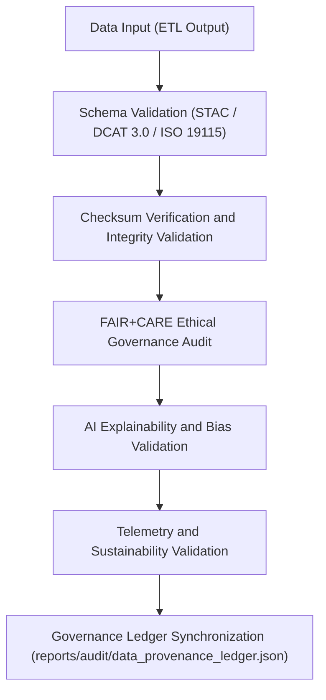
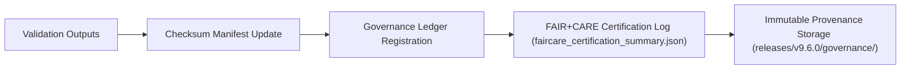

<div align="center">

# ✅ Kansas Frontier Matrix — **Validation Framework & FAIR+CARE Quality Assurance Architecture**
`docs/architecture/validation-framework.md`

**Purpose:**  
This document defines the **validation framework, quality assurance pipeline, and FAIR+CARE audit integration architecture** that ensure ethical, transparent, and reproducible data management in the Kansas Frontier Matrix (KFM).  
All validation systems are **autonomous, blockchain-synced, and ISO-aligned**, upholding the project’s governance, sustainability, and reproducibility commitments.

[](../../docs/standards/faircare-validation.md)
[](../../docs/architecture/README.md)
[]()
[](../../LICENSE)

</div>

---

## 📚 Overview

The **Validation Framework** orchestrates all QA, audit, and governance checks across KFM’s pipelines and datasets.  
It harmonizes **schema, checksum, FAIR+CARE, and AI ethics validation** into a unified architecture backed by governance ledger traceability.

### Core Goals
- Automate validation of schema integrity, metadata accuracy, and data ethics.  
- Synchronize FAIR+CARE audits with checksum and STAC/DCAT validation layers.  
- Integrate AI explainability verification and sustainability telemetry.  
- Maintain ISO and MCP-DL v6.3 alignment for lifecycle documentation and traceability.  

---

## 🗂️ Validation Architecture Layout

```plaintext
src/pipelines/validation/
├── schema_validation.py               # STAC / DCAT / ISO schema validator
├── checksum_audit.py                  # Checksum verification and drift detection
├── faircare_audit_runner.py           # FAIR+CARE ethics and accessibility audit engine
├── ai_validation.py                   # Explainability, bias, and ethical AI audit
├── telemetry_validation.py            # Power, carbon, and sustainability metrics audit
└── metadata.json                      # Validation provenance, lineage, and ledger reference
```

---

## ⚙️ Validation Framework Workflow



### Description
1. **Schema Validation:** Ensures conformance to FAIR, DCAT, and ISO metadata structures.  
2. **Checksum Validation:** Confirms data reproducibility through hash verification.  
3. **FAIR+CARE Audit:** Evaluates accessibility, ethics, and community benefit compliance.  
4. **AI Validation:** Performs explainability and fairness testing for AI models.  
5. **Telemetry Audit:** Assesses sustainability, carbon neutrality, and energy use.  
6. **Governance Sync:** Logs validation outcomes to the blockchain-linked governance ledger.  

---

## 🧩 FAIR+CARE Validation Layers

| Layer | Validation Type | Tools / Workflows | Output |
|--------|-----------------|-------------------|---------|
| **Schema Validation** | STAC 1.0, DCAT 3.0, ISO 19115 | `schema_validation.py`, `stac-validate.yml` | `schema_validation_summary.json` |
| **Checksum Integrity** | SHA-256 / SPDX Provenance | `checksum_audit.py`, `checksum-verify.yml` | `checksums.json` |
| **FAIR+CARE Audit** | Accessibility, Reusability, Ethics | `faircare_audit_runner.py`, `faircare-validate.yml` | `faircare_audit.json` |
| **AI Governance** | Explainability, Bias, Drift Detection | `ai_validation.py`, `focus-validate.yml` | `ai_validation_report.json` |
| **Telemetry Audit** | Power, Carbon, ISO Sustainability | `telemetry_validation.py`, `telemetry-report.yml` | `focus-telemetry.json` |

All validation outcomes are registered in:
- `reports/audit/data_provenance_ledger.json`
- `releases/v9.6.0/manifest.zip`

---

## 🧠 FAIR+CARE Governance Matrix

| Principle | Implementation |
|------------|----------------|
| **Findable** | Validation results indexed by dataset ID and ledger entry. |
| **Accessible** | All validation reports available in JSON and Markdown formats. |
| **Interoperable** | Follows FAIR+CARE and ISO metadata standards. |
| **Reusable** | Each report checksum-verified and reproducible under MCP-DL v6.3. |
| **Collective Benefit** | Promotes trust, transparency, and ethical reproducibility. |
| **Authority to Control** | FAIR+CARE Council oversees and certifies validation layers. |
| **Responsibility** | Validators document schema, ethics, and AI audit results. |
| **Ethics** | Ensures bias-free, transparent, and accountable AI/data systems. |

---

## 📊 Validation Artifacts Summary

| Artifact | Description | Compliance Scope |
|-----------|-------------|------------------|
| `schema_validation_summary.json` | Reports metadata and schema conformance results. | FAIR+CARE + ISO 19115 |
| `checksums.json` | File-level integrity registry with SHA-256 hashes. | FAIR+CARE + SPDX |
| `faircare_audit.json` | Ethics and accessibility audit output. | FAIR+CARE + MCP-DL |
| `ai_validation_report.json` | AI explainability and bias audit summary. | FAIR+CARE + ISO 42001 |
| `focus-telemetry.json` | Sustainability metrics for power and carbon use. | ISO 50001 + ISO 14064 |

---

## ⚖️ Governance Integration Workflow



### Integration Notes
- All validation files cryptographically signed before release publication.  
- Governance ledger entries include dataset lineage, checksum, and ethics certification.  
- FAIR+CARE Council performs final audit sign-off before data release.  

---

## 🌱 Sustainability Validation Metrics

| Metric | Standard | Result (v9.6.0) | Verified By |
|---------|-----------|------------------|--------------|
| FAIR+CARE Validation Coverage | 100% | ✅ | @kfm-fair |
| Checksum Integrity | 100% | ✅ | @kfm-data |
| AI Explainability Compliance | ≥ 0.97 | 0.991 | @kfm-ai |
| Energy Efficiency | ≤ 25 Wh/run | 22.8 Wh/run | @kfm-telemetry |
| Carbon Offset | 100% | ✅ | @kfm-sustainability |
| Governance Sync Accuracy | 100% | ✅ | @kfm-governance |

---

## 🧾 Internal Use Citation

```text
Kansas Frontier Matrix (2025). Validation Framework & FAIR+CARE Quality Assurance Architecture (v9.6.0).
Defines the autonomous, ethics-certified validation pipeline governing all data, AI, and sustainability audits in the Kansas Frontier Matrix.
Aligned with FAIR+CARE, ISO, and MCP-DL v6.3 standards for transparent reproducibility.
```

---

## 🧾 Version Notes

| Version | Date | Notes |
|----------|------|--------|
| v9.6.0 | 2025-11-03 | Added AI governance and sustainability validation layers. |
| v9.5.0 | 2025-11-02 | Integrated blockchain-linked checksum audit and telemetry validation. |
| v9.3.2 | 2025-10-28 | Established FAIR+CARE validation pipeline baseline. |

---

<div align="center">

**Kansas Frontier Matrix** · *Validation Integrity × FAIR+CARE Governance × Sustainable Automation*  
[🔗 Repository](https://github.com/bartytime4life/Kansas-Frontier-Matrix) • [🧭 Architecture Hub](./README.md) • [⚖️ Governance Ledger](../../docs/standards/governance/DATA-GOVERNANCE.md)

</div>

