<div align="center">

# ✅ Kansas Frontier Matrix — **Validation Framework & FAIR+CARE Quality Assurance Architecture**
`docs/architecture/validation-framework.md`

**Purpose:**  
Defines the **validation framework, QA pipeline, and FAIR+CARE audit architecture** that ensure ethical, transparent, and reproducible data management across KFM.  
All validation systems are **autonomous, ledger-synced, and ISO-aligned**, upholding governance, sustainability, and reproducibility commitments.

[](./README.md)
[](../../LICENSE)
[](../standards/faircare-validation.md)
[]()

</div>

---

## 📘 Overview

The **Validation Framework** orchestrates all QA, audit, and governance checks across KFM’s data and AI pipelines.  
It harmonizes **schema, checksum, FAIR+CARE, and AI ethics validation** into a unified architecture backed by **governance-ledger traceability**.

### Core Goals
- Automate validation of **schema integrity**, **metadata accuracy**, and **data ethics**.  
- Synchronize **FAIR+CARE** audits with **checksum** and **STAC/DCAT** validation layers.  
- Integrate **AI explainability verification** and **sustainability telemetry**.  
- Maintain **ISO** and **MCP-DL v6.3** alignment for lifecycle documentation and traceability.  

---

## 🗂️ Validation Architecture Layout

```plaintext
src/pipelines/validation/
├── schema_validation.py               # JSON Schema / STAC 1.0 / DCAT 3.0 / ISO 19115 validator
├── checksum_audit.py                  # SHA-256 verification and artifact lineage integrity
├── faircare_audit_runner.py           # FAIR+CARE ethics and accessibility audit engine
├── ai_validation.py                   # Explainability, bias, and model drift/ethics validation
├── telemetry_validation.py            # Power, carbon, and sustainability metrics audit (ISO 50001/14064)
└── metadata.json                      # Validation provenance, lineage, and ledger reference
```

---

## ⚙️ Validation Framework Workflow

```mermaid
flowchart TD
    A["Data Input (ETL Output)"] --> B["Schema Validation (STAC 1.0 · DCAT 3.0 · ISO 19115)"]
    B --> C["Checksum Verification & Integrity Validation"]
    C --> D["FAIR+CARE Ethical Governance Audit"]
    D --> E["AI Explainability & Bias Validation"]
    E --> F["Telemetry & Sustainability Validation"]
    F --> G["Governance Ledger Sync (reports/audit/data_provenance_ledger.json)"]
```



### Description
1. **Schema Validation:** Ensures conformance to FAIR, **DCAT 3.0**, **STAC 1.0**, and **ISO 19115** metadata structures.  
2. **Checksum Validation:** Confirms reproducibility and lineage via **SHA-256** across layers.  
3. **FAIR+CARE Audit:** Evaluates accessibility, inclusion, and ethical compliance.  
4. **AI Validation:** Performs explainability (SHAP/LIME), bias testing, and drift surveillance.  
5. **Telemetry Audit:** Assesses sustainability KPIs (energy/CO₂e) and ISO alignment.  
6. **Governance Sync:** Logs outcomes to **blockchain-linked governance ledgers**.  

---

## 🧩 FAIR+CARE Validation Layers

| Layer | Validation Type | Tools / Workflows | Output |
|---|---|---|---|
| **Schema Validation** | STAC 1.0 · DCAT 3.0 · ISO 19115 | `schema_validation.py`, `stac-validate.yml` | `schema_validation_summary.json` |
| **Checksum Integrity** | SHA-256 · SPDX Lineage | `checksum_audit.py`, `checksum-verify.yml` | `checksums.json` |
| **FAIR+CARE Audit** | Accessibility · Reuse · Ethics | `faircare_audit_runner.py`, `faircare-validate.yml` | `faircare_audit.json` |
| **AI Governance** | Explainability · Bias · Drift | `ai_validation.py`, `focus-validate.yml` | `ai_validation_report.json` |
| **Telemetry Audit** | Energy · CO₂e · ISO 50001/14064 | `telemetry_validation.py`, `telemetry-report.yml` | `focus-telemetry.json` |

All validation outcomes are registered in:
- `reports/audit/data_provenance_ledger.json`  
- `releases/v9.7.0/manifest.zip`

---

## 🧠 FAIR+CARE Governance Matrix

| Principle | Implementation |
|---|---|
| **Findable** | Results indexed by dataset/model ID, catalog entry, and ledger ID. |
| **Accessible** | Reports available as JSON/CSV + human-readable Markdown. |
| **Interoperable** | Conforms to FAIR+CARE, STAC/DCAT, ISO 19115/CF, PROV-O. |
| **Reusable** | Artifacts checksum-verified; pipelines/documentation reproducible. |
| **Collective Benefit** | Increases public trust via transparent quality gates. |
| **Authority to Control** | FAIR+CARE Council reviews and certifies validation layers. |
| **Responsibility** | Validators document scope, criteria, and limitations. |
| **Ethics** | Ensures fair, inclusive, and accountable data/AI systems. |

---

## 📊 Validation Artifacts Summary

| Artifact | Description | Compliance Scope |
|---|---|---|
| `schema_validation_summary.json` | Metadata & schema conformance results. | FAIR+CARE · ISO 19115 |
| `checksums.json` | File-level integrity registry (SHA-256). | FAIR+CARE · SPDX |
| `faircare_audit.json` | Ethics/accessibility audit outcomes. | FAIR+CARE · MCP-DL |
| `ai_validation_report.json` | Explainability/bias/drift audit summary. | FAIR+CARE · ISO 42001 |
| `focus-telemetry.json` | Sustainability metrics (energy/CO₂e). | ISO 50001 · ISO 14064 |

---

## ⚖️ Governance Integration Workflow


### Integration Notes
- All validation artifacts are **cryptographically signed** prior to release.  
- Ledger entries include dataset lineage, checksums, reviewer identities, and ethics certification.  
- FAIR+CARE Council performs final sign-off before publication.  

---

## 🌱 Sustainability Validation Metrics

| Metric | Standard | Result (v9.7.0) | Verified By |
|---|---|---|---|
| FAIR+CARE Validation Coverage | FAIR+CARE | ✅ 100% | `@kfm-fair` |
| Checksum Integrity | SPDX · SHA-256 | ✅ 100% | `@kfm-data` |
| AI Explainability Compliance | ISO 42001 | 0.993 (≥ 0.97) | `@kfm-ai` |
| Energy Efficiency | ISO 50001 | 22.6 Wh/run (≤ 25 Wh/run) | `@kfm-telemetry` |
| Carbon Offset | ISO 14064 | ✅ 100% | `@kfm-sustainability` |
| Governance Sync Accuracy | FAIR+CARE | ✅ 100% | `@kfm-governance` |

---

## 🧾 Internal Use Citation

```text
Kansas Frontier Matrix (2025). Validation Framework & FAIR+CARE Quality Assurance Architecture (v9.7.0).
Defines the autonomous, ethics-certified validation pipeline governing data, AI, and sustainability audits in KFM.
Aligned with FAIR+CARE, ISO, and MCP-DL v6.3 for transparent reproducibility and governance.
```

---

## 🕰️ Version History

| Version | Date | Author | Summary |
|---|---|---|---|
| v9.7.0 | 2025-11-06 | `@kfm-validation` | Upgraded to v9.7.0; paths & badges hardened; DCAT 3.0 + ISO references refreshed; governance storage updated. |
| v9.6.0 | 2025-11-03 | `@kfm-validation` | Added AI governance & sustainability validation layers. |
| v9.5.0 | 2025-11-02 | `@kfm-governance` | Integrated blockchain-linked checksum audit & telemetry validation. |
| v9.3.2 | 2025-10-28 | `@kfm-core` | Established FAIR+CARE validation baseline. |

---

<div align="center">

**Kansas Frontier Matrix**  
*Validation Integrity × FAIR+CARE Governance × Sustainable Automation*  
© 2025 Kansas Frontier Matrix · Master Coder Protocol v6.3 · FAIR+CARE Certified · Diamond⁹ Ω / Crown∞Ω Ultimate Certified  

[Back to Architecture](./README.md) · [Governance Charter](../../docs/standards/governance/DATA-GOVERNANCE.md)

</div>
