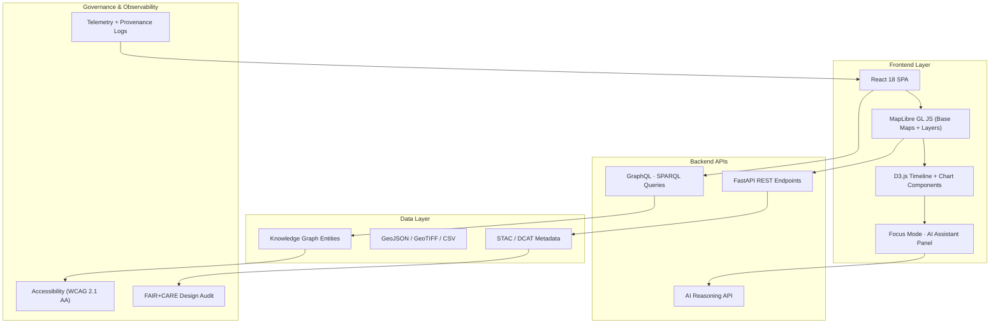
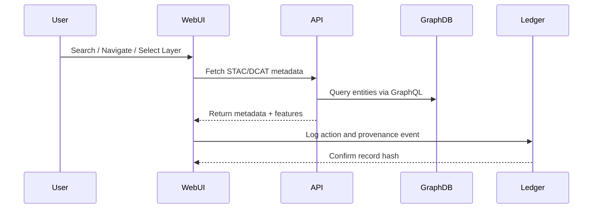

<div align="center">

# 🖥️ **Kansas Frontier Matrix — Web UI Architecture (v2.1.1 · Tier-Ω+∞ Certified)**  
`docs/architecture/web-ui-architecture.md`

**Mission:** Define the **frontend system design and governance model** of the **Kansas Frontier Matrix (KFM)** —  
a FAIR+CARE-aligned, accessible, and AI-enhanced web interface for geospatial and historical data exploration.

[](../../docs/)
[](../../docs/standards/accessibility.md)
[](../../docs/standards/faircare-validation.md)
[](../../LICENSE)

</div>

---

## 📚 Overview

The **KFM Web UI** provides an interactive, map-based visualization platform for exploring Kansas datasets, historical archives, and AI-driven narratives.  
It bridges spatial and temporal dimensions — combining **MapLibre geospatial rendering**, **React-based components**, and **AI contextual summaries** in **Focus Mode**.

Each frontend component is **versioned, accessible, and governance-audited** under FAIR+CARE principles and **MCP-DL documentation standards**.

---

## 🧩 Web UI Architecture Overview


<!-- END OF MERMAID -->

---

## 🧱 Component Breakdown

| Component | Description | Framework / Library |
|:--|:--|:--|
| **Map Renderer** | Displays dynamic base maps and vector overlays. | MapLibre GL JS |
| **Timeline Component** | Enables temporal data exploration. | D3.js |
| **Focus Mode** | AI-driven contextual entity summaries and document linking. | React + REST/AI APIs |
| **Layer Manager** | Handles dataset filtering, opacity, and metadata views. | React State + Hooks |
| **Search Panel** | GraphQL-backed search for entities and datasets. | Apollo Client |
| **Accessibility Layer** | Ensures WCAG compliance and ARIA labeling. | axe-core, Lighthouse |
| **Telemetry Engine** | Captures interactions and provenance events. | OpenTelemetry |

---

## ⚙️ Frontend Data Flow


<!-- END OF MERMAID -->

---

## 🧠 Focus Mode (AI Integration)

| Function | Description | Source |
|:--|:--|:--|
| **Entity Contextualization** | Generates summaries for people, events, or places. | `api/v1/ai/focus/` |
| **Document Linking** | Connects datasets with related reports and archives. | Knowledge Graph |
| **Explainability** | Displays reasoning chain and confidence levels. | AI Governance Ledger |
| **Bias Detection Feedback** | Highlights low-confidence results for review. | FAIR+CARE Audit Reports |

---

## ⚖️ FAIR + CARE Integration

| Principle | Implementation | Verification |
|:--|:--|:--|
| **Findable** | Searchable entities and datasets via GraphQL interface. | `/api/v1/graph/query` |
| **Accessible** | Open, WCAG 2.1 AA-compliant UI design. | Accessibility Audit |
| **Interoperable** | JSON-LD + STAC/DCAT metadata powering UI layers. | STAC Catalog Validation |
| **Reusable** | Versioned component design under MCP-DL governance. | CI/CD Provenance Reports |
| **Collective Benefit (CARE)** | Inclusive design + open civic education access. | FAIR+CARE Board Certification |

---

## 🔍 Accessibility & Internationalization

| Category | Requirement | Status |
|:--|:--|:--|
| **WCAG 2.1 AA** | All UI elements keyboard-navigable. | ✅ |
| **Contrast Ratio** | ≥ 4.5:1 for text and data overlays. | ✅ |
| **Screen Reader Support** | ARIA roles added to map/timeline components. | ✅ |
| **Localization (i18n)** | English (en), Spanish (es), Osage (osa). | ✅ |
| **Alt Text** | All imagery and icons described in metadata. | ✅ |

---

## ⚙️ CI/CD & Governance Workflows

| Workflow | Function | Output |
|:--|:--|:--|
| `ui-validate.yml` | Validates accessibility and UI standards. | `reports/validation/ui_validation.json` |
| `policy-check.yml` | Ensures component metadata and FAIR+CARE tags. | `reports/audit/policy_check.json` |
| `governance-ledger.yml` | Registers web component versions in ledger. | `data/reports/audit/ui_governance_ledger.json` |
| `docs-validate.yml` | Verifies diagrams and documentation syntax. | `reports/validation/docs_validation.json` |

---

## 🧾 Governance Metadata Example

```json
{
  "component": "FocusModePanel",
  "version": "v2.1.1",
  "owner": "@kfm-web",
  "license": "MIT",
  "faircare": {
    "accessible": true,
    "inclusive": true,
    "open_source": true
  },
  "governance": {
    "ledger_entry": "data/reports/audit/ui_governance_ledger.json",
    "checksum": "sha256:8d9a10b7...",
    "validated_at": "2025-11-16T13:00:00Z"
  }
}
```

---

## 🧩 Observability Metrics

| Metric | Description | Target | Tool |
|:--|:--|:--|:--|
| **UI Build Success** | Build completion rate per deployment. | 100% | GitHub Actions |
| **Accessibility Coverage** | WCAG 2.1 AA validation success rate. | 100% | axe-core CI |
| **Component Version Sync** | Governance ledger version match. | 100% | `governance-ledger.yml` |
| **Telemetry Uptime** | Focus Mode event capture rate. | ≥ 99% | OpenTelemetry |

---

## 🕰 Version History

| Version | Date | Author | Summary |
|:--|:--|:--|:--|
| **v2.1.1** | 2025-11-16 | @kfm-web | Standardized web UI architecture; added Focus Mode AI integration, accessibility table, and governance metadata schema. |
| v2.0.0 | 2025-10-25 | @kfm-docs | Added MapLibre and GraphQL visualization interface. |
| v1.0.0 | 2025-10-04 | @kfm-architecture | Initial web UI structure and accessibility baseline. |

---

<div align="center">

**Kansas Frontier Matrix © 2025**  
*“Design Ethically. Visualize Transparently.”*  
📍 `docs/architecture/web-ui-architecture.md` — Web architecture and governance documentation for the Kansas Frontier Matrix.

</div>

