<div align="center">

# 🌐 **Kansas Frontier Matrix — Web UI Architecture (v2.0.0 · Tier-Ω+∞ Certified)**  
`docs/architecture/web-ui-architecture.md`

**Mission:** Define the **frontend & visualization architecture** for the **Kansas Frontier Matrix (KFM)** — showing how **MapLibre layers, timelines, STAC metadata, and AI context** integrate to deliver an **interactive, provenance-aware, and accessible** exploration of Kansas history, science, and geography.

[](../../.github/workflows/site.yml)
[](../../.github/workflows/stac-validate.yml)
[](../../docs/)
[](../../.github/workflows/sbom.yml)
[](../../.github/workflows/slsa.yml)
[](../../LICENSE)

</div>

---

```yaml
---
title: "Kansas Frontier Matrix — Web UI Architecture"
document_type: "Architecture Spec"
version: "v2.0.0"
last_updated: "2025-11-16"
owners: ["@kfm-web","@kfm-design","@kfm-accessibility","@kfm-architecture"]
status: "Stable"
maturity: "Production"
license: "MIT"
tags: ["web","maplibre","timeline","stac","json","accessibility","i18n","caching","pwa","security","analytics"]
alignment:
  - MCP-DL v6.3
  - STAC 1.0 / STAC API
  - WCAG 2.1 AA / 3.0 readiness
  - JSON / JSON-LD / MVT / COG
validation:
  docs_ci_required: true
  frontmatter_required: ["title","version","last_updated","owners","license"]
  mermaid_end_marker: "<!-- END OF MERMAID -->"
observability:
  endpoint: "https://metrics.kfm.ai/web"
  metrics: ["route_a11y_score","first_contentful_paint_ms","tile_load_p95_ms","timeline_fps","error_rate_pct"]
preservation_policy:
  retention: "build logs 90d · release assets 365d"
  checksum_algorithm: "SHA-256"
---
```

---

## 📚 Overview

The **KFM Web UI** is a **MapLibre + Timeline** application driven by **STAC metadata** and **JSON configs**.  
Layers, legends, and timeslices are **not hardcoded** — they’re rendered from **`data/stac/`** and **`web/config/*.json`**, validated in CI, and deployed via **GitHub Pages**.

**Key tenets**
- **Data-driven UI** (STAC + JSON configs)  
- **Provenance by design** (checksum/source surfaced in the UI)  
- **Accessible & keyboard-first** (WCAG AA budgets)  
- **Fast & cacheable** (COG/MVT + ETag/immutable caching)  
- **Secure & observable** (CSP, SRI, metrics, error correlation IDs)

---

## 🏗 High-Level Web UI Architecture

```mermaid
graph TD
  A["🧩 STAC Metadata\n(data/stac/)"] --> B["🗺️ Tiles & Assets\n(data/tiles/ · COG/MVT)"]
  B --> C["⚙️ Web Configs\n(web/config/*.json)"]
  C --> D["🌐 App Shell (Vite/Vanilla)\nweb/index.html · app.js · style.css"]
  D --> E["🧭 MapLibre Viewer\nLayers · Legends · Popups · Search"]
  D --> F["📆 Timeline Engine\nPlayhead · Animation · Time Filters"]
  D --> G["🤖 Focus Mode (AI)\nContext · Sources · Confidence"]
  E --> H["📈 Provenance Popups\nChecksums · Sources · STAC Links"]

  style A fill:#fffbea,stroke:#e8a500
  style B fill:#eef8ff,stroke:#0077cc
  style C fill:#f5f5f5,stroke:#888
  style D fill:#ecf9f0,stroke:#22aa44
  style E fill:#e8f0ff,stroke:#0066aa
  style F fill:#e8f0ff,stroke:#0066aa
  style G fill:#f0e8ff,stroke:#8844cc
  style H fill:#f7f7f7,stroke:#555
```


<!-- END OF MERMAID -->

---

## 🧩 Web Directory Structure

```bash
web/
├── index.html                # App shell (CSP, meta, app mount)
├── app.js                    # Core logic (map/timeline/events/state)
├── style.css                 # Base styles + tokens (dark/light/HC)
├── config/
│   ├── layers.json           # Layers (id/type/source/paint/metadata)
│   ├── categories.json       # Domain grouping (terrain, hydrology, ...)
│   ├── time_config.json      # Timeline bounds, fps, playback
│   ├── legend.json           # Ramps, symbols, thresholds
│   └── viewer.json           # Theme, feature flags, a11y tokens
└── assets/
    ├── icons/                # UI + map icons (SVG, ARIA-labeled)
    ├── images/               # Thumbnails + previews
    └── logos/                # Branding
```

> CI validates JSON structure and **STAC references** used by `layers.json`.

---

## ⚙️ Core Components

| Component | Path | Description |
|:--|:--|:--|
| **Map Viewer** | `web/index.html` + `app.js` | Initializes MapLibre, loads config & STAC-driven layers |
| **Layer Config** | `web/config/layers.json` | Describes visible datasets, sources, styles, STAC link |
| **Timeline** | `web/config/time_config.json` | Animation (fps), bounds, snapping, step sizes |
| **Legend** | `web/config/legend.json` | Ramps, symbols, class breaks, labels |
| **Theme/Tokens** | `web/style.css` + `viewer.json` | Dark/Light/High-Contrast palettes, focus rings |

---

## 🧱 Layer Configuration Contract

Each **layer object** (in `layers.json`) references **tiles** and its **STAC Item**:

```json
{
  "id": "terrain-hillshade",
  "type": "raster",
  "title": "Kansas Hillshade (1m, 2020)",
  "category": "Terrain",
  "source": {
    "type": "raster",
    "tiles": ["data/tiles/terrain/ks_hillshade/{z}/{x}/{y}.png"],
    "tileSize": 256,
    "minzoom": 4,
    "maxzoom": 14
  },
  "paint": { "raster-opacity": 0.8 },
  "metadata": "data/stac/terrain/ks_hillshade_2018_2020.json",
  "legend": "web/config/legend.json",
  "visible": true
}
```

**Contract checks (CI)**: schema validation, STAC path existence, tile URL smoke test.

---

## 📆 Timeline Architecture

| Element | File | Responsibility |
|:--|:--|:--|
| **Time Config** | `web/config/time_config.json` | Playback modes, bounds, snap strategy, fps |
| **STAC Temporal** | `data/stac/*/*.json` | `datetime` or `interval` for each dataset |
| **UI** | `app.js` | Binds slider → layer filters; renders time bands |
| **CI** | `stac-validate.yml` | Ensures valid temporal fields & formats |

Supports animation, step, and scrub. Map + Timeline share a **single, synced time window**.

---

## 🧾 Provenance in the UI

**Popup template** (data-driven from STAC Item):

```html
<h3>{{title}}</h3>
<p><strong>Source:</strong> {{providers[0].name}}</p>
<p><strong>Date:</strong> {{datetime}}</p>
<p><strong>Checksum:</strong> <code>{{checksum_sha256}}</code></p>
<a href="{{stac_href}}" target="_blank" rel="noopener">Full Metadata</a>
```

Popups must include: **title**, **provider**, **date**, **checksum**, **metadata link**.

---

## 🔒 Security & Privacy

- **CSP**: default-src 'self'; img-src 'self' data:; style-src 'self' 'unsafe-inline'; connect-src 'self' (and data host if needed)  
- **SRI**: subresource integrity for any external scripts (discouraged)  
- **No PII**: analytics are **anonymous + opt-in**; no cookies or tracking by default  
- **CORS**: allow GET for static assets; deny non-essential methods

---

## 🚀 Performance & Caching

- **Tiles**: COG/MVT streamed; CDN caching; `Cache-Control: immutable` for versioned assets  
- **ETag / Last-Modified**: responses use conditional GET  
- **SLOs**: FCP ≤ **1200 ms**, tile p95 ≤ **400 ms**, timeline target ≥ **55 fps**

---

## ♿ Accessibility & i18n

| Area | Rule | Implementation |
|:--|:--|:--|
| **Keyboard** | Full navigation with visible focus | `:focus-visible` tokens; tabindex; ARIA roles |
| **Contrast** | AA text ≥ 4.5:1; icons ≥ 3:1 | Theme tokens + CI a11y budgets |
| **Live Regions** | Status/alerts are announced politely | `role="status"` where needed |
| **Skip Link** | First Tab → “Skip to main content” | `index.html` anchored |
| **Localization** | BCP-47 `lang`; pseudo-locale `en-XA` tested | labels sourced via `viewer.json` |
| **RTL** | Mirrored flow when enabled | logical CSS properties |

**A11y budgets (CI):** route average ≥ **95** (Lighthouse/Axe).

---

## 🧪 Testing & CI

| Check | Tool/Workflow | What it verifies |
|:--|:--|:--|
| Config schema | `docs-validate.yml` | JSON structure, required fields |
| STAC linkage | `stac-validate.yml` | `metadata` hrefs exist & pass STAC |
| Tile smoke | `make web-validate` | Random `{z/x/y}` tile returns 200 |
| A11y audit | `a11y-validate.yml` | Contrast, focus, ARIA, keyboard |
| Build & deploy | `site.yml` | Pages app + checksum/SBOM bundle |

Build logs: `data/work/logs/web_build.log` (hash-stamped, retained per policy).

---

## 🧩 Progressive Web App (optional)

- Installable app shell; offline cache for **config** + **UI** assets  
- **Network-first** strategy for tiles/metadata; **cache-first** for app shell  
- Service worker registration is feature-flagged in `viewer.json`.

---

## 🧠 Focus Mode (AI) Integration

- Context panels summarize **entities/events** with **sources + confidence**  
- Never hides provenance: citations are explicit; **no token-by-token speech** (buffered summaries)  
- A11y: summaries piped through `role="status"` with **polite** updates

---

## 📈 Observability

```yaml
web_metrics:
  export_to: "https://metrics.kfm.ai/web"
  fields:
    - route_a11y_score
    - first_contentful_paint_ms
    - tile_load_p95_ms
    - timeline_fps
    - error_rate_pct
  budgets:
    route_a11y_score: 95
    tile_load_p95_ms: 400
    timeline_fps: 55
```

---

## 🧩 Example: Minimal App Boot

```html
<!-- index.html -->
<main id="app" role="main" aria-label="Kansas Frontier Matrix Viewer"></main>
<script type="module" src="./app.js"></script>
```

```js
// app.js
import layers from './config/layers.json' assert { type: 'json' };
import timeCfg from './config/time_config.json' assert { type: 'json' };
import legend from './config/legend.json' assert { type: 'json' };

initMap(layers, legend);
initTimeline(timeCfg);
wireAccessibility();
```

---

## 🔗 Related Documentation

- `docs/architecture/architecture.md` — System overview  
- `docs/architecture/api-architecture.md` — STAC/GraphQL endpoints  
- `docs/architecture/data-architecture.md` — Data lineage feeding tiles  
- `design/mockups/README.md` — UI design provenance  
- `.github/workflows/site.yml` — Build & deploy

---

## 🧾 Versioning & Lifecycle

```yaml
versioning:
  policy: "Semantic Versioning (MAJOR.MINOR.PATCH)"
  tag_pattern: "web-arch-v*"
  doi_on_major: true
  provenance_bundle:
    - "web_architecture.prov.json"
    - "web_architecture.sha256"
```

---

## 🗓 Version History

| Version | Date | Summary |
|:--|:--|:--|
| **v2.0.0** | 2025-11-16 | Tier-Ω+∞: added security/CSP, PWA caching, a11y/i18n budgets, performance SLOs, config schema checks, Focus Mode conventions, and observability metrics. |
| v1.0.0 | 2025-10-04 | Initial Web UI architecture (MapLibre + STAC-driven configs + timeline). |

---

<div align="center">

**Kansas Frontier Matrix — Web UI Architecture**  
*“Visualizing Time, Terrain, and Truth — with Provenance in Every Pixel.”*

</div>