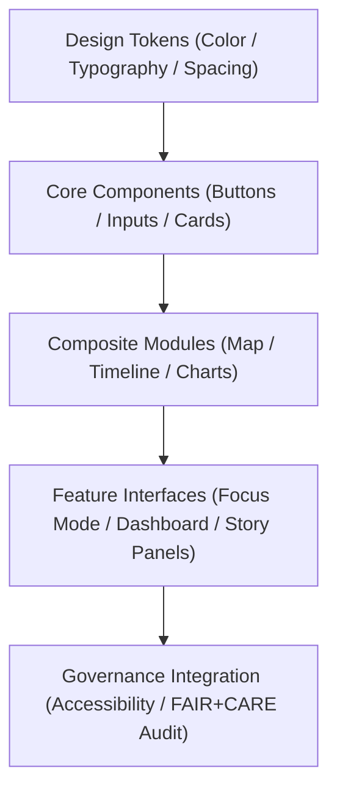

<div align="center">

# 🖥️ Kansas Frontier Matrix — **Web UI Design Architecture**
`docs/architecture/web-ui-design.md`

**Purpose:**  
Defines the **front-end user interface design system**, interaction patterns, and governance-linked accessibility framework for the **Kansas Frontier Matrix (KFM)** web ecosystem.  
Ensures that all interfaces — including **Focus Mode**, **Governance Dashboards**, and **Map Timelines** — are visually consistent, accessible, and ethically governed under FAIR+CARE, ISO, and WCAG 2.2 standards.

[](../../docs/standards/faircare-validation.md)
[]()
[]()
[](../../LICENSE)

</div>

---

## 📚 Overview

The **Web UI Design Architecture** defines the structural, aesthetic, and interaction principles governing all web interfaces within the Kansas Frontier Matrix.  
It merges **ethical UX design**, **FAIR+CARE governance**, and **ISO 9241-210 human-centered design** to create a user experience that is transparent, inclusive, and performance-optimized.

Key applications supported:
- **Focus Mode (AI + Map Integration)**  
- **Data Explorer (STAC/DCAT Integration)**  
- **Governance Dashboard (FAIR+CARE Oversight)**  
- **Narrative Viewer (Storytelling & Archival Content)**  

---

## 🧩 UI System Architecture



### Layers
| Layer | Description | Source |
|--------|--------------|---------|
| **Design Tokens** | Core UI variables ensuring global consistency and accessibility. | `docs/design/tokens/` |
| **Core Components** | Atomic React components like buttons, inputs, and modals. | `web/src/components/` |
| **Composite Modules** | Higher-level UI blocks such as maps, charts, and story panels. | `web/src/components/modules/` |
| **Feature Interfaces** | Focus Mode, Governance Dashboards, Data Explorer. | `web/src/pages/` |
| **Governance Integration** | Accessibility validation, telemetry, and FAIR+CARE compliance. | `web/src/hooks/governance/` |

---

## ⚙️ UI Technology Stack

| Category | Framework / Tool | Purpose |
|-----------|------------------|----------|
| **Front-End Framework** | React 18 + Vite | Modern, modular component-based web architecture. |
| **UI Library** | TailwindCSS + ShadCN | Lightweight, token-driven design implementation. |
| **Map Engine** | MapLibre GL JS | Ethical, open-source spatial visualization. |
| **Visualization** | D3.js + Recharts | FAIR+CARE data visualization and analytics. |
| **State Management** | Redux Toolkit | Predictable global UI state control. |
| **Accessibility Testing** | Axe-core / Lighthouse CI | Continuous compliance with WCAG 2.2 AA. |
| **AI Integration** | TensorFlow.js / REST APIs | Real-time explainability in Focus Mode UI. |

---

## 🎨 Design System Foundations

### 1. **Color Palette**
FAIR+CARE-accessible colors defined in `docs/design/tokens/color-palette.md`  
- WCAG-compliant contrast ratios.  
- Thematic consistency across environmental and cultural data visualizations.  

### 2. **Typography System**
Defined in `docs/design/tokens/typography-system.md`  
- Variable typography scaling for accessibility.  
- Clear hierarchy between headers, metadata, and AI narrative text.  

### 3. **Grid & Spacing**
Specified in `docs/design/tokens/spacing-grid.md`  
- Adaptive 12-column responsive layout.  
- Spacing increments based on modular scales for harmony and consistency.  

### 4. **Accessibility Tokens**
Defined in `docs/design/tokens/accessibility-tokens.md`  
- Predefined keyboard focus outlines, aria-label presets, and high-contrast modifiers.  

---

## 🧠 Focus Mode UI Architecture

**Focus Mode** blends AI reasoning, spatial analysis, and narrative storytelling through interactive components:  

| Component | Description | Linked Module |
|------------|--------------|----------------|
| **Map Panel** | Displays temporal-spatial layers and hazard overlays. | `web/src/components/map/` |
| **AI Explainability Panel** | Visualizes SHAP-based model reasoning results. | `web/src/components/ai/` |
| **Timeline Slider** | Enables historical filtering and event correlation. | `web/src/components/timeline/` |
| **Metadata Inspector** | Exposes provenance, checksum, and FAIR+CARE tags. | `web/src/components/governance/` |
| **Story Panel** | Contextualizes historical and environmental narratives. | `web/src/components/story/` |

---

## ⚖️ FAIR+CARE UI Governance Matrix

| Principle | Implementation | Verification |
|------------|----------------|--------------|
| **Findable** | All UI elements discoverable via semantic markup and search metadata. | @kfm-accessibility |
| **Accessible** | Keyboard, voice, and screen-reader friendly interaction. | @kfm-ux |
| **Interoperable** | UI structure integrated with DCAT/STAC metadata schemas. | @kfm-data |
| **Reusable** | Modular React components shared across all KFM subprojects. | @kfm-architecture |
| **Collective Benefit** | Interfaces prioritize open access to cultural and scientific data. | @faircare-council |
| **Authority to Control** | Governance logs tied to ethical oversight dashboards. | @kfm-governance |
| **Responsibility** | Accessibility and AI usage reports logged via telemetry. | @kfm-sustainability |
| **Ethics** | User experiences reviewed for cultural sensitivity and inclusion. | @kfm-ethics |

Governance audits stored in:  
`releases/v9.6.0/governance/ledger_snapshot_2025Q4.json`

---

## ♿ Accessibility & Usability Standards

| Standard | Implementation | Framework |
|-----------|----------------|------------|
| **WCAG 2.2 AA** | Continuous automated testing (Axe-core, Lighthouse CI). | Accessibility CI |
| **ISO 9241-210** | Inclusive, user-centered design practices. | KFM UX Framework |
| **ISO 14064** | Sustainable, low-impact UI performance tracking. | Focus Telemetry |
| **FAIR+CARE UX Governance** | Ethical, transparent, and equitable digital access. | Governance Council |

Accessibility compliance reports available in:  
`data/reports/validation/ui_accessibility_summary.json`

---

## 🌱 Sustainable Design Metrics

| Metric | Target | Verified By |
|---------|---------|--------------|
| Average Component Energy Use | ≤ 20 Wh per render | @kfm-telemetry |
| Lighthouse Accessibility Score | ≥ 95 | @kfm-accessibility |
| Open Source Reuse Rate | ≥ 90% | @kfm-architecture |
| UI Governance Transparency | 100% ledger-traceable | @kfm-governance |

All sustainability and accessibility metrics logged to:  
`releases/v9.6.0/focus-telemetry.json`

---

## 🧩 Example Component Telemetry Record

```json
{
  "component": "MapTimeline",
  "render_time_ms": 142,
  "energy_use_wh": 7.3,
  "accessibility_score": 99,
  "user_action": "timeline_scrub",
  "timestamp": "2025-11-03T17:52:00Z",
  "fairstatus": "compliant",
  "governance_ref": "data/reports/audit/data_provenance_ledger.json"
}
```

---

## 🧾 Internal Use Citation

```text
Kansas Frontier Matrix (2025). Web UI Design Architecture (v9.6.0).
Defines the FAIR+CARE, ISO, and WCAG-aligned user interface architecture for the Kansas Frontier Matrix web platform.
Ensures transparent, accessible, and ethical interaction across Focus Mode, governance dashboards, and storytelling experiences.
```

---

## 🧾 Version Notes

| Version | Date | Notes |
|----------|------|--------|
| v9.6.0 | 2025-11-03 | Integrated accessibility tokens and FAIR+CARE governance telemetry. |
| v9.5.0 | 2025-11-02 | Enhanced Focus Mode UX and provenance visualization. |
| v9.3.2 | 2025-10-28 | Established ethical design foundation under ISO and FAIR+CARE standards. |

---

<div align="center">

**Kansas Frontier Matrix** · *Ethical Design × FAIR+CARE Accessibility × Provenance-Aware Interfaces*  
[🔗 Repository](https://github.com/bartytime4life/Kansas-Frontier-Matrix) • [🎨 Design Docs](../design/README.md) • [⚖️ Governance Ledger](../../docs/standards/governance/DATA-GOVERNANCE.md)

</div>