<div align="center">

# 🖥️ Kansas Frontier Matrix — **Web UI Design Architecture**
`docs/architecture/web-ui-design.md`

**Purpose:**  
Define the **front-end UI design system**, interaction patterns, and governance-linked accessibility framework for the **Kansas Frontier Matrix (KFM)**.  
Ensure that **Focus Mode**, **Governance Dashboards**, and **Map Timelines** are visually consistent, accessible, secure-by-design, and ethically governed under **FAIR+CARE**, **ISO**, and **WCAG 2.2**.

[](./README.md)
[](../../LICENSE)
[](../standards/faircare.md)
[]()
[]()
</div>

---

## 📘 Overview

The **Web UI Design Architecture** establishes structural, aesthetic, and interaction principles for the KFM web ecosystem.  
It merges **ethical UX**, **FAIR+CARE governance**, **security-by-design**, and **ISO 9241-210 human-centered design** to deliver a **transparent, inclusive, and performant** experience.

Supported applications:
- **Focus Mode (AI × Map Integration)**  
- **Data Explorer (STAC/DCAT Integration)**  
- **Governance Dashboard (FAIR+CARE Oversight)**  
- **Narrative Viewer (Story Nodes & Archival Content)**  

---

## 🧩 UI System Architecture

```mermaid
flowchart TD
    A["Design Tokens (Color · Typography · Spacing · Motion)"] --> B["Core Components (Buttons · Inputs · Cards · Modals)"]
    B --> C["Composite Modules (Map · Timeline · Charts · Tables · Story Panels)"]
    C --> D["Feature Interfaces (Focus Mode · Governance Dashboard · Data Explorer · Narrative Viewer)"]
    D --> E["Governance Integration (Accessibility · FAIR+CARE · Telemetry · Security Gates)"]
```



### Layers

| Layer | Description | Source |
|---|---|---|
| **Design Tokens** | Palette, type scale, spacing grid, motion ramps, elevation. | `docs/design/tokens/` |
| **Core Components** | Atomic React components (ARIA-complete). | `web/src/components/` |
| **Composite Modules** | Map, timeline, charts, tables, dialogs, story. | `web/src/components/modules/` |
| **Feature Interfaces** | Pages for Focus, Explorer, Governance, Narrative. | `web/src/pages/` |
| **Governance Integration** | Accessibility validation, FAIR+CARE badges, telemetry & security hooks. | `web/src/hooks/governance/` |

---

## ⚙️ UI Technology Stack

| Category | Framework / Tool | Purpose |
|---|---|---|
| **Front-End** | React 18 + Vite | Modern, modular SPA foundation |
| **Styling** | TailwindCSS + ShadCN | Token-driven theming; accessible primitives |
| **Map Engine** | MapLibre GL JS | Open, ethical spatial visualization |
| **Visualization** | D3.js + Recharts | FAIR+CARE analytics & charts |
| **State** | Redux Toolkit + RTK Query | Predictable global state & data fetching |
| **Accessibility CI** | axe-core + Lighthouse CI | Continuous WCAG 2.2 AA compliance |
| **AI Integration** | REST/GraphQL → Focus APIs | Explainability overlays & narratives |
| **Security Hooks** | Prompt Gate + Tool Allowlist | UI boundary enforcement for AI actions |

---

## 🎨 Design System Foundations

### 1) Color Palette
- WCAG AA/AAA tokens for text, surfaces, and data scales.  
- Semantic roles (info/success/warn/error) + domain palettes (climate/hazards/hydrology).  
- Source: `docs/design/tokens/color-palette.md`

### 2) Typography
- Scalable type system with fluid clamp values and clear hierarchy.  
- Reading comfort for long-form narratives & dense tabular data.  
- Source: `docs/design/tokens/typography-system.md`

### 3) Grid & Spacing
- Adaptive **12-column** grid; spacing increments (4/8 base) for rhythm & consistency.  
- Breakpoints optimized for map + timeline dual layouts.  
- Source: `docs/design/tokens/spacing-grid.md`

### 4) Accessibility Tokens
- Focus outlines, high-contrast modes, aria-label presets, motion-reduction flags.  
- Declarative landmarks + skip-to-content shortcuts.  
- Source: `docs/design/tokens/accessibility-tokens.md`

---

## 🧠 Focus Mode UI Architecture

Focus Mode blends **AI reasoning**, **spatial analysis**, and **narrative synthesis** through coordinated components.

| Component | Description | Module Path |
|---|---|---|
| **Map Panel** | Vector layers, temporal filters, domain overlays. | `web/src/components/map/` |
| **Explainability Panel** | SHAP/LIME charts, top features, confidence/uncertainty. | `web/src/components/ai/` |
| **Timeline Slider** | Time range, brushing, event bands, playhead controls. | `web/src/components/timeline/` |
| **Metadata Inspector** | Provenance, checksums, STAC/DCAT links, FAIR+CARE flags. | `web/src/components/governance/` |
| **Story Panel** | Story Node rendering; media + citations; map linkage. | `web/src/components/story/` |

**Interaction Contract (high-level):**
- Selecting a map feature highlights corresponding timeline bands and story entries.  
- Explainability panel updates with local/global attributions and narrative summaries.  
- Inspector surfaces provenance (model, data, checksum) with ledger IDs and badges.  
- Security hooks enforce prompt boundaries and deny unregistered tool invocations.

---

## ♿ Accessibility & Usability Standards

| Standard | Implementation | Evidence |
|---|---|---|
| **WCAG 2.2 AA** | Landmarks, name/role/value, tab order, bypass blocks. | axe/Lighthouse CI |
| **ISO 9241-210** | Participatory design + usability testing loops. | UX study notes |
| **FAIR+CARE UX** | Inclusive language, cultural sensitivity, UI equity checks. | Governance reviews |

Accessibility reports:  
`data/reports/validation/ui_accessibility_summary.json`

---

## ⚖️ FAIR+CARE UI Governance Matrix

| Principle | Implementation | Verification |
|---|---|---|
| **Findable** | Semantic HTML, rich meta/search schema, focus rings. | `@kfm-accessibility` |
| **Accessible** | Keyboard/voice/screen-reader parity; contrast & motion controls. | `@kfm-ux` |
| **Interoperable** | UI integrates DCAT/STAC descriptors & PROV-O links. | `@kfm-data` |
| **Reusable** | Component library + tokens shared across apps. | `@kfm-architecture` |
| **Collective Benefit** | Open UX patterns & docs for public reuse. | `@faircare-council` |
| **Authority to Control** | Governance logs tied to dashboards + PR templates. | `@kfm-governance` |
| **Responsibility** | Telemetry for accessibility + energy per render. | `@kfm-sustainability` |
| **Ethics** | Inclusive content review & sensitive-data redaction. | `@kfm-ethics` |

Governance snapshot:  
`releases/v10.2.0/governance/ledger_snapshot_2025Q4.json`

---

## 🛰 Sustainable UI Telemetry

| Metric | Target | Current | Verified By |
|---|---|---|---|
| Lighthouse Accessibility | ≥ 95 | 98 | `@kfm-accessibility` |
| Component Energy (avg) | ≤ 20 Wh/render | 17.2 Wh/render | `@kfm-telemetry` |
| Render Latency p95 | ≤ 150 ms | 131 ms | `@kfm-ops` |
| Open-Source Reuse Rate | ≥ 90% | 93% | `@kfm-architecture` |
| UI Governance Traceability | 100% | ✅ | `@kfm-governance` |

Telemetry: `releases/v10.2.0/focus-telemetry.json`

---

## 🧩 Example Component Telemetry Record

```json
{
  "component": "MapTimeline",
  "render_time_ms": 138,
  "energy_use_wh": 6.9,
  "accessibility_score": 99,
  "user_action": "timeline_scrub",
  "timestamp": "2025-11-09T17:52:00Z",
  "fairstatus": "compliant",
  "governance_ref": "data/reports/audit/data_provenance_ledger.json"
}
```

---

## 🧪 Reference Implementation (Paths & CI)

- **Components:** `web/src/components/**`  
- **Modules:** `web/src/components/modules/**`  
- **Pages:** `web/src/pages/**`  
- **Governance Hooks:** `web/src/hooks/governance/**`  
- **Accessibility CI:** `.github/workflows/docs-validate.yml` + Lighthouse pipeline  
- **Telemetry CI:** `.github/workflows/telemetry-report.yml`

---

## 🧾 Internal Use Citation

```text
Kansas Frontier Matrix (2025). Web UI Design Architecture (v10.2.3).
FAIR+CARE, ISO, WCAG-aligned, and security-by-design UI architecture for the KFM web platform.
Ensures transparent, accessible, and provenance-aware interfaces across Focus Mode, governance dashboards, and storytelling.
```

---

## 🕰️ Version History

| Version | Date | Author | Summary |
|---:|---|---|---|
| v10.2.3 | 2025-11-09 | `@kfm-ux` | Align to v10.2: added security hooks, updated telemetry/schema refs, refined WCAG/ISO mappings. |
| v9.7.0  | 2025-11-06 | `@kfm-ux` | v9.7.0 baseline with accessibility CI, tokens, and Focus Mode UX. |

---

<div align="center">

**Kansas Frontier Matrix**  
*Ethical Design × FAIR+CARE Accessibility × Secure, Provenance-Aware Interfaces*  
© 2025 Kansas Frontier Matrix · Master Coder Protocol v6.3 · Diamond⁹ Ω / Crown∞Ω Ultimate Certified  

[Back to Architecture](./README.md) · [Governance Charter](../../docs/standards/governance/DATA-GOVERNANCE.md)

</div>
