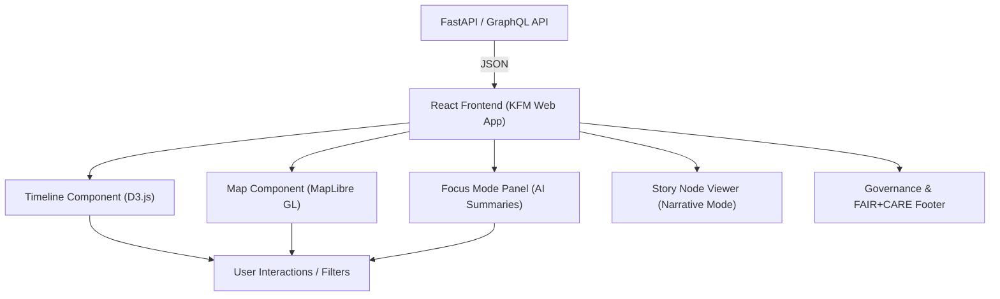

<div align="center">

# 🖥️ **Kansas Frontier Matrix — Web UI Architecture**
`docs/architecture/web-ui.md`

**Purpose:**  
Detailed technical overview of the **Kansas Frontier Matrix (KFM)** web interface — describing its **React + MapLibre architecture**, component hierarchy, Focus Mode integration, data flow, and accessibility standards under **MCP-DL v6.3** and **FAIR+CARE** governance.

[](../README.md)
[](../../LICENSE)
[](../standards/faircare.md)
[](../../releases/v10.0.0/manifest.zip)

</div>

---

## 📘 Overview
The **Kansas Frontier Matrix Web UI** serves as the public-facing gateway for exploring the platform’s geospatial-historical knowledge graph.  
It synchronizes an **interactive map (MapLibre GL)** with a **temporal timeline**, connecting users to data from Neo4j via the FastAPI backend.  
All visualizations are powered by open-source web technologies (React, TypeScript, D3, Tailwind, and MapLibre), ensuring accessibility, transparency, and reproducibility under the Master Coder Protocol.

---

## 🏗️ Architectural Summary


**Core Modules:**
1. **Map Component:** Displays geospatial layers from the STAC/DCAT catalog (historical maps, parcels, treaties, climate rasters).  
2. **Timeline Component:** Manages temporal navigation (decades, years, or eras).  
3. **Focus Mode:** AI-driven context engine for highlighting relationships (People ↔ Events ↔ Places).  
4. **Story Node Viewer:** Displays narrative sequences defined in the Story Node schema (`story-node.schema.json`).  
5. **Data Layer Manager:** Dynamically loads GeoJSON, COGs, and feature tiles using asynchronous MapLibre sources.  
6. **Session Telemetry:** Tracks user interactions and energy metrics for FAIR+CARE reporting.  

---

## ⚙️ Component Directory Layout
```
web/
 ├── src/
 │   ├── components/
 │   │   ├── Map/              # MapLibre GL map logic and layer management
 │   │   ├── Timeline/         # D3 timeline + temporal controller
 │   │   ├── FocusMode/        # Entity-centric insights and AI summaries
 │   │   ├── StoryNode/        # Narrative viewer component
 │   │   ├── Layout/           # Navbar, sidebar, footer, accessibility controls
 │   │   └── UI/               # Buttons, modals, tooltips, etc.
 │   ├── hooks/                # Custom React hooks for API and state sync
 │   ├── store/                # Global state management (Zustand/Redux)
 │   ├── api/                  # API service layer (GraphQL + REST)
 │   ├── styles/               # Tailwind and CSS modules
 │   └── utils/                # Reusable helpers (date/time, geometry, etc.)
 └── public/
     ├── assets/               # Static icons, images, manifest
     └── index.html            # Base HTML template
```

---

## 🔄 Data Flow
1. **User Interaction:**  
   A user pans the map, selects an entity, or drags the timeline.  
2. **API Request:**  
   The frontend calls the FastAPI/GraphQL endpoint (e.g. `/api/focus/{id}` or `/api/events?bbox=...`).  
3. **Data Fetch & Parse:**  
   JSON is transformed into component-friendly structures via `api/useGraphQuery.ts`.  
4. **Rendering:**  
   MapLibre layers and D3 timeline entries are rendered based on the response.  
5. **AI Summaries (Focus Mode):**  
   Contextual narrative summaries from `focus_transformer_v2` appear in the Focus Panel.  
6. **Telemetry Logging:**  
   Interaction events and session energy metrics are logged under `docs/reports/security/telemetry/`.

---

## 💡 Focus Mode Integration
Focus Mode v2 (from KFM v10.0) is tightly coupled with the web interface:
- **Trigger:** Activated by clicking a map feature, timeline event, or search result.  
- **Behavior:**  
  - Fetches AI-generated context and subgraph from `/api/focus/{entity_id}`.  
  - Dynamically updates timeline (highlighted entities) and map (zoom to bounding box).  
  - Displays an AI narrative summary, related people, places, and documents.  
- **Explainability:** Visual overlays show AI reasoning links (e.g., dashed lines from entities contributing to the summary).  
- **Caching:** Focus data cached via IndexedDB for offline performance.  
- **Ethics:** All AI outputs are filtered through FAIR+CARE ethical validators before display.  

---

## 🧩 Data Visualization Standards
| Visualization | Framework | Data Source | Description |
|----------------|------------|--------------|-------------|
| **Map Layers** | MapLibre GL JS | STAC/DCAT catalogs (`data/stac/`) | Overlays georeferenced layers (e.g. DEMs, treaties, maps). |
| **Timeline** | D3.js | GraphDB temporal edges (`HAS_DATE`) | Displays chronological event ribbons and clusters. |
| **Story Mode** | React / Markdown Renderer | `story-node.schema.json` | Shows narrative cards linking entities and timelines. |
| **AI Panels** | React + Tailwind | FastAPI Focus endpoint | Real-time AI narrative and ethical insight display. |

---

## ♿ Accessibility & Design Tokens
| Feature | Standard | Implementation |
|----------|-----------|----------------|
| **Color Contrast** | WCAG 2.1 AA | Tailwind design tokens ensure ≥ 4.5:1 contrast ratio. |
| **Keyboard Navigation** | ARIA / TabIndex | All interactive elements navigable via keyboard. |
| **Alt Text & Labels** | WCAG 2.1 | All icons/images require descriptive `alt` attributes. |
| **Responsive Layout** | CSS Grid + Tailwind | Layout adapts to desktop/tablet/mobile seamlessly. |
| **Localization** | i18n Framework | Supports multi-language UI (English, Spanish, etc.). |

---

## ⚖️ FAIR+CARE Integration
- **FAIR:** All map and data assets linked via STAC/DCAT metadata and accessible via API.  
- **CARE:** Sensitive or sacred sites obfuscated via permissioned map layers.  
- **Transparency:** AI reasoning traces displayed on demand (no black-box summarization).  
- **Sustainability:** UI telemetry integrated with ISO 50001 energy reporting for eco-governance.  

---

## 🧾 Version History
| Version | Date | Author | Summary |
|----------|------|---------|---------|
| v10.0.0 | 2025-11-09 | Web Architecture Team | Migrated to modular React structure with Focus Mode v2 and telemetry integration. |
| v9.7.0 | 2025-05-12 | Frontend Team | Added AI Focus Mode v1 and STAC-driven dynamic layer loading. |
| v9.5.0 | 2025-02-01 | UI/UX Group | Refined timeline-map synchronization and accessibility compliance. |

---

<div align="center">

© 2025 Kansas Frontier Matrix · Master Coder Protocol v6.3 · FAIR+CARE Certified · Diamond⁹ Ω / Crown∞Ω Ultimate Certified  
[Back to Architecture Index](README.md) · [Governance Charter](../standards/governance/ROOT-GOVERNANCE.md)

</div>