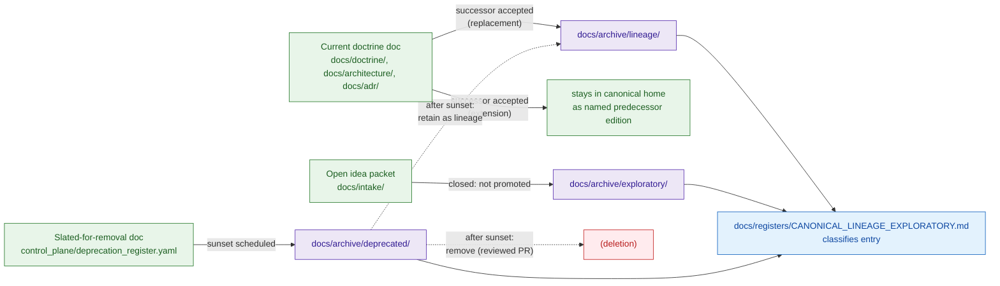

# docs/archive

> Retained predecessors, retired exploratory packets, and slated-for-removal material kept as **lineage evidence** — never as current canon.

[](../doctrine/directory-rules.md)
[](#0-status--authority)
[](../doctrine/directory-rules.md)
[](#5-the-supersession-rule)
[](#19-last-reviewed)
[](../../LICENSE)

---

## 📑 Contents

- [0. Status & Authority](#0-status--authority)
- [1. Purpose](#1-purpose)
- [2. Authority level](#2-authority-level)
- [3. Status](#3-status)
- [4. Repo fit](#4-repo-fit)
- [5. The supersession rule](#5-the-supersession-rule)
- [6. Subfolders](#6-subfolders)
- [7. Directory tree](#7-directory-tree)
- [8. What belongs here](#8-what-belongs-here)
- [9. What does NOT belong here](#9-what-does-not-belong-here)
- [10. Lifecycle: how things arrive](#10-lifecycle-how-things-arrive)
- [11. Inputs](#11-inputs)
- [12. Outputs](#12-outputs)
- [13. Conventions](#13-conventions)
- [14. Validation](#14-validation)
- [15. Review burden](#15-review-burden)
- [16. Anti-patterns](#16-anti-patterns)
- [17. Related folders](#17-related-folders)
- [18. ADRs](#18-adrs)
- [19. FAQ](#19-faq)
- [20. Open questions](#20-open-questions)
- [21. Last reviewed](#21-last-reviewed)

---

## 0. Status & Authority

| Field | Value |
|---|---|
| **Document type** | Folder README (README-like) |
| **Folder authority class** | `archive` (per Directory Rules §15) — CONFIRMED |
| **Folder presence in mounted repo** | UNKNOWN — repository not mounted this session |
| **Proposed canonical home** | `docs/archive/` per Directory Rules §6.1 — CONFIRMED doctrinally; PROPOSED as repo path |
| **Owner** | Docs steward (PROPOSED) |
| **Reviewers required for change** | Docs steward + at least one subsystem owner whose lineage is touched |
| **Supersedes** | None |
| **Related doctrine** | `../doctrine/directory-rules.md`, `../doctrine/lifecycle-law.md`, `../doctrine/truth-posture.md`, `../registers/CANONICAL_LINEAGE_EXPLORATORY.md`, `../registers/DRIFT_REGISTER.md` |
| **Lifecycle invariant respected** | RAW → WORK / QUARANTINE → PROCESSED → CATALOG / TRIPLET → PUBLISHED — `docs/archive/` is **not** in this chain; it preserves doctrine and idea-packet history outside the data lifecycle. |

> [!IMPORTANT]
> `docs/archive/` is the destination of "preserve as lineage if superseded." It is read-mostly and append-mostly: things are added when superseded or retired, not edited in place. Editing an archived artifact silently is a drift event.

---

## 1. Purpose

`docs/archive/` is the **historical record** for the human-facing control plane. It exists so that doctrine, exploratory thought, and to-be-removed content remain inspectable after they leave current canon. It guarantees four properties:

1. **Supersession is reversible.** Removing a current edition must yield a prior, still-citable predecessor.
2. **Exploratory work is contained.** Idea packets, drafts, and proposed designs do not become accidental canon by sitting too long in active directories.
3. **Deprecation is auditable.** Items slated for removal carry a migration plan and a final resting place before deletion is considered.
4. **Lineage stays readable.** Humans (not just registers) can walk back through the doctrinal history of any KFM concept.

> [!NOTE]
> `docs/archive/` **holds** lineage artifacts. The machine-readable classification of canon vs. lineage vs. exploratory lives in [`../registers/CANONICAL_LINEAGE_EXPLORATORY.md`](../registers/CANONICAL_LINEAGE_EXPLORATORY.md) (PROPOSED). The two are complementary: the register classifies; the archive holds.

---

## 2. Authority level

`archive` — per Directory Rules §15 enumeration of folder authority classes (`Canonical | implementation-bearing | generated | compatibility | archive | exploratory`).

This class means:

- Content here is **never the source of a current decision.** A citation to anything under `docs/archive/` MUST resolve to a `superseded_by`, `replaced_by`, or `retired_on` link.
- Content here is **retained for traceability**, not for active reading by new contributors.
- Removal of an archived artifact is a content change with its own review burden (see §15).

---

## 3. Status

**PROPOSED.** This folder and its README are designed per Directory Rules §6.1 but their presence in the mounted repository has not been verified in this session. Treat every specific path inside as `PROPOSED` until inspection confirms it.

---

## 4. Repo fit

- **Upstream (what populates this folder):**
  - `docs/doctrine/`, `docs/architecture/`, `docs/adr/`, `docs/atlases/` *(PROPOSED)*, `docs/sources/`, `docs/standards/`, `docs/runbooks/` — when a current edition supersedes a prior one.
  - `docs/intake/IDEA_INTAKE.md`, `docs/intake/NEW_IDEAS_INDEX.md` — when an exploratory packet is closed without promotion.
  - `control_plane/deprecation_register.yaml` — entries with a sunset date eventually land their docs here.
- **Downstream (what reads this folder):**
  - `docs/registers/CANONICAL_LINEAGE_EXPLORATORY.md` — references lineage entries by relative path.
  - `docs/registers/DRIFT_REGISTER.md` — references archived predecessors when explaining a drift event.
  - ADRs that record supersession.
- **Not a substitute for:**
  - `docs/reports/` — read-only **generated** review/release reports (current outputs).
  - `docs/registers/` — machine-friendly **indexes** of classification.
  - `control_plane/deprecation_register.yaml` — operational deprecation **tracker**.
  - `release/` — release **decisions** (which are also retained, but in their canonical home, not here).

---

## 5. The supersession rule

KFM doctrine is consistent about how predecessors are handled. The archive enforces it as a placement rule:

> [!TIP]
> **Supersede, do not delete.** When a doctrine artifact is replaced by a successor, the predecessor is moved to `docs/archive/lineage/` (not removed) and the current edition links back to it. Removal is itself a reviewed change.

Operationally, the rule has three forms:

| Successor relation | Source bucket | Archive bucket | Required link |
|---|---|---|---|
| **Extension** (Atlas v1.1 retains v1.0 verbatim) | Source remains in its canonical home as the named predecessor edition. | Optional duplicate in `lineage/` only if the canonical home retires the file. | `supersedes:` line in successor front matter. |
| **Replacement** (new doctrine doc replaces old) | Move predecessor file under `git mv` into `lineage/`. | `lineage/<domain>/<predecessor>.md` | `superseded_by:` line in predecessor; `supersedes:` in successor. |
| **Retirement without successor** (idea packet closed, doc deprecated) | Move under `exploratory/` or `deprecated/` depending on origin. | `exploratory/…` or `deprecated/…` | `retired_on:` and `reason:` in front matter; ADR if structural. |

---

## 6. Subfolders

| Subfolder | Holds | Stops being current when… | Typical predecessor types |
|---|---|---|---|
| [`lineage/`](#lineage) | Predecessor editions of doctrine, architecture, ADRs, atlases, standards briefs, runbooks. | A successor edition is accepted and the canonical home is updated. | Doctrine docs, ADRs, Atlas/supplement editions, standards conformance briefs, architecture pages. |
| [`exploratory/`](#exploratory) | Closed idea packets and exploratory drafts that were never promoted to canon. | The intake decision is **closed: not promoted** (rejected, deferred indefinitely, or merged into a different concept). | `IDEA_INTAKE` entries closed without merge; design sketches; proposed-but-withdrawn ADRs; speculative dossiers. |
| [`deprecated/`](#deprecated) | Material slated for removal that still must be visible while the migration runs. | `control_plane/deprecation_register.yaml` records a sunset date and a migration plan. | Pages tied to retired roots, retired schemas, retired policies, or retired tooling. |

### lineage

Predecessors of current canon. The reader can walk from a current doctrine doc back through its full revision lineage by following `superseded_by`/`supersedes` chains. Files here are **immutable** except for metadata updates (e.g., adding a back-link from a new successor).

### exploratory

The graveyard of unpromoted ideas. The presence of an idea here is **not** evidence that the idea is wrong — only that it did not pass through KFM's promotion gates and is therefore not canon. Re-promotion requires a new intake entry, not direct edits here.

### deprecated

A short-stay holding area. Files here are on a clock: each has a sunset date in `control_plane/deprecation_register.yaml`. After the sunset window, content either moves to `lineage/` (if it has continuing reference value) or is removed in a reviewed PR.

> [!CAUTION]
> `deprecated/` is **not** a synonym for "old." Old-but-current content stays in its canonical home. Material lands in `deprecated/` only when an ADR or deprecation register entry has scheduled its removal.

---

## 7. Directory tree

> [!WARNING]
> The tree below is **PROPOSED**. Path presence is `NEEDS VERIFICATION` until inspected against the mounted repo. Do not treat as evidence of repo state.

```text
docs/archive/
├── README.md                    # this file
├── lineage/
│   ├── README.md                # explains the lineage bucket (PROPOSED)
│   ├── doctrine/                # prior editions of docs/doctrine/* (PROPOSED)
│   ├── architecture/            # prior editions of docs/architecture/* (PROPOSED)
│   ├── adr/                     # superseded ADRs (PROPOSED)
│   ├── atlases/                 # Atlas v1.0 if its canonical home retires the file (PROPOSED)
│   ├── standards/               # prior standards conformance briefs (PROPOSED)
│   ├── runbooks/                # superseded runbooks (PROPOSED)
│   └── domains/                 # domain dossier predecessors (PROPOSED)
├── exploratory/
│   ├── README.md                # explains the exploratory bucket (PROPOSED)
│   ├── idea-packets/            # closed intake packets (PROPOSED)
│   ├── drafts/                  # never-promoted drafts (PROPOSED)
│   └── withdrawn-adrs/          # proposed-but-withdrawn ADRs (PROPOSED)
└── deprecated/
    ├── README.md                # explains the deprecated bucket (PROPOSED)
    └── <sunset-dated subtrees>  # scheduled-for-removal docs (PROPOSED)
```

---

## 8. What belongs here

| If the file is… | Destination |
|---|---|
| A predecessor edition of a current doctrine doc | `lineage/doctrine/` |
| A predecessor architecture page | `lineage/architecture/` |
| A superseded ADR | `lineage/adr/` |
| A predecessor edition of an Atlas/supplement (if its canonical home is retired) | `lineage/atlases/` |
| A predecessor standards conformance brief | `lineage/standards/` |
| A predecessor runbook | `lineage/runbooks/` |
| A closed `IDEA_INTAKE` packet that was not promoted | `exploratory/idea-packets/` |
| A never-promoted draft (architecture sketch, speculative dossier) | `exploratory/drafts/` |
| A withdrawn proposed-ADR | `exploratory/withdrawn-adrs/` |
| A doc scheduled for removal with a sunset date | `deprecated/<sunset-dated subtree>/` |

Each archived file MUST carry the metadata required by [§13 Conventions](#13-conventions).

---

## 9. What does NOT belong here

The "do not put X here" list is as important as the "do put Y here" list. Routing mistakes that look reasonable but are wrong:

| Do not place here | Where it goes instead | Why |
|---|---|---|
| **Generated review/release reports** | `docs/reports/` | Reports are read-only current outputs, not lineage. |
| **Active idea packets** | `docs/intake/` | Open packets are part of the intake pipeline, not the archive. |
| **Machine-readable classification of canon/lineage/exploratory** | `docs/registers/CANONICAL_LINEAGE_EXPLORATORY.md` | The archive holds; the register classifies. |
| **Operational deprecation tracking** | `control_plane/deprecation_register.yaml` | Sunset dates and migration plans live in the control plane. |
| **Receipts, proofs, manifests, release decisions** | `data/receipts/`, `data/proofs/`, `data/manifests/`, `release/` | Trust content lives in its canonical homes; never in `docs/`. |
| **Prior data products** | `data/` lifecycle phases | The data lifecycle has its own retention. |
| **Predecessor schemas** | Stay under `schemas/contracts/v1/...` with `superseded_by` in header per ADR-0001 (PROPOSED). | Schema lineage is part of the schema home. |
| **Predecessor policies** | Stay under `policy/` with `superseded_by` link. | Policy lineage is part of the policy home. |
| **Drafts of *current* canonical docs** | Author them in place; use PR review, not the archive. | The archive is for *closed* states. |
| **Brand assets (old logos, retired voice guides)** | `docs/brand/` lineage subtree, OR `packages/ui/` lineage as applicable. | Brand lineage is owned by brand. |

> [!WARNING]
> The most common drift pattern for this folder is using it as a **convenience parking lot** for anything that "feels old." If the file still informs a current decision, it is not archived — it is current. Mark it current and review it, or supersede it properly.

---

## 10. Lifecycle: how things arrive



> [!NOTE]
> **NEEDS VERIFICATION:** the precise hand-off mechanism between `control_plane/deprecation_register.yaml` sunset events and `docs/archive/deprecated/` placement is not formally specified in current doctrine. Treat the dashed transitions in the diagram as PROPOSED.

---

## 11. Inputs

- **Manual authoring** — a docs steward moves a predecessor file with `git mv` and adds supersession metadata (per Directory Rules §14.1 *routine moves*).
- **Migration manifest** — for structural moves, a migration manifest under `migrations/data/` or `migrations/schema/` may also touch this folder; entries land in `lineage/` (per Directory Rules §14.2).
- **Intake closure** — when `docs/intake/NEW_IDEAS_INDEX.md` records a packet as closed without promotion, the packet body moves to `exploratory/idea-packets/` (PROPOSED).
- **Deprecation register** — when `control_plane/deprecation_register.yaml` records a sunset, the affected docs move to `deprecated/` (PROPOSED).

---

## 12. Outputs

- **Citable predecessors** — every successor doc can link back to its predecessor here.
- **Drift register evidence** — entries in `docs/registers/DRIFT_REGISTER.md` may cite archived files when explaining a drift event.
- **ADR appendices** — ADRs that record supersession may link archive entries as the evidentiary tail.
- **Audit trail** — the archive plus the register together form a walkable history for any reviewer or steward.

This folder does **not** emit:

- Generated reports (those go to `docs/reports/`).
- Machine-readable registers (those live in `docs/registers/` and `control_plane/`).
- Released artifacts (those live in `release/` and `data/published/`).

---

## 13. Conventions

Every file in `docs/archive/` MUST carry a small front-matter block (HTML comment or YAML, matching the file's original convention) with these fields:

```text
archived_on:      YYYY-MM-DD
archived_by:      <reviewer or team>
predecessor_of:   <relative path to successor, or "none — exploratory closure" / "none — deprecated">
supersession:     extension | replacement | retirement
adr_ref:          <ADR id, if structural>
register_ref:     <line/anchor in docs/registers/CANONICAL_LINEAGE_EXPLORATORY.md>
reason:           <one or two sentences>
sunset_date:      YYYY-MM-DD   # required only for deprecated/
```

Additional rules:

- **Filenames are not renamed** on archival, except to add a trailing edition tag where the canonical home reuses the basename (e.g., `directory-rules.v1.md`). The history must be findable.
- **Files are not edited in place**, except to add or correct the metadata block above. Any content edit is itself a content change and requires a reviewed PR.
- **No cross-archive moves.** A file does not migrate from `exploratory/` to `lineage/`; if an exploratory packet is later promoted, the **current** version goes to canon and the original packet stays in `exploratory/` as the original closure.
- **No nesting beyond two levels** under each bucket without an ADR. Deep trees obscure lineage.

---

## 14. Validation

| Check | Where it runs | Failure mode |
|---|---|---|
| Every file under `docs/archive/` has an `archived_on` and `supersession` field. | `tools/validators/docs/archive_metadata/` *(PROPOSED)* | PR blocked; reviewer must add metadata. |
| Every `supersession: replacement` file has a resolvable `predecessor_of` pointing at an existing successor. | same validator | PR blocked. |
| Every `deprecated/` file has a `sunset_date` and a matching entry in `control_plane/deprecation_register.yaml`. | same validator | PR blocked. |
| No file in `docs/archive/` is referenced as the authority for a current decision by any current doc. | docs link-check workflow *(PROPOSED)* | Drift entry opened. |
| README presence at `docs/archive/`, `docs/archive/lineage/`, `docs/archive/exploratory/`, `docs/archive/deprecated/`. | repo-wide README presence scan (Directory Rules §15) | Drift candidate. |

> [!NOTE]
> All validator paths above are **PROPOSED**. The validator-home convention is `tools/validators/<area>/` per Directory Rules §7.5; specific names and exit codes are NEEDS VERIFICATION until a validator PR lands.

---

## 15. Review burden

- **Routine archival of a single doc** (`git mv` + metadata): docs steward review.
- **Adding a new subfolder under any bucket**: docs steward + subsystem owner whose lineage is touched.
- **Removing a file from `docs/archive/`** (i.e., permanent deletion): docs steward + at least one subsystem owner + linked ADR if the file was ever cited as authority.
- **Changing this README's structure or rules**: docs steward; if the change alters the §6 subfolder set, the §13 conventions, or the relationship to `docs/registers/` or `control_plane/`, an ADR per Directory Rules §2.4 / §17 is required.

CODEOWNERS reference: *TODO — link once `CODEOWNERS` lines for `docs/archive/**` are added.*

---

## 16. Anti-patterns

| Anti-pattern | Symptom | Fix |
|---|---|---|
| **Convenience parking lot** | "Looks old, dump it in `docs/archive/`." | Decide if it informs a current decision. If yes, keep it in canon. If no, supersede it formally. |
| **Edit-in-place archive** | Someone tweaks an archived doc to "improve" it. | Revert. Archived files are immutable except for metadata. If the content needs updating, the file is not actually archived — it is canon and should be returned to its canonical home. |
| **Archive as canon citation** | A current doc cites `docs/archive/...` as the source of a decision. | The cited file is canon, not archive. Move it back; or update the current doc to cite the successor. |
| **Schema lineage in `docs/archive/`** | Predecessor `*.schema.json` files land here. | Schema lineage stays under `schemas/contracts/v1/...` with a `superseded_by` header per ADR-0001 (PROPOSED). |
| **Policy lineage in `docs/archive/`** | Predecessor policy files land here. | Policy lineage stays under `policy/` with a `superseded_by` link. |
| **Receipt/proof/manifest dump** | Trust artifacts land in archive "for safekeeping." | Trust artifacts live in `data/receipts/`, `data/proofs/`, `release/`, and `data/published/` — never in `docs/`. |
| **Hidden retirement** | A canon doc disappears with no archive trace. | Open a PR that performs the `git mv` and adds metadata; never delete without supersession. |
| **Cross-archive migration** | An exploratory packet "graduates" to `lineage/` after the fact. | Promote the **current** version to canon; leave the original packet in `exploratory/`. |

---

## 17. Related folders

| Folder | Relationship |
|---|---|
| [`../doctrine/`](../doctrine/) | Source of most lineage entries; superseded doctrine moves here. |
| [`../architecture/`](../architecture/) | Predecessor architecture pages land in `lineage/architecture/`. |
| [`../adr/`](../adr/) | Superseded ADRs land in `lineage/adr/`. |
| [`../atlases/`](../atlases/) *(PROPOSED)* | Atlas predecessor editions, if their canonical home retires them. |
| [`../standards/`](../standards/) | Predecessor standards conformance briefs. |
| [`../runbooks/`](../runbooks/) | Predecessor runbooks. |
| [`../intake/`](../intake/) | Source of `exploratory/idea-packets/` closures. |
| [`../registers/CANONICAL_LINEAGE_EXPLORATORY.md`](../registers/CANONICAL_LINEAGE_EXPLORATORY.md) | The classifier register: machine-friendly index of canon vs. lineage vs. exploratory. |
| [`../registers/DRIFT_REGISTER.md`](../registers/DRIFT_REGISTER.md) | Drift entries may cite archived predecessors as evidence. |
| [`../reports/`](../reports/) | **Not** archive: generated read-only reports of current state. |
| [`../../control_plane/deprecation_register.yaml`](../../control_plane/deprecation_register.yaml) | Operational sunset tracker; feeds `deprecated/`. |
| [`../../migrations/`](../../migrations/) | Structural migrations may touch `docs/archive/` via Directory Rules §14.2. |

---

## 18. ADRs

| ADR | Effect on this folder |
|---|---|
| `ADR-0001-schema-home.md` | Defines schema lineage convention (kept in `schemas/contracts/v1/...`, **not** here). |
| *PROPOSED ADR* — archive immutability and metadata contract | Would formalize §13 conventions and §14 validation. |
| *PROPOSED ADR* — relationship between `docs/archive/deprecated/` and `control_plane/deprecation_register.yaml` | Would close the dashed transitions in §10. |

> Adding, removing, or renaming a subfolder under `docs/archive/` is a Directory Rules §2.4 change and requires an ADR.

---

## 19. FAQ

<details>
<summary><strong>How is <code>docs/archive/</code> different from <code>docs/reports/</code>?</strong></summary>

`docs/reports/` holds **generated, read-only review and release reports** — current outputs of the system retained for inspection. `docs/archive/` holds **superseded or retired doctrine and exploratory material** — predecessors of current canon. A report from last quarter is not "archived" — it is a retained current output. A doctrine page replaced by a successor edition is archived.

</details>

<details>
<summary><strong>How is <code>docs/archive/</code> different from <code>docs/registers/CANONICAL_LINEAGE_EXPLORATORY.md</code>?</strong></summary>

The register **classifies** (machine-readable list of canon vs. lineage vs. exploratory packets, contracts, schemas, and emitted artifacts). The archive **holds** (the actual files). They cross-reference: every entry in the archive should appear in the register with its path.

</details>

<details>
<summary><strong>If Atlas v1.1 retains v1.0 verbatim "by integrated extension," should v1.0 be archived?</strong></summary>

No — not while v1.0 remains a standalone, citable artifact in its canonical home. Per Atlas v1.1 doctrine, the v1.0 PDF "remains retained at its existing path as historical record." `docs/archive/lineage/atlases/` becomes the destination only if a future edition replaces v1.0 entirely (i.e., supersession by replacement, not extension).

</details>

<details>
<summary><strong>An idea packet was rejected last month. Where does it go?</strong></summary>

`docs/archive/exploratory/idea-packets/`, with `supersession: retirement` and a `reason:` field summarizing the closure decision. The corresponding row in `docs/intake/NEW_IDEAS_INDEX.md` is updated to its closed disposition and links here.

</details>

<details>
<summary><strong>Can content move from <code>exploratory/</code> to <code>lineage/</code> if the idea is later adopted?</strong></summary>

No. If a previously exploratory idea is adopted, the **current** version of that idea is authored in canon (e.g., `docs/doctrine/`) and goes through the normal supersession path from there. The original exploratory packet stays in `exploratory/` as the record of the original closure. This avoids rewriting history.

</details>

<details>
<summary><strong>What about predecessor schemas, policies, or release manifests?</strong></summary>

They do **not** land in `docs/archive/`. Schema lineage stays in `schemas/contracts/v1/...` (with `superseded_by` headers, per ADR-0001 PROPOSED), policy lineage stays in `policy/`, and release manifest history stays in `release/`. `docs/archive/` is exclusively for human-facing control-plane content.

</details>

<details>
<summary><strong>Is anything in <code>docs/archive/</code> ever deleted?</strong></summary>

Rarely. The default is retain-forever. Deletion is reserved for content with explicit privacy, rights, or sensitivity issues that survived initial review and only surface later — and requires a reviewed PR plus, in most cases, an ADR. After a sunset window in `deprecated/`, the default is to migrate the file to `lineage/`, not to delete it.

</details>

---

## 20. Open questions

These are explicitly **not resolved** by this README and should be tracked in `docs/registers/VERIFICATION_BACKLOG.md`:

- **NEEDS VERIFICATION:** Does `docs/archive/` exist in the current mounted repo, and at what entrenchment level?
- **NEEDS VERIFICATION:** Are `lineage/`, `exploratory/`, `deprecated/` present, and do they each have a README that meets Directory Rules §15?
- **NEEDS VERIFICATION:** Does `docs/registers/CANONICAL_LINEAGE_EXPLORATORY.md` exist, and what is its current schema for referencing archive entries?
- **NEEDS VERIFICATION:** Does `control_plane/deprecation_register.yaml` exist, and what fields does it use to identify the affected docs?
- **OPEN:** Should `docs/archive/lineage/atlases/` accept Atlas v1.0 if and only if a future edition supersedes it by replacement? Recommend an ADR to fix the rule before the situation arises.
- **OPEN:** Should `tools/validators/docs/archive_metadata/` be a domain of its own validator, or part of a broader `tools/validators/docs/` family? Resolution affects §14.
- **OPEN:** Sunset-to-deletion default for `deprecated/`: retain-forever in `lineage/` vs. delete-after-window. Current text defaults to retain-forever; an ADR would lock it.

---

## 21. Last reviewed

| Item | Value |
|---|---|
| **Last reviewed** | TODO — set on first review pass |
| **Reviewer** | TODO |
| **Next review due** | TODO (default: 6 months after last review per Directory Rules §15) |

---

### Related docs

- [`../doctrine/directory-rules.md`](../doctrine/directory-rules.md) — folder authority classes, README contract, migration discipline.
- [`../doctrine/lifecycle-law.md`](../doctrine/lifecycle-law.md) *(PROPOSED)* — the data lifecycle, for contrast with the doctrine lifecycle the archive supports.
- [`../doctrine/truth-posture.md`](../doctrine/truth-posture.md) *(PROPOSED)* — cite-or-abstain posture; archive entries are cited only as predecessors.
- [`../registers/CANONICAL_LINEAGE_EXPLORATORY.md`](../registers/CANONICAL_LINEAGE_EXPLORATORY.md) *(PROPOSED)* — classification register that complements this folder.
- [`../registers/DRIFT_REGISTER.md`](../registers/DRIFT_REGISTER.md) *(PROPOSED)* — drift entries citing archived predecessors.
- [`../adr/README.md`](../adr/README.md) *(PROPOSED)* — ADR home; superseded ADRs land in `lineage/adr/`.

**Last updated:** TODO · **Authority class:** `archive` · **[⬆ Back to top](#docsarchive)**
