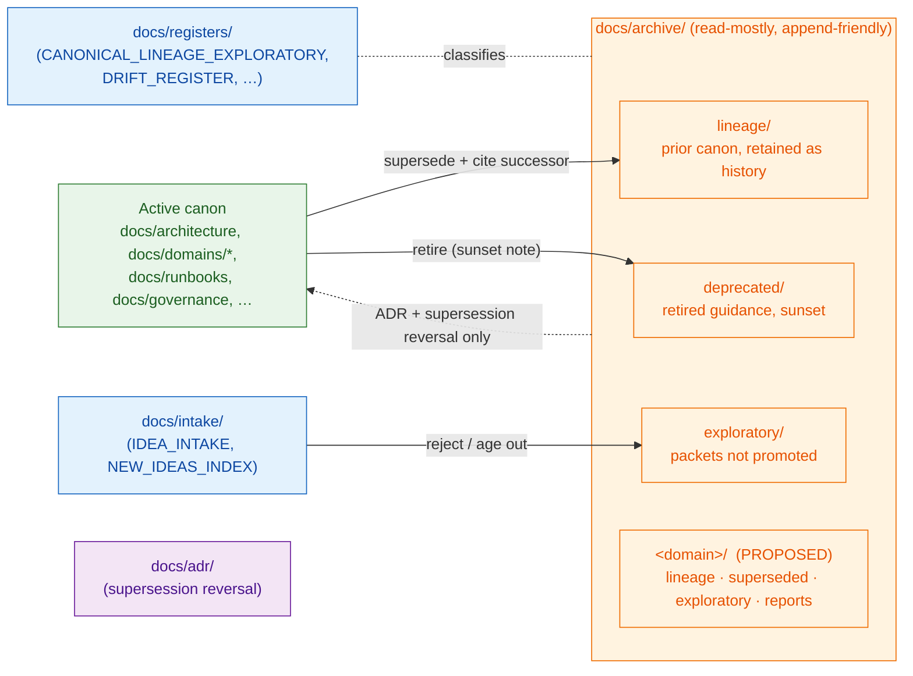

<!-- [KFM_META_BLOCK_V2]
doc_id: kfm://doc/docs-archive-readme
title: docs/archive/ — Archive Index
type: standard
version: v1
status: draft
owners: Documentation steward (TODO: confirm CODEOWNERS reference)
created: 2026-05-09
updated: 2026-05-09
policy_label: public
related:
  - docs/README.md
  - docs/doctrine/directory-rules.md
  - docs/registers/CANONICAL_LINEAGE_EXPLORATORY.md
  - docs/registers/DRIFT_REGISTER.md
  - docs/intake/IDEA_INTAKE.md
  - docs/intake/NEW_IDEAS_INDEX.md
  - docs/adr/
tags: [kfm, docs, archive, lineage, exploratory, deprecated, governance, supersession]
notes:
  - Satisfies the per-root README contract in directory-rules.md §15.
  - Subtree presence (lineage/, exploratory/, deprecated/, per-domain) is PROPOSED / NEEDS VERIFICATION until mounted-repo evidence confirms.
[/KFM_META_BLOCK_V2] -->

# `docs/archive/`

> **Read-mostly home for documentation that is preserved for provenance and lineage but is no longer active canon.**
> The archive does not decide anything. It remembers — and it keeps superseded thinking discoverable, citable, and clearly *not* in force.

<p align="left">
  
  
  
  
  
  
</p>

> [!IMPORTANT]
> **No active canon may import, cite as authoritative, or depend on a file in `docs/archive/` without an explicit successor mapping.** Files here describe what the project *used to think*, not what it currently asserts. Treat archived material as **lineage**, not as **doctrine**.

**Quick jump:**
[Purpose](#purpose) ·
[Authority level](#authority-level) ·
[Status](#status) ·
[Repo fit](#repo-fit) ·
[At a glance](#at-a-glance) ·
[What belongs here](#what-belongs-here) ·
[What does NOT belong here](#what-does-not-belong-here) ·
[Directory tree](#directory-tree-proposed) ·
[Subdirectory index](#subdirectory-index) ·
[Admission · Retention · Supersession](#admission-retention-and-supersession-rules) ·
[Validation](#validation) ·
[Review burden](#review-burden) ·
[Related folders](#related-folders) ·
[ADRs](#adrs) ·
[FAQ](#faq) ·
[Last reviewed](#last-reviewed)

---

## Purpose

`docs/archive/` is the Kansas Frontier Matrix (KFM) **documentation archive root**. It exists to preserve prior valid documents, exploratory packets, and deprecated guidance *without* letting them masquerade as current canon. It is the docs-side equivalent of a lineage register: an addressable, append-friendly place where retired or never-promoted thinking is held with its provenance intact.

Concretely, the archive is where four kinds of material land:

1. **Lineage** — prior normative docs that have been superseded by newer canon and are kept as historical reference.
2. **Exploratory** — brainstorming, packets, and ideation that have not been promoted to canon (and may never be).
3. **Deprecated** — guidance that has been retired (with or without replacement) and must no longer be followed.
4. **Per-domain history** *(PROPOSED)* — domain-scoped lineage / superseded / exploratory / reports subtrees, where domains have enough volume to warrant their own archive lane.

The archive **explains the past**. It does **not** define current behavior, validation, contracts, schemas, policy, or release state.

---

## Authority level

**`archive`** — per the README contract enumerated in [`docs/doctrine/directory-rules.md`](../doctrine/directory-rules.md#15-required-readme-contract) §15 (`Canonical | implementation-bearing | generated | compatibility | archive | exploratory`).

`docs/archive/` is **not** canonical, not generated, and not implementation-bearing. It is closer to a compatibility root in posture: tolerated for legacy/lineage reasons, governed by clear admission and supersession rules, and explicitly **not** a place new canon should land.

> [!NOTE]
> *"Authority level"* here describes how readers, validators, and reviewers should treat the contents — **not** an aspirational quality. A file in the archive is by definition **not** an authoritative source for current KFM behavior.

---

## Status

| Aspect | Truth label | Notes |
|---|---|---|
| Existence of `docs/archive/` as a docs root | **CONFIRMED** (doctrine) | Listed in `directory-rules.md` §6.1. |
| Existence of `lineage/`, `exploratory/`, `deprecated/` subtrees in the current repo | **PROPOSED / NEEDS VERIFICATION** | Doctrine names them; mounted-repo state was not inspectable in this drafting session. |
| Per-domain archives (e.g., `archive/agriculture/{lineage,superseded,exploratory,reports}/`) | **PROPOSED** | Present in domain dossiers (Agriculture, Atmosphere) as planned scaffolding. |
| Cross-references to `docs/registers/` and `docs/intake/` | **PROPOSED** | Target files are themselves PROPOSED in current planning docs. |
| This README's claims about admission, retention, supersession | **CONFIRMED** (doctrine-aligned) | Operationalizes rules stated across `directory-rules.md` §§2, 6, 14, 15 and domain dossiers. |

> [!WARNING]
> Do not infer that the per-domain or subtree READMEs (e.g., `docs/archive/lineage/README.md`) already exist in the repo. If a referenced child README is missing, it is a **drift candidate**: file an entry in `docs/registers/DRIFT_REGISTER.md` and create the README per the §15 contract.

---

## Repo fit

**Path (this file):** `docs/archive/README.md`

**Upstream (where archived material comes from):**

- `docs/architecture/`, `docs/domains/<domain>/`, `docs/runbooks/`, `docs/security/`, `docs/governance/`, etc. — when a doc is superseded, retired, or moved out of active canon.
- `docs/intake/IDEA_INTAKE.md` and `docs/intake/NEW_IDEAS_INDEX.md` — when a packet is rejected, ages out, or is set aside without promotion.
- Prior PDF reports and packet streams classified as `lineage` or `exploratory` by `docs/registers/CANONICAL_LINEAGE_EXPLORATORY.md`.

**Downstream (who reads from here):**

- Maintainers tracing **why** a current decision exists and what it superseded.
- Reviewers and ADR authors verifying that supersession was explicit and not silent.
- Drift register and verification backlog flows that audit lineage closure.
- **Not** the governed API, the UI, the public web surfaces, or any runtime evidence flow. Public consumers do not read from the archive.

> [!CAUTION]
> **The archive is not a source for `EvidenceBundle` / `EvidenceRef` resolution.** Evidence for current claims lives in `data/proofs/` and is referenced through `packages/evidence-resolver/`. If runtime answers ever need to cite archived doctrine, that is a sign the doctrine was archived prematurely or supersession is incomplete.

---

## At a glance

The archive sits *off the canon path*. Material flows **into** it from active canon and intake; material returns to canon **only** through an ADR or a supersession reversal.



> *Diagram reflects responsibility flow only; per-domain subtrees are PROPOSED and shown for orientation.*

---

## What belongs here

**Admit a document to `docs/archive/` when one of the following is true:**

- It was previously **canonical** under `docs/architecture/`, `docs/domains/`, `docs/runbooks/`, `docs/governance/`, `docs/security/`, etc., and has been **superseded** by a successor doc that explicitly cites it. → `lineage/` (or per-domain `<domain>/lineage/`).
- It is an **exploratory packet, brainstorm, or new-idea note** that was reviewed and not promoted to canon, or aged out under intake retention rules. → `exploratory/` (or per-domain `<domain>/exploratory/`).
- It is a previously published **runbook, guide, or policy doc that has been retired** (with or without a successor) and must not be followed going forward. → `deprecated/`.
- It is a **prior PDF report or planning artifact** classified as `lineage` or `exploratory` by `docs/registers/CANONICAL_LINEAGE_EXPLORATORY.md`. → the matching subtree.
- It is a **domain-specific historical artifact** (e.g., a previous Agriculture lineage report or an Atmosphere proposal) that warrants a per-domain archive lane. → `<domain>/<lineage|superseded|exploratory|reports>/` *(PROPOSED — see [§Subdirectory index](#subdirectory-index))*.

Every admitted file MUST carry — or be accompanied by — a header note (or registry row) recording: **what it was, why it left canon, what supersedes it (if anything), and the date of admission.**

---

## What does NOT belong here

> [!WARNING]
> The archive is **not** a holding pen, a workbench, a compatibility shim, or a place to dodge governance.

- **Active canon.** Anything currently in force lives in its proper canonical home (`docs/architecture/`, `docs/domains/<domain>/`, `docs/runbooks/`, `docs/governance/`, `docs/security/`, `docs/sources/`, `docs/standards/`, etc.).
- **Source data, raw observations, fixtures, or processed artifacts.** Those belong in `data/raw/`, `data/work/`, `data/quarantine/`, `data/processed/`, `data/catalog/`, `data/published/` per the lifecycle invariant. *Never* in `docs/`.
- **Receipts, proofs, manifests, release decisions, correction notices, rollback cards.** Those belong in `data/receipts/`, `data/proofs/`, `release/manifests/`, `release/correction_notices/`, `release/rollback_cards/`. The archive does **not** carry trust-bearing artifacts.
- **Generated reports and read-only build outputs.** Those belong in `docs/reports/` (and in `artifacts/` only as a tightly scoped compatibility root per `directory-rules.md` §8).
- **ADRs (active or superseded).** ADRs live in `docs/adr/`. A superseded ADR is not "archived" in the file-move sense — it stays in `docs/adr/` with a header marking it as superseded, and the new ADR points back. (Only ADR *attachments* — e.g., a long appendix that has aged out — might land here, and only when explicitly noted.)
- **Schemas, contracts, policies, source descriptors, validators, registers, machine-readable governance maps.** These have their own canonical homes (`schemas/`, `contracts/`, `policy/`, `data/registry/`, `tools/validators/`, `docs/registers/`, `control_plane/`). Versioned predecessors stay in their canonical home with `schema_version` / version semantics — they are **not** copied into `docs/archive/`.
- **Files in transit.** A doc being moved or refactored does not land here on the way; it goes directly to its new canonical home with `git mv` history preserved.
- **Anything sensitive that requires redaction or staged release.** Sensitivity decisions are made in canon (or quarantine), not in the archive. Archived items inherit the sensitivity of the form in which they were last published; do **not** re-expose redacted material here.

---

## Directory tree (PROPOSED)

The following layout reflects `directory-rules.md` §6.1 plus the per-domain pattern proposed in current domain dossiers. **Subtree presence is PROPOSED / NEEDS VERIFICATION** until confirmed against mounted-repo evidence.

```text
docs/archive/
├── README.md                       # this file
├── lineage/
│   └── README.md                   # admission, retention, supersession (lineage variant)   [PROPOSED]
├── exploratory/
│   └── README.md                   # admission, retention, supersession (exploratory variant) [PROPOSED]
├── deprecated/
│   └── README.md                   # admission, retention, supersession (deprecated variant)  [PROPOSED]
└── <domain>/                       # PROPOSED — per-domain archive lanes (only when volume justifies)
    ├── lineage/
    ├── superseded/
    ├── exploratory/
    └── reports/
```

> [!NOTE]
> **Per-domain archives are not automatic.** Create `docs/archive/<domain>/...` only when a domain has enough archived volume to justify its own lane *and* the domain owner has signed off. Otherwise, archived domain material lives in the cross-cutting `lineage/`, `exploratory/`, or `deprecated/` subtrees with the domain identified by file name or header note.

---

## Subdirectory index

| Subdir | Authority class | What it holds | Trigger to add | Append-only? | Status |
|---|---|---|---|---|---|
| [`lineage/`](./lineage/) | archive (lineage) | Prior valid normative docs (architecture, domain READMEs, runbooks, governance pages) that have been **superseded by named successors** and retained as historical guidance. | Move or supersede any normative report. | **Yes** — admissions append; existing entries are not destructively edited (corrections via header note). | PROPOSED |
| [`exploratory/`](./exploratory/) | archive (exploratory) | Brainstorming, idea packets, "new ideas" submissions, and intake material that was reviewed but **not promoted to canon** (or has aged out under intake retention rules). | Any packet archival action from `docs/intake/`. | **Yes** | PROPOSED |
| [`deprecated/`](./deprecated/) | archive (deprecated) | Guidance, runbooks, or policy docs that have been **retired**. May or may not have a successor; sunset note required either way. | Retirement of a previously published doc. | **Yes** (with sunset header on each item) | PROPOSED |
| `<domain>/` *(per-domain)* | archive (mixed) | Domain-scoped lineage, superseded, exploratory, and reports lanes. Use only when a domain accumulates enough archived material to justify its own root. | Domain owner request + docs steward sign-off. | **Yes** | PROPOSED |

> Each subdirectory MUST carry its own `README.md` that satisfies `directory-rules.md` §15 and that **specializes** the admission, retention, and supersession rules below for that subtree.

---

## Admission, retention, and supersession rules

These rules operationalize doctrine from `directory-rules.md` §§2, 6, 14 and from per-domain dossier guidance ("README.md explaining admission, retention, and supersession rules"; "no active canon imports from archive without explicit successor mapping"; "move item back to active canon only through ADR or supersession reversal").

### Admission

A document is admitted to `docs/archive/` only when **all** of the following hold:

1. **Classification is recorded.** The item has been classified as `lineage`, `exploratory`, or `deprecated` in `docs/registers/CANONICAL_LINEAGE_EXPLORATORY.md` (or in a successor register if one is adopted by ADR).
2. **Successor mapping is explicit (lineage and deprecated).**
   - For `lineage/`: the new canonical doc cites the archived predecessor by path and reason for supersession.
   - For `deprecated/`: a sunset note states the retirement date, the replacement (if any), and the reason. Items deprecated with **no replacement** MUST say so explicitly.
   - For `exploratory/`: no successor is required; admission notes whether the packet was rejected, deferred, or aged out, and links the intake record.
3. **Header / registry note is present.** Either the file's own header block (preferred) or a corresponding row in `docs/registers/CANONICAL_LINEAGE_EXPLORATORY.md` records: **original path**, **archived path**, **reason**, **date**, **classifier**, **successor (if any)**, and **supersession ADR or PR**.
4. **Move uses git history.** `git mv` preserves history. Plain copy-and-delete is a drift signal.
5. **Reviewer sign-off.** Docs steward review (and the relevant subsystem or domain owner where applicable). For deprecation of any doc that the public surface has cited, an ADR is required per §14.

### Retention

- **Append-only posture.** Once a file is admitted, do **not** rewrite it to "fix" content. Add a header note pointing to the correction or successor.
- **No silent deletion.** Removing a file from the archive requires an ADR + a `docs/registers/DRIFT_REGISTER.md` entry. Standard practice is to keep the file and update its header; deletion is exceptional.
- **No re-publication risk.** Sensitive content that was redacted upstream stays redacted here. Items inherit the sensitivity posture of their last published form. If the archive somehow holds material that **shouldn't** be public, treat it as a security incident: quarantine, redact, runbook entry per `docs/runbooks/`.
- **Stable links where practical.** Anchors and link targets in archived files MAY drift; add a "Note: archived" header rather than rewriting headings to preserve original anchors.
- **Read-mostly, not read-only.** Limited edits are permitted: header annotations, supersession links, sunset notes, classification corrections, and broken-link fixes. None of these constitute a substantive rewrite.

### Supersession

- **One direction by default.** Material moves from canon → archive. The reverse — archive → canon — is **not** a routine operation.
- **Reversal requires ADR.** Returning an archived doc to active canon requires (a) an ADR explaining why the prior reasoning is now sound, (b) a fresh review by the relevant subsystem owner, and (c) updates to the registers that previously classified it as lineage / exploratory / deprecated.
- **Citing archived material.** Active canonical docs MAY cite archived items as **history** (e.g., "this approach supersedes the prior guidance in `docs/archive/lineage/<x>.md`"). They MUST NOT cite archived items as **authority**.
- **Validator imports.** No validator, schema home, policy module, runtime adapter, or release tool imports from `docs/archive/`. The archive is documentation; validators read schemas, contracts, policy, and registries — not docs.
- **EvidenceBundle hygiene.** `EvidenceRef` MUST NOT resolve to anything inside `docs/archive/`. Evidence flows through `data/proofs/`. If a runtime path needs an archived doc, the doctrine was archived prematurely and the supersession needs review.

---

## Inputs

Material enters `docs/archive/` from:

| Source | Typical entry path | Subtree | Mechanism |
|---|---|---|---|
| Superseded canonical docs | `docs/architecture/`, `docs/domains/<d>/`, `docs/runbooks/`, `docs/governance/`, `docs/security/`, `docs/sources/`, `docs/standards/` | `lineage/` (or per-domain) | PR with `git mv` + successor header |
| Retired guidance with sunset | any normative doc | `deprecated/` | PR with sunset header + ADR (if external references exist) |
| Rejected / deferred / aged-out packets | `docs/intake/IDEA_INTAKE.md`, `docs/intake/NEW_IDEAS_INDEX.md` | `exploratory/` | PR with intake-record link |
| Prior PDFs / planning artifacts classified `lineage` or `exploratory` | external corpus | matching subtree | Classification recorded in `docs/registers/CANONICAL_LINEAGE_EXPLORATORY.md`; admitted with provenance note |
| Domain-specific historical material | per-domain dossiers | `<domain>/<lineage\|superseded\|exploratory\|reports>/` *(PROPOSED)* | Per-domain README + steward sign-off |

---

## Outputs

`docs/archive/` is **read-mostly** and emits **no machine-readable artifacts**.

What the archive *supports* downstream:

- **Lineage queries** by maintainers and ADR authors ("what did we decide before, and why did we change it?").
- **Drift detection** by `docs/registers/DRIFT_REGISTER.md` checks ("does the active canon still cite an archived predecessor cleanly?").
- **Audit and review trails** ("on date *D*, doc *X* was superseded by doc *Y* under ADR *Z*").
- **Onboarding context** for contributors who need to understand the project's evolution.

It does **not** emit: schemas, contracts, policy bundles, validators, release manifests, layer manifests, focus payloads, evidence bundles, receipts, proofs, or anything else with runtime authority.

---

## Validation

| Check | What it verifies | Where it lives |
|---|---|---|
| **README contract conformance** | Every subdirectory under `docs/archive/` has a `README.md` matching `directory-rules.md` §15. | docs lint / drift-register scan *(PROPOSED)* |
| **Successor-mapping closure** | Every entry in `lineage/` and `deprecated/` is linked to a successor doc or to a "no replacement" sunset note. | `docs/registers/CANONICAL_LINEAGE_EXPLORATORY.md` row check *(PROPOSED)* |
| **No active canon imports archive** | No file under `docs/architecture/`, `docs/domains/`, `docs/runbooks/`, etc., relative-links into `docs/archive/` as **authority** (history references with explicit "archived"/"superseded" language are fine). | docs link / cite lint *(PROPOSED)* |
| **No validator / runtime path imports archive** | No code, validator, schema, policy, or release tool reads files under `docs/archive/`. | path-validation checklist (`directory-rules.md` §16) + repo grep *(PROPOSED)* |
| **EvidenceRef hygiene** | No `EvidenceRef` resolves to a `docs/archive/` path. | `packages/evidence-resolver/` test suite *(PROPOSED — NEEDS VERIFICATION)* |
| **Append-only posture** | Substantive content rewrites in `docs/archive/` are flagged for review (header / sunset edits exempt). | git-log heuristic / PR review checklist *(PROPOSED)* |

> [!NOTE]
> Validators and CI workflows are **PROPOSED** here — do not assume they are implemented. Treat them as requirements to land alongside or after the subtree READMEs.

---

## Review burden

- **Default reviewer:** Documentation steward.
- **Co-reviewer (lineage moves):** Subsystem or domain owner whose canon is being superseded.
- **Co-reviewer (deprecation):** Anyone listed as owner on the deprecated doc.
- **ADR required:** When a deprecation removes a previously cited public surface, when an archived item is returned to canon, when a per-domain archive lane is created, and when archive structure changes (e.g., new top-level subtree).
- **CODEOWNERS:** TODO — once a `CODEOWNERS` file is in place, add an entry for `docs/archive/**` matching the docs steward and (per-domain) the domain owner.

---

## Related folders

| Folder | Relationship |
|---|---|
| [`docs/architecture/`](../architecture/) | Source of most `lineage/` admissions when architecture decisions are superseded. |
| [`docs/domains/`](../domains/) | Source of per-domain archive admissions (lineage, superseded, exploratory, reports). |
| [`docs/runbooks/`](../runbooks/) | Source of `deprecated/` admissions when a runbook is retired. |
| [`docs/governance/`](../governance/) | Source of governance / role / review-burden lineage. |
| [`docs/registers/CANONICAL_LINEAGE_EXPLORATORY.md`](../registers/CANONICAL_LINEAGE_EXPLORATORY.md) | The classifier register. Decides whether a corpus item is canon, lineage, exploratory, generated, or deprecated. |
| [`docs/registers/DRIFT_REGISTER.md`](../registers/DRIFT_REGISTER.md) | Records drift between archive contents and active canon (orphaned successors, missing READMEs, stale citations). |
| [`docs/intake/IDEA_INTAKE.md`](../intake/IDEA_INTAKE.md), [`docs/intake/NEW_IDEAS_INDEX.md`](../intake/NEW_IDEAS_INDEX.md) | Upstream of `exploratory/` for rejected, deferred, or aged-out packets. |
| [`docs/adr/`](../adr/) | Where supersessions, deprecations with public impact, and archive-structure changes are decided. ADRs are **not** archived here. |
| [`docs/doctrine/directory-rules.md`](../doctrine/directory-rules.md) | The source of the README contract (§15), the path-validation checklist (§16), and migration discipline (§14). |
| `data/proofs/`, `data/receipts/`, `release/manifests/`, `release/correction_notices/`, `release/rollback_cards/` | **Not** related except as a contrast: trust-bearing artifacts live there, never here. |

---

## ADRs

The archive itself is a doctrine surface; structural changes to it require ADRs.

| ADR | Concerns |
|---|---|
| `ADR-0001-schema-home.md` *(referenced in `directory-rules.md` §0)* | Establishes the schema-home convention. Not archive-specific, but constrains what may *not* live here (schemas of any kind). |
| *TODO — `ADR-XXXX-archive-classification.md`* | Resolves any open question about the boundary between `lineage/`, `exploratory/`, and `deprecated/` for edge cases. **PROPOSED.** |
| *TODO — `ADR-XXXX-per-domain-archive-lanes.md`* | Confirms the rule that per-domain archives are opt-in, owner-sponsored, and require a per-domain README per §15. **PROPOSED.** |

> [!TIP]
> If you're about to create a new top-level subtree under `docs/archive/`, write the ADR first. The `lineage/`, `exploratory/`, `deprecated/` triple is established by `directory-rules.md` §6.1 and should not be expanded silently.

---

## FAQ

<details>
<summary><strong>Why isn't a superseded ADR archived here?</strong></summary>

ADRs are versioned in place under `docs/adr/`. A superseded ADR keeps its original path and gets a header noting which ADR supersedes it; the new ADR points back. This preserves stable URLs, makes the decision chain readable in one folder, and avoids ambiguous "is this current?" lookups. Only **non-decision attachments** to an ADR (e.g., a long appendix that has aged out) might land in the archive, and only with an explicit note.
</details>

<details>
<summary><strong>Can the archive be cited by an active doc?</strong></summary>

Yes — as **history**, never as authority. Phrasing like *"This supersedes prior guidance in `docs/archive/lineage/<x>.md` from <date>"* is correct. Phrasing like *"See `docs/archive/lineage/<x>.md` for the rule"* is wrong: that file is, by definition, no longer the rule.
</details>

<details>
<summary><strong>What if I find archived material that contradicts current canon?</strong></summary>

Expected and healthy. The archive is *supposed* to disagree with current canon (that's why it was archived). If active canon is missing a successor link to the archived item, that is **drift** — file an entry in `docs/registers/DRIFT_REGISTER.md` and propose a header / register update.
</details>

<details>
<summary><strong>What if an archived item should come back?</strong></summary>

Open an ADR. Treat the return as a substantive decision: explain why current reasoning has changed, get the relevant subsystem / domain owner to co-review, update `docs/registers/CANONICAL_LINEAGE_EXPLORATORY.md`, and `git mv` the file back to its canonical home (or to a new path if context has changed). Do **not** silently re-promote.
</details>

<details>
<summary><strong>Where does a deprecation go that has no replacement?</strong></summary>

`docs/archive/deprecated/`, with a sunset header that explicitly says **"no replacement"** and gives the reason (e.g., capability removed, scope withdrawn). Reviewers should treat "no replacement" as a soft signal that public surfaces and runbooks may need their own updates so they don't dangle.
</details>

<details>
<summary><strong>Why is exploratory material kept at all?</strong></summary>

Provenance. KFM's truth posture is cite-or-abstain; that means rejected ideas should be **discoverable** (so a future contributor doesn't waste cycles re-proposing them) and **clearly not in force** (so they don't accidentally become folklore). The archive solves both.
</details>

<details>
<summary><strong>What's the difference between this README and the README inside <code>lineage/</code> (or <code>exploratory/</code>, or <code>deprecated/</code>)?</strong></summary>

This file is the **archive index**: scope, structure, cross-cutting rules, and where to find what. The subtree READMEs **specialize** the rules for their subtree (e.g., "lineage admission requires a named successor"; "exploratory admission requires an intake record"; "deprecated admission requires a sunset note"). When this README and a subtree README disagree, the subtree README wins for that subtree — but it cannot contradict `directory-rules.md`.
</details>

---

## Last reviewed

**Last reviewed:** TODO *(set on next docs-steward review; flag for review if older than 6 months per `directory-rules.md` §15).*

<sub>[⬆ Back to top](#docsarchive)</sub>
