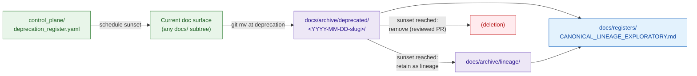

<!-- [KFM_META_BLOCK_V2]
doc_id: kfm://doc/<TODO-uuid>
title: Archived Deprecated Material
type: standard
version: v1
status: draft
owners: <TODO: Docs Steward + Release Authority>
created: 2026-05-25
updated: 2026-05-25
policy_label: public
related:
  - docs/archive/README.md
  - docs/archive/lineage/README.md
  - docs/archive/exploratory/README.md
  - docs/doctrine/lifecycle-law.md
  - docs/doctrine/corrections-first-class.md
  - docs/governance/deprecation-process.md
  - docs/governance/DECISION_LOG.md
  - docs/registers/CANONICAL_LINEAGE_EXPLORATORY.md
  - control_plane/deprecation_register.yaml
tags: [kfm, archive, deprecated, sunset, governance, removal]
notes:
  - "Directory purpose is derived from docs/archive/README.md §6 and §10; NEEDS VERIFICATION against the live repository."
  - "Hand-off mechanism between control_plane/deprecation_register.yaml and this folder is PROPOSED."
[/KFM_META_BLOCK_V2] -->

# 🗑 Archived Deprecated Material

> A short-stay holding area for documents **scheduled for removal** — visible while the migration runs, on a clock pegged to `control_plane/deprecation_register.yaml`.


**Status:** `draft` · **Owners:** `TODO — Docs Steward + Release Authority` <sub>NEEDS VERIFICATION</sub> · **Last updated:** `2026-05-25`

> [!CAUTION]
> `deprecated/` is **not** a synonym for "old." Old-but-current content stays in its canonical home. Material lands here only when a deprecation-register entry (or ADR) has **scheduled** its removal with a sunset date.

---

## 📑 Contents

1. [Scope](#1-scope)
2. [Repo fit](#2-repo-fit)
3. [Inputs — what belongs here](#3-inputs--what-belongs-here)
4. [Exclusions — what does not](#4-exclusions--what-does-not)
5. [Directory layout](#5-directory-layout)
6. [Lifecycle (REGISTER → DEPRECATED → SUNSET)](#6-lifecycle-register--deprecated--sunset)
7. [The sunset clock](#7-the-sunset-clock)
8. [Conventions](#8-conventions)
9. [Authoring workflow](#9-authoring-workflow)
10. [Validation](#10-validation)
11. [FAQ](#11-faq)
12. [Related docs](#12-related-docs)
13. [Last reviewed](#13-last-reviewed)

---

## 1. Scope

`docs/archive/deprecated/` is the canonical short-stay holding area for **documentation surfaces slated for removal**. Each file here is on a clock — a `sunset_date` recorded in `control_plane/deprecation_register.yaml` (or a doctrine-level retirement ADR) pegs when the file is reevaluated for either:

- **Move to `lineage/`** if the file retains continuing reference value after sunset, or
- **Removal in a reviewed PR** if it does not.

The folder exists so that scheduled removals are **visible and auditable** while migration paths complete — anchors keep resolving, downstream callers keep finding the surface, and the migration is not a silent drop.

> [!NOTE]
> Directory presence and exact contents are **PROPOSED** per `docs/archive/README.md` §7. The hand-off mechanism between `control_plane/deprecation_register.yaml` sunset events and placement here is **PROPOSED** per `docs/archive/README.md` §10.

[⬆ Back to top](#-archived-deprecated-material)

---

## 2. Repo fit

| Direction  | Surface                                              | Relationship                                                                            | Status                  |
|------------|------------------------------------------------------|-----------------------------------------------------------------------------------------|-------------------------|
| Upstream   | `control_plane/deprecation_register.yaml`            | Operational tracker — entries with a sunset date eventually land affected docs here.    | **PROPOSED**            |
| Upstream   | `docs/governance/deprecation-process.md`             | Defines `DeprecationNotice` and `SunsetRecord` shapes.                                  | **NEEDS VERIFICATION**  |
| Upstream   | `docs/adr/`                                          | Retirement ADRs that schedule removal link here.                                        | **NEEDS VERIFICATION**  |
| Sibling    | `docs/archive/lineage/`                              | Destination for post-sunset files that retain reference value.                          | **CONFIRMED**           |
| Sibling    | `docs/archive/exploratory/`                          | Holds **unpromoted** ideas, not scheduled removals.                                     | **CONFIRMED — distinct**|
| Downstream | `docs/registers/CANONICAL_LINEAGE_EXPLORATORY.md`    | Classifies entries here while they are in the deprecation window.                       | **PROPOSED**            |
| Downstream | `(deletion)`                                         | Reviewed PR removes the file after sunset if no continuing reference value.             | **PROPOSED**            |

> [!WARNING]
> This folder is **not** a parking lot for content that "feels old." If the file still informs a current decision, it is not deprecated — it is canon. Mark it current and review it, or open a deprecation register entry.

[⬆ Back to top](#-archived-deprecated-material)

---

## 3. Inputs — what belongs here

A file belongs in `deprecated/` when **all** of the following are true:

1. The subject is a **documentation surface** (doctrine doc, ADR, schema doc, API/route description, runbook, governance artifact, brand asset page, etc.).
2. A **scheduled removal** has been recorded in `control_plane/deprecation_register.yaml` (or a retirement ADR) with a `sunset_date`.
3. A **migration plan** exists for callers/readers (where applicable) — successor link, replacement instructions, or `no_successor_rationale`.
4. The file is **not** still informing a current decision in any current doc (drift check).

Typical contents:

- Pages tied to retired roots, retired schemas, retired policies, or retired tooling.
- Doc surfaces whose canonical home is being collapsed or relocated.
- Retired runbooks for sunset operational paths.

---

## 4. Exclusions — what does not

| Do not place here                              | Where it goes instead                                       | Why                                                  |
|------------------------------------------------|-------------------------------------------------------------|------------------------------------------------------|
| Predecessors of *current* canon                | `docs/archive/lineage/`                                     | Those are supersession trails, not scheduled removals. |
| Closed idea packets / withdrawn drafts         | `docs/archive/exploratory/`                                 | Those never reached canon.                           |
| Files without a `sunset_date`                  | Their canonical home, with a deprecation register entry first | A clock is required.                              |
| Schemas / contracts                            | `schemas/contracts/v1/...` with `superseded_by` header      | Schema lineage stays in the schema home.             |
| Policy files                                   | `policy/` with `superseded_by` link                         | Policy lineage stays in the policy home.             |
| Receipts, proofs, manifests, release artifacts | `data/receipts/`, `data/proofs/`, `release/`                | Trust artifacts never live in `docs/`.               |
| Generated reports                              | `docs/reports/`                                             | Reports are current outputs, not deprecated.         |

> [!IMPORTANT]
> A file with **no sunset_date** does **not** belong here. If the file is genuinely going away but no removal has been scheduled, open a deprecation register entry first; only then move the file.

[⬆ Back to top](#-archived-deprecated-material)

---

## 5. Directory layout

> [!WARNING]
> The tree below is **PROPOSED** per `docs/archive/README.md` §7. Path presence is `NEEDS VERIFICATION` until inspected on disk.

```text
docs/archive/deprecated/
├── README.md                          # this file
└── <sunset-dated subtrees>/           # one subtree per scheduled removal (PROPOSED)
    └── …                              # the deprecated files, with metadata
```

Subtree naming convention: `<YYYY-MM-DD>-<short-slug>/` where `YYYY-MM-DD` is the `sunset_date` and `<short-slug>` is a stable kebab-case identifier (e.g., `2026-09-30-retired-runbook-roots/`). This keeps sunsets sortable on disk.

---

## 6. Lifecycle (REGISTER → DEPRECATED → SUNSET)



> [!NOTE]
> The dashed transitions in `docs/archive/README.md` §10 correspond to the two post-sunset branches above (`→ lineage/` vs `→ deletion`). The precise gating mechanism is **NEEDS VERIFICATION** — a PROPOSED ADR is expected to formalize it.

---

## 7. The sunset clock

Every file in `deprecated/` carries a `sunset_date`. The clock has three observable states:

| State                | Condition                                  | Action                                                          |
|----------------------|--------------------------------------------|-----------------------------------------------------------------|
| **Active sunset**    | `today < sunset_date`                      | File remains here; migration callers can still find it.         |
| **At sunset**        | `today == sunset_date`                     | Docs steward + subsystem owner decide: lineage or deletion.     |
| **Past sunset**      | `today > sunset_date` and file still here  | **Drift event.** Open a drift register entry; resolve in next PR.|

> [!CAUTION]
> A file lingering past its sunset is a governance failure, not a free extension. Either reaffirm the sunset (extend the date with a reviewed PR) or execute the lineage/deletion transition.

[⬆ Back to top](#-archived-deprecated-material)

---

## 8. Conventions

Every file in `docs/archive/deprecated/` MUST carry a front-matter block with these fields:

```text
archived_on:      YYYY-MM-DD
archived_by:      <reviewer or team>
predecessor_of:   <relative path to successor, or "none — deprecated">
supersession:     retirement
adr_ref:          <ADR id, if structural>
register_ref:     <line/anchor in docs/registers/CANONICAL_LINEAGE_EXPLORATORY.md>
reason:           <one or two sentences>
sunset_date:      YYYY-MM-DD
deprecation_register_ref: <key/anchor in control_plane/deprecation_register.yaml>
migration_plan:   <one or two sentences, or link to migration doc>
```

Additional rules:

- **Subtrees are named by sunset date.** `<YYYY-MM-DD>-<short-slug>/` — see [§5](#5-directory-layout).
- **Filenames are not renamed** on archival.
- **Files are not edited in place**, except to add or correct the metadata block above, or to extend `sunset_date` (which is itself a reviewed change).
- **Every `deprecated/` file MUST have a matching entry** in `control_plane/deprecation_register.yaml` referenced by `deprecation_register_ref`.

---

## 9. Authoring workflow

1. A deprecation is scheduled by adding (or updating) an entry in `control_plane/deprecation_register.yaml` with a `sunset_date` and `migration_plan`.
2. The affected file(s) are moved here with `git mv` into a `<YYYY-MM-DD>-<short-slug>/` subtree.
3. The front-matter block (per [§8](#8-conventions)) is added in the same PR.
4. An entry is added to `docs/registers/CANONICAL_LINEAGE_EXPLORATORY.md` classifying the file as `deprecated`.
5. Reviewers: docs steward + subsystem owner whose surface is being retired.
6. At sunset: a follow-up PR either moves the file to `lineage/` (retain) or removes it (delete) — both require docs steward review.

[⬆ Back to top](#-archived-deprecated-material)

---

## 10. Validation

| Check                                                                                  | Where it runs                                  | Failure mode                                                |
|----------------------------------------------------------------------------------------|------------------------------------------------|-------------------------------------------------------------|
| Every file under `deprecated/` has a `sunset_date` and a `deprecation_register_ref`.   | `tools/validators/docs/archive_metadata/` *(PROPOSED)* | PR blocked; reviewer must add metadata.              |
| Every `deprecation_register_ref` resolves to an existing entry in the YAML register.   | same validator                                  | PR blocked.                                                 |
| No file with `today > sunset_date` lingers in `deprecated/`.                           | scheduled drift scan *(PROPOSED)*               | Drift register entry opened.                                |
| No current doc cites a `deprecated/` file as the authority for a current decision.     | docs link-check workflow *(PROPOSED)*           | Drift register entry opened.                                |

> [!NOTE]
> All validator paths above are **PROPOSED**. Per Directory Rules §7.5, validator homes live under `tools/validators/<area>/`; specific names and exit codes are `NEEDS VERIFICATION` until a validator PR lands.

---

## 11. FAQ

<details>
<summary><strong>What is the difference between <code>deprecated/</code> and <code>lineage/</code>?</strong></summary>

`deprecated/` is a **short-stay** holding area for files **scheduled for removal**. `lineage/` is the **long-term home** for **predecessors of current canon**. A file may transit `deprecated/` → `lineage/` at sunset if it retains continuing reference value; or it may exit via deletion. The two are distinct stages of a single lifecycle.

</details>

<details>
<summary><strong>What is the difference between <code>deprecated/</code> and the deprecation register?</strong></summary>

`control_plane/deprecation_register.yaml` is the **operational tracker** — machine-readable sunset dates, migration plans, owners. `deprecated/` is **where the affected docs physically sit** during the deprecation window. The register schedules; this folder holds.

</details>

<details>
<summary><strong>A file's sunset arrived. Do I delete it or move it to <code>lineage/</code>?</strong></summary>

Ask: does the file have continuing reference value? If a current doc cites it as historical context, or a downstream caller still needs to discover the supersession trail, move to `lineage/`. If no caller needs it and it adds noise, delete it in a reviewed PR. When in doubt, prefer `lineage/` — retention is cheap; lost lineage is not.

</details>

<details>
<summary><strong>Can I extend a sunset date?</strong></summary>

Yes — but it is a reviewed change. Update the `sunset_date` field in both this folder's front matter and `control_plane/deprecation_register.yaml` in the same PR. Reviewers: docs steward + subsystem owner.

</details>

---

## 12. Related docs

- [`../README.md`](../README.md) — parent archive README and supersession rule
- [`../lineage/README.md`](../lineage/README.md) — long-term home for predecessors of canon
- [`../exploratory/README.md`](../exploratory/README.md) — unpromoted-ideas bucket
- [`../../doctrine/lifecycle-law.md`](../../doctrine/lifecycle-law.md) — governs the deprecation transition
- [`../../doctrine/corrections-first-class.md`](../../doctrine/corrections-first-class.md) — corrections produce supersession trails
- [`../../governance/deprecation-process.md`](../../governance/deprecation-process.md) — `DeprecationNotice` and `SunsetRecord` shapes
- [`../../governance/DECISION_LOG.md`](../../governance/DECISION_LOG.md) — indexes scheduling decisions
- [`../../registers/CANONICAL_LINEAGE_EXPLORATORY.md`](../../registers/CANONICAL_LINEAGE_EXPLORATORY.md) — classification register
- [`../../../control_plane/deprecation_register.yaml`](../../../control_plane/deprecation_register.yaml) — operational tracker

---

## 13. Last reviewed

| Field          | Value        |
|----------------|--------------|
| Last reviewed  | 2026-05-25   |
| Next review    | TODO         |
| Reviewer       | TODO — Docs Steward |

[⬆ Back to top](#-archived-deprecated-material)
