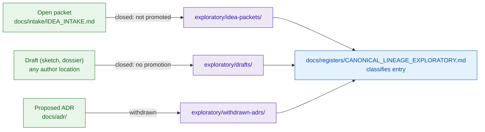

<!-- [KFM_META_BLOCK_V2]
doc_id: kfm://doc/<TODO-uuid>
title: Archived Exploratory Material
type: standard
version: v1
status: draft
owners: <TODO: Docs Steward + Intake Owner>
created: 2026-05-25
updated: 2026-05-25
policy_label: public
related:
  - docs/archive/README.md
  - docs/archive/lineage/README.md
  - docs/archive/deprecated/README.md
  - docs/doctrine/lifecycle-law.md
  - docs/doctrine/authority-ladder.md
  - docs/doctrine/truth-posture.md
  - docs/intake/IDEA_INTAKE.md
  - docs/intake/NEW_IDEAS_INDEX.md
  - docs/registers/CANONICAL_LINEAGE_EXPLORATORY.md
tags: [kfm, archive, exploratory, intake, drafts, withdrawn-adrs, governance]
notes:
  - "Directory purpose is derived from docs/archive/README.md §6 and §8; NEEDS VERIFICATION against the live repository."
  - "All paths below the directory tree are PROPOSED until inspected on disk."
[/KFM_META_BLOCK_V2] -->

# 🧪 Archived Exploratory Material

> The graveyard of **unpromoted ideas** — closed intake packets, never-promoted drafts, and withdrawn proposed-ADRs that did not pass KFM's promotion gates and are therefore not canon.


**Status:** `draft` · **Owners:** `TODO — Docs Steward + Intake Owner` <sub>NEEDS VERIFICATION</sub> · **Last updated:** `2026-05-25`

> [!IMPORTANT]
> Presence of an idea here is **not** evidence that the idea is wrong — only that it did not pass KFM's promotion gates and is therefore not current canon. Re-promotion requires a **new** intake entry, not direct edits here.

---

## 📑 Contents

1. [Scope](#1-scope)
2. [Repo fit](#2-repo-fit)
3. [Inputs — what belongs here](#3-inputs--what-belongs-here)
4. [Exclusions — what does not](#4-exclusions--what-does-not)
5. [Directory layout](#5-directory-layout)
6. [Lifecycle (INTAKE → EXPLORATORY)](#6-lifecycle-intake--exploratory)
7. [Immutability invariant](#7-immutability-invariant)
8. [Subfolders](#8-subfolders)
9. [Conventions](#9-conventions)
10. [Authoring workflow](#10-authoring-workflow)
11. [FAQ](#11-faq)
12. [Related docs](#12-related-docs)
13. [Last reviewed](#13-last-reviewed)

---

## 1. Scope

`docs/archive/exploratory/` is the canonical home for **closed exploratory material** in the KFM documentation tree. It exists so that ideas that never reached canon remain inspectable as lineage — the project can answer "did we ever consider X?" without exhuming git history.

Three categories of artifact land here:

1. **Closed idea packets** — entries from `docs/intake/IDEA_INTAKE.md` (and `docs/intake/NEW_IDEAS_INDEX.md`) that were closed without promotion.
2. **Never-promoted drafts** — architecture sketches, speculative dossiers, design experiments authored outside the intake pipeline but never adopted.
3. **Withdrawn proposed-ADRs** — ADR drafts that reached proposed state but were withdrawn before acceptance.

> [!NOTE]
> Directory presence and exact contents are **PROPOSED** per `docs/archive/README.md` §7. Treat every claim below as `NEEDS VERIFICATION` until inspected on disk.

[⬆ Back to top](#-archived-exploratory-material)

---

## 2. Repo fit

| Direction  | Surface                                                                  | Relationship                                                              | Status                 |
|------------|--------------------------------------------------------------------------|---------------------------------------------------------------------------|------------------------|
| Upstream   | `docs/intake/IDEA_INTAKE.md`                                             | Packets closed `not-promoted` land here.                                  | **PROPOSED**           |
| Upstream   | `docs/intake/NEW_IDEAS_INDEX.md`                                         | The index records the closure decision; the body moves here.              | **PROPOSED**           |
| Upstream   | `docs/adr/`                                                              | Proposed ADRs withdrawn before acceptance move to `withdrawn-adrs/`.      | **PROPOSED**           |
| Sibling    | `docs/archive/lineage/`                                                  | Holds **predecessors of canon**, not unpromoted ideas. No cross-moves.    | **CONFIRMED — distinct** |
| Sibling    | `docs/archive/deprecated/`                                               | Holds **sunset-dated** removals, not unpromoted ideas.                    | **CONFIRMED — distinct** |
| Downstream | `docs/registers/CANONICAL_LINEAGE_EXPLORATORY.md`                        | Classifies entries here as `exploratory` by relative path.                | **PROPOSED**           |

> [!WARNING]
> Do **not** treat this folder as a parking lot for "looks half-baked." Open packets stay in `docs/intake/`. Drafts of *current* canonical docs stay in their canonical home with PR review. Only **closed** states land here.

[⬆ Back to top](#-archived-exploratory-material)

---

## 3. Inputs — what belongs here

A file belongs in `exploratory/` when **all** of the following are true:

1. The subject is **not current canon** and was never promoted to canon.
2. The intake decision (or the author's withdrawal) is **closed** — the packet, draft, or proposed-ADR is in a terminal state.
3. A reason for non-promotion is recorded in front matter (`reason:` field) — rejected, deferred indefinitely, merged into a different concept, or author-withdrawn.
4. The file has been classified in `docs/registers/CANONICAL_LINEAGE_EXPLORATORY.md` as `exploratory`.

| Artifact                                | Destination subfolder      | Trigger                                       |
|-----------------------------------------|----------------------------|-----------------------------------------------|
| Closed `IDEA_INTAKE` packet             | `idea-packets/`            | Index records closure without merge.          |
| Never-promoted architecture sketch      | `drafts/`                  | Author or steward marks `closed-no-promote`.  |
| Speculative dossier (not adopted)       | `drafts/`                  | Same as above.                                |
| Withdrawn proposed-ADR                  | `withdrawn-adrs/`          | ADR transitions `proposed → withdrawn`.       |

---

## 4. Exclusions — what does not

| Do not place here                             | Where it goes instead                                          | Why                                                       |
|-----------------------------------------------|----------------------------------------------------------------|-----------------------------------------------------------|
| Open / in-progress idea packets               | `docs/intake/`                                                 | Open packets are part of the intake pipeline.             |
| Predecessors of current canon                 | `docs/archive/lineage/`                                        | Those are supersession trails, not unpromoted ideas.      |
| Docs scheduled for removal with sunset date   | `docs/archive/deprecated/`                                     | Deprecation is operational, not exploratory.              |
| Drafts of *current* canonical docs            | Author in place under PR review                                | Drafts of canon are canon-in-progress, not exploratory.   |
| Accepted ADRs                                 | `docs/adr/`                                                    | Only **withdrawn** proposed-ADRs land here.               |
| Generated reports                             | `docs/reports/`                                                | Reports are current outputs, not exploratory.             |

> [!CAUTION]
> A "good idea we might revisit" still belongs here once its packet is **closed**. Re-opening is done by a **new** intake entry that may reference the archived packet; do not edit the archived packet to "reopen" it.

[⬆ Back to top](#-archived-exploratory-material)

---

## 5. Directory layout

> [!WARNING]
> The tree below is **PROPOSED** per `docs/archive/README.md` §7. Path presence is `NEEDS VERIFICATION` until inspected on disk.

```text
docs/archive/exploratory/
├── README.md           # this file
├── idea-packets/       # closed IDEA_INTAKE packets (PROPOSED)
├── drafts/             # never-promoted drafts (PROPOSED)
└── withdrawn-adrs/     # proposed-but-withdrawn ADRs (PROPOSED)
```

---

## 6. Lifecycle (INTAKE → EXPLORATORY)



> [!NOTE]
> The trigger for `drafts/` placement is **NEEDS VERIFICATION** — the exact lifecycle gate for non-intake drafts is not formally specified. Until then, the docs steward determines closure.

---

## 7. Immutability invariant

Files in `exploratory/` are **append-only by closure** and **immutable in content**. The only edits permitted post-archival are:

- Adding or correcting the front-matter metadata block (per [§9](#9-conventions)).
- Adding a back-link in metadata when a **new** intake entry references the closed packet.

Content edits — rewriting the body, "improving" the idea, removing claims — are **drift events** and require revert. If an exploratory artifact's body needs change, it is no longer archived: a new intake entry must be opened.

---

## 8. Subfolders

### `idea-packets/`

Closed entries from `docs/intake/IDEA_INTAKE.md` (and the `NEW_IDEAS_INDEX`). Each packet retains its original filename; the index records the closure decision and points here.

### `drafts/`

Never-promoted drafts authored outside the intake pipeline — architecture sketches, speculative dossiers, design experiments. Closure is recorded in front matter; there is no central index, so the docs steward owns enumeration.

### `withdrawn-adrs/`

ADR drafts that reached `proposed` state but were withdrawn before acceptance. Files retain their ADR number (e.g., `ADR-0042-...withdrawn.md`); the canonical `docs/adr/` index links here from the withdrawn entry.

[⬆ Back to top](#-archived-exploratory-material)

---

## 9. Conventions

Every file in `docs/archive/exploratory/` MUST carry a front-matter block with these fields:

```text
archived_on:      YYYY-MM-DD
archived_by:      <reviewer or team>
predecessor_of:   "none — exploratory closure"
supersession:     retirement
adr_ref:          <ADR id, if structural>
register_ref:     <line/anchor in docs/registers/CANONICAL_LINEAGE_EXPLORATORY.md>
reason:           <one or two sentences — rejected | deferred | merged-into-other | withdrawn>
intake_ref:       <line/anchor in docs/intake/NEW_IDEAS_INDEX.md, if applicable>
```

Additional rules:

- **Filenames are not renamed** on archival, except to add a trailing `.withdrawn.md` for withdrawn ADRs to preserve the original ADR number.
- **No cross-archive moves.** An idea here does not migrate to `lineage/` if later revived — a **new** intake entry must produce a **new** canon doc; the original packet stays here as the original closure.
- **Two-level depth max** under any subfolder without an ADR.

---

## 10. Authoring workflow

1. The intake owner (or ADR author) records the closure decision in the appropriate source surface (`NEW_IDEAS_INDEX.md` or the ADR index).
2. The packet/draft/ADR is moved here with `git mv` — filename preserved.
3. The front-matter block (per [§9](#9-conventions)) is added in the same PR.
4. An entry is added to `docs/registers/CANONICAL_LINEAGE_EXPLORATORY.md` classifying the file as `exploratory`.
5. A docs steward reviews the closure metadata and merges.

[⬆ Back to top](#-archived-exploratory-material)

---

## 11. FAQ

<details>
<summary><strong>An idea I archived here turned out to be relevant. Can I "promote" it?</strong></summary>

No — not by editing the archived file. Open a **new** intake entry, reference the archived packet by path, and let the new entry go through the normal promotion gates. The archived packet stays in place as the original closure record.

</details>

<details>
<summary><strong>What is the difference between <code>exploratory/</code> and <code>lineage/</code>?</strong></summary>

`lineage/` holds **predecessors of current canon** — material that *was* canon and was superseded. `exploratory/` holds material that **never reached canon** — closed packets, withdrawn proposals, unpromoted drafts. They never cross-move.

</details>

<details>
<summary><strong>Where do <em>open</em> idea packets live?</strong></summary>

In `docs/intake/`. Only **closed** packets land here.

</details>

<details>
<summary><strong>Can I edit a withdrawn ADR to "fix a typo"?</strong></summary>

Only inside the metadata block (per [§9](#9-conventions)). Body edits are drift events. If the ADR's content needs to change, it is no longer withdrawn — author a new proposed ADR.

</details>

---

## 12. Related docs

- [`../README.md`](../README.md) — parent archive README and supersession rule
- [`../lineage/README.md`](../lineage/README.md) — predecessors of canon
- [`../deprecated/README.md`](../deprecated/README.md) — sunset-dated removals
- [`../../intake/IDEA_INTAKE.md`](../../intake/IDEA_INTAKE.md) — source of `idea-packets/`
- [`../../intake/NEW_IDEAS_INDEX.md`](../../intake/NEW_IDEAS_INDEX.md) — closure index
- [`../../registers/CANONICAL_LINEAGE_EXPLORATORY.md`](../../registers/CANONICAL_LINEAGE_EXPLORATORY.md) — classification register
- [`../../doctrine/lifecycle-law.md`](../../doctrine/lifecycle-law.md) — governs closure transitions
- [`../../doctrine/authority-ladder.md`](../../doctrine/authority-ladder.md) — why exploratory ≠ authoritative

---

## 13. Last reviewed

| Field          | Value        |
|----------------|--------------|
| Last reviewed  | 2026-05-25   |
| Next review    | TODO         |
| Reviewer       | TODO — Docs Steward |

[⬆ Back to top](#-archived-exploratory-material)
