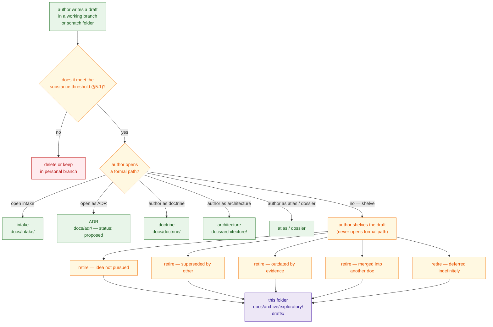
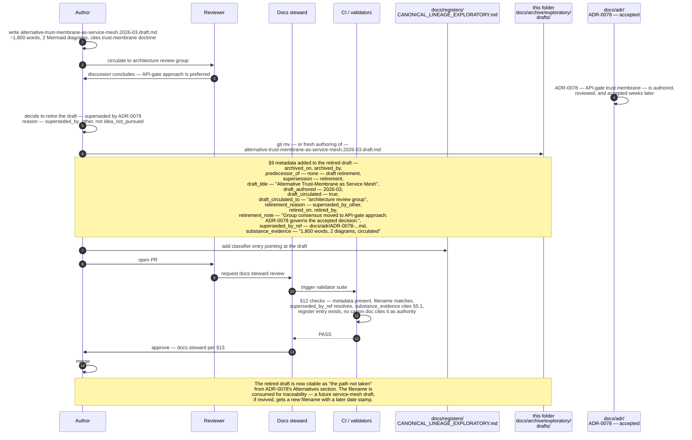

<!--
================================================================================
KFM Meta Block v2
--------------------------------------------------------------------------------
doc_id:             kfm://doc/docs-archive-exploratory-drafts-readme
title:              docs/archive/exploratory/drafts — Folder README
class:              folder README (README-like) · archive leaf bucket
status:             draft
truth_posture:      cite-or-abstain
governance_layer:   docs/ control plane · archive authority class · exploratory bucket
proposed_path:      docs/archive/exploratory/drafts/README.md   (PROPOSED)
directory_rule:     §6.1 (docs/archive/ listed in the docs/ tree),
                    §15  (folder README contract; archive authority class),
                    §17  (subfolder set changes are ADR-class).
parent_readme:      ../../README.md  (docs/archive/)
sibling_readmes:    ../README.md                  (docs/archive/exploratory/)
                    ../withdrawn-adrs/README.md   (CONFIRMED authored current session;
                                                   proposed-but-withdrawn ADRs)
                    ../idea-packets/README.md     (CONFIRMED authored current session;
                                                   closed intake packets)
cousin_readmes:     ../../lineage/README.md       (PROPOSED — predecessors of canon)
related_doctrine:   ../../../doctrine/directory-rules.md
                    ../../../doctrine/lifecycle-law.md
                    ../../../doctrine/truth-posture.md
related_promotion:  ../../../doctrine/             (a draft that becomes doctrine)
                    ../../../architecture/         (a draft that becomes architecture)
                    ../../../adr/                  (a draft that becomes an ADR)
                    ../../../atlases/              (a draft that becomes an atlas card)
                    ../../../domains/              (a draft that becomes a dossier)
                    ../../../intake/               (a draft that warrants intake)
related_registers:  ../../../registers/CANONICAL_LINEAGE_EXPLORATORY.md  (classifier)
                    ../../../registers/DRIFT_REGISTER.md
                    ../../../registers/VERIFICATION_BACKLOG.md
spec_hash:          NEEDS VERIFICATION (generated at release time).
owners:             <PLACEHOLDER — docs steward; do not invent>
created:            <YYYY-MM-DD — set on PR>
updated:            <YYYY-MM-DD — set on PR>
policy_label:       public
tags:               [kfm, docs, archive, exploratory, draft, speculative,
                    architecture-sketch, dossier, directory-rules, README]
notes:              Authored docs-only — no mounted repo, working-branch state,
                    register state, or CI run inspected. Every
                    implementation-layer claim (paths, filenames, validator
                    names, sibling-README presence) is PROPOSED until
                    mounted-repo verification. The "draft" closure semantics
                    described here are KFM-doctrine extensions of the parent
                    archive convention, not in the formal Directory Rules
                    §2.4 vocabulary; see §4 for the disambiguation.
================================================================================
-->

<a id="top"></a>

# docs/archive/exploratory/drafts

> **One-line purpose.** Never-promoted drafts — speculative architecture sketches, design memos, exploratory dossiers, and unfinished proposals — that were authored as standalone documents but **never opened as an ADR, never captured as an intake packet, and never accepted into doctrine**. They are retained here as lineage evidence of "what was explored on the side and consciously not advanced," distinct from withdrawn ADRs ([`../withdrawn-adrs/`](../withdrawn-adrs/)) and closed intake packets ([`../idea-packets/`](../idea-packets/)).

[](../../../doctrine/directory-rules.md)
[](../README.md)
[](#3-status)
[](../../../doctrine/directory-rules.md)
[](#9-conventions)
[](#5-what-belongs-here)
[](#20-last-reviewed)
[](../../../../LICENSE)

---

## 📑 Contents

- [1. Purpose](#1-purpose)
- [2. Authority level](#2-authority-level)
- [3. Status](#3-status)
- [4. Closure paths — where a draft fits among other archive buckets](#4-closure-paths--where-a-draft-fits-among-other-archive-buckets)
- [5. What belongs here](#5-what-belongs-here)
- [6. What does NOT belong here](#6-what-does-not-belong-here)
- [7. Draft → closure lifecycle](#7-draft--closure-lifecycle)
- [8. Directory tree](#8-directory-tree)
- [9. Conventions](#9-conventions)
- [10. Inputs](#10-inputs)
- [11. Outputs](#11-outputs)
- [12. Validation](#12-validation)
- [13. Review burden](#13-review-burden)
- [14. Anti-patterns](#14-anti-patterns)
- [15. Related folders](#15-related-folders)
- [16. ADRs governing this folder](#16-adrs-governing-this-folder)
- [17. FAQ](#17-faq)
- [18. Open questions](#18-open-questions)
- [19. Worked example — one draft retirement, end to end](#19-worked-example--one-draft-retirement-end-to-end)
- [20. Last reviewed](#20-last-reviewed)

---

## 1. Purpose

This folder holds **never-promoted drafts** — documents that were authored as standalone Markdown files (architecture sketches, speculative dossiers, design memos, "what if we did X" briefs, predecessor drafts of docs eventually authored under a different name) and that **never entered any formal KFM promotion path**. They are preserved here for four reasons:

1. **Anti-rediscovery.** A future contributor proposing the same exploration should be able to find that someone already walked the path, what they wrote down, and why it was set aside — so the project doesn't re-author its own shelved drafts.
2. **Lineage for register entries.** [`docs/registers/CANONICAL_LINEAGE_EXPLORATORY.md`](../../../registers/CANONICAL_LINEAGE_EXPLORATORY.md) *(PROPOSED)* classifies these files; the register points here for the actual content.
3. **Distinct closure semantics.** A draft retirement is **not** the same as an ADR withdrawal, an intake-packet closure, or a doctrine supersession. Each terminal state has its own home — see [§4](#4-closure-paths--where-a-draft-fits-among-other-archive-buckets).
4. **Reversibility insurance.** If a shelved draft's idea returns later, the **new** artifact (intake packet, ADR draft, doctrine doc, or fresh draft) can cite the original as the path not taken.

> [!IMPORTANT]
> A draft is **standalone speculative writing**. It was never opened with the ADR template (those go to [`../withdrawn-adrs/`](../withdrawn-adrs/)); never captured as an `IDEA_INTAKE` row (those go to [`../idea-packets/`](../idea-packets/)); never accepted into doctrine (when superseded, those go to [`../../lineage/`](../../lineage/)). This bucket is the home for the **fourth** case: writing that lived its whole life outside any formal review queue.

[↑ Back to top](#top)

---

## 2. Authority level

`archive` (per Directory Rules §15 enumeration of folder authority classes: `Canonical | implementation-bearing | generated | compatibility | archive | exploratory`), inside the **`exploratory/` bucket** of [`docs/archive/`](../../README.md).

This class means:

- Content here is **never the source of a current decision.** A current doc that needs to cite something here MUST do so as historical inference (e.g., "this approach was explored as a draft and not pursued; see file for context"), not as authority.
- Content here is **immutable except for metadata corrections.** No editing a retired draft to "polish" or "update" it. If the idea returns, it returns as a **new** draft (or, better, a new intake packet / ADR / doctrine doc), citing this one as background.
- The folder follows the **append-mostly** discipline of the parent archive: files arrive when drafts are formally retired; they do not leave (mirroring the parent archive's [§13 cross-archive-moves rule](../../README.md#13-conventions)).

---

## 3. Status

**PROPOSED.** This folder and its README are designed per Directory Rules §6.1 and the parent [`docs/archive/`](../../README.md) §6 layout, but their presence in the mounted repository has not been verified in this session. Treat every specific path inside as `PROPOSED` until inspection confirms it.

[↑ Back to top](#top)

---

## 4. Closure paths — where a draft fits among other archive buckets

> [!IMPORTANT]
> This is the doctrinally most important section of this README. The KFM exploratory bucket has three peer leaves (`drafts/`, `withdrawn-adrs/`, `idea-packets/`); the archive also has the cousin `lineage/` bucket. They look similar but capture different stages. Confusing them collapses the meaning of "what happened to this idea."

| Closure | Idea reached… | Authored as… | Lives in | This folder? |
|---|---|---|---|---|
| **Promoted to doctrine** | Accepted doctrine. | A doctrine doc at `docs/doctrine/...` | [`docs/doctrine/`](../../../doctrine/) | No. |
| **Promoted to architecture** | Accepted architecture page. | A doc at `docs/architecture/...` | [`docs/architecture/`](../../../architecture/) | No. |
| **Promoted to accepted ADR** | An ADR with `status: accepted`. | The ADR skeleton (per ai-build-operating-contract.md §28). | [`docs/adr/`](../../../adr/) | No. |
| **Promoted to atlas card / dossier** | An atlas card or domain dossier. | The 18-field idea-card structure. | [`docs/atlases/`](../../../atlases/) or [`docs/domains/`](../../../domains/) | No. |
| **Captured at intake, then closed** | An `IDEA_INTAKE` row with `disposition: closed_*`. | An intake packet (small or substantive). | [`../idea-packets/`](../idea-packets/) | No — different bucket. |
| **Drafted as ADR, then withdrawn** | An ADR with `status: proposed`, then pulled back. | The ADR skeleton. | [`../withdrawn-adrs/`](../withdrawn-adrs/) | No — different bucket. |
| **Drafted as standalone speculative document, then retired** | A working `.md` file in a branch or scratch location. | An architecture sketch, design memo, dossier, RFC, or "what if" brief. | **This folder.** | **Yes.** |
| **Was previously accepted, now superseded** | Accepted canon, then replaced. | An accepted doctrine doc / architecture page / ADR. | [`../../lineage/`](../../lineage/) | No — different bucket. |
| **Atlas §24.12 candidate (never authored as anything)** | The Atlas Open-ADR Backlog only. | Nothing — just a candidate question. | Atlas §24.12 / nowhere | No. |

### 4.1 The four "never reached" stages this bucket excludes

The header "never-promoted" can be confused with "never reached a particular stage." Be precise about which stage a draft did **not** reach:

| Stage | A draft here did NOT reach… |
|---|---|
| **Intake** | `IDEA_INTAKE.md` capture — if it had been intaked and then closed, it would belong in [`../idea-packets/`](../idea-packets/). |
| **ADR `proposed`** | Opened as an ADR — if it had been drafted with the ADR template and reached `status: proposed`, withdrawing it would route to [`../withdrawn-adrs/`](../withdrawn-adrs/). |
| **Acceptance / canon** | Accepted into any canonical home (doctrine, architecture, ADR, atlas, dossier) — if it had been accepted and then superseded, it would belong in [`../../lineage/`](../../lineage/). |
| **Active review** | Any formal review queue — drafts here lived in working branches, scratch files, design folders, or shared docs **outside** the formal review path. |

### 4.2 Why the distinction matters

- **Draft vs. intake packet.** A draft is *unstructured writing*; an intake packet is a *structured row in `NEW_IDEAS_INDEX.md`*. The same idea can produce both — a long-form draft might also be intaked as a one-line row — but they have different homes and different closure semantics. If both exist, the **draft body** lives here and the **intake row** is closed in the index with a link here.
- **Draft vs. withdrawn ADR.** An ADR is a *specific document genre* with required sections; a draft can be any shape. Filing an ADR-shaped artifact here would understate the formal work done; filing free-form speculative writing under `withdrawn-adrs/` would overstate it.
- **Draft vs. lineage.** Lineage is *predecessors of accepted canon*. Drafts never were canon. The two buckets do not interchange: an accepted doc later superseded becomes lineage; a draft retired without acceptance becomes a `drafts/` entry.
- **Draft vs. junk drawer.** Not every unfinished `.md` file in a branch is worth archiving. The threshold in [§5](#5-what-belongs-here) requires substance; trivial scratch files evaporate without entering the archive at all.

[↑ Back to top](#top)

---

## 5. What belongs here

A file belongs in `docs/archive/exploratory/drafts/` if **all** of the following are true:

1. **Standalone authoring.** The draft was authored as a standalone Markdown document, not as an `IDEA_INTAKE` row and not as an ADR with `status: proposed`.
2. **Never accepted.** The draft never reached any canonical home (`docs/doctrine/`, `docs/architecture/`, `docs/adr/` as `accepted`, `docs/atlases/`, `docs/domains/`).
3. **Formally retired.** The author (or the docs steward) has made an explicit decision to retire the draft — i.e., it will not be advanced and no further work is planned on this version.
4. **Substantive content.** The draft meets the substance threshold (see [§5.1](#51-substance-threshold)). Trivial scratch notes do **not** land here.
5. **The retirement reason is recordable.**

### 5.1 Substance threshold

> [!NOTE]
> This bucket has the **highest junk-drawer risk** of the three exploratory leaves, because any author can produce any number of `.md` files. The threshold below filters for drafts that have research value as historical record. The threshold itself is PROPOSED and warrants ADR resolution — see [§18](#18-open-questions).

A draft is "substantive" — and therefore archive-worthy — if **any** of these are true:

- The draft contains **more than approximately 500 words of original content** (not counting boilerplate or quoted material).
- The draft includes **at least one diagram** (Mermaid, ASCII tree, etc.).
- The draft **cites multiple sources** (corpus docs, external standards, prior drafts).
- The draft was **circulated to at least one other person** (reviewed informally, referenced in a discussion, linked from a meeting note).
- The draft **shaped a later artifact** (even if that artifact is not direct supersession — e.g., a draft that influenced thinking about an eventually-different ADR).

A draft that does **not** meet any of these criteria stays in the author's branch or working folder until it either grows into substance or is deleted without archive.

### 5.2 Example cases

| Example case | Belongs here? |
|---|---|
| Author writes a 2,000-word brief titled "Alternative Trust-Membrane Architectures" exploring whether the membrane could be a service mesh rather than API gates. The team later adopts an API-gate ADR; author retires the brief. | **Yes** — substance threshold met (long; includes diagrams; cites trust-membrane doctrine); retirement is explicit. |
| Author drafts a speculative dossier on "Vector Database for Cross-Domain Search" with three Mermaid diagrams and citations to STAC, DCAT, and several Atlas chapters. Research concludes a different approach suffices; the draft is shelved. | **Yes** — meets multiple substance criteria. |
| Author writes a one-paragraph file `cool-idea.md` saying "we should maybe consider X." Realizes it's not worth pursuing and deletes it. | **No** — below substance threshold; delete without archive. |
| Author drafts a doc, opens it as an ADR with `status: proposed`, then withdraws it. | **No** — that's a withdrawn ADR; goes to [`../withdrawn-adrs/`](../withdrawn-adrs/). |
| Author writes a 1,500-word brief, then captures it as an `IDEA_INTAKE` row that gets closed `not_promoted`. The intake row is closed with a link. | **Ambiguous case** — see [§18](#18-open-questions). Working default: the **substantive body** lives here as a draft, the **intake closure** lives in [`../idea-packets/`](../idea-packets/) with a `merged_into` reference pointing here. |
| Author's working notes file with 50 bullet points and no narrative. | **No** — below substance threshold (no narrative or diagrams; not circulated). |
| A predecessor draft of `docs/architecture/maplibre-3d.md` that was authored under a different name and never released. | **Yes** if substantive; **no** if it was just an intermediate save of the eventually-released doc (those live in git history). |

[↑ Back to top](#top)

---

## 6. What does NOT belong here

| Do not place here | Where it goes instead | Why |
|---|---|---|
| **Trivial scratch notes** (below the §5.1 substance threshold) | Delete; or keep in personal branch | The archive is not a junk drawer. |
| **Intermediate saves of an in-flight doc** | Git history of the doc itself | The doc's commit log is its own draft history. |
| **ADRs with `status: proposed` that were withdrawn** | [`../withdrawn-adrs/`](../withdrawn-adrs/) | Different bucket — ADR-stage closure. |
| **Closed intake packets** | [`../idea-packets/`](../idea-packets/) | Different bucket — intake-stage closure. |
| **Predecessor editions of accepted canon** (superseded by replacement) | [`../../lineage/`](../../lineage/) | Different bucket — supersession of accepted canon. |
| **Atlas §24.12 candidate ADRs that were never authored as anything** | Stay in Atlas backlog | A candidate question is not a draft. |
| **Drafts that were eventually accepted** (under any name) | The accepted home (`docs/doctrine/`, `docs/architecture/`, etc.) | If a draft became canon, the canon supersedes the draft; the draft does not separately archive here. |
| **Schema, policy, or release-manifest drafts** | Stay under `schemas/contracts/v1/...`, `policy/...`, or `release/...` with appropriate `draft` or `superseded_by` headers | Schema and policy lineage live at their canonical homes, not in `docs/archive/`. |
| **Personal working notes, journals, todo lists** | Author's personal storage; not the project repo at all | Not project content. |
| **Receipts, proofs, manifests, release decisions** | `data/receipts/`, `data/proofs/`, `data/manifests/`, `release/` | Trust content lives in its canonical homes; never in `docs/`. |

> [!WARNING]
> The two highest-risk drift patterns for this folder are: **(a) using it as a junk drawer** for every half-finished `.md` file an author has lying around, and **(b) double-archiving** — a draft that was also intaked or drafted-as-ADR landing in this bucket on top of its closure home in the sibling bucket. The substance threshold in [§5.1](#51-substance-threshold) addresses (a); the [§4 closure paths table](#4-closure-paths--where-a-draft-fits-among-other-archive-buckets) and the §17 FAQ entry on multi-stage artifacts address (b).

[↑ Back to top](#top)

---

## 7. Draft → closure lifecycle



**Legend.** Green = current canonical state or active promotion path · Amber = transition state · Purple = this archive bucket · Red = deletion (the correct fate for sub-threshold drafts).

[↑ Back to top](#top)

---

## 8. Directory tree

> [!WARNING]
> The tree below is **PROPOSED**. Path presence is `NEEDS VERIFICATION` until inspected against the mounted repo. Filenames in the leaf nodes are illustrative.

```text
docs/archive/exploratory/drafts/
├── README.md                                # this file
└── <retired-draft-files>                    # one file per retired draft
    # Naming convention (PROPOSED, see §9):
    #   <topic-kebab-slug>.<YYYY-MM>.draft.md
    # Examples (illustrative; not claims of mounted-repo state):
    #   alternative-trust-membrane-as-service-mesh.2026-03.draft.md
    #   vector-database-for-cross-domain-search.2026-04.draft.md
    #   speculative-streaming-stac-catalog.2025-11.draft.md
```

> [!NOTE]
> **Flat structure is intentional** — for now. Like the sibling [`../withdrawn-adrs/`](../withdrawn-adrs/) and [`../idea-packets/`](../idea-packets/) buckets, this leaf is flat to keep the navigation simple while volume stays low. **However**, drafts have a stronger case for topical subfolders (architecture drafts vs doctrine drafts vs dossier drafts have meaningfully different research-value characteristics) — see [§18](#18-open-questions) for the topical-vs-flat ADR question. Per Directory Rules §17, deepening the tree below this level is ADR-class — see [§16](#16-adrs-governing-this-folder).

[↑ Back to top](#top)

---

## 9. Conventions

Every file in this folder MUST carry a small front-matter block (HTML comment for Markdown drafts without YAML; YAML front-matter for drafts that already use it). The block extends the parent archive [§13 Conventions](../../README.md#13-conventions) with **draft-specific fields**:

```text
archived_on:           YYYY-MM-DD                # ISO-8601 date of archival
archived_by:           <reviewer or team>        # GitHub handle / "docs steward"
predecessor_of:        none — draft retirement   # always literal for this bucket
supersession:          retirement                # always literal for this bucket
draft_title:           <Title>                   # the draft's H1 title
draft_topic:           <one-line topic>          # short topical descriptor
draft_authored:        YYYY-MM                   # month-year first authored
draft_circulated:      true | false              # was it shared with anyone else?
draft_circulated_to:   <names or teams>          # required when draft_circulated = true
retirement_reason:     idea_not_pursued |        # decided the idea is not right
                       superseded_by_other |    # a different artifact took the path
                       outdated_by_evidence |   # underlying assumptions changed
                       merged_into |             # absorbed into another document
                       deferred_indefinitely     # held pending future evidence
retired_on:            YYYY-MM-DD                # ISO-8601 date of retirement
retired_by:            <GitHub handle / team>    # the author or steward retiring
retirement_note:       <one or two sentences>    # required, plain language
superseded_by_ref:     <path>                    # required when retirement_reason = superseded_by_other
merged_into_ref:       <path>                    # required when retirement_reason = merged_into
revisit_when:          <condition>               # required when retirement_reason = deferred_indefinitely
substance_evidence:    <one-line note>           # which §5.1 criterion qualified the draft
related_artifacts:     [paths or ids]            # optional cross-refs (ADRs, packets, drafts)
register_ref:          <anchor in CANONICAL_LINEAGE_EXPLORATORY.md>
reason:                <one or two sentences>    # parent-archive convention; can echo retirement_note
```

### 9.1 Filename convention (PROPOSED)

`<topic-kebab-slug>.<YYYY-MM>.draft.md`

- Unlike the sibling buckets, drafts do **not** carry pre-assigned ids (no ADR number, no `INTAKE-XXXX`). The **topic slug** is the discriminator.
- The `<YYYY-MM>` date stamp records when the draft was first authored (not when it was retired). This disambiguates similar topics authored at different times and gives readers a quick sense of vintage.
- The `.draft.md` suffix makes the closure semantics visible in directory listings and `git log` output, distinguishing these files from `withdrawn-adrs/` (`.withdrawn.md`) and `idea-packets/` (`.packet.md`).
- Slugs are lowercase, kebab-case, ASCII; aim for 3-8 words.

### 9.2 Cross-references to multi-stage artifacts

A draft may have been **both** authored as a standalone document **and** captured later as an intake packet (or shaped into an ADR draft that was withdrawn). In that case:

- The **draft body** lives in this folder with its own metadata block.
- The **intake closure** or **ADR withdrawal** lives in its appropriate sibling bucket with its own metadata block.
- Each side carries a `related_artifacts:` entry pointing at the other.
- The PR that retires the artifact updates both sides in one commit; this avoids the half-closed state where one side records the closure and the other does not.

### 9.3 Hard rules

- **Immutability.** Files here are **not edited** except to add or correct the metadata block above. Any content edit is itself a content change and requires a reviewed PR.
- **No filename reuse.** If a retired draft's topic is later revived, the **new** artifact gets a new filename (typically with a later `<YYYY-MM>` stamp, or a different topical slug). The retired predecessor is cited from the new artifact's "Related" / "Background" section.
- **No cross-archive migration.** A retired draft does not migrate to `lineage/` if its idea is later adopted; the *current* version is authored fresh at its canonical home (or as an intake packet), citing this file as background.
- **No nesting** below this leaf without an ADR per Directory Rules §17 — though §8 notes that topical subfolders are the most defensible nesting case among the three exploratory leaves; see [§18](#18-open-questions).

[↑ Back to top](#top)

---

## 10. Inputs

- **Manual authoring** — the docs steward (or the draft's author) moves the draft body from a working file into this folder with `git mv` (or fresh authoring from the working content), adds the §9 metadata, and updates the classifier register.
- **Cross-bucket coordination** — if the draft has a sibling artifact (intake packet or withdrawn ADR), the same PR updates both sides per [§9.2](#92-cross-references-to-multi-stage-artifacts).
- **Register cross-write** — a corresponding entry in [`docs/registers/CANONICAL_LINEAGE_EXPLORATORY.md`](../../../registers/CANONICAL_LINEAGE_EXPLORATORY.md) *(PROPOSED)* is opened in the same PR.

---

## 11. Outputs

- **Citable retired draft** — future drafts, intake packets, ADR drafts, or doctrine docs can cite the retired draft in "Related" / "Background" / "Alternatives considered" sections.
- **Anti-rediscovery signal** — when a reviewer recognizes "we explored this on the side before," the draft is retrievable.
- **Register evidence** — the classifier register and drift register may cite retired drafts to explain why a recurring question keeps being raised informally.
- **Audit trail** — together with the intake index, the canonical homes, the `withdrawn-adrs/` and `idea-packets/` sibling buckets, and `lineage/`, this folder closes the loop on every artifact's terminal state.

This folder does **not** emit:

- Authoritative decisions (those live at canonical homes after promotion).
- Machine-readable indexes (those live in `docs/registers/`).
- Released artifacts of any kind.

[↑ Back to top](#top)

---

## 12. Validation

| Check | Where it runs | Failure mode |
|---|---|---|
| Every file has `retirement_reason ∈ {idea_not_pursued, superseded_by_other, outdated_by_evidence, merged_into, deferred_indefinitely}`, `retired_on`, `retired_by`, and `retirement_note`. | `tools/validators/docs/archive_metadata/` *(PROPOSED — same validator as the parent archive)* | PR blocked. |
| Every file with `retirement_reason: superseded_by_other` has a resolvable `superseded_by_ref`. | same validator | PR blocked. |
| Every file with `retirement_reason: merged_into` has a resolvable `merged_into_ref`. | same validator | PR blocked. |
| Every file with `retirement_reason: deferred_indefinitely` has a `revisit_when:` condition. | same validator | PR blocked. |
| Every file has a `substance_evidence:` line citing the §5.1 criterion that qualified it for archive. | same validator | PR blocked. |
| Every file's filename matches `[a-z0-9-]+\.\d{4}-\d{2}\.draft\.md` (or the agreed slug pattern). | same validator | PR blocked. |
| Every file has a matching entry in `docs/registers/CANONICAL_LINEAGE_EXPLORATORY.md`. | register-cross-check workflow *(PROPOSED)* | Drift entry opened. |
| If a file has `related_artifacts:` pointing at a sibling bucket, the sibling bucket's file has a reciprocal `related_artifacts:` entry pointing back. | cross-bucket reciprocity check *(PROPOSED)* | Drift entry opened. |
| No current doc cites a file in this folder as the **authority** for a current decision. | docs link-check workflow *(PROPOSED)* | Drift entry opened. |
| This README exists and meets Directory Rules §15. | repo-wide README presence scan | Drift candidate. |

> [!NOTE]
> All validator paths above are **PROPOSED**. The validator-home convention is `tools/validators/<area>/` per Directory Rules §7.5; specific names and exit codes are NEEDS VERIFICATION until a validator PR lands.

[↑ Back to top](#top)

---

## 13. Review burden

- **Routine draft retirement** (`git mv` + §9 metadata): docs steward review.
- **Retirement with `merged_into` reason** (cross-reference to surviving document): docs steward + the author of the surviving document, to confirm the merge framing.
- **Retirement with `superseded_by_other` reason** (cross-reference to a canonical artifact that took a different path): docs steward + the author or owner of the superseding artifact, to confirm the supersession framing.
- **Retirement with `deferred_indefinitely` reason** (requires `revisit_when:`): docs steward + at least one subsystem owner relevant to the deferred topic.
- **Retirement of a draft with a sibling artifact** (intake packet or withdrawn ADR exists): docs steward + reviewers of the sibling artifact, to ensure both sides record reciprocal `related_artifacts:` entries.
- **Removing a file from this folder** (i.e., permanent deletion): docs steward + at least one subsystem owner + linked ADR — same rule as the parent archive.
- **Changing this README's structure or rules**: docs steward; if the change alters [§4](#4-closure-paths--where-a-draft-fits-among-other-archive-buckets), [§5](#5-what-belongs-here), [§5.1](#51-substance-threshold), [§9](#9-conventions), or the relationship to sibling buckets and registers, an ADR per Directory Rules §2.4 / §17 is required.

CODEOWNERS reference: *TODO — link once `CODEOWNERS` lines for `docs/archive/exploratory/drafts/**` are added.*

---

## 14. Anti-patterns

| Anti-pattern | Symptom | Fix |
|---|---|---|
| **Junk-drawer drift** | Every sub-threshold `.md` file an author has gets dumped here. | Apply the §5.1 substance threshold strictly. Delete sub-threshold files; do not archive them. |
| **Draft-vs-ADR confusion** | An artifact that was opened as an ADR with `status: proposed` ends up here. | If the artifact used the ADR template and reached `status: proposed`, it belongs in [`../withdrawn-adrs/`](../withdrawn-adrs/). |
| **Draft-vs-intake confusion** | An artifact that was captured as an `IDEA_INTAKE` row ends up here without a corresponding entry in [`../idea-packets/`](../idea-packets/). | If both forms exist, retire both with reciprocal `related_artifacts:` cross-refs per [§9.2](#92-cross-references-to-multi-stage-artifacts). If only the intake row exists, the closure lives only at the sibling bucket. |
| **Double-archiving** | The same artifact appears here **and** in `lineage/` (or another sibling bucket) with no cross-reference. | A draft never belongs in lineage (that's for accepted-then-superseded canon). For drafts with sibling artifacts (intake, ADR), enforce reciprocal cross-refs. |
| **Edit-in-place archive** | Someone updates a retired draft's body a month later to "reflect what we eventually decided." | Revert. Files here are immutable except for metadata. If the idea is alive, author the current version at its canonical home, citing the retired draft. |
| **Filename reuse** | A new draft on the same topic reuses the retired draft's filename. | Pick a new slug or a later `<YYYY-MM>` date stamp. The retired filename is consumed for traceability. |
| **Retired draft cited as authority** | A current doc cites `docs/archive/exploratory/drafts/...` as the source of a current decision. | The cited draft is not authority. Cite the artifact that took the formal path, or surface the gap. |
| **`superseded_by_other` without target** | Retirement reason says "superseded" but `superseded_by_ref` is missing. | CI fails closed; supply the target path. |
| **`merged_into` without target** | Retirement says "merged" but `merged_into_ref` is missing. | CI fails closed; supply the target path. |
| **`deferred_indefinitely` without condition** | Retirement says "deferred" but `revisit_when:` is missing. | CI fails closed; deferral without a revisit signal is hidden rejection. |
| **Drafts of canonical drafts** | An intermediate save of an in-flight `docs/architecture/foo.md` gets filed here. | The doc's commit log is its own draft history. Only retire **standalone** drafts that never became canon. |

[↑ Back to top](#top)

---

## 15. Related folders

| Folder | Relationship |
|---|---|
| [`../../README.md`](../../README.md) | **Parent archive README** — governs immutability, supersession rule, metadata conventions inherited by this folder. |
| [`../README.md`](../README.md) *(PROPOSED)* | **Bucket README** for `exploratory/`. |
| [`../withdrawn-adrs/`](../withdrawn-adrs/) | Sibling exploratory bucket — proposed-but-withdrawn ADRs. *(CONFIRMED authored current session.)* |
| [`../idea-packets/`](../idea-packets/) | Sibling exploratory bucket — closed intake packets. *(CONFIRMED authored current session.)* |
| [`../../lineage/`](../../lineage/) | Cousin bucket under archive — predecessors of *accepted* canon. Drafts never become lineage. |
| [`../../../doctrine/`](../../../doctrine/) | Promotion target — drafts that become accepted doctrine leave the working space and land at `docs/doctrine/`, not here. |
| [`../../../architecture/`](../../../architecture/) | Promotion target — accepted architecture pages. |
| [`../../../adr/`](../../../adr/) | Promotion target — accepted ADRs (if a draft is shaped into an ADR and accepted). |
| [`../../../atlases/`](../../../atlases/) *(PROPOSED)* | Promotion target — drafts that become atlas cards or dossier entries. |
| [`../../../domains/`](../../../domains/) | Promotion target — drafts that become domain dossiers. |
| [`../../../intake/`](../../../intake/) | A draft may *also* be captured as an intake packet; see [§9.2](#92-cross-references-to-multi-stage-artifacts). |
| [`../../../registers/CANONICAL_LINEAGE_EXPLORATORY.md`](../../../registers/CANONICAL_LINEAGE_EXPLORATORY.md) *(PROPOSED)* | Classifier register. |
| [`../../../registers/DRIFT_REGISTER.md`](../../../registers/DRIFT_REGISTER.md) *(PROPOSED)* | May cite retired drafts to explain a recurring informal question. |
| [`../../../doctrine/directory-rules.md`](../../../doctrine/directory-rules.md) | §6.1 (docs/ tree), §15 (README contract), §17 (subfolder-set changes are ADR-class). |

[↑ Back to top](#top)

---

## 16. ADRs governing this folder

| ADR | Effect on this folder |
|---|---|
| **PROPOSED ADR** — "Draft substance threshold" | Resolves [§5.1](#51-substance-threshold) — the highest-priority open question for this bucket; locks the criteria that qualify a draft for archive vs. deletion. |
| **PROPOSED ADR** — "Retirement-reason enum for archive metadata" | Locks the `retirement_reason` vocabulary (`idea_not_pursued` · `superseded_by_other` · `outdated_by_evidence` · `merged_into` · `deferred_indefinitely`) and coordinates with the closure enums in the sibling buckets. |
| **PROPOSED ADR** — "Topical subfolders under `drafts/`" | Resolves [§18](#18-open-questions) on flat-vs-topical structure. Of the three exploratory leaves, drafts have the strongest case for topical organization (`drafts/architecture/`, `drafts/doctrine/`, `drafts/dossier/`, etc.). |
| **PROPOSED ADR** — "Cross-bucket reciprocity for multi-stage artifacts" | Formalizes [§9.2](#92-cross-references-to-multi-stage-artifacts) — when a draft has a sibling intake packet or withdrawn ADR, both sides must carry reciprocal `related_artifacts:` entries. |
| Directory Rules §6.1 | Lists `docs/archive/` (and by extension this leaf) in the canonical `docs/` tree. |
| Directory Rules §15 | Mandates this README's required-section contract. |
| Directory Rules §17 | Adding, removing, or renaming subfolders here is ADR-class. |

---

## 17. FAQ

<details>
<summary><strong>How is a "draft" different from an "intake packet"?</strong></summary>

An intake packet is a structured row in [`docs/intake/NEW_IDEAS_INDEX.md`](../../../intake/NEW_IDEAS_INDEX.md), with a captured `IDEA_INTAKE` body. A draft is a standalone Markdown document authored independently of the intake pipeline. The same idea can produce both — see [§9.2](#92-cross-references-to-multi-stage-artifacts) — but they have different homes and different closure semantics. When in doubt: did the artifact's body ever get appended to `IDEA_INTAKE.md` or referenced by `NEW_IDEAS_INDEX.md`? If yes, the closure lives at [`../idea-packets/`](../idea-packets/). If no, and it meets the substance threshold, it's a draft.

</details>

<details>
<summary><strong>How is a "draft" different from a "withdrawn ADR"?</strong></summary>

A withdrawn ADR was authored with the ADR template (Status / Context / Decision / Evidence basis / etc., per ai-build-operating-contract.md §28) and reached `status: proposed`. A draft can be any document shape — a brief, a dossier, a sketch — and never opened a formal ADR review. If the artifact's H1 was "ADR-XXXX — Title" and its Status line read "Proposed," it belongs in [`../withdrawn-adrs/`](../withdrawn-adrs/), not here.

</details>

<details>
<summary><strong>My draft is short — 300 words. Does it belong here?</strong></summary>

Probably not by word count alone, but check the other §5.1 criteria. If the draft includes a diagram, cites multiple sources, was circulated, or visibly shaped a later artifact, it can still qualify. If none of those apply and it's 300 words of speculation, the right answer is to delete it and (optionally) keep it in a personal branch.

</details>

<details>
<summary><strong>The draft sat in my working branch for months and I just realized it's stale. Do I retire it here or delete it?</strong></summary>

If the draft is below the §5.1 substance threshold, delete it. If it meets the threshold, retire it here with `retirement_reason: outdated_by_evidence` (or another applicable reason) and include in the `retirement_note:` what evidence shifted to make the draft no longer relevant. Future readers benefit from knowing both that the path was explored and why it was abandoned.

</details>

<details>
<summary><strong>The draft was eventually authored as a doc under a different name. Where does it go?</strong></summary>

If the new doc is accepted into canon, the new doc supersedes the draft in spirit but not in supersession terms — they have different file identities, so this is not a §5 "supersession by replacement" event. The right closure for the draft is `retirement_reason: superseded_by_other` with `superseded_by_ref:` pointing at the accepted doc. The accepted doc does **not** move; it stays at its canonical home. The draft lands here.

</details>

<details>
<summary><strong>The draft was eventually intaked as an `IDEA_INTAKE` row and the row was then closed. Where does it go?</strong></summary>

Both. The draft body lives here as a draft; the intake row lives at [`../idea-packets/`](../idea-packets/) as a closed packet. Both files carry reciprocal `related_artifacts:` entries per [§9.2](#92-cross-references-to-multi-stage-artifacts). The PR that does the retirement updates both sides in one commit.

</details>

<details>
<summary><strong>Can a retired draft be revived later?</strong></summary>

Yes — but as a **new** artifact, never by editing this one. The revival can take any formal path (new draft, new intake packet, new ADR, direct authoring at canon) and cites this folder in its "Related" or "Background" section. The retired predecessor remains immutable.

</details>

<details>
<summary><strong>What about retired drafts of *this* README (or other folder READMEs)?</strong></summary>

READMEs are doctrine-class folder contracts. A predecessor edition of an accepted folder README, when superseded, lands in [`../../lineage/`](../../lineage/), not here. A *never-promoted* draft README that never became canonical (e.g., an early sketch of `docs/archive/README.md` that was scrapped and started over) could in principle land here — though in practice such drafts usually evaporate without archive.

</details>

[↑ Back to top](#top)

---

## 18. Open questions

These are explicitly **not resolved** by this README and should be tracked in [`docs/registers/VERIFICATION_BACKLOG.md`](../../../registers/VERIFICATION_BACKLOG.md) *(PROPOSED)*:

- **NEEDS VERIFICATION:** Does `docs/archive/exploratory/drafts/` exist in the current mounted repo, and at what entrenchment level?
- **OPEN — substance threshold (highest priority).** The §5.1 threshold (>500 words, has diagram, cites multiple sources, circulated, or shaped a later artifact) is the most important calibration knob for this bucket. Three candidate rules:
  1. **Strict** — require ≥2 of the criteria, or strict word-count minimum (≥1,000 words).
  2. **Permissive (current text)** — any one criterion qualifies.
  3. **Steward-discretion** — let the docs steward judge per case; threshold is advisory not binding.

  Permissive is the working default; strictness depends on how quickly the bucket fills in practice. Recommend an ADR after first 10-20 entries to recalibrate.
- **OPEN — flat vs. topical structure.** Should `drafts/` use topical subfolders (`drafts/architecture/`, `drafts/doctrine/`, `drafts/dossier/`, `drafts/governance/`, etc.) once volume justifies it? Drafts have the strongest case among the three exploratory leaves for topical organization because the content is shapeless and topical grouping aids retrieval. Flat is the current default; ADR would lock the threshold for topical migration.
- **OPEN — multi-stage artifact handling.** When the same idea exists as a draft body **and** an intake packet **and** a withdrawn ADR, do we want all three files to coexist with reciprocal cross-refs, or should the "canonical closure record" live at exactly one bucket with stub references from the others? §9.2 documents the three-file-with-cross-refs approach as the working default; ADR could simplify.
- **OPEN — retirement-reason enum coordination.** This README proposes `retirement_reason ∈ {idea_not_pursued, superseded_by_other, outdated_by_evidence, merged_into, deferred_indefinitely}`. The sibling [`../idea-packets/`](../idea-packets/) uses `closure_disposition`; the sibling [`../withdrawn-adrs/`](../withdrawn-adrs/) uses `closure_kind`. Three different enum names for three buckets is an unnecessary cognitive load; an ADR should unify the vocabulary.
- **OPEN — date format in filenames.** §9.1 proposes `<YYYY-MM>` (year-month). Some authors may want `<YYYY-MM-DD>` (full date) for precision; others may want no date at all. Consistency by ADR.
- **OPEN — `substance_evidence:` field rigor.** §9 requires a one-line note citing which §5.1 criterion qualified the draft. Is this CI-validatable (e.g., must match one of the criteria names), or is it free-form documentation for human reviewers?
- **OPEN — relationship to `docs/registers/CANONICAL_LINEAGE_EXPLORATORY.md`.** Every file here should appear in the register; the register's schema is itself PROPOSED. The two should be designed together.

[↑ Back to top](#top)

---

## 19. Worked example — one draft retirement, end to end

> **Illustrative only.** Dates, titles, and authors are placeholders. The example shows the **shape** of a correctly-executed retirement, not a real event in any mounted repository.

**Scenario.** An author writes a speculative architecture brief, `alternative-trust-membrane-as-service-mesh.2026-03.draft.md`, exploring whether the KFM trust membrane could be implemented as a service mesh (mTLS + sidecars + service-mesh policy) instead of as a set of API gates. The brief is ~1,800 words, includes two Mermaid diagrams, cites the trust-membrane doctrine, and is circulated to the architecture review group. After discussion, the group decides to proceed with the API-gate approach (which becomes an accepted ADR several weeks later). The author retires the brief.



**Counter-example (what NOT to do).**

- ❌ Delete the draft from the working branch with no archive trace. *(Sub-threshold drafts can be deleted; this one is well above the threshold and the loss of evidence is a real cost.)*
- ❌ File it under `retirement_reason: idea_not_pursued`. *(Misclassification — the idea was pursued, then a different approach won; the correct reason is `superseded_by_other` with a pointer to ADR-0078.)*
- ❌ Move the file but omit `superseded_by_ref`. *(CI fails closed; supersession without a target is hidden rejection.)*
- ❌ Edit the draft's body a month later to "reflect what ADR-0078 actually does." *(Edit-in-place archive — anti-pattern [§14](#14-anti-patterns); the draft captures the explored alternative, not the accepted decision.)*
- ❌ File it under `lineage/architecture/` because "it was sort of architecture." *(Wrong bucket — lineage is for predecessors of accepted canon. The draft was never accepted; it belongs in `drafts/`.)*
- ❌ Reuse the filename for a future service-mesh exploration. *(Filename reuse — anti-pattern [§14](#14-anti-patterns).)*

[↑ Back to top](#top)

---

## 20. Last reviewed

| Item | Value |
|---|---|
| **Last reviewed** | TODO — set on first review pass |
| **Reviewer** | TODO |
| **Next review due** | TODO (default: 6 months after last review per Directory Rules §15) |

---

### Related docs

- [`../../README.md`](../../README.md) — parent archive README (governs immutability and supersession discipline).
- [`../README.md`](../README.md) *(PROPOSED)* — `exploratory/` bucket README.
- [`../withdrawn-adrs/README.md`](../withdrawn-adrs/README.md) — sibling bucket; ADR-stage withdrawals. *(CONFIRMED authored current session.)*
- [`../idea-packets/README.md`](../idea-packets/README.md) — sibling bucket; closed intake packets. *(CONFIRMED authored current session.)*
- [`../../lineage/`](../../lineage/) — cousin bucket; predecessors of accepted canon. Drafts never become lineage.
- [`../../../doctrine/directory-rules.md`](../../../doctrine/directory-rules.md) — §6.1 (docs/ tree), §15 (README contract), §17 (subfolder-set changes are ADR-class).
- [`../../../doctrine/lifecycle-law.md`](../../../doctrine/lifecycle-law.md) *(PROPOSED)* — for contrast with the doctrine lifecycle this folder supports.
- [`../../../doctrine/truth-posture.md`](../../../doctrine/truth-posture.md) *(PROPOSED)* — cite-or-abstain posture; retired drafts are cited only as historical paths.
- [`../../../registers/CANONICAL_LINEAGE_EXPLORATORY.md`](../../../registers/CANONICAL_LINEAGE_EXPLORATORY.md) *(PROPOSED)* — classifier register.
- [`../../../registers/DRIFT_REGISTER.md`](../../../registers/DRIFT_REGISTER.md) *(PROPOSED)* — drift entries citing retired drafts.

---

**Last updated:** `<YYYY-MM-DD — set on PR>`
**Doc version:** `v1 (draft)`
**Spec hash:** *NEEDS VERIFICATION (generated at release time).*
**Authority class:** `archive` (within `exploratory/` bucket)

[↑ Back to top](#top)
