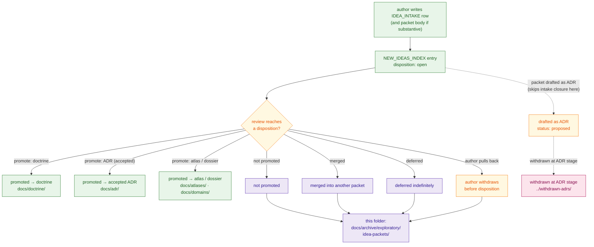

<!--
================================================================================
KFM Meta Block v2
--------------------------------------------------------------------------------
doc_id:             kfm://doc/docs-archive-exploratory-idea-packets-readme
title:              docs/archive/exploratory/idea-packets — Folder README
class:              folder README (README-like) · archive leaf bucket
status:             draft
truth_posture:      cite-or-abstain
governance_layer:   docs/ control plane · archive authority class · exploratory bucket
proposed_path:      docs/archive/exploratory/idea-packets/README.md   (PROPOSED)
directory_rule:     §6.1 (docs/archive/ listed in the docs/ tree),
                    §15  (folder README contract; archive authority class),
                    §17  (subfolder set changes are ADR-class).
parent_readme:      ../../README.md  (docs/archive/)
sibling_readmes:    ../README.md              (docs/archive/exploratory/)
                    ../withdrawn-adrs/README.md  (sibling under exploratory/;
                                                  CONFIRMED authored current session)
                    ../drafts/README.md          (PROPOSED sibling under exploratory/)
                    ../../lineage/README.md      (cousin bucket under archive/)
upstream_sources:   ../../../intake/IDEA_INTAKE.md
                    ../../../intake/NEW_IDEAS_INDEX.md
related_doctrine:   ../../../doctrine/directory-rules.md
                    ../../../doctrine/lifecycle-law.md
                    ../../../doctrine/truth-posture.md
related_promotion:  ../../../adr/                 (promoted packets become ADRs)
                    ../../../atlases/             (promoted packets become atlas cards)
                    ../../../domains/             (promoted packets become domain dossiers)
                    ../../../doctrine/            (promoted packets become doctrine docs)
related_registers:  ../../../registers/CANONICAL_LINEAGE_EXPLORATORY.md  (classifier)
                    ../../../registers/DRIFT_REGISTER.md
                    ../../../registers/VERIFICATION_BACKLOG.md
related_atlas:      Atlas v1.1 §24.12 Master Open-ADR Backlog (ADR-S-01 .. -15)
                    — candidate questions that are NOT idea packets unless
                    explicitly intaked (see §4).
spec_hash:          NEEDS VERIFICATION (generated at release time).
owners:             <PLACEHOLDER — docs steward; do not invent>
created:            <YYYY-MM-DD — set on PR>
updated:            <YYYY-MM-DD — set on PR>
policy_label:       public
tags:               [kfm, docs, archive, exploratory, intake, idea-packet,
                    closure, directory-rules, README]
notes:              Authored docs-only; no mounted repo, intake state,
                    register state, or CI run inspected. Every
                    implementation-layer claim (paths, filenames, validator
                    names, sibling-README presence) is PROPOSED until
                    mounted-repo verification. The 18-field idea-card
                    structure referenced in §9 is CONFIRMED in
                    kfm_full_atlas_seed_cards.md and corpus atlas chapters;
                    its application to closed intake packets is PROPOSED.
================================================================================
-->

<a id="top"></a>

# docs/archive/exploratory/idea-packets

> **One-line purpose.** Closed [`IDEA_INTAKE`](../../../intake/IDEA_INTAKE.md) packets — ideas that were captured at the intake stage but **closed without promotion** to a doctrine doc, ADR, atlas card, or domain dossier. They are retained here as lineage evidence of "what was considered at the earliest stage and consciously not advanced," distinct from withdrawn ADRs (which reached `status: proposed` — see [`../withdrawn-adrs/`](../withdrawn-adrs/)) and from never-promoted drafts ([`../drafts/`](../drafts/)).

[](../../../doctrine/directory-rules.md)
[](../README.md)
[](#3-status)
[](../../../doctrine/directory-rules.md)
[](#9-conventions)
[](#20-last-reviewed)
[](../../../../LICENSE)

---

## 📑 Contents

- [1. Purpose](#1-purpose)
- [2. Authority level](#2-authority-level)
- [3. Status](#3-status)
- [4. Closure paths — where an idea can end up](#4-closure-paths--where-an-idea-can-end-up)
- [5. What belongs here](#5-what-belongs-here)
- [6. What does NOT belong here](#6-what-does-not-belong-here)
- [7. Intake → closure lifecycle](#7-intake--closure-lifecycle)
- [8. Directory tree](#8-directory-tree)
- [9. Conventions](#9-conventions)
- [10. Inputs](#10-inputs)
- [11. Outputs](#11-outputs)
- [12. Validation](#12-validation)
- [13. Review burden](#13-review-burden)
- [14. Anti-patterns](#14-anti-patterns)
- [15. Related folders](#15-related-folders)
- [16. ADRs governing this folder](#16-adrs-governing-this-folder)
- [17. FAQ](#17-faq)
- [18. Open questions](#18-open-questions)
- [19. Worked example — one packet closure, end to end](#19-worked-example--one-packet-closure-end-to-end)
- [20. Last reviewed](#20-last-reviewed)

---

## 1. Purpose

This folder holds **closed intake packets** — entries from [`docs/intake/IDEA_INTAKE.md`](../../../intake/IDEA_INTAKE.md) and [`docs/intake/NEW_IDEAS_INDEX.md`](../../../intake/NEW_IDEAS_INDEX.md) that were **closed without being promoted** to any of the canonical homes (`docs/doctrine/`, `docs/adr/`, `docs/atlases/`, `docs/domains/`). They are preserved here for four reasons:

1. **Anti-rediscovery.** A future contributor proposing the same idea should be able to find that it was already considered, what shape it took, and why it was not advanced — so the project doesn't re-discover its own closed paths.
2. **Lineage for register entries.** [`docs/registers/CANONICAL_LINEAGE_EXPLORATORY.md`](../../../registers/CANONICAL_LINEAGE_EXPLORATORY.md) *(PROPOSED)* classifies these files; the register points here for the actual content.
3. **Distinct closure semantics.** Packet closure is **not** the same as ADR withdrawal, ADR rejection, or doctrine supersession. Each terminal state has its own home — see [§4](#4-closure-paths--where-an-idea-can-end-up).
4. **Reversibility insurance.** If a closed packet's idea returns later, the **new** packet (or new doctrine doc / ADR) can cite the original closure as context, including what changed to make the idea worth revisiting.

> [!IMPORTANT]
> An idea packet is an **early-stage artifact**, captured at intake. It has not been drafted as an ADR; it has not entered a doctrine document; it has not been normalized into an atlas card. Most ideas never need to leave intake — the packet is closed because either the idea isn't right, isn't ready, or has been absorbed into another concept. Closure is healthy; carrying every intaked idea forward would dilute the corpus.

[↑ Back to top](#top)

---

## 2. Authority level

`archive` (per Directory Rules §15 enumeration of folder authority classes: `Canonical | implementation-bearing | generated | compatibility | archive | exploratory`), inside the **`exploratory/` bucket** of [`docs/archive/`](../../README.md).

This class means:

- Content here is **never the source of a current decision.** A current doc that needs to cite something here MUST do so as historical inference (e.g., "this idea was considered and closed; see packet for context"), not as authority.
- Content here is **immutable except for metadata corrections.** No editing the body of a closed packet to "update" or "improve" it. If the idea returns, it returns as a **new** intake packet, citing this one as background.
- The folder follows the **append-mostly** discipline of the parent archive: files arrive when intake closure occurs; they do not leave (mirroring the parent archive's [§13 cross-archive-moves rule](../../README.md#13-conventions)).

---

## 3. Status

**PROPOSED.** This folder and its README are designed per Directory Rules §6.1 and the parent [`docs/archive/`](../../README.md) §6 layout, but their presence in the mounted repository has not been verified in this session. Treat every specific path inside as `PROPOSED` until inspection confirms it.

[↑ Back to top](#top)

---

## 4. Closure paths — where an idea can end up

> [!IMPORTANT]
> This is the doctrinally most important section of this README. An idea raised in intake can have several different terminal states. Confusing them collapses the meaning of "what happened to this idea." The table below is the canonical disambiguation between this folder and its near-neighbours.

| Closure | Who triggers it | Idea reached… | Lives in | This folder? |
|---|---|---|---|---|
| **Promoted to doctrine** | Reviewers + docs steward accept the idea as new doctrine. | Doctrine doc at `docs/doctrine/...` | [`docs/doctrine/`](../../../doctrine/) | No. |
| **Promoted to accepted ADR** | Idea is shaped into an ADR; ADR is reviewed and `status: accepted`. | ADR at `docs/adr/ADR-XXXX-...` | [`docs/adr/`](../../../adr/) | No. |
| **Promoted to atlas / dossier card** | Idea is normalized into an Atlas idea card (`KFM-P{PASS}-IDEA-{NNNN}` etc.) or domain dossier entry. | Atlas chapter or domain doc | [`docs/atlases/`](../../../atlases/) or [`docs/domains/`](../../../domains/) | No. |
| **Closed: not promoted** | Reviewers / stewards judge the packet does not warrant advancement. | `status: proposed` in `IDEA_INTAKE.md` *(never reached)* | **This folder** with `closure_disposition: not_promoted`. | **Yes.** |
| **Closed: withdrawn by author** | Author voluntarily pulled the packet back from intake before reviewer decision. | Captured but not reviewed. | **This folder** with `closure_disposition: withdrawn_by_author`. | **Yes.** |
| **Closed: merged into another packet** | Packet absorbed into a different idea that survived; the surviving idea may itself be promoted or closed. | Captured; reframed under another packet's id. | **This folder** with `closure_disposition: merged_into` + reference to the surviving packet / artifact. | **Yes.** |
| **Closed: deferred indefinitely** | Held without rejection; might revisit if upstream evidence or maturity shifts. | Captured but on indefinite hold. | **This folder** with `closure_disposition: deferred_indefinitely` + a `revisit_when:` note. | **Yes.** |
| **Still open** | Currently under intake review. | `IDEA_INTAKE.md` entry is open. | [`docs/intake/`](../../../intake/) | No. |
| **Withdrawn at ADR stage** | Idea reached `status: proposed` as an ADR and was then withdrawn. | An ADR draft, not just an intake packet. | [`../withdrawn-adrs/`](../withdrawn-adrs/) | No — different bucket. |
| **Rejected at ADR stage** | Idea reached `status: proposed` as an ADR and was rejected. | An ADR draft, reviewer-declined. | **OPEN** disposition — see `../withdrawn-adrs/README.md` §18. | No. |
| **Atlas §24.12 candidate (never opened in intake)** | Atlas backlog names a candidate question (e.g., `ADR-S-04`) but no `IDEA_INTAKE` entry exists. | The Atlas backlog only. | Stays in Atlas §24.12 / backlog tracking. | No. |
| **Never-promoted architecture sketch** | A speculative dossier or design draft authored outside intake. | A draft document. | [`../drafts/`](../drafts/) | No. |

### 4.1 Why the distinction matters

- **Intake packet vs. withdrawn ADR.** A packet is *pre-ADR*: it never reached the ADR template's `status: proposed`. A withdrawn ADR was drafted with the full ADR skeleton (Status / Context / Decision / Evidence basis / etc., per *ai-build-operating-contract.md* §28) before the author pulled back. Filing an ADR-stage withdrawal here would understate the work done; filing a packet under `withdrawn-adrs/` would overstate it.
- **Intake packet vs. atlas-backlog candidate.** Atlas v1.1 §24.12 lists candidate ADRs (`ADR-S-01` through `ADR-S-15`) that have **not** been intaked. They are *questions*, not packets. Closing the Atlas backlog row does not produce a file here; opening an intake packet first does.
- **Closed: not promoted vs. closed: merged.** "Not promoted" is a terminal verdict; "merged" preserves a forward reference to the surviving concept. Without the distinction, future readers cannot tell whether the idea died or simply changed names.
- **Closed: deferred vs. closed: not promoted.** Deferral signals "not now, but the question stays warm." It is the polite form of closure; it requires a `revisit_when:` condition so the deferral does not silently become permanent.

[↑ Back to top](#top)

---

## 5. What belongs here

A file belongs in `docs/archive/exploratory/idea-packets/` if **all** of the following are true:

1. The idea was captured as a row or block in [`docs/intake/IDEA_INTAKE.md`](../../../intake/IDEA_INTAKE.md) (with or without a corresponding entry in [`docs/intake/NEW_IDEAS_INDEX.md`](../../../intake/NEW_IDEAS_INDEX.md)).
2. The packet was **closed** in the intake index (i.e., its disposition column is no longer "open").
3. The closure disposition is one of `not_promoted`, `withdrawn_by_author`, `merged_into`, or `deferred_indefinitely` (see [§9 Conventions](#9-conventions)).
4. The packet never reached a canonical home (`docs/doctrine/`, `docs/adr/`, `docs/atlases/`, `docs/domains/`).
5. The closure reason is recordable.

| Example case | Belongs here? |
|---|---|
| Author intakes an idea for a new compatibility root; reviewers explain the idea is already covered by an accepted ADR; packet closed `not_promoted`. | **Yes.** |
| Author intakes an idea, sleeps on it, withdraws the packet two days later before any reviewer engaged with it. | **Yes** with `closure_disposition: withdrawn_by_author`. |
| Author intakes two related ideas; reviewers determine one subsumes the other; the subsumed packet closes with `closure_disposition: merged_into` and a pointer to the surviving packet. | **Yes** for the subsumed packet (the surviving one stays in intake or continues to promotion). |
| Idea is interesting but depends on a domain (say, archaeology) whose source pipelines are not yet mature; closed `deferred_indefinitely` with `revisit_when: archaeology source pipeline reaches GA`. | **Yes**. |
| Idea was reviewed, fleshed out as `ADR-0042` with `status: proposed`, then author withdrew before review decision. | **No** — that's a withdrawn ADR; lives in [`../withdrawn-adrs/`](../withdrawn-adrs/). |
| Idea was promoted to an Atlas card and now appears as `KFM-P12-IDEA-0004` in the atlas. | **No** — promoted ideas live at their canonical home; the packet doesn't follow. |
| Atlas v1.1 §24.12 names `ADR-S-04` as a candidate question; no `IDEA_INTAKE` entry was ever opened. | **No** — never intaked; stays in Atlas backlog. |

[↑ Back to top](#top)

---

## 6. What does NOT belong here

| Do not place here | Where it goes instead | Why |
|---|---|---|
| **Open intake packets** (still under review) | [`docs/intake/`](../../../intake/) | Open packets are part of the live intake pipeline, not the archive. |
| **Promoted idea packets** (became doctrine, ADR, atlas card, or dossier) | The canonical promotion home | Promotion does **not** copy the packet here; the packet's content is superseded by its promoted form. The intake-index row is updated with the promotion link. |
| **Withdrawn ADRs** (reached `status: proposed`) | [`../withdrawn-adrs/`](../withdrawn-adrs/) | Different stage; different bucket. |
| **Rejected ADRs** (reviewer-declined at ADR stage) | Disposition **open** — see `../withdrawn-adrs/README.md` §18. | Different stage; different bucket. |
| **Never-promoted architecture sketches / speculative dossiers** | [`../drafts/`](../drafts/) | Drafts have their own sibling bucket. |
| **Atlas §24.12 candidate ADRs that were never intaked** | Stay in Atlas backlog | A candidate is not a packet until it has an `IDEA_INTAKE` entry. |
| **Closed `IDEA_INTAKE` rows where the row itself is the artifact** (no separate packet body was ever authored) | Row stays in `NEW_IDEAS_INDEX.md` with `disposition: closed_not_promoted`; no file lands here. | A one-row entry without a body is not a packet worth a standalone file. *(See [§18](#18-open-questions) for the threshold question.)* |
| **Schema / policy proposals** that were closed without promotion | Stay under `schemas/contracts/v1/...` or `policy/...` with a `closed_on` header. | Schema and policy lineage are owned by their respective homes, not by `docs/archive/`. |
| **Receipts, proofs, manifests, release decisions** | `data/receipts/`, `data/proofs/`, `data/manifests/`, `release/` | Trust content lives in its canonical homes; never in `docs/`. |

> [!WARNING]
> The most common drift pattern for this folder is **using it as a graveyard for every intake row that didn't go anywhere.** That is too broad. The five criteria in [§5](#5-what-belongs-here) are the gate; in particular, a row with no packet body is not a packet (see [§18](#18-open-questions)).

[↑ Back to top](#top)

---

## 7. Intake → closure lifecycle



**Legend.** Green = current canonical state · Amber = transition state · Purple = this archive bucket · Pink = sibling archive bucket (`withdrawn-adrs/`). Dashed edges = "skipped" path: a packet that gets drafted as an ADR and then withdrawn lands in `withdrawn-adrs/`, not here.

[↑ Back to top](#top)

---

## 8. Directory tree

> [!WARNING]
> The tree below is **PROPOSED**. Path presence is `NEEDS VERIFICATION` until inspected against the mounted repo. Filenames in the leaf nodes are illustrative.

```text
docs/archive/exploratory/idea-packets/
├── README.md                                # this file
└── <closed-packet-files>                    # one file per closed packet
    # Naming convention (PROPOSED, see §9):
    #   INTAKE-XXXX-<kebab-slug>.packet.md
    # Examples (illustrative; not claims of mounted-repo state):
    #   INTAKE-0042-add-finops-cost-record-family.packet.md
    #   INTAKE-0057-rename-domains-folder-to-lanes.packet.md
    #   INTAKE-0081-introduce-data-cold-storage-root.packet.md
```

> [!NOTE]
> **Flat structure is intentional.** Like the sibling [`../withdrawn-adrs/`](../withdrawn-adrs/) bucket, this leaf is **flat** — the volume of closed packets is small enough that topical subfolders would obscure rather than clarify. Per Directory Rules §17, deepening the tree below this level is ADR-class — see [§16](#16-adrs-governing-this-folder).

[↑ Back to top](#top)

---

## 9. Conventions

Every file in this folder MUST carry a small front-matter block (HTML comment for Markdown packets without YAML; YAML front-matter for packets that already use it). The block extends the parent archive [§13 Conventions](../../README.md#13-conventions) with **intake-specific fields**:

```text
archived_on:           YYYY-MM-DD                # ISO-8601 date
archived_by:           <reviewer or team>        # GitHub handle / "docs steward"
predecessor_of:        none — packet closure     # always literal for this bucket
supersession:          retirement                # always literal for this bucket
intake_id:             INTAKE-XXXX               # id from docs/intake/NEW_IDEAS_INDEX.md
intake_title:          <Title>                   # the packet's H1 title
intake_opened_on:      YYYY-MM-DD                # when the row first appeared
intake_disposition_at_closure: <see below>       # parallel to NEW_IDEAS_INDEX.md
closure_disposition:   not_promoted |            # standard closure verdict
                       withdrawn_by_author |     # author pulled the packet back
                       merged_into |             # absorbed into another packet
                       deferred_indefinitely     # held pending future evidence
closed_on:             YYYY-MM-DD                # ISO-8601 date
closed_by:             <GitHub handle / team>    # reviewer or steward closing
closure_reason:        <one or two sentences>    # required, plain language
merged_into_ref:       <packet id / file path>   # required when closure_disposition = merged_into
revisit_when:          <condition>               # required when closure_disposition = deferred_indefinitely
idea_card_id:          KFM-P{PASS}-IDEA-{NNNN}   # optional; populated if the packet
                                                  # was normalized into an atlas card
                                                  # body before closure
category:              EVD | DOC | DAT | CAT |   # optional; the 13-category vocabulary
                       REL | POL | SEC | PIP |   # used in kfm_full_atlas_seed_cards.md
                       MAP | UIX | MOD | MDP |
                       GOV
related_packets:       [INTAKE-YYYY, INTAKE-ZZZZ] # optional cross-refs
register_ref:          <anchor in CANONICAL_LINEAGE_EXPLORATORY.md>
reason:                <one or two sentences>    # parent-archive convention; can echo closure_reason
```

### 9.1 Filename convention (PROPOSED)

`INTAKE-XXXX-<kebab-slug>.packet.md`

- The `INTAKE-XXXX` prefix preserves the id assigned by `docs/intake/NEW_IDEAS_INDEX.md` at intake time. **The id is NOT recycled** — even though the packet did not reach promotion, the number is consumed so future readers can locate the artifact unambiguously.
- The `.packet.md` suffix makes the closure semantics visible in directory listings and `git log` output, distinguishing these files from `withdrawn-adrs/` (`.withdrawn.md`) and `drafts/` files.
- The slug echoes the packet title in kebab-case, lowercased.

> [!NOTE]
> If the intake-id scheme in `docs/intake/NEW_IDEAS_INDEX.md` is `INTAKE-XXXX`, use it directly. If the scheme is different (e.g., the row has a `KFM-P{PASS}-IDEA-{NNNN}` stable id pre-assigned), prefix with that id instead and record both ids in the metadata block.

### 9.2 Idea-card structure reference

The KFM corpus uses a **canonical 18-field idea-card structure** (CONFIRMED in `kfm_full_atlas_seed_cards.md` and atlas chapters) for ideas that survive intake and get normalized into an Atlas:

> Stable ID · Pass · Class (idea / feature / programming) · Category · Status · Carry-forward state · Source IDs · Spec hash · Normalized statement · Detailed explanation · Why it matters · Related ideas · Dependencies · Tensions · Open questions · Source attribution · Carry-forward note · Self-check.

**A closed intake packet does not need all 18 fields filled in.** Many packets close before they would have been normalized into a card. The packet's body should retain whatever shape it had at intake; the metadata block in §9 supplies the closure-specific fields. If the packet *was* normalized into a card before closure (rare but possible), preserve the card body verbatim and add the closure block in front of it.

### 9.3 Hard rules

- **Immutability.** Files here are **not edited** except to add or correct the metadata block above. Any content edit is itself a content change and requires a reviewed PR.
- **No id reuse.** If a closed packet's idea is later revived, the **new** intake packet receives a **new** `INTAKE-XXXX` id. The closed predecessor is cited from the new packet's "Related" or "Background" section.
- **No cross-archive migration.** A closed packet does not migrate to `lineage/` if its idea is later adopted; the *current* version is authored fresh in `docs/intake/` (or directly at the canonical home), citing this file as background. (Mirror of the parent archive's [§13 cross-archive-moves rule](../../README.md#13-conventions).)
- **No nesting.** Subfolders below this leaf require an ADR per Directory Rules §17.

[↑ Back to top](#top)

---

## 10. Inputs

- **Manual authoring** — the docs steward (or the packet author) moves the packet body from a working file into this folder with `git mv` (or fresh authoring from the `IDEA_INTAKE.md` row), adds the §9 metadata, and updates [`docs/intake/NEW_IDEAS_INDEX.md`](../../../intake/NEW_IDEAS_INDEX.md) to reflect closure with a link here.
- **Intake closure events** — when a row in `NEW_IDEAS_INDEX.md` transitions from `disposition: open` to `disposition: closed_not_promoted | withdrawn | merged | deferred`, the packet body (if substantive) is routed here.
- **Register cross-write** — a corresponding entry in [`docs/registers/CANONICAL_LINEAGE_EXPLORATORY.md`](../../../registers/CANONICAL_LINEAGE_EXPLORATORY.md) *(PROPOSED)* is opened in the same PR.

---

## 11. Outputs

- **Citable closure record** — future intake packets, ADR drafts, or doctrine docs can cite the closed packet in "Related" / "Background" / "Alternatives considered" sections.
- **Anti-rediscovery signal** — when a reviewer recognizes "we considered this already," the packet is retrievable.
- **Register evidence** — the classifier register and drift register may cite closed packets to explain why a recurring question keeps being raised.
- **Audit trail** — together with the intake index, the architecture/doctrine homes, and the `withdrawn-adrs/` and `drafts/` sibling buckets, this folder forms a complete walk of every idea's terminal state.

This folder does **not** emit:

- Authoritative decisions (those live at canonical homes after promotion).
- Machine-readable indexes (those live in `docs/registers/`).
- Released artifacts of any kind.

[↑ Back to top](#top)

---

## 12. Validation

| Check | Where it runs | Failure mode |
|---|---|---|
| Every file has `closure_disposition ∈ {not_promoted, withdrawn_by_author, merged_into, deferred_indefinitely}`, `closed_on`, `closed_by`, and `closure_reason`. | `tools/validators/docs/archive_metadata/` *(PROPOSED — same validator as the parent archive)* | PR blocked; reviewer must add metadata. |
| Every file with `closure_disposition: merged_into` has a resolvable `merged_into_ref`. | same validator | PR blocked. |
| Every file with `closure_disposition: deferred_indefinitely` has a `revisit_when:` condition. | same validator | PR blocked. |
| Every file's filename matches `INTAKE-\w+-[a-z0-9-]+\.packet\.md` (or the agreed intake-id pattern). | same validator | PR blocked. |
| Every `intake_id` appearing here also appears in `docs/intake/NEW_IDEAS_INDEX.md` with a closed disposition that links back to this file. | intake cross-check workflow *(PROPOSED)* | Drift entry opened. |
| Every file has a matching entry in `docs/registers/CANONICAL_LINEAGE_EXPLORATORY.md`. | register-cross-check workflow *(PROPOSED)* | Drift entry opened. |
| No current doc cites a file in this folder as the **authority** for a current decision. | docs link-check workflow *(PROPOSED)* | Drift entry opened. |
| This README exists and meets Directory Rules §15. | repo-wide README presence scan | Drift candidate. |

> [!NOTE]
> All validator paths above are **PROPOSED**. The validator-home convention is `tools/validators/<area>/` per Directory Rules §7.5; specific names and exit codes are NEEDS VERIFICATION until a validator PR lands.

[↑ Back to top](#top)

---

## 13. Review burden

- **Routine packet closure** (`git mv` + §9 metadata + `NEW_IDEAS_INDEX.md` update): docs steward review.
- **Closure with `merged_into` disposition** (cross-reference to surviving packet): docs steward + the author of the surviving packet, to confirm the merge framing.
- **Closure with `deferred_indefinitely` disposition** (requires `revisit_when:`): docs steward + at least one subsystem owner relevant to the deferred topic, to ensure the revisit condition is meaningful.
- **Removing a file from this folder** (i.e., permanent deletion): docs steward + at least one subsystem owner + linked ADR — same rule as the parent archive.
- **Changing this README's structure or rules**: docs steward; if the change alters [§4](#4-closure-paths--where-an-idea-can-end-up), [§5](#5-what-belongs-here), [§6](#6-what-does-not-belong-here), [§9](#9-conventions), or the relationship to `docs/intake/` and `docs/registers/`, an ADR per Directory Rules §2.4 / §17 is required.

CODEOWNERS reference: *TODO — link once `CODEOWNERS` lines for `docs/archive/exploratory/idea-packets/**` are added.*

---

## 14. Anti-patterns

| Anti-pattern | Symptom | Fix |
|---|---|---|
| **Closure as silent delete** | Author closes the intake row without moving the packet body here. | Open a follow-up PR that performs the `git mv` (or fresh authoring) and adds the §9 metadata. |
| **Packet-vs-ADR confusion** | A withdrawn ADR draft ends up here. | If the artifact reached `status: proposed` with the ADR template, it belongs in [`../withdrawn-adrs/`](../withdrawn-adrs/), not here. |
| **Edit-in-place archive** | Someone updates the body of a closed packet to "reflect what we eventually decided." | Revert. Files here are immutable except for metadata. If the idea is alive, author a **new** packet (or a new ADR / doctrine doc) that cites this one. |
| **Intake-id recycling** | A new intake row reuses the id from a closed predecessor. | Assign a new id. The old id is consumed for traceability; never reused. |
| **Closed packet cited as authority** | A current doc cites `docs/archive/exploratory/idea-packets/...` as the source of a current decision. | The cited packet is not authority. Either cite the accepted artifact that governs the decision, or surface the gap (and consider authoring a fresh packet / ADR). |
| **Trivial closures clutter** | Every closed `NEW_IDEAS_INDEX` row becomes a file here, even rows that were only one sentence. | A row with no substantive packet body stays in the index with `disposition: closed_not_promoted`; only packets whose body is worth retaining land here. (Threshold question — see [§18](#18-open-questions).)|
| **Atlas §24.12 candidate buried here** | An Atlas Open-ADR Backlog entry (e.g., `ADR-S-04`) that was never intaked is filed as a closed packet. | A candidate is not a packet until it has an `IDEA_INTAKE` entry. Leave it in Atlas §24.12. |
| **`merged_into` without target** | Closure says "merged" but there's no `merged_into_ref`. | CI fails closed; supply the target packet id or artifact path. |
| **`deferred_indefinitely` without condition** | Closure says "deferred" but `revisit_when:` is missing. | CI fails closed; deferral is meaningless without a revisit signal. Otherwise it's just hidden rejection. |
| **Hidden closure** | The intake row is updated but the packet body is not moved, so future readers cannot find the rationale. | Require both the row update **and** the file move/authoring in the same PR. |

[↑ Back to top](#top)

---

## 15. Related folders

| Folder | Relationship |
|---|---|
| [`../../README.md`](../../README.md) | **Parent archive README** — governs immutability, supersession rule, metadata conventions inherited by this folder. |
| [`../README.md`](../README.md) *(PROPOSED)* | **Bucket README** for `exploratory/`; describes the bucket's overall purpose. |
| [`../withdrawn-adrs/`](../withdrawn-adrs/) | Sibling exploratory bucket — proposed-but-withdrawn ADRs. Distinct from this folder per [§4](#4-closure-paths--where-an-idea-can-end-up). |
| [`../drafts/`](../drafts/) | Sibling exploratory bucket — never-promoted architecture sketches and speculative dossiers. |
| [`../../lineage/`](../../lineage/) | Cousin bucket under archive — predecessors of *accepted* canon. |
| [`../../../intake/`](../../../intake/) | **Source** of files routed here. `IDEA_INTAKE.md` is the row-level capture; `NEW_IDEAS_INDEX.md` is the disposition index that links to closure files in this folder. |
| [`../../../adr/`](../../../adr/) | Promotion target — packets that become ADRs leave intake and land at `docs/adr/`, not here. |
| [`../../../atlases/`](../../../atlases/) *(PROPOSED)* | Promotion target — packets normalized into atlas cards land there. |
| [`../../../domains/`](../../../domains/) | Promotion target — packets that become domain dossier entries. |
| [`../../../doctrine/`](../../../doctrine/) | Promotion target — packets that become doctrine docs. |
| [`../../../registers/CANONICAL_LINEAGE_EXPLORATORY.md`](../../../registers/CANONICAL_LINEAGE_EXPLORATORY.md) *(PROPOSED)* | Classifier register that points at files here. |
| [`../../../registers/DRIFT_REGISTER.md`](../../../registers/DRIFT_REGISTER.md) *(PROPOSED)* | May cite closed packets to explain a recurring placement question. |
| [`../../../doctrine/directory-rules.md`](../../../doctrine/directory-rules.md) | §6.1 (docs/ tree), §15 (README contract), §17 (subfolder-set changes are ADR-class). |

[↑ Back to top](#top)

---

## 16. ADRs governing this folder

| ADR | Effect on this folder |
|---|---|
| **PROPOSED ADR** — "Intake-id allocation and recycling rule" | Formalizes [§9.3](#9-conventions) "no id reuse" and aligns intake-id format with the existing `KFM-P{PASS}-IDEA-{NNNN}` stable-id family. |
| **PROPOSED ADR** — "Closure-disposition enum for archive metadata" | Locks the `closure_disposition` vocabulary (`not_promoted` · `withdrawn_by_author` · `merged_into` · `deferred_indefinitely`) across `docs/archive/**`; coordinates with the `closure_kind` enum proposed for [`../withdrawn-adrs/`](../withdrawn-adrs/). |
| **PROPOSED ADR** — "Packet-body retention threshold" | Resolves the threshold question in [§18](#18-open-questions): which intake rows produce a packet file here vs. stay only as an index row. |
| **PROPOSED ADR** — "Intake schema and `NEW_IDEAS_INDEX.md` disposition vocabulary" | Aligns intake dispositions one-to-one with `closure_disposition` values here. |
| Directory Rules §6.1 | Lists `docs/archive/` (and by extension this leaf) in the canonical `docs/` tree. |
| Directory Rules §15 | Mandates this README's required-section contract. |
| Directory Rules §17 | Adding, removing, or renaming subfolders here is ADR-class. |

---

## 17. FAQ

<details>
<summary><strong>Is "closed: not promoted" the same as "withdrawn"?</strong></summary>

No, not in this folder's vocabulary. **Not promoted** = reviewers / stewards reached a closure verdict ("doesn't warrant advancement"). **Withdrawn** here = the **author** voluntarily pulled the packet back before reviewers reached a verdict. Both are tracked as `closure_disposition` values on the same kind of file. (For the parallel distinction at the *ADR* stage, see [`../withdrawn-adrs/README.md`](../withdrawn-adrs/README.md) §4.)

</details>

<details>
<summary><strong>An idea was raised in the Atlas §24.12 Open-ADR Backlog (e.g., ADR-S-04) but no `IDEA_INTAKE` entry was ever opened. Does it belong here?</strong></summary>

No. A backlog entry that never produced an intake packet is not an idea packet — it is a candidate question. It stays in Atlas §24.12. If it warrants intake, open a packet at [`docs/intake/`](../../../intake/); the closure (if any) follows the normal lifecycle in [§7](#7-intake--closure-lifecycle).

</details>

<details>
<summary><strong>An intake row is one sentence and the packet body is essentially the row text. Do I create a file here on closure?</strong></summary>

Threshold question — see [§18](#18-open-questions). The conservative default, pending ADR, is: if the row body fits in the index without losing information, the row stays in `NEW_IDEAS_INDEX.md` with `disposition: closed_not_promoted` and **no** file lands here. If the packet body is substantive enough that future readers would want to read it (more than ~50 words; or carries cross-references; or includes alternatives considered), a file is created.

</details>

<details>
<summary><strong>Can a closed packet be revived later?</strong></summary>

Yes — but as a **new** intake packet with a **new** `INTAKE-XXXX` id. The new packet cites this folder in its "Related" or "Background" section. The closed predecessor is not edited; the new packet carries the current thinking, and the lineage is walkable via the citation.

</details>

<details>
<summary><strong>What if the packet was merged into another packet that was itself later closed?</strong></summary>

Both packets live here, with their own `closure_disposition` values. The subsumed packet's `merged_into_ref` points at the surviving packet's filename in this folder; the surviving packet's metadata block records its own `closure_disposition` (typically `not_promoted` or `deferred_indefinitely`). The lineage is `merged → not_promoted`, not collapsed into a single record.

</details>

<details>
<summary><strong>What about predecessor schemas, policies, or release manifests whose idea originated from a closed packet?</strong></summary>

The schema / policy / manifest itself does not land here. Schema lineage stays under `schemas/contracts/v1/...` with appropriate headers per ADR-0001 *(PROPOSED)*. Policy lineage stays under `policy/`. The closed packet is the **idea record**; the trust artifact would have its own home if it had reached promotion.

</details>

<details>
<summary><strong>Where does an idea go if it was promoted, lived as an atlas card, and then the card was later removed?</strong></summary>

That's a supersession question for `docs/atlases/`, not a closure question for intake. Promoted ideas leave intake at promotion time; their later lifecycle is governed by their promotion home. If the atlas card is retired entirely (replacement, not extension), its predecessor edition lands in [`../../lineage/atlases/`](../../lineage/atlases/), not here.

</details>

<details>
<summary><strong>What's the relationship between this bucket and <code>../withdrawn-adrs/</code>?</strong></summary>

They are **stage-distinct**. This bucket holds **intake-stage** closures (packet never became an ADR). The sibling holds **ADR-stage** withdrawals (packet was drafted as an ADR with `status: proposed`, then withdrawn). The two are peer buckets under `exploratory/`; an idea can pass through both stages, in which case the packet's closure lives here and the ADR's withdrawal lives there, with cross-references between them.

</details>

[↑ Back to top](#top)

---

## 18. Open questions

These are explicitly **not resolved** by this README and should be tracked in [`docs/registers/VERIFICATION_BACKLOG.md`](../../../registers/VERIFICATION_BACKLOG.md) *(PROPOSED)*:

- **NEEDS VERIFICATION:** Does `docs/archive/exploratory/idea-packets/` exist in the current mounted repo, and at what entrenchment level?
- **NEEDS VERIFICATION:** Do [`docs/intake/IDEA_INTAKE.md`](../../../intake/IDEA_INTAKE.md) and [`docs/intake/NEW_IDEAS_INDEX.md`](../../../intake/NEW_IDEAS_INDEX.md) exist with a stable schema, and does the disposition vocabulary align with the `closure_disposition` enum proposed here in [§9](#9-conventions)?
- **OPEN — packet-body retention threshold (highest priority).** When does a closed intake row produce a standalone packet file here vs. stay only as a row in `NEW_IDEAS_INDEX.md`? Three candidate rules:
  1. **Always** — every closed row becomes a file.
  2. **By length / substance** — files only when the body adds material the index can't carry (e.g., >50 words, has alternatives section, references multiple sources).
  3. **By disposition** — files only for `merged_into` and `deferred_indefinitely`; `not_promoted` and `withdrawn_by_author` stay as index rows unless the author opts in.

  Recommend an ADR before the volume grows. The current text [§5](#5-what-belongs-here) leans toward rule #2.
- **OPEN — closure-disposition enum coordination.** The §9 metadata block introduces `closure_disposition ∈ {not_promoted, withdrawn_by_author, merged_into, deferred_indefinitely}`. The sibling [`../withdrawn-adrs/`](../withdrawn-adrs/) uses `closure_kind ∈ {withdrawn, withdrawn_pre_review}`. These should be reconciled by an ADR so reviewers don't have to remember two enums for two buckets.
- **OPEN — intake id format.** This README assumes `INTAKE-XXXX`. If `NEW_IDEAS_INDEX.md` uses a different format (e.g., a date prefix, or pre-assigns `KFM-P{PASS}-IDEA-{NNNN}` stable ids at intake), align this README's §9.1 to match — or file the discrepancy as a drift entry.
- **OPEN — promotion path for packets that become atlas cards but not ADRs / doctrine.** The current §4 treatment routes "promoted to atlas / dossier" to a canonical home; verify the closure of the intake row in that case is recorded (i.e., the row in `NEW_IDEAS_INDEX.md` shows `disposition: closed_promoted_to_atlas`).
- **OPEN — relationship to `docs/registers/CANONICAL_LINEAGE_EXPLORATORY.md`.** Every file here should appear in the register; the register's schema is itself PROPOSED. The two should be designed together.

---

## 19. Worked example — one packet closure, end to end

> **Illustrative only.** Dates, ids, and authors are placeholders. The example shows the **shape** of a correctly-executed closure, not a real event in any mounted repository.

**Scenario.** An author opens `INTAKE-0042` proposing a new top-level `data/cold-storage/` root for long-term ingest retention. Over the next week, a reviewer points out that this would create a parallel home to `data/raw/` (forbidden by Directory Rules §2.4(5)) and that the underlying need (long-term retention of admitted but unprocessed source material) is already covered by extending `data/raw/<domain>/<source>/<timestamp>/` with retention metadata. The author agrees, closes the packet `not_promoted`, and updates the intake index.

```mermaid
sequenceDiagram
    autonumber
    participant A as Author
    participant R as Reviewer
    participant DS as Docs steward
    participant CI as CI / validators
    participant IDX as docs/intake/<br/>NEW_IDEAS_INDEX.md
    participant REG as docs/registers/<br/>CANONICAL_LINEAGE_EXPLORATORY.md
    participant IP as this folder<br/>docs/archive/exploratory/<br/>idea-packets/

    A->>IDX: open INTAKE-0042 row<br/>disposition: open<br/>title: "Add data/cold-storage/ root"
    A->>A: draft packet body at working file<br/>(captures rationale, references, source links)
    R->>A: comment — "parallel home to data/raw/;<br/>covered by retention metadata extension"
    A->>A: agree; decide to close as not_promoted
    A->>IP: git mv (or fresh authoring of)<br/>INTAKE-0042-add-data-cold-storage-root.packet.md
    A->>A: add §9 metadata:<br/>archived_on, archived_by,<br/>predecessor_of: none — packet closure,<br/>supersession: retirement,<br/>intake_id: INTAKE-0042,<br/>intake_title: "Add data/cold-storage/ root",<br/>intake_opened_on, closure_disposition: not_promoted,<br/>closed_on, closed_by,<br/>closure_reason: "Would create parallel home to<br/>data/raw/ (Directory Rules §2.4(5)). Retention<br/>need already addressed by extending<br/>data/raw/<domain>/<source>/<timestamp>/ with<br/>retention metadata."
    A->>IDX: update row — disposition: closed_not_promoted,<br/>link: docs/archive/exploratory/idea-packets/<br/>INTAKE-0042-add-data-cold-storage-root.packet.md
    A->>REG: add classifier entry pointing at the packet
    A->>R: open PR
    R->>DS: request docs steward review
    DS->>CI: trigger validator suite
    CI->>CI: §12 checks — metadata present, filename matches,<br/>intake_id present in NEW_IDEAS_INDEX.md as closed,<br/>register entry exists, no canon doc cites it as authority
    CI-->>DS: PASS
    DS->>A: approve (docs steward per §13)
    A->>A: merge
    Note over A,IP: INTAKE-0042 id is consumed and never reused.<br/>A future packet (e.g., extending data/raw/<br/>retention metadata) can receive a new id and<br/>cite this closure in its "Related" section.
```

**Counter-example (what NOT to do).**

- ❌ Close the row in `NEW_IDEAS_INDEX.md` with "won't pursue" and never author a packet file. *(Hidden closure — anti-pattern [§14](#14-anti-patterns). For substantive packets, the body must be preserved here.)*
- ❌ Move the packet here but reuse `INTAKE-0042` for a different intake row a week later. *(Intake-id recycling — anti-pattern [§14](#14-anti-patterns).)*
- ❌ Edit the closed packet's body a month later to "reflect the alternative we actually adopted." *(Edit-in-place archive — anti-pattern [§14](#14-anti-patterns); author the adopted alternative as a **new** packet / ADR / doctrine doc that cites this one.)*
- ❌ File it here with `closure_disposition: withdrawn_by_author` because the reviewer's comment "essentially withdrew it." *(Closure-disposition misuse — the reviewer raised a substantive blocker; the closure is `not_promoted`, not author withdrawal.)*
- ❌ File it here with no `closure_reason`, leaving future readers unable to learn from the closure. *(Hidden closure variant — CI fails closed.)*

[↑ Back to top](#top)

---

## 20. Last reviewed

| Item | Value |
|---|---|
| **Last reviewed** | TODO — set on first review pass |
| **Reviewer** | TODO |
| **Next review due** | TODO (default: 6 months after last review per Directory Rules §15) |

---

### Related docs

- [`../../README.md`](../../README.md) — parent archive README (governs immutability and supersession discipline).
- [`../README.md`](../README.md) *(PROPOSED)* — `exploratory/` bucket README.
- [`../withdrawn-adrs/README.md`](../withdrawn-adrs/README.md) — sibling bucket; ADR-stage withdrawals. *(CONFIRMED authored current session.)*
- [`../drafts/README.md`](../drafts/) *(PROPOSED)* — sibling bucket; never-promoted architecture sketches.
- [`../../lineage/`](../../lineage/) — cousin bucket; predecessors of accepted canon.
- [`../../../intake/IDEA_INTAKE.md`](../../../intake/IDEA_INTAKE.md) *(PROPOSED)* — intake capture.
- [`../../../intake/NEW_IDEAS_INDEX.md`](../../../intake/NEW_IDEAS_INDEX.md) *(PROPOSED)* — intake disposition index; sources files routed here.
- [`../../../doctrine/directory-rules.md`](../../../doctrine/directory-rules.md) — §6.1 (docs/ tree), §15 (README contract), §17 (subfolder-set changes are ADR-class).
- [`../../../doctrine/lifecycle-law.md`](../../../doctrine/lifecycle-law.md) *(PROPOSED)* — for contrast with the doctrine lifecycle this folder supports.
- [`../../../registers/CANONICAL_LINEAGE_EXPLORATORY.md`](../../../registers/CANONICAL_LINEAGE_EXPLORATORY.md) *(PROPOSED)* — classifier register.
- [`../../../registers/DRIFT_REGISTER.md`](../../../registers/DRIFT_REGISTER.md) *(PROPOSED)* — drift entries citing closed packets.
- KFM seed-card structure: `kfm_full_atlas_seed_cards.md` — the 18-field idea-card vocabulary referenced in [§9.2](#9-conventions).
- Atlas v1.1 §24.12 *Master Open-ADR Backlog* — candidate questions (ADR-S-01 through ADR-S-15) that are **not** packets unless explicitly intaked.

---

**Last updated:** `<YYYY-MM-DD — set on PR>`
**Doc version:** `v1 (draft)`
**Spec hash:** *NEEDS VERIFICATION (generated at release time).*
**Authority class:** `archive` (within `exploratory/` bucket)

[↑ Back to top](#top)
