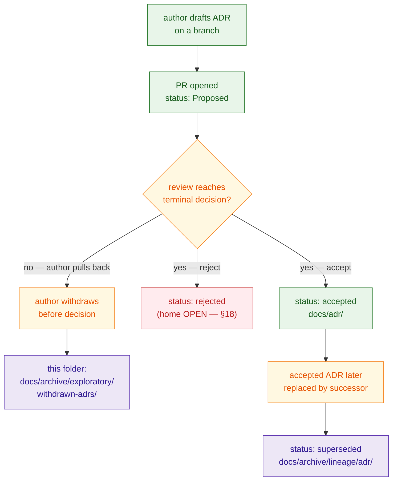
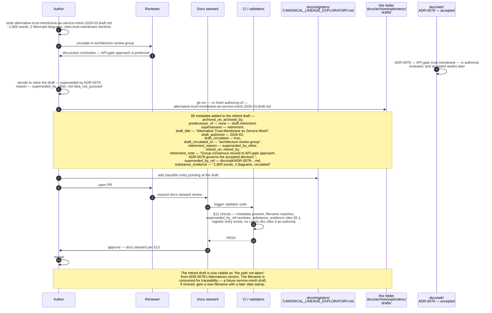

<!--
================================================================================
KFM Meta Block v2
--------------------------------------------------------------------------------
doc_id:             kfm://doc/docs-archive-exploratory-withdrawn-adrs-readme
title:              docs/archive/exploratory/withdrawn-adrs — Folder README
class:              folder README (README-like) · archive leaf bucket
status:             draft
truth_posture:      cite-or-abstain
governance_layer:   docs/ control plane · archive authority class · exploratory bucket
proposed_path:      docs/archive/exploratory/withdrawn-adrs/README.md   (PROPOSED)
directory_rule:     §6.1 (docs/archive/ listed in the docs/ tree),
                    §15  (folder README contract; archive authority class),
                    §2.4 (ADR template fields; status enum
                          proposed | accepted | superseded | rejected),
                    §17  (subfolder set changes are ADR-class).
parent_readme:      ../../README.md  (docs/archive/)
sibling_readmes:    ../README.md             (docs/archive/exploratory/)
                    ../idea-packets/README.md (PROPOSED sibling under exploratory/)
                    ../drafts/README.md       (PROPOSED sibling under exploratory/)
                    ../../lineage/adr/README.md  (PROPOSED — sibling under lineage/;
                    holds superseded ADRs, not withdrawn ones; see §4 for the split)
related_doctrine:   ../../../doctrine/directory-rules.md  (§2.4 ADR rules)
                    ../../../doctrine/lifecycle-law.md
                    ../../../doctrine/truth-posture.md
related_registers:  ../../../registers/CANONICAL_LINEAGE_EXPLORATORY.md  (classifier)
                    ../../../registers/DRIFT_REGISTER.md
                    ../../../registers/VERIFICATION_BACKLOG.md
related_adr_homes:  ../../../adr/   (CONFIRMED doctrinally; mounted-repo
                    presence UNKNOWN — holds accepted ADRs)
related_open_adrs:  Atlas v1.1 §24.12 "Master Open-ADR Backlog" (ADR-S-01
                    through ADR-S-15) — candidates that may produce
                    proposed ADRs; any that are later withdrawn land here.
spec_hash:          NEEDS VERIFICATION (generated at release time).
owners:             <PLACEHOLDER — docs steward; do not invent>
created:            <YYYY-MM-DD — set on PR>
updated:            <YYYY-MM-DD — set on PR>
policy_label:       public
tags:               [kfm, docs, archive, exploratory, adr, withdrawn,
                    directory-rules, README]
notes:              Authored docs-only; no mounted repo, ADR set, register
                    state, or CI run inspected. Every implementation-layer
                    claim (paths, validator names, sibling-README presence)
                    is PROPOSED until mounted-repo verification. "Withdrawn"
                    is NOT in the formal ADR status enum (§2.4 lists
                    proposed | accepted | superseded | rejected); it is a
                    KFM-doctrine bucket name for proposed-ADRs that the
                    author pulled back before review reached a decision.
                    See §4 for the full disambiguation.
================================================================================
-->

<a id="top"></a>

# docs/archive/exploratory/withdrawn-adrs

> **One-line purpose.** Proposed ADRs that were drafted, opened for review, and then **voluntarily pulled back by the author before reaching `accepted` or `rejected`**. They are retained here as lineage evidence of "what was considered and consciously not pursued," distinct from superseded ADRs (which live in [`../../lineage/adr/`](../../lineage/adr/)) and from rejected ADRs (whose home is open — see [§4](#4-adr-status-states-and-where-each-lands) and [§18](#18-open-questions)).

[](../../../doctrine/directory-rules.md)
[](../README.md)
[](#3-status)
[](../../../doctrine/directory-rules.md)
[](#9-conventions)
[](#20-last-reviewed)
[](../../../../LICENSE)

---

## 📑 Contents

- [1. Purpose](#1-purpose)
- [2. Authority level](#2-authority-level)
- [3. Status](#3-status)
- [4. ADR status states and where each lands](#4-adr-status-states-and-where-each-lands)
- [5. What belongs here](#5-what-belongs-here)
- [6. What does NOT belong here](#6-what-does-not-belong-here)
- [7. ADR lifecycle and the withdrawal path](#7-adr-lifecycle-and-the-withdrawal-path)
- [8. Directory tree](#8-directory-tree)
- [9. Conventions](#9-conventions)
- [10. Inputs](#10-inputs)
- [11. Outputs](#11-outputs)
- [12. Validation](#12-validation)
- [13. Review burden](#13-review-burden)
- [14. Anti-patterns](#14-anti-patterns)
- [15. Related folders](#15-related-folders)
- [16. ADRs governing this folder](#16-adrs-governing-this-folder)
- [17. FAQ](#17-faq)
- [18. Open questions](#18-open-questions)
- [19. Worked example — one withdrawal, end to end](#19-worked-example--one-withdrawal-end-to-end)
- [20. Last reviewed](#20-last-reviewed)

---

## 1. Purpose

This folder holds **proposed-but-withdrawn ADRs**: drafts that were authored, opened for review under `status: proposed`, and then **withdrawn by their author before review reached a terminal decision**. They are preserved here for four reasons:

1. **Inference history.** A future contributor reading the corpus should be able to discover that a question was considered, what shape the answer took, and why the author pulled back — so the same ground is not re-explored without learning.
2. **Lineage for register entries.** [`docs/registers/CANONICAL_LINEAGE_EXPLORATORY.md`](../../../registers/CANONICAL_LINEAGE_EXPLORATORY.md) *(PROPOSED)* classifies these files; the register points here for the actual content.
3. **Distinct closure semantics.** Withdrawal is **not** the same as rejection or supersession (see [§4](#4-adr-status-states-and-where-each-lands)). Each terminal state has its own home; mixing them collapses the meaning of "what happened to this ADR."
4. **Reversibility insurance.** If a withdrawn idea is later revived, the new ADR can cite the original draft as background — provided the original is still findable.

> [!IMPORTANT]
> Withdrawal is a **voluntary pull-back by the author**, executed before the review process produced an accepted/rejected decision. It is not a status the review committee can assign on someone's behalf. If review reached a decision, the ADR is either `accepted` (lives at `docs/adr/`) or `rejected` (disposition open — see [§4](#4-adr-status-states-and-where-each-lands) and [§18](#18-open-questions)).

[↑ Back to top](#top)

---

## 2. Authority level

`archive` (per Directory Rules §15 enumeration of folder authority classes: `Canonical | implementation-bearing | generated | compatibility | archive | exploratory`), inside the **`exploratory/` bucket** of [`docs/archive/`](../../README.md).

This class means:

- Content here is **never the source of a current decision.** A current doc that needs to cite something here MUST do so as historical inference, not as authority. Per the parent archive README, an authority citation that resolves to `docs/archive/**` is an anti-pattern (see [§14](#14-anti-patterns)).
- Content here is **immutable except for metadata corrections.** No editing the body to "improve" an old withdrawn ADR. If the idea returns, it returns as a **new** ADR draft at `docs/adr/`, citing the withdrawn predecessor.
- The folder follows the **append-mostly** discipline of the parent archive: files arrive when withdrawal occurs; they do not leave.

---

## 3. Status

**PROPOSED.** This folder and its README are designed per Directory Rules §6.1 and the parent [`docs/archive/`](../../README.md) §6 layout, but their presence in the mounted repository has not been verified in this session. Treat every specific path inside as `PROPOSED` until inspection confirms it.

[↑ Back to top](#top)

---

## 4. ADR status states and where each lands

> [!IMPORTANT]
> This is the doctrinally most important section of this README. The KFM corpus uses three closure semantics that look similar and must not be confused. The formal ADR `status` enum from Directory Rules §2.4 is `proposed | accepted | superseded | rejected`. **"Withdrawn" is not in that enum** — it is a KFM-doctrine bucket name for one specific transition out of `proposed`.

| Closure | Who triggers it | Formal status (§2.4) | Lives in | This folder? |
|---|---|---|---|---|
| **Accepted** | Review process produced a "yes" decision; ADR signed in. | `accepted` | [`docs/adr/`](../../../adr/) (canonical home) | No. |
| **Superseded** | Was previously `accepted`; a successor ADR replaces it; predecessor retained with `status: superseded` and a forward link. | `superseded` | [`docs/archive/lineage/adr/`](../../lineage/adr/) | No. |
| **Rejected** | Review process produced a "no" decision; ADR formally declined. | `rejected` | **OPEN** — see [§18](#18-open-questions). Candidate homes: `docs/archive/exploratory/withdrawn-adrs/` (this folder; with `closure_kind: rejected`) **or** a sibling `rejected-adrs/` bucket. | Pending ADR. |
| **Withdrawn** | Author voluntarily pulled the ADR back **before** review reached a decision. | (not in the §2.4 enum) | **`docs/archive/exploratory/withdrawn-adrs/` — this folder.** | **Yes.** |
| **Never opened** | Idea considered but no ADR draft ever written (e.g., an entry from Atlas §24.12 *Master Open-ADR Backlog*). | n/a | Stays in the backlog / `docs/intake/` / `exploratory/idea-packets/`. | No. |

### 4.1 Why the distinction matters

- **Accepted vs. superseded:** an accepted ADR is *current authority*; a superseded ADR is *prior authority retained for lineage*. Conflating them breaks the supersession chain that lets reviewers walk doctrinal history.
- **Rejected vs. withdrawn:** rejection is a **decision by the reviewers**; withdrawal is a **decision by the author**. A reader who finds an ADR labeled "withdrawn" should infer that the author saw something they wanted to rethink (or that the question dissolved before review could rule on it). A reader who finds "rejected" should infer that reviewers explicitly declined the proposal.
- **Withdrawn vs. never-opened:** an entry that lives only in Atlas §24.12 or in `docs/intake/` is a *candidate question*. It is **not** a withdrawn ADR; it never reached `status: proposed`. Filing such an entry here would inflate the withdrawal record and obscure the actual history.

[↑ Back to top](#top)

---

## 5. What belongs here

A file belongs in `docs/archive/exploratory/withdrawn-adrs/` if **all** of the following are true:

1. It was authored as an ADR — i.e., it had a Status line that read **`Proposed`** and a Decision section (per the ADR skeleton in `ai-build-operating-contract.md` §28).
2. It was opened for review (PR opened, ADR id assigned even if temporary, reviewers tagged).
3. The author **voluntarily** moved it out of `proposed` before the review process produced a terminal decision.
4. The reason for withdrawal is recordable (see [§9 Conventions](#9-conventions)).

| Example case | Belongs here? |
|---|---|
| Author drafted an ADR proposing a new schema home, then realized the existing schema home already covers it via ADR-0001; closed the PR with a "withdraw — already resolved" note. | **Yes.** |
| Author proposed an ADR to add a new canonical root, then withdrew it pending more evidence after a reviewer asked for fixtures. | **Yes.** |
| Author opened an ADR, never tagged reviewers, never got it past "draft," closed the PR a week later. | **Yes** (it had `status: proposed`); flag `closure_kind: withdrawn_pre_review`. |
| Reviewers said "no" and the author accepted the rejection. | **No** — that's `rejected`; disposition open per [§18](#18-open-questions). |
| ADR was accepted, then a successor replaced it. | **No** — that's `superseded`; lives in [`../../lineage/adr/`](../../lineage/adr/). |
| Atlas §24.12 names a candidate ADR-S-XX that was never drafted. | **No** — it never reached `proposed`. |

[↑ Back to top](#top)

---

## 6. What does NOT belong here

| Do not place here | Where it goes instead | Why |
|---|---|---|
| **Accepted ADRs** | [`docs/adr/`](../../../adr/) | Accepted ADRs are current authority. |
| **Superseded ADRs** (previously accepted, replaced by successor) | [`../../lineage/adr/`](../../lineage/adr/) | Lineage of accepted authority is its own bucket. |
| **Rejected ADRs** (review process said "no") | Disposition **open** — see [§18](#18-open-questions). Until the ADR is filed, hold rejected ADRs in `docs/adr/` with `status: rejected` per Directory Rules §2.4. | Rejection is a reviewer decision, not author withdrawal. |
| **Candidate ADR questions** (Atlas §24.12 ADR-S-XX entries that were never drafted) | Stay in Atlas §24.12 / `docs/intake/` | A candidate is not a withdrawn ADR; it never reached `proposed`. |
| **Closed idea packets that never became ADRs** | [`../idea-packets/`](../idea-packets/) | Idea packets live in their own sibling bucket. |
| **Never-promoted design sketches / speculative dossiers** | [`../drafts/`](../drafts/) | Drafts live in their own sibling bucket. |
| **Withdrawn schema or policy proposals** | Stay in `schemas/contracts/v1/...` or `policy/...` with a `withdrawn_on` header. | Schema and policy lineage are owned by their respective homes, not by `docs/archive/`. |
| **Active proposed ADRs** (still under review) | [`docs/adr/`](../../../adr/) with `status: proposed` | Don't pre-bury an ADR that is still in play. |
| **Drafts of proposed ADRs** (not yet opened for review) | The author's branch; or `docs/adr/` once opened | A draft that never reaches `status: proposed` cannot be withdrawn from it. |

> [!WARNING]
> The most common drift pattern for this folder is **using it as a graveyard for any ADR-shaped file the author lost interest in.** That is too broad. The four criteria in [§5](#5-what-belongs-here) are the gate.

[↑ Back to top](#top)

---

## 7. ADR lifecycle and the withdrawal path



**Legend.** Green = current canonical state · Amber = transition state · Purple = archive bucket · Red = disposition open (this folder is a candidate home, pending ADR — see [§18](#18-open-questions)).

> [!NOTE]
> The red `rejected` node is intentional: this README does **not** pre-decide where rejected ADRs land. The conservative current default is "hold in `docs/adr/` with `status: rejected`" per Directory Rules §2.4 ("Superseded ADRs MUST be retained with `status: superseded` and a forward link"). A parallel sentence for rejected ADRs is not in the corpus this session and warrants its own ADR.

[↑ Back to top](#top)

---

## 8. Directory tree

> [!WARNING]
> The tree below is **PROPOSED**. Path presence is `NEEDS VERIFICATION` until inspected against the mounted repo. Filenames in the leaf nodes are illustrative.

```text
docs/archive/exploratory/withdrawn-adrs/
├── README.md                                # this file
└── <withdrawn-adr-files>                    # one file per withdrawal
    # Naming convention (PROPOSED, see §9):
    #   ADR-XXXX-<kebab-slug>.withdrawn.md
    # Examples (illustrative; not claims of mounted-repo state):
    #   ADR-0042-rename-data-published-to-data-release.withdrawn.md
    #   ADR-0057-introduce-data-cold-storage-root.withdrawn.md
```

> [!NOTE]
> **Flat structure is intentional.** Unlike `lineage/`, which mirrors the canonical homes it preserves (`lineage/doctrine/`, `lineage/architecture/`, `lineage/adr/`, etc.), this leaf bucket is **flat** because the volume of withdrawn ADRs is small enough that topical subfolders would obscure rather than clarify. Per Directory Rules §17, deepening the tree below this level is ADR-class — see [§16](#16-adrs-governing-this-folder).

[↑ Back to top](#top)

---

## 9. Conventions

Every file in this folder MUST carry a small front-matter block (HTML comment for Markdown ADRs without YAML; YAML front-matter for ADRs that already use it). The block extends the parent archive `§13 Conventions` schema with **withdrawal-specific fields**:

```text
archived_on:           YYYY-MM-DD                # ISO-8601 date
archived_by:           <reviewer or team>        # GitHub handle / "docs steward"
predecessor_of:        none — withdrawn          # always literal for this bucket
supersession:          retirement                # always literal for this bucket
adr_id:                ADR-XXXX                  # the id the ADR carried at draft
adr_title:             <Title>                   # the ADR's H1 title
adr_status_at_withdrawal: proposed               # always literal for this bucket
closure_kind:          withdrawn |               # author pulled back before decision
                       withdrawn_pre_review      # never tagged reviewers / never opened review
withdrawn_on:          YYYY-MM-DD                # ISO-8601 date
withdrawn_by:          <GitHub handle>           # the author who pulled it back
withdrawal_reason:     <one or two sentences>    # required, plain language
related_adrs:          [ADR-YYYY, ADR-ZZZZ]      # optional cross-refs
register_ref:          <anchor in docs/registers/CANONICAL_LINEAGE_EXPLORATORY.md>
reason:                <one or two sentences>    # parent-archive convention; can echo withdrawal_reason
```

### 9.1 Filename convention (PROPOSED)

`ADR-XXXX-<kebab-slug>.withdrawn.md`

- The `ADR-XXXX` prefix preserves the id the ADR carried at draft. **The id is NOT recycled** — even though the ADR did not reach `accepted`, the number is consumed so reviewers reading old PR threads can still locate the artifact unambiguously.
- The `.withdrawn.md` suffix makes the closure semantics visible in directory listings and `git log` output.
- The slug echoes the ADR title in kebab-case, lowercased.

### 9.2 Hard rules

- **Immutability.** Files here are **not edited** except to add or correct the metadata block above. Any content edit is itself a content change and requires a reviewed PR.
- **No id reuse.** If a withdrawn ADR is later revived, the **new** ADR receives a **new** id. The withdrawn predecessor is cited from the new draft's "Alternatives considered" or "Background" section.
- **No cross-archive migration.** A withdrawn ADR does not migrate to `lineage/adr/` if its idea is later adopted; the *current* version is authored fresh in `docs/adr/`, citing this file as background. (Mirror of the parent archive's [§13 cross-archive-moves rule](../../README.md#13-conventions).)
- **No nesting.** Subfolders below this leaf require an ADR per Directory Rules §17.

[↑ Back to top](#top)

---

## 10. Inputs

- **Manual authoring** — the docs steward (or the ADR author) moves the withdrawn ADR file from [`docs/adr/`](../../../adr/) into this folder with `git mv`, adds the §9 metadata, and updates any references.
- **PR close events** — when a proposed-ADR PR is closed without merge and the author marks it as withdrawal in the close comment, an automated workflow *(PROPOSED — see [§12](#12-validation))* may flag the artifact for routing here.
- **Register cross-write** — a corresponding entry in [`docs/registers/CANONICAL_LINEAGE_EXPLORATORY.md`](../../../registers/CANONICAL_LINEAGE_EXPLORATORY.md) *(PROPOSED)* is opened in the same PR.

---

## 11. Outputs

- **Citable withdrawal record** — future ADR drafts can cite the withdrawn predecessor in "Alternatives considered" or "Background."
- **Register evidence** — the classifier register and drift register may cite withdrawn ADRs to explain why a recurring question keeps being raised, or why a particular path was considered and not pursued.
- **Audit trail** — together with [`../../lineage/adr/`](../../lineage/adr/) and [`docs/adr/`](../../../adr/), this folder forms a complete walk of every ADR's terminal state across the project's history.

This folder does **not** emit:

- Authoritative decisions (those live in `docs/adr/` with `status: accepted`).
- Machine-readable indexes (those live in `docs/registers/`).
- Released artifacts of any kind.

[↑ Back to top](#top)

---

## 12. Validation

| Check | Where it runs | Failure mode |
|---|---|---|
| Every file has `closure_kind ∈ {withdrawn, withdrawn_pre_review}`, `withdrawn_on`, `withdrawn_by`, and `withdrawal_reason`. | `tools/validators/docs/archive_metadata/` *(PROPOSED — same validator as the parent archive)* | PR blocked; reviewer must add metadata. |
| Every file's `adr_status_at_withdrawal` is literally `proposed`. | same validator | PR blocked. |
| Every file's filename matches `ADR-\d{4}-[a-z0-9-]+\.withdrawn\.md`. | same validator | PR blocked. |
| Every ADR id appearing here does **not** also appear in `docs/adr/` as `accepted`. | docs link-check workflow *(PROPOSED)* | Drift entry opened. |
| Every file has a matching entry in `docs/registers/CANONICAL_LINEAGE_EXPLORATORY.md`. | register-cross-check workflow *(PROPOSED)* | Drift entry opened. |
| No current doc cites a file in this folder as the **authority** for a current decision. | docs link-check workflow *(PROPOSED)* | Drift entry opened. |
| This README exists and meets Directory Rules §15. | repo-wide README presence scan | Drift candidate. |

> [!NOTE]
> All validator paths above are **PROPOSED**. The validator-home convention is `tools/validators/<area>/` per Directory Rules §7.5; specific names and exit codes are NEEDS VERIFICATION until a validator PR lands.

[↑ Back to top](#top)

---

## 13. Review burden

- **Routine withdrawal of a single ADR** (`git mv` + §9 metadata): docs steward review.
- **Withdrawing an ADR that was already cited by another in-flight draft**: docs steward + the cite-author so the citing draft can be updated.
- **Removing a file from this folder** (i.e., permanent deletion): docs steward + at least one subsystem owner + linked ADR — same rule as the parent archive.
- **Changing this README's structure or rules**: docs steward; if the change alters [§5](#5-what-belongs-here), [§6](#6-what-does-not-belong-here), [§9](#9-conventions), or the relationship to `docs/registers/` and the rejected-ADR disposition in [§18](#18-open-questions), an ADR per Directory Rules §2.4 / §17 is required.

CODEOWNERS reference: *TODO — link once `CODEOWNERS` lines for `docs/archive/exploratory/withdrawn-adrs/**` are added.*

---

## 14. Anti-patterns

| Anti-pattern | Symptom | Fix |
|---|---|---|
| **Withdrawal as silent delete** | Author closes the ADR PR without moving the file here. | Open a follow-up PR that performs the `git mv` and adds the §9 metadata. |
| **Withdrawal-vs-rejection confusion** | A reviewer-rejected ADR ends up here with `closure_kind: withdrawn`. | If the reviewers said "no," the closure is `rejected`, not `withdrawn`. Route per [§4](#4-adr-status-states-and-where-each-lands) / [§18](#18-open-questions). |
| **Edit-in-place archive** | Someone updates the body of a withdrawn ADR to "fix" or "improve" it. | Revert. Files here are immutable except for metadata. If the idea is alive, author a **new** ADR that cites this one. |
| **ADR id recycling** | A new ADR draft re-uses the id from a withdrawn predecessor. | Assign a new id. The old id is consumed for traceability; never reused. |
| **Withdrawn ADR cited as authority** | A current doc cites `docs/archive/exploratory/withdrawn-adrs/...` as the source of a current decision. | The cited withdrawal is not authority. Either cite the accepted ADR that governs the decision, or explain that the current decision is implicit (and consider authoring an ADR). |
| **Bucket misuse for idea packets** | A closed `IDEA_INTAKE` packet that never became an ADR ends up here. | Route to [`../idea-packets/`](../idea-packets/). |
| **Atlas §24.12 candidate buried here** | An entry from the Master Open-ADR Backlog (e.g., ADR-S-04) that was never drafted is filed here as "withdrawn." | A candidate is not a withdrawn ADR. Leave it in the Atlas backlog; route to `docs/intake/` if it warrants an idea packet. |
| **Hidden withdrawal** | The PR is closed but no metadata is recorded; future reviewers cannot tell why the idea was pulled back. | Require `withdrawal_reason` in §9; CI fails closed. |

[↑ Back to top](#top)

---

## 15. Related folders

| Folder | Relationship |
|---|---|
| [`../../README.md`](../../README.md) | **Parent archive README** — governs immutability, supersession rule, metadata conventions inherited by this folder. |
| [`../README.md`](../README.md) *(PROPOSED)* | **Bucket README** for `exploratory/`; describes the bucket's overall purpose. |
| [`../idea-packets/`](../idea-packets/) | Sibling exploratory bucket — closed intake packets that never became ADRs. |
| [`../drafts/`](../drafts/) | Sibling exploratory bucket — never-promoted architecture sketches and dossiers. |
| [`../../lineage/adr/`](../../lineage/adr/) | The **superseded-ADR** bucket. Distinct from this folder per [§4](#4-adr-status-states-and-where-each-lands). |
| [`../../../adr/`](../../../adr/) | The **accepted-ADR** home. Source of withdrawn-ADR files (via `git mv`); also the candidate home for rejected ADRs pending [§18](#18-open-questions). |
| [`../../../intake/`](../../../intake/) | Source of idea packets, not of ADR drafts. |
| [`../../../registers/CANONICAL_LINEAGE_EXPLORATORY.md`](../../../registers/CANONICAL_LINEAGE_EXPLORATORY.md) *(PROPOSED)* | Classifier register that points at files here. |
| [`../../../registers/DRIFT_REGISTER.md`](../../../registers/DRIFT_REGISTER.md) *(PROPOSED)* | May cite withdrawn ADRs to explain a recurring placement question. |
| [`../../../doctrine/directory-rules.md`](../../../doctrine/directory-rules.md) | §2.4 (ADR enum and template); §15 (README contract); §17 (subfolder-set changes are ADR-class). |

[↑ Back to top](#top)

---

## 16. ADRs governing this folder

| ADR | Effect on this folder |
|---|---|
| **PROPOSED ADR** — "Rejected-ADR disposition" | Resolves whether rejected ADRs live (a) here with `closure_kind: rejected`, (b) in a sibling `rejected-adrs/` bucket, or (c) in `docs/adr/` with `status: rejected` per Directory Rules §2.4. See [§18](#18-open-questions). |
| **PROPOSED ADR** — "Withdrawn-ADR id-recycling rule" | Formalizes [§9.2](#9-conventions) "no id reuse" as binding doctrine. |
| **PROPOSED ADR** — "Closure-kind enum for archive metadata" | Locks the closure-kind vocabulary (`withdrawn` · `withdrawn_pre_review` · `rejected` · `superseded` · `retired`) across `docs/archive/**`. |
| Directory Rules §2.4 | Defines the formal ADR status enum (`proposed | accepted | superseded | rejected`); this folder extends it with the KFM-specific "withdrawn" bucket name. |
| Directory Rules §15 | Mandates this README's required-section contract. |
| Directory Rules §17 | Adding, removing, or renaming subfolders here is ADR-class. |

---

## 17. FAQ

<details>
<summary><strong>Is "withdrawn" the same as "rejected"?</strong></summary>

No. **Withdrawn** = the **author** voluntarily pulled the ADR back, usually before reviewers reached a decision. **Rejected** = the **reviewers** explicitly declined the proposal. The two have different signals for future readers and live in different buckets (until the open question in [§18](#18-open-questions) is resolved). See [§4](#4-adr-status-states-and-where-each-lands).

</details>

<details>
<summary><strong>Where do rejected ADRs live?</strong></summary>

This is the headline open question — see [§18](#18-open-questions). The current default, pending ADR resolution, is to **keep rejected ADRs in `docs/adr/` with `status: rejected`** (mirroring the §2.4 rule for superseded ADRs that "MUST be retained with `status: superseded`"). They do **not** auto-migrate into this folder.

</details>

<details>
<summary><strong>An idea was raised in the Atlas §24.12 Open-ADR Backlog (e.g., ADR-S-04) but no ADR was ever drafted. Does it belong here?</strong></summary>

No. A backlog entry that never reached `status: proposed` is not a withdrawn ADR — it is a candidate question. It stays in Atlas §24.12; if it warrants an exploratory packet, that goes to [`../idea-packets/`](../idea-packets/). Filing it here would inflate the withdrawal record and obscure the actual history.

</details>

<details>
<summary><strong>Can a withdrawn ADR be revived later?</strong></summary>

Yes — but as a **new** ADR with a **new** id. The new draft cites this folder in its "Alternatives considered" or "Background" section. The withdrawn predecessor is not edited; the new ADR carries the current thinking, and the lineage is walkable via the citation. (Mirror of the parent archive's cross-archive-migration rule.)

</details>

<details>
<summary><strong>What if the author withdrew the ADR for a trivial reason ("I made a typo, opening fresh")?</strong></summary>

Still file it here, with `closure_kind: withdrawn_pre_review` and a one-sentence `withdrawal_reason`. The folder's purpose is traceability, not litigation; even trivial withdrawals leave a record so future readers can see the full ADR id sequence without gaps.

</details>

<details>
<summary><strong>What if a withdrawn ADR is later cited by an accepted ADR's "Alternatives considered"?</strong></summary>

Excellent outcome. That is exactly the use case the folder serves: the new ADR's `Alternatives` section can link to a real document showing the path not taken. The accepted ADR does **not** move the withdrawn one; it cites it in place.

</details>

<details>
<summary><strong>Are predecessor schemas, policies, or release manifests filed here when their ADR is withdrawn?</strong></summary>

No. Schema lineage stays under `schemas/contracts/v1/...` with a `withdrawn_on` (or `superseded_by`) header per ADR-0001 *(PROPOSED)*. Policy lineage stays under `policy/`. This folder is **exclusively** for the withdrawn ADR's own Markdown document. (Mirror of the parent archive's [§9 not-belongs-here rule](../../README.md#9-what-does-not-belong-here).)

</details>

[↑ Back to top](#top)

---

## 18. Open questions

These are explicitly **not resolved** by this README and should be tracked in [`docs/registers/VERIFICATION_BACKLOG.md`](../../../registers/VERIFICATION_BACKLOG.md) *(PROPOSED)*:

- **NEEDS VERIFICATION:** Does `docs/archive/exploratory/withdrawn-adrs/` exist in the current mounted repo, and at what entrenchment level?
- **NEEDS VERIFICATION:** Does `docs/archive/exploratory/README.md` (the parent bucket README) exist, and does it consistently scope this leaf's contents?
- **OPEN — rejected-ADR disposition (highest priority).** The formal ADR `status` enum (Directory Rules §2.4) includes `rejected`, but the corpus does **not** specify a home for the rejected-ADR file. Three candidate homes:
  1. **Keep in `docs/adr/`** with `status: rejected` — closest parallel to "Superseded ADRs MUST be retained with `status: superseded`."
  2. **Add a sibling `docs/archive/exploratory/rejected-adrs/` bucket** — symmetric with this folder.
  3. **Co-locate in this folder** with `closure_kind: rejected` — minimizes new directories at the cost of overloading the bucket name.

  Recommend an ADR before the situation arises in practice.
- **OPEN — closure-kind enum.** The §9 metadata block introduces `closure_kind ∈ {withdrawn, withdrawn_pre_review}`. If rejected ADRs land here (option 3 above), the enum should be extended to `{withdrawn, withdrawn_pre_review, rejected}`. Either way, the enum should be locked by ADR before any third value is added.
- **OPEN — automation.** Should withdrawal automation be wired (PR close → metadata draft → routing here), or kept manual? Affects [§12](#12-validation).
- **OPEN — relationship to `docs/registers/CANONICAL_LINEAGE_EXPLORATORY.md`.** Every file here should appear in the register; the register's schema is itself PROPOSED. The two should be designed together.

---

## 19. Worked example — one withdrawal, end to end

> **Illustrative only.** Dates, ids, and authors are placeholders. The example shows the **shape** of a correctly-executed withdrawal, not a real event in any mounted repository.

**Scenario.** An author opens `ADR-0042-rename-data-published-to-data-release.md` proposing to rename `data/published/` to `data/release/`. Two days into the review, a reviewer points out that `release/` is already a top-level root with distinct semantics (release decisions, not published artifacts), and the rename would collide. The author agrees, withdraws the ADR, and plans to author a different ADR later focused on clarifying the boundary.



**Counter-example (what NOT to do).**

- ❌ Close the PR with "wrong direction, withdrawing" and never `git mv` the file. *(Hidden withdrawal — anti-pattern [§14](#14-anti-patterns).)*
- ❌ Move the file here but reuse `ADR-0042` for a different proposed ADR a week later. *(ADR id recycling — anti-pattern [§14](#14-anti-patterns).)*
- ❌ Edit the withdrawn file's Decision section a month later to "reflect what we actually decided." *(Edit-in-place archive — anti-pattern [§14](#14-anti-patterns); author the current decision as a **new** ADR that cites this one.)*
- ❌ File it here with `closure_kind: rejected` because "the reviewer's comment essentially rejected it." *(Withdrawal-vs-rejection confusion — anti-pattern [§14](#14-anti-patterns); the author chose to withdraw; reviewers did not formally reject.)*

[↑ Back to top](#top)

---

## 20. Last reviewed

| Item | Value |
|---|---|
| **Last reviewed** | TODO — set on first review pass |
| **Reviewer** | TODO |
| **Next review due** | TODO (default: 6 months after last review per Directory Rules §15) |

---

### Related docs

- [`../../README.md`](../../README.md) — parent archive README (governs immutability and supersession discipline).
- [`../README.md`](../README.md) *(PROPOSED)* — `exploratory/` bucket README.
- [`../../lineage/adr/`](../../lineage/adr/) *(PROPOSED)* — superseded ADRs; the bucket this one is most often confused with.
- [`../../../adr/`](../../../adr/) — accepted ADRs; source of files routed here.
- [`../../../doctrine/directory-rules.md`](../../../doctrine/directory-rules.md) — §2.4 (ADR enum and template), §15 (README contract), §17 (subfolder-set changes are ADR-class).
- [`../../../doctrine/lifecycle-law.md`](../../../doctrine/lifecycle-law.md) *(PROPOSED)* — for contrast with the doctrine lifecycle this folder supports.
- [`../../../registers/CANONICAL_LINEAGE_EXPLORATORY.md`](../../../registers/CANONICAL_LINEAGE_EXPLORATORY.md) *(PROPOSED)* — classifier register.
- [`../../../registers/DRIFT_REGISTER.md`](../../../registers/DRIFT_REGISTER.md) *(PROPOSED)* — drift entries citing withdrawn ADRs.

---

**Last updated:** `<YYYY-MM-DD — set on PR>`
**Doc version:** `v1 (draft)`
**Spec hash:** *NEEDS VERIFICATION (generated at release time).*
**Authority class:** `archive` (within `exploratory/` bucket)

[↑ Back to top](#top)
